# DocuFlow-AI Project - 软件设计文档
生成时间: 2026-01-19 17:54:32

## 目录
1. [概述说明](#1-概述说明)
   - 1.1 [术语与缩略词](#11-术语与缩略词)
2. [系统设计](#2-系统设计)
3. [模块设计](#3-模块设计)
   - 3.1 [账户系统](#31-账户系统)
   - 3.2 [认证系统](#32-认证系统)
   - 3.3 [三代系统](#33-三代系统)
   - 3.4 [账务核心系统](#34-账务核心系统)
   - 3.5 [电子签约平台](#35-电子签约平台)
   - 3.6 [清结算系统](#36-清结算系统)
   - 3.7 [计费中台](#37-计费中台)
   - 3.8 [行业钱包系统](#38-行业钱包系统)
   - 3.9 [业务核心](#39-业务核心)
   - 3.10 [钱包APP/商服平台](#310-钱包APP/商服平台)
   - 3.11 [对账单系统](#311-对账单系统)
4. [接口设计](#4-接口设计)
5. [数据库设计](#5-数据库设计)

---
# 1 概述说明

## 1.1 术语与缩略词


## 角色

- **天财**: 一个特定的商户或机构，是该分账系统的核心合作方和业务发起方。系统专门为其定制了账户、接口和业务流程。
- **总部** (别名: 总店, 发起方): 收单商户中的管理方或品牌方角色。在分账业务中，通常是归集资金的接收方，以及批量付款、会员结算的资金转出方。
- **门店**: 收单商户中的分支机构或下属门店角色。在分账业务中，通常是归集资金的转出方，以及会员结算的资金接收方。

## 业务实体

- **天财收款账户** (别名: 天财专用账户, 专用收款账户): 为天财机构下的收单商户开立的专用账户，用于接收收单交易结算款。类型为行业钱包（非小微钱包），是分账业务的资金转出方。
- **天财接收方账户** (别名: 接收方账户, 天财专用账户): 为分账业务中的资金接收方开立的专用账户，支持绑定多张银行卡并设置默认提现卡。是分账业务的资金转入方之一。
- **收单商户** (别名: 商户): 通过支付系统进行收款交易的商户。在本系统中，根据与天财的关系，可分为总部和门店。
- **待结算账户** (别名: 01账户): 用于临时存放收单交易资金的内部账户，代码为01。在被动结算模式下，资金先进入此账户。
- **退货账户** (别名: 04账户): 用于处理交易退货资金的内部账户，代码为04。在退货时，可能从此账户或天财收款账户扣款。

## 技术术语

- **三代**: 指代系统中的某个核心服务或平台，负责商户管理、开户、分账接口提供等核心业务流程处理。
- **行业钱包系统** (别名: 钱包系统): 负责处理钱包账户相关业务的核心系统，包括天财专用账户管理、关系绑定校验、分账请求处理等。
- **账户系统**: 底层的账户服务系统，负责实际创建和管理天财收款账户、天财接收方账户，并进行底层标记和控制。
- **清结算系统** (别名: 清结算): 负责资金清算和结算的系统，处理结算账户配置、退货查询、账户冻结等。
- **电子签约平台** (别名: 电子签章系统): 负责电子协议签署和认证流程的系统，提供短信模板、H5页面、打款验证、人脸验证及协议签章服务。
- **打款验证**: 一种身份和账户所有权的认证方式。认证系统向目标银行卡打入随机金额，验证回填信息是否正确。
- **人脸验证**: 一种身份认证方式，通过比对姓名、身份证和人脸信息是否一致来完成验证。主要用于个人和个体接收方。
- **主动结算**: 一种结算模式，指收单交易资金结算到商户指定的收款账户（如天财收款账户）。与“被动结算”相对。
- **被动结算**: 一种结算模式，指收单交易资金暂时停留在待结算账户，等待后续指令进行结算。
- **计费中台**: 负责计算分账等业务手续费的系统。根据配置的费率、承担方等规则进行计费处理。
- **业务核心**: 接收并处理“天财分账”交易记录的系统，为对账单提供数据来源。
- **对账单系统**: 生成并提供各类账单的系统，包括账户维度对账单、交易维度对账单，特别是新的“天财分账指令账单”。

## 流程

- **分账** (别名: 转账): 核心业务流程，指将资金从天财收款账户划转至另一个天财收款账户或天财接收方账户。系统定义新的交易类型“天财分账”。
- **归集** (别名: 资金归集): 一种分账场景，指将资金从门店的天财收款账户归集到总部的天财收款账户。
- **批量付款** (别名: 批付): 一种分账场景，指总部从其天财收款账户向多个天财接收方账户进行批量付款。
- **会员结算**: 一种分账场景，指总部从其天财收款账户向门店的天财收款账户进行结算，通常用于会员储值消费后的资金分配。
- **关系绑定** (别名: 签约与认证, 绑定): 在分账前，收付款双方建立授权关系并进行认证签约的流程。包括创建归集关系、批量付款关系、会员结算关系。
- **开通付款**: 在批量付款和会员结算场景下，付方（总部）需要额外进行的一次授权签约流程，完成后其名下的关系绑定才能生效。

---
# 2 系统设计
# 天财分账系统设计文档

## 2.1 系统结构

天财分账系统采用分层、模块化的微服务架构，旨在为机构及商户提供安全、合规、高效的资金分账、归集与结算服务。系统整体遵循“前后端分离、业务与资金分离、流程与执行分离”的设计原则，通过清晰的职责边界和标准化的接口交互，确保系统的可扩展性、可维护性和高可用性。

### 系统架构图 (C4 Container 视图)

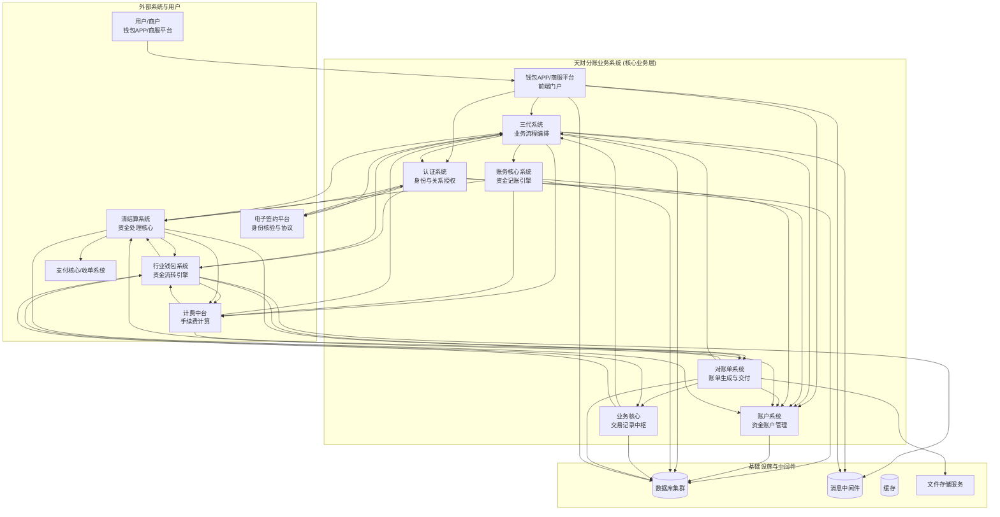
```mermaid
graph TB
    subgraph "外部系统与用户"
        User[用户/商户<br/>钱包APP/商服平台]
        ExtWallet[行业钱包系统<br/>资金流转引擎]
        ExtSettle[清结算系统<br/>资金处理核心]
        ExtESign[电子签约平台<br/>身份核验与协议]
        ExtFee[计费中台<br/>手续费计算]
        ExtAcquiring[支付核心/收单系统]
    end

    subgraph "天财分账业务系统 (核心业务层)"
        APP[钱包APP/商服平台<br/>前端门户]
        AuthSvc[认证系统<br/>身份与关系授权]
        AccountSvc[账户系统<br/>资金账户管理]
        ThirdGenSvc[三代系统<br/>业务流程编排]
        LedgerSvc[账务核心系统<br/>资金记账引擎]
        BizCoreSvc[业务核心<br/>交易记录中枢]
        StatementSvc[对账单系统<br/>账单生成与交付]
    end

    subgraph "基础设施与中间件"
        DB[(数据库集群)]
        MQ[(消息中间件)]
        Cache[(缓存)]
        FileStore[文件存储服务]
    end

    User --> APP
    APP --> ThirdGenSvc
    APP --> AuthSvc
    APP --> AccountSvc

    ThirdGenSvc --> AuthSvc
    ThirdGenSvc --> AccountSvc
    ThirdGenSvc --> LedgerSvc
    ThirdGenSvc --> ExtESign
    ThirdGenSvc --> ExtFee

    AuthSvc --> AccountSvc
    AuthSvc --> ExtESign
    AuthSvc --> ExtSettle
    AuthSvc --> ExtWallet

    LedgerSvc --> AccountSvc
    LedgerSvc --> ExtSettle
    LedgerSvc --> ExtFee

    BizCoreSvc --> ThirdGenSvc
    BizCoreSvc --> ExtWallet

    StatementSvc --> BizCoreSvc
    StatementSvc --> ExtSettle
    StatementSvc --> AccountSvc
    StatementSvc --> ThirdGenSvc
    StatementSvc --> FileStore

    ExtWallet --> ExtSettle
    ExtWallet --> ThirdGenSvc
    ExtWallet --> AccountSvc
    ExtWallet --> ExtFee
    ExtWallet --> BizCoreSvc
    ExtWallet --> MQ

    ExtSettle --> ExtWallet
    ExtSettle --> ThirdGenSvc
    ExtSettle --> AccountSvc
    ExtSettle --> ExtAcquiring
    ExtSettle --> ExtFee
    ExtSettle --> StatementSvc

    ExtESign --> AuthSvc
    ExtFee --> ThirdGenSvc
    ExtFee --> ExtWallet
    ExtFee --> StatementSvc

    %% 内部服务与基础设施连接
    AuthSvc --> DB
    AccountSvc --> DB
    ThirdGenSvc --> DB
    LedgerSvc --> DB
    BizCoreSvc --> DB
    StatementSvc --> DB
    APP --> DB

    ThirdGenSvc --> MQ
    APP --> MQ
```

**架构说明**:
1.  **用户交互层**: 钱包APP/商服平台作为统一前端，封装后端复杂流程，提供用户操作界面。
2.  **核心业务层**: 由多个职责明确的微服务构成，是分账业务逻辑的核心承载层。
    *   **认证系统 (AuthSvc)**: 业务安全入口，负责身份验证、关系绑定与授权。
    *   **账户系统 (AccountSvc)**: 资金流转基石，管理所有业务参与方的专用资金账户。
    *   **三代系统 (ThirdGenSvc)**: 业务流程编排中枢，整合开户、签约、关系绑定、指令发起等流程。
    *   **账务核心系统 (LedgerSvc)**: 资金处理引擎，负责记账、余额管理与交易状态跟踪。
    *   **业务核心 (BizCoreSvc)**: 交易记录中枢，持久化成功交易，为对账提供权威数据源。
    *   **对账单系统 (StatementSvc)**: 数据聚合与交付，生成多维度对账单。
3.  **外部依赖系统**: 与支付体系内其他核心平台紧密协作。
    *   **行业钱包系统**: 最终的资金划转执行者。
    *   **清结算系统**: 处理资金清算、结算及内部账户管理。
    *   **电子签约平台**: 提供合规的身份核验与电子协议服务。
    *   **计费中台**: 提供统一的手续费计算服务。
4.  **基础设施**: 数据库、消息队列、缓存、文件存储等支撑所有服务稳定运行。

## 2.2 功能结构

系统功能围绕“账户-认证-关系-指令-资金-对账”的核心链路进行模块化划分，各模块功能既相对独立又协同运作。

### 功能结构图


```mermaid
graph TD
    Root[天财分账系统] --> F1[用户与门户]
    Root --> F2[账户与认证管理]
    Root --> F3[业务关系与流程]
    Root --> F4[资金处理与记账]
    Root --> F5[计费与对账]
    Root --> F6[系统支撑]

    F1 --> F1.1[用户登录与权限]
    F1 --> F1.2[账户信息概览]
    F1 --> F1.3[业务关系引导与发起]
    F1 --> F1.4[分账指令操作]
    F1 --> F1.5[通知与消息]

    F2 --> F2.1[账户生命周期管理<br/>创建/查询/状态维护]
    F2 --> F2.2[身份认证与核验<br/>打款/人脸/协议]
    F2 --> F2.3[关系绑定与授权<br/>创建/查询/解除]

    F3 --> F3.1[商户信息管理<br/>总部/门店]
    F3 --> F3.2[业务关系管理<br/>归集/批量付款/会员结算]
    F3 --> F3.3[分账指令编排<br/>归集指令发起]
    F3 --> F3.4[业务流程状态跟踪]

    F4 --> F4.1[分账交易执行<br/>创建/冲正]
    F4 --> F4.2[账户余额管理<br/>查询/冻结]
    F4 --> F4.3[资金记账与流水<br/>记账/流水记录]
    F4 --> F4.4[资金划转驱动<br/>调用钱包/清结算]

    F5 --> F5.1[手续费计算<br/>规则管理/试算/实算]
    F5 --> F5.2[业务记录聚合<br/>交易流水持久化]
    F5 --> F5.3[对账单服务<br/>生成/查询/下载/推送]

    F6 --> F6.1[电子签约集成<br/>人脸核验/协议签署]
    F6 --> F6.2[清结算集成<br/>内部账户/结算执行/资金划转]
    F6 --> F6.3[消息与事件驱动]
    F6 --> F6.4[数据存储与缓存]
```

**功能模块说明**:
*   **用户与门户 (F1)**: 面向用户的前端功能集合，提供直观的业务操作界面和引导。
*   **账户与认证管理 (F2)**: 系统安全与合规的基础，确保参与方身份真实、关系有效。
*   **业务关系与流程 (F3)**: 定义和执行业务规则的核心，管理商户、关系及指令的生命周期。
*   **资金处理与记账 (F4)**: 系统最核心的资金操作层，确保每笔资金变动准确、可追溯。
*   **计费与对账 (F5)**: 业务运营支撑，准确计算成本并提供清晰的账务数据。
*   **系统支撑 (F6)**: 集成外部能力和提供基础设施，保障系统间稳定协作。

## 2.3 网络拓扑图

系统部署在私有云或金融级云平台内，网络拓扑遵循金融系统安全规范，划分不同安全区域。

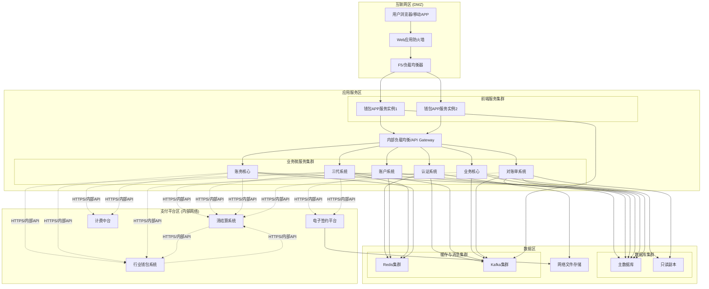
```mermaid
graph TB
    subgraph "互联网区 (DMZ)"
        Client[用户浏览器/移动APP]
        F5[F5/负载均衡器]
        WAF[Web应用防火墙]
    end

    subgraph "应用服务区"
        subgraph "前端服务集群"
            APP1[钱包APP服务实例1]
            APP2[钱包APP服务实例2]
        end
        subgraph "业务微服务集群"
            Svc1[认证系统]
            Svc2[账户系统]
            Svc3[三代系统]
            Svc4[账务核心]
            Svc5[业务核心]
            Svc6[对账单系统]
        end
        LB[内部负载均衡/API Gateway]
    end

    subgraph "数据区"
        subgraph "数据库集群"
            PrimaryDB[主数据库]
            ReadReplica[只读副本]
        end
        subgraph "缓存与消息集群"
            Redis[Redis集群]
            Kafka[Kafka集群]
        end
        NAS[网络文件存储]
    end

    subgraph "支付平台区 (内部网络)"
        Wallet[行业钱包系统]
        Settle[清结算系统]
        ESign[电子签约平台]
        Fee[计费中台]
    end

    Client --> WAF
    WAF --> F5
    F5 --> APP1
    F5 --> APP2

    APP1 --> LB
    APP2 --> LB
    LB --> Svc1
    LB --> Svc2
    LB --> Svc3
    LB --> Svc4
    LB --> Svc5
    LB --> Svc6

    Svc1 --> PrimaryDB
    Svc2 --> PrimaryDB
    Svc3 --> PrimaryDB
    Svc4 --> PrimaryDB
    Svc5 --> PrimaryDB
    Svc6 --> PrimaryDB
    Svc5 --> ReadReplica
    Svc6 --> ReadReplica

    Svc1 --> Redis
    Svc2 --> Redis
    Svc3 --> Redis
    Svc4 --> Redis

    Svc1 --> Kafka
    Svc3 --> Kafka
    Svc5 --> Kafka
    Svc6 --> Kafka
    APP1 --> Kafka

    Svc6 --> NAS
    ESign --> NAS

    Svc1 -.->|HTTPS/内部API| ESign
    Svc3 -.->|HTTPS/内部API| ESign
    Svc3 -.->|HTTPS/内部API| Fee
    Svc4 -.->|HTTPS/内部API| Fee

    Svc2 -.->|HTTPS/内部API| Settle
    Svc3 -.->|HTTPS/内部API| Settle
    Svc4 -.->|HTTPS/内部API| Settle
    Svc6 -.->|HTTPS/内部API| Settle

    Svc3 -.->|HTTPS/内部API| Wallet
    Svc4 -.->|HTTPS/内部API| Wallet
    Svc5 -.->|HTTPS/内部API| Wallet

    Wallet -.->|HTTPS/内部API| Settle
    Settle -.->|HTTPS/内部API| Wallet
```

**拓扑说明**:
1.  **安全隔离**: 通过防火墙划分互联网区、应用服务区、数据区和支付平台区，实施层层防护。
2.  **高可用**: 关键服务（前端、微服务、数据库、缓存、消息队列）均采用集群化部署，消除单点故障。
3.  **负载均衡**: 入口层使用F5硬件负载均衡，内部服务间通过软件负载均衡或API网关进行路由。
4.  **访问控制**: 应用服务区微服务通过内部网络以HTTPS协议调用支付平台区的系统，确保通信安全。
5.  **数据存储**: 核心业务数据使用主从数据库，读写分离提升性能。文件、缓存、消息队列使用专用集群。

## 2.4 数据流转

数据在系统中的流转主要围绕“业务指令驱动资金变动，变动结果形成业务记录，记录聚合生成对账单”这一主线进行。

### 核心业务数据流图 (以资金归集为例)

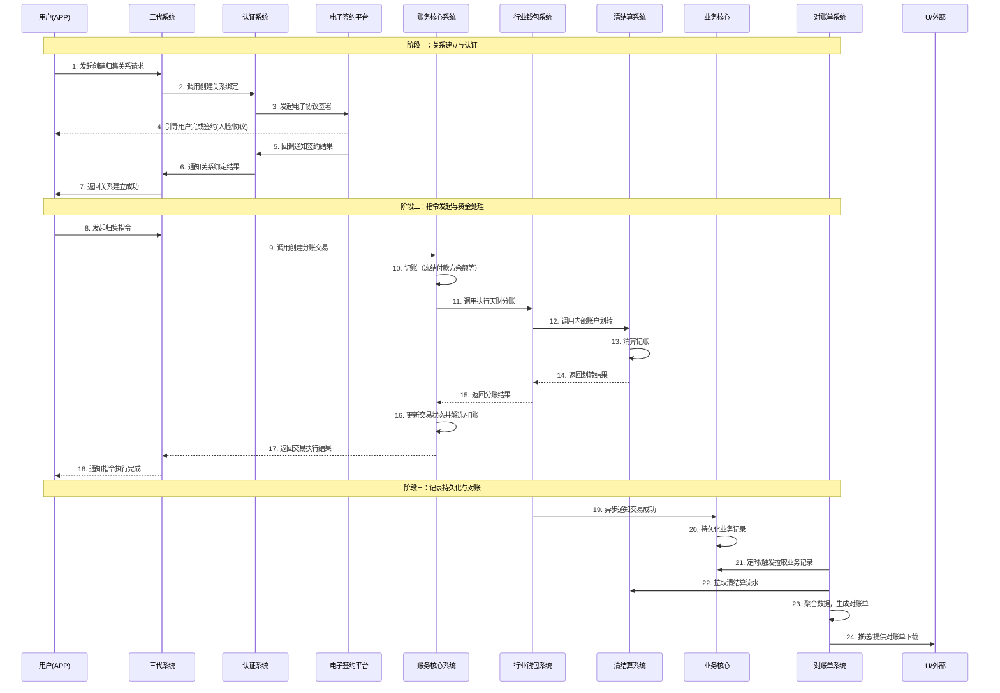
```mermaid
sequenceDiagram
    participant U as 用户(APP)
    participant T as 三代系统
    participant A as 认证系统
    participant E as 电子签约平台
    participant L as 账务核心系统
    participant W as 行业钱包系统
    participant S as 清结算系统
    participant B as 业务核心
    participant St as 对账单系统

    Note over U,St: 阶段一：关系建立与认证
    U->>T: 1. 发起创建归集关系请求
    T->>A: 2. 调用创建关系绑定
    A->>E: 3. 发起电子协议签署
    E-->>U: 4. 引导用户完成签约(人脸/协议)
    E->>A: 5. 回调通知签约结果
    A->>T: 6. 通知关系绑定结果
    T->>U: 7. 返回关系建立成功

    Note over U,St: 阶段二：指令发起与资金处理
    U->>T: 8. 发起归集指令
    T->>L: 9. 调用创建分账交易
    L->>L: 10. 记账（冻结付款方余额等）
    L->>W: 11. 调用执行天财分账
    W->>S: 12. 调用内部账户划转
    S->>S: 13. 清算记账
    S-->>W: 14. 返回划转结果
    W-->>L: 15. 返回分账结果
    L->>L: 16. 更新交易状态并解冻/扣账
    L-->>T: 17. 返回交易执行结果
    T-->>U: 18. 通知指令执行完成

    Note over U,St: 阶段三：记录持久化与对账
    W->>B: 19. 异步通知交易成功
    B->>B: 20. 持久化业务记录
    St->>B: 21. 定时/触发拉取业务记录
    St->>S: 22. 拉取清结算流水
    St->>St: 23. 聚合数据，生成对账单
    St->>U/外部: 24. 推送/提供对账单下载
```

**数据流关键路径说明**:
1.  **业务配置流**: 用户通过APP发起，经由三代系统、认证系统、电子签约平台，完成商户、账户、关系的创建与认证。数据最终落地到各系统的数据库。
2.  **资金指令流**: 指令从APP发起，经三代系统路由至账务核心。账务核心完成本地记账后，驱动行业钱包和清结算系统完成实际的资金跨账户划转。资金状态在账务核心、钱包、清结算等多个系统中同步更新。
3.  **数据记录流**: 成功的资金交易由行业钱包系统异步通知业务核心进行持久化，形成权威业务流水。对账单系统定时从业务核心和清结算系统拉取数据，进行聚合、加工，生成最终的对账单。

## 2.5 系统模块交互关系

各模块通过定义良好的API进行同步或异步（消息）交互，共同完成复杂的业务流程。下图概括了核心模块间的主要调用与依赖关系。

### 模块交互依赖图

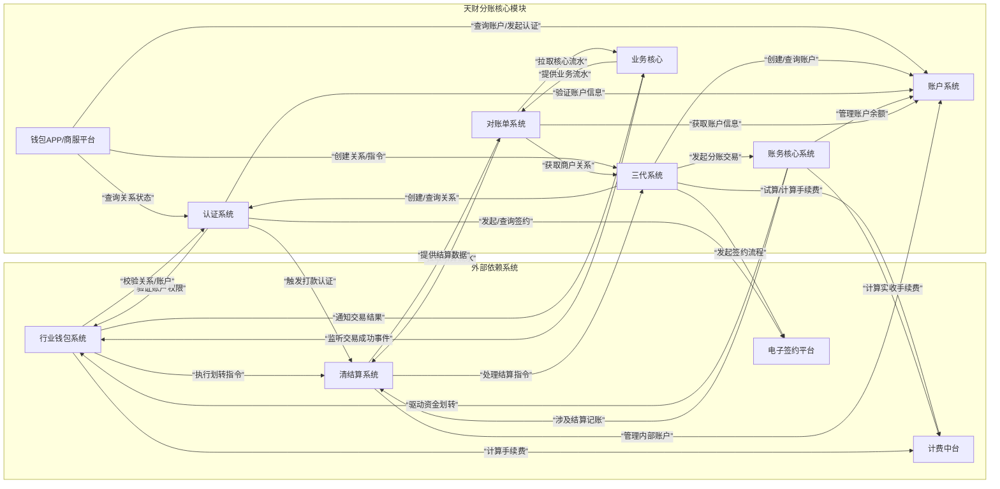
```mermaid
graph LR
    subgraph "外部依赖系统"
        direction LR
        ExtESign[电子签约平台]
        ExtWallet[行业钱包系统]
        ExtSettle[清结算系统]
        ExtFee[计费中台]
    end

    subgraph "天财分账核心模块"
        APP[钱包APP/商服平台]
        Auth[认证系统]
        Account[账户系统]
        ThirdGen[三代系统]
        Ledger[账务核心系统]
        BizCore[业务核心]
        Statement[对账单系统]
    end

    %% APP 交互
    APP -- “创建关系/指令” --> ThirdGen
    APP -- “查询账户/发起认证” --> Account
    APP -- “查询关系状态” --> Auth

    %% 三代系统 核心编排者
    ThirdGen -- “创建/查询关系” --> Auth
    ThirdGen -- “创建/查询账户” --> Account
    ThirdGen -- “发起分账交易” --> Ledger
    ThirdGen -- “发起签约流程” --> ExtESign
    ThirdGen -- “试算/计算手续费” --> ExtFee

    %% 认证系统 安全前置
    Auth -- “验证账户信息” --> Account
    Auth -- “发起/查询签约” --> ExtESign
    Auth -- “触发打款认证” --> ExtSettle
    Auth -- “验证账户权限” --> ExtWallet

    %% 账务核心 资金引擎
    Ledger -- “管理账户余额” --> Account
    Ledger -- “驱动资金划转” --> ExtWallet
    Ledger -- “涉及结算记账” --> ExtSettle
    Ledger -- “计算实收手续费” --> ExtFee

    %% 业务核心 记录中枢
    BizCore -- “监听交易成功事件” --> ExtWallet
    BizCore -- “提供业务流水” --> Statement

    %% 对账单系统 数据聚合
    Statement -- “拉取核心流水” --> BizCore
    Statement -- “拉取结算流水” --> ExtSettle
    Statement -- “获取账户信息” --> Account
    Statement -- “获取商户关系” --> ThirdGen

    %% 行业钱包与清结算 资金执行双核
    ExtWallet -- “校验关系/账户” --> Auth
    ExtWallet -- “执行划转指令” --> ExtSettle
    ExtWallet -- “计算手续费” --> ExtFee
    ExtWallet -- “通知交易结果” --> BizCore

    ExtSettle -- “管理内部账户” --> Account
    ExtSettle -- “处理结算指令” --> ThirdGen
    ExtSettle -- “提供结算数据” --> Statement
```

**交互关系总结**:
*   **三代系统** 是业务流程的**总指挥**，串联了认证、账户、账务、外部签约和计费，是交互最广泛的模块。
*   **认证系统** 和 **账户系统** 是业务的**基石**，几乎所有涉及资金和关系的操作都需要与之交互。
*   **账务核心系统** 是**资金操作**的发起点，连接内部记账与外部资金执行系统（钱包、清结算）。
*   **行业钱包系统** 与 **清结算系统** 是**资金执行**的双核心，负责最终的资金流转和清算，并与其他模块有广泛交互。
*   **业务核心** 与 **对账单系统** 处于业务流程的**下游**，负责记录聚合与输出，强依赖上游的业务和资金模块。
*   **钱包APP/商服平台** 是业务的**起点**和**界面**，主要与三代系统交互，间接驱动整个系统。
---
# 3 模块设计

## 3.1 账户系统


# 账户系统模块设计文档

## 1. 概述

### 1.1 目的
账户系统是底层核心服务，负责为“天财”分账业务创建和管理专用的资金账户，包括**天财收款账户**和**天财接收方账户**。本模块提供账户的创建、查询、标记、状态管理等功能，并确保账户属性符合上层业务（如行业钱包系统、清结算系统）的规则要求，是整个分账业务资金流转的基石。

### 1.2 范围
- **账户创建与管理**：根据业务请求，创建并维护天财专用账户。
- **账户标记与控制**：为账户打上业务标签（如“天财专用”、“分账接收方”），控制其可参与的业务类型。
- **账户关系映射**：存储账户与外部业务实体（如收单商户、门店、个人）的关联关系。
- **状态机管理**：管理账户的生命周期状态（如正常、冻结、注销）。
- **基础查询服务**：为其他系统提供账户信息、状态、关系的查询能力。
- **不包含**：资金记账、余额管理、交易处理、费率计算、签约认证流程。这些由清结算、计费中台、电子签约平台等负责。

## 2. 接口设计

### 2.1 API 端点 (RESTful)

#### 2.1.1 账户创建类
- **POST /api/v1/accounts/payment** - 创建天财收款账户
- **POST /api/v1/accounts/receiver** - 创建天财接收方账户

#### 2.1.2 账户查询类
- **GET /api/v1/accounts/{accountNo}** - 查询账户详情
- **GET /api/v1/accounts** - 根据条件查询账户列表 (支持分页)
- **GET /api/v1/accounts/{accountNo}/relations** - 查询账户绑定的业务关系

#### 2.1.3 账户管理类
- **PATCH /api/v1/accounts/{accountNo}/status** - 更新账户状态 (如冻结、解冻)
- **PATCH /api/v1/accounts/{accountNo}/tags** - 为账户添加或移除业务标签
- **PUT /api/v1/accounts/{accountNo}/default-card** - 设置接收方账户的默认提现卡

### 2.2 输入/输出数据结构

#### 2.2.1 创建天财收款账户请求 (`CreatePaymentAccountRequest`)
```json
{
  "requestId": "req_20231027001",
  "merchantId": "MCH_TC_001",
  "merchantName": "天财示例总部",
  "merchantType": "HEADQUARTERS", // 枚举: HEADQUARTERS, STORE
  "settlementMode": "ACTIVE", // 枚举: ACTIVE, PASSIVE
  "relatedInternalAccount": "01", // 关联的待结算账户代码，被动结算时必填
  "operator": "system",
  "extInfo": {
    "sourceSystem": "WALLET",
    "businessCode": "TC_COLLECTION"
  }
}
```

#### 2.2.2 创建天财接收方账户请求 (`CreateReceiverAccountRequest`)
```json
{
  "requestId": "req_20231027002",
  "receiverId": "RCV_001",
  "receiverName": "张三",
  "receiverType": "INDIVIDUAL", // 枚举: INDIVIDUAL, ENTERPRISE, STORE
  "certType": "ID_CARD",
  "certNo": "310101199001011234",
  "bankCards": [
    {
      "cardNo": "6228480012345678901",
      "bankCode": "ICBC",
      "branchName": "上海浦东支行",
      "isDefault": true
    }
  ],
  "authLevel": "FULL", // 枚举: FULL(已签约), BASIC(仅绑卡)
  "operator": "system",
  "extInfo": {
    "sourceSystem": "WALLET",
    "businessCode": "TC_BATCH_PAY"
  }
}
```

#### 2.2.3 通用账户响应 (`AccountResponse`)
```json
{
  "code": "SUCCESS",
  "message": "操作成功",
  "data": {
    "accountNo": "TC_ACCT_202310270001",
    "accountType": "PAYMENT", // 枚举: PAYMENT, RECEIVER
    "status": "ACTIVE", // 枚举: ACTIVE, FROZEN, CLOSED
    "merchantId": "MCH_TC_001",
    "receiverId": "RCV_001",
    "tags": ["TIANCAI_SPECIAL", "SETTLEMENT_SOURCE"],
    "settlementMode": "ACTIVE",
    "relatedInternalAccount": "01",
    "defaultBankCard": {
      "cardNo": "6228480012345678901",
      "bankCode": "ICBC"
    },
    "createdTime": "2023-10-27T10:00:00Z",
    "updatedTime": "2023-10-27T10:00:00Z"
  }
}
```

### 2.3 发布/消费的事件

#### 2.3.1 发布的事件
- **AccountCreatedEvent**: 账户创建成功时发布。
    ```json
    {
      "eventId": "evt_account_created_001",
      "eventType": "ACCOUNT.CREATED",
      "timestamp": "2023-10-27T10:00:01Z",
      "payload": {
        "accountNo": "TC_ACCT_202310270001",
        "accountType": "PAYMENT",
        "merchantId": "MCH_TC_001",
        "status": "ACTIVE",
        "tags": ["TIANCAI_SPECIAL"]
      }
    }
    ```
- **AccountStatusChangedEvent**: 账户状态变更时发布。
- **AccountTagUpdatedEvent**: 账户标签更新时发布。

#### 2.3.2 消费的事件
- **MerchantSettlementModeChangedEvent** (来自清结算系统): 当商户结算模式变更时，更新对应账户的`settlementMode`和`relatedInternalAccount`。
- **ReceiverAuthenticationCompletedEvent** (来自电子签约平台): 当接收方完成签约认证时，更新对应账户的`authLevel`。

## 3. 数据模型

### 3.1 数据库表设计

#### 表: `tiancai_account` (天财账户主表)
| 字段名 | 类型 | 必填 | 默认值 | 说明 |
|--------|------|------|--------|------|
| `id` | BIGINT(20) | Y | AUTO_INCREMENT | 主键 |
| `account_no` | VARCHAR(32) | Y | | **账户号**，唯一业务标识，格式: TC_ACCT_{日期}{序列} |
| `account_type` | TINYINT(1) | Y | | 账户类型: 1-收款账户，2-接收方账户 |
| `status` | TINYINT(1) | Y | 1 | 状态: 1-正常，2-冻结，3-注销 |
| `merchant_id` | VARCHAR(64) | N | | 关联的收单商户ID (收款账户必填) |
| `receiver_id` | VARCHAR(64) | N | | 关联的接收方ID (接收方账户必填) |
| `settlement_mode` | TINYINT(1) | N | | 结算模式: 1-主动结算，2-被动结算 (收款账户专用) |
| `related_internal_account` | VARCHAR(8) | N | | 关联的内部账户代码，如'01' (被动结算时必填) |
| `auth_level` | TINYINT(1) | N | 0 | 认证等级: 0-未认证，1-基础绑卡，2-完全签约 (接收方账户专用) |
| `version` | INT(11) | Y | 1 | 乐观锁版本号 |
| `created_time` | DATETIME | Y | CURRENT_TIMESTAMP | 创建时间 |
| `updated_time` | DATETIME | Y | CURRENT_TIMESTAMP ON UPDATE | 更新时间 |

**索引**:
- 唯一索引: `uk_account_no` (`account_no`)
- 索引: `idx_merchant_id` (`merchant_id`)
- 索引: `idx_receiver_id` (`receiver_id`)
- 索引: `idx_created_time` (`created_time`)

#### 表: `account_tag` (账户标签表)
| 字段名 | 类型 | 必填 | 默认值 | 说明 |
|--------|------|------|--------|------|
| `id` | BIGINT(20) | Y | AUTO_INCREMENT | 主键 |
| `account_no` | VARCHAR(32) | Y | | 账户号 |
| `tag_code` | VARCHAR(32) | Y | | 标签代码，如: TIANCAI_SPECIAL, SETTLEMENT_SOURCE, RECEIVER_ENABLED |
| `tag_value` | VARCHAR(128) | N | | 标签值 |
| `created_time` | DATETIME | Y | CURRENT_TIMESTAMP | 创建时间 |

**索引**:
- 唯一索引: `uk_account_tag` (`account_no`, `tag_code`)
- 索引: `idx_tag_code` (`tag_code`)

#### 表: `receiver_bank_card` (接收方银行卡表)
| 字段名 | 类型 | 必填 | 默认值 | 说明 |
|--------|------|------|--------|------|
| `id` | BIGINT(20) | Y | AUTO_INCREMENT | 主键 |
| `account_no` | VARCHAR(32) | Y | | 账户号 |
| `card_no` | VARCHAR(32) | Y | | 银行卡号 (加密存储) |
| `bank_code` | VARCHAR(16) | Y | | 银行代码 |
| `branch_name` | VARCHAR(128) | N | | 支行名称 |
| `is_default` | TINYINT(1) | Y | 0 | 是否默认卡: 0-否，1-是 |
| `status` | TINYINT(1) | Y | 1 | 状态: 1-有效，2-已解绑 |
| `created_time` | DATETIME | Y | CURRENT_TIMESTAMP | 创建时间 |
| `updated_time` | DATETIME | Y | CURRENT_TIMESTAMP ON UPDATE | 更新时间 |

**索引**:
- 唯一索引: `uk_account_card` (`account_no`, `card_no`) (当status=1时)
- 索引: `idx_account_default` (`account_no`, `is_default`)

### 3.2 与其他模块的关系
- **行业钱包系统**: 上层业务系统。调用本模块创建账户、查询账户信息。本模块向其发布账户事件。
- **清结算系统**: 配置结算模式、内部账户映射。向本模块发送结算模式变更事件。
- **电子签约平台**: 完成接收方认证。向本模块发送认证完成事件。
- **业务核心/对账单系统**: 查询账户基础信息，用于对账单生成。

## 4. 业务逻辑

### 4.1 核心算法
**账户号生成算法**:
```
TC_ACCT_{YYYYMMDD}{8位序列号}
```
- 日期部分: 账户创建日期
- 序列号: 每日从1开始自增，确保当日唯一
- 全局唯一性: 通过数据库唯一索引保证

### 4.2 业务规则
1. **账户创建规则**:
   - 收款账户: 必须关联有效的`merchantId`，且同一商户同一结算模式下只能有一个有效账户。
   - 接收方账户: 必须关联有效的`receiverId`，且同一接收方只能有一个有效账户。
   - 被动结算的收款账户: 必须填写有效的`relatedInternalAccount`（如'01'待结算账户）。

2. **标签管理规则**:
   - 所有天财专用账户必须打上`TIANCAI_SPECIAL`标签。
   - 收款账户根据结算模式打上`SETTLEMENT_SOURCE`（主动结算）或`SETTLEMENT_TEMP`（被动结算）标签。
   - 完成签约的接收方账户打上`RECEIVER_ENABLED`标签。

3. **状态流转规则**:
   ```
   创建 → 正常(ACTIVE)
            ↓
          冻结(FROZEN) ←→ 正常(ACTIVE)
            ↓
          注销(CLOSED)
   ```
   - 冻结: 可由清结算系统或风控系统触发，账户无法进行资金转出。
   - 解冻: 恢复为正常状态。
   - 注销: 账户永久不可用，需余额为零且无在途交易。

4. **银行卡规则**:
   - 接收方账户必须至少绑定一张有效的银行卡。
   - 有且只有一张卡可标记为默认卡。
   - 默认卡用于提现操作。

### 4.3 验证逻辑
1. **创建请求验证**:
   - 请求ID幂等性检查，防止重复创建。
   - 商户/接收方ID格式校验。
   - 结算模式与内部账户的匹配性校验。
   - 银行卡号Luhn算法校验及银行代码有效性校验。

2. **状态变更验证**:
   - 冻结前检查是否有在途交易（需调用清结算系统接口）。
   - 注销前检查账户余额是否为0（需调用清结算系统接口）。

3. **查询权限验证**:
   - 根据调用方系统标识，限制可查询的账户范围。

## 5. 时序图

### 5.1 创建天财收款账户时序图

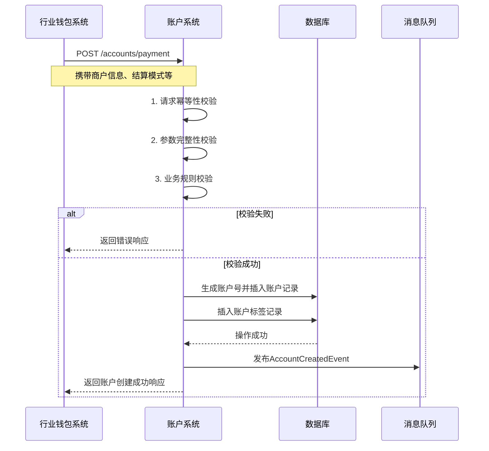
```mermaid
sequenceDiagram
    participant Wallet as 行业钱包系统
    participant Account as 账户系统
    participant DB as 数据库
    participant MQ as 消息队列

    Wallet->>Account: POST /accounts/payment
    Note over Wallet,Account: 携带商户信息、结算模式等
    
    Account->>Account: 1. 请求幂等性校验
    Account->>Account: 2. 参数完整性校验
    Account->>Account: 3. 业务规则校验
    
    alt 校验失败
        Account-->>Wallet: 返回错误响应
    else 校验成功
        Account->>DB: 生成账户号并插入账户记录
        Account->>DB: 插入账户标签记录
        DB-->>Account: 操作成功
        
        Account->>MQ: 发布AccountCreatedEvent
        Account-->>Wallet: 返回账户创建成功响应
    end
```

### 5.2 接收方账户认证状态更新时序图

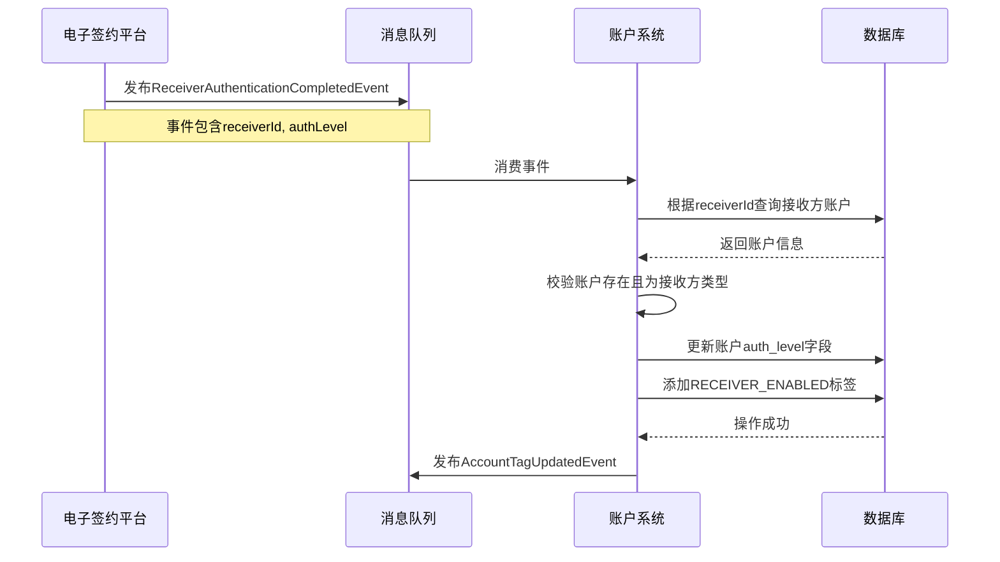
```mermaid
sequenceDiagram
    participant ES as 电子签约平台
    participant MQ as 消息队列
    participant Account as 账户系统
    participant DB as 数据库

    ES->>MQ: 发布ReceiverAuthenticationCompletedEvent
    Note over ES,MQ: 事件包含receiverId, authLevel
    
    MQ->>Account: 消费事件
    Account->>DB: 根据receiverId查询接收方账户
    DB-->>Account: 返回账户信息
    
    Account->>Account: 校验账户存在且为接收方类型
    Account->>DB: 更新账户auth_level字段
    Account->>DB: 添加RECEIVER_ENABLED标签
    DB-->>Account: 操作成功
    
    Account->>MQ: 发布AccountTagUpdatedEvent
```

## 6. 错误处理

### 6.1 预期错误码
| 错误码 | HTTP状态码 | 描述 | 处理建议 |
|--------|------------|------|----------|
| `ACCOUNT_ALREADY_EXISTS` | 409 Conflict | 账户已存在 | 检查请求ID幂等性，或查询已存在账户 |
| `MERCHANT_NOT_FOUND` | 404 Not Found | 商户不存在 | 检查商户ID是否正确，或先创建商户 |
| `INVALID_SETTLEMENT_MODE` | 400 Bad Request | 结算模式无效 | 检查结算模式值，被动结算需提供内部账户 |
| `BANK_CARD_VALIDATION_FAILED` | 400 Bad Request | 银行卡校验失败 | 检查银行卡号格式、银行代码 |
| `ACCOUNT_FROZEN` | 403 Forbidden | 账户已冻结 | 需先解冻账户才能操作 |
| `ACCOUNT_CLOSED` | 403 Forbidden | 账户已注销 | 不可对注销账户进行操作 |
| `DATABASE_CONSTRAINT_VIOLATION` | 500 Internal Server Error | 数据库约束冲突 | 检查唯一性约束，重试或人工介入 |

### 6.2 处理策略
1. **重试策略**: 对于网络超时、数据库死锁等临时性错误，采用指数退避重试。
2. **补偿机制**: 对于分布式事务场景（如创建账户后事件发布失败），提供补偿接口或定期对账修复。
3. **降级策略**: 查询接口在依赖服务不可用时，可返回缓存数据或部分数据，并标记数据可能过时。
4. **监控告警**: 对错误率、延迟等指标设置监控，超过阈值时触发告警。

## 7. 依赖说明

### 7.1 上游依赖
1. **行业钱包系统** (强依赖):
   - **交互方式**: 同步HTTP调用
   - **职责**: 发起账户创建、查询请求，提供业务上下文
   - **降级方案**: 无。账户创建是核心业务流程，必须可用。

2. **清结算系统** (弱依赖):
   - **交互方式**: 异步事件消费 + 同步接口调用
   - **职责**: 提供结算模式配置、账户余额/在途交易状态查询
   - **降级方案**: 状态变更操作可进入待办队列，延迟处理。

3. **电子签约平台** (弱依赖):
   - **交互方式**: 异步事件消费
   - **职责**: 提供接收方认证状态更新
   - **降级方案**: 认证状态更新可延迟，不影响账户基础功能。

### 7.2 下游依赖
1. **消息中间件** (强依赖):
   - **用途**: 发布账户变更事件
   - **影响**: 事件发布失败会影响其他系统的状态同步，需有重试和补偿机制。

2. **数据库** (强依赖):
   - **用途**: 数据持久化
   - **影响**: 数据库不可用将导致所有服务中断，需有主从切换、读写分离方案。

### 7.3 依赖治理
- **超时配置**: 所有外部调用设置合理超时（通常HTTP为3s，数据库为1s）。
- **熔断机制**: 对非核心依赖（如清结算查询接口）配置熔断器，防止级联故障。
- **版本兼容**: API接口保持向后兼容，废弃接口需有足够长的过渡期。

## 3.2 认证系统


# 认证系统模块设计文档

## 1. 概述

### 1.1 目的
认证系统模块是“天财分账”业务的核心前置模块，负责处理所有与身份验证、账户所有权确认及关系授权相关的业务流程。其主要目的是确保分账业务中资金流转的合法性、安全性与合规性，通过建立并管理收付款方之间的可信关系，为后续的分账、归集、批量付款等操作提供授权基础。

### 1.2 范围
本模块涵盖以下核心功能：
- **关系绑定**：为分账的收付款双方（如总部与门店）建立并管理授权关系。
- **身份与账户认证**：通过打款验证、人脸验证等方式，验证接收方身份及其对账户的所有权。
- **协议签署**：集成电子签约平台，完成具有法律效力的电子协议签署。
- **开通付款授权**：为批量付款和会员结算场景下的付款方（总部）提供额外的授权流程。
- **关系状态管理**：维护所有绑定关系的生命周期（创建、认证中、生效、失效、解绑）。

## 2. 接口设计

### 2.1 API端点 (RESTful)

#### 2.1.1 关系绑定类接口
**1. 创建关系绑定 (POST /api/v1/auth/relationships)**
- **描述**：为指定的付款方和接收方创建一种类型的关系绑定（归集、批量付款、会员结算），并触发相应的认证流程。
- **请求头**：`X-Tiancai-Id: [天财ID]`, `Authorization: Bearer [Token]`
- **请求体**：
```json
{
  "relationshipType": "COLLECTION | BATCH_PAYMENT | MEMBER_SETTLEMENT",
  "payerInfo": {
    "payerType": "HEADQUARTERS",
    "payerAccountNo": "天财收款账户号",
    "payerName": "总部商户名称"
  },
  "receiverInfo": {
    "receiverType": "STORE | INDIVIDUAL | CORPORATE",
    "receiverAccountNo": "天财接收方账户号/待绑定银行卡号",
    "receiverName": "接收方名称",
    "idCardNo": "身份证号（个人/个体户必填）",
    "mobile": "手机号（用于打款验证）"
  },
  "bizContext": {
    "sceneCode": "业务场景码",
    "externalRequestId": "外部请求ID"
  }
}
```
- **响应体 (201 Created)**：
```json
{
  "relationshipId": "REL_202310270001",
  "authFlowId": "AUTH_FLOW_001",
  "nextStep": "VERIFICATION_REQUIRED | E_SIGN_REQUIRED",
  "verificationInfo": {
    "method": "TRANSFER_VERIFICATION | FACE_VERIFICATION",
    "h5Url": "https://... (人脸验证H5地址，如适用)"
  }
}
```

**2. 查询关系状态 (GET /api/v1/auth/relationships/{relationshipId})**
- **描述**：查询指定关系绑定的详细状态和进度。
- **响应体**：
```json
{
  "relationshipId": "REL_202310270001",
  "relationshipType": "COLLECTION",
  "status": "CREATED | VERIFYING | E_SIGNING | ACTIVE | INACTIVE | UNBOUND",
  "payerAccountNo": "PAY_ACC_001",
  "receiverAccountNo": "RCV_ACC_001",
  "currentStep": "等待打款验证回填",
  "authRecords": [
    {
      "authType": "TRANSFER_VERIFICATION",
      "status": "SUCCESS",
      "completedAt": "2023-10-27T10:00:00Z"
    }
  ],
  "eSignRecord": {
    "contractId": "CONTRACT_001",
    "status": "PENDING",
    "signUrl": "https://..."
  }
}
```

**3. 解绑关系 (POST /api/v1/auth/relationships/{relationshipId}/unbind)**
- **描述**：解除已生效的关系绑定。需校验无在途资金交易。
- **响应体**：`204 No Content`

#### 2.1.2 认证流程类接口
**1. 提交打款验证回填信息 (POST /api/v1/auth/verifications/transfer-confirm)**
- **描述**：接收方回填打款验证金额，以确认账户所有权。
- **请求体**：
```json
{
  "authFlowId": "AUTH_FLOW_001",
  "relationshipId": "REL_202310270001",
  "receivedAmount": "0.23"
}
```
- **响应体**：
```json
{
  "verified": true,
  "nextStep": "E_SIGN_REQUIRED"
}
```

**2. 人脸验证回调 (POST /api/v1/auth/callback/face-verification)**
- **描述**：接收电子签约平台推送的人脸验证结果。
- **请求体（由电子签平台格式决定）**：
```json
{
  "bizId": "AUTH_FLOW_001",
  "name": "张三",
  "idCardNo": "310xxx...",
  "faceVerified": true,
  "transactionNo": "FACE_TXN_001",
  "verifiedAt": "2023-10-27T10:05:00Z"
}
```
- **响应体**：`{ "received": true }`

**3. 电子协议签署回调 (POST /api/v1/auth/callback/e-sign)**
- **描述**：接收电子签约平台推送的协议签署结果。
- **请求体**：
```json
{
  "contractId": "CONTRACT_001",
  "status": "SIGNED | REJECTED | EXPIRED",
  "signedAt": "2023-10-27T10:30:00Z",
  "signers": [
    {
      "party": "RECEIVER",
      "signed": true
    }
  ],
  "documentUrl": "https://..."
}
```
- **响应体**：`{ "received": true }`

#### 2.1.3 付款方授权接口
**1. 开通付款授权 (POST /api/v1/auth/payer-authorizations)**
- **描述**：总部（付款方）为批量付款或会员结算场景开通付款权限。
- **请求体**：
```json
{
  "payerAccountNo": "PAY_ACC_HQ_001",
  "authorizationType": "BATCH_PAYMENT | MEMBER_SETTLEMENT",
  "bizContext": { ... }
}
```
- **响应体**：与创建关系绑定类似，触发一个包含打款验证（向总部账户）和电子签约的独立授权流程。

### 2.2 发布/消费的事件

#### 2.2.1 发布的事件
- **RelationshipCreatedEvent**: 关系绑定创建。
- **RelationshipActivatedEvent**: 关系绑定完成所有认证，状态变为生效（ACTIVE）。**下游系统（如行业钱包系统）监听此事件，以允许基于此关系的分账交易。**
- **RelationshipUnboundEvent**: 关系解绑。
- **PayerAuthorizationActivatedEvent**: 付款方授权开通完成。

#### 2.2.2 消费的事件
- **AccountCreatedEvent** (来自账户系统)：监听天财收款/接收方账户创建成功，作为关系绑定的前提。
- **SettlementAccountConfiguredEvent** (来自清结算系统)：确认待结算账户(01)配置完成，可能影响归集关系的创建逻辑。

## 3. 数据模型

### 3.1 核心数据库表设计

```sql
-- 1. 关系绑定主表
CREATE TABLE `auth_relationship` (
  `id` bigint(20) NOT NULL AUTO_INCREMENT COMMENT '主键',
  `relationship_id` varchar(64) NOT NULL COMMENT '业务关系ID，全局唯一',
  `relationship_type` varchar(32) NOT NULL COMMENT '关系类型: COLLECTION, BATCH_PAYMENT, MEMBER_SETTLEMENT',
  `status` varchar(32) NOT NULL COMMENT '状态: CREATED, VERIFYING, E_SIGNING, ACTIVE, INACTIVE, UNBOUND',
  `payer_type` varchar(32) NOT NULL COMMENT '付款方类型: HEADQUARTERS',
  `payer_account_no` varchar(64) NOT NULL COMMENT '付款方天财账户号',
  `payer_name` varchar(256) NOT NULL COMMENT '付款方名称',
  `receiver_type` varchar(32) NOT NULL COMMENT '接收方类型: STORE, INDIVIDUAL, CORPORATE',
  `receiver_account_no` varchar(64) NOT NULL COMMENT '接收方天财账户号（绑定后）',
  `receiver_bank_card_no` varchar(64) COMMENT '接收方绑定的银行卡号（用于打款验证）',
  `receiver_name` varchar(256) NOT NULL COMMENT '接收方名称',
  `receiver_id_card_no` varchar(32) COMMENT '接收方身份证号（个人/个体）',
  `receiver_mobile` varchar(32) COMMENT '接收方手机号',
  `tiancai_id` varchar(64) NOT NULL COMMENT '所属天财机构ID',
  `auth_flow_id` varchar(64) COMMENT '本次认证流程ID',
  `biz_context_json` text COMMENT '业务上下文，JSON格式',
  `created_at` datetime NOT NULL DEFAULT CURRENT_TIMESTAMP,
  `updated_at` datetime NOT NULL DEFAULT CURRENT_TIMESTAMP ON UPDATE CURRENT_TIMESTAMP,
  PRIMARY KEY (`id`),
  UNIQUE KEY `uk_relationship_id` (`relationship_id`),
  KEY `idx_payer_account` (`payer_account_no`, `status`),
  KEY `idx_receiver_account` (`receiver_account_no`, `status`),
  KEY `idx_tiancai_status` (`tiancai_id`, `status`)
) ENGINE=InnoDB COMMENT='关系绑定主表';

-- 2. 认证记录表
CREATE TABLE `auth_verification_record` (
  `id` bigint(20) NOT NULL AUTO_INCREMENT,
  `auth_flow_id` varchar(64) NOT NULL COMMENT '认证流程ID',
  `relationship_id` varchar(64) NOT NULL COMMENT '关联关系ID',
  `verification_type` varchar(32) NOT NULL COMMENT '认证类型: TRANSFER_VERIFICATION, FACE_VERIFICATION',
  `status` varchar(32) NOT NULL COMMENT '状态: INITIATED, SUCCESS, FAILED, EXPIRED',
  `request_params` text COMMENT '请求参数（JSON）',
  `response_result` text COMMENT '响应结果（JSON）',
  `thirdparty_ref_no` varchar(128) COMMENT '第三方流水号（打款流水/人脸流水）',
  `expires_at` datetime COMMENT '认证有效期',
  `completed_at` datetime,
  `created_at` datetime NOT NULL DEFAULT CURRENT_TIMESTAMP,
  PRIMARY KEY (`id`),
  KEY `idx_auth_flow` (`auth_flow_id`),
  KEY `idx_relationship` (`relationship_id`)
) ENGINE=InnoDB COMMENT='认证记录表';

-- 3. 电子协议记录表
CREATE TABLE `auth_e_sign_record` (
  `id` bigint(20) NOT NULL AUTO_INCREMENT,
  `contract_id` varchar(128) NOT NULL COMMENT '电子签平台合同ID',
  `relationship_id` varchar(64) NOT NULL COMMENT '关联关系ID',
  `contract_type` varchar(64) NOT NULL COMMENT '协议类型',
  `status` varchar(32) NOT NULL COMMENT '状态: CREATED, PENDING, SIGNED, REJECTED, EXPIRED',
  `initiator` varchar(32) NOT NULL COMMENT '发起方: SYSTEM, PAYER, RECEIVER',
  `signers_json` text NOT NULL COMMENT '签约方信息，JSON数组',
  `document_url` varchar(1024) COMMENT '协议文件存储地址',
  `signed_at` datetime,
  `created_at` datetime NOT NULL DEFAULT CURRENT_TIMESTAMP,
  `updated_at` datetime NOT NULL DEFAULT CURRENT_TIMESTAMP ON UPDATE CURRENT_TIMESTAMP,
  PRIMARY KEY (`id`),
  UNIQUE KEY `uk_contract_id` (`contract_id`),
  KEY `idx_relationship` (`relationship_id`)
) ENGINE=InnoDB COMMENT='电子协议记录表';

-- 4. 付款方授权表
CREATE TABLE `auth_payer_authorization` (
  `id` bigint(20) NOT NULL AUTO_INCREMENT,
  `authorization_id` varchar(64) NOT NULL COMMENT '授权ID',
  `payer_account_no` varchar(64) NOT NULL COMMENT '付款方账户',
  `authorization_type` varchar(32) NOT NULL COMMENT '授权类型: BATCH_PAYMENT, MEMBER_SETTLEMENT',
  `status` varchar(32) NOT NULL COMMENT '状态: CREATED, VERIFYING, E_SIGNING, ACTIVE, INACTIVE',
  `auth_flow_id` varchar(64) COMMENT '关联的认证流程ID',
  `relationship_ids` text COMMENT '与此授权关联的生效关系ID列表（JSON数组）',
  `activated_at` datetime,
  `created_at` datetime NOT NULL DEFAULT CURRENT_TIMESTAMP,
  `updated_at` datetime NOT NULL DEFAULT CURRENT_TIMESTAMP ON UPDATE CURRENT_TIMESTAMP,
  PRIMARY KEY (`id`),
  UNIQUE KEY `uk_authorization_id` (`authorization_id`),
  UNIQUE KEY `uk_payer_type` (`payer_account_no`, `authorization_type`),
  KEY `idx_status` (`status`)
) ENGINE=InnoDB COMMENT='付款方授权表（总部开通付款权限）';
```

### 3.2 与其他模块的关系
- **账户系统**：依赖账户系统提供的天财收款账户、天财接收方账户信息，作为关系绑定的主体。通过事件监听账户创建。
- **行业钱包系统**：认证系统产出`RelationshipActivatedEvent`，钱包系统消费后，在其内部维护可用的分账关系白名单，并在处理分账请求时进行校验。
- **电子签约平台**：通过HTTP调用和回调，委托其完成人脸验证和电子协议签署。
- **清结算系统**：在发起打款验证时，调用清结算系统向目标银行卡打款。同时监听其结算账户配置事件。
- **三代平台**：接收来自三代平台的业务请求（如创建关系绑定），并返回认证流程结果。

## 4. 业务逻辑

### 4.1 核心算法与流程
#### 4.1.1 关系绑定创建与认证主流程
1. **接收创建请求**：校验付款方账户是否存在且状态正常，接收方信息是否完备。
2. **生成认证流程**：根据`receiverType`和`relationshipType`决定认证组合策略：
   - **策略A（门店接收方）**：`打款验证` + `电子签约`。
   - **策略B（个人/个体接收方）**：`人脸验证` + `打款验证` + `电子签约`。
   - **策略C（企业接收方）**：`打款验证` + `电子签约`（可能需要法人人脸验证，根据风控要求）。
3. **发起首步认证**：
   - **打款验证**：调用清结算系统，向`receiver_bank_card_no`打入一笔随机金额（如0.23元），记录流水号。
   - **人脸验证**：调用电子签约平台H5服务，生成人脸验证链接返回给前端。
4. **推进流程**：通过回调接收各步骤结果，顺序推进。只有上一步成功，才能进行下一步。
5. **最终生效**：所有必需认证步骤和电子签约完成后，将`auth_relationship.status`更新为`ACTIVE`，并发布`RelationshipActivatedEvent`。

#### 4.1.2 开通付款授权流程
1. 此流程独立于具体的关系绑定，是针对付款方（总部）账户的一次性授权。
2. 流程与上述类似，但打款验证的目标银行卡是**总部对公账户的预留银行卡**。
3. 授权生效(`ACTIVE`)后，该付款方名下所有对应类型(`BATCH_PAYMENT`或`MEMBER_SETTLEMENT`)的`ACTIVE`关系绑定才真正可用于分账交易。

### 4.2 业务规则
1. **唯一性规则**：同一对付款方和接收方，在同一关系类型下，只能存在一条`ACTIVE`或`VERIFYING/E_SIGNING`状态的关系。
2. **状态机规则**：关系绑定状态严格按`CREATED -> VERIFYING/E_SIGNING -> ACTIVE -> (INACTIVE/UNBOUND)`流转，不可逆（除解绑操作）。
3. **认证有效期**：打款验证回填有效期通常为24小时；人脸验证和电子签约链接有效期由电子签平台设定（如30分钟）。过期后流程失败，需重新发起。
4. **解绑前置条件**：解绑前必须调用行业钱包或业务核心系统，确认没有基于此关系的“在途”分账交易（状态为处理中）。
5. **依赖生效规则**：对于批量付款和会员结算，关系绑定`ACTIVE`且对应的付款方授权`ACTIVE`，两者同时满足，该关系才可实际用于分账。

### 4.3 验证逻辑
1. **请求参数校验**：使用JSR-303进行基础格式校验。
2. **业务校验**：
   - 付款方账户是否存在、是否属于当前天财、状态是否正常（非冻结、注销）。
   - 接收方账户/银行卡是否有效。
   - 根据`relationshipType`和双方身份，校验是否符合业务场景（如归集关系的付款方必须是门店，接收方必须是总部）。
3. **认证结果校验**：
   - 打款验证金额匹配。
   - 人脸验证的三要素（姓名、身份证、人脸）比对结果。
   - 电子签约的签署方身份和签署动作。

## 5. 时序图

### 5.1 创建门店归集关系时序图（策略A）

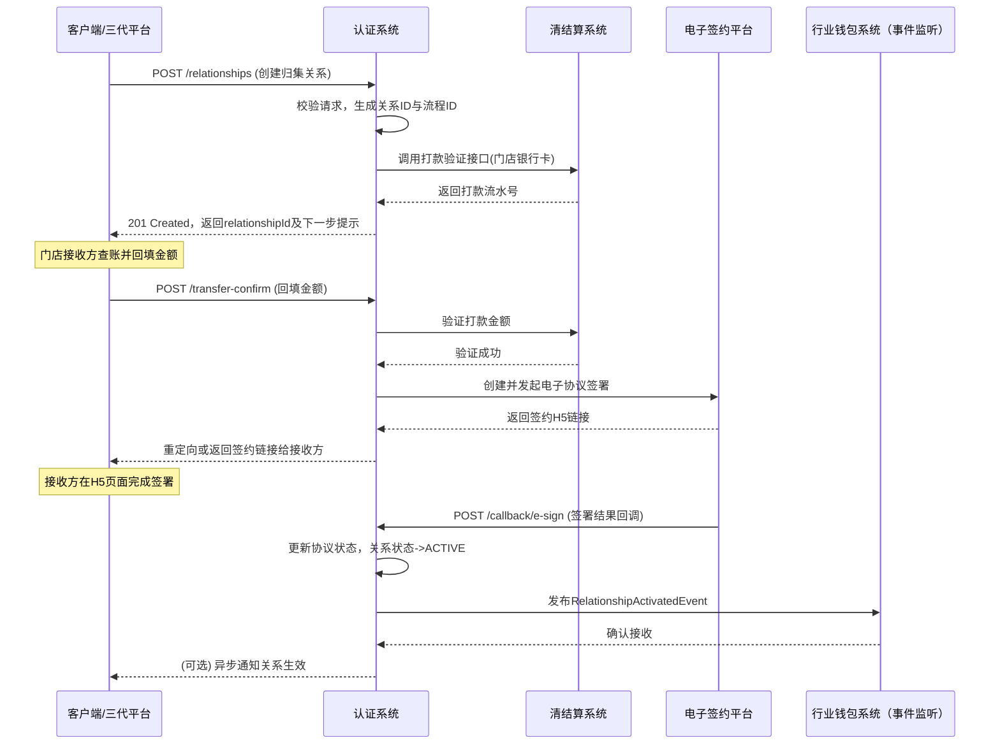
```mermaid
sequenceDiagram
    participant C as 客户端/三代平台
    participant A as 认证系统
    participant S as 清结算系统
    participant E as 电子签约平台
    participant W as 行业钱包系统（事件监听）

    C->>A: POST /relationships (创建归集关系)
    A->>A: 校验请求，生成关系ID与流程ID
    A->>S: 调用打款验证接口(门店银行卡)
    S-->>A: 返回打款流水号
    A-->>C: 201 Created，返回relationshipId及下一步提示

    Note over C: 门店接收方查账并回填金额
    C->>A: POST /transfer-confirm (回填金额)
    A->>S: 验证打款金额
    S-->>A: 验证成功
    A->>E: 创建并发起电子协议签署
    E-->>A: 返回签约H5链接
    A-->>C: 重定向或返回签约链接给接收方

    Note over C: 接收方在H5页面完成签署
    E->>A: POST /callback/e-sign (签署结果回调)
    A->>A: 更新协议状态，关系状态->ACTIVE
    A->>W: 发布RelationshipActivatedEvent
    W-->>A: 确认接收
    A-->>C: (可选) 异步通知关系生效
```

### 5.2 开通付款授权时序图

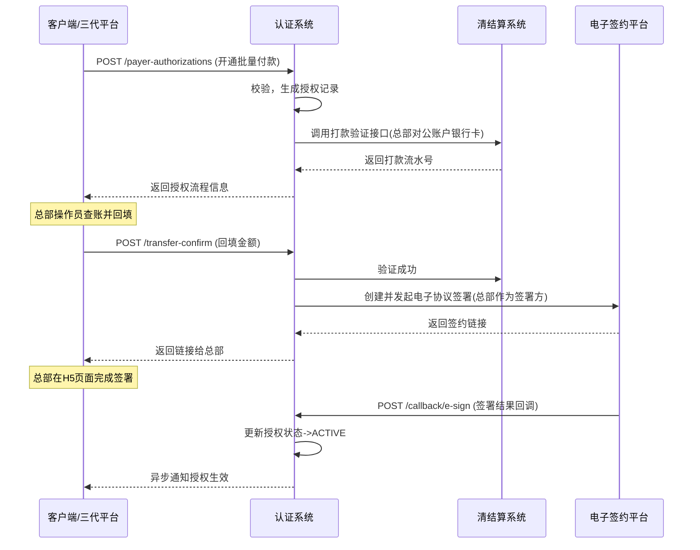
```mermaid
sequenceDiagram
    participant C as 客户端/三代平台
    participant A as 认证系统
    participant S as 清结算系统
    participant E as 电子签约平台

    C->>A: POST /payer-authorizations (开通批量付款)
    A->>A: 校验，生成授权记录
    A->>S: 调用打款验证接口(总部对公账户银行卡)
    S-->>A: 返回打款流水号
    A-->>C: 返回授权流程信息

    Note over C: 总部操作员查账并回填
    C->>A: POST /transfer-confirm (回填金额)
    A->>S: 验证成功
    A->>E: 创建并发起电子协议签署(总部作为签署方)
    E-->>A: 返回签约链接
    A-->>C: 返回链接给总部

    Note over C: 总部在H5页面完成签署
    E->>A: POST /callback/e-sign (签署结果回调)
    A->>A: 更新授权状态->ACTIVE
    A-->>C: 异步通知授权生效
```

## 6. 错误处理

| 错误场景 | 错误码 | 处理策略 | 客户端提示 |
| :--- | :--- | :--- | :--- |
| 请求参数格式错误 | 40001 | 请求拦截，直接返回错误 | “请求参数不合法” |
| 付款方账户不存在或状态异常 | 40002 | 业务校验失败，返回错误 | “付款方账户信息有误” |
| 重复的关系绑定请求 | 40003 | 查询是否存在ACTIVE或处理中的记录 | “已存在相同的关系绑定” |
| 打款验证失败（金额错误） | 40004 | 记录失败次数，超过阈值则流程终止 | “验证金额不正确，请确认” |
| 人脸验证失败 | 40005 | 流程终止，关系状态置为INACTIVE | “身份验证未通过” |
| 电子协议签署被拒绝或超时 | 40006 | 流程终止，关系状态置为INACTIVE | “协议签署未完成” |
| 解绑时存在在途交易 | 40007 | 拒绝解绑请求 | “存在处理中的交易，暂不可解绑” |
| 依赖系统（清结算、电子签）调用超时 | 50001 | 异步重试（最多3次），记录日志告警 | “系统繁忙，请稍后再试” |
| 回调消息验签失败 | 40008 | 记录安全日志，直接丢弃请求 | - |

**重试策略**：对于与外部系统的同步调用（如发起打款），采用有限次数的指数退避重试。对于流程中的步骤，支持人工在管理后台触发“重新认证”。

## 7. 依赖说明

### 7.1 上游模块交互
1. **三代平台**：
   - **交互方式**：同步HTTP调用（创建关系、查询状态）。
   - **职责**：提供业务入口，传递业务上下文(`bizContext`)。
   - **关键点**：认证系统需保证API的幂等性，通常通过`bizContext.externalRequestId`实现。

2. **账户系统**：
   - **交互方式**：同步RPC调用（查询账户状态） + 事件监听(`AccountCreatedEvent`)。
   - **职责**：提供账户实体的存在性、类型、状态等权威信息。

3. **清结算系统**：
   - **交互方式**：同步RPC调用（打款验证发起与确认）。
   - **职责**：执行小额打款并返回精确金额，供验证使用。

4. **电子签约平台**：
   - **交互方式**：同步HTTP调用（发起验证/签约） + 异步HTTP回调（接收结果）。
   - **职责**：提供人脸验证能力和具有法律效力的电子协议签署流程。
   - **关键点**：需严格处理回调接口的**安全性**（IP白名单、签名验证）。

### 7.2 下游模块交互
1. **行业钱包系统**：
   - **交互方式**：事件发布(`RelationshipActivatedEvent`, `RelationshipUnboundEvent`)。
   - **职责**：钱包系统作为分账请求的处理方，必须依据生效的关系绑定进行资金划转。

2. **计费中台 / 业务核心**：
   - **交互方式**：事件发布（可选）。这些系统可能需要知晓关系状态变化，用于风控或计费逻辑。

**总结**：认证系统作为**业务安全与合规的守门员**，其设计核心在于**流程驱动**和**状态管理**。它通过标准化的认证步骤，将分散的外部能力（打款、人脸识别、电子签章）串联成一个可信的业务流程，为整个分账体系奠定安全基础。所有分账交易在发生前，其参与方之间的关系必须在此系统中被明确建立并验证通过。

## 3.3 三代系统


# 三代系统模块设计文档

## 1. 概述

### 1.1 目的
三代系统是“天财分账”业务的核心业务处理平台，作为面向“天财”机构及其收单商户的统一服务门户。它负责整合并编排开户、签约、关系绑定、分账指令发起等核心业务流程，为上层的行业钱包系统、电子签约平台、清结算系统等提供统一的业务入口和流程控制。本模块旨在为“天财”及其商户提供稳定、高效、可扩展的分账业务服务能力。

### 1.2 范围
- **商户与账户管理**：作为业务入口，接收天财的指令，协调创建和管理收单商户、门店信息，并触发账户系统创建对应的天财收款账户。
- **分账关系绑定与签约**：负责处理“归集”、“批量付款”、“会员结算”等场景下的收付款方关系建立，并调用电子签约平台完成必要的认证与协议签署流程。
- **分账指令处理**：接收并处理各类分账指令（归集、批量付款、会员结算），进行业务校验后，转发至行业钱包系统执行资金划转。
- **业务流程编排与状态管理**：管理从关系绑定到分账执行的全流程状态，确保业务的一致性与可追溯性。
- **查询与对账服务**：为商户提供关系查询、指令状态查询服务，并为对账单系统提供业务数据。
- **不包含**：不直接处理资金（由行业钱包和清结算负责）、不直接管理底层账户（由账户系统负责）、不直接执行签约认证（由电子签约平台负责）。

## 2. 接口设计

### 2.1 API 端点 (RESTful)

#### 2.1.1 商户与账户管理
- **POST /api/v1/merchants** - 创建收单商户（总部/门店）信息
- **POST /api/v1/merchants/{merchantId}/payment-account** - 为指定商户创建天财收款账户
- **GET /api/v1/merchants/{merchantId}** - 查询商户详情及关联账户

#### 2.1.2 关系绑定与签约
- **POST /api/v1/relationships/collection** - 创建门店到总部的资金归集关系
- **POST /api/v1/relationships/batch-payment** - 创建总部到接收方的批量付款关系
- **POST /api/v1/relationships/member-settlement** - 创建总部到门店的会员结算关系
- **POST /api/v1/merchants/{merchantId}/open-payment** - 总部开通付款权限（签约）
- **GET /api/v1/relationships** - 根据条件查询关系列表

#### 2.1.3 分账指令处理
- **POST /api/v1/instructions/collection** - 发起资金归集指令
- **POST /api/v1/instructions/batch-payment** - 发起批量付款指令
- **POST /api/v1/instructions/member-settlement** - 发起会员结算指令
- **GET /api/v1/instructions/{instructionId}** - 查询指令状态与详情
- **POST /api/v1/instructions/{instructionId}/retry** - 重试失败指令

#### 2.1.4 查询服务
- **GET /api/v1/business-records** - 查询天财分账业务记录（供对账单系统消费）

### 2.2 输入/输出数据结构

#### 2.2.1 创建收单商户请求 (`CreateMerchantRequest`)
```json
{
  "requestId": "req_mch_20231028001",
  "tiancaiId": "TC_ORG_001",
  "merchantId": "MCH_TC_HQ_001",
  "merchantName": "天财示例品牌总部",
  "merchantType": "HEADQUARTERS",
  "contactName": "李总",
  "contactPhone": "13800138000",
  "settlementMode": "PASSIVE",
  "operator": "tiancai_admin",
  "extInfo": {}
}
```

#### 2.2.2 创建归集关系请求 (`CreateCollectionRelationshipRequest`)
```json
{
  "requestId": "req_rel_col_20231028001",
  "tiancaiId": "TC_ORG_001",
  "storeMerchantId": "MCH_TC_STORE_001",
  "headquartersMerchantId": "MCH_TC_HQ_001",
  "agreementTemplateId": "AGREEMENT_COLLECTION_V1",
  "operator": "tiancai_admin",
  "callbackUrl": "https://callback.tiancai.com/relation/status"
}
```

#### 2.2.3 发起归集指令请求 (`CreateCollectionInstructionRequest`)
```json
{
  "requestId": "req_inst_col_20231028001",
  "tiancaiId": "TC_ORG_001",
  "storeMerchantId": "MCH_TC_STORE_001",
  "headquartersMerchantId": "MCH_TC_HQ_001",
  "amount": 100000,
  "currency": "CNY",
  "businessReferenceNo": "ORDER_202310280001",
  "remark": "门店日终归集",
  "operator": "system_job",
  "extInfo": {
    "sourceSystem": "SETTLEMENT_JOB"
  }
}
```

#### 2.2.4 通用指令响应 (`InstructionResponse`)
```json
{
  "code": "SUCCESS",
  "message": "指令接收成功",
  "data": {
    "instructionId": "INST_COL_202310280001",
    "instructionType": "COLLECTION",
    "status": "PROCESSING",
    "requestId": "req_inst_col_20231028001",
    "payerAccountNo": "TC_ACCT_STORE_001",
    "payeeAccountNo": "TC_ACCT_HQ_001",
    "amount": 100000,
    "currency": "CNY",
    "estimatedFinishTime": "2023-10-28T23:59:59Z",
    "createdTime": "2023-10-28T18:00:00Z"
  }
}
```

#### 2.2.5 天财分账业务记录 (`TiancaiSplitBusinessRecord`)
```json
{
  "recordId": "REC_202310280001",
  "tiancaiId": "TC_ORG_001",
  "instructionId": "INST_COL_202310280001",
  "instructionType": "COLLECTION",
  "businessTime": "2023-10-28T18:00:00Z",
  "completeTime": "2023-10-28T18:00:05Z",
  "payerMerchantId": "MCH_TC_STORE_001",
  "payerAccountNo": "TC_ACCT_STORE_001",
  "payeeMerchantId": "MCH_TC_HQ_001",
  "payeeAccountNo": "TC_ACCT_HQ_001",
  "amount": 100000,
  "currency": "CNY",
  "status": "SUCCESS",
  "fee": 100,
  "feeBearer": "PAYER",
  "businessReferenceNo": "ORDER_202310280001",
  "remark": "门店日终归集"
}
```

### 2.3 发布/消费的事件

#### 2.3.1 发布的事件
- **MerchantCreatedEvent**: 商户信息创建成功时发布。
    ```json
    {
      "eventId": "evt_merchant_created_001",
      "eventType": "MERCHANT.CREATED",
      "timestamp": "2023-10-28T10:00:01Z",
      "payload": {
        "tiancaiId": "TC_ORG_001",
        "merchantId": "MCH_TC_HQ_001",
        "merchantType": "HEADQUARTERS",
        "settlementMode": "PASSIVE"
      }
    }
    ```
- **RelationshipEstablishedEvent**: 分账关系绑定并签约完成时发布。
- **InstructionCreatedEvent**: 分账指令创建成功时发布。
- **InstructionStatusChangedEvent**: 分账指令状态变更时发布（如 PROCESSING -> SUCCESS/FAILED）。

#### 2.3.2 消费的事件
- **AccountCreatedEvent** (来自账户系统): 当天财收款账户或接收方账户创建成功时，更新本系统内的账户关联信息。
- **ReceiverAuthenticationCompletedEvent** (来自电子签约平台): 当接收方完成认证时，更新对应关系的认证状态。
- **AgreementSignedEvent** (来自电子签约平台): 当关系绑定协议签署完成时，激活对应的分账关系。
- **SettlementCompletedEvent** (来自清结算系统): 当分账资金结算完成时，更新指令的最终状态并生成业务记录。

## 3. 数据模型

### 3.1 数据库表设计

#### 表: `tiancai_merchant` (天财收单商户表)
| 字段名 | 类型 | 必填 | 默认值 | 说明 |
|--------|------|------|--------|------|
| `id` | BIGINT(20) | Y | AUTO_INCREMENT | 主键 |
| `tiancai_id` | VARCHAR(32) | Y | | 天财机构ID |
| `merchant_id` | VARCHAR(64) | Y | | **商户ID**，业务唯一标识 |
| `merchant_name` | VARCHAR(128) | Y | | 商户名称 |
| `merchant_type` | TINYINT(1) | Y | | 类型: 1-总部，2-门店 |
| `contact_name` | VARCHAR(64) | N | | 联系人 |
| `contact_phone` | VARCHAR(32) | N | | 联系电话 |
| `settlement_mode` | TINYINT(1) | Y | | 结算模式: 1-主动，2-被动 |
| `status` | TINYINT(1) | Y | 1 | 状态: 1-有效，2-停用 |
| `payment_account_no` | VARCHAR(32) | N | | 关联的天财收款账户号 |
| `created_time` | DATETIME | Y | CURRENT_TIMESTAMP | 创建时间 |
| `updated_time` | DATETIME | Y | CURRENT_TIMESTAMP ON UPDATE | 更新时间 |

**索引**:
- 唯一索引: `uk_merchant_id` (`merchant_id`)
- 索引: `idx_tiancai_id` (`tiancai_id`)
- 索引: `idx_payment_account_no` (`payment_account_no`)

#### 表: `split_relationship` (分账关系表)
| 字段名 | 类型 | 必填 | 默认值 | 说明 |
|--------|------|------|--------|------|
| `id` | BIGINT(20) | Y | AUTO_INCREMENT | 主键 |
| `relationship_no` | VARCHAR(32) | Y | | **关系编号**，格式: REL_{类型}_{日期}{序列} |
| `tiancai_id` | VARCHAR(32) | Y | | 天财机构ID |
| `relationship_type` | TINYINT(1) | Y | | 类型: 1-归集，2-批量付款，3-会员结算 |
| `payer_merchant_id` | VARCHAR(64) | Y | | 付款方商户ID |
| `payer_account_no` | VARCHAR(32) | N | | 付款方账户号 |
| `payee_merchant_id` | VARCHAR(64) | N | | 收款方商户ID (门店或个人) |
| `payee_receiver_id` | VARCHAR(64) | N | | 收款方接收方ID (批量付款用) |
| `payee_account_no` | VARCHAR(32) | N | | 收款方账户号 |
| `agreement_id` | VARCHAR(64) | N | | 电子协议ID |
| `auth_status` | TINYINT(1) | Y | 0 | 认证状态: 0-未签约，1-已签约 |
| `is_active` | TINYINT(1) | Y | 0 | 是否生效: 0-否，1-是 |
| `effective_time` | DATETIME | N | | 生效时间 |
| `expiry_time` | DATETIME | N | | 失效时间 |
| `created_time` | DATETIME | Y | CURRENT_TIMESTAMP | 创建时间 |
| `updated_time` | DATETIME | Y | CURRENT_TIMESTAMP ON UPDATE | 更新时间 |

**索引**:
- 唯一索引: `uk_relationship_no` (`relationship_no`)
- 索引: `idx_payer_merchant` (`payer_merchant_id`, `relationship_type`)
- 索引: `idx_payee_merchant` (`payee_merchant_id`, `relationship_type`)
- 索引: `idx_auth_status` (`auth_status`, `is_active`)

#### 表: `split_instruction` (分账指令表)
| 字段名 | 类型 | 必填 | 默认值 | 说明 |
|--------|------|------|--------|------|
| `id` | BIGINT(20) | Y | AUTO_INCREMENT | 主键 |
| `instruction_id` | VARCHAR(32) | Y | | **指令ID**，格式: INST_{类型}_{日期}{序列} |
| `request_id` | VARCHAR(64) | Y | | 外部请求ID，用于幂等 |
| `tiancai_id` | VARCHAR(32) | Y | | 天财机构ID |
| `instruction_type` | TINYINT(1) | Y | | 类型: 1-归集，2-批量付款，3-会员结算 |
| `relationship_no` | VARCHAR(32) | N | | 关联的关系编号 |
| `payer_account_no` | VARCHAR(32) | Y | | 付款方账户号 |
| `payee_account_no` | VARCHAR(32) | Y | | 收款方账户号 |
| `amount` | DECIMAL(15,2) | Y | | 金额 |
| `currency` | CHAR(3) | Y | CNY | 币种 |
| `status` | TINYINT(1) | Y | 0 | 状态: 0-已接收，1-处理中，2-成功，3-失败，4-已撤销 |
| `business_reference_no` | VARCHAR(64) | N | | 业务参考号 |
| `remark` | VARCHAR(256) | N | | 备注 |
| `fee` | DECIMAL(15,2) | N | | 手续费 |
| `fee_bearer` | TINYINT(1) | N | | 手续费承担方: 1-付款方，2-收款方 |
| `wallet_request_no` | VARCHAR(64) | N | | 钱包系统请求流水号 |
| `error_code` | VARCHAR(32) | N | | 错误码 |
| `error_message` | VARCHAR(512) | N | | 错误信息 |
| `created_time` | DATETIME | Y | CURRENT_TIMESTAMP | 创建时间 |
| `updated_time` | DATETIME | Y | CURRENT_TIMESTAMP ON UPDATE | 更新时间 |
| `completed_time` | DATETIME | N | | 完成时间 |

**索引**:
- 唯一索引: `uk_instruction_id` (`instruction_id`)
- 唯一索引: `uk_request_id` (`request_id`)
- 索引: `idx_payer_account_time` (`payer_account_no`, `created_time`)
- 索引: `idx_status_created` (`status`, `created_time`)

#### 表: `tiancai_business_record` (天财分账业务记录表)
| 字段名 | 类型 | 必填 | 默认值 | 说明 |
|--------|------|------|--------|------|
| `id` | BIGINT(20) | Y | AUTO_INCREMENT | 主键 |
| `record_id` | VARCHAR(32) | Y | | **记录ID**，供对账单系统消费 |
| `instruction_id` | VARCHAR(32) | Y | | 关联的指令ID |
| ... (字段与 `TiancaiSplitBusinessRecord` 数据结构对应) ... |
| `created_time` | DATETIME | Y | CURRENT_TIMESTAMP | 创建时间 |

**索引**:
- 唯一索引: `uk_record_id` (`record_id`)
- 索引: `idx_instruction_id` (`instruction_id`)
- 索引: `idx_business_time` (`business_time`)

### 3.2 与其他模块的关系
- **行业钱包系统**: 下游执行系统。三代系统将校验通过的分账指令转发给钱包系统执行资金划转，并监听其执行结果。
- **账户系统**: 下游依赖。三代系统调用账户系统创建天财收款账户，并消费其账户创建事件以更新本地映射。
- **电子签约平台**: 下游依赖。三代系统调用其进行关系绑定的认证与协议签署，并消费其签约完成事件。
- **清结算系统**: 下游依赖与事件消费者。三代系统依赖其查询账户结算模式等信息，并消费其结算完成事件以完结指令。
- **计费中台**: 下游依赖。在发起分账指令前或后，调用计费中台计算手续费。
- **业务核心/对账单系统**: 上游数据提供者。三代系统生成标准格式的`TiancaiSplitBusinessRecord`，供其消费并生成对账单。

## 4. 业务逻辑

### 4.1 核心算法
**指令ID生成算法**:
```
INST_{TYPE}_{YYYYMMDD}{8位序列号}
```
- `TYPE`: COL-归集, BAP-批量付款, MEM-会员结算
- 序列号: 每日从1开始自增，确保当日唯一。

**关系编号生成算法**:
```
REL_{TYPE}_{YYYYMMDD}{8位序列号}
```
- `TYPE`: COL-归集, BAP-批量付款, MEM-会员结算

### 4.2 业务规则
1. **商户与账户创建规则**:
   - 创建商户信息时，需指定其`merchantType`(总部/门店)和`settlementMode`。
   - 为商户创建天财收款账户时，需根据其`settlementMode`调用账户系统创建对应属性的账户。
   - 一个商户只能关联一个有效的天财收款账户。

2. **关系绑定规则**:
   - **归集关系**: 付款方必须是门店(`merchantType=STORE`)，收款方必须是总部(`merchantType=HEADQUARTERS`)。双方需已存在有效的天财收款账户。
   - **批量付款关系**: 付款方必须是总部。收款方可以是个人或企业接收方（需已在天财平台注册为`receiver`）。需要总部额外完成“开通付款”签约。
   - **会员结算关系**: 付款方必须是总部，收款方必须是门店。需要总部额外完成“开通付款”签约。
   - 关系绑定必须经过电子签约流程，协议签署完成后关系才生效(`is_active=1`)。

3. **分账指令处理规则**:
   - 发起指令前，必须校验对应的分账关系已存在且状态为生效(`is_active=1`)。
   - 付款方账户状态必须为正常(`ACTIVE`)且未被冻结。
   - 需调用计费中台计算手续费，并明确手续费承担方。
   - 指令状态机: `RECEIVED` -> `PROCESSING` -> (`SUCCESS` / `FAILED`)。

4. **“开通付款”规则**:
   - 只有总部商户需要进行“开通付款”签约。
   - 签约完成后，该总部名下所有已绑定的“批量付款”和“会员结算”关系同时生效。

### 4.3 验证逻辑
1. **指令幂等性校验**: 通过`requestId`保证同一业务请求不会创建重复指令。
2. **业务关系有效性校验**: 检查关系是否存在、是否生效、是否在有效期内。
3. **账户状态校验**: 调用账户系统接口，验证付款方账户状态是否正常。
4. **余额/额度校验** (可选): 对于重要场景，可调用清结算系统预检查付款方账户可用余额。
5. **参数边界校验**: 金额大于0，币种支持，商户ID格式等。

## 5. 时序图

### 5.1 创建归集关系并签约时序图

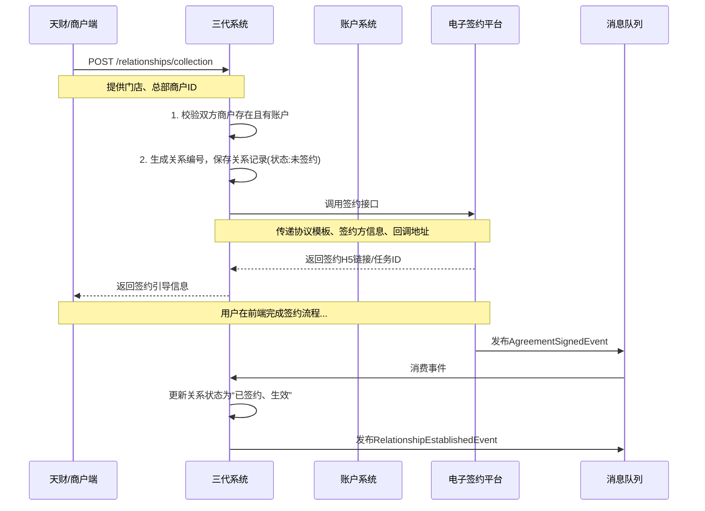
```mermaid
sequenceDiagram
    participant Client as 天财/商户端
    participant Gen3 as 三代系统
    participant Account as 账户系统
    participant ESign as 电子签约平台
    participant MQ as 消息队列

    Client->>Gen3: POST /relationships/collection
    Note over Client,Gen3: 提供门店、总部商户ID

    Gen3->>Gen3: 1. 校验双方商户存在且有账户
    Gen3->>Gen3: 2. 生成关系编号，保存关系记录(状态:未签约)
    
    Gen3->>ESign: 调用签约接口
    Note over Gen3,ESign: 传递协议模板、签约方信息、回调地址
    ESign-->>Gen3: 返回签约H5链接/任务ID
    
    Gen3-->>Client: 返回签约引导信息
    
    Note over Client, ESign: 用户在前端完成签约流程...
    
    ESign->>MQ: 发布AgreementSignedEvent
    MQ->>Gen3: 消费事件
    Gen3->>Gen3: 更新关系状态为“已签约、生效”
    Gen3->>MQ: 发布RelationshipEstablishedEvent
```

### 5.2 处理归集分账指令时序图

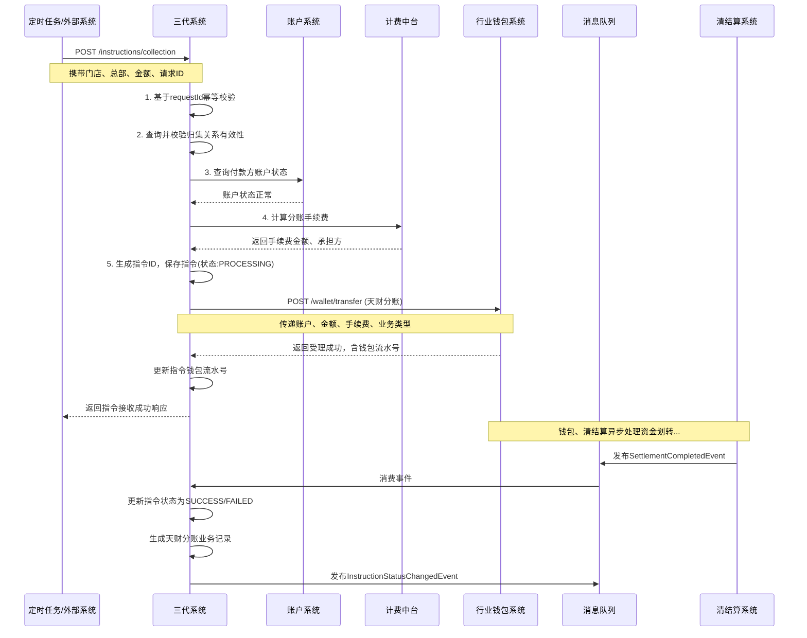
```mermaid
sequenceDiagram
    participant Job as 定时任务/外部系统
    participant Gen3 as 三代系统
    participant Account as 账户系统
    participant Fee as 计费中台
    participant Wallet as 行业钱包系统
    participant MQ as 消息队列
    participant Settle as 清结算系统

    Job->>Gen3: POST /instructions/collection
    Note over Job,Gen3: 携带门店、总部、金额、请求ID

    Gen3->>Gen3: 1. 基于requestId幂等校验
    Gen3->>Gen3: 2. 查询并校验归集关系有效性
    Gen3->>Account: 3. 查询付款方账户状态
    Account-->>Gen3: 账户状态正常
    Gen3->>Fee: 4. 计算分账手续费
    Fee-->>Gen3: 返回手续费金额、承担方
    
    Gen3->>Gen3: 5. 生成指令ID，保存指令(状态:PROCESSING)
    
    Gen3->>Wallet: POST /wallet/transfer (天财分账)
    Note over Gen3,Wallet: 传递账户、金额、手续费、业务类型
    Wallet-->>Gen3: 返回受理成功，含钱包流水号
    
    Gen3->>Gen3: 更新指令钱包流水号
    Gen3-->>Job: 返回指令接收成功响应
    
    Note over Wallet, Settle: 钱包、清结算异步处理资金划转...
    
    Settle->>MQ: 发布SettlementCompletedEvent
    MQ->>Gen3: 消费事件
    Gen3->>Gen3: 更新指令状态为SUCCESS/FAILED
    Gen3->>Gen3: 生成天财分账业务记录
    Gen3->>MQ: 发布InstructionStatusChangedEvent
```

## 6. 错误处理

### 6.1 预期错误码
| 错误码 | HTTP状态码 | 描述 | 处理建议 |
|--------|------------|------|----------|
| `RELATIONSHIP_NOT_FOUND` | 404 Not Found | 分账关系不存在 | 检查关系参数，或先建立关系 |
| `RELATIONSHIP_NOT_ACTIVE` | 403 Forbidden | 分账关系未生效 | 检查关系签约状态，完成签约或开通付款 |
| `ACCOUNT_STATUS_INVALID` | 403 Forbidden | 付款方账户状态异常 | 检查账户是否冻结、注销 |
| `INSUFFICIENT_BALANCE` | 403 Forbidden | 付款方余额不足 | 提示商户充值或减少金额 |
| `FEE_CALCULATION_FAILED` | 500 Internal Server Error | 手续费计算失败 | 检查计费中台状态与配置 |
| `WALLET_SERVICE_UNAVAILABLE` | 503 Service Unavailable | 钱包系统服务异常 | 指令状态置为失败，记录错误，触发告警并支持重试 |
| `DUPLICATE_REQUEST` | 409 Conflict | 重复请求 | 返回已创建指令的信息 |

### 6.2 处理策略
1. **同步调用失败**:
   - 对账户系统、计费中台的查询调用，设置快速失败和重试。若最终失败，指令创建直接返回错误。
   - 对钱包系统的指令下发调用，若超时或失败，指令状态标记为`PROCESSING`但记录错误。依靠后续的`SettlementCompletedEvent`来驱动状态更新，或通过定时任务轮询补偿。

2. **异步事件丢失**:
   - 对于关键的`SettlementCompletedEvent`，若长时间未收到，启动定时任务根据`PROCESSING`状态的指令去清结算系统主动查询并更新状态。

3. **业务补偿**:
   - 提供指令重试接口(`POST /instructions/{id}/retry`)，对于因临时故障失败的指令，在问题解决后可手动或自动重试。
   - 提供指令撤销接口（在特定状态下），并与下游系统协同进行资金冲正。

4. **监控与告警**:
   - 监控指令失败率、平均处理时长、各依赖接口可用性。
   - 当`PROCESSING`状态指令堆积或长时间未完结时触发告警。

## 7. 依赖说明

### 7.1 上游依赖
1. **天财/商户端** (强依赖):
   - **交互方式**: 同步HTTP调用
   - **职责**: 发起商户创建、关系绑定、分账指令等请求。
   - **降级方案**: 写操作无法降级。读操作（查询）可返回缓存数据。

2. **定时任务/外部业务系统** (强依赖):
   - **交互方式**: 同步HTTP调用
   - **职责**: 触发自动化的归集、结算指令。
   - **降级方案**: 指令接收需保证高可用，避免业务积压。

### 7.2 下游依赖
1. **行业钱包系统** (强依赖):
   - **交互方式**: 同步HTTP调用 + 异步事件消费(间接)
   - **职责**: 执行分账资金划转的核心操作。
   - **降级方案**: 无。钱包不可用则分账业务完全中断。需有熔断和快速失败机制，并触发高级别告警。

2. **账户系统** (强依赖):
   - **交互方式**: 同步HTTP调用 + 异步事件消费
   - **职责**: 创建账户、查询账户状态。
   - **降级方案**: 账户创建可排队延迟。账户状态查询失败时可暂时信任本地缓存状态（有一定风险），或拒绝指令。

3. **电子签约平台** (强依赖):
   - **交互方式**: 同步HTTP调用 + 异步事件消费
   - **职责**: 完成关系绑定的认证与签约。
   - **降级方案**: 签约流程可暂停，关系状态保持“未签约”，业务无法进行。

4. **清结算系统** (弱依赖):
   - **交互方式**: 异步事件消费 + 同步接口调用(查询)
   - **职责**: 提供结算结果事件，支持指令状态查询。
   - **降级方案**: 事件延迟消费，指令状态更新依赖主动查询补偿。

5. **计费中台** (弱依赖):
   - **交互方式**: 同步HTTP调用
   - **职责**: 计算手续费。
   - **降级方案**: 可配置默认费率或上次成功费率临时计算，并记录降级日志。

### 7.3 依赖治理
- **超时与重试**:
    - 调用钱包系统: 超时5s，重试2次。
    - 调用账户/计费系统: 超时3s，重试1次。
    - 调用电子签: 超时10s（因涉及用户交互），不重试。
- **熔断与降级**:
    - 对钱包、账户系统配置熔断器，失败率阈值50%，打开后快速失败，定期尝试恢复。
    - 对计费中台配置降级策略，失败时使用默认费率。
- **异步解耦**:
    - 将非实时强依赖（如签约结果、结算结果）通过事件驱动，提高主流程的响应速度和韧性。

## 3.4 账务核心系统


# 账务核心系统模块设计文档

## 1. 概述

### 1.1 目的
账务核心系统是“天财分账”业务的核心资金处理引擎，负责处理所有分账指令的资金记账、余额管理、交易流水记录及状态跟踪。它作为连接**账户系统**（账户载体）与**清结算系统**（资金清算）的桥梁，确保分账业务（归集、批量付款、会员结算）的资金流转准确、一致、可追溯。系统定义并处理新的交易类型“天财分账”。

### 1.2 范围
- **分账指令处理**：接收并执行来自行业钱包系统的分账指令，完成资金从付方账户到收方账户的划转。
- **账户余额管理**：实时维护天财收款账户和天财接收方账户的可用余额、冻结余额。
- **交易流水记录**：生成并持久化每一笔分账交易的明细流水，作为对账、审计和查询的基础。
- **交易状态机管理**：管理分账交易从创建、处理中、成功、失败到冲正的全生命周期。
- **手续费计算触发**：在分账交易处理过程中，触发计费中台进行手续费计算，并记录手续费明细。
- **资金冻结/解冻**：支持业务场景下的资金临时冻结（如退货预扣款）与解冻。
- **与清结算对账**：为清结算系统提供交易明细，完成资金层面的最终核对。
- **不包含**：
    - 账户的创建与管理（由账户系统负责）。
    - 业务逻辑校验与关系绑定（由行业钱包系统负责）。
    - 资金清算、结算与出款（由清结算系统负责）。
    - 手续费率计算（由计费中台负责）。

## 2. 接口设计

### 2.1 API 端点 (RESTful)

#### 2.1.1 分账交易类
- **POST /api/v1/transfers** - 创建并执行分账指令（同步处理或异步受理）
- **GET /api/v1/transfers/{transferId}** - 查询分账交易详情
- **POST /api/v1/transfers/{transferId}/reverse** - 分账冲正（仅限于失败或成功的特定交易）

#### 2.1.2 账户余额类
- **GET /api/v1/accounts/{accountNo}/balance** - 查询账户实时余额（可用余额、冻结余额）
- **POST /api/v1/accounts/{accountNo}/freeze** - 冻结账户部分资金
- **POST /api/v1/accounts/{accountNo}/unfreeze** - 解冻账户已冻结资金

#### 2.1.3 交易查询类
- **GET /api/v1/transfers** - 根据条件（账户、时间、状态）查询分账交易流水（支持分页）

### 2.2 输入/输出数据结构

#### 2.2.1 创建分账指令请求 (`CreateTransferRequest`)
```json
{
  "requestId": "TRANS_REQ_20231028001",
  "bizScene": "COLLECTION", // 业务场景: COLLECTION(归集), BATCH_PAY(批量付款), MEMBER_SETTLE(会员结算)
  "payerAccountNo": "TC_ACCT_202310270001", // 付方账户号
  "payeeAccountNo": "TC_ACCT_202310270002", // 收方账户号
  "amount": 100000, // 分账金额（单位：分）
  "currency": "CNY",
  "bizOrderNo": "ORDER_001", // 上游业务订单号
  "bizRemark": "门店A日终归集",
  "feeBearer": "PAYER", // 手续费承担方: PAYER, PAYEE, SHARED
  "async": false, // 是否异步处理
  "operator": "system",
  "extInfo": {
    "sourceSystem": "WALLET",
    "relationId": "REL_001", // 关联的关系绑定ID
    "originalOrderNo": "PAY_20231028001" // 原始支付订单号（如有）
  }
}
```

#### 2.2.2 分账指令响应 (`TransferResponse`)
```json
{
  "code": "SUCCESS",
  "message": "分账成功",
  "data": {
    "transferId": "TF_20231028000001",
    "requestId": "TRANS_REQ_20231028001",
    "bizScene": "COLLECTION",
    "payerAccountNo": "TC_ACCT_202310270001",
    "payeeAccountNo": "TC_ACCT_202310270002",
    "amount": 100000,
    "fee": 100, // 手续费（单位：分）
    "feeBearer": "PAYER",
    "status": "SUCCESS", // 状态: PROCESSING, SUCCESS, FAILED, REVERSED
    "settleDate": "20231028", // 清算日期
    "completedTime": "2023-10-28T15:30:00Z",
    "transferNo": "20231028153000123456" // 系统唯一交易流水号
  }
}
```

#### 2.2.3 账户余额响应 (`AccountBalanceResponse`)
```json
{
  "code": "SUCCESS",
  "message": "查询成功",
  "data": {
    "accountNo": "TC_ACCT_202310270001",
    "availableBalance": 5000000, // 可用余额（单位：分）
    "frozenBalance": 100000, // 冻结余额（单位：分）
    "totalBalance": 5100000, // 总余额 = 可用 + 冻结
    "currency": "CNY",
    "lastUpdatedTime": "2023-10-28T15:25:00Z"
  }
}
```

### 2.3 发布/消费的事件

#### 2.3.1 发布的事件
- **TransferCreatedEvent**: 分账交易创建并开始处理时发布。
    ```json
    {
      "eventId": "evt_transfer_created_001",
      "eventType": "TRANSFER.CREATED",
      "timestamp": "2023-10-28T15:30:00Z",
      "payload": {
        "transferId": "TF_20231028000001",
        "bizScene": "COLLECTION",
        "payerAccountNo": "TC_ACCT_202310270001",
        "payeeAccountNo": "TC_ACCT_202310270002",
        "amount": 100000,
        "status": "PROCESSING",
        "bizOrderNo": "ORDER_001"
      }
    }
    ```
- **TransferCompletedEvent**: 分账交易成功完成时发布。
- **TransferFailedEvent**: 分账交易失败时发布。
- **AccountBalanceChangedEvent**: 账户余额发生变动时发布。

#### 2.3.2 消费的事件
- **AccountCreatedEvent** (来自账户系统): 当新的天财账户创建时，在本系统初始化对应的余额记录（初始为0）。
- **AccountFrozenEvent** (来自账户系统/清结算系统): 当账户被冻结时，同步更新本系统账户状态，禁止该账户作为付方发起交易。

## 3. 数据模型

### 3.1 数据库表设计

#### 表: `tiancai_transfer` (天财分账交易主表)
| 字段名 | 类型 | 必填 | 默认值 | 说明 |
|--------|------|------|--------|------|
| `id` | BIGINT(20) | Y | AUTO_INCREMENT | 主键 |
| `transfer_id` | VARCHAR(32) | Y | | **交易ID**，唯一业务标识，格式: TF_{YYYYMMDD}{6位序列} |
| `request_id` | VARCHAR(64) | Y | | 上游请求ID，用于幂等 |
| `biz_scene` | VARCHAR(32) | Y | | 业务场景: COLLECTION, BATCH_PAY, MEMBER_SETTLE |
| `payer_account_no` | VARCHAR(32) | Y | | 付方账户号 |
| `payee_account_no` | VARCHAR(32) | Y | | 收方账户号 |
| `amount` | DECIMAL(15,2) | Y | | 交易金额（元，保留2位小数） |
| `currency` | CHAR(3) | Y | CNY | 币种 |
| `status` | TINYINT(1) | Y | 0 | 状态: 0-处理中，1-成功，2-失败，3-已冲正 |
| `fee` | DECIMAL(15,2) | N | 0.00 | 手续费金额（元） |
| `fee_bearer` | TINYINT(1) | N | | 手续费承担方: 1-付方，2-收方，3-双方分摊 |
| `biz_order_no` | VARCHAR(64) | N | | 上游业务订单号 |
| `biz_remark` | VARCHAR(256) | N | | 业务备注 |
| `fail_reason` | VARCHAR(512) | N | | 失败原因 |
| `settle_date` | CHAR(8) | Y | | 清算日期，YYYYMMDD |
| `transfer_no` | VARCHAR(32) | Y | | 系统交易流水号，全局唯一，用于对账 |
| `completed_time` | DATETIME | N | | 交易完成时间（成功/失败/冲正） |
| `version` | INT(11) | Y | 1 | 乐观锁版本号 |
| `created_time` | DATETIME | Y | CURRENT_TIMESTAMP | 创建时间 |
| `updated_time` | DATETIME | Y | CURRENT_TIMESTAMP ON UPDATE | 更新时间 |

**索引**:
- 唯一索引: `uk_transfer_id` (`transfer_id`)
- 唯一索引: `uk_request_id` (`request_id`)
- 唯一索引: `uk_transfer_no` (`transfer_no`)
- 索引: `idx_payer_account` (`payer_account_no`, `created_time`)
- 索引: `idx_payee_account` (`payee_account_no`, `created_time`)
- 索引: `idx_settle_date_status` (`settle_date`, `status`)

#### 表: `account_balance` (账户余额表)
| 字段名 | 类型 | 必填 | 默认值 | 说明 |
|--------|------|------|--------|------|
| `id` | BIGINT(20) | Y | AUTO_INCREMENT | 主键 |
| `account_no` | VARCHAR(32) | Y | | 账户号 |
| `available_balance` | DECIMAL(15,2) | Y | 0.00 | 可用余额（元） |
| `frozen_balance` | DECIMAL(15,2) | Y | 0.00 | 冻结余额（元） |
| `currency` | CHAR(3) | Y | CNY | 币种 |
| `version` | INT(11) | Y | 1 | 乐观锁版本号，用于余额并发更新 |
| `last_updated_time` | DATETIME | Y | CURRENT_TIMESTAMP ON UPDATE | 最后更新时间 |

**索引**:
- 唯一索引: `uk_account_no` (`account_no`)

#### 表: `balance_change_log` (余额变动明细表)
| 字段名 | 类型 | 必填 | 默认值 | 说明 |
|--------|------|------|--------|------|
| `id` | BIGINT(20) | Y | AUTO_INCREMENT | 主键 |
| `log_no` | VARCHAR(32) | Y | | 流水号，格式: BAL_{YYYYMMDD}{序列} |
| `account_no` | VARCHAR(32) | Y | | 账户号 |
| `change_type` | TINYINT(1) | Y | | 变动类型: 1-分账支出，2-分账收入，3-冻结，4-解冻，5-手续费支出 |
| `before_available` | DECIMAL(15,2) | Y | | 变动前可用余额 |
| `before_frozen` | DECIMAL(15,2) | Y | | 变动前冻结余额 |
| `change_amount` | DECIMAL(15,2) | Y | | 变动金额（正数表示增加，负数表示减少） |
| `after_available` | DECIMAL(15,2) | Y | | 变动后可用余额 |
| `after_frozen` | DECIMAL(15,2) | Y | | 变动后冻结余额 |
| `transfer_id` | VARCHAR(32) | N | | 关联的分账交易ID |
| `biz_scene` | VARCHAR(32) | N | | 业务场景 |
| `remark` | VARCHAR(256) | N | | 备注 |
| `created_time` | DATETIME | Y | CURRENT_TIMESTAMP | 创建时间 |

**索引**:
- 唯一索引: `uk_log_no` (`log_no`)
- 索引: `idx_account_time` (`account_no`, `created_time`)
- 索引: `idx_transfer_id` (`transfer_id`)

### 3.2 与其他模块的关系
- **行业钱包系统**: 上游调用方。发起所有分账指令，本系统处理完成后返回结果。
- **账户系统**: 强依赖。校验账户状态、类型，并消费其发布的账户事件以同步状态。
- **清结算系统**: 下游依赖。提供交易明细用于资金清算对账，并接收其发起的账户冻结/解冻指令。
- **计费中台**: 弱依赖。在分账处理过程中同步调用，获取手续费金额。
- **业务核心/对账单系统**: 提供交易流水查询接口，用于生成“天财分账指令账单”。

## 4. 业务逻辑

### 4.1 核心算法
**交易流水号生成算法**:
```
{YYYYMMDD}{HHMMSS}{6位随机数}
```
- 日期时间部分: 交易创建时的本地时间。
- 随机数: 使用分布式序列或随机算法生成，确保全局唯一。
- 全局唯一性: 通过数据库唯一索引保证。

**余额更新算法（基于乐观锁）**:
```java
// 伪代码
boolean updateBalance(String accountNo, BigDecimal deltaAvailable, BigDecimal deltaFrozen) {
    int retry = 0;
    while (retry < MAX_RETRY) {
        AccountBalance balance = selectForUpdate(accountNo); // 或使用乐观锁version
        BigDecimal newAvailable = balance.getAvailableBalance().add(deltaAvailable);
        BigDecimal newFrozen = balance.getFrozenBalance().add(deltaFrozen);
        
        // 余额不足校验（仅对支出和冻结）
        if (deltaAvailable.compareTo(BigDecimal.ZERO) < 0 && newAvailable.compareTo(BigDecimal.ZERO) < 0) {
            throw new InsufficientBalanceException();
        }
        
        int rows = updateBalanceWithVersion(accountNo, newAvailable, newFrozen, balance.getVersion());
        if (rows > 0) {
            // 记录余额变动日志
            insertBalanceChangeLog(...);
            return true;
        }
        retry++;
    }
    throw new ConcurrentUpdateException();
}
```

### 4.2 业务规则
1. **分账交易处理规则**:
   - **付方账户**: 必须是状态正常且非冻结的**天财收款账户**或**天财接收方账户**（仅当作为会员结算的收款方时）。
   - **收方账户**: 必须是状态正常的**天财收款账户**或**天财接收方账户**。
   - **金额**: 必须大于0，且付方可用余额充足。
   - **幂等性**: 基于`requestId`保证，重复请求返回已存在的交易结果。

2. **手续费处理规则**:
   - 在分账交易核心逻辑中，同步调用计费中台获取手续费金额。
   - 根据`feeBearer`字段，决定手续费从付方还是收方账户扣除，或双方分摊。
   - 手续费扣除与分账本金扣除在同一事务中完成。

3. **交易状态流转规则**:
   ```
   创建 → 处理中(PROCESSING)
            ↓
         成功(SUCCESS)
            ↓
         冲正(REVERSED)（仅在特定条件下允许）
           或
         失败(FAILED)（余额不足、账户异常等）
   ```
   - **冲正规则**: 仅对状态为`SUCCESS`且未超过T日（清算日）的交易，经人工审核后可发起冲正。冲正产生一笔反向交易。

4. **余额管理规则**:
   - 账户创建时，自动初始化一条余额记录（0余额）。
   - 所有余额变动必须通过本系统接口，保证流水与余额总分平衡。
   - 冻结资金不可用于分账支出，但解冻后恢复为可用。

### 4.3 验证逻辑
1. **分账指令接收时验证**:
   - `requestId`幂等性检查。
   - 付方、收方账户是否存在、状态是否正常（调用账户系统或查缓存）。
   - 付方账户是否被冻结。
   - 业务场景与账户类型是否匹配（如归集的付方必须是门店收款账户）。
   - 金额格式与范围校验。

2. **交易执行时验证**:
   - 付方可用余额实时校验（通过乐观锁保证一致性）。
   - 依赖服务（计费中台）可用性校验，若不可用可触发降级（如记录待计算，后续补扣）。

## 5. 时序图

### 5.1 同步分账处理时序图

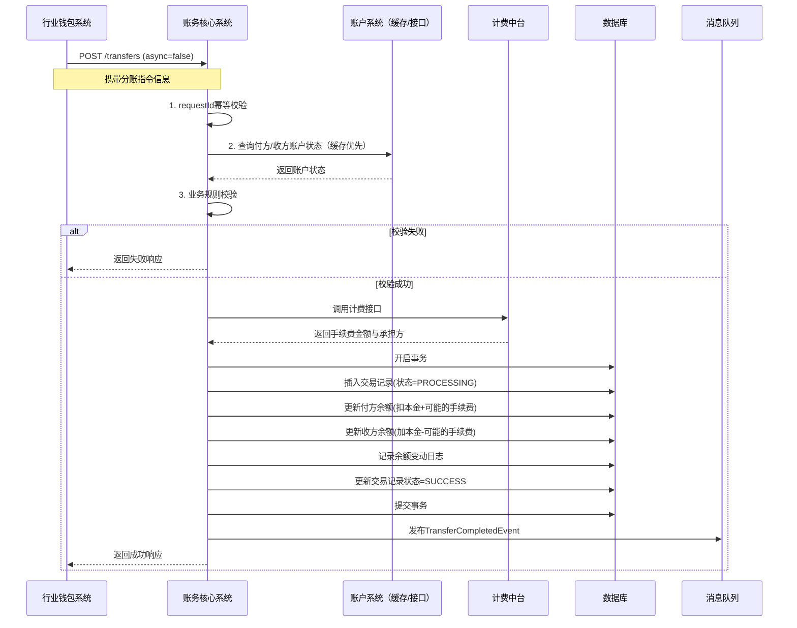
```mermaid
sequenceDiagram
    participant Wallet as 行业钱包系统
    participant Core as 账务核心系统
    participant Account as 账户系统（缓存/接口）
    participant Fee as 计费中台
    participant DB as 数据库
    participant MQ as 消息队列

    Wallet->>Core: POST /transfers (async=false)
    Note over Wallet,Core: 携带分账指令信息
    
    Core->>Core: 1. requestId幂等校验
    Core->>Account: 2. 查询付方/收方账户状态（缓存优先）
    Account-->>Core: 返回账户状态
    
    Core->>Core: 3. 业务规则校验
    alt 校验失败
        Core-->>Wallet: 返回失败响应
    else 校验成功
        Core->>Fee: 调用计费接口
        Fee-->>Core: 返回手续费金额与承担方
        
        Core->>DB: 开启事务
        Core->>DB: 插入交易记录(状态=PROCESSING)
        Core->>DB: 更新付方余额(扣本金+可能的手续费)
        Core->>DB: 更新收方余额(加本金-可能的手续费)
        Core->>DB: 记录余额变动日志
        Core->>DB: 更新交易记录状态=SUCCESS
        Core->>DB: 提交事务
        
        Core->>MQ: 发布TransferCompletedEvent
        Core-->>Wallet: 返回成功响应
    end
```

### 5.2 账户余额初始化时序图（消费账户创建事件）

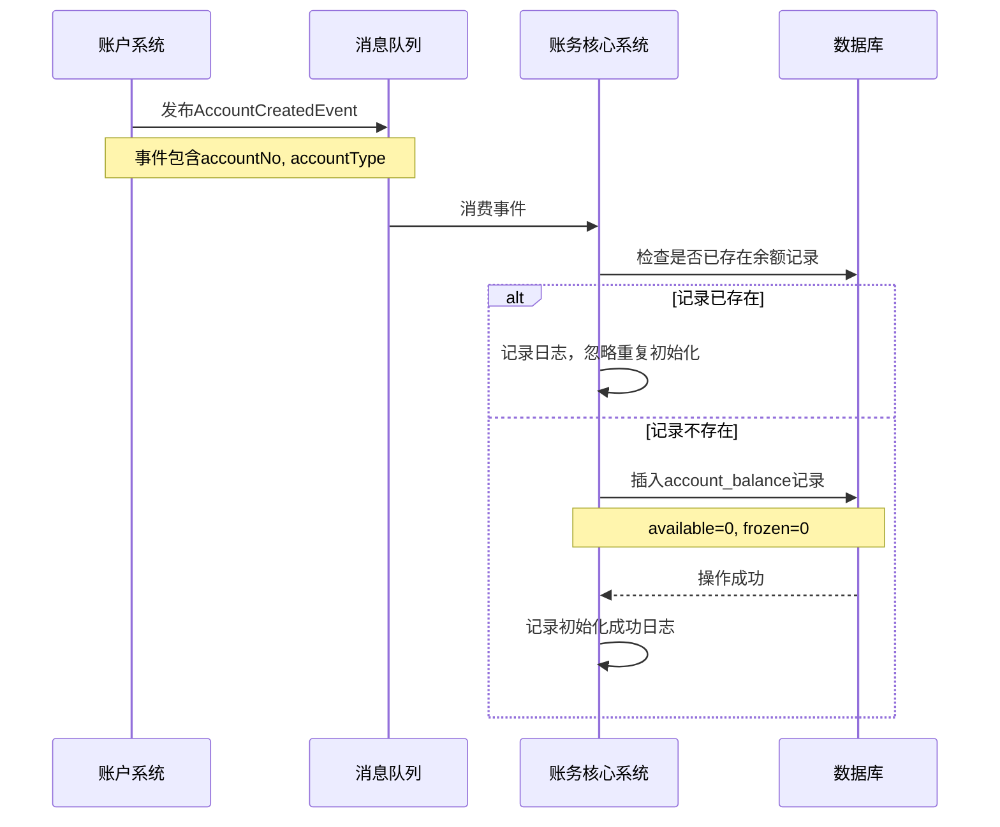
```mermaid
sequenceDiagram
    participant AccountSys as 账户系统
    participant MQ as 消息队列
    participant Core as 账务核心系统
    participant DB as 数据库

    AccountSys->>MQ: 发布AccountCreatedEvent
    Note over AccountSys,MQ: 事件包含accountNo, accountType
    
    MQ->>Core: 消费事件
    Core->>DB: 检查是否已存在余额记录
    alt 记录已存在
        Core->>Core: 记录日志，忽略重复初始化
    else 记录不存在
        Core->>DB: 插入account_balance记录
        Note over Core,DB: available=0, frozen=0
        DB-->>Core: 操作成功
        Core->>Core: 记录初始化成功日志
    end
```

## 6. 错误处理

### 6.1 预期错误码
| 错误码 | HTTP状态码 | 描述 | 处理建议 |
|--------|------------|------|----------|
| `INSUFFICIENT_BALANCE` | 400 Bad Request | 付方账户余额不足 | 检查付方账户余额或充值 |
| `ACCOUNT_FROZEN` | 400 Bad Request | 付方账户已冻结 | 需联系解冻账户 |
| `ACCOUNT_INVALID` | 400 Bad Request | 账户不存在或状态异常 | 检查账户号是否正确，账户是否已注销 |
| `DUPLICATE_REQUEST` | 409 Conflict | 重复的请求ID | 直接返回已创建的交易结果 |
| `BIZ_SCENE_MISMATCH` | 400 Bad Request | 业务场景与账户类型不匹配 | 检查业务场景配置 |
| `FEE_CALC_FAILED` | 500 Internal Server Error | 手续费计算失败 | 可降级为0手续费继续交易，或失败并告警 |
| `CONCURRENT_BALANCE_UPDATE` | 409 Conflict | 余额并发更新冲突 | 客户端应稍后重试 |
| `TRANSFER_REVERSE_NOT_ALLOWED` | 400 Bad Request | 交易不允许冲正 | 检查交易状态和冲正规则 |

### 6.2 处理策略
1. **重试策略**:
   - 对于网络超时、数据库死锁等临时错误，采用指数退避重试（最多3次）。
   - 对于余额并发冲突，建议客户端稍后重试，服务端不自动重试以避免业务逻辑错误。

2. **降级策略**:
   - 计费中台不可用：可配置降级为0手续费，继续完成分账交易，同时记录日志并告警，后续人工处理。
   - 账户系统查询超时：使用本地缓存（如Redis）中账户状态，若缓存不存在则快速失败。

3. **补偿与对账**:
   - 每日与清结算系统进行交易明细对账，发现不平及时告警并人工介入处理。
   - 提供人工冲正接口，用于处理异常交易。

4. **监控告警**:
   - 监控交易成功率、平均耗时、余额变动异常（如负数余额）。
   - 设置错误率阈值告警，特别是`INSUFFICIENT_BALANCE`和`CONCURRENT_BALANCE_UPDATE`。

## 7. 依赖说明

### 7.1 上游依赖
1. **行业钱包系统** (强依赖):
   - **交互方式**: 同步HTTP调用（主要），异步消息（可选）
   - **职责**: 发起所有分账指令，提供完整的业务上下文。
   - **降级方案**: 无。分账是核心业务流程，必须可用。但可提供异步受理模式，先受理成功，后台处理。

2. **账户系统** (强依赖):
   - **交互方式**: 同步接口调用（查询账户状态） + 异步事件消费（账户状态同步）
   - **职责**: 提供账户状态、类型等基础信息校验。
   - **降级方案**: 使用本地缓存（有效期5分钟）存储常用账户状态，缓存失效或不存在时快速失败。

### 7.2 下游依赖
1. **计费中台** (弱依赖):
   - **交互方式**: 同步HTTP调用
   - **职责**: 计算分账交易手续费。
   - **降级方案**: 如前述，可降级为0手续费，保证主流程畅通。

2. **清结算系统** (强依赖):
   - **交互方式**: 文件对账（每日） + 异步事件消费（冻结指令）
   - **职责**: 资金清算、接收交易明细对账文件、发起账户冻结。
   - **降级方案**: 对账文件生成和传输可延迟，不影响实时交易。

3. **消息中间件** (强依赖):
   - **用途**: 发布交易事件，供业务核心、对账单等系统订阅。
   - **影响**: 事件发布失败会影响下游系统状态同步。采用本地事务表+定时任务补偿。

### 7.3 依赖治理
- **超时配置**:
  - 调用行业钱包系统: 5s
  - 调用账户系统: 2s
  - 调用计费中台: 3s
- **熔断机制**:
  - 对计费中台配置熔断器，失败率达到阈值后熔断，直接返回降级结果。
- **数据一致性**:
  - 核心的资金记账（余额更新、流水记录）必须在同一数据库事务中完成。
  - 与外部系统的交互，采用“先持久化，后异步通知”的最终一致性模式。

## 3.5 电子签约平台


# 电子签约平台模块设计文档

## 1. 概述

### 1.1 目的
电子签约平台（电子签章系统）是“天财分账”业务中负责身份核验与法律协议签署的核心服务模块。其主要目的是为分账业务中的关系绑定、付款授权等关键环节提供**合规、安全、可追溯**的电子化认证与签约能力，确保所有资金流转行为均基于真实意愿表达和具有法律效力的协议授权。

### 1.2 范围
本模块作为独立的签约与认证能力中心，为上游系统（如认证系统）提供以下服务：
- **人脸核验服务**：提供H5页面或SDK，完成姓名、身份证号与人脸生物特征的比对验证。
- **电子协议签署服务**：提供协议模板管理、签署流程编排、签署人身份确认、在线签署及协议存证全流程。
- **打款验证通知服务**：为认证系统发起的打款验证提供短信通知模板与发送能力（可选，可与消息中心整合）。
- **存证与验真服务**：对已签署的协议进行区块链或第三方CA存证，并提供协议验真、下载、查阅接口。

## 2. 接口设计

### 2.1 API端点 (RESTful)

#### 2.1.1 人脸核验服务
**1. 发起人脸核验 (POST /api/v1/verification/face/initiate)**
- **描述**：创建一个新的人脸核验任务，并返回核验H5页面URL或核验SDK所需参数。
- **请求头**：`X-Client-Id: [调用方标识]`, `X-Signature: [请求签名]`
- **请求体**：
```json
{
  "bizId": "AUTH_FLOW_001", // 上游业务流水号，用于关联
  "bizType": "RELATIONSHIP_BINDING | PAYER_AUTHORIZATION",
  "userInfo": {
    "name": "张三",
    "idCardNo": "310101199001011234",
    "mobile": "13800138000" // 可选，用于发送核验链接短信
  },
  "callbackUrl": "https://auth-system/callback/face-verification", // 核验结果回调地址
  "webhookConfig": {
    "headers": { // 回调时可选的附加头信息
      "Authorization": "Bearer ..."
    }
  },
  "expireMinutes": 30, // H5链接有效期，默认30分钟
  "uiConfig": { // 前端页面定制（可选）
    "title": "天财分账身份验证",
    "logoUrl": "https://...",
    "themeColor": "#1890ff"
  }
}
```
- **响应体 (200 OK)**：
```json
{
  "verificationId": "FACE_VERIFY_20231027001",
  "status": "PENDING",
  "verificationUrl": "https://e-sign-platform/h5/face-verify?token=xxx", // H5核验链接
  "expiresAt": "2023-10-27T10:35:00Z",
  "sdkConfig": { // 如采用SDK集成，返回此字段
    "appId": "...",
    "nonce": "...",
    "signature": "..."
  }
}
```

**2. 查询人脸核验结果 (GET /api/v1/verification/face/{verificationId})**
- **描述**：主动查询人脸核验任务的状态与结果。
- **响应体**：
```json
{
  "verificationId": "FACE_VERIFY_20231027001",
  "bizId": "AUTH_FLOW_001",
  "status": "SUCCESS | FAILED | PROCESSING | EXPIRED",
  "userInfo": {
    "name": "张三",
    "idCardNo": "310101199001011234"
  },
  "score": 0.95, // 比对相似度分数（如支持）
  "transactionNo": "FACE_TXN_001", // 人脸核验服务商流水号
  "verifiedAt": "2023-10-27T10:05:00Z",
  "failReason": "FACE_MISMATCH | ID_CARD_MISMATCH | POOR_QUALITY" // 失败原因（如失败）
}
```

#### 2.1.2 电子协议服务
**1. 创建并发起签署流程 (POST /api/v1/contract/initiate)**
- **描述**：根据模板和签署方信息，创建一份电子协议并发起签署流程。
- **请求体**：
```json
{
  "bizId": "REL_202310270001", // 关联的业务ID（如关系ID）
  "bizType": "RELATIONSHIP_AGREEMENT | PAYER_AUTHORIZATION_AGREEMENT",
  "templateId": "TEMPLATE_COLLECTION_V1", // 协议模板ID
  "title": "天财分账资金归集授权协议",
  "variables": { // 模板变量填充
    "payerName": "XX品牌总部",
    "payerAccountNo": "PAY_ACC_001",
    "receiverName": "上海浦东店",
    "receiverAccountNo": "RCV_ACC_001",
    "effectiveDate": "2023-10-27"
  },
  "signers": [
    {
      "partyId": "RECEIVER_001", // 签署方业务标识
      "partyType": "RECEIVER | PAYER", // 与业务角色对应
      "name": "张三",
      "idCardNo": "310101199001011234",
      "mobile": "13800138000",
      "signMethod": "FACE_AND_SMS | CA_CERT", // 签署认证方式
      "notifyType": "SMS | H5_LINK", // 通知方式
      "sequence": 1 // 签署顺序，1表示第一个签
    }
  ],
  "callbackUrl": "https://auth-system/callback/e-sign",
  "webhookConfig": {
    "headers": {
      "Authorization": "Bearer ..."
    }
  },
  "expireDays": 7, // 整个签署流程有效期
  "archiveConfig": { // 存证配置
    "needArchive": true,
    "archiveProvider": "TSA | BLOCKCHAIN"
  }
}
```
- **响应体 (200 OK)**：
```json
{
  "contractId": "CONTRACT_202310270001",
  "status": "CREATED",
  "signTasks": [
    {
      "partyId": "RECEIVER_001",
      "signUrl": "https://e-sign-platform/h5/sign?contract=xxx&party=RECEIVER_001",
      "shortUrl": "https://es.cn/xxx", // 短链接，用于短信
      "expiresAt": "2023-10-27T11:00:00Z",
      "qrCode": "data:image/png;base64,..." // 签署二维码（可选）
    }
  ],
  "archiveInfo": {
    "archiveId": "ARCHIVE_001",
    "status": "PENDING"
  }
}
```

**2. 查询协议状态 (GET /api/v1/contract/{contractId})**
- **描述**：查询协议详情及各方签署状态。
- **响应体**：
```json
{
  "contractId": "CONTRACT_202310270001",
  "bizId": "REL_202310270001",
  "title": "天财分账资金归集授权协议",
  "status": "SIGNED | PARTIAL_SIGNED | REJECTED | EXPIRED | REVOKED",
  "signers": [
    {
      "partyId": "RECEIVER_001",
      "name": "张三",
      "signStatus": "SIGNED | PENDING | REJECTED",
      "signMethod": "FACE_AND_SMS",
      "signedAt": "2023-10-27T10:30:00Z",
      "transactionNo": "SIGN_TXN_001",
      "ipAddress": "192.168.1.1",
      "deviceInfo": "iPhone; iOS 16.0"
    }
  ],
  "documentUrl": "https://e-sign-platform/download/CONTRACT_202310270001.pdf",
  "archiveInfo": {
    "archiveId": "ARCHIVE_001",
    "provider": "TSA",
    "archiveTime": "2023-10-27T10:31:00Z",
    "certificateUrl": "https://.../archive-cert.pdf"
  },
  "createdAt": "2023-10-27T10:00:00Z",
  "expiresAt": "2023-11-03T10:00:00Z"
}
```

**3. 作废/撤销协议 (POST /api/v1/contract/{contractId}/revoke)**
- **描述**：在协议签署完成前，由发起方撤销签署流程。
- **请求体**：
```json
{
  "reason": "用户要求取消",
  "operator": "system_admin"
}
```
- **响应体**：`200 OK` 或 `409 Conflict`（如已全部签署完成则不可撤销）

**4. 协议验真接口 (POST /api/v1/contract/verify)**
- **描述**：验证一份协议文件（PDF）的签署真实性与完整性。
- **请求体**（支持多种方式）：
```json
{
  "method": "CONTRACT_ID",
  "contractId": "CONTRACT_202310270001"
}
// 或
{
  "method": "FILE_HASH",
  "fileHash": "sha256:abc123...",
  "archiveId": "ARCHIVE_001"
}
```
- **响应体**：
```json
{
  "valid": true,
  "contractId": "CONTRACT_202310270001",
  "signatureInfo": [
    {
      "signer": "张三",
      "signTime": "2023-10-27T10:30:00Z",
      "certificateIssuer": "CFCA",
      "validFrom": "2023-01-01",
      "validTo": "2024-01-01"
    }
  ],
  "archiveInfo": {
    "archived": true,
    "archiveTime": "2023-10-27T10:31:00Z",
    "timestampAuthority": "cnnic"
  }
}
```

#### 2.1.3 模板管理服务（内部/管理端）
**1. 管理协议模板 (POST /api/v1/template)**
- **描述**：创建或更新协议模板。
- **请求体**：
```json
{
  "templateId": "TEMPLATE_COLLECTION_V1",
  "name": "资金归集授权协议模板",
  "version": "1.0",
  "category": "RELATIONSHIP_AGREEMENT",
  "content": "{\"components\": [...]}", // 结构化模板内容，或HTML
  "variableDefinitions": [
    {
      "key": "payerName",
      "name": "付款方名称",
      "required": true,
      "sample": "XX科技有限公司"
    }
  ],
  "signerConfig": {
    "minSigners": 1,
    "maxSigners": 2,
    "defaultSignMethods": ["FACE_AND_SMS"]
  },
  "active": true
}
```

### 2.2 发布/消费的事件

#### 2.2.1 发布的事件
- **FaceVerificationCompletedEvent**: 人脸核验完成（成功/失败）。
- **ContractStatusChangedEvent**: 协议状态变更（如：部分签署、全部签署完成、作废、过期）。
- **ContractArchivedEvent**: 协议完成存证。

#### 2.2.2 消费的事件
- **无强依赖事件消费**：本模块作为能力提供方，主要通过同步API被调用。但可监听如`TemplateUpdatedEvent`（内部管理）等事件。

## 3. 数据模型

### 3.1 核心数据库表设计

```sql
-- 1. 人脸核验记录表
CREATE TABLE `face_verification` (
  `id` bigint(20) NOT NULL AUTO_INCREMENT,
  `verification_id` varchar(64) NOT NULL COMMENT '核验任务ID',
  `biz_id` varchar(64) NOT NULL COMMENT '上游业务ID',
  `biz_type` varchar(32) NOT NULL COMMENT '业务类型',
  `status` varchar(32) NOT NULL COMMENT '状态: PENDING, SUCCESS, FAILED, EXPIRED',
  `user_name` varchar(128) NOT NULL COMMENT '待核验姓名',
  `id_card_no` varchar(32) NOT NULL COMMENT '身份证号',
  `mobile` varchar(32) COMMENT '手机号',
  `face_score` decimal(5,4) COMMENT '人脸比对分数',
  `thirdparty_transaction_no` varchar(128) COMMENT '第三方流水号',
  `fail_reason` varchar(64) COMMENT '失败原因码',
  `callback_url` varchar(1024) NOT NULL COMMENT '结果回调地址',
  `callback_headers` text COMMENT '回调请求头(JSON)',
  `verification_url` varchar(1024) COMMENT '核验H5链接',
  `expires_at` datetime NOT NULL COMMENT '链接过期时间',
  `verified_at` datetime COMMENT '核验完成时间',
  `created_at` datetime NOT NULL DEFAULT CURRENT_TIMESTAMP,
  `updated_at` datetime NOT NULL DEFAULT CURRENT_TIMESTAMP ON UPDATE CURRENT_TIMESTAMP,
  PRIMARY KEY (`id`),
  UNIQUE KEY `uk_verification_id` (`verification_id`),
  KEY `idx_biz_id` (`biz_id`),
  KEY `idx_status_expires` (`status`, `expires_at`)
) ENGINE=InnoDB COMMENT='人脸核验记录表';

-- 2. 电子协议主表
CREATE TABLE `contract` (
  `id` bigint(20) NOT NULL AUTO_INCREMENT,
  `contract_id` varchar(64) NOT NULL COMMENT '协议ID',
  `biz_id` varchar(64) NOT NULL COMMENT '关联业务ID',
  `biz_type` varchar(32) NOT NULL COMMENT '业务类型',
  `template_id` varchar(64) NOT NULL COMMENT '模板ID',
  `title` varchar(256) NOT NULL COMMENT '协议标题',
  `status` varchar(32) NOT NULL COMMENT '状态: CREATED, PARTIAL_SIGNED, SIGNED, REJECTED, EXPIRED, REVOKED',
  `variables_json` text NOT NULL COMMENT '模板变量值(JSON)',
  `document_url` varchar(1024) COMMENT '最终协议文件地址',
  `document_hash` varchar(128) COMMENT '文件哈希值(存证用)',
  `callback_url` varchar(1024) NOT NULL COMMENT '状态回调地址',
  `callback_headers` text COMMENT '回调请求头(JSON)',
  `expires_at` datetime NOT NULL COMMENT '签署流程过期时间',
  `signed_at` datetime COMMENT '最终完成签署时间',
  `revoked_at` datetime COMMENT '撤销时间',
  `revoke_reason` varchar(512) COMMENT '撤销原因',
  `created_at` datetime NOT NULL DEFAULT CURRENT_TIMESTAMP,
  `updated_at` datetime NOT NULL DEFAULT CURRENT_TIMESTAMP ON UPDATE CURRENT_TIMESTAMP,
  PRIMARY KEY (`id`),
  UNIQUE KEY `uk_contract_id` (`contract_id`),
  UNIQUE KEY `uk_biz_id_type` (`biz_id`, `biz_type`),
  KEY `idx_status_expires` (`status`, `expires_at`)
) ENGINE=InnoDB COMMENT='电子协议主表';

-- 3. 协议签署方任务表
CREATE TABLE `contract_signer` (
  `id` bigint(20) NOT NULL AUTO_INCREMENT,
  `contract_id` varchar(64) NOT NULL COMMENT '协议ID',
  `party_id` varchar(64) NOT NULL COMMENT '签署方业务标识',
  `party_type` varchar(32) NOT NULL COMMENT '签署方类型(RECEIVER/PAYER)',
  `name` varchar(128) NOT NULL COMMENT '姓名',
  `id_card_no` varchar(32) NOT NULL COMMENT '身份证号',
  `mobile` varchar(32) NOT NULL COMMENT '手机号',
  `sign_method` varchar(32) NOT NULL COMMENT '签署认证方式',
  `sign_status` varchar(32) NOT NULL COMMENT '签署状态: PENDING, SIGNED, REJECTED',
  `sign_url` varchar(1024) COMMENT '签署链接',
  `short_url` varchar(256) COMMENT '短链接(短信用)',
  `sequence` int NOT NULL COMMENT '签署顺序',
  `signed_at` datetime COMMENT '签署时间',
  `transaction_no` varchar(128) COMMENT '签署交易流水号',
  `ip_address` varchar(64) COMMENT '签署IP',
  `device_info` varchar(512) COMMENT '设备信息',
  `reject_reason` varchar(512) COMMENT '拒签原因',
  `expires_at` datetime COMMENT '该方签署链接过期时间',
  `created_at` datetime NOT NULL DEFAULT CURRENT_TIMESTAMP,
  `updated_at` datetime NOT NULL DEFAULT CURRENT_TIMESTAMP ON UPDATE CURRENT_TIMESTAMP,
  PRIMARY KEY (`id`),
  UNIQUE KEY `uk_contract_party` (`contract_id`, `party_id`),
  KEY `idx_mobile_status` (`mobile`, `sign_status`),
  KEY `idx_contract_status` (`contract_id`, `sign_status`)
) ENGINE=InnoDB COMMENT='协议签署方任务表';

-- 4. 协议存证记录表
CREATE TABLE `contract_archive` (
  `id` bigint(20) NOT NULL AUTO_INCREMENT,
  `archive_id` varchar(64) NOT NULL COMMENT '存证ID',
  `contract_id` varchar(64) NOT NULL COMMENT '协议ID',
  `archive_provider` varchar(32) NOT NULL COMMENT '存证提供商: TSA, BLOCKCHAIN, LOCAL_CA',
  `status` varchar(32) NOT NULL COMMENT '状态: PENDING, SUCCESS, FAILED',
  `document_hash` varchar(128) NOT NULL COMMENT '文件哈希',
  `archive_time` datetime COMMENT '存证时间',
  `certificate_url` varchar(1024) COMMENT '存证证书地址',
  `transaction_no` varchar(128) COMMENT '存证服务商流水号',
  `metadata_json` text COMMENT '存证元数据(JSON)',
  `created_at` datetime NOT NULL DEFAULT CURRENT_TIMESTAMP,
  `updated_at` datetime NOT NULL DEFAULT CURRENT_TIMESTAMP ON UPDATE CURRENT_TIMESTAMP,
  PRIMARY KEY (`id`),
  UNIQUE KEY `uk_archive_id` (`archive_id`),
  UNIQUE KEY `uk_contract_provider` (`contract_id`, `archive_provider`),
  KEY `idx_status` (`status`)
) ENGINE=InnoDB COMMENT='协议存证记录表';

-- 5. 协议模板表
CREATE TABLE `contract_template` (
  `id` bigint(20) NOT NULL AUTO_INCREMENT,
  `template_id` varchar(64) NOT NULL COMMENT '模板ID',
  `name` varchar(128) NOT NULL COMMENT '模板名称',
  `version` varchar(32) NOT NULL COMMENT '版本号',
  `category` varchar(32) NOT NULL COMMENT '分类',
  `content_type` varchar(32) NOT NULL COMMENT '内容类型: HTML, COMPONENT_JSON',
  `content` mediumtext NOT NULL COMMENT '模板内容',
  `variable_definitions_json` text NOT NULL COMMENT '变量定义(JSON)',
  `signer_config_json` text NOT NULL COMMENT '签署方配置(JSON)',
  `active` tinyint(1) NOT NULL DEFAULT 1 COMMENT '是否激活',
  `created_by` varchar(64) NOT NULL,
  `updated_by` varchar(64) NOT NULL,
  `created_at` datetime NOT NULL DEFAULT CURRENT_TIMESTAMP,
  `updated_at` datetime NOT NULL DEFAULT CURRENT_TIMESTAMP ON UPDATE CURRENT_TIMESTAMP,
  PRIMARY KEY (`id`),
  UNIQUE KEY `uk_template_version` (`template_id`, `version`),
  KEY `idx_category_active` (`category`, `active`)
) ENGINE=InnoDB COMMENT='协议模板表';
```

### 3.2 与其他模块的关系
- **认证系统**：**核心上游调用方**。认证系统通过同步API调用本模块发起人脸核验和电子协议签署，并通过回调接口接收结果。两者之间需建立**安全通信机制**（IP白名单、请求签名）。
- **消息中心**（可选）：如需发送核验/签署通知短信，可调用消息中心服务。
- **文件存储服务**：用于存储最终生成的协议PDF文件，需支持安全访问和下载。
- **第三方人脸核验服务商**：通过适配器模式集成，如阿里云实人认证、腾讯云人脸核验等。
- **第三方CA/电子签章服务商**：通过适配器模式集成，如e签宝、法大大、上上签等，或自建CFCA集成。

## 4. 业务逻辑

### 4.1 核心算法与流程
#### 4.1.1 人脸核验流程
1. **接收请求**：验证请求签名，检查必填字段。
2. **生成核验任务**：创建唯一`verification_id`，根据`bizId`和`bizType`防重。
3. **调用核验服务**：
   - **方案A（H5跳转）**：生成带加密token的H5 URL，用户在此页面完成人脸采集与比对。
   - **方案B（SDK集成）**：返回SDK所需参数，由调用方App集成SDK完成核验。
4. **处理核验结果**：
   - 接收第三方服务商回调，验证回调签名。
   - 解析核验结果，更新核验记录状态。
   - 如核验成功，提取并存储`transaction_no`、`score`等信息。
5. **回调通知**：向`callbackUrl`发送HTTP POST回调，携带核验结果。支持重试机制（最多3次）。

#### 4.1.2 电子协议签署流程
1. **协议创建**：
   - 根据`templateId`加载模板，使用`variables`填充生成协议预览内容。
   - 校验`signers`配置的合法性（身份信息、签署顺序）。
2. **签署任务初始化**：
   - 为每个签署方生成唯一的签署链接（含防篡改token）。
   - 如配置短信通知，调用消息中心发送签署邀请。
3. **签署过程**：
   - 签署方访问链接，系统验证链接有效性（未过期、未签署）。
   - 根据`signMethod`进行身份认证：
     - `FACE_AND_SMS`：人脸核验 + 短信验证码。
     - `CA_CERT`：调用CA机构进行证书验证。
   - 在前端渲染协议内容，提供签署控件（手写签名、时间戳）。
   - 用户确认并签署，生成最终PDF（嵌入数字签名/可视化签章）。
4. **签署后处理**：
   - 更新签署方状态，记录签署时间、IP、设备等信息。
   - 检查是否所有签署方均已完成，若是，更新协议状态为`SIGNED`。
   - 触发协议存证流程。
5. **回调通知**：协议状态每次变更（部分签署、全部签署、过期等）均向`callbackUrl`发送回调。

#### 4.1.3 协议存证流程
1. **触发时机**：协议状态变为`SIGNED`时自动触发。
2. **哈希计算**：对最终PDF文件计算哈希值（SHA-256）。
3. **调用存证服务**：
   - **时间戳服务(TSA)**：将文件哈希发送至权威时间戳机构，获取时间戳令牌。
   - **区块链存证**：将哈希和元数据上链（如蚂蚁链、腾讯至信链）。
   - **本地CA存证**：使用自建CA进行数字签名。
4. **存证记录**：保存存证证书/交易ID，供后续验真使用。

### 4.2 业务规则
1. **身份信息一致性规则**：同一`bizId`下，人脸核验与电子协议签署使用的姓名、身份证号必须一致。
2. **签署顺序规则**：若配置了`sequence`，必须按顺序签署。前一方未完成，后一方无法签署。
3. **链接安全规则**：
   - 签署链接token一次性有效，签署后即失效。
   - 链接有效期可配置，默认H5链接30分钟，短信链接24小时。
   - 链接访问需验证来源Referer（如配置）和IP频率限制。
4. **协议状态机**：
   ```
   CREATED → PARTIAL_SIGNED → SIGNED → (ARCHIVED)
         ↘ REJECTED          ↘ EXPIRED
         ↘ REVOKED (仅限SIGNED前)
   ```
   状态不可逆（除管理员强制操作）。
5. **存证规则**：只有`SIGNED`状态的协议才进行存证。同一协议可多提供商存证。

### 4.3 验证逻辑
1. **API请求验证**：
   - **签名验证**：所有外部调用需使用预共享密钥进行HMAC-SHA256签名。
   - **防重放攻击**：请求头包含`X-Nonce`和`X-Timestamp`，服务端校验时间窗口（如±5分钟）和nonce唯一性。
2. **业务参数校验**：
   - 模板变量填充后，必须满足所有必填变量。
   - 签署方手机号格式、身份证号格式（通过Luhn算法初步校验）。
   - 回调URL必须是HTTPS（生产环境）。
3. **第三方回调验证**：严格验证回调请求的签名/IP，防止伪造结果。

## 5. 时序图

### 5.1 人脸核验时序图（H5模式）

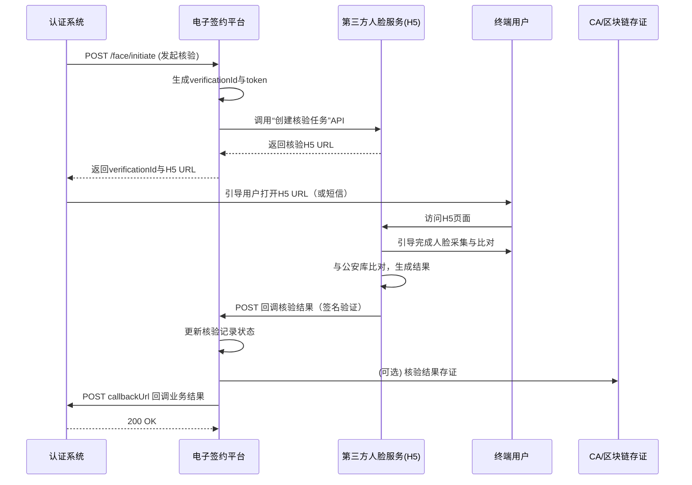
```mermaid
sequenceDiagram
    participant A as 认证系统
    participant E as 电子签约平台
    participant H as 第三方人脸服务(H5)
    participant U as 终端用户
    participant C as CA/区块链存证

    A->>E: POST /face/initiate (发起核验)
    E->>E: 生成verificationId与token
    E->>H: 调用“创建核验任务”API
    H-->>E: 返回核验H5 URL
    E-->>A: 返回verificationId与H5 URL
    A->>U: 引导用户打开H5 URL（或短信）
    U->>H: 访问H5页面
    H->>U: 引导完成人脸采集与比对
    H->>H: 与公安库比对，生成结果
    H->>E: POST 回调核验结果（签名验证）
    E->>E: 更新核验记录状态
    E->>C: (可选) 核验结果存证
    E->>A: POST callbackUrl 回调业务结果
    A-->>E: 200 OK
```

### 5.2 电子协议签署时序图（单方签署）

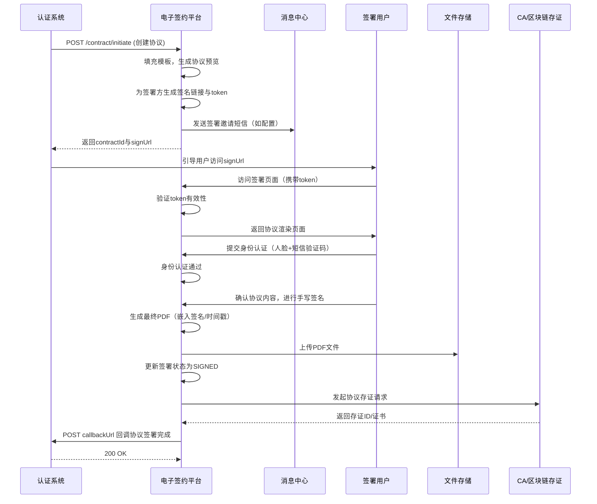
```mermaid
sequenceDiagram
    participant A as 认证系统
    participant E as 电子签约平台
    participant M as 消息中心
    participant U as 签署用户
    participant F as 文件存储
    participant C as CA/区块链存证

    A->>E: POST /contract/initiate (创建协议)
    E->>E: 填充模板，生成协议预览
    E->>E: 为签署方生成签名链接与token
    E->>M: 发送签署邀请短信（如配置）
    E-->>A: 返回contractId与signUrl
    A->>U: 引导用户访问signUrl
    U->>E: 访问签署页面（携带token）
    E->>E: 验证token有效性
    E->>U: 返回协议渲染页面
    U->>E: 提交身份认证（人脸+短信验证码）
    E->>E: 身份认证通过
    U->>E: 确认协议内容，进行手写签名
    E->>E: 生成最终PDF（嵌入签名/时间戳）
    E->>F: 上传PDF文件
    E->>E: 更新签署状态为SIGNED
    E->>C: 发起协议存证请求
    C-->>E: 返回存证ID/证书
    E->>A: POST callbackUrl 回调协议签署完成
    A-->>E: 200 OK
```

## 6. 错误处理

| 错误场景 | 错误码 | 处理策略 | 客户端提示建议 |
| :--- | :--- | :--- | :--- |
| API签名验证失败 | 40101 | 拒绝请求，记录安全日志 | “请求签名错误” |
| 请求参数缺失或格式错误 | 40001 | 直接返回错误，不继续处理 | “参数校验失败: [具体字段]” |
| 业务ID重复请求 | 40002 | 返回已存在的任务/协议信息 | “已存在相同业务ID的流程” |
| 模板不存在或未激活 | 40003 | 拒绝创建协议 | “协议模板不可用” |
| 签署链接已过期 | 40004 | 引导用户重新获取链接 | “签署链接已过期，请重新获取” |
| 签署链接已使用 | 40005 | 提示已签署 | “您已签署过该协议” |
| 人脸核验失败（比对不通过） | 40006 | 更新核验状态为FAILED，回调通知 | “人脸核验未通过” |
| 第三方服务（人脸/CA）调用超时 | 50001 | 异步重试（最多3次），记录监控告警 | “系统繁忙，请稍后重试” |
| 回调通知失败 | 50002 | 进入重试队列，指数退避重试，最终记录人工处理 | （内部告警） |
| 存证服务失败 | 50003 | 记录失败日志，协议状态仍为SIGNED，但标记存证失败，人工介入补存 | （内部告警） |

**重试与补偿**：
- 对第三方服务的调用，采用**同步快速失败+异步重试**策略。重要操作（如存证）需有后台任务补偿机制。
- 回调通知使用消息队列，确保至少一次送达，调用方需处理幂等性。

## 7. 依赖说明

### 7.1 上游模块交互
1. **认证系统**：
   - **交互方式**：同步HTTP API调用（发起核验/签署） + 异步HTTP回调（接收结果）。
   - **安全机制**：双向HTTPS，基于预共享密钥的请求签名，IP白名单限制。
   - **关键点**：回调接口需幂等，认证系统可能因网络问题重复调用，本模块需根据`bizId`去重处理。

### 7.2 外部依赖
1. **第三方人脸核验服务**：
   - **集成模式**：适配器模式，支持多服务商热切换。
   - **关键能力**：活体检测、公安库比对、结果回调。
   - **降级方案**：如主要服务商不可用，可切换至备用服务商；极端情况下，可降级为“短信验证码+身份信息校验”模式（合规性需评估）。

2. **第三方电子签章/CA服务**：
   - **集成模式**：适配器模式，封装不同服务商的协议创建、签署、存证接口。
   - **关键能力**：数字证书、时间戳、区块链存证、法律有效性保障。
   - **合规要求**：必须选择持有《商用密码产品型号证书》、《电子认证服务许可证》的服务商。

3. **文件存储服务**：
   - **要求**：高可用、高持久性，支持HTTPS访问和防盗链。协议文件属于敏感数据，存储需加密。

4. **消息中心**：
   - **可选依赖**：用于发送短信通知。如无，可由调用方（认证系统）自行发送。

### 7.3 内部依赖
- **配置中心**：管理第三方服务商密钥、模板内容、有效期等配置。
- **监控与告警**：监控API成功率、第三方调用延迟、任务积压情况。

**总结**：电子签约平台作为**合规与信任的技术载体**，其设计核心在于**安全、可靠、可审计**。它通过标准化接口封装了复杂的生物识别与法律科技能力，为上层业务提供“即插即用”的认证与签约服务，是分账业务合法性的基石。所有操作必须全程留痕，确保事后可追溯、可验证。

## 3.6 清结算系统


# 清结算系统模块设计文档

## 1. 概述

### 1.1 目的
清结算系统是“天财分账”业务的资金处理核心，负责处理与账户系统、三代系统、行业钱包系统等模块交互产生的资金清算与结算任务。本模块的核心职责是管理内部账户（如待结算账户、退货账户），处理“天财分账”交易的资金划转、结算模式配置、退货处理，并为其他系统提供资金状态查询和账户冻结能力。它是连接上层业务指令与底层资金流转的关键桥梁，确保资金处理的准确性、时效性和可追溯性。

### 1.2 范围
- **内部账户管理**：创建、配置和管理用于资金暂存与流转的内部账户（如01-待结算账户，04-退货账户）。
- **结算模式配置与执行**：为收单商户配置“主动结算”或“被动结算”模式，并根据配置执行相应的资金结算动作（如将待结算账户资金划至天财收款账户）。
- **分账资金处理**：接收并处理来自行业钱包系统的“天财分账”交易请求，完成资金从付款方账户到收款方账户的划拨，并记录详细的清算流水。
- **退货资金处理**：处理交易退货场景，根据业务规则从指定账户（天财收款账户或退货账户）扣款并完成退款。
- **账户冻结/解冻**：根据风控或业务指令，对天财收款账户或接收方账户进行资金冻结与解冻操作。
- **资金状态查询**：为其他系统提供账户余额、在途资金、交易流水等查询服务。
- **对账支持**：生成清结算维度的流水，供对账单系统进行核对。
- **不包含**：不负责业务逻辑校验（由三代系统负责）、不直接管理商户/接收方信息、不处理电子签约流程、不计算手续费（由计费中台负责）。

## 2. 接口设计

### 2.1 API 端点 (RESTful)

#### 2.1.1 内部账户与结算配置
- **POST /api/v1/internal-accounts** - 创建内部账户（如01，04账户）
- **PUT /api/v1/merchants/{merchantId}/settlement-config** - 配置或更新商户结算模式
- **GET /api/v1/merchants/{merchantId}/settlement-config** - 查询商户结算配置

#### 2.1.2 资金处理
- **POST /api/v1/settlements/execute** - 执行结算（将待结算账户资金结算到天财收款账户）
- **POST /api/v1/transfers/tiancai-split** - 处理天财分账资金划转请求（供行业钱包系统调用）
- **POST /api/v1/refunds/process** - 处理退货退款请求

#### 2.1.3 账户状态管理
- **POST /api/v1/accounts/{accountNo}/freeze** - 冻结指定账户
- **POST /api/v1/accounts/{accountNo}/unfreeze** - 解冻指定账户
- **GET /api/v1/accounts/{accountNo}/balance** - 查询账户余额及可用余额
- **GET /api/v1/accounts/{accountNo}/transactions** - 查询账户交易流水

#### 2.1.4 查询服务
- **GET /api/v1/settlement-records** - 查询结算执行记录
- **GET /api/v1/clearing-records** - 查询天财分账清算记录（供对账单系统消费）

### 2.2 输入/输出数据结构

#### 2.2.1 配置商户结算模式请求 (`ConfigureSettlementRequest`)
```json
{
  "requestId": "req_settle_cfg_20231029001",
  "merchantId": "MCH_TC_HQ_001",
  "settlementMode": "PASSIVE", // ACTIVE, PASSIVE
  "internalAccountCode": "01", // 被动结算时必填，关联的待结算账户代码
  "settlementRule": {
    "type": "DAILY", // DAILY, WEEKLY, MONTHLY, MANUAL
    "time": "T+1 02:00:00", // 执行时间，MANUAL类型可为空
    "minAmount": 10000 // 最低结算金额，低于此值不触发自动结算
  },
  "operator": "tiancai_admin",
  "extInfo": {}
}
```

#### 2.2.2 处理天财分账请求 (`ProcessTiancaiSplitRequest`)
```json
{
  "requestId": "req_split_20231029001",
  "instructionId": "INST_COL_202310280001",
  "splitType": "COLLECTION", // COLLECTION, BATCH_PAYMENT, MEMBER_SETTLEMENT
  "payerAccountNo": "TC_ACCT_STORE_001",
  "payeeAccountNo": "TC_ACCT_HQ_001",
  "amount": 100000,
  "currency": "CNY",
  "fee": 100,
  "feeBearer": "PAYER", // PAYER, PAYEE
  "businessTime": "2023-10-28T18:00:00Z",
  "remark": "门店日终归集",
  "callbackUrl": "https://wallet.xxx.com/callback/settlement"
}
```

#### 2.2.3 处理退货请求 (`ProcessRefundRequest`)
```json
{
  "requestId": "req_refund_20231029001",
  "originalOrderNo": "ORDER_202310280001",
  "refundOrderNo": "REFUND_202310290001",
  "merchantId": "MCH_TC_HQ_001",
  "refundAmount": 5000,
  "currency": "CNY",
  "refundAccountType": "PAYMENT_ACCOUNT", // PAYMENT_ACCOUNT, REFUND_ACCOUNT(04账户)
  "paymentAccountNo": "TC_ACCT_HQ_001", // refundAccountType为PAYMENT_ACCOUNT时必填
  "reason": "商品质量问题",
  "operator": "customer_service",
  "extInfo": {}
}
```

#### 2.2.4 通用资金操作响应 (`FundsOperationResponse`)
```json
{
  "code": "SUCCESS",
  "message": "操作成功",
  "data": {
    "settlementNo": "STL_202310290001", // 或 transferNo, refundNo
    "requestId": "req_split_20231029001",
    "status": "PROCESSING", // PROCESSING, SUCCESS, FAILED
    "payerAccountNo": "TC_ACCT_STORE_001",
    "payerBalance": 500000, // 操作后付款方余额
    "payerAvailable": 400000, // 操作后付款方可用余额
    "payeeAccountNo": "TC_ACCT_HQ_001",
    "payeeBalance": 600000,
    "estimatedFinishTime": "2023-10-29T10:00:05Z",
    "createdTime": "2023-10-29T10:00:00Z"
  }
}
```

#### 2.2.5 天财分账清算记录 (`TiancaiClearingRecord`)
```json
{
  "clearingId": "CLR_202310290001",
  "instructionId": "INST_COL_202310280001",
  "splitType": "COLLECTION",
  "clearingTime": "2023-10-29T10:00:00Z",
  "completeTime": "2023-10-29T10:00:05Z",
  "payerAccountNo": "TC_ACCT_STORE_001",
  "payeeAccountNo": "TC_ACCT_HQ_001",
  "amount": 100000,
  "currency": "CNY",
  "fee": 100,
  "feeBearer": "PAYER",
  "status": "SUCCESS",
  "internalTransactionNo": "TRX_INTERNAL_001",
  "channelTransactionNo": "TRX_CHANNEL_001",
  "remark": "门店日终归集"
}
```

### 2.3 发布/消费的事件

#### 2.3.1 发布的事件
- **SettlementCompletedEvent**: 当一笔分账资金划转（清算）完成时发布。
    ```json
    {
      "eventId": "evt_settlement_completed_001",
      "eventType": "SETTLEMENT.COMPLETED",
      "timestamp": "2023-10-29T10:00:05Z",
      "payload": {
        "instructionId": "INST_COL_202310280001",
        "clearingId": "CLR_202310290001",
        "status": "SUCCESS",
        "payerAccountNo": "TC_ACCT_STORE_001",
        "payeeAccountNo": "TC_ACCT_HQ_001",
        "amount": 100000,
        "fee": 100,
        "completeTime": "2023-10-29T10:00:05Z"
      }
    }
    ```
- **MerchantSettlementModeChangedEvent**: 当商户结算模式配置变更时发布。
- **AccountFrozenEvent** / **AccountUnfrozenEvent**: 当账户冻结/解冻操作完成时发布。
- **SettlementExecutedEvent**: 当执行结算（资金从待结算账户到收款账户）完成时发布。

#### 2.3.2 消费的事件
- **InstructionCreatedEvent** (来自三代系统): 监听新创建的分账指令，可用于预热或监控。
- **AccountCreatedEvent** (来自账户系统): 当新的天财收款账户创建时，根据其结算模式，在本系统建立对应的结算配置。
- **收单交易结算事件** (来自支付核心): 当收单交易完成结算时，根据商户配置的结算模式，将资金记入待结算账户或直接结算到天财收款账户。

## 3. 数据模型

### 3.1 数据库表设计

#### 表: `internal_account` (内部账户表)
| 字段名 | 类型 | 必填 | 默认值 | 说明 |
|--------|------|------|--------|------|
| `id` | BIGINT(20) | Y | AUTO_INCREMENT | 主键 |
| `account_code` | VARCHAR(8) | Y | | **内部账户代码**，如 '01', '04' |
| `account_name` | VARCHAR(64) | Y | | 账户名称，如 '待结算账户', '退货账户' |
| `account_type` | TINYINT(1) | Y | | 类型: 1-资产类，2-负债类，3-损益类 |
| `currency` | CHAR(3) | Y | CNY | 币种 |
| `status` | TINYINT(1) | Y | 1 | 状态: 1-启用，2-停用 |
| `balance` | DECIMAL(20,2) | Y | 0.00 | 当前余额 |
| `created_time` | DATETIME | Y | CURRENT_TIMESTAMP | 创建时间 |
| `updated_time` | DATETIME | Y | CURRENT_TIMESTAMP ON UPDATE | 更新时间 |

**索引**:
- 唯一索引: `uk_account_code` (`account_code`)

#### 表: `merchant_settlement_config` (商户结算配置表)
| 字段名 | 类型 | 必填 | 默认值 | 说明 |
|--------|------|------|--------|------|
| `id` | BIGINT(20) | Y | AUTO_INCREMENT | 主键 |
| `merchant_id` | VARCHAR(64) | Y | | 商户ID |
| `payment_account_no` | VARCHAR(32) | Y | | 关联的天财收款账户号 |
| `settlement_mode` | TINYINT(1) | Y | | 结算模式: 1-主动结算，2-被动结算 |
| `internal_account_code` | VARCHAR(8) | N | | 关联的内部账户代码（被动结算时必填） |
| `settlement_rule_type` | TINYINT(1) | Y | | 规则类型: 1-每日，2-每周，3-每月，4-手动 |
| `settlement_time` | VARCHAR(32) | N | | 规则执行时间表达式 |
| `min_settlement_amount` | DECIMAL(15,2) | N | | 最低结算金额 |
| `last_settlement_time` | DATETIME | N | | 上次结算执行时间 |
| `next_settlement_time` | DATETIME | N | | 下次预计结算时间 |
| `status` | TINYINT(1) | Y | 1 | 状态: 1-生效，2-暂停 |
| `created_time` | DATETIME | Y | CURRENT_TIMESTAMP | 创建时间 |
| `updated_time` | DATETIME | Y | CURRENT_TIMESTAMP ON UPDATE | 更新时间 |

**索引**:
- 唯一索引: `uk_merchant_account` (`merchant_id`, `payment_account_no`)
- 索引: `idx_settlement_mode` (`settlement_mode`)
- 索引: `idx_next_settlement_time` (`next_settlement_time`, `status`)

#### 表: `account_freeze_record` (账户冻结记录表)
| 字段名 | 类型 | 必填 | 默认值 | 说明 |
|--------|------|------|--------|------|
| `id` | BIGINT(20) | Y | AUTO_INCREMENT | 主键 |
| `freeze_no` | VARCHAR(32) | Y | | **冻结流水号** |
| `account_no` | VARCHAR(32) | Y | | 被冻结账户号 |
| `freeze_type` | TINYINT(1) | Y | | 类型: 1-全额冻结，2-部分金额冻结 |
| `freeze_amount` | DECIMAL(15,2) | N | | 冻结金额（部分冻结时必填） |
| `freeze_reason` | VARCHAR(256) | Y | | 冻结原因 |
| `initiator` | VARCHAR(64) | Y | | 发起方系统/用户 |
| `unfreeze_condition` | VARCHAR(512) | N | | 解冻条件描述 |
| `status` | TINYINT(1) | Y | 1 | 状态: 1-冻结中，2-已解冻 |
| `created_time` | DATETIME | Y | CURRENT_TIMESTAMP | 创建时间 |
| `updated_time` | DATETIME | Y | CURRENT_TIMESTAMP ON UPDATE | 更新时间 |
| `unfreeze_time` | DATETIME | N | | 解冻时间 |

**索引**:
- 唯一索引: `uk_freeze_no` (`freeze_no`)
- 索引: `idx_account_status` (`account_no`, `status`)
- 索引: `idx_created_time` (`created_time`)

#### 表: `tiancai_clearing_record` (天财分账清算记录表)
| 字段名 | 类型 | 必填 | 默认值 | 说明 |
|--------|------|------|--------|------|
| `id` | BIGINT(20) | Y | AUTO_INCREMENT | 主键 |
| `clearing_id` | VARCHAR(32) | Y | | **清算流水号** |
| `instruction_id` | VARCHAR(32) | Y | | 三代系统指令ID |
| `request_id` | VARCHAR(64) | Y | | 请求ID，用于幂等 |
| `split_type` | TINYINT(1) | Y | | 分账类型: 1-归集，2-批量付款，3-会员结算 |
| `payer_account_no` | VARCHAR(32) | Y | | 付款方账户号 |
| `payee_account_no` | VARCHAR(32) | Y | | 收款方账户号 |
| `amount` | DECIMAL(15,2) | Y | | 交易金额 |
| `currency` | CHAR(3) | Y | CNY | 币种 |
| `fee` | DECIMAL(15,2) | N | | 手续费 |
| `fee_bearer` | TINYINT(1) | N | | 手续费承担方: 1-付款方，2-收款方 |
| `status` | TINYINT(1) | Y | | 状态: 1-处理中，2-成功，3-失败 |
| `internal_transaction_no` | VARCHAR(64) | N | | 内部账务流水号 |
| `channel_transaction_no` | VARCHAR(64) | N | | 渠道流水号 |
| `error_code` | VARCHAR(32) | N | | 错误码 |
| `error_message` | VARCHAR(512) | N | | 错误信息 |
| `clearing_time` | DATETIME | Y | CURRENT_TIMESTAMP | 清算发起时间 |
| `completed_time` | DATETIME | N | | 完成时间 |
| `remark` | VARCHAR(256) | N | | 备注 |

**索引**:
- 唯一索引: `uk_clearing_id` (`clearing_id`)
- 唯一索引: `uk_request_id` (`request_id`)
- 索引: `idx_instruction_id` (`instruction_id`)
- 索引: `idx_payer_account` (`payer_account_no`, `clearing_time`)
- 索引: `idx_status_clearing_time` (`status`, `clearing_time`)

#### 表: `settlement_execution_record` (结算执行记录表)
| 字段名 | 类型 | 必填 | 默认值 | 说明 |
|--------|------|------|--------|------|
| `id` | BIGINT(20) | Y | AUTO_INCREMENT | 主键 |
| `settlement_no` | VARCHAR(32) | Y | | **结算流水号** |
| `merchant_id` | VARCHAR(64) | Y | | 商户ID |
| `payment_account_no` | VARCHAR(32) | Y | | 天财收款账户号 |
| `internal_account_code` | VARCHAR(8) | Y | | 内部账户代码（如01） |
| `amount` | DECIMAL(15,2) | Y | | 结算金额 |
| `currency` | CHAR(3) | Y | CNY | 币种 |
| `status` | TINYINT(1) | Y | | 状态: 1-处理中，2-成功，3-失败 |
| `execution_type` | TINYINT(1) | Y | | 执行类型: 1-自动，2-手动 |
| `execution_time` | DATETIME | Y | | 执行时间 |
| `completed_time` | DATETIME | N | | 完成时间 |
| `created_time` | DATETIME | Y | CURRENT_TIMESTAMP | 创建时间 |

**索引**:
- 唯一索引: `uk_settlement_no` (`settlement_no`)
- 索引: `idx_merchant_execution` (`merchant_id`, `execution_time`)

### 3.2 与其他模块的关系
- **行业钱包系统**: 上游调用者。钱包系统在业务校验通过后，调用本模块的`/transfers/tiancai-split`接口执行资金划转。
- **三代系统**: 事件发布者与查询调用者。消费其`InstructionCreatedEvent`，为其提供账户余额/状态查询服务，并向其发布`SettlementCompletedEvent`以更新指令状态。
- **账户系统**: 紧密协作。基于账户系统创建的账户进行资金操作，并向其发布账户冻结事件。消费其`AccountCreatedEvent`以初始化结算配置。
- **支付核心/收单系统**: 上游事件生产者。消费其收单交易结算事件，根据结算配置进行资金路由（至待结算账户或天财收款账户）。
- **计费中台**: 上游服务。在分账处理前，手续费金额已由三代系统调用计费中台计算好并传递至本模块。
- **对账单系统**: 下游数据消费者。本模块生成`TiancaiClearingRecord`等清算流水，供其拉取并生成资金维度对账单。

## 4. 业务逻辑

### 4.1 核心算法
**清算流水号生成算法**:
```
CLR_{YYYYMMDD}{10位序列号}
```
**结算流水号生成算法**:
```
STL_{YYYYMMDD}{10位序列号}
```
**冻结流水号生成算法**:
```
FRZ_{YYYYMMDD}{10位序列号}
```
- 序列号: 每日从1开始自增，确保当日唯一。

**被动结算自动执行调度算法**:
- 定时扫描`merchant_settlement_config`表，筛选`status=1`且`next_settlement_time <= CURRENT_TIME`的记录。
- 对于每条记录，查询关联的`internal_account`余额，若大于等于`min_settlement_amount`，则生成结算任务。
- 执行结算：内部账户扣款，天财收款账户入账，记录流水，更新`last_settlement_time`和`next_settlement_time`。

### 4.2 业务规则
1. **结算模式处理规则**:
   - **主动结算**: 收单交易结算资金直接入账到商户的天财收款账户。本模块仅记录流水，不进行二次划转。
   - **被动结算**: 收单交易结算资金先入账到指定的内部账户（如01账户）。根据配置的结算规则（定时/按金额），由本模块发起结算任务，将资金从内部账户划转至天财收款账户。

2. **天财分账处理规则**:
   - 付款方账户必须是状态正常的**天财收款账户**或**天财接收方账户**。
   - 收款方账户必须是状态正常的**天财收款账户**或**天财接收方账户**。
   - 处理流程：扣减付款方账户余额（并扣减可用余额），增加收款方账户余额。若涉及手续费，根据`feeBearer`从相应账户扣减。
   - 资金划转必须保证事务性，同时更新账户余额和记录清算流水。

3. **退货处理规则**:
   - 根据`refundAccountType`决定退款资金来源：
     - `PAYMENT_ACCOUNT`: 直接从指定的天财收款账户扣款。
     - `REFUND_ACCOUNT`: 从统一的退货账户（04账户）扣款。通常用于被动结算商户，其收款账户可能无足够余额。
   - 需校验原订单是否存在、退款金额是否超过可退金额。

4. **账户冻结规则**:
   - 冻结操作立即生效，被冻结账户的“可用余额”立即减少（全额冻结则变为0）。
   - 冻结期间，账户可以收款，但无法进行任何资金转出操作。
   - 解冻后，恢复相应的“可用余额”。

5. **余额管理**:
   - 账户余额 = 账户总资金。
   - 可用余额 = 账户余额 - 冻结金额 - 在途交易金额（处理中但未最终落地的资金变动）。

### 4.3 验证逻辑
1. **资金请求幂等性**: 通过`requestId`防止重复处理同一笔分账或退款请求。
2. **账户状态验证**: 操作前检查付款方、收款方账户状态是否为`ACTIVE`且未被冻结。
3. **余额充足性验证**:
   - 分账/退款: 验证 `付款方可用余额 >= 交易金额 + (付款方承担的手续费)`。
   - 被动结算: 验证 `内部账户余额 >= 结算金额`。
4. **参数合规性验证**: 金额大于0，币种支持，账户号格式正确等。
5. **业务关联性验证** (针对退货): 验证退款订单与原订单的关联关系，退款金额不超过原订单实付金额。

## 5. 时序图

### 5.1 处理天财分账资金划转时序图

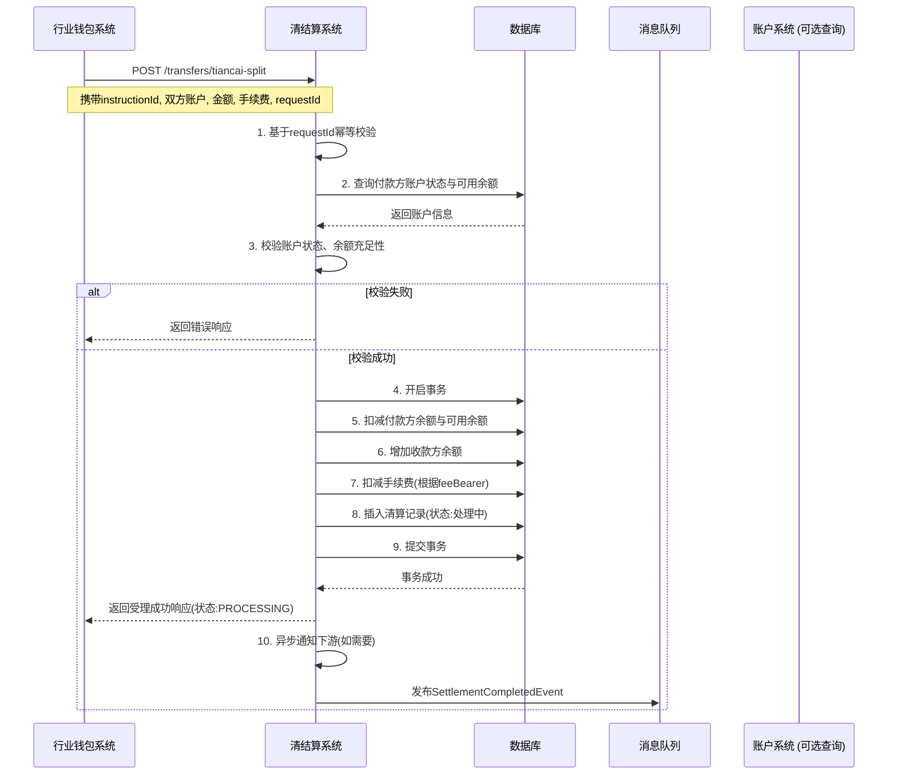
```mermaid
sequenceDiagram
    participant Wallet as 行业钱包系统
    participant Settle as 清结算系统
    participant DB as 数据库
    participant MQ as 消息队列
    participant Account as 账户系统 (可选查询)

    Wallet->>Settle: POST /transfers/tiancai-split
    Note over Wallet,Settle: 携带instructionId, 双方账户, 金额, 手续费, requestId

    Settle->>Settle: 1. 基于requestId幂等校验
    Settle->>DB: 2. 查询付款方账户状态与可用余额
    DB-->>Settle: 返回账户信息
    Settle->>Settle: 3. 校验账户状态、余额充足性
    alt 校验失败
        Settle-->>Wallet: 返回错误响应
    else 校验成功
        Settle->>DB: 4. 开启事务
        Settle->>DB: 5. 扣减付款方余额与可用余额
        Settle->>DB: 6. 增加收款方余额
        Settle->>DB: 7. 扣减手续费(根据feeBearer)
        Settle->>DB: 8. 插入清算记录(状态:处理中)
        Settle->>DB: 9. 提交事务
        DB-->>Settle: 事务成功
        
        Settle-->>Wallet: 返回受理成功响应(状态:PROCESSING)
        
        Settle->>Settle: 10. 异步通知下游(如需要)
        Settle->>MQ: 发布SettlementCompletedEvent
    end
```

### 5.2 被动结算自动执行时序图

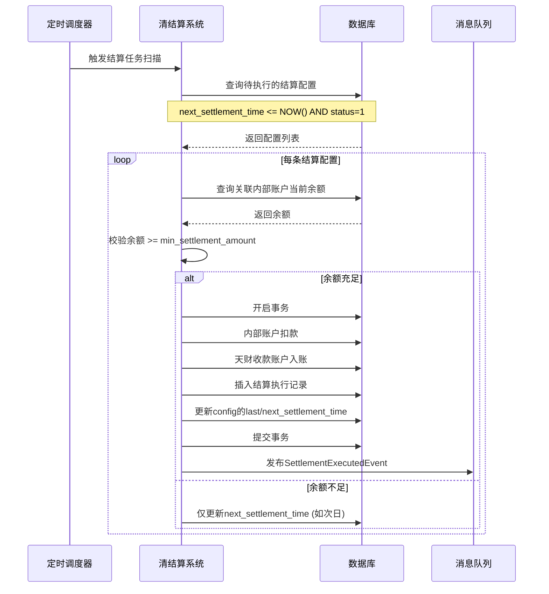
```mermaid
sequenceDiagram
    participant Scheduler as 定时调度器
    participant Settle as 清结算系统
    participant DB as 数据库
    participant MQ as 消息队列

    Scheduler->>Settle: 触发结算任务扫描
    Settle->>DB: 查询待执行的结算配置
    Note over Settle,DB: next_settlement_time <= NOW() AND status=1
    DB-->>Settle: 返回配置列表
    
    loop 每条结算配置
        Settle->>DB: 查询关联内部账户当前余额
        DB-->>Settle: 返回余额
        Settle->>Settle: 校验余额 >= min_settlement_amount
        alt 余额充足
            Settle->>DB: 开启事务
            Settle->>DB: 内部账户扣款
            Settle->>DB: 天财收款账户入账
            Settle->>DB: 插入结算执行记录
            Settle->>DB: 更新config的last/next_settlement_time
            Settle->>DB: 提交事务
            Settle->>MQ: 发布SettlementExecutedEvent
        else 余额不足
            Settle->>DB: 仅更新next_settlement_time (如次日)
        end
    end
```

### 5.3 账户冻结时序图

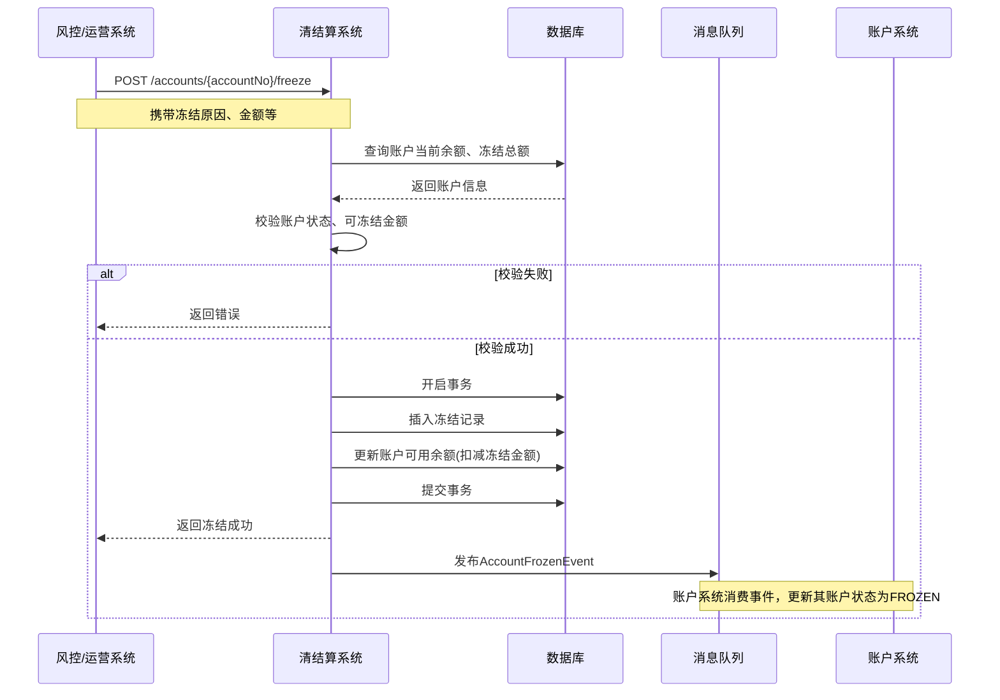
```mermaid
sequenceDiagram
    participant Client as 风控/运营系统
    participant Settle as 清结算系统
    participant DB as 数据库
    participant MQ as 消息队列
    participant Account as 账户系统

    Client->>Settle: POST /accounts/{accountNo}/freeze
    Note over Client,Settle: 携带冻结原因、金额等
    
    Settle->>DB: 查询账户当前余额、冻结总额
    DB-->>Settle: 返回账户信息
    Settle->>Settle: 校验账户状态、可冻结金额
    
    alt 校验失败
        Settle-->>Client: 返回错误
    else 校验成功
        Settle->>DB: 开启事务
        Settle->>DB: 插入冻结记录
        Settle->>DB: 更新账户可用余额(扣减冻结金额)
        Settle->>DB: 提交事务
        
        Settle-->>Client: 返回冻结成功
        
        Settle->>MQ: 发布AccountFrozenEvent
        Note over MQ,Account: 账户系统消费事件，更新其账户状态为FROZEN
    end
```

## 6. 错误处理

### 6.1 预期错误码
| 错误码 | HTTP状态码 | 描述 | 处理建议 |
|--------|------------|------|----------|
| `INSUFFICIENT_AVAILABLE_BALANCE` | 403 Forbidden | 付款方可用余额不足 | 提示充值或减少交易金额 |
| `ACCOUNT_FROZEN` | 403 Forbidden | 账户已被冻结 | 需先解冻账户 |
| `ACCOUNT_STATUS_INVALID` | 403 Forbidden | 账户状态非正常(如注销) | 检查账户状态 |
| `INTERNAL_ACCOUNT_BALANCE_INSUFFICIENT` | 403 Forbidden | 内部账户余额不足 | 检查被动结算商户的资金归集情况 |
| `DUPLICATE_REQUEST` | 409 Conflict | 重复请求 | 返回已存在的清算记录信息 |
| `REFUND_AMOUNT_EXCEED_LIMIT` | 400 Bad Request | 退款金额超过可退金额 | 核对原订单金额与已退款金额 |
| `SETTLEMENT_CONFIG_NOT_FOUND` | 404 Not Found | 商户结算配置不存在 | 检查商户ID或先配置结算规则 |
| `DATABASE_TRANSACTION_FAILED` | 500 Internal Server Error | 数据库事务失败 | 记录详细日志，触发告警，支持重试 |

### 6.2 处理策略
1. **资金操作事务失败**:
   - 资金划转（分账、结算、退款）必须在数据库事务内完成。事务失败整体回滚，返回明确错误，并记录详细日志供人工核查。
   - 对于因临时性数据库问题导致的失败，提供有限次数的自动重试（如3次），重试间隔递增。

2. **异步事件发布失败**:
   - 事件发布采用“本地事务消息表”模式。先将事件存入数据库事务中，再通过后台任务异步发送至MQ，确保事件不丢失。
   - 监控事件积压情况，及时告警。

3. **依赖服务不可用**:
   - 对账户系统的状态查询（非核心路径）设置熔断和降级。失败时可暂时使用本地缓存的最新状态（有数据不一致风险），或直接拒绝操作。
   - 核心的资金扣减/增加操作不依赖外部服务，自包含在事务内。

4. **对账与差错处理**:
   - 每日生成清算流水文件，与账户系统余额、下游支付渠道进行对账。
   - 发现账务不平（长短款）时，自动生成差错订单，进入差错处理平台人工干预。
   - 提供冲正接口，对状态为`PROCESSING`且长时间未完结的异常交易，支持人工触发冲正。

## 7. 依赖说明

### 7.1 上游依赖
1. **行业钱包系统** (强依赖):
   - **交互方式**: 同步HTTP调用
   - **职责**: 发起所有“天财分账”资金划转请求，是本模块最主要的调用方。
   - **降级方案**: 无。钱包调用失败意味着分账业务无法执行，需快速失败并告警。

2. **支付核心/收单系统** (强依赖):
   - **交互方式**: 异步事件消费
   - **职责**: 提供收单交易结算事件，驱动被动结算模式的资金入账。
   - **降级方案**: 事件可延迟处理，但需监控事件积压，防止资金滞留。

3. **三代系统** (弱依赖):
   - **交互方式**: 异步事件消费 + 同步接口调用(查询)
   - **职责**: 提供指令创建事件，并调用本模块查询账户余额。
   - **降级方案**: 事件消费可延迟。余额查询失败可返回缓存值或“查询失败”。

4. **账户系统** (弱依赖):
   - **交互方式**: 异步事件消费 + 同步接口调用(查询)
   - **职责**: 提供账户创建事件，并供本模块查询账户详细信息。
   - **降级方案**: 同三代系统。

### 7.2 下游依赖
1. **消息中间件(MQ)** (强依赖):
   - **用途**: 发布资金处理完成事件、账户冻结事件等。
   - **影响**: MQ不可用将影响其他系统的状态同步，需有本地存储和重发机制。

2. **数据库** (强依赖):
   - **用途**: 存储所有账户余额、交易流水、配置信息。
   - **影响**: 数据库不可用服务完全中断，需有高可用架构（主从、集群）。

### 7.3 依赖治理
- **超时配置**:
    - 被钱包系统调用: 核心接口超时设置5-10s，确保复杂事务有足够时间完成。
    - 调用账户系统查询: 超时2s，快速失败。
- **熔断与隔离**:
    - 对非核心的查询类外部依赖配置熔断器，避免其故障影响核心资金处理链路。
    - 资金处理服务与其他查询服务在资源（线程池、连接池）上进行隔离。
- **数据一致性**:
    - 与账户系统的余额一致性通过定期对账保证。本模块是资金余额的权威来源，账户系统更多记录账户属性。
    - 通过`SettlementCompletedEvent`与三代系统保持指令状态最终一致。

## 3.7 计费中台


# 计费中台模块设计文档

## 1. 概述

### 1.1 目的
计费中台是“天财分账”业务的核心计费服务模块，负责为各类分账业务（归集、批量付款、会员结算）提供统一、灵活、准确的手续费计算服务。它基于预配置的费率规则、业务场景和承担方策略，在分账指令执行前或执行后完成费用计算，确保手续费处理的透明性、一致性和可追溯性，并为对账和财务核算提供准确的费用数据。

### 1.2 范围
- **费率规则管理**：提供费率规则的配置、查询、启用/停用能力，支持基于商户、业务类型、账户类型、金额区间等多维度的费率策略。
- **手续费计算**：接收计费请求，根据业务场景和规则计算应收手续费，并明确费用承担方（付款方或收款方）。
- **计费记录与对账**：记录每一次计费请求的详细结果，生成标准化的计费记录，供对账单系统和财务系统消费。
- **费用试算**：提供费用试算接口，供业务方在发起实际交易前预估手续费。
- **不包含**：不直接参与资金扣划（由行业钱包系统执行）、不管理账户余额、不处理退款冲正（但提供费率查询用于冲正计算）。

## 2. 接口设计

### 2.1 API 端点 (RESTful)

#### 2.1.1 费率规则管理
- **POST /api/v1/fee/rules** - 创建费率规则
- **PUT /api/v1/fee/rules/{ruleId}** - 更新费率规则
- **POST /api/v1/fee/rules/{ruleId}/enable** - 启用费率规则
- **POST /api/v1/fee/rules/{ruleId}/disable** - 停用费率规则
- **GET /api/v1/fee/rules** - 查询费率规则列表
- **GET /api/v1/fee/rules/{ruleId}** - 查询费率规则详情

#### 2.1.2 手续费计算
- **POST /api/v1/fee/calculate** - 计算手续费（用于实际业务）
- **POST /api/v1/fee/estimate** - 试算手续费（用于预估值）
- **GET /api/v1/fee/records** - 查询计费记录（供对账、财务消费）

#### 2.1.3 健康检查与监控
- **GET /api/v1/health** - 服务健康检查
- **GET /api/v1/metrics** - 服务监控指标（如计费请求量、平均耗时、规则命中分布）

### 2.2 输入/输出数据结构

#### 2.2.1 创建费率规则请求 (`CreateFeeRuleRequest`)
```json
{
  "requestId": "req_fee_rule_20231028001",
  "ruleName": "天财-总部归集标准费率",
  "tiancaiId": "TC_ORG_001",
  "effectiveTime": "2023-11-01T00:00:00Z",
  "expiryTime": "2024-10-31T23:59:59Z",
  "priority": 10,
  "condition": {
    "businessType": "COLLECTION",
    "payerMerchantType": "STORE",
    "payeeMerchantType": "HEADQUARTERS",
    "minAmount": "0.01",
    "maxAmount": "1000000.00",
    "currency": "CNY"
  },
  "calculation": {
    "feeType": "PERCENTAGE",
    "feeRate": "0.001",
    "minFee": "1.00",
    "maxFee": "50.00",
    "feeBearer": "PAYER"
  },
  "description": "门店向总部归集，按金额0.1%收费，最低1元，最高50元，由付款方承担",
  "operator": "tiancai_admin"
}
```

#### 2.2.2 计算手续费请求 (`CalculateFeeRequest`)
```json
{
  "requestId": "req_calc_20231028001",
  "tiancaiId": "TC_ORG_001",
  "businessType": "COLLECTION",
  "payerMerchantId": "MCH_TC_STORE_001",
  "payerMerchantType": "STORE",
  "payerAccountNo": "TC_ACCT_STORE_001",
  "payeeMerchantId": "MCH_TC_HQ_001",
  "payeeMerchantType": "HEADQUARTERS",
  "payeeAccountNo": "TC_ACCT_HQ_001",
  "amount": "100000.00",
  "currency": "CNY",
  "businessReferenceNo": "ORDER_202310280001",
  "instructionId": "INST_COL_202310280001",
  "calculateTime": "2023-10-28T18:00:00Z"
}
```

#### 2.2.3 手续费计算结果 (`FeeCalculationResult`)
```json
{
  "code": "SUCCESS",
  "message": "手续费计算成功",
  "data": {
    "calculationId": "CALC_202310280001",
    "requestId": "req_calc_20231028001",
    "matchedRuleId": "RULE_COL_001",
    "businessType": "COLLECTION",
    "amount": "100000.00",
    "currency": "CNY",
    "feeType": "PERCENTAGE",
    "feeRate": "0.001",
    "calculatedFee": "100.00",
    "actualFee": "50.00",
    "minFee": "1.00",
    "maxFee": "50.00",
    "feeBearer": "PAYER",
    "calculationTime": "2023-10-28T18:00:01Z"
  }
}
```

#### 2.2.4 计费记录 (`FeeRecord`)
```json
{
  "recordId": "FEE_REC_202310280001",
  "calculationId": "CALC_202310280001",
  "instructionId": "INST_COL_202310280001",
  "requestId": "req_calc_20231028001",
  "tiancaiId": "TC_ORG_001",
  "businessType": "COLLECTION",
  "businessTime": "2023-10-28T18:00:00Z",
  "payerMerchantId": "MCH_TC_STORE_001",
  "payerAccountNo": "TC_ACCT_STORE_001",
  "payeeMerchantId": "MCH_TC_HQ_001",
  "payeeAccountNo": "TC_ACCT_HQ_001",
  "amount": "100000.00",
  "currency": "CNY",
  "matchedRuleId": "RULE_COL_001",
  "feeType": "PERCENTAGE",
  "feeRate": "0.001",
  "calculatedFee": "100.00",
  "actualFee": "50.00",
  "feeBearer": "PAYER",
  "status": "CALCULATED",
  "settlementStatus": "PENDING",
  "createdTime": "2023-10-28T18:00:01Z",
  "updatedTime": "2023-10-28T18:00:01Z"
}
```

### 2.3 发布/消费的事件

#### 2.3.1 发布的事件
- **FeeCalculatedEvent**: 当手续费计算完成并生成计费记录时发布，供下游系统（如对账单、财务系统）消费。
    ```json
    {
      "eventId": "evt_fee_calculated_001",
      "eventType": "FEE.CALCULATED",
      "timestamp": "2023-10-28T18:00:01Z",
      "payload": {
        "recordId": "FEE_REC_202310280001",
        "instructionId": "INST_COL_202310280001",
        "tiancaiId": "TC_ORG_001",
        "businessType": "COLLECTION",
        "payerAccountNo": "TC_ACCT_STORE_001",
        "payeeAccountNo": "TC_ACCT_HQ_001",
        "amount": "100000.00",
        "actualFee": "50.00",
        "feeBearer": "PAYER",
        "calculationTime": "2023-10-28T18:00:01Z"
      }
    }
    ```
- **FeeRuleChangedEvent**: 当费率规则创建、更新、启用或停用时发布，供相关系统（如缓存刷新）消费。

#### 2.3.2 消费的事件
- **InstructionCreatedEvent** (来自三代系统): 当分账指令创建时，可能触发异步计费流程（如果采用后计费模式）。
- **SettlementCompletedEvent** (来自清结算系统): 当分账资金结算完成时，更新对应计费记录的结算状态。
- **InstructionReversedEvent** (来自三代系统/清结算): 当分账指令被冲正时，需要生成对应的负向计费记录或标记原记录无效。

## 3. 数据模型

### 3.1 数据库表设计

#### 表: `fee_rule` (费率规则表)
| 字段名 | 类型 | 必填 | 默认值 | 说明 |
|--------|------|------|--------|------|
| `id` | BIGINT(20) | Y | AUTO_INCREMENT | 主键 |
| `rule_id` | VARCHAR(32) | Y | | **规则ID**，业务唯一标识，RULE_{类型}_{序列} |
| `rule_name` | VARCHAR(128) | Y | | 规则名称 |
| `tiancai_id` | VARCHAR(32) | Y | | 天财机构ID，ALL表示通用 |
| `effective_time` | DATETIME | Y | | 生效时间 |
| `expiry_time` | DATETIME | N | | 失效时间 |
| `priority` | INT | Y | 100 | 优先级，数字越小优先级越高 |
| `condition_json` | JSON | Y | | **条件配置**，存储JSON格式的匹配条件 |
| `calculation_json` | JSON | Y | | **计费配置**，存储JSON格式的计费规则 |
| `description` | VARCHAR(512) | N | | 规则描述 |
| `status` | TINYINT(1) | Y | 1 | 状态: 1-启用，2-停用 |
| `operator` | VARCHAR(64) | Y | | 操作人 |
| `created_time` | DATETIME | Y | CURRENT_TIMESTAMP | 创建时间 |
| `updated_time` | DATETIME | Y | CURRENT_TIMESTAMP ON UPDATE | 更新时间 |

**索引**:
- 唯一索引: `uk_rule_id` (`rule_id`)
- 索引: `idx_tiancai_status` (`tiancai_id`, `status`)
- 索引: `idx_effective_time` (`effective_time`, `expiry_time`)
- 索引: `idx_priority` (`priority`)

**condition_json 示例结构**:
```json
{
  "businessType": ["COLLECTION", "BATCH_PAYMENT"],
  "payerMerchantType": "STORE",
  "payeeMerchantType": "HEADQUARTERS",
  "payerAccountType": "INDUSTRY_WALLET",
  "minAmount": "0.01",
  "maxAmount": "1000000.00",
  "currency": "CNY",
  "customConditions": [
    {"field": "region", "operator": "IN", "value": ["华东", "华南"]}
  ]
}
```

**calculation_json 示例结构**:
```json
{
  "feeType": "PERCENTAGE",
  "feeRate": "0.001",
  "fixedFee": "0.00",
  "minFee": "1.00",
  "maxFee": "50.00",
  "feeBearer": "PAYER",
  "roundingMode": "HALF_UP",
  "scale": 2
}
```

#### 表: `fee_calculation` (计费记录表)
| 字段名 | 类型 | 必填 | 默认值 | 说明 |
|--------|------|------|--------|------|
| `id` | BIGINT(20) | Y | AUTO_INCREMENT | 主键 |
| `record_id` | VARCHAR(32) | Y | | **计费记录ID**，FEE_REC_{日期}{序列} |
| `calculation_id` | VARCHAR(32) | Y | | **计算ID**，CALC_{日期}{序列}，每次计算唯一 |
| `request_id` | VARCHAR(64) | Y | | 请求ID，用于幂等 |
| `instruction_id` | VARCHAR(32) | N | | 关联的分账指令ID |
| `tiancai_id` | VARCHAR(32) | Y | | 天财机构ID |
| `business_type` | TINYINT(1) | Y | | 业务类型: 1-归集，2-批量付款，3-会员结算 |
| `business_time` | DATETIME | Y | | 业务发生时间 |
| `payer_merchant_id` | VARCHAR(64) | Y | | 付款方商户ID |
| `payer_account_no` | VARCHAR(32) | Y | | 付款方账户号 |
| `payee_merchant_id` | VARCHAR(64) | N | | 收款方商户ID |
| `payee_account_no` | VARCHAR(32) | Y | | 收款方账户号 |
| `amount` | DECIMAL(15,2) | Y | | 业务金额 |
| `currency` | CHAR(3) | Y | CNY | 币种 |
| `matched_rule_id` | VARCHAR(32) | Y | | 匹配的费率规则ID |
| `fee_type` | TINYINT(1) | Y | | 费用类型: 1-百分比，2-固定金额 |
| `fee_rate` | DECIMAL(10,6) | N | | 费率（百分比时使用） |
| `fixed_fee` | DECIMAL(15,2) | N | | 固定费用（固定金额时使用） |
| `calculated_fee` | DECIMAL(15,2) | Y | | 计算出的原始费用 |
| `actual_fee` | DECIMAL(15,2) | Y | | 实际费用（经最低最高限制后） |
| `min_fee` | DECIMAL(15,2) | N | | 最低费用 |
| `max_fee` | DECIMAL(15,2) | N | | 最高费用 |
| `fee_bearer` | TINYINT(1) | Y | | 承担方: 1-付款方，2-收款方 |
| `status` | TINYINT(1) | Y | 1 | 状态: 1-已计算，2-已结算，3-已冲正，4-已退款 |
| `settlement_status` | TINYINT(1) | Y | 1 | 结算状态: 1-待结算，2-结算中，3-已结算 |
| `error_code` | VARCHAR(32) | N | | 错误码 |
| `error_message` | VARCHAR(512) | N | | 错误信息 |
| `created_time` | DATETIME | Y | CURRENT_TIMESTAMP | 创建时间 |
| `updated_time` | DATETIME | Y | CURRENT_TIMESTAMP ON UPDATE | 更新时间 |

**索引**:
- 唯一索引: `uk_record_id` (`record_id`)
- 唯一索引: `uk_calculation_id` (`calculation_id`)
- 唯一索引: `uk_request_id` (`request_id`)
- 索引: `idx_instruction_id` (`instruction_id`)
- 索引: `idx_business_time` (`business_time`)
- 索引: `idx_payer_account` (`payer_account_no`, `business_time`)
- 索引: `idx_status_settlement` (`status`, `settlement_status`)

#### 表: `fee_rule_history` (费率规则历史表)
| 字段名 | 类型 | 必填 | 默认值 | 说明 |
|--------|------|------|--------|------|
| `id` | BIGINT(20) | Y | AUTO_INCREMENT | 主键 |
| `rule_id` | VARCHAR(32) | Y | | 规则ID |
| `version` | INT | Y | 1 | 版本号 |
| `operation` | VARCHAR(32) | Y | | 操作: CREATE, UPDATE, ENABLE, DISABLE |
| `before_snapshot` | JSON | N | | 操作前的规则快照 |
| `after_snapshot` | JSON | Y | | 操作后的规则快照 |
| `operator` | VARCHAR(64) | Y | | 操作人 |
| `operation_time` | DATETIME | Y | CURRENT_TIMESTAMP | 操作时间 |
| `remark` | VARCHAR(256) | N | | 操作备注 |

**索引**:
- 索引: `idx_rule_version` (`rule_id`, `version`)
- 索引: `idx_operation_time` (`operation_time`)

### 3.2 与其他模块的关系
- **三代系统**: 主要上游调用方。在分账指令处理流程中，三代系统同步调用计费中台计算手续费，并接收计算结果。
- **行业钱包系统**: 下游依赖。钱包系统执行分账时，需要知道手续费金额和承担方，这些信息来自计费中台的计算结果。
- **对账单系统**: 下游数据消费者。消费`FeeCalculatedEvent`或直接查询计费记录，生成包含手续费明细的对账单。
- **财务系统**: 下游数据消费者。使用计费记录进行财务核算和收入确认。
- **清结算系统**: 弱关联。清结算系统完成资金结算后，通过事件通知计费中台更新结算状态。

## 4. 业务逻辑

### 4.1 核心算法

#### 4.1.1 费率规则匹配算法
```
输入: 计费请求参数 (businessType, payerInfo, payeeInfo, amount, currency等)
输出: 匹配的费率规则

步骤:
1. 根据tiancaiId筛选规则（包含'ALL'通用规则）
2. 过滤status=ENABLED的规则
3. 过滤effective_time <= 当前时间 <= expiry_time的规则
4. 按优先级(priority)升序排序
5. 遍历规则，使用规则条件(condition_json)匹配请求参数:
   a. 业务类型匹配
   b. 商户类型匹配
   c. 金额区间匹配
   d. 币种匹配
   e. 自定义条件匹配
6. 返回第一个完全匹配的规则，若无匹配则返回默认规则或报错
```

#### 4.1.2 手续费计算算法
```
输入: 匹配的费率规则(calculation_json), 业务金额(amount)
输出: 实际费用(actualFee)

步骤:
1. 根据feeType计算原始费用:
   - PERCENTAGE: calculatedFee = amount × feeRate
   - FIXED: calculatedFee = fixedFee
2. 应用费用限制:
   - 如果minFee存在且calculatedFee < minFee: actualFee = minFee
   - 如果maxFee存在且calculatedFee > maxFee: actualFee = maxFee
   - 否则: actualFee = calculatedFee
3. 按roundingMode和scale进行舍入
4. 返回actualFee
```

#### 4.1.3 ID生成算法
- **规则ID**: `RULE_{TYPE}_{8位序列号}` (TYPE: COL-归集, BAP-批量付款, MEM-会员结算, GEN-通用)
- **计费记录ID**: `FEE_REC_{YYYYMMDD}{8位序列号}`
- **计算ID**: `CALC_{YYYYMMDD}{8位序列号}`

### 4.2 业务规则

1. **费率规则优先级规则**:
   - 优先级数字越小，优先级越高。
   - 相同优先级下，按创建时间倒序（后创建的生效）。
   - 天财专属规则(tiancaiId=具体值)优先于通用规则(tiancaiId='ALL')。

2. **规则生效时间规则**:
   - 规则必须同时满足: 状态为启用(ENABLED)，且当前时间在生效时间和失效时间之间。
   - 失效时间为空表示永久有效。

3. **手续费承担方规则**:
   - 必须在费率规则中明确指定`feeBearer`为PAYER(付款方)或PAYEE(收款方)。
   - 承担方信息必须传递给下游执行系统（钱包系统）。

4. **计费记录状态流转规则**:
   - `CALCULATED` -> `SETTLED`: 当收到清结算系统的结算完成事件时更新。
   - `CALCULATED` -> `REVERSED`: 当原交易被冲正时，生成负向记录或标记原记录无效。
   - `PENDING_SETTLEMENT` -> `SETTLED`: 结算完成。

5. **幂等性规则**:
   - 相同的`requestId`多次请求，返回第一次计算的结果和记录。
   - 计费记录一旦生成，不允许修改（冲正除外）。

### 4.3 验证逻辑

1. **费率规则验证**:
   - 创建/更新规则时，验证条件配置的JSON格式和字段合法性。
   - 验证费率值合理性（百分比费率通常0-1之间，固定费用非负）。
   - 验证生效/失效时间逻辑（失效时间不能早于生效时间）。
   - 验证规则冲突：新规则不能与已生效的更高优先级规则在相同条件下冲突。

2. **计费请求验证**:
   - 验证必填字段：tiancaiId, businessType, payerAccountNo, payeeAccountNo, amount。
   - 验证金额大于0。
   - 验证币种支持。
   - 验证requestId格式。

3. **规则匹配验证**:
   - 确保至少有一条规则能匹配请求，否则返回明确的错误码`NO_MATCHING_RULE`。
   - 对于关键业务，可配置默认规则作为兜底。

## 5. 时序图

### 5.1 分账指令同步计费时序图

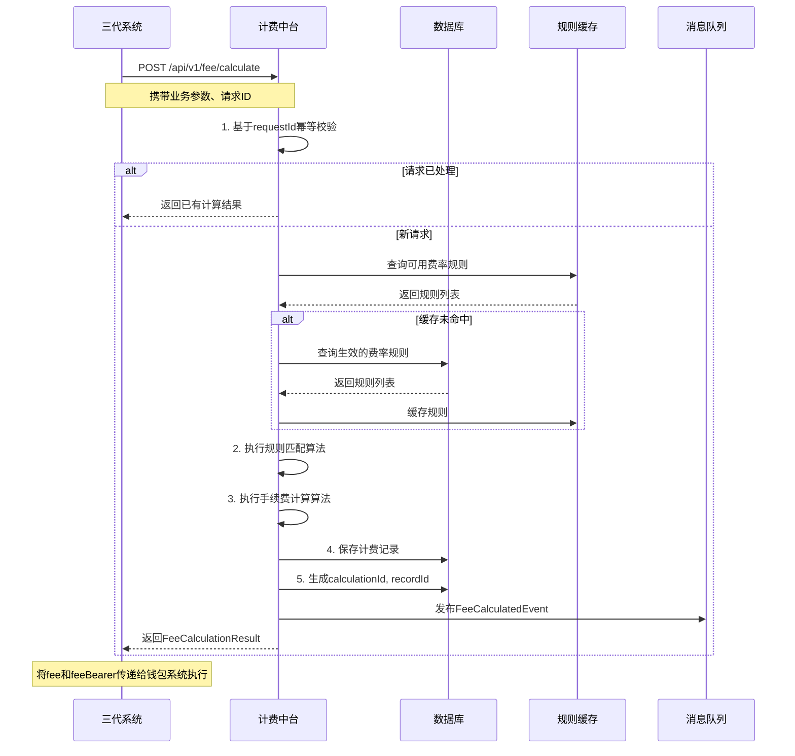
```mermaid
sequenceDiagram
    participant Gen3 as 三代系统
    participant Fee as 计费中台
    participant DB as 数据库
    participant Cache as 规则缓存
    participant MQ as 消息队列

    Gen3->>Fee: POST /api/v1/fee/calculate
    Note over Gen3,Fee: 携带业务参数、请求ID
    
    Fee->>Fee: 1. 基于requestId幂等校验
    alt 请求已处理
        Fee-->>Gen3: 返回已有计算结果
    else 新请求
        Fee->>Cache: 查询可用费率规则
        Cache-->>Fee: 返回规则列表
        alt 缓存未命中
            Fee->>DB: 查询生效的费率规则
            DB-->>Fee: 返回规则列表
            Fee->>Cache: 缓存规则
        end
        
        Fee->>Fee: 2. 执行规则匹配算法
        Fee->>Fee: 3. 执行手续费计算算法
        
        Fee->>DB: 4. 保存计费记录
        Fee->>DB: 5. 生成calculationId, recordId
        
        Fee->>MQ: 发布FeeCalculatedEvent
        
        Fee-->>Gen3: 返回FeeCalculationResult
    end
    
    Note over Gen3: 将fee和feeBearer传递给钱包系统执行
```

### 5.2 费率规则匹配与计算详细流程

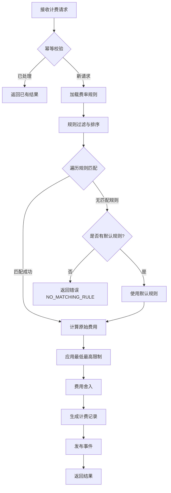
```mermaid
flowchart TD
    A[接收计费请求] --> B{幂等校验}
    B -->|已处理| C[返回已有结果]
    B -->|新请求| D[加载费率规则]
    D --> E[规则过滤与排序]
    E --> F{遍历规则匹配}
    
    F -->|匹配成功| G[计算原始费用]
    G --> H[应用最低最高限制]
    H --> I[费用舍入]
    I --> J[生成计费记录]
    J --> K[发布事件]
    K --> L[返回结果]
    
    F -->|无匹配规则| M{是否有默认规则?}
    M -->|是| N[使用默认规则]
    N --> G
    M -->|否| O[返回错误 NO_MATCHING_RULE]
```

## 6. 错误处理

### 6.1 预期错误码
| 错误码 | HTTP状态码 | 描述 | 处理建议 |
|--------|------------|------|----------|
| `NO_MATCHING_RULE` | 404 Not Found | 未找到匹配的费率规则 | 检查费率规则配置，或配置默认规则 |
| `INVALID_FEE_RULE` | 400 Bad Request | 费率规则配置无效 | 检查规则的条件和计算配置格式 |
| `INVALID_AMOUNT` | 400 Bad Request | 金额参数无效 | 金额必须大于0，且符合精度要求 |
| `DUPLICATE_REQUEST` | 409 Conflict | 重复的计费请求 | 返回已计算的结果 |
| `FEE_CALCULATION_ERROR` | 500 Internal Server Error | 手续费计算过程错误 | 检查计算逻辑，查看日志 |
| `RATE_LIMIT_EXCEEDED` | 429 Too Many Requests | 请求频率超限 | 降低调用频率或申请更高配额 |
| `SERVICE_UNAVAILABLE` | 503 Service Unavailable | 服务暂时不可用 | 检查依赖的数据库、缓存状态 |

### 6.2 处理策略

1. **规则匹配失败**:
   - 配置默认费率规则作为兜底，确保业务不中断。
   - 记录告警，通知运营人员检查规则配置。
   - 返回详细的不匹配原因，便于调试。

2. **计算过程异常**:
   - 对于数学计算错误（如除零、溢出），记录详细上下文并返回错误。
   - 对于配置错误（如费率格式错误），标记对应规则为停用，并告警。

3. **依赖服务故障**:
   - **数据库故障**: 熔断机制，返回服务不可用错误，依赖方应重试。
   - **缓存故障**: 降级直接查询数据库，性能可能下降但功能可用。
   - **消息队列故障**: 记录本地日志，等待MQ恢复后重发事件。

4. **数据一致性保证**:
   - 计费记录生成采用数据库事务，确保记录和状态原子性更新。
   - 对于异步事件发布，采用本地事务消息表模式，确保事件最终发出。

5. **监控与告警**:
   - 监控规则匹配失败率、计算错误率、平均响应时间。
   - 监控缓存命中率、数据库连接池状态。
   - 当无匹配规则告警触发时，自动通知规则配置负责人。

## 7. 依赖说明

### 7.1 上游依赖

1. **三代系统** (强依赖):
   - **交互方式**: 同步HTTP调用
   - **职责**: 在分账指令处理流程中调用计费中台计算手续费。
   - **调用时机**: 指令校验通过后，发送给钱包系统前。
   - **降级方案**: 无直接降级。若计费中台不可用，分账业务无法进行。可考虑：
        - 短期: 使用上次成功费率或默认费率（需业务方确认风险）。
        - 长期: 必须修复计费中台。

2. **管理控制台/运营系统** (弱依赖):
   - **交互方式**: 同步HTTP调用
   - **职责**: 提供费率规则的配置管理界面。
   - **降级方案**: 规则配置可延迟，不影响已有规则的计算。

### 7.2 下游依赖

1. **数据库** (强依赖):
   - **存储内容**: 费率规则、计费记录、规则历史。
   - **降级方案**: 主从切换、读写分离。完全不可用时服务中断。

2. **分布式缓存** (弱依赖):
   - **缓存内容**: 生效的费率规则，按tiancaiId和业务类型分组缓存。
   - **降级方案**: 缓存未命中时直接查询数据库，性能下降但功能可用。

3. **消息队列** (弱依赖):
   - **用途**: 发布`FeeCalculatedEvent`、`FeeRuleChangedEvent`。
   - **降级方案**: 事件可暂存本地，待MQ恢复后重发。或下游系统改为主动查询。

### 7.3 依赖治理

- **超时与重试**:
    - 对三代系统的接口调用: 超时3s，不重试（由调用方决定重试策略）。
    - 数据库查询: 超时2s，根据错误类型决定重试。
    - 缓存操作: 超时1s，快速失败，降级查库。

- **熔断与降级**:
    - 数据库熔断: 当错误率超过阈值，熔断打开，直接返回服务不可用。
    - 缓存降级: 缓存异常时自动降级到数据库查询。
    - 规则缓存预热: 服务启动时预热高频规则到缓存。

- **性能优化**:
    - 费率规则缓存: 规则变更时通过事件刷新缓存。
    - 批量查询优化: 为对账单系统提供批量查询接口，减少频繁调用。
    - 计算结果缓存: 对相同的业务参数可缓存计算结果（注意金额变化）。

## 3.8 行业钱包系统


# 行业钱包系统模块设计文档

## 1. 概述

### 1.1 目的
行业钱包系统是“天财分账”业务的核心资金流转引擎，负责处理基于天财专用账户的资金划转请求。它作为业务层（三代系统）与底层资金处理层（清结算系统）之间的桥梁，专注于执行“天财分账”这一特定交易类型，并确保资金流转的准确性、安全性与可追溯性。本模块是分账、归集、批量付款、会员结算等场景的最终执行者。

### 1.2 范围
- **分账指令执行**：接收并执行来自三代系统的分账指令，将资金从一个天财收款账户划转至另一个天财收款账户或天财接收方账户。
- **账户关系校验**：在执行分账前，对收付款账户的合法性、状态、以及业务关系（如归集关系）进行校验。
- **手续费处理**：与计费中台协同，处理分账交易的手续费计算、扣收与记录。
- **交易记录生成**：生成标准化的“天财分账”交易记录，为业务核心和对账单系统提供数据源。
- **指令状态同步**：将分账执行结果（成功/失败）同步回三代系统，驱动业务流程更新。
- **不包含**：不负责账户的创建与管理（账户系统）、不负责业务逻辑校验与流程编排（三代系统）、不负责底层的资金清算与记账（清结算系统）、不直接处理签约认证（电子签约平台）。

## 2. 接口设计

### 2.1 API 端点 (RESTful)

#### 2.1.1 分账交易执行
- **POST /api/v1/transfers/tiancai-split** - 执行天财分账（核心接口）

#### 2.1.2 交易查询
- **GET /api/v1/transfers/{transferNo}** - 查询单笔分账交易详情
- **GET /api/v1/transfers** - 根据条件（账户、时间、状态）查询分账交易列表（支持分页）

#### 2.1.3 业务校验（内部/管理）
- **POST /api/v1/validations/relationship** - 校验两个账户间是否存在有效的分账业务关系

### 2.2 输入/输出数据结构

#### 2.2.1 执行天财分账请求 (`ExecuteTiancaiSplitRequest`)
```json
{
  "requestId": "wallet_req_20231029001",
  "instructionId": "INST_COL_202310280001",
  "instructionType": "COLLECTION", // 枚举: COLLECTION, BATCH_PAYMENT, MEMBER_SETTLEMENT
  "payerAccountNo": "TC_ACCT_STORE_001",
  "payeeAccountNo": "TC_ACCT_HQ_001",
  "amount": 100000,
  "currency": "CNY",
  "businessType": "TIANCAI_SPLIT", // 固定值，标识交易类型
  "fee": 100,
  "feeBearer": "PAYER", // 枚举: PAYER, PAYEE
  "businessReferenceNo": "ORDER_202310280001",
  "remark": "门店日终归集",
  "operator": "system_job",
  "extInfo": {
    "sourceSystem": "GEN3",
    "relationshipNo": "REL_COL_202310270001", // 关联的业务关系编号
    "payerMerchantId": "MCH_TC_STORE_001",
    "payeeMerchantId": "MCH_TC_HQ_001"
  }
}
```

#### 2.2.2 天财分账响应 (`TiancaiSplitResponse`)
```json
{
  "code": "SUCCESS",
  "message": "受理成功",
  "data": {
    "transferNo": "WTR_20231029000001",
    "requestId": "wallet_req_20231029001",
    "instructionId": "INST_COL_202310280001",
    "status": "PROCESSING", // 受理时状态为 PROCESSING
    "payerAccountNo": "TC_ACCT_STORE_001",
    "payeeAccountNo": "TC_ACCT_HQ_001",
    "amount": 100000,
    "fee": 100,
    "feeBearer": "PAYER",
    "estimatedCompletionTime": "2023-10-29T18:00:05Z",
    "createdTime": "2023-10-29T18:00:00Z"
  }
}
```

#### 2.2.3 分账交易详情响应 (`TransferDetailResponse`)
```json
{
  "code": "SUCCESS",
  "message": "查询成功",
  "data": {
    "transferNo": "WTR_20231029000001",
    "instructionId": "INST_COL_202310280001",
    "instructionType": "COLLECTION",
    "status": "SUCCESS", // 最终状态: SUCCESS, FAILED, PROCESSING
    "payerAccountNo": "TC_ACCT_STORE_001",
    "payeeAccountNo": "TC_ACCT_HQ_001",
    "amount": 100000,
    "currency": "CNY",
    "fee": 100,
    "feeBearer": "PAYER",
    "businessReferenceNo": "ORDER_202310280001",
    "remark": "门店日终归集",
    "settlementSerialNo": "STL_20231029000001", // 清结算系统流水号
    "errorCode": null,
    "errorMessage": null,
    "createdTime": "2023-10-29T18:00:00Z",
    "completedTime": "2023-10-29T18:00:03Z"
  }
}
```

#### 2.2.4 关系校验请求 (`ValidateRelationshipRequest`)
```json
{
  "payerAccountNo": "TC_ACCT_STORE_001",
  "payeeAccountNo": "TC_ACCT_HQ_001",
  "businessType": "COLLECTION" // 可选，指定校验的业务类型
}
```

#### 2.2.5 关系校验响应 (`ValidateRelationshipResponse`)
```json
{
  "code": "SUCCESS",
  "message": "关系校验通过",
  "data": {
    "isValid": true,
    "relationshipNo": "REL_COL_202310270001",
    "relationshipType": "COLLECTION",
    "authStatus": "SIGNED",
    "isActive": true,
    "effectiveTime": "2023-10-27T10:00:00Z",
    "expiryTime": "2024-10-27T10:00:00Z"
  }
}
```

### 2.3 发布/消费的事件

#### 2.3.1 发布的事件
- **TiancaiSplitTransferCreatedEvent**: 天财分账交易创建并受理成功时发布。
    ```json
    {
      "eventId": "evt_wallet_transfer_created_001",
      "eventType": "WALLET.TIANCAI_SPLIT.CREATED",
      "timestamp": "2023-10-29T18:00:01Z",
      "payload": {
        "transferNo": "WTR_20231029000001",
        "instructionId": "INST_COL_202310280001",
        "payerAccountNo": "TC_ACCT_STORE_001",
        "payeeAccountNo": "TC_ACCT_HQ_001",
        "amount": 100000,
        "businessType": "TIANCAI_SPLIT",
        "status": "PROCESSING"
      }
    }
    ```
- **TiancaiSplitTransferCompletedEvent**: 天财分账交易最终完成（成功或失败）时发布。此事件是驱动业务核心生成交易记录、三代系统更新指令状态的关键事件。
    ```json
    {
      "eventId": "evt_wallet_transfer_completed_001",
      "eventType": "WALLET.TIANCAI_SPLIT.COMPLETED",
      "timestamp": "2023-10-29T18:00:03Z",
      "payload": {
        "transferNo": "WTR_20231029000001",
        "instructionId": "INST_COL_202310280001",
        "status": "SUCCESS",
        "settlementSerialNo": "STL_20231029000001",
        "completedTime": "2023-10-29T18:00:03Z",
        "errorCode": null,
        "errorMessage": null
      }
    }
    ```

#### 2.3.2 消费的事件
- **AccountStatusChangedEvent** (来自账户系统): 当相关账户状态变更（如冻结、注销）时，更新本地缓存或中断处理中的交易。
- **RelationshipEstablishedEvent** / **RelationshipDisabledEvent** (来自三代系统): 当分账关系建立或失效时，更新本地关系缓存，用于后续交易校验。

## 3. 数据模型

### 3.1 数据库表设计

#### 表: `wallet_transfer` (钱包分账交易表)
| 字段名 | 类型 | 必填 | 默认值 | 说明 |
|--------|------|------|--------|------|
| `id` | BIGINT(20) | Y | AUTO_INCREMENT | 主键 |
| `transfer_no` | VARCHAR(32) | Y | | **钱包交易流水号**，唯一业务标识，格式: WTR_{日期}{6位序列} |
| `request_id` | VARCHAR(64) | Y | | 外部请求ID，用于幂等 |
| `instruction_id` | VARCHAR(32) | Y | | 关联的三代系统指令ID |
| `instruction_type` | TINYINT(1) | Y | | 指令类型: 1-归集，2-批量付款，3-会员结算 |
| `business_type` | VARCHAR(32) | Y | | 业务类型: TIANCAI_SPLIT |
| `payer_account_no` | VARCHAR(32) | Y | | 付款方账户号 |
| `payee_account_no` | VARCHAR(32) | Y | | 收款方账户号 |
| `amount` | DECIMAL(15,2) | Y | | 交易金额 |
| `currency` | CHAR(3) | Y | CNY | 币种 |
| `fee` | DECIMAL(15,2) | N | | 手续费金额 |
| `fee_bearer` | TINYINT(1) | N | | 手续费承担方: 1-付款方，2-收款方 |
| `status` | TINYINT(1) | Y | 0 | 状态: 0-已受理，1-处理中，2-成功，3-失败，4-已冲正 |
| `business_reference_no` | VARCHAR(64) | N | | 业务参考号 |
| `remark` | VARCHAR(256) | N | | 备注 |
| `settlement_serial_no` | VARCHAR(64) | N | | 清结算系统流水号 |
| `relationship_no` | VARCHAR(32) | N | | 关联的业务关系编号 |
| `error_code` | VARCHAR(32) | N | | 错误码 |
| `error_message` | VARCHAR(512) | N | | 错误信息 |
| `retry_count` | TINYINT(2) | Y | 0 | 重试次数 |
| `next_retry_time` | DATETIME | N | | 下次重试时间 |
| `version` | INT(11) | Y | 1 | 乐观锁版本号 |
| `created_time` | DATETIME | Y | CURRENT_TIMESTAMP | 创建时间 |
| `updated_time` | DATETIME | Y | CURRENT_TIMESTAMP ON UPDATE | 更新时间 |
| `completed_time` | DATETIME | N | | 完成时间 |

**索引**:
- 唯一索引: `uk_transfer_no` (`transfer_no`)
- 唯一索引: `uk_request_id` (`request_id`)
- 索引: `idx_instruction_id` (`instruction_id`)
- 索引: `idx_payer_account_time` (`payer_account_no`, `created_time`)
- 索引: `idx_status_retry` (`status`, `next_retry_time`)
- 索引: `idx_settlement_serial_no` (`settlement_serial_no`)

#### 表: `account_relationship_cache` (账户关系缓存表)
| 字段名 | 类型 | 必填 | 默认值 | 说明 |
|--------|------|------|--------|------|
| `id` | BIGINT(20) | Y | AUTO_INCREMENT | 主键 |
| `payer_account_no` | VARCHAR(32) | Y | | 付款方账户号 |
| `payee_account_no` | VARCHAR(32) | Y | | 收款方账户号 |
| `relationship_no` | VARCHAR(32) | Y | | 关系编号 |
| `relationship_type` | TINYINT(1) | Y | | 关系类型: 1-归集，2-批量付款，3-会员结算 |
| `auth_status` | TINYINT(1) | Y | | 认证状态: 0-未签约，1-已签约 |
| `is_active` | TINYINT(1) | Y | | 是否生效: 0-否，1-是 |
| `effective_time` | DATETIME | N | | 生效时间 |
| `expiry_time` | DATETIME | N | | 失效时间 |
| `last_verified_time` | DATETIME | Y | CURRENT_TIMESTAMP | 最后验证时间（用于缓存过期） |
| `created_time` | DATETIME | Y | CURRENT_TIMESTAMP | 创建时间 |
| `updated_time` | DATETIME | Y | CURRENT_TIMESTAMP ON UPDATE | 更新时间 |

**索引**:
- 唯一索引: `uk_payer_payee_type` (`payer_account_no`, `payee_account_no`, `relationship_type`)
- 索引: `idx_relationship_no` (`relationship_no`)
- 索引: `idx_active_expiry` (`is_active`, `expiry_time`)

### 3.2 与其他模块的关系
- **三代系统**: **核心上游调用方**。接收其分账指令，执行资金划转，并通过事件同步结果。依赖其提供准确的业务上下文（指令ID、关系信息）。
- **清结算系统**: **核心下游依赖**。调用其资金划转接口完成实际的记账操作，并监听其结算结果事件。是本模块完成交易的最终保障。
- **账户系统**: **强依赖**。用于校验收付款账户的状态、类型、标签等信息，确保交易基础合法性。
- **计费中台**: **弱依赖**。在交易执行前或后，可能需要调用其进行手续费的计算或确认（尽管手续费信息通常由三代系统提供）。
- **业务核心**: **事件消费者**。消费本模块发布的`TiancaiSplitTransferCompletedEvent`，生成“天财分账”交易记录，作为对账单的数据源。
- **消息中间件**: **强依赖**。用于发布交易事件，实现与下游系统的异步解耦。

## 4. 业务逻辑

### 4.1 核心算法
**钱包交易流水号生成算法**:
```
WTR_{YYYYMMDD}{6位序列号}
```
- 日期部分: 交易创建日期
- 序列号: 每日从1开始自增，确保当日唯一，通过数据库序列或Redis原子操作实现。

**交易状态机**:
```
已受理(RECEIVED) 
    → 处理中(PROCESSING) 
        → 成功(SUCCESS)
        → 失败(FAILED) → (可选)重试 → 处理中(PROCESSING)
    → (异常)已冲正(REVERSED)
```
- `已受理`: 接口校验通过，交易记录落库。
- `处理中`: 已调用清结算系统，等待异步回调或轮询结果。
- `成功/失败`: 收到清结算最终结果。
- `已冲正`: 针对成功交易，因业务原因发起的逆向冲正。

### 4.2 业务规则
1. **账户校验规则**:
   - 付款方账户必须是天财收款账户（标签包含`TIANCAI_SPECIAL`）。
   - 收款方账户可以是天财收款账户或天财接收方账户。
   - 双方账户状态必须为`ACTIVE`（正常），且未被冻结。
   - 付款方账户不能是“被动结算”模式下的待结算账户（`relatedInternalAccount='01'`），必须是已结算到账的专用账户。

2. **业务关系校验规则**:
   - 对于**归集**：付款方（门店）与收款方（总部）之间必须存在已签约(`auth_status=SIGNED`)且生效(`is_active=1`)的归集关系，且在有效期内。
   - 对于**批量付款/会员结算**：付款方（总部）必须已完成“开通付款”签约。具体收款方关系校验由三代系统完成，本模块可做二次校验（通过缓存）。
   - 关系校验支持本地缓存，缓存失效或未命中时，可调用三代系统接口实时查询。

3. **交易执行规则**:
   - 严格幂等：基于`requestId`防止同一指令重复执行。
   - 金额必须大于0。
   - 手续费处理：根据`feeBearer`，决定手续费是从付款方额外扣除，还是从收款方到账金额中扣除。需在调用清结算时明确体现。

4. **与清结算交互规则**:
   - 调用清结算的“内部转账”或“代付”接口，交易类型明确为`TIANCAI_SPLIT`。
   - 需传递完整的业务信息（`instructionId`, `transferNo`, `businessReferenceNo`）以便关联。
   - 采用“异步回调+主动查询”机制获取最终结果。

### 4.3 验证逻辑
1. **请求基础校验**:
   - `requestId`、`instructionId`、`payerAccountNo`、`payeeAccountNo`、`amount` 必填。
   - `amount` 需大于0且符合金额格式。
   - `feeBearer` 与 `fee` 逻辑一致性校验（有fee则必须有feeBearer）。

2. **账户状态校验**:
   - 同步调用账户系统`GET /accounts/{accountNo}`接口，检查账户存在性、类型、状态、标签。
   - 对付款方账户进行重点风控检查（如单笔/日累计限额，可配置）。

3. **业务关系校验**:
   - 优先查询本地`account_relationship_cache`。
   - 缓存命中且有效：直接通过。
   - 缓存未命中或过期：调用三代系统关系查询接口（或内部校验接口）进行验证，并刷新缓存。

4. **防重复与并发控制**:
   - 数据库层通过`request_id`唯一索引防止重复交易。
   - 对同一付款账户的并发交易，采用数据库乐观锁(`version`)或分布式锁（针对大额/高频）防止超额支付。

## 5. 时序图

### 5.1 处理天财分账指令时序图

```mermaid
sequenceDiagram
    participant Gen3 as 三代系统
    participant Wallet as 行业钱包系统
    participant Account as 账户系统
    participant Cache as 关系缓存(DB)
    participant Settle as 清结算系统
    participant MQ as 消息队列
    participant Core as 业务核心

    Gen3->>Wallet: POST /transfers/tiancai-split
    Note over Gen3,Wallet: 携带指令、账户、金额、手续费等信息

    Wallet->>Wallet: 1. 基于requestId幂等校验
    Wallet->>Wallet: 2. 请求参数基础校验
    
    Wallet->>Account: 查询付款方账户详情
    Account-->>Wallet: 返回账户状态、标签
    Wallet->>Account: 查询收款方账户详情
    Account-->>Wallet: 返回账户状态、类型
    
    Wallet->>Cache: 查询账户关系缓存
    alt 缓存有效且命中
        Cache-->>Wallet: 返回关系信息
    else 缓存无效或未命中
        Wallet->>Gen3: (内部)调用关系校验接口
        Gen3-->>Wallet: 返回关系校验结果
        Wallet->>Cache: 更新关系缓存
    end
    
    Wallet->>Wallet: 综合校验（账户状态、关系、金额等）
    
    alt 校验失败
        Wallet-->>Gen3: 返回错误响应
    else 校验成功
        Wallet->>Wallet: 生成transferNo，落库(状态:PROCESSING)
        Wallet->>MQ: 发布TiancaiSplitTransferCreatedEvent
        Wallet->>Settle: 调用资金划转接口
        Note over Wallet,Settle: 传递交易信息，请求异步回调
        Settle-->>Wallet: 返回受理成功(含settlementSerialNo)
        Wallet->>Wallet: 更新交易记录，填入settlementSerialNo
        Wallet-->>Gen3: 返回受理成功响应
    end

    Note over Settle, MQ: 清结算异步处理资金记账...
    
    Settle->>MQ: 发布SettlementCompletedEvent
    MQ->>Wallet: 消费事件
    Wallet->>Wallet: 根据结算结果更新交易状态(SUCCESS/FAILED)
    Wallet->>MQ: 发布TiancaiSplitTransferCompletedEvent
    
    MQ->>Core: 消费事件，生成业务记录
    MQ->>Gen3: 消费事件，更新指令状态
```

### 5.2 分账交易结果查询与重试时序图

```mermaid
sequenceDiagram
    participant Admin as 管理端/监控任务
    participant Wallet as 行业钱包系统
    participant Settle as 清结算系统
    participant MQ as 消息队列

    Admin->>Wallet: GET /transfers?status=PROCESSING&createdTime<阈值
    Wallet-->>Admin: 返回处理中超时的交易列表
    
    loop 对每笔超时交易
        Admin->>Wallet: POST /transfers/{transferNo}/retry (或自动触发)
        Wallet->>Settle: 调用交易结果查询接口
        Settle-->>Wallet: 返回交易最终状态
        alt 状态已明确
            Wallet->>Wallet: 更新交易状态
            Wallet->>MQ: 发布TiancaiSplitTransferCompletedEvent
        else 状态仍处理中或查询失败
            Wallet->>Wallet: 更新下次重试时间，增加重试计数
        end
    end
```

## 6. 错误处理

### 6.1 预期错误码
| 错误码 | HTTP状态码 | 描述 | 处理建议 |
|--------|------------|------|----------|
| `DUPLICATE_REQUEST_ID` | 409 Conflict | 重复的请求ID | 返回已创建交易的信息，实现幂等 |
| `PAYER_ACCOUNT_NOT_FOUND` | 404 Not Found | 付款方账户不存在 | 检查账户号，或联系管理员 |
| `PAYER_ACCOUNT_FROZEN` | 403 Forbidden | 付款方账户已冻结 | 需解冻账户后才能交易 |
| `PAYER_ACCOUNT_INVALID_TYPE` | 400 Bad Request | 付款方账户非天财收款账户 | 检查账户类型和标签 |
| `RELATIONSHIP_NOT_VALID` | 403 Forbidden | 业务关系不合法或未生效 | 检查关系签约状态，完成签约流程 |
| `INSUFFICIENT_BALANCE` | 403 Forbidden | 付款方账户余额不足 | 提示充值或减少交易金额 |
| `SETTLEMENT_SERVICE_FAILED` | 502 Bad Gateway | 清结算服务调用失败 | 交易状态置为`PROCESSING`，启动异步重试机制 |
| `SETTLEMENT_TIMEOUT` | 504 Gateway Timeout | 清结算处理超时 | 交易状态保持`PROCESSING`，由定时任务后续查询 |
| `AMOUNT_EXCEEDS_LIMIT` | 403 Forbidden | 交易金额超限（单笔/日累计） | 调整金额或申请提额 |

### 6.2 处理策略
1. **同步校验失败**: 在调用清结算前发生的错误（如参数、账户、关系校验失败），直接同步返回错误，不创建交易记录。

2. **清结算调用失败**:
   - **网络超时/服务不可用**: 交易记录状态保持为`PROCESSING`，记录错误日志，并触发异步重试机制（通过后台任务定期重试调用或查询）。
   - **清结算返回业务失败**（如余额不足、账户状态不符）: 更新交易状态为`FAILED`，记录具体错误码，并发布完成事件。

3. **异步结果丢失**: 若长时间未收到清结算的`SettlementCompletedEvent`回调，由**定时补偿任务**主动查询`PROCESSING`状态且创建时间超过阈值的交易，向清结算系统查询最终状态并更新。

4. **重试机制**:
   - 对可重试错误（如网络超时），采用指数退避策略，最大重试次数可配置（如5次）。
   - 重试后仍失败，交易状态最终置为`FAILED`，并需人工介入排查。

5. **监控与告警**:
   - 监控交易失败率、平均处理时长、清结算接口可用性。
   - 对`PROCESSING`状态交易堆积、重试次数过多等情况设置告警。

## 7. 依赖说明

### 7.1 上游模块交互
1. **三代系统**:
   - **交互方式**: 同步HTTP调用（分账执行） + 异步事件消费（关系变更事件） + 同步HTTP调用（关系校验，缓存未命中时）。
   - **职责**: 提供已验证的业务指令和上下文。是本模块业务合法性的主要依据来源之一。
   - **降级方案**: 无。分账执行是核心流程，三代系统不可用则业务无法发起。关系校验可依赖缓存，但缓存过期后若三代系统不可用，新关系交易将失败。

### 7.2 下游依赖
1. **清结算系统**:
   - **交互方式**: 同步HTTP调用（发起转账） + 异步事件消费（结算结果事件） + 同步HTTP调用（结果查询，补偿用）。
   - **职责**: 执行底层资金记账，是交易成功的最终决定方。
   - **降级方案**: **无直接降级方案**。清结算不可用，所有分账交易将阻塞。必须保证其高可用，并通过异步化、队列化提高系统韧性。

2. **账户系统**:
   - **交互方式**: 同步HTTP调用（账户查询） + 异步事件消费（账户状态变更事件）。
   - **职责**: 提供账户实时状态与属性，是交易安全的基础校验依据。
   - **降级方案**: 可配置为“宽松模式”，在账户系统短暂不可用时，信任上游（三代系统）传递的账户信息并记录日志，但会引入风险。通常建议快速失败。

3. **计费中台**:
   - **交互方式**: 同步HTTP调用（手续费确认/计算）。
   - **职责**: 提供准确的手续费信息。
   - **降级方案**: 若调用失败，可使用请求中已携带的`fee`和`feeBearer`（由三代系统预先计算），并记录降级日志。确保业务可继续，但需事后核对。

### 7.3 依赖治理
- **超时配置**:
    - 调用清结算: 连接超时3s，读超时10s（因处理可能较慢）。
    - 调用账户系统: 超时2s。
    - 调用三代系统（关系校验）: 超时3s。
- **熔断与降级**:
    - 对清结算、账户系统配置熔断器，防止因下游故障导致线程池耗尽。
    - 对计费中台配置降级策略。
- **异步化与削峰**:
    - 将交易创建与清结算调用解耦。交易校验通过后立即返回受理成功，清结算调用可放入内部队列异步执行，应对瞬间高峰。
- **缓存策略**:
    - 账户关系缓存设置合理的TTL（如5分钟），并监听关系变更事件实时刷新，平衡实时性与性能。

## 3.9 业务核心


## 1. 概述

### 1.1 目的
业务核心模块是“天财分账”业务的交易记录中枢和数据处理中心。它不直接处理资金流转，而是作为所有“天财分账”交易的忠实记录者，负责接收并持久化由行业钱包系统触发的分账交易完成事件，生成标准化的业务交易记录。这些记录是下游对账单系统（特别是“天财分账指令账单”）的**唯一、权威数据源**，为商户、财务和运营人员提供清晰、可追溯的业务视图。本模块的核心价值在于**数据准确性与一致性**。

### 1.2 范围
- **交易记录生成**：监听并处理`TiancaiSplitTransferCompletedEvent`事件，将成功的分账交易转化为本系统的业务记录。
- **数据丰富与关联**：基于事件数据，关联并补充业务上下文信息（如商户名称、门店信息、业务场景描述），形成对用户友好的交易记录。
- **查询与统计**：提供按账户、时间、业务类型等维度的交易记录查询接口，支持对账单生成和业务分析。
- **数据一致性保障**：确保每笔成功的分账交易在本模块有且仅有一条对应的业务记录，并通过幂等机制防止重复处理。
- **不包含**：不发起或执行任何资金操作（行业钱包系统职责）、不进行复杂的业务逻辑校验（三代系统职责）、不直接生成对账单文件（对账单系统职责）、不管理账户或关系（账户系统/三代系统职责）。

## 2. 接口设计

### 2.1 API 端点 (RESTful)

#### 2.1.1 业务记录查询
- **GET /api/v1/biz-records/{recordId}** - 查询单笔业务记录详情
- **GET /api/v1/biz-records** - 根据条件查询业务记录列表（支持分页、多维度筛选）

#### 2.1.2 对账单数据供给（内部）
- **POST /api/v1/internal/statement-data** - 为对账单系统提供指定维度的原始交易数据（批量拉取）
- **GET /api/v1/internal/accounts/{accountNo}/records** - 获取指定账户在特定时间范围内的所有交易记录（供账户维度对账单使用）

### 2.2 输入/输出数据结构

#### 2.2.1 业务记录详情响应 (`BizRecordDetailResponse`)
```json
{
  "code": "SUCCESS",
  "message": "查询成功",
  "data": {
    "recordId": "BIZ_20231029000001",
    "transferNo": "WTR_20231029000001",
    "instructionId": "INST_COL_202310280001",
    "instructionType": "COLLECTION",
    "businessType": "TIANCAI_SPLIT",
    "status": "SUCCESS",
    "payerAccountNo": "TC_ACCT_STORE_001",
    "payerMerchantId": "MCH_TC_STORE_001",
    "payerMerchantName": "天财合作商户-北京朝阳店",
    "payerRole": "STORE",
    "payeeAccountNo": "TC_ACCT_HQ_001",
    "payeeMerchantId": "MCH_TC_HQ_001",
    "payeeMerchantName": "天财合作商户-总部",
    "payeeRole": "HEADQUARTERS",
    "amount": 100000,
    "currency": "CNY",
    "fee": 100,
    "feeBearer": "PAYER",
    "netAmount": 99900, // 净额 (收款方实际到账: amount - (feeBearer==PAYEE? fee : 0))
    "settlementSerialNo": "STL_20231029000001",
    "businessReferenceNo": "ORDER_202310280001",
    "remark": "门店日终归集",
    "relationshipNo": "REL_COL_202310270001",
    "businessTime": "2023-10-29T18:00:03Z", // 交易完成时间
    "createdTime": "2023-10-29T18:00:05Z",
    "extInfo": {
      "sourceSystem": "WALLET",
      "originalEventId": "evt_wallet_transfer_completed_001"
    }
  }
}
```

#### 2.2.2 业务记录列表查询请求 (`QueryBizRecordsRequest`)
```json
{
  "accountNo": "TC_ACCT_HQ_001", // 可选，可查询付款方或收款方
  "merchantId": "MCH_TC_HQ_001", // 可选，商户维度查询
  "instructionType": "COLLECTION", // 可选，指令类型
  "status": "SUCCESS", // 可选，通常只查成功记录
  "startTime": "2023-10-29T00:00:00Z",
  "endTime": "2023-10-30T00:00:00Z",
  "pageNum": 1,
  "pageSize": 50
}
```

#### 2.2.3 业务记录列表响应 (`QueryBizRecordsResponse`)
```json
{
  "code": "SUCCESS",
  "message": "查询成功",
  "data": {
    "total": 125,
    "pageNum": 1,
    "pageSize": 50,
    "records": [
      {
        "recordId": "BIZ_20231029000001",
        "transferNo": "WTR_20231029000001",
        "instructionType": "COLLECTION",
        "payerAccountNo": "TC_ACCT_STORE_001",
        "payerMerchantName": "天财合作商户-北京朝阳店",
        "payeeAccountNo": "TC_ACCT_HQ_001",
        "payeeMerchantName": "天财合作商户-总部",
        "amount": 100000,
        "fee": 100,
        "feeBearer": "PAYER",
        "netAmount": 99900,
        "businessTime": "2023-10-29T18:00:03Z",
        "remark": "门店日终归集"
      }
      // ... 更多记录
    ]
  }
}
```

#### 2.2.4 对账单数据供给请求 (`StatementDataRequest`)
```json
{
  "statementType": "TIANCAI_SPLIT_INSTRUCTION", // 对账单类型
  "dimension": "ACCOUNT", // 维度: ACCOUNT, MERCHANT, DATE
  "dimensionValue": "TC_ACCT_HQ_001", // 维度值，如账户号、商户ID、日期
  "startTime": "2023-10-29T00:00:00Z",
  "endTime": "2023-10-30T00:00:00Z",
  "includeFields": ["recordId", "transferNo", "instructionType", "payerAccountNo", "payeeAccountNo", "amount", "fee", "feeBearer", "netAmount", "businessTime", "remark"] // 指定返回字段
}
```

### 2.3 发布/消费的事件

#### 2.3.1 消费的事件
- **TiancaiSplitTransferCompletedEvent** (来自行业钱包系统): **核心事件源**。仅处理`status`为`SUCCESS`的事件，用于生成业务记录。
    ```json
    // 事件结构（见上游设计文档）
    {
      "eventType": "WALLET.TIANCAI_SPLIT.COMPLETED",
      "payload": {
        "transferNo": "WTR_20231029000001",
        "instructionId": "INST_COL_202310280001",
        "status": "SUCCESS",
        "settlementSerialNo": "STL_20231029000001",
        "completedTime": "2023-10-29T18:00:03Z"
      }
    }
    ```

#### 2.3.2 发布的事件
- **BizRecordCreatedEvent**: 当一笔新的“天财分账”业务记录成功创建并持久化后发布。下游系统（如审计、风控、数据分析）可订阅此事件。
    ```json
    {
      "eventId": "evt_biz_record_created_001",
      "eventType": "BIZCORE.TIANCAI_SPLIT_RECORD.CREATED",
      "timestamp": "2023-10-29T18:00:05Z",
      "payload": {
        "recordId": "BIZ_20231029000001",
        "transferNo": "WTR_20231029000001",
        "instructionId": "INST_COL_202310280001",
        "instructionType": "COLLECTION",
        "payerAccountNo": "TC_ACCT_STORE_001",
        "payeeAccountNo": "TC_ACCT_HQ_001",
        "amount": 100000,
        "businessTime": "2023-10-29T18:00:03Z"
      }
    }
    ```

## 3. 数据模型

### 3.1 数据库表设计

#### 表: `biz_tiancai_split_record` (天财分账业务记录表)
| 字段名 | 类型 | 必填 | 默认值 | 说明 |
|--------|------|------|--------|------|
| `id` | BIGINT(20) | Y | AUTO_INCREMENT | 主键 |
| `record_id` | VARCHAR(32) | Y | | **业务记录ID**，唯一业务标识，格式: BIZ_{日期}{6位序列} |
| `transfer_no` | VARCHAR(32) | Y | | 关联的钱包交易流水号，来自事件 |
| `instruction_id` | VARCHAR(32) | Y | | 关联的三代系统指令ID |
| `instruction_type` | TINYINT(1) | Y | | 指令类型: 1-归集，2-批量付款，3-会员结算 |
| `business_type` | VARCHAR(32) | Y | | 业务类型: TIANCAI_SPLIT |
| `status` | TINYINT(1) | Y | | 状态: 2-成功 (仅记录成功交易) |
| `payer_account_no` | VARCHAR(32) | Y | | 付款方账户号 |
| `payer_merchant_id` | VARCHAR(32) | Y | | 付款方商户ID |
| `payer_merchant_name` | VARCHAR(128) | Y | | 付款方商户名称 (快照) |
| `payer_role` | VARCHAR(32) | N | | 付款方角色: HEADQUARTERS, STORE |
| `payee_account_no` | VARCHAR(32) | Y | | 收款方账户号 |
| `payee_merchant_id` | VARCHAR(32) | Y | | 收款方商户ID |
| `payee_merchant_name` | VARCHAR(128) | Y | | 收款方商户名称 (快照) |
| `payee_role` | VARCHAR(32) | N | | 收款方角色: HEADQUARTERS, STORE, RECEIVER |
| `amount` | DECIMAL(15,2) | Y | | 交易金额 |
| `currency` | CHAR(3) | Y | CNY | 币种 |
| `fee` | DECIMAL(15,2) | N | | 手续费金额 |
| `fee_bearer` | TINYINT(1) | N | | 手续费承担方: 1-付款方，2-收款方 |
| `net_amount` | DECIMAL(15,2) | Y | | 净额 (逻辑计算: amount - (fee_bearer=2? fee : 0)) |
| `settlement_serial_no` | VARCHAR(64) | N | | 清结算系统流水号 |
| `business_reference_no` | VARCHAR(64) | N | | 业务参考号 |
| `remark` | VARCHAR(256) | N | | 备注 |
| `relationship_no` | VARCHAR(32) | N | | 关联的业务关系编号 |
| `business_time` | DATETIME | Y | | **业务时间**，即交易完成时间 (取自事件completedTime) |
| `event_id` | VARCHAR(64) | Y | | 触发本记录的事件ID，用于幂等和溯源 |
| `created_time` | DATETIME | Y | CURRENT_TIMESTAMP | 记录创建时间 |
| `updated_time` | DATETIME | Y | CURRENT_TIMESTAMP ON UPDATE | 更新时间 |

**索引**:
- 唯一索引: `uk_record_id` (`record_id`)
- 唯一索引: `uk_transfer_no` (`transfer_no`) -- 确保每笔成功交易对应一条记录
- 唯一索引: `uk_event_id` (`event_id`) -- 事件幂等
- 索引: `idx_payer_account_time` (`payer_account_no`, `business_time`)
- 索引: `idx_payee_account_time` (`payee_account_no`, `business_time`)
- 索引: `idx_merchant_time` (`payer_merchant_id`, `business_time`)
- 索引: `idx_instruction_id` (`instruction_id`)
- 索引: `idx_business_time` (`business_time`) -- 时间范围查询和账单生成

#### 表: `merchant_info_snapshot` (商户信息快照表)
| 字段名 | 类型 | 必填 | 默认值 | 说明 |
|--------|------|------|--------|------|
| `id` | BIGINT(20) | Y | AUTO_INCREMENT | 主键 |
| `merchant_id` | VARCHAR(32) | Y | | 商户ID |
| `merchant_name` | VARCHAR(128) | Y | | 商户名称 |
| `account_no` | VARCHAR(32) | N | | 关联的账户号 (一个商户可能有多个账户) |
| `role` | VARCHAR(32) | N | | 角色: HEADQUARTERS, STORE |
| `snapshot_time` | DATETIME | Y | CURRENT_TIMESTAMP | 快照时间 |
| `is_latest` | TINYINT(1) | Y | 1 | 是否为该商户的最新快照 |
| `created_time` | DATETIME | Y | CURRENT_TIMESTAMP | 创建时间 |

**索引**:
- 索引: `idx_merchant_latest` (`merchant_id`, `is_latest`)
- 索引: `idx_account_latest` (`account_no`, `is_latest`)
- 唯一索引: `uk_merchant_snapshot` (`merchant_id`, `snapshot_time`)

**说明**: 此表用于在生成业务记录时，根据`accountNo`或`merchantId`获取商户名称和角色，并保存快照，避免因商户信息变更导致历史记录显示不一致。

### 3.2 与其他模块的关系
- **行业钱包系统**: **核心上游事件源**。消费其发布的`TiancaiSplitTransferCompletedEvent`（仅成功事件），是业务记录的触发起点。
- **三代系统**: **信息依赖方**。在生成记录时，可能需要调用三代系统（或通过缓存）获取更丰富的业务上下文信息（如商户详情、业务场景描述）。同时，业务记录中的`instruction_id`直接关联三代系统的指令。
- **对账单系统**: **核心下游数据提供方**。通过内部接口为对账单系统提供原始、准确的交易数据，是生成“天财分账指令账单”等报表的基础。
- **商户/账户信息源**（可能为三代系统或独立的商户中心）: **弱依赖**。用于获取并快照商户名称、角色等信息。可通过缓存和异步更新降低依赖。
- **消息中间件**: **强依赖**。用于可靠地消费上游事件。

## 4. 业务逻辑

### 4.1 核心算法
**业务记录ID生成算法**:
```
BIZ_{YYYYMMDD}{6位序列号}
```
- 日期部分: **业务时间** (`business_time`) 的日期，而非记录创建日期，确保记录按业务日期归档。
- 序列号: 每日从1开始自增，确保当日唯一。

**净额计算逻辑**:
```
if feeBearer == 'PAYEE' (2):
    netAmount = amount - fee
else: // PAYEE (1) 或 fee为null/0
    netAmount = amount
```
- 该计算在记录生成时完成并持久化，方便下游对账单直接使用。

### 4.2 业务规则
1. **记录生成触发规则**:
   - **仅处理成功交易**：只消费`status`为`SUCCESS`的`TiancaiSplitTransferCompletedEvent`事件。失败交易由其他模块（如三代系统）处理，不在此生成业务记录。
   - **严格幂等**：基于事件的`eventId`（或`transferNo`）确保同一笔交易不重复生成记录。

2. **数据关联与丰富规则**:
   - **商户信息快照**：根据事件`payload`中的账户号或从事件`extInfo`中解析出的商户ID，查询商户信息（名称、角色），并将查询结果**快照**到业务记录表中。确保历史记录不受未来商户信息变更影响。
   - **业务场景描述**：可根据`instructionType`和账户角色，自动生成或补充更易读的`remark`。例如，归集场景可生成“门店资金归集至总部”。

3. **数据一致性规则**:
   - **与钱包交易一一对应**：一笔成功的`wallet_transfer`记录，必须在`biz_tiancai_split_record`中有且仅有一条对应记录。通过`transfer_no`唯一索引保证。
   - **业务时间对齐**：`business_time`必须使用事件中的`completedTime`，代表资金实际划转成功的时间，而非记录创建时间。

4. **查询与统计规则**:
   - **默认按业务时间排序**：所有列表查询接口，默认按`business_time`倒序排列，符合业务查看习惯。
   - **支持多维度聚合**：为满足对账单需求，数据模型和索引设计需支持按账户、商户、日期等多维度高效聚合查询。

### 4.3 验证逻辑
1. **事件消费幂等校验**:
   - 消费者收到事件后，首先查询`biz_tiancai_split_record`表，检查是否存在相同`event_id`或`transfer_no`的记录。
   - 如果存在，则直接确认消息，不做任何处理（幂等）。
   - 如果不存在，则进入处理流程。

2. **事件数据基础校验**:
   - 检查事件`payload`中`transferNo`, `instructionId`, `status`, `completedTime`等关键字段是否存在且有效。
   - 确认`status`为`SUCCESS`。

3. **关联信息获取与校验**:
   - 根据`transferNo`（或事件中的其他信息），可能需要调用**三代系统**的查询接口，获取该笔指令的完整上下文（如`payerMerchantId`, `payeeMerchantId`, `relationshipNo`, 原始`remark`等）。此步骤可能因事件数据丰富程度而可选。
   - 调用**商户信息源**，获取付款方和收款方的商户名称与角色。如果调用失败，可记录告警并使用默认值（如账户号），但必须保证记录能生成，不影响主流程。

4. **数据持久化校验**:
   - 在插入数据库前，校验必填字段是否齐全。
   - 计算`netAmount`并填充。

## 5. 时序图

### 5.1 处理分账完成事件并生成业务记录时序图

```mermaid
sequenceDiagram
    participant MQ as 消息队列
    participant Core as 业务核心
    participant DB as 数据库
    participant Gen3 as 三代系统(可选)
    participant Merchant as 商户信息源
    participant MQ2 as 消息队列(下游)

    MQ->>Core: 消费TiancaiSplitTransferCompletedEvent
    Note over MQ,Core: 事件状态为SUCCESS

    Core->>DB: 根据eventId/transferNo查询是否已处理
    alt 记录已存在 (幂等)
        DB-->>Core: 返回已存在的记录
        Core->>MQ: 确认消息(ACK)
        Note over Core: 流程结束
    else 记录不存在
        Core->>Core: 解析事件，校验必要字段
        Core->>Gen3: (可选)调用指令详情接口，补充上下文
        Gen3-->>Core: 返回指令详情(含merchantId等)
        Core->>Merchant: 查询付款方商户信息(根据accountNo/merchantId)
        Merchant-->>Core: 返回商户名称、角色
        Core->>Merchant: 查询收款方商户信息
        Merchant-->>Core: 返回商户名称、角色
        Core->>Core: 计算netAmount，组装业务记录数据
        Core->>DB: 插入biz_tiancai_split_record记录
        Core->>DB: 插入/更新merchant_info_snapshot快照
        Core->>MQ2: 发布BizRecordCreatedEvent
        Core->>MQ: 确认消息(ACK)
    end
```

### 5.2 对账单系统拉取数据时序图

```mermaid
sequenceDiagram
    participant Statement as 对账单系统
    participant Core as 业务核心
    participant DB as 数据库

    Statement->>Core: POST /internal/statement-data
    Note over Statement,Core: 指定时间范围、账户/商户维度

    Core->>Core: 解析请求，构建查询条件
    Core->>DB: 执行复杂查询，聚合业务记录
    DB-->>Core: 返回符合条件的记录列表

    Core->>Core: 按includeFields过滤字段，格式化数据
    Core-->>Statement: 返回StatementDataResponse
    Note over Statement,Core: 对账单系统据此生成PDF/Excel文件
```

## 6. 错误处理

### 6.1 预期错误码
| 错误码 | HTTP状态码/场景 | 描述 | 处理建议 |
|--------|-----------------|------|----------|
| `EVENT_PROCESSED` | N/A (事件消费) | 事件已处理过（幂等） | 直接确认消息，忽略本次消费 |
| `EVENT_DATA_INVALID` | N/A (事件消费) | 事件数据缺失或格式错误 | 记录错误日志，确认消息（死信），人工排查事件源 |
| `MERCHANT_INFO_UNAVAILABLE` | N/A (事件消费) | 无法获取商户信息 | 记录告警日志，使用账户号作为默认名称，继续生成记录 |
| `RECORD_CREATION_FAILED` | N/A (事件消费) | 业务记录插入数据库失败（如唯一键冲突） | 记录错误日志，重试消费（可能需人工介入解决冲突） |
| `QUERY_PARAM_INVALID` | 400 Bad Request | 查询参数无效（如时间格式错误） | 返回具体参数错误信息 |
| `DATA_NOT_FOUND` | 404 Not Found | 指定的recordId不存在 | 检查recordId是否正确 |
| `INTERNAL_SERVICE_ERROR` | 500 Internal Server Error | 内部处理异常 | 记录详细错误日志，返回通用错误信息 |

### 6.2 处理策略
1. **事件消费失败**:
   - **幂等冲突**：视为正常情况，直接ACK消息。
   - **数据校验失败**：事件数据本身有问题，ACK消息并将事件信息转入死信队列，触发告警，由人工排查行业钱包系统的事件发布逻辑。
   - **依赖服务（三代、商户中心）暂时不可用**：可采用**重试机制**。将事件重新放回队列，延迟后重试。需设置最大重试次数（如3次），超过后转入死信队列。
   - **数据库写入失败**：记录错误日志，重试消费。如果是唯一键冲突，说明可能发生了极端情况下的并发处理，需记录告警并人工核对数据一致性。

2. **查询接口错误**:
   - 参数错误直接返回400。
   - 内部异常返回500，并记录日志供排查。

3. **数据补偿机制**:
   - **定时核对任务**：定期（如每日凌晨）运行任务，比对`wallet_transfer`表（通过行业钱包系统提供的只读视图或接口）中状态为`SUCCESS`但`biz_tiancai_split_record`中无对应记录的`transfer_no`。对于遗漏的记录，主动调用内部处理逻辑进行补录。
   - **商户信息快照更新**：定期将最新的商户信息同步到`merchant_info_snapshot`表，并标记最新版本。

## 7. 依赖说明

### 7.1 上游模块交互
1. **行业钱包系统**:
   - **交互方式**: **异步事件消费** (`TiancaiSplitTransferCompletedEvent`)。
   - **职责**: 提供准确、及时的交易成功事件，是业务记录的源头。
   - **降级方案**: **无**。如果收不到事件，则无法生成业务记录，对账单将缺失数据。必须确保消息队列的可靠性和本模块消费者的健壮性。通过**数据补偿机制**作为最终保障。

### 7.2 下游依赖
1. **三代系统** (用于信息丰富):
   - **交互方式**: 可选同步HTTP调用（查询指令详情）。
   - **职责**: 提供指令的完整业务上下文（如商户ID、原始备注）。
   - **降级方案**: **有**。如果调用失败或超时，可以降级为仅使用事件中的基础信息（如`extInfo`里可能包含的商户ID）或直接使用账户号。记录降级日志，保证主流程（记录生成）不中断。

2. **商户信息源** (可能是三代系统或独立服务):
   - **交互方式**: 同步HTTP调用（查询商户详情）。
   - **职责**: 提供商户名称和角色，用于丰富记录可读性。
   - **降级方案**: **有**。与三代系统类似，调用失败时，使用账户号作为商户名称的默认值，角色可留空。记录告警。

### 7.3 依赖治理
- **超时配置**:
    - 调用三代/商户信息源: 连接超时1s，读超时2s。快速失败，避免阻塞事件处理。
- **熔断与降级**:
    - 对三代系统、商户信息源配置熔断器。当服务不稳定时，快速降级，使用默认信息生成记录。
- **异步化与削峰**:
    - 事件消费采用多消费者并发处理，提高吞吐量。
    - 将对账单系统的批量数据拉取请求与实时事件处理在资源上隔离，避免相互影响。
- **缓存策略**:
    - 对商户信息进行本地缓存（如Guava Cache），缓存时间可设置较长（如1小时），并监听商户变更事件（如有）来刷新缓存。大幅减少对下游服务的调用。

## 3.10 钱包APP/商服平台


# 钱包APP/商服平台模块设计文档

## 1. 概述

### 1.1 目的
钱包APP/商服平台是面向“天财”机构及其收单商户（总部、门店）的综合性服务门户与操作终端。它作为业务操作的前端载体，为用户提供直观、便捷的界面，以完成账户管理、关系绑定、分账指令发起、交易查询、对账单查看等核心业务操作。本模块旨在将复杂的后端业务流程（如三代系统、行业钱包系统）封装为简单易用的用户交互，是连接商户用户与后端分账系统的桥梁。

### 1.2 范围
- **用户认证与权限管理**：支持天财机构管理员、总部商户管理员、门店商户操作员等多角色登录，并提供基于角色的功能权限与数据权限控制。
- **账户概览与查询**：展示商户关联的“天财收款账户”余额、交易流水、账户状态等信息。
- **分账关系管理**：引导用户完成“归集”、“批量付款”、“会员结算”关系的创建、签约与认证流程，并与电子签约平台无缝集成。
- **分账指令发起与查询**：提供手动发起“归集”、“批量付款”、“会员结算”指令的界面，并支持查询指令执行状态与历史记录。
- **对账单服务**：集成对账单系统，为商户提供账户维度、交易维度以及“天财分账指令账单”的查询、下载服务。
- **消息与通知**：向用户推送业务状态变更（如签约成功、指令完成、账户异常）等通知。
- **不包含**：不处理核心业务逻辑（由三代系统处理）、不执行资金划转（由行业钱包和清结算系统处理）、不直接管理底层账户（由账户系统处理）。

## 2. 接口设计

### 2.1 API 端点 (RESTful)

#### 2.1.1 用户与权限
- **POST /api/app/v1/auth/login** - 用户登录（支持账号密码、短信验证码）
- **POST /api/app/v1/auth/logout** - 用户登出
- **GET /api/app/v1/users/me** - 获取当前用户信息及权限菜单
- **GET /api/app/v1/users/merchants** - 获取当前用户有权限操作的商户列表

#### 2.1.2 账户概览
- **GET /api/app/v1/accounts/overview** - 获取账户概览（总余额、可用余额、冻结金额等）
- **GET /api/app/v1/accounts/{accountNo}/detail** - 获取指定账户详情
- **GET /api/app/v1/accounts/{accountNo}/transactions** - 查询账户交易流水（支持分页、时间筛选）

#### 2.1.3 关系绑定与签约
- **GET /api/app/v1/relationships/collection/guide** - 获取创建归集关系引导信息（需签约的门店、总部列表）
- **POST /api/app/v1/relationships/collection/initiate** - 发起归集关系签约请求
- **GET /api/app/v1/relationships/collection/{relationshipNo}/sign-url** - 获取归集关系签约H5页面URL
- **GET /api/app/v1/relationships/batch-payment/guide** - 获取创建批量付款关系引导信息
- **POST /api/app/v1/relationships/batch-payment/initiate** - 发起批量付款关系签约（含接收方信息录入）
- **GET /api/app/v1/relationships** - 查询已建立的关系列表及状态
- **POST /api/app/v1/merchants/{merchantId}/open-payment/initiate** - 总部发起“开通付款”签约

#### 2.1.4 分账指令操作
- **POST /api/app/v1/instructions/collection/manual** - 手动发起单笔归集指令
- **POST /api/app/v1/instructions/batch-payment/manual** - 手动发起批量付款指令（上传文件或列表）
- **POST /api/app/v1/instructions/member-settlement/manual** - 手动发起会员结算指令
- **GET /api/app/v1/instructions** - 查询分账指令列表（支持按类型、状态、时间筛选）
- **GET /api/app/v1/instructions/{instructionId}** - 查询指令详情

#### 2.1.5 对账单服务
- **GET /api/app/v1/statements/types** - 获取可查询的对账单类型列表
- **POST /api/app/v1/statements/query** - 查询对账单列表（按账户、日期范围）
- **GET /api/app/v1/statements/{statementId}/download-url** - 获取对账单文件下载URL

#### 2.1.6 消息中心
- **GET /api/app/v1/notifications** - 获取用户消息/通知列表
- **POST /api/app/v1/notifications/{notificationId}/read** - 标记消息为已读
- **WS /ws/notifications** - WebSocket连接，接收实时消息推送

### 2.2 输入/输出数据结构

#### 2.2.1 用户登录响应 (`LoginResponse`)
```json
{
  "code": "SUCCESS",
  "message": "登录成功",
  "data": {
    "userId": "USER_TC_ADMIN_001",
    "userName": "张三",
    "phone": "13800138000",
    "token": "eyJhbGciOiJIUzI1NiIsInR5cCI6IkpXVCJ9...",
    "tokenExpiry": 7200,
    "role": "TIANCAI_ADMIN",
    "permittedMerchants": [
      {
        "merchantId": "MCH_TC_HQ_001",
        "merchantName": "天财示例品牌总部",
        "merchantType": "HEADQUARTERS",
        "isDefault": true
      }
    ]
  }
}
```

#### 2.2.2 账户概览响应 (`AccountOverviewResponse`)
```json
{
  "code": "SUCCESS",
  "message": "查询成功",
  "data": {
    "totalBalance": 1500000.00,
    "availableBalance": 1480000.00,
    "frozenBalance": 20000.00,
    "primaryAccount": {
      "accountNo": "TC_ACCT_HQ_001",
      "accountName": "天财示例品牌总部-收款账户",
      "balance": 1500000.00,
      "status": "ACTIVE",
      "currency": "CNY"
    },
    "subAccounts": [
      {
        "accountNo": "TC_ACCT_STORE_001",
        "accountName": "北京王府井门店-收款账户",
        "balance": 500000.00,
        "status": "ACTIVE",
        "merchantName": "北京王府井门店"
      }
    ]
  }
}
```

#### 2.2.3 发起归集关系签约请求 (`InitiateCollectionRelationshipRequest`)
```json
{
  "requestId": "app_req_rel_col_20231029001",
  "storeMerchantId": "MCH_TC_STORE_001",
  "headquartersMerchantId": "MCH_TC_HQ_001",
  "operator": "USER_TC_ADMIN_001"
}
```

#### 2.2.4 发起归集关系签约响应 (`InitiateCollectionRelationshipResponse`)
```json
{
  "code": "SUCCESS",
  "message": "签约流程已发起",
  "data": {
    "relationshipNo": "REL_COL_202310290001",
    "signTaskId": "SIGN_TASK_001",
    "signPageUrl": "https://esign.tiancai.com/h5/sign?taskId=SIGN_TASK_001&token=xxx",
    "signQrCodeUrl": "https://esign.tiancai.com/qr/SIGN_TASK_001",
    "expiresIn": 1800
  }
}
```

#### 2.2.5 手动发起归集指令请求 (`ManualCollectionInstructionRequest`)
```json
{
  "requestId": "app_req_inst_man_20231029001",
  "storeMerchantId": "MCH_TC_STORE_001",
  "headquartersMerchantId": "MCH_TC_HQ_001",
  "amount": 50000.00,
  "currency": "CNY",
  "remark": "手动测试归集",
  "operator": "USER_HQ_OPERATOR_001"
}
```

#### 2.2.6 对账单查询请求 (`QueryStatementRequest`)
```json
{
  "accountNo": "TC_ACCT_HQ_001",
  "statementType": "TIANCAI_SPLIT_INSTRUCTION",
  "startDate": "2023-10-01",
  "endDate": "2023-10-31",
  "pageNum": 1,
  "pageSize": 20
}
```

### 2.3 发布/消费的事件

#### 2.3.1 发布的事件
- **UserActionLoggedEvent**: 记录用户关键操作（登录、发起签约、发起指令等）时发布，用于审计。
    ```json
    {
      "eventId": "evt_user_action_001",
      "eventType": "USER.ACTION.LOGGED",
      "timestamp": "2023-10-29T10:00:01Z",
      "payload": {
        "userId": "USER_TC_ADMIN_001",
        "action": "INITIATE_COLLECTION_RELATIONSHIP",
        "resourceId": "REL_COL_202310290001",
        "ipAddress": "192.168.1.100",
        "userAgent": "Mozilla/5.0...",
        "result": "SUCCESS"
      }
    }
    ```
- **AppNotificationCreatedEvent**: 当需要向用户推送应用内通知时发布（如指令完成）。
    ```json
    {
      "eventId": "evt_app_notification_001",
      "eventType": "APP.NOTIFICATION.CREATED",
      "timestamp": "2023-10-29T18:05:00Z",
      "payload": {
        "userId": "USER_HQ_OPERATOR_001",
        "notificationType": "INSTRUCTION_COMPLETED",
        "title": "归集指令执行完成",
        "content": "指令 INST_COL_202310280001 已成功执行，金额 100,000.00 元。",
        "relatedResourceType": "INSTRUCTION",
        "relatedResourceId": "INST_COL_202310280001",
        "priority": "NORMAL"
      }
    }
    ```

#### 2.3.2 消费的事件
- **RelationshipEstablishedEvent** (来自三代系统): 当关系签约完成时，更新前端关系列表状态，并可能向相关用户发送通知。
- **InstructionStatusChangedEvent** (来自三代系统): 当指令状态变更时，更新前端指令状态，并向发起用户推送实时通知（通过WebSocket）。
- **AgreementSigningStatusUpdatedEvent** (来自电子签约平台): 当签约页面状态变化（如已签署、已过期、已拒绝）时，更新前端签约引导页面的状态。

## 3. 数据模型

### 3.1 数据库表设计

#### 表: `app_user` (APP用户表)
| 字段名 | 类型 | 必填 | 默认值 | 说明 |
|--------|------|------|--------|------|
| `id` | BIGINT(20) | Y | AUTO_INCREMENT | 主键 |
| `user_id` | VARCHAR(32) | Y | | **用户ID**，业务唯一标识 |
| `user_name` | VARCHAR(64) | Y | | 用户姓名 |
| `phone` | VARCHAR(32) | Y | | 手机号（登录账号） |
| `password_hash` | VARCHAR(255) | Y | | 密码哈希 |
| `user_role` | VARCHAR(32) | Y | | 用户角色: TIANCAI_ADMIN, HQ_ADMIN, HQ_OPERATOR, STORE_OPERATOR |
| `status` | TINYINT(1) | Y | 1 | 状态: 1-正常，2-禁用 |
| `last_login_time` | DATETIME | N | | 最后登录时间 |
| `last_login_ip` | VARCHAR(45) | N | | 最后登录IP |
| `created_time` | DATETIME | Y | CURRENT_TIMESTAMP | 创建时间 |
| `updated_time` | DATETIME | Y | CURRENT_TIMESTAMP ON UPDATE | 更新时间 |

**索引**:
- 唯一索引: `uk_user_id` (`user_id`)
- 唯一索引: `uk_phone` (`phone`)
- 索引: `idx_user_role` (`user_role`)

#### 表: `user_merchant_permission` (用户-商户权限表)
| 字段名 | 类型 | 必填 | 默认值 | 说明 |
|--------|------|------|--------|------|
| `id` | BIGINT(20) | Y | AUTO_INCREMENT | 主键 |
| `user_id` | VARCHAR(32) | Y | | 用户ID |
| `merchant_id` | VARCHAR(64) | Y | | 商户ID |
| `permission_type` | TINYINT(1) | Y | | 权限类型: 1-可查看，2-可操作（发起指令） |
| `is_default` | TINYINT(1) | Y | 0 | 是否为默认操作商户 |
| `created_time` | DATETIME | Y | CURRENT_TIMESTAMP | 创建时间 |

**索引**:
- 唯一索引: `uk_user_merchant` (`user_id`, `merchant_id`)
- 索引: `idx_user_id` (`user_id`)

#### 表: `app_notification` (应用通知表)
| 字段名 | 类型 | 必填 | 默认值 | 说明 |
|--------|------|------|--------|------|
| `id` | BIGINT(20) | Y | AUTO_INCREMENT | 主键 |
| `notification_id` | VARCHAR(32) | Y | | **通知ID** |
| `user_id` | VARCHAR(32) | Y | | 目标用户ID |
| `notification_type` | VARCHAR(32) | Y | | 通知类型: RELATIONSHIP_SIGNED, INSTRUCTION_COMPLETED, ACCOUNT_ALERT |
| `title` | VARCHAR(128) | Y | | 通知标题 |
| `content` | VARCHAR(512) | Y | | 通知内容 |
| `related_resource_type` | VARCHAR(32) | N | | 关联资源类型: RELATIONSHIP, INSTRUCTION, ACCOUNT |
| `related_resource_id` | VARCHAR(64) | N | | 关联资源ID |
| `is_read` | TINYINT(1) | Y | 0 | 是否已读: 0-未读，1-已读 |
| `priority` | TINYINT(1) | Y | 1 | 优先级: 1-低，2-中，3-高 |
| `expire_time` | DATETIME | N | | 过期时间 |
| `created_time` | DATETIME | Y | CURRENT_TIMESTAMP | 创建时间 |
| `read_time` | DATETIME | N | | 阅读时间 |

**索引**:
- 唯一索引: `uk_notification_id` (`notification_id`)
- 索引: `idx_user_read_created` (`user_id`, `is_read`, `created_time`)
- 索引: `idx_related_resource` (`related_resource_type`, `related_resource_id`)

#### 表: `user_operation_log` (用户操作日志表)
| 字段名 | 类型 | 必填 | 默认值 | 说明 |
|--------|------|------|--------|------|
| `id` | BIGINT(20) | Y | AUTO_INCREMENT | 主键 |
| `log_id` | VARCHAR(32) | Y | | **日志ID** |
| `user_id` | VARCHAR(32) | Y | | 操作用户ID |
| `action` | VARCHAR(64) | Y | | 操作动作，如 LOGIN, CREATE_RELATIONSHIP, INITIATE_INSTRUCTION |
| `resource_type` | VARCHAR(32) | N | | 操作资源类型 |
| `resource_id` | VARCHAR(64) | N | | 操作资源ID |
| `request_params` | TEXT | N | | 请求参数（JSON格式） |
| `result` | VARCHAR(16) | Y | | 操作结果: SUCCESS, FAILURE |
| `error_message` | VARCHAR(512) | N | | 错误信息 |
| `ip_address` | VARCHAR(45) | N | | 操作IP |
| `user_agent` | VARCHAR(512) | N | | 用户代理 |
| `operation_time` | DATETIME | Y | CURRENT_TIMESTAMP | 操作时间 |

**索引**:
- 索引: `idx_user_action_time` (`user_id`, `action`, `operation_time`)
- 索引: `idx_resource` (`resource_type`, `resource_id`)
- 索引: `idx_operation_time` (`operation_time`)

### 3.2 与其他模块的关系
- **三代系统**: **核心业务依赖**。本模块大部分业务操作（关系绑定、指令发起）都是通过调用三代系统的API来完成的。本模块是三代系统面向用户的主要调用方。
- **电子签约平台**: **强依赖**。在关系绑定和“开通付款”流程中，本模块负责引导用户跳转至电子签约平台提供的H5页面完成签约，并监听签约状态回调。
- **对账单系统**: **数据依赖**。通过接口获取对账单列表和文件，为用户提供查询和下载服务。
- **行业钱包系统/账户系统**: **间接依赖**。账户概览、交易流水等数据通过三代系统聚合或直接调用相关查询接口获得。
- **消息中间件**: **强依赖**。通过消费业务事件（如指令状态变更）来生成用户通知，并通过WebSocket实现实时推送。

## 4. 业务逻辑

### 4.1 核心算法
**用户权限合并算法**:
用户登录后，其权限由`用户角色`和`用户-商户权限表`共同决定。
1.  根据`user_role`确定基础功能权限（如天财管理员可操作所有功能，门店操作员仅可查询）。
2.  根据`user_merchant_permission`表确定数据权限（可操作哪些商户的数据）。
3.  前端菜单和按钮根据合并后的权限进行渲染。

**实时通知推送**:
1.  用户登录APP后，建立WebSocket连接，连接标识与`user_id`绑定。
2.  当消费到需要推送的事件（如`InstructionStatusChangedEvent`）时，根据事件中的相关资源ID，查询关联的用户ID（如指令发起人）。
3.  通过WebSocket向对应用户的连接推送精简的通知消息。
4.  同时，在`app_notification`表中生成一条完整的通知记录，供消息中心拉取。

### 4.2 业务规则
1. **用户角色与权限规则**:
   - **天财管理员**：可查看和管理其所属天财机构下的所有商户、关系、指令，可发起所有操作。
   - **总部管理员**：可查看和管理其所属总部商户及其下属门店，可发起归集、批量付款、会员结算。
   - **总部操作员**：权限由总部管理员分配，通常仅有指令发起和查询权限。
   - **门店操作员**：仅可查看本门店的账户信息、交易流水和关联的关系，通常无发起指令权限。

2. **关系绑定流程规则**:
   - **归集关系**：通常由天财管理员或总部管理员发起。发起后，引导付款方（门店）和收款方（总部）的相关负责人分别完成电子签约。
   - **批量付款关系**：由总部管理员发起。需要先录入或选择接收方信息（个人/企业），并引导付款方（总部）和收款方（接收方）完成签约。总部还需额外完成“开通付款”签约。
   - **会员结算关系**：由总部管理员发起。引导付款方（总部）和收款方（门店）完成签约。总部还需额外完成“开通付款”签约。
   - 所有签约流程均通过跳转至电子签约平台H5页面完成，本模块通过轮询或回调获取签约结果。

3. **指令发起规则**:
   - 手动发起指令前，必须确保对应的分账关系已生效。
   - 发起指令时，需进行前端基础校验（金额格式、必填项）。
   - 指令发起后，前端显示“处理中”状态，并通过WebSocket或轮询接收状态更新。

4. **数据展示规则**:
   - 账户余额、交易流水等金融数据需进行脱敏显示（如后四位）。
   - 列表查询需支持分页，时间范围默认设置为最近30天。

### 4.3 验证逻辑
1. **用户请求校验**:
   - 所有API请求需携带有效的身份令牌（JWT），并在网关或拦截器中进行校验。
   - 对涉及资源操作的请求（如查询某商户数据、对某账户发起指令），需校验当前用户是否拥有该资源的操作权限（通过`user_merchant_permission`表）。

2. **业务参数校验**:
   - 金额参数需校验为正数且符合金额格式。
   - 商户ID、账户号等参数需校验其存在性及与当前用户的权限关联。

3. **防重复提交**:
   - 对于创建类请求（如发起签约、发起指令），利用`requestId`在服务端实现幂等，防止用户重复点击。

## 5. 时序图

### 5.1 用户发起归集关系签约时序图

```mermaid
sequenceDiagram
    participant User as 用户(天财管理员)
    participant App as 钱包APP/商服平台
    participant Gen3 as 三代系统
    participant ESign as 电子签约平台
    participant MQ as 消息队列

    User->>App: 1. 访问“创建归集关系”页面
    App->>Gen3: 2. GET /relationships/collection/guide
    Gen3-->>App: 返回可签约的门店、总部列表
    App-->>User: 渲染页面，展示可选列表

    User->>App: 3. 选择门店、总部，点击“发起签约”
    App->>App: 4. 生成requestId，权限校验
    App->>Gen3: 5. POST /relationships/collection (携带requestId)
    Gen3->>Gen3: 6. 创建关系记录(状态:未签约)
    Gen3->>ESign: 7. 调用签约接口，创建签约任务
    ESign-->>Gen3: 8. 返回签约任务ID、H5链接
    Gen3-->>App: 9. 返回relationshipNo、signPageUrl等
    App-->>User: 10. 展示签约二维码/H5链接跳转按钮

    Note over User, ESign: 11. 用户（或门店/总部负责人）扫码/点击链接，在ESign H5页面完成签约...
    
    ESign->>MQ: 12. 发布AgreementSignedEvent
    MQ->>Gen3: 13. 消费事件，更新关系状态为“已签约、生效”
    Gen3->>MQ: 14. 发布RelationshipEstablishedEvent
    MQ->>App: 15. 消费事件
    App->>App: 16. 生成通知，更新本地关系列表状态
    App->>User: 17. 通过WebSocket推送通知：“归集关系签约成功”
```

### 5.2 用户手动发起归集指令并接收通知时序图

```mermaid
sequenceDiagram
    participant User as 用户(总部操作员)
    participant App as 钱包APP/商服平台
    participant Gen3 as 三代系统
    participant MQ as 消息队列
    participant WS as WebSocket服务

    User->>App: 1. 在“手动归集”页面输入金额、选择门店，提交
    App->>App: 2. 参数校验、权限校验
    App->>Gen3: 3. POST /instructions/collection (携带requestId)
    Gen3->>Gen3: 4. 业务校验，创建指令(状态:PROCESSING)
    Gen3-->>App: 5. 返回指令创建成功响应
    App-->>User: 6. 提示“指令已提交，处理中”

    Note over Gen3, MQ: 7. 三代系统调用行业钱包、清结算处理资金划转...

    Gen3->>MQ: 8. 发布InstructionStatusChangedEvent (SUCCESS)
    MQ->>App: 9. 消费事件
    App->>App: 10. 根据instructionId找到发起用户，生成AppNotification记录
    App->>WS: 11. 通过WebSocket向对应用户推送通知
    WS->>User: 12. 实时收到Toast通知：“归集指令执行成功”
    
    User->>App: 13. 点击通知或主动进入“指令查询”页面
    App->>Gen3: 14. GET /instructions/{instructionId}
    Gen3-->>App: 返回指令详情(状态:SUCCESS)
    App-->>User: 15. 展示指令成功详情页
```

## 6. 错误处理

### 6.1 预期错误码
| 错误码 | HTTP状态码 | 描述 | 处理建议 |
|--------|------------|------|----------|
| `UNAUTHORIZED` | 401 Unauthorized | 用户未登录或token无效 | 引导用户重新登录 |
| `FORBIDDEN` | 403 Forbidden | 用户无权限执行此操作 | 提示用户权限不足，联系管理员 |
| `MERCHANT_NOT_ACCESSIBLE` | 403 Forbidden | 用户无权访问该商户数据 | 检查商户ID，或切换有权限的商户 |
| `RELATIONSHIP_GUIDE_EMPTY` | 404 Not Found | 无可用的门店/总部用于建立关系 | 确认商户账户已创建，或联系天财管理员 |
| `SIGN_URL_EXPIRED` | 410 Gone | 签约链接已过期 | 重新发起签约流程 |
| `INSTRUCTION_REJECTED` | 400 Bad Request | 指令发起被拒绝（如关系未生效） | 检查关系状态，完成签约 |
| `BACKEND_SERVICE_UNAVAILABLE` | 503 Service Unavailable | 后端服务（三代等）暂时不可用 | 提示“服务繁忙，请稍后重试”，并记录日志 |
| `WEBSOCKET_CONNECTION_FAILED` | N/A | WebSocket连接失败 | 前端自动尝试重连，降级为定期轮询 |

### 6.2 处理策略
1. **用户端错误**（4xx）：清晰提示用户错误原因，并给出明确的操作指引（如重新登录、联系管理员）。
2. **服务端错误**（5xx）：
   - 对用户展示友好的错误提示，避免暴露技术细节。
   - 记录详细的错误日志（包括用户ID、请求参数、堆栈信息），便于排查。
   - 对于因后端服务不可用导致的错误，前端可提供“重试”按钮。
3. **网络异常与超时**：
   - 设置合理的API超时时间（如10秒）。
   - 网络请求超时或失败时，提示用户检查网络，并提供重试机制。
4. **异步流程中断**：
   - 如签约流程中用户关闭页面，提供入口让用户能回到原流程继续操作（通过查询未完成的关系记录）。
   - 对于长时间未收到回调的指令，在指令查询列表中标出“状态待确认”，并允许用户手动刷新。

## 7. 依赖说明

### 7.1 上游模块交互
1. **用户（天财、商户员工）**:
   - **交互方式**: HTTP/HTTPS, WebSocket。
   - **职责**: 通过浏览器或移动端APP使用本平台。
   - **降级方案**: 前端静态资源可做缓存。核心操作无法降级，但可优化加载体验和错误提示。

### 7.2 下游依赖
1. **三代系统**:
   - **交互方式**: 同步HTTP调用（绝大部分业务操作） + 异步事件消费（状态同步）。
   - **职责**: 提供所有核心业务能力的实现。
   - **降级方案**: **强依赖，无降级**。三代系统不可用，则APP所有业务功能瘫痪。需确保三代系统高可用，且APP有良好的“服务不可用”状态提示。

2. **电子签约平台**:
   - **交互方式**: 间接通过三代系统调用 + 异步事件消费（签约状态）。
   - **职责**: 提供签约H5页面及签约结果回调。
   - **降级方案**: 签约流程无法降级。电子签不可用则关系绑定业务无法进行。需在页面上明确提示用户“签约服务维护中”。

3. **对账单系统**:
   - **交互方式**: 同步HTTP调用（查询列表、获取下载链接）。
   - **职责**: 提供对账单数据。
   - **降级方案**: 对账单查询功能可降级。调用失败时，提示用户“对账单服务暂不可用，请稍后查询”，并隐藏相关入口或显示为灰色。

4. **消息中间件 (MQ)**:
   - **交互方式**: 异步事件消费 + 发布。
   - **职责**: 接收业务状态变更事件，实现实时通知。
   - **降级方案**: MQ不可用时，实时通知功能失效，降级为定时轮询（如每30秒查询一次未读通知和指令状态）。

### 7.3 依赖治理
- **超时配置**:
    - 调用三代系统: 超时15秒（考虑复杂业务处理时间）。
    - 调用对账单系统: 超时10秒。
- **熔断与降级**:
    - 对三代系统关键接口配置熔断器，防止因后端持续故障导致APP线程池耗尽。
    - 对非核心功能（如对账单查询）配置降级策略，失败时返回友好提示。
- **前端缓存**:
    - 静态资源强缓存。
    - 用户权限、商户列表等低频变更数据使用本地存储（LocalStorage/SessionStorage）缓存，减少不必要的API调用。
- **重试机制**:
    - 对网络请求失败（非4xx错误）实施前端指数退避重试。
    - WebSocket连接断开后自动重连。

## 3.11 对账单系统


# 对账单系统模块设计文档

## 1. 概述

### 1.1 目的
对账单系统是“天财分账”业务的统一账单生成与交付平台，负责为商户、运营和财务人员提供清晰、准确、多维度、可追溯的资金业务视图。本模块的核心职责是**聚合**来自业务核心、清结算系统、账户系统等多个上游模块的数据，按照预定义的规则和格式，生成并交付各类对账单，特别是新的“天财分账指令账单”。它不产生原始业务数据，而是数据的**加工者、组织者和呈现者**，旨在满足商户对账、财务核算、运营监控和审计追溯的需求。

### 1.2 范围
- **账单生成**：根据配置的周期（日、周、月）或按需，生成指定维度的对账单，包括但不限于：
    - **天财分账指令账单**：核心账单，基于业务核心的“天财分账”交易记录生成，按指令维度展示分账详情。
    - **账户维度对账单**：展示指定账户（天财收款账户/接收方账户）在特定时间段内的所有资金变动流水。
    - **交易维度对账单**：按收单交易或分账交易维度展示明细。
- **数据聚合与加工**：从多个上游数据源拉取、清洗、关联、聚合数据，计算汇总金额（如交易总额、手续费总额、净额）。
- **账单文件管理**：生成标准格式（PDF/Excel/CSV）的账单文件，并提供安全的存储、下载和推送服务。
- **账单查询与推送**：为商户和管理员提供账单查询、预览、下载接口，并支持通过邮件、站内信等方式自动推送账单。
- **对账与差错处理支持**：提供账单数据与底层清结算流水、银行回单的核对基础，支持差错单的关联与追踪。
- **不包含**：不负责产生原始交易记录（业务核心职责）、不处理底层资金清算（清结算系统职责）、不管理账户（账户系统职责）。

## 2. 接口设计

### 2.1 API 端点 (RESTful)

#### 2.1.1 账单生成与管理
- **POST /api/v1/statements/generate** - 触发账单生成任务（支持按商户、账户、时间范围）
- **GET /api/v1/statements/generation-tasks/{taskId}** - 查询账单生成任务状态
- **POST /api/v1/statements/{statementNo}/deliver** - 推送指定账单（如发送邮件）

#### 2.1.2 账单查询与下载
- **GET /api/v1/statements** - 查询账单列表（支持按商户、账户、账单类型、时间范围、状态筛选）
- **GET /api/v1/statements/{statementNo}** - 获取账单概要信息及明细数据（分页）
- **GET /api/v1/statements/{statementNo}/download** - 下载账单文件（PDF/Excel）
- **GET /api/v1/statements/preview** - 预览账单（实时查询并返回格式化数据，不生成文件）

#### 2.1.3 数据供给接口（供上游系统或管理端）
- **GET /api/v1/internal/settlement-records** - 获取清结算流水（供对账核对）
- **GET /api/v1/internal/account-balance-snapshots** - 获取指定时间点的账户余额快照

### 2.2 输入/输出数据结构

#### 2.2.1 触发账单生成请求 (`GenerateStatementRequest`)
```json
{
  "requestId": "req_gen_stmt_20231030001",
  "statementType": "TIANCAI_SPLIT_INSTRUCTION", // 枚举: TIANCAI_SPLIT_INSTRUCTION, ACCOUNT_DETAIL, TRANSACTION_DETAIL
  "dimension": "MERCHANT", // 维度: MERCHANT, ACCOUNT, DATE
  "dimensionValue": "MCH_TC_HQ_001", // 如商户ID、账户号、日期(YYYY-MM-DD)
  "startDate": "2023-10-01", // 账单周期开始日期 (yyyy-MM-dd)
  "endDate": "2023-10-31", // 账单周期结束日期 (yyyy-MM-dd)
  "fileFormat": "PDF", // 枚举: PDF, EXCEL, CSV
  "deliveryMethods": ["EMAIL", "PORTAL"], // 推送方式: EMAIL, PORTAL(站内), API
  "operator": "system_scheduler",
  "extInfo": {
    "timeZone": "Asia/Shanghai",
    "language": "zh_CN"
  }
}
```

#### 2.2.2 账单概要信息 (`StatementSummary`)
```json
{
  "statementNo": "STMT_TIANCAI_202310_MCH001",
  "statementType": "TIANCAI_SPLIT_INSTRUCTION",
  "title": "天财分账指令账单",
  "dimension": "MERCHANT",
  "dimensionValue": "MCH_TC_HQ_001",
  "dimensionDisplayName": "天财合作商户-总部",
  "period": "2023-10-01 至 2023-10-31",
  "currency": "CNY",
  "summary": {
    "totalTransactionCount": 150,
    "totalAmount": 1500000.00,
    "totalFee": 1500.00,
    "totalNetAmount": 1498500.00,
    "collectionCount": 100,
    "collectionAmount": 1000000.00,
    "batchPaymentCount": 30,
    "batchPaymentAmount": 300000.00,
    "memberSettlementCount": 20,
    "memberSettlementAmount": 200000.00
  },
  "fileInfo": {
    "format": "PDF",
    "fileSize": 204800,
    "downloadUrl": "https://statement.xxx.com/download/STMT_TIANCAI_202310_MCH001.pdf",
    "generatedTime": "2023-11-01T03:00:00Z"
  },
  "status": "GENERATED", // GENERATING, GENERATED, DELIVERED, FAILED
  "createdTime": "2023-11-01T02:00:00Z"
}
```

#### 2.2.3 天财分账指令账单明细项 (`TiancaiSplitStatementItem`)
```json
{
  "sequenceNo": 1,
  "businessDate": "2023-10-29",
  "businessTime": "2023-10-29T18:00:03Z",
  "recordId": "BIZ_20231029000001",
  "transferNo": "WTR_20231029000001",
  "instructionId": "INST_COL_202310280001",
  "instructionType": "COLLECTION",
  "instructionTypeDesc": "资金归集",
  "payerAccountNo": "TC_ACCT_STORE_001",
  "payerMerchantName": "天财合作商户-北京朝阳店",
  "payeeAccountNo": "TC_ACCT_HQ_001",
  "payeeMerchantName": "天财合作商户-总部",
  "amount": 100000.00,
  "currency": "CNY",
  "fee": 100.00,
  "feeBearer": "PAYER",
  "feeBearerDesc": "付款方承担",
  "netAmount": 100000.00, // 收款方净入账金额
  "settlementSerialNo": "STL_20231029000001",
  "relationshipNo": "REL_COL_202310270001",
  "remark": "门店日终归集",
  "status": "SUCCESS"
}
```

#### 2.2.4 账单生成任务响应 (`GenerateStatementResponse`)
```json
{
  "code": "SUCCESS",
  "message": "账单生成任务已提交",
  "data": {
    "taskId": "TASK_STMT_20231101001",
    "statementNo": "STMT_TIANCAI_202310_MCH001",
    "estimatedCompletionTime": "2023-11-01T03:00:00Z",
    "status": "PROCESSING"
  }
}
```

### 2.3 发布/消费的事件

#### 2.3.1 消费的事件
- **BizRecordCreatedEvent** (来自业务核心): 监听新的天财分账业务记录创建事件，可用于实时更新账单汇总数据缓存或触发按需账单生成。
    ```json
    {
      "eventType": "BIZCORE.TIANCAI_SPLIT_RECORD.CREATED",
      "payload": {
        "recordId": "BIZ_20231029000001",
        "transferNo": "WTR_20231029000001",
        "instructionId": "INST_COL_202310280001",
        "instructionType": "COLLECTION",
        "payerAccountNo": "TC_ACCT_STORE_001",
        "payeeAccountNo": "TC_ACCT_HQ_001",
        "amount": 100000,
        "businessTime": "2023-10-29T18:00:03Z"
      }
    }
    ```
- **SettlementCompletedEvent** (来自清结算系统): 监听资金结算完成事件，可用于账户维度对账单的数据源更新。
- **AccountStatusChangedEvent** (来自账户系统): 账户状态变更可能影响账单的账户信息展示。

#### 2.3.2 发布的事件
- **StatementGeneratedEvent**: 当一份账单文件成功生成并存储后发布。下游系统（如通知中心、数据仓库）可订阅此事件。
    ```json
    {
      "eventId": "evt_statement_generated_001",
      "eventType": "STATEMENT.GENERATED",
      "timestamp": "2023-11-01T03:00:05Z",
      "payload": {
        "statementNo": "STMT_TIANCAI_202310_MCH001",
        "statementType": "TIANCAI_SPLIT_INSTRUCTION",
        "dimension": "MERCHANT",
        "dimensionValue": "MCH_TC_HQ_001",
        "period": "2023-10-01 至 2023-10-31",
        "fileUrl": "https://statement.xxx.com/download/STMT_TIANCAI_202310_MCH001.pdf",
        "generatedTime": "2023-11-01T03:00:00Z"
      }
    }
    ```
- **StatementDeliveredEvent**: 当账单通过指定方式（如邮件）成功推送给用户后发布。

## 3. 数据模型

### 3.1 数据库表设计

#### 表: `statement_definition` (账单定义表)
| 字段名 | 类型 | 必填 | 默认值 | 说明 |
|--------|------|------|--------|------|
| `id` | BIGINT(20) | Y | AUTO_INCREMENT | 主键 |
| `statement_type` | VARCHAR(32) | Y | | 账单类型: TIANCAI_SPLIT_INSTRUCTION, ACCOUNT_DETAIL, TRANSACTION_DETAIL |
| `dimension` | VARCHAR(32) | Y | | 维度: MERCHANT, ACCOUNT, DATE, CUSTOM |
| `dimension_value_pattern` | VARCHAR(128) | N | | 维度值模式，如商户ID模式、账户号模式 |
| `generation_frequency` | VARCHAR(32) | Y | | 生成频率: DAILY, WEEKLY, MONTHLY, ON_DEMAND |
| `generation_cron` | VARCHAR(64) | N | | Cron表达式，用于定时生成 |
| `file_format` | VARCHAR(16) | Y | PDF | 文件格式: PDF, EXCEL, CSV |
| `template_id` | VARCHAR(64) | Y | | 关联的模板ID (用于渲染) |
| `delivery_methods` | VARCHAR(256) | Y | | 推送方式，JSON数组，如 ["EMAIL", "PORTAL"] |
| `status` | TINYINT(1) | Y | 1 | 状态: 1-启用，2-停用 |
| `created_time` | DATETIME | Y | CURRENT_TIMESTAMP | 创建时间 |
| `updated_time` | DATETIME | Y | CURRENT_TIMESTAMP ON UPDATE | 更新时间 |

**索引**:
- 唯一索引: `uk_type_dimension` (`statement_type`, `dimension`)

#### 表: `statement_task` (账单生成任务表)
| 字段名 | 类型 | 必填 | 默认值 | 说明 |
|--------|------|------|--------|------|
| `id` | BIGINT(20) | Y | AUTO_INCREMENT | 主键 |
| `task_id` | VARCHAR(32) | Y | | **任务ID**，格式: TASK_STMT_{日期}{序列} |
| `request_id` | VARCHAR(64) | Y | | 外部请求ID，用于幂等 |
| `statement_type` | VARCHAR(32) | Y | | 账单类型 |
| `dimension` | VARCHAR(32) | Y | | 维度 |
| `dimension_value` | VARCHAR(128) | Y | | 维度值 |
| `start_date` | DATE | Y | | 账单周期开始日期 |
| `end_date` | DATE | Y | | 账单周期结束日期 |
| `file_format` | VARCHAR(16) | Y | | 文件格式 |
| `status` | TINYINT(1) | Y | 0 | 状态: 0-待处理，1-处理中，2-成功，3-失败，4-已取消 |
| `statement_no` | VARCHAR(64) | N | | 生成的账单编号，成功时填充 |
| `data_query_params` | TEXT | Y | | 数据查询参数，JSON格式，记录拉取数据的条件 |
| `error_code` | VARCHAR(32) | N | | 错误码 |
| `error_message` | VARCHAR(512) | N | | 错误信息 |
| `generated_file_url` | VARCHAR(512) | N | | 生成的文件存储路径 |
| `start_time` | DATETIME | Y | CURRENT_TIMESTAMP | 任务开始时间 |
| `end_time` | DATETIME | N | | 任务结束时间 |
| `created_time` | DATETIME | Y | CURRENT_TIMESTAMP | 创建时间 |

**索引**:
- 唯一索引: `uk_task_id` (`task_id`)
- 唯一索引: `uk_request_id` (`request_id`)
- 索引: `idx_status_created` (`status`, `created_time`)
- 索引: `idx_dimension_time` (`dimension`, `dimension_value`, `start_date`, `end_date`)

#### 表: `statement` (账单主表)
| 字段名 | 类型 | 必填 | 默认值 | 说明 |
|--------|------|------|--------|------|
| `id` | BIGINT(20) | Y | AUTO_INCREMENT | 主键 |
| `statement_no` | VARCHAR(64) | Y | | **账单编号**，业务唯一标识，格式: STMT_{类型}_{周期}_{维度值} |
| `statement_type` | VARCHAR(32) | Y | | 账单类型 |
| `title` | VARCHAR(128) | Y | | 账单标题 |
| `dimension` | VARCHAR(32) | Y | | 维度 |
| `dimension_value` | VARCHAR(128) | Y | | 维度值 |
| `dimension_display_name` | VARCHAR(128) | N | | 维度展示名 (如商户名称) |
| `period_start` | DATE | Y | | 账单周期开始 |
| `period_end` | DATE | Y | | 账单周期结束 |
| `currency` | CHAR(3) | Y | CNY | 币种 |
| `summary` | TEXT | Y | | 账单汇总信息，JSON格式 |
| `file_format` | VARCHAR(16) | Y | | 文件格式 |
| `file_size` | BIGINT(20) | N | | 文件大小(字节) |
| `file_storage_path` | VARCHAR(512) | Y | | 文件存储路径 (对象存储Key) |
| `download_url` | VARCHAR(512) | N | | 下载链接 (可过期) |
| `status` | TINYINT(1) | Y | 1 | 状态: 1-已生成，2-已推送，3-已归档 |
| `generated_time` | DATETIME | Y | | 账单生成时间 |
| `delivered_time` | DATETIME | N | | 推送时间 |
| `task_id` | VARCHAR(32) | Y | | 关联的生成任务ID |
| `created_time` | DATETIME | Y | CURRENT_TIMESTAMP | 创建时间 |
| `updated_time` | DATETIME | Y | CURRENT_TIMESTAMP ON UPDATE | 更新时间 |

**索引**:
- 唯一索引: `uk_statement_no` (`statement_no`)
- 索引: `idx_dimension_period` (`dimension`, `dimension_value`, `period_start`, `period_end`)
- 索引: `idx_generated_time` (`generated_time`)

#### 表: `statement_delivery` (账单推送记录表)
| 字段名 | 类型 | 必填 | 默认值 | 说明 |
|--------|------|------|--------|------|
| `id` | BIGINT(20) | Y | AUTO_INCREMENT | 主键 |
| `statement_no` | VARCHAR(64) | Y | | 账单编号 |
| `delivery_method` | VARCHAR(32) | Y | | 推送方式: EMAIL, PORTAL, API |
| `recipient` | VARCHAR(256) | Y | | 接收方，如邮箱地址、用户ID |
| `status` | TINYINT(1) | Y | 0 | 状态: 0-待发送，1-发送中，2-成功，3-失败 |
| `sent_time` | DATETIME | N | | 发送时间 |
| `error_message` | VARCHAR(512) | N | | 失败信息 |
| `created_time` | DATETIME | Y | CURRENT_TIMESTAMP | 创建时间 |

**索引**:
- 索引: `idx_statement_no` (`statement_no`)
- 索引: `idx_recipient_status` (`recipient`, `status`)

#### 表: `statement_data_cache` (账单数据缓存表)
| 字段名 | 类型 | 必填 | 默认值 | 说明 |
|--------|------|------|--------|------|
| `id` | BIGINT(20) | Y | AUTO_INCREMENT | 主键 |
| `cache_key` | VARCHAR(256) | Y | | 缓存键，格式: {type}:{dimension}:{value}:{date} |
| `data_type` | VARCHAR(32) | Y | | 数据类型: DAILY_SUMMARY, MONTHLY_SUMMARY |
| `dimension` | VARCHAR(32) | Y | | 维度 |
| `dimension_value` | VARCHAR(128) | Y | | 维度值 |
| `data_date` | DATE | Y | | 数据日期 |
| `summary_data` | TEXT | Y | | 汇总数据，JSON格式 |
| `expire_time` | DATETIME | Y | | 缓存过期时间 |
| `created_time` | DATETIME | Y | CURRENT_TIMESTAMP | 创建时间 |
| `updated_time` | DATETIME | Y | CURRENT_TIMESTAMP ON UPDATE | 更新时间 |

**索引**:
- 唯一索引: `uk_cache_key` (`cache_key`)
- 索引: `idx_data_date` (`data_date`, `dimension`, `dimension_value`)

### 3.2 与其他模块的关系
- **业务核心**: **核心数据源**。通过内部接口拉取“天财分账”业务记录 (`biz_tiancai_split_record`)，是生成“天财分账指令账单”的主要依据。
- **清结算系统**: **重要数据源**。拉取清算流水 (`tiancai_clearing_record`) 和账户余额快照，用于生成账户维度对账单、交易维度对账单，并进行资金核对。
- **账户系统**: **信息依赖**。获取账户详情（账户号、关联商户ID）和标签，用于数据关联和维度划分。
- **三代系统**: **信息依赖**。获取商户详细信息（名称、联系方式）和业务关系上下文，用于丰富账单展示内容。
- **文件存储服务** (如对象存储OSS/S3): **强依赖**。用于存储生成的PDF/Excel账单文件。
- **消息推送服务** (邮件/站内信): **下游依赖**。调用其服务完成账单的主动推送。
- **定时任务调度器**: **触发依赖**。按配置的周期（日、月）触发自动账单生成任务。

## 4. 业务逻辑

### 4.1 核心算法
**账单编号生成算法**:
```
STMT_{TYPE}_{PERIOD}_{DIMENSION_VALUE}_{RANDOM_SUFFIX}
```
- `TYPE`: 简写，如 `TIANCAI` (天财分账指令), `ACCT` (账户明细)
- `PERIOD`: 对于周期账单，格式为 `YYYYMM` (月) 或 `YYYYMMDD` (日)；对于自定义周期，可为 `YYYYMMDD_YYYYMMDD`
- `DIMENSION_VALUE`: 维度值的关键部分，如商户ID的后几位或账户号的后几位。
- `RANDOM_SUFFIX`: 4位随机数，防止碰撞。
- 示例: `STMT_TIANCAI_202310_MCH001_5A2F`

**数据聚合与汇总算法**:
- **天财分账指令账单汇总**:
    ```sql
    SELECT 
        COUNT(*) as total_count,
        SUM(amount) as total_amount,
        SUM(fee) as total_fee,
        SUM(CASE WHEN fee_bearer = 2 THEN amount - fee ELSE amount END) as total_net_amount,
        COUNT(CASE WHEN instruction_type = 1 THEN 1 END) as collection_count,
        SUM(CASE WHEN instruction_type = 1 THEN amount ELSE 0 END) as collection_amount,
        -- ... 其他类型类似
    FROM biz_tiancai_split_record
    WHERE business_time BETWEEN ? AND ?
        AND (payer_merchant_id = ? OR payee_merchant_id = ?) -- 商户维度
    ```
- **每日汇总预计算**: 通过监听`BizRecordCreatedEvent`或定时任务，预先计算每个商户/账户每日的分账汇总数据，存入`statement_data_cache`，加速月度账单生成。

### 4.2 业务规则
1. **账单生成触发规则**:
   - **定时生成**: 根据`statement_definition`中配置的`generation_cron`，由调度器触发。例如，每月1日凌晨2点生成上月的天财分账指令月账单。
   - **按需生成**: 通过API接口`POST /statements/generate`手动触发，支持自定义时间范围和维度。
   - **事件驱动生成** (可选): 监听特定事件（如商户首次交易满月），触发定制化账单生成。

2. **数据拉取与关联规则**:
   - **主数据源确定**: 
        - 天财分账指令账单 → **业务核心** (`biz_tiancai_split_record`)
        - 账户维度对账单 → **清结算系统** (`tiancai_clearing_record` + 账户余额接口)
        - 交易维度对账单 → 根据交易类型，从业务核心或清结算系统拉取。
   - **数据关联与丰富**: 拉取到核心流水数据后，需根据`account_no`、`merchant_id`等字段，调用账户系统、三代系统等接口，获取并关联商户名称、账户类型等展示信息。**注意性能**，需采用批量查询和缓存。
   - **时间范围处理**: 所有时间查询均基于**业务时间** (`business_time`)，并考虑时区转换（根据请求中的`timeZone`）。

3. **账单文件生成规则**:
   - **模板化渲染**: 使用预定义的模板（如JasperReport for PDF, Excel模板）进行渲染。模板中定义样式、表头、汇总行、明细行格式。
   - **多格式支持**: 同一份数据可渲染为PDF（用于打印、归档）、Excel（用于数据分析）、CSV（用于系统对接）等格式。
   - **文件存储**: 生成的文件上传至对象存储，生成可下载的URL（可设置有效期）。文件路径按`{账单类型}/{年}/{月}/{账单编号}.{后缀}`规则组织。

4. **账单推送规则**:
   - **多通道推送**: 支持邮件（附件）、商户门户站内消息、API回调等多种方式。
   - **推送时机**: 可在账单生成后立即自动推送，也可由商户在门户手动触发。
   - **失败重试**: 推送失败（如邮件发送失败）后，记录失败原因，并支持手动重试。

5. **数据一致性保障**:
   - **幂等生成**: 基于`requestId`防止重复生成相同参数的账单。
   - **最终一致性**: 账单生成时拉取的数据是某个时间点的快照。允许与最新数据有微小延迟，但需在账单标题或备注中明确标注“数据截止时间”。
   - **差错处理**: 如果发现已生成账单的数据有误（如上游修正了交易记录），需有账单作废和重新生成的流程（生成新版本账单，并通知用户）。

### 4.3 验证逻辑
1. **生成请求验证**:
   - `startDate` 必须早于或等于 `endDate`。
   - `dimension` 和 `dimensionValue` 必须匹配且有效（如验证商户是否存在）。
   - 对于周期账单，检查是否已存在相同周期、相同维度的成功账单，避免重复生成（除非指定覆盖）。
   - 检查请求的账单类型和维度是否在`statement_definition`中有定义且启用。

2. **数据拉取验证**:
   - 调用上游接口时，检查返回的数据格式是否符合预期。
   - 验证关键字段（如金额）是否为正数，时间是否在合理范围内。
   - 检查数据关联性，如发现`account_no`无法关联到商户，记录警告并使用备用信息。

3. **文件生成与存储验证**:
   - 文件生成成功后，验证文件大小非空，并可被正确读取。
   - 上传至对象存储后，验证上传成功并获取到有效的URL。

## 5. 时序图

### 5.1 定时生成天财分账指令月账单时序图

```mermaid
sequenceDiagram
    participant Scheduler as 定时调度器
    participant Stmt as 对账单系统
    participant Core as 业务核心
    participant Account as 账户系统
    participant Gen3 as 三代系统
    participant Storage as 文件存储
    participant MQ as 消息队列
    participant Notify as 通知服务

    Scheduler->>Stmt: 触发月度账单生成任务
    Note over Scheduler,Stmt: 每月1日 02:00，参数: type=TIANCAI_SPLIT, dimension=MERCHANT, period=上月

    Stmt->>Stmt: 1. 查询所有需要生成账单的商户(从definition)
    loop 每个目标商户
        Stmt->>Stmt: 创建生成任务(task)，状态:处理中
        Stmt->>Core: 调用内部接口，拉取上月分账记录
        Core-->>Stmt: 返回业务记录列表
        Stmt->>Account: 批量查询账户信息(根据account_no)
        Account-->>Stmt: 返回账户详情
        Stmt->>Gen3: 批量查询商户信息(根据merchant_id)
        Gen3-->>Stmt: 返回商户详情
        Stmt->>Stmt: 2. 数据关联、聚合、计算汇总
        Stmt->>Stmt: 3. 使用模板引擎渲染PDF文件
        Stmt->>Storage: 上传PDF文件
        Storage-->>Stmt: 返回文件URL
        Stmt->>Stmt: 4. 生成账单记录(statement)，更新任务状态为成功
        Stmt->>MQ: 发布StatementGeneratedEvent
        Stmt->>Notify: 调用推送接口(发送邮件)
        Notify-->>Stmt: 推送成功
        Stmt->>Stmt: 更新推送记录
        Stmt->>MQ: 发布StatementDeliveredEvent
    end
```

### 5.2 商户门户查询并下载账单时序图

```mermaid
sequenceDiagram
    participant Merchant as 商户用户
    participant Portal as 商户门户
    participant Stmt as 对账单系统
    participant Storage as 文件存储

    Merchant->>Portal: 访问“我的账单”页面
    Portal->>Stmt: GET /statements?merchantId=MCH001&type=TIANCAI_SPLIT
    Stmt-->>Portal: 返回账单列表(概要)
    Portal-->>Merchant: 展示账单列表

    Merchant->>Portal: 点击“下载”某PDF账单
    Portal->>Stmt: GET /statements/{statementNo}/download
    Stmt->>Stmt: 校验访问权限(是否该商户的账单)
    Stmt->>Storage: 生成预签名下载URL(有效期短)
    Storage-->>Stmt: 返回临时下载URL
    Stmt-->>Portal: 302重定向到临时URL
    Portal-->>Merchant: 浏览器开始下载文件
```

### 5.3 按需生成账单并预览时序图

```mermaid
sequenceDiagram
    participant Admin as 运营管理员
    participant Stmt as 对账单系统
    participant Core as 业务核心

    Admin->>Stmt: POST /statements/preview (自定义查询条件)
    Note over Admin,Stmt: 选择时间、账户、类型，点击“预览”

    Stmt->>Core: 调用内部接口，拉取符合条件的数据
    Core-->>Stmt: 返回原始业务记录
    Stmt->>Stmt: 数据加工、格式化、分页
    Stmt-->>Admin: 返回格式化后的预览数据(JSON/HTML)
    Note over Admin,Stmt: 管理员在页面预览表格，确认无误

    Admin->>Stmt: POST /statements/generate (基于预览参数)
    Stmt->>Stmt: 正式执行生成流程(同时序图5.1)
    Stmt-->>Admin: 返回任务ID，提示生成中
```

## 6. 错误处理

### 6.1 预期错误码
| 错误码 | HTTP状态码 | 描述 | 处理建议 |
|--------|------------|------|----------|
| `INVALID_DATE_RANGE` | 400 Bad Request | 账单日期范围无效 | 检查开始日期是否早于结束日期 |
| `DIMENSION_VALUE_NOT_FOUND` | 404 Not Found | 指定的维度值（如商户）不存在 | 检查商户ID或账户号是否正确 |
| `STATEMENT_ALREADY_EXISTS` | 409 Conflict | 相同周期和维度的账单已存在 | 可返回已存在账单信息，或指定参数覆盖旧账单 |
| `DATA_SOURCE_UNAVAILABLE` | 503 Service Unavailable | 上游数据源（业务核心等）不可用 | 账单生成任务置为失败，记录错误，触发告警 |
| `TEMPLATE_RENDER_FAILED` | 500 Internal Server Error | 模板渲染失败（数据或模板问题） | 记录详细日志，检查模板语法和数据格式 |
| `FILE_STORAGE_FAILED` | 500 Internal Server Error | 文件存储失败 | 重试上传操作，多次失败后任务置为失败 |
| `DELIVERY_FAILED` | 500 Internal Server Error | 账单推送失败（如邮件发送失败） | 记录失败原因，支持手动重试推送 |
| `PERMISSION_DENIED` | 403 Forbidden | 无权访问或下载该账单 | 检查用户权限与账单归属 |

### 6.2 处理策略
1. **账单生成过程失败**:
   - **数据拉取失败**: 重试拉取（最多3次），若仍失败，则将生成任务状态置为`FAILED`，记录错误详情，并触发告警通知运维人员。
   - **文件生成/上传失败**: 同上，进行重试。对于大型账单，可考虑分片处理或优化内存使用。
   - **部分数据缺失**: 如果非关键信息（如商户名称）获取失败，使用默认值（如账户号）替代，生成账单但记录警告日志。如果关键信息（如交易金额）缺失，则任务失败。

2. **推送失败**:
   - 邮件发送失败等，更新`statement_delivery`记录状态为失败，记录错误原因。
   - 提供管理界面供运营人员查看失败记录并手动重试。

3. **数据不一致处理**:
   - **事后发现数据错误**: 提供“账单重新生成”功能。新生成的账单会覆盖旧文件（或生成新版本），并通过事件或通知告知相关方旧账单已失效。
   - **对账不平**: 提供“对账差异报告”生成功能，将账单数据与清结算底层流水进行比对，列出差异项，供财务人员核查。

4. **性能与降级**:
   - **大数据量处理**: 对于数据量大的账单（如总部全年交易），采用分页拉取、流式处理、异步生成策略，避免内存溢出。
   - **上游服务降级**: 当三代系统或账户系统不可用时，账单生成可降级为仅使用本地缓存的基础信息（如商户名称缓存），保证账单能生成，但信息可能不是最新。
   - **预览替代下载**: 当文件生成服务临时不可用时，可引导用户使用“预览”功能查看数据。

## 7. 依赖说明

### 7.1 上游模块交互
1. **业务核心**:
   - **交互方式**: 同步HTTP调用（内部数据接口）。
   - **职责**: 提供“天财分账”业务记录的权威数据。是生成核心账单的**主要数据源**。
   - **降级方案**: **无直接降级**。业务核心不可用，则无法生成天财分账指令账单。必须保证其高可用，或允许账单生成任务排队等待。

2. **清结算系统**:
   - **交互方式**: 同步HTTP调用（内部数据接口）。
   - **职责**: 提供清算流水和账户余额，用于账户维度、交易维度账单及资金核对。
   - **降级方案**: 部分账单类型（如天财分账指令账单）可降级为不包含清结算流水号等信息。账户维度账单则严重依赖，无法降级。

3. **账户系统**:
   - **交互方式**: 同步HTTP调用（批量查询接口）。
   - **职责**: 提供账户基础信息（关联商户ID、类型）和状态。
   - **降级方案**: **有**。可依赖本地缓存（`merchant_info_snapshot`或自建缓存）中的账户-商户映射关系。缓存未命中时，使用账户号作为展示名。

4. **三代系统**:
   - **交互方式**: 同步HTTP调用（批量查询接口）。
   - **职责**: 提供商户的详细展示信息（名称、地址等）。
   - **降级方案**: **有**。与账户系统类似，严重依赖缓存。调用失败时，使用账户系统提供的商户ID或账户号作为展示名。

### 7.2 下游依赖
1. **文件存储服务** (如OSS):
   - **交互方式**: SDK同步/异步调用。
   - **职责**: 安全、持久地存储生成的账单文件。
   - **降级方案**: **无**。文件存储失败，账单无法交付。需有重试机制和高可用存储架构。

2. **通知服务** (邮件/短信/站内信):
   - **交互方式**: 同步HTTP调用或异步消息。
   - **职责**: 将账单推送给最终用户。
   - **降级方案**: **有**。推送失败不影响账单生成和存储，用户仍可通过门户手动下载。记录失败并支持重试。

### 7.3 依赖治理
- **超时与重试**:
    - 调用业务核心/清结算: 超时设置为10-30s（因数据量可能大），重试2次。
    - 调用账户/三代系统: 超时3s，重试1次，并依赖缓存。
    - 文件上传: 超时60s，重试3次，采用分片上传提高成功率。
- **缓存策略**:
    - 商户/账户信息缓存: 使用Redis或本地缓存，TTL设置为1小时，并监听相关变更事件进行刷新。
    - 每日汇总数据缓存: 使用Redis，TTL设置为7天，加速月度账单生成。
- **异步化与资源隔离**:
    - 账单生成是CPU和IO密集型任务，使用独立的线程池或消息队列进行异步处理，与实时查询API隔离。
    - 对大型账单生成任务，支持拆分为子任务并行处理。
- **监控**:
    - 监控账单生成任务的成功率、平均耗时、上游接口调用延迟。
    - 监控文件存储空间使用情况。
    - 设置告警：任务失败率升高、长时间运行的任务、上游服务不可用。

---
# 4 接口设计
# 4. 接口设计

## 4.1 对外接口
指系统向外部系统（如收单系统、第三方服务、商户前端应用等）暴露的API接口。

### 4.1.1 账户管理
| 接口路径与方法 | 所属模块 | 功能说明 | 请求/响应格式 |
| :--- | :--- | :--- | :--- |
| `POST /api/v1/accounts/payment` | 账户系统 | 创建天财收款账户。为分账业务的资金接收方（如平台、总部）创建专用账户。 | **请求:** 商户ID、账户类型、业务标签等。<br>**响应:** 账户号、状态。 |
| `POST /api/v1/accounts/receiver` | 账户系统 | 创建天财接收方账户。为分账业务的资金接收方（如门店、个人）创建专用账户。 | **请求:** 接收方身份信息、关联业务ID、银行卡信息等。<br>**响应:** 账户号、状态。 |
| `GET /api/v1/accounts/{accountNo}` | 账户系统 | 查询指定账户的详细信息，包括状态、余额、关联业务等。 | **响应:** 账户详情对象。 |
| `GET /api/v1/accounts` | 账户系统 | 根据商户ID、账户类型、状态等条件查询账户列表。 | **请求:** 查询条件参数。<br>**响应:** 账户列表。 |
| `PATCH /api/v1/accounts/{accountNo}/status` | 账户系统 | 更新账户状态，如启用、禁用、注销。 | **请求:** 目标状态。<br>**响应:** 操作结果。 |

### 4.1.2 身份认证与关系绑定
| 接口路径与方法 | 所属模块 | 功能说明 | 请求/响应格式 |
| :--- | :--- | :--- | :--- |
| `POST /api/v1/auth/relationships` | 认证系统 | 为收付款方创建关系绑定，并触发后续的账户所有权认证流程（如打款验证、人脸核验、电子签约）。 | **请求:** 付款方账户、接收方账户、关系类型、认证方式等。<br>**响应:** 关系绑定ID、下一步操作指引。 |
| `GET /api/v1/auth/relationships/{relationshipId}` | 认证系统 | 查询指定关系绑定的详细状态和认证进度。 | **响应:** 关系详情、当前状态、各认证步骤结果。 |
| `POST /api/v1/auth/relationships/{relationshipId}/unbind` | 认证系统 | 解除已生效的关系绑定。 | **请求:** 解除原因。<br>**响应:** 操作结果。 |
| `POST /api/v1/auth/verifications/transfer-confirm` | 认证系统 | 接收方回填打款验证金额，以确认其对指定银行账户的所有权。 | **请求:** 关系绑定ID、验证金额。<br>**响应:** 验证结果。 |
| `POST /api/v1/auth/callback/face-verification` | 认证系统 | **回调接口**。接收电子签约平台推送的人脸核验最终结果。 | **请求:** 核验任务ID、核验结果、签署方信息等。 |

### 4.1.3 电子签约与核验
| 接口路径与方法 | 所属模块 | 功能说明 | 请求/响应格式 |
| :--- | :--- | :--- | :--- |
| `POST /api/v1/verification/face/initiate` | 电子签约平台 | 发起人脸核验任务，返回核验链接或SDK所需参数。 | **请求:** 被核验人信息、业务关联ID。<br>**响应:** 核验任务ID、核验链接/参数。 |
| `GET /api/v1/verification/face/{verificationId}` | 电子签约平台 | 查询人脸核验任务的状态与详细结果。 | **响应:** 核验状态、结果、时间等。 |
| `POST /api/v1/contract/initiate` | 电子签约平台 | 创建并启动一份电子协议的签署流程，添加签署方并发送签署任务。 | **请求:** 模板ID、签署方列表、业务变量。<br>**响应:** 协议ID、签署任务链接。 |
| `GET /api/v1/contract/{contractId}` | 电子签约平台 | 查询电子协议的详细信息及各签署方的当前状态。 | **响应:** 协议详情、签署方状态列表。 |
| `POST /api/v1/contract/{contractId}/revoke` | 电子签约平台 | 在协议所有方签署完成前，撤销该协议流程。 | **请求:** 撤销原因。<br>**响应:** 操作结果。 |

### 4.1.4 分账指令与交易
| 接口路径与方法 | 所属模块 | 功能说明 | 请求/响应格式 |
| :--- | :--- | :--- | :--- |
| `POST /api/v1/transfers` | 账务核心系统 | 创建并执行一笔分账指令。是分账资金划转的核心入口。 | **请求:** 付款账户、收款账户、金额、业务订单号、手续费承担方等。<br>**响应:** 分账交易ID、状态。 |
| `GET /api/v1/transfers/{transferId}` | 账务核心系统 | 查询一笔分账交易的详细信息及执行状态。 | **响应:** 交易详情，包括参与方、金额、状态、时间戳等。 |
| `POST /api/v1/transfers/{transferId}/reverse` | 账务核心系统 | 对指定分账交易进行冲正。 | **请求:** 冲正原因。<br>**响应:** 冲正交易ID。 |
| `POST /api/v1/instructions/collection` | 三代系统 | 发起一笔资金归集指令，将门店账户资金归集至总部账户。 | **请求:** 归集关系ID、金额、业务参考号。<br>**响应:** 指令ID、状态。 |

### 4.1.5 清结算
| 接口路径与方法 | 所属模块 | 功能说明 | 请求/响应格式 |
| :--- | :--- | :--- | :--- |
| `PUT /api/v1/merchants/{merchantId}/settlement-config` | 清结算系统 | 配置或更新商户的结算模式与规则（如结算周期、结算账户）。 | **请求:** 结算配置信息。<br>**响应:** 操作结果。 |
| `POST /api/v1/settlements/execute` | 清结算系统 | 执行结算，将商户的待结算账户资金结算到其天财收款账户。 | **请求:** 商户ID、结算日期、结算批次号。<br>**响应:** 结算执行ID。 |
| `POST /api/v1/refunds/process` | 清结算系统 | 处理退货退款请求，进行资金逆向划转。 | **请求:** 原交易号、退款金额、退款原因等。<br>**响应:** 退款流水号。 |
| `POST /api/v1/transfers/tiancai-split` | 清结算系统 | **供行业钱包系统调用**。处理天财分账资金在内部账户间的划转请求。 | **请求:** 付款内部账户、收款内部账户、金额、业务流水号。<br>**响应:** 清算流水号、状态。 |

### 4.1.6 手续费计算
| 接口路径与方法 | 所属模块 | 功能说明 | 请求/响应格式 |
| :--- | :--- | :--- | :--- |
| `POST /api/v1/fee/calculate` | 计费中台 | 根据业务参数（如交易金额、账户类型、业务场景）计算实际应收的手续费。 | **请求:** 业务场景、交易金额、参与方信息等。<br>**响应:** 手续费金额、计费规则ID、明细。 |
| `POST /api/v1/fee/estimate` | 计费中台 | 手续费试算接口，用于业务发起前的费用预估，不产生实际计费记录。 | **请求:** 同`/calculate`接口。<br>**响应:** 预估手续费金额。 |

### 4.1.7 对账单服务
| 接口路径与方法 | 所属模块 | 功能说明 | 请求/响应格式 |
| :--- | :--- | :--- | :--- |
| `POST /api/v1/statements/generate` | 对账单系统 | 触发指定类型和周期的对账单生成任务。 | **请求:** 账单类型（如日结单、月结单）、商户ID、账单日期。<br>**响应:** 账单生成任务ID。 |
| `GET /api/v1/statements` | 对账单系统 | 根据条件查询已生成的对账单列表。 | **请求:** 商户ID、账单类型、日期范围、状态。<br>**响应:** 对账单概要列表。 |
| `GET /api/v1/statements/{statementNo}/download` | 对账单系统 | 下载指定对账单的文件（如PDF、Excel）。 | **响应:** 文件流。 |
| `GET /api/v1/statements/preview` | 对账单系统 | 预览对账单数据，通常以JSON格式返回，不生成文件。 | **请求:** 同`/generate`接口。<br>**响应:** 账单明细数据。 |

### 4.1.8 前端应用接口 (钱包APP/商服平台)
| 接口路径与方法 | 所属模块 | 功能说明 | 请求/响应格式 |
| :--- | :--- | :--- | :--- |
| `POST /api/app/v1/auth/login` | 钱包APP/商服平台 | 用户登录认证。 | **请求:** 用户名、密码/验证码。<br>**响应:** 令牌(Token)、用户信息。 |
| `GET /api/app/v1/accounts/overview` | 钱包APP/商服平台 | 获取当前用户所属商户的账户概览信息，如总余额、可用余额、今日交易概览等。 | **响应:** 账户概览对象。 |
| `GET /api/app/v1/relationships/collection/guide` | 钱包APP/商服平台 | 获取创建资金归集关系的引导信息，如所需材料、认证步骤说明。 | **响应:** 引导步骤列表。 |
| `POST /api/app/v1/relationships/collection/initiate` | 钱包APP/商服平台 | 发起归集关系签约请求，引导用户完成电子签约流程。 | **请求:** 总部账户、门店账户信息。<br>**响应:** 电子签约流程ID。 |
| `POST /api/app/v1/instructions/collection/manual` | 钱包APP/商服平台 | 手动发起一笔单店资金归集指令。 | **请求:** 门店账户、归集金额。<br>**响应:** 指令提交结果。 |

## 4.2 模块间接口
指“天财分账”系统内部各微服务/模块之间的关键调用接口。

### 4.2.1 账户系统
| 接口路径与方法 | 调用方模块 | 功能说明 |
| :--- | :--- | :--- |
| `GET /api/v1/accounts/{accountNo}/balance` (内部) | 账务核心系统、行业钱包系统 | 查询账户的实时可用余额与冻结余额。 |
| `POST /api/v1/accounts/{accountNo}/freeze` (内部) | 账务核心系统 | 冻结账户中指定金额的资金。 |
| `GET /internal/v1/accounts/by-merchant` (内部) | 三代系统、清结算系统 | 根据商户ID获取其关联的所有天财账户。 |

### 4.2.2 认证系统
| 接口路径与方法 | 调用方模块 | 功能说明 |
| :--- | :--- | :--- |
| `GET /internal/v1/auth/relationships/validate` (内部) | 行业钱包系统、三代系统 | 校验两个账户间是否存在已认证生效的特定业务关系。 |
| `POST /internal/v1/auth/trigger-verification` (内部) | 三代系统 | 在创建业务关系后，触发指定的认证流程（如打款验证）。 |

### 4.2.3 三代系统
| 接口路径与方法 | 调用方模块 | 功能说明 |
| :--- | :--- | :--- |
| `POST /api/v1/merchants` (内部) | 钱包APP/商服平台、外部商户入驻流程 | 创建或同步收单商户（总部/门店）信息，并关联账户。 |
| `POST /api/v1/relationships/{type}` (内部) | 钱包APP/商服平台 | 创建各类分账业务关系（归集、批量付款、会员结算）的配置。 |
| `POST /internal/v1/instructions/split` (内部) | 业务核心、外部交易系统 | 接收交易信息，根据规则生成分账指令并路由至账务核心。 |

### 4.2.4 账务核心系统
| 接口路径与方法 | 调用方模块 | 功能说明 |
| :--- | :--- | :--- |
| `POST /internal/v1/transfers/async-notify` (内部) | 行业钱包系统 | 接收行业钱包系统分账执行结果异步通知，更新交易状态并记账。 |
| `GET /internal/v1/transfers/by-biz-no` (内部) | 业务核心、对账单系统 | 根据业务订单号查询关联的分账交易。 |

### 4.2.5 行业钱包系统
| 接口路径与方法 | 调用方模块 | 功能说明 |
| :--- | :--- | :--- |
| `POST /api/v1/transfers/tiancai-split` (内部) | 账务核心系统 | **核心资金划转接口**。执行分账资金在不同账户间的实际划转。 |
| `POST /api/v1/validations/relationship` (内部) | 账务核心系统 | 在执行分账前，快速校验付款方与收款方账户间的业务关系是否有效。 |
| `POST /internal/v1/callback/success` (内部) | 业务核心 | 分账成功后，回调业务核心记录最终成功的业务流水。 |

### 4.2.6 业务核心
| 接口路径与方法 | 调用方模块 | 功能说明 |
| :--- | :--- | :--- |
| `POST /api/v1/internal/statement-data` (内部) | 对账单系统 | 为对账单系统提供指定时间范围、商户、账户维度的原始成功交易数据。 |
| `GET /api/v1/internal/accounts/{accountNo}/records` (内部) | 对账单系统、钱包APP | 获取指定账户在特定时间范围内的所有交易记录，用于账单生成或前端展示。 |

### 4.2.7 清结算系统
| 接口路径与方法 | 调用方模块 | 功能说明 |
| :--- | :--- | :--- |
| `POST /api/v1/internal-accounts` (内部) | 账户系统、初始化流程 | 创建内部会计账户（如待结算账户01、退货账户04）。 |
| `GET /internal/v1/settlement-records` (内部) | 对账单系统 | 为对账单系统提供清结算流水数据。 |

### 4.2.8 消息通信 (异步)
| 通信方式 | 生产方模块 | 消费方模块 | 消息内容说明 |
| :--- | :--- | :--- | :--- |
| **MQ消息** | 账务核心系统 | 业务核心、对账单系统 | 分账交易状态变更通知（如成功、失败）。 |
| **MQ消息** | 行业钱包系统 | 账务核心系统 | 分账资金划转执行结果通知。 |
| **MQ消息** | 认证系统 | 钱包APP/商服平台 | 关系绑定认证进度更新通知（如待打款验证、待签约、已生效）。 |
| **MQ消息** | 电子签约平台 | 认证系统、钱包APP | 协议签署状态更新通知（如已签署、已拒签、已过期）。 |
| **MQ消息** | 对账单系统 | 通知服务 | 账单生成完成通知，触发邮件、站内信推送。 |
---
# 5 数据库设计
# 5. 数据库设计

## 5.1 ER图

```mermaid
erDiagram
    %% 账户系统
    tiancai_account {
        varchar account_no PK "账户号"
        varchar account_type "账户类型"
        varchar status "状态"
        varchar merchant_id FK "关联商户ID"
    }

    account_tag {
        bigint id PK
        varchar account_no FK "账户号"
        varchar tag_key "标签键"
        varchar tag_value "标签值"
    }

    receiver_bank_card {
        bigint id PK
        varchar account_no FK "接收方账户号"
        varchar bank_card_no "银行卡号"
        varchar bank_name "银行名称"
    }

    %% 认证系统
    auth_relationship {
        varchar relationship_id PK "关系ID"
        varchar payer_account_no FK "付款方账户号"
        varchar receiver_account_no FK "接收方账户号"
        varchar relationship_type "关系类型"
        varchar status "状态"
    }

    auth_verification_record {
        bigint id PK
        varchar relationship_id FK "关系ID"
        varchar verification_type "认证类型"
        varchar verification_amount "打款验证金额"
        varchar status "状态"
    }

    auth_e_sign_record {
        bigint id PK
        varchar relationship_id FK "关系ID"
        varchar contract_id FK "电子协议ID"
        varchar sign_status "签署状态"
    }

    auth_payer_authorization {
        bigint id PK
        varchar payer_account_no FK "付款方账户号"
        varchar authorized_scopes "授权范围"
        datetime expiry_time "授权过期时间"
    }

    %% 三代系统
    tiancai_merchant {
        varchar merchant_id PK "商户ID"
        varchar merchant_name "商户名称"
        varchar merchant_type "商户类型(总部/门店)"
        varchar parent_merchant_id FK "上级商户ID"
        varchar account_no FK "关联账户号"
    }

    split_relationship {
        varchar relationship_id PK "关系ID"
        varchar from_merchant_id FK "源商户ID"
        varchar to_merchant_id FK "目标商户ID"
        varchar relationship_type "关系类型(归集/批量付款/会员结算)"
        varchar status "状态"
    }

    split_instruction {
        varchar instruction_id PK "指令ID"
        varchar relationship_id FK "关系ID"
        decimal amount "金额"
        varchar status "状态"
        datetime execute_time "执行时间"
    }

    tiancai_business_record {
        varchar record_id PK "记录ID"
        varchar instruction_id FK "指令ID"
        varchar transfer_id FK "交易ID"
        decimal amount "金额"
        varchar status "状态"
    }

    %% 账务核心系统
    tiancai_transfer {
        varchar transfer_id PK "交易ID"
        varchar instruction_id FK "指令ID"
        varchar from_account_no FK "转出账户"
        varchar to_account_no FK "转入账户"
        decimal amount "金额"
        varchar status "状态"
    }

    account_balance {
        varchar account_no PK "账户号"
        decimal available_balance "可用余额"
        decimal frozen_balance "冻结余额"
    }

    balance_change_log {
        bigint id PK
        varchar account_no FK "账户号"
        varchar transfer_id FK "交易ID"
        decimal change_amount "变动金额"
        varchar change_type "变动类型"
    }

    %% 电子签约平台
    face_verification {
        varchar verification_id PK "核验ID"
        varchar relationship_id FK "关系ID"
        varchar face_result "人脸核验结果"
        datetime completed_at "完成时间"
    }

    contract {
        varchar contract_id PK "协议ID"
        varchar template_id FK "模板ID"
        varchar contract_name "协议名称"
        varchar status "状态"
    }

    contract_signer {
        bigint id PK
        varchar contract_id FK "协议ID"
        varchar account_no FK "签署方账户号"
        varchar sign_status "签署状态"
    }

    contract_archive {
        bigint id PK
        varchar contract_id FK "协议ID"
        varchar archive_url "存证文件URL"
        datetime archived_at "存证时间"
    }

    contract_template {
        varchar template_id PK "模板ID"
        varchar template_name "模板名称"
        text template_content "模板内容"
    }

    %% 清结算系统
    internal_account {
        varchar account_no PK "内部账户号"
        varchar account_type "账户类型(01/04等)"
        varchar merchant_id FK "关联商户ID"
        decimal balance "余额"
    }

    merchant_settlement_config {
        varchar merchant_id PK "商户ID"
        varchar settlement_mode "结算模式"
        varchar settlement_cycle "结算周期"
    }

    account_freeze_record {
        bigint id PK
        varchar account_no FK "账户号"
        decimal freeze_amount "冻结金额"
        varchar freeze_type "冻结类型"
        varchar status "状态"
    }

    tiancai_clearing_record {
        varchar clearing_id PK "清算ID"
        varchar transfer_id FK "交易ID"
        varchar from_account_no FK "转出账户"
        varchar to_account_no FK "转入账户"
        decimal amount "金额"
    }

    settlement_execution_record {
        bigint id PK
        varchar merchant_id FK "商户ID"
        varchar from_account_no FK "源内部账户"
        varchar to_account_no FK "目标收款账户"
        decimal amount "金额"
    }

    %% 计费中台
    fee_rule {
        varchar rule_id PK "规则ID"
        varchar rule_name "规则名称"
        json condition_config "条件配置"
        json fee_config "计费配置"
        varchar status "状态"
    }

    fee_calculation {
        bigint id PK
        varchar rule_id FK "规则ID"
        varchar business_id "业务ID"
        decimal amount "业务金额"
        decimal fee_amount "手续费金额"
    }

    fee_rule_history {
        bigint id PK
        varchar rule_id FK "规则ID"
        json old_config "旧配置"
        json new_config "新配置"
        datetime changed_at "变更时间"
    }

    %% 行业钱包系统
    wallet_transfer {
        varchar transfer_no PK "交易流水号"
        varchar transfer_id FK "交易ID"
        varchar from_account_no FK "转出账户"
        varchar to_account_no FK "转入账户"
        decimal amount "金额"
        varchar status "状态"
    }

    account_relationship_cache {
        varchar cache_key PK "缓存键"
        varchar from_account_no FK "源账户"
        varchar to_account_no FK "目标账户"
        varchar relationship_type "关系类型"
        boolean is_valid "是否有效"
    }

    %% 业务核心
    biz_tiancai_split_record {
        varchar record_id PK "记录ID"
        varchar transfer_id FK "交易ID"
        varchar from_account_no FK "转出账户"
        varchar to_account_no FK "转入账户"
        decimal amount "金额"
        datetime completed_at "完成时间"
    }

    merchant_info_snapshot {
        bigint id PK
        varchar record_id FK "业务记录ID"
        json merchant_info "商户信息快照"
        datetime snapshot_time "快照时间"
    }

    %% 钱包APP/商服平台
    app_user {
        varchar user_id PK "用户ID"
        varchar username "用户名"
        varchar encrypted_password "加密密码"
        varchar role "角色"
    }

    user_merchant_permission {
        bigint id PK
        varchar user_id FK "用户ID"
        varchar merchant_id FK "商户ID"
        varchar permission_level "权限级别"
    }

    app_notification {
        bigint id PK
        varchar user_id FK "用户ID"
        varchar notification_type "通知类型"
        text content "内容"
        boolean is_read "是否已读"
    }

    user_operation_log {
        bigint id PK
        varchar user_id FK "用户ID"
        varchar operation "操作类型"
        json operation_detail "操作详情"
        datetime operated_at "操作时间"
    }

    %% 对账单系统
    statement_definition {
        varchar definition_id PK "定义ID"
        varchar statement_type "账单类型"
        varchar generation_frequency "生成频率"
        json delivery_config "推送配置"
    }

    statement_task {
        varchar task_id PK "任务ID"
        varchar definition_id FK "定义ID"
        varchar status "状态"
        datetime execute_time "执行时间"
        varchar result_file_url "结果文件URL"
    }

    statement {
        varchar statement_no PK "账单号"
        varchar task_id FK "任务ID"
        varchar merchant_id FK "商户ID"
        decimal total_amount "总金额"
        varchar file_path "文件存储路径"
    }

    statement_delivery {
        bigint id PK
        varchar statement_no FK "账单号"
        varchar delivery_method "推送方式"
        varchar recipient "接收方"
        varchar status "状态"
    }

    statement_data_cache {
        varchar cache_key PK "缓存键"
        varchar merchant_id FK "商户ID"
        date data_date "数据日期"
        json summary_data "汇总数据"
    }

    %% 关系定义
    tiancai_account ||--o{ account_tag : "拥有"
    tiancai_account ||--o{ receiver_bank_card : "绑定"
    tiancai_account ||--o{ auth_relationship : "作为付款方"
    tiancai_account ||--o{ auth_relationship : "作为接收方"
    tiancai_account ||--o{ auth_payer_authorization : "授权"
    tiancai_account ||--o{ tiancai_merchant : "关联"
    tiancai_account ||--o{ account_balance : "余额"
    tiancai_account ||--o{ balance_change_log : "变动"
    tiancai_account ||--o{ contract_signer : "签署"
    tiancai_account ||--o{ internal_account : "内部账户"
    tiancai_account ||--o{ account_freeze_record : "冻结"
    tiancai_account ||--o{ tiancai_clearing_record : "清算"
    tiancai_account ||--o{ settlement_execution_record : "结算"
    tiancai_account ||--o{ wallet_transfer : "钱包交易"
    tiancai_account ||--o{ account_relationship_cache : "关系缓存"
    tiancai_account ||--o{ biz_tiancai_split_record : "业务记录"
    
    auth_relationship ||--o{ auth_verification_record : "认证"
    auth_relationship ||--o{ auth_e_sign_record : "电子签约"
    auth_relationship ||--o{ face_verification : "人脸核验"
    auth_relationship ||--o{ split_relationship : "业务关系"
    
    tiancai_merchant ||--o{ split_relationship : "作为源商户"
    tiancai_merchant ||--o{ split_relationship : "作为目标商户"
    tiancai_merchant ||--o{ merchant_settlement_config : "结算配置"
    tiancai_merchant ||--o{ settlement_execution_record : "结算执行"
    tiancai_merchant ||--o{ statement : "账单"
    tiancai_merchant ||--o{ statement_data_cache : "数据缓存"
    tiancai_merchant ||--o{ user_merchant_permission : "用户权限"
    
    split_relationship ||--o{ split_instruction : "执行指令"
    
    split_instruction ||--o{ tiancai_transfer : "触发交易"
    split_instruction ||--o{ tiancai_business_record : "生成业务记录"
    
    tiancai_transfer ||--o{ tiancai_business_record : "对应业务记录"
    tiancai_transfer ||--o{ balance_change_log : "引起余额变动"
    tiancai_transfer ||--o{ tiancai_clearing_record : "清算记录"
    tiancai_transfer ||--o{ wallet_transfer : "钱包交易记录"
    tiancai_transfer ||--o{ biz_tiancai_split_record : "最终业务记录"
    
    contract ||--o{ auth_e_sign_record : "电子签约记录"
    contract ||--o{ contract_signer : "签署方"
    contract ||--o{ contract_archive : "存证"
    contract ||--o{ contract_template : "基于模板"
    
    fee_rule ||--o{ fee_calculation : "计费应用"
    fee_rule ||--o{ fee_rule_history : "变更历史"
    
    statement_definition ||--o{ statement_task : "生成任务"
    statement_task ||--o{ statement : "产生账单"
    statement ||--o{ statement_delivery : "推送记录"
    
    app_user ||--o{ user_merchant_permission : "拥有权限"
    app_user ||--o{ app_notification : "接收通知"
    app_user ||--o{ user_operation_log : "操作记录"
```

## 5.2 表结构

### 账户系统模块

#### 1. tiancai_account (天财账户主表)
- **所属模块**: 账户系统
- **主要字段**:
  - `account_no` (PK): 账户号，唯一标识
  - `account_type`: 账户类型（收款账户/接收方账户）
  - `status`: 账户状态（激活/冻结/注销等）
  - `merchant_id`: 关联商户ID
  - `created_at`: 创建时间
  - `updated_at`: 更新时间
- **关系**:
  - 一对多关联 `account_tag` 表
  - 一对多关联 `receiver_bank_card` 表
  - 作为付款方或接收方关联 `auth_relationship` 表
  - 关联 `tiancai_merchant` 表
  - 一对一关联 `account_balance` 表

#### 2. account_tag (账户标签表)
- **所属模块**: 账户系统
- **主要字段**:
  - `id` (PK): 自增主键
  - `account_no`: 账户号（外键）
  - `tag_key`: 标签键
  - `tag_value`: 标签值
  - `created_at`: 创建时间
- **关系**:
  - 多对一关联 `tiancai_account` 表

#### 3. receiver_bank_card (接收方银行卡表)
- **所属模块**: 账户系统
- **主要字段**:
  - `id` (PK): 自增主键
  - `account_no`: 接收方账户号（外键）
  - `bank_card_no`: 银行卡号
  - `bank_name`: 银行名称
  - `cardholder_name`: 持卡人姓名
  - `status`: 状态（有效/无效）
  - `created_at`: 创建时间
- **关系**:
  - 多对一关联 `tiancai_account` 表

### 认证系统模块

#### 4. auth_relationship (关系绑定主表)
- **所属模块**: 认证系统
- **主要字段**:
  - `relationship_id` (PK): 关系ID，唯一标识
  - `payer_account_no`: 付款方账户号（外键）
  - `receiver_account_no`: 接收方账户号（外键）
  - `relationship_type`: 关系类型
  - `status`: 状态（待认证/已认证/已解除等）
  - `created_at`: 创建时间
  - `authenticated_at`: 认证完成时间
- **关系**:
  - 多对一关联 `tiancai_account` 表（作为付款方）
  - 多对一关联 `tiancai_account` 表（作为接收方）
  - 一对多关联 `auth_verification_record` 表
  - 一对多关联 `auth_e_sign_record` 表
  - 一对一关联 `split_relationship` 表

#### 5. auth_verification_record (认证记录表)
- **所属模块**: 认证系统
- **主要字段**:
  - `id` (PK): 自增主键
  - `relationship_id`: 关系ID（外键）
  - `verification_type`: 认证类型（打款验证/人脸验证等）
  - `verification_amount`: 打款验证金额（如适用）
  - `status`: 状态（待验证/验证成功/验证失败）
  - `verified_at`: 验证完成时间
  - `created_at`: 创建时间
- **关系**:
  - 多对一关联 `auth_relationship` 表

#### 6. auth_e_sign_record (电子协议记录表)
- **所属模块**: 认证系统
- **主要字段**:
  - `id` (PK): 自增主键
  - `relationship_id`: 关系ID（外键）
  - `contract_id`: 电子协议ID（外键）
  - `sign_status`: 签署状态（待签署/已签署/已拒绝）
  - `signed_at`: 签署时间
  - `created_at`: 创建时间
- **关系**:
  - 多对一关联 `auth_relationship` 表
  - 多对一关联 `contract` 表

#### 7. auth_payer_authorization (付款方授权表)
- **所属模块**: 认证系统
- **主要字段**:
  - `id` (PK): 自增主键
  - `payer_account_no`: 付款方账户号（外键）
  - `authorized_scopes`: 授权范围（JSON格式）
  - `expiry_time`: 授权过期时间
  - `status`: 状态（有效/过期/撤销）
  - `created_at`: 创建时间
- **关系**:
  - 多对一关联 `tiancai_account` 表

### 三代系统模块

#### 8. tiancai_merchant (天财收单商户表)
- **所属模块**: 三代系统
- **主要字段**:
  - `merchant_id` (PK): 商户ID，唯一标识
  - `merchant_name`: 商户名称
  - `merchant_type`: 商户类型（总部/门店）
  - `parent_merchant_id`: 上级商户ID（外键，门店关联总部）
  - `account_no`: 关联账户号（外键）
  - `status`: 状态
  - `created_at`: 创建时间
- **关系**:
  - 多对一关联 `tiancai_account` 表
  - 自关联（门店关联总部）
  - 一对多关联 `split_relationship` 表
  - 一对一关联 `merchant_settlement_config` 表

#### 9. split_relationship (分账关系表)
- **所属模块**: 三代系统
- **主要字段**:
  - `relationship_id` (PK): 关系ID，唯一标识
  - `from_merchant_id`: 源商户ID（外键）
  - `to_merchant_id`: 目标商户ID（外键）
  - `relationship_type`: 关系类型（归集/批量付款/会员结算）
  - `status`: 状态（生效/失效）
  - `created_at`: 创建时间
- **关系**:
  - 多对一关联 `tiancai_merchant` 表（作为源商户）
  - 多对一关联 `tiancai_merchant` 表（作为目标商户）
  - 一对一关联 `auth_relationship` 表
  - 一对多关联 `split_instruction` 表

#### 10. split_instruction (分账指令表)
- **所属模块**: 三代系统
- **主要字段**:
  - `instruction_id` (PK): 指令ID，唯一标识
  - `relationship_id`: 关系ID（外键）
  - `amount`: 金额
  - `status`: 状态（待执行/执行中/成功/失败）
  - `execute_time`: 执行时间
  - `created_at`: 创建时间
- **关系**:
  - 多对一关联 `split_relationship` 表
  - 一对多关联 `tiancai_transfer` 表
  - 一对多关联 `tiancai_business_record` 表

#### 11. tiancai_business_record (天财分账业务记录表)
- **所属模块**: 三代系统
- **主要字段**:
  - `record_id` (PK): 记录ID，唯一标识
  - `instruction_id`: 指令ID（外键）
  - `transfer_id`: 交易ID（外键）
  - `amount`: 金额
  - `status`: 状态
  - `created_at`: 创建时间
- **关系**:
  - 多对一关联 `split_instruction` 表
  - 多对一关联 `tiancai_transfer` 表

### 账务核心系统模块

#### 12. tiancai_transfer (天财分账交易主表)
- **所属模块**: 账务核心系统
- **主要字段**:
  - `transfer_id` (PK): 交易ID，唯一标识
  - `instruction_id`: 指令ID（外键）
  - `from_account_no`: 转出账户（外键）
  - `to_account_no`: 转入账户（外键）
  - `amount`: 金额
  - `status`: 状态（成功/失败/冲正中）
  - `transfer_time`: 交易时间
  - `created_at`: 创建时间
- **关系**:
  - 多对一关联 `split_instruction` 表
  - 多对一关联 `tiancai_account` 表（作为转出账户）
  - 多对一关联 `tiancai_account` 表（作为转入账户）
  - 一对多关联 `balance_change_log` 表

#### 13. account_balance (账户余额表)
- **所属模块**: 账务核心系统
- **主要字段**:
  - `account_no` (PK): 账户号（外键）
  - `available_balance`: 可用余额
  - `frozen_balance`: 冻结余额
  - `updated_at`: 更新时间
- **关系**:
  - 一对一关联 `tiancai_account` 表

#### 14. balance_change_log (余额变动明细表)
- **所属模块**: 账务核心系统
- **主要字段**:
  - `id` (PK): 自增主键
  - `account_no`: 账户号（外键）
  - `transfer_id`: 交易ID（外键）
  - `change_amount`: 变动金额
  - `change_type`: 变动类型（收入/支出/冻结/解冻）
  - `balance_after`: 变动后余额
  - `created_at`: 创建时间
- **关系**:
  - 多对一关联 `tiancai_account` 表
  - 多对一关联 `tiancai_transfer` 表

### 电子签约平台模块

#### 15. face_verification (人脸核验记录表)
- **所属模块**: 电子签约平台
- **主要字段**:
  - `verification_id` (PK): 核验ID，唯一标识
  - `relationship_id`: 关系ID（外键）
  - `face_result`: 人脸核验结果
  - `status`: 状态
  - `initiated_at`: 发起时间
  - `completed_at`: 完成时间
- **关系**:
  - 多对一关联 `auth_relationship` 表

#### 16. contract (电子协议主表)
- **所属模块**: 电子签约平台
- **主要字段**:
  - `contract_id` (PK): 协议ID，唯一标识
  - `template_id`: 模板ID（外键）
  - `contract_name`: 协议名称
  - `status`: 状态（草稿/签署中/已完成/已撤销）
  - `created_at`: 创建时间
  - `completed_at`: 完成时间
- **关系**:
  - 多对一关联 `contract_template` 表
  - 一对多关联 `auth_e_sign_record` 表
  - 一对多关联 `contract_signer` 表
  - 一对多关联 `contract_archive` 表

#### 17. contract_signer (协议签署方任务表)
- **所属模块**: 电子签约平台
- **主要字段**:
  - `id` (PK): 自增主键
  - `contract_id`: 协议ID（外键）
  - `account_no`: 签署方账户号（外键）
  - `sign_status`: 签署状态（待签署/已签署/已拒绝）
  - `signed_at`: 签署时间
  - `created_at`: 创建时间
- **关系**:
  - 多对一关联 `contract` 表
  - 多对一关联 `tiancai_account` 表

#### 18. contract_archive (协议存证记录表)
- **所属模块**: 电子签约平台
- **主要字段**:
  - `id` (PK): 自增主键
  - `contract_id`: 协议ID（外键）
  - `archive_url`: 存证文件URL
  - `archived_at`: 存证时间
  - `created_at`: 创建时间
- **关系**:
  - 多对一关联 `contract` 表

#### 19. contract_template (协议模板表)
- **所属模块**: 电子签约平台
- **主要字段**:
  - `template_id` (PK): 模板ID，唯一标识
  - `template_name`: 模板名称
  - `template_content`: 模板内容
  - `status`: 状态（启用/停用）
  - `created_at`: 创建时间
- **关系**:
  - 一对多关联 `contract` 表

### 清结算系统模块

#### 20. internal_account (内部账户表)
- **所属模块**: 清结算系统
- **主要字段**:
  - `account_no` (PK): 内部账户号（外键）
  - `account_type`: 账户类型（01待结算账户/04退货账户等）
  - `merchant_id`: 关联商户ID（外键）
  - `balance`: 余额
  - `created_at`: 创建时间
- **关系**:
  - 一对一关联 `tiancai_account` 表
  - 多对一关联 `tiancai_merchant` 表

#### 21. merchant_settlement_config (商户结算配置表)
- **所属模块**: 清结算系统
- **主要字段**:
  - `merchant_id` (PK): 商户ID（外键）
  - `settlement_mode`: 结算模式
  - `settlement_cycle`: 结算周期
  - `updated_at`: 更新时间
- **关系**:
  - 一对一关联 `tiancai_merchant` 表

#### 22. account_freeze_record (账户冻结记录表)
- **所属模块**: 清结算系统
- **主要字段**:
  - `id` (PK): 自增主键
  - `account_no`: 账户号（外键）
  - `freeze_amount`: 冻结金额
  - `freeze_type`: 冻结类型
  - `status`: 状态（冻结中/已解冻）
  - `frozen_at`: 冻结时间
  - `unfrozen_at`: 解冻时间
- **关系**:
  - 多对一关联 `tiancai_account` 表

#### 23. tiancai_clearing_record (天财分账清算记录表)
- **所属模块**: 清结算系统
- **主要字段**:
  - `clearing_id` (PK): 清算ID，唯一标识
  - `transfer_id`: 交易ID（外键）
  - `from_account_no`: 转出账户（外键）
  - `to_account_no`: 转入账户（外键）
  - `amount`: 金额
  - `clearing_time`: 清算时间
  - `created_at`: 创建时间
- **关系**:
  - 多对一关联 `tiancai_transfer` 表
  - 多对一关联 `tiancai_account` 表（作为转出账户）
  - 多对一关联 `tiancai_account` 表（作为转入账户）

#### 24. settlement_execution_record (结算执行记录表)
- **所属模块**: 清结算系统
- **主要字段**:
  - `id` (PK): 自增主键
  - `merchant_id`: 商户ID（外键）
  - `from_account_no`: 源内部账户（外键）
  - `to_account_no`: 目标收款账户（外键）
  - `amount`: 金额
  - `status`: 状态
  - `executed_at`: 执行时间
- **关系**:
  - 多对一关联 `tiancai_merchant` 表
  - 多对一关联 `tiancai_account` 表（作为源账户）
  - 多对一关联 `tiancai_account` 表（作为目标账户）

### 计费中台模块

#### 25. fee_rule (费率规则表)
- **所属模块**: 计费中台
- **主要字段**:
  - `rule_id` (PK): 规则ID，唯一标识
  - `rule_name`: 规则名称
  - `condition_config`: 条件配置（JSON格式）
  - `fee_config`: 计费配置（JSON格式）
  - `status`: 状态（启用/停用）
  - `created_at`: 创建时间
- **关系**:
  - 一对多关联 `fee_calculation` 表
  - 一对多关联 `fee_rule_history` 表

#### 26. fee_calculation (计费记录表)
- **所属模块**: 计费中台
- **主要字段**:
  - `id` (PK): 自增主键
  - `rule_id`: 规则ID（外键）
  - `business_id`: 业务ID
  - `amount`: 业务金额
  - `fee_amount`: 手续费金额
  - `calculated_at`: 计算时间
- **关系**:
  - 多对一关联 `fee_rule` 表

#### 27. fee_rule_history (费率规则历史表)
- **所属模块**: 计费中台
- **主要字段**:
  - `id` (PK): 自增主键
  - `rule_id`: 规则ID（外键）
  - `old_config`: 旧配置（JSON格式）
  - `new_config`: 新配置（JSON格式）
  - `changed_at`: 变更时间
  - `changed_by`: 变更人
- **关系**:
  - 多对一关联 `fee_rule` 表

### 行业钱包系统模块

#### 28. wallet_transfer (钱包分账交易表)
- **所属模块**: 行业钱包系统
- **主要字段**:
  - `transfer_no` (PK): 交易流水号，唯一标识
  - `transfer_id`: 交易ID（外键）
  - `from_account_no`: 转出账户（外键）
  - `to_account_no`: 转入账户（外键）
  - `amount`: 金额
  - `status`: 状态
  - `executed_at`: 执行时间
- **关系**:
  - 多对一关联 `tiancai_transfer` 表
  - 多对一关联 `tiancai_account` 表（作为转出账户）
  - 多对一关联 `tiancai_account` 表（作为转入账户）

#### 29. account_relationship_cache (账户关系缓存表)
- **所属模块**: 行业钱包系统
- **主要字段**:
  - `cache_key` (PK): 缓存键，唯一标识
  - `from_account_no`: 源账户（外键）
  - `to_account_no`: 目标账户（外键）
  - `relationship_type`: 关系类型
  - `is_valid`: 是否有效
  - `cached_at`: 缓存时间
  - `expire_at`: 过期时间
- **关系**:
  - 多对一关联 `tiancai_account` 表（作为源账户）
  - 多对一关联 `tiancai_account` 表（作为目标账户）

### 业务核心模块

#### 30. biz_tiancai_split_record (天财分账业务记录表)
- **所属模块**: 业务核心
- **主要字段**:
  - `record_id` (PK): 记录ID，唯一标识
  - `transfer_id`: 交易ID（外键）
  - `from_account_no`: 转出账户（外键）
  - `to_account_no`: 转入账户（外键）
  - `amount`: 金额
  - `status`: 状态
  - `completed_at`: 完成时间
- **关系**:
  - 多对一关联 `tiancai_transfer` 表
  - 多对一关联 `tiancai_account` 表（作为转出账户）
  - 多对一关联 `tiancai_account` 表（作为转入账户）
  - 一对多关联 `merchant_info_snapshot` 表

#### 31. merchant_info_snapshot (商户信息快照表)
- **所属模块**: 业务核心
- **主要字段**:
  - `id` (PK): 自增主键
  - `record_id`: 业务记录ID（外键）
  - `merchant_info`: 商户信息快照（JSON格式）
  - `snapshot_time`: 快照时间
- **关系**:
  - 多对一关联 `biz_tiancai_split_record` 表

### 钱包APP/商服平台模块

#### 32. app_user (APP用户表)
- **所属模块**: 钱包APP/商服平台
- **主要字段**:
  - `user_id` (PK): 用户ID，唯一标识
  - `username`: 用户名
  - `encrypted_password`: 加密密码
  - `role`: 角色
  - `status`: 状态
  - `created_at`: 创建时间
- **关系**:
  - 一对多关联 `user_merchant_permission` 表
  - 一对多关联 `app_notification` 表
  - 一对多关联 `user_operation_log` 表

#### 33. user_merchant_permission (用户-商户权限表)
- **所属模块**: 钱包APP/商服平台
- **主要字段**:
  - `id` (PK): 自增主键
  - `user_id`: 用户ID（外键）
  - `merchant_id`: 商户ID（外键）
  - `permission_level`: 权限级别
  - `created_at`: 创建时间
- **关系**:
  - 多对一关联 `app_user` 表
  - 多对一关联 `tiancai_merchant` 表

#### 34. app_notification (应用通知表)
- **所属模块**: 钱包APP/商服平台
- **主要字段**:
  - `id` (PK): 自增主键
  - `user_id`: 用户ID（外键）
  - `notification_type`: 通知类型
  - `content`: 内容
  - `is_read`: 是否已读
  - `created_at`: 创建时间
  - `read_at`: 阅读时间
- **关系**:
  - 多对一关联 `app_user` 表

#### 35. user_operation_log (用户操作日志表)
- **所属模块**: 钱包APP/商服平台
- **主要字段**:
  - `id` (PK): 自增主键
  - `user_id`: 用户ID（外键）
  - `operation`: 操作类型
  - `operation_detail`: 操作详情（JSON格式）
  - `operated_at`: 操作时间
- **关系**:
  - 多对一关联 `app_user` 表

### 对账单系统模块

#### 36. statement_definition (账单定义表)
- **所属模块**: 对账单系统
- **主要字段**:
  - `definition_id` (PK): 定义ID，唯一标识
  - `statement_type`: 账单类型
  - `generation_frequency`: 生成频率
  - `delivery_config`: 推送配置（JSON格式）
  - `status`: 状态
  - `created_at`: 创建时间
- **关系**:
  - 一对多关联 `statement_task` 表

#### 37. statement_task (账单生成任务表)
- **所属模块**: 对账单系统
- **主要字段**:
  - `task_id` (PK): 任务ID，唯一标识
  - `definition_id`: 定义ID（外键）
  - `status`: 状态（待执行/执行中/成功/失败）
  - `execute_time`: 执行时间
  - `result_file_url`: 结果文件URL
  - `created_at`: 创建时间
- **关系**:
  - 多对一关联 `statement_definition` 表
  - 一对多关联 `statement` 表

#### 38. statement (账单主表)
- **所属模块**: 对账单系统
- **主要字段**:
  - `statement_no` (PK): 账单号，唯一标识
  - `task_id`: 任务ID（外键）
  - `merchant_id`: 商户ID（外键）
  - `total_amount`: 总金额
  - `file_path`: 文件存储路径
  - `statement_date`: 账单日期
  - `created_at`: 创建时间
- **关系**:
  - 多对一关联 `statement_task` 表
  - 多对一关联 `tiancai_merchant` 表
  - 一对多关联 `statement_delivery` 表

#### 39. statement_delivery (账单推送记录表)
- **所属模块**: 对账单系统
- **主要字段**:
  - `id` (PK): 自增主键
  - `statement_no`: 账单号（外键）
  - `delivery_method`: 推送方式
  - `recipient`: 接收方
  - `status`: 状态
  - `delivered_at`: 推送时间
  - `created_at`: 创建时间
- **关系**:
  - 多对一关联 `statement` 表

#### 40. statement_data_cache (账单数据缓存表)
- **所属模块**: 对账单系统
- **主要字段**:
  - `cache_key` (PK): 缓存键，唯一标识
  - `merchant_id`: 商户ID（外键）
  - `data_date`: 数据日期
  - `summary_data`: 汇总数据（JSON格式）
  - `cached_at`: 缓存时间
  - `expire_at`: 过期时间
- **关系**:
  - 多对一关联 `tiancai_merchant` 表