# 5. 数据库设计

## 5.1 ER图

```mermaid
erDiagram
    %% 账户系统
    tiancai_account {
        varchar account_no PK "账户号"
        varchar account_type "账户类型"
        varchar status "状态"
        varchar merchant_id FK "关联商户ID"
    }

    account_tag {
        bigint id PK
        varchar account_no FK "账户号"
        varchar tag_key "标签键"
        varchar tag_value "标签值"
    }

    receiver_bank_card {
        bigint id PK
        varchar account_no FK "接收方账户号"
        varchar bank_card_no "银行卡号"
        varchar bank_name "银行名称"
    }

    %% 认证系统
    auth_relationship {
        varchar relationship_id PK "关系ID"
        varchar payer_account_no FK "付款方账户号"
        varchar receiver_account_no FK "接收方账户号"
        varchar relationship_type "关系类型"
        varchar status "状态"
    }

    auth_verification_record {
        bigint id PK
        varchar relationship_id FK "关系ID"
        varchar verification_type "认证类型"
        varchar verification_amount "打款验证金额"
        varchar status "状态"
    }

    auth_e_sign_record {
        bigint id PK
        varchar relationship_id FK "关系ID"
        varchar contract_id FK "电子协议ID"
        varchar sign_status "签署状态"
    }

    auth_payer_authorization {
        bigint id PK
        varchar payer_account_no FK "付款方账户号"
        varchar authorized_scopes "授权范围"
        datetime expiry_time "授权过期时间"
    }

    %% 三代系统
    tiancai_merchant {
        varchar merchant_id PK "商户ID"
        varchar merchant_name "商户名称"
        varchar merchant_type "商户类型(总部/门店)"
        varchar parent_merchant_id FK "上级商户ID"
        varchar account_no FK "关联账户号"
    }

    split_relationship {
        varchar relationship_id PK "关系ID"
        varchar from_merchant_id FK "源商户ID"
        varchar to_merchant_id FK "目标商户ID"
        varchar relationship_type "关系类型(归集/批量付款/会员结算)"
        varchar status "状态"
    }

    split_instruction {
        varchar instruction_id PK "指令ID"
        varchar relationship_id FK "关系ID"
        decimal amount "金额"
        varchar status "状态"
        datetime execute_time "执行时间"
    }

    tiancai_business_record {
        varchar record_id PK "记录ID"
        varchar instruction_id FK "指令ID"
        varchar transfer_id FK "交易ID"
        decimal amount "金额"
        varchar status "状态"
    }

    %% 账务核心系统
    tiancai_transfer {
        varchar transfer_id PK "交易ID"
        varchar instruction_id FK "指令ID"
        varchar from_account_no FK "转出账户"
        varchar to_account_no FK "转入账户"
        decimal amount "金额"
        varchar status "状态"
    }

    account_balance {
        varchar account_no PK "账户号"
        decimal available_balance "可用余额"
        decimal frozen_balance "冻结余额"
    }

    balance_change_log {
        bigint id PK
        varchar account_no FK "账户号"
        varchar transfer_id FK "交易ID"
        decimal change_amount "变动金额"
        varchar change_type "变动类型"
    }

    %% 电子签约平台
    face_verification {
        varchar verification_id PK "核验ID"
        varchar relationship_id FK "关系ID"
        varchar face_result "人脸核验结果"
        datetime completed_at "完成时间"
    }

    contract {
        varchar contract_id PK "协议ID"
        varchar template_id FK "模板ID"
        varchar contract_name "协议名称"
        varchar status "状态"
    }

    contract_signer {
        bigint id PK
        varchar contract_id FK "协议ID"
        varchar account_no FK "签署方账户号"
        varchar sign_status "签署状态"
    }

    contract_archive {
        bigint id PK
        varchar contract_id FK "协议ID"
        varchar archive_url "存证文件URL"
        datetime archived_at "存证时间"
    }

    contract_template {
        varchar template_id PK "模板ID"
        varchar template_name "模板名称"
        text template_content "模板内容"
    }

    %% 清结算系统
    internal_account {
        varchar account_no PK "内部账户号"
        varchar account_type "账户类型(01/04等)"
        varchar merchant_id FK "关联商户ID"
        decimal balance "余额"
    }

    merchant_settlement_config {
        varchar merchant_id PK "商户ID"
        varchar settlement_mode "结算模式"
        varchar settlement_cycle "结算周期"
    }

    account_freeze_record {
        bigint id PK
        varchar account_no FK "账户号"
        decimal freeze_amount "冻结金额"
        varchar freeze_type "冻结类型"
        varchar status "状态"
    }

    tiancai_clearing_record {
        varchar clearing_id PK "清算ID"
        varchar transfer_id FK "交易ID"
        varchar from_account_no FK "转出账户"
        varchar to_account_no FK "转入账户"
        decimal amount "金额"
    }

    settlement_execution_record {
        bigint id PK
        varchar merchant_id FK "商户ID"
        varchar from_account_no FK "源内部账户"
        varchar to_account_no FK "目标收款账户"
        decimal amount "金额"
    }

    %% 计费中台
    fee_rule {
        varchar rule_id PK "规则ID"
        varchar rule_name "规则名称"
        json condition_config "条件配置"
        json fee_config "计费配置"
        varchar status "状态"
    }

    fee_calculation {
        bigint id PK
        varchar rule_id FK "规则ID"
        varchar business_id "业务ID"
        decimal amount "业务金额"
        decimal fee_amount "手续费金额"
    }

    fee_rule_history {
        bigint id PK
        varchar rule_id FK "规则ID"
        json old_config "旧配置"
        json new_config "新配置"
        datetime changed_at "变更时间"
    }

    %% 行业钱包系统
    wallet_transfer {
        varchar transfer_no PK "交易流水号"
        varchar transfer_id FK "交易ID"
        varchar from_account_no FK "转出账户"
        varchar to_account_no FK "转入账户"
        decimal amount "金额"
        varchar status "状态"
    }

    account_relationship_cache {
        varchar cache_key PK "缓存键"
        varchar from_account_no FK "源账户"
        varchar to_account_no FK "目标账户"
        varchar relationship_type "关系类型"
        boolean is_valid "是否有效"
    }

    %% 业务核心
    biz_tiancai_split_record {
        varchar record_id PK "记录ID"
        varchar transfer_id FK "交易ID"
        varchar from_account_no FK "转出账户"
        varchar to_account_no FK "转入账户"
        decimal amount "金额"
        datetime completed_at "完成时间"
    }

    merchant_info_snapshot {
        bigint id PK
        varchar record_id FK "业务记录ID"
        json merchant_info "商户信息快照"
        datetime snapshot_time "快照时间"
    }

    %% 钱包APP/商服平台
    app_user {
        varchar user_id PK "用户ID"
        varchar username "用户名"
        varchar encrypted_password "加密密码"
        varchar role "角色"
    }

    user_merchant_permission {
        bigint id PK
        varchar user_id FK "用户ID"
        varchar merchant_id FK "商户ID"
        varchar permission_level "权限级别"
    }

    app_notification {
        bigint id PK
        varchar user_id FK "用户ID"
        varchar notification_type "通知类型"
        text content "内容"
        boolean is_read "是否已读"
    }

    user_operation_log {
        bigint id PK
        varchar user_id FK "用户ID"
        varchar operation "操作类型"
        json operation_detail "操作详情"
        datetime operated_at "操作时间"
    }

    %% 对账单系统
    statement_definition {
        varchar definition_id PK "定义ID"
        varchar statement_type "账单类型"
        varchar generation_frequency "生成频率"
        json delivery_config "推送配置"
    }

    statement_task {
        varchar task_id PK "任务ID"
        varchar definition_id FK "定义ID"
        varchar status "状态"
        datetime execute_time "执行时间"
        varchar result_file_url "结果文件URL"
    }

    statement {
        varchar statement_no PK "账单号"
        varchar task_id FK "任务ID"
        varchar merchant_id FK "商户ID"
        decimal total_amount "总金额"
        varchar file_path "文件存储路径"
    }

    statement_delivery {
        bigint id PK
        varchar statement_no FK "账单号"
        varchar delivery_method "推送方式"
        varchar recipient "接收方"
        varchar status "状态"
    }

    statement_data_cache {
        varchar cache_key PK "缓存键"
        varchar merchant_id FK "商户ID"
        date data_date "数据日期"
        json summary_data "汇总数据"
    }

    %% 关系定义
    tiancai_account ||--o{ account_tag : "拥有"
    tiancai_account ||--o{ receiver_bank_card : "绑定"
    tiancai_account ||--o{ auth_relationship : "作为付款方"
    tiancai_account ||--o{ auth_relationship : "作为接收方"
    tiancai_account ||--o{ auth_payer_authorization : "授权"
    tiancai_account ||--o{ tiancai_merchant : "关联"
    tiancai_account ||--o{ account_balance : "余额"
    tiancai_account ||--o{ balance_change_log : "变动"
    tiancai_account ||--o{ contract_signer : "签署"
    tiancai_account ||--o{ internal_account : "内部账户"
    tiancai_account ||--o{ account_freeze_record : "冻结"
    tiancai_account ||--o{ tiancai_clearing_record : "清算"
    tiancai_account ||--o{ settlement_execution_record : "结算"
    tiancai_account ||--o{ wallet_transfer : "钱包交易"
    tiancai_account ||--o{ account_relationship_cache : "关系缓存"
    tiancai_account ||--o{ biz_tiancai_split_record : "业务记录"
    
    auth_relationship ||--o{ auth_verification_record : "认证"
    auth_relationship ||--o{ auth_e_sign_record : "电子签约"
    auth_relationship ||--o{ face_verification : "人脸核验"
    auth_relationship ||--o{ split_relationship : "业务关系"
    
    tiancai_merchant ||--o{ split_relationship : "作为源商户"
    tiancai_merchant ||--o{ split_relationship : "作为目标商户"
    tiancai_merchant ||--o{ merchant_settlement_config : "结算配置"
    tiancai_merchant ||--o{ settlement_execution_record : "结算执行"
    tiancai_merchant ||--o{ statement : "账单"
    tiancai_merchant ||--o{ statement_data_cache : "数据缓存"
    tiancai_merchant ||--o{ user_merchant_permission : "用户权限"
    
    split_relationship ||--o{ split_instruction : "执行指令"
    
    split_instruction ||--o{ tiancai_transfer : "触发交易"
    split_instruction ||--o{ tiancai_business_record : "生成业务记录"
    
    tiancai_transfer ||--o{ tiancai_business_record : "对应业务记录"
    tiancai_transfer ||--o{ balance_change_log : "引起余额变动"
    tiancai_transfer ||--o{ tiancai_clearing_record : "清算记录"
    tiancai_transfer ||--o{ wallet_transfer : "钱包交易记录"
    tiancai_transfer ||--o{ biz_tiancai_split_record : "最终业务记录"
    
    contract ||--o{ auth_e_sign_record : "电子签约记录"
    contract ||--o{ contract_signer : "签署方"
    contract ||--o{ contract_archive : "存证"
    contract ||--o{ contract_template : "基于模板"
    
    fee_rule ||--o{ fee_calculation : "计费应用"
    fee_rule ||--o{ fee_rule_history : "变更历史"
    
    statement_definition ||--o{ statement_task : "生成任务"
    statement_task ||--o{ statement : "产生账单"
    statement ||--o{ statement_delivery : "推送记录"
    
    app_user ||--o{ user_merchant_permission : "拥有权限"
    app_user ||--o{ app_notification : "接收通知"
    app_user ||--o{ user_operation_log : "操作记录"
```

## 5.2 表结构

### 账户系统模块

#### 1. tiancai_account (天财账户主表)
- **所属模块**: 账户系统
- **主要字段**:
  - `account_no` (PK): 账户号，唯一标识
  - `account_type`: 账户类型（收款账户/接收方账户）
  - `status`: 账户状态（激活/冻结/注销等）
  - `merchant_id`: 关联商户ID
  - `created_at`: 创建时间
  - `updated_at`: 更新时间
- **关系**:
  - 一对多关联 `account_tag` 表
  - 一对多关联 `receiver_bank_card` 表
  - 作为付款方或接收方关联 `auth_relationship` 表
  - 关联 `tiancai_merchant` 表
  - 一对一关联 `account_balance` 表

#### 2. account_tag (账户标签表)
- **所属模块**: 账户系统
- **主要字段**:
  - `id` (PK): 自增主键
  - `account_no`: 账户号（外键）
  - `tag_key`: 标签键
  - `tag_value`: 标签值
  - `created_at`: 创建时间
- **关系**:
  - 多对一关联 `tiancai_account` 表

#### 3. receiver_bank_card (接收方银行卡表)
- **所属模块**: 账户系统
- **主要字段**:
  - `id` (PK): 自增主键
  - `account_no`: 接收方账户号（外键）
  - `bank_card_no`: 银行卡号
  - `bank_name`: 银行名称
  - `cardholder_name`: 持卡人姓名
  - `status`: 状态（有效/无效）
  - `created_at`: 创建时间
- **关系**:
  - 多对一关联 `tiancai_account` 表

### 认证系统模块

#### 4. auth_relationship (关系绑定主表)
- **所属模块**: 认证系统
- **主要字段**:
  - `relationship_id` (PK): 关系ID，唯一标识
  - `payer_account_no`: 付款方账户号（外键）
  - `receiver_account_no`: 接收方账户号（外键）
  - `relationship_type`: 关系类型
  - `status`: 状态（待认证/已认证/已解除等）
  - `created_at`: 创建时间
  - `authenticated_at`: 认证完成时间
- **关系**:
  - 多对一关联 `tiancai_account` 表（作为付款方）
  - 多对一关联 `tiancai_account` 表（作为接收方）
  - 一对多关联 `auth_verification_record` 表
  - 一对多关联 `auth_e_sign_record` 表
  - 一对一关联 `split_relationship` 表

#### 5. auth_verification_record (认证记录表)
- **所属模块**: 认证系统
- **主要字段**:
  - `id` (PK): 自增主键
  - `relationship_id`: 关系ID（外键）
  - `verification_type`: 认证类型（打款验证/人脸验证等）
  - `verification_amount`: 打款验证金额（如适用）
  - `status`: 状态（待验证/验证成功/验证失败）
  - `verified_at`: 验证完成时间
  - `created_at`: 创建时间
- **关系**:
  - 多对一关联 `auth_relationship` 表

#### 6. auth_e_sign_record (电子协议记录表)
- **所属模块**: 认证系统
- **主要字段**:
  - `id` (PK): 自增主键
  - `relationship_id`: 关系ID（外键）
  - `contract_id`: 电子协议ID（外键）
  - `sign_status`: 签署状态（待签署/已签署/已拒绝）
  - `signed_at`: 签署时间
  - `created_at`: 创建时间
- **关系**:
  - 多对一关联 `auth_relationship` 表
  - 多对一关联 `contract` 表

#### 7. auth_payer_authorization (付款方授权表)
- **所属模块**: 认证系统
- **主要字段**:
  - `id` (PK): 自增主键
  - `payer_account_no`: 付款方账户号（外键）
  - `authorized_scopes`: 授权范围（JSON格式）
  - `expiry_time`: 授权过期时间
  - `status`: 状态（有效/过期/撤销）
  - `created_at`: 创建时间
- **关系**:
  - 多对一关联 `tiancai_account` 表

### 三代系统模块

#### 8. tiancai_merchant (天财收单商户表)
- **所属模块**: 三代系统
- **主要字段**:
  - `merchant_id` (PK): 商户ID，唯一标识
  - `merchant_name`: 商户名称
  - `merchant_type`: 商户类型（总部/门店）
  - `parent_merchant_id`: 上级商户ID（外键，门店关联总部）
  - `account_no`: 关联账户号（外键）
  - `status`: 状态
  - `created_at`: 创建时间
- **关系**:
  - 多对一关联 `tiancai_account` 表
  - 自关联（门店关联总部）
  - 一对多关联 `split_relationship` 表
  - 一对一关联 `merchant_settlement_config` 表

#### 9. split_relationship (分账关系表)
- **所属模块**: 三代系统
- **主要字段**:
  - `relationship_id` (PK): 关系ID，唯一标识
  - `from_merchant_id`: 源商户ID（外键）
  - `to_merchant_id`: 目标商户ID（外键）
  - `relationship_type`: 关系类型（归集/批量付款/会员结算）
  - `status`: 状态（生效/失效）
  - `created_at`: 创建时间
- **关系**:
  - 多对一关联 `tiancai_merchant` 表（作为源商户）
  - 多对一关联 `tiancai_merchant` 表（作为目标商户）
  - 一对一关联 `auth_relationship` 表
  - 一对多关联 `split_instruction` 表

#### 10. split_instruction (分账指令表)
- **所属模块**: 三代系统
- **主要字段**:
  - `instruction_id` (PK): 指令ID，唯一标识
  - `relationship_id`: 关系ID（外键）
  - `amount`: 金额
  - `status`: 状态（待执行/执行中/成功/失败）
  - `execute_time`: 执行时间
  - `created_at`: 创建时间
- **关系**:
  - 多对一关联 `split_relationship` 表
  - 一对多关联 `tiancai_transfer` 表
  - 一对多关联 `tiancai_business_record` 表

#### 11. tiancai_business_record (天财分账业务记录表)
- **所属模块**: 三代系统
- **主要字段**:
  - `record_id` (PK): 记录ID，唯一标识
  - `instruction_id`: 指令ID（外键）
  - `transfer_id`: 交易ID（外键）
  - `amount`: 金额
  - `status`: 状态
  - `created_at`: 创建时间
- **关系**:
  - 多对一关联 `split_instruction` 表
  - 多对一关联 `tiancai_transfer` 表

### 账务核心系统模块

#### 12. tiancai_transfer (天财分账交易主表)
- **所属模块**: 账务核心系统
- **主要字段**:
  - `transfer_id` (PK): 交易ID，唯一标识
  - `instruction_id`: 指令ID（外键）
  - `from_account_no`: 转出账户（外键）
  - `to_account_no`: 转入账户（外键）
  - `amount`: 金额
  - `status`: 状态（成功/失败/冲正中）
  - `transfer_time`: 交易时间
  - `created_at`: 创建时间
- **关系**:
  - 多对一关联 `split_instruction` 表
  - 多对一关联 `tiancai_account` 表（作为转出账户）
  - 多对一关联 `tiancai_account` 表（作为转入账户）
  - 一对多关联 `balance_change_log` 表

#### 13. account_balance (账户余额表)
- **所属模块**: 账务核心系统
- **主要字段**:
  - `account_no` (PK): 账户号（外键）
  - `available_balance`: 可用余额
  - `frozen_balance`: 冻结余额
  - `updated_at`: 更新时间
- **关系**:
  - 一对一关联 `tiancai_account` 表

#### 14. balance_change_log (余额变动明细表)
- **所属模块**: 账务核心系统
- **主要字段**:
  - `id` (PK): 自增主键
  - `account_no`: 账户号（外键）
  - `transfer_id`: 交易ID（外键）
  - `change_amount`: 变动金额
  - `change_type`: 变动类型（收入/支出/冻结/解冻）
  - `balance_after`: 变动后余额
  - `created_at`: 创建时间
- **关系**:
  - 多对一关联 `tiancai_account` 表
  - 多对一关联 `tiancai_transfer` 表

### 电子签约平台模块

#### 15. face_verification (人脸核验记录表)
- **所属模块**: 电子签约平台
- **主要字段**:
  - `verification_id` (PK): 核验ID，唯一标识
  - `relationship_id`: 关系ID（外键）
  - `face_result`: 人脸核验结果
  - `status`: 状态
  - `initiated_at`: 发起时间
  - `completed_at`: 完成时间
- **关系**:
  - 多对一关联 `auth_relationship` 表

#### 16. contract (电子协议主表)
- **所属模块**: 电子签约平台
- **主要字段**:
  - `contract_id` (PK): 协议ID，唯一标识
  - `template_id`: 模板ID（外键）
  - `contract_name`: 协议名称
  - `status`: 状态（草稿/签署中/已完成/已撤销）
  - `created_at`: 创建时间
  - `completed_at`: 完成时间
- **关系**:
  - 多对一关联 `contract_template` 表
  - 一对多关联 `auth_e_sign_record` 表
  - 一对多关联 `contract_signer` 表
  - 一对多关联 `contract_archive` 表

#### 17. contract_signer (协议签署方任务表)
- **所属模块**: 电子签约平台
- **主要字段**:
  - `id` (PK): 自增主键
  - `contract_id`: 协议ID（外键）
  - `account_no`: 签署方账户号（外键）
  - `sign_status`: 签署状态（待签署/已签署/已拒绝）
  - `signed_at`: 签署时间
  - `created_at`: 创建时间
- **关系**:
  - 多对一关联 `contract` 表
  - 多对一关联 `tiancai_account` 表

#### 18. contract_archive (协议存证记录表)
- **所属模块**: 电子签约平台
- **主要字段**:
  - `id` (PK): 自增主键
  - `contract_id`: 协议ID（外键）
  - `archive_url`: 存证文件URL
  - `archived_at`: 存证时间
  - `created_at`: 创建时间
- **关系**:
  - 多对一关联 `contract` 表

#### 19. contract_template (协议模板表)
- **所属模块**: 电子签约平台
- **主要字段**:
  - `template_id` (PK): 模板ID，唯一标识
  - `template_name`: 模板名称
  - `template_content`: 模板内容
  - `status`: 状态（启用/停用）
  - `created_at`: 创建时间
- **关系**:
  - 一对多关联 `contract` 表

### 清结算系统模块

#### 20. internal_account (内部账户表)
- **所属模块**: 清结算系统
- **主要字段**:
  - `account_no` (PK): 内部账户号（外键）
  - `account_type`: 账户类型（01待结算账户/04退货账户等）
  - `merchant_id`: 关联商户ID（外键）
  - `balance`: 余额
  - `created_at`: 创建时间
- **关系**:
  - 一对一关联 `tiancai_account` 表
  - 多对一关联 `tiancai_merchant` 表

#### 21. merchant_settlement_config (商户结算配置表)
- **所属模块**: 清结算系统
- **主要字段**:
  - `merchant_id` (PK): 商户ID（外键）
  - `settlement_mode`: 结算模式
  - `settlement_cycle`: 结算周期
  - `updated_at`: 更新时间
- **关系**:
  - 一对一关联 `tiancai_merchant` 表

#### 22. account_freeze_record (账户冻结记录表)
- **所属模块**: 清结算系统
- **主要字段**:
  - `id` (PK): 自增主键
  - `account_no`: 账户号（外键）
  - `freeze_amount`: 冻结金额
  - `freeze_type`: 冻结类型
  - `status`: 状态（冻结中/已解冻）
  - `frozen_at`: 冻结时间
  - `unfrozen_at`: 解冻时间
- **关系**:
  - 多对一关联 `tiancai_account` 表

#### 23. tiancai_clearing_record (天财分账清算记录表)
- **所属模块**: 清结算系统
- **主要字段**:
  - `clearing_id` (PK): 清算ID，唯一标识
  - `transfer_id`: 交易ID（外键）
  - `from_account_no`: 转出账户（外键）
  - `to_account_no`: 转入账户（外键）
  - `amount`: 金额
  - `clearing_time`: 清算时间
  - `created_at`: 创建时间
- **关系**:
  - 多对一关联 `tiancai_transfer` 表
  - 多对一关联 `tiancai_account` 表（作为转出账户）
  - 多对一关联 `tiancai_account` 表（作为转入账户）

#### 24. settlement_execution_record (结算执行记录表)
- **所属模块**: 清结算系统
- **主要字段**:
  - `id` (PK): 自增主键
  - `merchant_id`: 商户ID（外键）
  - `from_account_no`: 源内部账户（外键）
  - `to_account_no`: 目标收款账户（外键）
  - `amount`: 金额
  - `status`: 状态
  - `executed_at`: 执行时间
- **关系**:
  - 多对一关联 `tiancai_merchant` 表
  - 多对一关联 `tiancai_account` 表（作为源账户）
  - 多对一关联 `tiancai_account` 表（作为目标账户）

### 计费中台模块

#### 25. fee_rule (费率规则表)
- **所属模块**: 计费中台
- **主要字段**:
  - `rule_id` (PK): 规则ID，唯一标识
  - `rule_name`: 规则名称
  - `condition_config`: 条件配置（JSON格式）
  - `fee_config`: 计费配置（JSON格式）
  - `status`: 状态（启用/停用）
  - `created_at`: 创建时间
- **关系**:
  - 一对多关联 `fee_calculation` 表
  - 一对多关联 `fee_rule_history` 表

#### 26. fee_calculation (计费记录表)
- **所属模块**: 计费中台
- **主要字段**:
  - `id` (PK): 自增主键
  - `rule_id`: 规则ID（外键）
  - `business_id`: 业务ID
  - `amount`: 业务金额
  - `fee_amount`: 手续费金额
  - `calculated_at`: 计算时间
- **关系**:
  - 多对一关联 `fee_rule` 表

#### 27. fee_rule_history (费率规则历史表)
- **所属模块**: 计费中台
- **主要字段**:
  - `id` (PK): 自增主键
  - `rule_id`: 规则ID（外键）
  - `old_config`: 旧配置（JSON格式）
  - `new_config`: 新配置（JSON格式）
  - `changed_at`: 变更时间
  - `changed_by`: 变更人
- **关系**:
  - 多对一关联 `fee_rule` 表

### 行业钱包系统模块

#### 28. wallet_transfer (钱包分账交易表)
- **所属模块**: 行业钱包系统
- **主要字段**:
  - `transfer_no` (PK): 交易流水号，唯一标识
  - `transfer_id`: 交易ID（外键）
  - `from_account_no`: 转出账户（外键）
  - `to_account_no`: 转入账户（外键）
  - `amount`: 金额
  - `status`: 状态
  - `executed_at`: 执行时间
- **关系**:
  - 多对一关联 `tiancai_transfer` 表
  - 多对一关联 `tiancai_account` 表（作为转出账户）
  - 多对一关联 `tiancai_account` 表（作为转入账户）

#### 29. account_relationship_cache (账户关系缓存表)
- **所属模块**: 行业钱包系统
- **主要字段**:
  - `cache_key` (PK): 缓存键，唯一标识
  - `from_account_no`: 源账户（外键）
  - `to_account_no`: 目标账户（外键）
  - `relationship_type`: 关系类型
  - `is_valid`: 是否有效
  - `cached_at`: 缓存时间
  - `expire_at`: 过期时间
- **关系**:
  - 多对一关联 `tiancai_account` 表（作为源账户）
  - 多对一关联 `tiancai_account` 表（作为目标账户）

### 业务核心模块

#### 30. biz_tiancai_split_record (天财分账业务记录表)
- **所属模块**: 业务核心
- **主要字段**:
  - `record_id` (PK): 记录ID，唯一标识
  - `transfer_id`: 交易ID（外键）
  - `from_account_no`: 转出账户（外键）
  - `to_account_no`: 转入账户（外键）
  - `amount`: 金额
  - `status`: 状态
  - `completed_at`: 完成时间
- **关系**:
  - 多对一关联 `tiancai_transfer` 表
  - 多对一关联 `tiancai_account` 表（作为转出账户）
  - 多对一关联 `tiancai_account` 表（作为转入账户）
  - 一对多关联 `merchant_info_snapshot` 表

#### 31. merchant_info_snapshot (商户信息快照表)
- **所属模块**: 业务核心
- **主要字段**:
  - `id` (PK): 自增主键
  - `record_id`: 业务记录ID（外键）
  - `merchant_info`: 商户信息快照（JSON格式）
  - `snapshot_time`: 快照时间
- **关系**:
  - 多对一关联 `biz_tiancai_split_record` 表

### 钱包APP/商服平台模块

#### 32. app_user (APP用户表)
- **所属模块**: 钱包APP/商服平台
- **主要字段**:
  - `user_id` (PK): 用户ID，唯一标识
  - `username`: 用户名
  - `encrypted_password`: 加密密码
  - `role`: 角色
  - `status`: 状态
  - `created_at`: 创建时间
- **关系**:
  - 一对多关联 `user_merchant_permission` 表
  - 一对多关联 `app_notification` 表
  - 一对多关联 `user_operation_log` 表

#### 33. user_merchant_permission (用户-商户权限表)
- **所属模块**: 钱包APP/商服平台
- **主要字段**:
  - `id` (PK): 自增主键
  - `user_id`: 用户ID（外键）
  - `merchant_id`: 商户ID（外键）
  - `permission_level`: 权限级别
  - `created_at`: 创建时间
- **关系**:
  - 多对一关联 `app_user` 表
  - 多对一关联 `tiancai_merchant` 表

#### 34. app_notification (应用通知表)
- **所属模块**: 钱包APP/商服平台
- **主要字段**:
  - `id` (PK): 自增主键
  - `user_id`: 用户ID（外键）
  - `notification_type`: 通知类型
  - `content`: 内容
  - `is_read`: 是否已读
  - `created_at`: 创建时间
  - `read_at`: 阅读时间
- **关系**:
  - 多对一关联 `app_user` 表

#### 35. user_operation_log (用户操作日志表)
- **所属模块**: 钱包APP/商服平台
- **主要字段**:
  - `id` (PK): 自增主键
  - `user_id`: 用户ID（外键）
  - `operation`: 操作类型
  - `operation_detail`: 操作详情（JSON格式）
  - `operated_at`: 操作时间
- **关系**:
  - 多对一关联 `app_user` 表

### 对账单系统模块

#### 36. statement_definition (账单定义表)
- **所属模块**: 对账单系统
- **主要字段**:
  - `definition_id` (PK): 定义ID，唯一标识
  - `statement_type`: 账单类型
  - `generation_frequency`: 生成频率
  - `delivery_config`: 推送配置（JSON格式）
  - `status`: 状态
  - `created_at`: 创建时间
- **关系**:
  - 一对多关联 `statement_task` 表

#### 37. statement_task (账单生成任务表)
- **所属模块**: 对账单系统
- **主要字段**:
  - `task_id` (PK): 任务ID，唯一标识
  - `definition_id`: 定义ID（外键）
  - `status`: 状态（待执行/执行中/成功/失败）
  - `execute_time`: 执行时间
  - `result_file_url`: 结果文件URL
  - `created_at`: 创建时间
- **关系**:
  - 多对一关联 `statement_definition` 表
  - 一对多关联 `statement` 表

#### 38. statement (账单主表)
- **所属模块**: 对账单系统
- **主要字段**:
  - `statement_no` (PK): 账单号，唯一标识
  - `task_id`: 任务ID（外键）
  - `merchant_id`: 商户ID（外键）
  - `total_amount`: 总金额
  - `file_path`: 文件存储路径
  - `statement_date`: 账单日期
  - `created_at`: 创建时间
- **关系**:
  - 多对一关联 `statement_task` 表
  - 多对一关联 `tiancai_merchant` 表
  - 一对多关联 `statement_delivery` 表

#### 39. statement_delivery (账单推送记录表)
- **所属模块**: 对账单系统
- **主要字段**:
  - `id` (PK): 自增主键
  - `statement_no`: 账单号（外键）
  - `delivery_method`: 推送方式
  - `recipient`: 接收方
  - `status`: 状态
  - `delivered_at`: 推送时间
  - `created_at`: 创建时间
- **关系**:
  - 多对一关联 `statement` 表

#### 40. statement_data_cache (账单数据缓存表)
- **所属模块**: 对账单系统
- **主要字段**:
  - `cache_key` (PK): 缓存键，唯一标识
  - `merchant_id`: 商户ID（外键）
  - `data_date`: 数据日期
  - `summary_data`: 汇总数据（JSON格式）
  - `cached_at`: 缓存时间
  - `expire_at`: 过期时间
- **关系**:
  - 多对一关联 `tiancai_merchant` 表