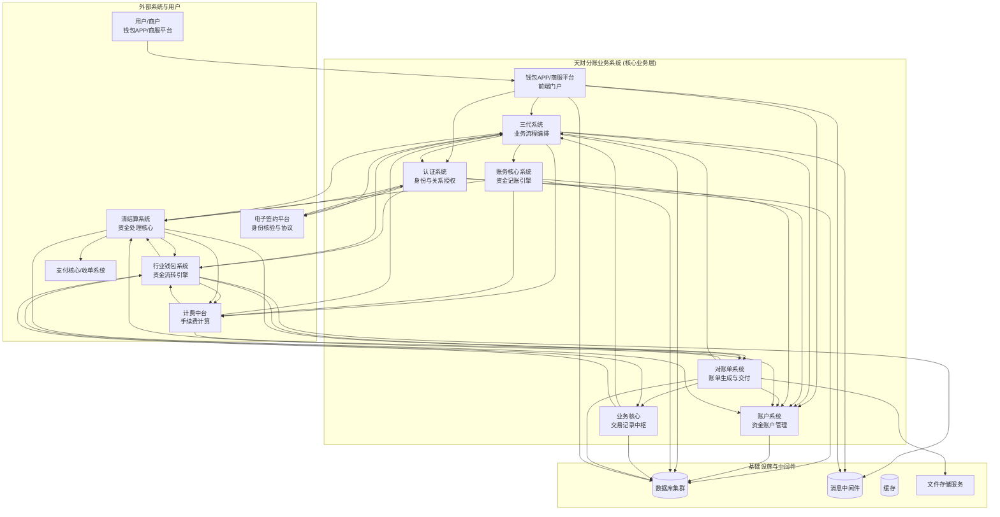
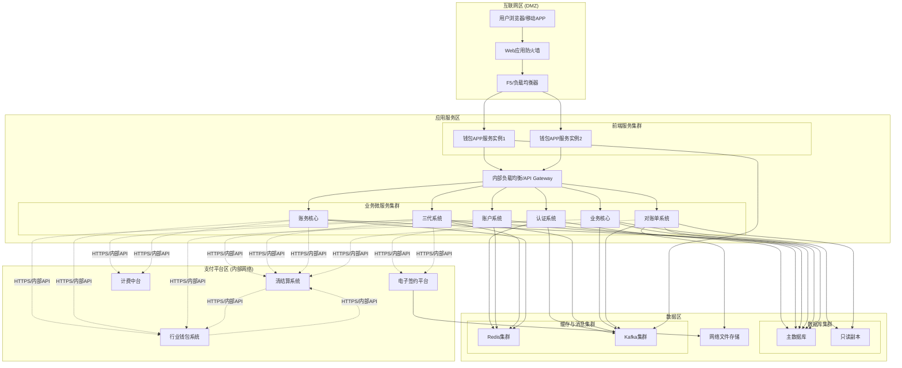
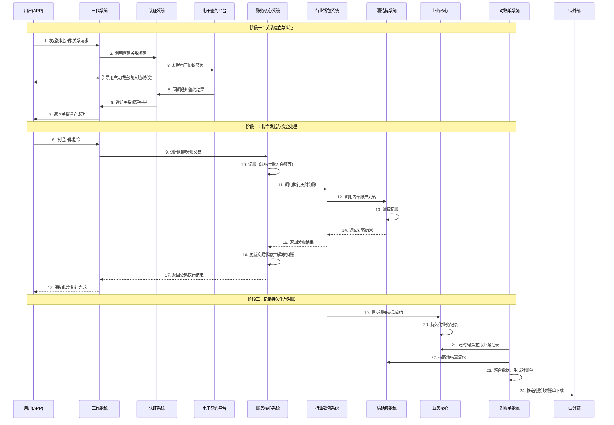
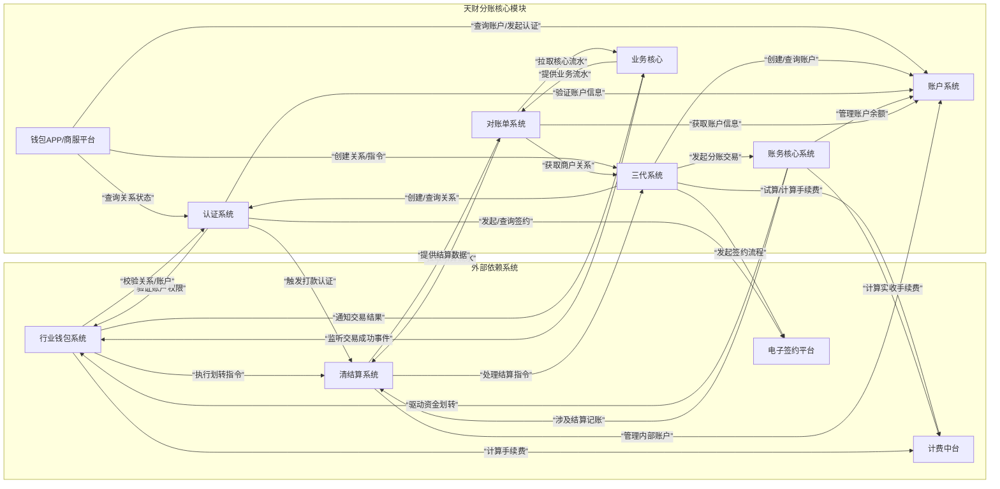

# 天财分账系统设计文档

## 2.1 系统结构

天财分账系统采用分层、模块化的微服务架构，旨在为机构及商户提供安全、合规、高效的资金分账、归集与结算服务。系统整体遵循“前后端分离、业务与资金分离、流程与执行分离”的设计原则，通过清晰的职责边界和标准化的接口交互，确保系统的可扩展性、可维护性和高可用性。

### 系统架构图 (C4 Container 视图)

**架构说明**:
1.  **用户交互层**: 钱包APP/商服平台作为统一前端，封装后端复杂流程，提供用户操作界面。
2.  **核心业务层**: 由多个职责明确的微服务构成，是分账业务逻辑的核心承载层。
    *   **认证系统 (AuthSvc)**: 业务安全入口，负责身份验证、关系绑定与授权。
    *   **账户系统 (AccountSvc)**: 资金流转基石，管理所有业务参与方的专用资金账户。
    *   **三代系统 (ThirdGenSvc)**: 业务流程编排中枢，整合开户、签约、关系绑定、指令发起等流程。
    *   **账务核心系统 (LedgerSvc)**: 资金处理引擎，负责记账、余额管理与交易状态跟踪。
    *   **业务核心 (BizCoreSvc)**: 交易记录中枢，持久化成功交易，为对账提供权威数据源。
    *   **对账单系统 (StatementSvc)**: 数据聚合与交付，生成多维度对账单。
3.  **外部依赖系统**: 与支付体系内其他核心平台紧密协作。
    *   **行业钱包系统**: 最终的资金划转执行者。
    *   **清结算系统**: 处理资金清算、结算及内部账户管理。
    *   **电子签约平台**: 提供合规的身份核验与电子协议服务。
    *   **计费中台**: 提供统一的手续费计算服务。
4.  **基础设施**: 数据库、消息队列、缓存、文件存储等支撑所有服务稳定运行。

## 2.2 功能结构

系统功能围绕“账户-认证-关系-指令-资金-对账”的核心链路进行模块化划分，各模块功能既相对独立又协同运作。

### 功能结构图

```mermaid
graph TD
    Root[天财分账系统] --> F1[用户与门户]
    Root --> F2[账户与认证管理]
    Root --> F3[业务关系与流程]
    Root --> F4[资金处理与记账]
    Root --> F5[计费与对账]
    Root --> F6[系统支撑]

    F1 --> F1.1[用户登录与权限]
    F1 --> F1.2[账户信息概览]
    F1 --> F1.3[业务关系引导与发起]
    F1 --> F1.4[分账指令操作]
    F1 --> F1.5[通知与消息]

    F2 --> F2.1[账户生命周期管理<br/>创建/查询/状态维护]
    F2 --> F2.2[身份认证与核验<br/>打款/人脸/协议]
    F2 --> F2.3[关系绑定与授权<br/>创建/查询/解除]

    F3 --> F3.1[商户信息管理<br/>总部/门店]
    F3 --> F3.2[业务关系管理<br/>归集/批量付款/会员结算]
    F3 --> F3.3[分账指令编排<br/>归集指令发起]
    F3 --> F3.4[业务流程状态跟踪]

    F4 --> F4.1[分账交易执行<br/>创建/冲正]
    F4 --> F4.2[账户余额管理<br/>查询/冻结]
    F4 --> F4.3[资金记账与流水<br/>记账/流水记录]
    F4 --> F4.4[资金划转驱动<br/>调用钱包/清结算]

    F5 --> F5.1[手续费计算<br/>规则管理/试算/实算]
    F5 --> F5.2[业务记录聚合<br/>交易流水持久化]
    F5 --> F5.3[对账单服务<br/>生成/查询/下载/推送]

    F6 --> F6.1[电子签约集成<br/>人脸核验/协议签署]
    F6 --> F6.2[清结算集成<br/>内部账户/结算执行/资金划转]
    F6 --> F6.3[消息与事件驱动]
    F6 --> F6.4[数据存储与缓存]
```

**功能模块说明**:
*   **用户与门户 (F1)**: 面向用户的前端功能集合，提供直观的业务操作界面和引导。
*   **账户与认证管理 (F2)**: 系统安全与合规的基础，确保参与方身份真实、关系有效。
*   **业务关系与流程 (F3)**: 定义和执行业务规则的核心，管理商户、关系及指令的生命周期。
*   **资金处理与记账 (F4)**: 系统最核心的资金操作层，确保每笔资金变动准确、可追溯。
*   **计费与对账 (F5)**: 业务运营支撑，准确计算成本并提供清晰的账务数据。
*   **系统支撑 (F6)**: 集成外部能力和提供基础设施，保障系统间稳定协作。

## 2.3 网络拓扑图

系统部署在私有云或金融级云平台内，网络拓扑遵循金融系统安全规范，划分不同安全区域。

**拓扑说明**:
1.  **安全隔离**: 通过防火墙划分互联网区、应用服务区、数据区和支付平台区，实施层层防护。
2.  **高可用**: 关键服务（前端、微服务、数据库、缓存、消息队列）均采用集群化部署，消除单点故障。
3.  **负载均衡**: 入口层使用F5硬件负载均衡，内部服务间通过软件负载均衡或API网关进行路由。
4.  **访问控制**: 应用服务区微服务通过内部网络以HTTPS协议调用支付平台区的系统，确保通信安全。
5.  **数据存储**: 核心业务数据使用主从数据库，读写分离提升性能。文件、缓存、消息队列使用专用集群。

## 2.4 数据流转

数据在系统中的流转主要围绕“业务指令驱动资金变动，变动结果形成业务记录，记录聚合生成对账单”这一主线进行。

### 核心业务数据流图 (以资金归集为例)

**数据流关键路径说明**:
1.  **业务配置流**: 用户通过APP发起，经由三代系统、认证系统、电子签约平台，完成商户、账户、关系的创建与认证。数据最终落地到各系统的数据库。
2.  **资金指令流**: 指令从APP发起，经三代系统路由至账务核心。账务核心完成本地记账后，驱动行业钱包和清结算系统完成实际的资金跨账户划转。资金状态在账务核心、钱包、清结算等多个系统中同步更新。
3.  **数据记录流**: 成功的资金交易由行业钱包系统异步通知业务核心进行持久化，形成权威业务流水。对账单系统定时从业务核心和清结算系统拉取数据，进行聚合、加工，生成最终的对账单。

## 2.5 系统模块交互关系

各模块通过定义良好的API进行同步或异步（消息）交互，共同完成复杂的业务流程。下图概括了核心模块间的主要调用与依赖关系。

### 模块交互依赖图

**交互关系总结**:
*   **三代系统** 是业务流程的**总指挥**，串联了认证、账户、账务、外部签约和计费，是交互最广泛的模块。
*   **认证系统** 和 **账户系统** 是业务的**基石**，几乎所有涉及资金和关系的操作都需要与之交互。
*   **账务核心系统** 是**资金操作**的发起点，连接内部记账与外部资金执行系统（钱包、清结算）。
*   **行业钱包系统** 与 **清结算系统** 是**资金执行**的双核心，负责最终的资金流转和清算，并与其他模块有广泛交互。
*   **业务核心** 与 **对账单系统** 处于业务流程的**下游**，负责记录聚合与输出，强依赖上游的业务和资金模块。
*   **钱包APP/商服平台** 是业务的**起点**和**界面**，主要与三代系统交互，间接驱动整个系统。