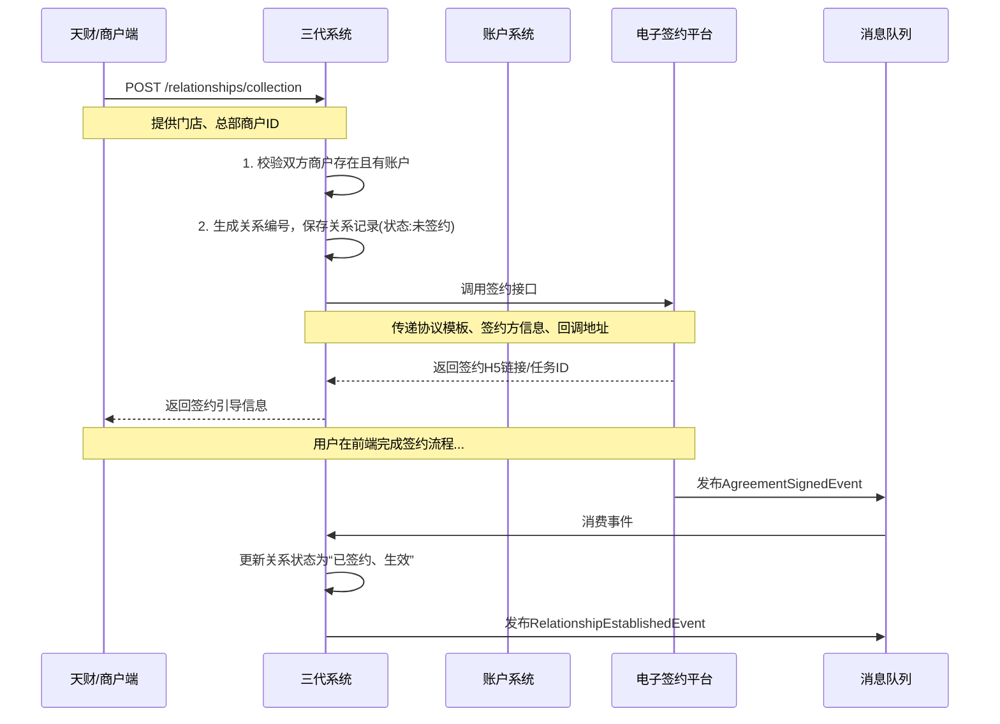
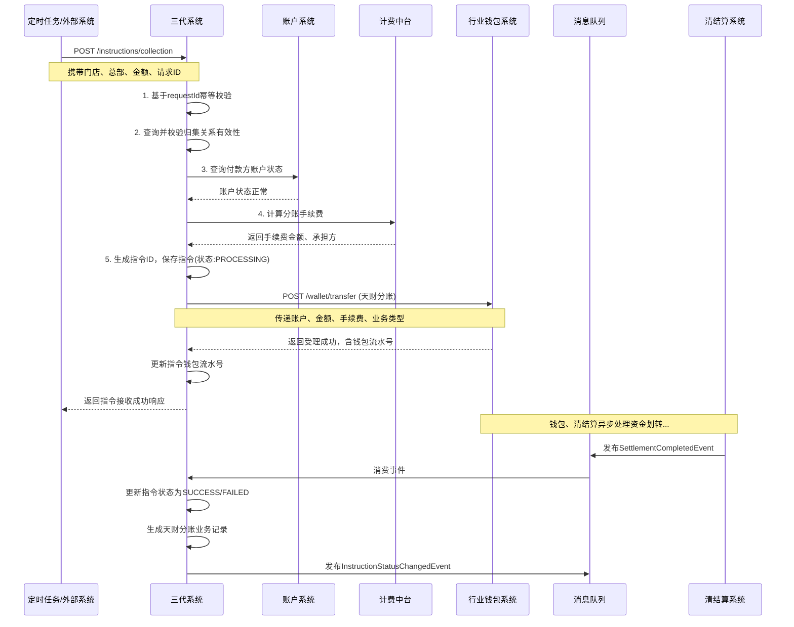

# 模块设计: 三代系统

生成时间: 2026-01-19 17:47:06

---

# 三代系统模块设计文档

## 1. 概述

### 1.1 目的
三代系统是“天财分账”业务的核心业务处理平台，作为面向“天财”机构及其收单商户的统一服务门户。它负责整合并编排开户、签约、关系绑定、分账指令发起等核心业务流程，为上层的行业钱包系统、电子签约平台、清结算系统等提供统一的业务入口和流程控制。本模块旨在为“天财”及其商户提供稳定、高效、可扩展的分账业务服务能力。

### 1.2 范围
- **商户与账户管理**：作为业务入口，接收天财的指令，协调创建和管理收单商户、门店信息，并触发账户系统创建对应的天财收款账户。
- **分账关系绑定与签约**：负责处理“归集”、“批量付款”、“会员结算”等场景下的收付款方关系建立，并调用电子签约平台完成必要的认证与协议签署流程。
- **分账指令处理**：接收并处理各类分账指令（归集、批量付款、会员结算），进行业务校验后，转发至行业钱包系统执行资金划转。
- **业务流程编排与状态管理**：管理从关系绑定到分账执行的全流程状态，确保业务的一致性与可追溯性。
- **查询与对账服务**：为商户提供关系查询、指令状态查询服务，并为对账单系统提供业务数据。
- **不包含**：不直接处理资金（由行业钱包和清结算负责）、不直接管理底层账户（由账户系统负责）、不直接执行签约认证（由电子签约平台负责）。

## 2. 接口设计

### 2.1 API 端点 (RESTful)

#### 2.1.1 商户与账户管理
- **POST /api/v1/merchants** - 创建收单商户（总部/门店）信息
- **POST /api/v1/merchants/{merchantId}/payment-account** - 为指定商户创建天财收款账户
- **GET /api/v1/merchants/{merchantId}** - 查询商户详情及关联账户

#### 2.1.2 关系绑定与签约
- **POST /api/v1/relationships/collection** - 创建门店到总部的资金归集关系
- **POST /api/v1/relationships/batch-payment** - 创建总部到接收方的批量付款关系
- **POST /api/v1/relationships/member-settlement** - 创建总部到门店的会员结算关系
- **POST /api/v1/merchants/{merchantId}/open-payment** - 总部开通付款权限（签约）
- **GET /api/v1/relationships** - 根据条件查询关系列表

#### 2.1.3 分账指令处理
- **POST /api/v1/instructions/collection** - 发起资金归集指令
- **POST /api/v1/instructions/batch-payment** - 发起批量付款指令
- **POST /api/v1/instructions/member-settlement** - 发起会员结算指令
- **GET /api/v1/instructions/{instructionId}** - 查询指令状态与详情
- **POST /api/v1/instructions/{instructionId}/retry** - 重试失败指令

#### 2.1.4 查询服务
- **GET /api/v1/business-records** - 查询天财分账业务记录（供对账单系统消费）

### 2.2 输入/输出数据结构

#### 2.2.1 创建收单商户请求 (`CreateMerchantRequest`)
```json
{
  "requestId": "req_mch_20231028001",
  "tiancaiId": "TC_ORG_001",
  "merchantId": "MCH_TC_HQ_001",
  "merchantName": "天财示例品牌总部",
  "merchantType": "HEADQUARTERS",
  "contactName": "李总",
  "contactPhone": "13800138000",
  "settlementMode": "PASSIVE",
  "operator": "tiancai_admin",
  "extInfo": {}
}
```

#### 2.2.2 创建归集关系请求 (`CreateCollectionRelationshipRequest`)
```json
{
  "requestId": "req_rel_col_20231028001",
  "tiancaiId": "TC_ORG_001",
  "storeMerchantId": "MCH_TC_STORE_001",
  "headquartersMerchantId": "MCH_TC_HQ_001",
  "agreementTemplateId": "AGREEMENT_COLLECTION_V1",
  "operator": "tiancai_admin",
  "callbackUrl": "https://callback.tiancai.com/relation/status"
}
```

#### 2.2.3 发起归集指令请求 (`CreateCollectionInstructionRequest`)
```json
{
  "requestId": "req_inst_col_20231028001",
  "tiancaiId": "TC_ORG_001",
  "storeMerchantId": "MCH_TC_STORE_001",
  "headquartersMerchantId": "MCH_TC_HQ_001",
  "amount": 100000,
  "currency": "CNY",
  "businessReferenceNo": "ORDER_202310280001",
  "remark": "门店日终归集",
  "operator": "system_job",
  "extInfo": {
    "sourceSystem": "SETTLEMENT_JOB"
  }
}
```

#### 2.2.4 通用指令响应 (`InstructionResponse`)
```json
{
  "code": "SUCCESS",
  "message": "指令接收成功",
  "data": {
    "instructionId": "INST_COL_202310280001",
    "instructionType": "COLLECTION",
    "status": "PROCESSING",
    "requestId": "req_inst_col_20231028001",
    "payerAccountNo": "TC_ACCT_STORE_001",
    "payeeAccountNo": "TC_ACCT_HQ_001",
    "amount": 100000,
    "currency": "CNY",
    "estimatedFinishTime": "2023-10-28T23:59:59Z",
    "createdTime": "2023-10-28T18:00:00Z"
  }
}
```

#### 2.2.5 天财分账业务记录 (`TiancaiSplitBusinessRecord`)
```json
{
  "recordId": "REC_202310280001",
  "tiancaiId": "TC_ORG_001",
  "instructionId": "INST_COL_202310280001",
  "instructionType": "COLLECTION",
  "businessTime": "2023-10-28T18:00:00Z",
  "completeTime": "2023-10-28T18:00:05Z",
  "payerMerchantId": "MCH_TC_STORE_001",
  "payerAccountNo": "TC_ACCT_STORE_001",
  "payeeMerchantId": "MCH_TC_HQ_001",
  "payeeAccountNo": "TC_ACCT_HQ_001",
  "amount": 100000,
  "currency": "CNY",
  "status": "SUCCESS",
  "fee": 100,
  "feeBearer": "PAYER",
  "businessReferenceNo": "ORDER_202310280001",
  "remark": "门店日终归集"
}
```

### 2.3 发布/消费的事件

#### 2.3.1 发布的事件
- **MerchantCreatedEvent**: 商户信息创建成功时发布。
    ```json
    {
      "eventId": "evt_merchant_created_001",
      "eventType": "MERCHANT.CREATED",
      "timestamp": "2023-10-28T10:00:01Z",
      "payload": {
        "tiancaiId": "TC_ORG_001",
        "merchantId": "MCH_TC_HQ_001",
        "merchantType": "HEADQUARTERS",
        "settlementMode": "PASSIVE"
      }
    }
    ```
- **RelationshipEstablishedEvent**: 分账关系绑定并签约完成时发布。
- **InstructionCreatedEvent**: 分账指令创建成功时发布。
- **InstructionStatusChangedEvent**: 分账指令状态变更时发布（如 PROCESSING -> SUCCESS/FAILED）。

#### 2.3.2 消费的事件
- **AccountCreatedEvent** (来自账户系统): 当天财收款账户或接收方账户创建成功时，更新本系统内的账户关联信息。
- **ReceiverAuthenticationCompletedEvent** (来自电子签约平台): 当接收方完成认证时，更新对应关系的认证状态。
- **AgreementSignedEvent** (来自电子签约平台): 当关系绑定协议签署完成时，激活对应的分账关系。
- **SettlementCompletedEvent** (来自清结算系统): 当分账资金结算完成时，更新指令的最终状态并生成业务记录。

## 3. 数据模型

### 3.1 数据库表设计

#### 表: `tiancai_merchant` (天财收单商户表)
| 字段名 | 类型 | 必填 | 默认值 | 说明 |
|--------|------|------|--------|------|
| `id` | BIGINT(20) | Y | AUTO_INCREMENT | 主键 |
| `tiancai_id` | VARCHAR(32) | Y | | 天财机构ID |
| `merchant_id` | VARCHAR(64) | Y | | **商户ID**，业务唯一标识 |
| `merchant_name` | VARCHAR(128) | Y | | 商户名称 |
| `merchant_type` | TINYINT(1) | Y | | 类型: 1-总部，2-门店 |
| `contact_name` | VARCHAR(64) | N | | 联系人 |
| `contact_phone` | VARCHAR(32) | N | | 联系电话 |
| `settlement_mode` | TINYINT(1) | Y | | 结算模式: 1-主动，2-被动 |
| `status` | TINYINT(1) | Y | 1 | 状态: 1-有效，2-停用 |
| `payment_account_no` | VARCHAR(32) | N | | 关联的天财收款账户号 |
| `created_time` | DATETIME | Y | CURRENT_TIMESTAMP | 创建时间 |
| `updated_time` | DATETIME | Y | CURRENT_TIMESTAMP ON UPDATE | 更新时间 |

**索引**:
- 唯一索引: `uk_merchant_id` (`merchant_id`)
- 索引: `idx_tiancai_id` (`tiancai_id`)
- 索引: `idx_payment_account_no` (`payment_account_no`)

#### 表: `split_relationship` (分账关系表)
| 字段名 | 类型 | 必填 | 默认值 | 说明 |
|--------|------|------|--------|------|
| `id` | BIGINT(20) | Y | AUTO_INCREMENT | 主键 |
| `relationship_no` | VARCHAR(32) | Y | | **关系编号**，格式: REL_{类型}_{日期}{序列} |
| `tiancai_id` | VARCHAR(32) | Y | | 天财机构ID |
| `relationship_type` | TINYINT(1) | Y | | 类型: 1-归集，2-批量付款，3-会员结算 |
| `payer_merchant_id` | VARCHAR(64) | Y | | 付款方商户ID |
| `payer_account_no` | VARCHAR(32) | N | | 付款方账户号 |
| `payee_merchant_id` | VARCHAR(64) | N | | 收款方商户ID (门店或个人) |
| `payee_receiver_id` | VARCHAR(64) | N | | 收款方接收方ID (批量付款用) |
| `payee_account_no` | VARCHAR(32) | N | | 收款方账户号 |
| `agreement_id` | VARCHAR(64) | N | | 电子协议ID |
| `auth_status` | TINYINT(1) | Y | 0 | 认证状态: 0-未签约，1-已签约 |
| `is_active` | TINYINT(1) | Y | 0 | 是否生效: 0-否，1-是 |
| `effective_time` | DATETIME | N | | 生效时间 |
| `expiry_time` | DATETIME | N | | 失效时间 |
| `created_time` | DATETIME | Y | CURRENT_TIMESTAMP | 创建时间 |
| `updated_time` | DATETIME | Y | CURRENT_TIMESTAMP ON UPDATE | 更新时间 |

**索引**:
- 唯一索引: `uk_relationship_no` (`relationship_no`)
- 索引: `idx_payer_merchant` (`payer_merchant_id`, `relationship_type`)
- 索引: `idx_payee_merchant` (`payee_merchant_id`, `relationship_type`)
- 索引: `idx_auth_status` (`auth_status`, `is_active`)

#### 表: `split_instruction` (分账指令表)
| 字段名 | 类型 | 必填 | 默认值 | 说明 |
|--------|------|------|--------|------|
| `id` | BIGINT(20) | Y | AUTO_INCREMENT | 主键 |
| `instruction_id` | VARCHAR(32) | Y | | **指令ID**，格式: INST_{类型}_{日期}{序列} |
| `request_id` | VARCHAR(64) | Y | | 外部请求ID，用于幂等 |
| `tiancai_id` | VARCHAR(32) | Y | | 天财机构ID |
| `instruction_type` | TINYINT(1) | Y | | 类型: 1-归集，2-批量付款，3-会员结算 |
| `relationship_no` | VARCHAR(32) | N | | 关联的关系编号 |
| `payer_account_no` | VARCHAR(32) | Y | | 付款方账户号 |
| `payee_account_no` | VARCHAR(32) | Y | | 收款方账户号 |
| `amount` | DECIMAL(15,2) | Y | | 金额 |
| `currency` | CHAR(3) | Y | CNY | 币种 |
| `status` | TINYINT(1) | Y | 0 | 状态: 0-已接收，1-处理中，2-成功，3-失败，4-已撤销 |
| `business_reference_no` | VARCHAR(64) | N | | 业务参考号 |
| `remark` | VARCHAR(256) | N | | 备注 |
| `fee` | DECIMAL(15,2) | N | | 手续费 |
| `fee_bearer` | TINYINT(1) | N | | 手续费承担方: 1-付款方，2-收款方 |
| `wallet_request_no` | VARCHAR(64) | N | | 钱包系统请求流水号 |
| `error_code` | VARCHAR(32) | N | | 错误码 |
| `error_message` | VARCHAR(512) | N | | 错误信息 |
| `created_time` | DATETIME | Y | CURRENT_TIMESTAMP | 创建时间 |
| `updated_time` | DATETIME | Y | CURRENT_TIMESTAMP ON UPDATE | 更新时间 |
| `completed_time` | DATETIME | N | | 完成时间 |

**索引**:
- 唯一索引: `uk_instruction_id` (`instruction_id`)
- 唯一索引: `uk_request_id` (`request_id`)
- 索引: `idx_payer_account_time` (`payer_account_no`, `created_time`)
- 索引: `idx_status_created` (`status`, `created_time`)

#### 表: `tiancai_business_record` (天财分账业务记录表)
| 字段名 | 类型 | 必填 | 默认值 | 说明 |
|--------|------|------|--------|------|
| `id` | BIGINT(20) | Y | AUTO_INCREMENT | 主键 |
| `record_id` | VARCHAR(32) | Y | | **记录ID**，供对账单系统消费 |
| `instruction_id` | VARCHAR(32) | Y | | 关联的指令ID |
| ... (字段与 `TiancaiSplitBusinessRecord` 数据结构对应) ... |
| `created_time` | DATETIME | Y | CURRENT_TIMESTAMP | 创建时间 |

**索引**:
- 唯一索引: `uk_record_id` (`record_id`)
- 索引: `idx_instruction_id` (`instruction_id`)
- 索引: `idx_business_time` (`business_time`)

### 3.2 与其他模块的关系
- **行业钱包系统**: 下游执行系统。三代系统将校验通过的分账指令转发给钱包系统执行资金划转，并监听其执行结果。
- **账户系统**: 下游依赖。三代系统调用账户系统创建天财收款账户，并消费其账户创建事件以更新本地映射。
- **电子签约平台**: 下游依赖。三代系统调用其进行关系绑定的认证与协议签署，并消费其签约完成事件。
- **清结算系统**: 下游依赖与事件消费者。三代系统依赖其查询账户结算模式等信息，并消费其结算完成事件以完结指令。
- **计费中台**: 下游依赖。在发起分账指令前或后，调用计费中台计算手续费。
- **业务核心/对账单系统**: 上游数据提供者。三代系统生成标准格式的`TiancaiSplitBusinessRecord`，供其消费并生成对账单。

## 4. 业务逻辑

### 4.1 核心算法
**指令ID生成算法**:
```
INST_{TYPE}_{YYYYMMDD}{8位序列号}
```
- `TYPE`: COL-归集, BAP-批量付款, MEM-会员结算
- 序列号: 每日从1开始自增，确保当日唯一。

**关系编号生成算法**:
```
REL_{TYPE}_{YYYYMMDD}{8位序列号}
```
- `TYPE`: COL-归集, BAP-批量付款, MEM-会员结算

### 4.2 业务规则
1. **商户与账户创建规则**:
   - 创建商户信息时，需指定其`merchantType`(总部/门店)和`settlementMode`。
   - 为商户创建天财收款账户时，需根据其`settlementMode`调用账户系统创建对应属性的账户。
   - 一个商户只能关联一个有效的天财收款账户。

2. **关系绑定规则**:
   - **归集关系**: 付款方必须是门店(`merchantType=STORE`)，收款方必须是总部(`merchantType=HEADQUARTERS`)。双方需已存在有效的天财收款账户。
   - **批量付款关系**: 付款方必须是总部。收款方可以是个人或企业接收方（需已在天财平台注册为`receiver`）。需要总部额外完成“开通付款”签约。
   - **会员结算关系**: 付款方必须是总部，收款方必须是门店。需要总部额外完成“开通付款”签约。
   - 关系绑定必须经过电子签约流程，协议签署完成后关系才生效(`is_active=1`)。

3. **分账指令处理规则**:
   - 发起指令前，必须校验对应的分账关系已存在且状态为生效(`is_active=1`)。
   - 付款方账户状态必须为正常(`ACTIVE`)且未被冻结。
   - 需调用计费中台计算手续费，并明确手续费承担方。
   - 指令状态机: `RECEIVED` -> `PROCESSING` -> (`SUCCESS` / `FAILED`)。

4. **“开通付款”规则**:
   - 只有总部商户需要进行“开通付款”签约。
   - 签约完成后，该总部名下所有已绑定的“批量付款”和“会员结算”关系同时生效。

### 4.3 验证逻辑
1. **指令幂等性校验**: 通过`requestId`保证同一业务请求不会创建重复指令。
2. **业务关系有效性校验**: 检查关系是否存在、是否生效、是否在有效期内。
3. **账户状态校验**: 调用账户系统接口，验证付款方账户状态是否正常。
4. **余额/额度校验** (可选): 对于重要场景，可调用清结算系统预检查付款方账户可用余额。
5. **参数边界校验**: 金额大于0，币种支持，商户ID格式等。

## 5. 时序图

### 5.1 创建归集关系并签约时序图



### 5.2 处理归集分账指令时序图



## 6. 错误处理

### 6.1 预期错误码
| 错误码 | HTTP状态码 | 描述 | 处理建议 |
|--------|------------|------|----------|
| `RELATIONSHIP_NOT_FOUND` | 404 Not Found | 分账关系不存在 | 检查关系参数，或先建立关系 |
| `RELATIONSHIP_NOT_ACTIVE` | 403 Forbidden | 分账关系未生效 | 检查关系签约状态，完成签约或开通付款 |
| `ACCOUNT_STATUS_INVALID` | 403 Forbidden | 付款方账户状态异常 | 检查账户是否冻结、注销 |
| `INSUFFICIENT_BALANCE` | 403 Forbidden | 付款方余额不足 | 提示商户充值或减少金额 |
| `FEE_CALCULATION_FAILED` | 500 Internal Server Error | 手续费计算失败 | 检查计费中台状态与配置 |
| `WALLET_SERVICE_UNAVAILABLE` | 503 Service Unavailable | 钱包系统服务异常 | 指令状态置为失败，记录错误，触发告警并支持重试 |
| `DUPLICATE_REQUEST` | 409 Conflict | 重复请求 | 返回已创建指令的信息 |

### 6.2 处理策略
1. **同步调用失败**:
   - 对账户系统、计费中台的查询调用，设置快速失败和重试。若最终失败，指令创建直接返回错误。
   - 对钱包系统的指令下发调用，若超时或失败，指令状态标记为`PROCESSING`但记录错误。依靠后续的`SettlementCompletedEvent`来驱动状态更新，或通过定时任务轮询补偿。

2. **异步事件丢失**:
   - 对于关键的`SettlementCompletedEvent`，若长时间未收到，启动定时任务根据`PROCESSING`状态的指令去清结算系统主动查询并更新状态。

3. **业务补偿**:
   - 提供指令重试接口(`POST /instructions/{id}/retry`)，对于因临时故障失败的指令，在问题解决后可手动或自动重试。
   - 提供指令撤销接口（在特定状态下），并与下游系统协同进行资金冲正。

4. **监控与告警**:
   - 监控指令失败率、平均处理时长、各依赖接口可用性。
   - 当`PROCESSING`状态指令堆积或长时间未完结时触发告警。

## 7. 依赖说明

### 7.1 上游依赖
1. **天财/商户端** (强依赖):
   - **交互方式**: 同步HTTP调用
   - **职责**: 发起商户创建、关系绑定、分账指令等请求。
   - **降级方案**: 写操作无法降级。读操作（查询）可返回缓存数据。

2. **定时任务/外部业务系统** (强依赖):
   - **交互方式**: 同步HTTP调用
   - **职责**: 触发自动化的归集、结算指令。
   - **降级方案**: 指令接收需保证高可用，避免业务积压。

### 7.2 下游依赖
1. **行业钱包系统** (强依赖):
   - **交互方式**: 同步HTTP调用 + 异步事件消费(间接)
   - **职责**: 执行分账资金划转的核心操作。
   - **降级方案**: 无。钱包不可用则分账业务完全中断。需有熔断和快速失败机制，并触发高级别告警。

2. **账户系统** (强依赖):
   - **交互方式**: 同步HTTP调用 + 异步事件消费
   - **职责**: 创建账户、查询账户状态。
   - **降级方案**: 账户创建可排队延迟。账户状态查询失败时可暂时信任本地缓存状态（有一定风险），或拒绝指令。

3. **电子签约平台** (强依赖):
   - **交互方式**: 同步HTTP调用 + 异步事件消费
   - **职责**: 完成关系绑定的认证与签约。
   - **降级方案**: 签约流程可暂停，关系状态保持“未签约”，业务无法进行。

4. **清结算系统** (弱依赖):
   - **交互方式**: 异步事件消费 + 同步接口调用(查询)
   - **职责**: 提供结算结果事件，支持指令状态查询。
   - **降级方案**: 事件延迟消费，指令状态更新依赖主动查询补偿。

5. **计费中台** (弱依赖):
   - **交互方式**: 同步HTTP调用
   - **职责**: 计算手续费。
   - **降级方案**: 可配置默认费率或上次成功费率临时计算，并记录降级日志。

### 7.3 依赖治理
- **超时与重试**:
    - 调用钱包系统: 超时5s，重试2次。
    - 调用账户/计费系统: 超时3s，重试1次。
    - 调用电子签: 超时10s（因涉及用户交互），不重试。
- **熔断与降级**:
    - 对钱包、账户系统配置熔断器，失败率阈值50%，打开后快速失败，定期尝试恢复。
    - 对计费中台配置降级策略，失败时使用默认费率。
- **异步解耦**:
    - 将非实时强依赖（如签约结果、结算结果）通过事件驱动，提高主流程的响应速度和韧性。