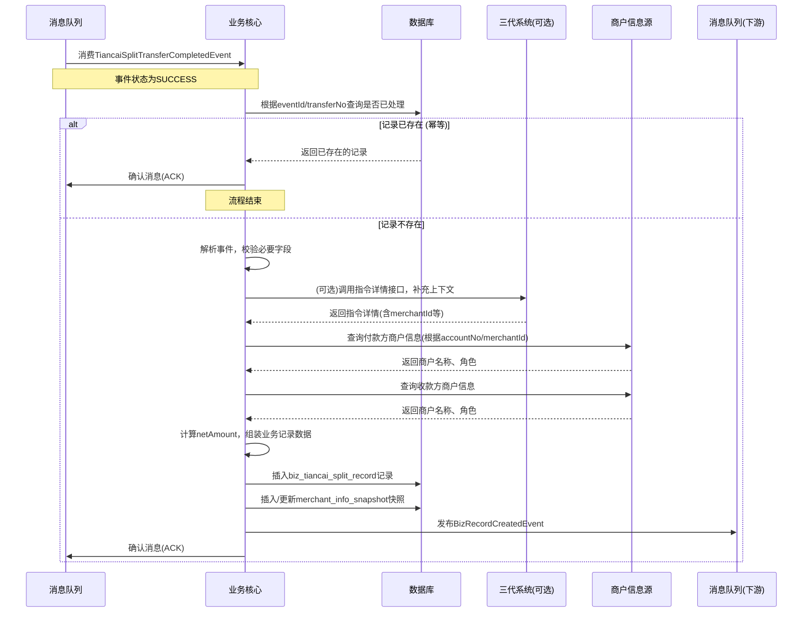
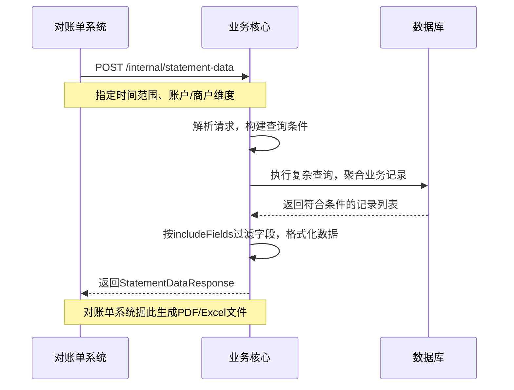

# 模块设计: 业务核心

生成时间: 2026-01-19 17:49:39

---

# 模块设计: 业务核心

生成时间: 2026-01-19 18:00:00

---

## 1. 概述

### 1.1 目的
业务核心模块是“天财分账”业务的交易记录中枢和数据处理中心。它不直接处理资金流转，而是作为所有“天财分账”交易的忠实记录者，负责接收并持久化由行业钱包系统触发的分账交易完成事件，生成标准化的业务交易记录。这些记录是下游对账单系统（特别是“天财分账指令账单”）的**唯一、权威数据源**，为商户、财务和运营人员提供清晰、可追溯的业务视图。本模块的核心价值在于**数据准确性与一致性**。

### 1.2 范围
- **交易记录生成**：监听并处理`TiancaiSplitTransferCompletedEvent`事件，将成功的分账交易转化为本系统的业务记录。
- **数据丰富与关联**：基于事件数据，关联并补充业务上下文信息（如商户名称、门店信息、业务场景描述），形成对用户友好的交易记录。
- **查询与统计**：提供按账户、时间、业务类型等维度的交易记录查询接口，支持对账单生成和业务分析。
- **数据一致性保障**：确保每笔成功的分账交易在本模块有且仅有一条对应的业务记录，并通过幂等机制防止重复处理。
- **不包含**：不发起或执行任何资金操作（行业钱包系统职责）、不进行复杂的业务逻辑校验（三代系统职责）、不直接生成对账单文件（对账单系统职责）、不管理账户或关系（账户系统/三代系统职责）。

## 2. 接口设计

### 2.1 API 端点 (RESTful)

#### 2.1.1 业务记录查询
- **GET /api/v1/biz-records/{recordId}** - 查询单笔业务记录详情
- **GET /api/v1/biz-records** - 根据条件查询业务记录列表（支持分页、多维度筛选）

#### 2.1.2 对账单数据供给（内部）
- **POST /api/v1/internal/statement-data** - 为对账单系统提供指定维度的原始交易数据（批量拉取）
- **GET /api/v1/internal/accounts/{accountNo}/records** - 获取指定账户在特定时间范围内的所有交易记录（供账户维度对账单使用）

### 2.2 输入/输出数据结构

#### 2.2.1 业务记录详情响应 (`BizRecordDetailResponse`)
```json
{
  "code": "SUCCESS",
  "message": "查询成功",
  "data": {
    "recordId": "BIZ_20231029000001",
    "transferNo": "WTR_20231029000001",
    "instructionId": "INST_COL_202310280001",
    "instructionType": "COLLECTION",
    "businessType": "TIANCAI_SPLIT",
    "status": "SUCCESS",
    "payerAccountNo": "TC_ACCT_STORE_001",
    "payerMerchantId": "MCH_TC_STORE_001",
    "payerMerchantName": "天财合作商户-北京朝阳店",
    "payerRole": "STORE",
    "payeeAccountNo": "TC_ACCT_HQ_001",
    "payeeMerchantId": "MCH_TC_HQ_001",
    "payeeMerchantName": "天财合作商户-总部",
    "payeeRole": "HEADQUARTERS",
    "amount": 100000,
    "currency": "CNY",
    "fee": 100,
    "feeBearer": "PAYER",
    "netAmount": 99900, // 净额 (收款方实际到账: amount - (feeBearer==PAYEE? fee : 0))
    "settlementSerialNo": "STL_20231029000001",
    "businessReferenceNo": "ORDER_202310280001",
    "remark": "门店日终归集",
    "relationshipNo": "REL_COL_202310270001",
    "businessTime": "2023-10-29T18:00:03Z", // 交易完成时间
    "createdTime": "2023-10-29T18:00:05Z",
    "extInfo": {
      "sourceSystem": "WALLET",
      "originalEventId": "evt_wallet_transfer_completed_001"
    }
  }
}
```

#### 2.2.2 业务记录列表查询请求 (`QueryBizRecordsRequest`)
```json
{
  "accountNo": "TC_ACCT_HQ_001", // 可选，可查询付款方或收款方
  "merchantId": "MCH_TC_HQ_001", // 可选，商户维度查询
  "instructionType": "COLLECTION", // 可选，指令类型
  "status": "SUCCESS", // 可选，通常只查成功记录
  "startTime": "2023-10-29T00:00:00Z",
  "endTime": "2023-10-30T00:00:00Z",
  "pageNum": 1,
  "pageSize": 50
}
```

#### 2.2.3 业务记录列表响应 (`QueryBizRecordsResponse`)
```json
{
  "code": "SUCCESS",
  "message": "查询成功",
  "data": {
    "total": 125,
    "pageNum": 1,
    "pageSize": 50,
    "records": [
      {
        "recordId": "BIZ_20231029000001",
        "transferNo": "WTR_20231029000001",
        "instructionType": "COLLECTION",
        "payerAccountNo": "TC_ACCT_STORE_001",
        "payerMerchantName": "天财合作商户-北京朝阳店",
        "payeeAccountNo": "TC_ACCT_HQ_001",
        "payeeMerchantName": "天财合作商户-总部",
        "amount": 100000,
        "fee": 100,
        "feeBearer": "PAYER",
        "netAmount": 99900,
        "businessTime": "2023-10-29T18:00:03Z",
        "remark": "门店日终归集"
      }
      // ... 更多记录
    ]
  }
}
```

#### 2.2.4 对账单数据供给请求 (`StatementDataRequest`)
```json
{
  "statementType": "TIANCAI_SPLIT_INSTRUCTION", // 对账单类型
  "dimension": "ACCOUNT", // 维度: ACCOUNT, MERCHANT, DATE
  "dimensionValue": "TC_ACCT_HQ_001", // 维度值，如账户号、商户ID、日期
  "startTime": "2023-10-29T00:00:00Z",
  "endTime": "2023-10-30T00:00:00Z",
  "includeFields": ["recordId", "transferNo", "instructionType", "payerAccountNo", "payeeAccountNo", "amount", "fee", "feeBearer", "netAmount", "businessTime", "remark"] // 指定返回字段
}
```

### 2.3 发布/消费的事件

#### 2.3.1 消费的事件
- **TiancaiSplitTransferCompletedEvent** (来自行业钱包系统): **核心事件源**。仅处理`status`为`SUCCESS`的事件，用于生成业务记录。
    ```json
    // 事件结构（见上游设计文档）
    {
      "eventType": "WALLET.TIANCAI_SPLIT.COMPLETED",
      "payload": {
        "transferNo": "WTR_20231029000001",
        "instructionId": "INST_COL_202310280001",
        "status": "SUCCESS",
        "settlementSerialNo": "STL_20231029000001",
        "completedTime": "2023-10-29T18:00:03Z"
      }
    }
    ```

#### 2.3.2 发布的事件
- **BizRecordCreatedEvent**: 当一笔新的“天财分账”业务记录成功创建并持久化后发布。下游系统（如审计、风控、数据分析）可订阅此事件。
    ```json
    {
      "eventId": "evt_biz_record_created_001",
      "eventType": "BIZCORE.TIANCAI_SPLIT_RECORD.CREATED",
      "timestamp": "2023-10-29T18:00:05Z",
      "payload": {
        "recordId": "BIZ_20231029000001",
        "transferNo": "WTR_20231029000001",
        "instructionId": "INST_COL_202310280001",
        "instructionType": "COLLECTION",
        "payerAccountNo": "TC_ACCT_STORE_001",
        "payeeAccountNo": "TC_ACCT_HQ_001",
        "amount": 100000,
        "businessTime": "2023-10-29T18:00:03Z"
      }
    }
    ```

## 3. 数据模型

### 3.1 数据库表设计

#### 表: `biz_tiancai_split_record` (天财分账业务记录表)
| 字段名 | 类型 | 必填 | 默认值 | 说明 |
|--------|------|------|--------|------|
| `id` | BIGINT(20) | Y | AUTO_INCREMENT | 主键 |
| `record_id` | VARCHAR(32) | Y | | **业务记录ID**，唯一业务标识，格式: BIZ_{日期}{6位序列} |
| `transfer_no` | VARCHAR(32) | Y | | 关联的钱包交易流水号，来自事件 |
| `instruction_id` | VARCHAR(32) | Y | | 关联的三代系统指令ID |
| `instruction_type` | TINYINT(1) | Y | | 指令类型: 1-归集，2-批量付款，3-会员结算 |
| `business_type` | VARCHAR(32) | Y | | 业务类型: TIANCAI_SPLIT |
| `status` | TINYINT(1) | Y | | 状态: 2-成功 (仅记录成功交易) |
| `payer_account_no` | VARCHAR(32) | Y | | 付款方账户号 |
| `payer_merchant_id` | VARCHAR(32) | Y | | 付款方商户ID |
| `payer_merchant_name` | VARCHAR(128) | Y | | 付款方商户名称 (快照) |
| `payer_role` | VARCHAR(32) | N | | 付款方角色: HEADQUARTERS, STORE |
| `payee_account_no` | VARCHAR(32) | Y | | 收款方账户号 |
| `payee_merchant_id` | VARCHAR(32) | Y | | 收款方商户ID |
| `payee_merchant_name` | VARCHAR(128) | Y | | 收款方商户名称 (快照) |
| `payee_role` | VARCHAR(32) | N | | 收款方角色: HEADQUARTERS, STORE, RECEIVER |
| `amount` | DECIMAL(15,2) | Y | | 交易金额 |
| `currency` | CHAR(3) | Y | CNY | 币种 |
| `fee` | DECIMAL(15,2) | N | | 手续费金额 |
| `fee_bearer` | TINYINT(1) | N | | 手续费承担方: 1-付款方，2-收款方 |
| `net_amount` | DECIMAL(15,2) | Y | | 净额 (逻辑计算: amount - (fee_bearer=2? fee : 0)) |
| `settlement_serial_no` | VARCHAR(64) | N | | 清结算系统流水号 |
| `business_reference_no` | VARCHAR(64) | N | | 业务参考号 |
| `remark` | VARCHAR(256) | N | | 备注 |
| `relationship_no` | VARCHAR(32) | N | | 关联的业务关系编号 |
| `business_time` | DATETIME | Y | | **业务时间**，即交易完成时间 (取自事件completedTime) |
| `event_id` | VARCHAR(64) | Y | | 触发本记录的事件ID，用于幂等和溯源 |
| `created_time` | DATETIME | Y | CURRENT_TIMESTAMP | 记录创建时间 |
| `updated_time` | DATETIME | Y | CURRENT_TIMESTAMP ON UPDATE | 更新时间 |

**索引**:
- 唯一索引: `uk_record_id` (`record_id`)
- 唯一索引: `uk_transfer_no` (`transfer_no`) -- 确保每笔成功交易对应一条记录
- 唯一索引: `uk_event_id` (`event_id`) -- 事件幂等
- 索引: `idx_payer_account_time` (`payer_account_no`, `business_time`)
- 索引: `idx_payee_account_time` (`payee_account_no`, `business_time`)
- 索引: `idx_merchant_time` (`payer_merchant_id`, `business_time`)
- 索引: `idx_instruction_id` (`instruction_id`)
- 索引: `idx_business_time` (`business_time`) -- 时间范围查询和账单生成

#### 表: `merchant_info_snapshot` (商户信息快照表)
| 字段名 | 类型 | 必填 | 默认值 | 说明 |
|--------|------|------|--------|------|
| `id` | BIGINT(20) | Y | AUTO_INCREMENT | 主键 |
| `merchant_id` | VARCHAR(32) | Y | | 商户ID |
| `merchant_name` | VARCHAR(128) | Y | | 商户名称 |
| `account_no` | VARCHAR(32) | N | | 关联的账户号 (一个商户可能有多个账户) |
| `role` | VARCHAR(32) | N | | 角色: HEADQUARTERS, STORE |
| `snapshot_time` | DATETIME | Y | CURRENT_TIMESTAMP | 快照时间 |
| `is_latest` | TINYINT(1) | Y | 1 | 是否为该商户的最新快照 |
| `created_time` | DATETIME | Y | CURRENT_TIMESTAMP | 创建时间 |

**索引**:
- 索引: `idx_merchant_latest` (`merchant_id`, `is_latest`)
- 索引: `idx_account_latest` (`account_no`, `is_latest`)
- 唯一索引: `uk_merchant_snapshot` (`merchant_id`, `snapshot_time`)

**说明**: 此表用于在生成业务记录时，根据`accountNo`或`merchantId`获取商户名称和角色，并保存快照，避免因商户信息变更导致历史记录显示不一致。

### 3.2 与其他模块的关系
- **行业钱包系统**: **核心上游事件源**。消费其发布的`TiancaiSplitTransferCompletedEvent`（仅成功事件），是业务记录的触发起点。
- **三代系统**: **信息依赖方**。在生成记录时，可能需要调用三代系统（或通过缓存）获取更丰富的业务上下文信息（如商户详情、业务场景描述）。同时，业务记录中的`instruction_id`直接关联三代系统的指令。
- **对账单系统**: **核心下游数据提供方**。通过内部接口为对账单系统提供原始、准确的交易数据，是生成“天财分账指令账单”等报表的基础。
- **商户/账户信息源**（可能为三代系统或独立的商户中心）: **弱依赖**。用于获取并快照商户名称、角色等信息。可通过缓存和异步更新降低依赖。
- **消息中间件**: **强依赖**。用于可靠地消费上游事件。

## 4. 业务逻辑

### 4.1 核心算法
**业务记录ID生成算法**:
```
BIZ_{YYYYMMDD}{6位序列号}
```
- 日期部分: **业务时间** (`business_time`) 的日期，而非记录创建日期，确保记录按业务日期归档。
- 序列号: 每日从1开始自增，确保当日唯一。

**净额计算逻辑**:
```
if feeBearer == 'PAYEE' (2):
    netAmount = amount - fee
else: // PAYEE (1) 或 fee为null/0
    netAmount = amount
```
- 该计算在记录生成时完成并持久化，方便下游对账单直接使用。

### 4.2 业务规则
1. **记录生成触发规则**:
   - **仅处理成功交易**：只消费`status`为`SUCCESS`的`TiancaiSplitTransferCompletedEvent`事件。失败交易由其他模块（如三代系统）处理，不在此生成业务记录。
   - **严格幂等**：基于事件的`eventId`（或`transferNo`）确保同一笔交易不重复生成记录。

2. **数据关联与丰富规则**:
   - **商户信息快照**：根据事件`payload`中的账户号或从事件`extInfo`中解析出的商户ID，查询商户信息（名称、角色），并将查询结果**快照**到业务记录表中。确保历史记录不受未来商户信息变更影响。
   - **业务场景描述**：可根据`instructionType`和账户角色，自动生成或补充更易读的`remark`。例如，归集场景可生成“门店资金归集至总部”。

3. **数据一致性规则**:
   - **与钱包交易一一对应**：一笔成功的`wallet_transfer`记录，必须在`biz_tiancai_split_record`中有且仅有一条对应记录。通过`transfer_no`唯一索引保证。
   - **业务时间对齐**：`business_time`必须使用事件中的`completedTime`，代表资金实际划转成功的时间，而非记录创建时间。

4. **查询与统计规则**:
   - **默认按业务时间排序**：所有列表查询接口，默认按`business_time`倒序排列，符合业务查看习惯。
   - **支持多维度聚合**：为满足对账单需求，数据模型和索引设计需支持按账户、商户、日期等多维度高效聚合查询。

### 4.3 验证逻辑
1. **事件消费幂等校验**:
   - 消费者收到事件后，首先查询`biz_tiancai_split_record`表，检查是否存在相同`event_id`或`transfer_no`的记录。
   - 如果存在，则直接确认消息，不做任何处理（幂等）。
   - 如果不存在，则进入处理流程。

2. **事件数据基础校验**:
   - 检查事件`payload`中`transferNo`, `instructionId`, `status`, `completedTime`等关键字段是否存在且有效。
   - 确认`status`为`SUCCESS`。

3. **关联信息获取与校验**:
   - 根据`transferNo`（或事件中的其他信息），可能需要调用**三代系统**的查询接口，获取该笔指令的完整上下文（如`payerMerchantId`, `payeeMerchantId`, `relationshipNo`, 原始`remark`等）。此步骤可能因事件数据丰富程度而可选。
   - 调用**商户信息源**，获取付款方和收款方的商户名称与角色。如果调用失败，可记录告警并使用默认值（如账户号），但必须保证记录能生成，不影响主流程。

4. **数据持久化校验**:
   - 在插入数据库前，校验必填字段是否齐全。
   - 计算`netAmount`并填充。

## 5. 时序图

### 5.1 处理分账完成事件并生成业务记录时序图



### 5.2 对账单系统拉取数据时序图



## 6. 错误处理

### 6.1 预期错误码
| 错误码 | HTTP状态码/场景 | 描述 | 处理建议 |
|--------|-----------------|------|----------|
| `EVENT_PROCESSED` | N/A (事件消费) | 事件已处理过（幂等） | 直接确认消息，忽略本次消费 |
| `EVENT_DATA_INVALID` | N/A (事件消费) | 事件数据缺失或格式错误 | 记录错误日志，确认消息（死信），人工排查事件源 |
| `MERCHANT_INFO_UNAVAILABLE` | N/A (事件消费) | 无法获取商户信息 | 记录告警日志，使用账户号作为默认名称，继续生成记录 |
| `RECORD_CREATION_FAILED` | N/A (事件消费) | 业务记录插入数据库失败（如唯一键冲突） | 记录错误日志，重试消费（可能需人工介入解决冲突） |
| `QUERY_PARAM_INVALID` | 400 Bad Request | 查询参数无效（如时间格式错误） | 返回具体参数错误信息 |
| `DATA_NOT_FOUND` | 404 Not Found | 指定的recordId不存在 | 检查recordId是否正确 |
| `INTERNAL_SERVICE_ERROR` | 500 Internal Server Error | 内部处理异常 | 记录详细错误日志，返回通用错误信息 |

### 6.2 处理策略
1. **事件消费失败**:
   - **幂等冲突**：视为正常情况，直接ACK消息。
   - **数据校验失败**：事件数据本身有问题，ACK消息并将事件信息转入死信队列，触发告警，由人工排查行业钱包系统的事件发布逻辑。
   - **依赖服务（三代、商户中心）暂时不可用**：可采用**重试机制**。将事件重新放回队列，延迟后重试。需设置最大重试次数（如3次），超过后转入死信队列。
   - **数据库写入失败**：记录错误日志，重试消费。如果是唯一键冲突，说明可能发生了极端情况下的并发处理，需记录告警并人工核对数据一致性。

2. **查询接口错误**:
   - 参数错误直接返回400。
   - 内部异常返回500，并记录日志供排查。

3. **数据补偿机制**:
   - **定时核对任务**：定期（如每日凌晨）运行任务，比对`wallet_transfer`表（通过行业钱包系统提供的只读视图或接口）中状态为`SUCCESS`但`biz_tiancai_split_record`中无对应记录的`transfer_no`。对于遗漏的记录，主动调用内部处理逻辑进行补录。
   - **商户信息快照更新**：定期将最新的商户信息同步到`merchant_info_snapshot`表，并标记最新版本。

## 7. 依赖说明

### 7.1 上游模块交互
1. **行业钱包系统**:
   - **交互方式**: **异步事件消费** (`TiancaiSplitTransferCompletedEvent`)。
   - **职责**: 提供准确、及时的交易成功事件，是业务记录的源头。
   - **降级方案**: **无**。如果收不到事件，则无法生成业务记录，对账单将缺失数据。必须确保消息队列的可靠性和本模块消费者的健壮性。通过**数据补偿机制**作为最终保障。

### 7.2 下游依赖
1. **三代系统** (用于信息丰富):
   - **交互方式**: 可选同步HTTP调用（查询指令详情）。
   - **职责**: 提供指令的完整业务上下文（如商户ID、原始备注）。
   - **降级方案**: **有**。如果调用失败或超时，可以降级为仅使用事件中的基础信息（如`extInfo`里可能包含的商户ID）或直接使用账户号。记录降级日志，保证主流程（记录生成）不中断。

2. **商户信息源** (可能是三代系统或独立服务):
   - **交互方式**: 同步HTTP调用（查询商户详情）。
   - **职责**: 提供商户名称和角色，用于丰富记录可读性。
   - **降级方案**: **有**。与三代系统类似，调用失败时，使用账户号作为商户名称的默认值，角色可留空。记录告警。

### 7.3 依赖治理
- **超时配置**:
    - 调用三代/商户信息源: 连接超时1s，读超时2s。快速失败，避免阻塞事件处理。
- **熔断与降级**:
    - 对三代系统、商户信息源配置熔断器。当服务不稳定时，快速降级，使用默认信息生成记录。
- **异步化与削峰**:
    - 事件消费采用多消费者并发处理，提高吞吐量。
    - 将对账单系统的批量数据拉取请求与实时事件处理在资源上隔离，避免相互影响。
- **缓存策略**:
    - 对商户信息进行本地缓存（如Guava Cache），缓存时间可设置较长（如1小时），并监听商户变更事件（如有）来刷新缓存。大幅减少对下游服务的调用。