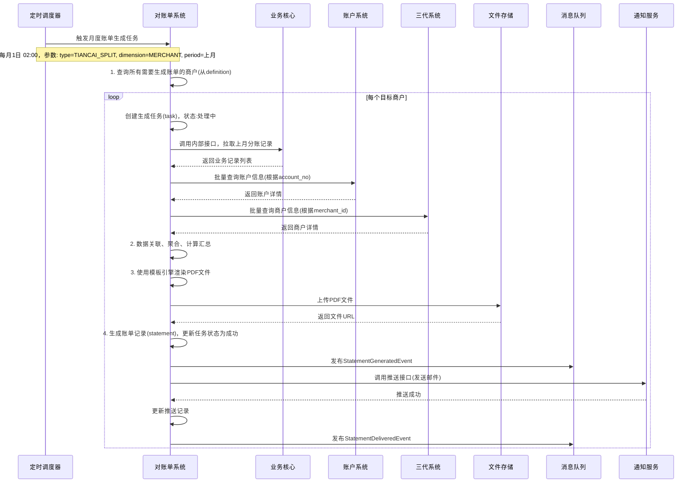
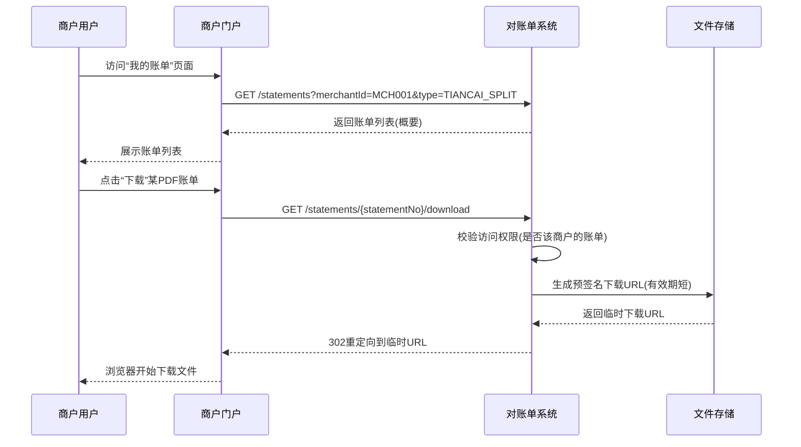
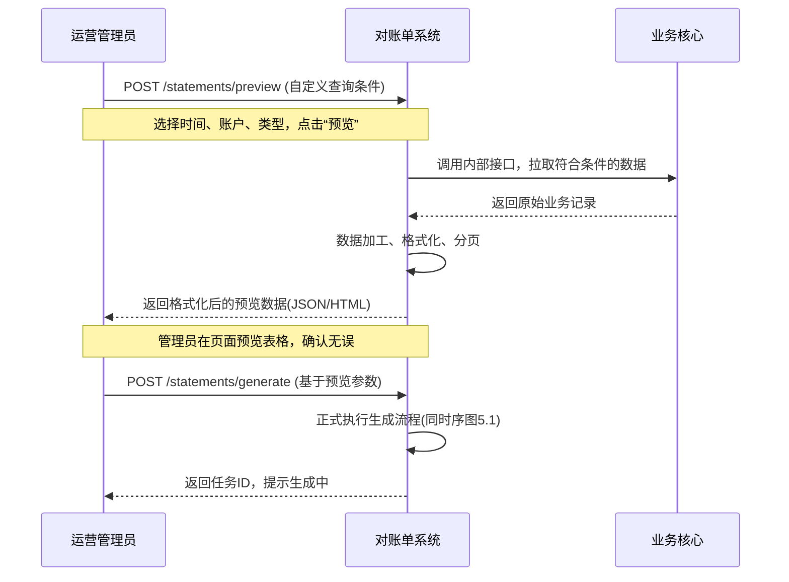

# 模块设计: 对账单系统

生成时间: 2026-01-19 17:51:06

---

# 模块设计: 对账单系统

生成时间: 2026-01-19 18:30:00

---

# 对账单系统模块设计文档

## 1. 概述

### 1.1 目的
对账单系统是“天财分账”业务的统一账单生成与交付平台，负责为商户、运营和财务人员提供清晰、准确、多维度、可追溯的资金业务视图。本模块的核心职责是**聚合**来自业务核心、清结算系统、账户系统等多个上游模块的数据，按照预定义的规则和格式，生成并交付各类对账单，特别是新的“天财分账指令账单”。它不产生原始业务数据，而是数据的**加工者、组织者和呈现者**，旨在满足商户对账、财务核算、运营监控和审计追溯的需求。

### 1.2 范围
- **账单生成**：根据配置的周期（日、周、月）或按需，生成指定维度的对账单，包括但不限于：
    - **天财分账指令账单**：核心账单，基于业务核心的“天财分账”交易记录生成，按指令维度展示分账详情。
    - **账户维度对账单**：展示指定账户（天财收款账户/接收方账户）在特定时间段内的所有资金变动流水。
    - **交易维度对账单**：按收单交易或分账交易维度展示明细。
- **数据聚合与加工**：从多个上游数据源拉取、清洗、关联、聚合数据，计算汇总金额（如交易总额、手续费总额、净额）。
- **账单文件管理**：生成标准格式（PDF/Excel/CSV）的账单文件，并提供安全的存储、下载和推送服务。
- **账单查询与推送**：为商户和管理员提供账单查询、预览、下载接口，并支持通过邮件、站内信等方式自动推送账单。
- **对账与差错处理支持**：提供账单数据与底层清结算流水、银行回单的核对基础，支持差错单的关联与追踪。
- **不包含**：不负责产生原始交易记录（业务核心职责）、不处理底层资金清算（清结算系统职责）、不管理账户（账户系统职责）。

## 2. 接口设计

### 2.1 API 端点 (RESTful)

#### 2.1.1 账单生成与管理
- **POST /api/v1/statements/generate** - 触发账单生成任务（支持按商户、账户、时间范围）
- **GET /api/v1/statements/generation-tasks/{taskId}** - 查询账单生成任务状态
- **POST /api/v1/statements/{statementNo}/deliver** - 推送指定账单（如发送邮件）

#### 2.1.2 账单查询与下载
- **GET /api/v1/statements** - 查询账单列表（支持按商户、账户、账单类型、时间范围、状态筛选）
- **GET /api/v1/statements/{statementNo}** - 获取账单概要信息及明细数据（分页）
- **GET /api/v1/statements/{statementNo}/download** - 下载账单文件（PDF/Excel）
- **GET /api/v1/statements/preview** - 预览账单（实时查询并返回格式化数据，不生成文件）

#### 2.1.3 数据供给接口（供上游系统或管理端）
- **GET /api/v1/internal/settlement-records** - 获取清结算流水（供对账核对）
- **GET /api/v1/internal/account-balance-snapshots** - 获取指定时间点的账户余额快照

### 2.2 输入/输出数据结构

#### 2.2.1 触发账单生成请求 (`GenerateStatementRequest`)
```json
{
  "requestId": "req_gen_stmt_20231030001",
  "statementType": "TIANCAI_SPLIT_INSTRUCTION", // 枚举: TIANCAI_SPLIT_INSTRUCTION, ACCOUNT_DETAIL, TRANSACTION_DETAIL
  "dimension": "MERCHANT", // 维度: MERCHANT, ACCOUNT, DATE
  "dimensionValue": "MCH_TC_HQ_001", // 如商户ID、账户号、日期(YYYY-MM-DD)
  "startDate": "2023-10-01", // 账单周期开始日期 (yyyy-MM-dd)
  "endDate": "2023-10-31", // 账单周期结束日期 (yyyy-MM-dd)
  "fileFormat": "PDF", // 枚举: PDF, EXCEL, CSV
  "deliveryMethods": ["EMAIL", "PORTAL"], // 推送方式: EMAIL, PORTAL(站内), API
  "operator": "system_scheduler",
  "extInfo": {
    "timeZone": "Asia/Shanghai",
    "language": "zh_CN"
  }
}
```

#### 2.2.2 账单概要信息 (`StatementSummary`)
```json
{
  "statementNo": "STMT_TIANCAI_202310_MCH001",
  "statementType": "TIANCAI_SPLIT_INSTRUCTION",
  "title": "天财分账指令账单",
  "dimension": "MERCHANT",
  "dimensionValue": "MCH_TC_HQ_001",
  "dimensionDisplayName": "天财合作商户-总部",
  "period": "2023-10-01 至 2023-10-31",
  "currency": "CNY",
  "summary": {
    "totalTransactionCount": 150,
    "totalAmount": 1500000.00,
    "totalFee": 1500.00,
    "totalNetAmount": 1498500.00,
    "collectionCount": 100,
    "collectionAmount": 1000000.00,
    "batchPaymentCount": 30,
    "batchPaymentAmount": 300000.00,
    "memberSettlementCount": 20,
    "memberSettlementAmount": 200000.00
  },
  "fileInfo": {
    "format": "PDF",
    "fileSize": 204800,
    "downloadUrl": "https://statement.xxx.com/download/STMT_TIANCAI_202310_MCH001.pdf",
    "generatedTime": "2023-11-01T03:00:00Z"
  },
  "status": "GENERATED", // GENERATING, GENERATED, DELIVERED, FAILED
  "createdTime": "2023-11-01T02:00:00Z"
}
```

#### 2.2.3 天财分账指令账单明细项 (`TiancaiSplitStatementItem`)
```json
{
  "sequenceNo": 1,
  "businessDate": "2023-10-29",
  "businessTime": "2023-10-29T18:00:03Z",
  "recordId": "BIZ_20231029000001",
  "transferNo": "WTR_20231029000001",
  "instructionId": "INST_COL_202310280001",
  "instructionType": "COLLECTION",
  "instructionTypeDesc": "资金归集",
  "payerAccountNo": "TC_ACCT_STORE_001",
  "payerMerchantName": "天财合作商户-北京朝阳店",
  "payeeAccountNo": "TC_ACCT_HQ_001",
  "payeeMerchantName": "天财合作商户-总部",
  "amount": 100000.00,
  "currency": "CNY",
  "fee": 100.00,
  "feeBearer": "PAYER",
  "feeBearerDesc": "付款方承担",
  "netAmount": 100000.00, // 收款方净入账金额
  "settlementSerialNo": "STL_20231029000001",
  "relationshipNo": "REL_COL_202310270001",
  "remark": "门店日终归集",
  "status": "SUCCESS"
}
```

#### 2.2.4 账单生成任务响应 (`GenerateStatementResponse`)
```json
{
  "code": "SUCCESS",
  "message": "账单生成任务已提交",
  "data": {
    "taskId": "TASK_STMT_20231101001",
    "statementNo": "STMT_TIANCAI_202310_MCH001",
    "estimatedCompletionTime": "2023-11-01T03:00:00Z",
    "status": "PROCESSING"
  }
}
```

### 2.3 发布/消费的事件

#### 2.3.1 消费的事件
- **BizRecordCreatedEvent** (来自业务核心): 监听新的天财分账业务记录创建事件，可用于实时更新账单汇总数据缓存或触发按需账单生成。
    ```json
    {
      "eventType": "BIZCORE.TIANCAI_SPLIT_RECORD.CREATED",
      "payload": {
        "recordId": "BIZ_20231029000001",
        "transferNo": "WTR_20231029000001",
        "instructionId": "INST_COL_202310280001",
        "instructionType": "COLLECTION",
        "payerAccountNo": "TC_ACCT_STORE_001",
        "payeeAccountNo": "TC_ACCT_HQ_001",
        "amount": 100000,
        "businessTime": "2023-10-29T18:00:03Z"
      }
    }
    ```
- **SettlementCompletedEvent** (来自清结算系统): 监听资金结算完成事件，可用于账户维度对账单的数据源更新。
- **AccountStatusChangedEvent** (来自账户系统): 账户状态变更可能影响账单的账户信息展示。

#### 2.3.2 发布的事件
- **StatementGeneratedEvent**: 当一份账单文件成功生成并存储后发布。下游系统（如通知中心、数据仓库）可订阅此事件。
    ```json
    {
      "eventId": "evt_statement_generated_001",
      "eventType": "STATEMENT.GENERATED",
      "timestamp": "2023-11-01T03:00:05Z",
      "payload": {
        "statementNo": "STMT_TIANCAI_202310_MCH001",
        "statementType": "TIANCAI_SPLIT_INSTRUCTION",
        "dimension": "MERCHANT",
        "dimensionValue": "MCH_TC_HQ_001",
        "period": "2023-10-01 至 2023-10-31",
        "fileUrl": "https://statement.xxx.com/download/STMT_TIANCAI_202310_MCH001.pdf",
        "generatedTime": "2023-11-01T03:00:00Z"
      }
    }
    ```
- **StatementDeliveredEvent**: 当账单通过指定方式（如邮件）成功推送给用户后发布。

## 3. 数据模型

### 3.1 数据库表设计

#### 表: `statement_definition` (账单定义表)
| 字段名 | 类型 | 必填 | 默认值 | 说明 |
|--------|------|------|--------|------|
| `id` | BIGINT(20) | Y | AUTO_INCREMENT | 主键 |
| `statement_type` | VARCHAR(32) | Y | | 账单类型: TIANCAI_SPLIT_INSTRUCTION, ACCOUNT_DETAIL, TRANSACTION_DETAIL |
| `dimension` | VARCHAR(32) | Y | | 维度: MERCHANT, ACCOUNT, DATE, CUSTOM |
| `dimension_value_pattern` | VARCHAR(128) | N | | 维度值模式，如商户ID模式、账户号模式 |
| `generation_frequency` | VARCHAR(32) | Y | | 生成频率: DAILY, WEEKLY, MONTHLY, ON_DEMAND |
| `generation_cron` | VARCHAR(64) | N | | Cron表达式，用于定时生成 |
| `file_format` | VARCHAR(16) | Y | PDF | 文件格式: PDF, EXCEL, CSV |
| `template_id` | VARCHAR(64) | Y | | 关联的模板ID (用于渲染) |
| `delivery_methods` | VARCHAR(256) | Y | | 推送方式，JSON数组，如 ["EMAIL", "PORTAL"] |
| `status` | TINYINT(1) | Y | 1 | 状态: 1-启用，2-停用 |
| `created_time` | DATETIME | Y | CURRENT_TIMESTAMP | 创建时间 |
| `updated_time` | DATETIME | Y | CURRENT_TIMESTAMP ON UPDATE | 更新时间 |

**索引**:
- 唯一索引: `uk_type_dimension` (`statement_type`, `dimension`)

#### 表: `statement_task` (账单生成任务表)
| 字段名 | 类型 | 必填 | 默认值 | 说明 |
|--------|------|------|--------|------|
| `id` | BIGINT(20) | Y | AUTO_INCREMENT | 主键 |
| `task_id` | VARCHAR(32) | Y | | **任务ID**，格式: TASK_STMT_{日期}{序列} |
| `request_id` | VARCHAR(64) | Y | | 外部请求ID，用于幂等 |
| `statement_type` | VARCHAR(32) | Y | | 账单类型 |
| `dimension` | VARCHAR(32) | Y | | 维度 |
| `dimension_value` | VARCHAR(128) | Y | | 维度值 |
| `start_date` | DATE | Y | | 账单周期开始日期 |
| `end_date` | DATE | Y | | 账单周期结束日期 |
| `file_format` | VARCHAR(16) | Y | | 文件格式 |
| `status` | TINYINT(1) | Y | 0 | 状态: 0-待处理，1-处理中，2-成功，3-失败，4-已取消 |
| `statement_no` | VARCHAR(64) | N | | 生成的账单编号，成功时填充 |
| `data_query_params` | TEXT | Y | | 数据查询参数，JSON格式，记录拉取数据的条件 |
| `error_code` | VARCHAR(32) | N | | 错误码 |
| `error_message` | VARCHAR(512) | N | | 错误信息 |
| `generated_file_url` | VARCHAR(512) | N | | 生成的文件存储路径 |
| `start_time` | DATETIME | Y | CURRENT_TIMESTAMP | 任务开始时间 |
| `end_time` | DATETIME | N | | 任务结束时间 |
| `created_time` | DATETIME | Y | CURRENT_TIMESTAMP | 创建时间 |

**索引**:
- 唯一索引: `uk_task_id` (`task_id`)
- 唯一索引: `uk_request_id` (`request_id`)
- 索引: `idx_status_created` (`status`, `created_time`)
- 索引: `idx_dimension_time` (`dimension`, `dimension_value`, `start_date`, `end_date`)

#### 表: `statement` (账单主表)
| 字段名 | 类型 | 必填 | 默认值 | 说明 |
|--------|------|------|--------|------|
| `id` | BIGINT(20) | Y | AUTO_INCREMENT | 主键 |
| `statement_no` | VARCHAR(64) | Y | | **账单编号**，业务唯一标识，格式: STMT_{类型}_{周期}_{维度值} |
| `statement_type` | VARCHAR(32) | Y | | 账单类型 |
| `title` | VARCHAR(128) | Y | | 账单标题 |
| `dimension` | VARCHAR(32) | Y | | 维度 |
| `dimension_value` | VARCHAR(128) | Y | | 维度值 |
| `dimension_display_name` | VARCHAR(128) | N | | 维度展示名 (如商户名称) |
| `period_start` | DATE | Y | | 账单周期开始 |
| `period_end` | DATE | Y | | 账单周期结束 |
| `currency` | CHAR(3) | Y | CNY | 币种 |
| `summary` | TEXT | Y | | 账单汇总信息，JSON格式 |
| `file_format` | VARCHAR(16) | Y | | 文件格式 |
| `file_size` | BIGINT(20) | N | | 文件大小(字节) |
| `file_storage_path` | VARCHAR(512) | Y | | 文件存储路径 (对象存储Key) |
| `download_url` | VARCHAR(512) | N | | 下载链接 (可过期) |
| `status` | TINYINT(1) | Y | 1 | 状态: 1-已生成，2-已推送，3-已归档 |
| `generated_time` | DATETIME | Y | | 账单生成时间 |
| `delivered_time` | DATETIME | N | | 推送时间 |
| `task_id` | VARCHAR(32) | Y | | 关联的生成任务ID |
| `created_time` | DATETIME | Y | CURRENT_TIMESTAMP | 创建时间 |
| `updated_time` | DATETIME | Y | CURRENT_TIMESTAMP ON UPDATE | 更新时间 |

**索引**:
- 唯一索引: `uk_statement_no` (`statement_no`)
- 索引: `idx_dimension_period` (`dimension`, `dimension_value`, `period_start`, `period_end`)
- 索引: `idx_generated_time` (`generated_time`)

#### 表: `statement_delivery` (账单推送记录表)
| 字段名 | 类型 | 必填 | 默认值 | 说明 |
|--------|------|------|--------|------|
| `id` | BIGINT(20) | Y | AUTO_INCREMENT | 主键 |
| `statement_no` | VARCHAR(64) | Y | | 账单编号 |
| `delivery_method` | VARCHAR(32) | Y | | 推送方式: EMAIL, PORTAL, API |
| `recipient` | VARCHAR(256) | Y | | 接收方，如邮箱地址、用户ID |
| `status` | TINYINT(1) | Y | 0 | 状态: 0-待发送，1-发送中，2-成功，3-失败 |
| `sent_time` | DATETIME | N | | 发送时间 |
| `error_message` | VARCHAR(512) | N | | 失败信息 |
| `created_time` | DATETIME | Y | CURRENT_TIMESTAMP | 创建时间 |

**索引**:
- 索引: `idx_statement_no` (`statement_no`)
- 索引: `idx_recipient_status` (`recipient`, `status`)

#### 表: `statement_data_cache` (账单数据缓存表)
| 字段名 | 类型 | 必填 | 默认值 | 说明 |
|--------|------|------|--------|------|
| `id` | BIGINT(20) | Y | AUTO_INCREMENT | 主键 |
| `cache_key` | VARCHAR(256) | Y | | 缓存键，格式: {type}:{dimension}:{value}:{date} |
| `data_type` | VARCHAR(32) | Y | | 数据类型: DAILY_SUMMARY, MONTHLY_SUMMARY |
| `dimension` | VARCHAR(32) | Y | | 维度 |
| `dimension_value` | VARCHAR(128) | Y | | 维度值 |
| `data_date` | DATE | Y | | 数据日期 |
| `summary_data` | TEXT | Y | | 汇总数据，JSON格式 |
| `expire_time` | DATETIME | Y | | 缓存过期时间 |
| `created_time` | DATETIME | Y | CURRENT_TIMESTAMP | 创建时间 |
| `updated_time` | DATETIME | Y | CURRENT_TIMESTAMP ON UPDATE | 更新时间 |

**索引**:
- 唯一索引: `uk_cache_key` (`cache_key`)
- 索引: `idx_data_date` (`data_date`, `dimension`, `dimension_value`)

### 3.2 与其他模块的关系
- **业务核心**: **核心数据源**。通过内部接口拉取“天财分账”业务记录 (`biz_tiancai_split_record`)，是生成“天财分账指令账单”的主要依据。
- **清结算系统**: **重要数据源**。拉取清算流水 (`tiancai_clearing_record`) 和账户余额快照，用于生成账户维度对账单、交易维度对账单，并进行资金核对。
- **账户系统**: **信息依赖**。获取账户详情（账户号、关联商户ID）和标签，用于数据关联和维度划分。
- **三代系统**: **信息依赖**。获取商户详细信息（名称、联系方式）和业务关系上下文，用于丰富账单展示内容。
- **文件存储服务** (如对象存储OSS/S3): **强依赖**。用于存储生成的PDF/Excel账单文件。
- **消息推送服务** (邮件/站内信): **下游依赖**。调用其服务完成账单的主动推送。
- **定时任务调度器**: **触发依赖**。按配置的周期（日、月）触发自动账单生成任务。

## 4. 业务逻辑

### 4.1 核心算法
**账单编号生成算法**:
```
STMT_{TYPE}_{PERIOD}_{DIMENSION_VALUE}_{RANDOM_SUFFIX}
```
- `TYPE`: 简写，如 `TIANCAI` (天财分账指令), `ACCT` (账户明细)
- `PERIOD`: 对于周期账单，格式为 `YYYYMM` (月) 或 `YYYYMMDD` (日)；对于自定义周期，可为 `YYYYMMDD_YYYYMMDD`
- `DIMENSION_VALUE`: 维度值的关键部分，如商户ID的后几位或账户号的后几位。
- `RANDOM_SUFFIX`: 4位随机数，防止碰撞。
- 示例: `STMT_TIANCAI_202310_MCH001_5A2F`

**数据聚合与汇总算法**:
- **天财分账指令账单汇总**:
    ```sql
    SELECT 
        COUNT(*) as total_count,
        SUM(amount) as total_amount,
        SUM(fee) as total_fee,
        SUM(CASE WHEN fee_bearer = 2 THEN amount - fee ELSE amount END) as total_net_amount,
        COUNT(CASE WHEN instruction_type = 1 THEN 1 END) as collection_count,
        SUM(CASE WHEN instruction_type = 1 THEN amount ELSE 0 END) as collection_amount,
        -- ... 其他类型类似
    FROM biz_tiancai_split_record
    WHERE business_time BETWEEN ? AND ?
        AND (payer_merchant_id = ? OR payee_merchant_id = ?) -- 商户维度
    ```
- **每日汇总预计算**: 通过监听`BizRecordCreatedEvent`或定时任务，预先计算每个商户/账户每日的分账汇总数据，存入`statement_data_cache`，加速月度账单生成。

### 4.2 业务规则
1. **账单生成触发规则**:
   - **定时生成**: 根据`statement_definition`中配置的`generation_cron`，由调度器触发。例如，每月1日凌晨2点生成上月的天财分账指令月账单。
   - **按需生成**: 通过API接口`POST /statements/generate`手动触发，支持自定义时间范围和维度。
   - **事件驱动生成** (可选): 监听特定事件（如商户首次交易满月），触发定制化账单生成。

2. **数据拉取与关联规则**:
   - **主数据源确定**: 
        - 天财分账指令账单 → **业务核心** (`biz_tiancai_split_record`)
        - 账户维度对账单 → **清结算系统** (`tiancai_clearing_record` + 账户余额接口)
        - 交易维度对账单 → 根据交易类型，从业务核心或清结算系统拉取。
   - **数据关联与丰富**: 拉取到核心流水数据后，需根据`account_no`、`merchant_id`等字段，调用账户系统、三代系统等接口，获取并关联商户名称、账户类型等展示信息。**注意性能**，需采用批量查询和缓存。
   - **时间范围处理**: 所有时间查询均基于**业务时间** (`business_time`)，并考虑时区转换（根据请求中的`timeZone`）。

3. **账单文件生成规则**:
   - **模板化渲染**: 使用预定义的模板（如JasperReport for PDF, Excel模板）进行渲染。模板中定义样式、表头、汇总行、明细行格式。
   - **多格式支持**: 同一份数据可渲染为PDF（用于打印、归档）、Excel（用于数据分析）、CSV（用于系统对接）等格式。
   - **文件存储**: 生成的文件上传至对象存储，生成可下载的URL（可设置有效期）。文件路径按`{账单类型}/{年}/{月}/{账单编号}.{后缀}`规则组织。

4. **账单推送规则**:
   - **多通道推送**: 支持邮件（附件）、商户门户站内消息、API回调等多种方式。
   - **推送时机**: 可在账单生成后立即自动推送，也可由商户在门户手动触发。
   - **失败重试**: 推送失败（如邮件发送失败）后，记录失败原因，并支持手动重试。

5. **数据一致性保障**:
   - **幂等生成**: 基于`requestId`防止重复生成相同参数的账单。
   - **最终一致性**: 账单生成时拉取的数据是某个时间点的快照。允许与最新数据有微小延迟，但需在账单标题或备注中明确标注“数据截止时间”。
   - **差错处理**: 如果发现已生成账单的数据有误（如上游修正了交易记录），需有账单作废和重新生成的流程（生成新版本账单，并通知用户）。

### 4.3 验证逻辑
1. **生成请求验证**:
   - `startDate` 必须早于或等于 `endDate`。
   - `dimension` 和 `dimensionValue` 必须匹配且有效（如验证商户是否存在）。
   - 对于周期账单，检查是否已存在相同周期、相同维度的成功账单，避免重复生成（除非指定覆盖）。
   - 检查请求的账单类型和维度是否在`statement_definition`中有定义且启用。

2. **数据拉取验证**:
   - 调用上游接口时，检查返回的数据格式是否符合预期。
   - 验证关键字段（如金额）是否为正数，时间是否在合理范围内。
   - 检查数据关联性，如发现`account_no`无法关联到商户，记录警告并使用备用信息。

3. **文件生成与存储验证**:
   - 文件生成成功后，验证文件大小非空，并可被正确读取。
   - 上传至对象存储后，验证上传成功并获取到有效的URL。

## 5. 时序图

### 5.1 定时生成天财分账指令月账单时序图



### 5.2 商户门户查询并下载账单时序图



### 5.3 按需生成账单并预览时序图



## 6. 错误处理

### 6.1 预期错误码
| 错误码 | HTTP状态码 | 描述 | 处理建议 |
|--------|------------|------|----------|
| `INVALID_DATE_RANGE` | 400 Bad Request | 账单日期范围无效 | 检查开始日期是否早于结束日期 |
| `DIMENSION_VALUE_NOT_FOUND` | 404 Not Found | 指定的维度值（如商户）不存在 | 检查商户ID或账户号是否正确 |
| `STATEMENT_ALREADY_EXISTS` | 409 Conflict | 相同周期和维度的账单已存在 | 可返回已存在账单信息，或指定参数覆盖旧账单 |
| `DATA_SOURCE_UNAVAILABLE` | 503 Service Unavailable | 上游数据源（业务核心等）不可用 | 账单生成任务置为失败，记录错误，触发告警 |
| `TEMPLATE_RENDER_FAILED` | 500 Internal Server Error | 模板渲染失败（数据或模板问题） | 记录详细日志，检查模板语法和数据格式 |
| `FILE_STORAGE_FAILED` | 500 Internal Server Error | 文件存储失败 | 重试上传操作，多次失败后任务置为失败 |
| `DELIVERY_FAILED` | 500 Internal Server Error | 账单推送失败（如邮件发送失败） | 记录失败原因，支持手动重试推送 |
| `PERMISSION_DENIED` | 403 Forbidden | 无权访问或下载该账单 | 检查用户权限与账单归属 |

### 6.2 处理策略
1. **账单生成过程失败**:
   - **数据拉取失败**: 重试拉取（最多3次），若仍失败，则将生成任务状态置为`FAILED`，记录错误详情，并触发告警通知运维人员。
   - **文件生成/上传失败**: 同上，进行重试。对于大型账单，可考虑分片处理或优化内存使用。
   - **部分数据缺失**: 如果非关键信息（如商户名称）获取失败，使用默认值（如账户号）替代，生成账单但记录警告日志。如果关键信息（如交易金额）缺失，则任务失败。

2. **推送失败**:
   - 邮件发送失败等，更新`statement_delivery`记录状态为失败，记录错误原因。
   - 提供管理界面供运营人员查看失败记录并手动重试。

3. **数据不一致处理**:
   - **事后发现数据错误**: 提供“账单重新生成”功能。新生成的账单会覆盖旧文件（或生成新版本），并通过事件或通知告知相关方旧账单已失效。
   - **对账不平**: 提供“对账差异报告”生成功能，将账单数据与清结算底层流水进行比对，列出差异项，供财务人员核查。

4. **性能与降级**:
   - **大数据量处理**: 对于数据量大的账单（如总部全年交易），采用分页拉取、流式处理、异步生成策略，避免内存溢出。
   - **上游服务降级**: 当三代系统或账户系统不可用时，账单生成可降级为仅使用本地缓存的基础信息（如商户名称缓存），保证账单能生成，但信息可能不是最新。
   - **预览替代下载**: 当文件生成服务临时不可用时，可引导用户使用“预览”功能查看数据。

## 7. 依赖说明

### 7.1 上游模块交互
1. **业务核心**:
   - **交互方式**: 同步HTTP调用（内部数据接口）。
   - **职责**: 提供“天财分账”业务记录的权威数据。是生成核心账单的**主要数据源**。
   - **降级方案**: **无直接降级**。业务核心不可用，则无法生成天财分账指令账单。必须保证其高可用，或允许账单生成任务排队等待。

2. **清结算系统**:
   - **交互方式**: 同步HTTP调用（内部数据接口）。
   - **职责**: 提供清算流水和账户余额，用于账户维度、交易维度账单及资金核对。
   - **降级方案**: 部分账单类型（如天财分账指令账单）可降级为不包含清结算流水号等信息。账户维度账单则严重依赖，无法降级。

3. **账户系统**:
   - **交互方式**: 同步HTTP调用（批量查询接口）。
   - **职责**: 提供账户基础信息（关联商户ID、类型）和状态。
   - **降级方案**: **有**。可依赖本地缓存（`merchant_info_snapshot`或自建缓存）中的账户-商户映射关系。缓存未命中时，使用账户号作为展示名。

4. **三代系统**:
   - **交互方式**: 同步HTTP调用（批量查询接口）。
   - **职责**: 提供商户的详细展示信息（名称、地址等）。
   - **降级方案**: **有**。与账户系统类似，严重依赖缓存。调用失败时，使用账户系统提供的商户ID或账户号作为展示名。

### 7.2 下游依赖
1. **文件存储服务** (如OSS):
   - **交互方式**: SDK同步/异步调用。
   - **职责**: 安全、持久地存储生成的账单文件。
   - **降级方案**: **无**。文件存储失败，账单无法交付。需有重试机制和高可用存储架构。

2. **通知服务** (邮件/短信/站内信):
   - **交互方式**: 同步HTTP调用或异步消息。
   - **职责**: 将账单推送给最终用户。
   - **降级方案**: **有**。推送失败不影响账单生成和存储，用户仍可通过门户手动下载。记录失败并支持重试。

### 7.3 依赖治理
- **超时与重试**:
    - 调用业务核心/清结算: 超时设置为10-30s（因数据量可能大），重试2次。
    - 调用账户/三代系统: 超时3s，重试1次，并依赖缓存。
    - 文件上传: 超时60s，重试3次，采用分片上传提高成功率。
- **缓存策略**:
    - 商户/账户信息缓存: 使用Redis或本地缓存，TTL设置为1小时，并监听相关变更事件进行刷新。
    - 每日汇总数据缓存: 使用Redis，TTL设置为7天，加速月度账单生成。
- **异步化与资源隔离**:
    - 账单生成是CPU和IO密集型任务，使用独立的线程池或消息队列进行异步处理，与实时查询API隔离。
    - 对大型账单生成任务，支持拆分为子任务并行处理。
- **监控**:
    - 监控账单生成任务的成功率、平均耗时、上游接口调用延迟。
    - 监控文件存储空间使用情况。
    - 设置告警：任务失败率升高、长时间运行的任务、上游服务不可用。