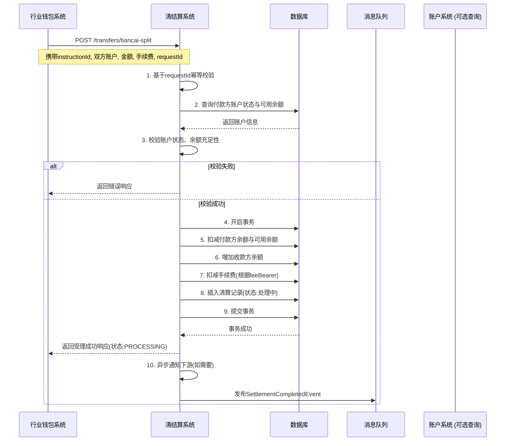
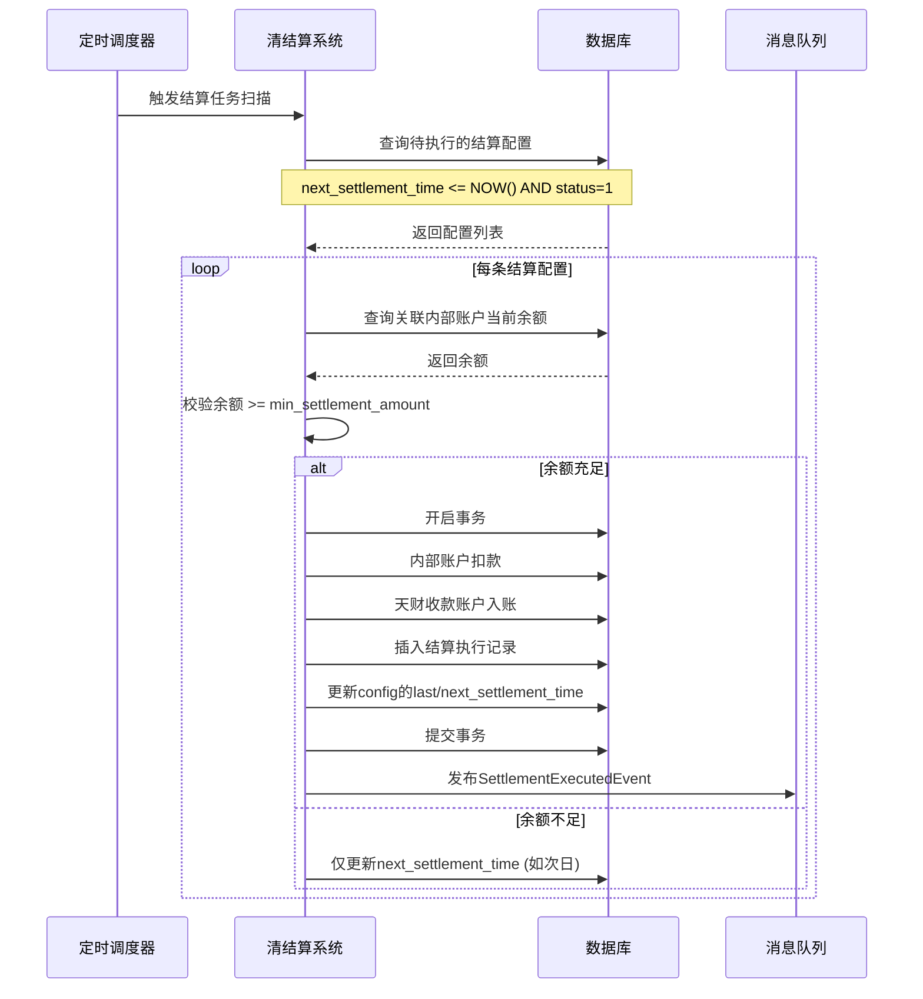
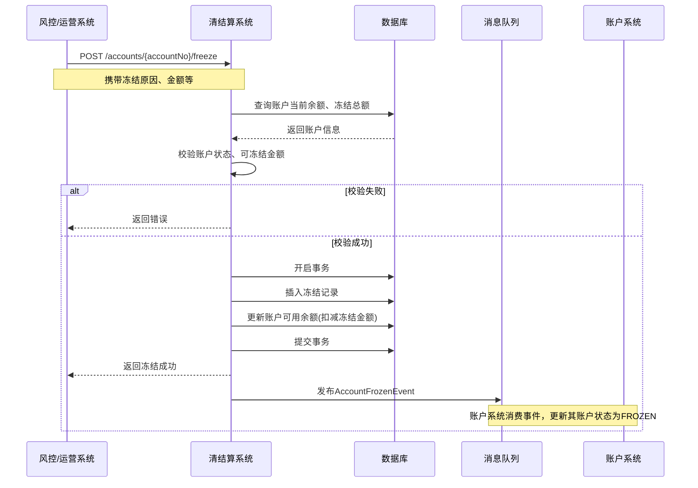

# 模块设计: 清结算系统

生成时间: 2026-01-19 17:48:28

---

# 模块设计: 清结算系统

生成时间: 2026-01-19 17:48:00

---

# 清结算系统模块设计文档

## 1. 概述

### 1.1 目的
清结算系统是“天财分账”业务的资金处理核心，负责处理与账户系统、三代系统、行业钱包系统等模块交互产生的资金清算与结算任务。本模块的核心职责是管理内部账户（如待结算账户、退货账户），处理“天财分账”交易的资金划转、结算模式配置、退货处理，并为其他系统提供资金状态查询和账户冻结能力。它是连接上层业务指令与底层资金流转的关键桥梁，确保资金处理的准确性、时效性和可追溯性。

### 1.2 范围
- **内部账户管理**：创建、配置和管理用于资金暂存与流转的内部账户（如01-待结算账户，04-退货账户）。
- **结算模式配置与执行**：为收单商户配置“主动结算”或“被动结算”模式，并根据配置执行相应的资金结算动作（如将待结算账户资金划至天财收款账户）。
- **分账资金处理**：接收并处理来自行业钱包系统的“天财分账”交易请求，完成资金从付款方账户到收款方账户的划拨，并记录详细的清算流水。
- **退货资金处理**：处理交易退货场景，根据业务规则从指定账户（天财收款账户或退货账户）扣款并完成退款。
- **账户冻结/解冻**：根据风控或业务指令，对天财收款账户或接收方账户进行资金冻结与解冻操作。
- **资金状态查询**：为其他系统提供账户余额、在途资金、交易流水等查询服务。
- **对账支持**：生成清结算维度的流水，供对账单系统进行核对。
- **不包含**：不负责业务逻辑校验（由三代系统负责）、不直接管理商户/接收方信息、不处理电子签约流程、不计算手续费（由计费中台负责）。

## 2. 接口设计

### 2.1 API 端点 (RESTful)

#### 2.1.1 内部账户与结算配置
- **POST /api/v1/internal-accounts** - 创建内部账户（如01，04账户）
- **PUT /api/v1/merchants/{merchantId}/settlement-config** - 配置或更新商户结算模式
- **GET /api/v1/merchants/{merchantId}/settlement-config** - 查询商户结算配置

#### 2.1.2 资金处理
- **POST /api/v1/settlements/execute** - 执行结算（将待结算账户资金结算到天财收款账户）
- **POST /api/v1/transfers/tiancai-split** - 处理天财分账资金划转请求（供行业钱包系统调用）
- **POST /api/v1/refunds/process** - 处理退货退款请求

#### 2.1.3 账户状态管理
- **POST /api/v1/accounts/{accountNo}/freeze** - 冻结指定账户
- **POST /api/v1/accounts/{accountNo}/unfreeze** - 解冻指定账户
- **GET /api/v1/accounts/{accountNo}/balance** - 查询账户余额及可用余额
- **GET /api/v1/accounts/{accountNo}/transactions** - 查询账户交易流水

#### 2.1.4 查询服务
- **GET /api/v1/settlement-records** - 查询结算执行记录
- **GET /api/v1/clearing-records** - 查询天财分账清算记录（供对账单系统消费）

### 2.2 输入/输出数据结构

#### 2.2.1 配置商户结算模式请求 (`ConfigureSettlementRequest`)
```json
{
  "requestId": "req_settle_cfg_20231029001",
  "merchantId": "MCH_TC_HQ_001",
  "settlementMode": "PASSIVE", // ACTIVE, PASSIVE
  "internalAccountCode": "01", // 被动结算时必填，关联的待结算账户代码
  "settlementRule": {
    "type": "DAILY", // DAILY, WEEKLY, MONTHLY, MANUAL
    "time": "T+1 02:00:00", // 执行时间，MANUAL类型可为空
    "minAmount": 10000 // 最低结算金额，低于此值不触发自动结算
  },
  "operator": "tiancai_admin",
  "extInfo": {}
}
```

#### 2.2.2 处理天财分账请求 (`ProcessTiancaiSplitRequest`)
```json
{
  "requestId": "req_split_20231029001",
  "instructionId": "INST_COL_202310280001",
  "splitType": "COLLECTION", // COLLECTION, BATCH_PAYMENT, MEMBER_SETTLEMENT
  "payerAccountNo": "TC_ACCT_STORE_001",
  "payeeAccountNo": "TC_ACCT_HQ_001",
  "amount": 100000,
  "currency": "CNY",
  "fee": 100,
  "feeBearer": "PAYER", // PAYER, PAYEE
  "businessTime": "2023-10-28T18:00:00Z",
  "remark": "门店日终归集",
  "callbackUrl": "https://wallet.xxx.com/callback/settlement"
}
```

#### 2.2.3 处理退货请求 (`ProcessRefundRequest`)
```json
{
  "requestId": "req_refund_20231029001",
  "originalOrderNo": "ORDER_202310280001",
  "refundOrderNo": "REFUND_202310290001",
  "merchantId": "MCH_TC_HQ_001",
  "refundAmount": 5000,
  "currency": "CNY",
  "refundAccountType": "PAYMENT_ACCOUNT", // PAYMENT_ACCOUNT, REFUND_ACCOUNT(04账户)
  "paymentAccountNo": "TC_ACCT_HQ_001", // refundAccountType为PAYMENT_ACCOUNT时必填
  "reason": "商品质量问题",
  "operator": "customer_service",
  "extInfo": {}
}
```

#### 2.2.4 通用资金操作响应 (`FundsOperationResponse`)
```json
{
  "code": "SUCCESS",
  "message": "操作成功",
  "data": {
    "settlementNo": "STL_202310290001", // 或 transferNo, refundNo
    "requestId": "req_split_20231029001",
    "status": "PROCESSING", // PROCESSING, SUCCESS, FAILED
    "payerAccountNo": "TC_ACCT_STORE_001",
    "payerBalance": 500000, // 操作后付款方余额
    "payerAvailable": 400000, // 操作后付款方可用余额
    "payeeAccountNo": "TC_ACCT_HQ_001",
    "payeeBalance": 600000,
    "estimatedFinishTime": "2023-10-29T10:00:05Z",
    "createdTime": "2023-10-29T10:00:00Z"
  }
}
```

#### 2.2.5 天财分账清算记录 (`TiancaiClearingRecord`)
```json
{
  "clearingId": "CLR_202310290001",
  "instructionId": "INST_COL_202310280001",
  "splitType": "COLLECTION",
  "clearingTime": "2023-10-29T10:00:00Z",
  "completeTime": "2023-10-29T10:00:05Z",
  "payerAccountNo": "TC_ACCT_STORE_001",
  "payeeAccountNo": "TC_ACCT_HQ_001",
  "amount": 100000,
  "currency": "CNY",
  "fee": 100,
  "feeBearer": "PAYER",
  "status": "SUCCESS",
  "internalTransactionNo": "TRX_INTERNAL_001",
  "channelTransactionNo": "TRX_CHANNEL_001",
  "remark": "门店日终归集"
}
```

### 2.3 发布/消费的事件

#### 2.3.1 发布的事件
- **SettlementCompletedEvent**: 当一笔分账资金划转（清算）完成时发布。
    ```json
    {
      "eventId": "evt_settlement_completed_001",
      "eventType": "SETTLEMENT.COMPLETED",
      "timestamp": "2023-10-29T10:00:05Z",
      "payload": {
        "instructionId": "INST_COL_202310280001",
        "clearingId": "CLR_202310290001",
        "status": "SUCCESS",
        "payerAccountNo": "TC_ACCT_STORE_001",
        "payeeAccountNo": "TC_ACCT_HQ_001",
        "amount": 100000,
        "fee": 100,
        "completeTime": "2023-10-29T10:00:05Z"
      }
    }
    ```
- **MerchantSettlementModeChangedEvent**: 当商户结算模式配置变更时发布。
- **AccountFrozenEvent** / **AccountUnfrozenEvent**: 当账户冻结/解冻操作完成时发布。
- **SettlementExecutedEvent**: 当执行结算（资金从待结算账户到收款账户）完成时发布。

#### 2.3.2 消费的事件
- **InstructionCreatedEvent** (来自三代系统): 监听新创建的分账指令，可用于预热或监控。
- **AccountCreatedEvent** (来自账户系统): 当新的天财收款账户创建时，根据其结算模式，在本系统建立对应的结算配置。
- **收单交易结算事件** (来自支付核心): 当收单交易完成结算时，根据商户配置的结算模式，将资金记入待结算账户或直接结算到天财收款账户。

## 3. 数据模型

### 3.1 数据库表设计

#### 表: `internal_account` (内部账户表)
| 字段名 | 类型 | 必填 | 默认值 | 说明 |
|--------|------|------|--------|------|
| `id` | BIGINT(20) | Y | AUTO_INCREMENT | 主键 |
| `account_code` | VARCHAR(8) | Y | | **内部账户代码**，如 '01', '04' |
| `account_name` | VARCHAR(64) | Y | | 账户名称，如 '待结算账户', '退货账户' |
| `account_type` | TINYINT(1) | Y | | 类型: 1-资产类，2-负债类，3-损益类 |
| `currency` | CHAR(3) | Y | CNY | 币种 |
| `status` | TINYINT(1) | Y | 1 | 状态: 1-启用，2-停用 |
| `balance` | DECIMAL(20,2) | Y | 0.00 | 当前余额 |
| `created_time` | DATETIME | Y | CURRENT_TIMESTAMP | 创建时间 |
| `updated_time` | DATETIME | Y | CURRENT_TIMESTAMP ON UPDATE | 更新时间 |

**索引**:
- 唯一索引: `uk_account_code` (`account_code`)

#### 表: `merchant_settlement_config` (商户结算配置表)
| 字段名 | 类型 | 必填 | 默认值 | 说明 |
|--------|------|------|--------|------|
| `id` | BIGINT(20) | Y | AUTO_INCREMENT | 主键 |
| `merchant_id` | VARCHAR(64) | Y | | 商户ID |
| `payment_account_no` | VARCHAR(32) | Y | | 关联的天财收款账户号 |
| `settlement_mode` | TINYINT(1) | Y | | 结算模式: 1-主动结算，2-被动结算 |
| `internal_account_code` | VARCHAR(8) | N | | 关联的内部账户代码（被动结算时必填） |
| `settlement_rule_type` | TINYINT(1) | Y | | 规则类型: 1-每日，2-每周，3-每月，4-手动 |
| `settlement_time` | VARCHAR(32) | N | | 规则执行时间表达式 |
| `min_settlement_amount` | DECIMAL(15,2) | N | | 最低结算金额 |
| `last_settlement_time` | DATETIME | N | | 上次结算执行时间 |
| `next_settlement_time` | DATETIME | N | | 下次预计结算时间 |
| `status` | TINYINT(1) | Y | 1 | 状态: 1-生效，2-暂停 |
| `created_time` | DATETIME | Y | CURRENT_TIMESTAMP | 创建时间 |
| `updated_time` | DATETIME | Y | CURRENT_TIMESTAMP ON UPDATE | 更新时间 |

**索引**:
- 唯一索引: `uk_merchant_account` (`merchant_id`, `payment_account_no`)
- 索引: `idx_settlement_mode` (`settlement_mode`)
- 索引: `idx_next_settlement_time` (`next_settlement_time`, `status`)

#### 表: `account_freeze_record` (账户冻结记录表)
| 字段名 | 类型 | 必填 | 默认值 | 说明 |
|--------|------|------|--------|------|
| `id` | BIGINT(20) | Y | AUTO_INCREMENT | 主键 |
| `freeze_no` | VARCHAR(32) | Y | | **冻结流水号** |
| `account_no` | VARCHAR(32) | Y | | 被冻结账户号 |
| `freeze_type` | TINYINT(1) | Y | | 类型: 1-全额冻结，2-部分金额冻结 |
| `freeze_amount` | DECIMAL(15,2) | N | | 冻结金额（部分冻结时必填） |
| `freeze_reason` | VARCHAR(256) | Y | | 冻结原因 |
| `initiator` | VARCHAR(64) | Y | | 发起方系统/用户 |
| `unfreeze_condition` | VARCHAR(512) | N | | 解冻条件描述 |
| `status` | TINYINT(1) | Y | 1 | 状态: 1-冻结中，2-已解冻 |
| `created_time` | DATETIME | Y | CURRENT_TIMESTAMP | 创建时间 |
| `updated_time` | DATETIME | Y | CURRENT_TIMESTAMP ON UPDATE | 更新时间 |
| `unfreeze_time` | DATETIME | N | | 解冻时间 |

**索引**:
- 唯一索引: `uk_freeze_no` (`freeze_no`)
- 索引: `idx_account_status` (`account_no`, `status`)
- 索引: `idx_created_time` (`created_time`)

#### 表: `tiancai_clearing_record` (天财分账清算记录表)
| 字段名 | 类型 | 必填 | 默认值 | 说明 |
|--------|------|------|--------|------|
| `id` | BIGINT(20) | Y | AUTO_INCREMENT | 主键 |
| `clearing_id` | VARCHAR(32) | Y | | **清算流水号** |
| `instruction_id` | VARCHAR(32) | Y | | 三代系统指令ID |
| `request_id` | VARCHAR(64) | Y | | 请求ID，用于幂等 |
| `split_type` | TINYINT(1) | Y | | 分账类型: 1-归集，2-批量付款，3-会员结算 |
| `payer_account_no` | VARCHAR(32) | Y | | 付款方账户号 |
| `payee_account_no` | VARCHAR(32) | Y | | 收款方账户号 |
| `amount` | DECIMAL(15,2) | Y | | 交易金额 |
| `currency` | CHAR(3) | Y | CNY | 币种 |
| `fee` | DECIMAL(15,2) | N | | 手续费 |
| `fee_bearer` | TINYINT(1) | N | | 手续费承担方: 1-付款方，2-收款方 |
| `status` | TINYINT(1) | Y | | 状态: 1-处理中，2-成功，3-失败 |
| `internal_transaction_no` | VARCHAR(64) | N | | 内部账务流水号 |
| `channel_transaction_no` | VARCHAR(64) | N | | 渠道流水号 |
| `error_code` | VARCHAR(32) | N | | 错误码 |
| `error_message` | VARCHAR(512) | N | | 错误信息 |
| `clearing_time` | DATETIME | Y | CURRENT_TIMESTAMP | 清算发起时间 |
| `completed_time` | DATETIME | N | | 完成时间 |
| `remark` | VARCHAR(256) | N | | 备注 |

**索引**:
- 唯一索引: `uk_clearing_id` (`clearing_id`)
- 唯一索引: `uk_request_id` (`request_id`)
- 索引: `idx_instruction_id` (`instruction_id`)
- 索引: `idx_payer_account` (`payer_account_no`, `clearing_time`)
- 索引: `idx_status_clearing_time` (`status`, `clearing_time`)

#### 表: `settlement_execution_record` (结算执行记录表)
| 字段名 | 类型 | 必填 | 默认值 | 说明 |
|--------|------|------|--------|------|
| `id` | BIGINT(20) | Y | AUTO_INCREMENT | 主键 |
| `settlement_no` | VARCHAR(32) | Y | | **结算流水号** |
| `merchant_id` | VARCHAR(64) | Y | | 商户ID |
| `payment_account_no` | VARCHAR(32) | Y | | 天财收款账户号 |
| `internal_account_code` | VARCHAR(8) | Y | | 内部账户代码（如01） |
| `amount` | DECIMAL(15,2) | Y | | 结算金额 |
| `currency` | CHAR(3) | Y | CNY | 币种 |
| `status` | TINYINT(1) | Y | | 状态: 1-处理中，2-成功，3-失败 |
| `execution_type` | TINYINT(1) | Y | | 执行类型: 1-自动，2-手动 |
| `execution_time` | DATETIME | Y | | 执行时间 |
| `completed_time` | DATETIME | N | | 完成时间 |
| `created_time` | DATETIME | Y | CURRENT_TIMESTAMP | 创建时间 |

**索引**:
- 唯一索引: `uk_settlement_no` (`settlement_no`)
- 索引: `idx_merchant_execution` (`merchant_id`, `execution_time`)

### 3.2 与其他模块的关系
- **行业钱包系统**: 上游调用者。钱包系统在业务校验通过后，调用本模块的`/transfers/tiancai-split`接口执行资金划转。
- **三代系统**: 事件发布者与查询调用者。消费其`InstructionCreatedEvent`，为其提供账户余额/状态查询服务，并向其发布`SettlementCompletedEvent`以更新指令状态。
- **账户系统**: 紧密协作。基于账户系统创建的账户进行资金操作，并向其发布账户冻结事件。消费其`AccountCreatedEvent`以初始化结算配置。
- **支付核心/收单系统**: 上游事件生产者。消费其收单交易结算事件，根据结算配置进行资金路由（至待结算账户或天财收款账户）。
- **计费中台**: 上游服务。在分账处理前，手续费金额已由三代系统调用计费中台计算好并传递至本模块。
- **对账单系统**: 下游数据消费者。本模块生成`TiancaiClearingRecord`等清算流水，供其拉取并生成资金维度对账单。

## 4. 业务逻辑

### 4.1 核心算法
**清算流水号生成算法**:
```
CLR_{YYYYMMDD}{10位序列号}
```
**结算流水号生成算法**:
```
STL_{YYYYMMDD}{10位序列号}
```
**冻结流水号生成算法**:
```
FRZ_{YYYYMMDD}{10位序列号}
```
- 序列号: 每日从1开始自增，确保当日唯一。

**被动结算自动执行调度算法**:
- 定时扫描`merchant_settlement_config`表，筛选`status=1`且`next_settlement_time <= CURRENT_TIME`的记录。
- 对于每条记录，查询关联的`internal_account`余额，若大于等于`min_settlement_amount`，则生成结算任务。
- 执行结算：内部账户扣款，天财收款账户入账，记录流水，更新`last_settlement_time`和`next_settlement_time`。

### 4.2 业务规则
1. **结算模式处理规则**:
   - **主动结算**: 收单交易结算资金直接入账到商户的天财收款账户。本模块仅记录流水，不进行二次划转。
   - **被动结算**: 收单交易结算资金先入账到指定的内部账户（如01账户）。根据配置的结算规则（定时/按金额），由本模块发起结算任务，将资金从内部账户划转至天财收款账户。

2. **天财分账处理规则**:
   - 付款方账户必须是状态正常的**天财收款账户**或**天财接收方账户**。
   - 收款方账户必须是状态正常的**天财收款账户**或**天财接收方账户**。
   - 处理流程：扣减付款方账户余额（并扣减可用余额），增加收款方账户余额。若涉及手续费，根据`feeBearer`从相应账户扣减。
   - 资金划转必须保证事务性，同时更新账户余额和记录清算流水。

3. **退货处理规则**:
   - 根据`refundAccountType`决定退款资金来源：
     - `PAYMENT_ACCOUNT`: 直接从指定的天财收款账户扣款。
     - `REFUND_ACCOUNT`: 从统一的退货账户（04账户）扣款。通常用于被动结算商户，其收款账户可能无足够余额。
   - 需校验原订单是否存在、退款金额是否超过可退金额。

4. **账户冻结规则**:
   - 冻结操作立即生效，被冻结账户的“可用余额”立即减少（全额冻结则变为0）。
   - 冻结期间，账户可以收款，但无法进行任何资金转出操作。
   - 解冻后，恢复相应的“可用余额”。

5. **余额管理**:
   - 账户余额 = 账户总资金。
   - 可用余额 = 账户余额 - 冻结金额 - 在途交易金额（处理中但未最终落地的资金变动）。

### 4.3 验证逻辑
1. **资金请求幂等性**: 通过`requestId`防止重复处理同一笔分账或退款请求。
2. **账户状态验证**: 操作前检查付款方、收款方账户状态是否为`ACTIVE`且未被冻结。
3. **余额充足性验证**:
   - 分账/退款: 验证 `付款方可用余额 >= 交易金额 + (付款方承担的手续费)`。
   - 被动结算: 验证 `内部账户余额 >= 结算金额`。
4. **参数合规性验证**: 金额大于0，币种支持，账户号格式正确等。
5. **业务关联性验证** (针对退货): 验证退款订单与原订单的关联关系，退款金额不超过原订单实付金额。

## 5. 时序图

### 5.1 处理天财分账资金划转时序图



### 5.2 被动结算自动执行时序图



### 5.3 账户冻结时序图



## 6. 错误处理

### 6.1 预期错误码
| 错误码 | HTTP状态码 | 描述 | 处理建议 |
|--------|------------|------|----------|
| `INSUFFICIENT_AVAILABLE_BALANCE` | 403 Forbidden | 付款方可用余额不足 | 提示充值或减少交易金额 |
| `ACCOUNT_FROZEN` | 403 Forbidden | 账户已被冻结 | 需先解冻账户 |
| `ACCOUNT_STATUS_INVALID` | 403 Forbidden | 账户状态非正常(如注销) | 检查账户状态 |
| `INTERNAL_ACCOUNT_BALANCE_INSUFFICIENT` | 403 Forbidden | 内部账户余额不足 | 检查被动结算商户的资金归集情况 |
| `DUPLICATE_REQUEST` | 409 Conflict | 重复请求 | 返回已存在的清算记录信息 |
| `REFUND_AMOUNT_EXCEED_LIMIT` | 400 Bad Request | 退款金额超过可退金额 | 核对原订单金额与已退款金额 |
| `SETTLEMENT_CONFIG_NOT_FOUND` | 404 Not Found | 商户结算配置不存在 | 检查商户ID或先配置结算规则 |
| `DATABASE_TRANSACTION_FAILED` | 500 Internal Server Error | 数据库事务失败 | 记录详细日志，触发告警，支持重试 |

### 6.2 处理策略
1. **资金操作事务失败**:
   - 资金划转（分账、结算、退款）必须在数据库事务内完成。事务失败整体回滚，返回明确错误，并记录详细日志供人工核查。
   - 对于因临时性数据库问题导致的失败，提供有限次数的自动重试（如3次），重试间隔递增。

2. **异步事件发布失败**:
   - 事件发布采用“本地事务消息表”模式。先将事件存入数据库事务中，再通过后台任务异步发送至MQ，确保事件不丢失。
   - 监控事件积压情况，及时告警。

3. **依赖服务不可用**:
   - 对账户系统的状态查询（非核心路径）设置熔断和降级。失败时可暂时使用本地缓存的最新状态（有数据不一致风险），或直接拒绝操作。
   - 核心的资金扣减/增加操作不依赖外部服务，自包含在事务内。

4. **对账与差错处理**:
   - 每日生成清算流水文件，与账户系统余额、下游支付渠道进行对账。
   - 发现账务不平（长短款）时，自动生成差错订单，进入差错处理平台人工干预。
   - 提供冲正接口，对状态为`PROCESSING`且长时间未完结的异常交易，支持人工触发冲正。

## 7. 依赖说明

### 7.1 上游依赖
1. **行业钱包系统** (强依赖):
   - **交互方式**: 同步HTTP调用
   - **职责**: 发起所有“天财分账”资金划转请求，是本模块最主要的调用方。
   - **降级方案**: 无。钱包调用失败意味着分账业务无法执行，需快速失败并告警。

2. **支付核心/收单系统** (强依赖):
   - **交互方式**: 异步事件消费
   - **职责**: 提供收单交易结算事件，驱动被动结算模式的资金入账。
   - **降级方案**: 事件可延迟处理，但需监控事件积压，防止资金滞留。

3. **三代系统** (弱依赖):
   - **交互方式**: 异步事件消费 + 同步接口调用(查询)
   - **职责**: 提供指令创建事件，并调用本模块查询账户余额。
   - **降级方案**: 事件消费可延迟。余额查询失败可返回缓存值或“查询失败”。

4. **账户系统** (弱依赖):
   - **交互方式**: 异步事件消费 + 同步接口调用(查询)
   - **职责**: 提供账户创建事件，并供本模块查询账户详细信息。
   - **降级方案**: 同三代系统。

### 7.2 下游依赖
1. **消息中间件(MQ)** (强依赖):
   - **用途**: 发布资金处理完成事件、账户冻结事件等。
   - **影响**: MQ不可用将影响其他系统的状态同步，需有本地存储和重发机制。

2. **数据库** (强依赖):
   - **用途**: 存储所有账户余额、交易流水、配置信息。
   - **影响**: 数据库不可用服务完全中断，需有高可用架构（主从、集群）。

### 7.3 依赖治理
- **超时配置**:
    - 被钱包系统调用: 核心接口超时设置5-10s，确保复杂事务有足够时间完成。
    - 调用账户系统查询: 超时2s，快速失败。
- **熔断与隔离**:
    - 对非核心的查询类外部依赖配置熔断器，避免其故障影响核心资金处理链路。
    - 资金处理服务与其他查询服务在资源（线程池、连接池）上进行隔离。
- **数据一致性**:
    - 与账户系统的余额一致性通过定期对账保证。本模块是资金余额的权威来源，账户系统更多记录账户属性。
    - 通过`SettlementCompletedEvent`与三代系统保持指令状态最终一致。