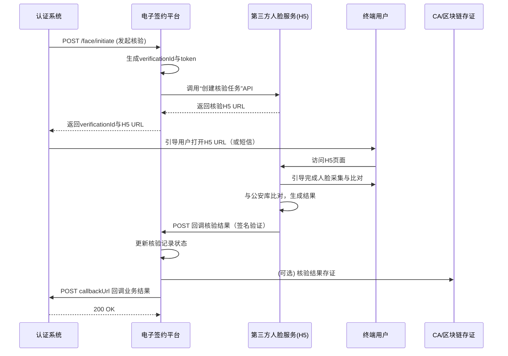
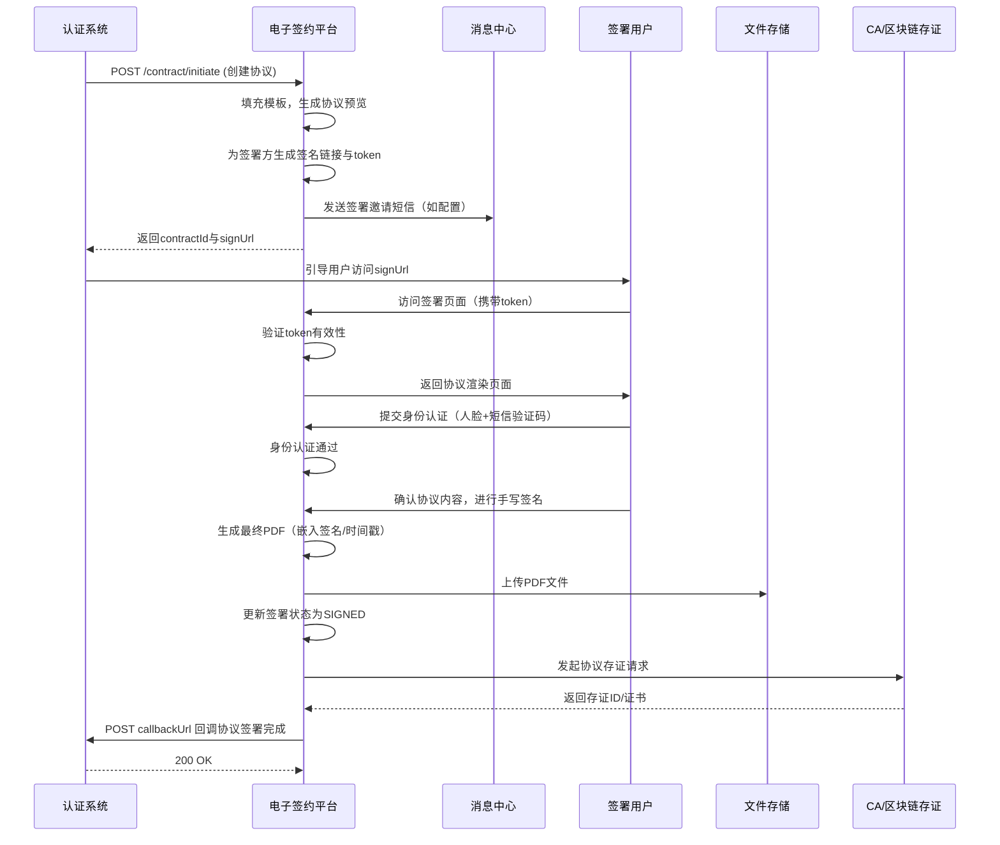

# 模块设计: 电子签约平台

生成时间: 2026-01-19 17:47:15

---

# 电子签约平台模块设计文档

## 1. 概述

### 1.1 目的
电子签约平台（电子签章系统）是“天财分账”业务中负责身份核验与法律协议签署的核心服务模块。其主要目的是为分账业务中的关系绑定、付款授权等关键环节提供**合规、安全、可追溯**的电子化认证与签约能力，确保所有资金流转行为均基于真实意愿表达和具有法律效力的协议授权。

### 1.2 范围
本模块作为独立的签约与认证能力中心，为上游系统（如认证系统）提供以下服务：
- **人脸核验服务**：提供H5页面或SDK，完成姓名、身份证号与人脸生物特征的比对验证。
- **电子协议签署服务**：提供协议模板管理、签署流程编排、签署人身份确认、在线签署及协议存证全流程。
- **打款验证通知服务**：为认证系统发起的打款验证提供短信通知模板与发送能力（可选，可与消息中心整合）。
- **存证与验真服务**：对已签署的协议进行区块链或第三方CA存证，并提供协议验真、下载、查阅接口。

## 2. 接口设计

### 2.1 API端点 (RESTful)

#### 2.1.1 人脸核验服务
**1. 发起人脸核验 (POST /api/v1/verification/face/initiate)**
- **描述**：创建一个新的人脸核验任务，并返回核验H5页面URL或核验SDK所需参数。
- **请求头**：`X-Client-Id: [调用方标识]`, `X-Signature: [请求签名]`
- **请求体**：
```json
{
  "bizId": "AUTH_FLOW_001", // 上游业务流水号，用于关联
  "bizType": "RELATIONSHIP_BINDING | PAYER_AUTHORIZATION",
  "userInfo": {
    "name": "张三",
    "idCardNo": "310101199001011234",
    "mobile": "13800138000" // 可选，用于发送核验链接短信
  },
  "callbackUrl": "https://auth-system/callback/face-verification", // 核验结果回调地址
  "webhookConfig": {
    "headers": { // 回调时可选的附加头信息
      "Authorization": "Bearer ..."
    }
  },
  "expireMinutes": 30, // H5链接有效期，默认30分钟
  "uiConfig": { // 前端页面定制（可选）
    "title": "天财分账身份验证",
    "logoUrl": "https://...",
    "themeColor": "#1890ff"
  }
}
```
- **响应体 (200 OK)**：
```json
{
  "verificationId": "FACE_VERIFY_20231027001",
  "status": "PENDING",
  "verificationUrl": "https://e-sign-platform/h5/face-verify?token=xxx", // H5核验链接
  "expiresAt": "2023-10-27T10:35:00Z",
  "sdkConfig": { // 如采用SDK集成，返回此字段
    "appId": "...",
    "nonce": "...",
    "signature": "..."
  }
}
```

**2. 查询人脸核验结果 (GET /api/v1/verification/face/{verificationId})**
- **描述**：主动查询人脸核验任务的状态与结果。
- **响应体**：
```json
{
  "verificationId": "FACE_VERIFY_20231027001",
  "bizId": "AUTH_FLOW_001",
  "status": "SUCCESS | FAILED | PROCESSING | EXPIRED",
  "userInfo": {
    "name": "张三",
    "idCardNo": "310101199001011234"
  },
  "score": 0.95, // 比对相似度分数（如支持）
  "transactionNo": "FACE_TXN_001", // 人脸核验服务商流水号
  "verifiedAt": "2023-10-27T10:05:00Z",
  "failReason": "FACE_MISMATCH | ID_CARD_MISMATCH | POOR_QUALITY" // 失败原因（如失败）
}
```

#### 2.1.2 电子协议服务
**1. 创建并发起签署流程 (POST /api/v1/contract/initiate)**
- **描述**：根据模板和签署方信息，创建一份电子协议并发起签署流程。
- **请求体**：
```json
{
  "bizId": "REL_202310270001", // 关联的业务ID（如关系ID）
  "bizType": "RELATIONSHIP_AGREEMENT | PAYER_AUTHORIZATION_AGREEMENT",
  "templateId": "TEMPLATE_COLLECTION_V1", // 协议模板ID
  "title": "天财分账资金归集授权协议",
  "variables": { // 模板变量填充
    "payerName": "XX品牌总部",
    "payerAccountNo": "PAY_ACC_001",
    "receiverName": "上海浦东店",
    "receiverAccountNo": "RCV_ACC_001",
    "effectiveDate": "2023-10-27"
  },
  "signers": [
    {
      "partyId": "RECEIVER_001", // 签署方业务标识
      "partyType": "RECEIVER | PAYER", // 与业务角色对应
      "name": "张三",
      "idCardNo": "310101199001011234",
      "mobile": "13800138000",
      "signMethod": "FACE_AND_SMS | CA_CERT", // 签署认证方式
      "notifyType": "SMS | H5_LINK", // 通知方式
      "sequence": 1 // 签署顺序，1表示第一个签
    }
  ],
  "callbackUrl": "https://auth-system/callback/e-sign",
  "webhookConfig": {
    "headers": {
      "Authorization": "Bearer ..."
    }
  },
  "expireDays": 7, // 整个签署流程有效期
  "archiveConfig": { // 存证配置
    "needArchive": true,
    "archiveProvider": "TSA | BLOCKCHAIN"
  }
}
```
- **响应体 (200 OK)**：
```json
{
  "contractId": "CONTRACT_202310270001",
  "status": "CREATED",
  "signTasks": [
    {
      "partyId": "RECEIVER_001",
      "signUrl": "https://e-sign-platform/h5/sign?contract=xxx&party=RECEIVER_001",
      "shortUrl": "https://es.cn/xxx", // 短链接，用于短信
      "expiresAt": "2023-10-27T11:00:00Z",
      "qrCode": "data:image/png;base64,..." // 签署二维码（可选）
    }
  ],
  "archiveInfo": {
    "archiveId": "ARCHIVE_001",
    "status": "PENDING"
  }
}
```

**2. 查询协议状态 (GET /api/v1/contract/{contractId})**
- **描述**：查询协议详情及各方签署状态。
- **响应体**：
```json
{
  "contractId": "CONTRACT_202310270001",
  "bizId": "REL_202310270001",
  "title": "天财分账资金归集授权协议",
  "status": "SIGNED | PARTIAL_SIGNED | REJECTED | EXPIRED | REVOKED",
  "signers": [
    {
      "partyId": "RECEIVER_001",
      "name": "张三",
      "signStatus": "SIGNED | PENDING | REJECTED",
      "signMethod": "FACE_AND_SMS",
      "signedAt": "2023-10-27T10:30:00Z",
      "transactionNo": "SIGN_TXN_001",
      "ipAddress": "192.168.1.1",
      "deviceInfo": "iPhone; iOS 16.0"
    }
  ],
  "documentUrl": "https://e-sign-platform/download/CONTRACT_202310270001.pdf",
  "archiveInfo": {
    "archiveId": "ARCHIVE_001",
    "provider": "TSA",
    "archiveTime": "2023-10-27T10:31:00Z",
    "certificateUrl": "https://.../archive-cert.pdf"
  },
  "createdAt": "2023-10-27T10:00:00Z",
  "expiresAt": "2023-11-03T10:00:00Z"
}
```

**3. 作废/撤销协议 (POST /api/v1/contract/{contractId}/revoke)**
- **描述**：在协议签署完成前，由发起方撤销签署流程。
- **请求体**：
```json
{
  "reason": "用户要求取消",
  "operator": "system_admin"
}
```
- **响应体**：`200 OK` 或 `409 Conflict`（如已全部签署完成则不可撤销）

**4. 协议验真接口 (POST /api/v1/contract/verify)**
- **描述**：验证一份协议文件（PDF）的签署真实性与完整性。
- **请求体**（支持多种方式）：
```json
{
  "method": "CONTRACT_ID",
  "contractId": "CONTRACT_202310270001"
}
// 或
{
  "method": "FILE_HASH",
  "fileHash": "sha256:abc123...",
  "archiveId": "ARCHIVE_001"
}
```
- **响应体**：
```json
{
  "valid": true,
  "contractId": "CONTRACT_202310270001",
  "signatureInfo": [
    {
      "signer": "张三",
      "signTime": "2023-10-27T10:30:00Z",
      "certificateIssuer": "CFCA",
      "validFrom": "2023-01-01",
      "validTo": "2024-01-01"
    }
  ],
  "archiveInfo": {
    "archived": true,
    "archiveTime": "2023-10-27T10:31:00Z",
    "timestampAuthority": "cnnic"
  }
}
```

#### 2.1.3 模板管理服务（内部/管理端）
**1. 管理协议模板 (POST /api/v1/template)**
- **描述**：创建或更新协议模板。
- **请求体**：
```json
{
  "templateId": "TEMPLATE_COLLECTION_V1",
  "name": "资金归集授权协议模板",
  "version": "1.0",
  "category": "RELATIONSHIP_AGREEMENT",
  "content": "{\"components\": [...]}", // 结构化模板内容，或HTML
  "variableDefinitions": [
    {
      "key": "payerName",
      "name": "付款方名称",
      "required": true,
      "sample": "XX科技有限公司"
    }
  ],
  "signerConfig": {
    "minSigners": 1,
    "maxSigners": 2,
    "defaultSignMethods": ["FACE_AND_SMS"]
  },
  "active": true
}
```

### 2.2 发布/消费的事件

#### 2.2.1 发布的事件
- **FaceVerificationCompletedEvent**: 人脸核验完成（成功/失败）。
- **ContractStatusChangedEvent**: 协议状态变更（如：部分签署、全部签署完成、作废、过期）。
- **ContractArchivedEvent**: 协议完成存证。

#### 2.2.2 消费的事件
- **无强依赖事件消费**：本模块作为能力提供方，主要通过同步API被调用。但可监听如`TemplateUpdatedEvent`（内部管理）等事件。

## 3. 数据模型

### 3.1 核心数据库表设计

```sql
-- 1. 人脸核验记录表
CREATE TABLE `face_verification` (
  `id` bigint(20) NOT NULL AUTO_INCREMENT,
  `verification_id` varchar(64) NOT NULL COMMENT '核验任务ID',
  `biz_id` varchar(64) NOT NULL COMMENT '上游业务ID',
  `biz_type` varchar(32) NOT NULL COMMENT '业务类型',
  `status` varchar(32) NOT NULL COMMENT '状态: PENDING, SUCCESS, FAILED, EXPIRED',
  `user_name` varchar(128) NOT NULL COMMENT '待核验姓名',
  `id_card_no` varchar(32) NOT NULL COMMENT '身份证号',
  `mobile` varchar(32) COMMENT '手机号',
  `face_score` decimal(5,4) COMMENT '人脸比对分数',
  `thirdparty_transaction_no` varchar(128) COMMENT '第三方流水号',
  `fail_reason` varchar(64) COMMENT '失败原因码',
  `callback_url` varchar(1024) NOT NULL COMMENT '结果回调地址',
  `callback_headers` text COMMENT '回调请求头(JSON)',
  `verification_url` varchar(1024) COMMENT '核验H5链接',
  `expires_at` datetime NOT NULL COMMENT '链接过期时间',
  `verified_at` datetime COMMENT '核验完成时间',
  `created_at` datetime NOT NULL DEFAULT CURRENT_TIMESTAMP,
  `updated_at` datetime NOT NULL DEFAULT CURRENT_TIMESTAMP ON UPDATE CURRENT_TIMESTAMP,
  PRIMARY KEY (`id`),
  UNIQUE KEY `uk_verification_id` (`verification_id`),
  KEY `idx_biz_id` (`biz_id`),
  KEY `idx_status_expires` (`status`, `expires_at`)
) ENGINE=InnoDB COMMENT='人脸核验记录表';

-- 2. 电子协议主表
CREATE TABLE `contract` (
  `id` bigint(20) NOT NULL AUTO_INCREMENT,
  `contract_id` varchar(64) NOT NULL COMMENT '协议ID',
  `biz_id` varchar(64) NOT NULL COMMENT '关联业务ID',
  `biz_type` varchar(32) NOT NULL COMMENT '业务类型',
  `template_id` varchar(64) NOT NULL COMMENT '模板ID',
  `title` varchar(256) NOT NULL COMMENT '协议标题',
  `status` varchar(32) NOT NULL COMMENT '状态: CREATED, PARTIAL_SIGNED, SIGNED, REJECTED, EXPIRED, REVOKED',
  `variables_json` text NOT NULL COMMENT '模板变量值(JSON)',
  `document_url` varchar(1024) COMMENT '最终协议文件地址',
  `document_hash` varchar(128) COMMENT '文件哈希值(存证用)',
  `callback_url` varchar(1024) NOT NULL COMMENT '状态回调地址',
  `callback_headers` text COMMENT '回调请求头(JSON)',
  `expires_at` datetime NOT NULL COMMENT '签署流程过期时间',
  `signed_at` datetime COMMENT '最终完成签署时间',
  `revoked_at` datetime COMMENT '撤销时间',
  `revoke_reason` varchar(512) COMMENT '撤销原因',
  `created_at` datetime NOT NULL DEFAULT CURRENT_TIMESTAMP,
  `updated_at` datetime NOT NULL DEFAULT CURRENT_TIMESTAMP ON UPDATE CURRENT_TIMESTAMP,
  PRIMARY KEY (`id`),
  UNIQUE KEY `uk_contract_id` (`contract_id`),
  UNIQUE KEY `uk_biz_id_type` (`biz_id`, `biz_type`),
  KEY `idx_status_expires` (`status`, `expires_at`)
) ENGINE=InnoDB COMMENT='电子协议主表';

-- 3. 协议签署方任务表
CREATE TABLE `contract_signer` (
  `id` bigint(20) NOT NULL AUTO_INCREMENT,
  `contract_id` varchar(64) NOT NULL COMMENT '协议ID',
  `party_id` varchar(64) NOT NULL COMMENT '签署方业务标识',
  `party_type` varchar(32) NOT NULL COMMENT '签署方类型(RECEIVER/PAYER)',
  `name` varchar(128) NOT NULL COMMENT '姓名',
  `id_card_no` varchar(32) NOT NULL COMMENT '身份证号',
  `mobile` varchar(32) NOT NULL COMMENT '手机号',
  `sign_method` varchar(32) NOT NULL COMMENT '签署认证方式',
  `sign_status` varchar(32) NOT NULL COMMENT '签署状态: PENDING, SIGNED, REJECTED',
  `sign_url` varchar(1024) COMMENT '签署链接',
  `short_url` varchar(256) COMMENT '短链接(短信用)',
  `sequence` int NOT NULL COMMENT '签署顺序',
  `signed_at` datetime COMMENT '签署时间',
  `transaction_no` varchar(128) COMMENT '签署交易流水号',
  `ip_address` varchar(64) COMMENT '签署IP',
  `device_info` varchar(512) COMMENT '设备信息',
  `reject_reason` varchar(512) COMMENT '拒签原因',
  `expires_at` datetime COMMENT '该方签署链接过期时间',
  `created_at` datetime NOT NULL DEFAULT CURRENT_TIMESTAMP,
  `updated_at` datetime NOT NULL DEFAULT CURRENT_TIMESTAMP ON UPDATE CURRENT_TIMESTAMP,
  PRIMARY KEY (`id`),
  UNIQUE KEY `uk_contract_party` (`contract_id`, `party_id`),
  KEY `idx_mobile_status` (`mobile`, `sign_status`),
  KEY `idx_contract_status` (`contract_id`, `sign_status`)
) ENGINE=InnoDB COMMENT='协议签署方任务表';

-- 4. 协议存证记录表
CREATE TABLE `contract_archive` (
  `id` bigint(20) NOT NULL AUTO_INCREMENT,
  `archive_id` varchar(64) NOT NULL COMMENT '存证ID',
  `contract_id` varchar(64) NOT NULL COMMENT '协议ID',
  `archive_provider` varchar(32) NOT NULL COMMENT '存证提供商: TSA, BLOCKCHAIN, LOCAL_CA',
  `status` varchar(32) NOT NULL COMMENT '状态: PENDING, SUCCESS, FAILED',
  `document_hash` varchar(128) NOT NULL COMMENT '文件哈希',
  `archive_time` datetime COMMENT '存证时间',
  `certificate_url` varchar(1024) COMMENT '存证证书地址',
  `transaction_no` varchar(128) COMMENT '存证服务商流水号',
  `metadata_json` text COMMENT '存证元数据(JSON)',
  `created_at` datetime NOT NULL DEFAULT CURRENT_TIMESTAMP,
  `updated_at` datetime NOT NULL DEFAULT CURRENT_TIMESTAMP ON UPDATE CURRENT_TIMESTAMP,
  PRIMARY KEY (`id`),
  UNIQUE KEY `uk_archive_id` (`archive_id`),
  UNIQUE KEY `uk_contract_provider` (`contract_id`, `archive_provider`),
  KEY `idx_status` (`status`)
) ENGINE=InnoDB COMMENT='协议存证记录表';

-- 5. 协议模板表
CREATE TABLE `contract_template` (
  `id` bigint(20) NOT NULL AUTO_INCREMENT,
  `template_id` varchar(64) NOT NULL COMMENT '模板ID',
  `name` varchar(128) NOT NULL COMMENT '模板名称',
  `version` varchar(32) NOT NULL COMMENT '版本号',
  `category` varchar(32) NOT NULL COMMENT '分类',
  `content_type` varchar(32) NOT NULL COMMENT '内容类型: HTML, COMPONENT_JSON',
  `content` mediumtext NOT NULL COMMENT '模板内容',
  `variable_definitions_json` text NOT NULL COMMENT '变量定义(JSON)',
  `signer_config_json` text NOT NULL COMMENT '签署方配置(JSON)',
  `active` tinyint(1) NOT NULL DEFAULT 1 COMMENT '是否激活',
  `created_by` varchar(64) NOT NULL,
  `updated_by` varchar(64) NOT NULL,
  `created_at` datetime NOT NULL DEFAULT CURRENT_TIMESTAMP,
  `updated_at` datetime NOT NULL DEFAULT CURRENT_TIMESTAMP ON UPDATE CURRENT_TIMESTAMP,
  PRIMARY KEY (`id`),
  UNIQUE KEY `uk_template_version` (`template_id`, `version`),
  KEY `idx_category_active` (`category`, `active`)
) ENGINE=InnoDB COMMENT='协议模板表';
```

### 3.2 与其他模块的关系
- **认证系统**：**核心上游调用方**。认证系统通过同步API调用本模块发起人脸核验和电子协议签署，并通过回调接口接收结果。两者之间需建立**安全通信机制**（IP白名单、请求签名）。
- **消息中心**（可选）：如需发送核验/签署通知短信，可调用消息中心服务。
- **文件存储服务**：用于存储最终生成的协议PDF文件，需支持安全访问和下载。
- **第三方人脸核验服务商**：通过适配器模式集成，如阿里云实人认证、腾讯云人脸核验等。
- **第三方CA/电子签章服务商**：通过适配器模式集成，如e签宝、法大大、上上签等，或自建CFCA集成。

## 4. 业务逻辑

### 4.1 核心算法与流程
#### 4.1.1 人脸核验流程
1. **接收请求**：验证请求签名，检查必填字段。
2. **生成核验任务**：创建唯一`verification_id`，根据`bizId`和`bizType`防重。
3. **调用核验服务**：
   - **方案A（H5跳转）**：生成带加密token的H5 URL，用户在此页面完成人脸采集与比对。
   - **方案B（SDK集成）**：返回SDK所需参数，由调用方App集成SDK完成核验。
4. **处理核验结果**：
   - 接收第三方服务商回调，验证回调签名。
   - 解析核验结果，更新核验记录状态。
   - 如核验成功，提取并存储`transaction_no`、`score`等信息。
5. **回调通知**：向`callbackUrl`发送HTTP POST回调，携带核验结果。支持重试机制（最多3次）。

#### 4.1.2 电子协议签署流程
1. **协议创建**：
   - 根据`templateId`加载模板，使用`variables`填充生成协议预览内容。
   - 校验`signers`配置的合法性（身份信息、签署顺序）。
2. **签署任务初始化**：
   - 为每个签署方生成唯一的签署链接（含防篡改token）。
   - 如配置短信通知，调用消息中心发送签署邀请。
3. **签署过程**：
   - 签署方访问链接，系统验证链接有效性（未过期、未签署）。
   - 根据`signMethod`进行身份认证：
     - `FACE_AND_SMS`：人脸核验 + 短信验证码。
     - `CA_CERT`：调用CA机构进行证书验证。
   - 在前端渲染协议内容，提供签署控件（手写签名、时间戳）。
   - 用户确认并签署，生成最终PDF（嵌入数字签名/可视化签章）。
4. **签署后处理**：
   - 更新签署方状态，记录签署时间、IP、设备等信息。
   - 检查是否所有签署方均已完成，若是，更新协议状态为`SIGNED`。
   - 触发协议存证流程。
5. **回调通知**：协议状态每次变更（部分签署、全部签署、过期等）均向`callbackUrl`发送回调。

#### 4.1.3 协议存证流程
1. **触发时机**：协议状态变为`SIGNED`时自动触发。
2. **哈希计算**：对最终PDF文件计算哈希值（SHA-256）。
3. **调用存证服务**：
   - **时间戳服务(TSA)**：将文件哈希发送至权威时间戳机构，获取时间戳令牌。
   - **区块链存证**：将哈希和元数据上链（如蚂蚁链、腾讯至信链）。
   - **本地CA存证**：使用自建CA进行数字签名。
4. **存证记录**：保存存证证书/交易ID，供后续验真使用。

### 4.2 业务规则
1. **身份信息一致性规则**：同一`bizId`下，人脸核验与电子协议签署使用的姓名、身份证号必须一致。
2. **签署顺序规则**：若配置了`sequence`，必须按顺序签署。前一方未完成，后一方无法签署。
3. **链接安全规则**：
   - 签署链接token一次性有效，签署后即失效。
   - 链接有效期可配置，默认H5链接30分钟，短信链接24小时。
   - 链接访问需验证来源Referer（如配置）和IP频率限制。
4. **协议状态机**：
   ```
   CREATED → PARTIAL_SIGNED → SIGNED → (ARCHIVED)
         ↘ REJECTED          ↘ EXPIRED
         ↘ REVOKED (仅限SIGNED前)
   ```
   状态不可逆（除管理员强制操作）。
5. **存证规则**：只有`SIGNED`状态的协议才进行存证。同一协议可多提供商存证。

### 4.3 验证逻辑
1. **API请求验证**：
   - **签名验证**：所有外部调用需使用预共享密钥进行HMAC-SHA256签名。
   - **防重放攻击**：请求头包含`X-Nonce`和`X-Timestamp`，服务端校验时间窗口（如±5分钟）和nonce唯一性。
2. **业务参数校验**：
   - 模板变量填充后，必须满足所有必填变量。
   - 签署方手机号格式、身份证号格式（通过Luhn算法初步校验）。
   - 回调URL必须是HTTPS（生产环境）。
3. **第三方回调验证**：严格验证回调请求的签名/IP，防止伪造结果。

## 5. 时序图

### 5.1 人脸核验时序图（H5模式）



### 5.2 电子协议签署时序图（单方签署）



## 6. 错误处理

| 错误场景 | 错误码 | 处理策略 | 客户端提示建议 |
| :--- | :--- | :--- | :--- |
| API签名验证失败 | 40101 | 拒绝请求，记录安全日志 | “请求签名错误” |
| 请求参数缺失或格式错误 | 40001 | 直接返回错误，不继续处理 | “参数校验失败: [具体字段]” |
| 业务ID重复请求 | 40002 | 返回已存在的任务/协议信息 | “已存在相同业务ID的流程” |
| 模板不存在或未激活 | 40003 | 拒绝创建协议 | “协议模板不可用” |
| 签署链接已过期 | 40004 | 引导用户重新获取链接 | “签署链接已过期，请重新获取” |
| 签署链接已使用 | 40005 | 提示已签署 | “您已签署过该协议” |
| 人脸核验失败（比对不通过） | 40006 | 更新核验状态为FAILED，回调通知 | “人脸核验未通过” |
| 第三方服务（人脸/CA）调用超时 | 50001 | 异步重试（最多3次），记录监控告警 | “系统繁忙，请稍后重试” |
| 回调通知失败 | 50002 | 进入重试队列，指数退避重试，最终记录人工处理 | （内部告警） |
| 存证服务失败 | 50003 | 记录失败日志，协议状态仍为SIGNED，但标记存证失败，人工介入补存 | （内部告警） |

**重试与补偿**：
- 对第三方服务的调用，采用**同步快速失败+异步重试**策略。重要操作（如存证）需有后台任务补偿机制。
- 回调通知使用消息队列，确保至少一次送达，调用方需处理幂等性。

## 7. 依赖说明

### 7.1 上游模块交互
1. **认证系统**：
   - **交互方式**：同步HTTP API调用（发起核验/签署） + 异步HTTP回调（接收结果）。
   - **安全机制**：双向HTTPS，基于预共享密钥的请求签名，IP白名单限制。
   - **关键点**：回调接口需幂等，认证系统可能因网络问题重复调用，本模块需根据`bizId`去重处理。

### 7.2 外部依赖
1. **第三方人脸核验服务**：
   - **集成模式**：适配器模式，支持多服务商热切换。
   - **关键能力**：活体检测、公安库比对、结果回调。
   - **降级方案**：如主要服务商不可用，可切换至备用服务商；极端情况下，可降级为“短信验证码+身份信息校验”模式（合规性需评估）。

2. **第三方电子签章/CA服务**：
   - **集成模式**：适配器模式，封装不同服务商的协议创建、签署、存证接口。
   - **关键能力**：数字证书、时间戳、区块链存证、法律有效性保障。
   - **合规要求**：必须选择持有《商用密码产品型号证书》、《电子认证服务许可证》的服务商。

3. **文件存储服务**：
   - **要求**：高可用、高持久性，支持HTTPS访问和防盗链。协议文件属于敏感数据，存储需加密。

4. **消息中心**：
   - **可选依赖**：用于发送短信通知。如无，可由调用方（认证系统）自行发送。

### 7.3 内部依赖
- **配置中心**：管理第三方服务商密钥、模板内容、有效期等配置。
- **监控与告警**：监控API成功率、第三方调用延迟、任务积压情况。

**总结**：电子签约平台作为**合规与信任的技术载体**，其设计核心在于**安全、可靠、可审计**。它通过标准化接口封装了复杂的生物识别与法律科技能力，为上层业务提供“即插即用”的认证与签约服务，是分账业务合法性的基石。所有操作必须全程留痕，确保事后可追溯、可验证。