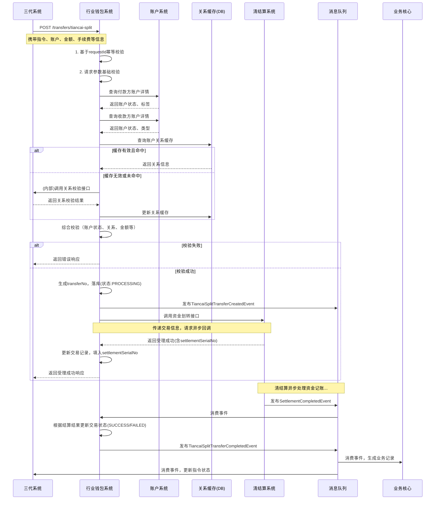
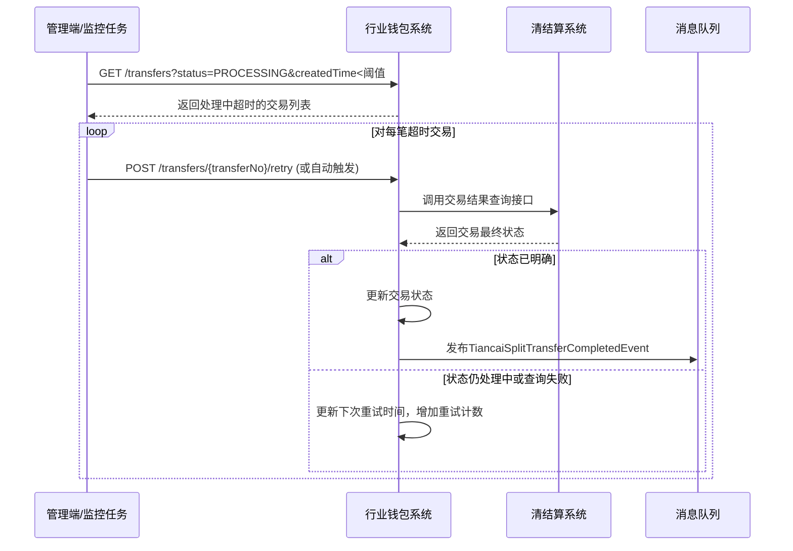

# 模块设计: 行业钱包系统

生成时间: 2026-01-19 17:48:31

---

# 模块设计: 行业钱包系统

生成时间: 2026-01-19 17:48:00

---

# 行业钱包系统模块设计文档

## 1. 概述

### 1.1 目的
行业钱包系统是“天财分账”业务的核心资金流转引擎，负责处理基于天财专用账户的资金划转请求。它作为业务层（三代系统）与底层资金处理层（清结算系统）之间的桥梁，专注于执行“天财分账”这一特定交易类型，并确保资金流转的准确性、安全性与可追溯性。本模块是分账、归集、批量付款、会员结算等场景的最终执行者。

### 1.2 范围
- **分账指令执行**：接收并执行来自三代系统的分账指令，将资金从一个天财收款账户划转至另一个天财收款账户或天财接收方账户。
- **账户关系校验**：在执行分账前，对收付款账户的合法性、状态、以及业务关系（如归集关系）进行校验。
- **手续费处理**：与计费中台协同，处理分账交易的手续费计算、扣收与记录。
- **交易记录生成**：生成标准化的“天财分账”交易记录，为业务核心和对账单系统提供数据源。
- **指令状态同步**：将分账执行结果（成功/失败）同步回三代系统，驱动业务流程更新。
- **不包含**：不负责账户的创建与管理（账户系统）、不负责业务逻辑校验与流程编排（三代系统）、不负责底层的资金清算与记账（清结算系统）、不直接处理签约认证（电子签约平台）。

## 2. 接口设计

### 2.1 API 端点 (RESTful)

#### 2.1.1 分账交易执行
- **POST /api/v1/transfers/tiancai-split** - 执行天财分账（核心接口）

#### 2.1.2 交易查询
- **GET /api/v1/transfers/{transferNo}** - 查询单笔分账交易详情
- **GET /api/v1/transfers** - 根据条件（账户、时间、状态）查询分账交易列表（支持分页）

#### 2.1.3 业务校验（内部/管理）
- **POST /api/v1/validations/relationship** - 校验两个账户间是否存在有效的分账业务关系

### 2.2 输入/输出数据结构

#### 2.2.1 执行天财分账请求 (`ExecuteTiancaiSplitRequest`)
```json
{
  "requestId": "wallet_req_20231029001",
  "instructionId": "INST_COL_202310280001",
  "instructionType": "COLLECTION", // 枚举: COLLECTION, BATCH_PAYMENT, MEMBER_SETTLEMENT
  "payerAccountNo": "TC_ACCT_STORE_001",
  "payeeAccountNo": "TC_ACCT_HQ_001",
  "amount": 100000,
  "currency": "CNY",
  "businessType": "TIANCAI_SPLIT", // 固定值，标识交易类型
  "fee": 100,
  "feeBearer": "PAYER", // 枚举: PAYER, PAYEE
  "businessReferenceNo": "ORDER_202310280001",
  "remark": "门店日终归集",
  "operator": "system_job",
  "extInfo": {
    "sourceSystem": "GEN3",
    "relationshipNo": "REL_COL_202310270001", // 关联的业务关系编号
    "payerMerchantId": "MCH_TC_STORE_001",
    "payeeMerchantId": "MCH_TC_HQ_001"
  }
}
```

#### 2.2.2 天财分账响应 (`TiancaiSplitResponse`)
```json
{
  "code": "SUCCESS",
  "message": "受理成功",
  "data": {
    "transferNo": "WTR_20231029000001",
    "requestId": "wallet_req_20231029001",
    "instructionId": "INST_COL_202310280001",
    "status": "PROCESSING", // 受理时状态为 PROCESSING
    "payerAccountNo": "TC_ACCT_STORE_001",
    "payeeAccountNo": "TC_ACCT_HQ_001",
    "amount": 100000,
    "fee": 100,
    "feeBearer": "PAYER",
    "estimatedCompletionTime": "2023-10-29T18:00:05Z",
    "createdTime": "2023-10-29T18:00:00Z"
  }
}
```

#### 2.2.3 分账交易详情响应 (`TransferDetailResponse`)
```json
{
  "code": "SUCCESS",
  "message": "查询成功",
  "data": {
    "transferNo": "WTR_20231029000001",
    "instructionId": "INST_COL_202310280001",
    "instructionType": "COLLECTION",
    "status": "SUCCESS", // 最终状态: SUCCESS, FAILED, PROCESSING
    "payerAccountNo": "TC_ACCT_STORE_001",
    "payeeAccountNo": "TC_ACCT_HQ_001",
    "amount": 100000,
    "currency": "CNY",
    "fee": 100,
    "feeBearer": "PAYER",
    "businessReferenceNo": "ORDER_202310280001",
    "remark": "门店日终归集",
    "settlementSerialNo": "STL_20231029000001", // 清结算系统流水号
    "errorCode": null,
    "errorMessage": null,
    "createdTime": "2023-10-29T18:00:00Z",
    "completedTime": "2023-10-29T18:00:03Z"
  }
}
```

#### 2.2.4 关系校验请求 (`ValidateRelationshipRequest`)
```json
{
  "payerAccountNo": "TC_ACCT_STORE_001",
  "payeeAccountNo": "TC_ACCT_HQ_001",
  "businessType": "COLLECTION" // 可选，指定校验的业务类型
}
```

#### 2.2.5 关系校验响应 (`ValidateRelationshipResponse`)
```json
{
  "code": "SUCCESS",
  "message": "关系校验通过",
  "data": {
    "isValid": true,
    "relationshipNo": "REL_COL_202310270001",
    "relationshipType": "COLLECTION",
    "authStatus": "SIGNED",
    "isActive": true,
    "effectiveTime": "2023-10-27T10:00:00Z",
    "expiryTime": "2024-10-27T10:00:00Z"
  }
}
```

### 2.3 发布/消费的事件

#### 2.3.1 发布的事件
- **TiancaiSplitTransferCreatedEvent**: 天财分账交易创建并受理成功时发布。
    ```json
    {
      "eventId": "evt_wallet_transfer_created_001",
      "eventType": "WALLET.TIANCAI_SPLIT.CREATED",
      "timestamp": "2023-10-29T18:00:01Z",
      "payload": {
        "transferNo": "WTR_20231029000001",
        "instructionId": "INST_COL_202310280001",
        "payerAccountNo": "TC_ACCT_STORE_001",
        "payeeAccountNo": "TC_ACCT_HQ_001",
        "amount": 100000,
        "businessType": "TIANCAI_SPLIT",
        "status": "PROCESSING"
      }
    }
    ```
- **TiancaiSplitTransferCompletedEvent**: 天财分账交易最终完成（成功或失败）时发布。此事件是驱动业务核心生成交易记录、三代系统更新指令状态的关键事件。
    ```json
    {
      "eventId": "evt_wallet_transfer_completed_001",
      "eventType": "WALLET.TIANCAI_SPLIT.COMPLETED",
      "timestamp": "2023-10-29T18:00:03Z",
      "payload": {
        "transferNo": "WTR_20231029000001",
        "instructionId": "INST_COL_202310280001",
        "status": "SUCCESS",
        "settlementSerialNo": "STL_20231029000001",
        "completedTime": "2023-10-29T18:00:03Z",
        "errorCode": null,
        "errorMessage": null
      }
    }
    ```

#### 2.3.2 消费的事件
- **AccountStatusChangedEvent** (来自账户系统): 当相关账户状态变更（如冻结、注销）时，更新本地缓存或中断处理中的交易。
- **RelationshipEstablishedEvent** / **RelationshipDisabledEvent** (来自三代系统): 当分账关系建立或失效时，更新本地关系缓存，用于后续交易校验。

## 3. 数据模型

### 3.1 数据库表设计

#### 表: `wallet_transfer` (钱包分账交易表)
| 字段名 | 类型 | 必填 | 默认值 | 说明 |
|--------|------|------|--------|------|
| `id` | BIGINT(20) | Y | AUTO_INCREMENT | 主键 |
| `transfer_no` | VARCHAR(32) | Y | | **钱包交易流水号**，唯一业务标识，格式: WTR_{日期}{6位序列} |
| `request_id` | VARCHAR(64) | Y | | 外部请求ID，用于幂等 |
| `instruction_id` | VARCHAR(32) | Y | | 关联的三代系统指令ID |
| `instruction_type` | TINYINT(1) | Y | | 指令类型: 1-归集，2-批量付款，3-会员结算 |
| `business_type` | VARCHAR(32) | Y | | 业务类型: TIANCAI_SPLIT |
| `payer_account_no` | VARCHAR(32) | Y | | 付款方账户号 |
| `payee_account_no` | VARCHAR(32) | Y | | 收款方账户号 |
| `amount` | DECIMAL(15,2) | Y | | 交易金额 |
| `currency` | CHAR(3) | Y | CNY | 币种 |
| `fee` | DECIMAL(15,2) | N | | 手续费金额 |
| `fee_bearer` | TINYINT(1) | N | | 手续费承担方: 1-付款方，2-收款方 |
| `status` | TINYINT(1) | Y | 0 | 状态: 0-已受理，1-处理中，2-成功，3-失败，4-已冲正 |
| `business_reference_no` | VARCHAR(64) | N | | 业务参考号 |
| `remark` | VARCHAR(256) | N | | 备注 |
| `settlement_serial_no` | VARCHAR(64) | N | | 清结算系统流水号 |
| `relationship_no` | VARCHAR(32) | N | | 关联的业务关系编号 |
| `error_code` | VARCHAR(32) | N | | 错误码 |
| `error_message` | VARCHAR(512) | N | | 错误信息 |
| `retry_count` | TINYINT(2) | Y | 0 | 重试次数 |
| `next_retry_time` | DATETIME | N | | 下次重试时间 |
| `version` | INT(11) | Y | 1 | 乐观锁版本号 |
| `created_time` | DATETIME | Y | CURRENT_TIMESTAMP | 创建时间 |
| `updated_time` | DATETIME | Y | CURRENT_TIMESTAMP ON UPDATE | 更新时间 |
| `completed_time` | DATETIME | N | | 完成时间 |

**索引**:
- 唯一索引: `uk_transfer_no` (`transfer_no`)
- 唯一索引: `uk_request_id` (`request_id`)
- 索引: `idx_instruction_id` (`instruction_id`)
- 索引: `idx_payer_account_time` (`payer_account_no`, `created_time`)
- 索引: `idx_status_retry` (`status`, `next_retry_time`)
- 索引: `idx_settlement_serial_no` (`settlement_serial_no`)

#### 表: `account_relationship_cache` (账户关系缓存表)
| 字段名 | 类型 | 必填 | 默认值 | 说明 |
|--------|------|------|--------|------|
| `id` | BIGINT(20) | Y | AUTO_INCREMENT | 主键 |
| `payer_account_no` | VARCHAR(32) | Y | | 付款方账户号 |
| `payee_account_no` | VARCHAR(32) | Y | | 收款方账户号 |
| `relationship_no` | VARCHAR(32) | Y | | 关系编号 |
| `relationship_type` | TINYINT(1) | Y | | 关系类型: 1-归集，2-批量付款，3-会员结算 |
| `auth_status` | TINYINT(1) | Y | | 认证状态: 0-未签约，1-已签约 |
| `is_active` | TINYINT(1) | Y | | 是否生效: 0-否，1-是 |
| `effective_time` | DATETIME | N | | 生效时间 |
| `expiry_time` | DATETIME | N | | 失效时间 |
| `last_verified_time` | DATETIME | Y | CURRENT_TIMESTAMP | 最后验证时间（用于缓存过期） |
| `created_time` | DATETIME | Y | CURRENT_TIMESTAMP | 创建时间 |
| `updated_time` | DATETIME | Y | CURRENT_TIMESTAMP ON UPDATE | 更新时间 |

**索引**:
- 唯一索引: `uk_payer_payee_type` (`payer_account_no`, `payee_account_no`, `relationship_type`)
- 索引: `idx_relationship_no` (`relationship_no`)
- 索引: `idx_active_expiry` (`is_active`, `expiry_time`)

### 3.2 与其他模块的关系
- **三代系统**: **核心上游调用方**。接收其分账指令，执行资金划转，并通过事件同步结果。依赖其提供准确的业务上下文（指令ID、关系信息）。
- **清结算系统**: **核心下游依赖**。调用其资金划转接口完成实际的记账操作，并监听其结算结果事件。是本模块完成交易的最终保障。
- **账户系统**: **强依赖**。用于校验收付款账户的状态、类型、标签等信息，确保交易基础合法性。
- **计费中台**: **弱依赖**。在交易执行前或后，可能需要调用其进行手续费的计算或确认（尽管手续费信息通常由三代系统提供）。
- **业务核心**: **事件消费者**。消费本模块发布的`TiancaiSplitTransferCompletedEvent`，生成“天财分账”交易记录，作为对账单的数据源。
- **消息中间件**: **强依赖**。用于发布交易事件，实现与下游系统的异步解耦。

## 4. 业务逻辑

### 4.1 核心算法
**钱包交易流水号生成算法**:
```
WTR_{YYYYMMDD}{6位序列号}
```
- 日期部分: 交易创建日期
- 序列号: 每日从1开始自增，确保当日唯一，通过数据库序列或Redis原子操作实现。

**交易状态机**:
```
已受理(RECEIVED) 
    → 处理中(PROCESSING) 
        → 成功(SUCCESS)
        → 失败(FAILED) → (可选)重试 → 处理中(PROCESSING)
    → (异常)已冲正(REVERSED)
```
- `已受理`: 接口校验通过，交易记录落库。
- `处理中`: 已调用清结算系统，等待异步回调或轮询结果。
- `成功/失败`: 收到清结算最终结果。
- `已冲正`: 针对成功交易，因业务原因发起的逆向冲正。

### 4.2 业务规则
1. **账户校验规则**:
   - 付款方账户必须是天财收款账户（标签包含`TIANCAI_SPECIAL`）。
   - 收款方账户可以是天财收款账户或天财接收方账户。
   - 双方账户状态必须为`ACTIVE`（正常），且未被冻结。
   - 付款方账户不能是“被动结算”模式下的待结算账户（`relatedInternalAccount='01'`），必须是已结算到账的专用账户。

2. **业务关系校验规则**:
   - 对于**归集**：付款方（门店）与收款方（总部）之间必须存在已签约(`auth_status=SIGNED`)且生效(`is_active=1`)的归集关系，且在有效期内。
   - 对于**批量付款/会员结算**：付款方（总部）必须已完成“开通付款”签约。具体收款方关系校验由三代系统完成，本模块可做二次校验（通过缓存）。
   - 关系校验支持本地缓存，缓存失效或未命中时，可调用三代系统接口实时查询。

3. **交易执行规则**:
   - 严格幂等：基于`requestId`防止同一指令重复执行。
   - 金额必须大于0。
   - 手续费处理：根据`feeBearer`，决定手续费是从付款方额外扣除，还是从收款方到账金额中扣除。需在调用清结算时明确体现。

4. **与清结算交互规则**:
   - 调用清结算的“内部转账”或“代付”接口，交易类型明确为`TIANCAI_SPLIT`。
   - 需传递完整的业务信息（`instructionId`, `transferNo`, `businessReferenceNo`）以便关联。
   - 采用“异步回调+主动查询”机制获取最终结果。

### 4.3 验证逻辑
1. **请求基础校验**:
   - `requestId`、`instructionId`、`payerAccountNo`、`payeeAccountNo`、`amount` 必填。
   - `amount` 需大于0且符合金额格式。
   - `feeBearer` 与 `fee` 逻辑一致性校验（有fee则必须有feeBearer）。

2. **账户状态校验**:
   - 同步调用账户系统`GET /accounts/{accountNo}`接口，检查账户存在性、类型、状态、标签。
   - 对付款方账户进行重点风控检查（如单笔/日累计限额，可配置）。

3. **业务关系校验**:
   - 优先查询本地`account_relationship_cache`。
   - 缓存命中且有效：直接通过。
   - 缓存未命中或过期：调用三代系统关系查询接口（或内部校验接口）进行验证，并刷新缓存。

4. **防重复与并发控制**:
   - 数据库层通过`request_id`唯一索引防止重复交易。
   - 对同一付款账户的并发交易，采用数据库乐观锁(`version`)或分布式锁（针对大额/高频）防止超额支付。

## 5. 时序图

### 5.1 处理天财分账指令时序图



### 5.2 分账交易结果查询与重试时序图



## 6. 错误处理

### 6.1 预期错误码
| 错误码 | HTTP状态码 | 描述 | 处理建议 |
|--------|------------|------|----------|
| `DUPLICATE_REQUEST_ID` | 409 Conflict | 重复的请求ID | 返回已创建交易的信息，实现幂等 |
| `PAYER_ACCOUNT_NOT_FOUND` | 404 Not Found | 付款方账户不存在 | 检查账户号，或联系管理员 |
| `PAYER_ACCOUNT_FROZEN` | 403 Forbidden | 付款方账户已冻结 | 需解冻账户后才能交易 |
| `PAYER_ACCOUNT_INVALID_TYPE` | 400 Bad Request | 付款方账户非天财收款账户 | 检查账户类型和标签 |
| `RELATIONSHIP_NOT_VALID` | 403 Forbidden | 业务关系不合法或未生效 | 检查关系签约状态，完成签约流程 |
| `INSUFFICIENT_BALANCE` | 403 Forbidden | 付款方账户余额不足 | 提示充值或减少交易金额 |
| `SETTLEMENT_SERVICE_FAILED` | 502 Bad Gateway | 清结算服务调用失败 | 交易状态置为`PROCESSING`，启动异步重试机制 |
| `SETTLEMENT_TIMEOUT` | 504 Gateway Timeout | 清结算处理超时 | 交易状态保持`PROCESSING`，由定时任务后续查询 |
| `AMOUNT_EXCEEDS_LIMIT` | 403 Forbidden | 交易金额超限（单笔/日累计） | 调整金额或申请提额 |

### 6.2 处理策略
1. **同步校验失败**: 在调用清结算前发生的错误（如参数、账户、关系校验失败），直接同步返回错误，不创建交易记录。

2. **清结算调用失败**:
   - **网络超时/服务不可用**: 交易记录状态保持为`PROCESSING`，记录错误日志，并触发异步重试机制（通过后台任务定期重试调用或查询）。
   - **清结算返回业务失败**（如余额不足、账户状态不符）: 更新交易状态为`FAILED`，记录具体错误码，并发布完成事件。

3. **异步结果丢失**: 若长时间未收到清结算的`SettlementCompletedEvent`回调，由**定时补偿任务**主动查询`PROCESSING`状态且创建时间超过阈值的交易，向清结算系统查询最终状态并更新。

4. **重试机制**:
   - 对可重试错误（如网络超时），采用指数退避策略，最大重试次数可配置（如5次）。
   - 重试后仍失败，交易状态最终置为`FAILED`，并需人工介入排查。

5. **监控与告警**:
   - 监控交易失败率、平均处理时长、清结算接口可用性。
   - 对`PROCESSING`状态交易堆积、重试次数过多等情况设置告警。

## 7. 依赖说明

### 7.1 上游模块交互
1. **三代系统**:
   - **交互方式**: 同步HTTP调用（分账执行） + 异步事件消费（关系变更事件） + 同步HTTP调用（关系校验，缓存未命中时）。
   - **职责**: 提供已验证的业务指令和上下文。是本模块业务合法性的主要依据来源之一。
   - **降级方案**: 无。分账执行是核心流程，三代系统不可用则业务无法发起。关系校验可依赖缓存，但缓存过期后若三代系统不可用，新关系交易将失败。

### 7.2 下游依赖
1. **清结算系统**:
   - **交互方式**: 同步HTTP调用（发起转账） + 异步事件消费（结算结果事件） + 同步HTTP调用（结果查询，补偿用）。
   - **职责**: 执行底层资金记账，是交易成功的最终决定方。
   - **降级方案**: **无直接降级方案**。清结算不可用，所有分账交易将阻塞。必须保证其高可用，并通过异步化、队列化提高系统韧性。

2. **账户系统**:
   - **交互方式**: 同步HTTP调用（账户查询） + 异步事件消费（账户状态变更事件）。
   - **职责**: 提供账户实时状态与属性，是交易安全的基础校验依据。
   - **降级方案**: 可配置为“宽松模式”，在账户系统短暂不可用时，信任上游（三代系统）传递的账户信息并记录日志，但会引入风险。通常建议快速失败。

3. **计费中台**:
   - **交互方式**: 同步HTTP调用（手续费确认/计算）。
   - **职责**: 提供准确的手续费信息。
   - **降级方案**: 若调用失败，可使用请求中已携带的`fee`和`feeBearer`（由三代系统预先计算），并记录降级日志。确保业务可继续，但需事后核对。

### 7.3 依赖治理
- **超时配置**:
    - 调用清结算: 连接超时3s，读超时10s（因处理可能较慢）。
    - 调用账户系统: 超时2s。
    - 调用三代系统（关系校验）: 超时3s。
- **熔断与降级**:
    - 对清结算、账户系统配置熔断器，防止因下游故障导致线程池耗尽。
    - 对计费中台配置降级策略。
- **异步化与削峰**:
    - 将交易创建与清结算调用解耦。交易校验通过后立即返回受理成功，清结算调用可放入内部队列异步执行，应对瞬间高峰。
- **缓存策略**:
    - 账户关系缓存设置合理的TTL（如5分钟），并监听关系变更事件实时刷新，平衡实时性与性能。