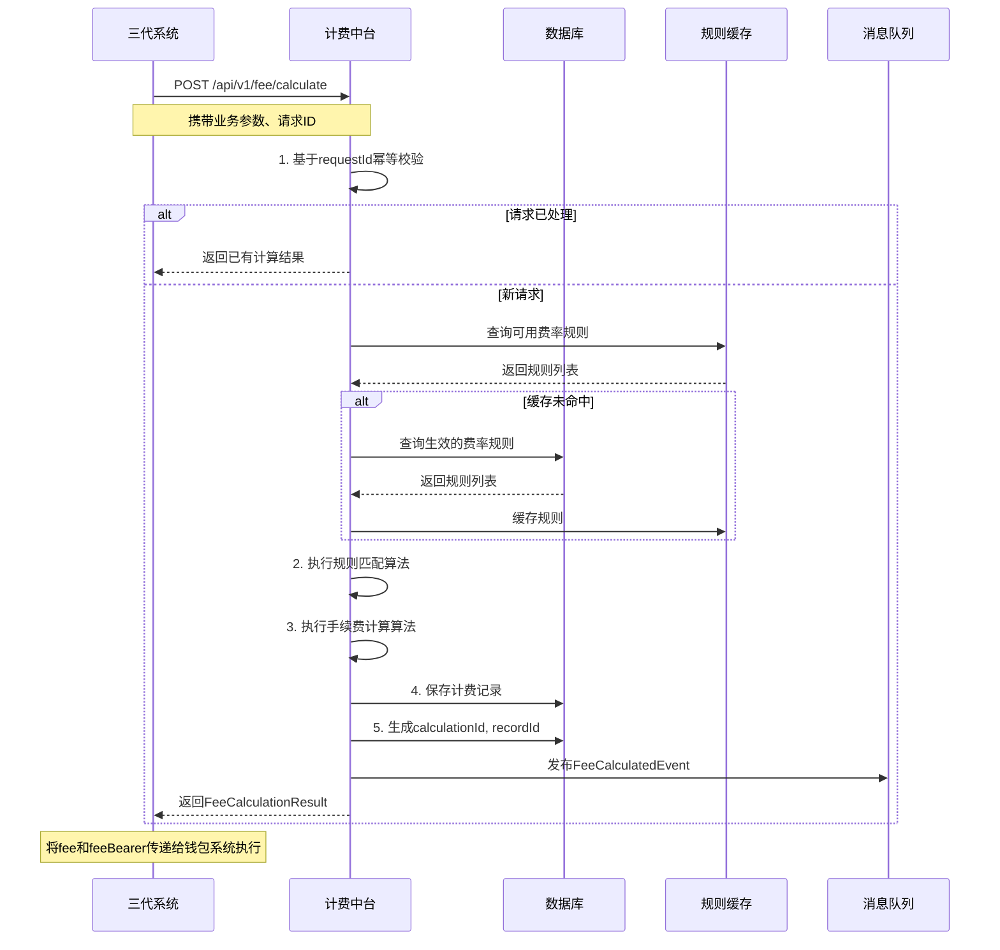
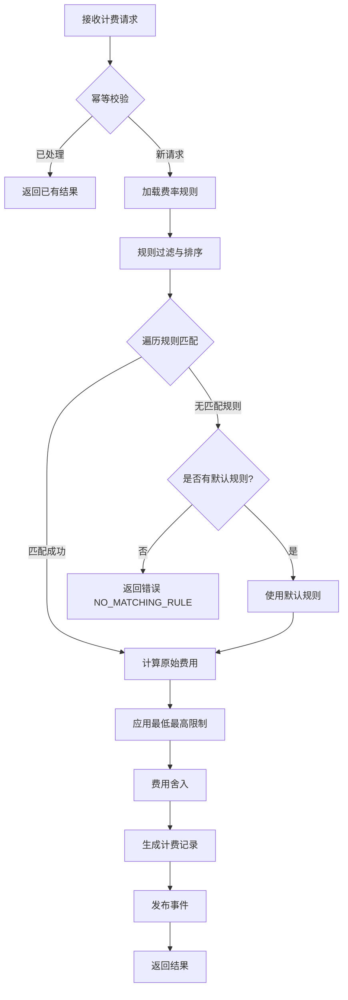

# 模块设计: 计费中台

生成时间: 2026-01-19 17:48:19

---

# 计费中台模块设计文档

## 1. 概述

### 1.1 目的
计费中台是“天财分账”业务的核心计费服务模块，负责为各类分账业务（归集、批量付款、会员结算）提供统一、灵活、准确的手续费计算服务。它基于预配置的费率规则、业务场景和承担方策略，在分账指令执行前或执行后完成费用计算，确保手续费处理的透明性、一致性和可追溯性，并为对账和财务核算提供准确的费用数据。

### 1.2 范围
- **费率规则管理**：提供费率规则的配置、查询、启用/停用能力，支持基于商户、业务类型、账户类型、金额区间等多维度的费率策略。
- **手续费计算**：接收计费请求，根据业务场景和规则计算应收手续费，并明确费用承担方（付款方或收款方）。
- **计费记录与对账**：记录每一次计费请求的详细结果，生成标准化的计费记录，供对账单系统和财务系统消费。
- **费用试算**：提供费用试算接口，供业务方在发起实际交易前预估手续费。
- **不包含**：不直接参与资金扣划（由行业钱包系统执行）、不管理账户余额、不处理退款冲正（但提供费率查询用于冲正计算）。

## 2. 接口设计

### 2.1 API 端点 (RESTful)

#### 2.1.1 费率规则管理
- **POST /api/v1/fee/rules** - 创建费率规则
- **PUT /api/v1/fee/rules/{ruleId}** - 更新费率规则
- **POST /api/v1/fee/rules/{ruleId}/enable** - 启用费率规则
- **POST /api/v1/fee/rules/{ruleId}/disable** - 停用费率规则
- **GET /api/v1/fee/rules** - 查询费率规则列表
- **GET /api/v1/fee/rules/{ruleId}** - 查询费率规则详情

#### 2.1.2 手续费计算
- **POST /api/v1/fee/calculate** - 计算手续费（用于实际业务）
- **POST /api/v1/fee/estimate** - 试算手续费（用于预估值）
- **GET /api/v1/fee/records** - 查询计费记录（供对账、财务消费）

#### 2.1.3 健康检查与监控
- **GET /api/v1/health** - 服务健康检查
- **GET /api/v1/metrics** - 服务监控指标（如计费请求量、平均耗时、规则命中分布）

### 2.2 输入/输出数据结构

#### 2.2.1 创建费率规则请求 (`CreateFeeRuleRequest`)
```json
{
  "requestId": "req_fee_rule_20231028001",
  "ruleName": "天财-总部归集标准费率",
  "tiancaiId": "TC_ORG_001",
  "effectiveTime": "2023-11-01T00:00:00Z",
  "expiryTime": "2024-10-31T23:59:59Z",
  "priority": 10,
  "condition": {
    "businessType": "COLLECTION",
    "payerMerchantType": "STORE",
    "payeeMerchantType": "HEADQUARTERS",
    "minAmount": "0.01",
    "maxAmount": "1000000.00",
    "currency": "CNY"
  },
  "calculation": {
    "feeType": "PERCENTAGE",
    "feeRate": "0.001",
    "minFee": "1.00",
    "maxFee": "50.00",
    "feeBearer": "PAYER"
  },
  "description": "门店向总部归集，按金额0.1%收费，最低1元，最高50元，由付款方承担",
  "operator": "tiancai_admin"
}
```

#### 2.2.2 计算手续费请求 (`CalculateFeeRequest`)
```json
{
  "requestId": "req_calc_20231028001",
  "tiancaiId": "TC_ORG_001",
  "businessType": "COLLECTION",
  "payerMerchantId": "MCH_TC_STORE_001",
  "payerMerchantType": "STORE",
  "payerAccountNo": "TC_ACCT_STORE_001",
  "payeeMerchantId": "MCH_TC_HQ_001",
  "payeeMerchantType": "HEADQUARTERS",
  "payeeAccountNo": "TC_ACCT_HQ_001",
  "amount": "100000.00",
  "currency": "CNY",
  "businessReferenceNo": "ORDER_202310280001",
  "instructionId": "INST_COL_202310280001",
  "calculateTime": "2023-10-28T18:00:00Z"
}
```

#### 2.2.3 手续费计算结果 (`FeeCalculationResult`)
```json
{
  "code": "SUCCESS",
  "message": "手续费计算成功",
  "data": {
    "calculationId": "CALC_202310280001",
    "requestId": "req_calc_20231028001",
    "matchedRuleId": "RULE_COL_001",
    "businessType": "COLLECTION",
    "amount": "100000.00",
    "currency": "CNY",
    "feeType": "PERCENTAGE",
    "feeRate": "0.001",
    "calculatedFee": "100.00",
    "actualFee": "50.00",
    "minFee": "1.00",
    "maxFee": "50.00",
    "feeBearer": "PAYER",
    "calculationTime": "2023-10-28T18:00:01Z"
  }
}
```

#### 2.2.4 计费记录 (`FeeRecord`)
```json
{
  "recordId": "FEE_REC_202310280001",
  "calculationId": "CALC_202310280001",
  "instructionId": "INST_COL_202310280001",
  "requestId": "req_calc_20231028001",
  "tiancaiId": "TC_ORG_001",
  "businessType": "COLLECTION",
  "businessTime": "2023-10-28T18:00:00Z",
  "payerMerchantId": "MCH_TC_STORE_001",
  "payerAccountNo": "TC_ACCT_STORE_001",
  "payeeMerchantId": "MCH_TC_HQ_001",
  "payeeAccountNo": "TC_ACCT_HQ_001",
  "amount": "100000.00",
  "currency": "CNY",
  "matchedRuleId": "RULE_COL_001",
  "feeType": "PERCENTAGE",
  "feeRate": "0.001",
  "calculatedFee": "100.00",
  "actualFee": "50.00",
  "feeBearer": "PAYER",
  "status": "CALCULATED",
  "settlementStatus": "PENDING",
  "createdTime": "2023-10-28T18:00:01Z",
  "updatedTime": "2023-10-28T18:00:01Z"
}
```

### 2.3 发布/消费的事件

#### 2.3.1 发布的事件
- **FeeCalculatedEvent**: 当手续费计算完成并生成计费记录时发布，供下游系统（如对账单、财务系统）消费。
    ```json
    {
      "eventId": "evt_fee_calculated_001",
      "eventType": "FEE.CALCULATED",
      "timestamp": "2023-10-28T18:00:01Z",
      "payload": {
        "recordId": "FEE_REC_202310280001",
        "instructionId": "INST_COL_202310280001",
        "tiancaiId": "TC_ORG_001",
        "businessType": "COLLECTION",
        "payerAccountNo": "TC_ACCT_STORE_001",
        "payeeAccountNo": "TC_ACCT_HQ_001",
        "amount": "100000.00",
        "actualFee": "50.00",
        "feeBearer": "PAYER",
        "calculationTime": "2023-10-28T18:00:01Z"
      }
    }
    ```
- **FeeRuleChangedEvent**: 当费率规则创建、更新、启用或停用时发布，供相关系统（如缓存刷新）消费。

#### 2.3.2 消费的事件
- **InstructionCreatedEvent** (来自三代系统): 当分账指令创建时，可能触发异步计费流程（如果采用后计费模式）。
- **SettlementCompletedEvent** (来自清结算系统): 当分账资金结算完成时，更新对应计费记录的结算状态。
- **InstructionReversedEvent** (来自三代系统/清结算): 当分账指令被冲正时，需要生成对应的负向计费记录或标记原记录无效。

## 3. 数据模型

### 3.1 数据库表设计

#### 表: `fee_rule` (费率规则表)
| 字段名 | 类型 | 必填 | 默认值 | 说明 |
|--------|------|------|--------|------|
| `id` | BIGINT(20) | Y | AUTO_INCREMENT | 主键 |
| `rule_id` | VARCHAR(32) | Y | | **规则ID**，业务唯一标识，RULE_{类型}_{序列} |
| `rule_name` | VARCHAR(128) | Y | | 规则名称 |
| `tiancai_id` | VARCHAR(32) | Y | | 天财机构ID，ALL表示通用 |
| `effective_time` | DATETIME | Y | | 生效时间 |
| `expiry_time` | DATETIME | N | | 失效时间 |
| `priority` | INT | Y | 100 | 优先级，数字越小优先级越高 |
| `condition_json` | JSON | Y | | **条件配置**，存储JSON格式的匹配条件 |
| `calculation_json` | JSON | Y | | **计费配置**，存储JSON格式的计费规则 |
| `description` | VARCHAR(512) | N | | 规则描述 |
| `status` | TINYINT(1) | Y | 1 | 状态: 1-启用，2-停用 |
| `operator` | VARCHAR(64) | Y | | 操作人 |
| `created_time` | DATETIME | Y | CURRENT_TIMESTAMP | 创建时间 |
| `updated_time` | DATETIME | Y | CURRENT_TIMESTAMP ON UPDATE | 更新时间 |

**索引**:
- 唯一索引: `uk_rule_id` (`rule_id`)
- 索引: `idx_tiancai_status` (`tiancai_id`, `status`)
- 索引: `idx_effective_time` (`effective_time`, `expiry_time`)
- 索引: `idx_priority` (`priority`)

**condition_json 示例结构**:
```json
{
  "businessType": ["COLLECTION", "BATCH_PAYMENT"],
  "payerMerchantType": "STORE",
  "payeeMerchantType": "HEADQUARTERS",
  "payerAccountType": "INDUSTRY_WALLET",
  "minAmount": "0.01",
  "maxAmount": "1000000.00",
  "currency": "CNY",
  "customConditions": [
    {"field": "region", "operator": "IN", "value": ["华东", "华南"]}
  ]
}
```

**calculation_json 示例结构**:
```json
{
  "feeType": "PERCENTAGE",
  "feeRate": "0.001",
  "fixedFee": "0.00",
  "minFee": "1.00",
  "maxFee": "50.00",
  "feeBearer": "PAYER",
  "roundingMode": "HALF_UP",
  "scale": 2
}
```

#### 表: `fee_calculation` (计费记录表)
| 字段名 | 类型 | 必填 | 默认值 | 说明 |
|--------|------|------|--------|------|
| `id` | BIGINT(20) | Y | AUTO_INCREMENT | 主键 |
| `record_id` | VARCHAR(32) | Y | | **计费记录ID**，FEE_REC_{日期}{序列} |
| `calculation_id` | VARCHAR(32) | Y | | **计算ID**，CALC_{日期}{序列}，每次计算唯一 |
| `request_id` | VARCHAR(64) | Y | | 请求ID，用于幂等 |
| `instruction_id` | VARCHAR(32) | N | | 关联的分账指令ID |
| `tiancai_id` | VARCHAR(32) | Y | | 天财机构ID |
| `business_type` | TINYINT(1) | Y | | 业务类型: 1-归集，2-批量付款，3-会员结算 |
| `business_time` | DATETIME | Y | | 业务发生时间 |
| `payer_merchant_id` | VARCHAR(64) | Y | | 付款方商户ID |
| `payer_account_no` | VARCHAR(32) | Y | | 付款方账户号 |
| `payee_merchant_id` | VARCHAR(64) | N | | 收款方商户ID |
| `payee_account_no` | VARCHAR(32) | Y | | 收款方账户号 |
| `amount` | DECIMAL(15,2) | Y | | 业务金额 |
| `currency` | CHAR(3) | Y | CNY | 币种 |
| `matched_rule_id` | VARCHAR(32) | Y | | 匹配的费率规则ID |
| `fee_type` | TINYINT(1) | Y | | 费用类型: 1-百分比，2-固定金额 |
| `fee_rate` | DECIMAL(10,6) | N | | 费率（百分比时使用） |
| `fixed_fee` | DECIMAL(15,2) | N | | 固定费用（固定金额时使用） |
| `calculated_fee` | DECIMAL(15,2) | Y | | 计算出的原始费用 |
| `actual_fee` | DECIMAL(15,2) | Y | | 实际费用（经最低最高限制后） |
| `min_fee` | DECIMAL(15,2) | N | | 最低费用 |
| `max_fee` | DECIMAL(15,2) | N | | 最高费用 |
| `fee_bearer` | TINYINT(1) | Y | | 承担方: 1-付款方，2-收款方 |
| `status` | TINYINT(1) | Y | 1 | 状态: 1-已计算，2-已结算，3-已冲正，4-已退款 |
| `settlement_status` | TINYINT(1) | Y | 1 | 结算状态: 1-待结算，2-结算中，3-已结算 |
| `error_code` | VARCHAR(32) | N | | 错误码 |
| `error_message` | VARCHAR(512) | N | | 错误信息 |
| `created_time` | DATETIME | Y | CURRENT_TIMESTAMP | 创建时间 |
| `updated_time` | DATETIME | Y | CURRENT_TIMESTAMP ON UPDATE | 更新时间 |

**索引**:
- 唯一索引: `uk_record_id` (`record_id`)
- 唯一索引: `uk_calculation_id` (`calculation_id`)
- 唯一索引: `uk_request_id` (`request_id`)
- 索引: `idx_instruction_id` (`instruction_id`)
- 索引: `idx_business_time` (`business_time`)
- 索引: `idx_payer_account` (`payer_account_no`, `business_time`)
- 索引: `idx_status_settlement` (`status`, `settlement_status`)

#### 表: `fee_rule_history` (费率规则历史表)
| 字段名 | 类型 | 必填 | 默认值 | 说明 |
|--------|------|------|--------|------|
| `id` | BIGINT(20) | Y | AUTO_INCREMENT | 主键 |
| `rule_id` | VARCHAR(32) | Y | | 规则ID |
| `version` | INT | Y | 1 | 版本号 |
| `operation` | VARCHAR(32) | Y | | 操作: CREATE, UPDATE, ENABLE, DISABLE |
| `before_snapshot` | JSON | N | | 操作前的规则快照 |
| `after_snapshot` | JSON | Y | | 操作后的规则快照 |
| `operator` | VARCHAR(64) | Y | | 操作人 |
| `operation_time` | DATETIME | Y | CURRENT_TIMESTAMP | 操作时间 |
| `remark` | VARCHAR(256) | N | | 操作备注 |

**索引**:
- 索引: `idx_rule_version` (`rule_id`, `version`)
- 索引: `idx_operation_time` (`operation_time`)

### 3.2 与其他模块的关系
- **三代系统**: 主要上游调用方。在分账指令处理流程中，三代系统同步调用计费中台计算手续费，并接收计算结果。
- **行业钱包系统**: 下游依赖。钱包系统执行分账时，需要知道手续费金额和承担方，这些信息来自计费中台的计算结果。
- **对账单系统**: 下游数据消费者。消费`FeeCalculatedEvent`或直接查询计费记录，生成包含手续费明细的对账单。
- **财务系统**: 下游数据消费者。使用计费记录进行财务核算和收入确认。
- **清结算系统**: 弱关联。清结算系统完成资金结算后，通过事件通知计费中台更新结算状态。

## 4. 业务逻辑

### 4.1 核心算法

#### 4.1.1 费率规则匹配算法
```
输入: 计费请求参数 (businessType, payerInfo, payeeInfo, amount, currency等)
输出: 匹配的费率规则

步骤:
1. 根据tiancaiId筛选规则（包含'ALL'通用规则）
2. 过滤status=ENABLED的规则
3. 过滤effective_time <= 当前时间 <= expiry_time的规则
4. 按优先级(priority)升序排序
5. 遍历规则，使用规则条件(condition_json)匹配请求参数:
   a. 业务类型匹配
   b. 商户类型匹配
   c. 金额区间匹配
   d. 币种匹配
   e. 自定义条件匹配
6. 返回第一个完全匹配的规则，若无匹配则返回默认规则或报错
```

#### 4.1.2 手续费计算算法
```
输入: 匹配的费率规则(calculation_json), 业务金额(amount)
输出: 实际费用(actualFee)

步骤:
1. 根据feeType计算原始费用:
   - PERCENTAGE: calculatedFee = amount × feeRate
   - FIXED: calculatedFee = fixedFee
2. 应用费用限制:
   - 如果minFee存在且calculatedFee < minFee: actualFee = minFee
   - 如果maxFee存在且calculatedFee > maxFee: actualFee = maxFee
   - 否则: actualFee = calculatedFee
3. 按roundingMode和scale进行舍入
4. 返回actualFee
```

#### 4.1.3 ID生成算法
- **规则ID**: `RULE_{TYPE}_{8位序列号}` (TYPE: COL-归集, BAP-批量付款, MEM-会员结算, GEN-通用)
- **计费记录ID**: `FEE_REC_{YYYYMMDD}{8位序列号}`
- **计算ID**: `CALC_{YYYYMMDD}{8位序列号}`

### 4.2 业务规则

1. **费率规则优先级规则**:
   - 优先级数字越小，优先级越高。
   - 相同优先级下，按创建时间倒序（后创建的生效）。
   - 天财专属规则(tiancaiId=具体值)优先于通用规则(tiancaiId='ALL')。

2. **规则生效时间规则**:
   - 规则必须同时满足: 状态为启用(ENABLED)，且当前时间在生效时间和失效时间之间。
   - 失效时间为空表示永久有效。

3. **手续费承担方规则**:
   - 必须在费率规则中明确指定`feeBearer`为PAYER(付款方)或PAYEE(收款方)。
   - 承担方信息必须传递给下游执行系统（钱包系统）。

4. **计费记录状态流转规则**:
   - `CALCULATED` -> `SETTLED`: 当收到清结算系统的结算完成事件时更新。
   - `CALCULATED` -> `REVERSED`: 当原交易被冲正时，生成负向记录或标记原记录无效。
   - `PENDING_SETTLEMENT` -> `SETTLED`: 结算完成。

5. **幂等性规则**:
   - 相同的`requestId`多次请求，返回第一次计算的结果和记录。
   - 计费记录一旦生成，不允许修改（冲正除外）。

### 4.3 验证逻辑

1. **费率规则验证**:
   - 创建/更新规则时，验证条件配置的JSON格式和字段合法性。
   - 验证费率值合理性（百分比费率通常0-1之间，固定费用非负）。
   - 验证生效/失效时间逻辑（失效时间不能早于生效时间）。
   - 验证规则冲突：新规则不能与已生效的更高优先级规则在相同条件下冲突。

2. **计费请求验证**:
   - 验证必填字段：tiancaiId, businessType, payerAccountNo, payeeAccountNo, amount。
   - 验证金额大于0。
   - 验证币种支持。
   - 验证requestId格式。

3. **规则匹配验证**:
   - 确保至少有一条规则能匹配请求，否则返回明确的错误码`NO_MATCHING_RULE`。
   - 对于关键业务，可配置默认规则作为兜底。

## 5. 时序图

### 5.1 分账指令同步计费时序图



### 5.2 费率规则匹配与计算详细流程



## 6. 错误处理

### 6.1 预期错误码
| 错误码 | HTTP状态码 | 描述 | 处理建议 |
|--------|------------|------|----------|
| `NO_MATCHING_RULE` | 404 Not Found | 未找到匹配的费率规则 | 检查费率规则配置，或配置默认规则 |
| `INVALID_FEE_RULE` | 400 Bad Request | 费率规则配置无效 | 检查规则的条件和计算配置格式 |
| `INVALID_AMOUNT` | 400 Bad Request | 金额参数无效 | 金额必须大于0，且符合精度要求 |
| `DUPLICATE_REQUEST` | 409 Conflict | 重复的计费请求 | 返回已计算的结果 |
| `FEE_CALCULATION_ERROR` | 500 Internal Server Error | 手续费计算过程错误 | 检查计算逻辑，查看日志 |
| `RATE_LIMIT_EXCEEDED` | 429 Too Many Requests | 请求频率超限 | 降低调用频率或申请更高配额 |
| `SERVICE_UNAVAILABLE` | 503 Service Unavailable | 服务暂时不可用 | 检查依赖的数据库、缓存状态 |

### 6.2 处理策略

1. **规则匹配失败**:
   - 配置默认费率规则作为兜底，确保业务不中断。
   - 记录告警，通知运营人员检查规则配置。
   - 返回详细的不匹配原因，便于调试。

2. **计算过程异常**:
   - 对于数学计算错误（如除零、溢出），记录详细上下文并返回错误。
   - 对于配置错误（如费率格式错误），标记对应规则为停用，并告警。

3. **依赖服务故障**:
   - **数据库故障**: 熔断机制，返回服务不可用错误，依赖方应重试。
   - **缓存故障**: 降级直接查询数据库，性能可能下降但功能可用。
   - **消息队列故障**: 记录本地日志，等待MQ恢复后重发事件。

4. **数据一致性保证**:
   - 计费记录生成采用数据库事务，确保记录和状态原子性更新。
   - 对于异步事件发布，采用本地事务消息表模式，确保事件最终发出。

5. **监控与告警**:
   - 监控规则匹配失败率、计算错误率、平均响应时间。
   - 监控缓存命中率、数据库连接池状态。
   - 当无匹配规则告警触发时，自动通知规则配置负责人。

## 7. 依赖说明

### 7.1 上游依赖

1. **三代系统** (强依赖):
   - **交互方式**: 同步HTTP调用
   - **职责**: 在分账指令处理流程中调用计费中台计算手续费。
   - **调用时机**: 指令校验通过后，发送给钱包系统前。
   - **降级方案**: 无直接降级。若计费中台不可用，分账业务无法进行。可考虑：
        - 短期: 使用上次成功费率或默认费率（需业务方确认风险）。
        - 长期: 必须修复计费中台。

2. **管理控制台/运营系统** (弱依赖):
   - **交互方式**: 同步HTTP调用
   - **职责**: 提供费率规则的配置管理界面。
   - **降级方案**: 规则配置可延迟，不影响已有规则的计算。

### 7.2 下游依赖

1. **数据库** (强依赖):
   - **存储内容**: 费率规则、计费记录、规则历史。
   - **降级方案**: 主从切换、读写分离。完全不可用时服务中断。

2. **分布式缓存** (弱依赖):
   - **缓存内容**: 生效的费率规则，按tiancaiId和业务类型分组缓存。
   - **降级方案**: 缓存未命中时直接查询数据库，性能下降但功能可用。

3. **消息队列** (弱依赖):
   - **用途**: 发布`FeeCalculatedEvent`、`FeeRuleChangedEvent`。
   - **降级方案**: 事件可暂存本地，待MQ恢复后重发。或下游系统改为主动查询。

### 7.3 依赖治理

- **超时与重试**:
    - 对三代系统的接口调用: 超时3s，不重试（由调用方决定重试策略）。
    - 数据库查询: 超时2s，根据错误类型决定重试。
    - 缓存操作: 超时1s，快速失败，降级查库。

- **熔断与降级**:
    - 数据库熔断: 当错误率超过阈值，熔断打开，直接返回服务不可用。
    - 缓存降级: 缓存异常时自动降级到数据库查询。
    - 规则缓存预热: 服务启动时预热高频规则到缓存。

- **性能优化**:
    - 费率规则缓存: 规则变更时通过事件刷新缓存。
    - 批量查询优化: 为对账单系统提供批量查询接口，减少频繁调用。
    - 计算结果缓存: 对相同的业务参数可缓存计算结果（注意金额变化）。