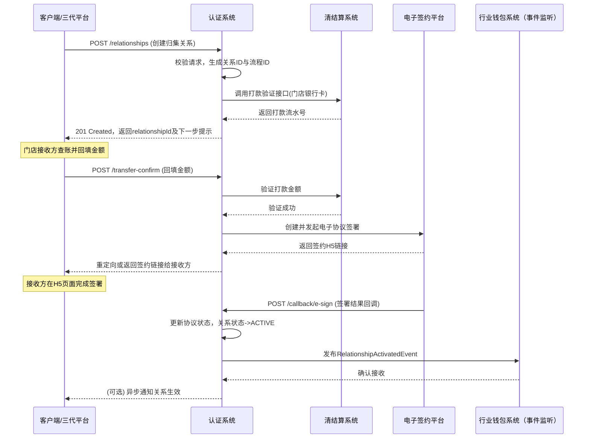
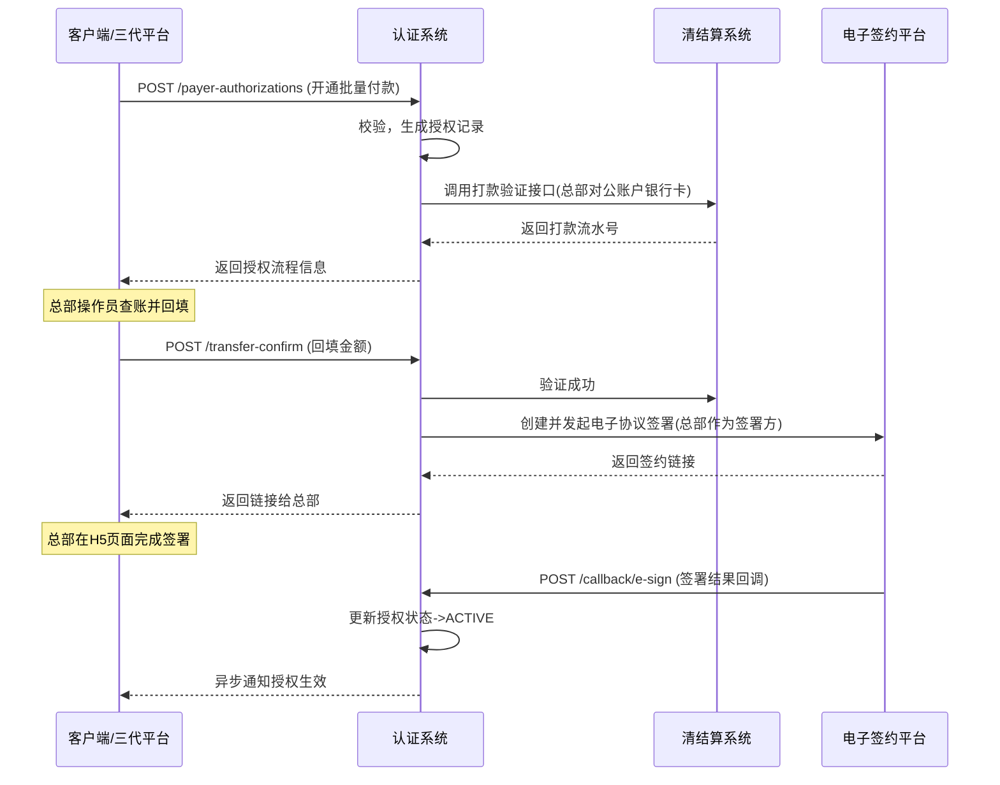

# 模块设计: 认证系统

生成时间: 2026-01-19 17:46:08

---

# 认证系统模块设计文档

## 1. 概述

### 1.1 目的
认证系统模块是“天财分账”业务的核心前置模块，负责处理所有与身份验证、账户所有权确认及关系授权相关的业务流程。其主要目的是确保分账业务中资金流转的合法性、安全性与合规性，通过建立并管理收付款方之间的可信关系，为后续的分账、归集、批量付款等操作提供授权基础。

### 1.2 范围
本模块涵盖以下核心功能：
- **关系绑定**：为分账的收付款双方（如总部与门店）建立并管理授权关系。
- **身份与账户认证**：通过打款验证、人脸验证等方式，验证接收方身份及其对账户的所有权。
- **协议签署**：集成电子签约平台，完成具有法律效力的电子协议签署。
- **开通付款授权**：为批量付款和会员结算场景下的付款方（总部）提供额外的授权流程。
- **关系状态管理**：维护所有绑定关系的生命周期（创建、认证中、生效、失效、解绑）。

## 2. 接口设计

### 2.1 API端点 (RESTful)

#### 2.1.1 关系绑定类接口
**1. 创建关系绑定 (POST /api/v1/auth/relationships)**
- **描述**：为指定的付款方和接收方创建一种类型的关系绑定（归集、批量付款、会员结算），并触发相应的认证流程。
- **请求头**：`X-Tiancai-Id: [天财ID]`, `Authorization: Bearer [Token]`
- **请求体**：
```json
{
  "relationshipType": "COLLECTION | BATCH_PAYMENT | MEMBER_SETTLEMENT",
  "payerInfo": {
    "payerType": "HEADQUARTERS",
    "payerAccountNo": "天财收款账户号",
    "payerName": "总部商户名称"
  },
  "receiverInfo": {
    "receiverType": "STORE | INDIVIDUAL | CORPORATE",
    "receiverAccountNo": "天财接收方账户号/待绑定银行卡号",
    "receiverName": "接收方名称",
    "idCardNo": "身份证号（个人/个体户必填）",
    "mobile": "手机号（用于打款验证）"
  },
  "bizContext": {
    "sceneCode": "业务场景码",
    "externalRequestId": "外部请求ID"
  }
}
```
- **响应体 (201 Created)**：
```json
{
  "relationshipId": "REL_202310270001",
  "authFlowId": "AUTH_FLOW_001",
  "nextStep": "VERIFICATION_REQUIRED | E_SIGN_REQUIRED",
  "verificationInfo": {
    "method": "TRANSFER_VERIFICATION | FACE_VERIFICATION",
    "h5Url": "https://... (人脸验证H5地址，如适用)"
  }
}
```

**2. 查询关系状态 (GET /api/v1/auth/relationships/{relationshipId})**
- **描述**：查询指定关系绑定的详细状态和进度。
- **响应体**：
```json
{
  "relationshipId": "REL_202310270001",
  "relationshipType": "COLLECTION",
  "status": "CREATED | VERIFYING | E_SIGNING | ACTIVE | INACTIVE | UNBOUND",
  "payerAccountNo": "PAY_ACC_001",
  "receiverAccountNo": "RCV_ACC_001",
  "currentStep": "等待打款验证回填",
  "authRecords": [
    {
      "authType": "TRANSFER_VERIFICATION",
      "status": "SUCCESS",
      "completedAt": "2023-10-27T10:00:00Z"
    }
  ],
  "eSignRecord": {
    "contractId": "CONTRACT_001",
    "status": "PENDING",
    "signUrl": "https://..."
  }
}
```

**3. 解绑关系 (POST /api/v1/auth/relationships/{relationshipId}/unbind)**
- **描述**：解除已生效的关系绑定。需校验无在途资金交易。
- **响应体**：`204 No Content`

#### 2.1.2 认证流程类接口
**1. 提交打款验证回填信息 (POST /api/v1/auth/verifications/transfer-confirm)**
- **描述**：接收方回填打款验证金额，以确认账户所有权。
- **请求体**：
```json
{
  "authFlowId": "AUTH_FLOW_001",
  "relationshipId": "REL_202310270001",
  "receivedAmount": "0.23"
}
```
- **响应体**：
```json
{
  "verified": true,
  "nextStep": "E_SIGN_REQUIRED"
}
```

**2. 人脸验证回调 (POST /api/v1/auth/callback/face-verification)**
- **描述**：接收电子签约平台推送的人脸验证结果。
- **请求体（由电子签平台格式决定）**：
```json
{
  "bizId": "AUTH_FLOW_001",
  "name": "张三",
  "idCardNo": "310xxx...",
  "faceVerified": true,
  "transactionNo": "FACE_TXN_001",
  "verifiedAt": "2023-10-27T10:05:00Z"
}
```
- **响应体**：`{ "received": true }`

**3. 电子协议签署回调 (POST /api/v1/auth/callback/e-sign)**
- **描述**：接收电子签约平台推送的协议签署结果。
- **请求体**：
```json
{
  "contractId": "CONTRACT_001",
  "status": "SIGNED | REJECTED | EXPIRED",
  "signedAt": "2023-10-27T10:30:00Z",
  "signers": [
    {
      "party": "RECEIVER",
      "signed": true
    }
  ],
  "documentUrl": "https://..."
}
```
- **响应体**：`{ "received": true }`

#### 2.1.3 付款方授权接口
**1. 开通付款授权 (POST /api/v1/auth/payer-authorizations)**
- **描述**：总部（付款方）为批量付款或会员结算场景开通付款权限。
- **请求体**：
```json
{
  "payerAccountNo": "PAY_ACC_HQ_001",
  "authorizationType": "BATCH_PAYMENT | MEMBER_SETTLEMENT",
  "bizContext": { ... }
}
```
- **响应体**：与创建关系绑定类似，触发一个包含打款验证（向总部账户）和电子签约的独立授权流程。

### 2.2 发布/消费的事件

#### 2.2.1 发布的事件
- **RelationshipCreatedEvent**: 关系绑定创建。
- **RelationshipActivatedEvent**: 关系绑定完成所有认证，状态变为生效（ACTIVE）。**下游系统（如行业钱包系统）监听此事件，以允许基于此关系的分账交易。**
- **RelationshipUnboundEvent**: 关系解绑。
- **PayerAuthorizationActivatedEvent**: 付款方授权开通完成。

#### 2.2.2 消费的事件
- **AccountCreatedEvent** (来自账户系统)：监听天财收款/接收方账户创建成功，作为关系绑定的前提。
- **SettlementAccountConfiguredEvent** (来自清结算系统)：确认待结算账户(01)配置完成，可能影响归集关系的创建逻辑。

## 3. 数据模型

### 3.1 核心数据库表设计

```sql
-- 1. 关系绑定主表
CREATE TABLE `auth_relationship` (
  `id` bigint(20) NOT NULL AUTO_INCREMENT COMMENT '主键',
  `relationship_id` varchar(64) NOT NULL COMMENT '业务关系ID，全局唯一',
  `relationship_type` varchar(32) NOT NULL COMMENT '关系类型: COLLECTION, BATCH_PAYMENT, MEMBER_SETTLEMENT',
  `status` varchar(32) NOT NULL COMMENT '状态: CREATED, VERIFYING, E_SIGNING, ACTIVE, INACTIVE, UNBOUND',
  `payer_type` varchar(32) NOT NULL COMMENT '付款方类型: HEADQUARTERS',
  `payer_account_no` varchar(64) NOT NULL COMMENT '付款方天财账户号',
  `payer_name` varchar(256) NOT NULL COMMENT '付款方名称',
  `receiver_type` varchar(32) NOT NULL COMMENT '接收方类型: STORE, INDIVIDUAL, CORPORATE',
  `receiver_account_no` varchar(64) NOT NULL COMMENT '接收方天财账户号（绑定后）',
  `receiver_bank_card_no` varchar(64) COMMENT '接收方绑定的银行卡号（用于打款验证）',
  `receiver_name` varchar(256) NOT NULL COMMENT '接收方名称',
  `receiver_id_card_no` varchar(32) COMMENT '接收方身份证号（个人/个体）',
  `receiver_mobile` varchar(32) COMMENT '接收方手机号',
  `tiancai_id` varchar(64) NOT NULL COMMENT '所属天财机构ID',
  `auth_flow_id` varchar(64) COMMENT '本次认证流程ID',
  `biz_context_json` text COMMENT '业务上下文，JSON格式',
  `created_at` datetime NOT NULL DEFAULT CURRENT_TIMESTAMP,
  `updated_at` datetime NOT NULL DEFAULT CURRENT_TIMESTAMP ON UPDATE CURRENT_TIMESTAMP,
  PRIMARY KEY (`id`),
  UNIQUE KEY `uk_relationship_id` (`relationship_id`),
  KEY `idx_payer_account` (`payer_account_no`, `status`),
  KEY `idx_receiver_account` (`receiver_account_no`, `status`),
  KEY `idx_tiancai_status` (`tiancai_id`, `status`)
) ENGINE=InnoDB COMMENT='关系绑定主表';

-- 2. 认证记录表
CREATE TABLE `auth_verification_record` (
  `id` bigint(20) NOT NULL AUTO_INCREMENT,
  `auth_flow_id` varchar(64) NOT NULL COMMENT '认证流程ID',
  `relationship_id` varchar(64) NOT NULL COMMENT '关联关系ID',
  `verification_type` varchar(32) NOT NULL COMMENT '认证类型: TRANSFER_VERIFICATION, FACE_VERIFICATION',
  `status` varchar(32) NOT NULL COMMENT '状态: INITIATED, SUCCESS, FAILED, EXPIRED',
  `request_params` text COMMENT '请求参数（JSON）',
  `response_result` text COMMENT '响应结果（JSON）',
  `thirdparty_ref_no` varchar(128) COMMENT '第三方流水号（打款流水/人脸流水）',
  `expires_at` datetime COMMENT '认证有效期',
  `completed_at` datetime,
  `created_at` datetime NOT NULL DEFAULT CURRENT_TIMESTAMP,
  PRIMARY KEY (`id`),
  KEY `idx_auth_flow` (`auth_flow_id`),
  KEY `idx_relationship` (`relationship_id`)
) ENGINE=InnoDB COMMENT='认证记录表';

-- 3. 电子协议记录表
CREATE TABLE `auth_e_sign_record` (
  `id` bigint(20) NOT NULL AUTO_INCREMENT,
  `contract_id` varchar(128) NOT NULL COMMENT '电子签平台合同ID',
  `relationship_id` varchar(64) NOT NULL COMMENT '关联关系ID',
  `contract_type` varchar(64) NOT NULL COMMENT '协议类型',
  `status` varchar(32) NOT NULL COMMENT '状态: CREATED, PENDING, SIGNED, REJECTED, EXPIRED',
  `initiator` varchar(32) NOT NULL COMMENT '发起方: SYSTEM, PAYER, RECEIVER',
  `signers_json` text NOT NULL COMMENT '签约方信息，JSON数组',
  `document_url` varchar(1024) COMMENT '协议文件存储地址',
  `signed_at` datetime,
  `created_at` datetime NOT NULL DEFAULT CURRENT_TIMESTAMP,
  `updated_at` datetime NOT NULL DEFAULT CURRENT_TIMESTAMP ON UPDATE CURRENT_TIMESTAMP,
  PRIMARY KEY (`id`),
  UNIQUE KEY `uk_contract_id` (`contract_id`),
  KEY `idx_relationship` (`relationship_id`)
) ENGINE=InnoDB COMMENT='电子协议记录表';

-- 4. 付款方授权表
CREATE TABLE `auth_payer_authorization` (
  `id` bigint(20) NOT NULL AUTO_INCREMENT,
  `authorization_id` varchar(64) NOT NULL COMMENT '授权ID',
  `payer_account_no` varchar(64) NOT NULL COMMENT '付款方账户',
  `authorization_type` varchar(32) NOT NULL COMMENT '授权类型: BATCH_PAYMENT, MEMBER_SETTLEMENT',
  `status` varchar(32) NOT NULL COMMENT '状态: CREATED, VERIFYING, E_SIGNING, ACTIVE, INACTIVE',
  `auth_flow_id` varchar(64) COMMENT '关联的认证流程ID',
  `relationship_ids` text COMMENT '与此授权关联的生效关系ID列表（JSON数组）',
  `activated_at` datetime,
  `created_at` datetime NOT NULL DEFAULT CURRENT_TIMESTAMP,
  `updated_at` datetime NOT NULL DEFAULT CURRENT_TIMESTAMP ON UPDATE CURRENT_TIMESTAMP,
  PRIMARY KEY (`id`),
  UNIQUE KEY `uk_authorization_id` (`authorization_id`),
  UNIQUE KEY `uk_payer_type` (`payer_account_no`, `authorization_type`),
  KEY `idx_status` (`status`)
) ENGINE=InnoDB COMMENT='付款方授权表（总部开通付款权限）';
```

### 3.2 与其他模块的关系
- **账户系统**：依赖账户系统提供的天财收款账户、天财接收方账户信息，作为关系绑定的主体。通过事件监听账户创建。
- **行业钱包系统**：认证系统产出`RelationshipActivatedEvent`，钱包系统消费后，在其内部维护可用的分账关系白名单，并在处理分账请求时进行校验。
- **电子签约平台**：通过HTTP调用和回调，委托其完成人脸验证和电子协议签署。
- **清结算系统**：在发起打款验证时，调用清结算系统向目标银行卡打款。同时监听其结算账户配置事件。
- **三代平台**：接收来自三代平台的业务请求（如创建关系绑定），并返回认证流程结果。

## 4. 业务逻辑

### 4.1 核心算法与流程
#### 4.1.1 关系绑定创建与认证主流程
1. **接收创建请求**：校验付款方账户是否存在且状态正常，接收方信息是否完备。
2. **生成认证流程**：根据`receiverType`和`relationshipType`决定认证组合策略：
   - **策略A（门店接收方）**：`打款验证` + `电子签约`。
   - **策略B（个人/个体接收方）**：`人脸验证` + `打款验证` + `电子签约`。
   - **策略C（企业接收方）**：`打款验证` + `电子签约`（可能需要法人人脸验证，根据风控要求）。
3. **发起首步认证**：
   - **打款验证**：调用清结算系统，向`receiver_bank_card_no`打入一笔随机金额（如0.23元），记录流水号。
   - **人脸验证**：调用电子签约平台H5服务，生成人脸验证链接返回给前端。
4. **推进流程**：通过回调接收各步骤结果，顺序推进。只有上一步成功，才能进行下一步。
5. **最终生效**：所有必需认证步骤和电子签约完成后，将`auth_relationship.status`更新为`ACTIVE`，并发布`RelationshipActivatedEvent`。

#### 4.1.2 开通付款授权流程
1. 此流程独立于具体的关系绑定，是针对付款方（总部）账户的一次性授权。
2. 流程与上述类似，但打款验证的目标银行卡是**总部对公账户的预留银行卡**。
3. 授权生效(`ACTIVE`)后，该付款方名下所有对应类型(`BATCH_PAYMENT`或`MEMBER_SETTLEMENT`)的`ACTIVE`关系绑定才真正可用于分账交易。

### 4.2 业务规则
1. **唯一性规则**：同一对付款方和接收方，在同一关系类型下，只能存在一条`ACTIVE`或`VERIFYING/E_SIGNING`状态的关系。
2. **状态机规则**：关系绑定状态严格按`CREATED -> VERIFYING/E_SIGNING -> ACTIVE -> (INACTIVE/UNBOUND)`流转，不可逆（除解绑操作）。
3. **认证有效期**：打款验证回填有效期通常为24小时；人脸验证和电子签约链接有效期由电子签平台设定（如30分钟）。过期后流程失败，需重新发起。
4. **解绑前置条件**：解绑前必须调用行业钱包或业务核心系统，确认没有基于此关系的“在途”分账交易（状态为处理中）。
5. **依赖生效规则**：对于批量付款和会员结算，关系绑定`ACTIVE`且对应的付款方授权`ACTIVE`，两者同时满足，该关系才可实际用于分账。

### 4.3 验证逻辑
1. **请求参数校验**：使用JSR-303进行基础格式校验。
2. **业务校验**：
   - 付款方账户是否存在、是否属于当前天财、状态是否正常（非冻结、注销）。
   - 接收方账户/银行卡是否有效。
   - 根据`relationshipType`和双方身份，校验是否符合业务场景（如归集关系的付款方必须是门店，接收方必须是总部）。
3. **认证结果校验**：
   - 打款验证金额匹配。
   - 人脸验证的三要素（姓名、身份证、人脸）比对结果。
   - 电子签约的签署方身份和签署动作。

## 5. 时序图

### 5.1 创建门店归集关系时序图（策略A）



### 5.2 开通付款授权时序图



## 6. 错误处理

| 错误场景 | 错误码 | 处理策略 | 客户端提示 |
| :--- | :--- | :--- | :--- |
| 请求参数格式错误 | 40001 | 请求拦截，直接返回错误 | “请求参数不合法” |
| 付款方账户不存在或状态异常 | 40002 | 业务校验失败，返回错误 | “付款方账户信息有误” |
| 重复的关系绑定请求 | 40003 | 查询是否存在ACTIVE或处理中的记录 | “已存在相同的关系绑定” |
| 打款验证失败（金额错误） | 40004 | 记录失败次数，超过阈值则流程终止 | “验证金额不正确，请确认” |
| 人脸验证失败 | 40005 | 流程终止，关系状态置为INACTIVE | “身份验证未通过” |
| 电子协议签署被拒绝或超时 | 40006 | 流程终止，关系状态置为INACTIVE | “协议签署未完成” |
| 解绑时存在在途交易 | 40007 | 拒绝解绑请求 | “存在处理中的交易，暂不可解绑” |
| 依赖系统（清结算、电子签）调用超时 | 50001 | 异步重试（最多3次），记录日志告警 | “系统繁忙，请稍后再试” |
| 回调消息验签失败 | 40008 | 记录安全日志，直接丢弃请求 | - |

**重试策略**：对于与外部系统的同步调用（如发起打款），采用有限次数的指数退避重试。对于流程中的步骤，支持人工在管理后台触发“重新认证”。

## 7. 依赖说明

### 7.1 上游模块交互
1. **三代平台**：
   - **交互方式**：同步HTTP调用（创建关系、查询状态）。
   - **职责**：提供业务入口，传递业务上下文(`bizContext`)。
   - **关键点**：认证系统需保证API的幂等性，通常通过`bizContext.externalRequestId`实现。

2. **账户系统**：
   - **交互方式**：同步RPC调用（查询账户状态） + 事件监听(`AccountCreatedEvent`)。
   - **职责**：提供账户实体的存在性、类型、状态等权威信息。

3. **清结算系统**：
   - **交互方式**：同步RPC调用（打款验证发起与确认）。
   - **职责**：执行小额打款并返回精确金额，供验证使用。

4. **电子签约平台**：
   - **交互方式**：同步HTTP调用（发起验证/签约） + 异步HTTP回调（接收结果）。
   - **职责**：提供人脸验证能力和具有法律效力的电子协议签署流程。
   - **关键点**：需严格处理回调接口的**安全性**（IP白名单、签名验证）。

### 7.2 下游模块交互
1. **行业钱包系统**：
   - **交互方式**：事件发布(`RelationshipActivatedEvent`, `RelationshipUnboundEvent`)。
   - **职责**：钱包系统作为分账请求的处理方，必须依据生效的关系绑定进行资金划转。

2. **计费中台 / 业务核心**：
   - **交互方式**：事件发布（可选）。这些系统可能需要知晓关系状态变化，用于风控或计费逻辑。

**总结**：认证系统作为**业务安全与合规的守门员**，其设计核心在于**流程驱动**和**状态管理**。它通过标准化的认证步骤，将分散的外部能力（打款、人脸识别、电子签章）串联成一个可信的业务流程，为整个分账体系奠定安全基础。所有分账交易在发生前，其参与方之间的关系必须在此系统中被明确建立并验证通过。