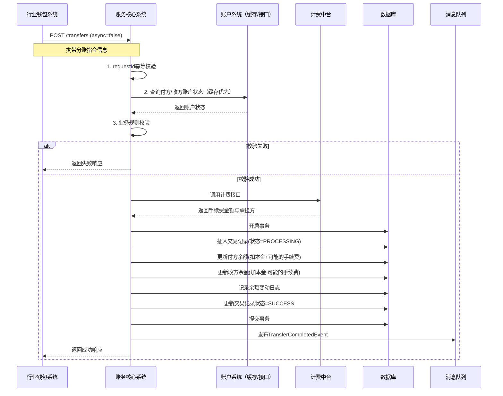
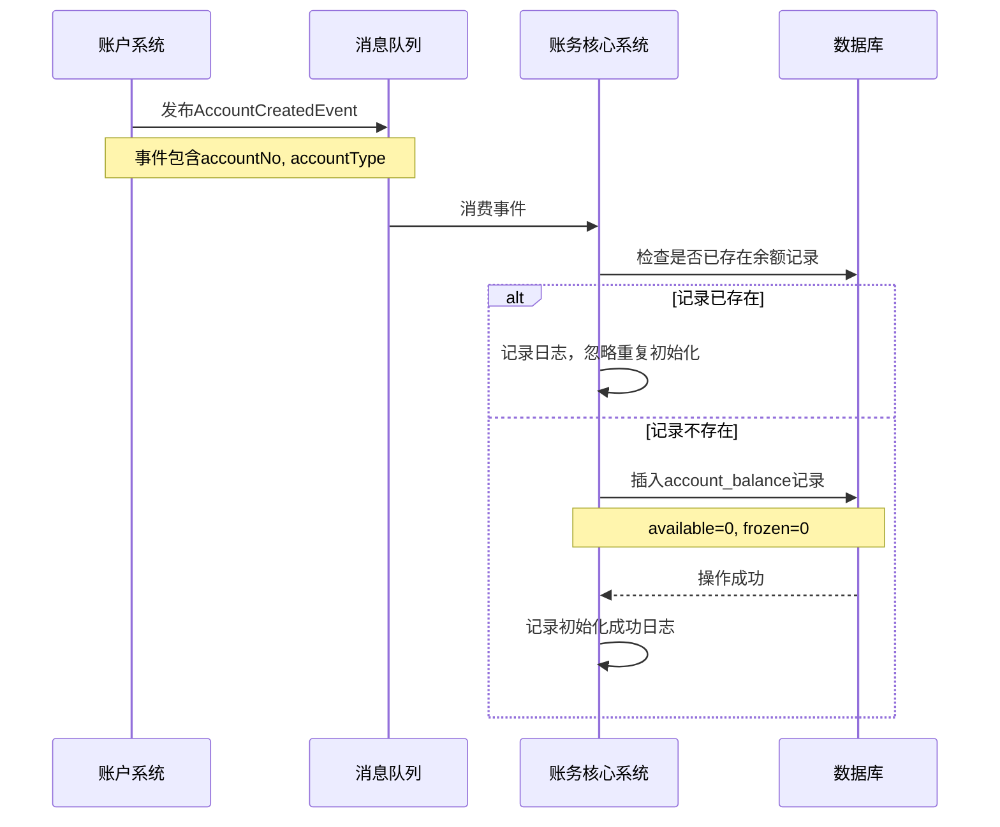

# 模块设计: 账务核心系统

生成时间: 2026-01-19 17:47:06

---

# 账务核心系统模块设计文档

## 1. 概述

### 1.1 目的
账务核心系统是“天财分账”业务的核心资金处理引擎，负责处理所有分账指令的资金记账、余额管理、交易流水记录及状态跟踪。它作为连接**账户系统**（账户载体）与**清结算系统**（资金清算）的桥梁，确保分账业务（归集、批量付款、会员结算）的资金流转准确、一致、可追溯。系统定义并处理新的交易类型“天财分账”。

### 1.2 范围
- **分账指令处理**：接收并执行来自行业钱包系统的分账指令，完成资金从付方账户到收方账户的划转。
- **账户余额管理**：实时维护天财收款账户和天财接收方账户的可用余额、冻结余额。
- **交易流水记录**：生成并持久化每一笔分账交易的明细流水，作为对账、审计和查询的基础。
- **交易状态机管理**：管理分账交易从创建、处理中、成功、失败到冲正的全生命周期。
- **手续费计算触发**：在分账交易处理过程中，触发计费中台进行手续费计算，并记录手续费明细。
- **资金冻结/解冻**：支持业务场景下的资金临时冻结（如退货预扣款）与解冻。
- **与清结算对账**：为清结算系统提供交易明细，完成资金层面的最终核对。
- **不包含**：
    - 账户的创建与管理（由账户系统负责）。
    - 业务逻辑校验与关系绑定（由行业钱包系统负责）。
    - 资金清算、结算与出款（由清结算系统负责）。
    - 手续费率计算（由计费中台负责）。

## 2. 接口设计

### 2.1 API 端点 (RESTful)

#### 2.1.1 分账交易类
- **POST /api/v1/transfers** - 创建并执行分账指令（同步处理或异步受理）
- **GET /api/v1/transfers/{transferId}** - 查询分账交易详情
- **POST /api/v1/transfers/{transferId}/reverse** - 分账冲正（仅限于失败或成功的特定交易）

#### 2.1.2 账户余额类
- **GET /api/v1/accounts/{accountNo}/balance** - 查询账户实时余额（可用余额、冻结余额）
- **POST /api/v1/accounts/{accountNo}/freeze** - 冻结账户部分资金
- **POST /api/v1/accounts/{accountNo}/unfreeze** - 解冻账户已冻结资金

#### 2.1.3 交易查询类
- **GET /api/v1/transfers** - 根据条件（账户、时间、状态）查询分账交易流水（支持分页）

### 2.2 输入/输出数据结构

#### 2.2.1 创建分账指令请求 (`CreateTransferRequest`)
```json
{
  "requestId": "TRANS_REQ_20231028001",
  "bizScene": "COLLECTION", // 业务场景: COLLECTION(归集), BATCH_PAY(批量付款), MEMBER_SETTLE(会员结算)
  "payerAccountNo": "TC_ACCT_202310270001", // 付方账户号
  "payeeAccountNo": "TC_ACCT_202310270002", // 收方账户号
  "amount": 100000, // 分账金额（单位：分）
  "currency": "CNY",
  "bizOrderNo": "ORDER_001", // 上游业务订单号
  "bizRemark": "门店A日终归集",
  "feeBearer": "PAYER", // 手续费承担方: PAYER, PAYEE, SHARED
  "async": false, // 是否异步处理
  "operator": "system",
  "extInfo": {
    "sourceSystem": "WALLET",
    "relationId": "REL_001", // 关联的关系绑定ID
    "originalOrderNo": "PAY_20231028001" // 原始支付订单号（如有）
  }
}
```

#### 2.2.2 分账指令响应 (`TransferResponse`)
```json
{
  "code": "SUCCESS",
  "message": "分账成功",
  "data": {
    "transferId": "TF_20231028000001",
    "requestId": "TRANS_REQ_20231028001",
    "bizScene": "COLLECTION",
    "payerAccountNo": "TC_ACCT_202310270001",
    "payeeAccountNo": "TC_ACCT_202310270002",
    "amount": 100000,
    "fee": 100, // 手续费（单位：分）
    "feeBearer": "PAYER",
    "status": "SUCCESS", // 状态: PROCESSING, SUCCESS, FAILED, REVERSED
    "settleDate": "20231028", // 清算日期
    "completedTime": "2023-10-28T15:30:00Z",
    "transferNo": "20231028153000123456" // 系统唯一交易流水号
  }
}
```

#### 2.2.3 账户余额响应 (`AccountBalanceResponse`)
```json
{
  "code": "SUCCESS",
  "message": "查询成功",
  "data": {
    "accountNo": "TC_ACCT_202310270001",
    "availableBalance": 5000000, // 可用余额（单位：分）
    "frozenBalance": 100000, // 冻结余额（单位：分）
    "totalBalance": 5100000, // 总余额 = 可用 + 冻结
    "currency": "CNY",
    "lastUpdatedTime": "2023-10-28T15:25:00Z"
  }
}
```

### 2.3 发布/消费的事件

#### 2.3.1 发布的事件
- **TransferCreatedEvent**: 分账交易创建并开始处理时发布。
    ```json
    {
      "eventId": "evt_transfer_created_001",
      "eventType": "TRANSFER.CREATED",
      "timestamp": "2023-10-28T15:30:00Z",
      "payload": {
        "transferId": "TF_20231028000001",
        "bizScene": "COLLECTION",
        "payerAccountNo": "TC_ACCT_202310270001",
        "payeeAccountNo": "TC_ACCT_202310270002",
        "amount": 100000,
        "status": "PROCESSING",
        "bizOrderNo": "ORDER_001"
      }
    }
    ```
- **TransferCompletedEvent**: 分账交易成功完成时发布。
- **TransferFailedEvent**: 分账交易失败时发布。
- **AccountBalanceChangedEvent**: 账户余额发生变动时发布。

#### 2.3.2 消费的事件
- **AccountCreatedEvent** (来自账户系统): 当新的天财账户创建时，在本系统初始化对应的余额记录（初始为0）。
- **AccountFrozenEvent** (来自账户系统/清结算系统): 当账户被冻结时，同步更新本系统账户状态，禁止该账户作为付方发起交易。

## 3. 数据模型

### 3.1 数据库表设计

#### 表: `tiancai_transfer` (天财分账交易主表)
| 字段名 | 类型 | 必填 | 默认值 | 说明 |
|--------|------|------|--------|------|
| `id` | BIGINT(20) | Y | AUTO_INCREMENT | 主键 |
| `transfer_id` | VARCHAR(32) | Y | | **交易ID**，唯一业务标识，格式: TF_{YYYYMMDD}{6位序列} |
| `request_id` | VARCHAR(64) | Y | | 上游请求ID，用于幂等 |
| `biz_scene` | VARCHAR(32) | Y | | 业务场景: COLLECTION, BATCH_PAY, MEMBER_SETTLE |
| `payer_account_no` | VARCHAR(32) | Y | | 付方账户号 |
| `payee_account_no` | VARCHAR(32) | Y | | 收方账户号 |
| `amount` | DECIMAL(15,2) | Y | | 交易金额（元，保留2位小数） |
| `currency` | CHAR(3) | Y | CNY | 币种 |
| `status` | TINYINT(1) | Y | 0 | 状态: 0-处理中，1-成功，2-失败，3-已冲正 |
| `fee` | DECIMAL(15,2) | N | 0.00 | 手续费金额（元） |
| `fee_bearer` | TINYINT(1) | N | | 手续费承担方: 1-付方，2-收方，3-双方分摊 |
| `biz_order_no` | VARCHAR(64) | N | | 上游业务订单号 |
| `biz_remark` | VARCHAR(256) | N | | 业务备注 |
| `fail_reason` | VARCHAR(512) | N | | 失败原因 |
| `settle_date` | CHAR(8) | Y | | 清算日期，YYYYMMDD |
| `transfer_no` | VARCHAR(32) | Y | | 系统交易流水号，全局唯一，用于对账 |
| `completed_time` | DATETIME | N | | 交易完成时间（成功/失败/冲正） |
| `version` | INT(11) | Y | 1 | 乐观锁版本号 |
| `created_time` | DATETIME | Y | CURRENT_TIMESTAMP | 创建时间 |
| `updated_time` | DATETIME | Y | CURRENT_TIMESTAMP ON UPDATE | 更新时间 |

**索引**:
- 唯一索引: `uk_transfer_id` (`transfer_id`)
- 唯一索引: `uk_request_id` (`request_id`)
- 唯一索引: `uk_transfer_no` (`transfer_no`)
- 索引: `idx_payer_account` (`payer_account_no`, `created_time`)
- 索引: `idx_payee_account` (`payee_account_no`, `created_time`)
- 索引: `idx_settle_date_status` (`settle_date`, `status`)

#### 表: `account_balance` (账户余额表)
| 字段名 | 类型 | 必填 | 默认值 | 说明 |
|--------|------|------|--------|------|
| `id` | BIGINT(20) | Y | AUTO_INCREMENT | 主键 |
| `account_no` | VARCHAR(32) | Y | | 账户号 |
| `available_balance` | DECIMAL(15,2) | Y | 0.00 | 可用余额（元） |
| `frozen_balance` | DECIMAL(15,2) | Y | 0.00 | 冻结余额（元） |
| `currency` | CHAR(3) | Y | CNY | 币种 |
| `version` | INT(11) | Y | 1 | 乐观锁版本号，用于余额并发更新 |
| `last_updated_time` | DATETIME | Y | CURRENT_TIMESTAMP ON UPDATE | 最后更新时间 |

**索引**:
- 唯一索引: `uk_account_no` (`account_no`)

#### 表: `balance_change_log` (余额变动明细表)
| 字段名 | 类型 | 必填 | 默认值 | 说明 |
|--------|------|------|--------|------|
| `id` | BIGINT(20) | Y | AUTO_INCREMENT | 主键 |
| `log_no` | VARCHAR(32) | Y | | 流水号，格式: BAL_{YYYYMMDD}{序列} |
| `account_no` | VARCHAR(32) | Y | | 账户号 |
| `change_type` | TINYINT(1) | Y | | 变动类型: 1-分账支出，2-分账收入，3-冻结，4-解冻，5-手续费支出 |
| `before_available` | DECIMAL(15,2) | Y | | 变动前可用余额 |
| `before_frozen` | DECIMAL(15,2) | Y | | 变动前冻结余额 |
| `change_amount` | DECIMAL(15,2) | Y | | 变动金额（正数表示增加，负数表示减少） |
| `after_available` | DECIMAL(15,2) | Y | | 变动后可用余额 |
| `after_frozen` | DECIMAL(15,2) | Y | | 变动后冻结余额 |
| `transfer_id` | VARCHAR(32) | N | | 关联的分账交易ID |
| `biz_scene` | VARCHAR(32) | N | | 业务场景 |
| `remark` | VARCHAR(256) | N | | 备注 |
| `created_time` | DATETIME | Y | CURRENT_TIMESTAMP | 创建时间 |

**索引**:
- 唯一索引: `uk_log_no` (`log_no`)
- 索引: `idx_account_time` (`account_no`, `created_time`)
- 索引: `idx_transfer_id` (`transfer_id`)

### 3.2 与其他模块的关系
- **行业钱包系统**: 上游调用方。发起所有分账指令，本系统处理完成后返回结果。
- **账户系统**: 强依赖。校验账户状态、类型，并消费其发布的账户事件以同步状态。
- **清结算系统**: 下游依赖。提供交易明细用于资金清算对账，并接收其发起的账户冻结/解冻指令。
- **计费中台**: 弱依赖。在分账处理过程中同步调用，获取手续费金额。
- **业务核心/对账单系统**: 提供交易流水查询接口，用于生成“天财分账指令账单”。

## 4. 业务逻辑

### 4.1 核心算法
**交易流水号生成算法**:
```
{YYYYMMDD}{HHMMSS}{6位随机数}
```
- 日期时间部分: 交易创建时的本地时间。
- 随机数: 使用分布式序列或随机算法生成，确保全局唯一。
- 全局唯一性: 通过数据库唯一索引保证。

**余额更新算法（基于乐观锁）**:
```java
// 伪代码
boolean updateBalance(String accountNo, BigDecimal deltaAvailable, BigDecimal deltaFrozen) {
    int retry = 0;
    while (retry < MAX_RETRY) {
        AccountBalance balance = selectForUpdate(accountNo); // 或使用乐观锁version
        BigDecimal newAvailable = balance.getAvailableBalance().add(deltaAvailable);
        BigDecimal newFrozen = balance.getFrozenBalance().add(deltaFrozen);
        
        // 余额不足校验（仅对支出和冻结）
        if (deltaAvailable.compareTo(BigDecimal.ZERO) < 0 && newAvailable.compareTo(BigDecimal.ZERO) < 0) {
            throw new InsufficientBalanceException();
        }
        
        int rows = updateBalanceWithVersion(accountNo, newAvailable, newFrozen, balance.getVersion());
        if (rows > 0) {
            // 记录余额变动日志
            insertBalanceChangeLog(...);
            return true;
        }
        retry++;
    }
    throw new ConcurrentUpdateException();
}
```

### 4.2 业务规则
1. **分账交易处理规则**:
   - **付方账户**: 必须是状态正常且非冻结的**天财收款账户**或**天财接收方账户**（仅当作为会员结算的收款方时）。
   - **收方账户**: 必须是状态正常的**天财收款账户**或**天财接收方账户**。
   - **金额**: 必须大于0，且付方可用余额充足。
   - **幂等性**: 基于`requestId`保证，重复请求返回已存在的交易结果。

2. **手续费处理规则**:
   - 在分账交易核心逻辑中，同步调用计费中台获取手续费金额。
   - 根据`feeBearer`字段，决定手续费从付方还是收方账户扣除，或双方分摊。
   - 手续费扣除与分账本金扣除在同一事务中完成。

3. **交易状态流转规则**:
   ```
   创建 → 处理中(PROCESSING)
            ↓
         成功(SUCCESS)
            ↓
         冲正(REVERSED)（仅在特定条件下允许）
           或
         失败(FAILED)（余额不足、账户异常等）
   ```
   - **冲正规则**: 仅对状态为`SUCCESS`且未超过T日（清算日）的交易，经人工审核后可发起冲正。冲正产生一笔反向交易。

4. **余额管理规则**:
   - 账户创建时，自动初始化一条余额记录（0余额）。
   - 所有余额变动必须通过本系统接口，保证流水与余额总分平衡。
   - 冻结资金不可用于分账支出，但解冻后恢复为可用。

### 4.3 验证逻辑
1. **分账指令接收时验证**:
   - `requestId`幂等性检查。
   - 付方、收方账户是否存在、状态是否正常（调用账户系统或查缓存）。
   - 付方账户是否被冻结。
   - 业务场景与账户类型是否匹配（如归集的付方必须是门店收款账户）。
   - 金额格式与范围校验。

2. **交易执行时验证**:
   - 付方可用余额实时校验（通过乐观锁保证一致性）。
   - 依赖服务（计费中台）可用性校验，若不可用可触发降级（如记录待计算，后续补扣）。

## 5. 时序图

### 5.1 同步分账处理时序图



### 5.2 账户余额初始化时序图（消费账户创建事件）



## 6. 错误处理

### 6.1 预期错误码
| 错误码 | HTTP状态码 | 描述 | 处理建议 |
|--------|------------|------|----------|
| `INSUFFICIENT_BALANCE` | 400 Bad Request | 付方账户余额不足 | 检查付方账户余额或充值 |
| `ACCOUNT_FROZEN` | 400 Bad Request | 付方账户已冻结 | 需联系解冻账户 |
| `ACCOUNT_INVALID` | 400 Bad Request | 账户不存在或状态异常 | 检查账户号是否正确，账户是否已注销 |
| `DUPLICATE_REQUEST` | 409 Conflict | 重复的请求ID | 直接返回已创建的交易结果 |
| `BIZ_SCENE_MISMATCH` | 400 Bad Request | 业务场景与账户类型不匹配 | 检查业务场景配置 |
| `FEE_CALC_FAILED` | 500 Internal Server Error | 手续费计算失败 | 可降级为0手续费继续交易，或失败并告警 |
| `CONCURRENT_BALANCE_UPDATE` | 409 Conflict | 余额并发更新冲突 | 客户端应稍后重试 |
| `TRANSFER_REVERSE_NOT_ALLOWED` | 400 Bad Request | 交易不允许冲正 | 检查交易状态和冲正规则 |

### 6.2 处理策略
1. **重试策略**:
   - 对于网络超时、数据库死锁等临时错误，采用指数退避重试（最多3次）。
   - 对于余额并发冲突，建议客户端稍后重试，服务端不自动重试以避免业务逻辑错误。

2. **降级策略**:
   - 计费中台不可用：可配置降级为0手续费，继续完成分账交易，同时记录日志并告警，后续人工处理。
   - 账户系统查询超时：使用本地缓存（如Redis）中账户状态，若缓存不存在则快速失败。

3. **补偿与对账**:
   - 每日与清结算系统进行交易明细对账，发现不平及时告警并人工介入处理。
   - 提供人工冲正接口，用于处理异常交易。

4. **监控告警**:
   - 监控交易成功率、平均耗时、余额变动异常（如负数余额）。
   - 设置错误率阈值告警，特别是`INSUFFICIENT_BALANCE`和`CONCURRENT_BALANCE_UPDATE`。

## 7. 依赖说明

### 7.1 上游依赖
1. **行业钱包系统** (强依赖):
   - **交互方式**: 同步HTTP调用（主要），异步消息（可选）
   - **职责**: 发起所有分账指令，提供完整的业务上下文。
   - **降级方案**: 无。分账是核心业务流程，必须可用。但可提供异步受理模式，先受理成功，后台处理。

2. **账户系统** (强依赖):
   - **交互方式**: 同步接口调用（查询账户状态） + 异步事件消费（账户状态同步）
   - **职责**: 提供账户状态、类型等基础信息校验。
   - **降级方案**: 使用本地缓存（有效期5分钟）存储常用账户状态，缓存失效或不存在时快速失败。

### 7.2 下游依赖
1. **计费中台** (弱依赖):
   - **交互方式**: 同步HTTP调用
   - **职责**: 计算分账交易手续费。
   - **降级方案**: 如前述，可降级为0手续费，保证主流程畅通。

2. **清结算系统** (强依赖):
   - **交互方式**: 文件对账（每日） + 异步事件消费（冻结指令）
   - **职责**: 资金清算、接收交易明细对账文件、发起账户冻结。
   - **降级方案**: 对账文件生成和传输可延迟，不影响实时交易。

3. **消息中间件** (强依赖):
   - **用途**: 发布交易事件，供业务核心、对账单等系统订阅。
   - **影响**: 事件发布失败会影响下游系统状态同步。采用本地事务表+定时任务补偿。

### 7.3 依赖治理
- **超时配置**:
  - 调用行业钱包系统: 5s
  - 调用账户系统: 2s
  - 调用计费中台: 3s
- **熔断机制**:
  - 对计费中台配置熔断器，失败率达到阈值后熔断，直接返回降级结果。
- **数据一致性**:
  - 核心的资金记账（余额更新、流水记录）必须在同一数据库事务中完成。
  - 与外部系统的交互，采用“先持久化，后异步通知”的最终一致性模式。