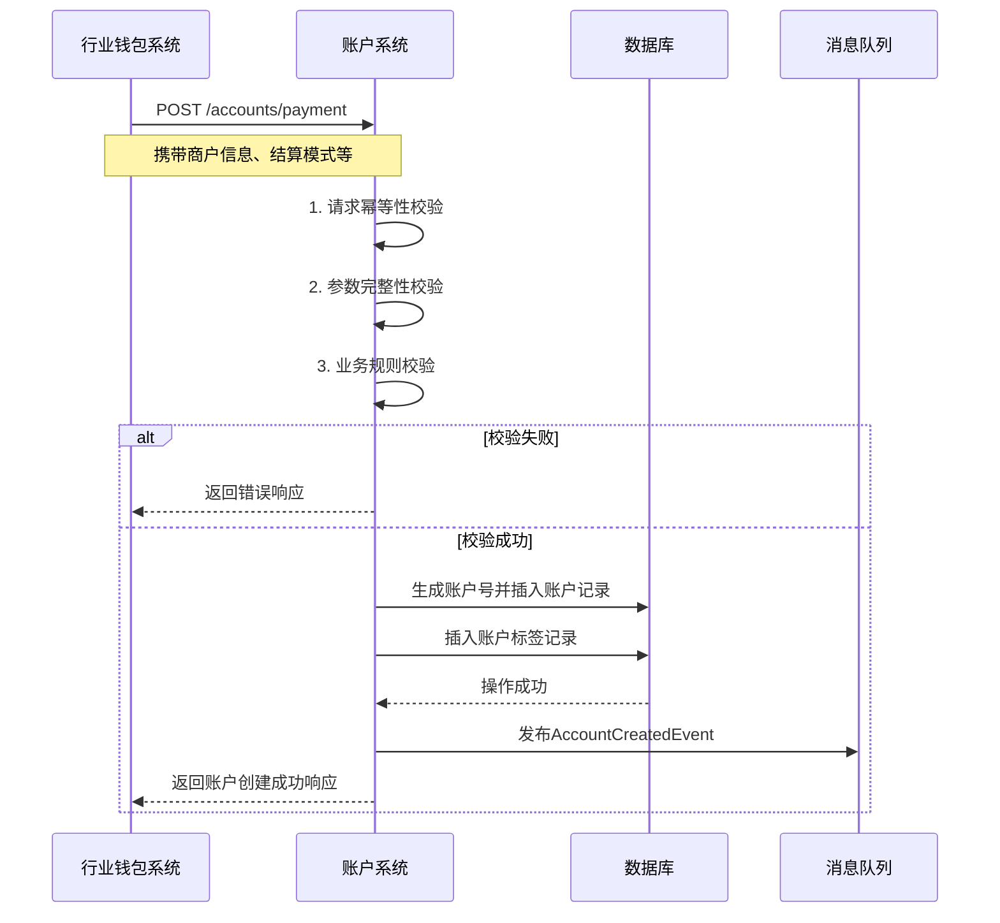
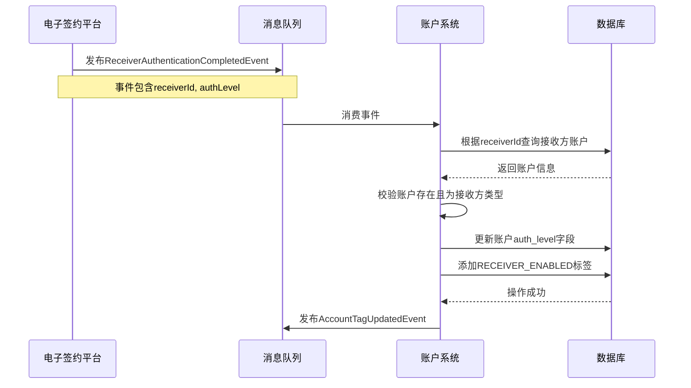

# 模块设计: 账户系统

生成时间: 2026-01-19 17:46:00

---

# 账户系统模块设计文档

## 1. 概述

### 1.1 目的
账户系统是底层核心服务，负责为“天财”分账业务创建和管理专用的资金账户，包括**天财收款账户**和**天财接收方账户**。本模块提供账户的创建、查询、标记、状态管理等功能，并确保账户属性符合上层业务（如行业钱包系统、清结算系统）的规则要求，是整个分账业务资金流转的基石。

### 1.2 范围
- **账户创建与管理**：根据业务请求，创建并维护天财专用账户。
- **账户标记与控制**：为账户打上业务标签（如“天财专用”、“分账接收方”），控制其可参与的业务类型。
- **账户关系映射**：存储账户与外部业务实体（如收单商户、门店、个人）的关联关系。
- **状态机管理**：管理账户的生命周期状态（如正常、冻结、注销）。
- **基础查询服务**：为其他系统提供账户信息、状态、关系的查询能力。
- **不包含**：资金记账、余额管理、交易处理、费率计算、签约认证流程。这些由清结算、计费中台、电子签约平台等负责。

## 2. 接口设计

### 2.1 API 端点 (RESTful)

#### 2.1.1 账户创建类
- **POST /api/v1/accounts/payment** - 创建天财收款账户
- **POST /api/v1/accounts/receiver** - 创建天财接收方账户

#### 2.1.2 账户查询类
- **GET /api/v1/accounts/{accountNo}** - 查询账户详情
- **GET /api/v1/accounts** - 根据条件查询账户列表 (支持分页)
- **GET /api/v1/accounts/{accountNo}/relations** - 查询账户绑定的业务关系

#### 2.1.3 账户管理类
- **PATCH /api/v1/accounts/{accountNo}/status** - 更新账户状态 (如冻结、解冻)
- **PATCH /api/v1/accounts/{accountNo}/tags** - 为账户添加或移除业务标签
- **PUT /api/v1/accounts/{accountNo}/default-card** - 设置接收方账户的默认提现卡

### 2.2 输入/输出数据结构

#### 2.2.1 创建天财收款账户请求 (`CreatePaymentAccountRequest`)
```json
{
  "requestId": "req_20231027001",
  "merchantId": "MCH_TC_001",
  "merchantName": "天财示例总部",
  "merchantType": "HEADQUARTERS", // 枚举: HEADQUARTERS, STORE
  "settlementMode": "ACTIVE", // 枚举: ACTIVE, PASSIVE
  "relatedInternalAccount": "01", // 关联的待结算账户代码，被动结算时必填
  "operator": "system",
  "extInfo": {
    "sourceSystem": "WALLET",
    "businessCode": "TC_COLLECTION"
  }
}
```

#### 2.2.2 创建天财接收方账户请求 (`CreateReceiverAccountRequest`)
```json
{
  "requestId": "req_20231027002",
  "receiverId": "RCV_001",
  "receiverName": "张三",
  "receiverType": "INDIVIDUAL", // 枚举: INDIVIDUAL, ENTERPRISE, STORE
  "certType": "ID_CARD",
  "certNo": "310101199001011234",
  "bankCards": [
    {
      "cardNo": "6228480012345678901",
      "bankCode": "ICBC",
      "branchName": "上海浦东支行",
      "isDefault": true
    }
  ],
  "authLevel": "FULL", // 枚举: FULL(已签约), BASIC(仅绑卡)
  "operator": "system",
  "extInfo": {
    "sourceSystem": "WALLET",
    "businessCode": "TC_BATCH_PAY"
  }
}
```

#### 2.2.3 通用账户响应 (`AccountResponse`)
```json
{
  "code": "SUCCESS",
  "message": "操作成功",
  "data": {
    "accountNo": "TC_ACCT_202310270001",
    "accountType": "PAYMENT", // 枚举: PAYMENT, RECEIVER
    "status": "ACTIVE", // 枚举: ACTIVE, FROZEN, CLOSED
    "merchantId": "MCH_TC_001",
    "receiverId": "RCV_001",
    "tags": ["TIANCAI_SPECIAL", "SETTLEMENT_SOURCE"],
    "settlementMode": "ACTIVE",
    "relatedInternalAccount": "01",
    "defaultBankCard": {
      "cardNo": "6228480012345678901",
      "bankCode": "ICBC"
    },
    "createdTime": "2023-10-27T10:00:00Z",
    "updatedTime": "2023-10-27T10:00:00Z"
  }
}
```

### 2.3 发布/消费的事件

#### 2.3.1 发布的事件
- **AccountCreatedEvent**: 账户创建成功时发布。
    ```json
    {
      "eventId": "evt_account_created_001",
      "eventType": "ACCOUNT.CREATED",
      "timestamp": "2023-10-27T10:00:01Z",
      "payload": {
        "accountNo": "TC_ACCT_202310270001",
        "accountType": "PAYMENT",
        "merchantId": "MCH_TC_001",
        "status": "ACTIVE",
        "tags": ["TIANCAI_SPECIAL"]
      }
    }
    ```
- **AccountStatusChangedEvent**: 账户状态变更时发布。
- **AccountTagUpdatedEvent**: 账户标签更新时发布。

#### 2.3.2 消费的事件
- **MerchantSettlementModeChangedEvent** (来自清结算系统): 当商户结算模式变更时，更新对应账户的`settlementMode`和`relatedInternalAccount`。
- **ReceiverAuthenticationCompletedEvent** (来自电子签约平台): 当接收方完成签约认证时，更新对应账户的`authLevel`。

## 3. 数据模型

### 3.1 数据库表设计

#### 表: `tiancai_account` (天财账户主表)
| 字段名 | 类型 | 必填 | 默认值 | 说明 |
|--------|------|------|--------|------|
| `id` | BIGINT(20) | Y | AUTO_INCREMENT | 主键 |
| `account_no` | VARCHAR(32) | Y | | **账户号**，唯一业务标识，格式: TC_ACCT_{日期}{序列} |
| `account_type` | TINYINT(1) | Y | | 账户类型: 1-收款账户，2-接收方账户 |
| `status` | TINYINT(1) | Y | 1 | 状态: 1-正常，2-冻结，3-注销 |
| `merchant_id` | VARCHAR(64) | N | | 关联的收单商户ID (收款账户必填) |
| `receiver_id` | VARCHAR(64) | N | | 关联的接收方ID (接收方账户必填) |
| `settlement_mode` | TINYINT(1) | N | | 结算模式: 1-主动结算，2-被动结算 (收款账户专用) |
| `related_internal_account` | VARCHAR(8) | N | | 关联的内部账户代码，如'01' (被动结算时必填) |
| `auth_level` | TINYINT(1) | N | 0 | 认证等级: 0-未认证，1-基础绑卡，2-完全签约 (接收方账户专用) |
| `version` | INT(11) | Y | 1 | 乐观锁版本号 |
| `created_time` | DATETIME | Y | CURRENT_TIMESTAMP | 创建时间 |
| `updated_time` | DATETIME | Y | CURRENT_TIMESTAMP ON UPDATE | 更新时间 |

**索引**:
- 唯一索引: `uk_account_no` (`account_no`)
- 索引: `idx_merchant_id` (`merchant_id`)
- 索引: `idx_receiver_id` (`receiver_id`)
- 索引: `idx_created_time` (`created_time`)

#### 表: `account_tag` (账户标签表)
| 字段名 | 类型 | 必填 | 默认值 | 说明 |
|--------|------|------|--------|------|
| `id` | BIGINT(20) | Y | AUTO_INCREMENT | 主键 |
| `account_no` | VARCHAR(32) | Y | | 账户号 |
| `tag_code` | VARCHAR(32) | Y | | 标签代码，如: TIANCAI_SPECIAL, SETTLEMENT_SOURCE, RECEIVER_ENABLED |
| `tag_value` | VARCHAR(128) | N | | 标签值 |
| `created_time` | DATETIME | Y | CURRENT_TIMESTAMP | 创建时间 |

**索引**:
- 唯一索引: `uk_account_tag` (`account_no`, `tag_code`)
- 索引: `idx_tag_code` (`tag_code`)

#### 表: `receiver_bank_card` (接收方银行卡表)
| 字段名 | 类型 | 必填 | 默认值 | 说明 |
|--------|------|------|--------|------|
| `id` | BIGINT(20) | Y | AUTO_INCREMENT | 主键 |
| `account_no` | VARCHAR(32) | Y | | 账户号 |
| `card_no` | VARCHAR(32) | Y | | 银行卡号 (加密存储) |
| `bank_code` | VARCHAR(16) | Y | | 银行代码 |
| `branch_name` | VARCHAR(128) | N | | 支行名称 |
| `is_default` | TINYINT(1) | Y | 0 | 是否默认卡: 0-否，1-是 |
| `status` | TINYINT(1) | Y | 1 | 状态: 1-有效，2-已解绑 |
| `created_time` | DATETIME | Y | CURRENT_TIMESTAMP | 创建时间 |
| `updated_time` | DATETIME | Y | CURRENT_TIMESTAMP ON UPDATE | 更新时间 |

**索引**:
- 唯一索引: `uk_account_card` (`account_no`, `card_no`) (当status=1时)
- 索引: `idx_account_default` (`account_no`, `is_default`)

### 3.2 与其他模块的关系
- **行业钱包系统**: 上层业务系统。调用本模块创建账户、查询账户信息。本模块向其发布账户事件。
- **清结算系统**: 配置结算模式、内部账户映射。向本模块发送结算模式变更事件。
- **电子签约平台**: 完成接收方认证。向本模块发送认证完成事件。
- **业务核心/对账单系统**: 查询账户基础信息，用于对账单生成。

## 4. 业务逻辑

### 4.1 核心算法
**账户号生成算法**:
```
TC_ACCT_{YYYYMMDD}{8位序列号}
```
- 日期部分: 账户创建日期
- 序列号: 每日从1开始自增，确保当日唯一
- 全局唯一性: 通过数据库唯一索引保证

### 4.2 业务规则
1. **账户创建规则**:
   - 收款账户: 必须关联有效的`merchantId`，且同一商户同一结算模式下只能有一个有效账户。
   - 接收方账户: 必须关联有效的`receiverId`，且同一接收方只能有一个有效账户。
   - 被动结算的收款账户: 必须填写有效的`relatedInternalAccount`（如'01'待结算账户）。

2. **标签管理规则**:
   - 所有天财专用账户必须打上`TIANCAI_SPECIAL`标签。
   - 收款账户根据结算模式打上`SETTLEMENT_SOURCE`（主动结算）或`SETTLEMENT_TEMP`（被动结算）标签。
   - 完成签约的接收方账户打上`RECEIVER_ENABLED`标签。

3. **状态流转规则**:
   ```
   创建 → 正常(ACTIVE)
            ↓
          冻结(FROZEN) ←→ 正常(ACTIVE)
            ↓
          注销(CLOSED)
   ```
   - 冻结: 可由清结算系统或风控系统触发，账户无法进行资金转出。
   - 解冻: 恢复为正常状态。
   - 注销: 账户永久不可用，需余额为零且无在途交易。

4. **银行卡规则**:
   - 接收方账户必须至少绑定一张有效的银行卡。
   - 有且只有一张卡可标记为默认卡。
   - 默认卡用于提现操作。

### 4.3 验证逻辑
1. **创建请求验证**:
   - 请求ID幂等性检查，防止重复创建。
   - 商户/接收方ID格式校验。
   - 结算模式与内部账户的匹配性校验。
   - 银行卡号Luhn算法校验及银行代码有效性校验。

2. **状态变更验证**:
   - 冻结前检查是否有在途交易（需调用清结算系统接口）。
   - 注销前检查账户余额是否为0（需调用清结算系统接口）。

3. **查询权限验证**:
   - 根据调用方系统标识，限制可查询的账户范围。

## 5. 时序图

### 5.1 创建天财收款账户时序图



### 5.2 接收方账户认证状态更新时序图



## 6. 错误处理

### 6.1 预期错误码
| 错误码 | HTTP状态码 | 描述 | 处理建议 |
|--------|------------|------|----------|
| `ACCOUNT_ALREADY_EXISTS` | 409 Conflict | 账户已存在 | 检查请求ID幂等性，或查询已存在账户 |
| `MERCHANT_NOT_FOUND` | 404 Not Found | 商户不存在 | 检查商户ID是否正确，或先创建商户 |
| `INVALID_SETTLEMENT_MODE` | 400 Bad Request | 结算模式无效 | 检查结算模式值，被动结算需提供内部账户 |
| `BANK_CARD_VALIDATION_FAILED` | 400 Bad Request | 银行卡校验失败 | 检查银行卡号格式、银行代码 |
| `ACCOUNT_FROZEN` | 403 Forbidden | 账户已冻结 | 需先解冻账户才能操作 |
| `ACCOUNT_CLOSED` | 403 Forbidden | 账户已注销 | 不可对注销账户进行操作 |
| `DATABASE_CONSTRAINT_VIOLATION` | 500 Internal Server Error | 数据库约束冲突 | 检查唯一性约束，重试或人工介入 |

### 6.2 处理策略
1. **重试策略**: 对于网络超时、数据库死锁等临时性错误，采用指数退避重试。
2. **补偿机制**: 对于分布式事务场景（如创建账户后事件发布失败），提供补偿接口或定期对账修复。
3. **降级策略**: 查询接口在依赖服务不可用时，可返回缓存数据或部分数据，并标记数据可能过时。
4. **监控告警**: 对错误率、延迟等指标设置监控，超过阈值时触发告警。

## 7. 依赖说明

### 7.1 上游依赖
1. **行业钱包系统** (强依赖):
   - **交互方式**: 同步HTTP调用
   - **职责**: 发起账户创建、查询请求，提供业务上下文
   - **降级方案**: 无。账户创建是核心业务流程，必须可用。

2. **清结算系统** (弱依赖):
   - **交互方式**: 异步事件消费 + 同步接口调用
   - **职责**: 提供结算模式配置、账户余额/在途交易状态查询
   - **降级方案**: 状态变更操作可进入待办队列，延迟处理。

3. **电子签约平台** (弱依赖):
   - **交互方式**: 异步事件消费
   - **职责**: 提供接收方认证状态更新
   - **降级方案**: 认证状态更新可延迟，不影响账户基础功能。

### 7.2 下游依赖
1. **消息中间件** (强依赖):
   - **用途**: 发布账户变更事件
   - **影响**: 事件发布失败会影响其他系统的状态同步，需有重试和补偿机制。

2. **数据库** (强依赖):
   - **用途**: 数据持久化
   - **影响**: 数据库不可用将导致所有服务中断，需有主从切换、读写分离方案。

### 7.3 依赖治理
- **超时配置**: 所有外部调用设置合理超时（通常HTTP为3s，数据库为1s）。
- **熔断机制**: 对非核心依赖（如清结算查询接口）配置熔断器，防止级联故障。
- **版本兼容**: API接口保持向后兼容，废弃接口需有足够长的过渡期。