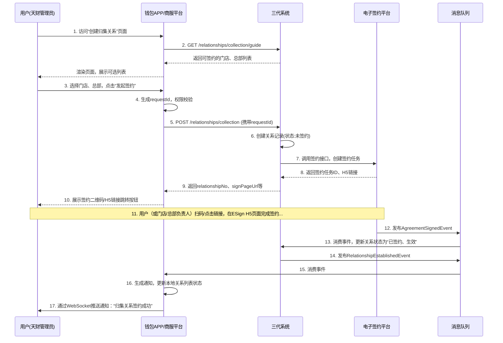
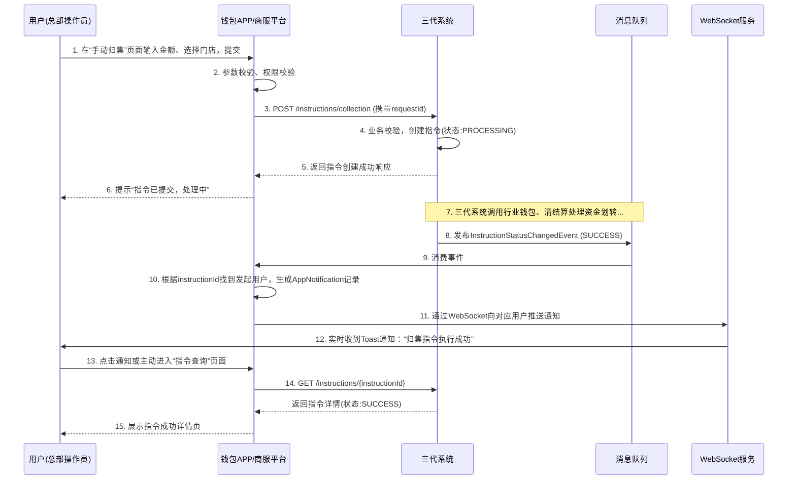

# 模块设计: 钱包APP/商服平台

生成时间: 2026-01-19 17:49:30

---

# 模块设计: 钱包APP/商服平台

生成时间: 2026-01-19 18:00:00

---

# 钱包APP/商服平台模块设计文档

## 1. 概述

### 1.1 目的
钱包APP/商服平台是面向“天财”机构及其收单商户（总部、门店）的综合性服务门户与操作终端。它作为业务操作的前端载体，为用户提供直观、便捷的界面，以完成账户管理、关系绑定、分账指令发起、交易查询、对账单查看等核心业务操作。本模块旨在将复杂的后端业务流程（如三代系统、行业钱包系统）封装为简单易用的用户交互，是连接商户用户与后端分账系统的桥梁。

### 1.2 范围
- **用户认证与权限管理**：支持天财机构管理员、总部商户管理员、门店商户操作员等多角色登录，并提供基于角色的功能权限与数据权限控制。
- **账户概览与查询**：展示商户关联的“天财收款账户”余额、交易流水、账户状态等信息。
- **分账关系管理**：引导用户完成“归集”、“批量付款”、“会员结算”关系的创建、签约与认证流程，并与电子签约平台无缝集成。
- **分账指令发起与查询**：提供手动发起“归集”、“批量付款”、“会员结算”指令的界面，并支持查询指令执行状态与历史记录。
- **对账单服务**：集成对账单系统，为商户提供账户维度、交易维度以及“天财分账指令账单”的查询、下载服务。
- **消息与通知**：向用户推送业务状态变更（如签约成功、指令完成、账户异常）等通知。
- **不包含**：不处理核心业务逻辑（由三代系统处理）、不执行资金划转（由行业钱包和清结算系统处理）、不直接管理底层账户（由账户系统处理）。

## 2. 接口设计

### 2.1 API 端点 (RESTful)

#### 2.1.1 用户与权限
- **POST /api/app/v1/auth/login** - 用户登录（支持账号密码、短信验证码）
- **POST /api/app/v1/auth/logout** - 用户登出
- **GET /api/app/v1/users/me** - 获取当前用户信息及权限菜单
- **GET /api/app/v1/users/merchants** - 获取当前用户有权限操作的商户列表

#### 2.1.2 账户概览
- **GET /api/app/v1/accounts/overview** - 获取账户概览（总余额、可用余额、冻结金额等）
- **GET /api/app/v1/accounts/{accountNo}/detail** - 获取指定账户详情
- **GET /api/app/v1/accounts/{accountNo}/transactions** - 查询账户交易流水（支持分页、时间筛选）

#### 2.1.3 关系绑定与签约
- **GET /api/app/v1/relationships/collection/guide** - 获取创建归集关系引导信息（需签约的门店、总部列表）
- **POST /api/app/v1/relationships/collection/initiate** - 发起归集关系签约请求
- **GET /api/app/v1/relationships/collection/{relationshipNo}/sign-url** - 获取归集关系签约H5页面URL
- **GET /api/app/v1/relationships/batch-payment/guide** - 获取创建批量付款关系引导信息
- **POST /api/app/v1/relationships/batch-payment/initiate** - 发起批量付款关系签约（含接收方信息录入）
- **GET /api/app/v1/relationships** - 查询已建立的关系列表及状态
- **POST /api/app/v1/merchants/{merchantId}/open-payment/initiate** - 总部发起“开通付款”签约

#### 2.1.4 分账指令操作
- **POST /api/app/v1/instructions/collection/manual** - 手动发起单笔归集指令
- **POST /api/app/v1/instructions/batch-payment/manual** - 手动发起批量付款指令（上传文件或列表）
- **POST /api/app/v1/instructions/member-settlement/manual** - 手动发起会员结算指令
- **GET /api/app/v1/instructions** - 查询分账指令列表（支持按类型、状态、时间筛选）
- **GET /api/app/v1/instructions/{instructionId}** - 查询指令详情

#### 2.1.5 对账单服务
- **GET /api/app/v1/statements/types** - 获取可查询的对账单类型列表
- **POST /api/app/v1/statements/query** - 查询对账单列表（按账户、日期范围）
- **GET /api/app/v1/statements/{statementId}/download-url** - 获取对账单文件下载URL

#### 2.1.6 消息中心
- **GET /api/app/v1/notifications** - 获取用户消息/通知列表
- **POST /api/app/v1/notifications/{notificationId}/read** - 标记消息为已读
- **WS /ws/notifications** - WebSocket连接，接收实时消息推送

### 2.2 输入/输出数据结构

#### 2.2.1 用户登录响应 (`LoginResponse`)
```json
{
  "code": "SUCCESS",
  "message": "登录成功",
  "data": {
    "userId": "USER_TC_ADMIN_001",
    "userName": "张三",
    "phone": "13800138000",
    "token": "eyJhbGciOiJIUzI1NiIsInR5cCI6IkpXVCJ9...",
    "tokenExpiry": 7200,
    "role": "TIANCAI_ADMIN",
    "permittedMerchants": [
      {
        "merchantId": "MCH_TC_HQ_001",
        "merchantName": "天财示例品牌总部",
        "merchantType": "HEADQUARTERS",
        "isDefault": true
      }
    ]
  }
}
```

#### 2.2.2 账户概览响应 (`AccountOverviewResponse`)
```json
{
  "code": "SUCCESS",
  "message": "查询成功",
  "data": {
    "totalBalance": 1500000.00,
    "availableBalance": 1480000.00,
    "frozenBalance": 20000.00,
    "primaryAccount": {
      "accountNo": "TC_ACCT_HQ_001",
      "accountName": "天财示例品牌总部-收款账户",
      "balance": 1500000.00,
      "status": "ACTIVE",
      "currency": "CNY"
    },
    "subAccounts": [
      {
        "accountNo": "TC_ACCT_STORE_001",
        "accountName": "北京王府井门店-收款账户",
        "balance": 500000.00,
        "status": "ACTIVE",
        "merchantName": "北京王府井门店"
      }
    ]
  }
}
```

#### 2.2.3 发起归集关系签约请求 (`InitiateCollectionRelationshipRequest`)
```json
{
  "requestId": "app_req_rel_col_20231029001",
  "storeMerchantId": "MCH_TC_STORE_001",
  "headquartersMerchantId": "MCH_TC_HQ_001",
  "operator": "USER_TC_ADMIN_001"
}
```

#### 2.2.4 发起归集关系签约响应 (`InitiateCollectionRelationshipResponse`)
```json
{
  "code": "SUCCESS",
  "message": "签约流程已发起",
  "data": {
    "relationshipNo": "REL_COL_202310290001",
    "signTaskId": "SIGN_TASK_001",
    "signPageUrl": "https://esign.tiancai.com/h5/sign?taskId=SIGN_TASK_001&token=xxx",
    "signQrCodeUrl": "https://esign.tiancai.com/qr/SIGN_TASK_001",
    "expiresIn": 1800
  }
}
```

#### 2.2.5 手动发起归集指令请求 (`ManualCollectionInstructionRequest`)
```json
{
  "requestId": "app_req_inst_man_20231029001",
  "storeMerchantId": "MCH_TC_STORE_001",
  "headquartersMerchantId": "MCH_TC_HQ_001",
  "amount": 50000.00,
  "currency": "CNY",
  "remark": "手动测试归集",
  "operator": "USER_HQ_OPERATOR_001"
}
```

#### 2.2.6 对账单查询请求 (`QueryStatementRequest`)
```json
{
  "accountNo": "TC_ACCT_HQ_001",
  "statementType": "TIANCAI_SPLIT_INSTRUCTION",
  "startDate": "2023-10-01",
  "endDate": "2023-10-31",
  "pageNum": 1,
  "pageSize": 20
}
```

### 2.3 发布/消费的事件

#### 2.3.1 发布的事件
- **UserActionLoggedEvent**: 记录用户关键操作（登录、发起签约、发起指令等）时发布，用于审计。
    ```json
    {
      "eventId": "evt_user_action_001",
      "eventType": "USER.ACTION.LOGGED",
      "timestamp": "2023-10-29T10:00:01Z",
      "payload": {
        "userId": "USER_TC_ADMIN_001",
        "action": "INITIATE_COLLECTION_RELATIONSHIP",
        "resourceId": "REL_COL_202310290001",
        "ipAddress": "192.168.1.100",
        "userAgent": "Mozilla/5.0...",
        "result": "SUCCESS"
      }
    }
    ```
- **AppNotificationCreatedEvent**: 当需要向用户推送应用内通知时发布（如指令完成）。
    ```json
    {
      "eventId": "evt_app_notification_001",
      "eventType": "APP.NOTIFICATION.CREATED",
      "timestamp": "2023-10-29T18:05:00Z",
      "payload": {
        "userId": "USER_HQ_OPERATOR_001",
        "notificationType": "INSTRUCTION_COMPLETED",
        "title": "归集指令执行完成",
        "content": "指令 INST_COL_202310280001 已成功执行，金额 100,000.00 元。",
        "relatedResourceType": "INSTRUCTION",
        "relatedResourceId": "INST_COL_202310280001",
        "priority": "NORMAL"
      }
    }
    ```

#### 2.3.2 消费的事件
- **RelationshipEstablishedEvent** (来自三代系统): 当关系签约完成时，更新前端关系列表状态，并可能向相关用户发送通知。
- **InstructionStatusChangedEvent** (来自三代系统): 当指令状态变更时，更新前端指令状态，并向发起用户推送实时通知（通过WebSocket）。
- **AgreementSigningStatusUpdatedEvent** (来自电子签约平台): 当签约页面状态变化（如已签署、已过期、已拒绝）时，更新前端签约引导页面的状态。

## 3. 数据模型

### 3.1 数据库表设计

#### 表: `app_user` (APP用户表)
| 字段名 | 类型 | 必填 | 默认值 | 说明 |
|--------|------|------|--------|------|
| `id` | BIGINT(20) | Y | AUTO_INCREMENT | 主键 |
| `user_id` | VARCHAR(32) | Y | | **用户ID**，业务唯一标识 |
| `user_name` | VARCHAR(64) | Y | | 用户姓名 |
| `phone` | VARCHAR(32) | Y | | 手机号（登录账号） |
| `password_hash` | VARCHAR(255) | Y | | 密码哈希 |
| `user_role` | VARCHAR(32) | Y | | 用户角色: TIANCAI_ADMIN, HQ_ADMIN, HQ_OPERATOR, STORE_OPERATOR |
| `status` | TINYINT(1) | Y | 1 | 状态: 1-正常，2-禁用 |
| `last_login_time` | DATETIME | N | | 最后登录时间 |
| `last_login_ip` | VARCHAR(45) | N | | 最后登录IP |
| `created_time` | DATETIME | Y | CURRENT_TIMESTAMP | 创建时间 |
| `updated_time` | DATETIME | Y | CURRENT_TIMESTAMP ON UPDATE | 更新时间 |

**索引**:
- 唯一索引: `uk_user_id` (`user_id`)
- 唯一索引: `uk_phone` (`phone`)
- 索引: `idx_user_role` (`user_role`)

#### 表: `user_merchant_permission` (用户-商户权限表)
| 字段名 | 类型 | 必填 | 默认值 | 说明 |
|--------|------|------|--------|------|
| `id` | BIGINT(20) | Y | AUTO_INCREMENT | 主键 |
| `user_id` | VARCHAR(32) | Y | | 用户ID |
| `merchant_id` | VARCHAR(64) | Y | | 商户ID |
| `permission_type` | TINYINT(1) | Y | | 权限类型: 1-可查看，2-可操作（发起指令） |
| `is_default` | TINYINT(1) | Y | 0 | 是否为默认操作商户 |
| `created_time` | DATETIME | Y | CURRENT_TIMESTAMP | 创建时间 |

**索引**:
- 唯一索引: `uk_user_merchant` (`user_id`, `merchant_id`)
- 索引: `idx_user_id` (`user_id`)

#### 表: `app_notification` (应用通知表)
| 字段名 | 类型 | 必填 | 默认值 | 说明 |
|--------|------|------|--------|------|
| `id` | BIGINT(20) | Y | AUTO_INCREMENT | 主键 |
| `notification_id` | VARCHAR(32) | Y | | **通知ID** |
| `user_id` | VARCHAR(32) | Y | | 目标用户ID |
| `notification_type` | VARCHAR(32) | Y | | 通知类型: RELATIONSHIP_SIGNED, INSTRUCTION_COMPLETED, ACCOUNT_ALERT |
| `title` | VARCHAR(128) | Y | | 通知标题 |
| `content` | VARCHAR(512) | Y | | 通知内容 |
| `related_resource_type` | VARCHAR(32) | N | | 关联资源类型: RELATIONSHIP, INSTRUCTION, ACCOUNT |
| `related_resource_id` | VARCHAR(64) | N | | 关联资源ID |
| `is_read` | TINYINT(1) | Y | 0 | 是否已读: 0-未读，1-已读 |
| `priority` | TINYINT(1) | Y | 1 | 优先级: 1-低，2-中，3-高 |
| `expire_time` | DATETIME | N | | 过期时间 |
| `created_time` | DATETIME | Y | CURRENT_TIMESTAMP | 创建时间 |
| `read_time` | DATETIME | N | | 阅读时间 |

**索引**:
- 唯一索引: `uk_notification_id` (`notification_id`)
- 索引: `idx_user_read_created` (`user_id`, `is_read`, `created_time`)
- 索引: `idx_related_resource` (`related_resource_type`, `related_resource_id`)

#### 表: `user_operation_log` (用户操作日志表)
| 字段名 | 类型 | 必填 | 默认值 | 说明 |
|--------|------|------|--------|------|
| `id` | BIGINT(20) | Y | AUTO_INCREMENT | 主键 |
| `log_id` | VARCHAR(32) | Y | | **日志ID** |
| `user_id` | VARCHAR(32) | Y | | 操作用户ID |
| `action` | VARCHAR(64) | Y | | 操作动作，如 LOGIN, CREATE_RELATIONSHIP, INITIATE_INSTRUCTION |
| `resource_type` | VARCHAR(32) | N | | 操作资源类型 |
| `resource_id` | VARCHAR(64) | N | | 操作资源ID |
| `request_params` | TEXT | N | | 请求参数（JSON格式） |
| `result` | VARCHAR(16) | Y | | 操作结果: SUCCESS, FAILURE |
| `error_message` | VARCHAR(512) | N | | 错误信息 |
| `ip_address` | VARCHAR(45) | N | | 操作IP |
| `user_agent` | VARCHAR(512) | N | | 用户代理 |
| `operation_time` | DATETIME | Y | CURRENT_TIMESTAMP | 操作时间 |

**索引**:
- 索引: `idx_user_action_time` (`user_id`, `action`, `operation_time`)
- 索引: `idx_resource` (`resource_type`, `resource_id`)
- 索引: `idx_operation_time` (`operation_time`)

### 3.2 与其他模块的关系
- **三代系统**: **核心业务依赖**。本模块大部分业务操作（关系绑定、指令发起）都是通过调用三代系统的API来完成的。本模块是三代系统面向用户的主要调用方。
- **电子签约平台**: **强依赖**。在关系绑定和“开通付款”流程中，本模块负责引导用户跳转至电子签约平台提供的H5页面完成签约，并监听签约状态回调。
- **对账单系统**: **数据依赖**。通过接口获取对账单列表和文件，为用户提供查询和下载服务。
- **行业钱包系统/账户系统**: **间接依赖**。账户概览、交易流水等数据通过三代系统聚合或直接调用相关查询接口获得。
- **消息中间件**: **强依赖**。通过消费业务事件（如指令状态变更）来生成用户通知，并通过WebSocket实现实时推送。

## 4. 业务逻辑

### 4.1 核心算法
**用户权限合并算法**:
用户登录后，其权限由`用户角色`和`用户-商户权限表`共同决定。
1.  根据`user_role`确定基础功能权限（如天财管理员可操作所有功能，门店操作员仅可查询）。
2.  根据`user_merchant_permission`表确定数据权限（可操作哪些商户的数据）。
3.  前端菜单和按钮根据合并后的权限进行渲染。

**实时通知推送**:
1.  用户登录APP后，建立WebSocket连接，连接标识与`user_id`绑定。
2.  当消费到需要推送的事件（如`InstructionStatusChangedEvent`）时，根据事件中的相关资源ID，查询关联的用户ID（如指令发起人）。
3.  通过WebSocket向对应用户的连接推送精简的通知消息。
4.  同时，在`app_notification`表中生成一条完整的通知记录，供消息中心拉取。

### 4.2 业务规则
1. **用户角色与权限规则**:
   - **天财管理员**：可查看和管理其所属天财机构下的所有商户、关系、指令，可发起所有操作。
   - **总部管理员**：可查看和管理其所属总部商户及其下属门店，可发起归集、批量付款、会员结算。
   - **总部操作员**：权限由总部管理员分配，通常仅有指令发起和查询权限。
   - **门店操作员**：仅可查看本门店的账户信息、交易流水和关联的关系，通常无发起指令权限。

2. **关系绑定流程规则**:
   - **归集关系**：通常由天财管理员或总部管理员发起。发起后，引导付款方（门店）和收款方（总部）的相关负责人分别完成电子签约。
   - **批量付款关系**：由总部管理员发起。需要先录入或选择接收方信息（个人/企业），并引导付款方（总部）和收款方（接收方）完成签约。总部还需额外完成“开通付款”签约。
   - **会员结算关系**：由总部管理员发起。引导付款方（总部）和收款方（门店）完成签约。总部还需额外完成“开通付款”签约。
   - 所有签约流程均通过跳转至电子签约平台H5页面完成，本模块通过轮询或回调获取签约结果。

3. **指令发起规则**:
   - 手动发起指令前，必须确保对应的分账关系已生效。
   - 发起指令时，需进行前端基础校验（金额格式、必填项）。
   - 指令发起后，前端显示“处理中”状态，并通过WebSocket或轮询接收状态更新。

4. **数据展示规则**:
   - 账户余额、交易流水等金融数据需进行脱敏显示（如后四位）。
   - 列表查询需支持分页，时间范围默认设置为最近30天。

### 4.3 验证逻辑
1. **用户请求校验**:
   - 所有API请求需携带有效的身份令牌（JWT），并在网关或拦截器中进行校验。
   - 对涉及资源操作的请求（如查询某商户数据、对某账户发起指令），需校验当前用户是否拥有该资源的操作权限（通过`user_merchant_permission`表）。

2. **业务参数校验**:
   - 金额参数需校验为正数且符合金额格式。
   - 商户ID、账户号等参数需校验其存在性及与当前用户的权限关联。

3. **防重复提交**:
   - 对于创建类请求（如发起签约、发起指令），利用`requestId`在服务端实现幂等，防止用户重复点击。

## 5. 时序图

### 5.1 用户发起归集关系签约时序图



### 5.2 用户手动发起归集指令并接收通知时序图



## 6. 错误处理

### 6.1 预期错误码
| 错误码 | HTTP状态码 | 描述 | 处理建议 |
|--------|------------|------|----------|
| `UNAUTHORIZED` | 401 Unauthorized | 用户未登录或token无效 | 引导用户重新登录 |
| `FORBIDDEN` | 403 Forbidden | 用户无权限执行此操作 | 提示用户权限不足，联系管理员 |
| `MERCHANT_NOT_ACCESSIBLE` | 403 Forbidden | 用户无权访问该商户数据 | 检查商户ID，或切换有权限的商户 |
| `RELATIONSHIP_GUIDE_EMPTY` | 404 Not Found | 无可用的门店/总部用于建立关系 | 确认商户账户已创建，或联系天财管理员 |
| `SIGN_URL_EXPIRED` | 410 Gone | 签约链接已过期 | 重新发起签约流程 |
| `INSTRUCTION_REJECTED` | 400 Bad Request | 指令发起被拒绝（如关系未生效） | 检查关系状态，完成签约 |
| `BACKEND_SERVICE_UNAVAILABLE` | 503 Service Unavailable | 后端服务（三代等）暂时不可用 | 提示“服务繁忙，请稍后重试”，并记录日志 |
| `WEBSOCKET_CONNECTION_FAILED` | N/A | WebSocket连接失败 | 前端自动尝试重连，降级为定期轮询 |

### 6.2 处理策略
1. **用户端错误**（4xx）：清晰提示用户错误原因，并给出明确的操作指引（如重新登录、联系管理员）。
2. **服务端错误**（5xx）：
   - 对用户展示友好的错误提示，避免暴露技术细节。
   - 记录详细的错误日志（包括用户ID、请求参数、堆栈信息），便于排查。
   - 对于因后端服务不可用导致的错误，前端可提供“重试”按钮。
3. **网络异常与超时**：
   - 设置合理的API超时时间（如10秒）。
   - 网络请求超时或失败时，提示用户检查网络，并提供重试机制。
4. **异步流程中断**：
   - 如签约流程中用户关闭页面，提供入口让用户能回到原流程继续操作（通过查询未完成的关系记录）。
   - 对于长时间未收到回调的指令，在指令查询列表中标出“状态待确认”，并允许用户手动刷新。

## 7. 依赖说明

### 7.1 上游模块交互
1. **用户（天财、商户员工）**:
   - **交互方式**: HTTP/HTTPS, WebSocket。
   - **职责**: 通过浏览器或移动端APP使用本平台。
   - **降级方案**: 前端静态资源可做缓存。核心操作无法降级，但可优化加载体验和错误提示。

### 7.2 下游依赖
1. **三代系统**:
   - **交互方式**: 同步HTTP调用（绝大部分业务操作） + 异步事件消费（状态同步）。
   - **职责**: 提供所有核心业务能力的实现。
   - **降级方案**: **强依赖，无降级**。三代系统不可用，则APP所有业务功能瘫痪。需确保三代系统高可用，且APP有良好的“服务不可用”状态提示。

2. **电子签约平台**:
   - **交互方式**: 间接通过三代系统调用 + 异步事件消费（签约状态）。
   - **职责**: 提供签约H5页面及签约结果回调。
   - **降级方案**: 签约流程无法降级。电子签不可用则关系绑定业务无法进行。需在页面上明确提示用户“签约服务维护中”。

3. **对账单系统**:
   - **交互方式**: 同步HTTP调用（查询列表、获取下载链接）。
   - **职责**: 提供对账单数据。
   - **降级方案**: 对账单查询功能可降级。调用失败时，提示用户“对账单服务暂不可用，请稍后查询”，并隐藏相关入口或显示为灰色。

4. **消息中间件 (MQ)**:
   - **交互方式**: 异步事件消费 + 发布。
   - **职责**: 接收业务状态变更事件，实现实时通知。
   - **降级方案**: MQ不可用时，实时通知功能失效，降级为定时轮询（如每30秒查询一次未读通知和指令状态）。

### 7.3 依赖治理
- **超时配置**:
    - 调用三代系统: 超时15秒（考虑复杂业务处理时间）。
    - 调用对账单系统: 超时10秒。
- **熔断与降级**:
    - 对三代系统关键接口配置熔断器，防止因后端持续故障导致APP线程池耗尽。
    - 对非核心功能（如对账单查询）配置降级策略，失败时返回友好提示。
- **前端缓存**:
    - 静态资源强缓存。
    - 用户权限、商户列表等低频变更数据使用本地存储（LocalStorage/SessionStorage）缓存，减少不必要的API调用。
- **重试机制**:
    - 对网络请求失败（非4xx错误）实施前端指数退避重试。
    - WebSocket连接断开后自动重连。