# DocuFlow-AI Project - 软件设计文档
生成时间: 2026-01-21 15:24:07

## 目录
1. [概述说明](#1-概述说明)
   - 1.1 [术语与缩略词](#11-术语与缩略词)
2. [系统设计](#2-系统设计)
3. [模块设计](#3-模块设计)
   - 3.1 [账户系统](#module-1)
   - 3.2 [计费中台](#module-2)
   - 3.3 [业务核心](#module-3)
   - 3.4 [认证系统](#module-4)
   - 3.5 [钱包APP/商服平台](#module-5)
   - 3.6 [清结算](#module-6)
   - 3.7 [电子签章系统](#module-7)
   - 3.8 [行业钱包系统](#module-8)
   - 3.9 [三代系统](#module-9)
   - 3.10 [对账单系统](#module-10)
4. [接口设计](#4-接口设计)
5. [数据库设计](#5-数据库设计)

---
# 1 概述说明

## 1.1 术语与缩略词

## 角色

- **天财**: 业务需求方，指天财商龙，是门店分账、会员结算、批量付款需求的提出方。
- **总部** (别名: 总店, 发起方, 归集方): 天财业务场景中的品牌方或总店，通常是分账指令的发起方和资金归集的收款方。
- **门店** (别名: 被归集方, 付方, 收方): 天财业务场景中的分店，在归集场景中是资金付方，在会员结算场景中可能是收方。
- **接收方** (别名: 入账方): 在批量付款场景中，接收从天财收款账户分账资金的外部实体，拥有天财接收方账户。

## 业务实体

- **天财收款账户** (别名: 天财专用账户): 为满足天财分账需求而开立的专用账户，类型为行业钱包（非小微钱包），用于门店收单资金的归集和分账。
- **天财接收方账户** (别名: 天财专用账户): 为满足天财分账需求而开立的专用账户，用于接收从天财收款账户分账而来的资金，支持绑定多张银行卡并设置默认提现卡。
- **04退货账户** (别名: 退货账户): 收单商户对应的用于处理退货资金的专用账户。
- **01待结算账户** (别名: 待结算账户): 收单交易资金在结算前暂存的账户。

## 系统角色

- **三代**: 指拉卡拉的三代系统，负责商户管理、开户、分账关系绑定、计费配置等核心业务处理。
- **行业钱包系统** (别名: 钱包系统): 负责处理天财专用账户的开户、关系绑定校验、分账请求处理、数据同步等核心业务逻辑的系统。
- **账户系统**: 底层账户管理系统，负责开立并标记天财专用账户，控制账户能力，处理账户动账和账单生成。
- **清结算**: 负责处理交易结算、退货扣款、计费信息同步以及为对账单提供底层交易数据的系统。
- **电子签约平台** (别名: 电子签章系统): 负责协议模板管理、短信推送、H5页面封装、打款验证、人脸验证及协议签署证据链留存的系统。
- **认证系统**: 提供打款验证和人脸验证（活检+核验）能力的系统。
- **对账单系统**: 负责生成和提供机构维度的各类账户动账明细、交易账单和分账指令账单的系统。
- **计费中台**: 提供转账手续费计费能力的系统。
- **业务核心** (别名: 账务核心系统): 接收并处理天财分账交易数据的系统。

## 流程

- **归集** (别名: 资金归集): 资金从门店的天财收款账户流向总部的天财收款账户的业务场景。
- **批量付款** (别名: 批付): 资金从天财收款账户（总部）流向天财接收方账户的业务场景，用于向供应商、股东等付款。
- **会员结算**: 资金从天财收款账户（总部）分账给门店的天财收款账户的业务场景，用于处理会员相关的资金结算。
- **关系绑定** (别名: 签约与认证, 绑定关系): 在分账前，建立并验证付方与收方之间授权关系的流程，包括协议签署和身份认证（打款或人脸）。
- **开通付款**: 在批量付款和会员结算场景下，付方（总部/门店-对公企业）需要单独完成的签约与认证流程，以授权代付。
- **天财分账** (别名: 转账): 指在天财专用账户（收款账户或接收方账户）之间进行的资金转账操作，是钱包系统定义的新交易类型。
- **退货前置**: 处理退货请求的流程，支持查询并扣除天财收款账户或退货账户（04账户）的资金。

## 技术术语

- **打款验证**: 一种身份认证方式，通过向目标银行卡打入随机金额，验证回填金额和备注是否正确。
- **人脸验证**: 一种身份认证方式，通过比对姓名、身份证和人脸信息是否一致来完成验证。
- **主动结算**: 一种结算模式，收单交易资金结算至商户指定的收款账户（如天财收款账户）。
- **被动结算**: 一种结算模式，收单交易资金停留在待结算账户，需要商户发起提款指令。

---
# 2 系统设计
## 2.1 系统结构
本系统采用分层架构，以"三代系统"作为业务入口和管理中枢，通过"行业钱包系统"作为核心业务处理层，协调多个底层能力系统，共同完成天财分账业务。整体架构遵循职责分离原则，确保业务逻辑清晰、系统间解耦。

## 2.2 功能结构
系统功能围绕天财分账业务的核心流程展开，主要包括账户管理、关系绑定、分账交易、结算对账四大功能域。

## 2.3 网络拓扑图
TBD

## 2.4 数据流转
数据流转以"分账指令"和"资金动账"为核心，在三代系统、行业钱包系统、业务核心及账户系统之间传递，最终由对账单系统进行聚合。

## 2.5 系统模块交互关系
模块间交互主要通过同步API调用和异步事件驱动两种方式，核心业务流由行业钱包系统串联。

---
# 3 模块设计

## 3.1 账户系统

### 1. 概述
- **目的与范围**: 账户系统是底层账户管理系统，负责开立并标记天财专用账户（包括天财收款账户和天财接收方账户），控制账户能力，处理账户动账和账单生成。其边界在于管理账户的实体、状态和资金变动，不处理具体的业务逻辑（如分账规则、认证流程）。

### 2. 接口设计
- **API端点 (REST/GraphQL)**: TBD
- **请求/响应结构**: TBD
- **发布/消费的事件**: TBD

### 3. 数据模型
- **表/集合**:
  1.  账户主表 (Account)
  2.  账户动账流水表 (AccountJournal)
- **关键字段**:
  - 账户主表: 账户ID、账户类型（天财收款账户/天财接收方账户/04退货账户/01待结算账户）、所属商户ID、账户状态、账户能力标记、开户时间。
  - 账户动账流水表: 流水ID、账户ID、交易时间、交易类型（天财分账/收单结算/退货扣款等）、交易金额、余额、关联业务订单号。
- **与其他模块的关系**: 账户主表通过商户ID与三代系统的商户信息关联。动账流水为对账单系统提供底层交易数据。

### 4. 业务逻辑
- **核心工作流/算法**:
  1.  **开户**: 接收行业钱包系统的开户请求，创建天财专用账户，并打上特定账户类型和能力标记。
  2.  **动账处理**: 接收业务核心或清结算系统的动账指令，对指定账户进行资金增减，并记录动账流水。
  3.  **账单生成**: 基于动账流水，按机构维度生成账户动账明细。
- **业务规则与验证**:
  - 开立天财专用账户时，需校验账户类型为行业钱包（非小微钱包）。
  - 动账前需校验账户状态是否正常、账户是否具备相应能力（如是否允许分账出金）。
  - 扣款类交易需校验账户余额是否充足。
- **关键边界情况处理**:
  - 重复动账请求：通过业务订单号幂等处理。
  - 账户状态异常（如冻结、注销）：拒绝动账请求。

### 5. 时序图

### 6. 错误处理
- **预期错误情况**:
  - 账户不存在。
  - 账户状态异常（冻结、注销）。
  - 账户余额不足。
  - 账户不具备请求的操作权限。
  - 重复的业务订单号。
- **处理策略**:
  - 对上述错误情况，返回明确的错误码和错误信息，拒绝操作。
  - 实现基于业务订单号的幂等性，防止重复处理。
  - 记录详细的错误日志用于对账和排查。

### 7. 依赖关系
- **上游模块**:
  - 行业钱包系统：发起开户请求。
  - 业务核心：发起天财分账相关的动账请求。
  - 清结算：发起结算、退货相关的动账请求。
- **下游模块**:
  - 对账单系统：消费账户动账流水，生成账单。

## 3.2 计费中台

### 1. 概述
- **目的与范围**: 本模块是"计费中台"系统角色的具体实现，为"天财分账"（转账）业务提供统一的转账手续费计算能力。其边界限定于接收来自"行业钱包系统"的计费请求，根据"三代"系统配置的费率规则计算费用，并将计费结果同步给"清结算"系统。本模块不涉及费用的实际扣收或账户余额管理，是"行业钱包系统"的一个核心子模块。
- **与术语表的一致性澄清**: 根据术语表，"计费中台"是一个系统角色。本设计文档描述的是实现该系统角色的具体模块。该模块服务于"行业钱包系统"，是其内部处理计费逻辑的组成部分。上游调用方为"行业钱包系统"，下游数据同步对象为"清结算"系统。

### 2. 接口设计
- **API端点 (REST)**:
  - `POST /api/v1/billing/calculate`: 计算转账手续费。
- **请求/响应结构**:
  - **请求体 (CalculateFeeRequest)**:
    - `transactionId` (String): 交易流水号，用于幂等。
    - `scene` (Enum): 业务场景，枚举值：`COLLECTION`(归集)、`BATCH_PAYMENT`(批量付款)、`MEMBER_SETTLEMENT`(会员结算)。
    - `payerAccountNo` (String): 付款方账户号（天财收款账户）。
    - `payeeAccountNo` (String): 收款方账户号（天财收款账户或天财接收方账户）。
    - `amount` (BigDecimal): 转账金额。
  - **响应体 (CalculateFeeResponse)**:
    - `code` (String): 响应码。
    - `message` (String): 响应信息。
    - `data` (FeeDetail): 计费详情。
      - `transactionId` (String): 交易流水号。
      - `fee` (BigDecimal): 计算出的手续费。
      - `currency` (String): 币种，默认CNY。
      - `ruleId` (String): 匹配到的费率规则ID。
- **发布/消费的事件**:
  - **发布事件**: `BillingCompletedEvent`
    - `eventId` (String): 事件ID。
    - `transactionId` (String): 交易流水号。
    - `fee` (BigDecimal): 手续费金额。
    - `status` (Enum): 计费状态 (`SUCCESS`, `FAILED`)。
    - `calculatedAt` (Timestamp): 计费完成时间。

### 3. 数据模型
- **表/集合**:
  - **fee_rules (费率规则表)**: 存储由"三代"系统配置的计费规则。
    - `id` (PK): 规则ID。
    - `scene` (Enum): 适用业务场景。
    - `payer_account_type` (String): 付款方账户类型（如：天财收款账户-对公）。
    - `payee_account_type` (String): 收款方账户类型（如：天财接收方账户-个人）。
    - `calc_mode` (Enum): 计算模式 (`PERCENTAGE`比例, `FIXED`固定)。
    - `rate` (Decimal): 费率（当为比例时）或固定金额（当为固定时）。
    - `min_amount` (Decimal): 适用交易金额下限。
    - `max_amount` (Decimal): 适用交易金额上限。
    - `priority` (Integer): 规则优先级（数字越小优先级越高）。
    - `status` (Enum): 规则状态 (`ACTIVE`, `INACTIVE`)。
    - `created_by` (String): 创建者（三代操作员）。
    - `created_at` (Timestamp): 创建时间。
  - **billing_records (计费记录表)**: 记录每次计费请求和结果，用于对账与同步。
    - `id` (PK): 记录ID。
    - `transaction_id` (UK): 交易流水号。
    - `request_data` (JSON): 完整的计费请求数据。
    - `matched_rule_id` (String): 匹配的规则ID。
    - `calculated_fee` (Decimal): 计算出的手续费。
    - `sync_status` (Enum): 同步至清结算的状态 (`PENDING`, `SUCCESS`, `FAILED`)。
    - `sync_retry_count` (Integer): 同步重试次数。
    - `calculated_at` (Timestamp): 计费时间。
    - `synced_at` (Timestamp): 同步成功时间。
- **与其他模块的关系**:
  - **fee_rules** 表的数据由 **三代系统** 进行配置和管理。
  - **billing_records** 表的计费结果需要同步给 **清结算** 系统。

### 4. 业务逻辑
- **核心工作流/算法**:
  1. **接收请求**: 接收来自"行业钱包系统"的计费请求。
  2. **参数校验**: 校验请求参数完整性、交易金额有效性（>0）等。
  3. **查询费率规则**:
     - 根据请求中的 `scene`（场景）、`payerAccountNo` 和 `payeeAccountNo`（需查询账户系统或本地缓存获取账户类型）、`amount`（金额范围），从 `fee_rules` 表中查询 `status = 'ACTIVE'` 的规则。
     - 规则匹配逻辑：筛选出场景、付款方类型、收款方类型匹配，且交易金额在 `min_amount` 和 `max_amount` 范围内的所有规则。
     - 冲突解决：在匹配的规则中，选择 `priority` 值最高（数字最小）的一条规则。如果优先级相同，则选择创建时间最新的一条。
  4. **计算手续费**:
     - 如果匹配到规则：根据规则的 `calc_mode` 和 `rate` 计算手续费。比例计算：`fee = amount * rate`。固定金额：`fee = rate`。
     - 如果未匹配到任何有效规则：返回错误"费率规则未配置"。
  5. **持久化记录**: 将计费请求、匹配的规则ID、计算结果持久化到 `billing_records` 表，初始 `sync_status` 为 `PENDING`。
  6. **返回结果**: 将计费结果返回给"行业钱包系统"。
  7. **异步同步**: 异步触发 `BillingCompletedEvent` 事件，由监听器负责将计费结果同步至"清结算"系统。
- **业务规则与验证**:
  - 验证计费请求的合法性，包括必填字段、交易金额为正数、账户号格式等。
  - 验证付款方和收款方账户是否均为有效的"天财专用账户"。
- **关键边界情况处理**:
  - **费率规则未配置**: 返回明确错误，阻止交易继续进行。
  - **计费金额为零或为负**: 在参数校验阶段拦截，返回参数错误。
  - **请求参数缺失**: 在参数校验阶段拦截，返回参数错误。
  - **同步清结算失败**: 基于 `billing_records` 表中的 `sync_status` 和 `sync_retry_count` 进行重试，超过最大重试次数后告警，由人工介入处理。

### 5. 时序图

### 6. 错误处理
- **预期错误情况**:
  1. **客户端错误**: 请求参数无效、交易金额非正、账户不存在。
  2. **业务错误**: 费率规则未配置、无匹配的费率规则。
  3. **系统错误**: 数据库访问异常、消息队列异常、内部计算错误。
  4. **依赖服务错误**: "清结算"系统同步接口暂时不可用。
- **处理策略**:
  - **参数与业务错误**: 在请求处理早期进行校验，返回明确的业务错误码和提示信息，不进行重试。
  - **系统与依赖错误**:
    - 数据库/内部错误：记录错误日志，向上游返回系统错误，触发告警。
    - 同步"清结算"失败：利用 `billing_records` 表记录状态，由后台任务进行有限次数的重试（如3次），重试间隔递增。超过重试次数后，标记为失败并发出运维告警。
  - **幂等性**: 通过 `transactionId` 保证针对同一笔交易的计费请求只处理一次，避免重复计费。

### 7. 依赖关系
- **上游模块/系统**:
  - **行业钱包系统 (强依赖)**: 本模块的直接调用方，发起计费请求。本模块是"行业钱包系统"的一个组成部分。
  - **三代系统 (强依赖)**: 提供费率规则的配置与管理，是规则数据的源头。
  - **账户系统 (弱依赖，通过钱包系统间接依赖)**: 用于获取账户类型信息以匹配规则（信息可由钱包系统在请求中携带或本模块缓存）。
- **下游模块/系统**:
  - **清结算系统 (强依赖)**: 计费结果的消费者。本模块通过异步事件将计费结果同步至该系统，是其计费数据的提供方。
  - **消息中间件 (强依赖)**: 用于实现与"清结算"系统的异步解耦通信。

## 3.3 业务核心

### 1. 概述
- **目的与范围**: 业务核心模块（亦称账务核心系统）的核心职责是接收并处理天财分账交易数据。它是天财分账业务中处理资金流转指令的核心引擎，负责将上游系统（如行业钱包系统）发起的转账请求转化为底层账户系统的动账操作，并确保交易数据的准确性与一致性。其边界在于处理"天财分账"这一特定交易类型，不涉及商户管理、开户、签约认证等前置流程。本模块依赖上游系统（如行业钱包系统）完成关系绑定、账户状态校验等前置条件，仅负责在已验证的合法关系基础上执行资金划转。

### 2. 接口设计
- **API端点 (REST/GraphQL)**: TBD
- **请求/响应结构**: TBD
- **发布/消费的事件**:
    - **消费事件**: TBD
    - **发布事件**: 处理完成天财分账交易后，需发布交易结果事件，供下游对账单系统、清结算系统订阅。事件载荷应包含交易流水号、交易状态、交易金额、付方账户、收方账户、交易时间等核心信息。

### 3. 数据模型
- **表/集合**: TBD
- **关键字段**: TBD
- **与其他模块的关系**: 本模块处理的数据与账户系统（动账记录）、对账单系统（交易账单）和清结算（底层交易数据）紧密关联。本模块产生的交易流水是清结算系统进行结算和对账的基础数据源之一，也是生成对账单的关键输入。

### 4. 业务逻辑
- **核心工作流/算法**: 接收天财分账交易请求（如归集、批量付款、会员结算），验证请求的合法性（如账户状态、余额），调用底层账户系统完成资金从付方账户到收方账户的划转，并记录交易流水。
- **业务规则与验证**:
    1.  **账户类型验证**: 验证付方账户与收方账户是否为有效的"天财专用账户"（即行业钱包账户）。
    2.  **账户状态验证**: 验证付方账户（如天财收款账户）与收方账户（如另一天财收款账户或天财接收方账户）的状态是否为"正常"，非冻结、非注销。
    3.  **余额验证**: 验证付方账户可用余额是否大于等于交易金额。
    4.  **交易金额验证**: 验证交易金额格式正确，且符合系统设定的单笔交易金额上下限。
- **关键边界情况处理**: 处理付方账户余额不足的情况；处理交易过程中账户状态发生变更的情况；处理与底层账户系统交互超时或失败后的冲正与对账。

### 5. 时序图

### 6. 错误处理
- **预期错误情况**:
    1.  **业务校验失败**: 付方账户余额不足；付方或收方账户状态异常（冻结、注销）；账户非天财专用账户类型；交易金额格式错误或超限。
    2.  **系统交互失败**: 与下游账户系统网络超时或服务不可用；账户系统返回处理失败。
- **处理策略**:
    1.  **错误码与描述**: 针对每种业务校验失败情况，定义明确的错误码和描述信息，在接口响应中返回。
    2.  **重试机制**: 对于与账户系统的网络超时或临时性失败，实施带退避策略的重试机制（如指数退避）。
    3.  **冲正与补偿**: 在"扣款成功，加款失败"的场景下，必须立即发起对扣款操作的冲正（退款），以确保资金一致性。冲正失败需记录明确异常，并触发人工干预流程。
    4.  **异常流水记录**: 所有失败及冲正操作均需记录详细的流水，包括错误码、错误信息、原始请求等，供后续对账与排查使用。

### 7. 依赖关系
- **上游模块**: 行业钱包系统（发起分账请求的主要上游）。
- **下游模块**:
    1.  **账户系统**: 执行具体的账户动账（扣款、加款、冲正）操作。
    2.  **清结算系统**: 接收交易完成事件，作为结算与对账的数据源。
    3.  **对账单系统**: 接收交易完成事件，用于生成机构维度的交易账单。

## 3.4 认证系统

### 1. 概述
- **目的与范围**: 本模块的核心职责是为业务流程提供标准化的身份认证能力，具体包括打款验证和人脸验证（活体检测+身份核验）。它是关系绑定、开通付款等流程中验证付方与收方授权关系的关键环节。其边界限定于提供标准化的认证服务接口，不涉及具体的业务协议签署或资金流转逻辑。

### 2. 接口设计
- **API端点 (REST)**:
    - `POST /api/v1/auth/payment`: 发起打款验证请求。
    - `POST /api/v1/auth/payment/verify`: 验证用户回填的打款信息。
    - `POST /api/v1/auth/face`: 发起人脸验证请求。
    - `GET /api/v1/auth/record/{auth_id}`: 查询认证记录。
- **请求/响应结构**:
    - 打款验证请求 (`POST /api/v1/auth/payment`):
        - 请求体: `{"bank_card_no": "银行卡号", "bank_name": "银行名称", "user_name": "姓名", "id_card_no": "身份证号"}`
        - 响应体: `{"auth_id": "认证流水号", "status": "PROCESSING"}`
    - 打款验证提交 (`POST /api/v1/auth/payment/verify`):
        - 请求体: `{"auth_id": "认证流水号", "amount": "回填金额", "remark": "回填备注"}`
        - 响应体: `{"auth_id": "认证流水号", "status": "SUCCESS/FAILED", "error_code": "错误码"}`
    - 人脸验证请求 (`POST /api/v1/auth/face`):
        - 请求体: `{"name": "姓名", "id_card_no": "身份证号", "face_image": "Base64编码的人脸图片/视频帧"}`
        - 响应体: `{"auth_id": "认证流水号", "status": "SUCCESS/FAILED", "error_code": "错误码"}`
- **发布/消费的事件**:
    - 发布事件: `AuthCompletedEvent` (认证完成事件)，包含认证ID、类型、结果、时间戳。
    - 消费事件: TBD (暂无上游模块发出的需本模块处理的事件)。
- **与上游模块集成方式**: 与银行打款通道通过银行提供的标准支付/代付API集成，需配置商户号、密钥等认证信息。与公安核验系统通过其提供的标准身份信息核验API集成，需配置机构代码、签名密钥等。

### 3. 数据模型
- **表/集合**: `auth_record` (认证记录表)
- **关键字段**:
    - `auth_id` (主键): 认证流水号，全局唯一。
    - `auth_type`: 认证类型 (`PAYMENT` / `FACE`)。
    - `status`: 认证状态 (`INIT`, `PROCESSING`, `SUCCESS`, `FAILED`, `EXPIRED`)。
    - `request_data`: JSON格式的原始请求数据（存储用户提交的银行卡、身份信息等，敏感信息脱敏）。
    - `verify_data`: JSON格式的验证过程数据（如打款金额、备注、人脸核验流水号等）。
    - `result_data`: JSON格式的认证结果数据（如核验结果、失败原因等）。
    - `channel_info`: JSON格式的通道信息（如使用的打款通道、公安核验接口标识）。
    - `created_at`: 创建时间。
    - `updated_at`: 更新时间。
    - `expired_at`: 过期时间（针对打款验证）。
- **与其他模块的关系**: 本模块为电子签约平台提供打款验证和人脸验证能力，用于支持其协议签署流程中的身份认证环节。认证记录表独立存储，供查询和审计。

### 4. 业务逻辑
- **核心工作流/算法**:
    1. **打款验证流程**:
        - **步骤1: 发起验证**。接收目标银行卡、姓名、身份证号。生成唯一`auth_id`并落库，状态为`INIT`。
        - **步骤2: 生成并执行打款**。调用随机金额生成器（生成0.01元至1.00元之间的随机金额，精确到分）。根据配置的打款通道（如银行代付接口）发起打款请求，记录打款流水号。更新记录状态为`PROCESSING`，并设置过期时间（如24小时）。
        - **步骤3: 验证回填信息**。接收用户回填的金额和备注。与数据库中存储的`verify_data`（打款金额、系统生成的备注码）进行比对。完全一致则认证成功，否则失败。更新记录状态和结果。
    2. **人脸验证流程**:
        - **步骤1: 发起验证**。接收姓名、身份证号、人脸图像/视频。生成唯一`auth_id`并落库。
        - **步骤2: 活体检测**。调用活体检测服务（技术选型：TBD，如静默活体检测或动作指令活体检测），判断是否为真人。
        - **步骤3: 身份核验**。活体检测通过后，调用公安系统核验接口，传入姓名、身份证号、人脸图像特征，进行三要素比对。
        - **步骤4: 返回结果**。根据核验结果更新认证记录状态。
- **业务规则与验证**:
    - 打款验证需确保打款金额的随机性和安全性（每次不同），并验证回填信息的准确性。打款备注中需包含系统生成的唯一标识码（如后6位）。
    - 人脸验证需确保活体检测通过（防止照片、视频攻击），并核验人脸与身份证信息匹配。
    - 同一用户（相同身份证+银行卡）在一定时间内的打款验证请求需进行频次控制。
- **关键边界情况处理**:
    - 打款失败：记录失败原因，更新认证状态为`FAILED`，并通知调用方。
    - 打款超时未回填：通过定时任务扫描过期(`expired_at`)且状态为`PROCESSING`的记录，将其状态更新为`EXPIRED`。
    - 人脸验证中活体检测不通过或核验失败：直接返回失败，并记录具体失败阶段（活体/核验）。

### 5. 时序图

#### 5.1 打款验证时序图

#### 5.2 人脸验证时序图

### 6. 错误处理
- **预期错误情况**:
    - 网络超时或外部服务（银行打款通道、公安核验接口、活体检测服务）不可用。
    - 用户提交的认证信息不符合要求（如银行卡号错误、人脸图像质量差）。
    - 验证失败（金额/备注不匹配、活体检测不通过、身份核验不匹配）。
    - 认证请求已过期或重复提交。
    - 系统内部处理异常（数据库访问失败等）。
- **处理策略**:
    - 对依赖的外部服务调用设置重试机制（如最多3次）和超时控制（如5秒）。
    - 定义标准化的错误码枚举，返回给调用方。格式示例：`AUTH_XXXX`。
        - `AUTH_1001`: 打款失败
        - `AUTH_1002`: 回填信息不匹配
        - `AUTH_1003`: 验证请求已过期
        - `AUTH_2001`: 活体检测不通过
        - `AUTH_2002`: 身份核验不匹配
        - `AUTH_3001`: 外部服务暂时不可用
        - `AUTH_3002`: 系统内部错误
    - 记录详细的认证过程日志（包括请求、响应、关键步骤结果），用于问题排查与审计。敏感信息（如银行卡号、人脸图像）在日志中脱敏。
    - 监控关键外部接口的可用性与成功率，设置告警。

### 7. 依赖关系
- **上游模块/外部服务**:
    - **银行打款通道**: 提供向指定银行卡打款的能力。集成方式为API调用，需配置商户身份和密钥。
    - **公安系统身份核验接口**: 提供姓名、身份证、人脸三要素核验能力。集成方式为API调用，需配置机构代码和签名密钥。
    - **活体检测服务**: 提供判断提交的生物特征是否来自活体的能力。技术选型TBD，可能为内部服务或第三方服务。
- **下游模块**:
    - **电子签约平台**: 依赖本模块提供的打款验证和人脸验证能力，以完成关系绑定和开通付款流程中的身份认证环节。通过调用本模块REST API集成。
- **非功能性需求**:
    - **性能**: 单次认证请求（不含外部服务耗时）的P99响应时间 < 500ms。人脸验证流程（含活体检测与核验）整体P99耗时 < 5s。
    - **安全性**: 传输层使用HTTPS。敏感数据（银行卡号、身份证号）在数据库存储时进行加密。人脸图像或特征数据不长期存储，核验完成后及时清理或仅存储不可逆的特征摘要。所有操作留痕审计。
    - **可观测性**: 记录所有认证操作的详细日志。定义业务指标（如日认证量、成功率、各失败原因分布）并接入监控系统。对关键外部依赖的健康状态进行监控和告警。
    - **可用性**: 目标可用性99.9%。通过无状态设计和水平扩展支持高并发。

## 3.5 钱包APP/商服平台

### 1. 概述
- **目的与范围**：本模块是面向天财业务场景中总部、门店等商户的客户端应用平台（APP及Web平台）。其核心职责是为商户提供天财专用账户（收款账户/接收方账户）的开户、关系绑定、分账指令发起与查询、交易与账单查询等功能界面。其边界在于前端交互与业务流程引导，不处理核心业务逻辑，所有操作均通过调用后端系统（如行业钱包系统、电子签约平台等）的接口完成。

### 2. 接口设计
- **API端点 (REST/GraphQL)**：本模块作为前端应用，不对外提供API服务。其通过HTTP API调用上游后端系统。主要调用的上游接口分类如下：
    - **行业钱包系统接口**：用于账户开户、关系绑定、分账指令发起、各类状态查询（账户、交易、指令）。
    - **电子签约平台接口**：用于获取签约H5页面地址及查询签约结果。
    - **认证系统接口**：用于发起打款验证或人脸验证请求及查询认证结果。
    - **对账单系统接口**：用于查询和下载各类对账单。
- **请求/响应结构**：TBD（需根据各上游系统具体接口定义确定）。
- **发布/消费的事件**：本模块为纯前端应用，不发布领域事件。可能监听来自上游系统的Webhook通知（如签约完成、认证结果异步通知），具体事件定义TBD。

### 3. 数据模型
- **表/集合**：本模块为前端应用，不直接持有持久化的业务数据表。为提升用户体验和实现离线功能，将在客户端本地（如浏览器LocalStorage/IndexedDB、移动端本地数据库）存储以下非关键数据：
    1.  **用户会话缓存**：登录态Token、用户基础信息（商户ID、角色、权限列表）。
    2.  **应用配置缓存**：功能开关、接口域名、静态文案。
    3.  **流程草稿数据**：多步骤流程（如开户、绑定）中未提交的表单数据，支持断点续填。
    4.  **查询结果缓存**：高频且变化不频繁的查询结果（如账户列表、常用收款方），设置合理的过期时间。
- **关键字段**：TBD（具体字段取决于缓存数据结构设计）。
- **与其他模块的关系**：通过API与行业钱包系统、电子签约平台、认证系统、对账单系统等后端服务进行数据交互。与"三代系统"的交互均通过行业钱包系统接口间接完成，本模块不直接调用三代系统。

### 4. 业务逻辑
- **核心工作流/算法**：
    1.  **用户登录与状态管理**：
        - 调用认证服务完成用户登录，获取并管理访问令牌。
        - 根据用户角色（总部、门店）和权限动态渲染功能菜单和操作按钮。
        - 维护用户会话状态，Token过期时引导重新登录。
    2.  **开户引导**：引导商户完成天财收款账户或天财接收方账户的开户申请，收集必要信息后调用行业钱包系统开户接口。
    3.  **关系绑定（签约与认证）**：
        - 引导付方（如总部）发起与收方（如门店）的绑定流程。
        - 调用行业钱包系统获取绑定初始化数据及签约协议信息。
        - 嵌入或跳转至电子签约平台提供的H5页面完成协议签署。
        - 签署后，由电子签约平台调用认证系统完成打款或人脸验证。
        - 监听签约结果回调或主动轮询，获取最终绑定状态并更新界面。
    4.  **开通付款**：在批量付款和会员结算场景，引导付方（总部/门店-对公企业）完成独立的代付授权签约与认证流程，逻辑同关系绑定。
    5.  **分账指令发起**：
        - 根据业务场景（归集、会员结算、批量付款）展示不同的表单。
        - 提交前进行本地校验（如金额格式、收款方有效性）。
        - 调用行业钱包系统发起分账指令，对于需异步处理的指令，提供指令号供后续查询。
    6.  **查询功能**：提供账户余额、交易流水、分账指令状态、对账单等查询功能，调用行业钱包系统、对账单系统等接口。
- **业务规则与验证**：
    - 界面输入校验（如金额格式、必填项、手机号、银行卡号格式）。
    - 根据业务场景和用户角色控制功能入口和表单字段的可见性、可操作性。
    - 对于关键操作（如发起大额分账），增加二次确认弹窗。
- **关键边界情况处理**：
    - **网络异常与接口重试**：操作失败时提供友好提示。对于可重试的失败（如网络超时），提供重试按钮。关键操作（如支付、指令提交）的请求需支持幂等性，通过客户端生成唯一请求ID传递给后端。
    - **多步骤流程状态恢复**：对于开户、绑定等多步骤流程，将每一步的进度和表单数据缓存在本地。当应用重启或页面刷新时，能恢复至最近一步。
    - **并发操作控制**：对于同一资源（如向同一账户发起绑定），通过界面防重复点击（按钮禁用）和后台幂等设计避免重复提交。

### 5. 时序图

#### 5.1 账户开户与关系绑定时序图

#### 5.2 分账指令发起时序图

### 6. 错误处理
- **预期错误情况**：
    - 网络层错误：超时、连接中断、DNS解析失败。
    - HTTP错误：4xx（客户端错误，如参数错误、权限不足）、5xx（服务端错误）。
    - 业务逻辑错误：后端返回的业务错误码（如账户状态异常、余额不足、关系未绑定、日限额超限、认证失败）。
    - 前端逻辑错误：用户输入格式错误、本地数据不一致。
    - 第三方服务错误：电子签约页面加载失败、认证流程异常中断。
- **处理策略**：
    - **网络与HTTP错误**：提供统一友好的网络异常提示页面或组件，并包含"重试"操作。对于POST等非幂等操作，重试前需提示用户确认。
    - **业务错误**：将后端返回的错误码映射为通俗易懂的提示文案，并尽可能提供下一步操作指引（例如："余额不足"提示充值；"关系未绑定"提示前往绑定页面）。
    - **输入校验错误**：在表单提交时进行实时或提交前校验，错误信息明确标识在对应字段旁。
    - **流程中断错误**：对于签约、认证等流程中断，记录中断点，提供"继续流程"或"重新开始"的入口。
    - **幂等性保障**：对于创建类指令（分账、绑定确认），客户端生成唯一请求ID（UUID），确保重试不会导致重复业务操作。

### 7. 依赖关系
- **上游模块**：
    - **行业钱包系统**：核心依赖。提供所有账户管理、关系绑定、分账指令、交易查询等业务的接口实现。本模块通过钱包系统间接与"三代系统"交互。
    - **电子签约平台**：提供协议签署的H5页面集成及签约结果回调。
    - **认证系统**：提供打款验证、人脸验证的能力调用。
    - **对账单系统**：提供账单数据的查询与下载接口。
    - **(间接) 三代系统**：不直接依赖。所有需三代处理的核心业务（如商户信息校验、计费配置）均由行业钱包系统封装后提供。
- **下游模块**：无。本模块为前端界面，不向其他业务模块提供服务接口或数据。

## 3.6 清结算

### 1. 概述
- **目的与范围**：清结算模块负责处理收单交易的资金结算、退货扣款、计费信息同步，并为对账单系统提供底层交易数据。其核心职责是执行与资金流动相关的动账指令，确保交易资金从待结算账户正确结算至商户收款账户，以及处理退货时的资金扣回。本模块不涉及账户的日常管理或分账业务逻辑，其边界止于向账户系统发起动账指令和向对账单系统提供数据。

### 2. 接口设计
- **API端点 (REST)**:
  - `POST /api/v1/settlement`: 触发并处理交易结算。
  - `POST /api/v1/refund`: 处理退货扣款请求。
  - `GET /api/v1/transactions`: 为对账单系统提供交易明细查询。
- **请求/响应结构**:
  - **结算请求 (SettlementRequest)**:
    - `orderId` (String): 收单订单号。
    - `merchantId` (String): 商户ID。
    - `settlementAmount` (BigDecimal): 结算金额。
    - `targetAccountNo` (String): 目标结算账户（如天财收款账户）。
    - `settlementMode` (Enum): 结算模式 (`ACTIVE`, `PASSIVE`)。
  - **结算响应 (SettlementResponse)**:
    - `code` (String): 响应码。
    - `message` (String): 响应信息。
    - `data` (SettlementResult):
      - `settlementId` (String): 结算交易ID。
      - `status` (Enum): 结算状态。
  - **退货请求 (RefundRequest)**:
    - `refundId` (String): 退货ID。
    - `originalOrderId` (String): 原交易订单号。
    - `refundAmount` (BigDecimal): 退货金额。
  - **退货响应 (RefundResponse)**:
    - `code` (String): 响应码。
    - `message` (String): 响应信息。
    - `data` (RefundResult):
      - `refundId` (String): 退货ID。
      - `status` (Enum): 退货状态。
      - `deductAccountNo` (String): 实际扣款账户。
- **发布/消费的事件**:
  - **消费事件**:
    - `BillingCompletedEvent` (来自计费中台)：包含交易流水号和手续费信息。
  - **发布事件**:
    - `SettlementCompletedEvent`: 结算完成时发布，包含结算ID、状态、金额。
    - `RefundCompletedEvent`: 退货完成时发布，包含退货ID、状态、扣款账户。

### 3. 数据模型
- **表/集合**:
  1.  **结算交易表 (settlement_transaction)**
  2.  **退货交易表 (refund_transaction)**
  3.  **计费同步记录表 (fee_sync_record)**
- **关键字段**:
  - **结算交易表**:
    - `id` (PK): 结算交易ID。
    - `order_id` (String): 关联收单订单号。
    - `merchant_id` (String): 商户ID。
    - `settlement_amount` (Decimal): 结算金额。
    - `target_account_no` (String): 目标结算账户（如天财收款账户）。
    - `status` (Enum): 结算状态 (`PENDING`, `SUCCESS`, `FAILED`)。
    - `settled_at` (Timestamp): 结算完成时间。
    - `account_journal_id` (String): 关联的账户动账流水ID（用于与账户系统对账）。
  - **退货交易表**:
    - `id` (PK): 退货ID。
    - `original_order_id` (String): 原交易订单号。
    - `refund_amount` (Decimal): 退货金额。
    - `deduct_account_no` (String): 扣款账户（天财收款账户或04退货账户）。
    - `status` (Enum): 退货状态 (`PENDING`, `SUCCESS`, `FAILED`)。
    - `processed_at` (Timestamp): 处理完成时间。
    - `account_journal_id` (String): 关联的账户动账流水ID。
  - **计费同步记录表**:
    - `id` (PK): 记录ID。
    - `transaction_id` (String): 关联交易流水号（来自计费中台事件）。
    - `fee_amount` (Decimal): 手续费金额。
    - `sync_status` (Enum): 同步状态 (`PENDING`, `SUCCESS`, `FAILED`)。
    - `synced_at` (Timestamp): 同步成功时间。
    - `related_business_id` (String): 关联的业务ID（结算ID或退货ID）。
    - `related_business_type` (Enum): 关联业务类型 (`SETTLEMENT`, `REFUND`)。
- **与其他模块的关系**:
  - 通过 `account_journal_id` 字段与账户系统的动账流水关联，确保数据一致性。
  - 计费同步记录表通过 `transaction_id` 关联计费中台发布的 `BillingCompletedEvent`。
  - 结算与退货表为对账单系统提供核心数据源。

### 4. 业务逻辑
- **核心工作流/算法**:
  1.  **交易结算流程**:
      - **触发方式**：支持事件驱动（监听收单交易完成事件）与API调用（收单系统主动发起）两种方式。
      - **执行步骤**：
          a. 接收结算请求，创建结算交易记录，状态为 `PENDING`。
          b. 向账户系统发起动账指令：从 `01待结算账户` 扣款，向指定的 `天财收款账户` 加款。
          c. 接收账户系统返回的动账结果及 `account_journal_id`。
          d. 更新本地结算记录状态为 `SUCCESS` 并记录 `account_journal_id`；若失败则更新为 `FAILED`。
          e. 发布 `SettlementCompletedEvent`。
  2.  **退货扣款流程**:
      - **触发方式**：通过API接收退货请求。
      - **执行步骤**：
          a. 接收退货请求，创建退货记录，状态为 `PENDING`。
          b. **确定扣款来源**：查询原交易信息。若原交易资金已结算至天财收款账户，则从该账户扣款；若未结算，则从 `04退货账户` 扣款。
          c. 向账户系统发起动账指令，从确定的扣款账户进行扣款。
          d. 接收账户系统返回的动账结果及 `account_journal_id`。
          e. 更新本地退货记录状态为 `SUCCESS` 并记录 `account_journal_id` 和实际扣款账户；若失败则更新为 `FAILED`。
          f. 发布 `RefundCompletedEvent`。
  3.  **计费信息同步流程**:
      - **流程性质**：被动消费事件。监听并消费计费中台发布的 `BillingCompletedEvent`。
      - **执行步骤**：
          a. 接收事件，解析出交易流水号和手续费金额。
          b. 根据交易流水号，查询本地的结算或退货记录（需业务系统在发起计费时传递关联关系）。
          c. 若找到关联业务记录，则创建计费同步记录，并更新关联业务的手续费信息。
          d. 更新同步状态为 `SUCCESS`。
  4.  **数据提供流程**:
      - 通过对账单系统的查询接口，提供结算、退货及关联计费的明细数据，支持按时间、商户等维度查询。
- **业务规则与验证**:
  - 结算时需校验目标账户（天财收款账户）的状态是否正常（通过账户系统或缓存信息）。
  - 退货前置流程需校验原交易是否存在，并根据原交易状态确定正确的扣款账户。
  - 处理计费同步事件时，需校验关联的交易流水号是否有效，并确保幂等性。
- **数据一致性机制**:
  - 关键动账操作（结算、退货）均在本地记录与账户系统返回的 `account_journal_id`，通过此ID可与账户系统的动账流水进行双向核对，确保两边数据一致。
- **关键边界情况处理**:
  - 结算时目标账户异常：挂起结算任务，记录错误，触发告警并等待人工处理。
  - 退货时扣款账户余额不足：退货失败，更新状态为 `FAILED`，并通知业务方。
  - 重复的计费同步事件：基于事件ID或交易流水号进行幂等处理，避免重复记录。
  - 账户系统动账超时或失败：实现基于本地事务状态的重试机制，并设置最大重试次数。

### 5. 时序图

### 6. 错误处理
- **预期错误情况**:
  - 账户系统动账失败（账户不存在、状态异常、余额不足、网络超时）。
  - 计费同步事件关联的交易不存在或无法关联。
  - 下游系统（如对账单系统）查询接口超时或异常。
  - 内部数据处理失败（如数据库异常、唯一键冲突）。
- **处理策略**:
  - **依赖系统失败（账户系统）**：记录详细错误日志，根据错误类型决定重试（如网络超时）或转人工处理（如账户状态异常）。关键动账操作需保证幂等性。
  - **无效计费事件**：记录异常日志并发出告警，便于排查数据不一致问题。
  - **下游查询异常**：提供查询结果缓存，在接口异常时返回缓存数据作为降级策略。
  - **内部系统错误**：进行事务回滚，记录错误日志并触发告警。

### 7. 依赖关系
- **上游模块**:
  - **账户系统 (强依赖)**: 执行所有资金结算、退货扣款的动账操作。
  - **计费中台 (强依赖)**: 消费其发布的 `BillingCompletedEvent`，以同步手续费信息。
  - **收单系统 (强依赖)**: 提供待结算的交易数据，并触发结算或退货流程。
- **下游模块**:
  - **对账单系统 (强依赖)**: 为本模块提供结算、退货及计费明细数据，是其核心数据源之一。
  - **消息中间件 (强依赖)**: 用于发布结算、退货完成事件，并消费计费事件。

## 3.7 电子签章系统

### 1. 概述
- **目的与范围**: 本模块的核心职责是为业务流程提供协议模板管理、短信推送、H5页面封装、打款验证、人脸验证及协议签署证据链留存的能力。它是关系绑定、开通付款等流程中完成法律授权关系建立的关键环节。其边界限定于协议签署流程的管理与执行，不涉及具体的账户操作或资金流转逻辑。

### 2. 接口设计
- **API端点 (REST)**:
    - `POST /api/v1/agreement/generate`: 生成待签署协议。
    - `GET /api/v1/agreement/{agreement_id}`: 查询协议详情。
    - `POST /api/v1/agreement/{agreement_id}/send-sms`: 发送签署通知短信。
    - `GET /api/v1/agreement/h5-page`: H5页面获取协议及认证信息接口。
    - `POST /api/v1/agreement/{agreement_id}/init-auth`: 发起身份认证。
    - `POST /api/v1/agreement/{agreement_id}/verify-auth`: 验证认证结果。
    - `POST /api/v1/agreement/{agreement_id}/sign`: 提交协议签署。
    - `POST /api/v1/agreement/notify/sign-result`: 接收业务系统签署结果通知（回调接口）。
- **请求/响应结构**:
    - 生成协议 (`POST /api/v1/agreement/generate`):
        - 请求体: `{"biz_scene": "RELATION_BIND/OPEN_PAYMENT", "template_id": "模板ID", "parties": [{"role": "PERSONAL/CORPORATE", "name": "姓名", "id_card_no": "身份证号", "mobile": "手机号", ...}]}`
        - 响应体: `{"agreement_id": "协议唯一ID", "status": "DRAFT"}`
    - 查询协议 (`GET /api/v1/agreement/{agreement_id}`):
        - 响应体: `{"agreement_id": "协议ID", "status": "状态", "content": "协议内容", "parties": "签约方信息", "auth_method": "认证方式"}`
    - 发送短信 (`POST /api/v1/agreement/{agreement_id}/send-sms`):
        - 响应体: `{"success": true, "sms_id": "短信发送流水号"}`
    - H5页面接口 (`GET /api/v1/agreement/h5-page`):
        - 请求参数: `agreement_id`, `signature` (链接签名)
        - 响应体: `{"agreement_id": "协议ID", "content": "协议内容", "auth_method": "PAYMENT/FACE"}`
    - 发起认证 (`POST /api/v1/agreement/{agreement_id}/init-auth`):
        - 请求体: `{"auth_type": "PAYMENT/FACE", "user_info": {"bank_card_no": "银行卡号", ...}}`
        - 响应体: `{"auth_id": "认证流水号", "status": "PROCESSING"}`
    - 验证认证 (`POST /api/v1/agreement/{agreement_id}/verify-auth`):
        - 请求体: `{"auth_id": "认证流水号", "verify_data": {"amount": "回填金额", "remark": "回填备注"}}`
        - 响应体: `{"success": true, "auth_status": "SUCCESS/FAILED"}`
    - 提交签署 (`POST /api/v1/agreement/{agreement_id}/sign`):
        - 请求体: `{"signer_id": "签约方标识", "sign_time": "签署时间戳", "client_ip": "客户端IP", "device_fingerprint": "设备指纹"}`
        - 响应体: `{"success": true, "sign_record_id": "签署记录ID"}`
- **发布/消费的事件**:
    - 消费事件: `AuthCompletedEvent` (认证完成事件)，用于在认证完成后更新协议签署状态。事件结构：`{"auth_id": "认证流水号", "auth_type": "认证类型", "status": "SUCCESS/FAILED", "timestamp": "时间戳"}`。消费逻辑：根据`auth_id`关联到对应的协议，更新协议的认证状态。
    - 发布事件: `AgreementSignedEvent` (协议签署完成事件)，包含协议ID、签署方、签署时间、签署结果。下游模块（如行业钱包系统）可消费此事件以触发后续流程。

### 3. 数据模型
- **表/集合**:
    - `agreement_template` (协议模板表): 存储协议模板。
    - `agreement` (协议主表): 存储生成的协议实例。
    - `sign_record` (签署记录表): 存储每次签署的证据链信息。
    - `sms_record` (短信发送记录表): 存储短信推送记录。
- **关键字段**:
    - `agreement_template`:
        - `template_id` (主键): 模板ID。
        - `biz_scene`: 适用业务场景 (`RELATION_BIND`, `OPEN_PAYMENT`)。
        - `party_role`: 适用签约方角色 (`PERSONAL`, `CORPORATE`)。
        - `content`: 协议模板内容（含变量占位符）。
        - `version`: 模板版本。
    - `agreement`:
        - `agreement_id` (主键): 协议唯一ID。
        - `template_id`: 使用的模板ID。
        - `biz_scene`: 业务场景。
        - `status`: 协议状态 (`DRAFT`, `SMS_SENT`, `AUTH_PENDING`, `AUTH_SUCCESS`, `AUTH_FAILED`, `SIGNED`, `EXPIRED`)。
        - `content`: 填充后的完整协议内容。
        - `parties`: JSON数组，存储签约方信息（角色、姓名、证件号、手机号等）。
        - `auth_method`: 要求的认证方式 (`PAYMENT`, `FACE`)。
        - `auth_id`: 关联的认证流水号。
        - `expire_at`: 协议签署过期时间。
        - `h5_link_signature`: H5页面链接签名。
    - `sign_record`:
        - `sign_record_id` (主键): 签署记录ID。
        - `agreement_id`: 关联的协议ID。
        - `signer_id`: 签约方标识。
        - `sign_time`: 签署时间。
        - `client_ip`: 客户端IP。
        - `device_fingerprint`: 设备指纹。
        - `evidence_chain`: JSON格式的完整证据链（包含协议内容、认证记录、签署行为日志等）。
    - `sms_record`:
        - `sms_id` (主键): 短信发送流水号。
        - `agreement_id`: 关联的协议ID。
        - `mobile`: 接收手机号。
        - `content`: 短信内容。
        - `status`: 发送状态 (`SENDING`, `SUCCESS`, `FAILED`)。
        - `retry_count`: 重试次数。
- **与其他模块的关系**: 本模块依赖认证系统提供的打款验证和人脸验证能力，用于支持协议签署流程中的身份认证环节。协议签署记录独立存储，供查询和审计。与行业钱包系统通过事件或API同步签署结果。

### 4. 业务逻辑
- **核心工作流/算法**:
    1. **协议模板管理**:
        - 根据业务场景（关系绑定、开通付款）和签约方角色（个人、企业）管理不同的协议模板。
        - 模板内容支持变量替换，变量来源于签约方信息及业务上下文。
    2. **协议签署流程（关系绑定/开通付款）**:
        - **步骤1: 协议生成与推送**。根据业务场景选择协议模板，填充签约方信息，生成待签署协议。通过短信推送包含H5页面链接的签署通知。H5链接需使用协议ID和过期时间生成数字签名(`h5_link_signature`)防止篡改。短信发送失败时，根据配置的重试策略（如最多3次）进行重试。
        - **步骤2: 身份认证**。用户在H5页面中，根据协议类型和签约方身份（个人/企业）选择打款验证或人脸验证方式进行身份认证。调用认证系统接口完成认证。个人签约方通常使用人脸验证，企业签约方通常使用打款验证（验证对公账户控制人）。认证结果通过消费`AuthCompletedEvent`事件进行异步更新。
        - **步骤3: 协议签署**。认证通过后，引导用户在H5页面完成协议签署（如点击确认、电子签名）。记录签署时间、IP、设备指纹等信息，形成完整的签署证据链。证据链包含协议内容、认证记录、签署行为日志、时间戳等，并做防篡改处理（如哈希链）。
        - **步骤4: 状态同步**。协议签署完成后，更新协议状态为`SIGNED`，并发布`AgreementSignedEvent`事件，或通过回调API通知相关业务系统（如行业钱包系统）签署结果。
- **业务规则与验证**:
    - 协议模板需根据业务类型和签约方角色进行管理。
    - 个人签约方通常使用人脸验证，企业签约方通常使用打款验证（验证对公账户控制人）。
    - 必须确保签署过程的完整证据链，包括认证记录、签署行为日志、时间戳等。
    - H5页面链接必须携带签名(`signature`)，服务端需校验签名有效性和过期时间。
    - 同一份协议，同一签约方只能签署一次。
- **关键边界情况处理**:
    - 认证失败：签署流程中断，返回具体失败原因给用户。协议状态更新为`AUTH_FAILED`。
    - 签署超时：设置协议签署有效期（如24小时），超时后链接失效，协议状态更新为`EXPIRED`，需重新发起。
    - 重复签署：校验签署记录表，对同一份协议和同一签约方，若已存在成功签署记录，则拒绝再次签署。
    - 短信发送失败：记录失败原因，并根据重试策略进行重试。多次重试失败后，标记为最终失败，需人工介入或通过其他渠道通知。

### 5. 时序图

#### 5.1 协议签署（含认证）时序图

### 6. 错误处理
- **预期错误情况**:
    - 短信发送失败（通道异常、用户手机号无效）。
    - 认证系统服务不可用或认证失败。
    - H5页面会话超时或参数被篡改（签名无效）。
    - 协议模板不存在或数据填充错误。
    - 数据库访问异常。
    - 重复签署请求。
    - 协议已过期。
- **处理策略**:
    - 短信发送设置重试机制（如最多3次），并监控到达率。重试失败后记录日志并告警。
    - 对认证系统调用进行熔断和降级处理，友好提示用户"认证服务暂不可用，请稍后重试"。
    - H5页面链接携带签名(`h5_link_signature`)，服务端严格校验有效性及过期时间，防止篡改。
    - 定义标准化的错误码，通过H5页面或接口返回给前端。
        - `SIGN_1001`: 协议不存在
        - `SIGN_1002`: 协议已过期
        - `SIGN_1003`: H5链接签名无效
        - `SIGN_1004`: 重复签署
        - `SIGN_2001`: 短信发送失败
        - `SIGN_2002`: 认证发起失败
        - `SIGN_2003`: 认证未通过
        - `SIGN_3001`: 系统内部错误
    - 记录完整的协议操作日志（生成、推送、认证、签署），便于问题追踪和审计。

### 7. 依赖关系
- **上游模块**:
    - **认证系统**: 依赖其提供的打款验证和人脸验证能力，通过REST API集成。消费其发布的`AuthCompletedEvent`事件。
    - **短信通道**: 依赖其发送签署通知短信，通过API集成。
- **下游模块**:
    - **行业钱包系统**: 本模块在协议签署完成后，需要将签署结果同步给行业钱包系统，以触发后续的分账关系绑定或开通付款状态更新。集成方式为发布`AgreementSignedEvent`事件，或提供回调API (`POST /api/v1/agreement/notify/sign-result`) 供其调用。
- **非功能性需求**:
    - **安全性**: H5页面与后端通信使用HTTPS。协议内容、用户身份信息等敏感数据需加密存储。签署证据链需防篡改（如使用哈希链）。严格校验H5链接签名。
    - **可观测性**: 记录协议生成、推送、认证、签署全链路日志。监控签署成功率、各环节耗时、短信到达率、认证成功率等关键指标。
    - **可用性**: 目标可用性99.9%。H5页面需兼容主流移动端浏览器。核心服务需支持水平扩展。

## 3.8 行业钱包系统

### 1. 概述
- **目的与范围**: 行业钱包系统是处理天财专用账户相关业务的核心系统。其核心职责包括：接收三代系统的指令，处理天财专用账户（收款账户/接收方账户）的开户请求；管理并校验分账关系绑定；处理归集、批量付款、会员结算等场景下的分账请求；与电子签章系统协同完成签约与认证流程；同步数据至清结算、对账单等下游系统。其边界在于处理天财专用账户的生命周期管理、分账业务逻辑及关系管理，不涉及底层账户动账操作（由账户系统执行）和具体的协议签署执行（由电子签章系统执行）。

### 2. 接口设计
- **API端点 (REST)**:
    - `POST /api/v1/account/open`: 接收三代系统指令，开立天财专用账户。
    - `POST /api/v1/relation/bind`: 接收三代系统指令，发起分账关系绑定流程。
    - `POST /api/v1/split/initiate`: 发起分账处理（归集/批量付款/会员结算）。
    - `POST /api/v1/payment/open`: 发起开通付款流程。
    - `GET /api/v1/relation/{relationId}`: 查询分账关系绑定状态。
    - `GET /api/v1/split/{orderId}`: 查询分账指令状态。
    - `POST /api/v1/callback/agreement-sign`: 接收电子签章系统回调，处理协议签署结果。
- **请求/响应结构**:
    - 开户请求 (`POST /api/v1/account/open`):
        - 请求体: `{"requestId": "请求流水号", "merchantId": "商户ID", "accountType": "RECEIVABLE/RECEIVER", "bizScene": "COLLECTION/BATCH_PAYMENT/MEMBER_SETTLEMENT"}`
        - 响应体: `{"code": "响应码", "message": "响应信息", "data": {"accountId": "账户ID"}}`
    - 关系绑定请求 (`POST /api/v1/relation/bind`):
        - 请求体: `{"requestId": "请求流水号", "payerAccountId": "付方账户ID", "payeeAccountId": "收方账户ID", "relationType": "COLLECTION/BATCH_PAYMENT/MEMBER_SETTLEMENT"}`
        - 响应体: `{"code": "响应码", "message": "响应信息", "data": {"relationId": "关系ID", "agreementId": "协议ID"}}`
    - 分账请求 (`POST /api/v1/split/initiate`):
        - 请求体: `{"requestId": "请求流水号", "scene": "COLLECTION/BATCH_PAYMENT/MEMBER_SETTLEMENT", "payerAccountId": "付方账户ID", "payeeAccountId": "收方账户ID", "amount": "金额", "bizOrderNo": "关联业务订单号"}`
        - 响应体: `{"code": "响应码", "message": "响应信息", "data": {"splitOrderId": "分账指令ID"}}`
    - 开通付款请求 (`POST /api/v1/payment/open`):
        - 请求体: `{"requestId": "请求流水号", "payerAccountId": "付方账户ID", "bizScene": "BATCH_PAYMENT/MEMBER_SETTLEMENT"}`
        - 响应体: `{"code": "响应码", "message": "响应信息", "data": {"agreementId": "协议ID"}}`
- **发布/消费的事件**:
    - **消费事件**:
        - `AgreementSignedEvent`: 消费来自电子签章系统的协议签署完成事件，用于更新分账关系绑定状态或开通付款状态。
    - **发布事件**:
        - `SplitOrderCreatedEvent`: 分账指令创建事件，包含指令ID、业务场景、金额、账户信息。
        - `SplitOrderCompletedEvent`: 分账指令完成事件，包含指令ID、最终状态（成功/失败）、交易结果信息。

### 3. 数据模型
- **表/集合**:
    1.  **天财账户关系表 (tiancai_account_relation)**: 存储天财专用账户之间的授权关系。
    2.  **分账指令表 (split_order)**: 存储发起的各类分账指令（归集、批量付款、会员结算）。
    3.  **门店分账配置表 (store_split_config)**: 存储门店与总部之间的分账比例等配置（由三代系统同步）。
- **关键字段**:
    - **天财账户关系表 (tiancai_account_relation)**:
        - `relation_id` (主键): 关系ID。
        - `payer_account_id`: 付方账户ID。
        - `payee_account_id`: 收方账户ID。
        - `relation_type`: 关系类型 (`COLLECTION`/`BATCH_PAYMENT`/`MEMBER_SETTLEMENT`)。
        - `agreement_id`: 协议ID。
        - `auth_status`: 认证状态 (`PENDING`/`SUCCESS`/`FAILED`)。
        - `bind_status`: 绑定状态 (`INIT`/`ACTIVE`/`INACTIVE`/`EXPIRED`)。
        - `effective_time`: 生效时间。
        - `expire_time`: 失效时间。
    - **分账指令表 (split_order)**:
        - `split_order_id` (主键): 指令ID。
        - `scene`: 业务场景 (`COLLECTION`/`BATCH_PAYMENT`/`MEMBER_SETTLEMENT`)。
        - `payer_account_id`: 付方账户ID。
        - `payee_account_id`: 收方账户ID。
        - `amount`: 交易金额。
        - `fee`: 手续费。
        - `status`: 状态 (`INIT`/`PROCESSING`/`SUCCESS`/`FAILED`)。
        - `created_time`: 创建时间。
        - `completed_time`: 完成时间。
        - `biz_order_no`: 关联业务订单号。
        - `config_id`: 关联的门店分账配置ID。
    - **门店分账配置表 (store_split_config)**:
        - `config_id` (主键): 配置ID。
        - `head_merchant_id`: 总部商户ID。
        - `store_merchant_id`: 门店商户ID。
        - `split_ratio`: 分账比例。
        - `status`: 状态 (`ACTIVE`/`INACTIVE`)。
- **与其他模块的关系**:
    - 通过 `payer_account_id`/`payee_account_id` 与账户系统的账户主表关联。
    - 通过 `agreement_id` 与电子签章系统的协议主表关联。
    - `split_order` 表为对账单系统提供分账指令账单数据。
    - `store_split_config` 表的数据由三代系统同步。

### 4. 业务逻辑
- **核心工作流/算法**:
    1.  **开户与关系绑定**:
        - 接收三代系统的开户及绑定指令。
        - 调用账户系统开立天财专用账户。
        - 调用电子签章系统，发起针对付方（门店/总部）与收方（总部/接收方）的协议签署流程。
        - 监听 `AgreementSignedEvent` 事件或接收回调，协议签署完成后，在 `tiancai_account_relation` 表中创建或激活对应的绑定关系（`bind_status` 更新为 `ACTIVE`）。
    2.  **分账处理（归集/批量付款/会员结算）**:
        - 接收分账请求（可能来自定时任务或手动触发）。
        - 根据 `payer_account_id` 和 `payee_account_id` 查询 `tiancai_account_relation` 表，校验是否存在有效（`bind_status='ACTIVE'`）且已认证（`auth_status='SUCCESS'`）的绑定关系。
        - 根据业务场景和 `store_merchant_id` 查询 `store_split_config` 表，获取分账比例配置，用于计算实际分账金额（如适用）。
        - 调用计费中台计算转账手续费。
        - 组装分账交易数据，通过同步API调用业务核心系统执行转账。
        - 业务核心系统处理完成后，更新 `split_order` 表状态，并发布 `SplitOrderCompletedEvent` 事件。
        - 实现基于 `requestId` 的幂等性处理，防止重复分账。
    3.  **开通付款处理**:
        - 针对批量付款和会员结算场景下的付方（如总部对公企业），单独发起开通付款流程。
        - 调用电子签章系统完成付方自身的签约与认证（通常为打款验证）。
        - 认证通过后（通过事件或回调），在账户系统标记该付方账户具备"主动付款"能力（此能力标记存储在账户系统）。
- **业务规则与验证**:
    - 执行分账前，必须校验付方与收方账户在 `tiancai_account_relation` 表中已绑定且状态为 `ACTIVE`，认证状态为 `SUCCESS`。
    - 归集场景：付方为门店天财收款账户，收方为总部天财收款账户。
    - 批量付款场景：付方为总部天财收款账户，收方为天财接收方账户。
    - 会员结算场景：付方为总部天财收款账户，收方为门店天财收款账户。
    - 需校验付方账户状态正常，且具备出金权限（通过调用账户系统或缓存信息）。
    - 分账金额计算：对于归集和会员结算，若存在 `store_split_config` 配置，则按配置比例计算。
- **关键边界情况处理**:
    - 关系绑定过程中认证失败：流程终止，需重新发起。`tiancai_account_relation` 表记录失败状态。
    - 分账时账户关系已失效：拒绝交易，提示需重新绑定。
    - 调用业务核心转账失败：根据业务核心返回的结果（如冲正成功）更新分账指令为失败状态，并记录失败原因。
    - 与电子签章系统交互超时：设置合理超时与重试机制，重试失败后标记流程异常，需人工介入。
    - 分账请求幂等性：通过 `requestId` 保证同一请求只处理一次，避免重复资金划转。

### 5. 时序图

#### 5.1 开户与关系绑定时序图

#### 5.2 分账处理时序图

#### 5.3 开通付款处理时序图

### 6. 错误处理
- **预期错误情况**:
    1.  依赖系统服务不可用（账户系统、电子签章系统、业务核心、计费中台）。
    2.  开户请求中商户信息不合法。
    3.  绑定关系校验失败（关系不存在、未认证、已失效）。
    4.  分账金额计算或校验失败（如配置缺失、比例错误）。
    5.  协议签署流程超时或用户取消。
    6.  分账请求重复（幂等性校验）。
    7.  账户余额不足或状态异常。
- **处理策略**:
    - 对依赖系统调用设置熔断、降级和重试机制（如对临时性网络错误进行指数退避重试）。
    - 业务校验失败立即返回明确错误信息，终止流程。
    - 异步流程（如协议签署）超时后，提供查询接口，并支持人工干预重新发起。
    - 实现基于 `requestId` 的幂等性，对重复请求返回已处理结果。
    - 在分账流程中，若业务核心返回扣款成功但加款失败，依赖业务核心的冲正机制保证资金一致性；本系统记录最终失败状态。
    - 记录所有关键操作日志和错误信息，便于问题追踪和对账。

### 7. 依赖关系
- **上游模块**:
    - **三代系统**: 提供商户信息、发起开户、关系绑定、分账配置及分账触发指令。
    - **电子签章系统**: 提供协议签署与身份认证能力。通过消费 `AgreementSignedEvent` 事件或回调API接收结果。
- **下游模块**:
    - **账户系统**: 执行天财专用账户的开户与账户能力更新操作。
    - **业务核心**: 通过同步API调用，执行天财分账交易。
    - **计费中台**: 通过同步API调用，计算分账交易手续费。
    - **清结算系统**: 通过事件同步分账交易及计费信息，用于结算。
    - **对账单系统**: 通过事件提供分账指令数据，用于生成账单。

## 3.9 三代系统

### 1. 概述
- **目的与范围**: 三代系统是拉卡拉的核心商户管理系统。在本业务场景中，其核心职责是作为天财业务需求的入口和管理中枢，负责商户信息管理、发起天财专用账户的开户指令、配置并同步门店分账比例、发起分账关系绑定指令、触发分账（归集、批量付款、会员结算）流程，以及发起开通付款流程。其边界在于业务指令的发起、配置管理和状态查询，不处理具体的账户操作、协议签署或资金转账。

### 2. 接口设计
- **API端点 (REST)**:
    - `POST /api/v1/tiancai/account/open`: 向行业钱包系统发起天财专用账户开户请求。
    - `POST /api/v1/tiancai/relation/bind`: 向行业钱包系统发起分账关系绑定请求。
    - `POST /api/v1/tiancai/split/trigger`: 触发分账处理（归集/批量付款/会员结算）。
    - `POST /api/v1/tiancai/payment/open`: 向行业钱包系统发起开通付款请求。
    - `GET /api/v1/tiancai/relation/status`: 查询分账关系绑定状态。
    - `GET /api/v1/tiancai/split/status`: 查询分账指令状态。
    - `POST /api/v1/tiancai/config/sync`: 同步门店分账配置至行业钱包系统。
- **请求/响应结构**:
    - 开户请求 (`POST /api/v1/tiancai/account/open`):
        - 请求体: `{"requestId": "请求流水号", "merchantId": "商户ID", "accountType": "RECEIVABLE/RECEIVER", "bizScene": "COLLECTION/BATCH_PAYMENT/MEMBER_SETTLEMENT"}`
        - 响应体: `{"code": "响应码", "message": "响应信息", "data": {"accountId": "账户ID"}}`
    - 关系绑定请求 (`POST /api/v1/tiancai/relation/bind`):
        - 请求体: `{"requestId": "请求流水号", "payerAccountId": "付方账户ID", "payeeAccountId": "收方账户ID", "relationType": "COLLECTION/BATCH_PAYMENT/MEMBER_SETTLEMENT"}`
        - 响应体: `{"code": "响应码", "message": "响应信息", "data": {"relationId": "关系ID", "agreementId": "协议ID"}}`
    - 分账触发请求 (`POST /api/v1/tiancai/split/trigger`):
        - 请求体: `{"requestId": "请求流水号", "scene": "COLLECTION/BATCH_PAYMENT/MEMBER_SETTLEMENT", "payerAccountId": "付方账户ID", "payeeAccountId": "收方账户ID", "amount": "金额", "bizOrderNo": "关联业务订单号"}`
        - 响应体: `{"code": "响应码", "message": "响应信息", "data": {"splitOrderId": "分账指令ID"}}`
    - 配置同步请求 (`POST /api/v1/tiancai/config/sync`):
        - 请求体: `{"configId": "配置ID", "headMerchantId": "总部商户ID", "storeMerchantId": "门店商户ID", "splitRatio": "分账比例", "status": "ACTIVE/INACTIVE"}`
        - 响应体: `{"code": "响应码", "message": "响应信息"}`
- **发布/消费的事件**:
    - **消费事件**: TBD
    - **发布事件**: TBD

### 3. 数据模型
- **表/集合**:
    1.  **商户信息表 (merchant)**: 存储总部和门店商户的基础信息。
    2.  **天财账户映射表 (tiancai_account_mapping)**: 存储商户与其天财专用账户的映射关系。
    3.  **分账触发任务表 (split_trigger_task)**: 存储待触发或已触发的分账任务。
- **关键字段**:
    - **商户信息表 (merchant)**:
        - `merchant_id` (主键): 商户ID。
        - `merchant_name`: 商户名称。
        - `merchant_type`: 商户类型 (`HEAD`/`STORE`)。
        - `status`: 商户状态。
    - **天财账户映射表 (tiancai_account_mapping)**:
        - `mapping_id` (主键): 映射ID。
        - `merchant_id`: 商户ID。
        - `account_id`: 天财专用账户ID。
        - `account_type`: 账户类型 (`RECEIVABLE`/`RECEIVER`)。
        - `biz_scene`: 适用业务场景 (`COLLECTION`/`BATCH_PAYMENT`/`MEMBER_SETTLEMENT`)。
    - **分账触发任务表 (split_trigger_task)**:
        - `task_id` (主键): 任务ID。
        - `scene`: 业务场景 (`COLLECTION`/`BATCH_PAYMENT`/`MEMBER_SETTLEMENT`)。
        - `payer_account_id`: 付方账户ID。
        - `payee_account_id`: 收方账户ID。
        - `amount`: 分账金额。
        - `trigger_mode`: 触发方式 (`MANUAL`/`SCHEDULED`)。
        - `status`: 任务状态 (`PENDING`/`PROCESSING`/`SUCCESS`/`FAILED`)。
        - `biz_order_no`: 关联业务订单号。
- **与其他模块的关系**:
    - `merchant` 表为账户系统提供商户信息。
    - `tiancai_account_mapping` 表通过 `account_id` 与账户系统的账户主表关联。
    - `split_trigger_task` 表通过 `biz_order_no` 可能与清结算等系统的业务订单关联。

### 4. 业务逻辑
- **核心工作流/算法**:
    1.  **账户开户与映射**:
        - 根据天财的业务需求（归集、批量付款、会员结算），识别总部或门店商户需要开立的天财专用账户类型（收款账户或接收方账户）。
        - 调用行业钱包系统的开户接口，传递商户信息和业务场景。
        - 接收开户成功响应后，在 `tiancai_account_mapping` 表中记录商户与账户ID的映射关系。
    2.  **分账配置管理**:
        - 为归集和会员结算场景配置门店与总部的分账比例。
        - 通过配置同步接口，将分账配置（`store_split_config`）同步至行业钱包系统，供其计算分账金额时使用。
    3.  **关系绑定触发**:
        - 根据业务场景（付方与收方），组装关系绑定请求（包含付方账户ID、收方账户ID、关系类型）。
        - 调用行业钱包系统的关系绑定接口，启动协议签署与认证流程。
        - 提供关系绑定状态查询功能，供业务方查看进度。
    4.  **分账流程触发**:
        - **归集**: 可基于定时任务（如T+1）或手动触发，根据门店分账配置，计算各门店应归集至总部的金额，并调用行业钱包系统的分账接口。
        - **批量付款**: 根据业务订单（如供应商付款单），手动触发从天财收款账户（总部）向天财接收方账户的付款。
        - **会员结算**: 根据会员消费结算规则，触发从天财收款账户（总部）向门店天财收款账户的分账。
        - 所有触发请求均记录在 `split_trigger_task` 表中，用于跟踪状态和实现幂等性。
    5.  **开通付款触发**:
        - 对于需要作为付方发起批量付款或会员结算的商户（如总部对公企业），调用行业钱包系统的开通付款接口，启动其自身的签约与认证流程。
- **业务规则与验证**:
    - 发起开户前，需校验商户状态正常且未开立过同类型的天财专用账户（针对同一业务场景）。
    - 触发分账前，需校验付方与收方账户已成功开户且映射关系存在。
    - 触发关系绑定时，需根据业务场景校验付方与收方角色的正确性（如归集场景付方必须是门店，收方必须是总部）。
    - 分账触发请求需携带唯一的 `requestId`，确保幂等性。
- **关键边界情况处理**:
    - 调用行业钱包系统接口超时或失败：实现重试机制，重试失败后标记任务失败并告警，支持人工重试。
    - 分账配置同步冲突：采用覆盖更新策略，确保行业钱包系统持有最新的配置。
    - 商户状态变更（如注销）：应禁止为该商户触发新的分账任务，并通知行业钱包系统。

### 5. 时序图

### 6. 错误处理
- **预期错误情况**:
    1.  依赖系统（行业钱包系统）服务不可用或响应超时。
    2.  商户信息不合法或状态异常。
    3.  账户映射关系不存在（尝试为未开户的商户触发分账）。
    4.  分账配置缺失或无效（如比例大于1）。
    5.  重复的请求流水号（`requestId`）。
- **处理策略**:
    - 对行业钱包系统接口调用设置熔断和重试机制，避免级联故障。
    - 业务校验失败立即返回错误，终止流程。
    - 实现基于 `requestId` 的幂等性校验，对重复请求返回已处理结果。
    - 记录所有指令下发日志和错误信息，便于与下游系统对账和问题排查。

### 7. 依赖关系
- **上游模块**:
    - **天财（业务需求方）**: 提供业务需求、配置信息及触发指令。
- **下游模块**:
    - **行业钱包系统 (强依赖)**: 接收本系统发起的开户、关系绑定、分账触发、开通付款等所有核心业务指令，是本模块功能的主要执行方。

## 3.10 对账单系统

### 1. 概述
- **目的与范围**: 对账单系统负责生成和提供机构维度的各类账户动账明细、交易账单和分账指令账单。其核心职责是聚合来自账户系统、清结算系统和行业钱包系统等上游模块的动账、交易和分账数据，按机构、账户、时间等维度进行汇总与呈现，为对账和财务核算提供数据支持。其边界在于数据的聚合、查询与输出，不涉及原始交易数据的生成或资金流转处理。

### 2. 接口设计
- **API端点 (REST)**:
    - `GET /api/v1/statements/account-journal`: 查询账户动账明细账单。
    - `GET /api/v1/statements/transaction`: 查询交易账单（结算/退货）。
    - `GET /api/v1/statements/split-order`: 查询分账指令账单。
    - `POST /api/v1/statements/export`: 异步生成并导出对账单文件。
- **请求/响应结构**:
    - **账户动账明细查询请求**:
        - `institutionId` (String): 机构ID。
        - `accountId` (String，可选): 账户ID。
        - `startTime` (Timestamp): 查询开始时间。
        - `endTime` (Timestamp): 查询结束时间。
        - `transactionType` (String，可选): 交易类型。
        - `page` (Integer): 页码。
        - `size` (Integer): 每页大小。
    - **账户动账明细查询响应**:
        - `code` (String): 响应码。
        - `message` (String): 响应信息。
        - `data` (Page<AccountJournalDetailVO>): 分页数据。
            - `id` (String): 明细ID。
            - `institutionId` (String): 机构ID。
            - `accountId` (String): 账户ID。
            - `journalId` (String): 动账流水ID。
            - `transactionTime` (Timestamp): 交易时间。
            - `transactionType` (String): 交易类型。
            - `amount` (BigDecimal): 交易金额。
            - `balance` (BigDecimal): 账户余额。
            - `relatedBizOrderNo` (String): 关联业务订单号。
    - **交易账单查询请求**:
        - `institutionId` (String): 机构ID。
        - `merchantId` (String，可选): 商户ID。
        - `startTime` (Timestamp): 查询开始时间。
        - `endTime` (Timestamp): 查询结束时间。
        - `transactionType` (String，可选): 交易类型（结算/退货）。
        - `page` (Integer): 页码。
        - `size` (Integer): 每页大小。
    - **交易账单查询响应**:
        - `code` (String): 响应码。
        - `message` (String): 响应信息。
        - `data` (Page<TransactionBillVO>): 分页数据。
            - `id` (String): 账单ID。
            - `institutionId` (String): 机构ID。
            - `settlementId` (String，可选): 结算ID。
            - `refundId` (String，可选): 退货ID。
            - `merchantId` (String): 商户ID。
            - `transactionAmount` (BigDecimal): 交易金额。
            - `feeAmount` (BigDecimal): 手续费金额。
            - `transactionType` (String): 交易类型。
            - `status` (String): 交易状态。
            - `processedTime` (Timestamp): 处理时间。
    - **分账指令账单查询请求**:
        - `institutionId` (String): 机构ID。
        - `payerAccountId` (String，可选): 付方账户ID。
        - `payeeAccountId` (String，可选): 收方账户ID。
        - `startTime` (Timestamp): 查询开始时间。
        - `endTime` (Timestamp): 查询结束时间。
        - `scene` (String，可选): 业务场景。
        - `page` (Integer): 页码。
        - `size` (Integer): 每页大小。
    - **分账指令账单查询响应**:
        - `code` (String): 响应码。
        - `message` (String): 响应信息。
        - `data` (Page<SplitOrderBillVO>): 分页数据。
            - `id` (String): 账单ID。
            - `institutionId` (String): 机构ID。
            - `splitOrderId` (String): 分账指令ID。
            - `scene` (String): 业务场景。
            - `payerAccountId` (String): 付方账户ID。
            - `payeeAccountId` (String): 收方账户ID。
            - `splitAmount` (BigDecimal): 分账金额。
            - `fee` (BigDecimal): 手续费。
            - `status` (String): 分账状态。
            - `createdTime` (Timestamp): 创建时间。
    - **对账单导出请求**:
        - `institutionId` (String): 机构ID。
        - `billType` (String): 账单类型（ACCOUNT_JOURNAL/TRANSACTION/SPLIT_ORDER/UNIFIED）。
        - `startTime` (Timestamp): 开始时间。
        - `endTime` (Timestamp): 结束时间。
        - `format` (String): 文件格式（CSV/PDF）。
    - **对账单导出响应**:
        - `code` (String): 响应码。
        - `message` (String): 响应信息。
        - `data` (ExportTaskVO):
            - `taskId` (String): 导出任务ID。
            - `status` (String): 任务状态。
            - `fileUrl` (String，可选): 文件下载地址。
- **发布/消费的事件**:
    - **消费事件**:
        - `SettlementCompletedEvent` (来自清结算系统): 结算完成事件。
        - `RefundCompletedEvent` (来自清结算系统): 退货完成事件。
        - `SplitOrderCompletedEvent` (来自行业钱包系统): 分账指令完成事件。
        - `AccountJournalCreatedEvent` (待定，来自账户系统): 账户动账流水创建事件。
    - **发布事件**: TBD

### 3. 数据模型
- **表/集合**:
    1.  **账户动账明细表 (account_journal_detail)**: 聚合账户系统的动账流水，按机构维度组织。
    2.  **交易账单表 (transaction_bill)**: 聚合清结算系统的结算与退货交易数据。
    3.  **分账指令账单表 (split_order_bill)**: 聚合行业钱包系统的分账指令数据。
- **关键字段**:
    - **账户动账明细表 (account_journal_detail)**:
        - `id` (主键): 明细ID。
        - `institution_id`: 机构ID。
        - `account_id`: 账户ID。
        - `journal_id`: 动账流水ID。
        - `transaction_time`: 交易时间。
        - `transaction_type`: 交易类型。
        - `amount`: 交易金额。
        - `balance`: 账户余额。
        - `related_biz_order_no`: 关联业务订单号。
        - `created_at`: 记录创建时间。
        - `updated_at`: 记录更新时间。
    - **交易账单表 (transaction_bill)**:
        - `id` (主键): 账单ID。
        - `institution_id`: 机构ID。
        - `settlement_id`: 结算ID。
        - `refund_id`: 退货ID。
        - `merchant_id`: 商户ID。
        - `transaction_amount`: 交易金额。
        - `fee_amount`: 手续费金额。
        - `transaction_type`: 交易类型。
        - `status`: 交易状态。
        - `processed_time`: 处理时间。
        - `created_at`: 记录创建时间。
        - `updated_at`: 记录更新时间。
    - **分账指令账单表 (split_order_bill)**:
        - `id` (主键): 账单ID。
        - `institution_id`: 机构ID。
        - `split_order_id`: 分账指令ID。
        - `scene`: 业务场景。
        - `payer_account_id`: 付方账户ID。
        - `payee_account_id`: 收方账户ID。
        - `split_amount`: 分账金额。
        - `fee`: 手续费。
        - `status`: 分账状态。
        - `created_time`: 创建时间。
        - `created_at`: 记录创建时间。
        - `updated_at`: 记录更新时间。
- **与其他模块的关系**:
    - 通过 `journal_id` 与账户系统的动账流水表关联。
    - 通过 `settlement_id`/`refund_id` 与清结算系统的结算/退货交易表关联。
    - 通过 `split_order_id` 与行业钱包系统的分账指令表关联。

### 4. 业务逻辑
- **核心工作流/算法**:
    1.  **数据聚合流程（事件驱动为主）**:
        - 监听并消费来自上游系统的关键事件：`SettlementCompletedEvent`、`RefundCompletedEvent`、`SplitOrderCompletedEvent`。
        - 对于账户动账数据，由于账户系统设计未明确发布事件，采用定时轮询账户系统动账流水表作为备选方案，并建议上游补充 `AccountJournalCreatedEvent`。
        - 事件处理逻辑：
            a. 解析事件载荷，提取关键业务数据（如ID、金额、状态、时间）。
            b. 根据事件类型和业务主键（如 `settlement_id`、`split_order_id`）进行幂等性校验，防止重复处理。
            c. 将数据转换并写入本系统对应的账单表（`transaction_bill`、`split_order_bill`），补充机构维度信息。
            d. 记录处理日志。
    2.  **账单生成与查询流程**:
        - **单表查询**：提供针对 `account_journal_detail`、`transaction_bill`、`split_order_bill` 的独立查询接口，支持分页、筛选和时间范围查询。
        - **统一视图生成**：
            a. 当客户端请求统一资金视图时，系统并行查询上述三张表（在相同时间范围和机构维度下）。
            b. 将查询结果按 `transaction_time`/`processed_time`/`created_time` 进行时间排序和合并。
            c. 根据 `related_biz_order_no`、`settlement_id`、`split_order_id` 等字段，尝试建立跨表数据的关联关系，并在响应中标记关联线索。
            d. 返回合并后的时间线列表或生成汇总报告。
        - **异步文件导出**：对于大数据量请求，支持异步任务生成CSV或PDF文件，并提供任务状态查询和文件下载。
    3.  **数据核对流程**:
        - **内部一致性核对**：定期任务，检查本系统内关联数据的一致性（例如，一笔分账指令的金额是否与关联的动账流水总额匹配）。
        - **跨系统核对**：
            a. 定期通过API查询上游系统（清结算、行业钱包）的原始数据。
            b. 与本系统聚合的数据按业务主键进行比对，检查是否存在缺失、状态不一致或金额不符的记录。
            c. 生成差异报告，并触发告警通知运维人员。
        - 核对算法基于业务主键（如 `journal_id`、`settlement_id`、`split_order_id`）进行记录匹配。
- **业务规则与验证**:
    - 数据同步时校验关键字段非空，金额为正数，时间格式有效。
    - 所有事件消费必须实现幂等性，基于业务主键或事件ID去重。
    - 账单查询严格实施机构数据隔离，确保查询结果仅限于请求方所属机构。
    - 统一视图生成时，若关联数据缺失，需明确标注而非静默忽略。
- **关键边界情况处理**:
    - **上游事件重复消费**：通过事件ID或业务主键在入库前校验，重复则忽略。
    - **上游数据延迟**：设置延迟处理窗口，对于时间窗口内的查询，提示数据可能不完整。通过核对流程发现长期延迟并告警。
    - **账单查询数据量过大**：强制分页查询，限制单次查询时间范围。异步导出任务进行流式处理，避免内存溢出。
    - **依赖上游接口失败**：查询时若上游接口不可用，返回本系统已有数据并明确标注数据源状态。

### 5. 时序图

### 6. 错误处理
- **预期错误情况**:
    1.  消费事件时，数据格式错误或缺少关键字段。
    2.  写入数据库时发生异常（唯一键冲突、连接失败）。
    3.  查询账单时参数非法（如时间范围过大、机构ID为空）。
    4.  生成统一视图时，依赖的上游查询接口超时或失败。
    5.  异步导出任务因数据量过大处理超时。
- **处理策略**:
    - **事件数据错误**：记录错误事件详情至异常日志，丢弃该消息，并触发告警通知人工检查上游数据源。
    - **数据库异常**：进行有限次重试（如3次），重试失败后将事件消息转入死信队列，并记录告警。
    - **查询参数错误**：进行前置校验，返回明确的参数错误信息，拒绝执行查询。
    - **上游接口依赖失败**：对于统一视图查询，降级为仅返回本系统已聚合的数据，并在响应中说明数据不完整。记录接口调用失败日志。
    - **异步任务超时**：设置任务超时时间，超时后标记任务为失败，并通知任务发起者。

### 7. 依赖关系
- **上游模块**:
    - **清结算系统 (强依赖)**: 通过消费 `SettlementCompletedEvent` 和 `RefundCompletedEvent` 获取结算和退货交易数据。
    - **行业钱包系统 (强依赖)**: 通过消费 `SplitOrderCompletedEvent` 获取分账指令数据。
    - **账户系统 (强依赖)**: 通过定时轮询其动账流水表（或未来消费 `AccountJournalCreatedEvent`）获取账户动账明细数据。
- **下游模块**:
    - **天财/机构端 (强依赖)**: 作为账单的最终消费者，通过API或导出文件获取对账单进行财务对账。
    - **内部运营系统 (弱依赖)**: 可能消费账单数据进行运营分析。

---
# 4 接口设计
## 4.1 对外接口
系统对外暴露的API接口，主要供上游业务系统（如三代系统）和外部商户（通过钱包APP/商服平台）调用。

| Method | Path | Module | Description | Request/Response |
| :--- | :--- | :--- | :--- | :--- |
| POST | /api/v1/tiancai/account/open | 三代系统 | 向行业钱包系统发起天财专用账户开户请求 | TBD |
| POST | /api/v1/tiancai/relation/bind | 三代系统 | 向行业钱包系统发起分账关系绑定请求 | TBD |
| POST | /api/v1/tiancai/split/trigger | 三代系统 | 触发分账处理（归集/批量付款/会员结算） | TBD |
| POST | /api/v1/tiancai/payment/open | 三代系统 | 向行业钱包系统发起开通付款请求 | TBD |
| GET | /api/v1/tiancai/relation/status | 三代系统 | 查询分账关系绑定状态 | TBD |
| GET | /api/v1/tiancai/split/status | 三代系统 | 查询分账指令状态 | TBD |
| POST | /api/v1/tiancai/config/sync | 三代系统 | 同步门店分账配置至行业钱包系统 | TBD |
| POST | /api/v1/auth/payment | 认证系统 | 发起打款验证请求 | TBD |
| POST | /api/v1/auth/payment/verify | 认证系统 | 验证用户回填的打款信息 | TBD |
| POST | /api/v1/auth/face | 认证系统 | 发起人脸验证请求 | TBD |
| GET | /api/v1/auth/record/{auth_id} | 认证系统 | 查询认证记录 | TBD |
| GET | /api/v1/statements/account-journal | 对账单系统 | 查询账户动账明细账单 | TBD |
| GET | /api/v1/statements/transaction | 对账单系统 | 查询交易账单（结算/退货） | TBD |
| GET | /api/v1/statements/split-order | 对账单系统 | 查询分账指令账单 | TBD |
| POST | /api/v1/statements/export | 对账单系统 | 异步生成并导出对账单文件 | TBD |

## 4.2 模块间接口
系统内部各模块之间相互调用的接口。

| Method | Path | Module | Description | Request/Response |
| :--- | :--- | :--- | :--- | :--- |
| POST | /api/v1/account/open | 行业钱包系统 | 接收三代系统指令，开立天财专用账户。 | TBD |
| POST | /api/v1/relation/bind | 行业钱包系统 | 接收三代系统指令，发起分账关系绑定流程。 | TBD |
| POST | /api/v1/split/initiate | 行业钱包系统 | 发起分账处理（归集/批量付款/会员结算）。 | TBD |
| POST | /api/v1/payment/open | 行业钱包系统 | 发起开通付款流程。 | TBD |
| GET | /api/v1/relation/{relationId} | 行业钱包系统 | 查询分账关系绑定状态。 | TBD |
| GET | /api/v1/split/{orderId} | 行业钱包系统 | 查询分账指令状态。 | TBD |
| POST | /api/v1/callback/agreement-sign | 行业钱包系统 | 接收电子签章系统回调，处理协议签署结果。 | TBD |
| POST | /api/v1/billing/calculate | 计费中台 | 计算转账手续费 | TBD |
| POST | /api/v1/agreement/generate | 电子签章系统 | 生成待签署协议 | TBD |
| GET | /api/v1/agreement/{agreement_id} | 电子签章系统 | 查询协议详情 | TBD |
| POST | /api/v1/agreement/{agreement_id}/send-sms | 电子签章系统 | 发送签署通知短信 | TBD |
| GET | /api/v1/agreement/h5-page | 电子签章系统 | H5页面获取协议及认证信息接口 | TBD |
| POST | /api/v1/agreement/{agreement_id}/init-auth | 电子签章系统 | 发起身份认证 | TBD |
| POST | /api/v1/agreement/{agreement_id}/verify-auth | 电子签章系统 | 验证认证结果 | TBD |
| POST | /api/v1/agreement/{agreement_id}/sign | 电子签章系统 | 提交协议签署 | TBD |
| POST | /api/v1/agreement/notify/sign-result | 电子签章系统 | 接收业务系统签署结果通知（回调接口） | TBD |
| POST | /api/v1/settlement | 清结算 | 触发并处理交易结算 | TBD |
| POST | /api/v1/refund | 清结算 | 处理退货扣款请求 | TBD |
| GET | /api/v1/transactions | 清结算 | 为对账单系统提供交易明细查询 | TBD |
---
# 5 数据库设计
## 5.1 ER图

```mermaid
erDiagram
    Account {
        string account_id PK
        string account_type
        string status
        string capability_flags
        string merchant_id FK
    }
    AccountJournal {
        string journal_id PK
        string account_id FK
        decimal amount
        datetime journal_time
        string order_id
    }
    fee_rules {
        string rule_id PK
        string merchant_id
        string fee_type
        decimal rate
        int priority
    }
    billing_records {
        string record_id PK
        string order_id
        decimal fee_amount
        string status
    }
    auth_record {
        string auth_id PK
        string auth_type
        string status
        string merchant_id
    }
    settlement_transaction {
        string transaction_id PK
        string merchant_id
        decimal amount
        string status
    }
    refund_transaction {
        string refund_id PK
        string merchant_id
        decimal amount
        string account_type
    }
    fee_sync_record {
        string sync_id PK
        string billing_record_id FK
        string status
    }
    agreement_template {
        string template_id PK
        string template_name
        string content
    }
    agreement {
        string agreement_id PK
        string template_id FK
        string status
        string merchant_id
    }
    sign_record {
        string sign_id PK
        string agreement_id FK
        datetime sign_time
        string evidence
    }
    sms_record {
        string sms_id PK
        string agreement_id FK
        string phone_number
        string status
    }
    tiancai_account_relation {
        string relation_id PK
        string payer_account_id FK
        string payee_account_id FK
        string auth_status
    }
    split_order {
        string order_id PK
        string order_type
        decimal amount
        string status
        string payer_account_id FK
        string payee_account_id FK
    }
    store_split_config {
        string config_id PK
        string store_account_id FK
        string headquarter_account_id FK
        decimal split_ratio
    }
    merchant {
        string merchant_id PK
        string merchant_name
        string merchant_type
    }
    tiancai_account_mapping {
        string mapping_id PK
        string merchant_id FK
        string account_id FK
    }
    split_trigger_task {
        string task_id PK
        string merchant_id FK
        string order_type
        string status
    }
    account_journal_detail {
        string detail_id PK
        string account_id FK
        string institution_id
        datetime journal_time
        decimal amount
    }
    transaction_bill {
        string bill_id PK
        string institution_id
        string transaction_type
        datetime bill_date
        decimal total_amount
    }
    split_order_bill {
        string bill_id PK
        string institution_id
        string order_type
        datetime bill_date
        decimal total_amount
    }

    Account ||--o{ AccountJournal : "has"
    Account ||--o{ tiancai_account_mapping : "maps to"
    Account ||--o{ tiancai_account_relation : "payer"
    Account ||--o{ tiancai_account_relation : "payee"
    Account ||--o{ split_order : "payer"
    Account ||--o{ split_order : "payee"
    Account ||--o{ store_split_config : "store"
    Account ||--o{ store_split_config : "headquarter"
    Account ||--o{ account_journal_detail : "generates"
    merchant ||--o{ tiancai_account_mapping : "has"
    merchant ||--o{ split_trigger_task : "triggers"
    merchant ||--o{ auth_record : "authenticates"
    merchant ||--o{ agreement : "signs"
    fee_rules ||--o{ billing_records : "calculates"
    billing_records ||--o{ fee_sync_record : "syncs"
    agreement_template ||--o{ agreement : "instantiates"
    agreement ||--o{ sign_record : "signed as"
    agreement ||--o{ sms_record : "notified via"
    split_order ||--o{ split_order_bill : "aggregated into"
    settlement_transaction ||--o{ transaction_bill : "aggregated into"
    refund_transaction ||--o{ transaction_bill : "aggregated into"
```

## 5.2 表结构

| 表名 | 所属模块 | 主要字段（简述） | 关联关系（简述） |
| :--- | :--- | :--- | :--- |
| Account | 账户系统 | 账户ID (PK), 账户类型, 状态, 能力标记, 商户ID (FK) | 与AccountJournal为一对多，与tiancai_account_mapping为一对多 |
| AccountJournal | 账户系统 | 流水ID (PK), 账户ID (FK), 金额, 流水时间, 订单ID | 属于一个Account |
| fee_rules | 计费中台 | 规则ID (PK), 商户ID, 费用类型, 费率, 优先级 | 与billing_records为一对多 |
| billing_records | 计费中台 | 记录ID (PK), 订单ID, 手续费金额, 状态 | 属于一个fee_rule，与fee_sync_record为一对多 |
| auth_record | 认证系统 | 认证ID (PK), 认证类型, 状态, 商户ID | 属于一个商户 |
| settlement_transaction | 清结算 | 交易ID (PK), 商户ID, 金额, 状态 | 聚合到transaction_bill |
| refund_transaction | 清结算 | 退货ID (PK), 商户ID, 金额, 账户类型 | 聚合到transaction_bill |
| fee_sync_record | 清结算 | 同步ID (PK), 计费记录ID (FK), 状态 | 属于一个billing_record |
| agreement_template | 电子签章系统 | 模板ID (PK), 模板名称, 内容 | 与agreement为一对多 |
| agreement | 电子签章系统 | 协议ID (PK), 模板ID (FK), 状态, 商户ID | 属于一个模板，与sign_record、sms_record为一对多 |
| sign_record | 电子签章系统 | 签署ID (PK), 协议ID (FK), 签署时间, 证据链 | 属于一个协议 |
| sms_record | 电子签章系统 | 短信ID (PK), 协议ID (FK), 手机号, 状态 | 属于一个协议 |
| tiancai_account_relation | 行业钱包系统 | 关系ID (PK), 付方账户ID (FK), 收方账户ID (FK), 授权状态 | 关联两个Account（付方和收方） |
| split_order | 行业钱包系统 | 订单ID (PK), 订单类型, 金额, 状态, 付方账户ID (FK), 收方账户ID (FK) | 关联两个Account（付方和收方），聚合到split_order_bill |
| store_split_config | 行业钱包系统 | 配置ID (PK), 门店账户ID (FK), 总部账户ID (FK), 分账比例 | 关联两个Account（门店和总部） |
| merchant | 三代系统 | 商户ID (PK), 商户名称, 商户类型 | 与tiancai_account_mapping、split_trigger_task等为一对多 |
| tiancai_account_mapping | 三代系统 | 映射ID (PK), 商户ID (FK), 账户ID (FK) | 关联一个商户和一个Account |
| split_trigger_task | 三代系统 | 任务ID (PK), 商户ID (FK), 订单类型, 状态 | 属于一个商户 |
| account_journal_detail | 对账单系统 | 明细ID (PK), 账户ID (FK), 机构ID, 流水时间, 金额 | 属于一个Account |
| transaction_bill | 对账单系统 | 账单ID (PK), 机构ID, 交易类型, 账单日期, 总金额 | 聚合settlement_transaction和refund_transaction |
| split_order_bill | 对账单系统 | 账单ID (PK), 机构ID, 订单类型, 账单日期, 总金额 | 聚合split_order |