## 5.1 ER图

```mermaid
erDiagram
    Account {
        string account_id PK
        string account_type
        string status
        string capability_flags
        string merchant_id FK
    }
    AccountJournal {
        string journal_id PK
        string account_id FK
        decimal amount
        datetime journal_time
        string order_id
    }
    fee_rules {
        string rule_id PK
        string merchant_id
        string fee_type
        decimal rate
        int priority
    }
    billing_records {
        string record_id PK
        string order_id
        decimal fee_amount
        string status
    }
    auth_record {
        string auth_id PK
        string auth_type
        string status
        string merchant_id
    }
    settlement_transaction {
        string transaction_id PK
        string merchant_id
        decimal amount
        string status
    }
    refund_transaction {
        string refund_id PK
        string merchant_id
        decimal amount
        string account_type
    }
    fee_sync_record {
        string sync_id PK
        string billing_record_id FK
        string status
    }
    agreement_template {
        string template_id PK
        string template_name
        string content
    }
    agreement {
        string agreement_id PK
        string template_id FK
        string status
        string merchant_id
    }
    sign_record {
        string sign_id PK
        string agreement_id FK
        datetime sign_time
        string evidence
    }
    sms_record {
        string sms_id PK
        string agreement_id FK
        string phone_number
        string status
    }
    tiancai_account_relation {
        string relation_id PK
        string payer_account_id FK
        string payee_account_id FK
        string auth_status
    }
    split_order {
        string order_id PK
        string order_type
        decimal amount
        string status
        string payer_account_id FK
        string payee_account_id FK
    }
    store_split_config {
        string config_id PK
        string store_account_id FK
        string headquarter_account_id FK
        decimal split_ratio
    }
    merchant {
        string merchant_id PK
        string merchant_name
        string merchant_type
    }
    tiancai_account_mapping {
        string mapping_id PK
        string merchant_id FK
        string account_id FK
    }
    split_trigger_task {
        string task_id PK
        string merchant_id FK
        string order_type
        string status
    }
    account_journal_detail {
        string detail_id PK
        string account_id FK
        string institution_id
        datetime journal_time
        decimal amount
    }
    transaction_bill {
        string bill_id PK
        string institution_id
        string transaction_type
        datetime bill_date
        decimal total_amount
    }
    split_order_bill {
        string bill_id PK
        string institution_id
        string order_type
        datetime bill_date
        decimal total_amount
    }

    Account ||--o{ AccountJournal : "has"
    Account ||--o{ tiancai_account_mapping : "maps to"
    Account ||--o{ tiancai_account_relation : "payer"
    Account ||--o{ tiancai_account_relation : "payee"
    Account ||--o{ split_order : "payer"
    Account ||--o{ split_order : "payee"
    Account ||--o{ store_split_config : "store"
    Account ||--o{ store_split_config : "headquarter"
    Account ||--o{ account_journal_detail : "generates"
    merchant ||--o{ tiancai_account_mapping : "has"
    merchant ||--o{ split_trigger_task : "triggers"
    merchant ||--o{ auth_record : "authenticates"
    merchant ||--o{ agreement : "signs"
    fee_rules ||--o{ billing_records : "calculates"
    billing_records ||--o{ fee_sync_record : "syncs"
    agreement_template ||--o{ agreement : "instantiates"
    agreement ||--o{ sign_record : "signed as"
    agreement ||--o{ sms_record : "notified via"
    split_order ||--o{ split_order_bill : "aggregated into"
    settlement_transaction ||--o{ transaction_bill : "aggregated into"
    refund_transaction ||--o{ transaction_bill : "aggregated into"
```

## 5.2 表结构

| 表名 | 所属模块 | 主要字段（简述） | 关联关系（简述） |
| :--- | :--- | :--- | :--- |
| Account | 账户系统 | 账户ID (PK), 账户类型, 状态, 能力标记, 商户ID (FK) | 与AccountJournal为一对多，与tiancai_account_mapping为一对多 |
| AccountJournal | 账户系统 | 流水ID (PK), 账户ID (FK), 金额, 流水时间, 订单ID | 属于一个Account |
| fee_rules | 计费中台 | 规则ID (PK), 商户ID, 费用类型, 费率, 优先级 | 与billing_records为一对多 |
| billing_records | 计费中台 | 记录ID (PK), 订单ID, 手续费金额, 状态 | 属于一个fee_rule，与fee_sync_record为一对多 |
| auth_record | 认证系统 | 认证ID (PK), 认证类型, 状态, 商户ID | 属于一个商户 |
| settlement_transaction | 清结算 | 交易ID (PK), 商户ID, 金额, 状态 | 聚合到transaction_bill |
| refund_transaction | 清结算 | 退货ID (PK), 商户ID, 金额, 账户类型 | 聚合到transaction_bill |
| fee_sync_record | 清结算 | 同步ID (PK), 计费记录ID (FK), 状态 | 属于一个billing_record |
| agreement_template | 电子签章系统 | 模板ID (PK), 模板名称, 内容 | 与agreement为一对多 |
| agreement | 电子签章系统 | 协议ID (PK), 模板ID (FK), 状态, 商户ID | 属于一个模板，与sign_record、sms_record为一对多 |
| sign_record | 电子签章系统 | 签署ID (PK), 协议ID (FK), 签署时间, 证据链 | 属于一个协议 |
| sms_record | 电子签章系统 | 短信ID (PK), 协议ID (FK), 手机号, 状态 | 属于一个协议 |
| tiancai_account_relation | 行业钱包系统 | 关系ID (PK), 付方账户ID (FK), 收方账户ID (FK), 授权状态 | 关联两个Account（付方和收方） |
| split_order | 行业钱包系统 | 订单ID (PK), 订单类型, 金额, 状态, 付方账户ID (FK), 收方账户ID (FK) | 关联两个Account（付方和收方），聚合到split_order_bill |
| store_split_config | 行业钱包系统 | 配置ID (PK), 门店账户ID (FK), 总部账户ID (FK), 分账比例 | 关联两个Account（门店和总部） |
| merchant | 三代系统 | 商户ID (PK), 商户名称, 商户类型 | 与tiancai_account_mapping、split_trigger_task等为一对多 |
| tiancai_account_mapping | 三代系统 | 映射ID (PK), 商户ID (FK), 账户ID (FK) | 关联一个商户和一个Account |
| split_trigger_task | 三代系统 | 任务ID (PK), 商户ID (FK), 订单类型, 状态 | 属于一个商户 |
| account_journal_detail | 对账单系统 | 明细ID (PK), 账户ID (FK), 机构ID, 流水时间, 金额 | 属于一个Account |
| transaction_bill | 对账单系统 | 账单ID (PK), 机构ID, 交易类型, 账单日期, 总金额 | 聚合settlement_transaction和refund_transaction |
| split_order_bill | 对账单系统 | 账单ID (PK), 机构ID, 订单类型, 账单日期, 总金额 | 聚合split_order |