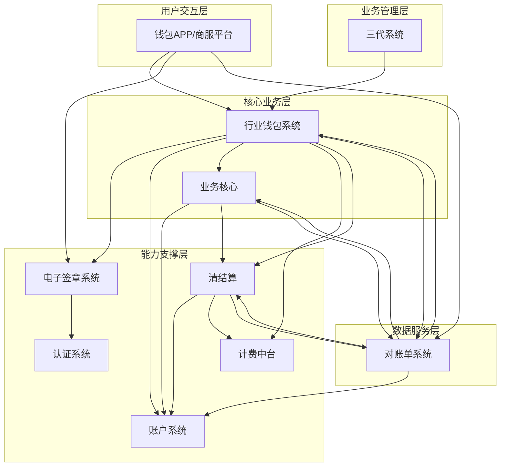
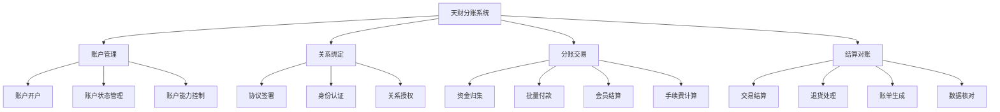
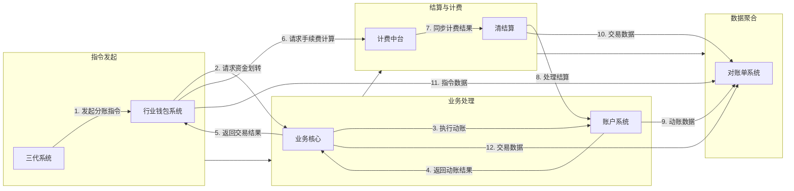
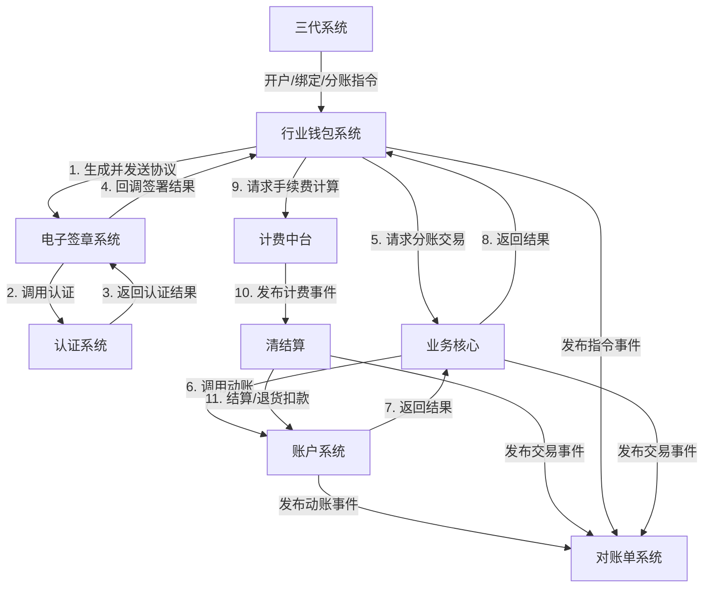

## 2.1 系统结构
本系统采用分层架构，以"三代系统"作为业务入口和管理中枢，通过"行业钱包系统"作为核心业务处理层，协调多个底层能力系统，共同完成天财分账业务。整体架构遵循职责分离原则，确保业务逻辑清晰、系统间解耦。

## 2.2 功能结构
系统功能围绕天财分账业务的核心流程展开，主要包括账户管理、关系绑定、分账交易、结算对账四大功能域。

## 2.3 网络拓扑图
TBD

## 2.4 数据流转
数据流转以"分账指令"和"资金动账"为核心，在三代系统、行业钱包系统、业务核心及账户系统之间传递，最终由对账单系统进行聚合。

## 2.5 系统模块交互关系
模块间交互主要通过同步API调用和异步事件驱动两种方式，核心业务流由行业钱包系统串联。

