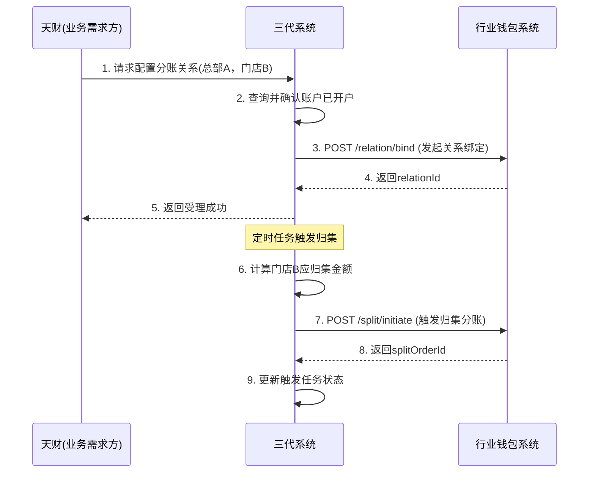

# 模块设计: 三代系统

生成时间: 2026-01-21 15:21:44
批判迭代: 1

---

# 模块设计: 三代系统

## 1. 概述
- **目的与范围**: 三代系统是拉卡拉的核心商户管理系统。在本业务场景中，其核心职责是作为天财业务需求的入口和管理中枢，负责商户信息管理、发起天财专用账户的开户指令、配置并同步门店分账比例、发起分账关系绑定指令、触发分账（归集、批量付款、会员结算）流程，以及发起开通付款流程。其边界在于业务指令的发起、配置管理和状态查询，不处理具体的账户操作、协议签署或资金转账。

## 2. 接口设计
- **API端点 (REST)**:
    - `POST /api/v1/tiancai/account/open`: 向行业钱包系统发起天财专用账户开户请求。
    - `POST /api/v1/tiancai/relation/bind`: 向行业钱包系统发起分账关系绑定请求。
    - `POST /api/v1/tiancai/split/trigger`: 触发分账处理（归集/批量付款/会员结算）。
    - `POST /api/v1/tiancai/payment/open`: 向行业钱包系统发起开通付款请求。
    - `GET /api/v1/tiancai/relation/status`: 查询分账关系绑定状态。
    - `GET /api/v1/tiancai/split/status`: 查询分账指令状态。
    - `POST /api/v1/tiancai/config/sync`: 同步门店分账配置至行业钱包系统。
- **请求/响应结构**:
    - 开户请求 (`POST /api/v1/tiancai/account/open`):
        - 请求体: `{"requestId": "请求流水号", "merchantId": "商户ID", "accountType": "RECEIVABLE/RECEIVER", "bizScene": "COLLECTION/BATCH_PAYMENT/MEMBER_SETTLEMENT"}`
        - 响应体: `{"code": "响应码", "message": "响应信息", "data": {"accountId": "账户ID"}}`
    - 关系绑定请求 (`POST /api/v1/tiancai/relation/bind`):
        - 请求体: `{"requestId": "请求流水号", "payerAccountId": "付方账户ID", "payeeAccountId": "收方账户ID", "relationType": "COLLECTION/BATCH_PAYMENT/MEMBER_SETTLEMENT"}`
        - 响应体: `{"code": "响应码", "message": "响应信息", "data": {"relationId": "关系ID", "agreementId": "协议ID"}}`
    - 分账触发请求 (`POST /api/v1/tiancai/split/trigger`):
        - 请求体: `{"requestId": "请求流水号", "scene": "COLLECTION/BATCH_PAYMENT/MEMBER_SETTLEMENT", "payerAccountId": "付方账户ID", "payeeAccountId": "收方账户ID", "amount": "金额", "bizOrderNo": "关联业务订单号"}`
        - 响应体: `{"code": "响应码", "message": "响应信息", "data": {"splitOrderId": "分账指令ID"}}`
    - 配置同步请求 (`POST /api/v1/tiancai/config/sync`):
        - 请求体: `{"configId": "配置ID", "headMerchantId": "总部商户ID", "storeMerchantId": "门店商户ID", "splitRatio": "分账比例", "status": "ACTIVE/INACTIVE"}`
        - 响应体: `{"code": "响应码", "message": "响应信息"}`
- **发布/消费的事件**:
    - **消费事件**: TBD
    - **发布事件**: TBD

## 3. 数据模型
- **表/集合**:
    1.  **商户信息表 (merchant)**: 存储总部和门店商户的基础信息。
    2.  **天财账户映射表 (tiancai_account_mapping)**: 存储商户与其天财专用账户的映射关系。
    3.  **分账触发任务表 (split_trigger_task)**: 存储待触发或已触发的分账任务。
- **关键字段**:
    - **商户信息表 (merchant)**:
        - `merchant_id` (主键): 商户ID。
        - `merchant_name`: 商户名称。
        - `merchant_type`: 商户类型 (`HEAD`/`STORE`)。
        - `status`: 商户状态。
    - **天财账户映射表 (tiancai_account_mapping)**:
        - `mapping_id` (主键): 映射ID。
        - `merchant_id`: 商户ID。
        - `account_id`: 天财专用账户ID。
        - `account_type`: 账户类型 (`RECEIVABLE`/`RECEIVER`)。
        - `biz_scene`: 适用业务场景 (`COLLECTION`/`BATCH_PAYMENT`/`MEMBER_SETTLEMENT`)。
    - **分账触发任务表 (split_trigger_task)**:
        - `task_id` (主键): 任务ID。
        - `scene`: 业务场景 (`COLLECTION`/`BATCH_PAYMENT`/`MEMBER_SETTLEMENT`)。
        - `payer_account_id`: 付方账户ID。
        - `payee_account_id`: 收方账户ID。
        - `amount`: 分账金额。
        - `trigger_mode`: 触发方式 (`MANUAL`/`SCHEDULED`)。
        - `status`: 任务状态 (`PENDING`/`PROCESSING`/`SUCCESS`/`FAILED`)。
        - `biz_order_no`: 关联业务订单号。
- **与其他模块的关系**:
    - `merchant` 表为账户系统提供商户信息。
    - `tiancai_account_mapping` 表通过 `account_id` 与账户系统的账户主表关联。
    - `split_trigger_task` 表通过 `biz_order_no` 可能与清结算等系统的业务订单关联。

## 4. 业务逻辑
- **核心工作流/算法**:
    1.  **账户开户与映射**:
        - 根据天财的业务需求（归集、批量付款、会员结算），识别总部或门店商户需要开立的天财专用账户类型（收款账户或接收方账户）。
        - 调用行业钱包系统的开户接口，传递商户信息和业务场景。
        - 接收开户成功响应后，在 `tiancai_account_mapping` 表中记录商户与账户ID的映射关系。
    2.  **分账配置管理**:
        - 为归集和会员结算场景配置门店与总部的分账比例。
        - 通过配置同步接口，将分账配置（`store_split_config`）同步至行业钱包系统，供其计算分账金额时使用。
    3.  **关系绑定触发**:
        - 根据业务场景（付方与收方），组装关系绑定请求（包含付方账户ID、收方账户ID、关系类型）。
        - 调用行业钱包系统的关系绑定接口，启动协议签署与认证流程。
        - 提供关系绑定状态查询功能，供业务方查看进度。
    4.  **分账流程触发**:
        - **归集**: 可基于定时任务（如T+1）或手动触发，根据门店分账配置，计算各门店应归集至总部的金额，并调用行业钱包系统的分账接口。
        - **批量付款**: 根据业务订单（如供应商付款单），手动触发从天财收款账户（总部）向天财接收方账户的付款。
        - **会员结算**: 根据会员消费结算规则，触发从天财收款账户（总部）向门店天财收款账户的分账。
        - 所有触发请求均记录在 `split_trigger_task` 表中，用于跟踪状态和实现幂等性。
    5.  **开通付款触发**:
        - 对于需要作为付方发起批量付款或会员结算的商户（如总部对公企业），调用行业钱包系统的开通付款接口，启动其自身的签约与认证流程。
- **业务规则与验证**:
    - 发起开户前，需校验商户状态正常且未开立过同类型的天财专用账户（针对同一业务场景）。
    - 触发分账前，需校验付方与收方账户已成功开户且映射关系存在。
    - 触发关系绑定时，需根据业务场景校验付方与收方角色的正确性（如归集场景付方必须是门店，收方必须是总部）。
    - 分账触发请求需携带唯一的 `requestId`，确保幂等性。
- **关键边界情况处理**:
    - 调用行业钱包系统接口超时或失败：实现重试机制，重试失败后标记任务失败并告警，支持人工重试。
    - 分账配置同步冲突：采用覆盖更新策略，确保行业钱包系统持有最新的配置。
    - 商户状态变更（如注销）：应禁止为该商户触发新的分账任务，并通知行业钱包系统。

## 5. 时序图

## 6. 错误处理
- **预期错误情况**:
    1.  依赖系统（行业钱包系统）服务不可用或响应超时。
    2.  商户信息不合法或状态异常。
    3.  账户映射关系不存在（尝试为未开户的商户触发分账）。
    4.  分账配置缺失或无效（如比例大于1）。
    5.  重复的请求流水号（`requestId`）。
- **处理策略**:
    - 对行业钱包系统接口调用设置熔断和重试机制，避免级联故障。
    - 业务校验失败立即返回错误，终止流程。
    - 实现基于 `requestId` 的幂等性校验，对重复请求返回已处理结果。
    - 记录所有指令下发日志和错误信息，便于与下游系统对账和问题排查。

## 7. 依赖关系
- **上游模块**:
    - **天财（业务需求方）**: 提供业务需求、配置信息及触发指令。
- **下游模块**:
    - **行业钱包系统 (强依赖)**: 接收本系统发起的开户、关系绑定、分账触发、开通付款等所有核心业务指令，是本模块功能的主要执行方。