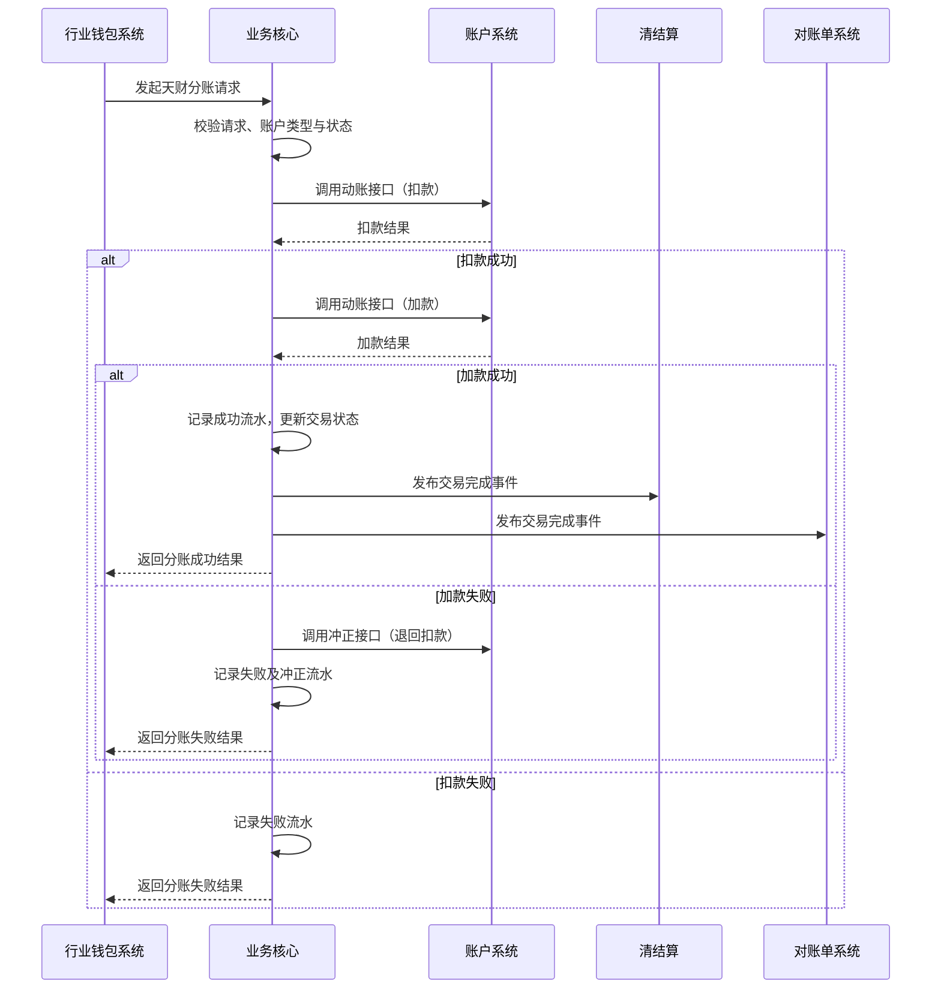

# 模块设计: 业务核心

生成时间: 2026-01-21 15:18:50
批判迭代: 2

---

# 业务核心模块设计文档

## 1. 概述
- **目的与范围**: 业务核心模块（亦称账务核心系统）的核心职责是接收并处理天财分账交易数据。它是天财分账业务中处理资金流转指令的核心引擎，负责将上游系统（如行业钱包系统）发起的转账请求转化为底层账户系统的动账操作，并确保交易数据的准确性与一致性。其边界在于处理"天财分账"这一特定交易类型，不涉及商户管理、开户、签约认证等前置流程。本模块依赖上游系统（如行业钱包系统）完成关系绑定、账户状态校验等前置条件，仅负责在已验证的合法关系基础上执行资金划转。

## 2. 接口设计
- **API端点 (REST/GraphQL)**: TBD
- **请求/响应结构**: TBD
- **发布/消费的事件**:
    - **消费事件**: TBD
    - **发布事件**: 处理完成天财分账交易后，需发布交易结果事件，供下游对账单系统、清结算系统订阅。事件载荷应包含交易流水号、交易状态、交易金额、付方账户、收方账户、交易时间等核心信息。

## 3. 数据模型
- **表/集合**: TBD
- **关键字段**: TBD
- **与其他模块的关系**: 本模块处理的数据与账户系统（动账记录）、对账单系统（交易账单）和清结算（底层交易数据）紧密关联。本模块产生的交易流水是清结算系统进行结算和对账的基础数据源之一，也是生成对账单的关键输入。

## 4. 业务逻辑
- **核心工作流/算法**: 接收天财分账交易请求（如归集、批量付款、会员结算），验证请求的合法性（如账户状态、余额），调用底层账户系统完成资金从付方账户到收方账户的划转，并记录交易流水。
- **业务规则与验证**:
    1.  **账户类型验证**: 验证付方账户与收方账户是否为有效的"天财专用账户"（即行业钱包账户）。
    2.  **账户状态验证**: 验证付方账户（如天财收款账户）与收方账户（如另一天财收款账户或天财接收方账户）的状态是否为"正常"，非冻结、非注销。
    3.  **余额验证**: 验证付方账户可用余额是否大于等于交易金额。
    4.  **交易金额验证**: 验证交易金额格式正确，且符合系统设定的单笔交易金额上下限。
- **关键边界情况处理**: 处理付方账户余额不足的情况；处理交易过程中账户状态发生变更的情况；处理与底层账户系统交互超时或失败后的冲正与对账。

## 5. 时序图

## 6. 错误处理
- **预期错误情况**:
    1.  **业务校验失败**: 付方账户余额不足；付方或收方账户状态异常（冻结、注销）；账户非天财专用账户类型；交易金额格式错误或超限。
    2.  **系统交互失败**: 与下游账户系统网络超时或服务不可用；账户系统返回处理失败。
- **处理策略**:
    1.  **错误码与描述**: 针对每种业务校验失败情况，定义明确的错误码和描述信息，在接口响应中返回。
    2.  **重试机制**: 对于与账户系统的网络超时或临时性失败，实施带退避策略的重试机制（如指数退避）。
    3.  **冲正与补偿**: 在"扣款成功，加款失败"的场景下，必须立即发起对扣款操作的冲正（退款），以确保资金一致性。冲正失败需记录明确异常，并触发人工干预流程。
    4.  **异常流水记录**: 所有失败及冲正操作均需记录详细的流水，包括错误码、错误信息、原始请求等，供后续对账与排查使用。

## 7. 依赖关系
- **上游模块**: 行业钱包系统（发起分账请求的主要上游）。
- **下游模块**:
    1.  **账户系统**: 执行具体的账户动账（扣款、加款、冲正）操作。
    2.  **清结算系统**: 接收交易完成事件，作为结算与对账的数据源。
    3.  **对账单系统**: 接收交易完成事件，用于生成机构维度的交易账单。