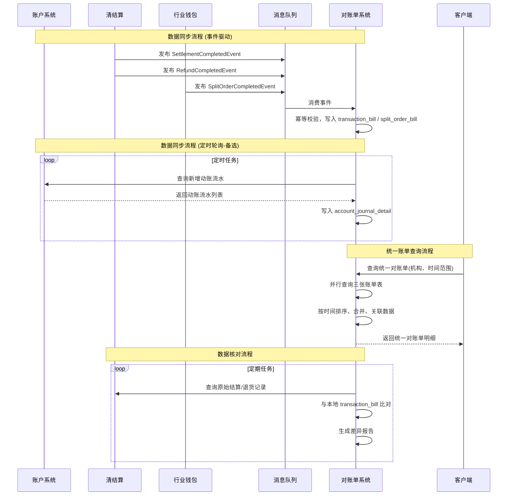

# 模块设计: 对账单系统

生成时间: 2026-01-21 15:22:44
批判迭代: 2

---

# 模块设计: 对账单系统

## 1. 概述
- **目的与范围**: 对账单系统负责生成和提供机构维度的各类账户动账明细、交易账单和分账指令账单。其核心职责是聚合来自账户系统、清结算系统和行业钱包系统等上游模块的动账、交易和分账数据，按机构、账户、时间等维度进行汇总与呈现，为对账和财务核算提供数据支持。其边界在于数据的聚合、查询与输出，不涉及原始交易数据的生成或资金流转处理。

## 2. 接口设计
- **API端点 (REST)**:
    - `GET /api/v1/statements/account-journal`: 查询账户动账明细账单。
    - `GET /api/v1/statements/transaction`: 查询交易账单（结算/退货）。
    - `GET /api/v1/statements/split-order`: 查询分账指令账单。
    - `POST /api/v1/statements/export`: 异步生成并导出对账单文件。
- **请求/响应结构**:
    - **账户动账明细查询请求**:
        - `institutionId` (String): 机构ID。
        - `accountId` (String，可选): 账户ID。
        - `startTime` (Timestamp): 查询开始时间。
        - `endTime` (Timestamp): 查询结束时间。
        - `transactionType` (String，可选): 交易类型。
        - `page` (Integer): 页码。
        - `size` (Integer): 每页大小。
    - **账户动账明细查询响应**:
        - `code` (String): 响应码。
        - `message` (String): 响应信息。
        - `data` (Page<AccountJournalDetailVO>): 分页数据。
            - `id` (String): 明细ID。
            - `institutionId` (String): 机构ID。
            - `accountId` (String): 账户ID。
            - `journalId` (String): 动账流水ID。
            - `transactionTime` (Timestamp): 交易时间。
            - `transactionType` (String): 交易类型。
            - `amount` (BigDecimal): 交易金额。
            - `balance` (BigDecimal): 账户余额。
            - `relatedBizOrderNo` (String): 关联业务订单号。
    - **交易账单查询请求**:
        - `institutionId` (String): 机构ID。
        - `merchantId` (String，可选): 商户ID。
        - `startTime` (Timestamp): 查询开始时间。
        - `endTime` (Timestamp): 查询结束时间。
        - `transactionType` (String，可选): 交易类型（结算/退货）。
        - `page` (Integer): 页码。
        - `size` (Integer): 每页大小。
    - **交易账单查询响应**:
        - `code` (String): 响应码。
        - `message` (String): 响应信息。
        - `data` (Page<TransactionBillVO>): 分页数据。
            - `id` (String): 账单ID。
            - `institutionId` (String): 机构ID。
            - `settlementId` (String，可选): 结算ID。
            - `refundId` (String，可选): 退货ID。
            - `merchantId` (String): 商户ID。
            - `transactionAmount` (BigDecimal): 交易金额。
            - `feeAmount` (BigDecimal): 手续费金额。
            - `transactionType` (String): 交易类型。
            - `status` (String): 交易状态。
            - `processedTime` (Timestamp): 处理时间。
    - **分账指令账单查询请求**:
        - `institutionId` (String): 机构ID。
        - `payerAccountId` (String，可选): 付方账户ID。
        - `payeeAccountId` (String，可选): 收方账户ID。
        - `startTime` (Timestamp): 查询开始时间。
        - `endTime` (Timestamp): 查询结束时间。
        - `scene` (String，可选): 业务场景。
        - `page` (Integer): 页码。
        - `size` (Integer): 每页大小。
    - **分账指令账单查询响应**:
        - `code` (String): 响应码。
        - `message` (String): 响应信息。
        - `data` (Page<SplitOrderBillVO>): 分页数据。
            - `id` (String): 账单ID。
            - `institutionId` (String): 机构ID。
            - `splitOrderId` (String): 分账指令ID。
            - `scene` (String): 业务场景。
            - `payerAccountId` (String): 付方账户ID。
            - `payeeAccountId` (String): 收方账户ID。
            - `splitAmount` (BigDecimal): 分账金额。
            - `fee` (BigDecimal): 手续费。
            - `status` (String): 分账状态。
            - `createdTime` (Timestamp): 创建时间。
    - **对账单导出请求**:
        - `institutionId` (String): 机构ID。
        - `billType` (String): 账单类型（ACCOUNT_JOURNAL/TRANSACTION/SPLIT_ORDER/UNIFIED）。
        - `startTime` (Timestamp): 开始时间。
        - `endTime` (Timestamp): 结束时间。
        - `format` (String): 文件格式（CSV/PDF）。
    - **对账单导出响应**:
        - `code` (String): 响应码。
        - `message` (String): 响应信息。
        - `data` (ExportTaskVO):
            - `taskId` (String): 导出任务ID。
            - `status` (String): 任务状态。
            - `fileUrl` (String，可选): 文件下载地址。
- **发布/消费的事件**:
    - **消费事件**:
        - `SettlementCompletedEvent` (来自清结算系统): 结算完成事件。
        - `RefundCompletedEvent` (来自清结算系统): 退货完成事件。
        - `SplitOrderCompletedEvent` (来自行业钱包系统): 分账指令完成事件。
        - `AccountJournalCreatedEvent` (待定，来自账户系统): 账户动账流水创建事件。
    - **发布事件**: TBD

## 3. 数据模型
- **表/集合**:
    1.  **账户动账明细表 (account_journal_detail)**: 聚合账户系统的动账流水，按机构维度组织。
    2.  **交易账单表 (transaction_bill)**: 聚合清结算系统的结算与退货交易数据。
    3.  **分账指令账单表 (split_order_bill)**: 聚合行业钱包系统的分账指令数据。
- **关键字段**:
    - **账户动账明细表 (account_journal_detail)**:
        - `id` (主键): 明细ID。
        - `institution_id`: 机构ID。
        - `account_id`: 账户ID。
        - `journal_id`: 动账流水ID。
        - `transaction_time`: 交易时间。
        - `transaction_type`: 交易类型。
        - `amount`: 交易金额。
        - `balance`: 账户余额。
        - `related_biz_order_no`: 关联业务订单号。
        - `created_at`: 记录创建时间。
        - `updated_at`: 记录更新时间。
    - **交易账单表 (transaction_bill)**:
        - `id` (主键): 账单ID。
        - `institution_id`: 机构ID。
        - `settlement_id`: 结算ID。
        - `refund_id`: 退货ID。
        - `merchant_id`: 商户ID。
        - `transaction_amount`: 交易金额。
        - `fee_amount`: 手续费金额。
        - `transaction_type`: 交易类型。
        - `status`: 交易状态。
        - `processed_time`: 处理时间。
        - `created_at`: 记录创建时间。
        - `updated_at`: 记录更新时间。
    - **分账指令账单表 (split_order_bill)**:
        - `id` (主键): 账单ID。
        - `institution_id`: 机构ID。
        - `split_order_id`: 分账指令ID。
        - `scene`: 业务场景。
        - `payer_account_id`: 付方账户ID。
        - `payee_account_id`: 收方账户ID。
        - `split_amount`: 分账金额。
        - `fee`: 手续费。
        - `status`: 分账状态。
        - `created_time`: 创建时间。
        - `created_at`: 记录创建时间。
        - `updated_at`: 记录更新时间。
- **与其他模块的关系**:
    - 通过 `journal_id` 与账户系统的动账流水表关联。
    - 通过 `settlement_id`/`refund_id` 与清结算系统的结算/退货交易表关联。
    - 通过 `split_order_id` 与行业钱包系统的分账指令表关联。

## 4. 业务逻辑
- **核心工作流/算法**:
    1.  **数据聚合流程（事件驱动为主）**:
        - 监听并消费来自上游系统的关键事件：`SettlementCompletedEvent`、`RefundCompletedEvent`、`SplitOrderCompletedEvent`。
        - 对于账户动账数据，由于账户系统设计未明确发布事件，采用定时轮询账户系统动账流水表作为备选方案，并建议上游补充 `AccountJournalCreatedEvent`。
        - 事件处理逻辑：
            a. 解析事件载荷，提取关键业务数据（如ID、金额、状态、时间）。
            b. 根据事件类型和业务主键（如 `settlement_id`、`split_order_id`）进行幂等性校验，防止重复处理。
            c. 将数据转换并写入本系统对应的账单表（`transaction_bill`、`split_order_bill`），补充机构维度信息。
            d. 记录处理日志。
    2.  **账单生成与查询流程**:
        - **单表查询**：提供针对 `account_journal_detail`、`transaction_bill`、`split_order_bill` 的独立查询接口，支持分页、筛选和时间范围查询。
        - **统一视图生成**：
            a. 当客户端请求统一资金视图时，系统并行查询上述三张表（在相同时间范围和机构维度下）。
            b. 将查询结果按 `transaction_time`/`processed_time`/`created_time` 进行时间排序和合并。
            c. 根据 `related_biz_order_no`、`settlement_id`、`split_order_id` 等字段，尝试建立跨表数据的关联关系，并在响应中标记关联线索。
            d. 返回合并后的时间线列表或生成汇总报告。
        - **异步文件导出**：对于大数据量请求，支持异步任务生成CSV或PDF文件，并提供任务状态查询和文件下载。
    3.  **数据核对流程**:
        - **内部一致性核对**：定期任务，检查本系统内关联数据的一致性（例如，一笔分账指令的金额是否与关联的动账流水总额匹配）。
        - **跨系统核对**：
            a. 定期通过API查询上游系统（清结算、行业钱包）的原始数据。
            b. 与本系统聚合的数据按业务主键进行比对，检查是否存在缺失、状态不一致或金额不符的记录。
            c. 生成差异报告，并触发告警通知运维人员。
        - 核对算法基于业务主键（如 `journal_id`、`settlement_id`、`split_order_id`）进行记录匹配。
- **业务规则与验证**:
    - 数据同步时校验关键字段非空，金额为正数，时间格式有效。
    - 所有事件消费必须实现幂等性，基于业务主键或事件ID去重。
    - 账单查询严格实施机构数据隔离，确保查询结果仅限于请求方所属机构。
    - 统一视图生成时，若关联数据缺失，需明确标注而非静默忽略。
- **关键边界情况处理**:
    - **上游事件重复消费**：通过事件ID或业务主键在入库前校验，重复则忽略。
    - **上游数据延迟**：设置延迟处理窗口，对于时间窗口内的查询，提示数据可能不完整。通过核对流程发现长期延迟并告警。
    - **账单查询数据量过大**：强制分页查询，限制单次查询时间范围。异步导出任务进行流式处理，避免内存溢出。
    - **依赖上游接口失败**：查询时若上游接口不可用，返回本系统已有数据并明确标注数据源状态。

## 5. 时序图

## 6. 错误处理
- **预期错误情况**:
    1.  消费事件时，数据格式错误或缺少关键字段。
    2.  写入数据库时发生异常（唯一键冲突、连接失败）。
    3.  查询账单时参数非法（如时间范围过大、机构ID为空）。
    4.  生成统一视图时，依赖的上游查询接口超时或失败。
    5.  异步导出任务因数据量过大处理超时。
- **处理策略**:
    - **事件数据错误**：记录错误事件详情至异常日志，丢弃该消息，并触发告警通知人工检查上游数据源。
    - **数据库异常**：进行有限次重试（如3次），重试失败后将事件消息转入死信队列，并记录告警。
    - **查询参数错误**：进行前置校验，返回明确的参数错误信息，拒绝执行查询。
    - **上游接口依赖失败**：对于统一视图查询，降级为仅返回本系统已聚合的数据，并在响应中说明数据不完整。记录接口调用失败日志。
    - **异步任务超时**：设置任务超时时间，超时后标记任务为失败，并通知任务发起者。

## 7. 依赖关系
- **上游模块**:
    - **清结算系统 (强依赖)**: 通过消费 `SettlementCompletedEvent` 和 `RefundCompletedEvent` 获取结算和退货交易数据。
    - **行业钱包系统 (强依赖)**: 通过消费 `SplitOrderCompletedEvent` 获取分账指令数据。
    - **账户系统 (强依赖)**: 通过定时轮询其动账流水表（或未来消费 `AccountJournalCreatedEvent`）获取账户动账明细数据。
- **下游模块**:
    - **天财/机构端 (强依赖)**: 作为账单的最终消费者，通过API或导出文件获取对账单进行财务对账。
    - **内部运营系统 (弱依赖)**: 可能消费账单数据进行运营分析。