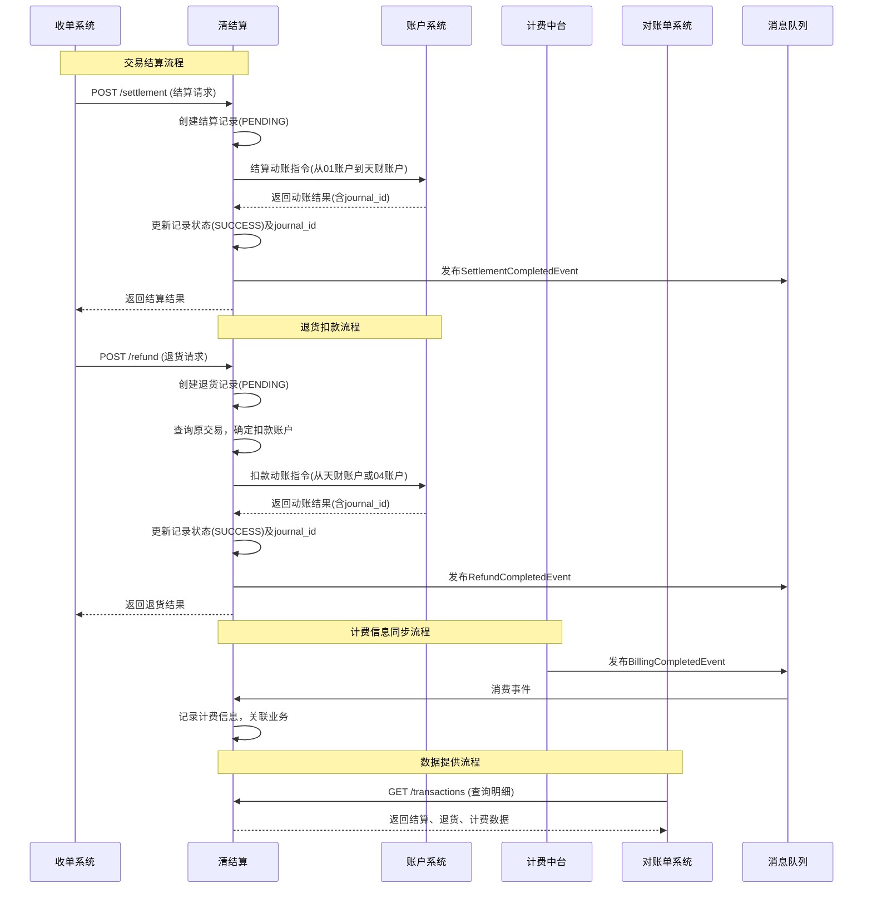

# 模块设计: 清结算

生成时间: 2026-01-21 15:20:07
批判迭代: 2

---

# 清结算模块设计文档

## 1. 概述
- **目的与范围**：清结算模块负责处理收单交易的资金结算、退货扣款、计费信息同步，并为对账单系统提供底层交易数据。其核心职责是执行与资金流动相关的动账指令，确保交易资金从待结算账户正确结算至商户收款账户，以及处理退货时的资金扣回。本模块不涉及账户的日常管理或分账业务逻辑，其边界止于向账户系统发起动账指令和向对账单系统提供数据。

## 2. 接口设计
- **API端点 (REST)**:
  - `POST /api/v1/settlement`: 触发并处理交易结算。
  - `POST /api/v1/refund`: 处理退货扣款请求。
  - `GET /api/v1/transactions`: 为对账单系统提供交易明细查询。
- **请求/响应结构**:
  - **结算请求 (SettlementRequest)**:
    - `orderId` (String): 收单订单号。
    - `merchantId` (String): 商户ID。
    - `settlementAmount` (BigDecimal): 结算金额。
    - `targetAccountNo` (String): 目标结算账户（如天财收款账户）。
    - `settlementMode` (Enum): 结算模式 (`ACTIVE`, `PASSIVE`)。
  - **结算响应 (SettlementResponse)**:
    - `code` (String): 响应码。
    - `message` (String): 响应信息。
    - `data` (SettlementResult):
      - `settlementId` (String): 结算交易ID。
      - `status` (Enum): 结算状态。
  - **退货请求 (RefundRequest)**:
    - `refundId` (String): 退货ID。
    - `originalOrderId` (String): 原交易订单号。
    - `refundAmount` (BigDecimal): 退货金额。
  - **退货响应 (RefundResponse)**:
    - `code` (String): 响应码。
    - `message` (String): 响应信息。
    - `data` (RefundResult):
      - `refundId` (String): 退货ID。
      - `status` (Enum): 退货状态。
      - `deductAccountNo` (String): 实际扣款账户。
- **发布/消费的事件**:
  - **消费事件**:
    - `BillingCompletedEvent` (来自计费中台)：包含交易流水号和手续费信息。
  - **发布事件**:
    - `SettlementCompletedEvent`: 结算完成时发布，包含结算ID、状态、金额。
    - `RefundCompletedEvent`: 退货完成时发布，包含退货ID、状态、扣款账户。

## 3. 数据模型
- **表/集合**:
  1.  **结算交易表 (settlement_transaction)**
  2.  **退货交易表 (refund_transaction)**
  3.  **计费同步记录表 (fee_sync_record)**
- **关键字段**:
  - **结算交易表**:
    - `id` (PK): 结算交易ID。
    - `order_id` (String): 关联收单订单号。
    - `merchant_id` (String): 商户ID。
    - `settlement_amount` (Decimal): 结算金额。
    - `target_account_no` (String): 目标结算账户（如天财收款账户）。
    - `status` (Enum): 结算状态 (`PENDING`, `SUCCESS`, `FAILED`)。
    - `settled_at` (Timestamp): 结算完成时间。
    - `account_journal_id` (String): 关联的账户动账流水ID（用于与账户系统对账）。
  - **退货交易表**:
    - `id` (PK): 退货ID。
    - `original_order_id` (String): 原交易订单号。
    - `refund_amount` (Decimal): 退货金额。
    - `deduct_account_no` (String): 扣款账户（天财收款账户或04退货账户）。
    - `status` (Enum): 退货状态 (`PENDING`, `SUCCESS`, `FAILED`)。
    - `processed_at` (Timestamp): 处理完成时间。
    - `account_journal_id` (String): 关联的账户动账流水ID。
  - **计费同步记录表**:
    - `id` (PK): 记录ID。
    - `transaction_id` (String): 关联交易流水号（来自计费中台事件）。
    - `fee_amount` (Decimal): 手续费金额。
    - `sync_status` (Enum): 同步状态 (`PENDING`, `SUCCESS`, `FAILED`)。
    - `synced_at` (Timestamp): 同步成功时间。
    - `related_business_id` (String): 关联的业务ID（结算ID或退货ID）。
    - `related_business_type` (Enum): 关联业务类型 (`SETTLEMENT`, `REFUND`)。
- **与其他模块的关系**:
  - 通过 `account_journal_id` 字段与账户系统的动账流水关联，确保数据一致性。
  - 计费同步记录表通过 `transaction_id` 关联计费中台发布的 `BillingCompletedEvent`。
  - 结算与退货表为对账单系统提供核心数据源。

## 4. 业务逻辑
- **核心工作流/算法**:
  1.  **交易结算流程**:
      - **触发方式**：支持事件驱动（监听收单交易完成事件）与API调用（收单系统主动发起）两种方式。
      - **执行步骤**：
          a. 接收结算请求，创建结算交易记录，状态为 `PENDING`。
          b. 向账户系统发起动账指令：从 `01待结算账户` 扣款，向指定的 `天财收款账户` 加款。
          c. 接收账户系统返回的动账结果及 `account_journal_id`。
          d. 更新本地结算记录状态为 `SUCCESS` 并记录 `account_journal_id`；若失败则更新为 `FAILED`。
          e. 发布 `SettlementCompletedEvent`。
  2.  **退货扣款流程**:
      - **触发方式**：通过API接收退货请求。
      - **执行步骤**：
          a. 接收退货请求，创建退货记录，状态为 `PENDING`。
          b. **确定扣款来源**：查询原交易信息。若原交易资金已结算至天财收款账户，则从该账户扣款；若未结算，则从 `04退货账户` 扣款。
          c. 向账户系统发起动账指令，从确定的扣款账户进行扣款。
          d. 接收账户系统返回的动账结果及 `account_journal_id`。
          e. 更新本地退货记录状态为 `SUCCESS` 并记录 `account_journal_id` 和实际扣款账户；若失败则更新为 `FAILED`。
          f. 发布 `RefundCompletedEvent`。
  3.  **计费信息同步流程**:
      - **流程性质**：被动消费事件。监听并消费计费中台发布的 `BillingCompletedEvent`。
      - **执行步骤**：
          a. 接收事件，解析出交易流水号和手续费金额。
          b. 根据交易流水号，查询本地的结算或退货记录（需业务系统在发起计费时传递关联关系）。
          c. 若找到关联业务记录，则创建计费同步记录，并更新关联业务的手续费信息。
          d. 更新同步状态为 `SUCCESS`。
  4.  **数据提供流程**:
      - 通过对账单系统的查询接口，提供结算、退货及关联计费的明细数据，支持按时间、商户等维度查询。
- **业务规则与验证**:
  - 结算时需校验目标账户（天财收款账户）的状态是否正常（通过账户系统或缓存信息）。
  - 退货前置流程需校验原交易是否存在，并根据原交易状态确定正确的扣款账户。
  - 处理计费同步事件时，需校验关联的交易流水号是否有效，并确保幂等性。
- **数据一致性机制**:
  - 关键动账操作（结算、退货）均在本地记录与账户系统返回的 `account_journal_id`，通过此ID可与账户系统的动账流水进行双向核对，确保两边数据一致。
- **关键边界情况处理**:
  - 结算时目标账户异常：挂起结算任务，记录错误，触发告警并等待人工处理。
  - 退货时扣款账户余额不足：退货失败，更新状态为 `FAILED`，并通知业务方。
  - 重复的计费同步事件：基于事件ID或交易流水号进行幂等处理，避免重复记录。
  - 账户系统动账超时或失败：实现基于本地事务状态的重试机制，并设置最大重试次数。

## 5. 时序图

## 6. 错误处理
- **预期错误情况**:
  - 账户系统动账失败（账户不存在、状态异常、余额不足、网络超时）。
  - 计费同步事件关联的交易不存在或无法关联。
  - 下游系统（如对账单系统）查询接口超时或异常。
  - 内部数据处理失败（如数据库异常、唯一键冲突）。
- **处理策略**:
  - **依赖系统失败（账户系统）**：记录详细错误日志，根据错误类型决定重试（如网络超时）或转人工处理（如账户状态异常）。关键动账操作需保证幂等性。
  - **无效计费事件**：记录异常日志并发出告警，便于排查数据不一致问题。
  - **下游查询异常**：提供查询结果缓存，在接口异常时返回缓存数据作为降级策略。
  - **内部系统错误**：进行事务回滚，记录错误日志并触发告警。

## 7. 依赖关系
- **上游模块**:
  - **账户系统 (强依赖)**: 执行所有资金结算、退货扣款的动账操作。
  - **计费中台 (强依赖)**: 消费其发布的 `BillingCompletedEvent`，以同步手续费信息。
  - **收单系统 (强依赖)**: 提供待结算的交易数据，并触发结算或退货流程。
- **下游模块**:
  - **对账单系统 (强依赖)**: 为本模块提供结算、退货及计费明细数据，是其核心数据源之一。
  - **消息中间件 (强依赖)**: 用于发布结算、退货完成事件，并消费计费事件。