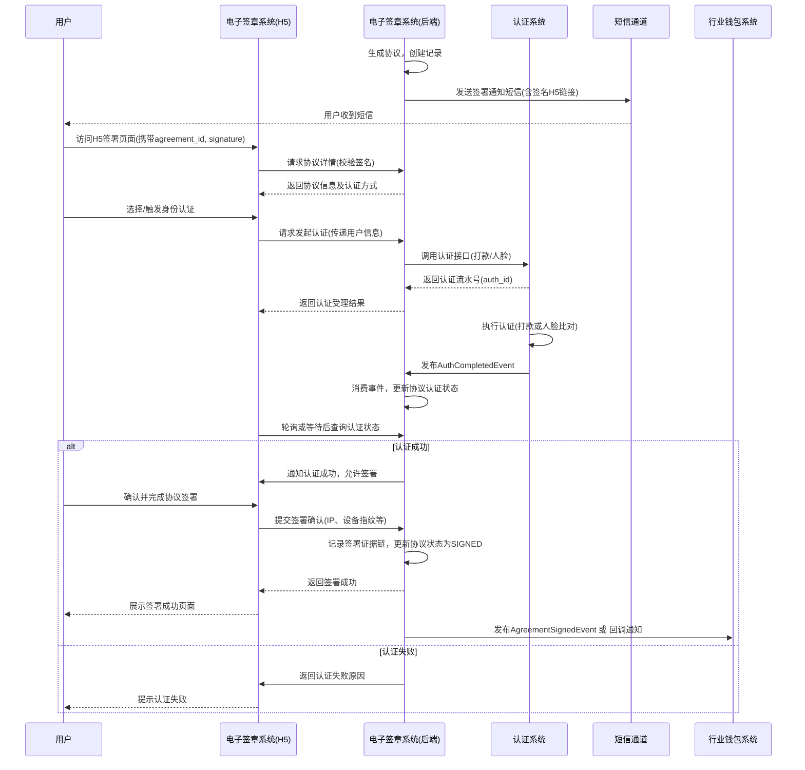

# 模块设计: 电子签章系统

生成时间: 2026-01-21 15:20:09
批判迭代: 2

---

# 模块设计: 电子签章系统

## 1. 概述
- **目的与范围**: 本模块的核心职责是为业务流程提供协议模板管理、短信推送、H5页面封装、打款验证、人脸验证及协议签署证据链留存的能力。它是关系绑定、开通付款等流程中完成法律授权关系建立的关键环节。其边界限定于协议签署流程的管理与执行，不涉及具体的账户操作或资金流转逻辑。

## 2. 接口设计
- **API端点 (REST)**:
    - `POST /api/v1/agreement/generate`: 生成待签署协议。
    - `GET /api/v1/agreement/{agreement_id}`: 查询协议详情。
    - `POST /api/v1/agreement/{agreement_id}/send-sms`: 发送签署通知短信。
    - `GET /api/v1/agreement/h5-page`: H5页面获取协议及认证信息接口。
    - `POST /api/v1/agreement/{agreement_id}/init-auth`: 发起身份认证。
    - `POST /api/v1/agreement/{agreement_id}/verify-auth`: 验证认证结果。
    - `POST /api/v1/agreement/{agreement_id}/sign`: 提交协议签署。
    - `POST /api/v1/agreement/notify/sign-result`: 接收业务系统签署结果通知（回调接口）。
- **请求/响应结构**:
    - 生成协议 (`POST /api/v1/agreement/generate`):
        - 请求体: `{"biz_scene": "RELATION_BIND/OPEN_PAYMENT", "template_id": "模板ID", "parties": [{"role": "PERSONAL/CORPORATE", "name": "姓名", "id_card_no": "身份证号", "mobile": "手机号", ...}]}`
        - 响应体: `{"agreement_id": "协议唯一ID", "status": "DRAFT"}`
    - 查询协议 (`GET /api/v1/agreement/{agreement_id}`):
        - 响应体: `{"agreement_id": "协议ID", "status": "状态", "content": "协议内容", "parties": "签约方信息", "auth_method": "认证方式"}`
    - 发送短信 (`POST /api/v1/agreement/{agreement_id}/send-sms`):
        - 响应体: `{"success": true, "sms_id": "短信发送流水号"}`
    - H5页面接口 (`GET /api/v1/agreement/h5-page`):
        - 请求参数: `agreement_id`, `signature` (链接签名)
        - 响应体: `{"agreement_id": "协议ID", "content": "协议内容", "auth_method": "PAYMENT/FACE"}`
    - 发起认证 (`POST /api/v1/agreement/{agreement_id}/init-auth`):
        - 请求体: `{"auth_type": "PAYMENT/FACE", "user_info": {"bank_card_no": "银行卡号", ...}}`
        - 响应体: `{"auth_id": "认证流水号", "status": "PROCESSING"}`
    - 验证认证 (`POST /api/v1/agreement/{agreement_id}/verify-auth`):
        - 请求体: `{"auth_id": "认证流水号", "verify_data": {"amount": "回填金额", "remark": "回填备注"}}`
        - 响应体: `{"success": true, "auth_status": "SUCCESS/FAILED"}`
    - 提交签署 (`POST /api/v1/agreement/{agreement_id}/sign`):
        - 请求体: `{"signer_id": "签约方标识", "sign_time": "签署时间戳", "client_ip": "客户端IP", "device_fingerprint": "设备指纹"}`
        - 响应体: `{"success": true, "sign_record_id": "签署记录ID"}`
- **发布/消费的事件**:
    - 消费事件: `AuthCompletedEvent` (认证完成事件)，用于在认证完成后更新协议签署状态。事件结构：`{"auth_id": "认证流水号", "auth_type": "认证类型", "status": "SUCCESS/FAILED", "timestamp": "时间戳"}`。消费逻辑：根据`auth_id`关联到对应的协议，更新协议的认证状态。
    - 发布事件: `AgreementSignedEvent` (协议签署完成事件)，包含协议ID、签署方、签署时间、签署结果。下游模块（如行业钱包系统）可消费此事件以触发后续流程。

## 3. 数据模型
- **表/集合**:
    - `agreement_template` (协议模板表): 存储协议模板。
    - `agreement` (协议主表): 存储生成的协议实例。
    - `sign_record` (签署记录表): 存储每次签署的证据链信息。
    - `sms_record` (短信发送记录表): 存储短信推送记录。
- **关键字段**:
    - `agreement_template`:
        - `template_id` (主键): 模板ID。
        - `biz_scene`: 适用业务场景 (`RELATION_BIND`, `OPEN_PAYMENT`)。
        - `party_role`: 适用签约方角色 (`PERSONAL`, `CORPORATE`)。
        - `content`: 协议模板内容（含变量占位符）。
        - `version`: 模板版本。
    - `agreement`:
        - `agreement_id` (主键): 协议唯一ID。
        - `template_id`: 使用的模板ID。
        - `biz_scene`: 业务场景。
        - `status`: 协议状态 (`DRAFT`, `SMS_SENT`, `AUTH_PENDING`, `AUTH_SUCCESS`, `AUTH_FAILED`, `SIGNED`, `EXPIRED`)。
        - `content`: 填充后的完整协议内容。
        - `parties`: JSON数组，存储签约方信息（角色、姓名、证件号、手机号等）。
        - `auth_method`: 要求的认证方式 (`PAYMENT`, `FACE`)。
        - `auth_id`: 关联的认证流水号。
        - `expire_at`: 协议签署过期时间。
        - `h5_link_signature`: H5页面链接签名。
    - `sign_record`:
        - `sign_record_id` (主键): 签署记录ID。
        - `agreement_id`: 关联的协议ID。
        - `signer_id`: 签约方标识。
        - `sign_time`: 签署时间。
        - `client_ip`: 客户端IP。
        - `device_fingerprint`: 设备指纹。
        - `evidence_chain`: JSON格式的完整证据链（包含协议内容、认证记录、签署行为日志等）。
    - `sms_record`:
        - `sms_id` (主键): 短信发送流水号。
        - `agreement_id`: 关联的协议ID。
        - `mobile`: 接收手机号。
        - `content`: 短信内容。
        - `status`: 发送状态 (`SENDING`, `SUCCESS`, `FAILED`)。
        - `retry_count`: 重试次数。
- **与其他模块的关系**: 本模块依赖认证系统提供的打款验证和人脸验证能力，用于支持协议签署流程中的身份认证环节。协议签署记录独立存储，供查询和审计。与行业钱包系统通过事件或API同步签署结果。

## 4. 业务逻辑
- **核心工作流/算法**:
    1. **协议模板管理**:
        - 根据业务场景（关系绑定、开通付款）和签约方角色（个人、企业）管理不同的协议模板。
        - 模板内容支持变量替换，变量来源于签约方信息及业务上下文。
    2. **协议签署流程（关系绑定/开通付款）**:
        - **步骤1: 协议生成与推送**。根据业务场景选择协议模板，填充签约方信息，生成待签署协议。通过短信推送包含H5页面链接的签署通知。H5链接需使用协议ID和过期时间生成数字签名(`h5_link_signature`)防止篡改。短信发送失败时，根据配置的重试策略（如最多3次）进行重试。
        - **步骤2: 身份认证**。用户在H5页面中，根据协议类型和签约方身份（个人/企业）选择打款验证或人脸验证方式进行身份认证。调用认证系统接口完成认证。个人签约方通常使用人脸验证，企业签约方通常使用打款验证（验证对公账户控制人）。认证结果通过消费`AuthCompletedEvent`事件进行异步更新。
        - **步骤3: 协议签署**。认证通过后，引导用户在H5页面完成协议签署（如点击确认、电子签名）。记录签署时间、IP、设备指纹等信息，形成完整的签署证据链。证据链包含协议内容、认证记录、签署行为日志、时间戳等，并做防篡改处理（如哈希链）。
        - **步骤4: 状态同步**。协议签署完成后，更新协议状态为`SIGNED`，并发布`AgreementSignedEvent`事件，或通过回调API通知相关业务系统（如行业钱包系统）签署结果。
- **业务规则与验证**:
    - 协议模板需根据业务类型和签约方角色进行管理。
    - 个人签约方通常使用人脸验证，企业签约方通常使用打款验证（验证对公账户控制人）。
    - 必须确保签署过程的完整证据链，包括认证记录、签署行为日志、时间戳等。
    - H5页面链接必须携带签名(`signature`)，服务端需校验签名有效性和过期时间。
    - 同一份协议，同一签约方只能签署一次。
- **关键边界情况处理**:
    - 认证失败：签署流程中断，返回具体失败原因给用户。协议状态更新为`AUTH_FAILED`。
    - 签署超时：设置协议签署有效期（如24小时），超时后链接失效，协议状态更新为`EXPIRED`，需重新发起。
    - 重复签署：校验签署记录表，对同一份协议和同一签约方，若已存在成功签署记录，则拒绝再次签署。
    - 短信发送失败：记录失败原因，并根据重试策略进行重试。多次重试失败后，标记为最终失败，需人工介入或通过其他渠道通知。

## 5. 时序图

### 5.1 协议签署（含认证）时序图

## 6. 错误处理
- **预期错误情况**:
    - 短信发送失败（通道异常、用户手机号无效）。
    - 认证系统服务不可用或认证失败。
    - H5页面会话超时或参数被篡改（签名无效）。
    - 协议模板不存在或数据填充错误。
    - 数据库访问异常。
    - 重复签署请求。
    - 协议已过期。
- **处理策略**:
    - 短信发送设置重试机制（如最多3次），并监控到达率。重试失败后记录日志并告警。
    - 对认证系统调用进行熔断和降级处理，友好提示用户"认证服务暂不可用，请稍后重试"。
    - H5页面链接携带签名(`h5_link_signature`)，服务端严格校验有效性及过期时间，防止篡改。
    - 定义标准化的错误码，通过H5页面或接口返回给前端。
        - `SIGN_1001`: 协议不存在
        - `SIGN_1002`: 协议已过期
        - `SIGN_1003`: H5链接签名无效
        - `SIGN_1004`: 重复签署
        - `SIGN_2001`: 短信发送失败
        - `SIGN_2002`: 认证发起失败
        - `SIGN_2003`: 认证未通过
        - `SIGN_3001`: 系统内部错误
    - 记录完整的协议操作日志（生成、推送、认证、签署），便于问题追踪和审计。

## 7. 依赖关系
- **上游模块**:
    - **认证系统**: 依赖其提供的打款验证和人脸验证能力，通过REST API集成。消费其发布的`AuthCompletedEvent`事件。
    - **短信通道**: 依赖其发送签署通知短信，通过API集成。
- **下游模块**:
    - **行业钱包系统**: 本模块在协议签署完成后，需要将签署结果同步给行业钱包系统，以触发后续的分账关系绑定或开通付款状态更新。集成方式为发布`AgreementSignedEvent`事件，或提供回调API (`POST /api/v1/agreement/notify/sign-result`) 供其调用。
- **非功能性需求**:
    - **安全性**: H5页面与后端通信使用HTTPS。协议内容、用户身份信息等敏感数据需加密存储。签署证据链需防篡改（如使用哈希链）。严格校验H5链接签名。
    - **可观测性**: 记录协议生成、推送、认证、签署全链路日志。监控签署成功率、各环节耗时、短信到达率、认证成功率等关键指标。
    - **可用性**: 目标可用性99.9%。H5页面需兼容主流移动端浏览器。核心服务需支持水平扩展。