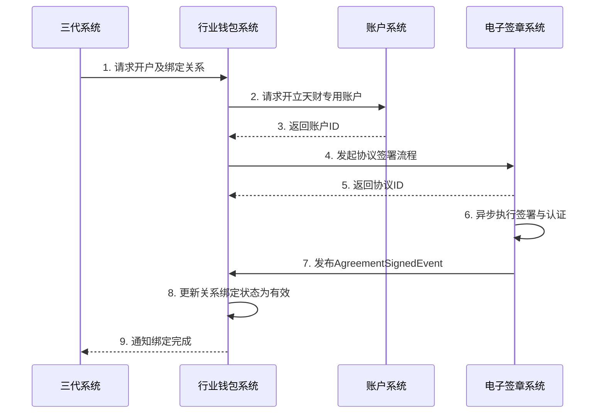
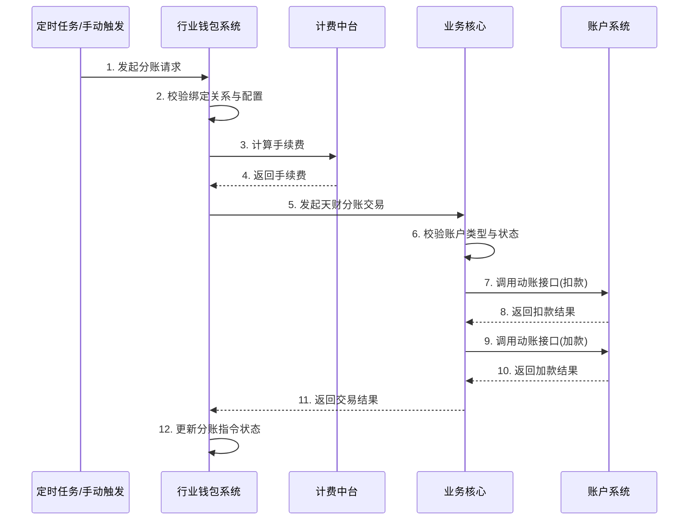
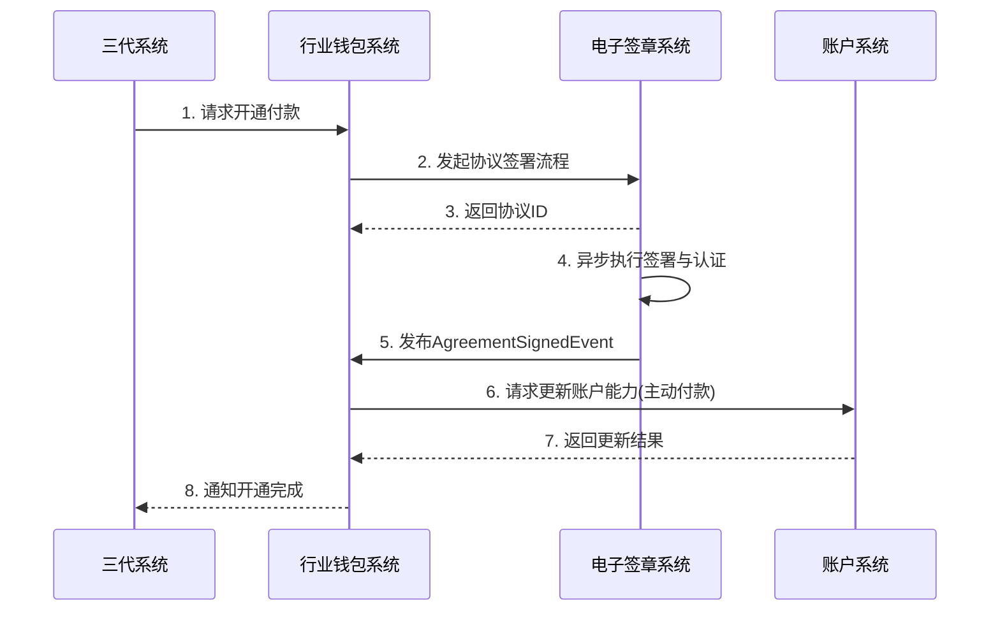

# 模块设计: 行业钱包系统

生成时间: 2026-01-21 15:21:15
批判迭代: 2

---

# 模块设计: 行业钱包系统

## 1. 概述
- **目的与范围**: 行业钱包系统是处理天财专用账户相关业务的核心系统。其核心职责包括：接收三代系统的指令，处理天财专用账户（收款账户/接收方账户）的开户请求；管理并校验分账关系绑定；处理归集、批量付款、会员结算等场景下的分账请求；与电子签章系统协同完成签约与认证流程；同步数据至清结算、对账单等下游系统。其边界在于处理天财专用账户的生命周期管理、分账业务逻辑及关系管理，不涉及底层账户动账操作（由账户系统执行）和具体的协议签署执行（由电子签章系统执行）。

## 2. 接口设计
- **API端点 (REST)**:
    - `POST /api/v1/account/open`: 接收三代系统指令，开立天财专用账户。
    - `POST /api/v1/relation/bind`: 接收三代系统指令，发起分账关系绑定流程。
    - `POST /api/v1/split/initiate`: 发起分账处理（归集/批量付款/会员结算）。
    - `POST /api/v1/payment/open`: 发起开通付款流程。
    - `GET /api/v1/relation/{relationId}`: 查询分账关系绑定状态。
    - `GET /api/v1/split/{orderId}`: 查询分账指令状态。
    - `POST /api/v1/callback/agreement-sign`: 接收电子签章系统回调，处理协议签署结果。
- **请求/响应结构**:
    - 开户请求 (`POST /api/v1/account/open`):
        - 请求体: `{"requestId": "请求流水号", "merchantId": "商户ID", "accountType": "RECEIVABLE/RECEIVER", "bizScene": "COLLECTION/BATCH_PAYMENT/MEMBER_SETTLEMENT"}`
        - 响应体: `{"code": "响应码", "message": "响应信息", "data": {"accountId": "账户ID"}}`
    - 关系绑定请求 (`POST /api/v1/relation/bind`):
        - 请求体: `{"requestId": "请求流水号", "payerAccountId": "付方账户ID", "payeeAccountId": "收方账户ID", "relationType": "COLLECTION/BATCH_PAYMENT/MEMBER_SETTLEMENT"}`
        - 响应体: `{"code": "响应码", "message": "响应信息", "data": {"relationId": "关系ID", "agreementId": "协议ID"}}`
    - 分账请求 (`POST /api/v1/split/initiate`):
        - 请求体: `{"requestId": "请求流水号", "scene": "COLLECTION/BATCH_PAYMENT/MEMBER_SETTLEMENT", "payerAccountId": "付方账户ID", "payeeAccountId": "收方账户ID", "amount": "金额", "bizOrderNo": "关联业务订单号"}`
        - 响应体: `{"code": "响应码", "message": "响应信息", "data": {"splitOrderId": "分账指令ID"}}`
    - 开通付款请求 (`POST /api/v1/payment/open`):
        - 请求体: `{"requestId": "请求流水号", "payerAccountId": "付方账户ID", "bizScene": "BATCH_PAYMENT/MEMBER_SETTLEMENT"}`
        - 响应体: `{"code": "响应码", "message": "响应信息", "data": {"agreementId": "协议ID"}}`
- **发布/消费的事件**:
    - **消费事件**:
        - `AgreementSignedEvent`: 消费来自电子签章系统的协议签署完成事件，用于更新分账关系绑定状态或开通付款状态。
    - **发布事件**:
        - `SplitOrderCreatedEvent`: 分账指令创建事件，包含指令ID、业务场景、金额、账户信息。
        - `SplitOrderCompletedEvent`: 分账指令完成事件，包含指令ID、最终状态（成功/失败）、交易结果信息。

## 3. 数据模型
- **表/集合**:
    1.  **天财账户关系表 (tiancai_account_relation)**: 存储天财专用账户之间的授权关系。
    2.  **分账指令表 (split_order)**: 存储发起的各类分账指令（归集、批量付款、会员结算）。
    3.  **门店分账配置表 (store_split_config)**: 存储门店与总部之间的分账比例等配置（由三代系统同步）。
- **关键字段**:
    - **天财账户关系表 (tiancai_account_relation)**:
        - `relation_id` (主键): 关系ID。
        - `payer_account_id`: 付方账户ID。
        - `payee_account_id`: 收方账户ID。
        - `relation_type`: 关系类型 (`COLLECTION`/`BATCH_PAYMENT`/`MEMBER_SETTLEMENT`)。
        - `agreement_id`: 协议ID。
        - `auth_status`: 认证状态 (`PENDING`/`SUCCESS`/`FAILED`)。
        - `bind_status`: 绑定状态 (`INIT`/`ACTIVE`/`INACTIVE`/`EXPIRED`)。
        - `effective_time`: 生效时间。
        - `expire_time`: 失效时间。
    - **分账指令表 (split_order)**:
        - `split_order_id` (主键): 指令ID。
        - `scene`: 业务场景 (`COLLECTION`/`BATCH_PAYMENT`/`MEMBER_SETTLEMENT`)。
        - `payer_account_id`: 付方账户ID。
        - `payee_account_id`: 收方账户ID。
        - `amount`: 交易金额。
        - `fee`: 手续费。
        - `status`: 状态 (`INIT`/`PROCESSING`/`SUCCESS`/`FAILED`)。
        - `created_time`: 创建时间。
        - `completed_time`: 完成时间。
        - `biz_order_no`: 关联业务订单号。
        - `config_id`: 关联的门店分账配置ID。
    - **门店分账配置表 (store_split_config)**:
        - `config_id` (主键): 配置ID。
        - `head_merchant_id`: 总部商户ID。
        - `store_merchant_id`: 门店商户ID。
        - `split_ratio`: 分账比例。
        - `status`: 状态 (`ACTIVE`/`INACTIVE`)。
- **与其他模块的关系**:
    - 通过 `payer_account_id`/`payee_account_id` 与账户系统的账户主表关联。
    - 通过 `agreement_id` 与电子签章系统的协议主表关联。
    - `split_order` 表为对账单系统提供分账指令账单数据。
    - `store_split_config` 表的数据由三代系统同步。

## 4. 业务逻辑
- **核心工作流/算法**:
    1.  **开户与关系绑定**:
        - 接收三代系统的开户及绑定指令。
        - 调用账户系统开立天财专用账户。
        - 调用电子签章系统，发起针对付方（门店/总部）与收方（总部/接收方）的协议签署流程。
        - 监听 `AgreementSignedEvent` 事件或接收回调，协议签署完成后，在 `tiancai_account_relation` 表中创建或激活对应的绑定关系（`bind_status` 更新为 `ACTIVE`）。
    2.  **分账处理（归集/批量付款/会员结算）**:
        - 接收分账请求（可能来自定时任务或手动触发）。
        - 根据 `payer_account_id` 和 `payee_account_id` 查询 `tiancai_account_relation` 表，校验是否存在有效（`bind_status='ACTIVE'`）且已认证（`auth_status='SUCCESS'`）的绑定关系。
        - 根据业务场景和 `store_merchant_id` 查询 `store_split_config` 表，获取分账比例配置，用于计算实际分账金额（如适用）。
        - 调用计费中台计算转账手续费。
        - 组装分账交易数据，通过同步API调用业务核心系统执行转账。
        - 业务核心系统处理完成后，更新 `split_order` 表状态，并发布 `SplitOrderCompletedEvent` 事件。
        - 实现基于 `requestId` 的幂等性处理，防止重复分账。
    3.  **开通付款处理**:
        - 针对批量付款和会员结算场景下的付方（如总部对公企业），单独发起开通付款流程。
        - 调用电子签章系统完成付方自身的签约与认证（通常为打款验证）。
        - 认证通过后（通过事件或回调），在账户系统标记该付方账户具备"主动付款"能力（此能力标记存储在账户系统）。
- **业务规则与验证**:
    - 执行分账前，必须校验付方与收方账户在 `tiancai_account_relation` 表中已绑定且状态为 `ACTIVE`，认证状态为 `SUCCESS`。
    - 归集场景：付方为门店天财收款账户，收方为总部天财收款账户。
    - 批量付款场景：付方为总部天财收款账户，收方为天财接收方账户。
    - 会员结算场景：付方为总部天财收款账户，收方为门店天财收款账户。
    - 需校验付方账户状态正常，且具备出金权限（通过调用账户系统或缓存信息）。
    - 分账金额计算：对于归集和会员结算，若存在 `store_split_config` 配置，则按配置比例计算。
- **关键边界情况处理**:
    - 关系绑定过程中认证失败：流程终止，需重新发起。`tiancai_account_relation` 表记录失败状态。
    - 分账时账户关系已失效：拒绝交易，提示需重新绑定。
    - 调用业务核心转账失败：根据业务核心返回的结果（如冲正成功）更新分账指令为失败状态，并记录失败原因。
    - 与电子签章系统交互超时：设置合理超时与重试机制，重试失败后标记流程异常，需人工介入。
    - 分账请求幂等性：通过 `requestId` 保证同一请求只处理一次，避免重复资金划转。

## 5. 时序图

### 5.1 开户与关系绑定时序图

### 5.2 分账处理时序图

### 5.3 开通付款处理时序图

## 6. 错误处理
- **预期错误情况**:
    1.  依赖系统服务不可用（账户系统、电子签章系统、业务核心、计费中台）。
    2.  开户请求中商户信息不合法。
    3.  绑定关系校验失败（关系不存在、未认证、已失效）。
    4.  分账金额计算或校验失败（如配置缺失、比例错误）。
    5.  协议签署流程超时或用户取消。
    6.  分账请求重复（幂等性校验）。
    7.  账户余额不足或状态异常。
- **处理策略**:
    - 对依赖系统调用设置熔断、降级和重试机制（如对临时性网络错误进行指数退避重试）。
    - 业务校验失败立即返回明确错误信息，终止流程。
    - 异步流程（如协议签署）超时后，提供查询接口，并支持人工干预重新发起。
    - 实现基于 `requestId` 的幂等性，对重复请求返回已处理结果。
    - 在分账流程中，若业务核心返回扣款成功但加款失败，依赖业务核心的冲正机制保证资金一致性；本系统记录最终失败状态。
    - 记录所有关键操作日志和错误信息，便于问题追踪和对账。

## 7. 依赖关系
- **上游模块**:
    - **三代系统**: 提供商户信息、发起开户、关系绑定、分账配置及分账触发指令。
    - **电子签章系统**: 提供协议签署与身份认证能力。通过消费 `AgreementSignedEvent` 事件或回调API接收结果。
- **下游模块**:
    - **账户系统**: 执行天财专用账户的开户与账户能力更新操作。
    - **业务核心**: 通过同步API调用，执行天财分账交易。
    - **计费中台**: 通过同步API调用，计算分账交易手续费。
    - **清结算系统**: 通过事件同步分账交易及计费信息，用于结算。
    - **对账单系统**: 通过事件提供分账指令数据，用于生成账单。