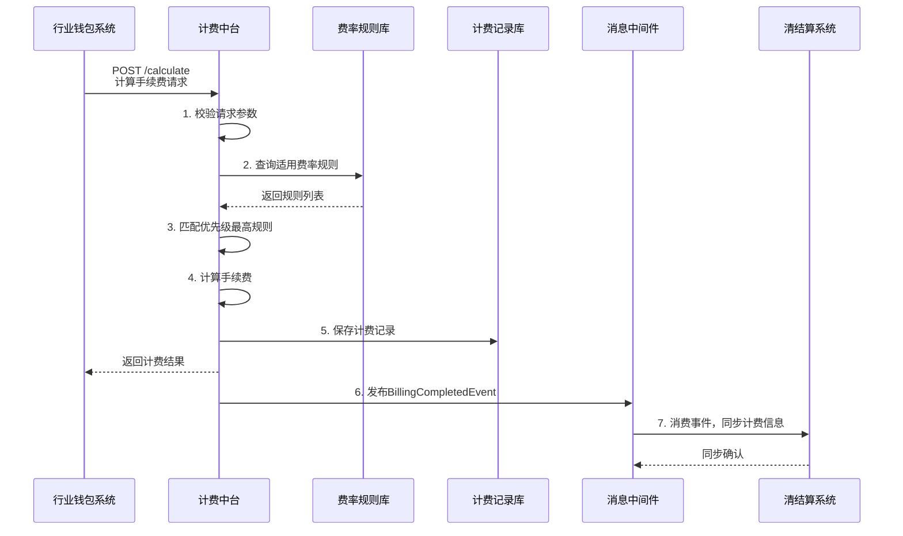

# 模块设计: 计费中台

生成时间: 2026-01-21 15:18:58
批判迭代: 2

---

# 计费中台模块设计文档

## 1. 概述
- **目的与范围**: 本模块是"计费中台"系统角色的具体实现，为"天财分账"（转账）业务提供统一的转账手续费计算能力。其边界限定于接收来自"行业钱包系统"的计费请求，根据"三代"系统配置的费率规则计算费用，并将计费结果同步给"清结算"系统。本模块不涉及费用的实际扣收或账户余额管理，是"行业钱包系统"的一个核心子模块。
- **与术语表的一致性澄清**: 根据术语表，"计费中台"是一个系统角色。本设计文档描述的是实现该系统角色的具体模块。该模块服务于"行业钱包系统"，是其内部处理计费逻辑的组成部分。上游调用方为"行业钱包系统"，下游数据同步对象为"清结算"系统。

## 2. 接口设计
- **API端点 (REST)**:
  - `POST /api/v1/billing/calculate`: 计算转账手续费。
- **请求/响应结构**:
  - **请求体 (CalculateFeeRequest)**:
    - `transactionId` (String): 交易流水号，用于幂等。
    - `scene` (Enum): 业务场景，枚举值：`COLLECTION`(归集)、`BATCH_PAYMENT`(批量付款)、`MEMBER_SETTLEMENT`(会员结算)。
    - `payerAccountNo` (String): 付款方账户号（天财收款账户）。
    - `payeeAccountNo` (String): 收款方账户号（天财收款账户或天财接收方账户）。
    - `amount` (BigDecimal): 转账金额。
  - **响应体 (CalculateFeeResponse)**:
    - `code` (String): 响应码。
    - `message` (String): 响应信息。
    - `data` (FeeDetail): 计费详情。
      - `transactionId` (String): 交易流水号。
      - `fee` (BigDecimal): 计算出的手续费。
      - `currency` (String): 币种，默认CNY。
      - `ruleId` (String): 匹配到的费率规则ID。
- **发布/消费的事件**:
  - **发布事件**: `BillingCompletedEvent`
    - `eventId` (String): 事件ID。
    - `transactionId` (String): 交易流水号。
    - `fee` (BigDecimal): 手续费金额。
    - `status` (Enum): 计费状态 (`SUCCESS`, `FAILED`)。
    - `calculatedAt` (Timestamp): 计费完成时间。

## 3. 数据模型
- **表/集合**:
  - **fee_rules (费率规则表)**: 存储由"三代"系统配置的计费规则。
    - `id` (PK): 规则ID。
    - `scene` (Enum): 适用业务场景。
    - `payer_account_type` (String): 付款方账户类型（如：天财收款账户-对公）。
    - `payee_account_type` (String): 收款方账户类型（如：天财接收方账户-个人）。
    - `calc_mode` (Enum): 计算模式 (`PERCENTAGE`比例, `FIXED`固定)。
    - `rate` (Decimal): 费率（当为比例时）或固定金额（当为固定时）。
    - `min_amount` (Decimal): 适用交易金额下限。
    - `max_amount` (Decimal): 适用交易金额上限。
    - `priority` (Integer): 规则优先级（数字越小优先级越高）。
    - `status` (Enum): 规则状态 (`ACTIVE`, `INACTIVE`)。
    - `created_by` (String): 创建者（三代操作员）。
    - `created_at` (Timestamp): 创建时间。
  - **billing_records (计费记录表)**: 记录每次计费请求和结果，用于对账与同步。
    - `id` (PK): 记录ID。
    - `transaction_id` (UK): 交易流水号。
    - `request_data` (JSON): 完整的计费请求数据。
    - `matched_rule_id` (String): 匹配的规则ID。
    - `calculated_fee` (Decimal): 计算出的手续费。
    - `sync_status` (Enum): 同步至清结算的状态 (`PENDING`, `SUCCESS`, `FAILED`)。
    - `sync_retry_count` (Integer): 同步重试次数。
    - `calculated_at` (Timestamp): 计费时间。
    - `synced_at` (Timestamp): 同步成功时间。
- **与其他模块的关系**:
  - **fee_rules** 表的数据由 **三代系统** 进行配置和管理。
  - **billing_records** 表的计费结果需要同步给 **清结算** 系统。

## 4. 业务逻辑
- **核心工作流/算法**:
  1. **接收请求**: 接收来自"行业钱包系统"的计费请求。
  2. **参数校验**: 校验请求参数完整性、交易金额有效性（>0）等。
  3. **查询费率规则**:
     - 根据请求中的 `scene`（场景）、`payerAccountNo` 和 `payeeAccountNo`（需查询账户系统或本地缓存获取账户类型）、`amount`（金额范围），从 `fee_rules` 表中查询 `status = 'ACTIVE'` 的规则。
     - 规则匹配逻辑：筛选出场景、付款方类型、收款方类型匹配，且交易金额在 `min_amount` 和 `max_amount` 范围内的所有规则。
     - 冲突解决：在匹配的规则中，选择 `priority` 值最高（数字最小）的一条规则。如果优先级相同，则选择创建时间最新的一条。
  4. **计算手续费**:
     - 如果匹配到规则：根据规则的 `calc_mode` 和 `rate` 计算手续费。比例计算：`fee = amount * rate`。固定金额：`fee = rate`。
     - 如果未匹配到任何有效规则：返回错误"费率规则未配置"。
  5. **持久化记录**: 将计费请求、匹配的规则ID、计算结果持久化到 `billing_records` 表，初始 `sync_status` 为 `PENDING`。
  6. **返回结果**: 将计费结果返回给"行业钱包系统"。
  7. **异步同步**: 异步触发 `BillingCompletedEvent` 事件，由监听器负责将计费结果同步至"清结算"系统。
- **业务规则与验证**:
  - 验证计费请求的合法性，包括必填字段、交易金额为正数、账户号格式等。
  - 验证付款方和收款方账户是否均为有效的"天财专用账户"。
- **关键边界情况处理**:
  - **费率规则未配置**: 返回明确错误，阻止交易继续进行。
  - **计费金额为零或为负**: 在参数校验阶段拦截，返回参数错误。
  - **请求参数缺失**: 在参数校验阶段拦截，返回参数错误。
  - **同步清结算失败**: 基于 `billing_records` 表中的 `sync_status` 和 `sync_retry_count` 进行重试，超过最大重试次数后告警，由人工介入处理。

## 5. 时序图

## 6. 错误处理
- **预期错误情况**:
  1. **客户端错误**: 请求参数无效、交易金额非正、账户不存在。
  2. **业务错误**: 费率规则未配置、无匹配的费率规则。
  3. **系统错误**: 数据库访问异常、消息队列异常、内部计算错误。
  4. **依赖服务错误**: "清结算"系统同步接口暂时不可用。
- **处理策略**:
  - **参数与业务错误**: 在请求处理早期进行校验，返回明确的业务错误码和提示信息，不进行重试。
  - **系统与依赖错误**:
    - 数据库/内部错误：记录错误日志，向上游返回系统错误，触发告警。
    - 同步"清结算"失败：利用 `billing_records` 表记录状态，由后台任务进行有限次数的重试（如3次），重试间隔递增。超过重试次数后，标记为失败并发出运维告警。
  - **幂等性**: 通过 `transactionId` 保证针对同一笔交易的计费请求只处理一次，避免重复计费。

## 7. 依赖关系
- **上游模块/系统**:
  - **行业钱包系统 (强依赖)**: 本模块的直接调用方，发起计费请求。本模块是"行业钱包系统"的一个组成部分。
  - **三代系统 (强依赖)**: 提供费率规则的配置与管理，是规则数据的源头。
  - **账户系统 (弱依赖，通过钱包系统间接依赖)**: 用于获取账户类型信息以匹配规则（信息可由钱包系统在请求中携带或本模块缓存）。
- **下游模块/系统**:
  - **清结算系统 (强依赖)**: 计费结果的消费者。本模块通过异步事件将计费结果同步至该系统，是其计费数据的提供方。
  - **消息中间件 (强依赖)**: 用于实现与"清结算"系统的异步解耦通信。