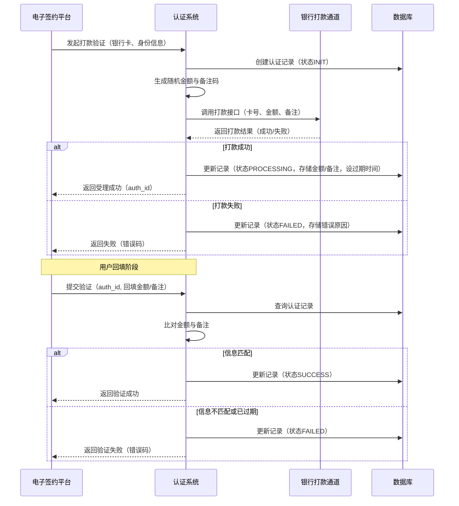
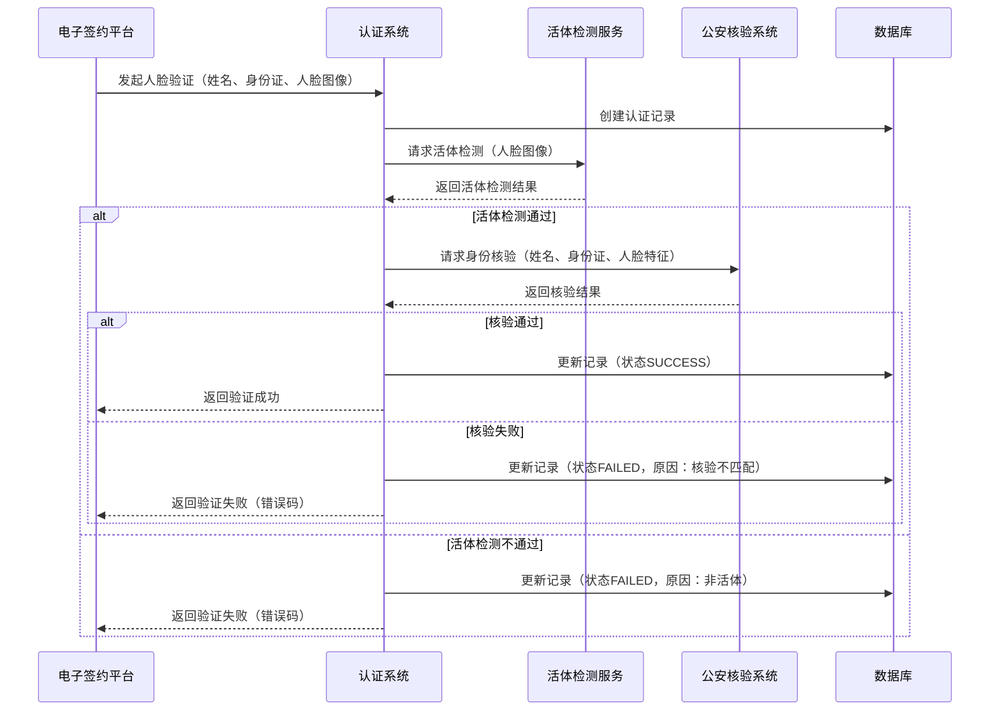

# 模块设计: 认证系统

生成时间: 2026-01-21 15:18:58
批判迭代: 2

---

# 认证系统模块设计文档

## 1. 概述
- **目的与范围**: 本模块的核心职责是为业务流程提供标准化的身份认证能力，具体包括打款验证和人脸验证（活体检测+身份核验）。它是关系绑定、开通付款等流程中验证付方与收方授权关系的关键环节。其边界限定于提供标准化的认证服务接口，不涉及具体的业务协议签署或资金流转逻辑。

## 2. 接口设计
- **API端点 (REST)**:
    - `POST /api/v1/auth/payment`: 发起打款验证请求。
    - `POST /api/v1/auth/payment/verify`: 验证用户回填的打款信息。
    - `POST /api/v1/auth/face`: 发起人脸验证请求。
    - `GET /api/v1/auth/record/{auth_id}`: 查询认证记录。
- **请求/响应结构**:
    - 打款验证请求 (`POST /api/v1/auth/payment`):
        - 请求体: `{"bank_card_no": "银行卡号", "bank_name": "银行名称", "user_name": "姓名", "id_card_no": "身份证号"}`
        - 响应体: `{"auth_id": "认证流水号", "status": "PROCESSING"}`
    - 打款验证提交 (`POST /api/v1/auth/payment/verify`):
        - 请求体: `{"auth_id": "认证流水号", "amount": "回填金额", "remark": "回填备注"}`
        - 响应体: `{"auth_id": "认证流水号", "status": "SUCCESS/FAILED", "error_code": "错误码"}`
    - 人脸验证请求 (`POST /api/v1/auth/face`):
        - 请求体: `{"name": "姓名", "id_card_no": "身份证号", "face_image": "Base64编码的人脸图片/视频帧"}`
        - 响应体: `{"auth_id": "认证流水号", "status": "SUCCESS/FAILED", "error_code": "错误码"}`
- **发布/消费的事件**:
    - 发布事件: `AuthCompletedEvent` (认证完成事件)，包含认证ID、类型、结果、时间戳。
    - 消费事件: TBD (暂无上游模块发出的需本模块处理的事件)。
- **与上游模块集成方式**: 与银行打款通道通过银行提供的标准支付/代付API集成，需配置商户号、密钥等认证信息。与公安核验系统通过其提供的标准身份信息核验API集成，需配置机构代码、签名密钥等。

## 3. 数据模型
- **表/集合**: `auth_record` (认证记录表)
- **关键字段**:
    - `auth_id` (主键): 认证流水号，全局唯一。
    - `auth_type`: 认证类型 (`PAYMENT` / `FACE`)。
    - `status`: 认证状态 (`INIT`, `PROCESSING`, `SUCCESS`, `FAILED`, `EXPIRED`)。
    - `request_data`: JSON格式的原始请求数据（存储用户提交的银行卡、身份信息等，敏感信息脱敏）。
    - `verify_data`: JSON格式的验证过程数据（如打款金额、备注、人脸核验流水号等）。
    - `result_data`: JSON格式的认证结果数据（如核验结果、失败原因等）。
    - `channel_info`: JSON格式的通道信息（如使用的打款通道、公安核验接口标识）。
    - `created_at`: 创建时间。
    - `updated_at`: 更新时间。
    - `expired_at`: 过期时间（针对打款验证）。
- **与其他模块的关系**: 本模块为电子签约平台提供打款验证和人脸验证能力，用于支持其协议签署流程中的身份认证环节。认证记录表独立存储，供查询和审计。

## 4. 业务逻辑
- **核心工作流/算法**:
    1. **打款验证流程**:
        - **步骤1: 发起验证**。接收目标银行卡、姓名、身份证号。生成唯一`auth_id`并落库，状态为`INIT`。
        - **步骤2: 生成并执行打款**。调用随机金额生成器（生成0.01元至1.00元之间的随机金额，精确到分）。根据配置的打款通道（如银行代付接口）发起打款请求，记录打款流水号。更新记录状态为`PROCESSING`，并设置过期时间（如24小时）。
        - **步骤3: 验证回填信息**。接收用户回填的金额和备注。与数据库中存储的`verify_data`（打款金额、系统生成的备注码）进行比对。完全一致则认证成功，否则失败。更新记录状态和结果。
    2. **人脸验证流程**:
        - **步骤1: 发起验证**。接收姓名、身份证号、人脸图像/视频。生成唯一`auth_id`并落库。
        - **步骤2: 活体检测**。调用活体检测服务（技术选型：TBD，如静默活体检测或动作指令活体检测），判断是否为真人。
        - **步骤3: 身份核验**。活体检测通过后，调用公安系统核验接口，传入姓名、身份证号、人脸图像特征，进行三要素比对。
        - **步骤4: 返回结果**。根据核验结果更新认证记录状态。
- **业务规则与验证**:
    - 打款验证需确保打款金额的随机性和安全性（每次不同），并验证回填信息的准确性。打款备注中需包含系统生成的唯一标识码（如后6位）。
    - 人脸验证需确保活体检测通过（防止照片、视频攻击），并核验人脸与身份证信息匹配。
    - 同一用户（相同身份证+银行卡）在一定时间内的打款验证请求需进行频次控制。
- **关键边界情况处理**:
    - 打款失败：记录失败原因，更新认证状态为`FAILED`，并通知调用方。
    - 打款超时未回填：通过定时任务扫描过期(`expired_at`)且状态为`PROCESSING`的记录，将其状态更新为`EXPIRED`。
    - 人脸验证中活体检测不通过或核验失败：直接返回失败，并记录具体失败阶段（活体/核验）。

## 5. 时序图

### 5.1 打款验证时序图

### 5.2 人脸验证时序图

## 6. 错误处理
- **预期错误情况**:
    - 网络超时或外部服务（银行打款通道、公安核验接口、活体检测服务）不可用。
    - 用户提交的认证信息不符合要求（如银行卡号错误、人脸图像质量差）。
    - 验证失败（金额/备注不匹配、活体检测不通过、身份核验不匹配）。
    - 认证请求已过期或重复提交。
    - 系统内部处理异常（数据库访问失败等）。
- **处理策略**:
    - 对依赖的外部服务调用设置重试机制（如最多3次）和超时控制（如5秒）。
    - 定义标准化的错误码枚举，返回给调用方。格式示例：`AUTH_XXXX`。
        - `AUTH_1001`: 打款失败
        - `AUTH_1002`: 回填信息不匹配
        - `AUTH_1003`: 验证请求已过期
        - `AUTH_2001`: 活体检测不通过
        - `AUTH_2002`: 身份核验不匹配
        - `AUTH_3001`: 外部服务暂时不可用
        - `AUTH_3002`: 系统内部错误
    - 记录详细的认证过程日志（包括请求、响应、关键步骤结果），用于问题排查与审计。敏感信息（如银行卡号、人脸图像）在日志中脱敏。
    - 监控关键外部接口的可用性与成功率，设置告警。

## 7. 依赖关系
- **上游模块/外部服务**:
    - **银行打款通道**: 提供向指定银行卡打款的能力。集成方式为API调用，需配置商户身份和密钥。
    - **公安系统身份核验接口**: 提供姓名、身份证、人脸三要素核验能力。集成方式为API调用，需配置机构代码和签名密钥。
    - **活体检测服务**: 提供判断提交的生物特征是否来自活体的能力。技术选型TBD，可能为内部服务或第三方服务。
- **下游模块**:
    - **电子签约平台**: 依赖本模块提供的打款验证和人脸验证能力，以完成关系绑定和开通付款流程中的身份认证环节。通过调用本模块REST API集成。
- **非功能性需求**:
    - **性能**: 单次认证请求（不含外部服务耗时）的P99响应时间 < 500ms。人脸验证流程（含活体检测与核验）整体P99耗时 < 5s。
    - **安全性**: 传输层使用HTTPS。敏感数据（银行卡号、身份证号）在数据库存储时进行加密。人脸图像或特征数据不长期存储，核验完成后及时清理或仅存储不可逆的特征摘要。所有操作留痕审计。
    - **可观测性**: 记录所有认证操作的详细日志。定义业务指标（如日认证量、成功率、各失败原因分布）并接入监控系统。对关键外部依赖的健康状态进行监控和告警。
    - **可用性**: 目标可用性99.9%。通过无状态设计和水平扩展支持高并发。