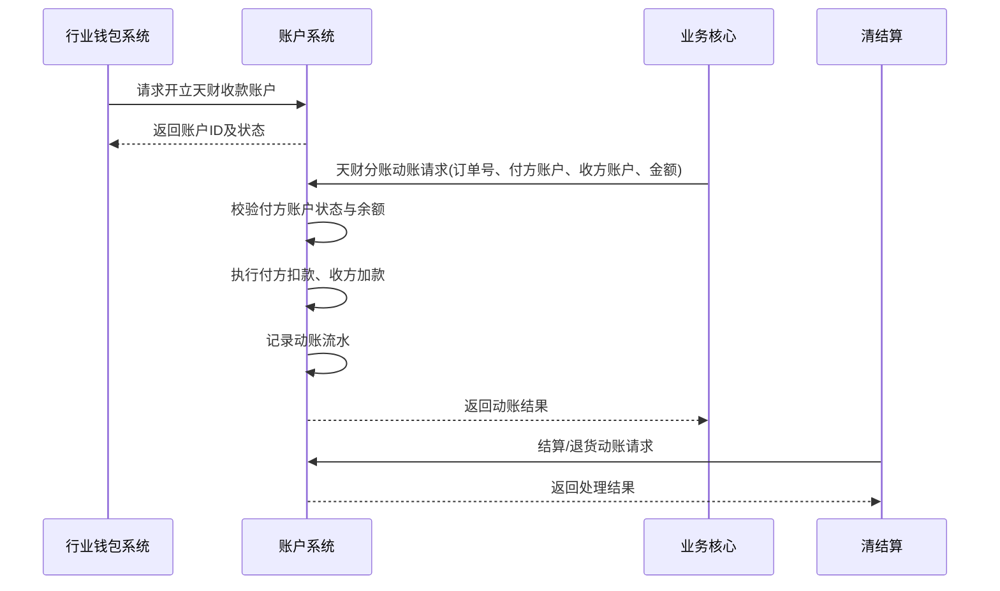

# 模块设计: 账户系统

生成时间: 2026-01-21 15:18:25
批判迭代: 1

---

# 账户系统模块设计文档

## 1. 概述
- **目的与范围**: 账户系统是底层账户管理系统，负责开立并标记天财专用账户（包括天财收款账户和天财接收方账户），控制账户能力，处理账户动账和账单生成。其边界在于管理账户的实体、状态和资金变动，不处理具体的业务逻辑（如分账规则、认证流程）。

## 2. 接口设计
- **API端点 (REST/GraphQL)**: TBD
- **请求/响应结构**: TBD
- **发布/消费的事件**: TBD

## 3. 数据模型
- **表/集合**:
  1.  账户主表 (Account)
  2.  账户动账流水表 (AccountJournal)
- **关键字段**:
  - 账户主表: 账户ID、账户类型（天财收款账户/天财接收方账户/04退货账户/01待结算账户）、所属商户ID、账户状态、账户能力标记、开户时间。
  - 账户动账流水表: 流水ID、账户ID、交易时间、交易类型（天财分账/收单结算/退货扣款等）、交易金额、余额、关联业务订单号。
- **与其他模块的关系**: 账户主表通过商户ID与三代系统的商户信息关联。动账流水为对账单系统提供底层交易数据。

## 4. 业务逻辑
- **核心工作流/算法**:
  1.  **开户**: 接收行业钱包系统的开户请求，创建天财专用账户，并打上特定账户类型和能力标记。
  2.  **动账处理**: 接收业务核心或清结算系统的动账指令，对指定账户进行资金增减，并记录动账流水。
  3.  **账单生成**: 基于动账流水，按机构维度生成账户动账明细。
- **业务规则与验证**:
  - 开立天财专用账户时，需校验账户类型为行业钱包（非小微钱包）。
  - 动账前需校验账户状态是否正常、账户是否具备相应能力（如是否允许分账出金）。
  - 扣款类交易需校验账户余额是否充足。
- **关键边界情况处理**:
  - 重复动账请求：通过业务订单号幂等处理。
  - 账户状态异常（如冻结、注销）：拒绝动账请求。

## 5. 时序图

## 6. 错误处理
- **预期错误情况**:
  - 账户不存在。
  - 账户状态异常（冻结、注销）。
  - 账户余额不足。
  - 账户不具备请求的操作权限。
  - 重复的业务订单号。
- **处理策略**:
  - 对上述错误情况，返回明确的错误码和错误信息，拒绝操作。
  - 实现基于业务订单号的幂等性，防止重复处理。
  - 记录详细的错误日志用于对账和排查。

## 7. 依赖关系
- **上游模块**:
  - 行业钱包系统：发起开户请求。
  - 业务核心：发起天财分账相关的动账请求。
  - 清结算：发起结算、退货相关的动账请求。
- **下游模块**:
  - 对账单系统：消费账户动账流水，生成账单。