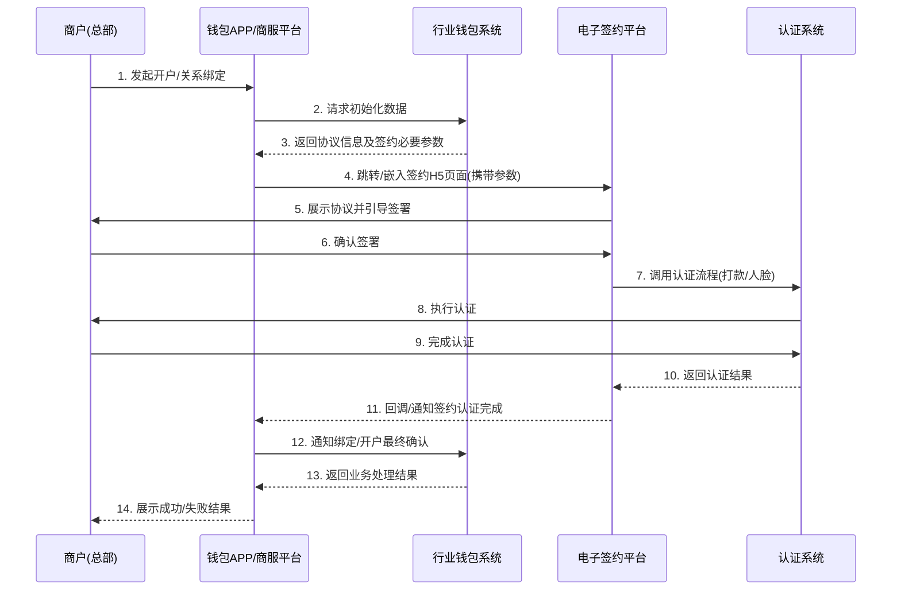
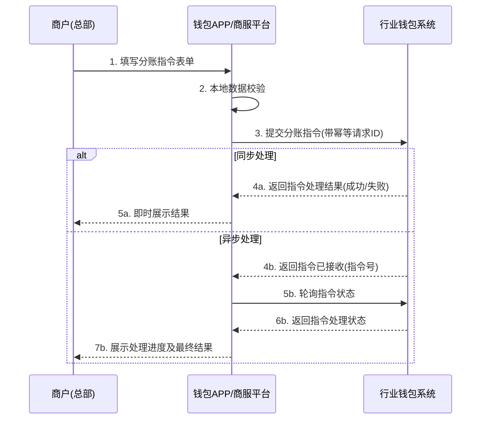

# 模块设计: 钱包APP/商服平台

生成时间: 2026-01-21 15:19:06
批判迭代: 2

---

# 钱包APP/商服平台 模块设计文档

## 1. 概述
- **目的与范围**：本模块是面向天财业务场景中总部、门店等商户的客户端应用平台（APP及Web平台）。其核心职责是为商户提供天财专用账户（收款账户/接收方账户）的开户、关系绑定、分账指令发起与查询、交易与账单查询等功能界面。其边界在于前端交互与业务流程引导，不处理核心业务逻辑，所有操作均通过调用后端系统（如行业钱包系统、电子签约平台等）的接口完成。

## 2. 接口设计
- **API端点 (REST/GraphQL)**：本模块作为前端应用，不对外提供API服务。其通过HTTP API调用上游后端系统。主要调用的上游接口分类如下：
    - **行业钱包系统接口**：用于账户开户、关系绑定、分账指令发起、各类状态查询（账户、交易、指令）。
    - **电子签约平台接口**：用于获取签约H5页面地址及查询签约结果。
    - **认证系统接口**：用于发起打款验证或人脸验证请求及查询认证结果。
    - **对账单系统接口**：用于查询和下载各类对账单。
- **请求/响应结构**：TBD（需根据各上游系统具体接口定义确定）。
- **发布/消费的事件**：本模块为纯前端应用，不发布领域事件。可能监听来自上游系统的Webhook通知（如签约完成、认证结果异步通知），具体事件定义TBD。

## 3. 数据模型
- **表/集合**：本模块为前端应用，不直接持有持久化的业务数据表。为提升用户体验和实现离线功能，将在客户端本地（如浏览器LocalStorage/IndexedDB、移动端本地数据库）存储以下非关键数据：
    1.  **用户会话缓存**：登录态Token、用户基础信息（商户ID、角色、权限列表）。
    2.  **应用配置缓存**：功能开关、接口域名、静态文案。
    3.  **流程草稿数据**：多步骤流程（如开户、绑定）中未提交的表单数据，支持断点续填。
    4.  **查询结果缓存**：高频且变化不频繁的查询结果（如账户列表、常用收款方），设置合理的过期时间。
- **关键字段**：TBD（具体字段取决于缓存数据结构设计）。
- **与其他模块的关系**：通过API与行业钱包系统、电子签约平台、认证系统、对账单系统等后端服务进行数据交互。与"三代系统"的交互均通过行业钱包系统接口间接完成，本模块不直接调用三代系统。

## 4. 业务逻辑
- **核心工作流/算法**：
    1.  **用户登录与状态管理**：
        - 调用认证服务完成用户登录，获取并管理访问令牌。
        - 根据用户角色（总部、门店）和权限动态渲染功能菜单和操作按钮。
        - 维护用户会话状态，Token过期时引导重新登录。
    2.  **开户引导**：引导商户完成天财收款账户或天财接收方账户的开户申请，收集必要信息后调用行业钱包系统开户接口。
    3.  **关系绑定（签约与认证）**：
        - 引导付方（如总部）发起与收方（如门店）的绑定流程。
        - 调用行业钱包系统获取绑定初始化数据及签约协议信息。
        - 嵌入或跳转至电子签约平台提供的H5页面完成协议签署。
        - 签署后，由电子签约平台调用认证系统完成打款或人脸验证。
        - 监听签约结果回调或主动轮询，获取最终绑定状态并更新界面。
    4.  **开通付款**：在批量付款和会员结算场景，引导付方（总部/门店-对公企业）完成独立的代付授权签约与认证流程，逻辑同关系绑定。
    5.  **分账指令发起**：
        - 根据业务场景（归集、会员结算、批量付款）展示不同的表单。
        - 提交前进行本地校验（如金额格式、收款方有效性）。
        - 调用行业钱包系统发起分账指令，对于需异步处理的指令，提供指令号供后续查询。
    6.  **查询功能**：提供账户余额、交易流水、分账指令状态、对账单等查询功能，调用行业钱包系统、对账单系统等接口。
- **业务规则与验证**：
    - 界面输入校验（如金额格式、必填项、手机号、银行卡号格式）。
    - 根据业务场景和用户角色控制功能入口和表单字段的可见性、可操作性。
    - 对于关键操作（如发起大额分账），增加二次确认弹窗。
- **关键边界情况处理**：
    - **网络异常与接口重试**：操作失败时提供友好提示。对于可重试的失败（如网络超时），提供重试按钮。关键操作（如支付、指令提交）的请求需支持幂等性，通过客户端生成唯一请求ID传递给后端。
    - **多步骤流程状态恢复**：对于开户、绑定等多步骤流程，将每一步的进度和表单数据缓存在本地。当应用重启或页面刷新时，能恢复至最近一步。
    - **并发操作控制**：对于同一资源（如向同一账户发起绑定），通过界面防重复点击（按钮禁用）和后台幂等设计避免重复提交。

## 5. 时序图

### 5.1 账户开户与关系绑定时序图

### 5.2 分账指令发起时序图

## 6. 错误处理
- **预期错误情况**：
    - 网络层错误：超时、连接中断、DNS解析失败。
    - HTTP错误：4xx（客户端错误，如参数错误、权限不足）、5xx（服务端错误）。
    - 业务逻辑错误：后端返回的业务错误码（如账户状态异常、余额不足、关系未绑定、日限额超限、认证失败）。
    - 前端逻辑错误：用户输入格式错误、本地数据不一致。
    - 第三方服务错误：电子签约页面加载失败、认证流程异常中断。
- **处理策略**：
    - **网络与HTTP错误**：提供统一友好的网络异常提示页面或组件，并包含"重试"操作。对于POST等非幂等操作，重试前需提示用户确认。
    - **业务错误**：将后端返回的错误码映射为通俗易懂的提示文案，并尽可能提供下一步操作指引（例如："余额不足"提示充值；"关系未绑定"提示前往绑定页面）。
    - **输入校验错误**：在表单提交时进行实时或提交前校验，错误信息明确标识在对应字段旁。
    - **流程中断错误**：对于签约、认证等流程中断，记录中断点，提供"继续流程"或"重新开始"的入口。
    - **幂等性保障**：对于创建类指令（分账、绑定确认），客户端生成唯一请求ID（UUID），确保重试不会导致重复业务操作。

## 7. 依赖关系
- **上游模块**：
    - **行业钱包系统**：核心依赖。提供所有账户管理、关系绑定、分账指令、交易查询等业务的接口实现。本模块通过钱包系统间接与"三代系统"交互。
    - **电子签约平台**：提供协议签署的H5页面集成及签约结果回调。
    - **认证系统**：提供打款验证、人脸验证的能力调用。
    - **对账单系统**：提供账单数据的查询与下载接口。
    - **(间接) 三代系统**：不直接依赖。所有需三代处理的核心业务（如商户信息校验、计费配置）均由行业钱包系统封装后提供。
- **下游模块**：无。本模块为前端界面，不向其他业务模块提供服务接口或数据。