# DocuFlow-AI Project - 软件设计文档
生成时间: 2026-01-19 17:53:01

## 目录
1. [概述说明](#1-概述说明)
   - 1.1 [术语与缩略词](#11-术语与缩略词)
2. [系统设计](#2-系统设计)
3. [模块设计](#3-模块设计)
   - 3.1 [账户系统](#31-账户系统)
   - 3.2 [认证系统](#32-认证系统)
   - 3.3 [计费中台](#33-计费中台)
   - 3.4 [三代系统](#34-三代系统)
   - 3.5 [业务核心](#35-业务核心)
   - 3.6 [清结算系统](#36-清结算系统)
   - 3.7 [电子签章系统](#37-电子签章系统)
   - 3.8 [行业钱包系统](#38-行业钱包系统)
   - 3.9 [钱包APP/商服平台](#39-钱包APP/商服平台)
   - 3.10 [对账单系统](#310-对账单系统)
4. [接口设计](#4-接口设计)
5. [数据库设计](#5-数据库设计)

---
# 1 概述说明

## 1.1 术语与缩略词


## 角色

- **天财** (别名: 天财商龙): 一个特定的商户或机构（推测为“天财商龙”的简称），是本需求文档中分账、结算等服务的核心合作方或使用方。
- **总部** (别名: 总店, 归集方, 发起方): 在天财分账业务场景中，通常指品牌方或管理方，作为资金归集的收取方或批量付款、会员结算的发起方和付款方。角色类型为企业。
- **门店** (别名: 被归集方, 付方（在归集场景）, 收方（在会员结算场景）): 在天财分账业务场景中，指具体的经营网点，可以是资金归集的付款方，也可以是会员结算的收款方。

## 业务实体

- **收单商户** (别名: 商户): 通过支付系统进行收款业务的商户实体，是支付交易的发起方和资金的接收方。
- **天财收款账户** (别名: 专用收款账户, 天财专用账户): 为天财机构下的收单商户开立的专用资金账户，类型为行业钱包，用于接收收单结算资金并进行分账操作。与普通收款账户在底层进行区分。
- **天财接收方账户** (别名: 接收方账户, 专用接收方账户): 为接收分账资金而开立的专用账户，支持绑定多张银行卡并设置默认提现卡。主要用于接收来自天财收款账户的批量付款、会员结算等资金。
- **待结算账户** (别名: 01待结算账户): 用于临时存放尚未结算到商户收款账户的收单资金的内部账户。
- **退货账户** (别名: 04退货账户): 用于处理交易退款资金的内部账户。

## 技术术语

- **三代**: 指代文档中提到的某个核心支付或商户管理系统，负责商户进件、账户管理、接口调用控制等核心业务逻辑。
- **行业钱包系统** (别名: 钱包系统): 处理特定行业（如本需求中的天财）钱包账户相关业务的系统，负责账户管理、关系绑定校验、分账请求处理等。
- **账户系统**: 底层账户管理系统，负责实际账户的开立、升级、打标、余额管理及底层交易处理。
- **清结算系统** (别名: 清结算): 负责资金清算与结算的系统，处理交易资金的划拨、结算单生成、退货资金处理等。
- **打款验证**: 一种身份认证方式，通过向目标银行账户打入小额随机金额，并验证回填信息是否正确，以确认账户控制权。主要用于对公企业认证。
- **人脸验证**: 一种身份认证方式，通过比对姓名、身份证和人脸信息是否一致，以确认个人身份。主要用于个人或个体户认证。
- **电子签约平台** (别名: 电子签章系统): 提供电子协议签署、短信触发、H5页面封装、认证流程调度及全证据链存证的系统。
- **主动结算**: 一种结算模式，指收单交易资金直接结算到商户指定的收款账户（如天财收款账户）。
- **被动结算**: 一种结算模式，指收单交易资金先进入待结算账户，后续再根据指令进行结算。
- **计费中台**: 负责计算并确定转账/分账业务手续费的系统。
- **业务核心**: 接收并处理“天财分账”交易指令的核心交易系统。
- **对账单系统**: 生成和提供各类账户动账明细、交易账单和机构层级汇总账单的系统。

## 流程

- **开户** (别名: 开通天财专用账户): 为商户开立天财收款账户或天财接收方账户的流程。包括新开账户或将普通收款账户升级为天财专用账户。
- **关系绑定** (别名: 签约与认证, 绑定关系): 在资金付方和收方之间建立授权关系的流程，涉及协议签署和身份认证（打款验证或人脸验证）。是执行分账、归集、批量付款等操作的前提。
- **归集** (别名: 资金归集): 一种资金流转场景，指门店将资金向上归集至总部的过程。
- **批量付款** (别名: 批付): 一种资金流转场景，指总部向多个接收方（如供应商、股东）进行分账付款。
- **会员结算**: 一种资金流转场景，特指总部将会员相关的资金结算分账给门店。
- **分账** (别名: 转账): 核心业务流程，指从天财收款账户向另一个天财收款账户或天财接收方账户进行资金划转。文档中特指“天财分账”。
- **开通付款**: 在批量付款和会员结算场景下，付方（总部）需要额外进行的一次授权签约流程，是关系绑定生效的前提。

---
# 2 系统设计
# 天财分账系统 - 系统级设计文档

## 2.1 系统结构

本系统采用分层、模块化的微服务架构，旨在为“天财”业务场景提供安全、合规、高效的资金流转与分账服务。整体架构遵循“高内聚、低耦合”原则，核心业务逻辑与底层金融基础设施解耦，通过清晰的接口契约进行交互。

### 架构图 (C4 Container Diagram)

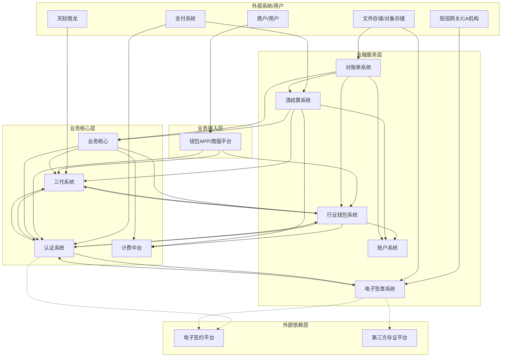
```mermaid
graph TB
    subgraph "外部系统/用户"
        U1[商户/用户]
        U2[天财商龙]
        U3[支付系统]
        U4[短信网关/CA机构]
        U5[文件存储/对象存储]
    end

    subgraph "业务接入层"
        APP[钱包APP/商服平台]
    end

    subgraph "业务核心层"
        CORE[业务核心]
        AUTH[认证系统]
        FEE[计费中台]
        GEN3[三代系统]
    end

    subgraph "金融服务层"
        WALLET[行业钱包系统]
        ACCOUNT[账户系统]
        SETTLE[清结算系统]
        SIGN[电子签章系统]
        STATEMENT[对账单系统]
    end

    subgraph "外部依赖层"
        EXT1[电子签约平台]
        EXT2[第三方存证平台]
    end

    %% 外部交互
    U1 --> APP
    U2 --> GEN3
    U3 --> AUTH & SETTLE
    U4 --> SIGN
    U5 --> STATEMENT & SIGN

    %% 业务层内部交互
    APP --> GEN3 & AUTH & WALLET
    CORE --> WALLET & AUTH & FEE & GEN3
    AUTH --> GEN3 & SIGN & WALLET
    GEN3 --> WALLET & AUTH

    %% 服务层内部交互
    WALLET --> ACCOUNT & AUTH & FEE & GEN3
    SETTLE --> ACCOUNT & CORE & FEE & GEN3
    STATEMENT --> ACCOUNT & SETTLE & CORE & WALLET
    SIGN --> AUTH

    %% 外部依赖
    AUTH -.-> EXT1
    SIGN -.-> EXT1 & EXT2
```

**架构说明**:
*   **业务接入层**: 作为统一入口，面向商户和合作伙伴，封装复杂的业务流程，提供友好的交互界面和API。
*   **业务核心层**: 包含业务规则处理、流程编排、关系管理与计费的核心引擎，是业务逻辑的集中地。
*   **金融服务层**: 提供原子化的金融基础能力，如账户操作、资金划转、清算结算、电子签约和账单服务，确保金融操作的准确性、安全性和可审计性。
*   **外部依赖层**: 集成第三方专业服务，以增强系统在合规、存证等方面的能力。

## 2.2 功能结构

系统功能围绕“账户-认证-交易-结算-对账”的核心资金流转链路进行组织。

### 功能结构图

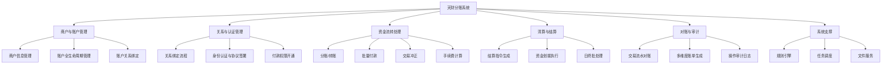
```mermaid
graph TD
    Root[天财分账系统] --> F1[商户与账户管理]
    Root --> F2[关系与认证管理]
    Root --> F3[资金流转处理]
    Root --> F4[清算与结算]
    Root --> F5[对账与审计]
    Root --> F6[系统支撑]

    F1 --> F1.1[商户信息管理]
    F1 --> F1.2[账户全生命周期管理]
    F1 --> F1.3[账户关系绑定]

    F2 --> F2.1[关系绑定流程]
    F2 --> F2.2[身份认证与协议签署]
    F2 --> F2.3[付款权限开通]

    F3 --> F3.1[分账/转账]
    F3 --> F3.2[批量付款]
    F3 --> F3.3[交易冲正]
    F3 --> F3.4[手续费计算]

    F4 --> F4.1[结算指令生成]
    F4 --> F4.2[资金划拨执行]
    F4 --> F4.3[日终批处理]

    F5 --> F5.1[交易流水对账]
    F5 --> F5.2[多维度账单生成]
    F5 --> F5.3[操作审计日志]

    F6 --> F6.1[规则引擎]
    F6 --> F6.2[任务调度]
    F6 --> F6.3[文件服务]
```

**功能模块说明**:
1.  **商户与账户管理**: 以`三代系统`为权威数据源，管理商户实体及其`天财专用账户`的创建、绑定、状态维护。
2.  **关系与认证管理**: 由`认证系统`主导，确保资金流转双方（如品牌方与加盟商）关系的合法性，通过电子签约完成授权认证。
3.  **资金流转处理**: `业务核心`作为处理引擎，调用`行业钱包系统`和`账户系统`执行具体的分账、归集、批量付款等操作，并联动`计费中台`实时计算费用。
4.  **清算与结算**: `清结算系统`负责交易后的资金清分、轧差，并生成结算指令，驱动`账户系统`完成最终的出金操作。
5.  **对账与审计**: `对账单系统`聚合全链路流水，提供多维度视图。各模块的审计表（如`auth_audit_log`, `sign_audit_log`）记录关键操作，满足合规要求。
6.  **系统支撑**: 贯穿各模块的支撑能力，如`计费中台`的规则引擎、各模块的异步任务处理、文件导出与存储等。

## 2.3 网络拓扑图

系统部署在私有云或金融云环境，采用典型的微服务网络分区拓扑，确保安全隔离与性能。

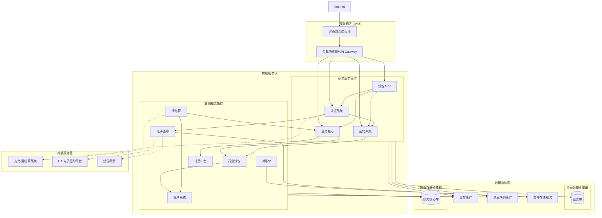
```mermaid
graph TB
    subgraph "互联网区 (DMZ)"
        LB[负载均衡器/API Gateway]
        WAF[Web应用防火墙]
    end

    subgraph "应用服务区"
        subgraph "业务服务集群"
            APP_Node[钱包APP]
            CORE_Node[业务核心]
            AUTH_Node[认证系统]
            GEN3_Node[三代系统]
        end
        subgraph "金融服务集群"
            WALLET_Node[行业钱包]
            ACCOUNT_Node[账户系统]
            SETTLE_Node[清结算]
            FEE_Node[计费中台]
            SIGN_Node[电子签章]
            STMT_Node[对账单]
        end
    end

    subgraph "数据存储区"
        subgraph "业务数据库集群"
            DB1[(业务库)]
        end
        subgraph "账务数据库集群"
            DB2[(账务核心库)]
        end
        Cache[缓存集群]
        MQ[消息队列集群]
        FS[文件存储服务]
    end

    subgraph "外部服务区"
        PS[支付/清结算系统]
        CA[CA/电子签约平台]
        SMS[短信网关]
    end

    %% 流量走向
    Internet --> WAF --> LB
    LB --> APP_Node & CORE_Node & AUTH_Node & GEN3_Node

    %% 应用区内部通信 (通常通过服务网格或内部LB)
    APP_Node --> CORE_Node & AUTH_Node & GEN3_Node
    CORE_Node --> WALLET_Node & FEE_Node
    AUTH_Node --> SIGN_Node & GEN3_Node
    GEN3_Node --> WALLET_Node
    WALLET_Node --> ACCOUNT_Node
    SETTLE_Node --> ACCOUNT_Node & CORE_Node

    %% 应用与数据区通信
    业务服务集群 --> DB1 & Cache & MQ
    金融服务集群 --> DB2 & Cache & MQ
    STMT_Node & SIGN_Node --> FS

    %% 外部服务调用
    SIGN_Node -.-> CA & SMS
    AUTH_Node & SETTLE_Node -.-> PS
```

**拓扑说明**:
*   **安全分层**: 严格划分互联网区、应用服务区、数据存储区和外部服务区，通过防火墙策略控制访问。
*   **服务分组**: 将业务服务与对一致性、准确性要求极高的金融服务（特别是`账户系统`）进行逻辑或物理集群隔离，降低相互影响。
*   **数据隔离**: `业务数据库`与`账务核心数据库`分离，符合金融系统设计规范，保障核心账务数据的安全与性能。
*   **异步通信**: 广泛使用消息队列（MQ）解耦耗时操作（如批量处理、账单生成、异步通知），提升系统响应能力和可靠性。

## 2.4 数据流转

数据流转围绕“交易发起 -> 业务校验 -> 资金操作 -> 清算结算 -> 账单生成”的主线进行。

### 核心资金流转数据流图 (DFD)

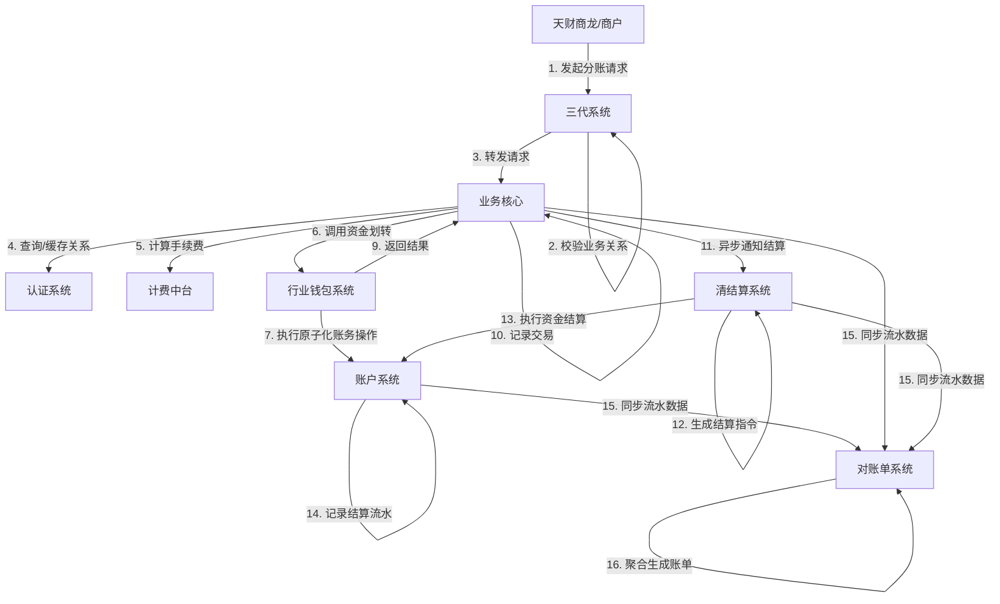
```mermaid
flowchart TD
    A[天财商龙/商户] -->|1. 发起分账请求| B[三代系统]
    B -->|2. 校验业务关系| B
    B -->|3. 转发请求| C[业务核心]
    C -->|4. 查询/缓存关系| D[认证系统]
    C -->|5. 计算手续费| E[计费中台]
    C -->|6. 调用资金划转| F[行业钱包系统]
    F -->|7. 执行原子化账务操作| G[账户系统]
    G -->|8. 记录流水| G
    F -->|9. 返回结果| C
    C -->|10. 记录交易| C
    C -->|11. 异步通知结算| H[清结算系统]
    H -->|12. 生成结算指令| H
    H -->|13. 执行资金结算| G
    G -->|14. 记录结算流水| G
    G & C & H -->|15. 同步流水数据| I[对账单系统]
    I -->|16. 聚合生成账单| I
```

**关键数据流说明**:
1.  **交易指令流**: 请求依次经过`三代系统`（业务控制）-> `业务核心`（引擎）-> `行业钱包系统`（桥梁）-> `账户系统`（基石），完成资金在账户间的转移。
2.  **控制与校验流**: `业务核心`在处理前后需与`认证系统`确认关系有效性，与`计费中台`确定费用，确保交易合规。
3.  **结算流**: 交易完成后，`清结算系统`作为后续环节，从`业务核心`或`支付系统`获取待结算数据，组织并驱动`账户系统`完成向外部银行账户的出金。
4.  **数据聚合流**: `账户系统`的流水、`业务核心`的交易记录、`清结算系统`的结算明细，作为源数据被`对账单系统`近乎实时或定时抽取，加工成面向用户的对账单。

## 2.5 系统模块交互关系

模块间通过RESTful API或RPC进行同步调用，并通过消息事件进行异步解耦。

### 模块依赖与交互图

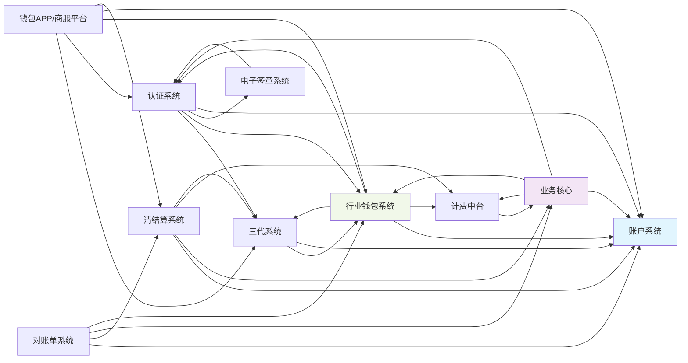
```mermaid
graph LR
    %% 定义节点
    ACC[账户系统]
    AUTH[认证系统]
    FEE[计费中台]
    GEN3[三代系统]
    CORE[业务核心]
    SETTLE[清结算系统]
    SIGN[电子签章系统]
    WALLET[行业钱包系统]
    APP[钱包APP/商服平台]
    STMT[对账单系统]

    %% 核心依赖关系 (箭头方向: 依赖方 -> 被依赖方)
    AUTH --> GEN3 & WALLET & SIGN & ACC
    CORE --> WALLET & ACC & FEE & AUTH
    FEE --> CORE
    GEN3 --> WALLET & ACC
    SETTLE --> ACC & CORE & FEE & GEN3
    SIGN --> AUTH
    WALLET --> ACC & AUTH & FEE & GEN3
    APP --> GEN3 & AUTH & WALLET & ACC & SETTLE
    STMT --> ACC & SETTLE & CORE & WALLET

    %% 突出核心枢纽
    style ACC fill:#e1f5fe
    style CORE fill:#f3e5f5
    style WALLET fill:#f1f8e9
```

**关键交互关系详述**:

| 依赖方 | 被依赖方 | 交互场景 | 接口示例 |
| :--- | :--- | :--- | :--- |
| **业务核心** | **行业钱包系统** | 执行所有分账、转账等资金操作。 | `POST /wallet/transfers/execute` |
| **行业钱包系统** | **账户系统** | 执行底层的原子化资金记账（入账、出账、冻结）。 | `POST /accounts/transactions` (内部) |
| **认证系统** | **电子签章系统** | 在关系绑定或开通付款时，创建并跟踪电子协议签署任务。 | `POST /sign/tasks` |
| **三代系统** | **账户系统** | 为商户申请或升级“天财专用账户”。 | `POST /accounts`, `POST /accounts/{id}/upgrade-to-tiancai` |
| **清结算系统** | **账户系统** | 执行结算指令，将资金从内部账户划拨至商户银行卡。 | `POST /accounts/transactions` (内部) |
| **钱包APP/商服平台** | **三代系统** | 查询商户权威信息、发起业务关系建立请求。 | `POST /business-relationships` |
| **所有资金相关模块** | **对账单系统** | 提供交易、流水、结算明细等原始数据。 | (通过消息或DB同步) |
| **计费中台** | **业务核心** | 为每笔交易实时计算手续费及承担方。 | `POST /fee/calculate` |

**设计原则**:
*   **单向依赖**: 架构上避免循环依赖，特别是金融底层模块（如`账户系统`）不反向依赖上层业务模块。
*   **接口明晰**: `账户系统`对内部模块提供原子操作接口；`行业钱包系统`封装业务语义更强的资金操作。
*   **事件驱动**: 交易状态更新、结算完成等事件通过消息通知相关方（如`对账单系统`），降低系统耦合度。
---
# 3 模块设计

## 3.1 账户系统


# 账户系统模块设计文档

## 1. 概述

### 1.1 目的
本模块是底层账户管理的核心系统，负责为“天财”业务场景下的各类实体（如总部、门店）开立、管理和操作专用的资金账户。它向上为**行业钱包系统**、**清结算系统**等提供稳定、可靠的账户服务，向下对接银行或支付渠道，是资金流转的基石。

### 1.2 范围
本模块的核心职责包括：
1.  **账户生命周期管理**：支持开立、升级、冻结、解冻、注销天财专用账户（收款账户、接收方账户）及内部账户（待结算、退货账户）。
2.  **账户属性与关系管理**：为账户打标（如标记为“天财专用”），维护账户与商户、机构（天财）的归属关系。
3.  **底层账务处理**：提供原子化的余额操作（如入账、出账、冻结、解冻），并确保强一致性。
4.  **账户信息查询**：提供账户余额、状态、明细等信息的查询服务。
5.  **内部账户管理**：管理用于业务处理的内部账户（如待结算账户、退货账户）。

**边界说明**：
- **不负责**：业务逻辑（如分账规则、手续费计算）、协议签署、身份认证、对账单生成。
- **通过接口**：接收来自上游系统（如行业钱包系统）的指令，执行纯粹的账户操作。

## 2. 接口设计

### 2.1 API端点 (RESTful)

#### 2.1.1 账户管理接口
- `POST /api/v1/accounts` **创建账户**
    - **描述**：为指定商户开立一个新的天财专用账户（收款或接收方账户）。
    - **请求体** (`CreateAccountRequest`)：
      ```json
      {
        "requestId": "req_202310271200001", // 请求唯一ID，用于幂等
        "merchantId": "M100001", // 商户ID（来自三代系统）
        "institutionId": "TC001", // 机构ID（天财）
        "accountType": "RECEIVABLE", // 账户类型: RECEIVABLE(收款账户), RECEIVER(接收方账户)
        "currency": "CNY",
        "metadata": { // 扩展信息
          "upgradedFrom": "ACC_OLD001" // 若为升级，原账户号
        }
      }
      ```
    - **响应体** (`AccountResponse`)：
      ```json
      {
        "code": "SUCCESS",
        "message": "成功",
        "data": {
          "accountNo": "TC_RCV_20231027M100001", // 系统生成的唯一账户号
          "status": "ACTIVE",
          "merchantId": "M100001",
          "institutionId": "TC001",
          "accountType": "RECEIVABLE",
          "currency": "CNY",
          "balance": "0.00",
          "availableBalance": "0.00",
          "frozenBalance": "0.00",
          "createdAt": "2023-10-27T12:00:00Z"
        }
      }
      ```

- `POST /api/v1/accounts/{accountNo}/upgrade-to-tiancai` **升级为天财账户**
    - **描述**：将已有的普通收款账户升级标记为天财专用收款账户。
    - **请求体** (`UpgradeAccountRequest`)：
      ```json
      {
        "requestId": "req_upgrade_001",
        "institutionId": "TC001",
        "tags": ["TIANCAI_SPECIAL"] // 打标
      }
      ```

- `POST /api/v1/accounts/{accountNo}/status` **变更账户状态**
    - **描述**：冻结、解冻或注销账户。
    - **请求体**：
      ```json
      {
        "requestId": "req_status_001",
        "targetStatus": "FROZEN", // ACTIVE, FROZEN, CLOSED
        "reason": "风险控制"
      }
      ```

#### 2.1.2 账务操作接口
- `POST /api/v1/accounts/transactions` **执行交易**
    - **描述**：原子化的资金操作（入账、出账、冻结、解冻）。**此接口为内部接口，不直接对外暴露**。
    - **请求体** (`TransactionRequest`)：
      ```json
      {
        "requestId": "txn_202310271200001",
        "businessType": "TIANCAI_SPLIT", // 业务类型：TIANCAI_SPLIT(天财分账), COLLECTION(归集), SETTLEMENT(结算)
        "debitAccountNo": "TC_RCV_A", // 借方账户（可选）
        "creditAccountNo": "TC_RCV_B", // 贷方账户（可选）
        "amount": "100.00",
        "currency": "CNY",
        "postScript": "天财分账至门店", // 附言
        "businessRefNo": "split_001", // 业务方唯一参考号
        "metadata": {} // 扩展字段，如手续费信息
      }
      ```
    - **响应体**：
      ```json
      {
        "code": "SUCCESS",
        "message": "成功",
        "data": {
          "transactionNo": "T202310271200001", // 系统交易流水号
          "status": "SUCCEED",
          "debitBalance": "900.00", // 操作后借方余额
          "creditBalance": "100.00" // 操作后贷方余额
        }
      }
      ```

#### 2.1.3 查询接口
- `GET /api/v1/accounts/{accountNo}` **查询账户信息**
- `GET /api/v1/accounts/{accountNo}/balance` **查询账户余额**
- `GET /api/v1/accounts/{accountNo}/transactions` **查询交易流水** (支持分页、按时间过滤)

### 2.2 发布/消费的事件
本模块作为底层服务，主要消费指令，发布账户变动事件供下游（如对账单系统）订阅。

- **消费事件**：无。指令通过同步API调用。
- **发布事件** (`AccountEvent`)：
    - **事件类型**：`ACCOUNT_CREATED`, `ACCOUNT_STATUS_CHANGED`, `BALANCE_CHANGED`
    - **事件通道**：`message-bus:account-events`
    - **事件体示例** (`BALANCE_CHANGED`)：
      ```json
      {
        "eventId": "evt_001",
        "type": "BALANCE_CHANGED",
        "occurredAt": "2023-10-27T12:00:00Z",
        "payload": {
          "accountNo": "TC_RCV_A",
          "changeAmount": "-100.00",
          "changeType": "DEBIT",
          "balanceAfter": "900.00",
          "availableBalanceAfter": "900.00",
          "transactionNo": "T202310271200001",
          "businessRefNo": "split_001",
          "businessType": "TIANCAI_SPLIT"
        }
      }
      ```

## 3. 数据模型

### 3.1 核心表设计

```sql
-- 账户主表
CREATE TABLE `t_account` (
  `id` bigint(20) NOT NULL AUTO_INCREMENT,
  `account_no` varchar(64) NOT NULL COMMENT '账户号，唯一标识',
  `merchant_id` varchar(32) NOT NULL COMMENT '商户ID',
  `institution_id` varchar(32) NOT NULL COMMENT '所属机构ID（如天财）',
  `account_type` varchar(32) NOT NULL COMMENT '账户类型: RECEIVABLE, RECEIVER, INTERNAL',
  `internal_account_type` varchar(32) DEFAULT NULL COMMENT '内部账户子类型: UN_SETTLED(01待结算), REFUND(04退货)',
  `currency` char(3) NOT NULL DEFAULT 'CNY',
  `status` varchar(16) NOT NULL DEFAULT 'ACTIVE' COMMENT 'ACTIVE, FROZEN, CLOSED',
  `balance` decimal(20,2) NOT NULL DEFAULT '0.00' COMMENT '总余额',
  `available_balance` decimal(20,2) NOT NULL DEFAULT '0.00' COMMENT '可用余额',
  `frozen_balance` decimal(20,2) NOT NULL DEFAULT '0.00' COMMENT '冻结余额',
  `tags` json DEFAULT NULL COMMENT '标签数组，如["TIANCAI_SPECIAL"]',
  `metadata` json DEFAULT NULL COMMENT '扩展元数据',
  `version` int(11) NOT NULL DEFAULT '0' COMMENT '乐观锁版本号',
  `created_at` datetime NOT NULL DEFAULT CURRENT_TIMESTAMP,
  `updated_at` datetime NOT NULL DEFAULT CURRENT_TIMESTAMP ON UPDATE CURRENT_TIMESTAMP,
  PRIMARY KEY (`id`),
  UNIQUE KEY `uk_account_no` (`account_no`),
  KEY `idx_merchant_inst` (`merchant_id`, `institution_id`),
  KEY `idx_status` (`status`)
) ENGINE=InnoDB COMMENT='账户主表';

-- 账户流水表（用于对账、审计）
CREATE TABLE `t_account_transaction` (
  `id` bigint(20) NOT NULL AUTO_INCREMENT,
  `transaction_no` varchar(64) NOT NULL COMMENT '系统交易流水号',
  `account_no` varchar(64) NOT NULL COMMENT '账户号',
  `related_account_no` varchar(64) DEFAULT NULL COMMENT '对手方账户号',
  `business_type` varchar(32) NOT NULL COMMENT '业务类型',
  `business_ref_no` varchar(64) NOT NULL COMMENT '业务方唯一参考号',
  `amount` decimal(20,2) NOT NULL COMMENT '变动金额，正数为入账，负数为出账',
  `balance_before` decimal(20,2) NOT NULL COMMENT '变动前余额',
  `balance_after` decimal(20,2) NOT NULL COMMENT '变动后余额',
  `available_balance_before` decimal(20,2) NOT NULL,
  `available_balance_after` decimal(20,2) NOT NULL,
  `transaction_type` varchar(16) NOT NULL COMMENT '交易类型: DEBIT(出账), CREDIT(入账), FREEZE(冻结), UNFREEZE(解冻)',
  `currency` char(3) NOT NULL DEFAULT 'CNY',
  `status` varchar(16) NOT NULL DEFAULT 'SUCCEED' COMMENT 'SUCCEED, FAILED',
  `post_script` varchar(256) DEFAULT NULL COMMENT '附言',
  `metadata` json DEFAULT NULL COMMENT '扩展信息，如手续费明细',
  `created_at` datetime NOT NULL DEFAULT CURRENT_TIMESTAMP,
  PRIMARY KEY (`id`),
  UNIQUE KEY `uk_transaction_no` (`transaction_no`),
  UNIQUE KEY `uk_business_ref` (`business_type`, `business_ref_no`, `account_no`) COMMENT '业务幂等键',
  KEY `idx_account_time` (`account_no`, `created_at`),
  KEY `idx_business_ref_no` (`business_ref_no`)
) ENGINE=InnoDB COMMENT='账户流水表';
```

### 3.2 与其他模块的关系
- **行业钱包系统**：调用本模块的账户管理、账务操作接口，是主要的上游调用方。
- **清结算系统**：在结算日终或触发结算时，调用本模块将资金从**待结算账户**划入商户的**天财收款账户**。
- **三代系统**：提供商户（`merchant_id`）和机构（`institution_id`）信息，是本模块数据的权威来源之一。
- **对账单系统**：订阅本模块发布的`BALANCE_CHANGED`事件，生成动账明细。

## 4. 业务逻辑

### 4.1 核心算法与规则
1.  **账户号生成规则**：
    - 格式：`{机构前缀}_{账户类型}_{日期}_{序列号/商户ID哈希}`
    - 示例：天财收款账户 `TC_RCV_20231027M100001`
    - 确保全局唯一。

2.  **余额操作原子性与一致性**：
    - 使用数据库事务及`乐观锁`（`version`字段）确保并发下的余额操作准确。
    - 任何资金变动必须同时记录`t_account_transaction`流水，用于审计和对账。

3.  **账户状态机**：
    ```
    [初始] --> ACTIVE --(冻结)--> FROZEN
    FROZEN --(解冻)--> ACTIVE
    ACTIVE --(注销)--> CLOSED
    FROZEN --(注销)--> CLOSED
    ```
    - `CLOSED`状态账户不允许进行任何资金操作。
    - `FROZEN`状态账户不允许出账和冻结操作，但可以入账。

4.  **内部账户管理**：
    - `01待结算账户`和`04退货账户`在系统初始化时自动创建，`merchant_id`和`institution_id`为系统预留值。
    - 仅限**清结算系统**等特定内部系统操作。

### 4.2 验证逻辑
- **创建/升级账户**：校验`merchant_id`和`institution_id`的有效性（可调用三代系统接口验证）。
- **执行交易**：
    - 校验借/贷方账户存在、状态为`ACTIVE`、币种匹配。
    - 校验出账账户`available_balance` >= `amount`。
    - 严格校验`business_type`和`business_ref_no`的组合唯一性，实现**幂等**。
- **状态变更**：校验当前状态到目标状态的转换是否合法。

## 5. 时序图

### 5.1 天财分账资金划转时序图
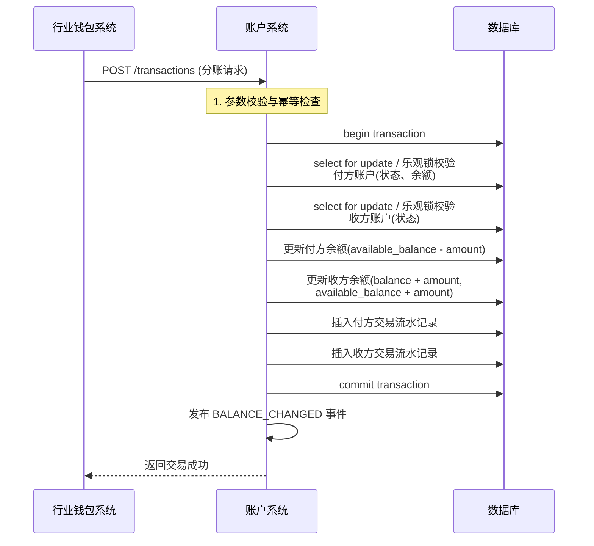
```mermaid
sequenceDiagram
    participant Wallet as 行业钱包系统
    participant Account as 账户系统
    participant DB as 数据库

    Wallet->>Account: POST /transactions (分账请求)
    Note over Account: 1. 参数校验与幂等检查
    Account->>DB: begin transaction
    Account->>DB: select for update / 乐观锁校验<br/>付方账户(状态、余额)
    Account->>DB: select for update / 乐观锁校验<br/>收方账户(状态)
    Account->>DB: 更新付方余额(available_balance - amount)
    Account->>DB: 更新收方余额(balance + amount, <br/>available_balance + amount)
    Account->>DB: 插入付方交易流水记录
    Account->>DB: 插入收方交易流水记录
    Account->>DB: commit transaction
    Account->>Account: 发布 BALANCE_CHANGED 事件
    Account-->>Wallet: 返回交易成功
```

## 6. 错误处理

| 错误码 | HTTP状态码 | 描述 | 处理策略 |
| :--- | :--- | :--- | :--- |
| `ACCOUNT_NOT_FOUND` | 404 | 账户不存在 | 调用方检查账户号是否正确 |
| `ACCOUNT_STATUS_INVALID` | 400 | 账户状态异常（冻结、注销） | 调用方需先解冻或检查业务逻辑 |
| `INSUFFICIENT_BALANCE` | 400 | 可用余额不足 | 调用方提示或终止业务 |
| `DUPLICATE_BUSINESS_REF` | 409 | 业务参考号重复（幂等冲突） | 返回已存在的交易结果，实现幂等 |
| `CURRENCY_MISMATCH` | 400 | 币种不匹配 | 调用方检查请求参数 |
| `INTERNAL_ACCOUNT_OP_DENIED` | 403 | 非法操作内部账户 | 检查调用方权限和业务场景 |
| `DATABASE_ERROR` | 500 | 数据库异常 | 记录告警，人工介入，事务保证数据一致性 |

**通用策略**：
- **重试**：对于网络超时等暂时性错误，调用方应使用带退避策略的幂等重试。
- **补偿**：对于已扣款但未加款的极端情况，依赖监控告警，触发人工或自动对账补偿流程。
- **监控与告警**：对所有失败交易进行监控，对高频错误码进行告警。

## 7. 依赖说明

本模块是底层服务，依赖简单明确：

1.  **上游调用方（强依赖）**：
    - **行业钱包系统**：所有天财专用账户的操作指令来源。需保证其调用`/transactions`接口的**幂等性**。
    - **清结算系统**：执行结算、退货等资金划拨。需保证其正确处理内部账户。

2.  **下游事件订阅方（弱依赖）**：
    - **对账单系统**：订阅账户变动事件。事件发布采用异步消息，本模块不依赖其可用性。

3.  **外部依赖**：
    - **数据库（MySQL）**：强依赖，用于数据持久化和事务管理。需高可用架构。
    - **消息中间件（如Kafka/RocketMQ）**：弱依赖，用于事件发布。故障时需降级为日志记录，后续补发。

4.  **协作模式**：
    - 所有业务逻辑（如关系绑定校验、手续费计算）由上游系统处理。
    - 本模块仅提供原子化的、与业务解耦的账户操作，是**被动的指令执行者**。

## 3.2 认证系统


# 认证系统模块设计文档

## 1. 概述

### 1.1 目的
认证系统模块是支撑“天财分账”业务中所有身份认证与授权关系的核心模块。它负责管理商户（总部、门店）之间进行资金流转（如分账、归集、批量付款、会员结算）前必须完成的身份验证与协议签署流程，确保资金流转的合法性、安全性与可审计性。

### 1.2 范围
- **身份认证**：为“关系绑定”流程提供两种核心认证方式：**打款验证**（用于企业/总部）和**人脸验证**（用于个人/个体户）。
- **协议签署**：通过集成电子签约平台，完成《资金授权协议》的在线签署、存储与管理。
- **关系生命周期管理**：管理“付方-收方”绑定关系的创建、查询、生效、失效全流程。
- **流程调度与状态机**：驱动并管理从认证发起、协议签署到关系生效的完整业务流程状态。
- **与上游系统集成**：作为“三代”系统、行业钱包系统的下游服务，接收认证与绑定请求，并反馈结果。

### 1.3 核心概念
- **关系绑定（签约与认证）**：资金付方（如门店）与收方（如总部）建立授权关系的过程，是执行分账等操作的前提。
- **开通付款**：在批量付款和会员结算场景中，付方（总部）需要额外完成的授权签约流程。
- **认证方式**：
    - **打款验证**：向对公银行账户打入随机小额资金，验证回填金额以确认账户控制权。
    - **人脸验证**：通过姓名、身份证号与人脸生物特征比对，确认个人身份。

## 2. 接口设计

### 2.1 REST API 端点

#### 2.1.1 认证与绑定管理接口

**1. 发起关系绑定请求**
- **端点**: `POST /api/v1/auth/bindings`
- **描述**: 由“三代”或行业钱包系统调用，为指定的付方和收方发起一个关系绑定流程。
- **请求头**: `X-Request-From: [THIRD_GEN | WALLET_SYSTEM]`, `Authorization: Bearer <token>`
- **请求体**:
```json
{
  "requestId": "string", // 请求唯一标识，用于幂等
  "payerId": "string", // 付方商户ID (如门店ID)
  "payerAccountNo": "string", // 付方在天财的专用账户号
  "payerRole": "HEADQUARTERS | STORE", // 付方角色
  "payerAuthType": "CORPORATE | INDIVIDUAL", // 付方主体类型（决定认证方式）
  "payeeId": "string", // 收方商户ID (如总部ID)
  "payeeAccountNo": "string", // 收方在天财的专用账户号
  "payeeRole": "HEADQUARTERS | STORE", // 收方角色
  "businessScene": "COLLECTION | BATCH_PAY | MEMBER_SETTLEMENT", // 业务场景
  "callbackUrl": "string" // 状态变更回调地址
}
```
- **响应体 (201 Created)**:
```json
{
  "bindingId": "string",
  "authFlowId": "string", // 认证流程实例ID
  "nextStep": "ELECTRONIC_SIGN | REMIT_VERIFY | FACE_VERIFY",
  "h5PageUrl": "string" // 可选，电子签约或人脸验证H5页面URL
}
```

**2. 查询绑定关系状态**
- **端点**: `GET /api/v1/auth/bindings/{bindingId}`
- **描述**: 查询指定绑定关系的详细信息与当前状态。
- **响应体**:
```json
{
  "bindingId": "string",
  "payerId": "string",
  "payeeId": "string",
  "businessScene": "string",
  "status": "INIT | SIGNING | VERIFYING | ACTIVE | INACTIVE | FAILED",
  "authMethod": "REMIT | FACE",
  "agreementId": "string",
  "agreementStatus": "PENDING | SIGNED | EXPIRED",
  "authResult": "PENDING | SUCCESS | FAILED",
  "effectiveTime": "ISO8601",
  "expireTime": "ISO8601",
  "createdAt": "ISO8601"
}
```

**3. 触发开通付款**
- **端点**: `POST /api/v1/auth/bindings/{bindingId}/enable-payment`
- **描述**: 在已有绑定关系（如归集）的基础上，为批量付款或会员结算场景触发“开通付款”流程。
- **请求体**: 同发起绑定，但 `businessScene` 需为 `BATCH_PAY` 或 `MEMBER_SETTLEMENT`。
- **响应体**: 同发起绑定。

**4. 认证验证回调（供电子签/支付系统调用）**
- **端点**: `POST /api/v1/auth/callbacks/{authFlowId}`
- **描述**: 接收来自电子签约平台或支付系统（打款验证）的异步回调，更新认证状态。
- **请求体**:
```json
{
  "event": "SIGN_SUCCESS | SIGN_FAILED | REMIT_VERIFIED | REMIT_FAILED | FACE_VERIFIED | FACE_FAILED",
  "signedAgreementUrl": "string", // 事件为SIGN_SUCCESS时提供
  "evidenceId": "string", // 存证ID
  "failReason": "string" // 事件为FAILED时提供
}
```
- **响应体**: `{ "acknowledged": true }`

#### 2.1.2 认证服务接口（内部/对外）

**5. 发起打款验证**
- **端点**: `POST /api/v1/auth/verifications/remit`
- **描述**: 请求支付系统向指定对公账户发起小额打款。
- **请求体**:
```json
{
  "authFlowId": "string",
  "corporateName": "string",
  "bankAccountNo": "string",
  "bankName": "string"
}
```
- **响应体**:
```json
{
  "verificationId": "string",
  "remitAmount": "number" // 单位：分，打款金额（如0.12元）
}
```

**6. 提交打款验证码**
- **端点**: `POST /api/v1/auth/verifications/remit/{verificationId}/confirm`
- **描述**: 商户在H5页面回填打款金额，提交验证。
- **请求体**:
```json
{
  "confirmedAmount": "number" // 用户回填的金额，单位分
}
```
- **响应体**:
```json
{
  "result": "SUCCESS | FAILED"
}
```

### 2.2 发布/消费的事件

#### 2.2.1 消费的事件
- `MerchantAccountUpgradedEvent` (来自账户系统): 监听商户账户升级为“天财专用账户”事件，为新账户预初始化绑定关系模板。
- `PaymentOrderCreatedEvent` (来自业务核心): 在分账交易触发时，消费此事件以校验付方-收方绑定关系是否 `ACTIVE`。

#### 2.2.2 发布的事件
- `BindingRelationshipActivatedEvent`: 当绑定关系状态变为 `ACTIVE` 时发布，通知行业钱包系统、三代系统。
    ```json
    {
      "eventId": "string",
      "bindingId": "string",
      "payerAccountNo": "string",
      "payeeAccountNo": "string",
      "businessScene": "string",
      "effectiveTime": "ISO8601"
    }
    ```
- `BindingRelationshipInactivatedEvent`: 当绑定关系失效或解除时发布。
- `AuthenticationFailedEvent`: 当认证流程失败时发布，用于上游系统记录日志或触发告警。

## 3. 数据模型

### 3.1 核心数据库表设计

#### 表: `auth_binding_relationship`
存储绑定关系的核心信息与生命周期状态。
| 字段名 | 类型 | 必填 | 描述 | 索引 |
| :--- | :--- | :--- | :--- | :--- |
| `id` | BIGINT (PK) | Y | 自增主键 | PK |
| `binding_id` | VARCHAR(32) | Y | 业务唯一标识，全局唯一 | UK |
| `payer_merchant_id` | VARCHAR(32) | Y | 付方商户ID | IDX |
| `payer_account_no` | VARCHAR(32) | Y | 付方天财账户号 | IDX |
| `payer_role` | VARCHAR(20) | Y | 付方角色 (HEADQUARTERS, STORE) | |
| `payer_auth_type` | VARCHAR(20) | Y | 付方认证类型 (CORPORATE, INDIVIDUAL) | |
| `payee_merchant_id` | VARCHAR(32) | Y | 收方商户ID | IDX |
| `payee_account_no` | VARCHAR(32) | Y | 收方天财账户号 | IDX |
| `payee_role` | VARCHAR(20) | Y | 收方角色 | |
| `business_scene` | VARCHAR(30) | Y | 业务场景 | IDX |
| `status` | VARCHAR(20) | Y | 状态 | IDX |
| `auth_method` | VARCHAR(10) | Y | 认证方式 (REMIT, FACE) | |
| `agreement_id` | VARCHAR(64) | N | 电子协议ID | |
| `agreement_status` | VARCHAR(20) | N | 协议状态 | |
| `agreement_url` | TEXT | N | 签署后的协议存储URL | |
| `effective_time` | DATETIME | N | 关系生效时间 | |
| `expire_time` | DATETIME | N | 关系过期时间 | |
| `callback_url` | VARCHAR(512) | N | 上游回调地址 | |
| `created_at` | DATETIME | Y | 创建时间 | |
| `updated_at` | DATETIME | Y | 更新时间 | |

#### 表: `auth_flow`
存储每一次认证流程的详细步骤与状态。
| 字段名 | 类型 | 必填 | 描述 | 索引 |
| :--- | :--- | :--- | :--- | :--- |
| `id` | BIGINT (PK) | Y | 自增主键 | PK |
| `auth_flow_id` | VARCHAR(32) | Y | 流程实例ID，全局唯一 | UK |
| `binding_id` | VARCHAR(32) | Y | 关联的绑定关系ID | FK |
| `current_step` | VARCHAR(30) | Y | 当前步骤 | |
| `status` | VARCHAR(20) | Y | 流程状态 (PROCESSING, SUCCESS, FAILED) | |
| `auth_type` | VARCHAR(20) | Y | 本次流程认证类型 | |
| `verification_id` | VARCHAR(32) | N | 打款验证ID | |
| `remit_amount` | DECIMAL(10,2) | N | 打款金额 | |
| `face_verify_token` | VARCHAR(128) | N | 人脸验证令牌 | |
| `fail_reason` | TEXT | N | 失败原因 | |
| `metadata` | JSON | N | 扩展信息，如H5页面参数 | |
| `created_at` | DATETIME | Y | 创建时间 | |
| `updated_at` | DATETIME | Y | 更新时间 | |

#### 表: `auth_audit_log`
存储所有关键操作日志，用于审计。
| 字段名 | 类型 | 必填 | 描述 | 索引 |
| :--- | :--- | :--- | :--- | :--- |
| `id` | BIGINT (PK) | Y | 自增主键 | PK |
| `log_id` | VARCHAR(32) | Y | 日志ID | UK |
| `binding_id` | VARCHAR(32) | Y | 关联绑定ID | IDX |
| `auth_flow_id` | VARCHAR(32) | N | 关联流程ID | IDX |
| `operator` | VARCHAR(64) | N | 操作者（系统或用户ID） | |
| `action` | VARCHAR(50) | Y | 操作动作 | |
| `from_status` | VARCHAR(20) | N | 操作前状态 | |
| `to_status` | VARCHAR(20) | N | 操作后状态 | |
| `details` | JSON | N | 操作详情 | |
| `ip_address` | VARCHAR(45) | N | 操作IP | |
| `created_at` | DATETIME | Y | 创建时间 | IDX |

### 3.2 与其他模块的关系
- **三代系统**： 通过API调用认证系统发起`关系绑定`和`开通付款`。认证系统通过回调或事件通知三代系统最终结果。
- **行业钱包系统**： 在发起分账前，调用认证系统接口校验绑定关系状态。同时是`BindingRelationshipActivatedEvent`的消费者。
- **电子签约平台**： 认证系统通过API调用其生成并封装签约H5页面，并接收其异步回调。
- **账户系统**： 消费其发布的账户升级事件，作为绑定关系创建的潜在触发器。
- **支付系统/清结算系统**： 调用其服务完成`打款验证`的小额支付与结果确认。
- **业务核心**： 在分账交易执行前，消费其事件或提供接口供其校验关系合法性。

## 4. 业务逻辑

### 4.1 核心算法与流程

#### 4.1.1 关系绑定状态机
绑定关系 (`auth_binding_relationship.status`) 遵循以下状态流转：
```
INIT --> SIGNING --> VERIFYING --> ACTIVE
  |          |           |           |
  |          |           +---> FAILED
  |          +---> FAILED
  +---> FAILED
```
- **INIT**: 请求已接收，初始化。
- **SIGNING**: 已调用电子签，等待协议签署。
- **VERIFYING**: 协议已签署，正在进行身份验证（打款或人脸）。
- **ACTIVE**: 认证通过，关系生效。
- **FAILED**: 任一环节失败，流程终止。
- **INACTIVE**: 由`ACTIVE`状态因过期或手动解除而失效。

#### 4.1.2 认证方式选择逻辑
```python
def determine_auth_method(payer_auth_type, business_scene):
    # 规则：企业类型使用打款验证，个人/个体户使用人脸验证
    if payer_auth_type == "CORPORATE":
        return "REMIT"
    elif payer_auth_type == "INDIVIDUAL":
        return "FACE"
    else:
        raise UnsupportedAuthTypeError()
```

### 4.2 业务规则
1.  **唯一性规则**：同一对`付方账户-收方账户-业务场景`在`ACTIVE`状态下只能存在一条绑定关系。
2.  **场景依赖规则**：
    - `批量付款`和`会员结算`场景的绑定关系，必须在已有`归集`场景绑定关系的基础上，通过`开通付款`流程创建。
    - `开通付款`流程会创建一条新的绑定记录，但与原归集关系逻辑关联。
3.  **生效时间规则**：关系在认证通过后立即生效 (`effective_time`)，默认有效期为2年，可续期。
4.  **认证重试规则**：打款验证失败后，允许重新发起（生成新的金额），最多3次。人脸验证失败后，需人工介入。

### 4.3 验证逻辑
1.  **发起绑定请求时**：
    - 校验付方和收方账户是否存在且为“天财专用账户”（可调用行业钱包系统接口）。
    - 校验请求的业务场景对于付方和收方角色是否合法（如归集场景付方必须是门店）。
    - 校验是否已存在`ACTIVE`状态的相同绑定关系。
2.  **执行分账前（事件消费）**：
    - 根据付方账户、收方账户、业务场景查询`ACTIVE`状态的绑定关系。
    - 校验关系是否在有效期内 (`effective_time <= now < expire_time`)。
3.  **打款验证码校验**：
    - 系统记录的`remit_amount`与用户回填的`confirmedAmount`需精确匹配（单位：分）。
    - 验证码提交有效期为打款成功后24小时。

## 5. 时序图

### 5.1 关系绑定与认证主流程（以企业打款验证为例）

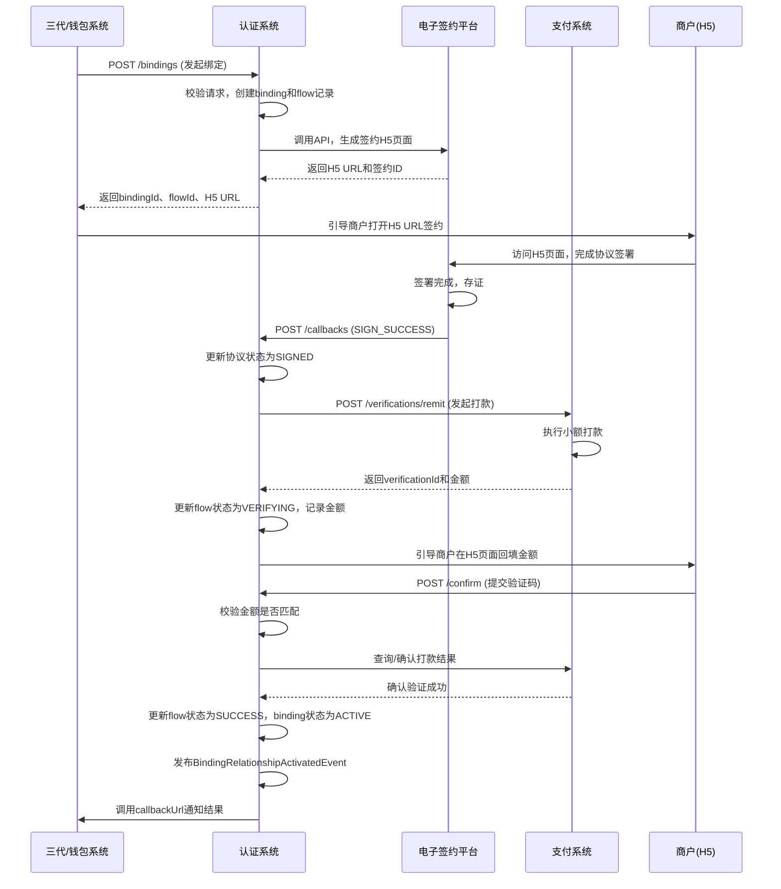
```mermaid
sequenceDiagram
    participant C as 三代/钱包系统
    participant A as 认证系统
    participant E as 电子签约平台
    participant P as 支付系统
    participant M as 商户(H5)

    C->>A: POST /bindings (发起绑定)
    A->>A: 校验请求，创建binding和flow记录
    A->>E: 调用API，生成签约H5页面
    E-->>A: 返回H5 URL和签约ID
    A-->>C: 返回bindingId、flowId、H5 URL
    C->>M: 引导商户打开H5 URL签约

    M->>E: 访问H5页面，完成协议签署
    E->>E: 签署完成，存证
    E->>A: POST /callbacks (SIGN_SUCCESS)
    A->>A: 更新协议状态为SIGNED

    A->>P: POST /verifications/remit (发起打款)
    P->>P: 执行小额打款
    P-->>A: 返回verificationId和金额
    A->>A: 更新flow状态为VERIFYING，记录金额
    A->>M: 引导商户在H5页面回填金额

    M->>A: POST /confirm (提交验证码)
    A->>A: 校验金额是否匹配
    A->>P: 查询/确认打款结果
    P-->>A: 确认验证成功
    A->>A: 更新flow状态为SUCCESS，binding状态为ACTIVE
    A->>A: 发布BindingRelationshipActivatedEvent
    A->>C: 调用callbackUrl通知结果
```

## 6. 错误处理

| 错误类型 | HTTP 状态码 | 错误码 | 处理策略 |
| :--- | :--- | :--- | :--- |
| 请求参数无效 | 400 | AUTH_4001 | 详细描述哪个字段不符合规则，请求方修正后重试。 |
| 绑定关系已存在 | 409 | AUTH_4091 | 返回已存在的绑定关系ID和状态，请求方根据业务决定是否继续。 |
| 账户状态非法 | 400 | AUTH_4002 | 提示具体原因，如“非天财专用账户”，需上游系统先完成账户升级。 |
| 认证流程不存在 | 404 | AUTH_4041 | 记录日志，返回明确错误，引导用户重新发起流程。 |
| 打款验证失败 | 400/422 | AUTH_4003 | 返回剩余重试次数，引导用户重新获取验证码。 |
| 外部系统依赖超时 | 502 | AUTH_5021 | 实现重试机制（如对电子签回调），并记录告警，人工介入处理。 |
| 系统内部错误 | 500 | AUTH_5001 | 记录完整错误堆栈，告警，返回通用错误信息，保证数据一致性。 |

**通用策略**：
- **幂等性**：所有创建类接口通过`requestId`保证幂等。
- **异步补偿**：对于外部回调超时，有定时任务扫描`VERIFYING`状态超时的流程，主动查询外部系统状态进行补偿。
- **事务边界**：核心状态变更（如`ACTIVE`）需保证本地数据库更新与事件发布的最终一致性（采用本地事务表+事件发布器模式）。

## 7. 依赖说明

本模块作为核心业务支撑模块，与上游系统紧密协作：

1.  **三代系统 / 行业钱包系统 (上游调用方)**：
    - **交互方式**: 同步REST API调用 + 异步事件监听/发布。
    - **职责**: 它们作为业务流程的发起者，调用认证系统完成“关系绑定”和“开通付款”。认证系统通过回调URL或事件通知它们最终结果。
    - **关键点**: 认证系统需提供清晰的API文档和状态码，上游系统负责处理失败和重试逻辑。

2.  **电子签约平台 (外部服务)**：
    - **交互方式**: 同步API调用（发起签约） + 异步HTTP回调（接收结果）。
    - **职责**: 提供协议模板、H5页面封装、签署流程和司法存证。认证系统需适配其API，并妥善管理回调的验签和安全。
    - **关键点**: 网络隔离、回调重试机制、协议模板版本管理。

3.  **支付系统 / 清结算系统 (外部服务)**：
    - **交互方式**: 同步API调用（发起打款、确认结果）。
    - **职责**: 执行打款验证的小额支付，并返回支付结果供认证系统校验。
    - **关键点**: 打款金额的随机生成与安全存储，支付结果查询的幂等性。

4.  **账户系统 (事件生产者)**：
    - **交互方式**: 异步事件消费 (`MerchantAccountUpgradedEvent`)。
    - **职责**: 认证系统监听账户升级事件，可提前准备或提示相关绑定流程。

5.  **业务核心 (事件消费者/校验方)**：
    - **交互方式**: 提供校验API 或 消费其事件并回复校验结果。
    - **职责**: 在分账交易执行前，确保资金流转的合法性。认证系统提供高效、高可用的校验服务。

**依赖治理**：
- 对所有外部依赖定义降级策略（如缓存有效的绑定关系，在电子签不可用时允许先验证后补签）。
- 设置合理的超时时间和重试策略。
- 通过健康检查和熔断器（如Hystrix/Sentinel）防止级联故障。

## 3.3 计费中台


# 计费中台模块设计文档

## 1. 概述

### 1.1 目的
计费中台模块是“天财分账”业务的核心计费引擎，负责在资金流转（分账、归集、批量付款、会员结算）过程中，根据预设的计费规则，精确计算并确定应由哪一方（付方、收方或双方）承担手续费，以及手续费的金额。其核心目标是实现计费规则的统一管理、计费过程的透明可追溯，并为后续的利润核算和账单生成提供准确的数据基础。

### 1.2 范围
- **计费触发**：接收来自“业务核心”的计费请求，该请求在分账指令处理前或处理中发起。
- **规则管理**：支持配置和维护基于不同维度（如业务场景、商户类型、账户类型、金额区间、渠道）的计费规则。
- **费用计算**：根据请求参数和匹配的计费规则，计算应收手续费。
- **费用记录与分摊**：记录每笔计费结果，明确费用类型、承担方和金额。
- **结果返回**：将计费结果（含手续费金额、承担方信息）返回给“业务核心”，用于后续的资金划拨和账务处理。
- **对账支持**：向“对账单系统”提供计费明细数据。

**边界说明**：
- 本模块不负责实际资金的扣划或加收，仅提供计算依据。
- 不负责计费规则的配置界面，但提供规则管理的后端服务接口。
- 不直接与支付渠道交互获取费率，所有规则由运营人员在后台预先配置。

## 2. 接口设计

### 2.1 API端点 (RESTful)

#### 2.1.1 计算手续费
- **端点**: `POST /api/v1/fee/calculate`
- **描述**: 核心计费接口，根据交易信息计算手续费。
- **请求头**:
    - `X-Request-ID`: 请求唯一标识
    - `Content-Type`: `application/json`
- **请求体 (CalculateFeeRequest)**:
```json
{
  "requestId": "req_1234567890",
  "bizScene": "COLLECTION | BATCH_PAY | MEMBER_SETTLE | TRANSFER",
  "payerId": "企业ID或门店ID",
  "payerAccountNo": "付方天财账户号",
  "payerAccountType": "RECEIVE_ACCT | PAYEE_ACCT",
  "payeeId": "企业ID或门店ID",
  "payeeAccountNo": "收方天财账户号",
  "payeeAccountType": "RECEIVE_ACCT | PAYEE_ACCT",
  "amount": 10000,
  "currency": "CNY",
  "channel": "WECHAT | ALIPAY | UNIONPAY",
  "productCode": "T001",
  "extInfo": {
    "relationId": "绑定的关系ID",
    "originalOrderNo": "原始支付订单号（如适用）"
  }
}
```
- **响应体 (CalculateFeeResponse)**:
```json
{
  "code": "SUCCESS",
  "message": "成功",
  "data": {
    "feeRequestId": "fee_req_9876543210",
    "totalFee": 30,
    "currency": "CNY",
    "feeDetails": [
      {
        "feeType": "SERVICE_FEE | WITHDRAW_FEE",
        "feeBearer": "PAYER | PAYEE | SHARED",
        "calculatedAmount": 30,
        "rate": "0.003",
        "fixedFee": 0,
        "minFee": 0,
        "maxFee": 100,
        "ruleId": "rule_001"
      }
    ],
    "payerFinalAmount": 9970,
    "payeeReceiveAmount": 10000
  }
}
```

#### 2.1.2 查询计费结果
- **端点**: `GET /api/v1/fee/result/{feeRequestId}`
- **描述**: 根据计费请求ID查询详细的计费结果。

#### 2.1.3 计费规则管理接口 (内部/运营使用)
- **端点**: `POST /api/v1/fee/rules` (创建)
- **端点**: `PUT /api/v1/fee/rules/{ruleId}` (更新)
- **端点**: `POST /api/v1/fee/rules/query` (查询)
- **描述**: 用于配置和查询计费规则。

### 2.2 发布/消费的事件

#### 2.2.1 消费的事件
- `Transaction.Created`: 当“业务核心”创建一笔新的分账/转账交易时触发，计费中台监听此事件以启动异步计费流程（可选，作为`/calculate` API的补充）。

#### 2.2.2 发布的事件
- `Fee.Calculated`: 当手续费计算完成时发布。包含`feeRequestId`, `bizScene`, `amount`, `totalFee`, `feeBearer`等信息。可能被“业务核心”（用于确认最终划款金额）、“清结算系统”（用于账务处理）和“对账单系统”（用于账单生成）消费。
- `Fee.Rule.Updated`: 当计费规则发生变更时发布，用于通知其他系统（如缓存刷新）。

## 3. 数据模型

### 3.1 核心数据表设计

#### 3.1.1 计费规则表 (`fee_rule`)
存储所有计费规则。
| 字段名 | 类型 | 描述 | 约束 |
| :--- | :--- | :--- | :--- |
| `id` | BIGINT | 主键 | PK, AUTO_INCREMENT |
| `rule_id` | VARCHAR(32) | 规则唯一标识 | UNIQUE, NOT NULL |
| `rule_name` | VARCHAR(64) | 规则名称 | NOT NULL |
| `biz_scene` | VARCHAR(32) | 业务场景 | NOT NULL |
| `payer_account_type` | VARCHAR(32) | 付方账户类型 | NULL |
| `payee_account_type` | VARCHAR(32) | 收方账户类型 | NULL |
| `channel` | VARCHAR(32) | 支付渠道 | NULL |
| `product_code` | VARCHAR(32) | 产品码 | NULL |
| `fee_type` | VARCHAR(32) | 费用类型 | NOT NULL |
| `calc_mode` | VARCHAR(16) | 计算模式: RATE, FIXED, MIXED | NOT NULL |
| `rate` | DECIMAL(10,6) | 费率（百分比或小数） | NULL |
| `fixed_fee` | DECIMAL(15,2) | 固定费用 | NULL |
| `min_fee` | DECIMAL(15,2) | 最低费用 | NULL |
| `max_fee` | DECIMAL(15,2) | 最高费用 | NULL |
| `fee_bearer` | VARCHAR(16) | 承担方: PAYER, PAYEE, SHARED | NOT NULL |
| `shared_ratio_payer` | DECIMAL(5,4) | 分摊比例（付方） | DEFAULT 1.0 |
| `priority` | INT | 规则优先级 | NOT NULL |
| `status` | TINYINT | 状态: 0-禁用, 1-启用 | DEFAULT 1 |
| `effective_time` | DATETIME | 生效时间 | NOT NULL |
| `expire_time` | DATETIME | 失效时间 | NULL |
| `creator` | VARCHAR(64) | 创建人 | |
| `created_at` | DATETIME | 创建时间 | DEFAULT CURRENT_TIMESTAMP |
| `updated_at` | DATETIME | 更新时间 | DEFAULT CURRENT_TIMESTAMP ON UPDATE |

#### 3.1.2 计费请求记录表 (`fee_request`)
记录每一次计费请求和结果。
| 字段名 | 类型 | 描述 | 约束 |
| :--- | :--- | :--- | :--- |
| `id` | BIGINT | 主键 | PK, AUTO_INCREMENT |
| `fee_request_id` | VARCHAR(32) | 计费请求唯一ID | UNIQUE, NOT NULL |
| `original_request_id` | VARCHAR(32) | 业务方原始请求ID | INDEX |
| `biz_scene` | VARCHAR(32) | 业务场景 | NOT NULL |
| `trans_no` | VARCHAR(64) | 关联的交易流水号 | INDEX |
| `payer_id` | VARCHAR(32) | 付方ID | |
| `payer_account_no` | VARCHAR(64) | 付方账户号 | INDEX |
| `payee_id` | VARCHAR(32) | 收方ID | |
| `payee_account_no` | VARCHAR(64) | 收方账户号 | INDEX |
| `amount` | DECIMAL(15,2) | 交易金额 | NOT NULL |
| `currency` | CHAR(3) | 币种 | DEFAULT 'CNY' |
| `total_fee` | DECIMAL(15,2) | 总手续费 | |
| `fee_bearer_summary` | VARCHAR(16) | 承担方汇总 | |
| `payer_final_amount` | DECIMAL(15,2) | 付方最终扣款金额 | |
| `payee_receive_amount` | DECIMAL(15,2) | 收方实际到账金额 | |
| `calc_status` | VARCHAR(16) | 状态: PROCESSING, SUCCESS, FAILED | NOT NULL |
| `matched_rule_ids` | JSON | 匹配到的规则ID列表 | |
| `error_code` | VARCHAR(32) | 错误码 | |
| `error_msg` | TEXT | 错误信息 | |
| `request_context` | JSON | 完整的请求上下文（快照） | |
| `created_at` | DATETIME | 创建时间 | DEFAULT CURRENT_TIMESTAMP |

#### 3.1.3 计费明细表 (`fee_detail`)
记录每笔手续费的计算明细。
| 字段名 | 类型 | 描述 | 约束 |
| :--- | :--- | :--- | :--- |
| `id` | BIGINT | 主键 | PK, AUTO_INCREMENT |
| `fee_request_id` | VARCHAR(32) | 关联的计费请求ID | INDEX, FK |
| `rule_id` | VARCHAR(32) | 应用的规则ID | INDEX |
| `fee_type` | VARCHAR(32) | 费用类型 | NOT NULL |
| `fee_bearer` | VARCHAR(16) | 承担方 | NOT NULL |
| `calculated_amount` | DECIMAL(15,2) | 计算出的费用金额 | NOT NULL |
| `rate_used` | DECIMAL(10,6) | 使用的费率 | |
| `fixed_fee_used` | DECIMAL(15,2) | 使用的固定费 | |
| `min_max_constrained` | BOOLEAN | 是否受到最低/最高费用限制 | |
| `created_at` | DATETIME | 创建时间 | DEFAULT CURRENT_TIMESTAMP |

### 3.2 与其他模块的关系
- **业务核心**：通过同步API调用或异步事件接收计费请求，是本模块的主要调用方。
- **清结算系统**：消费`Fee.Calculated`事件，根据`feeBearer`和金额进行相应的内部账户簿记（例如，从付方账户扣除手续费，或记入手续费收入账户）。
- **对账单系统**：通过查询接口或消费事件，获取计费明细，并入账务对账单。
- **行业钱包系统/账户系统**：提供账户类型、状态等查询接口（间接依赖，通常通过业务核心传递信息）。

## 4. 业务逻辑

### 4.1 核心算法：规则匹配与费用计算

1. **规则匹配**：
   - 根据`CalculateFeeRequest`中的`bizScene`, `payerAccountType`, `payeeAccountType`, `channel`, `productCode`等字段，从`fee_rule`表中查询所有`status=1`且当前时间在生效期内的规则。
   - 规则匹配遵循**最具体优先**原则：
     a. 所有条件都匹配的规则。
     b. 条件为NULL的视为“通配”。
     c. 按`priority`字段降序排序，数字越大优先级越高。
     d. 选取优先级最高的一条或多条规则（同一笔交易可能触发多种费用类型，如服务费、提现费）。

2. **费用计算**：
   - 对于每条匹配的规则，根据`calc_mode`进行计算：
     - `RATE`: `fee = amount * rate`。注意百分比与小数的转换。
     - `FIXED`: `fee = fixed_fee`。
     - `MIXED`: `fee = max(min_fee, min(max_fee, amount * rate + fixed_fee))`。
   - 应用`min_fee`和`max_fee`限制。
   - 根据`fee_bearer`和`shared_ratio`确定承担方和分摊金额。

3. **结果汇总**：
   - 汇总所有`fee_detail`，得到`total_fee`。
   - 计算各方最终金额：
     - 若`fee_bearer`为`PAYER`: `payer_final_amount = amount + total_fee`, `payee_receive_amount = amount`。
     - 若为`PAYEE`: `payer_final_amount = amount`, `payee_receive_amount = amount - total_fee`。
     - 若为`SHARED`: 按比例分摊。

### 4.2 业务规则
- **默认规则**：必须配置一条全通配（`*`）的默认计费规则，确保任何交易都能匹配到规则。
- **规则冲突**：通过优先级(`priority`)解决，禁止创建完全相同的有效规则。
- **费用承担方逻辑**：
  - `归集`场景：通常由付款方（门店）承担手续费。
  - `批量付款`/`会员结算`场景：通常由付款方（总部）承担手续费。
  - `分账`场景：根据具体业务约定，可配置为任一方或双方分摊。
- **精度处理**：金额计算使用`BigDecimal`，最终结果四舍五入到分（0.01）。

### 4.3 验证逻辑
- **请求验证**：验证必填字段、金额为正数、账户状态（通过业务核心预验证）。
- **规则有效性验证**：确保匹配到的规则在有效期内且启用。
- **计算验证**：计算完成后，验证`payer_final_amount`和`payee_receive_amount`非负。

## 5. 时序图

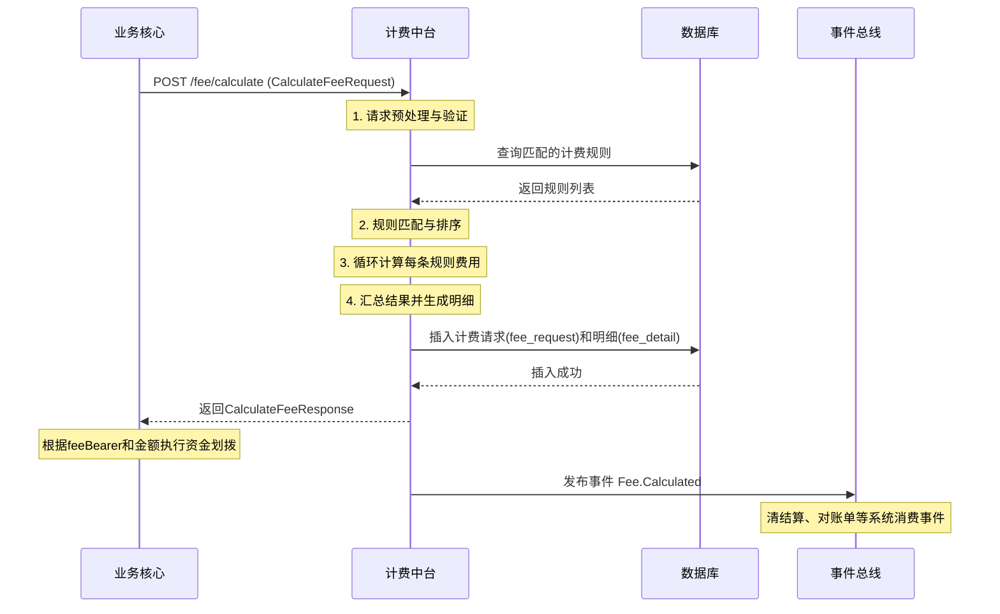
```mermaid
sequenceDiagram
    participant BC as 业务核心
    participant FM as 计费中台
    participant DB as 数据库
    participant ES as 事件总线

    BC->>FM: POST /fee/calculate (CalculateFeeRequest)
    Note over FM: 1. 请求预处理与验证
    FM->>DB: 查询匹配的计费规则
    DB-->>FM: 返回规则列表
    Note over FM: 2. 规则匹配与排序
    Note over FM: 3. 循环计算每条规则费用
    Note over FM: 4. 汇总结果并生成明细
    FM->>DB: 插入计费请求(fee_request)和明细(fee_detail)
    DB-->>FM: 插入成功
    FM-->>BC: 返回CalculateFeeResponse
    Note over BC: 根据feeBearer和金额执行资金划拨
    FM->>ES: 发布事件 Fee.Calculated
    Note over ES: 清结算、对账单等系统消费事件
```

## 6. 错误处理

| 错误码 | HTTP状态码 | 描述 | 处理策略 |
| :--- | :--- | :--- | :--- |
| `FEE_4001` | 400 | 请求参数无效（如金额非正） | 返回详细错误信息，请求方修正后重试。 |
| `FEE_4002` | 400 | 必填字段缺失 | 同上。 |
| `FEE_5001` | 500 | 未匹配到任何计费规则 | 检查规则配置，确保存在默认规则。记录告警。 |
| `FEE_5002` | 500 | 计费规则配置冲突 | 记录错误日志并告警，人工介入检查规则优先级。返回系统错误。 |
| `FEE_5003` | 500 | 费用计算异常（如除零） | 记录异常上下文，返回系统错误。触发监控告警。 |
| `FEE_5004` | 500 | 数据库操作失败 | 记录错误日志，返回系统错误。依赖数据库重试机制或人工干预。 |

**通用策略**：
- 所有错误均以结构化JSON格式返回，包含`code`, `message`, `requestId`。
- 对于系统错误（5xx），记录完整的请求上下文和堆栈信息，便于排查。
- 设计**熔断机制**：当连续计算失败达到阈值，可短暂返回默认费率或快速失败，保护系统。

## 7. 依赖说明

### 7.1 上游模块交互
1. **业务核心**：
   - **交互方式**：同步REST API (`/fee/calculate`) 为主要模式，保证计费与交易执行的强一致性。异步事件 (`Transaction.Created`) 作为可选补充，用于异步计费场景。
   - **职责**：业务核心负责在发起资金划拨前调用计费中台，并依据返回的`payerFinalAmount`进行扣款。它需要传递准确的业务场景、账户信息和金额。

2. **配置管理后台（隐含）**：
   - **交互方式**：通过内部管理API (`/fee/rules`) 进行规则CRUD操作。
   - **职责**：提供界面供运营人员配置和维护复杂的计费规则。

### 7.2 下游模块交互
1. **清结算系统**：
   - **交互方式**：消费 `Fee.Calculated` 事件。
   - **职责**：根据事件中的手续费承担方和金额，进行内部账户的借贷记账，确保资金损益正确记录。

2. **对账单系统**：
   - **交互方式**：消费 `Fee.Calculated` 事件 或 通过查询API (`/fee/result`) 拉取数据。
   - **职责**：将手续费作为独立条目纳入商户或机构对账单，提供清晰的费用明细。

### 7.3 关键依赖保障
- **规则数据一致性**：计费规则变更需通过发布事件 (`Fee.Rule.Updated`) 通知相关系统，或确保在交易低谷期进行。计费中台本地可缓存热点规则，并设置短时间TTL。
- **数据最终一致性**：计费记录 (`fee_request`, `fee_detail`) 的创建与事件的发布应在一个分布式事务或利用本地事务表+事件日志模式保证最终一致性。
- **性能与可用性**：计费计算应是无状态的，便于水平扩展。对数据库的规则查询应考虑使用多级缓存（如Redis），以应对高频计算请求。

## 3.4 三代系统


# 三代系统模块设计文档

## 1. 概述

### 1.1 目的
本模块是"天财"业务场景下的核心业务管理系统，作为商户、机构、账户和业务关系的**权威数据源**和**业务控制中心**。它负责管理商户进件、机构配置、业务关系授权，并为下游系统（如行业钱包系统、账户系统）提供业务校验和控制指令。

### 1.2 范围
本模块的核心职责包括：
1. **商户与机构管理**：维护商户、门店、总部等业务实体的基础信息及与天财机构的关联关系。
2. **业务关系与授权管理**：管理总部与门店之间的归集、批量付款、会员结算等业务关系的建立、授权和状态维护。
3. **账户开通控制**：控制天财专用账户（收款账户、接收方账户）的开通、升级流程，并记录账户与商户的绑定关系。
4. **业务规则校验**：在执行分账、归集等资金操作前，对业务关系的有效性、权限进行校验。
5. **接口权限控制**：为外部系统（如天财商龙）提供API，并控制其可访问的业务范围。

**边界说明**：
- **不负责**：具体的账户操作（余额变动）、资金清算、协议签署流程、身份认证执行。
- **通过接口**：向行业钱包系统、账户系统提供业务校验服务，接收电子签约平台回调更新关系状态。

## 2. 接口设计

### 2.1 API端点 (RESTful)

#### 2.1.1 商户与机构管理
- `POST /api/v1/merchants` **创建/注册商户**
    - **描述**：为天财机构下注册一个新的商户（总部或门店）。
    - **请求体** (`CreateMerchantRequest`)：
      ```json
      {
        "requestId": "req_merchant_001",
        "institutionId": "TC001",
        "merchantType": "HEADQUARTERS", // HEADQUARTERS(总部), STORE(门店)
        "merchantName": "天财品牌总部",
        "legalPerson": "张三",
        "idCardNo": "310101199001011234",
        "businessLicenseNo": "91310101MA1F123456",
        "contactPhone": "13800138000",
        "parentMerchantId": null, // 门店需填写其总部ID
        "metadata": {}
      }
      ```
    - **响应体** (`MerchantResponse`)：
      ```json
      {
        "code": "SUCCESS",
        "message": "成功",
        "data": {
          "merchantId": "M100001",
          "institutionId": "TC001",
          "merchantType": "HEADQUARTERS",
          "status": "ACTIVE",
          "createdAt": "2023-10-27T12:00:00Z"
        }
      }
      ```

- `GET /api/v1/merchants/{merchantId}` **查询商户信息**
- `POST /api/v1/merchants/{merchantId}/status` **变更商户状态**

#### 2.1.2 账户开通控制
- `POST /api/v1/merchants/{merchantId}/accounts/apply` **申请开通天财专用账户**
    - **描述**：商户申请开通天财收款账户或接收方账户。本系统记录申请并触发后续流程（如调用账户系统开户）。
    - **请求体** (`ApplyAccountRequest`)：
      ```json
      {
        "requestId": "req_apply_acc_001",
        "accountType": "RECEIVABLE", // RECEIVABLE, RECEIVER
        "operationType": "CREATE", // CREATE(新开), UPGRADE(升级)
        "originalAccountNo": null, // 升级时填写原账户号
        "callbackUrl": "https://wallet-system/callback" // 开通结果回调地址
      }
      ```
    - **响应体**：
      ```json
      {
        "code": "SUCCESS",
        "message": "申请已受理",
        "data": {
          "applyNo": "APPLY_20231027_001",
          "status": "PROCESSING"
        }
      }
      ```

- `POST /api/v1/account-applies/{applyNo}/callback` **账户开通结果回调**
    - **描述**：**内部接口**，供账户系统或行业钱包系统回调，通知账户开通/升级结果。
    - **请求体**：
      ```json
      {
        "requestId": "callback_001",
        "applyNo": "APPLY_20231027_001",
        "success": true,
        "accountNo": "TC_RCV_20231027M100001", // 成功时返回
        "failReason": null, // 失败时返回
        "operatedAt": "2023-10-27T12:05:00Z"
      }
      ```

#### 2.1.3 业务关系与授权管理
- `POST /api/v1/business-relationships` **创建业务关系**
    - **描述**：建立总部与门店之间的业务关系（如归集、批量付款、会员结算）。此接口创建关系记录，并触发电子签约流程。
    - **请求体** (`CreateRelationshipRequest`)：
      ```json
      {
        "requestId": "req_rel_001",
        "payerMerchantId": "M100002", // 付方商户ID（门店）
        "payeeMerchantId": "M100001", // 收方商户ID（总部）
        "relationshipType": "COLLECTION", // COLLECTION(归集), BATCH_PAY(批量付款), MEMBER_SETTLE(会员结算)
        "authorizationScopes": ["DAILY_COLLECTION", "ADJUSTMENT"], // 授权范围
        "maxSingleAmount": "50000.00", // 单笔限额
        "dailyLimit": "200000.00", // 日累计限额
        "effectiveDate": "2023-11-01",
        "expiryDate": "2024-10-31",
        "callbackUrl": "https://esign/callback" // 电子签约回调地址
      }
      ```
    - **响应体**：
      ```json
      {
        "code": "SUCCESS",
        "message": "关系创建成功，已触发签约",
        "data": {
          "relationshipId": "REL_20231027_001",
          "signUrl": "https://esign/h5/contract?token=abc123", // H5签约链接
          "status": "SIGNING" // SIGNING, SIGNED, REJECTED, EXPIRED
        }
      }
      ```

- `POST /api/v1/business-relationships/{relationshipId}/callback` **签约结果回调**
    - **描述**：**内部接口**，供电子签约平台回调，通知协议签署结果。
    - **请求体**：
      ```json
      {
        "requestId": "esign_callback_001",
        "relationshipId": "REL_20231027_001",
        "signStatus": "SUCCESS", // SUCCESS, FAILURE
        "signTime": "2023-10-27T14:30:00Z",
        "contractId": "CONTRACT_001",
        "failReason": null,
        "metadata": {} // 存证信息等
      }
      ```

- `POST /api/v1/business-relationships/validate` **业务关系校验**
    - **描述**：**核心内部接口**，供行业钱包系统在发起分账/归集前调用，校验业务关系是否有效且授权充足。
    - **请求体** (`ValidateRelationshipRequest`)：
      ```json
      {
        "requestId": "req_validate_001",
        "payerMerchantId": "M100002",
        "payeeMerchantId": "M100001",
        "relationshipType": "COLLECTION",
        "operation": "DAILY_COLLECTION", // 具体操作类型
        "amount": "1000.00",
        "currency": "CNY"
      }
      ```
    - **响应体** (`ValidationResponse`)：
      ```json
      {
        "code": "SUCCESS",
        "message": "校验通过",
        "data": {
          "isValid": true,
          "relationshipId": "REL_20231027_001",
          "limits": {
            "maxSingleAmount": "50000.00",
            "remainingDailyAmount": "199000.00"
          },
          "failureReasons": null // 无效时返回原因数组
        }
      }
      ```

#### 2.1.4 对外提供天财商龙接口
- `POST /tiancai/api/v1/split` **发起天财分账**
    - **描述**：供天财商龙调用，发起分账、归集、会员结算等资金流转请求。
    - **请求体**：
      ```json
      {
        "requestId": "tc_req_001",
        "institutionId": "TC001",
        "businessType": "COLLECTION", // COLLECTION, BATCH_PAY, MEMBER_SETTLE
        "payerMerchantId": "M100002",
        "payeeMerchantId": "M100001",
        "amount": "1000.00",
        "currency": "CNY",
        "postScript": "日常归集",
        "callbackUrl": "https://tiancai/callback"
      }
      ```
    - **响应体**：
      ```json
      {
        "code": "SUCCESS",
        "message": "请求已接收",
        "data": {
          "businessRefNo": "TC_COLLECT_20231027_001", // 业务参考号，用于后续查询
          "status": "PROCESSING"
        }
      }
      ```

### 2.2 发布/消费的事件
- **消费事件**：
    - `ACCOUNT_CREATED` (来自账户系统)：更新本地账户绑定状态。
    - `CONTRACT_SIGNED` (来自电子签约平台)：更新业务关系状态为生效。
- **发布事件** (`BusinessEvent`)：
    - **事件类型**：`MERCHANT_REGISTERED`, `ACCOUNT_APPLY_CREATED`, `RELATIONSHIP_ESTABLISHED`, `BUSINESS_REQUEST_RECEIVED`
    - **事件通道**：`message-bus:business-events`
    - **事件体示例** (`BUSINESS_REQUEST_RECEIVED`)：
      ```json
      {
        "eventId": "evt_biz_001",
        "type": "BUSINESS_REQUEST_RECEIVED",
        "occurredAt": "2023-10-27T15:00:00Z",
        "payload": {
          "businessRefNo": "TC_COLLECT_20231027_001",
          "businessType": "COLLECTION",
          "payerMerchantId": "M100002",
          "payeeMerchantId": "M100001",
          "amount": "1000.00",
          "source": "TIANCAI_API"
        }
      }
      ```

## 3. 数据模型

### 3.1 核心表设计
```sql
-- 商户信息表（权威数据源）
CREATE TABLE `t_merchant` (
  `id` bigint(20) NOT NULL AUTO_INCREMENT,
  `merchant_id` varchar(32) NOT NULL COMMENT '商户ID，系统生成唯一标识',
  `institution_id` varchar(32) NOT NULL COMMENT '所属机构ID（天财）',
  `merchant_type` varchar(16) NOT NULL COMMENT 'HEADQUARTERS, STORE',
  `merchant_name` varchar(128) NOT NULL,
  `legal_person` varchar(64) DEFAULT NULL,
  `id_card_no` varchar(32) DEFAULT NULL,
  `business_license_no` varchar(64) DEFAULT NULL,
  `contact_phone` varchar(20) DEFAULT NULL,
  `parent_merchant_id` varchar(32) DEFAULT NULL COMMENT '上级商户ID（门店指向总部）',
  `status` varchar(16) NOT NULL DEFAULT 'ACTIVE' COMMENT 'ACTIVE, INACTIVE',
  `metadata` json DEFAULT NULL,
  `created_at` datetime NOT NULL DEFAULT CURRENT_TIMESTAMP,
  `updated_at` datetime NOT NULL DEFAULT CURRENT_TIMESTAMP ON UPDATE CURRENT_TIMESTAMP,
  PRIMARY KEY (`id`),
  UNIQUE KEY `uk_merchant_id` (`merchant_id`),
  UNIQUE KEY `uk_inst_license` (`institution_id`, `business_license_no`) COMMENT '同一机构下营业执照唯一',
  KEY `idx_parent` (`parent_merchant_id`),
  KEY `idx_inst_type` (`institution_id`, `merchant_type`)
) ENGINE=InnoDB COMMENT='商户信息表';

-- 账户绑定关系表
CREATE TABLE `t_account_binding` (
  `id` bigint(20) NOT NULL AUTO_INCREMENT,
  `merchant_id` varchar(32) NOT NULL COMMENT '商户ID',
  `institution_id` varchar(32) NOT NULL,
  `account_no` varchar(64) NOT NULL COMMENT '账户系统生成的账户号',
  `account_type` varchar(32) NOT NULL COMMENT 'RECEIVABLE, RECEIVER',
  `bind_status` varchar(16) NOT NULL DEFAULT 'BOUND' COMMENT 'BOUND, UNBOUND',
  `apply_no` varchar(64) DEFAULT NULL COMMENT '关联的申请单号',
  `created_at` datetime NOT NULL DEFAULT CURRENT_TIMESTAMP,
  `updated_at` datetime NOT NULL DEFAULT CURRENT_TIMESTAMP ON UPDATE CURRENT_TIMESTAMP,
  PRIMARY KEY (`id`),
  UNIQUE KEY `uk_account_no` (`account_no`),
  UNIQUE KEY `uk_merchant_acc_type` (`merchant_id`, `account_type`) COMMENT '一个商户一种账户类型只绑一个',
  KEY `idx_merchant` (`merchant_id`),
  KEY `idx_apply_no` (`apply_no`)
) ENGINE=InnoDB COMMENT='商户-账户绑定关系表';

-- 账户开通申请记录表
CREATE TABLE `t_account_apply` (
  `id` bigint(20) NOT NULL AUTO_INCREMENT,
  `apply_no` varchar(64) NOT NULL COMMENT '申请单号',
  `merchant_id` varchar(32) NOT NULL,
  `institution_id` varchar(32) NOT NULL,
  `account_type` varchar(32) NOT NULL,
  `operation_type` varchar(16) NOT NULL COMMENT 'CREATE, UPGRADE',
  `original_account_no` varchar(64) DEFAULT NULL,
  `status` varchar(16) NOT NULL DEFAULT 'SUBMITTED' COMMENT 'SUBMITTED, PROCESSING, SUCCESS, FAILED',
  `callback_url` varchar(512) DEFAULT NULL,
  `account_no` varchar(64) DEFAULT NULL COMMENT '开通成功的账户号',
  `fail_reason` varchar(256) DEFAULT NULL,
  `created_at` datetime NOT NULL DEFAULT CURRENT_TIMESTAMP,
  `updated_at` datetime NOT NULL DEFAULT CURRENT_TIMESTAMP ON UPDATE CURRENT_TIMESTAMP,
  PRIMARY KEY (`id`),
  UNIQUE KEY `uk_apply_no` (`apply_no`),
  KEY `idx_merchant_status` (`merchant_id`, `status`),
  KEY `idx_created` (`created_at`)
) ENGINE=InnoDB COMMENT='账户开通申请记录表';

-- 业务关系表
CREATE TABLE `t_business_relationship` (
  `id` bigint(20) NOT NULL AUTO_INCREMENT,
  `relationship_id` varchar(64) NOT NULL COMMENT '关系唯一ID',
  `payer_merchant_id` varchar(32) NOT NULL COMMENT '付方商户ID',
  `payee_merchant_id` varchar(32) NOT NULL COMMENT '收方商户ID',
  `relationship_type` varchar(32) NOT NULL COMMENT 'COLLECTION, BATCH_PAY, MEMBER_SETTLE',
  `authorization_scopes` json NOT NULL COMMENT '授权操作范围数组',
  `max_single_amount` decimal(20,2) NOT NULL,
  `daily_limit` decimal(20,2) NOT NULL,
  `daily_consumed` decimal(20,2) NOT NULL DEFAULT '0.00' COMMENT '今日已用额度',
  `effective_date` date NOT NULL,
  `expiry_date` date NOT NULL,
  `status` varchar(16) NOT NULL DEFAULT 'SIGNING' COMMENT 'SIGNING, EFFECTIVE, REJECTED, EXPIRED',
  `contract_id` varchar(64) DEFAULT NULL COMMENT '电子合同ID',
  `sign_time` datetime DEFAULT NULL,
  `last_reset_date` date NOT NULL DEFAULT CURRENT_DATE COMMENT '额度最后重置日期',
  `metadata` json DEFAULT NULL,
  `created_at` datetime NOT NULL DEFAULT CURRENT_TIMESTAMP,
  `updated_at` datetime NOT NULL DEFAULT CURRENT_TIMESTAMP ON UPDATE CURRENT_TIMESTAMP,
  PRIMARY KEY (`id`),
  UNIQUE KEY `uk_relationship_id` (`relationship_id`),
  UNIQUE KEY `uk_payer_payee_type` (`payer_merchant_id`, `payee_merchant_id`, `relationship_type`) COMMENT '同一对商户间同类型关系唯一',
  KEY `idx_payer` (`payer_merchant_id`),
  KEY `idx_payee` (`payee_merchant_id`),
  KEY `idx_status_expiry` (`status`, `expiry_date`)
) ENGINE=InnoDB COMMENT='业务关系授权表';

-- 业务请求记录表（用于跟踪外部请求）
CREATE TABLE `t_business_request` (
  `id` bigint(20) NOT NULL AUTO_INCREMENT,
  `business_ref_no` varchar(64) NOT NULL COMMENT '业务参考号，对外暴露',
  `request_id` varchar(64) NOT NULL COMMENT '请求方传入的requestId',
  `institution_id` varchar(32) NOT NULL,
  `business_type` varchar(32) NOT NULL COMMENT 'COLLECTION, BATCH_PAY, MEMBER_SETTLE',
  `payer_merchant_id` varchar(32) NOT NULL,
  `payee_merchant_id` varchar(32) NOT NULL,
  `amount` decimal(20,2) NOT NULL,
  `currency` char(3) NOT NULL DEFAULT 'CNY',
  `status` varchar(16) NOT NULL DEFAULT 'RECEIVED' COMMENT 'RECEIVED, VALIDATING, PROCESSING, SUCCESS, FAILED',
  `relationship_id` varchar(64) DEFAULT NULL COMMENT '关联的业务关系ID',
  `validation_result` json DEFAULT NULL COMMENT '校验结果快照',
  `callback_url` varchar(512) DEFAULT NULL,
  `fail_reason` varchar(256) DEFAULT NULL,
  `source` varchar(32) NOT NULL COMMENT 'TIANCAI_API, INTERNAL',
  `created_at` datetime NOT NULL DEFAULT CURRENT_TIMESTAMP,
  `updated_at` datetime NOT NULL DEFAULT CURRENT_TIMESTAMP ON UPDATE CURRENT_TIMESTAMP,
  PRIMARY KEY (`id`),
  UNIQUE KEY `uk_business_ref_no` (`business_ref_no`),
  UNIQUE KEY `uk_request_id_source` (`request_id`, `source`) COMMENT '请求幂等键',
  KEY `idx_merchant_time` (`payer_merchant_id`, `created_at`),
  KEY `idx_status` (`status`)
) ENGINE=InnoDB COMMENT='业务请求记录表';
```

### 3.2 与其他模块的关系
- **行业钱包系统**：调用本模块的`/validate`接口进行业务校验；接收本模块的账户开通申请并处理。
- **账户系统**：接收本模块的账户开通指令（通过行业钱包或直接调用）；回调本模块通知开通结果。
- **电子签约平台**：接收本模块发起的签约请求；回调本模块通知签约结果。
- **清结算系统/业务核心**：在需要业务校验时，通过行业钱包系统间接依赖本模块。

## 4. 业务逻辑

### 4.1 核心算法与规则
1. **商户ID生成规则**：
   - 格式：`{机构简码}{类型码}{日期}{序列号}`
   - 示例：天财总部 `TC_HQ_20231027_001`
   - 确保在机构内唯一。

2. **业务参考号生成规则**：
   - 对外暴露，用于查询和回调。
   - 格式：`{业务类型}_{机构}_{日期}_{序列号}`
   - 示例：`COLLECTION_TC_20231027_001`

3. **业务关系状态机**：
   ```
   [创建] --> SIGNING --(签约成功)--> EFFECTIVE
                           |
                           +--(签约失败)--> REJECTED
   
   EFFECTIVE --(到期)--> EXPIRED
           |
           +--(手动终止)--> TERMINATED
   ```
   - 仅`EFFECTIVE`状态的关系可用于资金流转。
   - 每日定时任务重置`daily_consumed`额度（当`last_reset_date` < 当前日期时）。

4. **业务请求处理流程**：
   - 接收外部请求 → 生成`business_ref_no` → 记录到`t_business_request` → 异步校验业务关系 → 校验通过后发布事件或调用下游系统。

5. **额度校验与更新**：
   - 校验时：`amount <= max_single_amount` 且 `daily_consumed + amount <= daily_limit`
   - 校验通过后，预占额度（更新`daily_consumed`），防止超额。
   - 最终交易成功/失败后，接收行业钱包系统回调，调整`daily_consumed`（失败时释放额度）。

### 4.2 验证逻辑
- **创建商户**：校验同一机构下`business_license_no`不重复；门店需校验`parent_merchant_id`存在且为总部。
- **申请账户**：校验商户状态为`ACTIVE`；校验同一商户同类型账户是否已绑定。
- **创建业务关系**：校验付方和收方商户存在、状态有效且属于同一机构；校验关系类型与商户类型匹配（如归集场景付方必须是门店）。
- **业务关系校验**：
   - 关系存在且状态为`EFFECTIVE`。
   - 当前日期在`effective_date`和`expiry_date`之间。
   - 请求的`operation`在`authorization_scopes`内。
   - 金额满足单笔和当日额度限制。
- **外部API请求**：校验`institution_id`合法性；校验`request_id`幂等。

## 5. 时序图

### 5.1 天财商龙发起归集请求时序图
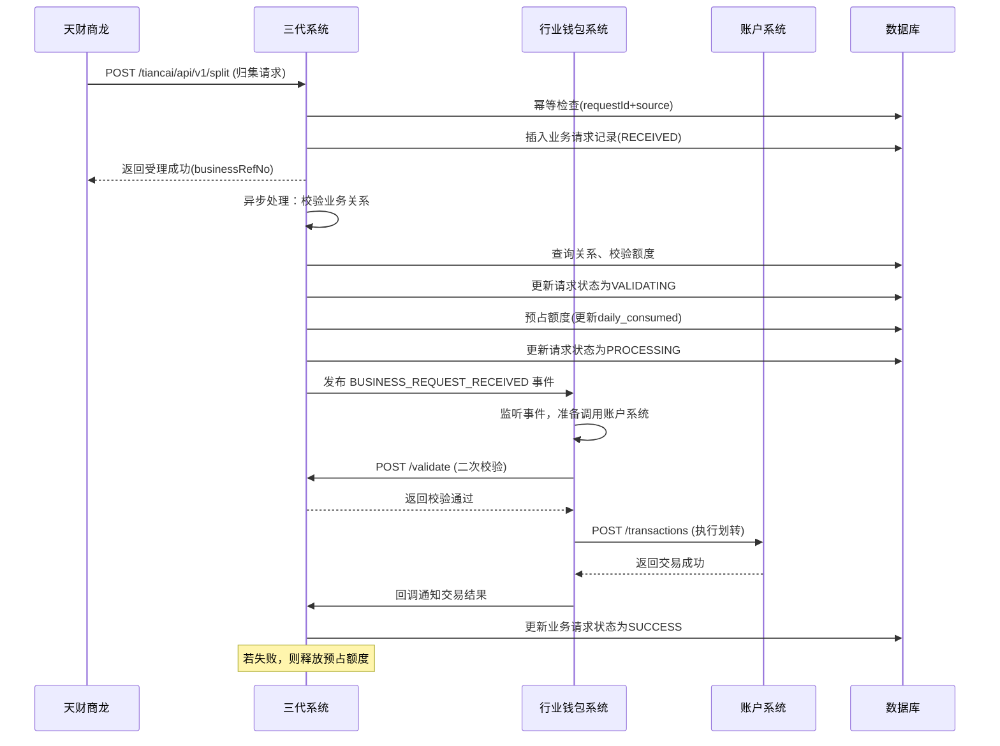
```mermaid
sequenceDiagram
    participant TC as 天财商龙
    participant ThreeGen as 三代系统
    participant Wallet as 行业钱包系统
    participant Account as 账户系统
    participant DB as 数据库

    TC->>ThreeGen: POST /tiancai/api/v1/split (归集请求)
    ThreeGen->>DB: 幂等检查(requestId+source)
    ThreeGen->>DB: 插入业务请求记录(RECEIVED)
    ThreeGen-->>TC: 返回受理成功(businessRefNo)
    
    ThreeGen->>ThreeGen: 异步处理：校验业务关系
    ThreeGen->>DB: 查询关系、校验额度
    ThreeGen->>DB: 更新请求状态为VALIDATING
    ThreeGen->>DB: 预占额度(更新daily_consumed)
    ThreeGen->>DB: 更新请求状态为PROCESSING
    ThreeGen->>Wallet: 发布 BUSINESS_REQUEST_RECEIVED 事件
    
    Wallet->>Wallet: 监听事件，准备调用账户系统
    Wallet->>ThreeGen: POST /validate (二次校验)
    ThreeGen-->>Wallet: 返回校验通过
    Wallet->>Account: POST /transactions (执行划转)
    Account-->>Wallet: 返回交易成功
    Wallet->>ThreeGen: 回调通知交易结果
    ThreeGen->>DB: 更新业务请求状态为SUCCESS
    Note over ThreeGen: 若失败，则释放预占额度
```

### 5.2 开通天财收款账户时序图
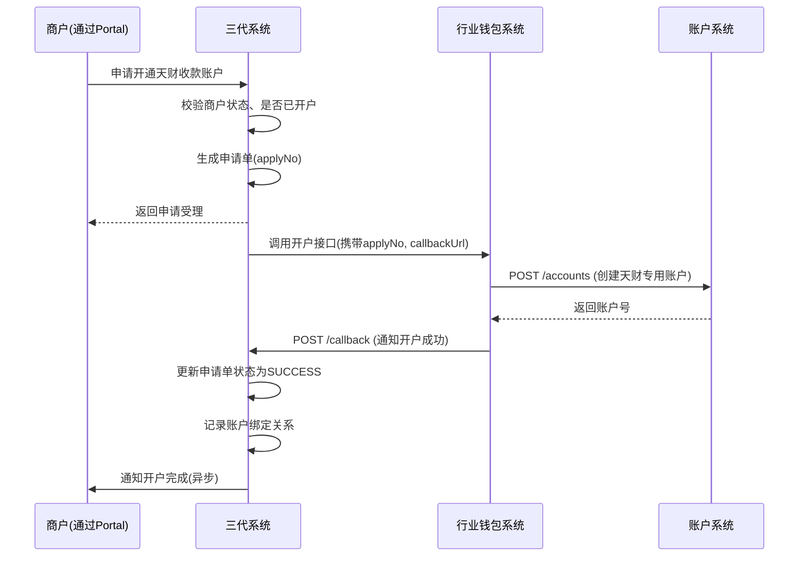
```mermaid
sequenceDiagram
    participant Merchant as 商户(通过Portal)
    participant ThreeGen as 三代系统
    participant Wallet as 行业钱包系统
    participant Account as 账户系统

    Merchant->>ThreeGen: 申请开通天财收款账户
    ThreeGen->>ThreeGen: 校验商户状态、是否已开户
    ThreeGen->>ThreeGen: 生成申请单(applyNo)
    ThreeGen-->>Merchant: 返回申请受理
    
    ThreeGen->>Wallet: 调用开户接口(携带applyNo, callbackUrl)
    Wallet->>Account: POST /accounts (创建天财专用账户)
    Account-->>Wallet: 返回账户号
    Wallet->>ThreeGen: POST /callback (通知开户成功)
    ThreeGen->>ThreeGen: 更新申请单状态为SUCCESS
    ThreeGen->>ThreeGen: 记录账户绑定关系
    ThreeGen->>Merchant: 通知开户完成(异步)
```

## 6. 错误处理

| 错误码 | HTTP状态码 | 描述 | 处理策略 |
| :--- | :--- | :--- | :--- |
| `MERCHANT_NOT_FOUND` | 404 | 商户不存在 | 调用方检查商户ID |
| `MERCHANT_STATUS_INVALID` | 400 | 商户状态非ACTIVE | 调用方需先激活商户 |
| `DUPLICATE_BUSINESS_LICENSE` | 409 | 营业执照号重复 | 提示商户已注册 |
| `RELATIONSHIP_NOT_FOUND` | 404 | 业务关系不存在 | 需先建立业务关系并签约 |
| `RELATIONSHIP_INVALID` | 400 | 关系未生效/已过期 | 检查关系状态和有效期 |
| `AUTHORIZATION_DENIED` | 403 | 操作不在授权范围内 | 检查授权范围或重新签约 |
| `LIMIT_EXCEEDED` | 400 | 超出单笔或日累计限额 | 调整金额或次日重试 |
| `DUPLICATE_REQUEST_ID` | 409 | 请求ID重复 | 返回已存在的业务记录，实现幂等 |
| `INSTITUTION_MISMATCH` | 400 | 机构不匹配 | 检查请求参数 |
| `PARENT_MERCHANT_INVALID` | 400 | 上级商户无效 | 门店必须指定有效的总部 |

**通用策略**：
- **异步处理与重试**：对于外部请求，采用"同步受理+异步处理"模式。内部处理失败可重试。
- **额度预占与释放**：校验时预占额度，交易最终失败后必须释放，防止额度冻结。
- **监控与告警**：对长时间处于`PROCESSING`状态的请求、高频校验失败进行监控告警。
- **数据一致性**：依赖数据库事务保证核心状态变更的原子性。

## 7. 依赖说明

本模块是业务控制中心，与多个上下游系统协作：

1. **上游调用方（强依赖）**：
   - **天财商龙（外部）**：通过开放API发起业务请求。需保证接口的幂等性和安全性。
   - **内部管理Portal**：提供商户管理、关系管理等操作界面。

2. **下游服务调用（强依赖）**：
   - **行业钱包系统**：调用其开户接口；接收其业务请求事件并处理。需保证其接口的可靠性，故障时需有重试和人工介入流程。
   - **电子签约平台**：调用其发起签约接口。签约流程异步，超时或失败需有补偿机制（如状态同步任务）。

3. **回调接口提供方（弱依赖）**：
   - **账户系统**：接收其开户结果回调。回调失败时，本模块应有定时任务主动查询未完结的申请单。
   - **电子签约平台**：接收其签约结果回调。同样需要超时补偿机制。

4. **外部依赖**：
   - **数据库（MySQL）**：强依赖，存储所有业务状态。需高可用、定期备份。
   - **消息中间件**：弱依赖，用于事件发布。故障时可降级为数据库轮询。

5. **协作模式**：
   - 本模块是**业务规则的制定者和校验者**，不直接操作资金。
   - 采用**事件驱动**与**同步调用**结合的方式，平衡实时性与可靠性。
   - 对于关键业务链（如开户），实现**全链路跟踪**（通过`applyNo`、`businessRefNo`）。

## 3.5 业务核心


# 业务核心模块设计文档

## 1. 概述

### 1.1 目的
本模块是"天财分账"业务的核心交易处理引擎，负责接收并处理来自上游系统（如行业钱包系统）的分账、归集、批量付款、会员结算等资金流转指令。它作为业务逻辑的协调者，负责校验业务规则、计算手续费、编排账户操作，并确保交易的最终一致性。

### 1.2 范围
本模块的核心职责包括：
1. **交易指令处理**：接收并验证各类天财分账业务指令（分账、归集、批量付款、会员结算）。
2. **业务规则校验**：验证付方与收方的关系绑定状态、账户状态、权限等业务前置条件。
3. **手续费计算**：调用计费中台计算交易手续费，并支持内扣或外扣模式。
4. **交易编排与执行**：协调账户系统完成资金划转，处理可能的异常情况。
5. **交易状态管理**：维护交易的生命周期状态，提供查询和冲正能力。
6. **异步任务处理**：处理批量付款等异步任务，支持任务拆分、并发执行和进度跟踪。

**边界说明**：
- **不负责**：账户的底层操作（由账户系统负责）、协议签署与认证（由电子签约平台负责）、对账单生成（由对账单系统负责）。
- **通过接口**：接收上游系统的交易请求，调用下游系统完成业务处理。

## 2. 接口设计

### 2.1 API端点 (RESTful)

#### 2.1.1 交易执行接口
- `POST /api/v1/transactions/split` **执行分账/转账**
    - **描述**：处理从天财收款账户到另一个天财账户（收款或接收方）的单笔资金划转。
    - **请求体** (`SplitRequest`)：
      ```json
      {
        "requestId": "split_req_202310271200001", // 请求唯一ID，用于幂等
        "businessType": "TIANCAI_SPLIT", // 业务类型: TIANCAI_SPLIT, COLLECTION, MEMBER_SETTLEMENT
        "payerAccountNo": "TC_RCV_HQ001", // 付方账户号（天财收款账户）
        "payeeAccountNo": "TC_RCV_STORE001", // 收方账户号（天财收款或接收方账户）
        "amount": "1000.00", // 分账金额
        "currency": "CNY",
        "feeDeductionMode": "INNER", // 手续费扣款模式: INNER(内扣), OUTER(外扣)
        "remark": "门店分账",
        "metadata": {
          "relationId": "rel_001", // 关系绑定ID
          "originalOrderNo": "order_001" // 原交易订单号（如有）
        }
      }
      ```
    - **响应体** (`TransactionResponse`)：
      ```json
      {
        "code": "SUCCESS",
        "message": "成功",
        "data": {
          "transactionNo": "TXN202310271200001", // 业务核心交易流水号
          "status": "SUCCEED", // SUCCEED, PROCESSING, FAILED
          "payerAccountNo": "TC_RCV_HQ001",
          "payeeAccountNo": "TC_RCV_STORE001",
          "amount": "1000.00",
          "feeAmount": "2.00", // 手续费金额
          "netAmount": "998.00", // 净额（内扣时）
          "completedAt": "2023-10-27T12:00:05Z",
          "businessRefNo": "split_001" // 传递给账户系统的业务参考号
        }
      }
      ```

- `POST /api/v1/transactions/batch-payment` **发起批量付款**
    - **描述**：处理总部向多个接收方的批量付款请求，异步执行。
    - **请求体** (`BatchPaymentRequest`)：
      ```json
      {
        "requestId": "batch_req_202310271200001",
        "businessType": "BATCH_PAYMENT",
        "payerAccountNo": "TC_RCV_HQ001",
        "batchItems": [
          {
            "payeeAccountNo": "TC_RCV_SUPPLIER001",
            "amount": "5000.00",
            "remark": "供应商货款"
          },
          {
            "payeeAccountNo": "TC_RCV_SHAREHOLDER001",
            "amount": "3000.00",
            "remark": "股东分红"
          }
        ],
        "currency": "CNY",
        "feeDeductionMode": "OUTER",
        "callbackUrl": "https://callback.example.com/notify",
        "metadata": {
          "batchName": "10月供应商结算"
        }
      }
      ```
    - **响应体**：
      ```json
      {
        "code": "SUCCESS",
        "message": "批量任务已接收",
        "data": {
          "batchNo": "BATCH202310271200001", // 批次号
          "status": "PROCESSING",
          "totalCount": 2,
          "successCount": 0,
          "failCount": 0,
          "estimatedCompletionTime": "2023-10-27T12:05:00Z"
        }
      }
      ```

#### 2.1.2 查询接口
- `GET /api/v1/transactions/{transactionNo}` **查询交易详情**
- `GET /api/v1/transactions/batches/{batchNo}` **查询批量任务详情**
- `GET /api/v1/transactions/batches/{batchNo}/items` **查询批量任务明细**（支持分页）

#### 2.1.3 管理接口
- `POST /api/v1/transactions/{transactionNo}/reverse` **交易冲正**
    - **描述**：对已成功的交易进行冲正（仅限于当日且未结算的交易）。
    - **请求体**：
      ```json
      {
        "requestId": "reverse_req_001",
        "reason": "操作失误"
      }
      ```

### 2.2 发布/消费的事件

#### 2.2.1 消费的事件
- **事件类型**：`RELATION_VERIFIED`（来自电子签约平台）
- **事件通道**：`message-bus:relation-events`
- **事件体示例**：
  ```json
  {
    "eventId": "evt_rel_001",
    "type": "RELATION_VERIFIED",
    "occurredAt": "2023-10-27T11:30:00Z",
    "payload": {
      "relationId": "rel_001",
      "payerAccountNo": "TC_RCV_HQ001",
      "payeeAccountNo": "TC_RCV_STORE001",
      "relationType": "COLLECTION", // COLLECTION, BATCH_PAYMENT, MEMBER_SETTLEMENT
      "status": "ACTIVE",
      "verifiedAt": "2023-10-27T11:30:00Z",
      "expiresAt": "2024-10-27T11:30:00Z"
    }
  }
  ```

#### 2.2.2 发布的事件
- **事件类型**：`TRANSACTION_COMPLETED`, `BATCH_TASK_COMPLETED`
- **事件通道**：`message-bus:transaction-events`
- **事件体示例** (`TRANSACTION_COMPLETED`)：
  ```json
  {
    "eventId": "evt_txn_001",
    "type": "TRANSACTION_COMPLETED",
    "occurredAt": "2023-10-27T12:00:05Z",
    "payload": {
      "transactionNo": "TXN202310271200001",
      "businessType": "TIANCAI_SPLIT",
      "payerAccountNo": "TC_RCV_HQ001",
      "payeeAccountNo": "TC_RCV_STORE001",
      "amount": "1000.00",
      "feeAmount": "2.00",
      "status": "SUCCEED",
      "completedAt": "2023-10-27T12:00:05Z",
      "businessRefNo": "split_001"
    }
  }
  ```

## 3. 数据模型

### 3.1 核心表设计

```sql
-- 交易主表
CREATE TABLE `t_transaction` (
  `id` bigint(20) NOT NULL AUTO_INCREMENT,
  `transaction_no` varchar(64) NOT NULL COMMENT '业务核心交易流水号',
  `request_id` varchar(64) NOT NULL COMMENT '请求唯一ID，用于幂等',
  `business_type` varchar(32) NOT NULL COMMENT '业务类型',
  `payer_account_no` varchar(64) NOT NULL COMMENT '付方账户号',
  `payee_account_no` varchar(64) NOT NULL COMMENT '收方账户号',
  `amount` decimal(20,2) NOT NULL COMMENT '交易金额',
  `currency` char(3) NOT NULL DEFAULT 'CNY',
  `fee_amount` decimal(20,2) DEFAULT '0.00' COMMENT '手续费金额',
  `fee_deduction_mode` varchar(16) NOT NULL DEFAULT 'INNER' COMMENT '手续费扣款模式',
  `net_amount` decimal(20,2) DEFAULT NULL COMMENT '净额（内扣时计算）',
  `status` varchar(16) NOT NULL DEFAULT 'INIT' COMMENT 'INIT, PROCESSING, SUCCEED, FAILED, REVERSED',
  `fail_reason` varchar(512) DEFAULT NULL COMMENT '失败原因',
  `relation_id` varchar(64) DEFAULT NULL COMMENT '关系绑定ID',
  `business_ref_no` varchar(64) DEFAULT NULL COMMENT '传递给账户系统的业务参考号',
  `remark` varchar(256) DEFAULT NULL COMMENT '备注',
  `metadata` json DEFAULT NULL COMMENT '扩展信息',
  `completed_at` datetime DEFAULT NULL COMMENT '完成时间',
  `created_at` datetime NOT NULL DEFAULT CURRENT_TIMESTAMP,
  `updated_at` datetime NOT NULL DEFAULT CURRENT_TIMESTAMP ON UPDATE CURRENT_TIMESTAMP,
  PRIMARY KEY (`id`),
  UNIQUE KEY `uk_transaction_no` (`transaction_no`),
  UNIQUE KEY `uk_request_id` (`request_id`),
  KEY `idx_payer_account` (`payer_account_no`, `created_at`),
  KEY `idx_payee_account` (`payee_account_no`, `created_at`),
  KEY `idx_status_created` (`status`, `created_at`),
  KEY `idx_business_ref` (`business_ref_no`)
) ENGINE=InnoDB COMMENT='交易主表';

-- 批量任务表
CREATE TABLE `t_batch_task` (
  `id` bigint(20) NOT NULL AUTO_INCREMENT,
  `batch_no` varchar(64) NOT NULL COMMENT '批次号',
  `request_id` varchar(64) NOT NULL COMMENT '请求唯一ID',
  `business_type` varchar(32) NOT NULL COMMENT '业务类型',
  `payer_account_no` varchar(64) NOT NULL COMMENT '付方账户号',
  `total_count` int(11) NOT NULL COMMENT '总笔数',
  `total_amount` decimal(20,2) NOT NULL COMMENT '总金额',
  `success_count` int(11) NOT NULL DEFAULT '0',
  `fail_count` int(11) NOT NULL DEFAULT '0',
  `status` varchar(16) NOT NULL DEFAULT 'INIT' COMMENT 'INIT, PROCESSING, PARTIAL_SUCCESS, SUCCEED, FAILED',
  `callback_url` varchar(512) DEFAULT NULL COMMENT '回调地址',
  `metadata` json DEFAULT NULL COMMENT '扩展信息',
  `completed_at` datetime DEFAULT NULL,
  `created_at` datetime NOT NULL DEFAULT CURRENT_TIMESTAMP,
  `updated_at` datetime NOT NULL DEFAULT CURRENT_TIMESTAMP ON UPDATE CURRENT_TIMESTAMP,
  PRIMARY KEY (`id`),
  UNIQUE KEY `uk_batch_no` (`batch_no`),
  UNIQUE KEY `uk_request_id` (`request_id`),
  KEY `idx_payer_status` (`payer_account_no`, `status`)
) ENGINE=InnoDB COMMENT='批量任务表';

-- 批量任务明细表
CREATE TABLE `t_batch_task_item` (
  `id` bigint(20) NOT NULL AUTO_INCREMENT,
  `batch_no` varchar(64) NOT NULL COMMENT '批次号',
  `item_no` varchar(64) NOT NULL COMMENT '明细项编号',
  `payee_account_no` varchar(64) NOT NULL COMMENT '收方账户号',
  `amount` decimal(20,2) NOT NULL COMMENT '金额',
  `fee_amount` decimal(20,2) DEFAULT '0.00',
  `status` varchar(16) NOT NULL DEFAULT 'PENDING' COMMENT 'PENDING, PROCESSING, SUCCEED, FAILED',
  `transaction_no` varchar(64) DEFAULT NULL COMMENT '对应的交易流水号',
  `fail_reason` varchar(512) DEFAULT NULL,
  `remark` varchar(256) DEFAULT NULL,
  `processed_at` datetime DEFAULT NULL,
  `created_at` datetime NOT NULL DEFAULT CURRENT_TIMESTAMP,
  `updated_at` datetime NOT NULL DEFAULT CURRENT_TIMESTAMP ON UPDATE CURRENT_TIMESTAMP,
  PRIMARY KEY (`id`),
  UNIQUE KEY `uk_batch_item` (`batch_no`, `item_no`),
  KEY `idx_batch_status` (`batch_no`, `status`),
  KEY `idx_transaction_no` (`transaction_no`)
) ENGINE=InnoDB COMMENT='批量任务明细表';

-- 关系绑定缓存表（从事件同步）
CREATE TABLE `t_relation_cache` (
  `id` bigint(20) NOT NULL AUTO_INCREMENT,
  `relation_id` varchar(64) NOT NULL COMMENT '关系绑定ID',
  `payer_account_no` varchar(64) NOT NULL COMMENT '付方账户号',
  `payee_account_no` varchar(64) NOT NULL COMMENT '收方账户号',
  `relation_type` varchar(32) NOT NULL COMMENT '关系类型',
  `status` varchar(16) NOT NULL COMMENT 'ACTIVE, INACTIVE, EXPIRED',
  `verified_at` datetime NOT NULL COMMENT '认证时间',
  `expires_at` datetime DEFAULT NULL COMMENT '过期时间',
  `metadata` json DEFAULT NULL,
  `created_at` datetime NOT NULL DEFAULT CURRENT_TIMESTAMP,
  `updated_at` datetime NOT NULL DEFAULT CURRENT_TIMESTAMP ON UPDATE CURRENT_TIMESTAMP,
  PRIMARY KEY (`id`),
  UNIQUE KEY `uk_relation` (`relation_id`),
  UNIQUE KEY `uk_accounts_type` (`payer_account_no`, `payee_account_no`, `relation_type`),
  KEY `idx_status_expires` (`status`, `expires_at`)
) ENGINE=InnoDB COMMENT='关系绑定缓存表';
```

### 3.2 与其他模块的关系
- **行业钱包系统**：主要上游调用方，发起各类分账交易请求。
- **账户系统**：下游依赖，调用其账务操作接口完成资金划转。
- **计费中台**：下游依赖，调用其计算交易手续费。
- **电子签约平台**：上游事件源，消费关系绑定验证完成事件。
- **对账单系统**：下游事件订阅方，订阅交易完成事件生成对账单。

## 4. 业务逻辑

### 4.1 核心算法与规则

#### 4.1.1 交易处理流程
1. **请求接收与幂等校验**：通过`request_id`确保同一请求只处理一次。
2. **参数校验**：验证必填字段、金额格式、账户号格式等。
3. **业务前置条件校验**：
   - 付方账户必须为天财收款账户。
   - 收方账户必须为天财收款账户或天财接收方账户。
   - 检查付方与收方的关系绑定状态（从`t_relation_cache`查询）。
   - 对于批量付款和会员结算，需额外检查"开通付款"授权状态。
4. **手续费计算**：调用计费中台，根据业务类型、金额、账户类型计算手续费。
5. **净额计算**：
   - 内扣模式：`net_amount = amount - fee_amount`
   - 外扣模式：`net_amount = amount`，手续费单独从付方账户扣除
6. **账户操作编排**：
   - 调用账户系统执行交易，传递`business_ref_no`（格式：`{transaction_no}_FEE`用于手续费）
   - 对于内扣：付方出账`net_amount`，收方入账`net_amount`，手续费单独出账
   - 对于外扣：付方出账`amount`，收方入账`amount`，手续费单独出账
7. **状态更新与事件发布**：更新交易状态，发布完成事件。

#### 4.1.2 批量付款处理
1. **任务拆分**：将批量请求拆分为多个明细项，每项生成独立的`item_no`。
2. **并发控制**：使用线程池或消息队列异步处理，控制并发度（如每秒10笔）。
3. **进度跟踪**：实时更新`t_batch_task`的成功/失败计数。
4. **结果汇总**：所有明细处理完成后，更新批次状态，触发回调通知。

#### 4.1.3 关系绑定缓存管理
- 监听`RELATION_VERIFIED`事件，更新`t_relation_cache`。
- 定期清理过期或失效的关系记录。
- 提供本地缓存查询，减少对外部系统的依赖。

### 4.2 验证逻辑

#### 4.2.1 交易验证
```java
// 伪代码示例
public ValidationResult validateTransaction(SplitRequest request) {
    // 1. 基础校验
    if (request.amount <= 0) return ValidationResult.error("金额必须大于0");
    
    // 2. 账户校验（可调用账户系统接口）
    Account payerAccount = accountService.getAccount(request.payerAccountNo);
    if (payerAccount == null) return ValidationResult.error("付方账户不存在");
    if (!payerAccount.isTiancaiReceivable()) return ValidationResult.error("付方必须为天财收款账户");
    if (payerAccount.isFrozen()) return ValidationResult.error("付方账户已冻结");
    
    // 3. 关系绑定校验
    RelationCache relation = relationCacheService.getRelation(
        request.payerAccountNo, 
        request.payeeAccountNo, 
        request.businessType
    );
    if (relation == null || !relation.isActive()) {
        return ValidationResult.error("关系绑定未生效或已过期");
    }
    
    // 4. 余额校验（对于外扣模式需包含手续费）
    BigDecimal requiredAmount = request.amount;
    if ("OUTER".equals(request.feeDeductionMode)) {
        FeeResult fee = feeService.calculateFee(request);
        requiredAmount = requiredAmount.add(fee.getFeeAmount());
    }
    if (payerAccount.getAvailableBalance().compareTo(requiredAmount) < 0) {
        return ValidationResult.error("付方账户余额不足");
    }
    
    return ValidationResult.success();
}
```

#### 4.2.2 冲正验证
- 仅允许冲正当日(`created_at >= CURRENT_DATE`)的交易。
- 仅允许冲正状态为`SUCCEED`的交易。
- 检查交易是否已参与结算（可查询清结算系统）。

## 5. 时序图

### 5.1 单笔分账交易时序图

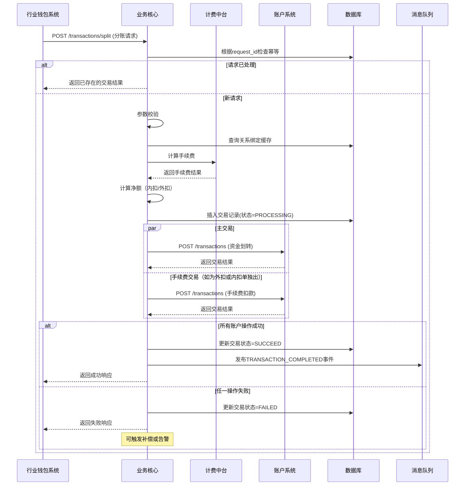
```mermaid
sequenceDiagram
    participant Client as 行业钱包系统
    participant Core as 业务核心
    participant Fee as 计费中台
    participant Account as 账户系统
    participant DB as 数据库
    participant MQ as 消息队列

    Client->>Core: POST /transactions/split (分账请求)
    Core->>DB: 根据request_id检查幂等
    alt 请求已处理
        Core-->>Client: 返回已存在的交易结果
    else 新请求
        Core->>Core: 参数校验
        Core->>DB: 查询关系绑定缓存
        Core->>Fee: 计算手续费
        Fee-->>Core: 返回手续费结果
        Core->>Core: 计算净额（内扣/外扣）
        Core->>DB: 插入交易记录(状态=PROCESSING)
        
        par 主交易
            Core->>Account: POST /transactions (资金划转)
            Account-->>Core: 返回交易结果
        and 手续费交易（如为外扣或内扣单独出）
            Core->>Account: POST /transactions (手续费扣款)
            Account-->>Core: 返回交易结果
        end
        
        alt 所有账户操作成功
            Core->>DB: 更新交易状态=SUCCEED
            Core->>MQ: 发布TRANSACTION_COMPLETED事件
            Core-->>Client: 返回成功响应
        else 任一操作失败
            Core->>DB: 更新交易状态=FAILED
            Core-->>Client: 返回失败响应
            Note over Core: 可触发补偿或告警
        end
    end
```

### 5.2 批量付款时序图

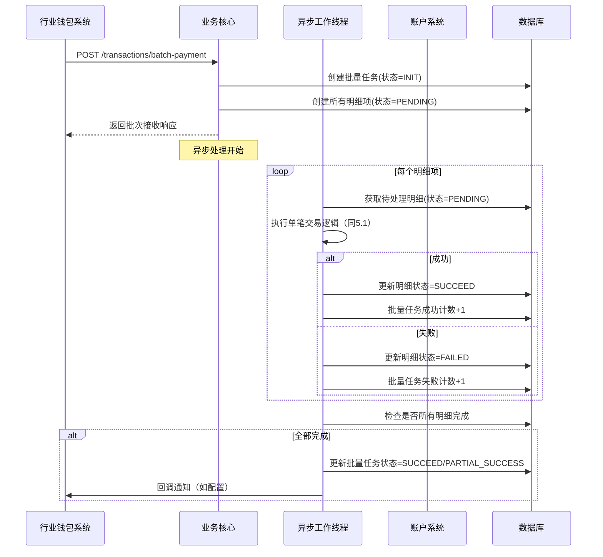
```mermaid
sequenceDiagram
    participant Client as 行业钱包系统
    participant Core as 业务核心
    participant Worker as 异步工作线程
    participant Account as 账户系统
    participant DB as 数据库

    Client->>Core: POST /transactions/batch-payment
    Core->>DB: 创建批量任务(状态=INIT)
    Core->>DB: 创建所有明细项(状态=PENDING)
    Core-->>Client: 返回批次接收响应
    
    Note over Core: 异步处理开始
    loop 每个明细项
        Worker->>DB: 获取待处理明细(状态=PENDING)
        Worker->>Worker: 执行单笔交易逻辑（同5.1）
        alt 成功
            Worker->>DB: 更新明细状态=SUCCEED
            Worker->>DB: 批量任务成功计数+1
        else 失败
            Worker->>DB: 更新明细状态=FAILED
            Worker->>DB: 批量任务失败计数+1
        end
    end
    
    Worker->>DB: 检查是否所有明细完成
    alt 全部完成
        Worker->>DB: 更新批量任务状态=SUCCEED/PARTIAL_SUCCESS
        Worker->>Client: 回调通知（如配置）
    end
```

## 6. 错误处理

| 错误码 | HTTP状态码 | 描述 | 处理策略 |
| :--- | :--- | :--- | :--- |
| `INVALID_PARAMETER` | 400 | 参数格式错误或缺失 | 调用方检查请求参数 |
| `DUPLICATE_REQUEST` | 409 | 重复请求（幂等冲突） | 返回已存在的交易结果 |
| `RELATION_NOT_FOUND` | 400 | 关系绑定不存在或未生效 | 调用方需先完成关系绑定 |
| `ACCOUNT_VALIDATION_FAILED` | 400 | 账户校验失败（状态异常、类型不符等） | 检查账户状态和类型 |
| `INSUFFICIENT_BALANCE` | 400 | 付方余额不足 | 调用方提示或终止业务 |
| `FEE_CALCULATION_FAILED` | 500 | 手续费计算失败 | 记录告警，人工介入 |
| `ACCOUNT_OPERATION_FAILED` | 500 | 账户操作失败 | 根据错误类型决定重试或标记失败 |
| `BATCH_PROCESSING_ERROR` | 500 | 批量处理异常 | 记录失败明细，继续处理其他项 |
| `REVERSE_NOT_ALLOWED` | 400 | 不允许冲正 | 检查冲正条件（时间、状态、结算状态） |

**通用策略**：
- **重试机制**：对于网络超时、临时性错误，使用指数退避策略重试（最多3次）。
- **补偿交易**：对于"已扣款未加款"场景，记录异常日志，触发人工对账补偿流程。
- **熔断与降级**：对计费中台、账户系统等依赖设置熔断器，失败时降级为使用默认费率或拒绝交易。
- **监控告警**：监控交易失败率、平均处理时间、批量任务积压等指标。

## 7. 依赖说明

### 7.1 上游依赖
1. **行业钱包系统**（强依赖）
   - **交互方式**：同步REST API调用
   - **职责**：发起所有分账业务请求，需保证请求的幂等性（携带`request_id`）
   - **容错**：接口超时设置（如5秒），失败时行业钱包系统负责重试

2. **电子签约平台**（弱依赖）
   - **交互方式**：异步消息消费（`RELATION_VERIFIED`事件）
   - **职责**：提供关系绑定状态信息
   - **容错**：消息可能延迟或丢失，本地缓存需设置TTL，支持手动刷新

### 7.2 下游依赖
1. **账户系统**（强依赖）
   - **交互方式**：同步REST API调用
   - **职责**：执行底层资金划转操作
   - **容错**：必须保证调用幂等性（`business_ref_no`），失败时根据错误类型决定重试策略

2. **计费中台**（强依赖）
   - **交互方式**：同步REST API调用
   - **职责**：计算交易手续费
   - **容错**：失败时可降级使用默认费率（记录告警），或拒绝交易

3. **消息中间件**（弱依赖）
   - **交互方式**：异步消息发布
   - **职责**：发布交易完成事件
   - **容错**：消息发送失败时记录本地日志，后续补发

### 7.3 协作模式
- **同步处理**：单笔交易采用同步处理，实时返回结果。
- **异步处理**：批量付款采用异步处理，先响应接收，后处理并回调。
- **最终一致性**：通过事件驱动保证各系统间状态最终一致。
- **监控对账**：与账户系统、清结算系统定期对账，确保数据一致性。

## 3.6 清结算系统


# 清结算系统模块设计文档

## 1. 概述

### 1.1 目的
清结算系统是资金流转的核心处理引擎，负责处理收单资金的**清算**（资金计算与核对）与**结算**（资金划拨）全流程。本模块在“天财”业务场景下，核心职责是管理从**待结算账户**到**天财收款账户**的资金结算，以及处理**退货账户**的资金流转，确保商户资金按时、准确、安全地入账。

### 1.2 范围
本模块的核心职责包括：
1.  **结算处理**：根据结算规则（主动/被动），将收单交易资金从**待结算账户**划拨至商户的**天财收款账户**。
2.  **退货资金处理**：管理**退货账户**的资金，处理退款交易的资金扣划与返还。
3.  **结算单生成**：生成并记录每一笔结算操作的明细，作为对账依据。
4.  **日终批处理**：执行定时任务，处理T+1等结算周期的资金批量结算。
5.  **异常处理与对账**：处理结算失败场景，并与支付渠道对账文件进行核对，确保账实相符。

**边界说明**：
- **不负责**：账户开立与升级、分账/归集/批量付款等业务指令处理、手续费计算、协议签署。
- **通过接口**：从**业务核心**或**支付系统**接收待结算交易数据，调用**账户系统**执行资金划拨，与**对账单系统**同步结算结果。

## 2. 接口设计

### 2.1 API端点 (RESTful)

#### 2.1.1 结算指令接口
- `POST /api/v1/settlements/instructions` **创建结算指令**
    - **描述**：接收来自业务核心的结算指令，触发单笔或批量资金的结算。支持主动结算（实时）和被动结算（定时/手动）。
    - **请求体** (`CreateSettlementInstructionRequest`)：
      ```json
      {
        "requestId": "settle_req_20231028001",
        "instructionType": "MERCHANT_SETTLEMENT", // 指令类型: MERCHANT_SETTLEMENT(商户结算), REFUND_SETTLEMENT(退货结算)
        "settlementMode": "ACTIVE", // 结算模式: ACTIVE(主动结算), PASSIVE(被动结算)
        "merchantId": "M100001",
        "institutionId": "TC001",
        "currency": "CNY",
        "totalAmount": "10000.00", // 结算总金额
        "feeAmount": "10.00", // 手续费金额（由计费中台提供）
        "netAmount": "9990.00", // 净结算金额
        "settlementDate": "2023-10-28", // 结算日期（资金归属日）
        "items": [ // 结算明细项（可选，用于对账）
          {
            "tradeNo": "pay_20231027001",
            "amount": "100.00",
            "fee": "0.10"
          }
        ],
        "metadata": {
          "channelBatchNo": "channel_batch_001", // 渠道批次号（如有）
          "triggerSource": "BATCH_JOB" // 触发来源: BATCH_JOB, MANUAL, API
        }
      }
      ```
    - **响应体** (`SettlementInstructionResponse`)：
      ```json
      {
        "code": "SUCCESS",
        "message": "结算指令接收成功",
        "data": {
          "instructionNo": "SETTLE_INST_202310280001", // 结算指令号
          "status": "PROCESSING", // PROCESSING, SUCCEEDED, FAILED
          "estimatedCompleteTime": "2023-10-28T02:00:00Z"
        }
      }
      ```

- `POST /api/v1/settlements/{instructionNo}/retry` **重试结算指令**
    - **描述**：对失败的结算指令进行手动或自动重试。
    - **请求体**：
      ```json
      {
        "requestId": "retry_req_001",
        "reason": "系统重试"
      }
      ```

#### 2.1.2 查询接口
- `GET /api/v1/settlements/instructions/{instructionNo}` **查询结算指令详情**
- `GET /api/v1/settlements/merchants/{merchantId}` **查询商户结算记录** (支持按时间、状态过滤)
- `GET /api/v1/settlements/daily-summary` **查询日终结算汇总** (按机构、日期)

#### 2.1.3 管理接口
- `POST /api/v1/settlements/daily-closing` **触发日终批处理**
    - **描述**：手动触发T+1结算的日终批处理流程（通常由定时任务调用）。
    - **请求体**：
      ```json
      {
        "requestId": "daily_close_20231028",
        "settlementDate": "2023-10-27", // 结算哪一天的交易
        "institutionId": "TC001" // 可选，不传则处理所有机构
      }
      ```

### 2.2 发布/消费的事件

- **消费事件**：
    - **事件类型**：`TRADE_SETTLED` (来自业务核心或支付系统，通知交易已清算完成，可结算)
    - **事件通道**：`message-bus:trade-events`
    - **事件体示例**：
      ```json
      {
        "eventId": "trade_settled_001",
        "type": "TRADE_SETTLED",
        "occurredAt": "2023-10-27T23:00:00Z",
        "payload": {
          "tradeNo": "pay_20231027001",
          "merchantId": "M100001",
          "institutionId": "TC001",
          "amount": "100.00",
          "fee": "0.10",
          "settlementDate": "2023-10-28", // 资金可结算日期
          "channelBatchNo": "channel_batch_001"
        }
      }
      ```

- **发布事件**：
    - **事件类型**：`SETTLEMENT_COMPLETED`, `SETTLEMENT_FAILED`
    - **事件通道**：`message-bus:settlement-events`
    - **事件体示例** (`SETTLEMENT_COMPLETED`)：
      ```json
      {
        "eventId": "settle_comp_001",
        "type": "SETTLEMENT_COMPLETED",
        "occurredAt": "2023-10-28T02:05:00Z",
        "payload": {
          "instructionNo": "SETTLE_INST_202310280001",
          "merchantId": "M100001",
          "institutionId": "TC001",
          "settlementAccountNo": "TC_RCV_20231027M100001", // 商户天财收款账户
          "amount": "9990.00",
          "feeAmount": "10.00",
          "settlementDate": "2023-10-28",
          "transactionNo": "T202310280200001" // 账户系统交易流水号
        }
      }
      ```

## 3. 数据模型

### 3.1 核心表设计

```sql
-- 结算指令主表
CREATE TABLE `t_settlement_instruction` (
  `id` bigint(20) NOT NULL AUTO_INCREMENT,
  `instruction_no` varchar(64) NOT NULL COMMENT '结算指令号',
  `request_id` varchar(64) NOT NULL COMMENT '请求唯一ID，用于幂等',
  `instruction_type` varchar(32) NOT NULL COMMENT 'MERCHANT_SETTLEMENT, REFUND_SETTLEMENT',
  `settlement_mode` varchar(16) NOT NULL COMMENT 'ACTIVE, PASSIVE',
  `merchant_id` varchar(32) NOT NULL,
  `institution_id` varchar(32) NOT NULL,
  `currency` char(3) NOT NULL DEFAULT 'CNY',
  `total_amount` decimal(20,2) NOT NULL COMMENT '结算总金额（含费）',
  `fee_amount` decimal(20,2) NOT NULL DEFAULT '0.00' COMMENT '手续费',
  `net_amount` decimal(20,2) NOT NULL COMMENT '净结算金额',
  `status` varchar(16) NOT NULL DEFAULT 'INIT' COMMENT 'INIT, PROCESSING, SUCCEEDED, FAILED, PARTIAL_FAILED',
  `settlement_date` date NOT NULL COMMENT '结算日期（资金归属日）',
  `settlement_account_no` varchar(64) DEFAULT NULL COMMENT '目标结算账户（天财收款账户）',
  `unsettled_account_no` varchar(64) NOT NULL COMMENT '源账户（01待结算账户）',
  `transaction_no` varchar(64) DEFAULT NULL COMMENT '账户系统交易流水号',
  `error_code` varchar(64) DEFAULT NULL COMMENT '失败错误码',
  `error_message` text DEFAULT NULL COMMENT '失败详情',
  `retry_count` int(11) NOT NULL DEFAULT '0',
  `metadata` json DEFAULT NULL COMMENT '扩展信息',
  `completed_at` datetime DEFAULT NULL,
  `created_at` datetime NOT NULL DEFAULT CURRENT_TIMESTAMP,
  `updated_at` datetime NOT NULL DEFAULT CURRENT_TIMESTAMP ON UPDATE CURRENT_TIMESTAMP,
  PRIMARY KEY (`id`),
  UNIQUE KEY `uk_instruction_no` (`instruction_no`),
  UNIQUE KEY `uk_request_id` (`request_id`),
  KEY `idx_merchant_settle_date` (`merchant_id`, `settlement_date`),
  KEY `idx_status_retry` (`status`, `retry_count`, `created_at`),
  KEY `idx_institution_date` (`institution_id`, `settlement_date`)
) ENGINE=InnoDB COMMENT='结算指令主表';

-- 结算明细表（关联原始交易）
CREATE TABLE `t_settlement_detail` (
  `id` bigint(20) NOT NULL AUTO_INCREMENT,
  `instruction_no` varchar(64) NOT NULL COMMENT '关联结算指令号',
  `trade_no` varchar(64) NOT NULL COMMENT '原始交易流水号',
  `trade_type` varchar(32) NOT NULL COMMENT '支付、退款等',
  `amount` decimal(20,2) NOT NULL COMMENT '交易金额',
  `fee` decimal(20,2) NOT NULL DEFAULT '0.00' COMMENT '该笔交易手续费',
  `settlement_status` varchar(16) NOT NULL DEFAULT 'PENDING' COMMENT 'PENDING, SETTLED, FAILED',
  `channel_batch_no` varchar(64) DEFAULT NULL COMMENT '渠道批次号',
  `metadata` json DEFAULT NULL,
  `created_at` datetime NOT NULL DEFAULT CURRENT_TIMESTAMP,
  PRIMARY KEY (`id`),
  UNIQUE KEY `uk_instruction_trade` (`instruction_no`, `trade_no`),
  KEY `idx_trade_no` (`trade_no`),
  KEY `idx_channel_batch` (`channel_batch_no`)
) ENGINE=InnoDB COMMENT='结算明细表';

-- 日终结算批次表
CREATE TABLE `t_daily_settlement_batch` (
  `id` bigint(20) NOT NULL AUTO_INCREMENT,
  `batch_no` varchar(64) NOT NULL COMMENT '批次号',
  `institution_id` varchar(32) NOT NULL,
  `settlement_date` date NOT NULL,
  `total_instructions` int(11) NOT NULL DEFAULT '0' COMMENT '总指令数',
  `succeeded_instructions` int(11) NOT NULL DEFAULT '0',
  `failed_instructions` int(11) NOT NULL DEFAULT '0',
  `total_amount` decimal(20,2) NOT NULL DEFAULT '0.00',
  `status` varchar(16) NOT NULL DEFAULT 'PROCESSING' COMMENT 'PROCESSING, COMPLETED, PARTIAL_FAILED',
  `started_at` datetime NOT NULL,
  `completed_at` datetime DEFAULT NULL,
  `metadata` json DEFAULT NULL,
  PRIMARY KEY (`id`),
  UNIQUE KEY `uk_batch_no` (`batch_no`),
  UNIQUE KEY `uk_inst_settle_date` (`institution_id`, `settlement_date`) COMMENT '每日每机构一个批次'
) ENGINE=InnoDB COMMENT='日终结算批次表';
```

### 3.2 与其他模块的关系
- **账户系统**：**强依赖**。调用其`POST /api/v1/accounts/transactions`接口，执行从`待结算账户`到`天财收款账户`的资金划拨。
- **业务核心/支付系统**：**数据来源**。通过事件或接口接收已清算完成的交易数据，作为结算依据。
- **计费中台**：**弱依赖**。获取每笔结算对应的手续费明细（可在结算指令中携带，也可异步查询）。
- **对账单系统**：**数据输出**。发布`SETTLEMENT_COMPLETED`事件，供其生成商户结算单。
- **三代系统**：**弱依赖**。查询商户的结算模式（主动/被动）及对应的天财收款账户信息。

## 4. 业务逻辑

### 4.1 核心算法与规则
1.  **结算指令号生成规则**：
    - 格式：`SETTLE_INST_{yyyyMMdd}_{序列号}`
    - 示例：`SETTLE_INST_20231028_0001`
    - 确保全局唯一。

2.  **结算流程决策**：
    - **主动结算**：交易清算完成后，实时或准实时触发结算指令，资金`T+0`入账商户天财收款账户。
    - **被动结算**：
        - 交易资金先挂账在`待结算账户`。
        - 在`结算日`（如T+1日）的日终批处理中，汇总该商户当日所有可结算交易，生成一条结算指令统一结算。
    - 决策依据：商户在**三代系统**中配置的结算模式。

3.  **资金划拨原子操作**：
    - 调用账户系统接口，执行一笔内部转账：
        - **借方**：`01待结算账户` (内部账户)
        - **贷方**：商户的`天财收款账户`
        - **金额**：`net_amount` (净结算金额)
    - 手续费处理：手续费金额已在`total_amount`中扣除，净额结算给商户。手续费资金沉淀在待结算账户，由后续内部清分流程处理。

4.  **日终批处理流程**：
    - **触发**：每日凌晨定时任务（如01:00）。
    - **步骤**：
        1.  锁定`结算日期`为前一日、结算模式为`PASSIVE`的所有已清算交易。
        2.  按`机构`->`商户`维度分组汇总，生成`日终结算批次`。
        3.  为每个商户创建一条`结算指令`。
        4.  异步执行所有结算指令（控制并发度）。
        5.  汇总批次结果，更新批次状态。

5.  **退货结算处理**：
    - 退款交易发生后，资金从`04退货账户`划出。
    - 若退货账户余额不足，需记录异常并告警。
    - 退货结算通常为主动触发。

### 4.2 验证逻辑
- **创建结算指令**：
    - 校验`merchantId`和`institutionId`有效性。
    - 校验`total_amount` = `fee_amount` + `net_amount`。
    - 严格校验`requestId`唯一性，实现**幂等**。
- **执行资金划拨前**：
    - 通过**三代系统**或本地缓存，验证商户的`天财收款账户`是否存在且状态为`ACTIVE`。
    - 确认`待结算账户`余额充足。
- **日终批处理**：
    - 校验`settlement_date`不能为未来日期。
    - 同一机构、同一结算日只能存在一个`PROCESSING`状态的批次，防止重复结算。

## 5. 时序图

### 5.1 被动结算日终批处理时序图
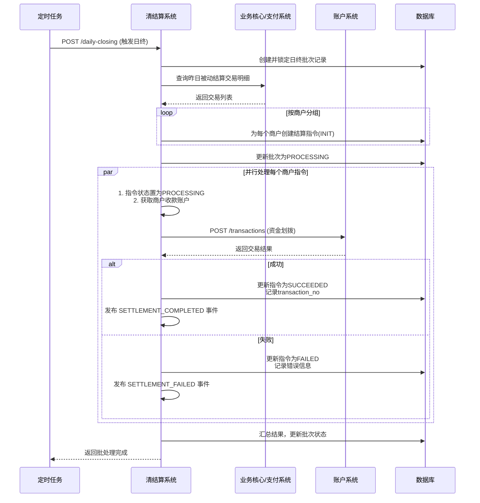
```mermaid
sequenceDiagram
    participant Scheduler as 定时任务
    participant Clear as 清结算系统
    participant Core as 业务核心/支付系统
    participant Account as 账户系统
    participant DB as 数据库

    Scheduler->>Clear: POST /daily-closing (触发日终)
    Clear->>DB: 创建并锁定日终批次记录
    Clear->>Core: 查询昨日被动结算交易明细
    Core-->>Clear: 返回交易列表
    loop 按商户分组
        Clear->>DB: 为每个商户创建结算指令(INIT)
    end
    Clear->>DB: 更新批次为PROCESSING
    par 并行处理每个商户指令
        Clear->>Clear: 1. 指令状态置为PROCESSING<br>2. 获取商户收款账户
        Clear->>Account: POST /transactions (资金划拨)
        Account-->>Clear: 返回交易结果
        alt 成功
            Clear->>DB: 更新指令为SUCCEEDED<br>记录transaction_no
            Clear->>Clear: 发布 SETTLEMENT_COMPLETED 事件
        else 失败
            Clear->>DB: 更新指令为FAILED<br>记录错误信息
            Clear->>Clear: 发布 SETTLEMENT_FAILED 事件
        end
    end
    Clear->>DB: 汇总结果，更新批次状态
    Clear-->>Scheduler: 返回批处理完成
```

### 5.2 单笔主动结算时序图
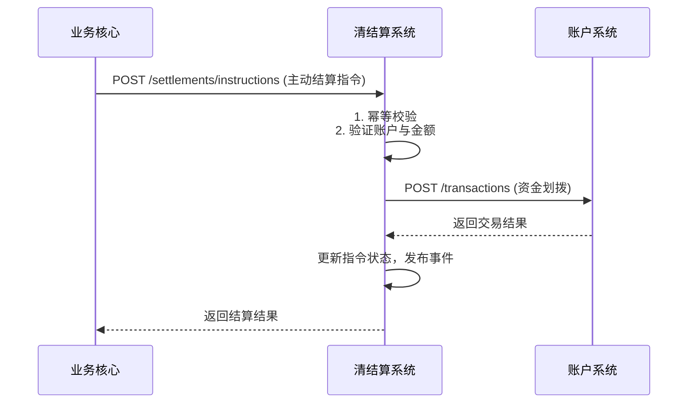
```mermaid
sequenceDiagram
    participant Core as 业务核心
    participant Clear as 清结算系统
    participant Account as 账户系统

    Core->>Clear: POST /settlements/instructions (主动结算指令)
    Clear->>Clear: 1. 幂等校验<br>2. 验证账户与金额
    Clear->>Account: POST /transactions (资金划拨)
    Account-->>Clear: 返回交易结果
    Clear->>Clear: 更新指令状态，发布事件
    Clear-->>Core: 返回结算结果
```

## 6. 错误处理

| 错误码 | HTTP状态码 | 描述 | 处理策略 |
| :--- | :--- | :--- | :--- |
| `INSTRUCTION_DUPLICATED` | 409 | 请求ID重复 | 返回已创建的指令信息，实现幂等 |
| `MERCHANT_ACCOUNT_NOT_FOUND` | 400 | 商户天财收款账户不存在或无效 | 中断流程，需检查商户开户状态 |
| `UNSETTLED_ACCOUNT_INSUFFICIENT` | 400 | 待结算账户余额不足 | 紧急告警，检查支付渠道结算是否异常 |
| `ACCOUNT_TRANSACTION_FAILED` | 502 | 调用账户系统交易失败 | 根据错误码决定重试（如余额不足不重试） |
| `BATCH_ALREADY_PROCESSING` | 409 | 当日批次已存在且在处理中 | 返回当前批次信息，避免重复触发 |
| `SETTLEMENT_DATE_INVALID` | 400 | 结算日期不合法（如未来日期） | 调用方检查参数 |
| `EXTERNAL_SERVICE_UNAVAILABLE` | 503 | 依赖系统（如三代）不可用 | 熔断降级，使用缓存数据或中断流程并告警 |

**通用策略**：
- **重试机制**：对于网络超时、暂时性依赖服务失败，采用指数退避策略自动重试（最多3次）。重试时需保证幂等。
- **异步补偿**：日终批处理中部分失败指令，记录日志并告警，次日可由运营人员手动重试或系统自动重试。
- **监控与对账**：
    - 监控`待结算账户`余额，设置阈值告警。
    - 每日与支付渠道对账文件核对，确保`待结算账户`的变动与渠道结算金额一致。
    - 定期核对`待结算账户`总余额与所有商户`未结算金额`汇总是否相等。
- **人工干预**：对于连续失败、金额巨大的结算指令，触发高级别告警，通知运营人员手动处理。

## 7. 依赖说明

本模块是资金流转的关键环节，依赖关系清晰：

1.  **上游数据与指令提供方**：
    - **业务核心/支付系统**：**强依赖**。提供已清算的交易数据，是结算的源头。需保证其`TRADE_SETTLED`事件的可靠投递或接口的稳定性。
    - **三代系统**：**弱依赖**。用于查询商户结算模式、天财收款账户信息。故障时可使用本地缓存，影响新商户或账户变更的场景。

2.  **下游服务调用方**：
    - **账户系统**：**强依赖**。所有资金划拨操作的最终执行者。必须保证其高可用，并妥善处理其返回的各类错误。
    - **计费中台**：**弱依赖**。获取手续费信息。结算指令可预先携带手续费，降低实时依赖。

3.  **下游事件订阅方**：
    - **对账单系统**：**弱依赖**。订阅结算完成事件生成账单。事件发布异步化，不影响主流程。

4.  **外部依赖**：
    - **数据库（MySQL）**：**强依赖**。存储所有结算指令、明细与批次数据。需事务支持和读写分离。
    - **消息中间件**：**弱依赖**。用于事件发布/订阅。故障时需降级为数据库存储，后续补发。
    - **定时任务调度器**：**弱依赖**。触发日终批处理。需有备用手动触发机制。

5.  **协作模式**：
    - 本模块作为**处理器**，接收指令/事件，执行业务逻辑（汇总、验证），调用底层账户服务完成资金操作。
    - 设计上应做到**无状态**，便于水平扩展以应对日终批处理的高并发需求。
    - 与账户系统的交互需严格遵循其幂等性要求，所有指令携带唯一`requestId`。

## 3.7 电子签章系统


# 电子签章系统模块设计文档

## 1. 概述

### 1.1 目的
电子签章系统模块是“天财分账”业务中协议签署与身份认证流程的核心支撑模块。它负责为认证系统提供安全、合规、可追溯的电子协议签署服务，包括协议模板管理、签署流程编排、H5页面封装、短信触发、认证流程调度及全证据链存证。本模块确保所有资金授权关系（如归集、批量付款、会员结算）的建立都基于合法有效的电子协议，满足监管要求并提供司法保障。

### 1.2 范围
- **协议模板管理**：创建、版本化管理各类资金授权协议模板（如《资金归集授权协议》、《批量付款授权协议》）。
- **签署流程编排**：根据业务场景（归集、批量付款、会员结算）和参与方角色（总部/门店）动态组装协议内容，生成待签署协议。
- **H5签署页面封装**：生成移动端友好的H5签署页面，集成实名认证、协议阅读、手写签名/盖章、意愿确认等环节。
- **短信触发服务**：向签署方发送签署邀请短信，包含签署链接和验证码。
- **认证流程调度**：与认证系统协同，在协议签署前后触发相应的身份认证流程（打款验证/人脸验证）。
- **全证据链存证**：对签署全过程（时间戳、IP、设备指纹、签署行为、协议原文）进行区块链或可信时间戳存证，生成不可篡改的证据包。
- **协议存储与查询**：安全存储已签署的协议文件（PDF），并提供查询、下载、验真服务。
- **与外部CA集成**：集成权威CA机构，为需要数字证书的场景提供证书申请与验签服务。

### 1.3 核心概念
- **签署方**：协议的签署参与方，包括付方（如门店）和收方（如总部）。每个签署方需完成实名认证和签署操作。
- **签署任务**：一次完整的协议签署流程实例，包含协议内容、签署方列表、签署顺序、当前状态等。
- **签署链接**：具有时效性和一次性使用特征的H5页面URL，用于引导签署方完成签署。
- **存证ID**：在第三方存证平台（如公证处、司法区块链）上存储本次签署过程证据后返回的唯一标识，用于后续出证。
- **CA证书**：由认证机构颁发的数字证书，用于实现具有法律效力的可靠电子签名（与普通电子签名区分）。

## 2. 接口设计

### 2.1 REST API 端点

#### 2.1.1 协议模板管理（内部管理接口）

**1. 创建/更新协议模板**
- **端点**: `POST /api/v1/template`
- **描述**: 创建或更新一份协议模板。模板使用变量占位符（如`{{payerName}}`, `{{payeeName}}`, `{{effectiveDate}}`）。
- **请求体**:
```json
{
  "templateId": "string", // 可选，更新时传入
  "templateName": "资金归集授权协议",
  "templateType": "COLLECTION | BATCH_PAY | MEMBER_SETTLEMENT",
  "content": "string", // HTML格式的协议正文，含变量占位符
  "variableDefinitions": [
    {
      "key": "payerName",
      "description": "付方商户名称",
      "required": true
    }
  ],
  "version": "string", // 语义化版本，如1.0.0
  "effectiveDate": "ISO8601", // 模板生效时间
  "expireDate": "ISO8601" // 模板过期时间
}
```
- **响应体**:
```json
{
  "templateId": "string",
  "version": "string",
  "createdAt": "ISO8601"
}
```

**2. 查询协议模板**
- **端点**: `GET /api/v1/template?templateType={type}&version={version}&status=ACTIVE`
- **描述**: 根据类型、版本和状态查询模板列表或详情。
- **响应体**:
```json
{
  "templates": [
    {
      "templateId": "string",
      "templateName": "string",
      "templateType": "string",
      "version": "string",
      "status": "DRAFT | ACTIVE | INACTIVE",
      "effectiveDate": "ISO8601",
      "createdAt": "ISO8601"
    }
  ]
}
```

#### 2.1.2 签署流程服务（供认证系统调用）

**3. 创建签署任务**
- **端点**: `POST /api/v1/sign/tasks`
- **描述**: 认证系统在发起关系绑定时调用，创建一个签署任务实例。
- **请求头**: `X-Request-From: AUTH_SYSTEM`, `Authorization: Bearer <token>`
- **请求体**:
```json
{
  "requestId": "string", // 请求唯一标识，用于幂等
  "authFlowId": "string", // 认证流程ID，用于关联
  "businessScene": "COLLECTION | BATCH_PAY | MEMBER_SETTLEMENT",
  "parties": [
    {
      "partyId": "string", // 参与方ID（商户ID）
      "partyType": "PAYER | PAYEE",
      "partyRole": "HEADQUARTERS | STORE",
      "name": "string", // 商户/企业名称
      "idType": "UNIFIED_SOCIAL_CREDIT | ID_CARD", // 证件类型
      "idNumber": "string", // 证件号
      "mobile": "string", // 接收短信的手机号
      "authType": "CORPORATE | INDIVIDUAL" // 主体类型
    }
  ],
  "templateVariables": {
    "payerName": "XX门店",
    "payeeName": "XX总部",
    "effectiveDate": "2026-01-20",
    "businessSceneDesc": "资金归集"
  },
  "callbackUrl": "string" // 签署结果回调地址
}
```
- **响应体 (201 Created)**:
```json
{
  "signTaskId": "string",
  "parties": [
    {
      "partyId": "string",
      "signUrl": "string", // 签署H5页面短链接，有效期内一次性使用
      "smsTriggered": true // 是否已触发短信
    }
  ],
  "expiresAt": "ISO8601" // 签署链接过期时间（默认24小时）
}
```

**4. 查询签署任务状态**
- **端点**: `GET /api/v1/sign/tasks/{signTaskId}`
- **描述**: 查询签署任务的详细状态。
- **响应体**:
```json
{
  "signTaskId": "string",
  "authFlowId": "string",
  "businessScene": "string",
  "status": "INIT | SIGNING | PARTIAL_SIGNED | COMPLETED | EXPIRED | CANCELLED",
  "parties": [
    {
      "partyId": "string",
      "partyType": "string",
      "signStatus": "PENDING | SIGNED | EXPIRED",
      "signTime": "ISO8601",
      "signIp": "string",
      "signUserAgent": "string"
    }
  ],
  "agreementId": "string", // 签署完成后生成的协议唯一ID
  "agreementUrl": "string", // 已签署协议PDF的下载/预览URL（临时有效）
  "evidenceId": "string", // 存证ID
  "createdAt": "ISO8601",
  "completedAt": "ISO8601"
}
```

**5. 重新发送签署短信**
- **端点**: `POST /api/v1/sign/tasks/{signTaskId}/resend-sms`
- **描述**: 当签署链接过期或用户未收到时，重新发送短信。
- **请求体**:
```json
{
  "partyId": "string" // 指定为哪个参与方重发
}
```
- **响应体**: `{ "success": true }`

**6. 手动触发存证（内部/管理用）**
- **端点**: `POST /api/v1/sign/tasks/{signTaskId}/trigger-evidence`
- **描述**: 对于已签署完成的协议，手动触发或重新触发存证流程。
- **响应体**: `{ "evidenceId": "string" }`

#### 2.1.3 签署回调与前端接口

**7. 签署结果回调（供H5页面/外部CA回调）**
- **端点**: `POST /api/v1/sign/callbacks/{signTaskId}`
- **描述**: 接收H5页面或CA机构异步回调的签署结果。需验证签名防止篡改。
- **请求体**:
```json
{
  "event": "VIEWED | SIGNED | REJECTED | VERIFIED", // VIEWED: 页面打开，VERIFIED: CA实名认证通过
  "partyId": "string",
  "signatureData": {
    "signTime": "ISO8601",
    "signIp": "string",
    "userAgent": "string",
    "deviceFingerprint": "string",
    "signatureImage": "string" // base64编码的手写签名图片（如有）
  },
  "caCertInfo": { // 如果使用CA数字证书
    "certSn": "string",
    "signValue": "string",
    "tsr": "string" // 时间戳Token
  }
}
```
- **响应体**: `{ "acknowledged": true }`

**8. 获取协议预览内容（H5页面调用）**
- **端点**: `GET /api/v1/sign/agreements/preview?signTaskId={id}&partyId={pid}`
- **描述**: H5页面加载时调用，获取渲染后的协议HTML内容（变量已替换）。
- **响应头**: `Content-Type: text/html`
- **响应体**: HTML字符串

**9. 协议下载/验真接口（供业务系统调用）**
- **端点**: `GET /api/v1/sign/agreements/{agreementId}`
- **查询参数**: `?action=download` (返回PDF流) 或 `?action=verify` (返回验真结果)
- **响应体（verify）**:
```json
{
  "valid": true,
  "agreementId": "string",
  "signTime": "ISO8601",
  "parties": [ ... ],
  "evidenceId": "string",
  "evidenceUrl": "string" // 存证报告查看链接
}
```

### 2.2 发布/消费的事件

#### 2.2.1 消费的事件
- `BindingRelationshipInitiatedEvent` (来自认证系统): 当认证系统发起关系绑定时，触发创建签署任务。
    ```json
    {
      "eventId": "string",
      "authFlowId": "string",
      "payerInfo": { ... },
      "payeeInfo": { ... },
      "businessScene": "string",
      "callbackUrl": "string"
    }
    ```

#### 2.2.2 发布的事件
- `SignTaskCreatedEvent`: 当签署任务创建成功并已发送短信时发布。
    ```json
    {
      "eventId": "string",
      "signTaskId": "string",
      "authFlowId": "string",
      "parties": [ { "partyId": "...", "mobile": "..." } ],
      "expiresAt": "ISO8601"
    }
    ```
- `SignTaskCompletedEvent`: 当所有参与方完成签署时发布，通知认证系统。
    ```json
    {
      "eventId": "string",
      "signTaskId": "string",
      "authFlowId": "string",
      "agreementId": "string",
      "agreementUrl": "string",
      "evidenceId": "string",
      "completedAt": "ISO8601"
    }
    ```
- `SignTaskExpiredEvent`: 当签署任务过期（有参与方未签署）时发布。
- `SignTaskCancelledEvent`: 当签署任务被取消时发布。

## 3. 数据模型

### 3.1 核心数据库表设计

#### 表: `sign_template`
存储协议模板。
| 字段名 | 类型 | 必填 | 描述 | 索引 |
| :--- | :--- | :--- | :--- | :--- |
| `id` | BIGINT (PK) | Y | 自增主键 | PK |
| `template_id` | VARCHAR(32) | Y | 模板业务ID | UK |
| `template_name` | VARCHAR(100) | Y | 模板名称 | |
| `template_type` | VARCHAR(30) | Y | 业务场景类型 | IDX |
| `version` | VARCHAR(20) | Y | 语义化版本 | |
| `content_html` | TEXT | Y | 含占位符的HTML内容 | |
| `content_variables` | JSON | Y | 变量定义列表 | |
| `status` | VARCHAR(20) | Y | 状态 (DRAFT, ACTIVE, INACTIVE) | IDX |
| `effective_date` | DATETIME | Y | 生效时间 | |
| `expire_date` | DATETIME | N | 过期时间 | |
| `creator` | VARCHAR(64) | Y | 创建者 | |
| `created_at` | DATETIME | Y | 创建时间 | |
| `updated_at` | DATETIME | Y | 更新时间 | |

#### 表: `sign_task`
存储签署任务实例。
| 字段名 | 类型 | 必填 | 描述 | 索引 |
| :--- | :--- | :--- | :--- | :--- |
| `id` | BIGINT (PK) | Y | 自增主键 | PK |
| `sign_task_id` | VARCHAR(32) | Y | 任务业务ID | UK |
| `auth_flow_id` | VARCHAR(32) | Y | 关联的认证流程ID | IDX |
| `business_scene` | VARCHAR(30) | Y | 业务场景 | IDX |
| `template_id` | VARCHAR(32) | Y | 使用的模板ID | FK |
| `template_version` | VARCHAR(20) | Y | 模板版本 | |
| `final_content_html` | TEXT | Y | 变量替换后的最终HTML内容 | |
| `final_content_pdf` | LONGBLOB | N | 最终签署的PDF文件（二进制） | |
| `agreement_id` | VARCHAR(32) | N | 协议唯一ID | UK |
| `status` | VARCHAR(20) | Y | 任务状态 | IDX |
| `evidence_id` | VARCHAR(64) | N | 存证ID | |
| `evidence_data` | JSON | N | 存证原始响应 | |
| `callback_url` | VARCHAR(512) | N | 认证系统回调地址 | |
| `expires_at` | DATETIME | Y | 签署链接过期时间 | IDX |
| `created_at` | DATETIME | Y | 创建时间 | |
| `updated_at` | DATETIME | Y | 更新时间 | |
| `completed_at` | DATETIME | N | 完成时间 | |

#### 表: `sign_party`
存储签署任务的参与方信息及签署状态。
| 字段名 | 类型 | 必填 | 描述 | 索引 |
| :--- | :--- | :--- | :--- | :--- |
| `id` | BIGINT (PK) | Y | 自增主键 | PK |
| `sign_task_id` | VARCHAR(32) | Y | 关联的任务ID | FK, IDX |
| `party_id` | VARCHAR(32) | Y | 参与方业务ID（商户ID） | IDX |
| `party_type` | VARCHAR(10) | Y | PAYER / PAYEE | |
| `party_role` | VARCHAR(20) | Y | HEADQUARTERS / STORE | |
| `name` | VARCHAR(100) | Y | 名称 | |
| `id_type` | VARCHAR(20) | Y | 证件类型 | |
| `id_number` | VARCHAR(50) | Y | 证件号 | |
| `mobile` | VARCHAR(20) | Y | 手机号 | |
| `auth_type` | VARCHAR(20) | Y | 主体类型 | |
| `sign_status` | VARCHAR(20) | Y | 签署状态 | IDX |
| `sign_token` | VARCHAR(64) | Y | 签署链接token，一次性 | UK |
| `sign_url` | VARCHAR(512) | Y | 完整签署URL | |
| `sms_sent` | BOOLEAN | Y | 短信是否已发送 | |
| `sms_sent_time` | DATETIME | N | 短信发送时间 | |
| `viewed_time` | DATETIME | N | H5页面打开时间 | |
| `signed_time` | DATETIME | N | 签署完成时间 | |
| `sign_ip` | VARCHAR(45) | N | 签署IP地址 | |
| `user_agent` | TEXT | N | 浏览器UA | |
| `device_fingerprint` | VARCHAR(128) | N | 设备指纹 | |
| `signature_image` | TEXT | N | base64手写签名 | |
| `ca_cert_sn` | VARCHAR(64) | N | CA证书序列号 | |
| `created_at` | DATETIME | Y | 创建时间 | |

#### 表: `sign_audit_log`
签署过程审计日志。
| 字段名 | 类型 | 必填 | 描述 | 索引 |
| :--- | :--- | :--- | :--- | :--- |
| `id` | BIGINT (PK) | Y | 自增主键 | PK |
| `log_id` | VARCHAR(32) | Y | 日志ID | UK |
| `sign_task_id` | VARCHAR(32) | Y | 关联任务ID | IDX |
| `party_id` | VARCHAR(32) | N | 参与方ID | IDX |
| `action` | VARCHAR(50) | Y | 操作（CREATE_TASK, SEND_SMS, VIEW, SIGN, etc.） | |
| `action_detail` | JSON | N | 操作详情 | |
| `ip_address` | VARCHAR(45) | N | 操作IP | |
| `user_agent` | TEXT | N | 浏览器UA | |
| `created_at` | DATETIME | Y | 创建时间 | IDX |

### 3.2 与其他模块的关系
- **认证系统**： 核心上游调用方。认证系统发起关系绑定时，调用本模块创建签署任务；本模块在签署完成后通过回调或事件通知认证系统。两者通过`auth_flow_id`强关联。
- **短信网关**： 通过内部服务或API调用，向签署方发送包含签署链接的短信。
- **对象存储服务（如OSS）**： 用于存储已签署的协议PDF文件，生成临时访问URL。
- **第三方存证平台**： 通过API将签署过程的关键证据（哈希值）上传至司法区块链或可信时间戳服务，获取存证ID。
- **CA机构**： 对于需要数字证书的场景，通过API调用完成实名认证、证书申请和签名验签。
- **商户门户/H5前端**： 提供签署页面的前端资源（HTML/JS/CSS），后端通过API提供数据。

## 4. 业务逻辑

### 4.1 核心算法与流程

#### 4.1.1 签署任务状态机
签署任务 (`sign_task.status`) 状态流转：
```
INIT --> SIGNING --> PARTIAL_SIGNED --> COMPLETED
  |          |              |
  |          |              +---> EXPIRED (部分签署后超时)
  |          +---> EXPIRED (超时无人签署)
  +---> CANCELLED (被主动取消)
```
- **INIT**: 任务创建，短信已发送。
- **SIGNING**: 至少一方已查看或开始签署。
- **PARTIAL_SIGNED**: 至少一方完成签署，但未全部完成。
- **COMPLETED**: 所有参与方完成签署，协议生成，存证完成。
- **EXPIRED**: 签署链接过期（默认24小时），任务终止。
- **CANCELLED**: 被上游系统主动取消。

#### 4.1.2 协议内容生成算法
```python
def generate_agreement_content(template_id, template_variables):
    # 1. 根据template_id和当前时间获取ACTIVE状态的模板
    template = get_active_template(template_id)
    
    # 2. 校验必填变量是否齐全
    validate_required_variables(template, template_variables)
    
    # 3. 替换变量占位符
    final_html = template.content_html
    for key, value in template_variables.items():
        placeholder = f"{{{{{key}}}}}"
        final_html = final_html.replace(placeholder, escape_html(value))
    
    # 4. 注入存证水印和签署方信息区块
    final_html = inject_watermark_and_parties(final_html, template_variables)
    
    return final_html
```

#### 4.1.3 存证哈希生成算法
```python
def generate_evidence_hash(sign_task, parties):
    # 1. 收集存证要素
    evidence_data = {
        "agreement_id": sign_task.agreement_id,
        "agreement_content_hash": sha256(sign_task.final_content_html.encode()).hexdigest(),
        "parties": [],
        "timestamps": {
            "created": sign_task.created_at.isoformat(),
            "completed": sign_task.completed_at.isoformat()
        }
    }
    
    # 2. 添加各方签署证据
    for party in parties:
        party_evidence = {
            "party_id": party.party_id,
            "name": party.name,
            "id_number": party.id_number,
            "sign_time": party.signed_time.isoformat(),
            "sign_ip": party.sign_ip,
            "signature_hash": sha256(party.signature_image.encode()).hexdigest() if party.signature_image else None
        }
        evidence_data["parties"].append(party_evidence)
    
    # 3. 生成整体证据哈希
    evidence_json = json.dumps(evidence_data, sort_keys=True)
    final_hash = sha256(evidence_json.encode()).hexdigest()
    
    return final_hash, evidence_data
```

### 4.2 业务规则
1.  **签署顺序规则**：默认并行签署（所有参与方可同时签署），但可根据业务需要配置为顺序签署（如总部先签，门店后签）。
2.  **链接安全规则**：
    - 签署链接 (`sign_token`) 为一次性使用，签署完成后立即失效。
    - 链接默认有效期为24小时，超时后任务状态转为`EXPIRED`。
    - 链接需包含防篡改签名（HMAC），防止伪造。
3.  **短信发送规则**：
    - 任务创建时立即向所有参与方发送短信。
    - 同一参与方24小时内最多接收3条签署提醒短信。
    - 短信内容需包含商户名称、业务场景和短链接。
4.  **协议版本规则**：
    - 签署时锁定模板版本，即使模板后续更新，已签署的协议内容不变。
    - 协议PDF生成后，需在页脚添加“协议ID：`<agreement_id>`”和“存证ID：`<evidence_id>`”水印。
5.  **存证触发规则**：
    - 所有参与方签署完成后，自动触发存证流程。
    - 存证失败不影响协议生效，但会记录告警并进入重试队列（最多重试3次）。

### 4.3 验证逻辑
1.  **创建签署任务时**：
    - 校验`businessScene`与参与方`partyRole`的合法性（如归集场景付方必须是STORE）。
    - 校验手机号格式和实名信息（姓名、证件号）非空。
    - 通过`requestId`保证幂等性，防止重复创建。
2.  **H5页面访问时**：
    - 校验`sign_token`有效性（未使用、未过期、属于当前任务）。
    - 校验访问IP是否在常见风险IP名单（可选）。
3.  **提交签署时**：
    - 校验手写签名图片大小和格式（如base64解码后不超过500KB）。
    - 对于CA数字证书场景，验证证书有效性（未过期、未吊销）和签名值。
4.  **生成协议PDF时**：
    - 校验所有参与方`sign_status`均为`SIGNED`。
    - 校验协议HTML内容完整性，防止XSS注入。

## 5. 时序图

### 5.1 电子签署主流程（认证系统发起）

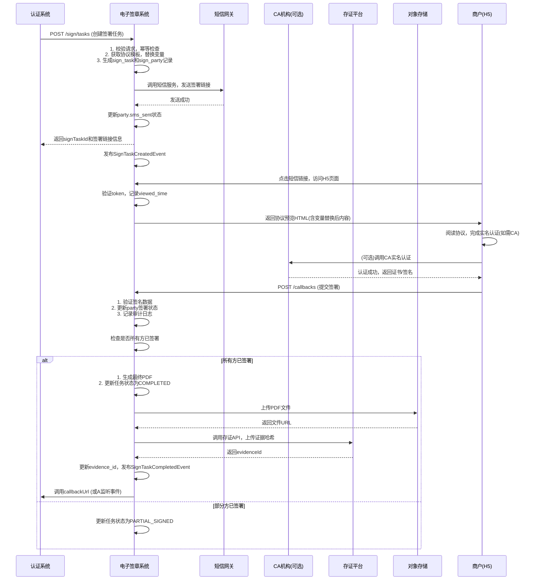
```mermaid
sequenceDiagram
    participant A as 认证系统
    participant E as 电子签章系统
    participant SG as 短信网关
    participant CA as CA机构(可选)
    participant EP as 存证平台
    participant OSS as 对象存储
    participant M as 商户(H5)

    A->>E: POST /sign/tasks (创建签署任务)
    E->>E: 1. 校验请求，幂等检查<br>2. 获取协议模板，替换变量<br>3. 生成sign_task和sign_party记录
    E->>SG: 调用短信服务，发送签署链接
    SG-->>E: 发送成功
    E->>E: 更新party.sms_sent状态
    E-->>A: 返回signTaskId和签署链接信息
    E->>E: 发布SignTaskCreatedEvent

    M->>E: 点击短信链接，访问H5页面
    E->>E: 验证token，记录viewed_time
    E->>M: 返回协议预览HTML(含变量替换后内容)
    M->>M: 阅读协议，完成实名认证(如需CA)
    M->>CA: (可选)调用CA实名认证
    CA-->>M: 认证成功，返回证书/签名
    M->>E: POST /callbacks (提交签署)
    E->>E: 1. 验证签名数据<br>2. 更新party签署状态<br>3. 记录审计日志
    E->>E: 检查是否所有方已签署
    alt 所有方已签署
        E->>E: 1. 生成最终PDF<br>2. 更新任务状态为COMPLETED
        E->>OSS: 上传PDF文件
        OSS-->>E: 返回文件URL
        E->>EP: 调用存证API，上传证据哈希
        EP-->>E: 返回evidenceId
        E->>E: 更新evidence_id，发布SignTaskCompletedEvent
        E->>A: 调用callbackUrl (或A监听事件)
    else 部分方已签署
        E->>E: 更新任务状态为PARTIAL_SIGNED
    end
```

## 6. 错误处理

| 错误类型 | HTTP 状态码 | 错误码 | 处理策略 |
| :--- | :--- | :--- | :--- |
| 模板未找到或未激活 | 400 | SIGN_4001 | 检查templateType和版本，使用默认最新激活模板或报错。 |
| 必填变量缺失 | 400 | SIGN_4002 | 返回缺失的变量名列表，要求调用方补充。 |
| 签署任务已存在（幂等） | 409 | SIGN_4091 | 返回已存在的signTaskId和状态，不创建新任务。 |
| 签署链接无效或过期 | 403 | SIGN_4031 | 引导用户重新获取短信链接（调用重发接口）。 |
| 短信发送失败 | 500 | SIGN_5001 | 记录告警，任务状态仍为INIT，定时任务重试发送。 |
| 存证平台调用失败 | 502 | SIGN_5021 | 进入异步重试队列，最多重试3次，最终状态为COMPLETED_WITHOUT_EVIDENCE。 |
| PDF生成失败 | 500 | SIGN_5002 | 记录错误详情，告警，人工介入处理。任务状态保持为PARTIAL_SIGNED。 |
| 回调通知失败 | - | - | 采用指数退避重试机制，最多重试5次，记录最终失败日志。 |

**通用策略**：
- **幂等性**：所有创建类接口通过`requestId`保证。签署提交通过`sign_token`一次性使用保证。
- **异步与重试**：短信发送、存证、PDF生成、回调通知等耗时或依赖外部的操作，均采用异步队列+重试机制。
- **数据一致性**：核心状态变更（如`SIGNED` -> `COMPLETED`）在本地数据库事务内完成。外部依赖操作（存证）最终一致性。
- **监控与告警**：对任务过期率、签署成功率、存证失败率、外部依赖可用性设置监控指标和告警阈值。

## 7. 依赖说明

本模块作为业务能力中台，既服务于上游业务系统，也依赖多个外部服务：

1.  **认证系统 (核心上游)**：
    - **交互方式**: 同步REST API调用（创建任务、查询状态） + 异步HTTP回调/事件监听（通知结果）。
    - **职责**: 认证系统是签署流程的发起者和驱动者。电子签章系统需提供高可用、低延迟的API服务，并确保回调的可靠性。
    - **关键点**: 接口契约稳定，错误码清晰，支持幂等。

2.  **短信网关 (内部服务)**：
    - **交互方式**: 同步/异步API调用。
    - **职责**: 发送签署邀请短信。电子签章系统需管理短信模板、频控和发送状态。
    - **关键点**: 短信内容需符合运营商规范，包含退订提示。

3.  **对象存储服务 (基础设施)**：
    - **交互方式**: SDK上传和生成签名URL。
    - **职责**: 永久存储已签署的协议PDF文件，并提供安全的临时访问链接。
    - **关键点**: 文件命名规则（如`agreements/{agreement_id}.pdf`），访问权限控制（私有读，临时URL过期时间）。

4.  **第三方存证平台 (外部服务)**：
    - **交互方式**: REST API调用。
    - **职责**: 提供具有法律效力的全流程存证服务。电子签章系统需按照其要求组装证据链数据并调用接口。
    - **关键点**: 网络隔离（可能需专线），API认证（API Key/Secret），数据格式适配，异步回调处理。

5.  **CA机构 (外部服务，可选)**：
    - **交互方式**: REST API调用（实名认证、证书申请、验签）。
    - **职责**: 为需要可靠电子签名（符合《电子签名法》）的场景提供数字证书服务。
    - **关键点**: 证书生命周期管理（申请、更新、吊销），性能考虑（验签可能较耗时）。

6.  **前端H5页面 (静态资源)**：
    - **交互方式**: 静态资源托管 + 动态API数据获取。
    - **职责**: 提供用户友好的签署界面，集成手写签名、证书签名、意愿确认等功能。
    - **关键点**: 移动端适配，加载性能，安全性（防止XSS，禁用调试）。

**依赖治理**：
- **熔断与降级**：对存证平台、CA机构等非核心路径的外部依赖配置熔断器，失败时可降级为仅本地存证或无CA签署。
- **超时控制**：根据依赖特性设置合理超时（如短信网关3s，存证平台10s，CA认证30s）。
- **监控仪表盘**：展示任务各阶段耗时、外部依赖调用成功率和延迟，便于快速定位瓶颈。

## 3.8 行业钱包系统


# 行业钱包系统模块设计文档

## 1. 概述

### 1.1 目的
本模块是“天财”业务场景下的**资金流转中枢**和**账户关系协调器**。它作为业务逻辑（三代系统）与底层账务（账户系统）之间的桥梁，负责处理天财专用账户的开户、关系绑定认证、以及执行分账、归集、批量付款、会员结算等核心资金流转操作。本模块确保所有资金操作都基于有效的业务授权，并协调电子签约、身份认证等外部流程。

### 1.2 范围
本模块的核心职责包括：
1.  **账户开通与升级**：接收三代系统的开户申请，调用账户系统为商户开立或升级天财专用账户（收款账户、接收方账户）。
2.  **关系绑定与认证**：执行业务关系（总部-门店）建立过程中的身份认证流程（打款验证/人脸验证），并协调电子签约。
3.  **资金流转处理**：接收并处理来自三代系统的分账业务请求，进行账户级校验，调用账户系统执行资金划转。
4.  **账户关系校验**：维护并校验资金流转涉及的账户对（付方账户-收方账户）是否满足业务规则（如同属天财机构）。
5.  **手续费处理**：与计费中台交互，计算并记录资金流转产生的手续费。

**边界说明**：
- **不负责**：业务规则的制定与校验（由三代系统负责）、底层账户的余额管理与账务处理（由账户系统负责）、电子协议模板与存证（由电子签约平台负责）。
- **通过接口**：调用账户系统执行账务操作；调用三代系统进行业务校验；调用电子签约平台和认证服务完成关系绑定。

## 2. 接口设计

### 2.1 API端点 (RESTful)

#### 2.1.1 账户管理接口（供三代系统调用）
- `POST /api/v1/wallet/accounts/open` **开通天财专用账户**
    - **描述**：接收三代系统的开户申请，调用账户系统完成账户开立或升级，并回调解果。
    - **请求体** (`OpenAccountRequest`)：
      ```json
      {
        "requestId": "wallet_req_open_001",
        "applyNo": "APPLY_20231027_001", // 三代系统的申请单号
        "merchantId": "M100001",
        "institutionId": "TC001",
        "accountType": "RECEIVABLE", // RECEIVABLE, RECEIVER
        "operationType": "CREATE", // CREATE, UPGRADE
        "originalAccountNo": null, // 升级时必填
        "callbackUrl": "https://three-gen/callback" // 结果回调地址（回三代）
      }
      ```
    - **响应体** (`OpenAccountResponse`)：
      ```json
      {
        "code": "SUCCESS",
        "message": "受理成功",
        "data": {
          "walletApplyNo": "WALLET_APPLY_001", // 钱包系统内部申请号
          "status": "PROCESSING"
        }
      }
      ```

- `GET /api/v1/wallet/accounts/{accountNo}/relationships` **查询账户关联关系**
    - **描述**：查询指定账户作为付方或收方，已建立的所有有效业务关系（用于对账或管理）。
    - **响应体**：
      ```json
      {
        "code": "SUCCESS",
        "message": "成功",
        "data": {
          "accountNo": "TC_RCV_20231027M100001",
          "asPayerRelationships": [...], // 作为付方的关系列表
          "asPayeeRelationships": [...]  // 作为收方的关系列表
        }
      }
      ```

#### 2.1.2 关系绑定与认证接口（供三代系统/内部流程调用）
- `POST /api/v1/wallet/relationships/initiate-auth` **发起关系绑定认证**
    - **描述**：为已创建的业务关系，发起身份认证流程（打款验证或人脸验证）。
    - **请求体** (`InitiateAuthRequest`)：
      ```json
      {
        "requestId": "req_auth_001",
        "relationshipId": "REL_20231027_001",
        "payerMerchantId": "M100002",
        "payeeMerchantId": "M100001",
        "authMethod": "TRANSFER_VERIFICATION", // TRANSFER_VERIFICATION, FACE_VERIFICATION
        "targetBankAccount": { // 打款验证时必填
          "accountName": "xx公司",
          "accountNo": "6228480012345678901",
          "bankCode": "ABC"
        },
        "callbackUrl": "https://three-gen/callback"
      }
      ```
    - **响应体**：
      ```json
      {
        "code": "SUCCESS",
        "message": "认证流程已发起",
        "data": {
          "authTaskId": "AUTH_TASK_001",
          "nextStep": "WAITING_FOR_VERIFICATION" // 或跳转H5链接（人脸）
        }
      }
      ```

- `POST /api/v1/wallet/relationships/{authTaskId}/verify` **提交验证信息**
    - **描述**：提交打款验证的回填金额或人脸验证结果。
    - **请求体**：
      ```json
      {
        "requestId": "req_verify_001",
        "authCode": "0.23" // 打款验证金额 或 人脸验证的token
      }
      ```

#### 2.1.3 资金流转接口（内部/供业务核心调用）
- `POST /api/v1/wallet/transfers/execute` **执行资金划转**
    - **描述**：**核心接口**。接收业务请求（来自三代事件或业务核心），进行账户级校验，调用账户系统完成资金划转。
    - **请求体** (`ExecuteTransferRequest`)：
      ```json
      {
        "requestId": "wallet_txn_001",
        "businessRefNo": "TC_COLLECT_20231027_001", // 三代业务参考号
        "businessType": "COLLECTION", // COLLECTION, BATCH_PAY, MEMBER_SETTLE, GENERAL_SPLIT
        "payerAccountNo": "TC_RCV_20231027M100002", // 付方账户（天财收款账户）
        "payeeAccountNo": "TC_RCV_20231027M100001", // 收方账户（天财收款/接收方账户）
        "amount": "1000.00",
        "currency": "CNY",
        "postScript": "日常归集",
        "feeBearer": "PAYER", // PAYER, PAYEE, SHARED
        "metadata": {
          "relationshipId": "REL_20231027_001"
        }
      }
      ```
    - **响应体**：
      ```json
      {
        "code": "SUCCESS",
        "message": "划转成功",
        "data": {
          "walletTransactionNo": "WT202310271200001",
          "accountTransactionNo": "T202310271200001", // 账户系统流水号
          "feeAmount": "2.00", // 手续费
          "status": "SUCCEED"
        }
      }
      ```

- `POST /api/v1/wallet/transfers/{walletTransactionNo}/callback` **交易结果回调**
    - **描述**：**内部接口**，供账户系统在异步处理模式（如有）下回调通知最终结果。通常同步调用无需此接口。

#### 2.1.4 查询与对账接口
- `GET /api/v1/wallet/transfers/{walletTransactionNo}` **查询交易详情**
- `POST /api/v1/wallet/reconciliation/tasks` **发起对账任务**（按日期、机构对账）

### 2.2 发布/消费的事件

- **消费事件** (`BusinessEvent`，来自三代系统)：
    - `BUSINESS_REQUEST_RECEIVED`: 监听此事件，触发资金流转处理流程。
    - `RELATIONSHIP_ESTABLISHED`: 监听此事件，触发关系绑定认证流程。

- **发布事件** (`WalletEvent`)：
    - **事件类型**：`ACCOUNT_OPENED`, `RELATIONSHIP_AUTH_COMPLETED`, `TRANSFER_EXECUTED`, `TRANSFER_FAILED`
    - **事件通道**：`message-bus:wallet-events`
    - **事件体示例** (`TRANSFER_EXECUTED`)：
      ```json
      {
        "eventId": "evt_wallet_001",
        "type": "TRANSFER_EXECUTED",
        "occurredAt": "2023-10-27T15:05:00Z",
        "payload": {
          "walletTransactionNo": "WT202310271200001",
          "businessRefNo": "TC_COLLECT_20231027_001",
          "businessType": "COLLECTION",
          "payerAccountNo": "TC_RCV_20231027M100002",
          "payeeAccountNo": "TC_RCV_20231027M100001",
          "amount": "1000.00",
          "feeAmount": "2.00",
          "status": "SUCCEED",
          "accountTransactionNo": "T202310271200001"
        }
      }
      ```

## 3. 数据模型

### 3.1 核心表设计

```sql
-- 钱包账户关系表（核心）
CREATE TABLE `t_wallet_account` (
  `id` bigint(20) NOT NULL AUTO_INCREMENT,
  `account_no` varchar(64) NOT NULL COMMENT '账户号（来自账户系统）',
  `merchant_id` varchar(32) NOT NULL COMMENT '商户ID',
  `institution_id` varchar(32) NOT NULL COMMENT '机构ID',
  `account_type` varchar(32) NOT NULL COMMENT 'RECEIVABLE, RECEIVER',
  `wallet_account_status` varchar(16) NOT NULL DEFAULT 'ACTIVE' COMMENT 'ACTIVE, INACTIVE（钱包层面状态）',
  `is_default_settlement` tinyint(1) DEFAULT '0' COMMENT '是否为默认结算账户（接收方账户专用）',
  `bind_bank_cards` json DEFAULT NULL COMMENT '绑定的银行卡列表（接收方账户专用）',
  `tags` json DEFAULT NULL COMMENT '扩展标签',
  `created_at` datetime NOT NULL DEFAULT CURRENT_TIMESTAMP,
  `updated_at` datetime NOT NULL DEFAULT CURRENT_TIMESTAMP ON UPDATE CURRENT_TIMESTAMP,
  PRIMARY KEY (`id`),
  UNIQUE KEY `uk_account_no` (`account_no`),
  KEY `idx_merchant_inst` (`merchant_id`, `institution_id`),
  KEY `idx_inst_type` (`institution_id`, `account_type`)
) ENGINE=InnoDB COMMENT='钱包账户信息表（同步账户系统，增加业务属性）';

-- 账户关系绑定表（记录允许资金流转的账户对）
CREATE TABLE `t_account_relationship` (
  `id` bigint(20) NOT NULL AUTO_INCREMENT,
  `relationship_id` varchar(64) NOT NULL COMMENT '关联的三代业务关系ID',
  `payer_account_no` varchar(64) NOT NULL COMMENT '付方账户号',
  `payee_account_no` varchar(64) NOT NULL COMMENT '收方账户号',
  `business_type` varchar(32) NOT NULL COMMENT 'COLLECTION, BATCH_PAY, MEMBER_SETTLE',
  `auth_status` varchar(16) NOT NULL DEFAULT 'UNAUTHORIZED' COMMENT 'UNAUTHORIZED, AUTHORIZED, EXPIRED',
  `auth_method` varchar(32) DEFAULT NULL COMMENT 'TRANSFER_VERIFICATION, FACE_VERIFICATION',
  `auth_task_id` varchar(64) DEFAULT NULL COMMENT '认证任务ID',
  `verified_at` datetime DEFAULT NULL COMMENT '认证完成时间',
  `metadata` json DEFAULT NULL COMMENT '存证ID、合同ID等',
  `created_at` datetime NOT NULL DEFAULT CURRENT_TIMESTAMP,
  `updated_at` datetime NOT NULL DEFAULT CURRENT_TIMESTAMP ON UPDATE CURRENT_TIMESTAMP,
  PRIMARY KEY (`id`),
  UNIQUE KEY `uk_payer_payee_biz` (`payer_account_no`, `payee_account_no`, `business_type`) COMMENT '账户对业务类型唯一',
  UNIQUE KEY `uk_relationship_id` (`relationship_id`),
  KEY `idx_payer` (`payer_account_no`),
  KEY `idx_payee` (`payee_account_no`),
  KEY `idx_auth_status` (`auth_status`)
) ENGINE=InnoDB COMMENT='账户关系绑定表（业务关系在账户层的映射）';

-- 钱包交易记录表（业务流水）
CREATE TABLE `t_wallet_transaction` (
  `id` bigint(20) NOT NULL AUTO_INCREMENT,
  `wallet_transaction_no` varchar(64) NOT NULL COMMENT '钱包系统交易流水号',
  `business_ref_no` varchar(64) NOT NULL COMMENT '三代业务参考号',
  `business_type` varchar(32) NOT NULL,
  `payer_account_no` varchar(64) NOT NULL,
  `payee_account_no` varchar(64) NOT NULL,
  `amount` decimal(20,2) NOT NULL,
  `currency` char(3) NOT NULL DEFAULT 'CNY',
  `fee_amount` decimal(20,2) DEFAULT '0.00' COMMENT '手续费',
  `fee_bearer` varchar(16) DEFAULT NULL COMMENT 'PAYER, PAYEE, SHARED',
  `fee_detail` json DEFAULT NULL COMMENT '手续费明细',
  `post_script` varchar(256) DEFAULT NULL,
  `status` varchar(16) NOT NULL DEFAULT 'INIT' COMMENT 'INIT, PROCESSING, SUCCEED, FAILED',
  `account_transaction_no` varchar(64) DEFAULT NULL COMMENT '账户系统交易流水号',
  `relationship_id` varchar(64) DEFAULT NULL,
  `validation_snapshot` json DEFAULT NULL COMMENT '校验结果快照',
  `fail_reason` varchar(256) DEFAULT NULL,
  `created_at` datetime NOT NULL DEFAULT CURRENT_TIMESTAMP,
  `updated_at` datetime NOT NULL DEFAULT CURRENT_TIMESTAMP ON UPDATE CURRENT_TIMESTAMP,
  PRIMARY KEY (`id`),
  UNIQUE KEY `uk_wallet_txn_no` (`wallet_transaction_no`),
  UNIQUE KEY `uk_business_ref_no` (`business_ref_no`) COMMENT '业务幂等',
  KEY `idx_account_time` (`payer_account_no`, `created_at`),
  KEY `idx_status` (`status`)
) ENGINE=InnoDB COMMENT='钱包交易记录表';

-- 认证任务表
CREATE TABLE `t_auth_task` (
  `id` bigint(20) NOT NULL AUTO_INCREMENT,
  `auth_task_id` varchar(64) NOT NULL,
  `relationship_id` varchar(64) NOT NULL,
  `auth_method` varchar(32) NOT NULL,
  `target_info` json NOT NULL COMMENT '认证目标信息（银行卡/个人信息）',
  `auth_code` varchar(64) DEFAULT NULL COMMENT '打款金额或人脸token',
  `expected_amount` decimal(10,2) DEFAULT NULL COMMENT '打款验证的期望金额',
  `status` varchar(16) NOT NULL DEFAULT 'CREATED' COMMENT 'CREATED, VERIFYING, SUCCEED, FAILED, EXPIRED',
  `expire_at` datetime NOT NULL COMMENT '任务过期时间',
  `callback_url` varchar(512) DEFAULT NULL,
  `metadata` json DEFAULT NULL,
  `created_at` datetime NOT NULL DEFAULT CURRENT_TIMESTAMP,
  `updated_at` datetime NOT NULL DEFAULT CURRENT_TIMESTAMP ON UPDATE CURRENT_TIMESTAMP,
  PRIMARY KEY (`id`),
  UNIQUE KEY `uk_auth_task_id` (`auth_task_id`),
  KEY `idx_relationship` (`relationship_id`),
  KEY `idx_status_expire` (`status`, `expire_at`)
) ENGINE=InnoDB COMMENT='身份认证任务表';
```

### 3.2 与其他模块的关系
- **三代系统**：上游权威系统。接收其开户申请和业务请求事件；调用其业务校验接口；回调解果。
- **账户系统**：下游执行系统。调用其开立账户、执行资金划转接口。
- **电子签约平台**：平行系统。调用其发起签约、获取合同。
- **计费中台**：下游服务。调用其计算手续费。
- **认证服务**：外部服务。调用其进行打款验证发起/校验、人脸验证。

## 4. 业务逻辑

### 4.1 核心算法与规则
1.  **钱包交易流水号生成**：
    - 格式：`WT{日期}{机构简码}{序列号}`
    - 示例：`WT20231027TC001`

2.  **资金流转处理状态机**：
    ```
    [INIT] --(收到事件)--> PROCESSING --(调用账户系统成功)--> SUCCEED
                                            |
                                            +--(调用失败)--> FAILED
    ```
    - `SUCCEED`/`FAILED`为终态。

3.  **关系绑定认证流程**：
    - **打款验证**：生成随机金额（如0.01-0.99元）→ 记录`expected_amount` → 调用渠道打款 → 等待用户回填 → 校验金额匹配 → 更新`t_account_relationship.auth_status`为`AUTHORIZED`。
    - **人脸验证**：生成H5链接 → 用户刷脸 → 接收认证服务回调 → 校验通过 → 更新授权状态。

4.  **账户级校验规则（执行转账前）**：
    - 付方账户和收方账户必须存在于`t_wallet_account`且状态为`ACTIVE`。
    - 付方账户的`account_type`必须为`RECEIVABLE`（天财收款账户）。
    - 收方账户的`account_type`可以是`RECEIVABLE`或`RECEIVER`。
    - 付方和收方账户必须属于**同一个**`institution_id`（天财机构）。
    - 对于`COLLECTION`/`BATCH_PAY`/`MEMBER_SETTLE`业务，必须在`t_account_relationship`中存在对应`AUTHORIZED`状态的记录。
    - 调用三代系统`/validate`接口进行最终业务规则校验（额度、有效期等）。

5.  **手续费处理**：
    - 根据`businessType`, `amount`, `feeBearer`调用计费中台计算手续费。
    - 若手续费承担方为`PAYER`，则最终划转金额 = `amount` + `feeAmount`。
    - 记录手续费明细，供后续结算和对账。

### 4.2 验证逻辑
- **开户请求**：校验`applyNo`唯一性；校验`merchantId`和`institutionId`有效性（可调用三代接口）。
- **执行转账请求**：除上述账户级校验外，严格校验`businessRefNo`全局唯一，实现幂等。
- **认证请求**：校验`relationshipId`有效且处于`SIGNING`或待认证状态。

## 5. 时序图

### 5.1 处理归集业务请求时序图
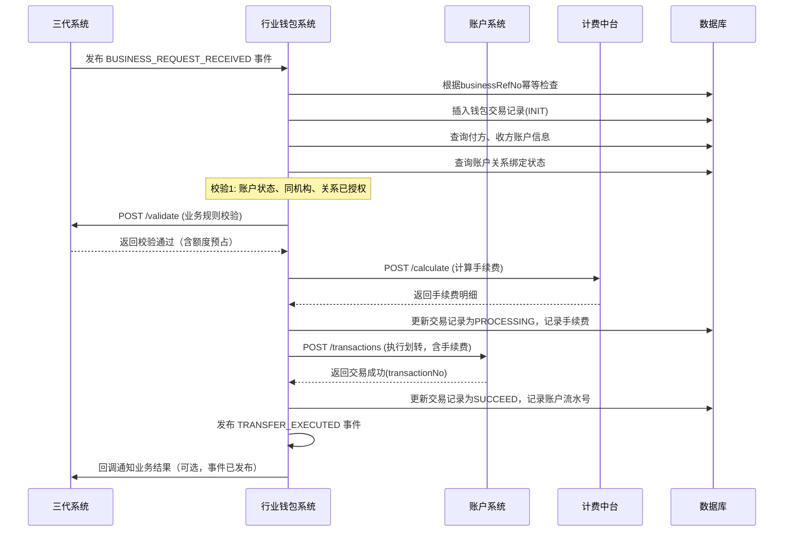
```mermaid
sequenceDiagram
    participant ThreeGen as 三代系统
    participant Wallet as 行业钱包系统
    participant Account as 账户系统
    participant Fee as 计费中台
    participant DB as 数据库

    ThreeGen->>Wallet: 发布 BUSINESS_REQUEST_RECEIVED 事件
    Wallet->>DB: 根据businessRefNo幂等检查
    Wallet->>DB: 插入钱包交易记录(INIT)
    Wallet->>DB: 查询付方、收方账户信息
    Wallet->>DB: 查询账户关系绑定状态
    Note over Wallet: 校验1: 账户状态、同机构、关系已授权
    Wallet->>ThreeGen: POST /validate (业务规则校验)
    ThreeGen-->>Wallet: 返回校验通过（含额度预占）
    Wallet->>Fee: POST /calculate (计算手续费)
    Fee-->>Wallet: 返回手续费明细
    Wallet->>DB: 更新交易记录为PROCESSING，记录手续费
    Wallet->>Account: POST /transactions (执行划转，含手续费)
    Account-->>Wallet: 返回交易成功(transactionNo)
    Wallet->>DB: 更新交易记录为SUCCEED，记录账户流水号
    Wallet->>Wallet: 发布 TRANSFER_EXECUTED 事件
    Wallet->>ThreeGen: 回调通知业务结果（可选，事件已发布）
```

### 5.2 关系绑定认证（打款验证）时序图
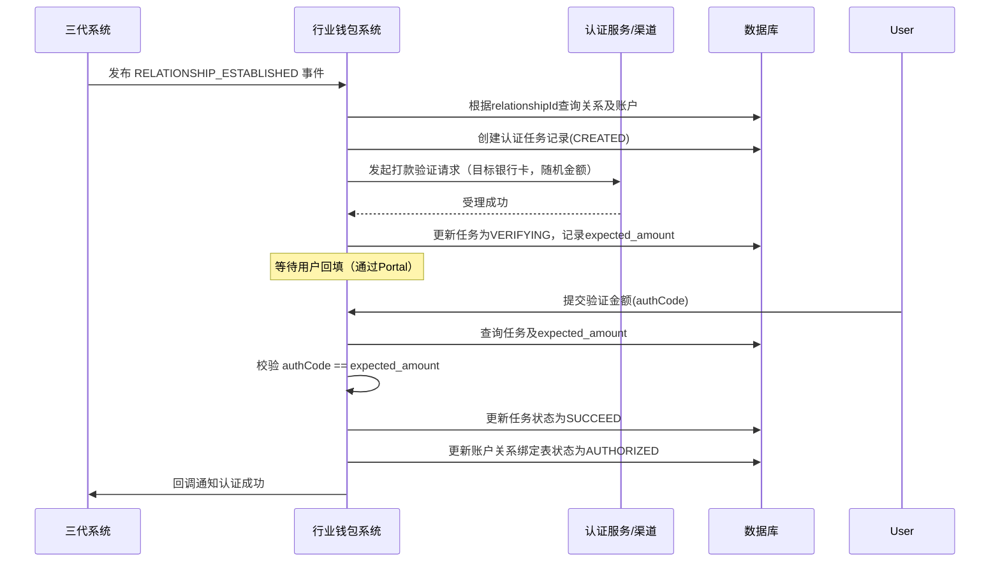
```mermaid
sequenceDiagram
    participant ThreeGen as 三代系统
    participant Wallet as 行业钱包系统
    participant Auth as 认证服务/渠道
    participant DB as 数据库

    ThreeGen->>Wallet: 发布 RELATIONSHIP_ESTABLISHED 事件
    Wallet->>DB: 根据relationshipId查询关系及账户
    Wallet->>DB: 创建认证任务记录(CREATED)
    Wallet->>Auth: 发起打款验证请求（目标银行卡，随机金额）
    Auth-->>Wallet: 受理成功
    Wallet->>DB: 更新任务为VERIFYING，记录expected_amount
    Note over Wallet: 等待用户回填（通过Portal）
    User->>Wallet: 提交验证金额(authCode)
    Wallet->>DB: 查询任务及expected_amount
    Wallet->>Wallet: 校验 authCode == expected_amount
    Wallet->>DB: 更新任务状态为SUCCEED
    Wallet->>DB: 更新账户关系绑定表状态为AUTHORIZED
    Wallet->>ThreeGen: 回调通知认证成功
```

## 6. 错误处理

| 错误码 | HTTP状态码 | 描述 | 处理策略 |
| :--- | :--- | :--- | :--- |
| `ACCOUNT_NOT_FOUND` | 400 | 账户不存在于钱包系统 | 检查账户是否已成功开通并同步 |
| `ACCOUNT_STATUS_INVALID` | 400 | 账户钱包状态非ACTIVE | 需先激活账户 |
| `ACCOUNT_RELATIONSHIP_UNAUTHORIZED` | 403 | 账户间无授权关系或未认证 | 需先完成关系绑定认证 |
| `INSTITUTION_MISMATCH` | 400 | 付方收方不属于同一机构 | 检查业务关系配置 |
| `BUSINESS_VALIDATION_FAILED` | 400 | 三代系统业务校验不通过 | 返回具体失败原因（额度不足、关系无效等） |
| `FEE_CALCULATION_FAILED` | 500 | 手续费计算失败 | 告警，人工介入，可配置是否阻断交易 |
| `ACCOUNT_TRANSACTION_FAILED` | 500 | 底层账户交易失败 | 根据错误码决定是否重试（如余额不足不重试） |
| `DUPLICATE_BUSINESS_REF` | 409 | 业务参考号重复 | 返回已存在的钱包交易记录，实现幂等 |
| `AUTH_TASK_EXPIRED` | 400 | 认证任务已过期 | 引导用户重新发起认证 |
| `AUTH_VERIFICATION_FAILED` | 400 | 认证信息不匹配（金额错误） | 提示用户重新输入，可设置重试次数 |

**通用策略**：
- **幂等性**：所有核心接口基于`requestId`或`businessRefNo`保证幂等。
- **异步与重试**：对于账户系统调用失败（网络超时），采用指数退避策略重试。重试多次失败后，状态置为`FAILED`并告警。
- **补偿与对账**：每日与账户系统、三代系统进行对账，发现状态不一致（如钱包成功、账户失败）时触发补偿流程。
- **监控**：监控交易成功率、平均处理时长、各环节失败率。

## 7. 依赖说明

本模块是承上启下的关键枢纽，依赖关系复杂：

1. **上游依赖（强依赖）**：
   - **三代系统**：业务规则的唯一来源。其`/validate`接口的可用性和性能直接影响资金流转。需有熔断和降级策略（如缓存校验结果）。
   - **消息中间件**：消费三代系统事件。故障时需有消息堆积和恢复机制。

2. **下游依赖（强依赖）**：
   - **账户系统**：资金操作的最终执行者。其`/transactions`接口的强一致性和幂等性至关重要。必须实现重试和最终状态同步。
   - **计费中台**：影响交易成本和金额计算。故障时可考虑使用默认费率或阻断交易（根据配置）。

3. **平行依赖（弱依赖）**：
   - **电子签约平台**：关系绑定的前置环节。超时或失败不影响已有授权关系的资金流转。
   - **认证服务**：关系绑定的必要环节。失败会阻塞新关系建立，但不影响存量业务。

4. **外部依赖**：
   - **数据库（MySQL）**：强依赖，存储所有协调状态。需分库分表考虑（按`institution_id`分片）。
   - **缓存（Redis）**：弱依赖，用于缓存账户信息、关系状态，提升校验性能。

5. **协作模式**：
   - 采用 **“事件驱动 + 同步校验 + 异步执行”** 的混合模式。
   - 对于资金流转，坚持 **“先校验，后执行；先预占，后扣款”** 的原则，确保资金安全。
   - 本模块是**事务的协调者**，通过本地事务记录状态，通过重试和回调保证与下游系统的最终一致性。

## 3.9 钱包APP/商服平台


# 模块设计文档：钱包APP/商服平台

## 1. 概述

### 1.1 目的
本模块是“天财”业务场景下的**行业钱包系统**与**商户服务平台**的统一体，是连接上层业务管理系统（三代系统）与底层核心金融系统（账户系统、清结算系统）的**关键枢纽**。它负责处理天财专用账户的日常运营、资金流转指令的执行、以及为商户提供账户管理和业务操作的可视化界面。

### 1.2 范围
本模块的核心职责包括：
1.  **天财专用账户管理**：作为账户系统在行业侧的代理，受理并处理天财收款账户、接收方账户的开立、升级请求，并维护商户与账户的绑定关系。
2.  **资金流转指令处理**：接收来自三代系统的业务请求（归集、批量付款、会员结算），进行二次校验后，调用底层账户系统执行资金划转。
3.  **商户服务门户**：为商户（总部、门店）提供H5/APP界面，用于查看账户信息、交易流水、管理银行卡、发起或授权业务关系、查看对账单等。
4.  **业务关系绑定流程驱动**：集成电子签约平台，封装签约H5页面，引导用户完成身份认证（打款验证/人脸验证）和协议签署，并将结果同步回三代系统。
5.  **手续费计算与路由**：与计费中台交互，计算分账、转账等业务的手续费，并确保在资金流转中正确扣收。

**边界说明**：
- **不负责**：底层账户的余额增减、记账等核心金融操作（由账户系统负责）；业务规则的最终裁决（由三代系统负责）；支付交易的发起与清算（由收单和清结算系统负责）。
- **通过接口**：调用账户系统执行资金操作；调用三代系统进行业务校验；调用电子签约平台发起签约；为商户前端提供数据和服务接口。

## 2. 接口设计

### 2.1 API端点 (RESTful)

#### 2.1.1 账户管理接口 (供三代系统调用)
- `POST /api/v1/accounts/open` **开通天财专用账户**
    - **描述**：接收三代系统的账户开通申请，校验后调用账户系统开立行业钱包账户。
    - **请求体** (`OpenAccountRequest`)：
      ```json
      {
        "requestId": "wallet_req_open_001",
        "applyNo": "APPLY_20231027_001", // 三代传递的申请单号
        "merchantId": "M100001",
        "institutionId": "TC001",
        "accountType": "RECEIVABLE", // RECEIVABLE(收款账户), RECEIVER(接收方账户)
        "operationType": "CREATE", // CREATE, UPGRADE
        "originalAccountNo": null,
        "callbackUrl": "https://three-gen-system/callback" // 结果回调给三代
      }
      ```
    - **响应体** (`OpenAccountResponse`)：
      ```json
      {
        "code": "SUCCESS",
        "message": "受理成功",
        "data": {
          "walletApplyNo": "WALLET_APPLY_20231027_001", // 本系统流水号
          "status": "PROCESSING"
        }
      }
      ```

- `POST /api/v1/accounts/{accountNo}/bank-cards` **绑定提现银行卡** (接收方账户专用)
    - **描述**：为天财接收方账户绑定用于提现的银行卡，可设置默认卡。
    - **请求体** (`BindBankCardRequest`)：
      ```json
      {
        "requestId": "req_bind_card_001",
        "accountNo": "TC_RCV_20231027M100001",
        "bankCardNo": "6228480012345678901",
        "bankCode": "ABC",
        "bankName": "中国农业银行",
        "cardholderName": "张三",
        "isDefault": true,
        "certType": "CORPORATE", // CORPORATE, PERSONAL
        "certInfo": {
          "businessLicenseNo": "91310101MA1F123456",
          "legalPerson": "张三"
        }
      }
      ```

#### 2.1.2 资金流转接口 (供业务核心/内部调度调用)
- `POST /api/v1/transfers/tiancai-split` **执行天财分账**
    - **描述**：**核心内部接口**。接收业务核心转发的分账指令，进行风控和业务二次校验后，调用账户系统完成资金划转。
    - **请求体** (`TiancaiSplitRequest`)：
      ```json
      {
        "requestId": "transfer_req_001",
        "businessRefNo": "TC_COLLECT_20231027_001", // 三代生成的业务参考号
        "payerAccountNo": "TC_RCV_20231027M100002", // 付方账户(门店接收方账户)
        "payeeAccountNo": "TC_RCV_20231027M100001", // 收方账户(总部接收方账户)
        "amount": "1000.00",
        "currency": "CNY",
        "businessType": "COLLECTION",
        "postScript": "日常归集",
        "feeDeductionMethod": "PAYER", // PAYER, PAYEE, SEPARATE
        "relationshipId": "REL_20231027_001",
        "callbackUrl": "https://three-gen-system/callback" // 交易结果回调三代
      }
      ```
    - **响应体**：
      ```json
      {
        "code": "SUCCESS",
        "message": "交易受理成功",
        "data": {
          "transferNo": "TRANSFER_20231027_001", // 本系统转账流水号
          "status": "PROCESSING"
        }
      }
      ```

#### 2.1.3 商户服务接口 (供钱包APP/H5调用)
- `GET /api/v1/merchant/accounts` **查询商户账户概览**
    - **描述**：商户登录后，查询其名下的所有天财专用账户及其余额、状态。
    - **响应体**：
      ```json
      {
        "code": "SUCCESS",
        "data": {
          "merchantId": "M100001",
          "accounts": [
            {
              "accountNo": "TC_RCV_20231027M100001",
              "accountType": "RECEIVER",
              "accountName": "天财品牌总部-专用接收账户",
              "balance": "50000.00",
              "availableBalance": "50000.00",
              "status": "NORMAL",
              "isDefaultReceivable": false
            },
            {
              "accountNo": "TC_RCV_20231027M100001_R",
              "accountType": "RECEIVABLE",
              "accountName": "天财品牌总部-专用收款账户",
              "balance": "200000.00",
              "availableBalance": "200000.00",
              "status": "NORMAL",
              "isDefaultReceivable": true
            }
          ]
        }
      }
      ```

- `POST /api/v1/merchant/business-relationships/initiate` **发起业务关系绑定**
    - **描述**：商户（付方或收方）发起建立业务关系的请求，本接口生成签约参数并跳转至电子签约H5页面。
    - **请求体**：
      ```json
      {
        "relationshipType": "COLLECTION",
        "counterpartyMerchantId": "M100001", // 对方商户ID
        "authorizationScopes": ["DAILY_COLLECTION"]
      }
      ```
    - **响应体**：
      ```json
      {
        "code": "SUCCESS",
        "data": {
          "signPageUrl": "https://wallet-app/esign/h5?token=xyz789&redirect=https://wallet-app/home"
        }
      }
      ```

- `GET /api/v1/merchant/statements` **查询对账单**
    - **描述**：查询账户动账明细或业务汇总账单。
    - **参数**：`accountNo`, `startDate`, `endDate`, `statementType` (`DETAIL`, `SUMMARY`)
    - **响应体**：调用对账单系统获取数据并封装返回。

#### 2.1.4 回调接口
- `POST /api/v1/callback/account` **账户操作结果回调**
    - **描述**：**内部接口**，供账户系统回调，通知开户、绑卡等操作结果。
- `POST /api/v1/callback/transfer` **资金交易结果回调**
    - **描述**：**内部接口**，供账户系统回调，通知转账/分账交易结果。
- `POST /api/v1/callback/esign` **电子签约结果回调**
    - **描述**：**内部接口**，供电子签约平台回调，通知签约及认证结果。本模块需将结果转发给三代系统。

### 2.2 发布/消费的事件
- **消费事件** (通过消息中间件)：
    - `BusinessEvent` (来自三代系统，类型为`BUSINESS_REQUEST_RECEIVED`)：触发资金流转处理流程。
    - `AccountEvent` (来自账户系统，类型为`ACCOUNT_TRANSACTION_RESULT`)：更新本地转账记录状态，并回调三代系统。
- **发布事件** (`WalletEvent`)：
    - **事件类型**：`ACCOUNT_OPENED`, `BANKCARD_BOUND`, `TRANSFER_INITIATED`, `TRANSFER_COMPLETED`, `ESIGN_PROCESS_STARTED`
    - **事件通道**：`message-bus:wallet-events`
    - **事件体示例** (`TRANSFER_COMPLETED`)：
      ```json
      {
        "eventId": "evt_wallet_trans_001",
        "type": "TRANSFER_COMPLETED",
        "occurredAt": "2023-10-27T15:05:00Z",
        "payload": {
          "transferNo": "TRANSFER_20231027_001",
          "businessRefNo": "TC_COLLECT_20231027_001",
          "status": "SUCCESS",
          "amount": "1000.00",
          "payerAccountNo": "TC_RCV_20231027M100002",
          "payeeAccountNo": "TC_RCV_20231027M100001"
        }
      }
      ```

## 3. 数据模型

### 3.1 核心表设计
```sql
-- 天财账户信息表（本系统维护的账户视图）
CREATE TABLE `t_tiancai_account` (
  `id` bigint(20) NOT NULL AUTO_INCREMENT,
  `account_no` varchar(64) NOT NULL COMMENT '账户系统生成的账户号',
  `merchant_id` varchar(32) NOT NULL,
  `institution_id` varchar(32) NOT NULL,
  `account_type` varchar(32) NOT NULL COMMENT 'RECEIVABLE, RECEIVER',
  `account_sub_type` varchar(32) DEFAULT NULL COMMENT '行业钱包子类型，用于区分普通与天财专用',
  `status` varchar(16) NOT NULL DEFAULT 'NORMAL' COMMENT 'NORMAL, FROZEN, CLOSED',
  `open_apply_no` varchar(64) NOT NULL COMMENT '开户申请流水号',
  `balance` decimal(20,2) NOT NULL DEFAULT '0.00' COMMENT '缓存余额，与账户系统定期同步',
  `available_balance` decimal(20,2) NOT NULL DEFAULT '0.00',
  `is_default_receivable` tinyint(1) NOT NULL DEFAULT '0' COMMENT '是否默认收款账户（一个商户一个）',
  `metadata` json DEFAULT NULL COMMENT '账户扩展信息',
  `created_at` datetime NOT NULL DEFAULT CURRENT_TIMESTAMP,
  `updated_at` datetime NOT NULL DEFAULT CURRENT_TIMESTAMP ON UPDATE CURRENT_TIMESTAMP,
  PRIMARY KEY (`id`),
  UNIQUE KEY `uk_account_no` (`account_no`),
  UNIQUE KEY `uk_merchant_default_receivable` (`merchant_id`, `is_default_receivable`) COMMENT '唯一默认收款账户',
  KEY `idx_merchant` (`merchant_id`),
  KEY `idx_institution` (`institution_id`)
) ENGINE=InnoDB COMMENT='天财账户信息表';

-- 银行卡绑定表
CREATE TABLE `t_bank_card_binding` (
  `id` bigint(20) NOT NULL AUTO_INCREMENT,
  `account_no` varchar(64) NOT NULL COMMENT '天财接收方账户号',
  `bank_card_no` varchar(32) NOT NULL COMMENT '银行卡号（加密存储）',
  `bank_code` varchar(16) NOT NULL,
  `bank_name` varchar(64) NOT NULL,
  `cardholder_name` varchar(64) NOT NULL,
  `is_default` tinyint(1) NOT NULL DEFAULT '0' COMMENT '是否默认提现卡',
  `cert_type` varchar(16) NOT NULL COMMENT 'CORPORATE, PERSONAL',
  `cert_info` json NOT NULL COMMENT '认证信息（企业营业执照/个人身份证）',
  `bind_status` varchar(16) NOT NULL DEFAULT 'BOUND' COMMENT 'BOUND, UNBOUND',
  `verified_at` datetime DEFAULT NULL COMMENT '打款验证成功时间',
  `created_at` datetime NOT NULL DEFAULT CURRENT_TIMESTAMP,
  `updated_at` datetime NOT NULL DEFAULT CURRENT_TIMESTAMP ON UPDATE CURRENT_TIMESTAMP,
  PRIMARY KEY (`id`),
  UNIQUE KEY `uk_account_card` (`account_no`, `bank_card_no`),
  KEY `idx_account_default` (`account_no`, `is_default`)
) ENGINE=InnoDB COMMENT='银行卡绑定表';

-- 资金转账记录表
CREATE TABLE `t_fund_transfer` (
  `id` bigint(20) NOT NULL AUTO_INCREMENT,
  `transfer_no` varchar(64) NOT NULL COMMENT '本系统转账流水号',
  `business_ref_no` varchar(64) NOT NULL COMMENT '三代业务参考号',
  `request_id` varchar(64) NOT NULL COMMENT '请求ID，用于幂等',
  `payer_account_no` varchar(64) NOT NULL,
  `payee_account_no` varchar(64) NOT NULL,
  `amount` decimal(20,2) NOT NULL,
  `currency` char(3) NOT NULL DEFAULT 'CNY',
  `business_type` varchar(32) NOT NULL COMMENT 'COLLECTION, BATCH_PAY, MEMBER_SETTLE',
  `status` varchar(16) NOT NULL DEFAULT 'INIT' COMMENT 'INIT, VALIDATING, PROCESSING, SUCCESS, FAILED',
  `fee_amount` decimal(20,2) DEFAULT '0.00' COMMENT '手续费',
  `fee_deduction_method` varchar(16) DEFAULT NULL COMMENT 'PAYER, PAYEE, SEPARATE',
  `post_script` varchar(128) DEFAULT NULL,
  `relationship_id` varchar(64) DEFAULT NULL,
  `account_transaction_no` varchar(64) DEFAULT NULL COMMENT '账户系统交易流水号',
  `fail_reason` varchar(256) DEFAULT NULL,
  `callback_url` varchar(512) DEFAULT NULL COMMENT '结果回调地址（给三代）',
  `completed_at` datetime DEFAULT NULL,
  `created_at` datetime NOT NULL DEFAULT CURRENT_TIMESTAMP,
  `updated_at` datetime NOT NULL DEFAULT CURRENT_TIMESTAMP ON UPDATE CURRENT_TIMESTAMP,
  PRIMARY KEY (`id`),
  UNIQUE KEY `uk_transfer_no` (`transfer_no`),
  UNIQUE KEY `uk_request_id` (`request_id`),
  KEY `idx_business_ref_no` (`business_ref_no`),
  KEY `idx_payer_time` (`payer_account_no`, `created_at`),
  KEY `idx_status` (`status`)
) ENGINE=InnoDB COMMENT='资金转账记录表';

-- 业务关系绑定流程记录表
CREATE TABLE `t_relationship_process` (
  `id` bigint(20) NOT NULL AUTO_INCREMENT,
  `process_no` varchar(64) NOT NULL COMMENT '流程实例号',
  `relationship_id` varchar(64) DEFAULT NULL COMMENT '三代生成的关系ID，签约成功后回填',
  `payer_merchant_id` varchar(32) NOT NULL,
  `payee_merchant_id` varchar(32) NOT NULL,
  `relationship_type` varchar(32) NOT NULL,
  `initiator_merchant_id` varchar(32) NOT NULL COMMENT '发起方商户ID',
  `status` varchar(16) NOT NULL DEFAULT 'INIT' COMMENT 'INIT, ESIGNING, AUTHENTICATING, COMPLETED, FAILED',
  `esign_contract_id` varchar(64) DEFAULT NULL,
  `esign_url` varchar(512) DEFAULT NULL,
  `auth_method` varchar(16) DEFAULT NULL COMMENT 'REMITTANCE, FACE',
  `auth_status` varchar(16) DEFAULT NULL COMMENT 'PENDING, SUCCESS, FAILED',
  `callback_url` varchar(512) DEFAULT NULL COMMENT '签约结果回调给三代的地址',
  `metadata` json DEFAULT NULL,
  `created_at` datetime NOT NULL DEFAULT CURRENT_TIMESTAMP,
  `updated_at` datetime NOT NULL DEFAULT CURRENT_TIMESTAMP ON UPDATE CURRENT_TIMESTAMP,
  PRIMARY KEY (`id`),
  UNIQUE KEY `uk_process_no` (`process_no`),
  KEY `idx_relationship` (`relationship_id`),
  KEY `idx_initiator` (`initiator_merchant_id`)
) ENGINE=InnoDB COMMENT='业务关系绑定流程记录表';
```

### 3.2 与其他模块的关系
- **三代系统**：上游权威系统。接收其账户开通指令和业务请求事件；调用其业务校验接口；向其回调业务结果。
- **账户系统**：下游核心系统。调用其进行账户开立、升级、余额查询、资金划转等操作。
- **电子签约平台**：平行系统。调用其创建签约任务、获取H5链接；接收其签约和认证结果回调。
- **计费中台**：下游服务。在发起资金划转前调用，计算手续费。
- **对账单系统**：下游服务。商户查询账单时调用，获取动账明细或汇总数据。
- **清结算系统/业务核心**：间接协作。业务核心将分账指令路由至本模块处理。

## 4. 业务逻辑

### 4.1 核心算法与规则
1.  **转账流水号生成规则**：
    - 格式：`TRANSFER_{yyyymmdd}_{8位序列}`
    - 示例：`TRANSFER_20231027_00000001`
2.  **账户余额同步机制**：
    - 本地`t_tiancai_account`表缓存余额，用于快速查询。
    - 通过定时任务（如每5分钟）或接收账户系统的`ACCOUNT_BALANCE_CHANGED`事件，与账户系统核心余额进行同步。
    - 发起交易前，进行本地可用余额的初步检查（防超卖），但最终以账户系统校验为准。
3.  **手续费处理流程**：
    - 在`/transfers/tiancai-split`接口中，根据`feeDeductionMethod`调用计费中台计算手续费。
    - 若手续费为`SEPARATE`，需生成两笔账户交易（一笔本金，一笔手续费）。
    - 将手续费金额记录在`t_fund_transfer.fee_amount`中。
4.  **业务关系绑定流程状态机**：
    ```
    [INIT] --> ESIGNING --(签约完成)--> AUTHENTICATING --(认证完成)--> COMPLETED
                    |                         |
                    +--(签约失败)--> FAILED    +--(认证失败)--> FAILED
    ```
    - 认证方式(`auth_method`)由电子签约平台根据商户类型决定：企业-打款验证(`REMITTANCE`)，个人/个体户-人脸验证(`FACE`)。
5.  **资金转账处理状态机**：
    ```
    [INIT] --> VALIDATING --(校验通过)--> PROCESSING --(账户系统成功)--> SUCCESS
                    |                              |
                    +--(校验失败)--> FAILED         +--(账户系统失败)--> FAILED
    ```
    - `VALIDATING`阶段：调用三代系统校验业务关系；调用计费中台计算手续费；检查本地缓存余额。

### 4.2 验证逻辑
- **开通账户**：校验`applyNo`对应的申请单是否存在且状态可处理；校验商户是否已存在同类型账户（防重复开立）。
- **绑定银行卡**：校验目标账户是否为`RECEIVER`类型；校验银行卡号格式；对公账户绑卡需触发打款验证流程。
- **执行分账**：
    1.  **幂等校验**：基于`requestId`防止重复处理。
    2.  **业务校验**：调用三代系统`/validate`接口，校验关系与额度。
    3.  **账户校验**：检查付方账户状态是否正常，本地缓存余额是否充足（预警性检查）。
    4.  **风控校验**：检查交易频率、金额是否符合风控规则（可配置）。
- **商户操作鉴权**：所有商户服务接口需验证登录态，并确认操作的资源（账户、关系）属于当前登录商户。

## 5. 时序图

### 5.1 处理归集业务时序图
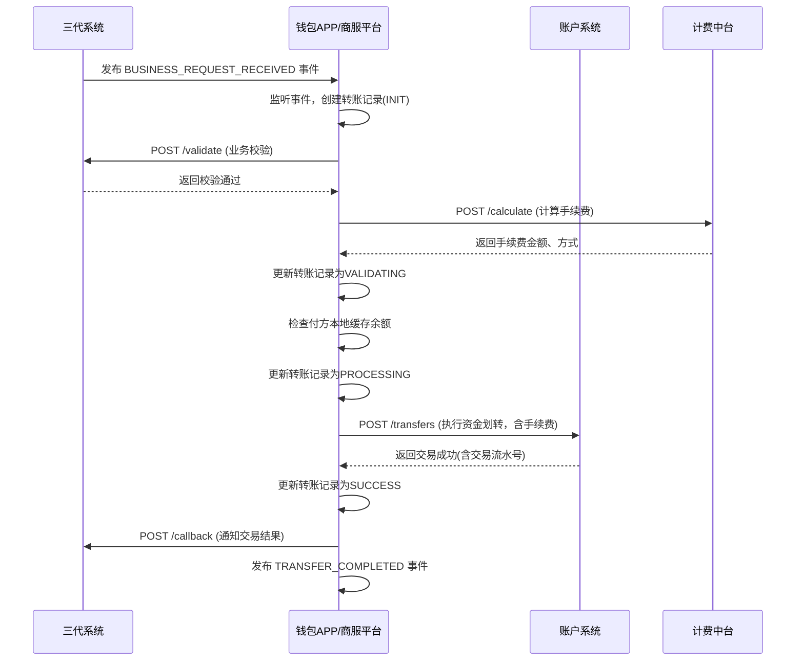
```mermaid
sequenceDiagram
    participant ThreeGen as 三代系统
    participant Wallet as 钱包APP/商服平台
    participant Account as 账户系统
    participant Fee as 计费中台

    ThreeGen->>Wallet: 发布 BUSINESS_REQUEST_RECEIVED 事件
    Wallet->>Wallet: 监听事件，创建转账记录(INIT)
    Wallet->>ThreeGen: POST /validate (业务校验)
    ThreeGen-->>Wallet: 返回校验通过
    Wallet->>Fee: POST /calculate (计算手续费)
    Fee-->>Wallet: 返回手续费金额、方式
    Wallet->>Wallet: 更新转账记录为VALIDATING
    Wallet->>Wallet: 检查付方本地缓存余额
    Wallet->>Wallet: 更新转账记录为PROCESSING
    Wallet->>Account: POST /transfers (执行资金划转，含手续费)
    Account-->>Wallet: 返回交易成功(含交易流水号)
    Wallet->>Wallet: 更新转账记录为SUCCESS
    Wallet->>ThreeGen: POST /callback (通知交易结果)
    Wallet->>Wallet: 发布 TRANSFER_COMPLETED 事件
```

### 5.2 商户发起关系绑定时序图
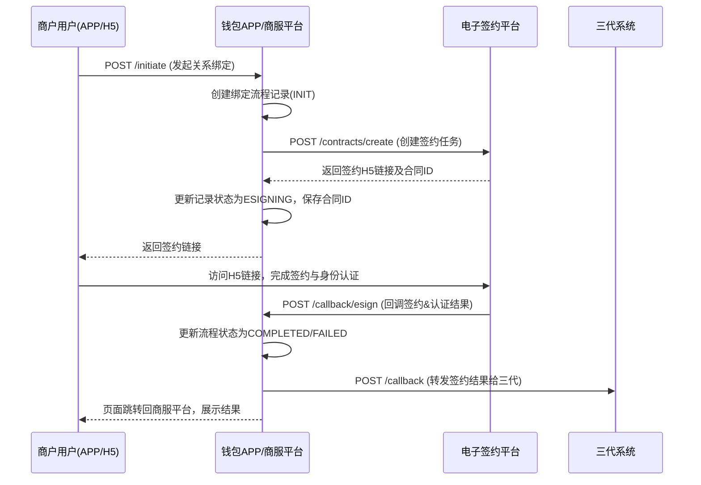
```mermaid
sequenceDiagram
    participant User as 商户用户(APP/H5)
    participant Wallet as 钱包APP/商服平台
    participant Esign as 电子签约平台
    participant ThreeGen as 三代系统

    User->>Wallet: POST /initiate (发起关系绑定)
    Wallet->>Wallet: 创建绑定流程记录(INIT)
    Wallet->>Esign: POST /contracts/create (创建签约任务)
    Esign-->>Wallet: 返回签约H5链接及合同ID
    Wallet->>Wallet: 更新记录状态为ESIGNING，保存合同ID
    Wallet-->>User: 返回签约链接
    User->>Esign: 访问H5链接，完成签约与身份认证
    Esign->>Wallet: POST /callback/esign (回调签约&认证结果)
    Wallet->>Wallet: 更新流程状态为COMPLETED/FAILED
    Wallet->>ThreeGen: POST /callback (转发签约结果给三代)
    Wallet-->>User: 页面跳转回商服平台，展示结果
```

## 6. 错误处理

| 错误码 | HTTP状态码 | 描述 | 处理策略 |
| :--- | :--- | :--- | :--- |
| `ACCOUNT_ALREADY_EXISTS` | 409 | 同类型账户已存在 | 返回已存在的账户信息，或提示升级流程 |
| `ACCOUNT_STATUS_ABNORMAL` | 400 | 账户状态非NORMAL | 提示账户冻结或已注销，联系客服 |
| `INSUFFICIENT_BALANCE` | 400 | 付款方余额不足 | 交易终止，提示商户充值 |
| `BANKCARD_VERIFICATION_REQUIRED` | 400 | 银行卡需打款验证 | 引导用户完成打款验证流程 |
| `BUSINESS_VALIDATION_FAILED` | 400 | 三代业务校验未通过 | 透传三代系统的错误信息 |
| `FEE_CALCULATION_FAILED` | 500 | 手续费计算失败 | 告警，人工介入；或使用默认费率 |
| `ACCOUNT_SYSTEM_UNAVAILABLE` | 503 | 账户系统服务异常 | 进入降级模式：记录失败，定时任务重试 |
| `DUPLICATE_TRANSFER_REQUEST` | 409 | 重复的转账请求 | 返回已存在的转账记录状态，实现幂等 |
| `AUTHENTICATION_REQUIRED` | 401 | 用户未登录或会话过期 | 跳转至登录页 |

**通用策略**：
- **异步与重试**：对于调用下游系统（如账户系统）的失败，采用指数退避策略进行重试。持久化记录状态，便于对账和补偿。
- **熔断与降级**：对账户系统、三代系统等核心依赖设置熔断器。降级时，可暂停非关键功能或使用缓存数据。
- **额度与余额的最终一致性**：本地缓存余额仅用于快速校验，最终以账户系统为准。交易失败需准确回调三代系统释放额度。
- **监控**：密切监控交易失败率、平均处理时间、下游系统健康状态。对长时间`PROCESSING`状态的转账记录进行告警。

## 7. 依赖说明

本模块是承上启下的关键业务层，依赖众多系统：

1. **上游依赖（强依赖）**：
   - **三代系统**：业务规则的最终裁决者。本模块发起的任何资金流转都必须先通过其校验。需保证其高可用，或在本模块实现校验结果的缓存（带短时有效期）。
   - **业务核心**：支付交易指令的发起方。需明确接口契约，确保指令信息完整。

2. **下游依赖（强依赖）**：
   - **账户系统**：所有资金操作的执行者。是本模块最核心的依赖，其故障将导致所有资金业务停摆。必须实现完善的熔断、降级和补偿机制。
   - **电子签约平台**：关系绑定的必要条件。需处理其异步回调可能延迟或丢失的情况，通过定时任务进行状态同步。

3. **平行依赖（中度依赖）**：
   - **计费中台**：影响手续费计算。故障时可考虑使用配置的默认费率，但需记录日志并事后核对。
   - **对账单系统**：影响商户查询体验。故障时可提示“账单生成中，请稍后查询”。

4. **外部依赖**：
   - **数据库**：存储所有流程状态，必须保证数据一致性和可靠性。
   - **缓存**：用于存储会话、商户信息、配置等，提升性能。
   - **消息中间件**：用于解耦事件处理，需保证消息不丢失。

5. **协作模式**：
   - 本模块扮演**指令执行者**和**流程驱动者**的角色。
   - 采用**同步校验 + 异步执行**的模式，确保业务合规性的同时，提高系统吞吐量。
   - 通过**全链路ID**（`businessRefNo`, `transferNo`）将上下游系统串联，便于问题追踪和对账。

## 3.10 对账单系统


# 对账单系统模块设计文档

## 1. 概述

### 1.1 目的
本模块是“天财”业务场景下的**统一账单服务提供者**，负责聚合来自各业务系统（账户系统、清结算系统、业务核心）的资金变动与交易数据，为不同层级的用户（商户、门店、总部、运营人员）生成并提供结构清晰、数据准确、格式多样的对账单。其核心价值在于提供透明的资金视图，支撑业务对账、财务核算与审计需求。

### 1.2 范围
本模块的核心职责包括：
1.  **动账明细生成**：实时或准实时地处理账户变动事件，为每个账户生成按时间排序的动账流水明细。
2.  **交易账单生成**：按业务维度（如分账、归集、结算）聚合交易数据，生成带有业务上下文的交易账单。
3.  **机构层级汇总账单生成**：为总部、运营等管理角色，提供跨商户、跨门店的汇总统计账单。
4.  **账单查询与导出**：提供多维度（账户、时间、业务类型）的账单查询接口，并支持PDF、Excel等格式导出。
5.  **账单推送与通知**：支持按周期（日、月）自动生成账单，并通过消息、邮件等方式推送给相关方。

**边界说明**：
- **不负责**：原始交易数据的产生与业务逻辑处理（由上游系统负责）。
- **不负责**：复杂的财务核对与差错处理（属于对账平台范畴，本模块仅提供数据基础）。
- **通过接口/事件**：消费上游系统的各类事件，聚合生成账单数据；为下游（商户门户、运营平台）提供账单查询服务。

## 2. 接口设计

### 2.1 API端点 (RESTful)

#### 2.1.1 账单查询接口（供商户门户/运营平台调用）
- `GET /api/v1/statements/accounts/{accountNo}/transactions` **查询账户动账明细**
    - **描述**：查询指定账户在特定时间范围内的所有资金变动明细。
    - **查询参数**：
      - `startTime` (required): 开始时间，ISO 8601格式。
      - `endTime` (required): 结束时间，ISO 8601格式。
      - `page` (optional, default=1): 页码。
      - `pageSize` (optional, default=50, max=500): 每页大小。
      - `transactionType` (optional): 交易类型过滤，如 `CREDIT`, `DEBIT`。
      - `businessType` (optional): 业务类型过滤，如 `TIANCAI_SPLIT`, `SETTLEMENT`。
    - **响应体** (`PaginatedResponse<AccountTransactionDetail>`)：
      ```json
      {
        "code": "SUCCESS",
        "message": "成功",
        "data": {
          "items": [
            {
              "transactionNo": "T202310271200001",
              "accountNo": "TC_RCV_20231027M100001",
              "relatedAccountNo": "TC_RCV_HQ001",
              "transactionTime": "2023-10-27T12:00:00Z",
              "transactionType": "CREDIT",
              "amount": "1000.00",
              "balanceBefore": "5000.00",
              "balanceAfter": "6000.00",
              "businessType": "COLLECTION",
              "businessRefNo": "TC_COLLECT_20231027_001",
              "postScript": "门店归集资金",
              "feeAmount": "2.00",
              "feeBearer": "PAYER",
              "status": "SUCCEED"
            }
          ],
          "total": 150,
          "page": 1,
          "pageSize": 50
        }
      }
      ```

- `GET /api/v1/statements/merchants/{merchantId}/summary` **查询商户结算汇总单**
    - **描述**：查询指定商户在特定结算周期内的资金结算汇总情况，通常用于T+1对账。
    - **查询参数**：
      - `settlementDate` (required): 结算日期，格式 yyyy-MM-dd。
      - `institutionId` (optional): 机构ID，用于商户属于多机构场景。
    - **响应体** (`MerchantSettlementSummary`)：
      ```json
      {
        "code": "SUCCESS",
        "message": "成功",
        "data": {
          "merchantId": "M100001",
          "institutionId": "TC001",
          "settlementDate": "2023-10-28",
          "settlementAccountNo": "TC_RCV_20231027M100001",
          "totalSettlementAmount": "9990.00",
          "totalFeeAmount": "10.00",
          "totalTradeCount": 100,
          "settlementStatus": "SETTLED",
          "instructionNo": "SETTLE_INST_202310280001",
          "settlementTime": "2023-10-28T02:05:00Z",
          "details": [ // 可选的明细列表，通常需要额外参数展开
            {
              "tradeNo": "pay_20231027001",
              "tradeTime": "2023-10-27T10:00:00Z",
              "amount": "100.00",
              "fee": "0.10"
            }
          ]
        }
      }
      ```

- `GET /api/v1/statements/institutions/{institutionId}/daily-summary` **查询机构日汇总单**
    - **描述**：供总部或运营查看某机构在特定日期的整体资金流水汇总。
    - **查询参数**：
      - `summaryDate` (required): 汇总日期，格式 yyyy-MM-dd。
    - **响应体** (`InstitutionDailySummary`)：
      ```json
      {
        "code": "SUCCESS",
        "message": "成功",
        "data": {
          "institutionId": "TC001",
          "summaryDate": "2023-10-27",
          "totalTransactionCount": 1250,
          "totalTransactionAmount": "1250000.00",
          "totalFeeAmount": "2500.00",
          "breakdownByBusinessType": {
            "COLLECTION": { "count": 200, "amount": "200000.00" },
            "BATCH_PAYMENT": { "count": 50, "amount": "500000.00" },
            "MEMBER_SETTLEMENT": { "count": 1000, "amount": "550000.00" }
          },
          "breakdownByAccountType": {
            "RECEIVABLE": { "count": 1150, "amount": "750000.00" },
            "RECEIVER": { "count": 100, "amount": "500000.00" }
          }
        }
      }
      ```

#### 2.1.2 账单管理接口（供内部/运营调用）
- `POST /api/v1/statements/generation/daily` **触发日账单生成**
    - **描述**：手动触发生成指定日期的各类日终账单（通常由定时任务调用）。
    - **请求体**：
      ```json
      {
        "requestId": "gen_daily_20231028",
        "targetDate": "2023-10-27", // 生成哪一天数据的账单
        "statementTypes": ["ACCOUNT_TRANSACTION", "MERCHANT_SETTLEMENT"] // 可选，不传则生成所有类型
      }
      ```

- `POST /api/v1/statements/export` **导出账单**
    - **描述**：根据复杂查询条件导出账单数据为文件（如Excel），返回文件下载链接。
    - **请求体** (`ExportRequest`)：
      ```json
      {
        "exportType": "ACCOUNT_TRANSACTION",
        "format": "EXCEL", // EXCEL, CSV, PDF
        "filters": {
          "accountNo": "TC_RCV_20231027M100001",
          "startTime": "2023-10-01T00:00:00Z",
          "endTime": "2023-10-31T23:59:59Z",
          "businessType": "COLLECTION"
        },
        "callbackUrl": "https://callback.example.com/notify" // 异步导出完成回调
      }
      ```

### 2.2 发布/消费的事件

本模块是典型的事件驱动型数据消费者。

- **消费事件**：
    - **事件类型**：`BALANCE_CHANGED` (来自账户系统)， `SETTLEMENT_COMPLETED` (来自清结算系统)， `TRANSACTION_COMPLETED` (来自业务核心)。
    - **事件通道**：
        - `message-bus:account-events`
        - `message-bus:settlement-events`
        - `message-bus:transaction-events`
    - **处理逻辑**：监听上述事件，将其标准化后持久化到本模块的账单明细表中，并更新相关汇总数据。

- **发布事件**：
    - **事件类型**：`DAILY_STATEMENT_GENERATED`, `STATEMENT_EXPORT_COMPLETED`
    - **事件通道**：`message-bus:statement-events`
    - **事件体示例** (`DAILY_STATEMENT_GENERATED`)：
      ```json
      {
        "eventId": "evt_stmt_001",
        "type": "DAILY_STATEMENT_GENERATED",
        "occurredAt": "2023-10-28T03:00:00Z",
        "payload": {
          "statementDate": "2023-10-27",
          "statementType": "MERCHANT_SETTLEMENT",
          "institutionId": "TC001",
          "generatedCount": 150, // 生成了多少份商户结算单
          "downloadUrl": "https://storage.example.com/statements/TC001_20231027_settlement.zip"
        }
      }
      ```

## 3. 数据模型

### 3.1 核心表设计

```sql
-- 账户动账明细表（最细粒度）
CREATE TABLE `t_account_statement_detail` (
  `id` bigint(20) NOT NULL AUTO_INCREMENT,
  `account_no` varchar(64) NOT NULL COMMENT '账户号',
  `related_account_no` varchar(64) DEFAULT NULL COMMENT '对手方账户号',
  `transaction_no` varchar(64) NOT NULL COMMENT '账户系统交易流水号',
  `wallet_transaction_no` varchar(64) DEFAULT NULL COMMENT '钱包系统交易流水号',
  `business_ref_no` varchar(64) NOT NULL COMMENT '业务参考号',
  `transaction_time` datetime NOT NULL COMMENT '交易时间',
  `transaction_type` varchar(16) NOT NULL COMMENT 'CREDIT(入账), DEBIT(出账)',
  `amount` decimal(20,2) NOT NULL COMMENT '变动金额（正数）',
  `balance_before` decimal(20,2) NOT NULL,
  `balance_after` decimal(20,2) NOT NULL,
  `currency` char(3) NOT NULL DEFAULT 'CNY',
  `business_type` varchar(32) NOT NULL COMMENT '业务类型',
  `post_script` varchar(256) DEFAULT NULL COMMENT '附言',
  `fee_amount` decimal(20,2) DEFAULT '0.00' COMMENT '本账户承担的手续费',
  `fee_bearer` varchar(16) DEFAULT NULL COMMENT '本账户的手续费承担角色',
  `status` varchar(16) NOT NULL DEFAULT 'SUCCEED' COMMENT '交易状态',
  `institution_id` varchar(32) NOT NULL COMMENT '机构ID',
  `merchant_id` varchar(32) NOT NULL COMMENT '商户ID',
  `source_event_id` varchar(64) DEFAULT NULL COMMENT '来源事件ID，用于溯源',
  `created_at` datetime NOT NULL DEFAULT CURRENT_TIMESTAMP,
  PRIMARY KEY (`id`),
  UNIQUE KEY `uk_transaction_account` (`transaction_no`, `account_no`) COMMENT '同一流水在不同账户的明细',
  KEY `idx_account_time` (`account_no`, `transaction_time`),
  KEY `idx_merchant_time` (`merchant_id`, `transaction_time`),
  KEY `idx_institution_time` (`institution_id`, `transaction_time`),
  KEY `idx_business_ref` (`business_ref_no`),
  KEY `idx_settlement_date` (`transaction_time`) COMMENT '用于按日汇总'
) ENGINE=InnoDB COMMENT='账户动账明细表';

-- 商户结算单表（按结算日聚合）
CREATE TABLE `t_merchant_settlement_statement` (
  `id` bigint(20) NOT NULL AUTO_INCREMENT,
  `statement_no` varchar(64) NOT NULL COMMENT '结算单号',
  `merchant_id` varchar(32) NOT NULL,
  `institution_id` varchar(32) NOT NULL,
  `settlement_date` date NOT NULL COMMENT '结算日期（资金归属日）',
  `settlement_account_no` varchar(64) NOT NULL COMMENT '结算入账账户',
  `total_settlement_amount` decimal(20,2) NOT NULL COMMENT '结算总金额（含费）',
  `total_fee_amount` decimal(20,2) NOT NULL DEFAULT '0.00',
  `net_settlement_amount` decimal(20,2) NOT NULL COMMENT '净结算金额',
  `total_trade_count` int(11) NOT NULL DEFAULT '0',
  `settlement_status` varchar(16) NOT NULL COMMENT 'SETTLED, PARTIAL_SETTLED, FAILED',
  `instruction_no` varchar(64) DEFAULT NULL COMMENT '清结算指令号',
  `settlement_time` datetime DEFAULT NULL COMMENT '结算执行时间',
  `generated_at` datetime NOT NULL DEFAULT CURRENT_TIMESTAMP COMMENT '账单生成时间',
  `download_url` varchar(512) DEFAULT NULL COMMENT '账单文件地址',
  `metadata` json DEFAULT NULL,
  PRIMARY KEY (`id`),
  UNIQUE KEY `uk_merchant_settle_date` (`merchant_id`, `settlement_date`, `institution_id`),
  KEY `idx_institution_date` (`institution_id`, `settlement_date`)
) ENGINE=InnoDB COMMENT='商户结算单表';

-- 机构日汇总表（预聚合，提升查询性能）
CREATE TABLE `t_institution_daily_summary` (
  `id` bigint(20) NOT NULL AUTO_INCREMENT,
  `institution_id` varchar(32) NOT NULL,
  `summary_date` date NOT NULL,
  `summary_type` varchar(32) NOT NULL COMMENT 'OVERVIEW, BY_BUSINESS, BY_ACCOUNT',
  `summary_data` json NOT NULL COMMENT 'JSON格式的汇总数据',
  `generated_at` datetime NOT NULL DEFAULT CURRENT_TIMESTAMP,
  `updated_at` datetime NOT NULL DEFAULT CURRENT_TIMESTAMP ON UPDATE CURRENT_TIMESTAMP,
  PRIMARY KEY (`id`),
  UNIQUE KEY `uk_inst_date_type` (`institution_id`, `summary_date`, `summary_type`)
) ENGINE=InnoDB COMMENT='机构日汇总表（预聚合）';

-- 账单导出任务表
CREATE TABLE `t_statement_export_task` (
  `id` bigint(20) NOT NULL AUTO_INCREMENT,
  `task_no` varchar(64) NOT NULL,
  `request_id` varchar(64) NOT NULL COMMENT '幂等',
  `export_type` varchar(32) NOT NULL,
  `format` varchar(16) NOT NULL,
  `filters` json NOT NULL COMMENT '查询条件',
  `status` varchar(16) NOT NULL DEFAULT 'PENDING' COMMENT 'PENDING, PROCESSING, SUCCEEDED, FAILED',
  `file_url` varchar(512) DEFAULT NULL,
  `file_size` bigint(20) DEFAULT NULL,
  `error_message` text DEFAULT NULL,
  `callback_url` varchar(512) DEFAULT NULL,
  `created_at` datetime NOT NULL DEFAULT CURRENT_TIMESTAMP,
  `completed_at` datetime DEFAULT NULL,
  PRIMARY KEY (`id`),
  UNIQUE KEY `uk_task_no` (`task_no`),
  UNIQUE KEY `uk_request_id` (`request_id`)
) ENGINE=InnoDB COMMENT='账单导出任务表';
```

### 3.2 与其他模块的关系
- **账户系统**：**核心数据源**。消费其`BALANCE_CHANGED`事件，获取最基础的账户资金变动流水。
- **清结算系统**：**核心数据源**。消费其`SETTLEMENT_COMPLETED`事件，获取商户结算的明确结果，用于生成结算单。
- **业务核心**：**重要数据源**。消费其`TRANSACTION_COMPLETED`事件，获取业务上下文（如分账、归集）的完整信息，补充到动账明细中。
- **行业钱包系统**：**间接数据源**。其交易事件已由业务核心或账户系统事件覆盖，本模块可能通过`wallet_transaction_no`进行关联。
- **三代系统/商户门户**：**下游消费者**。通过本模块提供的API查询和下载各类账单。
- **文件存储服务**：**外部依赖**。用于存储生成的账单文件（PDF、Excel）。

## 4. 业务逻辑

### 4.1 核心算法与规则

#### 4.1.1 事件处理与数据标准化
1.  **事件消费**：
    - 监听多个事件源，保证**至少一次消费**（通过记录`source_event_id`实现幂等）。
    - 对事件进行解析、验证和标准化，映射到统一的`t_account_statement_detail`模型。
2.  **数据关联与丰富**：
    - 通过`transaction_no`、`business_ref_no`等字段，将来自不同系统的同一笔业务的多次账户变动（如本金、手续费）关联起来。
    - 从事件中提取并补充`merchant_id`、`institution_id`等信息，便于后续聚合查询。
3.  **结算单生成**：
    - 监听`SETTLEMENT_COMPLETED`事件，直接提取结算金额、手续费、交易笔数等信息，生成或更新`t_merchant_settlement_statement`。
    - 结算单号生成规则：`STMT_SETTLE_{merchantId}_{settlementDate}`。

#### 4.1.2 汇总与预聚合
1.  **机构日汇总**：
    - 通过定时任务（如每日凌晨2点），扫描`t_account_statement_detail`中前一日的数据。
    - 按`institution_id`分组，计算总交易笔数、总金额、总手续费。
    - 按`business_type`和`account_type`进行二级分组，生成维度汇总数据。
    - 将结果写入`t_institution_daily_summary`（`summary_type='OVERVIEW'`等），**空间换时间**，极大提升管理端查询性能。

#### 4.1.3 账单生成与导出
1.  **日终账单生成任务**：
    - 定时触发，为每个商户生成前一日的结算单（如果已结算）。
    - 将结算单渲染为PDF格式，上传至文件存储，并更新`download_url`。
    - 发布`DAILY_STATEMENT_GENERATED`事件，通知下游系统（如消息推送服务）。
2.  **异步导出**：
    - 对于大数据量导出请求，创建异步任务`t_statement_export_task`。
    - 使用后台工作线程执行复杂查询和数据组装，生成Excel/CSV文件。
    - 上传文件后，回调通知调用方。

### 4.2 验证逻辑
- **事件幂等校验**：通过`source_event_id`或组合唯一键（如`transaction_no`+`account_no`）确保同一事件不会重复处理。
- **数据完整性校验**：对于结算单事件，校验必填字段（`instruction_no`, `net_amount`）是否存在。
- **查询参数校验**：校验时间范围合理性（如不能超过90天）、分页参数有效性。

## 5. 时序图

### 5.1 动账明细生成时序图（事件驱动）
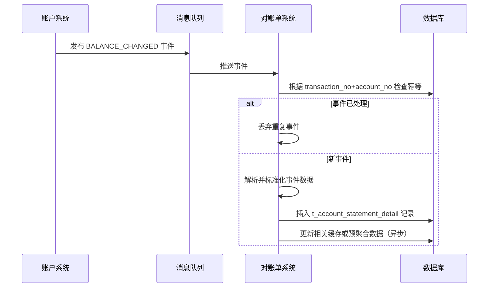
```mermaid
sequenceDiagram
    participant Account as 账户系统
    participant MQ as 消息队列
    participant Stmt as 对账单系统
    participant DB as 数据库

    Account->>MQ: 发布 BALANCE_CHANGED 事件
    MQ->>Stmt: 推送事件
    Stmt->>DB: 根据 transaction_no+account_no 检查幂等
    alt 事件已处理
        Stmt->>Stmt: 丢弃重复事件
    else 新事件
        Stmt->>Stmt: 解析并标准化事件数据
        Stmt->>DB: 插入 t_account_statement_detail 记录
        Stmt->>DB: 更新相关缓存或预聚合数据（异步）
    end
```

### 5.2 商户查询结算单时序图
```mermaid
sequenceDiagram
    participant Portal as 商户门户
    participant Stmt as 对账单系统
    participant DB as 数据库
    participant Storage as 文件存储

    Portal->>Stmt: GET /merchants/{id}/summary?settlementDate=...
    Stmt->>DB: 查询 t_merchant_settlement_statement
    alt 结算单已生成
        DB-->>Stmt: 返回结算单摘要
        Stmt-->>Portal: 返回摘要信息
        Portal->>Stmt: 请求下载PDF (隐含在摘要的download_url)
        Stmt->>Storage: 重定向或代理文件请求
        Storage-->>Portal: 返回PDF文件流
    else 结算单未生成
        Stmt->>DB: 实时聚合 t_account_statement_detail 生成临时视图
        Stmt-->>Portal: 返回实时聚合结果（标记为未生成正式单）
    end
```

### 5.3 日终批量生成账单时序图
```mermaid
sequenceDiagram
    participant Scheduler as 定时任务
    participant Stmt as 对账单系统
    participant DB as 数据库
    participant Render as 模板渲染服务
    participant Storage as 文件存储
    participant MQ as 消息队列

    Scheduler->>Stmt: POST /generation/daily (targetDate=昨日)
    Stmt->>DB: 查询昨日所有已结算的商户
    loop 每个商户
        Stmt->>DB: 获取该商户结算明细数据
        Stmt->>Render: 调用渲染服务，生成PDF
        Render-->>Stmt: 返回PDF文件流
        Stmt->>Storage: 上传PDF文件
        Storage-->>Stmt: 返回文件URL
        Stmt->>DB: 更新 t_merchant_settlement_statement.download_url
    end
    Stmt->>DB: 生成机构日汇总数据 (t_institution_daily_summary)
    Stmt->>MQ: 发布 DAILY_STATEMENT_GENERATED 事件
    Stmt-->>Scheduler: 返回生成结果汇总
```

## 6. 错误处理

| 错误码 | HTTP状态码 | 描述 | 处理策略 |
| :--- | :--- | :--- | :--- |
| `INVALID_TIME_RANGE` | 400 | 查询时间范围无效或过长 | 提示用户调整时间范围，建议分批查询 |
| `STATEMENT_NOT_GENERATED` | 404 | 请求的结算单尚未生成 | 返回实时聚合数据或提示稍后再试 |
| `EXPORT_TASK_NOT_FOUND` | 404 | 导出任务不存在 | 检查任务号是否正确 |
| `EXPORT_TASK_PROCESSING` | 409 | 相同条件的导出任务正在处理 | 返回已有任务信息，避免重复 |
| `EVENT_PROCESSING_ERROR` | 500 | 处理事件时发生异常（如数据格式不符） | 记录死信队列，告警并人工介入分析 |
| `RENDER_SERVICE_UNAVAILABLE` | 503 | 模板渲染服务不可用 | 账单生成降级，仅存储结构化数据，不生成PDF |
| `STORAGE_UPLOAD_FAILED` | 500 | 文件上传到存储失败 | 重试数次，失败则记录错误，账单状态标记为部分失败 |

**通用策略**：
- **事件消费**：保证至少一次交付，通过数据库唯一键实现幂等，异常事件进入死信队列人工处理。
- **查询性能**：对于大数据量查询，强制分页，限制最大查询时间范围。依赖预聚合表提升汇总查询性能。
- **异步任务**：导出、渲染等耗时操作全部异步化，通过任务状态查询和回调通知结果。
- **监控**：监控事件堆积情况、账单生成成功率、查询接口P99耗时。

## 7. 依赖说明

本模块是数据聚合与展示层，强依赖上游数据源，对下游为提供服务。

1. **上游数据源（强依赖）**：
   - **账户系统、清结算系统、业务核心**：通过消息队列消费其事件。这是账单数据的**唯一来源**。必须保证消息中间件的高可用，并处理好消息积压与重复消费问题。
   - **协作模式**：被动监听。上游系统需保证事件格式的稳定性和向后兼容。

2. **下游服务调用方（弱依赖）**：
   - **商户门户、运营管理平台**：通过同步API调用查询账单。需保证API的高可用和高性能，尤其是商户端的查询。
   - **协作模式**：提供清晰的API文档和限流策略。

3. **外部服务依赖**：
   - **消息中间件 (Kafka/RocketMQ)**：**强依赖**。数据摄入通道。需监控消费延迟。
   - **数据库 (MySQL)**：**强依赖**。存储所有账单明细和汇总数据。需根据数据量（按时间或机构）设计分库分表策略。
   - **对象存储 (OSS/S3)**：**弱依赖**。存储生成的PDF/Excel账单文件。故障时可降级为仅提供在线查看。
   - **模板渲染服务/工具**：**弱依赖**。用于生成PDF。可降级。

4. **协作模式总结**：
   - **数据流**：`事件驱动` 为主，`主动查询` 为辅。核心数据通过事件异步同步，缺失数据可通过主动查询上游系统补全（需谨慎，避免循环依赖）。
   - **一致性**：追求`最终一致性`。账单数据相对上游业务数据有短暂延迟（秒级），但对账场景可接受。
   - **可扩展性**：由于按`institution_id`和`时间`分区清晰，系统易于水平扩展，可通过增加消费者实例来提升事件处理能力。

---
# 4 接口设计
# 4. 接口设计

## 4.1 对外接口
本节列出系统对外部业务方（如天财商龙、商户、运营人员等）暴露的API接口。

### 4.1.1 商户与账户管理
此类接口主要用于商户注册、账户开通与管理，主要由三代系统、钱包APP/商服平台对外提供。

| 接口路径与方法 | 所属模块 | 功能说明 |
| :--- | :--- | :--- |
| **POST** `/api/v1/merchants` | 三代系统 | 创建/注册商户，作为业务关系的权威数据源。 |
| **POST** `/api/v1/merchants/{merchantId}/accounts/apply` | 三代系统 | 为指定商户申请开通天财专用账户。 |
| **POST** `/api/v1/accounts/open` | 钱包APP/商服平台 | 开通天财专用账户（面向商户的便捷入口）。 |
| **POST** `/api/v1/accounts/{accountNo}/bank-cards` | 钱包APP/商服平台 | 为天财账户绑定提现银行卡。 |
| **GET** `/api/v1/merchant/accounts` | 钱包APP/商服平台 | 查询商户名下的账户概览信息。 |

### 4.1.2 业务关系与认证
此类接口用于建立和管理商户间的业务关系及身份认证流程，主要由认证系统、钱包APP/商服平台对外提供。

| 接口路径与方法 | 所属模块 | 功能说明 |
| :--- | :--- | :--- |
| **POST** `/api/v1/auth/bindings` | 认证系统 | 发起商户间的资金流转关系绑定流程，创建认证实例。 |
| **GET** `/api/v1/auth/bindings/{bindingId}` | 认证系统 | 查询指定绑定关系的详细信息与当前状态。 |
| **POST** `/api/v1/merchant/business-relationships/initiate` | 钱包APP/商服平台 | 发起业务关系绑定流程（面向商户的便捷入口）。 |
| **GET** `/api/v1/sign/agreements/preview` | 电子签章系统 | H5页面调用，获取待签署的协议预览内容。 |
| **POST** `/api/v1/sign/callbacks/{signTaskId}` | 电子签章系统 | 接收来自H5页面或CA机构的签署结果异步回调。 |

### 4.1.3 资金流转与交易
此类接口是“天财分账”业务的核心，用于发起和处理各类资金流转指令。

| 接口路径与方法 | 所属模块 | 功能说明 |
| :--- | :--- | :--- |
| **POST** `/tiancai/api/v1/split` | 三代系统 | **核心接口**。供天财商龙调用，发起分账等资金流转请求。 |
| **POST** `/api/v1/transfers/tiancai-split` | 钱包APP/商服平台 | **核心内部接口**。执行天财分账，通常由三代系统调用。 |
| **POST** `/api/v1/transactions/batch-payment` | 业务核心 | 发起批量付款任务（异步处理）。 |
| **GET** `/api/v1/transactions/{transactionNo}` | 业务核心 | 查询单笔交易的详情。 |
| **GET** `/api/v1/transactions/batches/{batchNo}` | 业务核心 | 查询批量付款任务的详情。 |
| **POST** `/api/v1/transactions/{transactionNo}/reverse` | 业务核心 | 对指定交易进行冲正。 |

### 4.1.4 结算与对账
此类接口用于资金结算、查询及账单服务，主要面向商户和运营人员。

| 接口路径与方法 | 所属模块 | 功能说明 |
| :--- | :--- | :--- |
| **POST** `/api/v1/settlements/instructions` | 清结算系统 | 创建结算指令，触发单笔或批量资金的结算划拨。 |
| **GET** `/api/v1/settlements/merchants/{merchantId}` | 清结算系统 | 查询指定商户的结算记录。 |
| **GET** `/api/v1/statements/accounts/{accountNo}/transactions` | 对账单系统 | 查询指定账户在特定时间范围内的所有资金变动明细。 |
| **GET** `/api/v1/statements/merchants/{merchantId}/summary` | 对账单系统 | 查询指定商户在特定结算周期内的资金结算汇总情况。 |
| **POST** `/api/v1/statements/export` | 对账单系统 | 根据复杂查询条件导出账单数据为文件（如Excel）。 |

### 4.1.5 计费服务
此类接口用于手续费的计算与查询。

| 接口路径与方法 | 所属模块 | 功能说明 |
| :--- | :--- | :--- |
| **POST** `/api/v1/fee/calculate` | 计费中台 | 核心计费接口，根据交易信息计算手续费及承担方。 |
| **GET** `/api/v1/fee/result/{feeRequestId}` | 计费中台 | 根据计费请求ID查询详细的计费结果。 |

## 4.2 模块间接口
本节列出系统内部各微服务模块之间的主要调用接口，这些接口通常不直接对外暴露。

### 4.2.1 账户与资金操作
账户系统作为底层服务，为多个上层模块提供原子化的账户与资金操作。

| 接口路径与方法 | 调用方 -> 提供方 | 功能说明 |
| :--- | :--- | :--- |
| **POST** `/api/v1/accounts` | 行业钱包系统 -> 账户系统 | 为指定商户开立新的天财专用账户。 |
| **POST** `/api/v1/accounts/{accountNo}/upgrade-to-tiancai` | 三代系统 -> 账户系统 | 将已有账户升级标记为天财专用账户。 |
| **POST** `/api/v1/accounts/{accountNo}/status` | 行业钱包系统/三代系统 -> 账户系统 | 冻结、解冻或注销账户。 |
| **POST** `/api/v1/accounts/transactions` | 行业钱包系统/业务核心 -> 账户系统 | **核心内部接口**。执行原子化的资金操作（入账、出账、冻结、解冻）。 |
| **GET** `/api/v1/accounts/{accountNo}` | 多个模块 -> 账户系统 | 查询账户核心信息。 |

### 4.2.2 业务控制与校验
三代系统作为业务控制中心，提供商户、关系和业务请求的校验服务。

| 接口路径与方法 | 调用方 -> 提供方 | 功能说明 |
| :--- | :--- | :--- |
| **POST** `/api/v1/business-relationships/validate` | 业务核心/行业钱包系统 -> 三代系统 | **核心内部接口**。在发起交易前，校验业务关系的有效性、状态及权限。 |
| **POST** `/api/v1/business-relationships` | 认证系统 -> 三代系统 | 创建业务关系授权记录。 |

### 4.2.3 认证与签约流程
认证系统与电子签章系统协同，完成身份认证与协议签署流程。

| 接口路径与方法 | 调用方 -> 提供方 | 功能说明 |
| :--- | :--- | :--- |
| **POST** `/api/v1/sign/tasks` | 认证系统 -> 电子签章系统 | 创建电子协议签署任务。 |
| **GET** `/api/v1/sign/tasks/{signTaskId}` | 认证系统 -> 电子签章系统 | 查询签署任务状态。 |
| **POST** `/api/v1/auth/callbacks/{authFlowId}` | 电子签约/支付系统 -> 认证系统 | 接收来自外部系统的异步回调，更新认证流程状态。 |
| **POST** `/api/v1/auth/bindings/{bindingId}/enable-payment` | 业务核心 -> 认证系统 | 在关系绑定完成后，为批量付款等场景触发“开通付款”流程。 |

### 4.2.4 资金流转执行
行业钱包系统作为桥梁，协调执行具体的资金划转操作。

| 接口路径与方法 | 调用方 -> 提供方 | 功能说明 |
| :--- | :--- | :--- |
| **POST** `/api/v1/wallet/accounts/open` | 三代系统/钱包APP -> 行业钱包系统 | 协调开通天财专用账户的完整流程。 |
| **POST** `/api/v1/wallet/relationships/initiate-auth` | 三代系统 -> 行业钱包系统 | 发起关系绑定的身份认证流程。 |
| **POST** `/api/v1/wallet/transfers/execute` | 业务核心 -> 行业钱包系统 | **核心接口**。执行具体的资金划转操作，内部会调用账户系统完成记账。 |
| **GET** `/api/v1/wallet/accounts/{accountNo}/relationships` | 业务核心 -> 行业钱包系统 | 查询账户的关联业务关系。 |

### 4.2.5 计费与结算联动
计费中台和清结算系统在交易和结算过程中被调用，以计算费用并完成资金划拨。

| 接口路径与方法 | 调用方 -> 提供方 | 功能说明 |
| :--- | :--- | :--- |
| **POST** `/api/v1/fee/calculate` | 业务核心/清结算系统 -> 计费中台 | 在交易或结算时，计算应收手续费。 |
| **POST** `/api/v1/settlements/instructions` | 业务核心 -> 清结算系统 | 交易完成后，创建结算指令以触发资金的实际划拨。 |
| **POST** `/api/v1/settlements/{instructionNo}/retry` | (内部调度/运营) -> 清结算系统 | 对失败的结算指令进行重试。 |

### 4.2.6 数据依赖与查询
各模块为对账单系统等提供数据查询接口，或依赖其他模块获取基础数据。

| 接口路径与方法 | 调用方 -> 提供方 | 功能说明 |
| :--- | :--- | :--- |
| **GET** `/api/v1/statements/accounts/{accountNo}/transactions` | 对账单系统 -> 账户系统 | 拉取账户流水明细，用于生成账单。 |
| **GET** `/api/v1/statements/merchants/{merchantId}/summary` | 对账单系统 -> 清结算系统 | 拉取商户结算汇总数据。 |
| **POST** `/api/v1/auth/verifications/remit` | 认证系统 -> 支付系统/清结算系统 | 请求向对公账户发起小额打款验证。 |
| **GET** `/api/v1/sign/agreements/{agreementId}` | 业务核心/认证系统 -> 电子签章系统 | 下载或验证已签署的协议文件。 |

**请求/响应格式说明**：
以上接口的请求与响应格式通常采用JSON，遵循公司统一的API规范。请求头需包含用于链路追踪的`Trace-Id`、认证令牌`Authorization`等。响应体包含标准字段如`code`、`message`、`data`。具体接口的详细字段定义需参考各模块的API设计文档。内部接口为提高性能，可能采用RPC调用，但其逻辑映射与上述HTTP接口一致。
---
# 5 数据库设计
# 5. 数据库设计

## 5.1 ER图

```mermaid
erDiagram
    t_merchant ||--o{ t_account_apply : "申请"
    t_merchant ||--o{ t_account_binding : "绑定"
    t_merchant ||--o{ t_business_relationship : "建立"
    t_merchant ||--o{ t_merchant_settlement_statement : "生成"
    t_merchant ||--o{ t_institution_daily_summary : "汇总至"

    t_account ||--o{ t_account_transaction : "产生"
    t_account ||--o{ t_account_statement_detail : "记录"
    t_account ||--o{ t_account_binding : "绑定"
    t_account ||--o{ t_wallet_account : "映射"

    t_account_binding }|--|| t_merchant : "属于"
    t_account_binding }|--|| t_account : "关联"

    t_business_relationship ||--o{ t_relation_cache : "缓存"
    t_business_relationship ||--o{ t_account_relationship : "映射"
    t_business_relationship }|--|| t_merchant : "付款方"
    t_business_relationship }|--|| t_merchant : "收款方"

    t_transaction ||--o{ t_settlement_detail : "结算"
    t_transaction ||--o{ t_fee_detail : "计费"
    t_transaction }|--|| t_business_relationship : "基于"
    t_transaction }|--|| t_account : "付款账户"
    t_transaction }|--|| t_account : "收款账户"

    t_batch_task ||--o{ t_batch_task_item : "包含"

    t_settlement_instruction ||--o{ t_settlement_detail : "包含"
    t_settlement_instruction }|--|| t_daily_settlement_batch : "属于批次"

    t_fee_request ||--o{ t_fee_detail : "明细"
    t_fee_request }|--|| t_transaction : "关联交易"

    auth_binding_relationship ||--o{ auth_flow : "发起"
    auth_binding_relationship }|--|| t_business_relationship : "对应"

    sign_task }|--|| auth_flow : "用于"
    sign_task ||--o{ sign_party : "参与方"

    t_wallet_account }|--|| t_account : "同步"
    t_wallet_account ||--o{ t_account_relationship : "关联"
    t_wallet_account ||--o{ t_wallet_transaction : "产生"

    t_account_relationship }|--|| t_business_relationship : "源自"
    t_account_relationship }|--|| t_wallet_account : "账户A"
    t_account_relationship }|--|| t_wallet_account : "账户B"

    t_tiancai_account }|--|| t_account : "专用账户"
    t_tiancai_account ||--o{ t_bank_card_binding : "绑定"
    t_tiancai_account ||--o{ t_fund_transfer : "发起"
```

## 5.2 表结构

### 核心实体表

| 表名 | 所属模块 | 主要字段说明 | 与其他表的关系 |
| :--- | :--- | :--- | :--- |
| **t_merchant** | 三代系统 | `merchant_id`(PK), `name`, `type`, `status`, `institution_id`, `contact_info`, `create_time` | 1. `t_account_binding`： 一对多，一个商户可绑定多个账户。<br>2. `t_business_relationship`： 一对多，作为付款方或收款方参与多个业务关系。<br>3. `t_account_apply`： 一对多，可发起多次账户申请。 |
| **t_account** | 账户系统 | `account_no`(PK), `merchant_id`, `type`, `balance`, `available_balance`, `frozen_balance`, `currency`, `status`, `is_tiancai`, `create_time` | 1. `t_account_transaction`： 一对多，产生多条流水。<br>2. `t_account_binding`： 一对一，与商户绑定。<br>3. `t_wallet_account`： 一对一，被钱包账户映射。<br>4. `t_transaction`： 一对多，作为付款或收款账户参与交易。 |
| **t_business_relationship** | 三代系统 | `relationship_id`(PK), `payer_merchant_id`, `payee_merchant_id`, `biz_scene`, `auth_status`, `contract_id`, `effective_time`, `expire_time`, `status` | 1. `t_relation_cache`： 一对多，生成多个缓存条目。<br>2. `t_account_relationship`： 一对多，映射为多个账户层关系。<br>3. `auth_binding_relationship`： 一对一，对应一个认证绑定关系。<br>4. `t_transaction`： 一对多，作为交易的基础授权。 |
| **t_transaction** | 业务核心 | `transaction_no`(PK), `relationship_id`, `payer_account_no`, `payee_account_no`, `amount`, `fee`, `fee_bearer`, `biz_type`, `status`, `request_time`, `complete_time` | 1. `t_settlement_detail`： 一对多，可被拆分为多条结算明细。<br>2. `t_fee_detail`： 一对多，产生多条计费明细。<br>3. `t_fee_request`： 一对一，关联一次计费请求。 |

### 账户与钱包相关表

| 表名 | 所属模块 | 主要字段说明 | 与其他表的关系 |
| :--- | :--- | :--- | :--- |
| **t_account_transaction** | 账户系统 | `id`(PK), `account_no`, `related_account_no`, `transaction_no`, `type`, `amount`, `balance_before`, `balance_after`, `create_time` | `t_account`： 多对一，归属于一个账户。 |
| **t_account_binding** | 三代系统 | `id`(PK), `merchant_id`, `account_no`, `binding_type`, `is_default`, `bind_time` | 1. `t_merchant`： 多对一，属于一个商户。<br>2. `t_account`： 多对一，关联一个账户。 |
| **t_account_apply** | 三代系统 | `apply_id`(PK), `merchant_id`, `apply_type`, `status`, `audit_info`, `apply_time`, `complete_time` | `t_merchant`： 多对一，由一个商户发起。 |
| **t_wallet_account** | 行业钱包系统 | `wallet_account_id`(PK), `account_no`, `merchant_id`, `account_alias`, `biz_tags`, `sync_time` | 1. `t_account`： 一对一，同步自底层账户。<br>2. `t_account_relationship`： 一对多，作为关系中的一方。<br>3. `t_wallet_transaction`： 一对多，产生钱包交易流水。 |
| **t_account_relationship** | 行业钱包系统 | `wallet_rel_id`(PK), `relationship_id`, `account_a_no`, `account_b_no`, `auth_status`, `create_time` | 1. `t_business_relationship`： 多对一，源自一个业务关系。<br>2. `t_wallet_account`： 多对一，关联账户A。<br>3. `t_wallet_account`： 多对一，关联账户B。 |
| **t_tiancai_account** | 钱包APP/商服平台 | `tiancai_account_id`(PK), `account_no`, `merchant_id`, `open_channel`, `service_level`, `open_time` | 1. `t_account`： 一对一，指向一个天财专用账户。<br>2. `t_bank_card_binding`： 一对多，可绑定多张银行卡。 |

### 认证与签约相关表

| 表名 | 所属模块 | 主要字段说明 | 与其他表的关系 |
| :--- | :--- | :--- | :--- |
| **auth_binding_relationship** | 认证系统 | `binding_id`(PK), `relationship_id`, `auth_scenario`, `overall_status`, `current_step`, `initiate_time`, `complete_time` | 1. `t_business_relationship`： 一对一，对应一个业务关系。<br>2. `auth_flow`： 一对多，包含多个认证流程步骤。 |
| **auth_flow** | 认证系统 | `flow_id`(PK), `binding_id`, `step_name`, `step_status`, `external_ref_id`, `request_data`, `response_data`, `create_time`, `update_time` | `auth_binding_relationship`： 多对一，属于一个绑定关系。 |
| **sign_task** | 电子签章系统 | `sign_task_id`(PK), `flow_id`, `template_id`, `biz_scene`, `task_status`, `agreement_id`, `create_time`, `sign_deadline` | 1. `auth_flow`： 多对一，服务于一个认证流程步骤。<br>2. `sign_party`： 一对多，包含多个签署方。 |
| **sign_party** | 电子签章系统 | `id`(PK), `sign_task_id`, `party_type`, `party_id`, `party_name`, `sign_status`, `sign_time`, `certificate_info` | `sign_task`： 多对一，属于一个签署任务。 |

### 交易与结算相关表

| 表名 | 所属模块 | 主要字段说明 | 与其他表的关系 |
| :--- | :--- | :--- | :--- |
| **t_batch_task** | 业务核心 | `batch_no`(PK), `initiator_merchant_id`, `total_amount`, `total_count`, `success_count`, `status`, `create_time`, `finish_time` | `t_batch_task_item`： 一对多，包含多个明细项。 |
| **t_batch_task_item** | 业务核心 | `id`(PK), `batch_no`, `transaction_no`, `status`, `error_msg`, `seq_no` | `t_batch_task`： 多对一，归属于一个批量任务。 |
| **t_relation_cache** | 业务核心 | `id`(PK), `relationship_id`, `payer_account_no`, `payee_account_no`, `auth_status`, `expire_time` | `t_business_relationship`： 多对一，缓存自一个业务关系。 |
| **t_settlement_instruction** | 清结算系统 | `instruction_no`(PK), `batch_no`, `merchant_id`, `settle_date`, `total_amount`, `status`, `channel`, `create_time`, `finish_time` | 1. `t_settlement_detail`： 一对多，包含多条结算明细。<br>2. `t_daily_settlement_batch`： 多对一，属于一个日终批次。 |
| **t_settlement_detail** | 清结算系统 | `id`(PK), `instruction_no`, `transaction_no`, `settle_amount`, `fee_amount`, `status` | 1. `t_settlement_instruction`： 多对一，归属于一条结算指令。<br>2. `t_transaction`： 多对一，关联一笔原始交易。 |
| **t_daily_settlement_batch** | 清结算系统 | `batch_no`(PK), `settle_date`, `total_instruction_count`, `total_settle_amount`, `status`, `create_time` | `t_settlement_instruction`： 一对多，包含多条结算指令。 |

### 计费相关表

| 表名 | 所属模块 | 主要字段说明 | 与其他表的关系 |
| :--- | :--- | :--- | :--- |
| **fee_rule** | 计费中台 | `rule_id`(PK), `biz_scene`, `payer_type`, `payee_type`, `algorithm`, `rate`, `fixed_fee`, `fee_bearer`, `effective_time`, `status` | 无直接外键，通过业务场景逻辑关联。 |
| **fee_request** | 计费中台 | `fee_request_id`(PK), `transaction_no`, `biz_scene`, `payer_info`, `payee_info`, `amount`, `calculated_fee`, `fee_bearer`, `request_time` | 1. `t_transaction`： 一对一，为一次交易计费。<br>2. `t_fee_detail`： 一对多，产生计费明细。 |
| **fee_detail** | 计费中台 | `id`(PK), `fee_request_id`, `rule_id`, `fee_amount`, `calculation_basis`, `bearer` | 1. `fee_request`： 多对一，属于一次计费请求。<br>2. `fee_rule`： 多对一，依据一条计费规则。 |

### 对账单相关表

| 表名 | 所属模块 | 主要字段说明 | 与其他表的关系 |
| :--- | :--- | :--- | :--- |
| **t_account_statement_detail** | 对账单系统 | `id`(PK), `account_no`, `transaction_no`, `trade_time`, `amount`, `balance`, `trade_type`, `counterparty`, `biz_remark`, `create_time` | `t_account`： 多对一，记录一个账户的流水。 |
| **t_merchant_settlement_statement** | 对账单系统 | `statement_id`(PK), `merchant_id`, `settle_date`, `total_credit`, `total_debit`, `net_amount`, `fee_total`, `status`, `generate_time` | `t_merchant`： 多对一，为一个商户生成。 |
| **t_institution_daily_summary** | 对账单系统 | `id`(PK), `institution_id`, `summary_date`, `total_trade_count`, `total_trade_amount`, `total_settle_amount`, `active_merchant_count`, `update_time` | `t_merchant`： 间接关联，通过`institution_id`聚合其下所有商户数据。 |

### 辅助与日志表

| 表名 | 所属模块 | 主要字段说明 | 与其他表的关系 |
| :--- | :--- | :--- | :--- |
| **auth_audit_log** | 认证系统 | `id`(PK), `binding_id`, `operator`, `action`, `from_status`, `to_status`, `remark`, `create_time` | `auth_binding_relationship`： 多对一，记录一个绑定关系的操作日志。 |
| **sign_audit_log** | 电子签章系统 | `id`(PK), `sign_task_id`, `action`, `operator`, `detail`, `create_time` | `sign_task`： 多对一，记录一个签署任务的操作日志。 |
| **t_auth_task** | 行业钱包系统 | `task_id`(PK), `relationship_id`, `task_type`, `status`, `create_time`, `update_time` | 逻辑关联`t_business_relationship`，记录认证任务。 |
| **t_bank_card_binding** | 钱包APP/商服平台 | `binding_id`(PK), `tiancai_account_id`, `bank_card_no`, `bank_name`, `branch`, `holder_name`, `status`, `bind_time` | `t_tiancai_account`： 多对一，绑定于一个天财账户。 |
| **t_fund_transfer** | 钱包APP/商服平台 | `transfer_id`(PK), `tiancai_account_id`, `transaction_no`, `transfer_type`, `amount`, `status`, `request_time` | `t_tiancai_account`： 多对一，由一个天财账户发起。 |
| **t_relationship_process** | 钱包APP/商服平台 | `process_id`(PK), `relationship_id`, `initiator_merchant_id`, `current_step`, `status`, `create_time` | 逻辑关联`t_business_relationship`，记录前端发起的绑定流程。 |
| **t_wallet_transaction** | 行业钱包系统 | `wallet_transaction_no`(PK), `wallet_account_id`, `transaction_no`, `biz_type`, `amount`, `status`, `create_time` | `t_wallet_account`： 多对一，关联一个钱包账户。 |
| **t_business_request** | 三代系统 | `request_id`(PK), `merchant_id`, `request_type`, `content`, `status`, `create_time` | 逻辑关联`t_merchant`，记录业务请求。 |
| **t_statement_export_task** | 对账单系统 | `task_id`(PK), `requester`, `query_criteria`, `file_url`, `status`, `create_time`, `finish_time` | 无直接外键，管理导出任务元数据。 |
| **sign_template** | 电子签章系统 | `template_id`(PK), `template_name`, `biz_scene`, `content_hash`, `version`, `status`, `create_time` | 无直接外键，`sign_task`通过`template_id`引用。 |