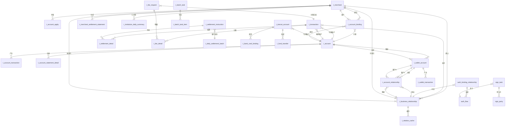

# 5. 数据库设计

## 5.1 ER图

## 5.2 表结构

### 核心实体表

| 表名 | 所属模块 | 主要字段说明 | 与其他表的关系 |
| :--- | :--- | :--- | :--- |
| **t_merchant** | 三代系统 | `merchant_id`(PK), `name`, `type`, `status`, `institution_id`, `contact_info`, `create_time` | 1. `t_account_binding`： 一对多，一个商户可绑定多个账户。 2. `t_business_relationship`： 一对多，作为付款方或收款方参与多个业务关系。 3. `t_account_apply`： 一对多，可发起多次账户申请。 |
| **t_account** | 账户系统 | `account_no`(PK), `merchant_id`, `type`, `balance`, `available_balance`, `frozen_balance`, `currency`, `status`, `is_tiancai`, `create_time` | 1. `t_account_transaction`： 一对多，产生多条流水。 2. `t_account_binding`： 一对一，与商户绑定。 3. `t_wallet_account`： 一对一，被钱包账户映射。 4. `t_transaction`： 一对多，作为付款或收款账户参与交易。 |
| **t_business_relationship** | 三代系统 | `relationship_id`(PK), `payer_merchant_id`, `payee_merchant_id`, `biz_scene`, `auth_status`, `contract_id`, `effective_time`, `expire_time`, `status` | 1. `t_relation_cache`： 一对多，生成多个缓存条目。 2. `t_account_relationship`： 一对多，映射为多个账户层关系。 3. `auth_binding_relationship`： 一对一，对应一个认证绑定关系。 4. `t_transaction`： 一对多，作为交易的基础授权。 |
| **t_transaction** | 业务核心 | `transaction_no`(PK), `relationship_id`, `payer_account_no`, `payee_account_no`, `amount`, `fee`, `fee_bearer`, `biz_type`, `status`, `request_time`, `complete_time` | 1. `t_settlement_detail`： 一对多，可被拆分为多条结算明细。 2. `t_fee_detail`： 一对多，产生多条计费明细。 3. `t_fee_request`： 一对一，关联一次计费请求。 |

### 账户与钱包相关表

| 表名 | 所属模块 | 主要字段说明 | 与其他表的关系 |
| :--- | :--- | :--- | :--- |
| **t_account_transaction** | 账户系统 | `id`(PK), `account_no`, `related_account_no`, `transaction_no`, `type`, `amount`, `balance_before`, `balance_after`, `create_time` | `t_account`： 多对一，归属于一个账户。 |
| **t_account_binding** | 三代系统 | `id`(PK), `merchant_id`, `account_no`, `binding_type`, `is_default`, `bind_time` | 1. `t_merchant`： 多对一，属于一个商户。 2. `t_account`： 多对一，关联一个账户。 |
| **t_account_apply** | 三代系统 | `apply_id`(PK), `merchant_id`, `apply_type`, `status`, `audit_info`, `apply_time`, `complete_time` | `t_merchant`： 多对一，由一个商户发起。 |
| **t_wallet_account** | 行业钱包系统 | `wallet_account_id`(PK), `account_no`, `merchant_id`, `account_alias`, `biz_tags`, `sync_time` | 1. `t_account`： 一对一，同步自底层账户。 2. `t_account_relationship`： 一对多，作为关系中的一方。 3. `t_wallet_transaction`： 一对多，产生钱包交易流水。 |
| **t_account_relationship** | 行业钱包系统 | `wallet_rel_id`(PK), `relationship_id`, `account_a_no`, `account_b_no`, `auth_status`, `create_time` | 1. `t_business_relationship`： 多对一，源自一个业务关系。 2. `t_wallet_account`： 多对一，关联账户A。 3. `t_wallet_account`： 多对一，关联账户B。 |
| **t_tiancai_account** | 钱包APP/商服平台 | `tiancai_account_id`(PK), `account_no`, `merchant_id`, `open_channel`, `service_level`, `open_time` | 1. `t_account`： 一对一，指向一个天财专用账户。 2. `t_bank_card_binding`： 一对多，可绑定多张银行卡。 |

### 认证与签约相关表

| 表名 | 所属模块 | 主要字段说明 | 与其他表的关系 |
| :--- | :--- | :--- | :--- |
| **auth_binding_relationship** | 认证系统 | `binding_id`(PK), `relationship_id`, `auth_scenario`, `overall_status`, `current_step`, `initiate_time`, `complete_time` | 1. `t_business_relationship`： 一对一，对应一个业务关系。 2. `auth_flow`： 一对多，包含多个认证流程步骤。 |
| **auth_flow** | 认证系统 | `flow_id`(PK), `binding_id`, `step_name`, `step_status`, `external_ref_id`, `request_data`, `response_data`, `create_time`, `update_time` | `auth_binding_relationship`： 多对一，属于一个绑定关系。 |
| **sign_task** | 电子签章系统 | `sign_task_id`(PK), `flow_id`, `template_id`, `biz_scene`, `task_status`, `agreement_id`, `create_time`, `sign_deadline` | 1. `auth_flow`： 多对一，服务于一个认证流程步骤。 2. `sign_party`： 一对多，包含多个签署方。 |
| **sign_party** | 电子签章系统 | `id`(PK), `sign_task_id`, `party_type`, `party_id`, `party_name`, `sign_status`, `sign_time`, `certificate_info` | `sign_task`： 多对一，属于一个签署任务。 |

### 交易与结算相关表

| 表名 | 所属模块 | 主要字段说明 | 与其他表的关系 |
| :--- | :--- | :--- | :--- |
| **t_batch_task** | 业务核心 | `batch_no`(PK), `initiator_merchant_id`, `total_amount`, `total_count`, `success_count`, `status`, `create_time`, `finish_time` | `t_batch_task_item`： 一对多，包含多个明细项。 |
| **t_batch_task_item** | 业务核心 | `id`(PK), `batch_no`, `transaction_no`, `status`, `error_msg`, `seq_no` | `t_batch_task`： 多对一，归属于一个批量任务。 |
| **t_relation_cache** | 业务核心 | `id`(PK), `relationship_id`, `payer_account_no`, `payee_account_no`, `auth_status`, `expire_time` | `t_business_relationship`： 多对一，缓存自一个业务关系。 |
| **t_settlement_instruction** | 清结算系统 | `instruction_no`(PK), `batch_no`, `merchant_id`, `settle_date`, `total_amount`, `status`, `channel`, `create_time`, `finish_time` | 1. `t_settlement_detail`： 一对多，包含多条结算明细。 2. `t_daily_settlement_batch`： 多对一，属于一个日终批次。 |
| **t_settlement_detail** | 清结算系统 | `id`(PK), `instruction_no`, `transaction_no`, `settle_amount`, `fee_amount`, `status` | 1. `t_settlement_instruction`： 多对一，归属于一条结算指令。 2. `t_transaction`： 多对一，关联一笔原始交易。 |
| **t_daily_settlement_batch** | 清结算系统 | `batch_no`(PK), `settle_date`, `total_instruction_count`, `total_settle_amount`, `status`, `create_time` | `t_settlement_instruction`： 一对多，包含多条结算指令。 |

### 计费相关表

| 表名 | 所属模块 | 主要字段说明 | 与其他表的关系 |
| :--- | :--- | :--- | :--- |
| **fee_rule** | 计费中台 | `rule_id`(PK), `biz_scene`, `payer_type`, `payee_type`, `algorithm`, `rate`, `fixed_fee`, `fee_bearer`, `effective_time`, `status` | 无直接外键，通过业务场景逻辑关联。 |
| **fee_request** | 计费中台 | `fee_request_id`(PK), `transaction_no`, `biz_scene`, `payer_info`, `payee_info`, `amount`, `calculated_fee`, `fee_bearer`, `request_time` | 1. `t_transaction`： 一对一，为一次交易计费。 2. `t_fee_detail`： 一对多，产生计费明细。 |
| **fee_detail** | 计费中台 | `id`(PK), `fee_request_id`, `rule_id`, `fee_amount`, `calculation_basis`, `bearer` | 1. `fee_request`： 多对一，属于一次计费请求。 2. `fee_rule`： 多对一，依据一条计费规则。 |

### 对账单相关表

| 表名 | 所属模块 | 主要字段说明 | 与其他表的关系 |
| :--- | :--- | :--- | :--- |
| **t_account_statement_detail** | 对账单系统 | `id`(PK), `account_no`, `transaction_no`, `trade_time`, `amount`, `balance`, `trade_type`, `counterparty`, `biz_remark`, `create_time` | `t_account`： 多对一，记录一个账户的流水。 |
| **t_merchant_settlement_statement** | 对账单系统 | `statement_id`(PK), `merchant_id`, `settle_date`, `total_credit`, `total_debit`, `net_amount`, `fee_total`, `status`, `generate_time` | `t_merchant`： 多对一，为一个商户生成。 |
| **t_institution_daily_summary** | 对账单系统 | `id`(PK), `institution_id`, `summary_date`, `total_trade_count`, `total_trade_amount`, `total_settle_amount`, `active_merchant_count`, `update_time` | `t_merchant`： 间接关联，通过`institution_id`聚合其下所有商户数据。 |

### 辅助与日志表

| 表名 | 所属模块 | 主要字段说明 | 与其他表的关系 |
| :--- | :--- | :--- | :--- |
| **auth_audit_log** | 认证系统 | `id`(PK), `binding_id`, `operator`, `action`, `from_status`, `to_status`, `remark`, `create_time` | `auth_binding_relationship`： 多对一，记录一个绑定关系的操作日志。 |
| **sign_audit_log** | 电子签章系统 | `id`(PK), `sign_task_id`, `action`, `operator`, `detail`, `create_time` | `sign_task`： 多对一，记录一个签署任务的操作日志。 |
| **t_auth_task** | 行业钱包系统 | `task_id`(PK), `relationship_id`, `task_type`, `status`, `create_time`, `update_time` | 逻辑关联`t_business_relationship`，记录认证任务。 |
| **t_bank_card_binding** | 钱包APP/商服平台 | `binding_id`(PK), `tiancai_account_id`, `bank_card_no`, `bank_name`, `branch`, `holder_name`, `status`, `bind_time` | `t_tiancai_account`： 多对一，绑定于一个天财账户。 |
| **t_fund_transfer** | 钱包APP/商服平台 | `transfer_id`(PK), `tiancai_account_id`, `transaction_no`, `transfer_type`, `amount`, `status`, `request_time` | `t_tiancai_account`： 多对一，由一个天财账户发起。 |
| **t_relationship_process** | 钱包APP/商服平台 | `process_id`(PK), `relationship_id`, `initiator_merchant_id`, `current_step`, `status`, `create_time` | 逻辑关联`t_business_relationship`，记录前端发起的绑定流程。 |
| **t_wallet_transaction** | 行业钱包系统 | `wallet_transaction_no`(PK), `wallet_account_id`, `transaction_no`, `biz_type`, `amount`, `status`, `create_time` | `t_wallet_account`： 多对一，关联一个钱包账户。 |
| **t_business_request** | 三代系统 | `request_id`(PK), `merchant_id`, `request_type`, `content`, `status`, `create_time` | 逻辑关联`t_merchant`，记录业务请求。 |
| **t_statement_export_task** | 对账单系统 | `task_id`(PK), `requester`, `query_criteria`, `file_url`, `status`, `create_time`, `finish_time` | 无直接外键，管理导出任务元数据。 |
| **sign_template** | 电子签章系统 | `template_id`(PK), `template_name`, `biz_scene`, `content_hash`, `version`, `status`, `create_time` | 无直接外键，`sign_task`通过`template_id`引用。 |