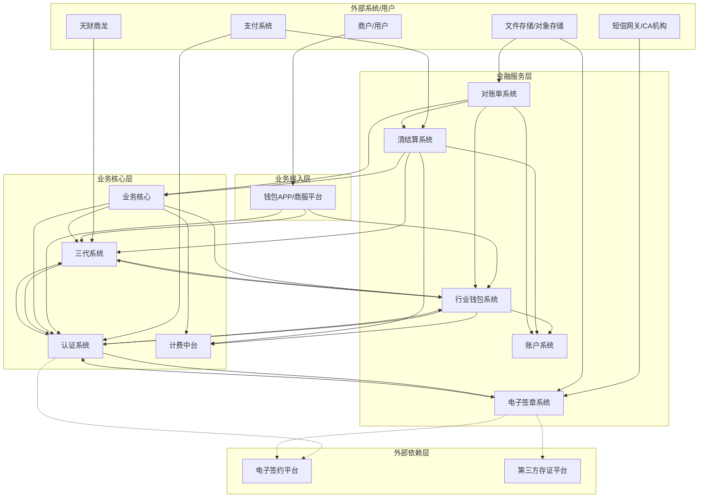
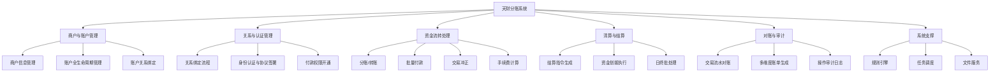
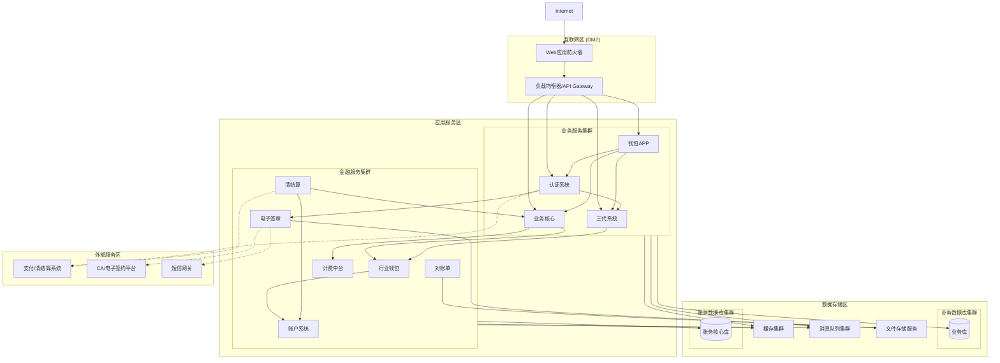
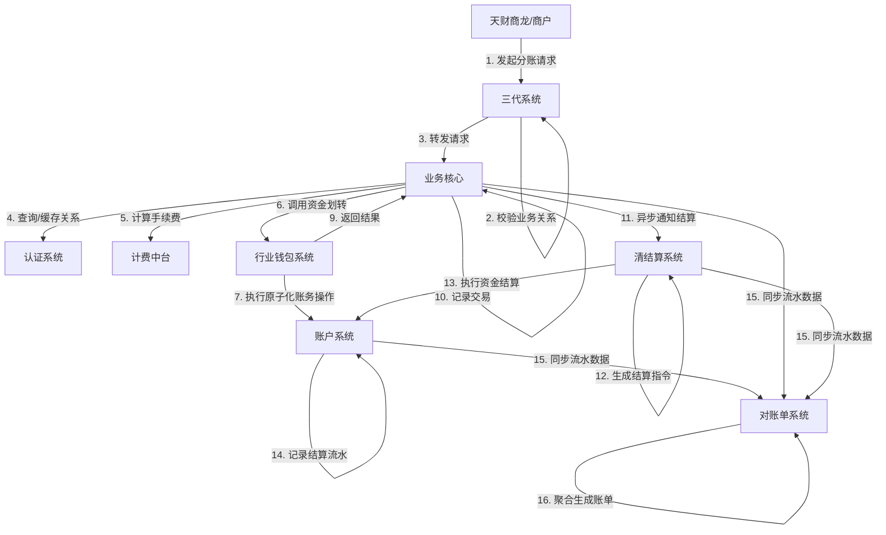
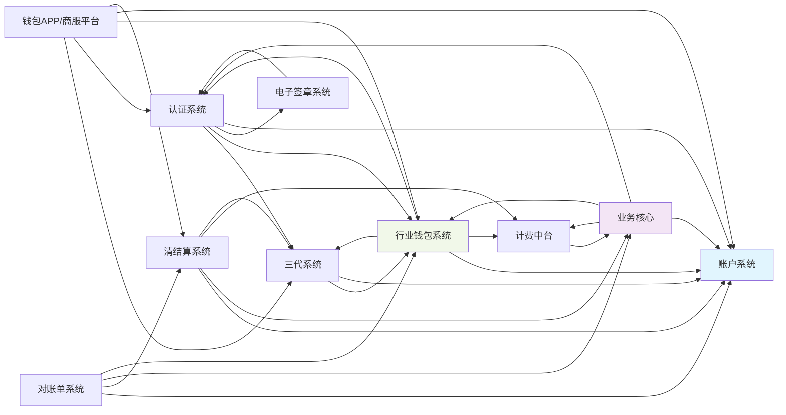

# 天财分账系统 - 系统级设计文档

## 2.1 系统结构

本系统采用分层、模块化的微服务架构，旨在为“天财”业务场景提供安全、合规、高效的资金流转与分账服务。整体架构遵循“高内聚、低耦合”原则，核心业务逻辑与底层金融基础设施解耦，通过清晰的接口契约进行交互。

### 架构图 (C4 Container Diagram)

**架构说明**:
*   **业务接入层**: 作为统一入口，面向商户和合作伙伴，封装复杂的业务流程，提供友好的交互界面和API。
*   **业务核心层**: 包含业务规则处理、流程编排、关系管理与计费的核心引擎，是业务逻辑的集中地。
*   **金融服务层**: 提供原子化的金融基础能力，如账户操作、资金划转、清算结算、电子签约和账单服务，确保金融操作的准确性、安全性和可审计性。
*   **外部依赖层**: 集成第三方专业服务，以增强系统在合规、存证等方面的能力。

## 2.2 功能结构

系统功能围绕“账户-认证-交易-结算-对账”的核心资金流转链路进行组织。

### 功能结构图

**功能模块说明**:
1.  **商户与账户管理**: 以`三代系统`为权威数据源，管理商户实体及其`天财专用账户`的创建、绑定、状态维护。
2.  **关系与认证管理**: 由`认证系统`主导，确保资金流转双方（如品牌方与加盟商）关系的合法性，通过电子签约完成授权认证。
3.  **资金流转处理**: `业务核心`作为处理引擎，调用`行业钱包系统`和`账户系统`执行具体的分账、归集、批量付款等操作，并联动`计费中台`实时计算费用。
4.  **清算与结算**: `清结算系统`负责交易后的资金清分、轧差，并生成结算指令，驱动`账户系统`完成最终的出金操作。
5.  **对账与审计**: `对账单系统`聚合全链路流水，提供多维度视图。各模块的审计表（如`auth_audit_log`, `sign_audit_log`）记录关键操作，满足合规要求。
6.  **系统支撑**: 贯穿各模块的支撑能力，如`计费中台`的规则引擎、各模块的异步任务处理、文件导出与存储等。

## 2.3 网络拓扑图

系统部署在私有云或金融云环境，采用典型的微服务网络分区拓扑，确保安全隔离与性能。

**拓扑说明**:
*   **安全分层**: 严格划分互联网区、应用服务区、数据存储区和外部服务区，通过防火墙策略控制访问。
*   **服务分组**: 将业务服务与对一致性、准确性要求极高的金融服务（特别是`账户系统`）进行逻辑或物理集群隔离，降低相互影响。
*   **数据隔离**: `业务数据库`与`账务核心数据库`分离，符合金融系统设计规范，保障核心账务数据的安全与性能。
*   **异步通信**: 广泛使用消息队列（MQ）解耦耗时操作（如批量处理、账单生成、异步通知），提升系统响应能力和可靠性。

## 2.4 数据流转

数据流转围绕“交易发起 -> 业务校验 -> 资金操作 -> 清算结算 -> 账单生成”的主线进行。

### 核心资金流转数据流图 (DFD)

**关键数据流说明**:
1.  **交易指令流**: 请求依次经过`三代系统`（业务控制）-> `业务核心`（引擎）-> `行业钱包系统`（桥梁）-> `账户系统`（基石），完成资金在账户间的转移。
2.  **控制与校验流**: `业务核心`在处理前后需与`认证系统`确认关系有效性，与`计费中台`确定费用，确保交易合规。
3.  **结算流**: 交易完成后，`清结算系统`作为后续环节，从`业务核心`或`支付系统`获取待结算数据，组织并驱动`账户系统`完成向外部银行账户的出金。
4.  **数据聚合流**: `账户系统`的流水、`业务核心`的交易记录、`清结算系统`的结算明细，作为源数据被`对账单系统`近乎实时或定时抽取，加工成面向用户的对账单。

## 2.5 系统模块交互关系

模块间通过RESTful API或RPC进行同步调用，并通过消息事件进行异步解耦。

### 模块依赖与交互图

**关键交互关系详述**:

| 依赖方 | 被依赖方 | 交互场景 | 接口示例 |
| :--- | :--- | :--- | :--- |
| **业务核心** | **行业钱包系统** | 执行所有分账、转账等资金操作。 | `POST /wallet/transfers/execute` |
| **行业钱包系统** | **账户系统** | 执行底层的原子化资金记账（入账、出账、冻结）。 | `POST /accounts/transactions` (内部) |
| **认证系统** | **电子签章系统** | 在关系绑定或开通付款时，创建并跟踪电子协议签署任务。 | `POST /sign/tasks` |
| **三代系统** | **账户系统** | 为商户申请或升级“天财专用账户”。 | `POST /accounts`, `POST /accounts/{id}/upgrade-to-tiancai` |
| **清结算系统** | **账户系统** | 执行结算指令，将资金从内部账户划拨至商户银行卡。 | `POST /accounts/transactions` (内部) |
| **钱包APP/商服平台** | **三代系统** | 查询商户权威信息、发起业务关系建立请求。 | `POST /business-relationships` |
| **所有资金相关模块** | **对账单系统** | 提供交易、流水、结算明细等原始数据。 | (通过消息或DB同步) |
| **计费中台** | **业务核心** | 为每笔交易实时计算手续费及承担方。 | `POST /fee/calculate` |

**设计原则**:
*   **单向依赖**: 架构上避免循环依赖，特别是金融底层模块（如`账户系统`）不反向依赖上层业务模块。
*   **接口明晰**: `账户系统`对内部模块提供原子操作接口；`行业钱包系统`封装业务语义更强的资金操作。
*   **事件驱动**: 交易状态更新、结算完成等事件通过消息通知相关方（如`对账单系统`），降低系统耦合度。