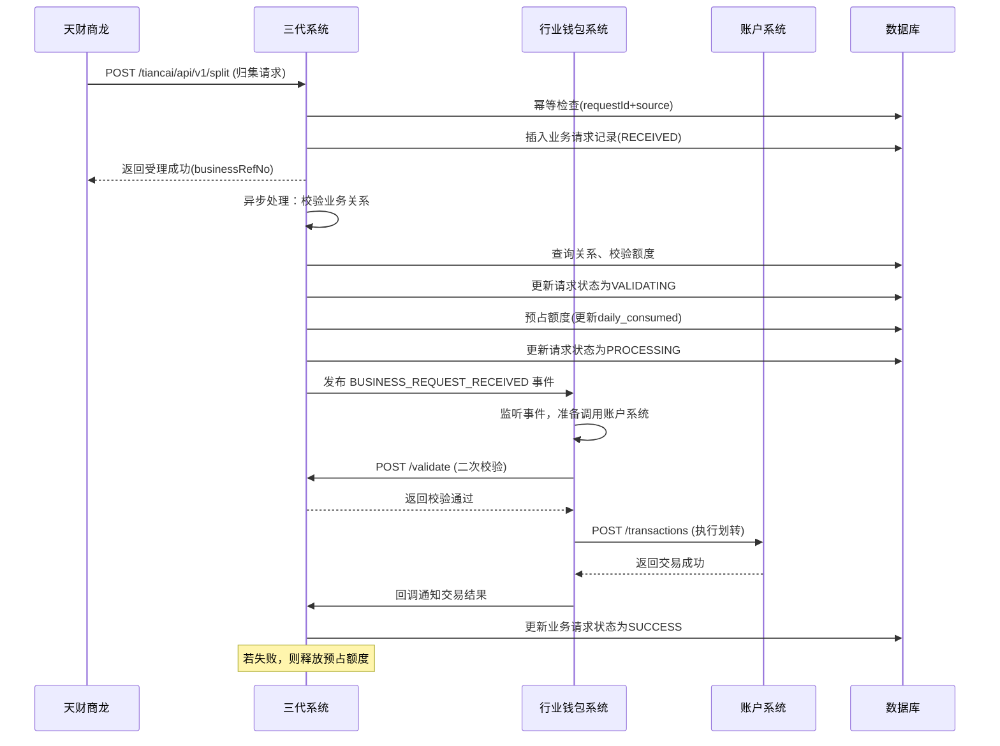
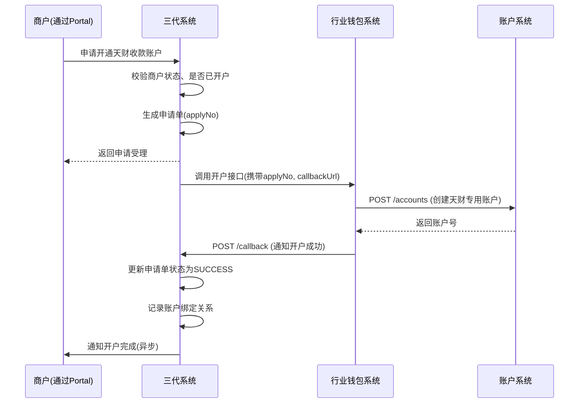

# 模块设计: 三代系统

生成时间: 2026-01-19 17:48:29

---

# 三代系统模块设计文档

## 1. 概述

### 1.1 目的
本模块是"天财"业务场景下的核心业务管理系统，作为商户、机构、账户和业务关系的**权威数据源**和**业务控制中心**。它负责管理商户进件、机构配置、业务关系授权，并为下游系统（如行业钱包系统、账户系统）提供业务校验和控制指令。

### 1.2 范围
本模块的核心职责包括：
1. **商户与机构管理**：维护商户、门店、总部等业务实体的基础信息及与天财机构的关联关系。
2. **业务关系与授权管理**：管理总部与门店之间的归集、批量付款、会员结算等业务关系的建立、授权和状态维护。
3. **账户开通控制**：控制天财专用账户（收款账户、接收方账户）的开通、升级流程，并记录账户与商户的绑定关系。
4. **业务规则校验**：在执行分账、归集等资金操作前，对业务关系的有效性、权限进行校验。
5. **接口权限控制**：为外部系统（如天财商龙）提供API，并控制其可访问的业务范围。

**边界说明**：
- **不负责**：具体的账户操作（余额变动）、资金清算、协议签署流程、身份认证执行。
- **通过接口**：向行业钱包系统、账户系统提供业务校验服务，接收电子签约平台回调更新关系状态。

## 2. 接口设计

### 2.1 API端点 (RESTful)

#### 2.1.1 商户与机构管理
- `POST /api/v1/merchants` **创建/注册商户**
    - **描述**：为天财机构下注册一个新的商户（总部或门店）。
    - **请求体** (`CreateMerchantRequest`)：
      ```json
      {
        "requestId": "req_merchant_001",
        "institutionId": "TC001",
        "merchantType": "HEADQUARTERS", // HEADQUARTERS(总部), STORE(门店)
        "merchantName": "天财品牌总部",
        "legalPerson": "张三",
        "idCardNo": "310101199001011234",
        "businessLicenseNo": "91310101MA1F123456",
        "contactPhone": "13800138000",
        "parentMerchantId": null, // 门店需填写其总部ID
        "metadata": {}
      }
      ```
    - **响应体** (`MerchantResponse`)：
      ```json
      {
        "code": "SUCCESS",
        "message": "成功",
        "data": {
          "merchantId": "M100001",
          "institutionId": "TC001",
          "merchantType": "HEADQUARTERS",
          "status": "ACTIVE",
          "createdAt": "2023-10-27T12:00:00Z"
        }
      }
      ```

- `GET /api/v1/merchants/{merchantId}` **查询商户信息**
- `POST /api/v1/merchants/{merchantId}/status` **变更商户状态**

#### 2.1.2 账户开通控制
- `POST /api/v1/merchants/{merchantId}/accounts/apply` **申请开通天财专用账户**
    - **描述**：商户申请开通天财收款账户或接收方账户。本系统记录申请并触发后续流程（如调用账户系统开户）。
    - **请求体** (`ApplyAccountRequest`)：
      ```json
      {
        "requestId": "req_apply_acc_001",
        "accountType": "RECEIVABLE", // RECEIVABLE, RECEIVER
        "operationType": "CREATE", // CREATE(新开), UPGRADE(升级)
        "originalAccountNo": null, // 升级时填写原账户号
        "callbackUrl": "https://wallet-system/callback" // 开通结果回调地址
      }
      ```
    - **响应体**：
      ```json
      {
        "code": "SUCCESS",
        "message": "申请已受理",
        "data": {
          "applyNo": "APPLY_20231027_001",
          "status": "PROCESSING"
        }
      }
      ```

- `POST /api/v1/account-applies/{applyNo}/callback` **账户开通结果回调**
    - **描述**：**内部接口**，供账户系统或行业钱包系统回调，通知账户开通/升级结果。
    - **请求体**：
      ```json
      {
        "requestId": "callback_001",
        "applyNo": "APPLY_20231027_001",
        "success": true,
        "accountNo": "TC_RCV_20231027M100001", // 成功时返回
        "failReason": null, // 失败时返回
        "operatedAt": "2023-10-27T12:05:00Z"
      }
      ```

#### 2.1.3 业务关系与授权管理
- `POST /api/v1/business-relationships` **创建业务关系**
    - **描述**：建立总部与门店之间的业务关系（如归集、批量付款、会员结算）。此接口创建关系记录，并触发电子签约流程。
    - **请求体** (`CreateRelationshipRequest`)：
      ```json
      {
        "requestId": "req_rel_001",
        "payerMerchantId": "M100002", // 付方商户ID（门店）
        "payeeMerchantId": "M100001", // 收方商户ID（总部）
        "relationshipType": "COLLECTION", // COLLECTION(归集), BATCH_PAY(批量付款), MEMBER_SETTLE(会员结算)
        "authorizationScopes": ["DAILY_COLLECTION", "ADJUSTMENT"], // 授权范围
        "maxSingleAmount": "50000.00", // 单笔限额
        "dailyLimit": "200000.00", // 日累计限额
        "effectiveDate": "2023-11-01",
        "expiryDate": "2024-10-31",
        "callbackUrl": "https://esign/callback" // 电子签约回调地址
      }
      ```
    - **响应体**：
      ```json
      {
        "code": "SUCCESS",
        "message": "关系创建成功，已触发签约",
        "data": {
          "relationshipId": "REL_20231027_001",
          "signUrl": "https://esign/h5/contract?token=abc123", // H5签约链接
          "status": "SIGNING" // SIGNING, SIGNED, REJECTED, EXPIRED
        }
      }
      ```

- `POST /api/v1/business-relationships/{relationshipId}/callback` **签约结果回调**
    - **描述**：**内部接口**，供电子签约平台回调，通知协议签署结果。
    - **请求体**：
      ```json
      {
        "requestId": "esign_callback_001",
        "relationshipId": "REL_20231027_001",
        "signStatus": "SUCCESS", // SUCCESS, FAILURE
        "signTime": "2023-10-27T14:30:00Z",
        "contractId": "CONTRACT_001",
        "failReason": null,
        "metadata": {} // 存证信息等
      }
      ```

- `POST /api/v1/business-relationships/validate` **业务关系校验**
    - **描述**：**核心内部接口**，供行业钱包系统在发起分账/归集前调用，校验业务关系是否有效且授权充足。
    - **请求体** (`ValidateRelationshipRequest`)：
      ```json
      {
        "requestId": "req_validate_001",
        "payerMerchantId": "M100002",
        "payeeMerchantId": "M100001",
        "relationshipType": "COLLECTION",
        "operation": "DAILY_COLLECTION", // 具体操作类型
        "amount": "1000.00",
        "currency": "CNY"
      }
      ```
    - **响应体** (`ValidationResponse`)：
      ```json
      {
        "code": "SUCCESS",
        "message": "校验通过",
        "data": {
          "isValid": true,
          "relationshipId": "REL_20231027_001",
          "limits": {
            "maxSingleAmount": "50000.00",
            "remainingDailyAmount": "199000.00"
          },
          "failureReasons": null // 无效时返回原因数组
        }
      }
      ```

#### 2.1.4 对外提供天财商龙接口
- `POST /tiancai/api/v1/split` **发起天财分账**
    - **描述**：供天财商龙调用，发起分账、归集、会员结算等资金流转请求。
    - **请求体**：
      ```json
      {
        "requestId": "tc_req_001",
        "institutionId": "TC001",
        "businessType": "COLLECTION", // COLLECTION, BATCH_PAY, MEMBER_SETTLE
        "payerMerchantId": "M100002",
        "payeeMerchantId": "M100001",
        "amount": "1000.00",
        "currency": "CNY",
        "postScript": "日常归集",
        "callbackUrl": "https://tiancai/callback"
      }
      ```
    - **响应体**：
      ```json
      {
        "code": "SUCCESS",
        "message": "请求已接收",
        "data": {
          "businessRefNo": "TC_COLLECT_20231027_001", // 业务参考号，用于后续查询
          "status": "PROCESSING"
        }
      }
      ```

### 2.2 发布/消费的事件
- **消费事件**：
    - `ACCOUNT_CREATED` (来自账户系统)：更新本地账户绑定状态。
    - `CONTRACT_SIGNED` (来自电子签约平台)：更新业务关系状态为生效。
- **发布事件** (`BusinessEvent`)：
    - **事件类型**：`MERCHANT_REGISTERED`, `ACCOUNT_APPLY_CREATED`, `RELATIONSHIP_ESTABLISHED`, `BUSINESS_REQUEST_RECEIVED`
    - **事件通道**：`message-bus:business-events`
    - **事件体示例** (`BUSINESS_REQUEST_RECEIVED`)：
      ```json
      {
        "eventId": "evt_biz_001",
        "type": "BUSINESS_REQUEST_RECEIVED",
        "occurredAt": "2023-10-27T15:00:00Z",
        "payload": {
          "businessRefNo": "TC_COLLECT_20231027_001",
          "businessType": "COLLECTION",
          "payerMerchantId": "M100002",
          "payeeMerchantId": "M100001",
          "amount": "1000.00",
          "source": "TIANCAI_API"
        }
      }
      ```

## 3. 数据模型

### 3.1 核心表设计
```sql
-- 商户信息表（权威数据源）
CREATE TABLE `t_merchant` (
  `id` bigint(20) NOT NULL AUTO_INCREMENT,
  `merchant_id` varchar(32) NOT NULL COMMENT '商户ID，系统生成唯一标识',
  `institution_id` varchar(32) NOT NULL COMMENT '所属机构ID（天财）',
  `merchant_type` varchar(16) NOT NULL COMMENT 'HEADQUARTERS, STORE',
  `merchant_name` varchar(128) NOT NULL,
  `legal_person` varchar(64) DEFAULT NULL,
  `id_card_no` varchar(32) DEFAULT NULL,
  `business_license_no` varchar(64) DEFAULT NULL,
  `contact_phone` varchar(20) DEFAULT NULL,
  `parent_merchant_id` varchar(32) DEFAULT NULL COMMENT '上级商户ID（门店指向总部）',
  `status` varchar(16) NOT NULL DEFAULT 'ACTIVE' COMMENT 'ACTIVE, INACTIVE',
  `metadata` json DEFAULT NULL,
  `created_at` datetime NOT NULL DEFAULT CURRENT_TIMESTAMP,
  `updated_at` datetime NOT NULL DEFAULT CURRENT_TIMESTAMP ON UPDATE CURRENT_TIMESTAMP,
  PRIMARY KEY (`id`),
  UNIQUE KEY `uk_merchant_id` (`merchant_id`),
  UNIQUE KEY `uk_inst_license` (`institution_id`, `business_license_no`) COMMENT '同一机构下营业执照唯一',
  KEY `idx_parent` (`parent_merchant_id`),
  KEY `idx_inst_type` (`institution_id`, `merchant_type`)
) ENGINE=InnoDB COMMENT='商户信息表';

-- 账户绑定关系表
CREATE TABLE `t_account_binding` (
  `id` bigint(20) NOT NULL AUTO_INCREMENT,
  `merchant_id` varchar(32) NOT NULL COMMENT '商户ID',
  `institution_id` varchar(32) NOT NULL,
  `account_no` varchar(64) NOT NULL COMMENT '账户系统生成的账户号',
  `account_type` varchar(32) NOT NULL COMMENT 'RECEIVABLE, RECEIVER',
  `bind_status` varchar(16) NOT NULL DEFAULT 'BOUND' COMMENT 'BOUND, UNBOUND',
  `apply_no` varchar(64) DEFAULT NULL COMMENT '关联的申请单号',
  `created_at` datetime NOT NULL DEFAULT CURRENT_TIMESTAMP,
  `updated_at` datetime NOT NULL DEFAULT CURRENT_TIMESTAMP ON UPDATE CURRENT_TIMESTAMP,
  PRIMARY KEY (`id`),
  UNIQUE KEY `uk_account_no` (`account_no`),
  UNIQUE KEY `uk_merchant_acc_type` (`merchant_id`, `account_type`) COMMENT '一个商户一种账户类型只绑一个',
  KEY `idx_merchant` (`merchant_id`),
  KEY `idx_apply_no` (`apply_no`)
) ENGINE=InnoDB COMMENT='商户-账户绑定关系表';

-- 账户开通申请记录表
CREATE TABLE `t_account_apply` (
  `id` bigint(20) NOT NULL AUTO_INCREMENT,
  `apply_no` varchar(64) NOT NULL COMMENT '申请单号',
  `merchant_id` varchar(32) NOT NULL,
  `institution_id` varchar(32) NOT NULL,
  `account_type` varchar(32) NOT NULL,
  `operation_type` varchar(16) NOT NULL COMMENT 'CREATE, UPGRADE',
  `original_account_no` varchar(64) DEFAULT NULL,
  `status` varchar(16) NOT NULL DEFAULT 'SUBMITTED' COMMENT 'SUBMITTED, PROCESSING, SUCCESS, FAILED',
  `callback_url` varchar(512) DEFAULT NULL,
  `account_no` varchar(64) DEFAULT NULL COMMENT '开通成功的账户号',
  `fail_reason` varchar(256) DEFAULT NULL,
  `created_at` datetime NOT NULL DEFAULT CURRENT_TIMESTAMP,
  `updated_at` datetime NOT NULL DEFAULT CURRENT_TIMESTAMP ON UPDATE CURRENT_TIMESTAMP,
  PRIMARY KEY (`id`),
  UNIQUE KEY `uk_apply_no` (`apply_no`),
  KEY `idx_merchant_status` (`merchant_id`, `status`),
  KEY `idx_created` (`created_at`)
) ENGINE=InnoDB COMMENT='账户开通申请记录表';

-- 业务关系表
CREATE TABLE `t_business_relationship` (
  `id` bigint(20) NOT NULL AUTO_INCREMENT,
  `relationship_id` varchar(64) NOT NULL COMMENT '关系唯一ID',
  `payer_merchant_id` varchar(32) NOT NULL COMMENT '付方商户ID',
  `payee_merchant_id` varchar(32) NOT NULL COMMENT '收方商户ID',
  `relationship_type` varchar(32) NOT NULL COMMENT 'COLLECTION, BATCH_PAY, MEMBER_SETTLE',
  `authorization_scopes` json NOT NULL COMMENT '授权操作范围数组',
  `max_single_amount` decimal(20,2) NOT NULL,
  `daily_limit` decimal(20,2) NOT NULL,
  `daily_consumed` decimal(20,2) NOT NULL DEFAULT '0.00' COMMENT '今日已用额度',
  `effective_date` date NOT NULL,
  `expiry_date` date NOT NULL,
  `status` varchar(16) NOT NULL DEFAULT 'SIGNING' COMMENT 'SIGNING, EFFECTIVE, REJECTED, EXPIRED',
  `contract_id` varchar(64) DEFAULT NULL COMMENT '电子合同ID',
  `sign_time` datetime DEFAULT NULL,
  `last_reset_date` date NOT NULL DEFAULT CURRENT_DATE COMMENT '额度最后重置日期',
  `metadata` json DEFAULT NULL,
  `created_at` datetime NOT NULL DEFAULT CURRENT_TIMESTAMP,
  `updated_at` datetime NOT NULL DEFAULT CURRENT_TIMESTAMP ON UPDATE CURRENT_TIMESTAMP,
  PRIMARY KEY (`id`),
  UNIQUE KEY `uk_relationship_id` (`relationship_id`),
  UNIQUE KEY `uk_payer_payee_type` (`payer_merchant_id`, `payee_merchant_id`, `relationship_type`) COMMENT '同一对商户间同类型关系唯一',
  KEY `idx_payer` (`payer_merchant_id`),
  KEY `idx_payee` (`payee_merchant_id`),
  KEY `idx_status_expiry` (`status`, `expiry_date`)
) ENGINE=InnoDB COMMENT='业务关系授权表';

-- 业务请求记录表（用于跟踪外部请求）
CREATE TABLE `t_business_request` (
  `id` bigint(20) NOT NULL AUTO_INCREMENT,
  `business_ref_no` varchar(64) NOT NULL COMMENT '业务参考号，对外暴露',
  `request_id` varchar(64) NOT NULL COMMENT '请求方传入的requestId',
  `institution_id` varchar(32) NOT NULL,
  `business_type` varchar(32) NOT NULL COMMENT 'COLLECTION, BATCH_PAY, MEMBER_SETTLE',
  `payer_merchant_id` varchar(32) NOT NULL,
  `payee_merchant_id` varchar(32) NOT NULL,
  `amount` decimal(20,2) NOT NULL,
  `currency` char(3) NOT NULL DEFAULT 'CNY',
  `status` varchar(16) NOT NULL DEFAULT 'RECEIVED' COMMENT 'RECEIVED, VALIDATING, PROCESSING, SUCCESS, FAILED',
  `relationship_id` varchar(64) DEFAULT NULL COMMENT '关联的业务关系ID',
  `validation_result` json DEFAULT NULL COMMENT '校验结果快照',
  `callback_url` varchar(512) DEFAULT NULL,
  `fail_reason` varchar(256) DEFAULT NULL,
  `source` varchar(32) NOT NULL COMMENT 'TIANCAI_API, INTERNAL',
  `created_at` datetime NOT NULL DEFAULT CURRENT_TIMESTAMP,
  `updated_at` datetime NOT NULL DEFAULT CURRENT_TIMESTAMP ON UPDATE CURRENT_TIMESTAMP,
  PRIMARY KEY (`id`),
  UNIQUE KEY `uk_business_ref_no` (`business_ref_no`),
  UNIQUE KEY `uk_request_id_source` (`request_id`, `source`) COMMENT '请求幂等键',
  KEY `idx_merchant_time` (`payer_merchant_id`, `created_at`),
  KEY `idx_status` (`status`)
) ENGINE=InnoDB COMMENT='业务请求记录表';
```

### 3.2 与其他模块的关系
- **行业钱包系统**：调用本模块的`/validate`接口进行业务校验；接收本模块的账户开通申请并处理。
- **账户系统**：接收本模块的账户开通指令（通过行业钱包或直接调用）；回调本模块通知开通结果。
- **电子签约平台**：接收本模块发起的签约请求；回调本模块通知签约结果。
- **清结算系统/业务核心**：在需要业务校验时，通过行业钱包系统间接依赖本模块。

## 4. 业务逻辑

### 4.1 核心算法与规则
1. **商户ID生成规则**：
   - 格式：`{机构简码}{类型码}{日期}{序列号}`
   - 示例：天财总部 `TC_HQ_20231027_001`
   - 确保在机构内唯一。

2. **业务参考号生成规则**：
   - 对外暴露，用于查询和回调。
   - 格式：`{业务类型}_{机构}_{日期}_{序列号}`
   - 示例：`COLLECTION_TC_20231027_001`

3. **业务关系状态机**：
   ```
   [创建] --> SIGNING --(签约成功)--> EFFECTIVE
                           |
                           +--(签约失败)--> REJECTED
   
   EFFECTIVE --(到期)--> EXPIRED
           |
           +--(手动终止)--> TERMINATED
   ```
   - 仅`EFFECTIVE`状态的关系可用于资金流转。
   - 每日定时任务重置`daily_consumed`额度（当`last_reset_date` < 当前日期时）。

4. **业务请求处理流程**：
   - 接收外部请求 → 生成`business_ref_no` → 记录到`t_business_request` → 异步校验业务关系 → 校验通过后发布事件或调用下游系统。

5. **额度校验与更新**：
   - 校验时：`amount <= max_single_amount` 且 `daily_consumed + amount <= daily_limit`
   - 校验通过后，预占额度（更新`daily_consumed`），防止超额。
   - 最终交易成功/失败后，接收行业钱包系统回调，调整`daily_consumed`（失败时释放额度）。

### 4.2 验证逻辑
- **创建商户**：校验同一机构下`business_license_no`不重复；门店需校验`parent_merchant_id`存在且为总部。
- **申请账户**：校验商户状态为`ACTIVE`；校验同一商户同类型账户是否已绑定。
- **创建业务关系**：校验付方和收方商户存在、状态有效且属于同一机构；校验关系类型与商户类型匹配（如归集场景付方必须是门店）。
- **业务关系校验**：
   - 关系存在且状态为`EFFECTIVE`。
   - 当前日期在`effective_date`和`expiry_date`之间。
   - 请求的`operation`在`authorization_scopes`内。
   - 金额满足单笔和当日额度限制。
- **外部API请求**：校验`institution_id`合法性；校验`request_id`幂等。

## 5. 时序图

### 5.1 天财商龙发起归集请求时序图


### 5.2 开通天财收款账户时序图


## 6. 错误处理

| 错误码 | HTTP状态码 | 描述 | 处理策略 |
| :--- | :--- | :--- | :--- |
| `MERCHANT_NOT_FOUND` | 404 | 商户不存在 | 调用方检查商户ID |
| `MERCHANT_STATUS_INVALID` | 400 | 商户状态非ACTIVE | 调用方需先激活商户 |
| `DUPLICATE_BUSINESS_LICENSE` | 409 | 营业执照号重复 | 提示商户已注册 |
| `RELATIONSHIP_NOT_FOUND` | 404 | 业务关系不存在 | 需先建立业务关系并签约 |
| `RELATIONSHIP_INVALID` | 400 | 关系未生效/已过期 | 检查关系状态和有效期 |
| `AUTHORIZATION_DENIED` | 403 | 操作不在授权范围内 | 检查授权范围或重新签约 |
| `LIMIT_EXCEEDED` | 400 | 超出单笔或日累计限额 | 调整金额或次日重试 |
| `DUPLICATE_REQUEST_ID` | 409 | 请求ID重复 | 返回已存在的业务记录，实现幂等 |
| `INSTITUTION_MISMATCH` | 400 | 机构不匹配 | 检查请求参数 |
| `PARENT_MERCHANT_INVALID` | 400 | 上级商户无效 | 门店必须指定有效的总部 |

**通用策略**：
- **异步处理与重试**：对于外部请求，采用"同步受理+异步处理"模式。内部处理失败可重试。
- **额度预占与释放**：校验时预占额度，交易最终失败后必须释放，防止额度冻结。
- **监控与告警**：对长时间处于`PROCESSING`状态的请求、高频校验失败进行监控告警。
- **数据一致性**：依赖数据库事务保证核心状态变更的原子性。

## 7. 依赖说明

本模块是业务控制中心，与多个上下游系统协作：

1. **上游调用方（强依赖）**：
   - **天财商龙（外部）**：通过开放API发起业务请求。需保证接口的幂等性和安全性。
   - **内部管理Portal**：提供商户管理、关系管理等操作界面。

2. **下游服务调用（强依赖）**：
   - **行业钱包系统**：调用其开户接口；接收其业务请求事件并处理。需保证其接口的可靠性，故障时需有重试和人工介入流程。
   - **电子签约平台**：调用其发起签约接口。签约流程异步，超时或失败需有补偿机制（如状态同步任务）。

3. **回调接口提供方（弱依赖）**：
   - **账户系统**：接收其开户结果回调。回调失败时，本模块应有定时任务主动查询未完结的申请单。
   - **电子签约平台**：接收其签约结果回调。同样需要超时补偿机制。

4. **外部依赖**：
   - **数据库（MySQL）**：强依赖，存储所有业务状态。需高可用、定期备份。
   - **消息中间件**：弱依赖，用于事件发布。故障时可降级为数据库轮询。

5. **协作模式**：
   - 本模块是**业务规则的制定者和校验者**，不直接操作资金。
   - 采用**事件驱动**与**同步调用**结合的方式，平衡实时性与可靠性。
   - 对于关键业务链（如开户），实现**全链路跟踪**（通过`applyNo`、`businessRefNo`）。