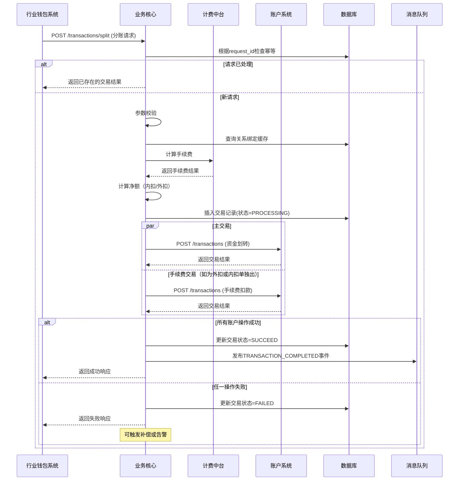
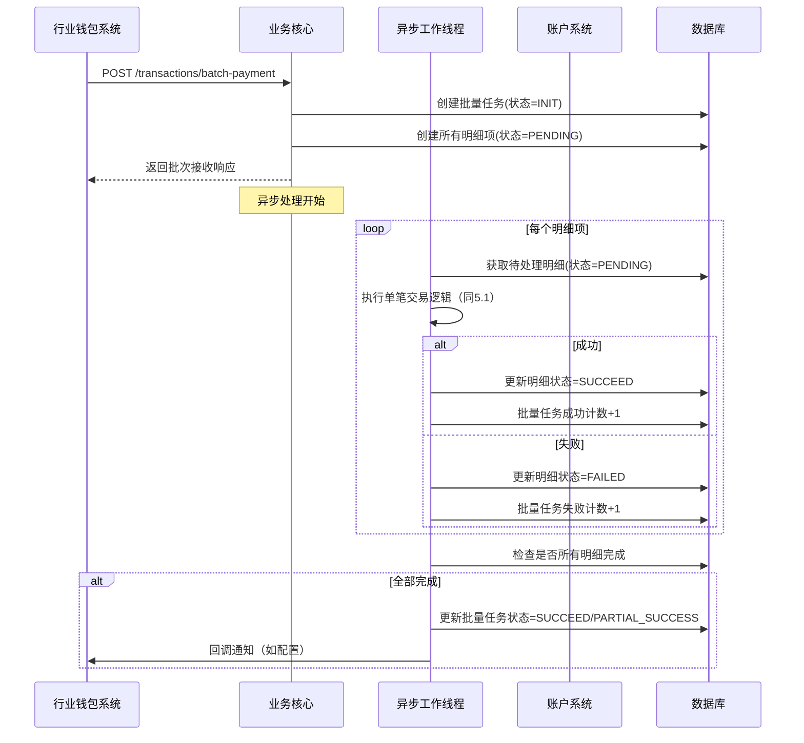

# 模块设计: 业务核心

生成时间: 2026-01-19 17:48:26

---

# 业务核心模块设计文档

## 1. 概述

### 1.1 目的
本模块是"天财分账"业务的核心交易处理引擎，负责接收并处理来自上游系统（如行业钱包系统）的分账、归集、批量付款、会员结算等资金流转指令。它作为业务逻辑的协调者，负责校验业务规则、计算手续费、编排账户操作，并确保交易的最终一致性。

### 1.2 范围
本模块的核心职责包括：
1. **交易指令处理**：接收并验证各类天财分账业务指令（分账、归集、批量付款、会员结算）。
2. **业务规则校验**：验证付方与收方的关系绑定状态、账户状态、权限等业务前置条件。
3. **手续费计算**：调用计费中台计算交易手续费，并支持内扣或外扣模式。
4. **交易编排与执行**：协调账户系统完成资金划转，处理可能的异常情况。
5. **交易状态管理**：维护交易的生命周期状态，提供查询和冲正能力。
6. **异步任务处理**：处理批量付款等异步任务，支持任务拆分、并发执行和进度跟踪。

**边界说明**：
- **不负责**：账户的底层操作（由账户系统负责）、协议签署与认证（由电子签约平台负责）、对账单生成（由对账单系统负责）。
- **通过接口**：接收上游系统的交易请求，调用下游系统完成业务处理。

## 2. 接口设计

### 2.1 API端点 (RESTful)

#### 2.1.1 交易执行接口
- `POST /api/v1/transactions/split` **执行分账/转账**
    - **描述**：处理从天财收款账户到另一个天财账户（收款或接收方）的单笔资金划转。
    - **请求体** (`SplitRequest`)：
      ```json
      {
        "requestId": "split_req_202310271200001", // 请求唯一ID，用于幂等
        "businessType": "TIANCAI_SPLIT", // 业务类型: TIANCAI_SPLIT, COLLECTION, MEMBER_SETTLEMENT
        "payerAccountNo": "TC_RCV_HQ001", // 付方账户号（天财收款账户）
        "payeeAccountNo": "TC_RCV_STORE001", // 收方账户号（天财收款或接收方账户）
        "amount": "1000.00", // 分账金额
        "currency": "CNY",
        "feeDeductionMode": "INNER", // 手续费扣款模式: INNER(内扣), OUTER(外扣)
        "remark": "门店分账",
        "metadata": {
          "relationId": "rel_001", // 关系绑定ID
          "originalOrderNo": "order_001" // 原交易订单号（如有）
        }
      }
      ```
    - **响应体** (`TransactionResponse`)：
      ```json
      {
        "code": "SUCCESS",
        "message": "成功",
        "data": {
          "transactionNo": "TXN202310271200001", // 业务核心交易流水号
          "status": "SUCCEED", // SUCCEED, PROCESSING, FAILED
          "payerAccountNo": "TC_RCV_HQ001",
          "payeeAccountNo": "TC_RCV_STORE001",
          "amount": "1000.00",
          "feeAmount": "2.00", // 手续费金额
          "netAmount": "998.00", // 净额（内扣时）
          "completedAt": "2023-10-27T12:00:05Z",
          "businessRefNo": "split_001" // 传递给账户系统的业务参考号
        }
      }
      ```

- `POST /api/v1/transactions/batch-payment` **发起批量付款**
    - **描述**：处理总部向多个接收方的批量付款请求，异步执行。
    - **请求体** (`BatchPaymentRequest`)：
      ```json
      {
        "requestId": "batch_req_202310271200001",
        "businessType": "BATCH_PAYMENT",
        "payerAccountNo": "TC_RCV_HQ001",
        "batchItems": [
          {
            "payeeAccountNo": "TC_RCV_SUPPLIER001",
            "amount": "5000.00",
            "remark": "供应商货款"
          },
          {
            "payeeAccountNo": "TC_RCV_SHAREHOLDER001",
            "amount": "3000.00",
            "remark": "股东分红"
          }
        ],
        "currency": "CNY",
        "feeDeductionMode": "OUTER",
        "callbackUrl": "https://callback.example.com/notify",
        "metadata": {
          "batchName": "10月供应商结算"
        }
      }
      ```
    - **响应体**：
      ```json
      {
        "code": "SUCCESS",
        "message": "批量任务已接收",
        "data": {
          "batchNo": "BATCH202310271200001", // 批次号
          "status": "PROCESSING",
          "totalCount": 2,
          "successCount": 0,
          "failCount": 0,
          "estimatedCompletionTime": "2023-10-27T12:05:00Z"
        }
      }
      ```

#### 2.1.2 查询接口
- `GET /api/v1/transactions/{transactionNo}` **查询交易详情**
- `GET /api/v1/transactions/batches/{batchNo}` **查询批量任务详情**
- `GET /api/v1/transactions/batches/{batchNo}/items` **查询批量任务明细**（支持分页）

#### 2.1.3 管理接口
- `POST /api/v1/transactions/{transactionNo}/reverse` **交易冲正**
    - **描述**：对已成功的交易进行冲正（仅限于当日且未结算的交易）。
    - **请求体**：
      ```json
      {
        "requestId": "reverse_req_001",
        "reason": "操作失误"
      }
      ```

### 2.2 发布/消费的事件

#### 2.2.1 消费的事件
- **事件类型**：`RELATION_VERIFIED`（来自电子签约平台）
- **事件通道**：`message-bus:relation-events`
- **事件体示例**：
  ```json
  {
    "eventId": "evt_rel_001",
    "type": "RELATION_VERIFIED",
    "occurredAt": "2023-10-27T11:30:00Z",
    "payload": {
      "relationId": "rel_001",
      "payerAccountNo": "TC_RCV_HQ001",
      "payeeAccountNo": "TC_RCV_STORE001",
      "relationType": "COLLECTION", // COLLECTION, BATCH_PAYMENT, MEMBER_SETTLEMENT
      "status": "ACTIVE",
      "verifiedAt": "2023-10-27T11:30:00Z",
      "expiresAt": "2024-10-27T11:30:00Z"
    }
  }
  ```

#### 2.2.2 发布的事件
- **事件类型**：`TRANSACTION_COMPLETED`, `BATCH_TASK_COMPLETED`
- **事件通道**：`message-bus:transaction-events`
- **事件体示例** (`TRANSACTION_COMPLETED`)：
  ```json
  {
    "eventId": "evt_txn_001",
    "type": "TRANSACTION_COMPLETED",
    "occurredAt": "2023-10-27T12:00:05Z",
    "payload": {
      "transactionNo": "TXN202310271200001",
      "businessType": "TIANCAI_SPLIT",
      "payerAccountNo": "TC_RCV_HQ001",
      "payeeAccountNo": "TC_RCV_STORE001",
      "amount": "1000.00",
      "feeAmount": "2.00",
      "status": "SUCCEED",
      "completedAt": "2023-10-27T12:00:05Z",
      "businessRefNo": "split_001"
    }
  }
  ```

## 3. 数据模型

### 3.1 核心表设计

```sql
-- 交易主表
CREATE TABLE `t_transaction` (
  `id` bigint(20) NOT NULL AUTO_INCREMENT,
  `transaction_no` varchar(64) NOT NULL COMMENT '业务核心交易流水号',
  `request_id` varchar(64) NOT NULL COMMENT '请求唯一ID，用于幂等',
  `business_type` varchar(32) NOT NULL COMMENT '业务类型',
  `payer_account_no` varchar(64) NOT NULL COMMENT '付方账户号',
  `payee_account_no` varchar(64) NOT NULL COMMENT '收方账户号',
  `amount` decimal(20,2) NOT NULL COMMENT '交易金额',
  `currency` char(3) NOT NULL DEFAULT 'CNY',
  `fee_amount` decimal(20,2) DEFAULT '0.00' COMMENT '手续费金额',
  `fee_deduction_mode` varchar(16) NOT NULL DEFAULT 'INNER' COMMENT '手续费扣款模式',
  `net_amount` decimal(20,2) DEFAULT NULL COMMENT '净额（内扣时计算）',
  `status` varchar(16) NOT NULL DEFAULT 'INIT' COMMENT 'INIT, PROCESSING, SUCCEED, FAILED, REVERSED',
  `fail_reason` varchar(512) DEFAULT NULL COMMENT '失败原因',
  `relation_id` varchar(64) DEFAULT NULL COMMENT '关系绑定ID',
  `business_ref_no` varchar(64) DEFAULT NULL COMMENT '传递给账户系统的业务参考号',
  `remark` varchar(256) DEFAULT NULL COMMENT '备注',
  `metadata` json DEFAULT NULL COMMENT '扩展信息',
  `completed_at` datetime DEFAULT NULL COMMENT '完成时间',
  `created_at` datetime NOT NULL DEFAULT CURRENT_TIMESTAMP,
  `updated_at` datetime NOT NULL DEFAULT CURRENT_TIMESTAMP ON UPDATE CURRENT_TIMESTAMP,
  PRIMARY KEY (`id`),
  UNIQUE KEY `uk_transaction_no` (`transaction_no`),
  UNIQUE KEY `uk_request_id` (`request_id`),
  KEY `idx_payer_account` (`payer_account_no`, `created_at`),
  KEY `idx_payee_account` (`payee_account_no`, `created_at`),
  KEY `idx_status_created` (`status`, `created_at`),
  KEY `idx_business_ref` (`business_ref_no`)
) ENGINE=InnoDB COMMENT='交易主表';

-- 批量任务表
CREATE TABLE `t_batch_task` (
  `id` bigint(20) NOT NULL AUTO_INCREMENT,
  `batch_no` varchar(64) NOT NULL COMMENT '批次号',
  `request_id` varchar(64) NOT NULL COMMENT '请求唯一ID',
  `business_type` varchar(32) NOT NULL COMMENT '业务类型',
  `payer_account_no` varchar(64) NOT NULL COMMENT '付方账户号',
  `total_count` int(11) NOT NULL COMMENT '总笔数',
  `total_amount` decimal(20,2) NOT NULL COMMENT '总金额',
  `success_count` int(11) NOT NULL DEFAULT '0',
  `fail_count` int(11) NOT NULL DEFAULT '0',
  `status` varchar(16) NOT NULL DEFAULT 'INIT' COMMENT 'INIT, PROCESSING, PARTIAL_SUCCESS, SUCCEED, FAILED',
  `callback_url` varchar(512) DEFAULT NULL COMMENT '回调地址',
  `metadata` json DEFAULT NULL COMMENT '扩展信息',
  `completed_at` datetime DEFAULT NULL,
  `created_at` datetime NOT NULL DEFAULT CURRENT_TIMESTAMP,
  `updated_at` datetime NOT NULL DEFAULT CURRENT_TIMESTAMP ON UPDATE CURRENT_TIMESTAMP,
  PRIMARY KEY (`id`),
  UNIQUE KEY `uk_batch_no` (`batch_no`),
  UNIQUE KEY `uk_request_id` (`request_id`),
  KEY `idx_payer_status` (`payer_account_no`, `status`)
) ENGINE=InnoDB COMMENT='批量任务表';

-- 批量任务明细表
CREATE TABLE `t_batch_task_item` (
  `id` bigint(20) NOT NULL AUTO_INCREMENT,
  `batch_no` varchar(64) NOT NULL COMMENT '批次号',
  `item_no` varchar(64) NOT NULL COMMENT '明细项编号',
  `payee_account_no` varchar(64) NOT NULL COMMENT '收方账户号',
  `amount` decimal(20,2) NOT NULL COMMENT '金额',
  `fee_amount` decimal(20,2) DEFAULT '0.00',
  `status` varchar(16) NOT NULL DEFAULT 'PENDING' COMMENT 'PENDING, PROCESSING, SUCCEED, FAILED',
  `transaction_no` varchar(64) DEFAULT NULL COMMENT '对应的交易流水号',
  `fail_reason` varchar(512) DEFAULT NULL,
  `remark` varchar(256) DEFAULT NULL,
  `processed_at` datetime DEFAULT NULL,
  `created_at` datetime NOT NULL DEFAULT CURRENT_TIMESTAMP,
  `updated_at` datetime NOT NULL DEFAULT CURRENT_TIMESTAMP ON UPDATE CURRENT_TIMESTAMP,
  PRIMARY KEY (`id`),
  UNIQUE KEY `uk_batch_item` (`batch_no`, `item_no`),
  KEY `idx_batch_status` (`batch_no`, `status`),
  KEY `idx_transaction_no` (`transaction_no`)
) ENGINE=InnoDB COMMENT='批量任务明细表';

-- 关系绑定缓存表（从事件同步）
CREATE TABLE `t_relation_cache` (
  `id` bigint(20) NOT NULL AUTO_INCREMENT,
  `relation_id` varchar(64) NOT NULL COMMENT '关系绑定ID',
  `payer_account_no` varchar(64) NOT NULL COMMENT '付方账户号',
  `payee_account_no` varchar(64) NOT NULL COMMENT '收方账户号',
  `relation_type` varchar(32) NOT NULL COMMENT '关系类型',
  `status` varchar(16) NOT NULL COMMENT 'ACTIVE, INACTIVE, EXPIRED',
  `verified_at` datetime NOT NULL COMMENT '认证时间',
  `expires_at` datetime DEFAULT NULL COMMENT '过期时间',
  `metadata` json DEFAULT NULL,
  `created_at` datetime NOT NULL DEFAULT CURRENT_TIMESTAMP,
  `updated_at` datetime NOT NULL DEFAULT CURRENT_TIMESTAMP ON UPDATE CURRENT_TIMESTAMP,
  PRIMARY KEY (`id`),
  UNIQUE KEY `uk_relation` (`relation_id`),
  UNIQUE KEY `uk_accounts_type` (`payer_account_no`, `payee_account_no`, `relation_type`),
  KEY `idx_status_expires` (`status`, `expires_at`)
) ENGINE=InnoDB COMMENT='关系绑定缓存表';
```

### 3.2 与其他模块的关系
- **行业钱包系统**：主要上游调用方，发起各类分账交易请求。
- **账户系统**：下游依赖，调用其账务操作接口完成资金划转。
- **计费中台**：下游依赖，调用其计算交易手续费。
- **电子签约平台**：上游事件源，消费关系绑定验证完成事件。
- **对账单系统**：下游事件订阅方，订阅交易完成事件生成对账单。

## 4. 业务逻辑

### 4.1 核心算法与规则

#### 4.1.1 交易处理流程
1. **请求接收与幂等校验**：通过`request_id`确保同一请求只处理一次。
2. **参数校验**：验证必填字段、金额格式、账户号格式等。
3. **业务前置条件校验**：
   - 付方账户必须为天财收款账户。
   - 收方账户必须为天财收款账户或天财接收方账户。
   - 检查付方与收方的关系绑定状态（从`t_relation_cache`查询）。
   - 对于批量付款和会员结算，需额外检查"开通付款"授权状态。
4. **手续费计算**：调用计费中台，根据业务类型、金额、账户类型计算手续费。
5. **净额计算**：
   - 内扣模式：`net_amount = amount - fee_amount`
   - 外扣模式：`net_amount = amount`，手续费单独从付方账户扣除
6. **账户操作编排**：
   - 调用账户系统执行交易，传递`business_ref_no`（格式：`{transaction_no}_FEE`用于手续费）
   - 对于内扣：付方出账`net_amount`，收方入账`net_amount`，手续费单独出账
   - 对于外扣：付方出账`amount`，收方入账`amount`，手续费单独出账
7. **状态更新与事件发布**：更新交易状态，发布完成事件。

#### 4.1.2 批量付款处理
1. **任务拆分**：将批量请求拆分为多个明细项，每项生成独立的`item_no`。
2. **并发控制**：使用线程池或消息队列异步处理，控制并发度（如每秒10笔）。
3. **进度跟踪**：实时更新`t_batch_task`的成功/失败计数。
4. **结果汇总**：所有明细处理完成后，更新批次状态，触发回调通知。

#### 4.1.3 关系绑定缓存管理
- 监听`RELATION_VERIFIED`事件，更新`t_relation_cache`。
- 定期清理过期或失效的关系记录。
- 提供本地缓存查询，减少对外部系统的依赖。

### 4.2 验证逻辑

#### 4.2.1 交易验证
```java
// 伪代码示例
public ValidationResult validateTransaction(SplitRequest request) {
    // 1. 基础校验
    if (request.amount <= 0) return ValidationResult.error("金额必须大于0");
    
    // 2. 账户校验（可调用账户系统接口）
    Account payerAccount = accountService.getAccount(request.payerAccountNo);
    if (payerAccount == null) return ValidationResult.error("付方账户不存在");
    if (!payerAccount.isTiancaiReceivable()) return ValidationResult.error("付方必须为天财收款账户");
    if (payerAccount.isFrozen()) return ValidationResult.error("付方账户已冻结");
    
    // 3. 关系绑定校验
    RelationCache relation = relationCacheService.getRelation(
        request.payerAccountNo, 
        request.payeeAccountNo, 
        request.businessType
    );
    if (relation == null || !relation.isActive()) {
        return ValidationResult.error("关系绑定未生效或已过期");
    }
    
    // 4. 余额校验（对于外扣模式需包含手续费）
    BigDecimal requiredAmount = request.amount;
    if ("OUTER".equals(request.feeDeductionMode)) {
        FeeResult fee = feeService.calculateFee(request);
        requiredAmount = requiredAmount.add(fee.getFeeAmount());
    }
    if (payerAccount.getAvailableBalance().compareTo(requiredAmount) < 0) {
        return ValidationResult.error("付方账户余额不足");
    }
    
    return ValidationResult.success();
}
```

#### 4.2.2 冲正验证
- 仅允许冲正当日(`created_at >= CURRENT_DATE`)的交易。
- 仅允许冲正状态为`SUCCEED`的交易。
- 检查交易是否已参与结算（可查询清结算系统）。

## 5. 时序图

### 5.1 单笔分账交易时序图



### 5.2 批量付款时序图



## 6. 错误处理

| 错误码 | HTTP状态码 | 描述 | 处理策略 |
| :--- | :--- | :--- | :--- |
| `INVALID_PARAMETER` | 400 | 参数格式错误或缺失 | 调用方检查请求参数 |
| `DUPLICATE_REQUEST` | 409 | 重复请求（幂等冲突） | 返回已存在的交易结果 |
| `RELATION_NOT_FOUND` | 400 | 关系绑定不存在或未生效 | 调用方需先完成关系绑定 |
| `ACCOUNT_VALIDATION_FAILED` | 400 | 账户校验失败（状态异常、类型不符等） | 检查账户状态和类型 |
| `INSUFFICIENT_BALANCE` | 400 | 付方余额不足 | 调用方提示或终止业务 |
| `FEE_CALCULATION_FAILED` | 500 | 手续费计算失败 | 记录告警，人工介入 |
| `ACCOUNT_OPERATION_FAILED` | 500 | 账户操作失败 | 根据错误类型决定重试或标记失败 |
| `BATCH_PROCESSING_ERROR` | 500 | 批量处理异常 | 记录失败明细，继续处理其他项 |
| `REVERSE_NOT_ALLOWED` | 400 | 不允许冲正 | 检查冲正条件（时间、状态、结算状态） |

**通用策略**：
- **重试机制**：对于网络超时、临时性错误，使用指数退避策略重试（最多3次）。
- **补偿交易**：对于"已扣款未加款"场景，记录异常日志，触发人工对账补偿流程。
- **熔断与降级**：对计费中台、账户系统等依赖设置熔断器，失败时降级为使用默认费率或拒绝交易。
- **监控告警**：监控交易失败率、平均处理时间、批量任务积压等指标。

## 7. 依赖说明

### 7.1 上游依赖
1. **行业钱包系统**（强依赖）
   - **交互方式**：同步REST API调用
   - **职责**：发起所有分账业务请求，需保证请求的幂等性（携带`request_id`）
   - **容错**：接口超时设置（如5秒），失败时行业钱包系统负责重试

2. **电子签约平台**（弱依赖）
   - **交互方式**：异步消息消费（`RELATION_VERIFIED`事件）
   - **职责**：提供关系绑定状态信息
   - **容错**：消息可能延迟或丢失，本地缓存需设置TTL，支持手动刷新

### 7.2 下游依赖
1. **账户系统**（强依赖）
   - **交互方式**：同步REST API调用
   - **职责**：执行底层资金划转操作
   - **容错**：必须保证调用幂等性（`business_ref_no`），失败时根据错误类型决定重试策略

2. **计费中台**（强依赖）
   - **交互方式**：同步REST API调用
   - **职责**：计算交易手续费
   - **容错**：失败时可降级使用默认费率（记录告警），或拒绝交易

3. **消息中间件**（弱依赖）
   - **交互方式**：异步消息发布
   - **职责**：发布交易完成事件
   - **容错**：消息发送失败时记录本地日志，后续补发

### 7.3 协作模式
- **同步处理**：单笔交易采用同步处理，实时返回结果。
- **异步处理**：批量付款采用异步处理，先响应接收，后处理并回调。
- **最终一致性**：通过事件驱动保证各系统间状态最终一致。
- **监控对账**：与账户系统、清结算系统定期对账，确保数据一致性。