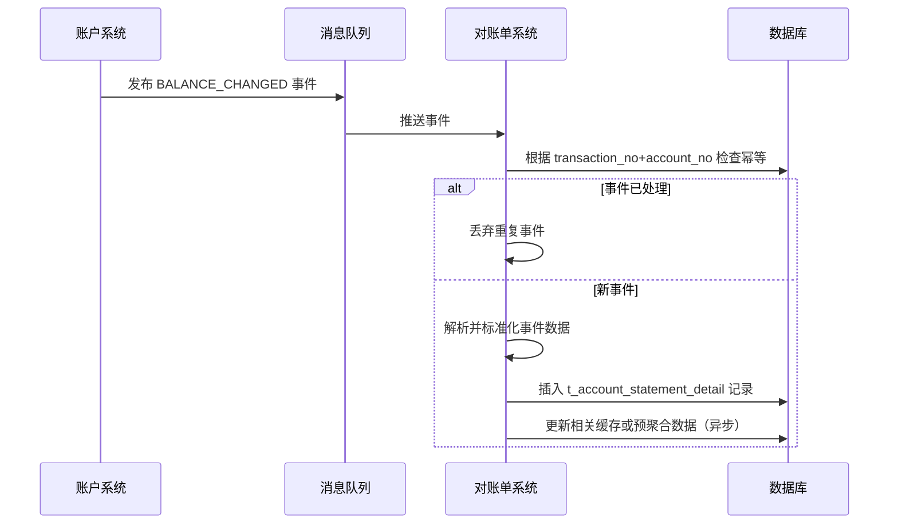
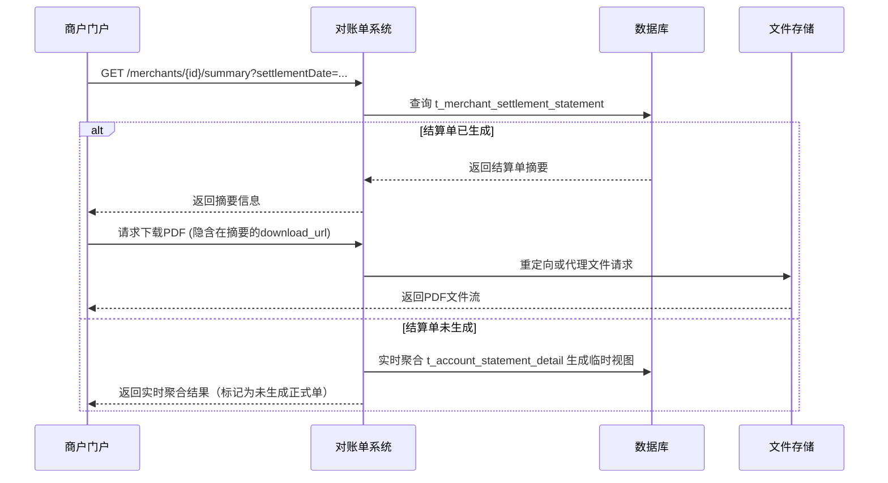
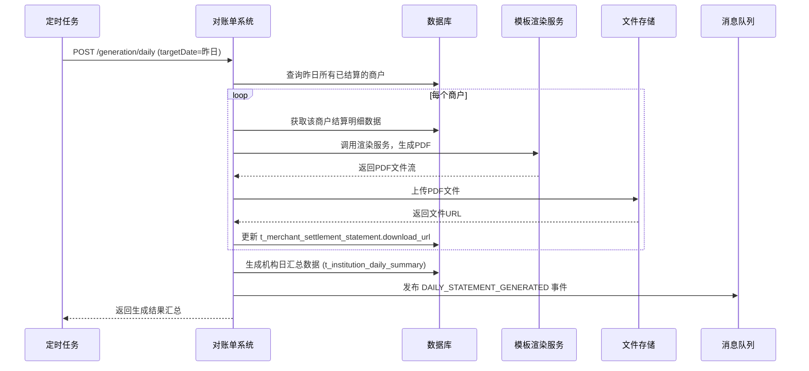

# 模块设计: 对账单系统

生成时间: 2026-01-19 17:50:48

---

# 模块设计: 对账单系统

生成时间: 2026-01-19 18:30:00

---

# 对账单系统模块设计文档

## 1. 概述

### 1.1 目的
本模块是“天财”业务场景下的**统一账单服务提供者**，负责聚合来自各业务系统（账户系统、清结算系统、业务核心）的资金变动与交易数据，为不同层级的用户（商户、门店、总部、运营人员）生成并提供结构清晰、数据准确、格式多样的对账单。其核心价值在于提供透明的资金视图，支撑业务对账、财务核算与审计需求。

### 1.2 范围
本模块的核心职责包括：
1.  **动账明细生成**：实时或准实时地处理账户变动事件，为每个账户生成按时间排序的动账流水明细。
2.  **交易账单生成**：按业务维度（如分账、归集、结算）聚合交易数据，生成带有业务上下文的交易账单。
3.  **机构层级汇总账单生成**：为总部、运营等管理角色，提供跨商户、跨门店的汇总统计账单。
4.  **账单查询与导出**：提供多维度（账户、时间、业务类型）的账单查询接口，并支持PDF、Excel等格式导出。
5.  **账单推送与通知**：支持按周期（日、月）自动生成账单，并通过消息、邮件等方式推送给相关方。

**边界说明**：
- **不负责**：原始交易数据的产生与业务逻辑处理（由上游系统负责）。
- **不负责**：复杂的财务核对与差错处理（属于对账平台范畴，本模块仅提供数据基础）。
- **通过接口/事件**：消费上游系统的各类事件，聚合生成账单数据；为下游（商户门户、运营平台）提供账单查询服务。

## 2. 接口设计

### 2.1 API端点 (RESTful)

#### 2.1.1 账单查询接口（供商户门户/运营平台调用）
- `GET /api/v1/statements/accounts/{accountNo}/transactions` **查询账户动账明细**
    - **描述**：查询指定账户在特定时间范围内的所有资金变动明细。
    - **查询参数**：
      - `startTime` (required): 开始时间，ISO 8601格式。
      - `endTime` (required): 结束时间，ISO 8601格式。
      - `page` (optional, default=1): 页码。
      - `pageSize` (optional, default=50, max=500): 每页大小。
      - `transactionType` (optional): 交易类型过滤，如 `CREDIT`, `DEBIT`。
      - `businessType` (optional): 业务类型过滤，如 `TIANCAI_SPLIT`, `SETTLEMENT`。
    - **响应体** (`PaginatedResponse<AccountTransactionDetail>`)：
      ```json
      {
        "code": "SUCCESS",
        "message": "成功",
        "data": {
          "items": [
            {
              "transactionNo": "T202310271200001",
              "accountNo": "TC_RCV_20231027M100001",
              "relatedAccountNo": "TC_RCV_HQ001",
              "transactionTime": "2023-10-27T12:00:00Z",
              "transactionType": "CREDIT",
              "amount": "1000.00",
              "balanceBefore": "5000.00",
              "balanceAfter": "6000.00",
              "businessType": "COLLECTION",
              "businessRefNo": "TC_COLLECT_20231027_001",
              "postScript": "门店归集资金",
              "feeAmount": "2.00",
              "feeBearer": "PAYER",
              "status": "SUCCEED"
            }
          ],
          "total": 150,
          "page": 1,
          "pageSize": 50
        }
      }
      ```

- `GET /api/v1/statements/merchants/{merchantId}/summary` **查询商户结算汇总单**
    - **描述**：查询指定商户在特定结算周期内的资金结算汇总情况，通常用于T+1对账。
    - **查询参数**：
      - `settlementDate` (required): 结算日期，格式 yyyy-MM-dd。
      - `institutionId` (optional): 机构ID，用于商户属于多机构场景。
    - **响应体** (`MerchantSettlementSummary`)：
      ```json
      {
        "code": "SUCCESS",
        "message": "成功",
        "data": {
          "merchantId": "M100001",
          "institutionId": "TC001",
          "settlementDate": "2023-10-28",
          "settlementAccountNo": "TC_RCV_20231027M100001",
          "totalSettlementAmount": "9990.00",
          "totalFeeAmount": "10.00",
          "totalTradeCount": 100,
          "settlementStatus": "SETTLED",
          "instructionNo": "SETTLE_INST_202310280001",
          "settlementTime": "2023-10-28T02:05:00Z",
          "details": [ // 可选的明细列表，通常需要额外参数展开
            {
              "tradeNo": "pay_20231027001",
              "tradeTime": "2023-10-27T10:00:00Z",
              "amount": "100.00",
              "fee": "0.10"
            }
          ]
        }
      }
      ```

- `GET /api/v1/statements/institutions/{institutionId}/daily-summary` **查询机构日汇总单**
    - **描述**：供总部或运营查看某机构在特定日期的整体资金流水汇总。
    - **查询参数**：
      - `summaryDate` (required): 汇总日期，格式 yyyy-MM-dd。
    - **响应体** (`InstitutionDailySummary`)：
      ```json
      {
        "code": "SUCCESS",
        "message": "成功",
        "data": {
          "institutionId": "TC001",
          "summaryDate": "2023-10-27",
          "totalTransactionCount": 1250,
          "totalTransactionAmount": "1250000.00",
          "totalFeeAmount": "2500.00",
          "breakdownByBusinessType": {
            "COLLECTION": { "count": 200, "amount": "200000.00" },
            "BATCH_PAYMENT": { "count": 50, "amount": "500000.00" },
            "MEMBER_SETTLEMENT": { "count": 1000, "amount": "550000.00" }
          },
          "breakdownByAccountType": {
            "RECEIVABLE": { "count": 1150, "amount": "750000.00" },
            "RECEIVER": { "count": 100, "amount": "500000.00" }
          }
        }
      }
      ```

#### 2.1.2 账单管理接口（供内部/运营调用）
- `POST /api/v1/statements/generation/daily` **触发日账单生成**
    - **描述**：手动触发生成指定日期的各类日终账单（通常由定时任务调用）。
    - **请求体**：
      ```json
      {
        "requestId": "gen_daily_20231028",
        "targetDate": "2023-10-27", // 生成哪一天数据的账单
        "statementTypes": ["ACCOUNT_TRANSACTION", "MERCHANT_SETTLEMENT"] // 可选，不传则生成所有类型
      }
      ```

- `POST /api/v1/statements/export` **导出账单**
    - **描述**：根据复杂查询条件导出账单数据为文件（如Excel），返回文件下载链接。
    - **请求体** (`ExportRequest`)：
      ```json
      {
        "exportType": "ACCOUNT_TRANSACTION",
        "format": "EXCEL", // EXCEL, CSV, PDF
        "filters": {
          "accountNo": "TC_RCV_20231027M100001",
          "startTime": "2023-10-01T00:00:00Z",
          "endTime": "2023-10-31T23:59:59Z",
          "businessType": "COLLECTION"
        },
        "callbackUrl": "https://callback.example.com/notify" // 异步导出完成回调
      }
      ```

### 2.2 发布/消费的事件

本模块是典型的事件驱动型数据消费者。

- **消费事件**：
    - **事件类型**：`BALANCE_CHANGED` (来自账户系统)， `SETTLEMENT_COMPLETED` (来自清结算系统)， `TRANSACTION_COMPLETED` (来自业务核心)。
    - **事件通道**：
        - `message-bus:account-events`
        - `message-bus:settlement-events`
        - `message-bus:transaction-events`
    - **处理逻辑**：监听上述事件，将其标准化后持久化到本模块的账单明细表中，并更新相关汇总数据。

- **发布事件**：
    - **事件类型**：`DAILY_STATEMENT_GENERATED`, `STATEMENT_EXPORT_COMPLETED`
    - **事件通道**：`message-bus:statement-events`
    - **事件体示例** (`DAILY_STATEMENT_GENERATED`)：
      ```json
      {
        "eventId": "evt_stmt_001",
        "type": "DAILY_STATEMENT_GENERATED",
        "occurredAt": "2023-10-28T03:00:00Z",
        "payload": {
          "statementDate": "2023-10-27",
          "statementType": "MERCHANT_SETTLEMENT",
          "institutionId": "TC001",
          "generatedCount": 150, // 生成了多少份商户结算单
          "downloadUrl": "https://storage.example.com/statements/TC001_20231027_settlement.zip"
        }
      }
      ```

## 3. 数据模型

### 3.1 核心表设计

```sql
-- 账户动账明细表（最细粒度）
CREATE TABLE `t_account_statement_detail` (
  `id` bigint(20) NOT NULL AUTO_INCREMENT,
  `account_no` varchar(64) NOT NULL COMMENT '账户号',
  `related_account_no` varchar(64) DEFAULT NULL COMMENT '对手方账户号',
  `transaction_no` varchar(64) NOT NULL COMMENT '账户系统交易流水号',
  `wallet_transaction_no` varchar(64) DEFAULT NULL COMMENT '钱包系统交易流水号',
  `business_ref_no` varchar(64) NOT NULL COMMENT '业务参考号',
  `transaction_time` datetime NOT NULL COMMENT '交易时间',
  `transaction_type` varchar(16) NOT NULL COMMENT 'CREDIT(入账), DEBIT(出账)',
  `amount` decimal(20,2) NOT NULL COMMENT '变动金额（正数）',
  `balance_before` decimal(20,2) NOT NULL,
  `balance_after` decimal(20,2) NOT NULL,
  `currency` char(3) NOT NULL DEFAULT 'CNY',
  `business_type` varchar(32) NOT NULL COMMENT '业务类型',
  `post_script` varchar(256) DEFAULT NULL COMMENT '附言',
  `fee_amount` decimal(20,2) DEFAULT '0.00' COMMENT '本账户承担的手续费',
  `fee_bearer` varchar(16) DEFAULT NULL COMMENT '本账户的手续费承担角色',
  `status` varchar(16) NOT NULL DEFAULT 'SUCCEED' COMMENT '交易状态',
  `institution_id` varchar(32) NOT NULL COMMENT '机构ID',
  `merchant_id` varchar(32) NOT NULL COMMENT '商户ID',
  `source_event_id` varchar(64) DEFAULT NULL COMMENT '来源事件ID，用于溯源',
  `created_at` datetime NOT NULL DEFAULT CURRENT_TIMESTAMP,
  PRIMARY KEY (`id`),
  UNIQUE KEY `uk_transaction_account` (`transaction_no`, `account_no`) COMMENT '同一流水在不同账户的明细',
  KEY `idx_account_time` (`account_no`, `transaction_time`),
  KEY `idx_merchant_time` (`merchant_id`, `transaction_time`),
  KEY `idx_institution_time` (`institution_id`, `transaction_time`),
  KEY `idx_business_ref` (`business_ref_no`),
  KEY `idx_settlement_date` (`transaction_time`) COMMENT '用于按日汇总'
) ENGINE=InnoDB COMMENT='账户动账明细表';

-- 商户结算单表（按结算日聚合）
CREATE TABLE `t_merchant_settlement_statement` (
  `id` bigint(20) NOT NULL AUTO_INCREMENT,
  `statement_no` varchar(64) NOT NULL COMMENT '结算单号',
  `merchant_id` varchar(32) NOT NULL,
  `institution_id` varchar(32) NOT NULL,
  `settlement_date` date NOT NULL COMMENT '结算日期（资金归属日）',
  `settlement_account_no` varchar(64) NOT NULL COMMENT '结算入账账户',
  `total_settlement_amount` decimal(20,2) NOT NULL COMMENT '结算总金额（含费）',
  `total_fee_amount` decimal(20,2) NOT NULL DEFAULT '0.00',
  `net_settlement_amount` decimal(20,2) NOT NULL COMMENT '净结算金额',
  `total_trade_count` int(11) NOT NULL DEFAULT '0',
  `settlement_status` varchar(16) NOT NULL COMMENT 'SETTLED, PARTIAL_SETTLED, FAILED',
  `instruction_no` varchar(64) DEFAULT NULL COMMENT '清结算指令号',
  `settlement_time` datetime DEFAULT NULL COMMENT '结算执行时间',
  `generated_at` datetime NOT NULL DEFAULT CURRENT_TIMESTAMP COMMENT '账单生成时间',
  `download_url` varchar(512) DEFAULT NULL COMMENT '账单文件地址',
  `metadata` json DEFAULT NULL,
  PRIMARY KEY (`id`),
  UNIQUE KEY `uk_merchant_settle_date` (`merchant_id`, `settlement_date`, `institution_id`),
  KEY `idx_institution_date` (`institution_id`, `settlement_date`)
) ENGINE=InnoDB COMMENT='商户结算单表';

-- 机构日汇总表（预聚合，提升查询性能）
CREATE TABLE `t_institution_daily_summary` (
  `id` bigint(20) NOT NULL AUTO_INCREMENT,
  `institution_id` varchar(32) NOT NULL,
  `summary_date` date NOT NULL,
  `summary_type` varchar(32) NOT NULL COMMENT 'OVERVIEW, BY_BUSINESS, BY_ACCOUNT',
  `summary_data` json NOT NULL COMMENT 'JSON格式的汇总数据',
  `generated_at` datetime NOT NULL DEFAULT CURRENT_TIMESTAMP,
  `updated_at` datetime NOT NULL DEFAULT CURRENT_TIMESTAMP ON UPDATE CURRENT_TIMESTAMP,
  PRIMARY KEY (`id`),
  UNIQUE KEY `uk_inst_date_type` (`institution_id`, `summary_date`, `summary_type`)
) ENGINE=InnoDB COMMENT='机构日汇总表（预聚合）';

-- 账单导出任务表
CREATE TABLE `t_statement_export_task` (
  `id` bigint(20) NOT NULL AUTO_INCREMENT,
  `task_no` varchar(64) NOT NULL,
  `request_id` varchar(64) NOT NULL COMMENT '幂等',
  `export_type` varchar(32) NOT NULL,
  `format` varchar(16) NOT NULL,
  `filters` json NOT NULL COMMENT '查询条件',
  `status` varchar(16) NOT NULL DEFAULT 'PENDING' COMMENT 'PENDING, PROCESSING, SUCCEEDED, FAILED',
  `file_url` varchar(512) DEFAULT NULL,
  `file_size` bigint(20) DEFAULT NULL,
  `error_message` text DEFAULT NULL,
  `callback_url` varchar(512) DEFAULT NULL,
  `created_at` datetime NOT NULL DEFAULT CURRENT_TIMESTAMP,
  `completed_at` datetime DEFAULT NULL,
  PRIMARY KEY (`id`),
  UNIQUE KEY `uk_task_no` (`task_no`),
  UNIQUE KEY `uk_request_id` (`request_id`)
) ENGINE=InnoDB COMMENT='账单导出任务表';
```

### 3.2 与其他模块的关系
- **账户系统**：**核心数据源**。消费其`BALANCE_CHANGED`事件，获取最基础的账户资金变动流水。
- **清结算系统**：**核心数据源**。消费其`SETTLEMENT_COMPLETED`事件，获取商户结算的明确结果，用于生成结算单。
- **业务核心**：**重要数据源**。消费其`TRANSACTION_COMPLETED`事件，获取业务上下文（如分账、归集）的完整信息，补充到动账明细中。
- **行业钱包系统**：**间接数据源**。其交易事件已由业务核心或账户系统事件覆盖，本模块可能通过`wallet_transaction_no`进行关联。
- **三代系统/商户门户**：**下游消费者**。通过本模块提供的API查询和下载各类账单。
- **文件存储服务**：**外部依赖**。用于存储生成的账单文件（PDF、Excel）。

## 4. 业务逻辑

### 4.1 核心算法与规则

#### 4.1.1 事件处理与数据标准化
1.  **事件消费**：
    - 监听多个事件源，保证**至少一次消费**（通过记录`source_event_id`实现幂等）。
    - 对事件进行解析、验证和标准化，映射到统一的`t_account_statement_detail`模型。
2.  **数据关联与丰富**：
    - 通过`transaction_no`、`business_ref_no`等字段，将来自不同系统的同一笔业务的多次账户变动（如本金、手续费）关联起来。
    - 从事件中提取并补充`merchant_id`、`institution_id`等信息，便于后续聚合查询。
3.  **结算单生成**：
    - 监听`SETTLEMENT_COMPLETED`事件，直接提取结算金额、手续费、交易笔数等信息，生成或更新`t_merchant_settlement_statement`。
    - 结算单号生成规则：`STMT_SETTLE_{merchantId}_{settlementDate}`。

#### 4.1.2 汇总与预聚合
1.  **机构日汇总**：
    - 通过定时任务（如每日凌晨2点），扫描`t_account_statement_detail`中前一日的数据。
    - 按`institution_id`分组，计算总交易笔数、总金额、总手续费。
    - 按`business_type`和`account_type`进行二级分组，生成维度汇总数据。
    - 将结果写入`t_institution_daily_summary`（`summary_type='OVERVIEW'`等），**空间换时间**，极大提升管理端查询性能。

#### 4.1.3 账单生成与导出
1.  **日终账单生成任务**：
    - 定时触发，为每个商户生成前一日的结算单（如果已结算）。
    - 将结算单渲染为PDF格式，上传至文件存储，并更新`download_url`。
    - 发布`DAILY_STATEMENT_GENERATED`事件，通知下游系统（如消息推送服务）。
2.  **异步导出**：
    - 对于大数据量导出请求，创建异步任务`t_statement_export_task`。
    - 使用后台工作线程执行复杂查询和数据组装，生成Excel/CSV文件。
    - 上传文件后，回调通知调用方。

### 4.2 验证逻辑
- **事件幂等校验**：通过`source_event_id`或组合唯一键（如`transaction_no`+`account_no`）确保同一事件不会重复处理。
- **数据完整性校验**：对于结算单事件，校验必填字段（`instruction_no`, `net_amount`）是否存在。
- **查询参数校验**：校验时间范围合理性（如不能超过90天）、分页参数有效性。

## 5. 时序图

### 5.1 动账明细生成时序图（事件驱动）


### 5.2 商户查询结算单时序图


### 5.3 日终批量生成账单时序图


## 6. 错误处理

| 错误码 | HTTP状态码 | 描述 | 处理策略 |
| :--- | :--- | :--- | :--- |
| `INVALID_TIME_RANGE` | 400 | 查询时间范围无效或过长 | 提示用户调整时间范围，建议分批查询 |
| `STATEMENT_NOT_GENERATED` | 404 | 请求的结算单尚未生成 | 返回实时聚合数据或提示稍后再试 |
| `EXPORT_TASK_NOT_FOUND` | 404 | 导出任务不存在 | 检查任务号是否正确 |
| `EXPORT_TASK_PROCESSING` | 409 | 相同条件的导出任务正在处理 | 返回已有任务信息，避免重复 |
| `EVENT_PROCESSING_ERROR` | 500 | 处理事件时发生异常（如数据格式不符） | 记录死信队列，告警并人工介入分析 |
| `RENDER_SERVICE_UNAVAILABLE` | 503 | 模板渲染服务不可用 | 账单生成降级，仅存储结构化数据，不生成PDF |
| `STORAGE_UPLOAD_FAILED` | 500 | 文件上传到存储失败 | 重试数次，失败则记录错误，账单状态标记为部分失败 |

**通用策略**：
- **事件消费**：保证至少一次交付，通过数据库唯一键实现幂等，异常事件进入死信队列人工处理。
- **查询性能**：对于大数据量查询，强制分页，限制最大查询时间范围。依赖预聚合表提升汇总查询性能。
- **异步任务**：导出、渲染等耗时操作全部异步化，通过任务状态查询和回调通知结果。
- **监控**：监控事件堆积情况、账单生成成功率、查询接口P99耗时。

## 7. 依赖说明

本模块是数据聚合与展示层，强依赖上游数据源，对下游为提供服务。

1. **上游数据源（强依赖）**：
   - **账户系统、清结算系统、业务核心**：通过消息队列消费其事件。这是账单数据的**唯一来源**。必须保证消息中间件的高可用，并处理好消息积压与重复消费问题。
   - **协作模式**：被动监听。上游系统需保证事件格式的稳定性和向后兼容。

2. **下游服务调用方（弱依赖）**：
   - **商户门户、运营管理平台**：通过同步API调用查询账单。需保证API的高可用和高性能，尤其是商户端的查询。
   - **协作模式**：提供清晰的API文档和限流策略。

3. **外部服务依赖**：
   - **消息中间件 (Kafka/RocketMQ)**：**强依赖**。数据摄入通道。需监控消费延迟。
   - **数据库 (MySQL)**：**强依赖**。存储所有账单明细和汇总数据。需根据数据量（按时间或机构）设计分库分表策略。
   - **对象存储 (OSS/S3)**：**弱依赖**。存储生成的PDF/Excel账单文件。故障时可降级为仅提供在线查看。
   - **模板渲染服务/工具**：**弱依赖**。用于生成PDF。可降级。

4. **协作模式总结**：
   - **数据流**：`事件驱动` 为主，`主动查询` 为辅。核心数据通过事件异步同步，缺失数据可通过主动查询上游系统补全（需谨慎，避免循环依赖）。
   - **一致性**：追求`最终一致性`。账单数据相对上游业务数据有短暂延迟（秒级），但对账场景可接受。
   - **可扩展性**：由于按`institution_id`和`时间`分区清晰，系统易于水平扩展，可通过增加消费者实例来提升事件处理能力。