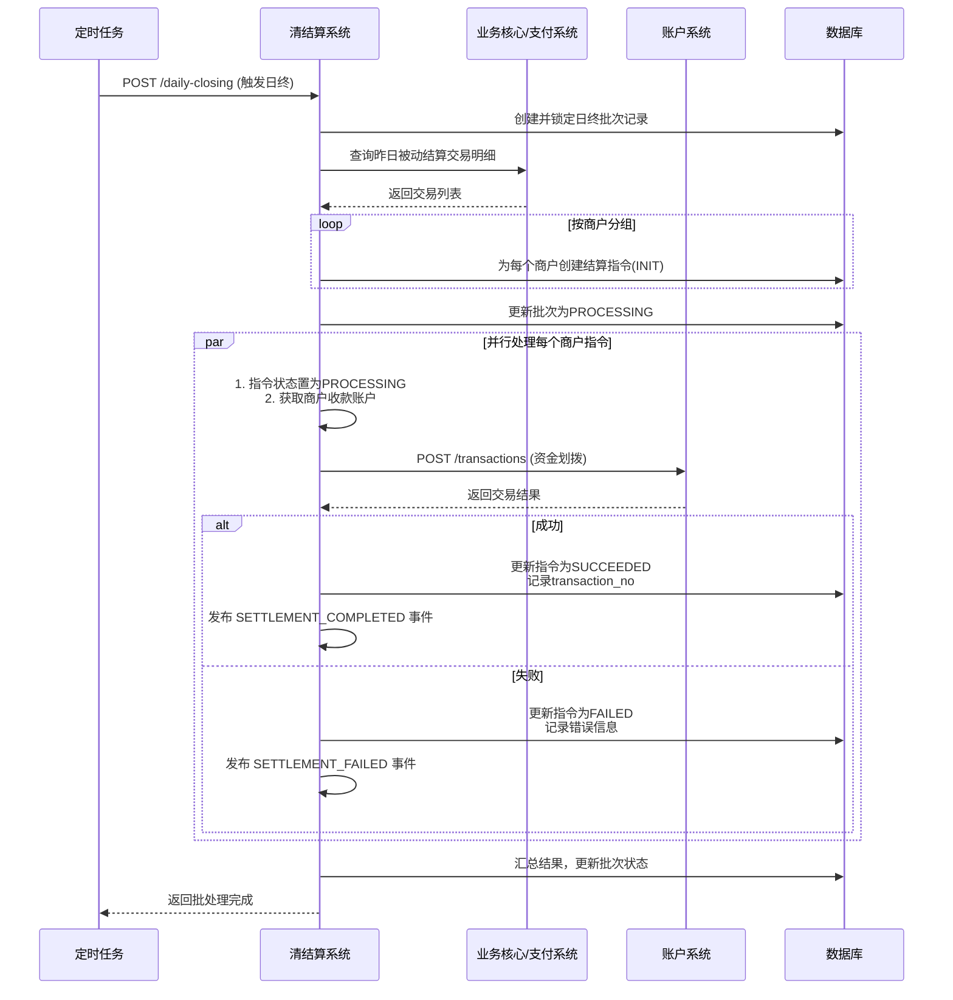
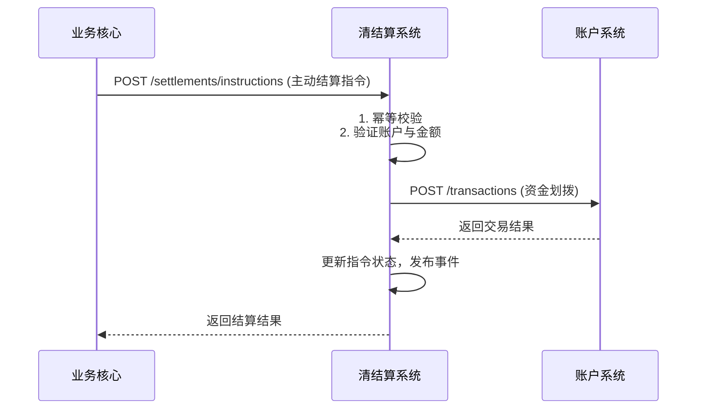

# 模块设计: 清结算系统

生成时间: 2026-01-19 17:48:28

---

# 清结算系统模块设计文档

## 1. 概述

### 1.1 目的
清结算系统是资金流转的核心处理引擎，负责处理收单资金的**清算**（资金计算与核对）与**结算**（资金划拨）全流程。本模块在“天财”业务场景下，核心职责是管理从**待结算账户**到**天财收款账户**的资金结算，以及处理**退货账户**的资金流转，确保商户资金按时、准确、安全地入账。

### 1.2 范围
本模块的核心职责包括：
1.  **结算处理**：根据结算规则（主动/被动），将收单交易资金从**待结算账户**划拨至商户的**天财收款账户**。
2.  **退货资金处理**：管理**退货账户**的资金，处理退款交易的资金扣划与返还。
3.  **结算单生成**：生成并记录每一笔结算操作的明细，作为对账依据。
4.  **日终批处理**：执行定时任务，处理T+1等结算周期的资金批量结算。
5.  **异常处理与对账**：处理结算失败场景，并与支付渠道对账文件进行核对，确保账实相符。

**边界说明**：
- **不负责**：账户开立与升级、分账/归集/批量付款等业务指令处理、手续费计算、协议签署。
- **通过接口**：从**业务核心**或**支付系统**接收待结算交易数据，调用**账户系统**执行资金划拨，与**对账单系统**同步结算结果。

## 2. 接口设计

### 2.1 API端点 (RESTful)

#### 2.1.1 结算指令接口
- `POST /api/v1/settlements/instructions` **创建结算指令**
    - **描述**：接收来自业务核心的结算指令，触发单笔或批量资金的结算。支持主动结算（实时）和被动结算（定时/手动）。
    - **请求体** (`CreateSettlementInstructionRequest`)：
      ```json
      {
        "requestId": "settle_req_20231028001",
        "instructionType": "MERCHANT_SETTLEMENT", // 指令类型: MERCHANT_SETTLEMENT(商户结算), REFUND_SETTLEMENT(退货结算)
        "settlementMode": "ACTIVE", // 结算模式: ACTIVE(主动结算), PASSIVE(被动结算)
        "merchantId": "M100001",
        "institutionId": "TC001",
        "currency": "CNY",
        "totalAmount": "10000.00", // 结算总金额
        "feeAmount": "10.00", // 手续费金额（由计费中台提供）
        "netAmount": "9990.00", // 净结算金额
        "settlementDate": "2023-10-28", // 结算日期（资金归属日）
        "items": [ // 结算明细项（可选，用于对账）
          {
            "tradeNo": "pay_20231027001",
            "amount": "100.00",
            "fee": "0.10"
          }
        ],
        "metadata": {
          "channelBatchNo": "channel_batch_001", // 渠道批次号（如有）
          "triggerSource": "BATCH_JOB" // 触发来源: BATCH_JOB, MANUAL, API
        }
      }
      ```
    - **响应体** (`SettlementInstructionResponse`)：
      ```json
      {
        "code": "SUCCESS",
        "message": "结算指令接收成功",
        "data": {
          "instructionNo": "SETTLE_INST_202310280001", // 结算指令号
          "status": "PROCESSING", // PROCESSING, SUCCEEDED, FAILED
          "estimatedCompleteTime": "2023-10-28T02:00:00Z"
        }
      }
      ```

- `POST /api/v1/settlements/{instructionNo}/retry` **重试结算指令**
    - **描述**：对失败的结算指令进行手动或自动重试。
    - **请求体**：
      ```json
      {
        "requestId": "retry_req_001",
        "reason": "系统重试"
      }
      ```

#### 2.1.2 查询接口
- `GET /api/v1/settlements/instructions/{instructionNo}` **查询结算指令详情**
- `GET /api/v1/settlements/merchants/{merchantId}` **查询商户结算记录** (支持按时间、状态过滤)
- `GET /api/v1/settlements/daily-summary` **查询日终结算汇总** (按机构、日期)

#### 2.1.3 管理接口
- `POST /api/v1/settlements/daily-closing` **触发日终批处理**
    - **描述**：手动触发T+1结算的日终批处理流程（通常由定时任务调用）。
    - **请求体**：
      ```json
      {
        "requestId": "daily_close_20231028",
        "settlementDate": "2023-10-27", // 结算哪一天的交易
        "institutionId": "TC001" // 可选，不传则处理所有机构
      }
      ```

### 2.2 发布/消费的事件

- **消费事件**：
    - **事件类型**：`TRADE_SETTLED` (来自业务核心或支付系统，通知交易已清算完成，可结算)
    - **事件通道**：`message-bus:trade-events`
    - **事件体示例**：
      ```json
      {
        "eventId": "trade_settled_001",
        "type": "TRADE_SETTLED",
        "occurredAt": "2023-10-27T23:00:00Z",
        "payload": {
          "tradeNo": "pay_20231027001",
          "merchantId": "M100001",
          "institutionId": "TC001",
          "amount": "100.00",
          "fee": "0.10",
          "settlementDate": "2023-10-28", // 资金可结算日期
          "channelBatchNo": "channel_batch_001"
        }
      }
      ```

- **发布事件**：
    - **事件类型**：`SETTLEMENT_COMPLETED`, `SETTLEMENT_FAILED`
    - **事件通道**：`message-bus:settlement-events`
    - **事件体示例** (`SETTLEMENT_COMPLETED`)：
      ```json
      {
        "eventId": "settle_comp_001",
        "type": "SETTLEMENT_COMPLETED",
        "occurredAt": "2023-10-28T02:05:00Z",
        "payload": {
          "instructionNo": "SETTLE_INST_202310280001",
          "merchantId": "M100001",
          "institutionId": "TC001",
          "settlementAccountNo": "TC_RCV_20231027M100001", // 商户天财收款账户
          "amount": "9990.00",
          "feeAmount": "10.00",
          "settlementDate": "2023-10-28",
          "transactionNo": "T202310280200001" // 账户系统交易流水号
        }
      }
      ```

## 3. 数据模型

### 3.1 核心表设计

```sql
-- 结算指令主表
CREATE TABLE `t_settlement_instruction` (
  `id` bigint(20) NOT NULL AUTO_INCREMENT,
  `instruction_no` varchar(64) NOT NULL COMMENT '结算指令号',
  `request_id` varchar(64) NOT NULL COMMENT '请求唯一ID，用于幂等',
  `instruction_type` varchar(32) NOT NULL COMMENT 'MERCHANT_SETTLEMENT, REFUND_SETTLEMENT',
  `settlement_mode` varchar(16) NOT NULL COMMENT 'ACTIVE, PASSIVE',
  `merchant_id` varchar(32) NOT NULL,
  `institution_id` varchar(32) NOT NULL,
  `currency` char(3) NOT NULL DEFAULT 'CNY',
  `total_amount` decimal(20,2) NOT NULL COMMENT '结算总金额（含费）',
  `fee_amount` decimal(20,2) NOT NULL DEFAULT '0.00' COMMENT '手续费',
  `net_amount` decimal(20,2) NOT NULL COMMENT '净结算金额',
  `status` varchar(16) NOT NULL DEFAULT 'INIT' COMMENT 'INIT, PROCESSING, SUCCEEDED, FAILED, PARTIAL_FAILED',
  `settlement_date` date NOT NULL COMMENT '结算日期（资金归属日）',
  `settlement_account_no` varchar(64) DEFAULT NULL COMMENT '目标结算账户（天财收款账户）',
  `unsettled_account_no` varchar(64) NOT NULL COMMENT '源账户（01待结算账户）',
  `transaction_no` varchar(64) DEFAULT NULL COMMENT '账户系统交易流水号',
  `error_code` varchar(64) DEFAULT NULL COMMENT '失败错误码',
  `error_message` text DEFAULT NULL COMMENT '失败详情',
  `retry_count` int(11) NOT NULL DEFAULT '0',
  `metadata` json DEFAULT NULL COMMENT '扩展信息',
  `completed_at` datetime DEFAULT NULL,
  `created_at` datetime NOT NULL DEFAULT CURRENT_TIMESTAMP,
  `updated_at` datetime NOT NULL DEFAULT CURRENT_TIMESTAMP ON UPDATE CURRENT_TIMESTAMP,
  PRIMARY KEY (`id`),
  UNIQUE KEY `uk_instruction_no` (`instruction_no`),
  UNIQUE KEY `uk_request_id` (`request_id`),
  KEY `idx_merchant_settle_date` (`merchant_id`, `settlement_date`),
  KEY `idx_status_retry` (`status`, `retry_count`, `created_at`),
  KEY `idx_institution_date` (`institution_id`, `settlement_date`)
) ENGINE=InnoDB COMMENT='结算指令主表';

-- 结算明细表（关联原始交易）
CREATE TABLE `t_settlement_detail` (
  `id` bigint(20) NOT NULL AUTO_INCREMENT,
  `instruction_no` varchar(64) NOT NULL COMMENT '关联结算指令号',
  `trade_no` varchar(64) NOT NULL COMMENT '原始交易流水号',
  `trade_type` varchar(32) NOT NULL COMMENT '支付、退款等',
  `amount` decimal(20,2) NOT NULL COMMENT '交易金额',
  `fee` decimal(20,2) NOT NULL DEFAULT '0.00' COMMENT '该笔交易手续费',
  `settlement_status` varchar(16) NOT NULL DEFAULT 'PENDING' COMMENT 'PENDING, SETTLED, FAILED',
  `channel_batch_no` varchar(64) DEFAULT NULL COMMENT '渠道批次号',
  `metadata` json DEFAULT NULL,
  `created_at` datetime NOT NULL DEFAULT CURRENT_TIMESTAMP,
  PRIMARY KEY (`id`),
  UNIQUE KEY `uk_instruction_trade` (`instruction_no`, `trade_no`),
  KEY `idx_trade_no` (`trade_no`),
  KEY `idx_channel_batch` (`channel_batch_no`)
) ENGINE=InnoDB COMMENT='结算明细表';

-- 日终结算批次表
CREATE TABLE `t_daily_settlement_batch` (
  `id` bigint(20) NOT NULL AUTO_INCREMENT,
  `batch_no` varchar(64) NOT NULL COMMENT '批次号',
  `institution_id` varchar(32) NOT NULL,
  `settlement_date` date NOT NULL,
  `total_instructions` int(11) NOT NULL DEFAULT '0' COMMENT '总指令数',
  `succeeded_instructions` int(11) NOT NULL DEFAULT '0',
  `failed_instructions` int(11) NOT NULL DEFAULT '0',
  `total_amount` decimal(20,2) NOT NULL DEFAULT '0.00',
  `status` varchar(16) NOT NULL DEFAULT 'PROCESSING' COMMENT 'PROCESSING, COMPLETED, PARTIAL_FAILED',
  `started_at` datetime NOT NULL,
  `completed_at` datetime DEFAULT NULL,
  `metadata` json DEFAULT NULL,
  PRIMARY KEY (`id`),
  UNIQUE KEY `uk_batch_no` (`batch_no`),
  UNIQUE KEY `uk_inst_settle_date` (`institution_id`, `settlement_date`) COMMENT '每日每机构一个批次'
) ENGINE=InnoDB COMMENT='日终结算批次表';
```

### 3.2 与其他模块的关系
- **账户系统**：**强依赖**。调用其`POST /api/v1/accounts/transactions`接口，执行从`待结算账户`到`天财收款账户`的资金划拨。
- **业务核心/支付系统**：**数据来源**。通过事件或接口接收已清算完成的交易数据，作为结算依据。
- **计费中台**：**弱依赖**。获取每笔结算对应的手续费明细（可在结算指令中携带，也可异步查询）。
- **对账单系统**：**数据输出**。发布`SETTLEMENT_COMPLETED`事件，供其生成商户结算单。
- **三代系统**：**弱依赖**。查询商户的结算模式（主动/被动）及对应的天财收款账户信息。

## 4. 业务逻辑

### 4.1 核心算法与规则
1.  **结算指令号生成规则**：
    - 格式：`SETTLE_INST_{yyyyMMdd}_{序列号}`
    - 示例：`SETTLE_INST_20231028_0001`
    - 确保全局唯一。

2.  **结算流程决策**：
    - **主动结算**：交易清算完成后，实时或准实时触发结算指令，资金`T+0`入账商户天财收款账户。
    - **被动结算**：
        - 交易资金先挂账在`待结算账户`。
        - 在`结算日`（如T+1日）的日终批处理中，汇总该商户当日所有可结算交易，生成一条结算指令统一结算。
    - 决策依据：商户在**三代系统**中配置的结算模式。

3.  **资金划拨原子操作**：
    - 调用账户系统接口，执行一笔内部转账：
        - **借方**：`01待结算账户` (内部账户)
        - **贷方**：商户的`天财收款账户`
        - **金额**：`net_amount` (净结算金额)
    - 手续费处理：手续费金额已在`total_amount`中扣除，净额结算给商户。手续费资金沉淀在待结算账户，由后续内部清分流程处理。

4.  **日终批处理流程**：
    - **触发**：每日凌晨定时任务（如01:00）。
    - **步骤**：
        1.  锁定`结算日期`为前一日、结算模式为`PASSIVE`的所有已清算交易。
        2.  按`机构`->`商户`维度分组汇总，生成`日终结算批次`。
        3.  为每个商户创建一条`结算指令`。
        4.  异步执行所有结算指令（控制并发度）。
        5.  汇总批次结果，更新批次状态。

5.  **退货结算处理**：
    - 退款交易发生后，资金从`04退货账户`划出。
    - 若退货账户余额不足，需记录异常并告警。
    - 退货结算通常为主动触发。

### 4.2 验证逻辑
- **创建结算指令**：
    - 校验`merchantId`和`institutionId`有效性。
    - 校验`total_amount` = `fee_amount` + `net_amount`。
    - 严格校验`requestId`唯一性，实现**幂等**。
- **执行资金划拨前**：
    - 通过**三代系统**或本地缓存，验证商户的`天财收款账户`是否存在且状态为`ACTIVE`。
    - 确认`待结算账户`余额充足。
- **日终批处理**：
    - 校验`settlement_date`不能为未来日期。
    - 同一机构、同一结算日只能存在一个`PROCESSING`状态的批次，防止重复结算。

## 5. 时序图

### 5.1 被动结算日终批处理时序图


### 5.2 单笔主动结算时序图


## 6. 错误处理

| 错误码 | HTTP状态码 | 描述 | 处理策略 |
| :--- | :--- | :--- | :--- |
| `INSTRUCTION_DUPLICATED` | 409 | 请求ID重复 | 返回已创建的指令信息，实现幂等 |
| `MERCHANT_ACCOUNT_NOT_FOUND` | 400 | 商户天财收款账户不存在或无效 | 中断流程，需检查商户开户状态 |
| `UNSETTLED_ACCOUNT_INSUFFICIENT` | 400 | 待结算账户余额不足 | 紧急告警，检查支付渠道结算是否异常 |
| `ACCOUNT_TRANSACTION_FAILED` | 502 | 调用账户系统交易失败 | 根据错误码决定重试（如余额不足不重试） |
| `BATCH_ALREADY_PROCESSING` | 409 | 当日批次已存在且在处理中 | 返回当前批次信息，避免重复触发 |
| `SETTLEMENT_DATE_INVALID` | 400 | 结算日期不合法（如未来日期） | 调用方检查参数 |
| `EXTERNAL_SERVICE_UNAVAILABLE` | 503 | 依赖系统（如三代）不可用 | 熔断降级，使用缓存数据或中断流程并告警 |

**通用策略**：
- **重试机制**：对于网络超时、暂时性依赖服务失败，采用指数退避策略自动重试（最多3次）。重试时需保证幂等。
- **异步补偿**：日终批处理中部分失败指令，记录日志并告警，次日可由运营人员手动重试或系统自动重试。
- **监控与对账**：
    - 监控`待结算账户`余额，设置阈值告警。
    - 每日与支付渠道对账文件核对，确保`待结算账户`的变动与渠道结算金额一致。
    - 定期核对`待结算账户`总余额与所有商户`未结算金额`汇总是否相等。
- **人工干预**：对于连续失败、金额巨大的结算指令，触发高级别告警，通知运营人员手动处理。

## 7. 依赖说明

本模块是资金流转的关键环节，依赖关系清晰：

1.  **上游数据与指令提供方**：
    - **业务核心/支付系统**：**强依赖**。提供已清算的交易数据，是结算的源头。需保证其`TRADE_SETTLED`事件的可靠投递或接口的稳定性。
    - **三代系统**：**弱依赖**。用于查询商户结算模式、天财收款账户信息。故障时可使用本地缓存，影响新商户或账户变更的场景。

2.  **下游服务调用方**：
    - **账户系统**：**强依赖**。所有资金划拨操作的最终执行者。必须保证其高可用，并妥善处理其返回的各类错误。
    - **计费中台**：**弱依赖**。获取手续费信息。结算指令可预先携带手续费，降低实时依赖。

3.  **下游事件订阅方**：
    - **对账单系统**：**弱依赖**。订阅结算完成事件生成账单。事件发布异步化，不影响主流程。

4.  **外部依赖**：
    - **数据库（MySQL）**：**强依赖**。存储所有结算指令、明细与批次数据。需事务支持和读写分离。
    - **消息中间件**：**弱依赖**。用于事件发布/订阅。故障时需降级为数据库存储，后续补发。
    - **定时任务调度器**：**弱依赖**。触发日终批处理。需有备用手动触发机制。

5.  **协作模式**：
    - 本模块作为**处理器**，接收指令/事件，执行业务逻辑（汇总、验证），调用底层账户服务完成资金操作。
    - 设计上应做到**无状态**，便于水平扩展以应对日终批处理的高并发需求。
    - 与账户系统的交互需严格遵循其幂等性要求，所有指令携带唯一`requestId`。