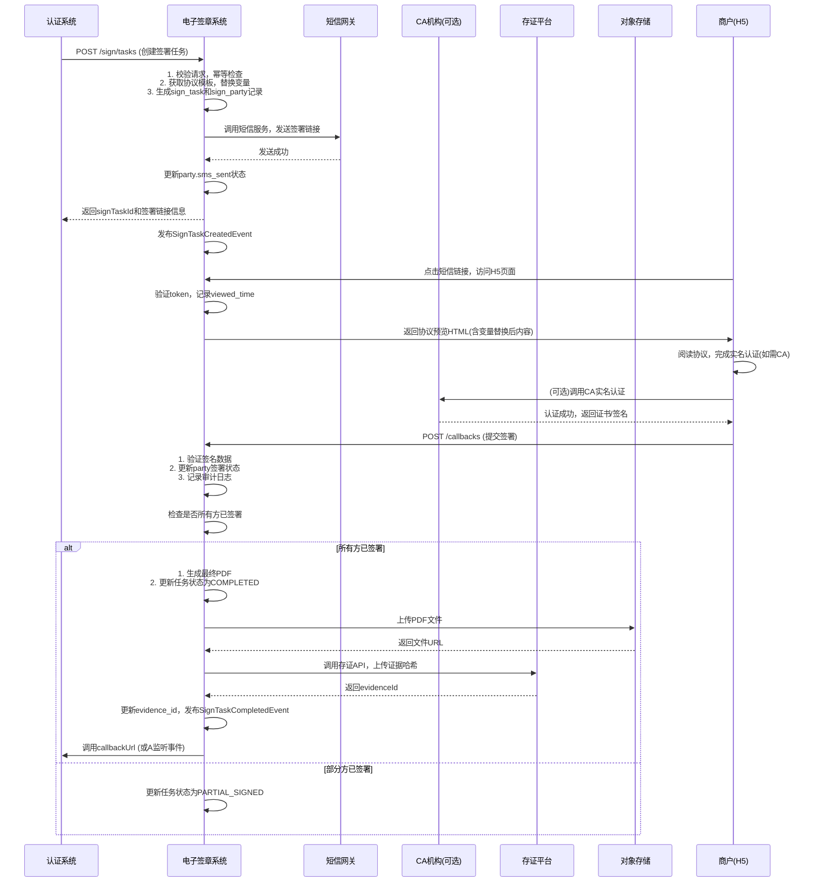

# 模块设计: 电子签章系统

生成时间: 2026-01-19 17:48:50

---

# 电子签章系统模块设计文档

## 1. 概述

### 1.1 目的
电子签章系统模块是“天财分账”业务中协议签署与身份认证流程的核心支撑模块。它负责为认证系统提供安全、合规、可追溯的电子协议签署服务，包括协议模板管理、签署流程编排、H5页面封装、短信触发、认证流程调度及全证据链存证。本模块确保所有资金授权关系（如归集、批量付款、会员结算）的建立都基于合法有效的电子协议，满足监管要求并提供司法保障。

### 1.2 范围
- **协议模板管理**：创建、版本化管理各类资金授权协议模板（如《资金归集授权协议》、《批量付款授权协议》）。
- **签署流程编排**：根据业务场景（归集、批量付款、会员结算）和参与方角色（总部/门店）动态组装协议内容，生成待签署协议。
- **H5签署页面封装**：生成移动端友好的H5签署页面，集成实名认证、协议阅读、手写签名/盖章、意愿确认等环节。
- **短信触发服务**：向签署方发送签署邀请短信，包含签署链接和验证码。
- **认证流程调度**：与认证系统协同，在协议签署前后触发相应的身份认证流程（打款验证/人脸验证）。
- **全证据链存证**：对签署全过程（时间戳、IP、设备指纹、签署行为、协议原文）进行区块链或可信时间戳存证，生成不可篡改的证据包。
- **协议存储与查询**：安全存储已签署的协议文件（PDF），并提供查询、下载、验真服务。
- **与外部CA集成**：集成权威CA机构，为需要数字证书的场景提供证书申请与验签服务。

### 1.3 核心概念
- **签署方**：协议的签署参与方，包括付方（如门店）和收方（如总部）。每个签署方需完成实名认证和签署操作。
- **签署任务**：一次完整的协议签署流程实例，包含协议内容、签署方列表、签署顺序、当前状态等。
- **签署链接**：具有时效性和一次性使用特征的H5页面URL，用于引导签署方完成签署。
- **存证ID**：在第三方存证平台（如公证处、司法区块链）上存储本次签署过程证据后返回的唯一标识，用于后续出证。
- **CA证书**：由认证机构颁发的数字证书，用于实现具有法律效力的可靠电子签名（与普通电子签名区分）。

## 2. 接口设计

### 2.1 REST API 端点

#### 2.1.1 协议模板管理（内部管理接口）

**1. 创建/更新协议模板**
- **端点**: `POST /api/v1/template`
- **描述**: 创建或更新一份协议模板。模板使用变量占位符（如`{{payerName}}`, `{{payeeName}}`, `{{effectiveDate}}`）。
- **请求体**:
```json
{
  "templateId": "string", // 可选，更新时传入
  "templateName": "资金归集授权协议",
  "templateType": "COLLECTION | BATCH_PAY | MEMBER_SETTLEMENT",
  "content": "string", // HTML格式的协议正文，含变量占位符
  "variableDefinitions": [
    {
      "key": "payerName",
      "description": "付方商户名称",
      "required": true
    }
  ],
  "version": "string", // 语义化版本，如1.0.0
  "effectiveDate": "ISO8601", // 模板生效时间
  "expireDate": "ISO8601" // 模板过期时间
}
```
- **响应体**:
```json
{
  "templateId": "string",
  "version": "string",
  "createdAt": "ISO8601"
}
```

**2. 查询协议模板**
- **端点**: `GET /api/v1/template?templateType={type}&version={version}&status=ACTIVE`
- **描述**: 根据类型、版本和状态查询模板列表或详情。
- **响应体**:
```json
{
  "templates": [
    {
      "templateId": "string",
      "templateName": "string",
      "templateType": "string",
      "version": "string",
      "status": "DRAFT | ACTIVE | INACTIVE",
      "effectiveDate": "ISO8601",
      "createdAt": "ISO8601"
    }
  ]
}
```

#### 2.1.2 签署流程服务（供认证系统调用）

**3. 创建签署任务**
- **端点**: `POST /api/v1/sign/tasks`
- **描述**: 认证系统在发起关系绑定时调用，创建一个签署任务实例。
- **请求头**: `X-Request-From: AUTH_SYSTEM`, `Authorization: Bearer <token>`
- **请求体**:
```json
{
  "requestId": "string", // 请求唯一标识，用于幂等
  "authFlowId": "string", // 认证流程ID，用于关联
  "businessScene": "COLLECTION | BATCH_PAY | MEMBER_SETTLEMENT",
  "parties": [
    {
      "partyId": "string", // 参与方ID（商户ID）
      "partyType": "PAYER | PAYEE",
      "partyRole": "HEADQUARTERS | STORE",
      "name": "string", // 商户/企业名称
      "idType": "UNIFIED_SOCIAL_CREDIT | ID_CARD", // 证件类型
      "idNumber": "string", // 证件号
      "mobile": "string", // 接收短信的手机号
      "authType": "CORPORATE | INDIVIDUAL" // 主体类型
    }
  ],
  "templateVariables": {
    "payerName": "XX门店",
    "payeeName": "XX总部",
    "effectiveDate": "2026-01-20",
    "businessSceneDesc": "资金归集"
  },
  "callbackUrl": "string" // 签署结果回调地址
}
```
- **响应体 (201 Created)**:
```json
{
  "signTaskId": "string",
  "parties": [
    {
      "partyId": "string",
      "signUrl": "string", // 签署H5页面短链接，有效期内一次性使用
      "smsTriggered": true // 是否已触发短信
    }
  ],
  "expiresAt": "ISO8601" // 签署链接过期时间（默认24小时）
}
```

**4. 查询签署任务状态**
- **端点**: `GET /api/v1/sign/tasks/{signTaskId}`
- **描述**: 查询签署任务的详细状态。
- **响应体**:
```json
{
  "signTaskId": "string",
  "authFlowId": "string",
  "businessScene": "string",
  "status": "INIT | SIGNING | PARTIAL_SIGNED | COMPLETED | EXPIRED | CANCELLED",
  "parties": [
    {
      "partyId": "string",
      "partyType": "string",
      "signStatus": "PENDING | SIGNED | EXPIRED",
      "signTime": "ISO8601",
      "signIp": "string",
      "signUserAgent": "string"
    }
  ],
  "agreementId": "string", // 签署完成后生成的协议唯一ID
  "agreementUrl": "string", // 已签署协议PDF的下载/预览URL（临时有效）
  "evidenceId": "string", // 存证ID
  "createdAt": "ISO8601",
  "completedAt": "ISO8601"
}
```

**5. 重新发送签署短信**
- **端点**: `POST /api/v1/sign/tasks/{signTaskId}/resend-sms`
- **描述**: 当签署链接过期或用户未收到时，重新发送短信。
- **请求体**:
```json
{
  "partyId": "string" // 指定为哪个参与方重发
}
```
- **响应体**: `{ "success": true }`

**6. 手动触发存证（内部/管理用）**
- **端点**: `POST /api/v1/sign/tasks/{signTaskId}/trigger-evidence`
- **描述**: 对于已签署完成的协议，手动触发或重新触发存证流程。
- **响应体**: `{ "evidenceId": "string" }`

#### 2.1.3 签署回调与前端接口

**7. 签署结果回调（供H5页面/外部CA回调）**
- **端点**: `POST /api/v1/sign/callbacks/{signTaskId}`
- **描述**: 接收H5页面或CA机构异步回调的签署结果。需验证签名防止篡改。
- **请求体**:
```json
{
  "event": "VIEWED | SIGNED | REJECTED | VERIFIED", // VIEWED: 页面打开，VERIFIED: CA实名认证通过
  "partyId": "string",
  "signatureData": {
    "signTime": "ISO8601",
    "signIp": "string",
    "userAgent": "string",
    "deviceFingerprint": "string",
    "signatureImage": "string" // base64编码的手写签名图片（如有）
  },
  "caCertInfo": { // 如果使用CA数字证书
    "certSn": "string",
    "signValue": "string",
    "tsr": "string" // 时间戳Token
  }
}
```
- **响应体**: `{ "acknowledged": true }`

**8. 获取协议预览内容（H5页面调用）**
- **端点**: `GET /api/v1/sign/agreements/preview?signTaskId={id}&partyId={pid}`
- **描述**: H5页面加载时调用，获取渲染后的协议HTML内容（变量已替换）。
- **响应头**: `Content-Type: text/html`
- **响应体**: HTML字符串

**9. 协议下载/验真接口（供业务系统调用）**
- **端点**: `GET /api/v1/sign/agreements/{agreementId}`
- **查询参数**: `?action=download` (返回PDF流) 或 `?action=verify` (返回验真结果)
- **响应体（verify）**:
```json
{
  "valid": true,
  "agreementId": "string",
  "signTime": "ISO8601",
  "parties": [ ... ],
  "evidenceId": "string",
  "evidenceUrl": "string" // 存证报告查看链接
}
```

### 2.2 发布/消费的事件

#### 2.2.1 消费的事件
- `BindingRelationshipInitiatedEvent` (来自认证系统): 当认证系统发起关系绑定时，触发创建签署任务。
    ```json
    {
      "eventId": "string",
      "authFlowId": "string",
      "payerInfo": { ... },
      "payeeInfo": { ... },
      "businessScene": "string",
      "callbackUrl": "string"
    }
    ```

#### 2.2.2 发布的事件
- `SignTaskCreatedEvent`: 当签署任务创建成功并已发送短信时发布。
    ```json
    {
      "eventId": "string",
      "signTaskId": "string",
      "authFlowId": "string",
      "parties": [ { "partyId": "...", "mobile": "..." } ],
      "expiresAt": "ISO8601"
    }
    ```
- `SignTaskCompletedEvent`: 当所有参与方完成签署时发布，通知认证系统。
    ```json
    {
      "eventId": "string",
      "signTaskId": "string",
      "authFlowId": "string",
      "agreementId": "string",
      "agreementUrl": "string",
      "evidenceId": "string",
      "completedAt": "ISO8601"
    }
    ```
- `SignTaskExpiredEvent`: 当签署任务过期（有参与方未签署）时发布。
- `SignTaskCancelledEvent`: 当签署任务被取消时发布。

## 3. 数据模型

### 3.1 核心数据库表设计

#### 表: `sign_template`
存储协议模板。
| 字段名 | 类型 | 必填 | 描述 | 索引 |
| :--- | :--- | :--- | :--- | :--- |
| `id` | BIGINT (PK) | Y | 自增主键 | PK |
| `template_id` | VARCHAR(32) | Y | 模板业务ID | UK |
| `template_name` | VARCHAR(100) | Y | 模板名称 | |
| `template_type` | VARCHAR(30) | Y | 业务场景类型 | IDX |
| `version` | VARCHAR(20) | Y | 语义化版本 | |
| `content_html` | TEXT | Y | 含占位符的HTML内容 | |
| `content_variables` | JSON | Y | 变量定义列表 | |
| `status` | VARCHAR(20) | Y | 状态 (DRAFT, ACTIVE, INACTIVE) | IDX |
| `effective_date` | DATETIME | Y | 生效时间 | |
| `expire_date` | DATETIME | N | 过期时间 | |
| `creator` | VARCHAR(64) | Y | 创建者 | |
| `created_at` | DATETIME | Y | 创建时间 | |
| `updated_at` | DATETIME | Y | 更新时间 | |

#### 表: `sign_task`
存储签署任务实例。
| 字段名 | 类型 | 必填 | 描述 | 索引 |
| :--- | :--- | :--- | :--- | :--- |
| `id` | BIGINT (PK) | Y | 自增主键 | PK |
| `sign_task_id` | VARCHAR(32) | Y | 任务业务ID | UK |
| `auth_flow_id` | VARCHAR(32) | Y | 关联的认证流程ID | IDX |
| `business_scene` | VARCHAR(30) | Y | 业务场景 | IDX |
| `template_id` | VARCHAR(32) | Y | 使用的模板ID | FK |
| `template_version` | VARCHAR(20) | Y | 模板版本 | |
| `final_content_html` | TEXT | Y | 变量替换后的最终HTML内容 | |
| `final_content_pdf` | LONGBLOB | N | 最终签署的PDF文件（二进制） | |
| `agreement_id` | VARCHAR(32) | N | 协议唯一ID | UK |
| `status` | VARCHAR(20) | Y | 任务状态 | IDX |
| `evidence_id` | VARCHAR(64) | N | 存证ID | |
| `evidence_data` | JSON | N | 存证原始响应 | |
| `callback_url` | VARCHAR(512) | N | 认证系统回调地址 | |
| `expires_at` | DATETIME | Y | 签署链接过期时间 | IDX |
| `created_at` | DATETIME | Y | 创建时间 | |
| `updated_at` | DATETIME | Y | 更新时间 | |
| `completed_at` | DATETIME | N | 完成时间 | |

#### 表: `sign_party`
存储签署任务的参与方信息及签署状态。
| 字段名 | 类型 | 必填 | 描述 | 索引 |
| :--- | :--- | :--- | :--- | :--- |
| `id` | BIGINT (PK) | Y | 自增主键 | PK |
| `sign_task_id` | VARCHAR(32) | Y | 关联的任务ID | FK, IDX |
| `party_id` | VARCHAR(32) | Y | 参与方业务ID（商户ID） | IDX |
| `party_type` | VARCHAR(10) | Y | PAYER / PAYEE | |
| `party_role` | VARCHAR(20) | Y | HEADQUARTERS / STORE | |
| `name` | VARCHAR(100) | Y | 名称 | |
| `id_type` | VARCHAR(20) | Y | 证件类型 | |
| `id_number` | VARCHAR(50) | Y | 证件号 | |
| `mobile` | VARCHAR(20) | Y | 手机号 | |
| `auth_type` | VARCHAR(20) | Y | 主体类型 | |
| `sign_status` | VARCHAR(20) | Y | 签署状态 | IDX |
| `sign_token` | VARCHAR(64) | Y | 签署链接token，一次性 | UK |
| `sign_url` | VARCHAR(512) | Y | 完整签署URL | |
| `sms_sent` | BOOLEAN | Y | 短信是否已发送 | |
| `sms_sent_time` | DATETIME | N | 短信发送时间 | |
| `viewed_time` | DATETIME | N | H5页面打开时间 | |
| `signed_time` | DATETIME | N | 签署完成时间 | |
| `sign_ip` | VARCHAR(45) | N | 签署IP地址 | |
| `user_agent` | TEXT | N | 浏览器UA | |
| `device_fingerprint` | VARCHAR(128) | N | 设备指纹 | |
| `signature_image` | TEXT | N | base64手写签名 | |
| `ca_cert_sn` | VARCHAR(64) | N | CA证书序列号 | |
| `created_at` | DATETIME | Y | 创建时间 | |

#### 表: `sign_audit_log`
签署过程审计日志。
| 字段名 | 类型 | 必填 | 描述 | 索引 |
| :--- | :--- | :--- | :--- | :--- |
| `id` | BIGINT (PK) | Y | 自增主键 | PK |
| `log_id` | VARCHAR(32) | Y | 日志ID | UK |
| `sign_task_id` | VARCHAR(32) | Y | 关联任务ID | IDX |
| `party_id` | VARCHAR(32) | N | 参与方ID | IDX |
| `action` | VARCHAR(50) | Y | 操作（CREATE_TASK, SEND_SMS, VIEW, SIGN, etc.） | |
| `action_detail` | JSON | N | 操作详情 | |
| `ip_address` | VARCHAR(45) | N | 操作IP | |
| `user_agent` | TEXT | N | 浏览器UA | |
| `created_at` | DATETIME | Y | 创建时间 | IDX |

### 3.2 与其他模块的关系
- **认证系统**： 核心上游调用方。认证系统发起关系绑定时，调用本模块创建签署任务；本模块在签署完成后通过回调或事件通知认证系统。两者通过`auth_flow_id`强关联。
- **短信网关**： 通过内部服务或API调用，向签署方发送包含签署链接的短信。
- **对象存储服务（如OSS）**： 用于存储已签署的协议PDF文件，生成临时访问URL。
- **第三方存证平台**： 通过API将签署过程的关键证据（哈希值）上传至司法区块链或可信时间戳服务，获取存证ID。
- **CA机构**： 对于需要数字证书的场景，通过API调用完成实名认证、证书申请和签名验签。
- **商户门户/H5前端**： 提供签署页面的前端资源（HTML/JS/CSS），后端通过API提供数据。

## 4. 业务逻辑

### 4.1 核心算法与流程

#### 4.1.1 签署任务状态机
签署任务 (`sign_task.status`) 状态流转：
```
INIT --> SIGNING --> PARTIAL_SIGNED --> COMPLETED
  |          |              |
  |          |              +---> EXPIRED (部分签署后超时)
  |          +---> EXPIRED (超时无人签署)
  +---> CANCELLED (被主动取消)
```
- **INIT**: 任务创建，短信已发送。
- **SIGNING**: 至少一方已查看或开始签署。
- **PARTIAL_SIGNED**: 至少一方完成签署，但未全部完成。
- **COMPLETED**: 所有参与方完成签署，协议生成，存证完成。
- **EXPIRED**: 签署链接过期（默认24小时），任务终止。
- **CANCELLED**: 被上游系统主动取消。

#### 4.1.2 协议内容生成算法
```python
def generate_agreement_content(template_id, template_variables):
    # 1. 根据template_id和当前时间获取ACTIVE状态的模板
    template = get_active_template(template_id)
    
    # 2. 校验必填变量是否齐全
    validate_required_variables(template, template_variables)
    
    # 3. 替换变量占位符
    final_html = template.content_html
    for key, value in template_variables.items():
        placeholder = f"{{{{{key}}}}}"
        final_html = final_html.replace(placeholder, escape_html(value))
    
    # 4. 注入存证水印和签署方信息区块
    final_html = inject_watermark_and_parties(final_html, template_variables)
    
    return final_html
```

#### 4.1.3 存证哈希生成算法
```python
def generate_evidence_hash(sign_task, parties):
    # 1. 收集存证要素
    evidence_data = {
        "agreement_id": sign_task.agreement_id,
        "agreement_content_hash": sha256(sign_task.final_content_html.encode()).hexdigest(),
        "parties": [],
        "timestamps": {
            "created": sign_task.created_at.isoformat(),
            "completed": sign_task.completed_at.isoformat()
        }
    }
    
    # 2. 添加各方签署证据
    for party in parties:
        party_evidence = {
            "party_id": party.party_id,
            "name": party.name,
            "id_number": party.id_number,
            "sign_time": party.signed_time.isoformat(),
            "sign_ip": party.sign_ip,
            "signature_hash": sha256(party.signature_image.encode()).hexdigest() if party.signature_image else None
        }
        evidence_data["parties"].append(party_evidence)
    
    # 3. 生成整体证据哈希
    evidence_json = json.dumps(evidence_data, sort_keys=True)
    final_hash = sha256(evidence_json.encode()).hexdigest()
    
    return final_hash, evidence_data
```

### 4.2 业务规则
1.  **签署顺序规则**：默认并行签署（所有参与方可同时签署），但可根据业务需要配置为顺序签署（如总部先签，门店后签）。
2.  **链接安全规则**：
    - 签署链接 (`sign_token`) 为一次性使用，签署完成后立即失效。
    - 链接默认有效期为24小时，超时后任务状态转为`EXPIRED`。
    - 链接需包含防篡改签名（HMAC），防止伪造。
3.  **短信发送规则**：
    - 任务创建时立即向所有参与方发送短信。
    - 同一参与方24小时内最多接收3条签署提醒短信。
    - 短信内容需包含商户名称、业务场景和短链接。
4.  **协议版本规则**：
    - 签署时锁定模板版本，即使模板后续更新，已签署的协议内容不变。
    - 协议PDF生成后，需在页脚添加“协议ID：`<agreement_id>`”和“存证ID：`<evidence_id>`”水印。
5.  **存证触发规则**：
    - 所有参与方签署完成后，自动触发存证流程。
    - 存证失败不影响协议生效，但会记录告警并进入重试队列（最多重试3次）。

### 4.3 验证逻辑
1.  **创建签署任务时**：
    - 校验`businessScene`与参与方`partyRole`的合法性（如归集场景付方必须是STORE）。
    - 校验手机号格式和实名信息（姓名、证件号）非空。
    - 通过`requestId`保证幂等性，防止重复创建。
2.  **H5页面访问时**：
    - 校验`sign_token`有效性（未使用、未过期、属于当前任务）。
    - 校验访问IP是否在常见风险IP名单（可选）。
3.  **提交签署时**：
    - 校验手写签名图片大小和格式（如base64解码后不超过500KB）。
    - 对于CA数字证书场景，验证证书有效性（未过期、未吊销）和签名值。
4.  **生成协议PDF时**：
    - 校验所有参与方`sign_status`均为`SIGNED`。
    - 校验协议HTML内容完整性，防止XSS注入。

## 5. 时序图

### 5.1 电子签署主流程（认证系统发起）



## 6. 错误处理

| 错误类型 | HTTP 状态码 | 错误码 | 处理策略 |
| :--- | :--- | :--- | :--- |
| 模板未找到或未激活 | 400 | SIGN_4001 | 检查templateType和版本，使用默认最新激活模板或报错。 |
| 必填变量缺失 | 400 | SIGN_4002 | 返回缺失的变量名列表，要求调用方补充。 |
| 签署任务已存在（幂等） | 409 | SIGN_4091 | 返回已存在的signTaskId和状态，不创建新任务。 |
| 签署链接无效或过期 | 403 | SIGN_4031 | 引导用户重新获取短信链接（调用重发接口）。 |
| 短信发送失败 | 500 | SIGN_5001 | 记录告警，任务状态仍为INIT，定时任务重试发送。 |
| 存证平台调用失败 | 502 | SIGN_5021 | 进入异步重试队列，最多重试3次，最终状态为COMPLETED_WITHOUT_EVIDENCE。 |
| PDF生成失败 | 500 | SIGN_5002 | 记录错误详情，告警，人工介入处理。任务状态保持为PARTIAL_SIGNED。 |
| 回调通知失败 | - | - | 采用指数退避重试机制，最多重试5次，记录最终失败日志。 |

**通用策略**：
- **幂等性**：所有创建类接口通过`requestId`保证。签署提交通过`sign_token`一次性使用保证。
- **异步与重试**：短信发送、存证、PDF生成、回调通知等耗时或依赖外部的操作，均采用异步队列+重试机制。
- **数据一致性**：核心状态变更（如`SIGNED` -> `COMPLETED`）在本地数据库事务内完成。外部依赖操作（存证）最终一致性。
- **监控与告警**：对任务过期率、签署成功率、存证失败率、外部依赖可用性设置监控指标和告警阈值。

## 7. 依赖说明

本模块作为业务能力中台，既服务于上游业务系统，也依赖多个外部服务：

1.  **认证系统 (核心上游)**：
    - **交互方式**: 同步REST API调用（创建任务、查询状态） + 异步HTTP回调/事件监听（通知结果）。
    - **职责**: 认证系统是签署流程的发起者和驱动者。电子签章系统需提供高可用、低延迟的API服务，并确保回调的可靠性。
    - **关键点**: 接口契约稳定，错误码清晰，支持幂等。

2.  **短信网关 (内部服务)**：
    - **交互方式**: 同步/异步API调用。
    - **职责**: 发送签署邀请短信。电子签章系统需管理短信模板、频控和发送状态。
    - **关键点**: 短信内容需符合运营商规范，包含退订提示。

3.  **对象存储服务 (基础设施)**：
    - **交互方式**: SDK上传和生成签名URL。
    - **职责**: 永久存储已签署的协议PDF文件，并提供安全的临时访问链接。
    - **关键点**: 文件命名规则（如`agreements/{agreement_id}.pdf`），访问权限控制（私有读，临时URL过期时间）。

4.  **第三方存证平台 (外部服务)**：
    - **交互方式**: REST API调用。
    - **职责**: 提供具有法律效力的全流程存证服务。电子签章系统需按照其要求组装证据链数据并调用接口。
    - **关键点**: 网络隔离（可能需专线），API认证（API Key/Secret），数据格式适配，异步回调处理。

5.  **CA机构 (外部服务，可选)**：
    - **交互方式**: REST API调用（实名认证、证书申请、验签）。
    - **职责**: 为需要可靠电子签名（符合《电子签名法》）的场景提供数字证书服务。
    - **关键点**: 证书生命周期管理（申请、更新、吊销），性能考虑（验签可能较耗时）。

6.  **前端H5页面 (静态资源)**：
    - **交互方式**: 静态资源托管 + 动态API数据获取。
    - **职责**: 提供用户友好的签署界面，集成手写签名、证书签名、意愿确认等功能。
    - **关键点**: 移动端适配，加载性能，安全性（防止XSS，禁用调试）。

**依赖治理**：
- **熔断与降级**：对存证平台、CA机构等非核心路径的外部依赖配置熔断器，失败时可降级为仅本地存证或无CA签署。
- **超时控制**：根据依赖特性设置合理超时（如短信网关3s，存证平台10s，CA认证30s）。
- **监控仪表盘**：展示任务各阶段耗时、外部依赖调用成功率和延迟，便于快速定位瓶颈。