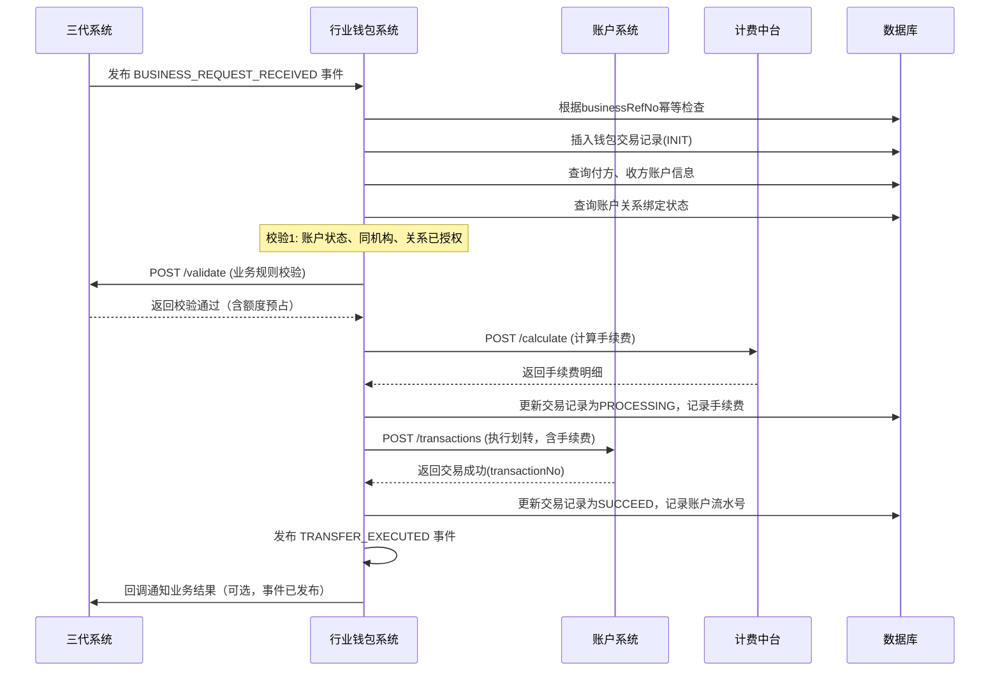
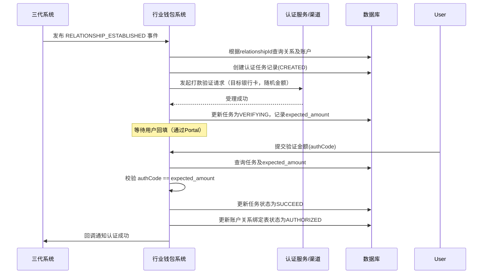

# 模块设计: 行业钱包系统

生成时间: 2026-01-19 17:49:45

---

# 模块设计: 行业钱包系统

生成时间: 2026-01-19 18:00:00

---

# 行业钱包系统模块设计文档

## 1. 概述

### 1.1 目的
本模块是“天财”业务场景下的**资金流转中枢**和**账户关系协调器**。它作为业务逻辑（三代系统）与底层账务（账户系统）之间的桥梁，负责处理天财专用账户的开户、关系绑定认证、以及执行分账、归集、批量付款、会员结算等核心资金流转操作。本模块确保所有资金操作都基于有效的业务授权，并协调电子签约、身份认证等外部流程。

### 1.2 范围
本模块的核心职责包括：
1.  **账户开通与升级**：接收三代系统的开户申请，调用账户系统为商户开立或升级天财专用账户（收款账户、接收方账户）。
2.  **关系绑定与认证**：执行业务关系（总部-门店）建立过程中的身份认证流程（打款验证/人脸验证），并协调电子签约。
3.  **资金流转处理**：接收并处理来自三代系统的分账业务请求，进行账户级校验，调用账户系统执行资金划转。
4.  **账户关系校验**：维护并校验资金流转涉及的账户对（付方账户-收方账户）是否满足业务规则（如同属天财机构）。
5.  **手续费处理**：与计费中台交互，计算并记录资金流转产生的手续费。

**边界说明**：
- **不负责**：业务规则的制定与校验（由三代系统负责）、底层账户的余额管理与账务处理（由账户系统负责）、电子协议模板与存证（由电子签约平台负责）。
- **通过接口**：调用账户系统执行账务操作；调用三代系统进行业务校验；调用电子签约平台和认证服务完成关系绑定。

## 2. 接口设计

### 2.1 API端点 (RESTful)

#### 2.1.1 账户管理接口（供三代系统调用）
- `POST /api/v1/wallet/accounts/open` **开通天财专用账户**
    - **描述**：接收三代系统的开户申请，调用账户系统完成账户开立或升级，并回调解果。
    - **请求体** (`OpenAccountRequest`)：
      ```json
      {
        "requestId": "wallet_req_open_001",
        "applyNo": "APPLY_20231027_001", // 三代系统的申请单号
        "merchantId": "M100001",
        "institutionId": "TC001",
        "accountType": "RECEIVABLE", // RECEIVABLE, RECEIVER
        "operationType": "CREATE", // CREATE, UPGRADE
        "originalAccountNo": null, // 升级时必填
        "callbackUrl": "https://three-gen/callback" // 结果回调地址（回三代）
      }
      ```
    - **响应体** (`OpenAccountResponse`)：
      ```json
      {
        "code": "SUCCESS",
        "message": "受理成功",
        "data": {
          "walletApplyNo": "WALLET_APPLY_001", // 钱包系统内部申请号
          "status": "PROCESSING"
        }
      }
      ```

- `GET /api/v1/wallet/accounts/{accountNo}/relationships` **查询账户关联关系**
    - **描述**：查询指定账户作为付方或收方，已建立的所有有效业务关系（用于对账或管理）。
    - **响应体**：
      ```json
      {
        "code": "SUCCESS",
        "message": "成功",
        "data": {
          "accountNo": "TC_RCV_20231027M100001",
          "asPayerRelationships": [...], // 作为付方的关系列表
          "asPayeeRelationships": [...]  // 作为收方的关系列表
        }
      }
      ```

#### 2.1.2 关系绑定与认证接口（供三代系统/内部流程调用）
- `POST /api/v1/wallet/relationships/initiate-auth` **发起关系绑定认证**
    - **描述**：为已创建的业务关系，发起身份认证流程（打款验证或人脸验证）。
    - **请求体** (`InitiateAuthRequest`)：
      ```json
      {
        "requestId": "req_auth_001",
        "relationshipId": "REL_20231027_001",
        "payerMerchantId": "M100002",
        "payeeMerchantId": "M100001",
        "authMethod": "TRANSFER_VERIFICATION", // TRANSFER_VERIFICATION, FACE_VERIFICATION
        "targetBankAccount": { // 打款验证时必填
          "accountName": "xx公司",
          "accountNo": "6228480012345678901",
          "bankCode": "ABC"
        },
        "callbackUrl": "https://three-gen/callback"
      }
      ```
    - **响应体**：
      ```json
      {
        "code": "SUCCESS",
        "message": "认证流程已发起",
        "data": {
          "authTaskId": "AUTH_TASK_001",
          "nextStep": "WAITING_FOR_VERIFICATION" // 或跳转H5链接（人脸）
        }
      }
      ```

- `POST /api/v1/wallet/relationships/{authTaskId}/verify` **提交验证信息**
    - **描述**：提交打款验证的回填金额或人脸验证结果。
    - **请求体**：
      ```json
      {
        "requestId": "req_verify_001",
        "authCode": "0.23" // 打款验证金额 或 人脸验证的token
      }
      ```

#### 2.1.3 资金流转接口（内部/供业务核心调用）
- `POST /api/v1/wallet/transfers/execute` **执行资金划转**
    - **描述**：**核心接口**。接收业务请求（来自三代事件或业务核心），进行账户级校验，调用账户系统完成资金划转。
    - **请求体** (`ExecuteTransferRequest`)：
      ```json
      {
        "requestId": "wallet_txn_001",
        "businessRefNo": "TC_COLLECT_20231027_001", // 三代业务参考号
        "businessType": "COLLECTION", // COLLECTION, BATCH_PAY, MEMBER_SETTLE, GENERAL_SPLIT
        "payerAccountNo": "TC_RCV_20231027M100002", // 付方账户（天财收款账户）
        "payeeAccountNo": "TC_RCV_20231027M100001", // 收方账户（天财收款/接收方账户）
        "amount": "1000.00",
        "currency": "CNY",
        "postScript": "日常归集",
        "feeBearer": "PAYER", // PAYER, PAYEE, SHARED
        "metadata": {
          "relationshipId": "REL_20231027_001"
        }
      }
      ```
    - **响应体**：
      ```json
      {
        "code": "SUCCESS",
        "message": "划转成功",
        "data": {
          "walletTransactionNo": "WT202310271200001",
          "accountTransactionNo": "T202310271200001", // 账户系统流水号
          "feeAmount": "2.00", // 手续费
          "status": "SUCCEED"
        }
      }
      ```

- `POST /api/v1/wallet/transfers/{walletTransactionNo}/callback` **交易结果回调**
    - **描述**：**内部接口**，供账户系统在异步处理模式（如有）下回调通知最终结果。通常同步调用无需此接口。

#### 2.1.4 查询与对账接口
- `GET /api/v1/wallet/transfers/{walletTransactionNo}` **查询交易详情**
- `POST /api/v1/wallet/reconciliation/tasks` **发起对账任务**（按日期、机构对账）

### 2.2 发布/消费的事件

- **消费事件** (`BusinessEvent`，来自三代系统)：
    - `BUSINESS_REQUEST_RECEIVED`: 监听此事件，触发资金流转处理流程。
    - `RELATIONSHIP_ESTABLISHED`: 监听此事件，触发关系绑定认证流程。

- **发布事件** (`WalletEvent`)：
    - **事件类型**：`ACCOUNT_OPENED`, `RELATIONSHIP_AUTH_COMPLETED`, `TRANSFER_EXECUTED`, `TRANSFER_FAILED`
    - **事件通道**：`message-bus:wallet-events`
    - **事件体示例** (`TRANSFER_EXECUTED`)：
      ```json
      {
        "eventId": "evt_wallet_001",
        "type": "TRANSFER_EXECUTED",
        "occurredAt": "2023-10-27T15:05:00Z",
        "payload": {
          "walletTransactionNo": "WT202310271200001",
          "businessRefNo": "TC_COLLECT_20231027_001",
          "businessType": "COLLECTION",
          "payerAccountNo": "TC_RCV_20231027M100002",
          "payeeAccountNo": "TC_RCV_20231027M100001",
          "amount": "1000.00",
          "feeAmount": "2.00",
          "status": "SUCCEED",
          "accountTransactionNo": "T202310271200001"
        }
      }
      ```

## 3. 数据模型

### 3.1 核心表设计

```sql
-- 钱包账户关系表（核心）
CREATE TABLE `t_wallet_account` (
  `id` bigint(20) NOT NULL AUTO_INCREMENT,
  `account_no` varchar(64) NOT NULL COMMENT '账户号（来自账户系统）',
  `merchant_id` varchar(32) NOT NULL COMMENT '商户ID',
  `institution_id` varchar(32) NOT NULL COMMENT '机构ID',
  `account_type` varchar(32) NOT NULL COMMENT 'RECEIVABLE, RECEIVER',
  `wallet_account_status` varchar(16) NOT NULL DEFAULT 'ACTIVE' COMMENT 'ACTIVE, INACTIVE（钱包层面状态）',
  `is_default_settlement` tinyint(1) DEFAULT '0' COMMENT '是否为默认结算账户（接收方账户专用）',
  `bind_bank_cards` json DEFAULT NULL COMMENT '绑定的银行卡列表（接收方账户专用）',
  `tags` json DEFAULT NULL COMMENT '扩展标签',
  `created_at` datetime NOT NULL DEFAULT CURRENT_TIMESTAMP,
  `updated_at` datetime NOT NULL DEFAULT CURRENT_TIMESTAMP ON UPDATE CURRENT_TIMESTAMP,
  PRIMARY KEY (`id`),
  UNIQUE KEY `uk_account_no` (`account_no`),
  KEY `idx_merchant_inst` (`merchant_id`, `institution_id`),
  KEY `idx_inst_type` (`institution_id`, `account_type`)
) ENGINE=InnoDB COMMENT='钱包账户信息表（同步账户系统，增加业务属性）';

-- 账户关系绑定表（记录允许资金流转的账户对）
CREATE TABLE `t_account_relationship` (
  `id` bigint(20) NOT NULL AUTO_INCREMENT,
  `relationship_id` varchar(64) NOT NULL COMMENT '关联的三代业务关系ID',
  `payer_account_no` varchar(64) NOT NULL COMMENT '付方账户号',
  `payee_account_no` varchar(64) NOT NULL COMMENT '收方账户号',
  `business_type` varchar(32) NOT NULL COMMENT 'COLLECTION, BATCH_PAY, MEMBER_SETTLE',
  `auth_status` varchar(16) NOT NULL DEFAULT 'UNAUTHORIZED' COMMENT 'UNAUTHORIZED, AUTHORIZED, EXPIRED',
  `auth_method` varchar(32) DEFAULT NULL COMMENT 'TRANSFER_VERIFICATION, FACE_VERIFICATION',
  `auth_task_id` varchar(64) DEFAULT NULL COMMENT '认证任务ID',
  `verified_at` datetime DEFAULT NULL COMMENT '认证完成时间',
  `metadata` json DEFAULT NULL COMMENT '存证ID、合同ID等',
  `created_at` datetime NOT NULL DEFAULT CURRENT_TIMESTAMP,
  `updated_at` datetime NOT NULL DEFAULT CURRENT_TIMESTAMP ON UPDATE CURRENT_TIMESTAMP,
  PRIMARY KEY (`id`),
  UNIQUE KEY `uk_payer_payee_biz` (`payer_account_no`, `payee_account_no`, `business_type`) COMMENT '账户对业务类型唯一',
  UNIQUE KEY `uk_relationship_id` (`relationship_id`),
  KEY `idx_payer` (`payer_account_no`),
  KEY `idx_payee` (`payee_account_no`),
  KEY `idx_auth_status` (`auth_status`)
) ENGINE=InnoDB COMMENT='账户关系绑定表（业务关系在账户层的映射）';

-- 钱包交易记录表（业务流水）
CREATE TABLE `t_wallet_transaction` (
  `id` bigint(20) NOT NULL AUTO_INCREMENT,
  `wallet_transaction_no` varchar(64) NOT NULL COMMENT '钱包系统交易流水号',
  `business_ref_no` varchar(64) NOT NULL COMMENT '三代业务参考号',
  `business_type` varchar(32) NOT NULL,
  `payer_account_no` varchar(64) NOT NULL,
  `payee_account_no` varchar(64) NOT NULL,
  `amount` decimal(20,2) NOT NULL,
  `currency` char(3) NOT NULL DEFAULT 'CNY',
  `fee_amount` decimal(20,2) DEFAULT '0.00' COMMENT '手续费',
  `fee_bearer` varchar(16) DEFAULT NULL COMMENT 'PAYER, PAYEE, SHARED',
  `fee_detail` json DEFAULT NULL COMMENT '手续费明细',
  `post_script` varchar(256) DEFAULT NULL,
  `status` varchar(16) NOT NULL DEFAULT 'INIT' COMMENT 'INIT, PROCESSING, SUCCEED, FAILED',
  `account_transaction_no` varchar(64) DEFAULT NULL COMMENT '账户系统交易流水号',
  `relationship_id` varchar(64) DEFAULT NULL,
  `validation_snapshot` json DEFAULT NULL COMMENT '校验结果快照',
  `fail_reason` varchar(256) DEFAULT NULL,
  `created_at` datetime NOT NULL DEFAULT CURRENT_TIMESTAMP,
  `updated_at` datetime NOT NULL DEFAULT CURRENT_TIMESTAMP ON UPDATE CURRENT_TIMESTAMP,
  PRIMARY KEY (`id`),
  UNIQUE KEY `uk_wallet_txn_no` (`wallet_transaction_no`),
  UNIQUE KEY `uk_business_ref_no` (`business_ref_no`) COMMENT '业务幂等',
  KEY `idx_account_time` (`payer_account_no`, `created_at`),
  KEY `idx_status` (`status`)
) ENGINE=InnoDB COMMENT='钱包交易记录表';

-- 认证任务表
CREATE TABLE `t_auth_task` (
  `id` bigint(20) NOT NULL AUTO_INCREMENT,
  `auth_task_id` varchar(64) NOT NULL,
  `relationship_id` varchar(64) NOT NULL,
  `auth_method` varchar(32) NOT NULL,
  `target_info` json NOT NULL COMMENT '认证目标信息（银行卡/个人信息）',
  `auth_code` varchar(64) DEFAULT NULL COMMENT '打款金额或人脸token',
  `expected_amount` decimal(10,2) DEFAULT NULL COMMENT '打款验证的期望金额',
  `status` varchar(16) NOT NULL DEFAULT 'CREATED' COMMENT 'CREATED, VERIFYING, SUCCEED, FAILED, EXPIRED',
  `expire_at` datetime NOT NULL COMMENT '任务过期时间',
  `callback_url` varchar(512) DEFAULT NULL,
  `metadata` json DEFAULT NULL,
  `created_at` datetime NOT NULL DEFAULT CURRENT_TIMESTAMP,
  `updated_at` datetime NOT NULL DEFAULT CURRENT_TIMESTAMP ON UPDATE CURRENT_TIMESTAMP,
  PRIMARY KEY (`id`),
  UNIQUE KEY `uk_auth_task_id` (`auth_task_id`),
  KEY `idx_relationship` (`relationship_id`),
  KEY `idx_status_expire` (`status`, `expire_at`)
) ENGINE=InnoDB COMMENT='身份认证任务表';
```

### 3.2 与其他模块的关系
- **三代系统**：上游权威系统。接收其开户申请和业务请求事件；调用其业务校验接口；回调解果。
- **账户系统**：下游执行系统。调用其开立账户、执行资金划转接口。
- **电子签约平台**：平行系统。调用其发起签约、获取合同。
- **计费中台**：下游服务。调用其计算手续费。
- **认证服务**：外部服务。调用其进行打款验证发起/校验、人脸验证。

## 4. 业务逻辑

### 4.1 核心算法与规则
1.  **钱包交易流水号生成**：
    - 格式：`WT{日期}{机构简码}{序列号}`
    - 示例：`WT20231027TC001`

2.  **资金流转处理状态机**：
    ```
    [INIT] --(收到事件)--> PROCESSING --(调用账户系统成功)--> SUCCEED
                                            |
                                            +--(调用失败)--> FAILED
    ```
    - `SUCCEED`/`FAILED`为终态。

3.  **关系绑定认证流程**：
    - **打款验证**：生成随机金额（如0.01-0.99元）→ 记录`expected_amount` → 调用渠道打款 → 等待用户回填 → 校验金额匹配 → 更新`t_account_relationship.auth_status`为`AUTHORIZED`。
    - **人脸验证**：生成H5链接 → 用户刷脸 → 接收认证服务回调 → 校验通过 → 更新授权状态。

4.  **账户级校验规则（执行转账前）**：
    - 付方账户和收方账户必须存在于`t_wallet_account`且状态为`ACTIVE`。
    - 付方账户的`account_type`必须为`RECEIVABLE`（天财收款账户）。
    - 收方账户的`account_type`可以是`RECEIVABLE`或`RECEIVER`。
    - 付方和收方账户必须属于**同一个**`institution_id`（天财机构）。
    - 对于`COLLECTION`/`BATCH_PAY`/`MEMBER_SETTLE`业务，必须在`t_account_relationship`中存在对应`AUTHORIZED`状态的记录。
    - 调用三代系统`/validate`接口进行最终业务规则校验（额度、有效期等）。

5.  **手续费处理**：
    - 根据`businessType`, `amount`, `feeBearer`调用计费中台计算手续费。
    - 若手续费承担方为`PAYER`，则最终划转金额 = `amount` + `feeAmount`。
    - 记录手续费明细，供后续结算和对账。

### 4.2 验证逻辑
- **开户请求**：校验`applyNo`唯一性；校验`merchantId`和`institutionId`有效性（可调用三代接口）。
- **执行转账请求**：除上述账户级校验外，严格校验`businessRefNo`全局唯一，实现幂等。
- **认证请求**：校验`relationshipId`有效且处于`SIGNING`或待认证状态。

## 5. 时序图

### 5.1 处理归集业务请求时序图


### 5.2 关系绑定认证（打款验证）时序图


## 6. 错误处理

| 错误码 | HTTP状态码 | 描述 | 处理策略 |
| :--- | :--- | :--- | :--- |
| `ACCOUNT_NOT_FOUND` | 400 | 账户不存在于钱包系统 | 检查账户是否已成功开通并同步 |
| `ACCOUNT_STATUS_INVALID` | 400 | 账户钱包状态非ACTIVE | 需先激活账户 |
| `ACCOUNT_RELATIONSHIP_UNAUTHORIZED` | 403 | 账户间无授权关系或未认证 | 需先完成关系绑定认证 |
| `INSTITUTION_MISMATCH` | 400 | 付方收方不属于同一机构 | 检查业务关系配置 |
| `BUSINESS_VALIDATION_FAILED` | 400 | 三代系统业务校验不通过 | 返回具体失败原因（额度不足、关系无效等） |
| `FEE_CALCULATION_FAILED` | 500 | 手续费计算失败 | 告警，人工介入，可配置是否阻断交易 |
| `ACCOUNT_TRANSACTION_FAILED` | 500 | 底层账户交易失败 | 根据错误码决定是否重试（如余额不足不重试） |
| `DUPLICATE_BUSINESS_REF` | 409 | 业务参考号重复 | 返回已存在的钱包交易记录，实现幂等 |
| `AUTH_TASK_EXPIRED` | 400 | 认证任务已过期 | 引导用户重新发起认证 |
| `AUTH_VERIFICATION_FAILED` | 400 | 认证信息不匹配（金额错误） | 提示用户重新输入，可设置重试次数 |

**通用策略**：
- **幂等性**：所有核心接口基于`requestId`或`businessRefNo`保证幂等。
- **异步与重试**：对于账户系统调用失败（网络超时），采用指数退避策略重试。重试多次失败后，状态置为`FAILED`并告警。
- **补偿与对账**：每日与账户系统、三代系统进行对账，发现状态不一致（如钱包成功、账户失败）时触发补偿流程。
- **监控**：监控交易成功率、平均处理时长、各环节失败率。

## 7. 依赖说明

本模块是承上启下的关键枢纽，依赖关系复杂：

1. **上游依赖（强依赖）**：
   - **三代系统**：业务规则的唯一来源。其`/validate`接口的可用性和性能直接影响资金流转。需有熔断和降级策略（如缓存校验结果）。
   - **消息中间件**：消费三代系统事件。故障时需有消息堆积和恢复机制。

2. **下游依赖（强依赖）**：
   - **账户系统**：资金操作的最终执行者。其`/transactions`接口的强一致性和幂等性至关重要。必须实现重试和最终状态同步。
   - **计费中台**：影响交易成本和金额计算。故障时可考虑使用默认费率或阻断交易（根据配置）。

3. **平行依赖（弱依赖）**：
   - **电子签约平台**：关系绑定的前置环节。超时或失败不影响已有授权关系的资金流转。
   - **认证服务**：关系绑定的必要环节。失败会阻塞新关系建立，但不影响存量业务。

4. **外部依赖**：
   - **数据库（MySQL）**：强依赖，存储所有协调状态。需分库分表考虑（按`institution_id`分片）。
   - **缓存（Redis）**：弱依赖，用于缓存账户信息、关系状态，提升校验性能。

5. **协作模式**：
   - 采用 **“事件驱动 + 同步校验 + 异步执行”** 的混合模式。
   - 对于资金流转，坚持 **“先校验，后执行；先预占，后扣款”** 的原则，确保资金安全。
   - 本模块是**事务的协调者**，通过本地事务记录状态，通过重试和回调保证与下游系统的最终一致性。