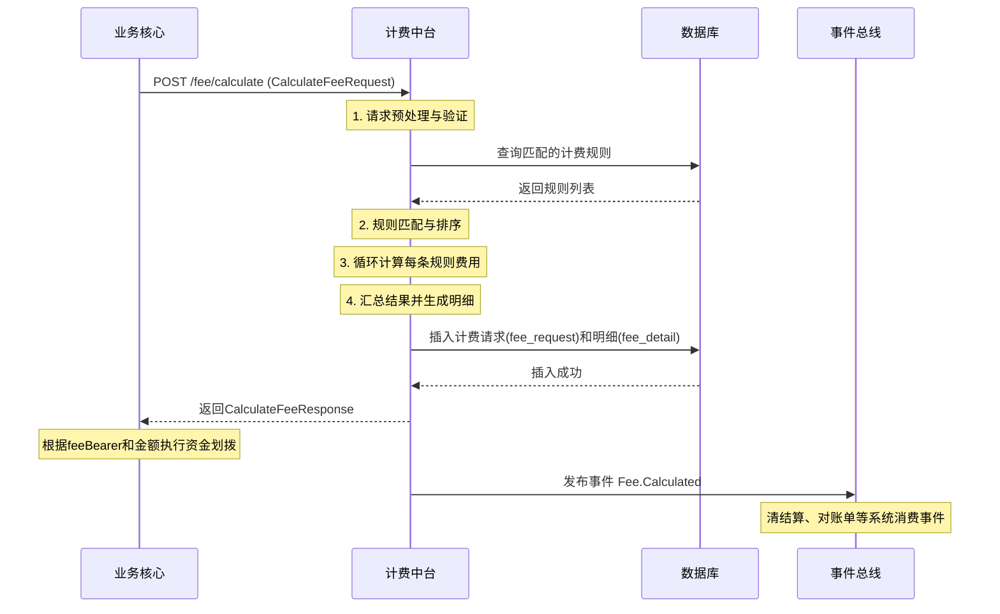

# 模块设计: 计费中台

生成时间: 2026-01-19 17:47:17

---

# 计费中台模块设计文档

## 1. 概述

### 1.1 目的
计费中台模块是“天财分账”业务的核心计费引擎，负责在资金流转（分账、归集、批量付款、会员结算）过程中，根据预设的计费规则，精确计算并确定应由哪一方（付方、收方或双方）承担手续费，以及手续费的金额。其核心目标是实现计费规则的统一管理、计费过程的透明可追溯，并为后续的利润核算和账单生成提供准确的数据基础。

### 1.2 范围
- **计费触发**：接收来自“业务核心”的计费请求，该请求在分账指令处理前或处理中发起。
- **规则管理**：支持配置和维护基于不同维度（如业务场景、商户类型、账户类型、金额区间、渠道）的计费规则。
- **费用计算**：根据请求参数和匹配的计费规则，计算应收手续费。
- **费用记录与分摊**：记录每笔计费结果，明确费用类型、承担方和金额。
- **结果返回**：将计费结果（含手续费金额、承担方信息）返回给“业务核心”，用于后续的资金划拨和账务处理。
- **对账支持**：向“对账单系统”提供计费明细数据。

**边界说明**：
- 本模块不负责实际资金的扣划或加收，仅提供计算依据。
- 不负责计费规则的配置界面，但提供规则管理的后端服务接口。
- 不直接与支付渠道交互获取费率，所有规则由运营人员在后台预先配置。

## 2. 接口设计

### 2.1 API端点 (RESTful)

#### 2.1.1 计算手续费
- **端点**: `POST /api/v1/fee/calculate`
- **描述**: 核心计费接口，根据交易信息计算手续费。
- **请求头**:
    - `X-Request-ID`: 请求唯一标识
    - `Content-Type`: `application/json`
- **请求体 (CalculateFeeRequest)**:
```json
{
  "requestId": "req_1234567890",
  "bizScene": "COLLECTION | BATCH_PAY | MEMBER_SETTLE | TRANSFER",
  "payerId": "企业ID或门店ID",
  "payerAccountNo": "付方天财账户号",
  "payerAccountType": "RECEIVE_ACCT | PAYEE_ACCT",
  "payeeId": "企业ID或门店ID",
  "payeeAccountNo": "收方天财账户号",
  "payeeAccountType": "RECEIVE_ACCT | PAYEE_ACCT",
  "amount": 10000,
  "currency": "CNY",
  "channel": "WECHAT | ALIPAY | UNIONPAY",
  "productCode": "T001",
  "extInfo": {
    "relationId": "绑定的关系ID",
    "originalOrderNo": "原始支付订单号（如适用）"
  }
}
```
- **响应体 (CalculateFeeResponse)**:
```json
{
  "code": "SUCCESS",
  "message": "成功",
  "data": {
    "feeRequestId": "fee_req_9876543210",
    "totalFee": 30,
    "currency": "CNY",
    "feeDetails": [
      {
        "feeType": "SERVICE_FEE | WITHDRAW_FEE",
        "feeBearer": "PAYER | PAYEE | SHARED",
        "calculatedAmount": 30,
        "rate": "0.003",
        "fixedFee": 0,
        "minFee": 0,
        "maxFee": 100,
        "ruleId": "rule_001"
      }
    ],
    "payerFinalAmount": 9970,
    "payeeReceiveAmount": 10000
  }
}
```

#### 2.1.2 查询计费结果
- **端点**: `GET /api/v1/fee/result/{feeRequestId}`
- **描述**: 根据计费请求ID查询详细的计费结果。

#### 2.1.3 计费规则管理接口 (内部/运营使用)
- **端点**: `POST /api/v1/fee/rules` (创建)
- **端点**: `PUT /api/v1/fee/rules/{ruleId}` (更新)
- **端点**: `POST /api/v1/fee/rules/query` (查询)
- **描述**: 用于配置和查询计费规则。

### 2.2 发布/消费的事件

#### 2.2.1 消费的事件
- `Transaction.Created`: 当“业务核心”创建一笔新的分账/转账交易时触发，计费中台监听此事件以启动异步计费流程（可选，作为`/calculate` API的补充）。

#### 2.2.2 发布的事件
- `Fee.Calculated`: 当手续费计算完成时发布。包含`feeRequestId`, `bizScene`, `amount`, `totalFee`, `feeBearer`等信息。可能被“业务核心”（用于确认最终划款金额）、“清结算系统”（用于账务处理）和“对账单系统”（用于账单生成）消费。
- `Fee.Rule.Updated`: 当计费规则发生变更时发布，用于通知其他系统（如缓存刷新）。

## 3. 数据模型

### 3.1 核心数据表设计

#### 3.1.1 计费规则表 (`fee_rule`)
存储所有计费规则。
| 字段名 | 类型 | 描述 | 约束 |
| :--- | :--- | :--- | :--- |
| `id` | BIGINT | 主键 | PK, AUTO_INCREMENT |
| `rule_id` | VARCHAR(32) | 规则唯一标识 | UNIQUE, NOT NULL |
| `rule_name` | VARCHAR(64) | 规则名称 | NOT NULL |
| `biz_scene` | VARCHAR(32) | 业务场景 | NOT NULL |
| `payer_account_type` | VARCHAR(32) | 付方账户类型 | NULL |
| `payee_account_type` | VARCHAR(32) | 收方账户类型 | NULL |
| `channel` | VARCHAR(32) | 支付渠道 | NULL |
| `product_code` | VARCHAR(32) | 产品码 | NULL |
| `fee_type` | VARCHAR(32) | 费用类型 | NOT NULL |
| `calc_mode` | VARCHAR(16) | 计算模式: RATE, FIXED, MIXED | NOT NULL |
| `rate` | DECIMAL(10,6) | 费率（百分比或小数） | NULL |
| `fixed_fee` | DECIMAL(15,2) | 固定费用 | NULL |
| `min_fee` | DECIMAL(15,2) | 最低费用 | NULL |
| `max_fee` | DECIMAL(15,2) | 最高费用 | NULL |
| `fee_bearer` | VARCHAR(16) | 承担方: PAYER, PAYEE, SHARED | NOT NULL |
| `shared_ratio_payer` | DECIMAL(5,4) | 分摊比例（付方） | DEFAULT 1.0 |
| `priority` | INT | 规则优先级 | NOT NULL |
| `status` | TINYINT | 状态: 0-禁用, 1-启用 | DEFAULT 1 |
| `effective_time` | DATETIME | 生效时间 | NOT NULL |
| `expire_time` | DATETIME | 失效时间 | NULL |
| `creator` | VARCHAR(64) | 创建人 | |
| `created_at` | DATETIME | 创建时间 | DEFAULT CURRENT_TIMESTAMP |
| `updated_at` | DATETIME | 更新时间 | DEFAULT CURRENT_TIMESTAMP ON UPDATE |

#### 3.1.2 计费请求记录表 (`fee_request`)
记录每一次计费请求和结果。
| 字段名 | 类型 | 描述 | 约束 |
| :--- | :--- | :--- | :--- |
| `id` | BIGINT | 主键 | PK, AUTO_INCREMENT |
| `fee_request_id` | VARCHAR(32) | 计费请求唯一ID | UNIQUE, NOT NULL |
| `original_request_id` | VARCHAR(32) | 业务方原始请求ID | INDEX |
| `biz_scene` | VARCHAR(32) | 业务场景 | NOT NULL |
| `trans_no` | VARCHAR(64) | 关联的交易流水号 | INDEX |
| `payer_id` | VARCHAR(32) | 付方ID | |
| `payer_account_no` | VARCHAR(64) | 付方账户号 | INDEX |
| `payee_id` | VARCHAR(32) | 收方ID | |
| `payee_account_no` | VARCHAR(64) | 收方账户号 | INDEX |
| `amount` | DECIMAL(15,2) | 交易金额 | NOT NULL |
| `currency` | CHAR(3) | 币种 | DEFAULT 'CNY' |
| `total_fee` | DECIMAL(15,2) | 总手续费 | |
| `fee_bearer_summary` | VARCHAR(16) | 承担方汇总 | |
| `payer_final_amount` | DECIMAL(15,2) | 付方最终扣款金额 | |
| `payee_receive_amount` | DECIMAL(15,2) | 收方实际到账金额 | |
| `calc_status` | VARCHAR(16) | 状态: PROCESSING, SUCCESS, FAILED | NOT NULL |
| `matched_rule_ids` | JSON | 匹配到的规则ID列表 | |
| `error_code` | VARCHAR(32) | 错误码 | |
| `error_msg` | TEXT | 错误信息 | |
| `request_context` | JSON | 完整的请求上下文（快照） | |
| `created_at` | DATETIME | 创建时间 | DEFAULT CURRENT_TIMESTAMP |

#### 3.1.3 计费明细表 (`fee_detail`)
记录每笔手续费的计算明细。
| 字段名 | 类型 | 描述 | 约束 |
| :--- | :--- | :--- | :--- |
| `id` | BIGINT | 主键 | PK, AUTO_INCREMENT |
| `fee_request_id` | VARCHAR(32) | 关联的计费请求ID | INDEX, FK |
| `rule_id` | VARCHAR(32) | 应用的规则ID | INDEX |
| `fee_type` | VARCHAR(32) | 费用类型 | NOT NULL |
| `fee_bearer` | VARCHAR(16) | 承担方 | NOT NULL |
| `calculated_amount` | DECIMAL(15,2) | 计算出的费用金额 | NOT NULL |
| `rate_used` | DECIMAL(10,6) | 使用的费率 | |
| `fixed_fee_used` | DECIMAL(15,2) | 使用的固定费 | |
| `min_max_constrained` | BOOLEAN | 是否受到最低/最高费用限制 | |
| `created_at` | DATETIME | 创建时间 | DEFAULT CURRENT_TIMESTAMP |

### 3.2 与其他模块的关系
- **业务核心**：通过同步API调用或异步事件接收计费请求，是本模块的主要调用方。
- **清结算系统**：消费`Fee.Calculated`事件，根据`feeBearer`和金额进行相应的内部账户簿记（例如，从付方账户扣除手续费，或记入手续费收入账户）。
- **对账单系统**：通过查询接口或消费事件，获取计费明细，并入账务对账单。
- **行业钱包系统/账户系统**：提供账户类型、状态等查询接口（间接依赖，通常通过业务核心传递信息）。

## 4. 业务逻辑

### 4.1 核心算法：规则匹配与费用计算

1. **规则匹配**：
   - 根据`CalculateFeeRequest`中的`bizScene`, `payerAccountType`, `payeeAccountType`, `channel`, `productCode`等字段，从`fee_rule`表中查询所有`status=1`且当前时间在生效期内的规则。
   - 规则匹配遵循**最具体优先**原则：
     a. 所有条件都匹配的规则。
     b. 条件为NULL的视为“通配”。
     c. 按`priority`字段降序排序，数字越大优先级越高。
     d. 选取优先级最高的一条或多条规则（同一笔交易可能触发多种费用类型，如服务费、提现费）。

2. **费用计算**：
   - 对于每条匹配的规则，根据`calc_mode`进行计算：
     - `RATE`: `fee = amount * rate`。注意百分比与小数的转换。
     - `FIXED`: `fee = fixed_fee`。
     - `MIXED`: `fee = max(min_fee, min(max_fee, amount * rate + fixed_fee))`。
   - 应用`min_fee`和`max_fee`限制。
   - 根据`fee_bearer`和`shared_ratio`确定承担方和分摊金额。

3. **结果汇总**：
   - 汇总所有`fee_detail`，得到`total_fee`。
   - 计算各方最终金额：
     - 若`fee_bearer`为`PAYER`: `payer_final_amount = amount + total_fee`, `payee_receive_amount = amount`。
     - 若为`PAYEE`: `payer_final_amount = amount`, `payee_receive_amount = amount - total_fee`。
     - 若为`SHARED`: 按比例分摊。

### 4.2 业务规则
- **默认规则**：必须配置一条全通配（`*`）的默认计费规则，确保任何交易都能匹配到规则。
- **规则冲突**：通过优先级(`priority`)解决，禁止创建完全相同的有效规则。
- **费用承担方逻辑**：
  - `归集`场景：通常由付款方（门店）承担手续费。
  - `批量付款`/`会员结算`场景：通常由付款方（总部）承担手续费。
  - `分账`场景：根据具体业务约定，可配置为任一方或双方分摊。
- **精度处理**：金额计算使用`BigDecimal`，最终结果四舍五入到分（0.01）。

### 4.3 验证逻辑
- **请求验证**：验证必填字段、金额为正数、账户状态（通过业务核心预验证）。
- **规则有效性验证**：确保匹配到的规则在有效期内且启用。
- **计算验证**：计算完成后，验证`payer_final_amount`和`payee_receive_amount`非负。

## 5. 时序图



## 6. 错误处理

| 错误码 | HTTP状态码 | 描述 | 处理策略 |
| :--- | :--- | :--- | :--- |
| `FEE_4001` | 400 | 请求参数无效（如金额非正） | 返回详细错误信息，请求方修正后重试。 |
| `FEE_4002` | 400 | 必填字段缺失 | 同上。 |
| `FEE_5001` | 500 | 未匹配到任何计费规则 | 检查规则配置，确保存在默认规则。记录告警。 |
| `FEE_5002` | 500 | 计费规则配置冲突 | 记录错误日志并告警，人工介入检查规则优先级。返回系统错误。 |
| `FEE_5003` | 500 | 费用计算异常（如除零） | 记录异常上下文，返回系统错误。触发监控告警。 |
| `FEE_5004` | 500 | 数据库操作失败 | 记录错误日志，返回系统错误。依赖数据库重试机制或人工干预。 |

**通用策略**：
- 所有错误均以结构化JSON格式返回，包含`code`, `message`, `requestId`。
- 对于系统错误（5xx），记录完整的请求上下文和堆栈信息，便于排查。
- 设计**熔断机制**：当连续计算失败达到阈值，可短暂返回默认费率或快速失败，保护系统。

## 7. 依赖说明

### 7.1 上游模块交互
1. **业务核心**：
   - **交互方式**：同步REST API (`/fee/calculate`) 为主要模式，保证计费与交易执行的强一致性。异步事件 (`Transaction.Created`) 作为可选补充，用于异步计费场景。
   - **职责**：业务核心负责在发起资金划拨前调用计费中台，并依据返回的`payerFinalAmount`进行扣款。它需要传递准确的业务场景、账户信息和金额。

2. **配置管理后台（隐含）**：
   - **交互方式**：通过内部管理API (`/fee/rules`) 进行规则CRUD操作。
   - **职责**：提供界面供运营人员配置和维护复杂的计费规则。

### 7.2 下游模块交互
1. **清结算系统**：
   - **交互方式**：消费 `Fee.Calculated` 事件。
   - **职责**：根据事件中的手续费承担方和金额，进行内部账户的借贷记账，确保资金损益正确记录。

2. **对账单系统**：
   - **交互方式**：消费 `Fee.Calculated` 事件 或 通过查询API (`/fee/result`) 拉取数据。
   - **职责**：将手续费作为独立条目纳入商户或机构对账单，提供清晰的费用明细。

### 7.3 关键依赖保障
- **规则数据一致性**：计费规则变更需通过发布事件 (`Fee.Rule.Updated`) 通知相关系统，或确保在交易低谷期进行。计费中台本地可缓存热点规则，并设置短时间TTL。
- **数据最终一致性**：计费记录 (`fee_request`, `fee_detail`) 的创建与事件的发布应在一个分布式事务或利用本地事务表+事件日志模式保证最终一致性。
- **性能与可用性**：计费计算应是无状态的，便于水平扩展。对数据库的规则查询应考虑使用多级缓存（如Redis），以应对高频计算请求。