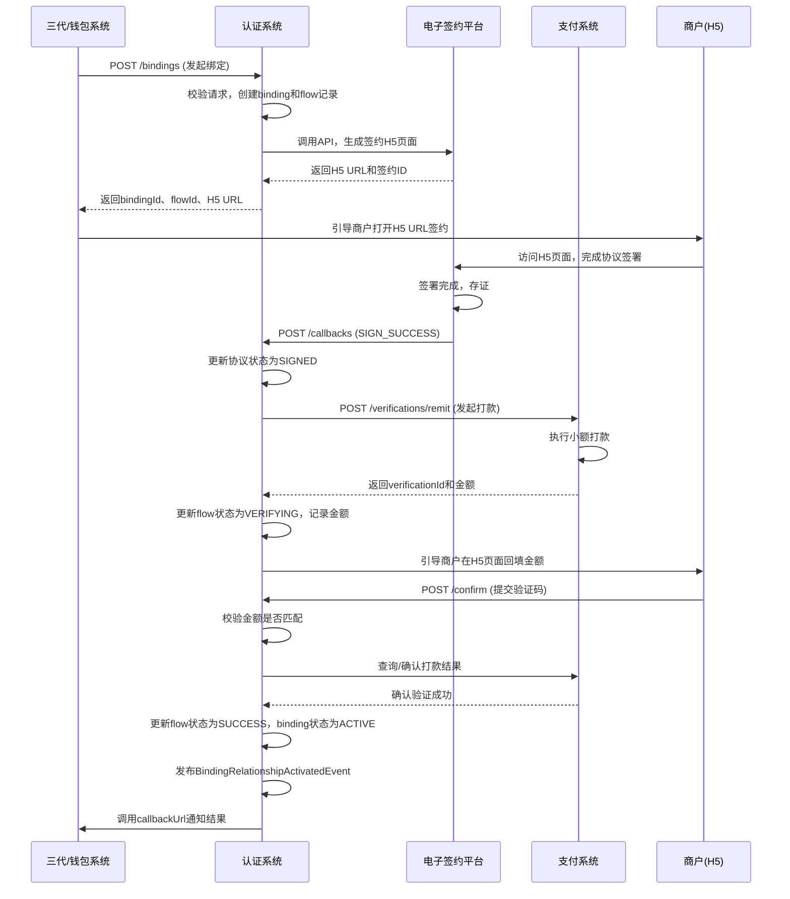

# 模块设计: 认证系统

生成时间: 2026-01-19 17:47:33

---

# 认证系统模块设计文档

## 1. 概述

### 1.1 目的
认证系统模块是支撑“天财分账”业务中所有身份认证与授权关系的核心模块。它负责管理商户（总部、门店）之间进行资金流转（如分账、归集、批量付款、会员结算）前必须完成的身份验证与协议签署流程，确保资金流转的合法性、安全性与可审计性。

### 1.2 范围
- **身份认证**：为“关系绑定”流程提供两种核心认证方式：**打款验证**（用于企业/总部）和**人脸验证**（用于个人/个体户）。
- **协议签署**：通过集成电子签约平台，完成《资金授权协议》的在线签署、存储与管理。
- **关系生命周期管理**：管理“付方-收方”绑定关系的创建、查询、生效、失效全流程。
- **流程调度与状态机**：驱动并管理从认证发起、协议签署到关系生效的完整业务流程状态。
- **与上游系统集成**：作为“三代”系统、行业钱包系统的下游服务，接收认证与绑定请求，并反馈结果。

### 1.3 核心概念
- **关系绑定（签约与认证）**：资金付方（如门店）与收方（如总部）建立授权关系的过程，是执行分账等操作的前提。
- **开通付款**：在批量付款和会员结算场景中，付方（总部）需要额外完成的授权签约流程。
- **认证方式**：
    - **打款验证**：向对公银行账户打入随机小额资金，验证回填金额以确认账户控制权。
    - **人脸验证**：通过姓名、身份证号与人脸生物特征比对，确认个人身份。

## 2. 接口设计

### 2.1 REST API 端点

#### 2.1.1 认证与绑定管理接口

**1. 发起关系绑定请求**
- **端点**: `POST /api/v1/auth/bindings`
- **描述**: 由“三代”或行业钱包系统调用，为指定的付方和收方发起一个关系绑定流程。
- **请求头**: `X-Request-From: [THIRD_GEN | WALLET_SYSTEM]`, `Authorization: Bearer <token>`
- **请求体**:
```json
{
  "requestId": "string", // 请求唯一标识，用于幂等
  "payerId": "string", // 付方商户ID (如门店ID)
  "payerAccountNo": "string", // 付方在天财的专用账户号
  "payerRole": "HEADQUARTERS | STORE", // 付方角色
  "payerAuthType": "CORPORATE | INDIVIDUAL", // 付方主体类型（决定认证方式）
  "payeeId": "string", // 收方商户ID (如总部ID)
  "payeeAccountNo": "string", // 收方在天财的专用账户号
  "payeeRole": "HEADQUARTERS | STORE", // 收方角色
  "businessScene": "COLLECTION | BATCH_PAY | MEMBER_SETTLEMENT", // 业务场景
  "callbackUrl": "string" // 状态变更回调地址
}
```
- **响应体 (201 Created)**:
```json
{
  "bindingId": "string",
  "authFlowId": "string", // 认证流程实例ID
  "nextStep": "ELECTRONIC_SIGN | REMIT_VERIFY | FACE_VERIFY",
  "h5PageUrl": "string" // 可选，电子签约或人脸验证H5页面URL
}
```

**2. 查询绑定关系状态**
- **端点**: `GET /api/v1/auth/bindings/{bindingId}`
- **描述**: 查询指定绑定关系的详细信息与当前状态。
- **响应体**:
```json
{
  "bindingId": "string",
  "payerId": "string",
  "payeeId": "string",
  "businessScene": "string",
  "status": "INIT | SIGNING | VERIFYING | ACTIVE | INACTIVE | FAILED",
  "authMethod": "REMIT | FACE",
  "agreementId": "string",
  "agreementStatus": "PENDING | SIGNED | EXPIRED",
  "authResult": "PENDING | SUCCESS | FAILED",
  "effectiveTime": "ISO8601",
  "expireTime": "ISO8601",
  "createdAt": "ISO8601"
}
```

**3. 触发开通付款**
- **端点**: `POST /api/v1/auth/bindings/{bindingId}/enable-payment`
- **描述**: 在已有绑定关系（如归集）的基础上，为批量付款或会员结算场景触发“开通付款”流程。
- **请求体**: 同发起绑定，但 `businessScene` 需为 `BATCH_PAY` 或 `MEMBER_SETTLEMENT`。
- **响应体**: 同发起绑定。

**4. 认证验证回调（供电子签/支付系统调用）**
- **端点**: `POST /api/v1/auth/callbacks/{authFlowId}`
- **描述**: 接收来自电子签约平台或支付系统（打款验证）的异步回调，更新认证状态。
- **请求体**:
```json
{
  "event": "SIGN_SUCCESS | SIGN_FAILED | REMIT_VERIFIED | REMIT_FAILED | FACE_VERIFIED | FACE_FAILED",
  "signedAgreementUrl": "string", // 事件为SIGN_SUCCESS时提供
  "evidenceId": "string", // 存证ID
  "failReason": "string" // 事件为FAILED时提供
}
```
- **响应体**: `{ "acknowledged": true }`

#### 2.1.2 认证服务接口（内部/对外）

**5. 发起打款验证**
- **端点**: `POST /api/v1/auth/verifications/remit`
- **描述**: 请求支付系统向指定对公账户发起小额打款。
- **请求体**:
```json
{
  "authFlowId": "string",
  "corporateName": "string",
  "bankAccountNo": "string",
  "bankName": "string"
}
```
- **响应体**:
```json
{
  "verificationId": "string",
  "remitAmount": "number" // 单位：分，打款金额（如0.12元）
}
```

**6. 提交打款验证码**
- **端点**: `POST /api/v1/auth/verifications/remit/{verificationId}/confirm`
- **描述**: 商户在H5页面回填打款金额，提交验证。
- **请求体**:
```json
{
  "confirmedAmount": "number" // 用户回填的金额，单位分
}
```
- **响应体**:
```json
{
  "result": "SUCCESS | FAILED"
}
```

### 2.2 发布/消费的事件

#### 2.2.1 消费的事件
- `MerchantAccountUpgradedEvent` (来自账户系统): 监听商户账户升级为“天财专用账户”事件，为新账户预初始化绑定关系模板。
- `PaymentOrderCreatedEvent` (来自业务核心): 在分账交易触发时，消费此事件以校验付方-收方绑定关系是否 `ACTIVE`。

#### 2.2.2 发布的事件
- `BindingRelationshipActivatedEvent`: 当绑定关系状态变为 `ACTIVE` 时发布，通知行业钱包系统、三代系统。
    ```json
    {
      "eventId": "string",
      "bindingId": "string",
      "payerAccountNo": "string",
      "payeeAccountNo": "string",
      "businessScene": "string",
      "effectiveTime": "ISO8601"
    }
    ```
- `BindingRelationshipInactivatedEvent`: 当绑定关系失效或解除时发布。
- `AuthenticationFailedEvent`: 当认证流程失败时发布，用于上游系统记录日志或触发告警。

## 3. 数据模型

### 3.1 核心数据库表设计

#### 表: `auth_binding_relationship`
存储绑定关系的核心信息与生命周期状态。
| 字段名 | 类型 | 必填 | 描述 | 索引 |
| :--- | :--- | :--- | :--- | :--- |
| `id` | BIGINT (PK) | Y | 自增主键 | PK |
| `binding_id` | VARCHAR(32) | Y | 业务唯一标识，全局唯一 | UK |
| `payer_merchant_id` | VARCHAR(32) | Y | 付方商户ID | IDX |
| `payer_account_no` | VARCHAR(32) | Y | 付方天财账户号 | IDX |
| `payer_role` | VARCHAR(20) | Y | 付方角色 (HEADQUARTERS, STORE) | |
| `payer_auth_type` | VARCHAR(20) | Y | 付方认证类型 (CORPORATE, INDIVIDUAL) | |
| `payee_merchant_id` | VARCHAR(32) | Y | 收方商户ID | IDX |
| `payee_account_no` | VARCHAR(32) | Y | 收方天财账户号 | IDX |
| `payee_role` | VARCHAR(20) | Y | 收方角色 | |
| `business_scene` | VARCHAR(30) | Y | 业务场景 | IDX |
| `status` | VARCHAR(20) | Y | 状态 | IDX |
| `auth_method` | VARCHAR(10) | Y | 认证方式 (REMIT, FACE) | |
| `agreement_id` | VARCHAR(64) | N | 电子协议ID | |
| `agreement_status` | VARCHAR(20) | N | 协议状态 | |
| `agreement_url` | TEXT | N | 签署后的协议存储URL | |
| `effective_time` | DATETIME | N | 关系生效时间 | |
| `expire_time` | DATETIME | N | 关系过期时间 | |
| `callback_url` | VARCHAR(512) | N | 上游回调地址 | |
| `created_at` | DATETIME | Y | 创建时间 | |
| `updated_at` | DATETIME | Y | 更新时间 | |

#### 表: `auth_flow`
存储每一次认证流程的详细步骤与状态。
| 字段名 | 类型 | 必填 | 描述 | 索引 |
| :--- | :--- | :--- | :--- | :--- |
| `id` | BIGINT (PK) | Y | 自增主键 | PK |
| `auth_flow_id` | VARCHAR(32) | Y | 流程实例ID，全局唯一 | UK |
| `binding_id` | VARCHAR(32) | Y | 关联的绑定关系ID | FK |
| `current_step` | VARCHAR(30) | Y | 当前步骤 | |
| `status` | VARCHAR(20) | Y | 流程状态 (PROCESSING, SUCCESS, FAILED) | |
| `auth_type` | VARCHAR(20) | Y | 本次流程认证类型 | |
| `verification_id` | VARCHAR(32) | N | 打款验证ID | |
| `remit_amount` | DECIMAL(10,2) | N | 打款金额 | |
| `face_verify_token` | VARCHAR(128) | N | 人脸验证令牌 | |
| `fail_reason` | TEXT | N | 失败原因 | |
| `metadata` | JSON | N | 扩展信息，如H5页面参数 | |
| `created_at` | DATETIME | Y | 创建时间 | |
| `updated_at` | DATETIME | Y | 更新时间 | |

#### 表: `auth_audit_log`
存储所有关键操作日志，用于审计。
| 字段名 | 类型 | 必填 | 描述 | 索引 |
| :--- | :--- | :--- | :--- | :--- |
| `id` | BIGINT (PK) | Y | 自增主键 | PK |
| `log_id` | VARCHAR(32) | Y | 日志ID | UK |
| `binding_id` | VARCHAR(32) | Y | 关联绑定ID | IDX |
| `auth_flow_id` | VARCHAR(32) | N | 关联流程ID | IDX |
| `operator` | VARCHAR(64) | N | 操作者（系统或用户ID） | |
| `action` | VARCHAR(50) | Y | 操作动作 | |
| `from_status` | VARCHAR(20) | N | 操作前状态 | |
| `to_status` | VARCHAR(20) | N | 操作后状态 | |
| `details` | JSON | N | 操作详情 | |
| `ip_address` | VARCHAR(45) | N | 操作IP | |
| `created_at` | DATETIME | Y | 创建时间 | IDX |

### 3.2 与其他模块的关系
- **三代系统**： 通过API调用认证系统发起`关系绑定`和`开通付款`。认证系统通过回调或事件通知三代系统最终结果。
- **行业钱包系统**： 在发起分账前，调用认证系统接口校验绑定关系状态。同时是`BindingRelationshipActivatedEvent`的消费者。
- **电子签约平台**： 认证系统通过API调用其生成并封装签约H5页面，并接收其异步回调。
- **账户系统**： 消费其发布的账户升级事件，作为绑定关系创建的潜在触发器。
- **支付系统/清结算系统**： 调用其服务完成`打款验证`的小额支付与结果确认。
- **业务核心**： 在分账交易执行前，消费其事件或提供接口供其校验关系合法性。

## 4. 业务逻辑

### 4.1 核心算法与流程

#### 4.1.1 关系绑定状态机
绑定关系 (`auth_binding_relationship.status`) 遵循以下状态流转：
```
INIT --> SIGNING --> VERIFYING --> ACTIVE
  |          |           |           |
  |          |           +---> FAILED
  |          +---> FAILED
  +---> FAILED
```
- **INIT**: 请求已接收，初始化。
- **SIGNING**: 已调用电子签，等待协议签署。
- **VERIFYING**: 协议已签署，正在进行身份验证（打款或人脸）。
- **ACTIVE**: 认证通过，关系生效。
- **FAILED**: 任一环节失败，流程终止。
- **INACTIVE**: 由`ACTIVE`状态因过期或手动解除而失效。

#### 4.1.2 认证方式选择逻辑
```python
def determine_auth_method(payer_auth_type, business_scene):
    # 规则：企业类型使用打款验证，个人/个体户使用人脸验证
    if payer_auth_type == "CORPORATE":
        return "REMIT"
    elif payer_auth_type == "INDIVIDUAL":
        return "FACE"
    else:
        raise UnsupportedAuthTypeError()
```

### 4.2 业务规则
1.  **唯一性规则**：同一对`付方账户-收方账户-业务场景`在`ACTIVE`状态下只能存在一条绑定关系。
2.  **场景依赖规则**：
    - `批量付款`和`会员结算`场景的绑定关系，必须在已有`归集`场景绑定关系的基础上，通过`开通付款`流程创建。
    - `开通付款`流程会创建一条新的绑定记录，但与原归集关系逻辑关联。
3.  **生效时间规则**：关系在认证通过后立即生效 (`effective_time`)，默认有效期为2年，可续期。
4.  **认证重试规则**：打款验证失败后，允许重新发起（生成新的金额），最多3次。人脸验证失败后，需人工介入。

### 4.3 验证逻辑
1.  **发起绑定请求时**：
    - 校验付方和收方账户是否存在且为“天财专用账户”（可调用行业钱包系统接口）。
    - 校验请求的业务场景对于付方和收方角色是否合法（如归集场景付方必须是门店）。
    - 校验是否已存在`ACTIVE`状态的相同绑定关系。
2.  **执行分账前（事件消费）**：
    - 根据付方账户、收方账户、业务场景查询`ACTIVE`状态的绑定关系。
    - 校验关系是否在有效期内 (`effective_time <= now < expire_time`)。
3.  **打款验证码校验**：
    - 系统记录的`remit_amount`与用户回填的`confirmedAmount`需精确匹配（单位：分）。
    - 验证码提交有效期为打款成功后24小时。

## 5. 时序图

### 5.1 关系绑定与认证主流程（以企业打款验证为例）



## 6. 错误处理

| 错误类型 | HTTP 状态码 | 错误码 | 处理策略 |
| :--- | :--- | :--- | :--- |
| 请求参数无效 | 400 | AUTH_4001 | 详细描述哪个字段不符合规则，请求方修正后重试。 |
| 绑定关系已存在 | 409 | AUTH_4091 | 返回已存在的绑定关系ID和状态，请求方根据业务决定是否继续。 |
| 账户状态非法 | 400 | AUTH_4002 | 提示具体原因，如“非天财专用账户”，需上游系统先完成账户升级。 |
| 认证流程不存在 | 404 | AUTH_4041 | 记录日志，返回明确错误，引导用户重新发起流程。 |
| 打款验证失败 | 400/422 | AUTH_4003 | 返回剩余重试次数，引导用户重新获取验证码。 |
| 外部系统依赖超时 | 502 | AUTH_5021 | 实现重试机制（如对电子签回调），并记录告警，人工介入处理。 |
| 系统内部错误 | 500 | AUTH_5001 | 记录完整错误堆栈，告警，返回通用错误信息，保证数据一致性。 |

**通用策略**：
- **幂等性**：所有创建类接口通过`requestId`保证幂等。
- **异步补偿**：对于外部回调超时，有定时任务扫描`VERIFYING`状态超时的流程，主动查询外部系统状态进行补偿。
- **事务边界**：核心状态变更（如`ACTIVE`）需保证本地数据库更新与事件发布的最终一致性（采用本地事务表+事件发布器模式）。

## 7. 依赖说明

本模块作为核心业务支撑模块，与上游系统紧密协作：

1.  **三代系统 / 行业钱包系统 (上游调用方)**：
    - **交互方式**: 同步REST API调用 + 异步事件监听/发布。
    - **职责**: 它们作为业务流程的发起者，调用认证系统完成“关系绑定”和“开通付款”。认证系统通过回调URL或事件通知它们最终结果。
    - **关键点**: 认证系统需提供清晰的API文档和状态码，上游系统负责处理失败和重试逻辑。

2.  **电子签约平台 (外部服务)**：
    - **交互方式**: 同步API调用（发起签约） + 异步HTTP回调（接收结果）。
    - **职责**: 提供协议模板、H5页面封装、签署流程和司法存证。认证系统需适配其API，并妥善管理回调的验签和安全。
    - **关键点**: 网络隔离、回调重试机制、协议模板版本管理。

3.  **支付系统 / 清结算系统 (外部服务)**：
    - **交互方式**: 同步API调用（发起打款、确认结果）。
    - **职责**: 执行打款验证的小额支付，并返回支付结果供认证系统校验。
    - **关键点**: 打款金额的随机生成与安全存储，支付结果查询的幂等性。

4.  **账户系统 (事件生产者)**：
    - **交互方式**: 异步事件消费 (`MerchantAccountUpgradedEvent`)。
    - **职责**: 认证系统监听账户升级事件，可提前准备或提示相关绑定流程。

5.  **业务核心 (事件消费者/校验方)**：
    - **交互方式**: 提供校验API 或 消费其事件并回复校验结果。
    - **职责**: 在分账交易执行前，确保资金流转的合法性。认证系统提供高效、高可用的校验服务。

**依赖治理**：
- 对所有外部依赖定义降级策略（如缓存有效的绑定关系，在电子签不可用时允许先验证后补签）。
- 设置合理的超时时间和重试策略。
- 通过健康检查和熔断器（如Hystrix/Sentinel）防止级联故障。