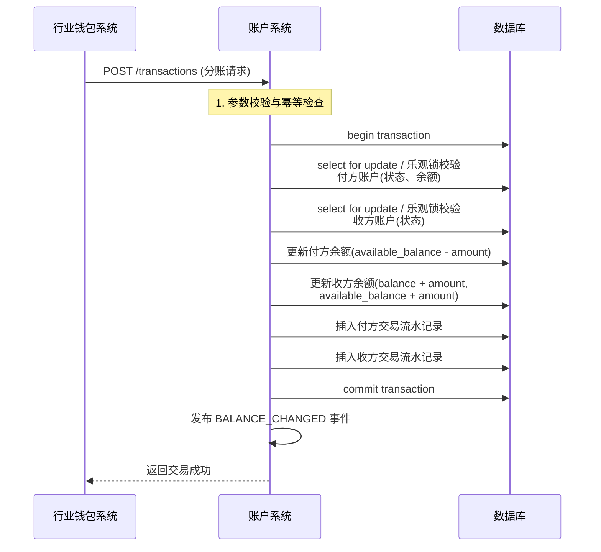

# 模块设计: 账户系统

生成时间: 2026-01-19 17:47:15

---

# 账户系统模块设计文档

## 1. 概述

### 1.1 目的
本模块是底层账户管理的核心系统，负责为“天财”业务场景下的各类实体（如总部、门店）开立、管理和操作专用的资金账户。它向上为**行业钱包系统**、**清结算系统**等提供稳定、可靠的账户服务，向下对接银行或支付渠道，是资金流转的基石。

### 1.2 范围
本模块的核心职责包括：
1.  **账户生命周期管理**：支持开立、升级、冻结、解冻、注销天财专用账户（收款账户、接收方账户）及内部账户（待结算、退货账户）。
2.  **账户属性与关系管理**：为账户打标（如标记为“天财专用”），维护账户与商户、机构（天财）的归属关系。
3.  **底层账务处理**：提供原子化的余额操作（如入账、出账、冻结、解冻），并确保强一致性。
4.  **账户信息查询**：提供账户余额、状态、明细等信息的查询服务。
5.  **内部账户管理**：管理用于业务处理的内部账户（如待结算账户、退货账户）。

**边界说明**：
- **不负责**：业务逻辑（如分账规则、手续费计算）、协议签署、身份认证、对账单生成。
- **通过接口**：接收来自上游系统（如行业钱包系统）的指令，执行纯粹的账户操作。

## 2. 接口设计

### 2.1 API端点 (RESTful)

#### 2.1.1 账户管理接口
- `POST /api/v1/accounts` **创建账户**
    - **描述**：为指定商户开立一个新的天财专用账户（收款或接收方账户）。
    - **请求体** (`CreateAccountRequest`)：
      ```json
      {
        "requestId": "req_202310271200001", // 请求唯一ID，用于幂等
        "merchantId": "M100001", // 商户ID（来自三代系统）
        "institutionId": "TC001", // 机构ID（天财）
        "accountType": "RECEIVABLE", // 账户类型: RECEIVABLE(收款账户), RECEIVER(接收方账户)
        "currency": "CNY",
        "metadata": { // 扩展信息
          "upgradedFrom": "ACC_OLD001" // 若为升级，原账户号
        }
      }
      ```
    - **响应体** (`AccountResponse`)：
      ```json
      {
        "code": "SUCCESS",
        "message": "成功",
        "data": {
          "accountNo": "TC_RCV_20231027M100001", // 系统生成的唯一账户号
          "status": "ACTIVE",
          "merchantId": "M100001",
          "institutionId": "TC001",
          "accountType": "RECEIVABLE",
          "currency": "CNY",
          "balance": "0.00",
          "availableBalance": "0.00",
          "frozenBalance": "0.00",
          "createdAt": "2023-10-27T12:00:00Z"
        }
      }
      ```

- `POST /api/v1/accounts/{accountNo}/upgrade-to-tiancai` **升级为天财账户**
    - **描述**：将已有的普通收款账户升级标记为天财专用收款账户。
    - **请求体** (`UpgradeAccountRequest`)：
      ```json
      {
        "requestId": "req_upgrade_001",
        "institutionId": "TC001",
        "tags": ["TIANCAI_SPECIAL"] // 打标
      }
      ```

- `POST /api/v1/accounts/{accountNo}/status` **变更账户状态**
    - **描述**：冻结、解冻或注销账户。
    - **请求体**：
      ```json
      {
        "requestId": "req_status_001",
        "targetStatus": "FROZEN", // ACTIVE, FROZEN, CLOSED
        "reason": "风险控制"
      }
      ```

#### 2.1.2 账务操作接口
- `POST /api/v1/accounts/transactions` **执行交易**
    - **描述**：原子化的资金操作（入账、出账、冻结、解冻）。**此接口为内部接口，不直接对外暴露**。
    - **请求体** (`TransactionRequest`)：
      ```json
      {
        "requestId": "txn_202310271200001",
        "businessType": "TIANCAI_SPLIT", // 业务类型：TIANCAI_SPLIT(天财分账), COLLECTION(归集), SETTLEMENT(结算)
        "debitAccountNo": "TC_RCV_A", // 借方账户（可选）
        "creditAccountNo": "TC_RCV_B", // 贷方账户（可选）
        "amount": "100.00",
        "currency": "CNY",
        "postScript": "天财分账至门店", // 附言
        "businessRefNo": "split_001", // 业务方唯一参考号
        "metadata": {} // 扩展字段，如手续费信息
      }
      ```
    - **响应体**：
      ```json
      {
        "code": "SUCCESS",
        "message": "成功",
        "data": {
          "transactionNo": "T202310271200001", // 系统交易流水号
          "status": "SUCCEED",
          "debitBalance": "900.00", // 操作后借方余额
          "creditBalance": "100.00" // 操作后贷方余额
        }
      }
      ```

#### 2.1.3 查询接口
- `GET /api/v1/accounts/{accountNo}` **查询账户信息**
- `GET /api/v1/accounts/{accountNo}/balance` **查询账户余额**
- `GET /api/v1/accounts/{accountNo}/transactions` **查询交易流水** (支持分页、按时间过滤)

### 2.2 发布/消费的事件
本模块作为底层服务，主要消费指令，发布账户变动事件供下游（如对账单系统）订阅。

- **消费事件**：无。指令通过同步API调用。
- **发布事件** (`AccountEvent`)：
    - **事件类型**：`ACCOUNT_CREATED`, `ACCOUNT_STATUS_CHANGED`, `BALANCE_CHANGED`
    - **事件通道**：`message-bus:account-events`
    - **事件体示例** (`BALANCE_CHANGED`)：
      ```json
      {
        "eventId": "evt_001",
        "type": "BALANCE_CHANGED",
        "occurredAt": "2023-10-27T12:00:00Z",
        "payload": {
          "accountNo": "TC_RCV_A",
          "changeAmount": "-100.00",
          "changeType": "DEBIT",
          "balanceAfter": "900.00",
          "availableBalanceAfter": "900.00",
          "transactionNo": "T202310271200001",
          "businessRefNo": "split_001",
          "businessType": "TIANCAI_SPLIT"
        }
      }
      ```

## 3. 数据模型

### 3.1 核心表设计

```sql
-- 账户主表
CREATE TABLE `t_account` (
  `id` bigint(20) NOT NULL AUTO_INCREMENT,
  `account_no` varchar(64) NOT NULL COMMENT '账户号，唯一标识',
  `merchant_id` varchar(32) NOT NULL COMMENT '商户ID',
  `institution_id` varchar(32) NOT NULL COMMENT '所属机构ID（如天财）',
  `account_type` varchar(32) NOT NULL COMMENT '账户类型: RECEIVABLE, RECEIVER, INTERNAL',
  `internal_account_type` varchar(32) DEFAULT NULL COMMENT '内部账户子类型: UN_SETTLED(01待结算), REFUND(04退货)',
  `currency` char(3) NOT NULL DEFAULT 'CNY',
  `status` varchar(16) NOT NULL DEFAULT 'ACTIVE' COMMENT 'ACTIVE, FROZEN, CLOSED',
  `balance` decimal(20,2) NOT NULL DEFAULT '0.00' COMMENT '总余额',
  `available_balance` decimal(20,2) NOT NULL DEFAULT '0.00' COMMENT '可用余额',
  `frozen_balance` decimal(20,2) NOT NULL DEFAULT '0.00' COMMENT '冻结余额',
  `tags` json DEFAULT NULL COMMENT '标签数组，如["TIANCAI_SPECIAL"]',
  `metadata` json DEFAULT NULL COMMENT '扩展元数据',
  `version` int(11) NOT NULL DEFAULT '0' COMMENT '乐观锁版本号',
  `created_at` datetime NOT NULL DEFAULT CURRENT_TIMESTAMP,
  `updated_at` datetime NOT NULL DEFAULT CURRENT_TIMESTAMP ON UPDATE CURRENT_TIMESTAMP,
  PRIMARY KEY (`id`),
  UNIQUE KEY `uk_account_no` (`account_no`),
  KEY `idx_merchant_inst` (`merchant_id`, `institution_id`),
  KEY `idx_status` (`status`)
) ENGINE=InnoDB COMMENT='账户主表';

-- 账户流水表（用于对账、审计）
CREATE TABLE `t_account_transaction` (
  `id` bigint(20) NOT NULL AUTO_INCREMENT,
  `transaction_no` varchar(64) NOT NULL COMMENT '系统交易流水号',
  `account_no` varchar(64) NOT NULL COMMENT '账户号',
  `related_account_no` varchar(64) DEFAULT NULL COMMENT '对手方账户号',
  `business_type` varchar(32) NOT NULL COMMENT '业务类型',
  `business_ref_no` varchar(64) NOT NULL COMMENT '业务方唯一参考号',
  `amount` decimal(20,2) NOT NULL COMMENT '变动金额，正数为入账，负数为出账',
  `balance_before` decimal(20,2) NOT NULL COMMENT '变动前余额',
  `balance_after` decimal(20,2) NOT NULL COMMENT '变动后余额',
  `available_balance_before` decimal(20,2) NOT NULL,
  `available_balance_after` decimal(20,2) NOT NULL,
  `transaction_type` varchar(16) NOT NULL COMMENT '交易类型: DEBIT(出账), CREDIT(入账), FREEZE(冻结), UNFREEZE(解冻)',
  `currency` char(3) NOT NULL DEFAULT 'CNY',
  `status` varchar(16) NOT NULL DEFAULT 'SUCCEED' COMMENT 'SUCCEED, FAILED',
  `post_script` varchar(256) DEFAULT NULL COMMENT '附言',
  `metadata` json DEFAULT NULL COMMENT '扩展信息，如手续费明细',
  `created_at` datetime NOT NULL DEFAULT CURRENT_TIMESTAMP,
  PRIMARY KEY (`id`),
  UNIQUE KEY `uk_transaction_no` (`transaction_no`),
  UNIQUE KEY `uk_business_ref` (`business_type`, `business_ref_no`, `account_no`) COMMENT '业务幂等键',
  KEY `idx_account_time` (`account_no`, `created_at`),
  KEY `idx_business_ref_no` (`business_ref_no`)
) ENGINE=InnoDB COMMENT='账户流水表';
```

### 3.2 与其他模块的关系
- **行业钱包系统**：调用本模块的账户管理、账务操作接口，是主要的上游调用方。
- **清结算系统**：在结算日终或触发结算时，调用本模块将资金从**待结算账户**划入商户的**天财收款账户**。
- **三代系统**：提供商户（`merchant_id`）和机构（`institution_id`）信息，是本模块数据的权威来源之一。
- **对账单系统**：订阅本模块发布的`BALANCE_CHANGED`事件，生成动账明细。

## 4. 业务逻辑

### 4.1 核心算法与规则
1.  **账户号生成规则**：
    - 格式：`{机构前缀}_{账户类型}_{日期}_{序列号/商户ID哈希}`
    - 示例：天财收款账户 `TC_RCV_20231027M100001`
    - 确保全局唯一。

2.  **余额操作原子性与一致性**：
    - 使用数据库事务及`乐观锁`（`version`字段）确保并发下的余额操作准确。
    - 任何资金变动必须同时记录`t_account_transaction`流水，用于审计和对账。

3.  **账户状态机**：
    ```
    [初始] --> ACTIVE --(冻结)--> FROZEN
    FROZEN --(解冻)--> ACTIVE
    ACTIVE --(注销)--> CLOSED
    FROZEN --(注销)--> CLOSED
    ```
    - `CLOSED`状态账户不允许进行任何资金操作。
    - `FROZEN`状态账户不允许出账和冻结操作，但可以入账。

4.  **内部账户管理**：
    - `01待结算账户`和`04退货账户`在系统初始化时自动创建，`merchant_id`和`institution_id`为系统预留值。
    - 仅限**清结算系统**等特定内部系统操作。

### 4.2 验证逻辑
- **创建/升级账户**：校验`merchant_id`和`institution_id`的有效性（可调用三代系统接口验证）。
- **执行交易**：
    - 校验借/贷方账户存在、状态为`ACTIVE`、币种匹配。
    - 校验出账账户`available_balance` >= `amount`。
    - 严格校验`business_type`和`business_ref_no`的组合唯一性，实现**幂等**。
- **状态变更**：校验当前状态到目标状态的转换是否合法。

## 5. 时序图

### 5.1 天财分账资金划转时序图


## 6. 错误处理

| 错误码 | HTTP状态码 | 描述 | 处理策略 |
| :--- | :--- | :--- | :--- |
| `ACCOUNT_NOT_FOUND` | 404 | 账户不存在 | 调用方检查账户号是否正确 |
| `ACCOUNT_STATUS_INVALID` | 400 | 账户状态异常（冻结、注销） | 调用方需先解冻或检查业务逻辑 |
| `INSUFFICIENT_BALANCE` | 400 | 可用余额不足 | 调用方提示或终止业务 |
| `DUPLICATE_BUSINESS_REF` | 409 | 业务参考号重复（幂等冲突） | 返回已存在的交易结果，实现幂等 |
| `CURRENCY_MISMATCH` | 400 | 币种不匹配 | 调用方检查请求参数 |
| `INTERNAL_ACCOUNT_OP_DENIED` | 403 | 非法操作内部账户 | 检查调用方权限和业务场景 |
| `DATABASE_ERROR` | 500 | 数据库异常 | 记录告警，人工介入，事务保证数据一致性 |

**通用策略**：
- **重试**：对于网络超时等暂时性错误，调用方应使用带退避策略的幂等重试。
- **补偿**：对于已扣款但未加款的极端情况，依赖监控告警，触发人工或自动对账补偿流程。
- **监控与告警**：对所有失败交易进行监控，对高频错误码进行告警。

## 7. 依赖说明

本模块是底层服务，依赖简单明确：

1.  **上游调用方（强依赖）**：
    - **行业钱包系统**：所有天财专用账户的操作指令来源。需保证其调用`/transactions`接口的**幂等性**。
    - **清结算系统**：执行结算、退货等资金划拨。需保证其正确处理内部账户。

2.  **下游事件订阅方（弱依赖）**：
    - **对账单系统**：订阅账户变动事件。事件发布采用异步消息，本模块不依赖其可用性。

3.  **外部依赖**：
    - **数据库（MySQL）**：强依赖，用于数据持久化和事务管理。需高可用架构。
    - **消息中间件（如Kafka/RocketMQ）**：弱依赖，用于事件发布。故障时需降级为日志记录，后续补发。

4.  **协作模式**：
    - 所有业务逻辑（如关系绑定校验、手续费计算）由上游系统处理。
    - 本模块仅提供原子化的、与业务解耦的账户操作，是**被动的指令执行者**。