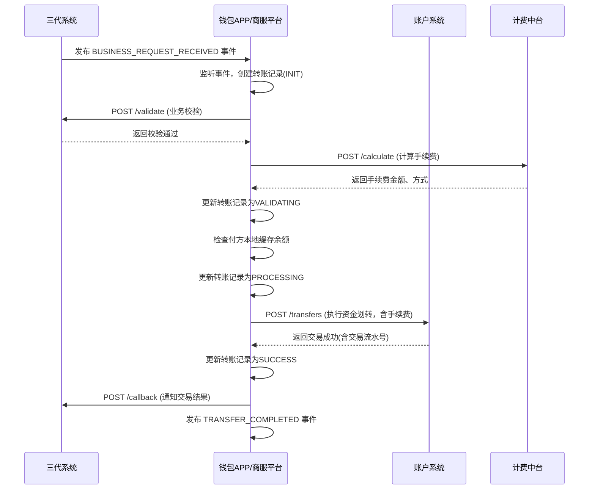
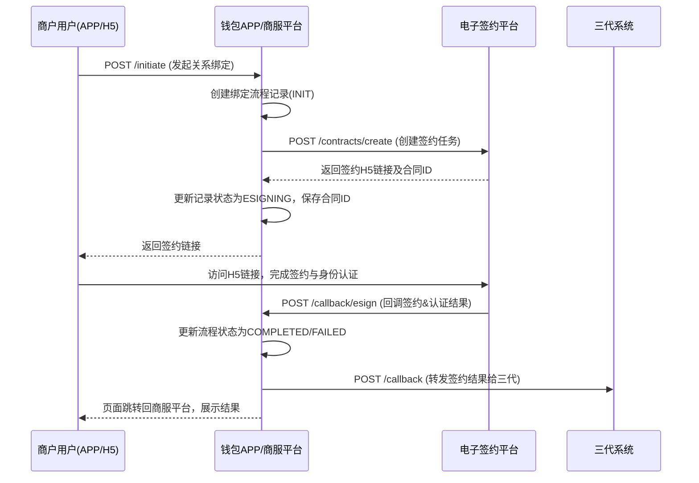

# 模块设计: 钱包APP/商服平台

生成时间: 2026-01-19 17:49:53

---

# 模块设计文档：钱包APP/商服平台

## 1. 概述

### 1.1 目的
本模块是“天财”业务场景下的**行业钱包系统**与**商户服务平台**的统一体，是连接上层业务管理系统（三代系统）与底层核心金融系统（账户系统、清结算系统）的**关键枢纽**。它负责处理天财专用账户的日常运营、资金流转指令的执行、以及为商户提供账户管理和业务操作的可视化界面。

### 1.2 范围
本模块的核心职责包括：
1.  **天财专用账户管理**：作为账户系统在行业侧的代理，受理并处理天财收款账户、接收方账户的开立、升级请求，并维护商户与账户的绑定关系。
2.  **资金流转指令处理**：接收来自三代系统的业务请求（归集、批量付款、会员结算），进行二次校验后，调用底层账户系统执行资金划转。
3.  **商户服务门户**：为商户（总部、门店）提供H5/APP界面，用于查看账户信息、交易流水、管理银行卡、发起或授权业务关系、查看对账单等。
4.  **业务关系绑定流程驱动**：集成电子签约平台，封装签约H5页面，引导用户完成身份认证（打款验证/人脸验证）和协议签署，并将结果同步回三代系统。
5.  **手续费计算与路由**：与计费中台交互，计算分账、转账等业务的手续费，并确保在资金流转中正确扣收。

**边界说明**：
- **不负责**：底层账户的余额增减、记账等核心金融操作（由账户系统负责）；业务规则的最终裁决（由三代系统负责）；支付交易的发起与清算（由收单和清结算系统负责）。
- **通过接口**：调用账户系统执行资金操作；调用三代系统进行业务校验；调用电子签约平台发起签约；为商户前端提供数据和服务接口。

## 2. 接口设计

### 2.1 API端点 (RESTful)

#### 2.1.1 账户管理接口 (供三代系统调用)
- `POST /api/v1/accounts/open` **开通天财专用账户**
    - **描述**：接收三代系统的账户开通申请，校验后调用账户系统开立行业钱包账户。
    - **请求体** (`OpenAccountRequest`)：
      ```json
      {
        "requestId": "wallet_req_open_001",
        "applyNo": "APPLY_20231027_001", // 三代传递的申请单号
        "merchantId": "M100001",
        "institutionId": "TC001",
        "accountType": "RECEIVABLE", // RECEIVABLE(收款账户), RECEIVER(接收方账户)
        "operationType": "CREATE", // CREATE, UPGRADE
        "originalAccountNo": null,
        "callbackUrl": "https://three-gen-system/callback" // 结果回调给三代
      }
      ```
    - **响应体** (`OpenAccountResponse`)：
      ```json
      {
        "code": "SUCCESS",
        "message": "受理成功",
        "data": {
          "walletApplyNo": "WALLET_APPLY_20231027_001", // 本系统流水号
          "status": "PROCESSING"
        }
      }
      ```

- `POST /api/v1/accounts/{accountNo}/bank-cards` **绑定提现银行卡** (接收方账户专用)
    - **描述**：为天财接收方账户绑定用于提现的银行卡，可设置默认卡。
    - **请求体** (`BindBankCardRequest`)：
      ```json
      {
        "requestId": "req_bind_card_001",
        "accountNo": "TC_RCV_20231027M100001",
        "bankCardNo": "6228480012345678901",
        "bankCode": "ABC",
        "bankName": "中国农业银行",
        "cardholderName": "张三",
        "isDefault": true,
        "certType": "CORPORATE", // CORPORATE, PERSONAL
        "certInfo": {
          "businessLicenseNo": "91310101MA1F123456",
          "legalPerson": "张三"
        }
      }
      ```

#### 2.1.2 资金流转接口 (供业务核心/内部调度调用)
- `POST /api/v1/transfers/tiancai-split` **执行天财分账**
    - **描述**：**核心内部接口**。接收业务核心转发的分账指令，进行风控和业务二次校验后，调用账户系统完成资金划转。
    - **请求体** (`TiancaiSplitRequest`)：
      ```json
      {
        "requestId": "transfer_req_001",
        "businessRefNo": "TC_COLLECT_20231027_001", // 三代生成的业务参考号
        "payerAccountNo": "TC_RCV_20231027M100002", // 付方账户(门店接收方账户)
        "payeeAccountNo": "TC_RCV_20231027M100001", // 收方账户(总部接收方账户)
        "amount": "1000.00",
        "currency": "CNY",
        "businessType": "COLLECTION",
        "postScript": "日常归集",
        "feeDeductionMethod": "PAYER", // PAYER, PAYEE, SEPARATE
        "relationshipId": "REL_20231027_001",
        "callbackUrl": "https://three-gen-system/callback" // 交易结果回调三代
      }
      ```
    - **响应体**：
      ```json
      {
        "code": "SUCCESS",
        "message": "交易受理成功",
        "data": {
          "transferNo": "TRANSFER_20231027_001", // 本系统转账流水号
          "status": "PROCESSING"
        }
      }
      ```

#### 2.1.3 商户服务接口 (供钱包APP/H5调用)
- `GET /api/v1/merchant/accounts` **查询商户账户概览**
    - **描述**：商户登录后，查询其名下的所有天财专用账户及其余额、状态。
    - **响应体**：
      ```json
      {
        "code": "SUCCESS",
        "data": {
          "merchantId": "M100001",
          "accounts": [
            {
              "accountNo": "TC_RCV_20231027M100001",
              "accountType": "RECEIVER",
              "accountName": "天财品牌总部-专用接收账户",
              "balance": "50000.00",
              "availableBalance": "50000.00",
              "status": "NORMAL",
              "isDefaultReceivable": false
            },
            {
              "accountNo": "TC_RCV_20231027M100001_R",
              "accountType": "RECEIVABLE",
              "accountName": "天财品牌总部-专用收款账户",
              "balance": "200000.00",
              "availableBalance": "200000.00",
              "status": "NORMAL",
              "isDefaultReceivable": true
            }
          ]
        }
      }
      ```

- `POST /api/v1/merchant/business-relationships/initiate` **发起业务关系绑定**
    - **描述**：商户（付方或收方）发起建立业务关系的请求，本接口生成签约参数并跳转至电子签约H5页面。
    - **请求体**：
      ```json
      {
        "relationshipType": "COLLECTION",
        "counterpartyMerchantId": "M100001", // 对方商户ID
        "authorizationScopes": ["DAILY_COLLECTION"]
      }
      ```
    - **响应体**：
      ```json
      {
        "code": "SUCCESS",
        "data": {
          "signPageUrl": "https://wallet-app/esign/h5?token=xyz789&redirect=https://wallet-app/home"
        }
      }
      ```

- `GET /api/v1/merchant/statements` **查询对账单**
    - **描述**：查询账户动账明细或业务汇总账单。
    - **参数**：`accountNo`, `startDate`, `endDate`, `statementType` (`DETAIL`, `SUMMARY`)
    - **响应体**：调用对账单系统获取数据并封装返回。

#### 2.1.4 回调接口
- `POST /api/v1/callback/account` **账户操作结果回调**
    - **描述**：**内部接口**，供账户系统回调，通知开户、绑卡等操作结果。
- `POST /api/v1/callback/transfer` **资金交易结果回调**
    - **描述**：**内部接口**，供账户系统回调，通知转账/分账交易结果。
- `POST /api/v1/callback/esign` **电子签约结果回调**
    - **描述**：**内部接口**，供电子签约平台回调，通知签约及认证结果。本模块需将结果转发给三代系统。

### 2.2 发布/消费的事件
- **消费事件** (通过消息中间件)：
    - `BusinessEvent` (来自三代系统，类型为`BUSINESS_REQUEST_RECEIVED`)：触发资金流转处理流程。
    - `AccountEvent` (来自账户系统，类型为`ACCOUNT_TRANSACTION_RESULT`)：更新本地转账记录状态，并回调三代系统。
- **发布事件** (`WalletEvent`)：
    - **事件类型**：`ACCOUNT_OPENED`, `BANKCARD_BOUND`, `TRANSFER_INITIATED`, `TRANSFER_COMPLETED`, `ESIGN_PROCESS_STARTED`
    - **事件通道**：`message-bus:wallet-events`
    - **事件体示例** (`TRANSFER_COMPLETED`)：
      ```json
      {
        "eventId": "evt_wallet_trans_001",
        "type": "TRANSFER_COMPLETED",
        "occurredAt": "2023-10-27T15:05:00Z",
        "payload": {
          "transferNo": "TRANSFER_20231027_001",
          "businessRefNo": "TC_COLLECT_20231027_001",
          "status": "SUCCESS",
          "amount": "1000.00",
          "payerAccountNo": "TC_RCV_20231027M100002",
          "payeeAccountNo": "TC_RCV_20231027M100001"
        }
      }
      ```

## 3. 数据模型

### 3.1 核心表设计
```sql
-- 天财账户信息表（本系统维护的账户视图）
CREATE TABLE `t_tiancai_account` (
  `id` bigint(20) NOT NULL AUTO_INCREMENT,
  `account_no` varchar(64) NOT NULL COMMENT '账户系统生成的账户号',
  `merchant_id` varchar(32) NOT NULL,
  `institution_id` varchar(32) NOT NULL,
  `account_type` varchar(32) NOT NULL COMMENT 'RECEIVABLE, RECEIVER',
  `account_sub_type` varchar(32) DEFAULT NULL COMMENT '行业钱包子类型，用于区分普通与天财专用',
  `status` varchar(16) NOT NULL DEFAULT 'NORMAL' COMMENT 'NORMAL, FROZEN, CLOSED',
  `open_apply_no` varchar(64) NOT NULL COMMENT '开户申请流水号',
  `balance` decimal(20,2) NOT NULL DEFAULT '0.00' COMMENT '缓存余额，与账户系统定期同步',
  `available_balance` decimal(20,2) NOT NULL DEFAULT '0.00',
  `is_default_receivable` tinyint(1) NOT NULL DEFAULT '0' COMMENT '是否默认收款账户（一个商户一个）',
  `metadata` json DEFAULT NULL COMMENT '账户扩展信息',
  `created_at` datetime NOT NULL DEFAULT CURRENT_TIMESTAMP,
  `updated_at` datetime NOT NULL DEFAULT CURRENT_TIMESTAMP ON UPDATE CURRENT_TIMESTAMP,
  PRIMARY KEY (`id`),
  UNIQUE KEY `uk_account_no` (`account_no`),
  UNIQUE KEY `uk_merchant_default_receivable` (`merchant_id`, `is_default_receivable`) COMMENT '唯一默认收款账户',
  KEY `idx_merchant` (`merchant_id`),
  KEY `idx_institution` (`institution_id`)
) ENGINE=InnoDB COMMENT='天财账户信息表';

-- 银行卡绑定表
CREATE TABLE `t_bank_card_binding` (
  `id` bigint(20) NOT NULL AUTO_INCREMENT,
  `account_no` varchar(64) NOT NULL COMMENT '天财接收方账户号',
  `bank_card_no` varchar(32) NOT NULL COMMENT '银行卡号（加密存储）',
  `bank_code` varchar(16) NOT NULL,
  `bank_name` varchar(64) NOT NULL,
  `cardholder_name` varchar(64) NOT NULL,
  `is_default` tinyint(1) NOT NULL DEFAULT '0' COMMENT '是否默认提现卡',
  `cert_type` varchar(16) NOT NULL COMMENT 'CORPORATE, PERSONAL',
  `cert_info` json NOT NULL COMMENT '认证信息（企业营业执照/个人身份证）',
  `bind_status` varchar(16) NOT NULL DEFAULT 'BOUND' COMMENT 'BOUND, UNBOUND',
  `verified_at` datetime DEFAULT NULL COMMENT '打款验证成功时间',
  `created_at` datetime NOT NULL DEFAULT CURRENT_TIMESTAMP,
  `updated_at` datetime NOT NULL DEFAULT CURRENT_TIMESTAMP ON UPDATE CURRENT_TIMESTAMP,
  PRIMARY KEY (`id`),
  UNIQUE KEY `uk_account_card` (`account_no`, `bank_card_no`),
  KEY `idx_account_default` (`account_no`, `is_default`)
) ENGINE=InnoDB COMMENT='银行卡绑定表';

-- 资金转账记录表
CREATE TABLE `t_fund_transfer` (
  `id` bigint(20) NOT NULL AUTO_INCREMENT,
  `transfer_no` varchar(64) NOT NULL COMMENT '本系统转账流水号',
  `business_ref_no` varchar(64) NOT NULL COMMENT '三代业务参考号',
  `request_id` varchar(64) NOT NULL COMMENT '请求ID，用于幂等',
  `payer_account_no` varchar(64) NOT NULL,
  `payee_account_no` varchar(64) NOT NULL,
  `amount` decimal(20,2) NOT NULL,
  `currency` char(3) NOT NULL DEFAULT 'CNY',
  `business_type` varchar(32) NOT NULL COMMENT 'COLLECTION, BATCH_PAY, MEMBER_SETTLE',
  `status` varchar(16) NOT NULL DEFAULT 'INIT' COMMENT 'INIT, VALIDATING, PROCESSING, SUCCESS, FAILED',
  `fee_amount` decimal(20,2) DEFAULT '0.00' COMMENT '手续费',
  `fee_deduction_method` varchar(16) DEFAULT NULL COMMENT 'PAYER, PAYEE, SEPARATE',
  `post_script` varchar(128) DEFAULT NULL,
  `relationship_id` varchar(64) DEFAULT NULL,
  `account_transaction_no` varchar(64) DEFAULT NULL COMMENT '账户系统交易流水号',
  `fail_reason` varchar(256) DEFAULT NULL,
  `callback_url` varchar(512) DEFAULT NULL COMMENT '结果回调地址（给三代）',
  `completed_at` datetime DEFAULT NULL,
  `created_at` datetime NOT NULL DEFAULT CURRENT_TIMESTAMP,
  `updated_at` datetime NOT NULL DEFAULT CURRENT_TIMESTAMP ON UPDATE CURRENT_TIMESTAMP,
  PRIMARY KEY (`id`),
  UNIQUE KEY `uk_transfer_no` (`transfer_no`),
  UNIQUE KEY `uk_request_id` (`request_id`),
  KEY `idx_business_ref_no` (`business_ref_no`),
  KEY `idx_payer_time` (`payer_account_no`, `created_at`),
  KEY `idx_status` (`status`)
) ENGINE=InnoDB COMMENT='资金转账记录表';

-- 业务关系绑定流程记录表
CREATE TABLE `t_relationship_process` (
  `id` bigint(20) NOT NULL AUTO_INCREMENT,
  `process_no` varchar(64) NOT NULL COMMENT '流程实例号',
  `relationship_id` varchar(64) DEFAULT NULL COMMENT '三代生成的关系ID，签约成功后回填',
  `payer_merchant_id` varchar(32) NOT NULL,
  `payee_merchant_id` varchar(32) NOT NULL,
  `relationship_type` varchar(32) NOT NULL,
  `initiator_merchant_id` varchar(32) NOT NULL COMMENT '发起方商户ID',
  `status` varchar(16) NOT NULL DEFAULT 'INIT' COMMENT 'INIT, ESIGNING, AUTHENTICATING, COMPLETED, FAILED',
  `esign_contract_id` varchar(64) DEFAULT NULL,
  `esign_url` varchar(512) DEFAULT NULL,
  `auth_method` varchar(16) DEFAULT NULL COMMENT 'REMITTANCE, FACE',
  `auth_status` varchar(16) DEFAULT NULL COMMENT 'PENDING, SUCCESS, FAILED',
  `callback_url` varchar(512) DEFAULT NULL COMMENT '签约结果回调给三代的地址',
  `metadata` json DEFAULT NULL,
  `created_at` datetime NOT NULL DEFAULT CURRENT_TIMESTAMP,
  `updated_at` datetime NOT NULL DEFAULT CURRENT_TIMESTAMP ON UPDATE CURRENT_TIMESTAMP,
  PRIMARY KEY (`id`),
  UNIQUE KEY `uk_process_no` (`process_no`),
  KEY `idx_relationship` (`relationship_id`),
  KEY `idx_initiator` (`initiator_merchant_id`)
) ENGINE=InnoDB COMMENT='业务关系绑定流程记录表';
```

### 3.2 与其他模块的关系
- **三代系统**：上游权威系统。接收其账户开通指令和业务请求事件；调用其业务校验接口；向其回调业务结果。
- **账户系统**：下游核心系统。调用其进行账户开立、升级、余额查询、资金划转等操作。
- **电子签约平台**：平行系统。调用其创建签约任务、获取H5链接；接收其签约和认证结果回调。
- **计费中台**：下游服务。在发起资金划转前调用，计算手续费。
- **对账单系统**：下游服务。商户查询账单时调用，获取动账明细或汇总数据。
- **清结算系统/业务核心**：间接协作。业务核心将分账指令路由至本模块处理。

## 4. 业务逻辑

### 4.1 核心算法与规则
1.  **转账流水号生成规则**：
    - 格式：`TRANSFER_{yyyymmdd}_{8位序列}`
    - 示例：`TRANSFER_20231027_00000001`
2.  **账户余额同步机制**：
    - 本地`t_tiancai_account`表缓存余额，用于快速查询。
    - 通过定时任务（如每5分钟）或接收账户系统的`ACCOUNT_BALANCE_CHANGED`事件，与账户系统核心余额进行同步。
    - 发起交易前，进行本地可用余额的初步检查（防超卖），但最终以账户系统校验为准。
3.  **手续费处理流程**：
    - 在`/transfers/tiancai-split`接口中，根据`feeDeductionMethod`调用计费中台计算手续费。
    - 若手续费为`SEPARATE`，需生成两笔账户交易（一笔本金，一笔手续费）。
    - 将手续费金额记录在`t_fund_transfer.fee_amount`中。
4.  **业务关系绑定流程状态机**：
    ```
    [INIT] --> ESIGNING --(签约完成)--> AUTHENTICATING --(认证完成)--> COMPLETED
                    |                         |
                    +--(签约失败)--> FAILED    +--(认证失败)--> FAILED
    ```
    - 认证方式(`auth_method`)由电子签约平台根据商户类型决定：企业-打款验证(`REMITTANCE`)，个人/个体户-人脸验证(`FACE`)。
5.  **资金转账处理状态机**：
    ```
    [INIT] --> VALIDATING --(校验通过)--> PROCESSING --(账户系统成功)--> SUCCESS
                    |                              |
                    +--(校验失败)--> FAILED         +--(账户系统失败)--> FAILED
    ```
    - `VALIDATING`阶段：调用三代系统校验业务关系；调用计费中台计算手续费；检查本地缓存余额。

### 4.2 验证逻辑
- **开通账户**：校验`applyNo`对应的申请单是否存在且状态可处理；校验商户是否已存在同类型账户（防重复开立）。
- **绑定银行卡**：校验目标账户是否为`RECEIVER`类型；校验银行卡号格式；对公账户绑卡需触发打款验证流程。
- **执行分账**：
    1.  **幂等校验**：基于`requestId`防止重复处理。
    2.  **业务校验**：调用三代系统`/validate`接口，校验关系与额度。
    3.  **账户校验**：检查付方账户状态是否正常，本地缓存余额是否充足（预警性检查）。
    4.  **风控校验**：检查交易频率、金额是否符合风控规则（可配置）。
- **商户操作鉴权**：所有商户服务接口需验证登录态，并确认操作的资源（账户、关系）属于当前登录商户。

## 5. 时序图

### 5.1 处理归集业务时序图


### 5.2 商户发起关系绑定时序图


## 6. 错误处理

| 错误码 | HTTP状态码 | 描述 | 处理策略 |
| :--- | :--- | :--- | :--- |
| `ACCOUNT_ALREADY_EXISTS` | 409 | 同类型账户已存在 | 返回已存在的账户信息，或提示升级流程 |
| `ACCOUNT_STATUS_ABNORMAL` | 400 | 账户状态非NORMAL | 提示账户冻结或已注销，联系客服 |
| `INSUFFICIENT_BALANCE` | 400 | 付款方余额不足 | 交易终止，提示商户充值 |
| `BANKCARD_VERIFICATION_REQUIRED` | 400 | 银行卡需打款验证 | 引导用户完成打款验证流程 |
| `BUSINESS_VALIDATION_FAILED` | 400 | 三代业务校验未通过 | 透传三代系统的错误信息 |
| `FEE_CALCULATION_FAILED` | 500 | 手续费计算失败 | 告警，人工介入；或使用默认费率 |
| `ACCOUNT_SYSTEM_UNAVAILABLE` | 503 | 账户系统服务异常 | 进入降级模式：记录失败，定时任务重试 |
| `DUPLICATE_TRANSFER_REQUEST` | 409 | 重复的转账请求 | 返回已存在的转账记录状态，实现幂等 |
| `AUTHENTICATION_REQUIRED` | 401 | 用户未登录或会话过期 | 跳转至登录页 |

**通用策略**：
- **异步与重试**：对于调用下游系统（如账户系统）的失败，采用指数退避策略进行重试。持久化记录状态，便于对账和补偿。
- **熔断与降级**：对账户系统、三代系统等核心依赖设置熔断器。降级时，可暂停非关键功能或使用缓存数据。
- **额度与余额的最终一致性**：本地缓存余额仅用于快速校验，最终以账户系统为准。交易失败需准确回调三代系统释放额度。
- **监控**：密切监控交易失败率、平均处理时间、下游系统健康状态。对长时间`PROCESSING`状态的转账记录进行告警。

## 7. 依赖说明

本模块是承上启下的关键业务层，依赖众多系统：

1. **上游依赖（强依赖）**：
   - **三代系统**：业务规则的最终裁决者。本模块发起的任何资金流转都必须先通过其校验。需保证其高可用，或在本模块实现校验结果的缓存（带短时有效期）。
   - **业务核心**：支付交易指令的发起方。需明确接口契约，确保指令信息完整。

2. **下游依赖（强依赖）**：
   - **账户系统**：所有资金操作的执行者。是本模块最核心的依赖，其故障将导致所有资金业务停摆。必须实现完善的熔断、降级和补偿机制。
   - **电子签约平台**：关系绑定的必要条件。需处理其异步回调可能延迟或丢失的情况，通过定时任务进行状态同步。

3. **平行依赖（中度依赖）**：
   - **计费中台**：影响手续费计算。故障时可考虑使用配置的默认费率，但需记录日志并事后核对。
   - **对账单系统**：影响商户查询体验。故障时可提示“账单生成中，请稍后查询”。

4. **外部依赖**：
   - **数据库**：存储所有流程状态，必须保证数据一致性和可靠性。
   - **缓存**：用于存储会话、商户信息、配置等，提升性能。
   - **消息中间件**：用于解耦事件处理，需保证消息不丢失。

5. **协作模式**：
   - 本模块扮演**指令执行者**和**流程驱动者**的角色。
   - 采用**同步校验 + 异步执行**的模式，确保业务合规性的同时，提高系统吞吐量。
   - 通过**全链路ID**（`businessRefNo`, `transferNo`）将上下游系统串联，便于问题追踪和对账。