# DocuFlow-AI Project - 软件设计文档
生成时间: 2026-01-19 17:59:47

## 目录
1. [概述说明](#1-概述说明)
   - 1.1 [术语与缩略词](#11-术语与缩略词)
2. [系统设计](#2-系统设计)
3. [模块设计](#3-模块设计)
   - 3.1 [账户系统](#31-账户系统)
   - 3.2 [认证系统](#32-认证系统)
   - 3.3 [计费中台](#33-计费中台)
   - 3.4 [业务核心系统](#34-业务核心系统)
   - 3.5 [钱包App/商服平台](#35-钱包App/商服平台)
   - 3.6 [三代系统](#36-三代系统)
   - 3.7 [清结算系统](#37-清结算系统)
   - 3.8 [电子签章系统](#38-电子签章系统)
   - 3.9 [行业钱包系统](#39-行业钱包系统)
   - 3.10 [风控系统](#310-风控系统)
   - 3.11 [退货前置模块](#311-退货前置模块)
   - 3.12 [对账单系统](#312-对账单系统)
4. [接口设计](#4-接口设计)
5. [数据库设计](#5-数据库设计)

---
# 1 概述说明

## 1.1 术语与缩略词


## 关键流程和工作流

- **天财分账**: 为满足天财商龙门店分账、会员结算、批量付款需求而设计的专用资金处理方案，涉及专用账户体系、关系绑定、认证、转账和计费等流程。
- **关系绑定** (别名: 签约与认证): 在天财分账业务中，指建立资金转出方与接收方之间授权关系的过程，涉及协议签署和身份认证（打款或人脸验证），是执行分账的前提。
- **归集** (别名: 资金归集): 一种资金流转场景，指门店将资金归集至总部。在此场景下，门店为付款方，总部为收款方。
- **批量付款** (别名: 批付): 一种资金流转场景，指总部向多个接收方（如供应商、股东）进行分账付款。
- **会员结算**: 一种资金流转场景，特指总部将会员消费资金分账给对应的门店。
- **开通付款**: 在批量付款和会员结算场景下，付方（总部/门店）需要额外完成的一个签约认证流程，以授权其付款能力。完成后，相应的关系绑定才能生效。
- **退货前置**: 处理退货交易的流程模块，支持查询和扣减天财收款账户或退货账户（04账户）余额。

## 业务实体

- **天财收款账户** (别名: 天财专用账户): 为天财机构下的收单商户开立的专用账户，用于接收交易结算资金，并作为分账的转出方或接收方。类型为行业钱包（非小微钱包），底层有特殊标记。
- **天财接收方账户** (别名: 接收方账户, 天财专用账户): 为接收分账资金而开立的专用账户，支持绑定多张银行卡并设置默认提现卡。底层有特殊标记，区别于普通账户。
- **收单商户** (别名: 商户): 通过支付系统进行收款业务的商户实体，在此需求中特指天财机构下的商户，可开通天财专用账户。
- **总部** (别名: 总店, 发起方): 在天财分账业务场景中，通常作为资金归集的接收方、批量付款和会员结算的发起方及付款方，是企业性质的业务实体。
- **门店**: 在天财分账业务场景中，通常作为资金归集的付款方、会员结算的接收方，可以是企业或个体户性质的业务实体。
- **电子签约平台** (别名: 电子签章系统): 提供电子协议签署、短信推送、H5页面封装及留存全证据链（协议、认证过程与结果）的系统。
- **三代系统**: 指支付机构内部的一代收单核心系统，在此需求中负责商户管理、开户、分账关系绑定接口提供、计费配置等核心业务逻辑处理。
- **行业钱包系统** (别名: 钱包系统): 处理行业定制化钱包账户业务（如天财专用账户）的系统，负责开户流转、关系绑定校验、分账请求处理、数据同步等。
- **账户系统**: 底层账户管理系统，负责实际创建和管理天财收款账户、天财接收方账户，控制其专属能力并打标记。
- **清结算系统** (别名: 清结算): 负责交易资金的清算、结算、计费以及退货资金处理的系统。
- **业务核心系统** (别名: 业务核心): 支付系统的核心交易处理系统，负责接收并处理“天财分账”等交易请求。
- **对账单系统**: 生成和提供各类账户动账明细、交易账单和机构层级对账单的系统。
- **04退货账户** (别名: 退货账户): 收单商户对应的用于处理退货资金的专用账户。
- **01待结算账户** (别名: 待结算账户): 用于暂存商户待结算交易资金的临时账户。

## 领域特定的技术术语

- **角色类型**: 标识天财收款账户在业务关系中的职能，主要分为“总部”和“门店”。由天财在上送开户请求时提供，用于业务逻辑校验。
- **结算模式** (别名: 主动结算, 被动结算): 指商户交易资金的结算方式，分为“主动结算”（资金结算到商户指定的收款账户）和“被动结算”（由支付机构发起结算）。天财收款账户默认设置为主动结算。
- **打款验证**: 一种身份认证方式，由认证系统向目标银行账户发起小额随机金额打款，通过验证回填金额和备注信息来确认账户控制权。主要用于对公企业或个体户的认证。
- **人脸验证**: 一种身份认证方式，通过比对姓名、身份证和人脸信息的一致性来验证个人身份。主要用于个人或个体户接收方的认证。
- **分账手续费承担方** (别名: 手续费承担方): 指定由转账交易的付款方或收款方统一承担交易产生的手续费。该参数由天财在接口中传递。
- **天财机构号** (别名: 机构号): 标识天财商龙在支付系统中的唯一机构代码。用于限制接口调用方、区分业务范围以及对账户打特殊标记。

---
# 2 系统设计
# 天财分账支付系统设计文档

## 2.1 系统结构

本系统采用分层、解耦的微服务架构，以业务域为核心进行模块划分，确保高内聚、低耦合。整体架构遵循“前-中-后台”模式，前台对接商户与用户，中台负责核心业务编排与处理，后台提供基础支付与资金处理能力。

```mermaid
graph TB
    subgraph “外部系统/前台”
        TCSL[天财商龙]
        WalletApp[钱包App]
        MerchantPortal[商户平台]
    end

    subgraph “业务中台层”
        Gen3[三代系统<br/>业务编排与商户管理]
        BizCore[业务核心系统<br/>天财分账模块]
        WalletBiz[行业钱包系统<br/>关系与指令执行]
    end

    subgraph “核心服务层”
        Account[账户系统]
        Auth[认证系统]
        Settlement[清结算系统]
        Fee[计费中台]
        Risk[风控系统]
        RefundPre[退货前置模块]
        ESign[电子签章系统]
    end

    subgraph “数据与支撑层”
        Statement[对账单系统]
        MQ[(消息队列)]
        Config[配置中心]
        DB[(核心数据库)]
    end

    TCSL --> Gen3
    WalletApp --> BizCore
    MerchantPortal --> BizCore

    Gen3 --> WalletBiz
    Gen3 --> BizCore
    BizCore --> WalletBiz

    WalletBiz --> Account
    WalletBiz --> Auth
    WalletBiz --> Settlement
    WalletBiz --> Risk

    Settlement --> Account
    Settlement --> Fee
    Settlement --> RefundPre
    Fee --> Account
    Auth --> ESign
    RefundPre --> Risk

    Account --> Statement
    Settlement --> Statement
    Fee --> Statement

    Gen3 -.-> MQ
    WalletBiz -.-> MQ
    Risk -.-> MQ
```

**架构说明**:
1.  **外部接入层**: 天财商龙、钱包App、商户平台作为业务入口，通过定义良好的API与中台层交互。
2.  **业务中台层**: 是业务逻辑的编排中心。
    *   **三代系统**：作为与天财商龙对接的总入口，是商户和业务规则的权威源，负责接收指令并向下游编排。
    *   **业务核心系统**：为钱包App等提供天财分账服务，是面向C端/B端用户的核心业务模块。
    *   **行业钱包系统**：作为核心业务逻辑的执行引擎，负责绑定关系管理和分账指令的最终执行。
3.  **核心服务层**: 提供领域内通用的专业能力，被中台层调用。
    *   **账户系统**：资金账户的创建、管理和服务。
    *   **认证系统**：资金流转方的身份认证与协议签署。
    *   **清结算系统**：资金清算、结算、记账的核心处理器。
    *   **计费中台**：统一的手续费计算与分摊引擎。
    *   **风控系统**：实时风险识别与决策。
    *   **退货前置模块**：退货资金的预校验与预扣减。
    *   **电子签章系统**：提供合规的电子协议签署服务。
4.  **数据与支撑层**: 提供跨系统的数据服务与基础设施。
    *   **对账单系统**：提供统一的资金动账明细与业务对账服务。
    *   **消息队列**：实现模块间异步解耦、事件驱动。
    *   **配置中心、数据库**：提供基础配置与数据存储能力。

## 2.2 功能结构

系统功能围绕“天财分账”业务的生命周期进行组织，涵盖商户入驻、账户管理、关系绑定、资金流转、风控计费、对账运营等全流程。


```mermaid
graph TD
    A[天财分账支付系统] --> B1[商户与账户管理]
    A --> B2[分账关系管理]
    A --> B3[资金流转处理]
    A --> B4[风控与合规]
    A --> B5[计费与对账]
    A --> B6[运营支撑]

    B1 --> C11[商户入驻与信息管理]
    B1 --> C12[专用账户开户与管理]
    B1 --> C13[账户状态与能力控制]

    B2 --> C21[关系绑定申请]
    B2 --> C22[身份认证与协议签署]
    B2 --> C23[付款能力开通]
    B2 --> C24[绑定关系查询与校验]

    B3 --> C31[资金归集]
    B3 --> C32[批量付款]
    B3 --> C33[会员结算]
    B3 --> C34[退货资金处理]

    B4 --> C41[实时交易风险决策]
    B4 --> C42[名单库管理]
    B4 --> C43[风险监控与案件管理]

    B5 --> C51[手续费计算与分摊]
    B5 --> C52[手续费扣收与记账]
    B5 --> C53[资金动账明细查询]
    B5 --> C54[业务对账单生成]

    B6 --> C61[电子签约服务]
    B6 --> C62[全链路操作日志]
    B6 --> C63[系统配置管理]
```

## 2.3 网络拓扑图

系统部署在私有云或金融云环境内，采用分区隔离策略，确保业务安全与合规。

```mermaid
graph TB
    subgraph “互联网区 (DMZ)”
        ELB[外部负载均衡]
        APIGW[API网关]
        WAF[Web应用防火墙]
    end

    subgraph “核心业务区”
        subgraph “业务应用集群”
            Gen3_App[三代系统]
            BizCore_App[业务核心]
            WalletBiz_App[行业钱包]
        end
        subgraph “核心服务集群”
            Account_App[账户系统]
            Settle_App[清结算]
            Auth_App[认证系统]
            Fee_App[计费中台]
        end
        App_LB[内部负载均衡]
    end

    subgraph “数据区”
        subgraph “数据库集群”
            DB_Master[(主库)]
            DB_ReadOnly[(只读副本)]
        end
        subgraph “缓存与消息集群”
            Redis[(Redis缓存)]
            MQ_Broker[(消息队列)]
        end
        subgraph “文件存储”
            FS[文件存储服务]
        end
    end

    subgraph “外部服务区”
        Ext_ESign[电子签约平台]
        Ext_Bank[银行通道/支付网络]
        Ext_SMS[短信服务]
    end

    Internet --> WAF --> ELB --> APIGW
    APIGW --> App_LB
    App_LB --> Gen3_App
    App_LB --> BizCore_App
    App_LB --> WalletBiz_App

    Gen3_App --> Account_App
    BizCore_App --> Settle_App
    WalletBiz_App --> Auth_App

    Account_App --> DB_Master
    Settle_App --> DB_Master
    Auth_App --> Redis

    Gen3_App -.-> MQ_Broker
    MQ_Broker -.-> Risk_App

    App_LB --> Ext_ESign
    Settle_App --> Ext_Bank
    Auth_App --> Ext_SMS
```

**拓扑说明**:
1.  **互联网区**: 通过WAF和API网关提供统一、安全的对外入口，进行流量调度、认证和限流。
2.  **核心业务区**: 部署所有业务应用和核心服务，通过内部负载均衡实现高可用和水平扩展。
3.  **数据区**: 数据库主从分离，引入缓存提升性能，消息队列实现异步解耦，文件存储用于对账单等文件。
4.  **外部服务区**: 与电子签约、银行通道、短信等第三方服务通过专线或VPN安全互联。
5.  各区域之间通过防火墙策略进行严格访问控制，仅开放必要的端口和协议。

## 2.4 数据流转

以核心业务场景“分账资金转账”为例，描述数据在关键模块间的流转过程。

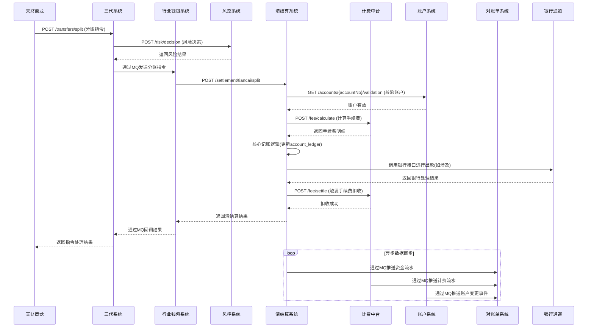
```mermaid
sequenceDiagram
    participant TCSL as 天财商龙
    participant Gen3 as 三代系统
    participant WalletBiz as 行业钱包系统
    participant Risk as 风控系统
    participant Settle as 清结算系统
    participant Fee as 计费中台
    participant Account as 账户系统
    participant Statement as 对账单系统
    participant Bank as 银行通道

    TCSL->>Gen3: POST /transfers/split (分账指令)
    Gen3->>Risk: POST /risk/decision (风险决策)
    Risk-->>Gen3: 返回风险结果
    Gen3->>WalletBiz: 通过MQ发送分账指令
    WalletBiz->>Settle: POST /settlement/tiancai/split
    Settle->>Account: GET /accounts/{accountNo}/validation (校验账户)
    Account-->>Settle: 账户有效
    Settle->>Fee: POST /fee/calculate (计算手续费)
    Fee-->>Settle: 返回手续费明细
    Settle->>Settle: 核心记账逻辑(更新account_ledger)
    Settle->>Bank: 调用银行接口进行出款(如涉及)
    Bank-->>Settle: 返回银行处理结果
    Settle->>Fee: POST /fee/settle (触发手续费扣收)
    Fee-->>Settle: 扣收成功
    Settle-->>WalletBiz: 返回清结算结果
    WalletBiz-->>Gen3: 通过MQ回调结果
    Gen3-->>TCSL: 返回指令处理结果

    loop 异步数据同步
        Settle->>Statement: 通过MQ推送资金流水
        Fee->>Statement: 通过MQ推送计费流水
        Account->>Statement: 通过MQ推送账户变更事件
    end
```

**关键数据流说明**:
1.  **业务指令流**: 从天财商龙发起，经三代系统编排，通过行业钱包系统传递至清结算系统执行。
2.  **风险控制流**: 在关键业务节点（如发起转账）同步调用风控系统进行实时决策。
3.  **资金处理流**: 清结算系统作为核心，协调账户校验、手续费计算、核心记账和银行出款。
4.  **计费流**: 手续费计算与扣收分离，由计费中台提供专业化服务。
5.  **数据沉淀流**: 所有资金、计费、账户变动事件异步推送至对账单系统，形成统一的数据视图。

## 2.5 系统模块交互关系

以下模块交互图详细描述了各系统间的主要调用与依赖关系。

```mermaid
graph LR
    subgraph “外部依赖”
        Ext_ESign[电子签约平台]
        Ext_Bank[银行通道]
    end

    subgraph “核心业务模块”
        Gen3[三代系统]
        BizCore[业务核心系统]
        WalletBiz[行业钱包系统]
    end

    subgraph “支撑服务模块”
        Account[账户系统]
        Auth[认证系统]
        Settle[清结算系统]
        Fee[计费中台]
        Risk[风控系统]
        RefundPre[退货前置]
        ESign[电子签章系统]
        Statement[对账单系统]
    end

    Gen3 -- “1. 商户/指令入口” --> WalletBiz
    Gen3 -- “2. 业务编排” --> BizCore
    BizCore -- “3. 执行指令/查关系” --> WalletBiz

    WalletBiz -- “4. 账户操作” --> Account
    WalletBiz -- “5. 发起认证” --> Auth
    WalletBiz -- “6. 执行分账” --> Settle
    WalletBiz -- “7. 风险检查” --> Risk

    Settle -- “8. 账户校验/记账” --> Account
    Settle -- “9. 手续费计算” --> Fee
    Settle -- “10. 退货查询/扣减” --> RefundPre
    Settle -- “11. 调用银行” --> Ext_Bank

    Auth -- “12. 创建签约任务” --> ESign
    ESign -- “13. 回调状态” --> Auth
    ESign -- “14. 调用外部平台” --> Ext_ESign

    RefundPre -- “15. 风险检查” --> Risk
    RefundPre -- “16. 资金扣减” --> Settle

    Account -- “17. 推送流水” --> Statement
    Settle -- “18. 推送流水” --> Statement
    Fee -- “19. 推送计费数据” --> Statement

    Risk -- “20. 监听业务消息” --> MQ[(MQ)]
    Gen3 -- “21. 发布指令事件” --> MQ
```

**交互关系详解**:

| 交互编号 | 调用方 -> 被调用方 | 交互内容与协议 | 关键接口/事件 |
| :--- | :--- | :--- | :--- |
| 1, 2, 3 | 三代系统 <-> 业务核心/行业钱包 | **业务编排**。三代作为总入口，将请求路由至具体业务模块。 | HTTP API / 异步消息 |
| 4 | 行业钱包 -> 账户系统 | **账户服务**。查询、创建、管理分账专用账户。 | `GET /api/v1/accounts/{accountNo}` |
| 5 | 行业钱包 -> 认证系统 | **关系认证**。发起付款方与收款方的绑定认证流程。 | `POST /api/v1/auth/requests` |
| 6 | 行业钱包 -> 清结算系统 | **资金执行**。触发分账、归集、付款等资金流转操作。 | `POST /api/v1/settlement/tiancai/split` |
| 7 | 行业钱包 -> 风控系统 | **交易风控**。对分账指令进行实时风险决策。 | `POST /api/v1/risk/decision` |
| 8 | 清结算 -> 账户系统 | **账户校验与记账**。校验账户状态，并作为权威记账源。 | `GET /api/v1/accounts/{accountNo}/validation` |
| 9 | 清结算 <-> 计费中台 | **手续费处理**。先计算，交易成功后再触发实际扣收。 | `POST /api/v1/fee/calculate`, `POST /api/v1/fee/settle` |
| 10 | 清结算 -> 退货前置 | **退货预处理**。在正式退货前查询可退余额并预扣减。 | `POST /api/v1/settlement/refund/query` |
| 12, 13 | 认证系统 <-> 电子签章系统 | **电子签约**。认证系统发起签约，签章系统回调结果。 | `POST /api/v1/contract/tasks`, `POST /api/callback/esign` |
| 15 | 退货前置 -> 风控系统 | **退货风控**。对退货操作进行风险检查。 | `POST /api/v1/risk/decision` |
| 17, 18, 19| 账户/清结算/计费 -> 对账单系统 | **数据汇总**。各系统将资金、流水、计费数据推送至对账中心。 | 异步消息事件 |
| 20, 21 | 各模块 <-> 消息队列 | **异步解耦**。用于指令分发、事件通知、数据同步。 | 业务领域事件 |

**依赖总结**:
*   **三代系统**是业务的**起点和编排中心**，依赖多个下游模块执行业务。
*   **行业钱包系统**是**核心执行枢纽**，连接了业务入口与底层支付能力。
*   **清结算系统**是**资金处理核心**，依赖账户、计费、风控完成一笔完整交易。
*   **账户系统**和**风控系统**是**基础能力提供方**，被几乎所有业务模块所依赖。
*   **对账单系统**是**数据汇聚点**，依赖多个系统提供数据源。
*   **消息队列**是关键的**技术粘合剂**，实现了系统间的异步通信和解耦。
---
# 3 模块设计

## 3.1 账户系统


# 账户系统模块设计文档

## 1. 概述

### 1.1 目的
本模块作为支付系统的底层账户核心，负责为“天财分账”等业务场景创建和管理专用的资金账户体系。其主要目的是：
- **账户生命周期管理**：为天财机构下的收单商户创建、维护、冻结、解冻、注销天财专用账户。
- **账户能力控制**：为天财专用账户打上特殊标记，并控制其专属能力（如支持分账、绑定多张银行卡、设置默认提现卡等）。
- **数据存储与查询**：提供账户基础信息、状态、余额、关联关系等数据的持久化存储和高效查询服务。
- **业务支撑**：为上游的行业钱包系统、清结算系统、业务核心系统等提供稳定、可靠的账户操作接口。

### 1.2 范围
- **账户类型**：专注于管理“天财收款账户”（行业钱包）和“天财接收方账户”（行业钱包），区别于普通小微钱包。
- **核心功能**：
    - 账户开户/销户
    - 账户状态管理（启用、冻结、禁用）
    - 账户信息查询与更新
    - 账户余额查询（通常为只读，实际余额由清结算系统管理）
    - 账户关系绑定校验（如校验账户是否存在、状态是否正常、是否具备特定角色）
    - 账户特殊标记管理（如天财机构号、角色类型标记）
- **非功能范围**：
    - 不处理资金流转（由清结算系统负责）。
    - 不处理具体的分账、归集、付款业务逻辑（由行业钱包系统和业务核心系统负责）。
    - 不处理电子签约、身份认证流程（由电子签约平台和三代系统负责）。
    - 不直接生成对账单（由对账单系统负责，但提供账户动账数据源）。

## 2. 接口设计

### 2.1 API 端点 (RESTful)

#### 2.1.1 账户管理接口
- **POST /api/v1/accounts/tiancai** - 创建天财专用账户
- **GET /api/v1/accounts/{accountNo}** - 查询账户详情
- **PATCH /api/v1/accounts/{accountNo}/status** - 更新账户状态
- **GET /api/v1/accounts** - 根据条件查询账户列表（内部接口）

#### 2.1.2 账户关系与校验接口
- **GET /api/v1/accounts/{accountNo}/validation** - 校验账户有效性（状态、类型、角色）
- **POST /api/v1/accounts/bindings/validation** - 批量校验账户绑定关系（用于分账前置检查）

### 2.2 输入/输出数据结构

#### 2.2.1 创建天财专用账户请求 (CreateTiancaiAccountRequest)
```json
{
  "requestId": "REQ202310270001", // 请求流水号，用于幂等
  "merchantNo": "M100001", // 收单商户号（来自三代系统）
  "institutionNo": "TC001", // 天财机构号
  "accountType": "RECEIVABLE | RECEIVER", // 账户类型：收款账户 | 接收方账户
  "roleType": "HEADQUARTERS | STORE", // 角色类型：总部 | 门店
  "settlementMode": "ACTIVE", // 结算模式，默认主动结算
  "extraInfo": {
    "legalPersonName": "张三",
    "businessLicenseNo": "91330101MA2XXXXXXX"
    // ... 其他开户所需信息
  }
}
```

#### 2.2.2 账户详情响应 (AccountDetailResponse)
```json
{
  "accountNo": "TCWALLET202310270001",
  "merchantNo": "M100001",
  "institutionNo": "TC001",
  "accountType": "RECEIVABLE",
  "roleType": "HEADQUARTERS",
  "status": "ACTIVE", // ACTIVE, FROZEN, DISABLED, CLOSED
  "settlementMode": "ACTIVE",
  "balance": "0.00", // 仅供参考，实时余额以清结算为准
  "capabilities": ["SPLIT_ACCOUNT", "BIND_MULTI_CARD", "WITHDRAW"],
  "tags": ["TIANCAI_SPECIAL", "INDUSTRY_WALLET"],
  "createdAt": "2023-10-27T10:00:00Z",
  "updatedAt": "2023-10-27T10:00:00Z"
}
```

#### 2.2.3 账户状态更新请求 (UpdateAccountStatusRequest)
```json
{
  "requestId": "STATUS202310270001",
  "targetStatus": "FROZEN", // 目标状态
  "reason": "风险控制", // 状态变更原因
  "operator": "system_risk_control"
}
```

### 2.3 发布/消费的事件

#### 2.3.1 发布的事件
- **AccountCreatedEvent**: 账户创建成功时发布。
    - 内容：账户基础信息、账户号、商户号、机构号。
    - 消费者：行业钱包系统（用于同步开户结果）、对账单系统（用于初始化账户档案）。
- **AccountStatusChangedEvent**: 账户状态变更时发布。
    - 内容：账户号、原状态、新状态、变更原因、时间。
    - 消费者：行业钱包系统、清结算系统、业务核心系统（用于控制相关业务是否可执行）。

#### 2.3.2 消费的事件
- **MerchantCreatedEvent** (来自三代系统)：监听新商户创建，为符合条件的商户自动或异步触发开户流程。
- **SettlementCompletedEvent** (来自清结算系统)：消费此事件主要用于内部对账或更新缓存，不直接修改余额。

## 3. 数据模型

### 3.1 数据库表设计

#### 表: `tiancai_account` (天财专用账户主表)
| 字段名 | 类型 | 必填 | 默认值 | 说明 |
| :--- | :--- | :--- | :--- | :--- |
| `id` | bigint | Y | AUTO_INCREMENT | 主键 |
| `account_no` | varchar(32) | Y | | **账户号**，唯一标识，规则: TCWALLET+日期+序列 |
| `merchant_no` | varchar(32) | Y | | 收单商户号，与三代系统关联 |
| `institution_no` | varchar(16) | Y | | 天财机构号 |
| `account_type` | varchar(20) | Y | | 账户类型: `RECEIVABLE`(收款账户), `RECEIVER`(接收方账户) |
| `role_type` | varchar(20) | Y | | 角色类型: `HEADQUARTERS`(总部), `STORE`(门店) |
| `status` | varchar(20) | Y | `ACTIVE` | 状态: `ACTIVE`, `FROZEN`, `DISABLED`, `CLOSED` |
| `settlement_mode` | varchar(20) | Y | `ACTIVE` | 结算模式: `ACTIVE`(主动), `PASSIVE`(被动) |
| `balance` | decimal(15,2) | Y | 0.00 | **展示余额**，与清结算系统定期同步 |
| `capabilities` | json | Y | | 账户能力列表，如 `["SPLIT_ACCOUNT", "BIND_MULTI_CARD"]` |
| `tags` | json | Y | | 账户标记列表，如 `["TIANCAI_SPECIAL", "INDUSTRY_WALLET"]` |
| `version` | int | Y | 0 | 乐观锁版本号 |
| `created_at` | datetime | Y | CURRENT_TIMESTAMP | 创建时间 |
| `updated_at` | datetime | Y | CURRENT_TIMESTAMP ON UPDATE | 更新时间 |
| **索引** | | | | |
| `uk_account_no` | UNIQUE(`account_no`) | | | 账户号唯一索引 |
| `idx_merchant_no` | (`merchant_no`) | | | 商户号查询索引 |
| `idx_institution_no` | (`institution_no`, `status`) | | | 机构与状态联合索引 |

#### 表: `account_binding_card` (账户绑定银行卡表)
| 字段名 | 类型 | 必填 | 默认值 | 说明 |
| :--- | :--- | :--- | :--- | :--- |
| `id` | bigint | Y | AUTO_INCREMENT | 主键 |
| `account_no` | varchar(32) | Y | | 关联的账户号 |
| `card_no` | varchar(32) | Y | | 银行卡号（加密存储） |
| `bank_name` | varchar(64) | Y | | 银行名称 |
| `card_type` | varchar(10) | Y | | 卡类型: `DEBIT`(借记卡), `CREDIT`(信用卡) |
| `is_default` | tinyint(1) | Y | 0 | 是否默认提现卡: 0-否, 1-是 |
| `status` | varchar(20) | Y | `VALID` | 状态: `VALID`, `INVALID` |
| `created_at` | datetime | Y | CURRENT_TIMESTAMP | 创建时间 |
| **索引** | | | | |
| `idx_account_no` | (`account_no`, `status`) | | | 账户与状态联合索引 |

#### 表: `account_status_log` (账户状态变更日志表)
| 字段名 | 类型 | 必填 | 默认值 | 说明 |
| :--- | :--- | :--- | :--- | :--- |
| `id` | bigint | Y | AUTO_INCREMENT | 主键 |
| `account_no` | varchar(32) | Y | | 账户号 |
| `old_status` | varchar(20) | Y | | 原状态 |
| `new_status` | varchar(20) | Y | | 新状态 |
| `reason` | varchar(255) | Y | | 变更原因 |
| `operator` | varchar(64) | Y | | 操作人/系统 |
| `created_at` | datetime | Y | CURRENT_TIMESTAMP | 创建时间 |
| **索引** | | | | |
| `idx_account_no` | (`account_no`, `created_at`) | | | 账户操作历史查询索引 |

### 3.2 与其他模块的关系
- **行业钱包系统**：上游调用方。账户系统接收其开户请求，并为其提供账户校验服务。账户状态变更事件通知钱包系统。
- **三代系统**：数据源头。提供商户基础信息，并可能触发开户指令。
- **清结算系统**：紧密关联。清结算系统持有资金账簿，账户系统的`balance`字段为只读展示，需与其定期同步。账户状态影响清结算的资金操作。
- **业务核心系统**：下游依赖方。在处理“天财分账”交易前，需通过账户系统校验付款方和收款方账户的有效性。
- **对账单系统**：数据消费方。订阅账户创建事件，并可能直接读取账户主表以获取账户档案信息。

## 4. 业务逻辑

### 4.1 核心算法
- **账户号生成算法**：`TCWALLET` + `YYYYMMDD` + `6位自增序列`。自增序列每日重置，通过分布式序列服务或数据库序列实现，确保全局唯一。
- **余额同步**：采用“最终一致性”策略。不直接处理账务。通过消费`SettlementCompletedEvent`或定时任务调用清结算系统的余额查询接口，更新`tiancai_account.balance`字段。对于实时性要求极高的查询，可提供接口透传至清结算系统。

### 4.2 业务规则
1. **开户规则**：
    - 一个收单商户(`merchant_no`)在同一机构(`institution_no`)下，只能拥有一个`RECEIVABLE`类型的账户。
    - 一个收单商户可以拥有多个`RECEIVER`类型的账户（对应多个接收方）。
    - 开户请求必须包含有效的天财机构号，否则拒绝。
    - 账户创建成功后，自动打上`TIANCAI_SPECIAL`和`INDUSTRY_WALLET`标记。
2. **状态流转规则**：
    - `ACTIVE` -> `FROZEN`: 可因风控、纠纷等原因触发。
    - `FROZEN` -> `ACTIVE`: 需人工审核解冻。
    - `ACTIVE`/`FROZEN` -> `DISABLED`: 业务违规，停止所有服务。
    - `DISABLED` -> `CLOSED`: 结清所有资金后销户。
    - 状态变更必须记录日志(`account_status_log`)。
3. **账户校验规则**：
    - 参与分账、付款的账户状态必须为`ACTIVE`。
    - 收款方账户(`RECEIVER`)必须已绑定至少一张有效且已认证的银行卡，且必须有默认卡，才能参与付款。
    - 校验关系绑定时，需确认付款方账户角色与业务场景匹配（如归集场景，付款方必须是`STORE`）。

### 4.3 验证逻辑
- **创建账户请求验证**：
    - 校验`requestId`幂等性，防止重复开户。
    - 校验`institutionNo`是否为已配置的有效天财机构。
    - 根据`merchantNo`和`accountType`校验是否已存在账户。
    - 校验`roleType`与`accountType`的合法性（如`RECEIVER`账户可能不需要角色）。
- **更新状态请求验证**：
    - 校验目标状态是否符合状态流转规则。
    - 校验操作人权限。
    - 如果是销户(`CLOSED`)，必须联合清结算系统校验余额是否为0且无在途资金。

## 5. 时序图

### 5.1 天财专用账户开户时序图
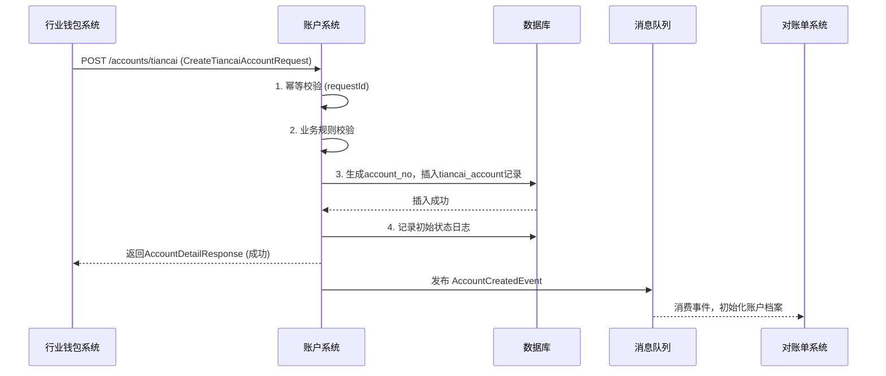
```mermaid
sequenceDiagram
    participant Wallet as 行业钱包系统
    participant Account as 账户系统
    participant DB as 数据库
    participant MQ as 消息队列
    participant Billing as 对账单系统

    Wallet->>Account: POST /accounts/tiancai (CreateTiancaiAccountRequest)
    Account->>Account: 1. 幂等校验 (requestId)
    Account->>Account: 2. 业务规则校验
    Account->>DB: 3. 生成account_no，插入tiancai_account记录
    DB-->>Account: 插入成功
    Account->>DB: 4. 记录初始状态日志
    Account-->>Wallet: 返回AccountDetailResponse (成功)
    
    Account->>MQ: 发布 AccountCreatedEvent
    MQ-->>Billing: 消费事件，初始化账户档案
```

### 5.2 分账交易前账户校验时序图
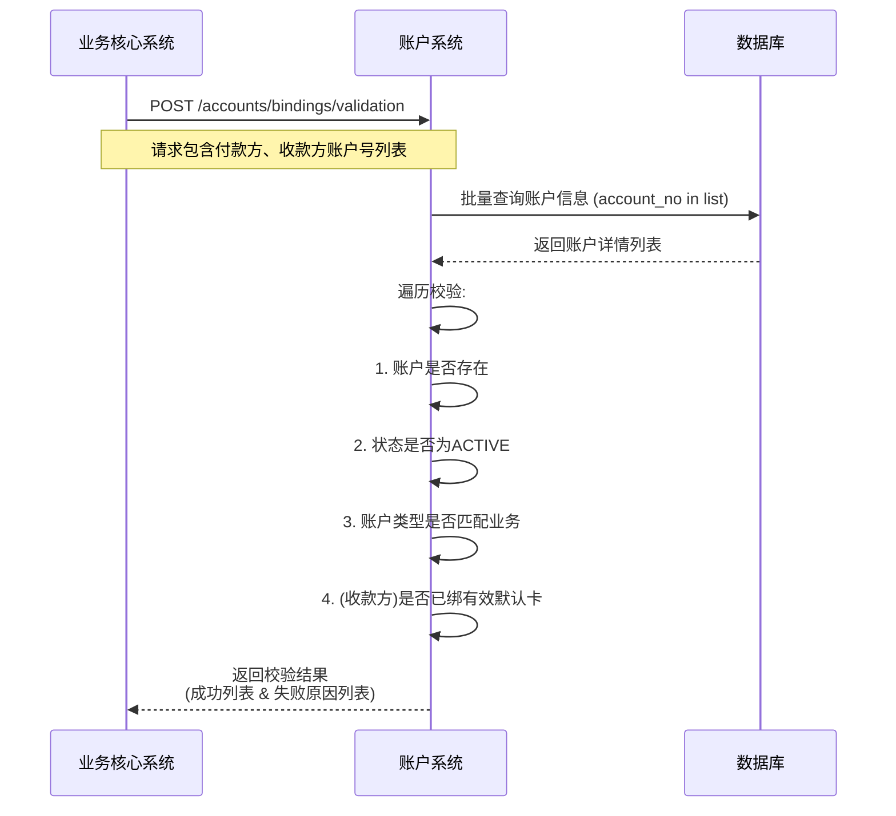
```mermaid
sequenceDiagram
    participant Core as 业务核心系统
    participant Account as 账户系统
    participant DB as 数据库

    Core->>Account: POST /accounts/bindings/validation
    Note over Core,Account: 请求包含付款方、收款方账户号列表
    Account->>DB: 批量查询账户信息 (account_no in list)
    DB-->>Account: 返回账户详情列表
    Account->>Account: 遍历校验:
    Account->>Account: 1. 账户是否存在
    Account->>Account: 2. 状态是否为ACTIVE
    Account->>Account: 3. 账户类型是否匹配业务
    Account->>Account: 4. (收款方)是否已绑有效默认卡
    Account-->>Core: 返回校验结果<br>(成功列表 & 失败原因列表)
```

## 6. 错误处理

| 错误码 | HTTP状态码 | 描述 | 处理策略 |
| :--- | :--- | :--- | :--- |
| `ACCOUNT_4001` | 400 Bad Request | 请求参数无效或缺失 | 客户端检查请求体格式和必填字段 |
| `ACCOUNT_4002` | 400 Bad Request | 账户号不存在 | 客户端检查输入的账户号是否正确 |
| `ACCOUNT_4091` | 409 Conflict | 重复请求 (requestId已处理) | 客户端使用原请求结果，无需重试 |
| `ACCOUNT_4092` | 409 Conflict | 商户已存在同类型账户 | 客户端查询已有账户，勿重复开户 |
| `ACCOUNT_4031` | 403 Forbidden | 状态流转非法 (如ACTIVE直接到CLOSED) | 客户端检查业务逻辑，按正确状态流转图操作 |
| `ACCOUNT_5001` | 500 Internal Server Error | 数据库操作失败 | 服务端记录详细日志，告警，客户端可有限重试 |
| `ACCOUNT_5002` | 500 Internal Server Error | 依赖服务（如清结算）不可用 | 服务端熔断/降级，返回部分数据或提示稍后重试 |

**通用策略**：
- **客户端错误(4xx)**：由调用方修正请求后重试。
- **服务端错误(5xx)**：实现重试机制（带退避策略），并设有监控告警。
- **幂等性**：所有写操作（创建、状态更新）必须支持幂等，通过`requestId`保证。
- **事务一致性**：本地数据库操作保证事务性。跨系统操作（如销户前校验余额）通过Saga等模式保证最终一致性。

## 7. 依赖说明

### 7.1 上游模块交互
1. **行业钱包系统**：
    - **交互方式**：同步REST API调用（开户、查询、校验）。
    - **职责**：钱包系统是账户系统的主要服务对象，封装了更上层的业务逻辑（如关系绑定、分账执行），账户系统为其提供底层的账户实体支撑。

2. **三代系统**：
    - **交互方式**：异步事件消费 (`MerchantCreatedEvent`) 或 直接API调用（查询商户信息）。
    - **职责**：作为商户信息的权威来源，触发账户创建的初始源头。

### 7.2 下游模块交互
1. **清结算系统**：
    - **交互方式**：异步事件消费 (`SettlementCompletedEvent`) 和 同步REST API调用（查询实时余额）。
    - **职责**：账户系统依赖清结算系统获取资金权威数据。账户状态变更事件会影响清结算的资金处理逻辑。

2. **消息队列(MQ)**：
    - **交互方式**：发布领域事件 (`AccountCreatedEvent`, `AccountStatusChangedEvent`)。
    - **职责**：实现系统间松耦合通信，通知其他模块账户领域的状态变化。

### 7.3 关键依赖管理
- **强依赖**：数据库、清结算系统（对于实时性要求不高的场景可降级）。
- **弱依赖**：对账单系统、三代系统事件。这些系统故障不应影响账户核心功能的运行（开户、查询、校验），可通过异步重试或日志补偿解决。
- **降级方案**：当清结算系统不可用时，余额查询接口可返回缓存数据或上次同步的数据，并明确提示“数据可能延迟”。账户校验中的余额校验项可暂时跳过。

## 3.2 认证系统


# 认证系统模块设计文档

## 1. 概述

### 1.1 目的
本模块（认证系统）是天财分账业务中“关系绑定”流程的核心执行者，负责对资金转出方与接收方之间的授权关系进行身份认证与协议签署。它通过集成电子签约平台，提供打款验证、人脸验证等多种认证方式，确保分账业务中资金流转的合法性与安全性，并为后续的分账、批量付款、会员结算等操作提供前置条件。

### 1.2 范围
- **核心功能**：
    1.  **签约与认证流程驱动**：为“关系绑定”和“开通付款”两个核心业务环节提供统一的认证流程编排。
    2.  **多模式身份验证**：支持针对企业/个体户的“打款验证”和针对个人的“人脸验证”。
    3.  **电子协议管理**：与电子签约平台集成，完成协议生成、签署、存储与查询。
    4.  **认证状态与结果管理**：维护所有认证请求的状态、过程数据及最终结果。
    5.  **业务规则校验**：在校验账户状态、角色类型、业务场景合规性后，触发认证流程。
- **边界**：
    - **发起**：接收来自“行业钱包系统”的认证请求。
    - **执行**：调用“电子签约平台”执行具体认证，调用“清结算系统”执行打款。
    - **存储**：独立管理认证流程数据。
    - **通知**：认证完成后，异步通知“行业钱包系统”和“三代系统”更新绑定关系状态。

## 2. 接口设计

### 2.1 API 端点 (RESTful)

#### 2.1.1 发起认证
- **端点**: `POST /api/v1/auth/requests`
- **描述**: 由行业钱包系统调用，发起一个新的关系绑定或开通付款认证流程。
- **请求头**: `X-Tiancai-Org-Id: {天财机构号}` (用于权限与数据隔离)
- **请求体**:
    ```json
    {
      "requestId": "string", // 认证请求唯一ID，由调用方生成
      "authScene": "RELATION_BINDING" | "ENABLE_PAYMENT", // 认证场景：关系绑定、开通付款
      "businessType": "SETTLE_TO_HQ" | "BATCH_PAY" | "MEMBER_SETTLE", // 业务类型：归集、批量付款、会员结算
      "payerAccountNo": "string", // 付款方天财专用账户号
      "payerRole": "HQ" | "STORE", // 付款方角色：总部、门店
      "payeeAccountNo": "string", // 收款方天财专用账户号（关系绑定必填）
      "payeeRole": "HQ" | "STORE", // 收款方角色
      "payeeType": "CORP" | "INDIVIDUAL" | "PERSONAL", // 收款方类型：企业、个体工商户、个人
      "payeeBankCardNo": "string? // 收款方银行卡号（打款验证时必填）
      "payeeIdNo": "string?", // 收款方身份证号（人脸验证时必填）
      "payeeName": "string", // 收款方姓名/企业名
      "authMethod": "REMITTANCE" | "FACE", // 认证方式：打款、人脸
      "callbackUrl": "string" // 认证结果回调地址
    }
    ```
- **响应体 (成功)**:
    ```json
    {
      "code": "SUCCESS",
      "data": {
        "authRequestId": "string", // 本系统生成的认证记录ID
        "status": "PROCESSING",
        "nextStep": "SIGN_CONTRACT" | "WAIT_VERIFY", // 下一步：签署协议或等待验证
        "signUrl": "string?", // 电子签约H5页面URL（如需签署）
        "expireTime": "2023-10-01T12:00:00Z" // 签约/验证链接过期时间
      }
    }
    ```

#### 2.1.2 查询认证结果
- **端点**: `GET /api/v1/auth/requests/{authRequestId}`
- **描述**: 查询指定认证请求的详细状态和结果。
- **响应体**:
    ```json
    {
      "authRequestId": "string",
      "requestId": "string",
      "authScene": "string",
      "businessType": "string",
      "status": "INIT | PROCESSING | SIGNED | VERIFYING | SUCCESS | FAILED | EXPIRED",
      "authMethod": "string",
      "failureReason": "string?",
      "contractId": "string?", // 电子协议ID
      "contractSignedTime": "string?",
      "verificationAmount": "number?", // 打款金额（分）
      "verificationCompletedTime": "string?",
      "createTime": "string",
      "updateTime": "string"
    }
    ```

#### 2.1.3 接收电子签约回调
- **端点**: `POST /api/callback/esign` (电子签约平台回调)
- **描述**: 接收电子签约平台推送的协议签署状态变更通知。
- **请求体**:
    ```json
    {
      "contractId": "string",
      "status": "SIGNED" | "REJECTED" | "EXPIRED",
      "signedTime": "string?",
      "signers": [{"role": "payer"|"payee", "status": "string"}],
      "evidenceSnapshot": "string?" // 存证快照URL
    }
    ```

#### 2.1.4 接收打款验证结果
- **端点**: `POST /api/callback/verification` (由内部清结算系统或对账后触发)
- **描述**: 接收打款验证金额核验结果。
- **请求体**:
    ```json
    {
      "authRequestId": "string",
      "verificationResult": "SUCCESS" | "FAILED",
      "verifiedAmount": "number",
      "verifiedTime": "string",
      "transactionNo": "string?" // 关联的打款交易流水号
    }
    ```

### 2.2 发布/消费的事件

#### 2.2.1 消费的事件
- `AccountOpenedEvent` (来自账户系统): 监听天财专用账户开户成功事件，用于预加载账户基础信息。
- `SettlementCompletedEvent` (来自清结算系统): 监听打款验证的小额打款交易结算完成事件，触发后续验证逻辑。

#### 2.2.2 发布的事件
- `AuthenticationInitiatedEvent`: 认证流程已成功发起，通知相关系统记录日志。
- `AuthenticationSuccessEvent`: 认证成功。**主要消费者：行业钱包系统、三代系统**，用于更新关系绑定状态为“已认证”。
- `AuthenticationFailedEvent`: 认证失败。通知相关系统更新状态为“认证失败”。
- `ContractSignedEvent`: 协议签署完成。触发下一步（如打款验证）。

## 3. 数据模型

### 3.1 数据库表设计

#### 表: `auth_request` (认证主表)
| 字段名 | 类型 | 必填 | 描述 |
| :--- | :--- | :--- | :--- |
| `id` | bigint(自增) | Y | 主键，系统内部认证记录ID |
| `auth_request_id` | varchar(32) | Y | 对外业务ID，唯一 |
| `request_id` | varchar(32) | Y | 调用方传入的请求ID，用于关联 |
| `tiancai_org_id` | varchar(16) | Y | 天财机构号 |
| `auth_scene` | varchar(32) | Y | 认证场景 |
| `business_type` | varchar(32) | Y | 业务类型 |
| `payer_account_no` | varchar(32) | Y | 付款方账户 |
| `payer_role` | varchar(16) | Y | 付款方角色 |
| `payee_account_no` | varchar(32) | Y | 收款方账户 |
| `payee_role` | varchar(16) | Y | 收款方角色 |
| `payee_type` | varchar(16) | Y | 收款方类型 |
| `payee_bank_card_no` | varchar(32) | N | 收款方银行卡号 |
| `payee_id_no` | varchar(32) | N | 收款方身份证号 |
| `payee_name` | varchar(128) | Y | 收款方名称 |
| `auth_method` | varchar(16) | Y | 认证方式 |
| `status` | varchar(32) | Y | 认证状态 |
| `failure_reason` | varchar(512) | N | 失败原因 |
| `contract_id` | varchar(64) | N | 电子协议ID |
| `contract_status` | varchar(32) | N | 协议状态 |
| `verification_amount` | decimal(10,2) | N | 打款验证金额 |
| `verification_result` | varchar(32) | N | 验证结果 |
| `callback_url` | varchar(512) | Y | 结果回调地址 |
| `expire_time` | datetime | Y | 流程过期时间 |
| `created_at` | datetime | Y | 创建时间 |
| `updated_at` | datetime | Y | 更新时间 |
| **索引** | | | |
| `uk_auth_request_id` | UNIQUE(`auth_request_id`) | | 业务ID唯一 |
| `idx_request_id` | (`request_id`) | | 查询调用方请求 |
| `idx_payer_account` | (`payer_account_no`) | | 按付款方查询 |
| `idx_status_expire` | (`status`, `expire_time`) | | 处理超时任务 |

#### 表: `auth_operation_log` (操作日志表)
| 字段名 | 类型 | 必填 | 描述 |
| :--- | :--- | :--- | :--- |
| `id` | bigint | Y | 主键 |
| `auth_request_id` | varchar(32) | Y | 关联认证ID |
| `operation` | varchar(64) | Y | 操作类型 |
| `detail` | text | N | 操作详情/请求参数 |
| `operator` | varchar(64) | N | 操作者（系统/用户） |
| `created_at` | datetime | Y | 创建时间 |
| **索引** | `idx_auth_req_id` (`auth_request_id`) | | |

### 3.2 与其他模块的关系
- **行业钱包系统**: 上游调用方，发起认证请求；下游事件消费者，接收认证结果。
- **三代系统**: 下游事件消费者，接收认证结果以更新其内部的分账关系状态。
- **电子签约平台**: 外部服务依赖，用于协议签署。
- **清结算系统**: 服务依赖，用于执行打款验证的小额付款；事件生产者，通知打款结果。
- **账户系统**: 事件消费者（监听开户事件），用于缓存账户信息。

## 4. 业务逻辑

### 4.1 核心算法与流程
1.  **请求接收与校验**：
    - 校验天财机构号有效性。
    - 校验付款方和收款方账户是否存在、是否均为天财专用账户、状态是否正常。
    - 根据 `businessType` 和 `payerRole`/`payeeRole` 校验业务场景合规性（如：归集场景下，付款方必须是门店，收款方必须是总部）。
    - 校验 `authMethod` 与 `payeeType` 的匹配性（企业/个体户可打款或人脸，个人仅人脸）。
2.  **流程编排**：
    - **打款验证流程**：生成协议 -> 签署协议 -> 发起打款 -> 等待并核验回填金额 -> 认证完成。
    - **人脸验证流程**：生成协议 -> 签署协议 -> 跳转人脸核身H5 -> 获取核身结果 -> 认证完成。
    - **“开通付款”场景特例**：可能仅需付款方单方签署协议，无需对收款方进行二次验证。
3.  **协议生成**：根据认证场景、业务类型、双方信息，调用电子签约平台模板，生成带有动态字段的电子协议。
4.  **打款执行**：调用清结算系统接口，向 `payeeBankCardNo` 发起一笔固定（如0.01-0.99元随机）的付款交易，并记录 `verificationAmount`。
5.  **结果核验**：
    - **打款**：比对回填金额与 `verificationAmount` 是否一致。
    - **人脸**：依赖电子签约平台返回的公安比对结果。

### 4.2 业务规则
- **唯一性规则**：同一对付款方-收款方，在同一 `authScene` 和 `businessType` 下，只允许存在一条成功的认证记录。
- **角色校验规则**：
    - `RELATION_BINDING`：付款方和收款方角色不能相同（总部不能绑定总部）。
    - `ENABLE_PAYMENT`：仅在 `BATCH_PAY` 和 `MEMBER_SETTLE` 场景下，由付款方发起。
- **账户状态规则**：账户必须为“正常”状态，且未注销。
- **超时规则**：整个认证流程（从发起到完成）需在 **24小时** 内完成，否则状态置为 `EXPIRED`。

### 4.3 验证逻辑
```java
// 伪代码示例：业务场景校验
function validateBusinessScene(authScene, businessType, payerRole, payeeRole) {
    if (authScene == 'RELATION_BINDING') {
        if (payerRole == payeeRole) {
            throw new Error('付款方与收款方角色不能相同');
        }
        if (businessType == 'SETTLE_TO_HQ' && !(payerRole == 'STORE' && payeeRole == 'HQ')) {
            throw new Error('归集场景下，付款方须为门店，收款方须为总部');
        }
        // ... 其他业务类型校验
    } else if (authScene == 'ENABLE_PAYMENT') {
        if (!['BATCH_PAY', 'MEMBER_SETTLE'].includes(businessType)) {
            throw new Error('开通付款仅适用于批量付款和会员结算场景');
        }
        // 开通付款通常是付款方单方流程，payeeRole可能为空或忽略
    }
}
```

## 5. 时序图

### 5.1 关系绑定 - 打款验证时序图

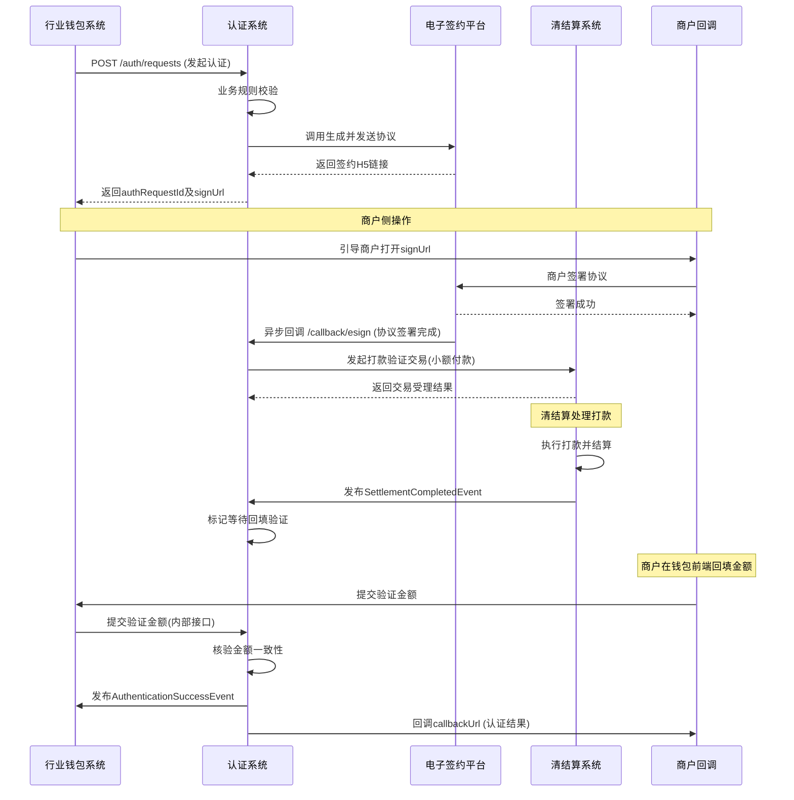
```mermaid
sequenceDiagram
    participant Wallet as 行业钱包系统
    participant Auth as 认证系统
    participant Esign as 电子签约平台
    participant Settle as 清结算系统
    participant Callback as 商户回调

    Wallet->>Auth: POST /auth/requests (发起认证)
    Auth->>Auth: 业务规则校验
    Auth->>Esign: 调用生成并发送协议
    Esign-->>Auth: 返回签约H5链接
    Auth-->>Wallet: 返回authRequestId及signUrl

    Note over Wallet, Callback: 商户侧操作
    Wallet->>Callback: 引导商户打开signUrl
    Callback->>Esign: 商户签署协议
    Esign-->>Callback: 签署成功
    Esign->>Auth: 异步回调 /callback/esign (协议签署完成)
    
    Auth->>Settle: 发起打款验证交易(小额付款)
    Settle-->>Auth: 返回交易受理结果

    Note over Settle: 清结算处理打款
    Settle->>Settle: 执行打款并结算
    Settle->>Auth: 发布SettlementCompletedEvent

    Auth->>Auth: 标记等待回填验证
    Note over Callback: 商户在钱包前端回填金额
    Callback->>Wallet: 提交验证金额
    Wallet->>Auth: 提交验证金额(内部接口)
    Auth->>Auth: 核验金额一致性
    Auth->>Wallet: 发布AuthenticationSuccessEvent
    Auth->>Callback: 回调callbackUrl (认证结果)
```

## 6. 错误处理

| 错误类型 | 错误码 | 处理策略 |
| :--- | :--- | :--- |
| **参数校验失败** | `4000` | 请求参数非法，返回具体字段错误信息，拒绝流程发起。 |
| **业务规则冲突** | `4001` | 如角色不符、场景不支持、重复绑定等，返回明确业务提示。 |
| **账户状态异常** | `4002` | 账户不存在、非天财账户、已注销等，返回对应提示。 |
| **依赖服务异常** | `5001` | 如电子签约平台不可用，记录日志，流程状态置为“失败”，支持异步重试。 |
| **认证流程超时** | `4080` | 定时任务扫描 `status=PROCESSING` 且 `expire_time < now()` 的记录，自动置为 `EXPIRED`，并发布失败事件。 |
| **打款验证失败** | `4003` | 金额不一致、超时未回填等，更新状态为 `FAILED`，记录原因。 |
| **回调通知失败** | `5002` | 向 `callbackUrl` 回调失败时，采用指数退避策略重试，并记录告警。 |

## 7. 依赖说明

### 7.1 上游模块交互
- **行业钱包系统**：
    - **调用方式**：同步HTTP调用（发起认证、查询结果）。
    - **职责**：认证系统是钱包系统在关系绑定流程中的专属服务，钱包系统负责组装业务参数并触发认证。
    - **数据流**：认证完成后，认证系统通过事件异步通知钱包系统更新其内部的“关系绑定”状态。

### 7.2 下游模块/服务交互
1.  **电子签约平台 (外部)**：
    - **交互协议**：HTTPS API + 异步回调。
    - **关键接口**：创建合同、添加签署方、获取签署链接、查询状态。
    - **数据同步**：合同ID、签署状态、存证链信息需回传并保存在 `auth_request` 表中。

2.  **清结算系统**：
    - **交互协议**：内部RPC调用 + 事件监听。
    - **职责**：为“打款验证”执行一笔真实的小额付款交易。
    - **关键点**：需在交易附言中嵌入 `authRequestId`，以便后续对账和结果关联。

3.  **三代系统**：
    - **交互协议**：事件监听 (`AuthenticationSuccessEvent`)。
    - **职责**：接收最终认证成功事件，在其核心系统中将对应的分账关系状态更新为“已认证”，使其可用于分账交易。

4.  **账户系统**：
    - **交互协议**：事件监听 (`AccountOpenedEvent`)。
    - **职责**：预缓存新开天财专用账户的基本信息（账户号、角色、类型），用于后续认证请求的快速校验，减少实时查询压力。

## 3.3 计费中台


# 计费中台模块设计文档

## 1. 概述

### 1.1 目的
计费中台模块是天财分账业务的核心计费与费用处理引擎，负责统一处理所有资金流转场景（归集、批量付款、会员结算）中产生的手续费计算、分摊、扣收、记账及对账。它作为清结算系统的一部分，确保费用处理的准确性、透明性和可追溯性，为业务运营和财务核算提供支持。

### 1.2 范围
- **核心功能**：
    - **费用计算**：根据交易金额、分账比例、费率配置，计算分账交易产生的手续费。
    - **费用分摊**：根据“手续费承担方”配置，将手续费在付款方与收款方之间进行分摊。
    - **费用扣收**：执行实际的手续费扣款，从指定的天财专用账户中划扣费用。
    - **费用记账**：生成并记录所有与费用相关的会计分录，确保账务平衡。
    - **计费对账**：生成计费明细，并与上游交易、下游账户流水进行核对。
- **业务场景覆盖**：天财分账下的所有资金流转场景（归集、批量付款、会员结算）。
- **不包含**：
    - 基础交易清算（由清结算主流程处理）。
    - 账户余额的底层扣减（由账户系统处理）。
    - 费率规则的配置与管理（由三代系统提供）。

## 2. 接口设计

### 2.1 API端点 (RESTful)

#### 2.1.1 内部服务接口（供业务核心/清结算调用）

**POST /api/v1/fee/calculate**
- **描述**：在分账交易处理前或处理中，计算单笔分账交易应产生的手续费及分摊详情。
- **请求头**：`X-Request-ID`, `Content-Type: application/json`
- **请求体**：
```json
{
  "transactionId": "TXN202404280001", // 分账交易流水号
  "scene": "MERCHANT_SETTLEMENT", // 场景：FUND_COLLECTION(归集), BATCH_PAYMENT(批量付款), MERCHANT_SETTLEMENT(会员结算)
  "payerAccountNo": "TC_PAY_1001", // 付款方天财账户号
  "payerRole": "HEADQUARTERS", // 付款方角色：HEADQUARTERS, STORE
  "receiverAccountNo": "TC_RCV_2001", // 收款方天财账户号
  "receiverRole": "STORE", // 收款方角色
  "transferAmount": 10000, // 分账金额（单位：分）
  "feeBearer": "PAYER", // 手续费承担方：PAYER, RECEIVER
  "splitRatio": 0.7, // 收款方分账比例（如70%）
  "originalOrderInfo": { // 原始订单信息（会员结算场景可能用到）
    "orderNo": "ORD123456",
    "orderAmount": 15000
  }
}
```
- **响应体（成功）**：
```json
{
  "code": "SUCCESS",
  "data": {
    "transactionId": "TXN202404280001",
    "totalFee": 30, // 总手续费（单位：分）
    "feeDetails": [
      {
        "feeType": "TRANSFER_FEE",
        "calculatedAmount": 30,
        "rate": "0.003", // 费率
        "payerShare": 30, // 付款方承担部分
        "receiverShare": 0, // 收款方承担部分
        "accountingEntryTemplate": "FEE_COLLECT_FROM_PAYER" // 会计科目模板编码
      }
    ],
    "netAmount": 9970 // 收款方实际入账净额（分账金额 - receiverShare）
  }
}
```

**POST /api/v1/fee/settle**
- **描述**：在分账交易资金结算完成后，触发实际的手续费扣收和记账操作。此接口应具备幂等性。
- **请求体**：
```json
{
  "transactionId": "TXN202404280001",
  "feeSettlementRequestId": "FSR202404280001", // 本次费用结算请求ID，用于幂等
  "calculatedFeeData": { ... } // 可直接包含calculate接口返回的data，或引用其ID
}
```
- **响应体（成功）**：
```json
{
  "code": "SUCCESS",
  "data": {
    "feeSettlementId": "FSTL202404280001",
    "status": "SUCCESS",
    "accountingEntries": [
      {
        "entryId": "AE001",
        "accountNo": "TC_PAY_1001",
        "accountType": "TIANCAI_PAYABLE",
        "amount": -30,
        "currency": "CNY",
        "subject": "手续费支出",
        "oppositeAccountNo": "FEE_INCOME_ACCOUNT"
      },
      {
        "entryId": "AE002",
        "accountNo": "FEE_INCOME_ACCOUNT",
        "accountType": "INTERNAL",
        "amount": 30,
        "currency": "CNY",
        "subject": "手续费收入",
        "oppositeAccountNo": "TC_PAY_1001"
      }
    ]
  }
}
```

#### 2.1.2 查询与对账接口

**GET /api/v1/fee/transactions/{transactionId}**
- **描述**：查询指定分账交易的手续费计算和结算详情。

**GET /api/v1/fee/settlement/daily**
- **描述**：生成指定日期的计费汇总与明细文件，供对账单系统拉取。
- **查询参数**：`settlementDate=2024-04-28`, `institutionId=TC001` (天财机构号)

### 2.2 发布/消费的事件

#### 2.2.1 消费的事件
- **TransactionSettledEvent**：由清结算系统发布，通知一笔分账交易资金已结算完成。本模块监听此事件，触发 `fee/settle` 流程。
    - 事件内容：`transactionId`, `settlementTime`, `status`。

#### 2.2.2 发布的事件
- **FeeCalculatedEvent**：手续费计算完成后发布，供风控或审计系统订阅。
    - 事件内容：`transactionId`, `totalFee`, `feeBearer`, `calculatedAt`。
- **FeeSettledEvent**：手续费扣收并记账完成后发布，通知对账单系统等下游。
    - 事件内容：`feeSettlementId`, `transactionId`, `status`, `settledAt`, `accountingEntries`。
- **FeeSettlementFailedEvent**：手续费结算失败时发布，告警系统订阅。
    - 事件内容：`transactionId`, `errorCode`, `errorMessage`, `retryCount`。

## 3. 数据模型

### 3.1 核心数据库表设计

```sql
-- 计费记录表：记录每笔分账交易的手续费计算与结算状态
CREATE TABLE t_fee_transaction (
    id BIGINT PRIMARY KEY AUTO_INCREMENT,
    fee_settlement_id VARCHAR(64) UNIQUE COMMENT '费用结算ID，幂等键',
    transaction_id VARCHAR(64) NOT NULL COMMENT '关联的分账交易流水号',
    scene VARCHAR(32) NOT NULL COMMENT '业务场景',
    payer_account_no VARCHAR(64) NOT NULL COMMENT '付款方账户',
    receiver_account_no VARCHAR(64) NOT NULL COMMENT '收款方账户',
    transfer_amount BIGINT NOT NULL COMMENT '分账金额(分)',
    total_fee BIGINT NOT NULL COMMENT '总手续费(分)',
    fee_bearer VARCHAR(16) NOT NULL COMMENT '手续费承担方',
    net_amount BIGINT NOT NULL COMMENT '收款方净入账金额(分)',
    fee_calc_detail JSON NOT NULL COMMENT '手续费计算明细快照(JSON)',
    calc_status VARCHAR(16) DEFAULT 'CALCULATED' COMMENT '计算状态: CALCULATED, FAILED',
    settlement_status VARCHAR(16) DEFAULT 'PENDING' COMMENT '结算状态: PENDING, SUCCESS, FAILED',
    accounting_entries JSON COMMENT '会计分录快照',
    institution_id VARCHAR(32) NOT NULL COMMENT '天财机构号',
    calc_completed_at DATETIME COMMENT '计算完成时间',
    settled_at DATETIME COMMENT '结算完成时间',
    retry_count INT DEFAULT 0,
    last_error_msg TEXT,
    created_at DATETIME DEFAULT CURRENT_TIMESTAMP,
    updated_at DATETIME DEFAULT CURRENT_TIMESTAMP ON UPDATE CURRENT_TIMESTAMP,
    INDEX idx_transaction_id (transaction_id),
    INDEX idx_settlement_status (settlement_status, created_at),
    INDEX idx_institution_date (institution_id, settled_at)
) COMMENT '计费交易记录表';

-- 费率配置缓存表（从三代系统同步，非权威源）
CREATE TABLE t_fee_rate_config (
    id BIGINT PRIMARY KEY AUTO_INCREMENT,
    institution_id VARCHAR(32) NOT NULL,
    scene VARCHAR(32) NOT NULL COMMENT '适用场景',
    payer_role VARCHAR(32) COMMENT '付款方角色，空表示通用',
    receiver_role VARCHAR(32) COMMENT '收款方角色，空表示通用',
    fee_type VARCHAR(32) NOT NULL COMMENT '费用类型',
    calculation_mode VARCHAR(16) NOT NULL COMMENT '计算方式: PERCENTAGE, FIXED, TIERED',
    rate_value VARCHAR(64) COMMENT '费率值，如0.003，或阶梯JSON',
    min_fee BIGINT COMMENT '最低收费(分)',
    max_fee BIGINT COMMENT '最高收费(分)',
    effective_date DATE NOT NULL,
    expiry_date DATE,
    version INT DEFAULT 1,
    synced_at DATETIME NOT NULL COMMENT '从三代系统同步的时间',
    UNIQUE KEY uk_config (institution_id, scene, payer_role, receiver_role, fee_type, effective_date, version)
) COMMENT '费率配置缓存表';

-- 计费日汇总表（用于对账与报表）
CREATE TABLE t_fee_daily_summary (
    id BIGINT PRIMARY KEY AUTO_INCREMENT,
    settlement_date DATE NOT NULL COMMENT '结算日期',
    institution_id VARCHAR(32) NOT NULL,
    scene VARCHAR(32) NOT NULL,
    total_transaction_count INT NOT NULL COMMENT '交易笔数',
    total_transfer_amount BIGINT NOT NULL COMMENT '总分账金额',
    total_fee_amount BIGINT NOT NULL COMMENT '总手续费',
    fee_bearer_breakdown JSON NOT NULL COMMENT '按承担方统计，如{"PAYER": 5000, "RECEIVER": 2000}',
    summary_status VARCHAR(16) DEFAULT 'GENERATED' COMMENT '状态: GENERATED, RECONCILED',
    recon_result JSON COMMENT '对账结果',
    created_at DATETIME DEFAULT CURRENT_TIMESTAMP,
    updated_at DATETIME DEFAULT CURRENT_TIMESTAMP ON UPDATE CURRENT_TIMESTAMP,
    UNIQUE KEY uk_date_institution_scene (settlement_date, institution_id, scene)
) COMMENT '计费日汇总表';
```

### 3.2 与其他模块的关系
- **清结算系统**：主调用方。在分账交易清算后，调用本模块进行计费。依赖清结算提供的交易基础信息。
- **三代系统**：费率配置的权威源。本模块定期同步或实时查询费率规则。
- **账户系统**：执行实际的手续费扣款操作。本模块生成扣款指令，通过内部接口或事件驱动账户系统扣减对应天财专用账户余额。
- **对账单系统**：消费本模块发布的 `FeeSettledEvent` 并拉取计费明细，生成包含手续费详情的对账单。
- **会计核心**：接收本模块生成的标准化会计分录，进行总账登记。

## 4. 业务逻辑

### 4.1 核心算法

**手续费计算算法**：
```
输入：transferAmount, scene, payerRole, receiverRole, feeBearer, splitRatio, institutionId
输出：totalFee, feeDetails, netAmount

步骤：
1. 根据 institutionId, scene, payerRole, receiverRole 从缓存或三代系统获取生效的费率配置列表。
2. 对每条费率配置：
   a. 确定计费基数 (BaseAmount):
      - 通常为 transferAmount。
      - 若为会员结算且配置指定按原始订单金额计费，则使用 originalOrderInfo.orderAmount。
   b. 根据 calculation_mode 计算原始费用：
      - PERCENTAGE: rawFee = BaseAmount * rate_value
      - FIXED: rawFee = rate_value
      - TIERED: 根据阶梯规则计算。
   c. 应用上下限：fee = max(min_fee, min(max_fee, rawFee))
3. 汇总所有 feeType 的 fee，得到 totalFee。
4. 费用分摊：
   - 若 feeBearer == 'PAYER': payerShare = totalFee, receiverShare = 0
   - 若 feeBearer == 'RECEIVER': payerShare = 0, receiverShare = totalFee
   - (未来扩展：支持比例分摊)
5. 计算净额：netAmount = transferAmount - receiverShare
6. 组装 feeDetails 和结果。
```

### 4.2 业务规则
1. **费率优先级规则**：角色特定配置 > 场景通用配置。即优先匹配 payerRole 和 receiverRole 都匹配的配置，其次匹配仅场景匹配的通用配置。
2. **幂等性规则**：`fee/settle` 接口必须幂等。使用 `feeSettlementRequestId` 作为幂等键，避免重复扣费。
3. **账户校验规则**：在执行扣费前，需确认付款方（或承担方）账户状态正常、余额充足，且账户类型为天财专用账户（具有特定标记）。
4. **时效性规则**：手续费计算应在交易清算时完成；手续费扣收应在交易结算后尽快完成，最晚不超过T+1日。
5. **差错处理规则**：若手续费扣收失败，进入重试队列。超过最大重试次数后，标记为失败并发出告警，需人工介入。

### 4.3 验证逻辑
- **输入验证**：
    - `transferAmount` 必须为正整数。
    - `payerAccountNo` 和 `receiverAccountNo` 必须符合天财专用账户号格式（如以`TC_`开头）。
    - `feeBearer` 必须在枚举值内。
    - `splitRatio` 必须在 (0, 1] 区间内。
- **业务验证**：
    - 根据 `institutionId` 校验调用方是否有权操作该账户。
    - 验证费率配置存在且有效。
    - 在结算时，验证关联的 `transactionId` 对应的分账交易已成功结算。

## 5. 时序图

### 5.1 手续费计算与结算时序图（会员结算场景）

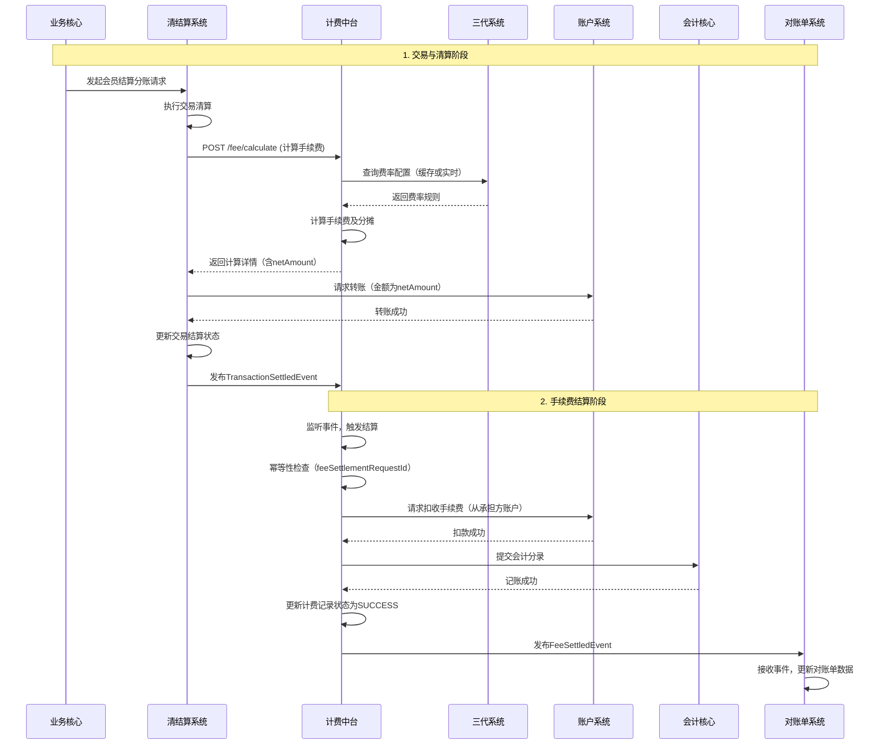
```mermaid
sequenceDiagram
    participant B as 业务核心
    participant C as 清结算系统
    participant FM as 计费中台
    participant TS as 三代系统
    participant A as 账户系统
    participant AC as 会计核心
    participant BS as 对账单系统

    Note over B,BS: 1. 交易与清算阶段
    B->>C: 发起会员结算分账请求
    C->>C: 执行交易清算
    C->>FM: POST /fee/calculate (计算手续费)
    FM->>TS: 查询费率配置（缓存或实时）
    TS-->>FM: 返回费率规则
    FM->>FM: 计算手续费及分摊
    FM-->>C: 返回计算详情（含netAmount）
    C->>A: 请求转账（金额为netAmount）
    A-->>C: 转账成功
    C->>C: 更新交易结算状态
    C->>FM: 发布TransactionSettledEvent

    Note over FM,BS: 2. 手续费结算阶段
    FM->>FM: 监听事件，触发结算
    FM->>FM: 幂等性检查（feeSettlementRequestId）
    FM->>A: 请求扣收手续费（从承担方账户）
    A-->>FM: 扣款成功
    FM->>AC: 提交会计分录
    AC-->>FM: 记账成功
    FM->>FM: 更新计费记录状态为SUCCESS
    FM->>BS: 发布FeeSettledEvent
    BS->>BS: 接收事件，更新对账单数据
```

## 6. 错误处理

| 错误场景 | 错误码 | 处理策略 | 重试机制 |
| :--- | :--- | :--- | :--- |
| 费率配置不存在 | `FEE_CONFIG_NOT_FOUND` | 计算失败，交易挂起。通知运营人员配置费率。 | 不重试，人工干预。 |
| 账户余额不足 | `ACCOUNT_BALANCE_INSUFFICIENT` | 结算失败，记录错误。 | 进入延迟重试队列，每隔10分钟重试，最多5次。 |
| 账户状态异常 | `ACCOUNT_STATUS_ABNORMAL` | 结算失败，记录错误。 | 不自动重试，发出告警。 |
| 网络超时/下游服务不可用 | `DOWNSTREAM_SERVICE_UNAVAILABLE` | 记录错误，标记为处理中。 | 指数退避重试，最多10次。 |
| 幂等键冲突 | `IDEMPOTENT_KEY_CONFLICT` | 视为成功，返回已有的结算结果。 | 不重试。 |
| 数据不一致（如交易未结算） | `DATA_INCONSISTENCY` | 结算失败，记录错误。 | 不重试，发出告警并人工核对。 |

**通用策略**：
- 所有可重试错误进入持久化重试队列（如RabbitMQ DLQ或数据库任务表）。
- 设置监控告警，对持续失败或达到重试上限的任务进行通知。
- 提供人工干预界面，支持手动触发重试或冲正。

## 7. 依赖说明

### 7.1 上游模块依赖
1. **清结算系统**：
    - **交互方式**：同步RPC调用（计算接口） + 异步事件监听（结算触发）。
    - **依赖数据**：分账交易的完整上下文（金额、双方账户、场景、承担方等）。
    - **SLA要求**：计费计算接口P99延迟 < 100ms，以保证不影响主交易流程。

2. **三代系统**：
    - **交互方式**：定期同步（缓存）或实时RPC查询。
    - **依赖数据**：权威的、最新的费率配置规则。
    - **降级方案**：若实时查询失败，使用本地缓存的最新配置；若缓存为空，则拒绝计算并报错。

### 7.2 下游模块协作
1. **账户系统**：
    - **交互方式**：同步RPC调用。
    - **职责**：根据计费中台的指令，执行精准的手续费扣款。
    - **要求**：提供强一致的扣款API，并返回明确结果。

2. **会计核心**：
    - **交互方式**：同步RPC调用或异步消息。
    - **职责**：接收标准化的会计分录，确保财务账务准确。
    - **要求**：接口幂等，支持批量处理。

3. **对账单系统**：
    - **交互方式**：异步事件订阅 + 主动文件拉取接口。
    - **职责**：获取每笔手续费明细，生成用户可读的对账单。
    - **要求**：事件消费需保证至少一次交付，具备对账纠错能力。

### 7.3 关键依赖管理
- **熔断与降级**：对三代系统、账户系统的调用配置熔断器（如Hystrix或Resilience4j），防止级联故障。
- **数据一致性**：通过本地事务（更新计费状态）+ 可靠事件（FeeSettledEvent）保证最终一致性。关键操作需记录操作日志。
- **监控**：依赖调用成功率、延迟、计费差错率等指标需纳入统一监控。

## 3.4 业务核心系统


# 业务核心系统 - 天财分账模块设计文档

## 1. 概述

### 1.1 目的
本模块作为支付系统“业务核心系统”中专门处理“天财分账”业务的子模块，旨在为天财商龙提供一套完整、可靠、高效的专用资金处理解决方案。核心职责是作为业务处理的中枢，协调各下游系统（三代系统、行业钱包系统、账户系统、清结算系统等），完成从关系绑定、资金流转到退货处理的全流程业务逻辑编排与执行。

### 1.2 范围
- **业务范围**：
    - **关系绑定（签约与认证）**：处理总部与门店之间、付款方与接收方之间的授权关系建立流程。
    - **资金流转**：处理“归集”（门店->总部）、“批量付款”（总部->多接收方）、“会员结算”（总部->门店）三种核心场景的资金分账请求。
    - **退货前置**：处理涉及天财收款账户或04退货账户的退货交易查询与扣减。
- **系统范围**：
    - 接收并验证来自天财商龙（通过特定机构号）的业务请求。
    - 执行业务规则校验、流程编排、状态管理。
    - 与下游系统（三代、钱包、账户、清结算）进行同步/异步交互，驱动业务完成。
    - 记录业务流水，提供对账和问题排查依据。

## 2. 接口设计

### 2.1 API 端点 (RESTful)

#### 2.1.1 关系绑定接口
- `POST /api/v1/tiancai/relationship/bind`
    - **描述**：发起关系绑定（签约与认证）流程。
    - **输入**：`RelationshipBindRequest`
    - **输出**：`RelationshipBindResponse`

- `POST /api/v1/tiancai/relationship/bind/callback`
    - **描述**：接收电子签约平台或认证系统的异步回调，更新绑定状态。
    - **输入**：`RelationshipCallbackRequest`
    - **输出**：标准成功/失败响应。

- `GET /api/v1/tiancai/relationship/query/{bindRequestNo}`
    - **描述**：查询关系绑定请求的状态和详情。
    - **输出**：`RelationshipQueryResponse`

#### 2.1.2 资金分账接口
- `POST /api/v1/tiancai/fund/transfer`
    - **描述**：处理天财分账资金转账请求（涵盖归集、批量付款、会员结算）。
    - **输入**：`FundTransferRequest`
    - **输出**：`FundTransferResponse`

#### 2.1.3 开通付款接口
- `POST /api/v1/tiancai/payment/enable`
    - **描述**：在批量付款或会员结算前，为付款方（总部/门店）开通付款能力。
    - **输入**：`PaymentEnableRequest`
    - **输出**：`PaymentEnableResponse`

#### 2.1.4 退货前置接口
- `POST /api/v1/tiancai/refund/preprocess`
    - **描述**：处理退货交易，查询并扣减天财收款账户或04退货账户余额。
    - **输入**：`RefundPreprocessRequest`
    - **输出**：`RefundPreprocessResponse`

### 2.2 输入/输出数据结构 (示例)

```json
// RelationshipBindRequest
{
  "requestNo": "BIND202404180001", // 请求流水号，唯一
  "institutionNo": "TC001", // 天财机构号
  "scene": "COLLECTION", // 场景：COLLECTION(归集), BATCH_PAY(批量付款), MEMBER_SETTLE(会员结算)
  "payerInfo": {
    "accountNo": "TC_ACCT_001",
    "roleType": "HEADQUARTERS", // 角色类型：HEADQUARTERS, STORE
    "name": "天财总部有限公司"
  },
  "payeeInfo": {
    "accountNo": "TC_ACCT_002",
    "roleType": "STORE",
    "name": "北京分店",
    "certType": "CORPORATE", // 认证类型：CORPORATE(对公-打款), INDIVIDUAL(个人/个体户-人脸)
    "bankCardNo": "622848******1234" // 当certType=CORPORATE时必传
  },
  "operator": "system_user_01"
}

// FundTransferRequest
{
  "requestNo": "TRANS202404180001",
  "institutionNo": "TC001",
  "scene": "BATCH_PAY",
  "batchNo": "BATCH001", // 批次号，用于批量付款
  "totalAmount": 50000,
  "totalFee": 100,
  "feeBearer": "PAYER", // 手续费承担方：PAYER, PAYEE
  "payerAccountNo": "TC_ACCT_001",
  "items": [
    {
      "itemNo": "1",
      "payeeAccountNo": "TC_ACCT_003",
      "amount": 20000,
      "memo": "供应商货款"
    },
    {
      "itemNo": "2",
      "payeeAccountNo": "TC_ACCT_004",
      "amount": 30000,
      "memo": "股东分红"
    }
  ]
}

// RefundPreprocessRequest
{
  "requestNo": "REFUND_PRE202404180001",
  "institutionNo": "TC001",
  "originalOrderNo": "PAY202404170001", // 原支付订单号
  "refundAmount": 1000,
  "refundAccountType": "TIANCAI_ACCOUNT", // 扣款账户类型：TIANCAI_ACCOUNT, REFUND_ACCOUNT_04
  "targetAccountNo": "TC_ACCT_001" // 目标天财账户或04账户
}
```

### 2.3 发布/消费的事件

#### 2.3.1 消费的事件
- `RelationshipBindInitiatedEvent`：由三代系统发布，通知业务核心启动关系绑定流程。
- `AccountCreatedEvent`：由账户系统发布，通知天财专用账户已成功创建。
- `SettlementCompletedEvent`：由清结算系统发布，通知资金结算/分账完成。

#### 2.3.2 发布的事件
- `FundTransferRequestedEvent`：当接收到分账请求并验证通过后发布，触发清结算系统进行资金处理。
- `RelationshipBindCompletedEvent`：当关系绑定（含认证）流程完成时发布，通知相关系统更新状态。
- `RefundPreprocessCompletedEvent`：当退货前置处理完成时发布，通知交易系统进行后续退货操作。

## 3. 数据模型

### 3.1 数据库表设计

```sql
-- 天财分账业务流水表 (tiancai_business_flow)
CREATE TABLE tiancai_business_flow (
    id BIGINT PRIMARY KEY AUTO_INCREMENT,
    request_no VARCHAR(64) NOT NULL UNIQUE COMMENT '业务请求流水号',
    institution_no VARCHAR(32) NOT NULL COMMENT '天财机构号',
    business_type VARCHAR(32) NOT NULL COMMENT '业务类型: RELATIONSHIP_BIND, FUND_TRANSFER, PAYMENT_ENABLE, REFUND_PREPROCESS',
    scene VARCHAR(32) COMMENT '业务场景: COLLECTION, BATCH_PAY, MEMBER_SETTLE',
    payer_account_no VARCHAR(64) COMMENT '付款方账户号',
    payee_account_no VARCHAR(64) COMMENT '收款方账户号（单笔）/批量时为NULL',
    amount DECIMAL(18,2) COMMENT '金额',
    fee DECIMAL(18,2) COMMENT '手续费',
    fee_bearer VARCHAR(16) COMMENT '手续费承担方',
    status VARCHAR(32) NOT NULL COMMENT '状态: INIT, PROCESSING, SUCCESS, FAILED, PARTIAL_SUCCESS',
    error_code VARCHAR(32) COMMENT '错误码',
    error_msg VARCHAR(512) COMMENT '错误信息',
    request_data JSON NOT NULL COMMENT '原始请求数据',
    response_data JSON COMMENT '响应数据',
    completed_time DATETIME COMMENT '完成时间',
    created_time DATETIME NOT NULL DEFAULT CURRENT_TIMESTAMP,
    updated_time DATETIME NOT NULL DEFAULT CURRENT_TIMESTAMP ON UPDATE CURRENT_TIMESTAMP,
    INDEX idx_request_no (request_no),
    INDEX idx_institution_no_status (institution_no, status),
    INDEX idx_created_time (created_time)
) COMMENT '天财分账业务流水表';

-- 天财关系绑定记录表 (tiancai_relationship)
CREATE TABLE tiancai_relationship (
    id BIGINT PRIMARY KEY AUTO_INCREMENT,
    relationship_no VARCHAR(64) NOT NULL UNIQUE COMMENT '关系唯一编号',
    institution_no VARCHAR(32) NOT NULL COMMENT '天财机构号',
    scene VARCHAR(32) NOT NULL COMMENT '适用场景: COLLECTION, BATCH_PAY, MEMBER_SETTLE',
    payer_account_no VARCHAR(64) NOT NULL COMMENT '付款方账户号',
    payee_account_no VARCHAR(64) NOT NULL COMMENT '收款方账户号',
    payer_role_type VARCHAR(32) NOT NULL COMMENT '付款方角色: HEADQUARTERS, STORE',
    payee_role_type VARCHAR(32) NOT NULL COMMENT '收款方角色: HEADQUARTERS, STORE',
    bind_status VARCHAR(32) NOT NULL COMMENT '绑定状态: INIT, AUTH_PENDING, AUTH_SUCCESS, AUTH_FAILED, ENABLE_PENDING, ENABLED',
    auth_type VARCHAR(32) COMMENT '认证类型: REMITTANCE(打款), FACE(人脸)',
    auth_channel VARCHAR(32) COMMENT '认证渠道: ELECTRONIC_SIGN(电子签)',
    auth_request_no VARCHAR(64) COMMENT '认证平台请求号',
    enable_status VARCHAR(32) COMMENT '付款开通状态: NOT_REQUIRED, PENDING, ENABLED',
    extra_info JSON COMMENT '扩展信息（如认证结果、协议ID等）',
    expired_time DATETIME COMMENT '关系过期时间',
    created_time DATETIME NOT NULL DEFAULT CURRENT_TIMESTAMP,
    updated_time DATETIME NOT NULL DEFAULT CURRENT_TIMESTAMP ON UPDATE CURRENT_TIMESTAMP,
    UNIQUE KEY uk_payer_payee_scene (payer_account_no, payee_account_no, scene),
    INDEX idx_bind_status (bind_status),
    INDEX idx_enable_status (enable_status)
) COMMENT '天财关系绑定记录表';

-- 天财批量付款明细表 (tiancai_batch_payment_detail)
CREATE TABLE tiancai_batch_payment_detail (
    id BIGINT PRIMARY KEY AUTO_INCREMENT,
    batch_no VARCHAR(64) NOT NULL COMMENT '批次号',
    item_no VARCHAR(32) NOT NULL COMMENT '批次内序号',
    request_no VARCHAR(64) NOT NULL COMMENT '关联的业务流水号',
    payee_account_no VARCHAR(64) NOT NULL COMMENT '收款方账户号',
    amount DECIMAL(18,2) NOT NULL COMMENT '分账金额',
    status VARCHAR(32) NOT NULL COMMENT '状态: INIT, SUCCESS, FAILED',
    settle_order_no VARCHAR(64) COMMENT '清结算订单号',
    error_msg VARCHAR(512) COMMENT '错误信息',
    created_time DATETIME NOT NULL DEFAULT CURRENT_TIMESTAMP,
    updated_time DATETIME NOT NULL DEFAULT CURRENT_TIMESTAMP ON UPDATE CURRENT_TIMESTAMP,
    INDEX idx_batch_no (batch_no),
    INDEX idx_request_no (request_no),
    UNIQUE KEY uk_batch_item (batch_no, item_no)
) COMMENT '天财批量付款明细表';
```

### 3.2 与其他模块的关系
- **三代系统**：提供商户信息、账户基础信息查询，以及关系绑定的初始化和部分校验规则。
- **行业钱包系统**：处理天财专用账户的业务逻辑，如关系绑定校验、分账请求转发、数据同步。
- **账户系统**：实际创建和管理天财收款/接收方账户实体，提供账户余额查询、扣款/加款操作。
- **清结算系统**：执行资金的分账、清算、结算、计费等核心金融操作。
- **电子签约平台**：提供关系绑定过程中的协议签署、身份认证（打款/人脸）服务。
- **对账单系统**：消费本模块发布的业务完成事件，生成对应的动账明细。

## 4. 业务逻辑

### 4.1 核心算法
1. **幂等性控制**：所有接口通过`request_no`实现幂等，避免重复处理。
2. **分布式事务补偿**：对于涉及多系统的长流程（如关系绑定），采用Saga模式，通过状态机和补偿事务保证最终一致性。
3. **批量处理优化**：对于批量付款，采用分片异步处理，提高吞吐量，并支持部分成功。

### 4.2 业务规则
1. **机构号校验**：所有请求必须携带有效的天财机构号(`institutionNo`)，且接口调用方需有对应权限。
2. **角色与场景匹配**：
    - `归集(COLLECTION)`：付款方角色必须为`STORE`，收款方角色必须为`HEADQUARTERS`。
    - `批量付款(BATCH_PAY)`：付款方角色必须为`HEADQUARTERS`，收款方角色无限制。
    - `会员结算(MEMBER_SETTLE)`：付款方角色必须为`HEADQUARTERS`，收款方角色必须为`STORE`。
3. **关系绑定前置要求**：
    - 执行任何资金流转前，付款方与收款方之间必须存在对应场景的、状态为`ENABLED`的关系绑定记录。
    - 对于`批量付款`和`会员结算`场景，关系绑定成功后，付款方还需额外完成`开通付款`流程。
4. **账户有效性**：所有涉及的账户必须是有效的天财专用账户（通过账户系统标记识别），且状态正常。
5. **手续费承担**：根据`feeBearer`参数，计算并记录手续费，在清结算环节处理扣收。

### 4.3 验证逻辑
1. **请求基础验证**：非空、格式、长度校验。
2. **业务状态验证**：
    - 检查是否已存在相同`request_no`的业务流水，避免重复。
    - 根据业务类型和场景，查询并验证相关关系绑定状态、账户状态、付款开通状态。
3. **金额验证**：
    - 分账金额必须大于0。
    - 批量付款的`totalAmount`必须等于所有`items`的`amount`之和。
    - 退货金额不能超过原订单金额及目标账户可用余额。
4. **下游系统交互验证**：调用三代、钱包、账户等系统接口，验证商户信息、账户信息、业务规则的合法性。

## 5. 时序图

### 5.1 关系绑定（签约与认证）时序图

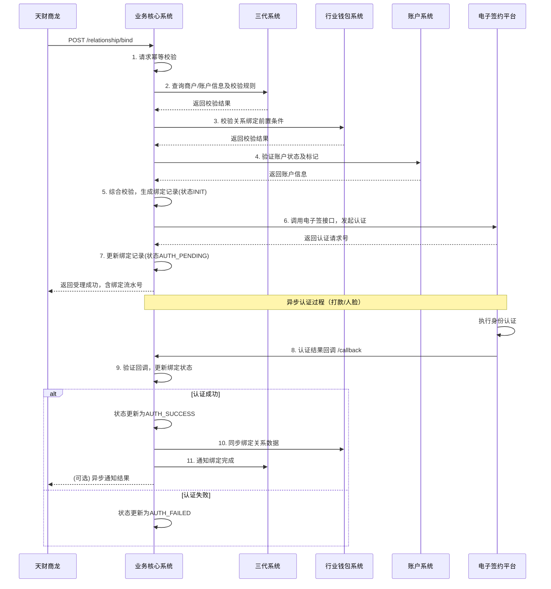
```mermaid
sequenceDiagram
    participant Client as 天财商龙
    participant BCS as 业务核心系统
    participant Gen3 as 三代系统
    participant Wallet as 行业钱包系统
    participant Acct as 账户系统
    participant ESign as 电子签约平台

    Client->>BCS: POST /relationship/bind
    BCS->>BCS: 1. 请求幂等校验
    BCS->>Gen3: 2. 查询商户/账户信息及校验规则
    Gen3-->>BCS: 返回校验结果
    BCS->>Wallet: 3. 校验关系绑定前置条件
    Wallet-->>BCS: 返回校验结果
    BCS->>Acct: 4. 验证账户状态及标记
    Acct-->>BCS: 返回账户信息
    BCS->>BCS: 5. 综合校验，生成绑定记录(状态INIT)
    BCS->>ESign: 6. 调用电子签接口，发起认证
    ESign-->>BCS: 返回认证请求号
    BCS->>BCS: 7. 更新绑定记录(状态AUTH_PENDING)
    BCS-->>Client: 返回受理成功，含绑定流水号

    Note over ESign,BCS: 异步认证过程（打款/人脸）
    ESign->>ESign: 执行身份认证
    ESign->>BCS: 8. 认证结果回调 /callback
    BCS->>BCS: 9. 验证回调，更新绑定状态
    alt 认证成功
        BCS->>BCS: 状态更新为AUTH_SUCCESS
        BCS->>Wallet: 10. 同步绑定关系数据
        BCS->>Gen3: 11. 通知绑定完成
        BCS-->>Client: (可选) 异步通知结果
    else 认证失败
        BCS->>BCS: 状态更新为AUTH_FAILED
    end
```

### 5.2 资金分账（以批量付款为例）时序图

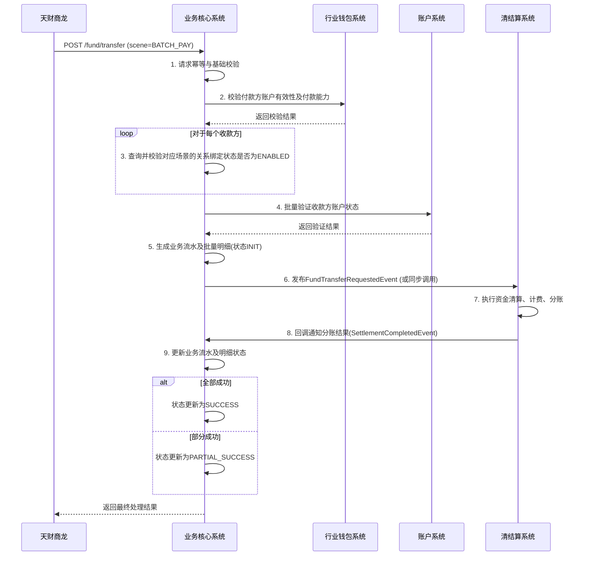
```mermaid
sequenceDiagram
    participant Client as 天财商龙
    participant BCS as 业务核心系统
    participant Wallet as 行业钱包系统
    participant Acct as 账户系统
    participant Settle as 清结算系统

    Client->>BCS: POST /fund/transfer (scene=BATCH_PAY)
    BCS->>BCS: 1. 请求幂等与基础校验
    BCS->>Wallet: 2. 校验付款方账户有效性及付款能力
    Wallet-->>BCS: 返回校验结果
    loop 对于每个收款方
        BCS->>BCS: 3. 查询并校验对应场景的关系绑定状态是否为ENABLED
    end
    BCS->>Acct: 4. 批量验证收款方账户状态
    Acct-->>BCS: 返回验证结果
    BCS->>BCS: 5. 生成业务流水及批量明细(状态INIT)
    BCS->>Settle: 6. 发布FundTransferRequestedEvent (或同步调用)
    Settle->>Settle: 7. 执行资金清算、计费、分账
    Settle->>BCS: 8. 回调通知分账结果(SettlementCompletedEvent)
    BCS->>BCS: 9. 更新业务流水及明细状态
    alt 全部成功
        BCS->>BCS: 状态更新为SUCCESS
    else 部分成功
        BCS->>BCS: 状态更新为PARTIAL_SUCCESS
    end
    BCS-->>Client: 返回最终处理结果
```

## 6. 错误处理

### 6.1 预期错误分类
- **A类（客户端错误，4xx）**：
    - `INVALID_REQUEST`: 请求参数缺失、格式错误。
    - `DUPLICATE_REQUEST_NO`: 重复的请求流水号。
    - `INVALID_INSTITUTION`: 无效的天财机构号或无权限。
    - `BUSINESS_RULE_VIOLATION`: 违反业务规则（如角色场景不匹配）。
- **B类（服务端/依赖错误，5xx）**：
    - `DOWNSTREAM_SERVICE_UNAVAILABLE`: 下游系统（三代、钱包、账户等）服务不可用。
    - `DOWNSTREAM_SERVICE_ERROR`: 下游系统返回业务错误。
    - `DATABASE_ERROR`: 数据库操作失败。
    - `INTERNAL_PROCESSING_ERROR`: 内部处理逻辑异常。

### 6.2 处理策略
1. **重试策略**：
    - 对于网络超时或下游系统临时不可用（5xx错误），采用指数退避策略进行有限次重试（如3次）。
    - 对于明确的业务失败（4xx错误），不重试，直接返回错误给调用方。
2. **状态同步与补偿**：
    - 对于异步长流程（如关系绑定），通过定期轮询或回调确保状态最终一致。设置超时机制，对长时间未响应的流程进行主动查询或补偿处理。
    - 使用`tiancai_business_flow`表记录详细错误信息和状态，支持人工或自动对账与冲正。
3. **降级与熔断**：
    - 对非核心的查询功能（如关系查询）设置降级策略，在依赖系统不稳定时返回缓存数据或简化结果。
    - 对下游系统调用配置熔断器（如Hystrix/Sentinel），防止级联故障。
4. **监控与告警**：
    - 监控各接口的错误率、响应时间。
    - 对关键业务失败（如大额分账失败、认证大面积失败）设置实时告警。

## 7. 依赖说明

### 7.1 上游模块交互
- **天财商龙（客户端）**：
    - 通过HTTPS调用本模块提供的REST API。
    - 需遵循接口规范，提供有效的机构号、请求流水号及业务参数。
    - 需处理同步响应及可能的异步结果通知。

### 7.2 下游模块交互
- **三代系统**：
    - **同步调用**：通过RPC/HTTP查询商户详情、账户基础信息、获取业务校验规则。
    - **事件监听**：消费本模块发布的`RelationshipBindCompletedEvent`，更新其内部关系映射。
    - **依赖强度**：强依赖。开户、关键校验依赖于此系统。
- **行业钱包系统**：
    - **同步调用**：校验天财账户的业务状态、关系绑定前置条件、转发分账请求。
    - **数据同步**：接收本模块的关系绑定完成数据，保持状态同步。
    - **依赖强度**：强依赖。所有天财账户相关业务逻辑均通过此系统。
- **账户系统**：
    - **同步调用**：验证账户是否存在、是否为天财专用账户标记、状态是否正常、查询余额（退货前置）。
    - **依赖强度**：强依赖。所有资金操作的基础。
- **清结算系统**：
    - **事件驱动/同步调用**：接收`FundTransferRequestedEvent`或同步接口调用，执行资金划转、计费。
    - **回调通知**：通过事件或回调接口通知本模块资金处理结果。
    - **依赖强度**：强依赖。资金流转的核心执行者。
- **电子签约平台**：
    - **同步调用**：发起协议签署和身份认证请求。
    - **异步回调**：接收认证结果回调。
    - **依赖强度**：强依赖（仅针对关系绑定流程）。
- **对账单系统**：
    - **事件消费**：消费本模块发布的业务完成事件，生成动账明细。
    - **依赖强度**：弱依赖。不影响主流程，只影响对账功能。

### 7.3 数据一致性保障
- 与下游系统的数据同步，主要通过“状态机+事件驱动”实现最终一致性。
- 关键操作（如更新业务流水状态）在本地数据库事务中完成，并与发布事件放在同一事务中（如使用事务性发件箱模式），确保不丢失。
- 定期对账任务会比对本模块流水与下游系统（清结算、账户）的数据，发现不一致时触发告警并生成修复工单。

## 3.5 钱包App/商服平台


# 钱包App/商服平台 - 天财分账模块设计文档

## 1. 概述

### 1.1 目的
本模块旨在为“钱包App/商服平台”提供天财分账业务的核心服务能力，作为连接前端应用与后端支付核心系统的业务中台。它负责封装天财分账、关系绑定、资金归集、批量付款、会员结算等复杂业务流程，向上提供统一、稳定、易用的API接口，向下协调三代系统、行业钱包系统、账户系统等多个底层系统，实现业务逻辑的编排、数据聚合与状态管理。

### 1.2 范围
- **核心业务流程**：天财专用账户的开户与状态管理、关系绑定（签约与认证）、资金流转（归集、批量付款、会员结算）、退货前置处理。
- **业务实体管理**：管理收单商户、总部、门店等业务实体在本模块的映射与状态。
- **数据聚合与展示**：聚合来自多个底层系统的数据，为前端提供统一的账户信息、交易流水、关系列表等视图。
- **异步任务处理**：处理如批量付款文件上传、异步认证结果通知、分账结果回调等异步操作。
- **本模块不直接负责**：
    - 底层账户的创建与记账（由账户系统负责）。
    - 电子协议的具体签署与存证（由电子签约平台负责）。
    - 最终的资金清算、结算与计费（由清结算系统负责）。
    - 底层收单交易的处理（由业务核心系统负责）。

## 2. 接口设计

### 2.1 API端点 (RESTful)

#### 2.1.1 账户与关系管理
- `POST /api/v1/tiancai/accounts` **创建天财专用账户**
    - **描述**：为收单商户开通天财收款账户或接收方账户。
    - **输入**：`CreateTiancaiAccountRequest`
    - **输出**：`CreateTiancaiAccountResponse`

- `GET /api/v1/tiancai/accounts/{accountNo}` **查询账户详情**
    - **输出**：`TiancaiAccountDetail`

- `POST /api/v1/tiancai/relationships/bind` **发起关系绑定**
    - **描述**：在付款方与收款方之间建立分账关系，并触发相应认证流程。
    - **输入**：`InitiateRelationshipBindRequest`
    - **输出**：`InitiateRelationshipBindResponse`

- `POST /api/v1/tiancai/relationships/{bindId}/auth-callback` **认证结果回调**
    - **描述**：接收来自电子签约平台或认证系统的异步认证结果。
    - **输入**：`AuthCallbackRequest`
    - **输出**：通用ACK响应

- `GET /api/v1/tiancai/relationships` **查询关系列表**
    - **查询参数**：`payerAccountNo`, `payeeAccountNo`, `status`, `sceneType`
    - **输出**：`PagedResponse<RelationshipVO>`

#### 2.1.2 资金流转
- `POST /api/v1/tiancai/transfer/collect` **发起资金归集**
    - **输入**：`InitiateCollectRequest`
    - **输出**：`TransferResponse`

- `POST /api/v1/tiancai/transfer/batch-payment` **发起批量付款**
    - **描述**：支持文件上传或列表方式发起。
    - **输入**：`InitiateBatchPaymentRequest` (multipart/form-data 包含文件)
    - **输出**：`BatchJobResponse`

- `GET /api/v1/tiancai/transfer/batch-jobs/{jobId}` **查询批量任务结果**
    - **输出**：`BatchJobDetail`

- `POST /api/v1/tiancai/transfer/member-settlement` **发起会员结算**
    - **输入**：`InitiateMemberSettlementRequest`
    - **输出**：`TransferResponse`

#### 2.1.3 查询与对账
- `GET /api/v1/tiancai/transactions` **查询交易流水**
    - **查询参数**：`accountNo`, `startTime`, `endTime`, `type`, `status`
    - **输出**：`PagedResponse<TransactionVO>`

- `GET /api/v1/tiancai/statements/{date}` **下载对账单**
    - **描述**：生成并返回指定日期的对账单文件（CSV格式）。
    - **输出**：文件流

### 2.2 数据结构示例

```yaml
# 请求/响应DTO示例
CreateTiancaiAccountRequest:
  merchantNo: string          # 收单商户号
  institutionNo: string       # 天财机构号
  roleType: enum(HEADQUARTERS, STORE) # 角色类型
  accountType: enum(RECEIVING_ACCOUNT, RECIPIENT_ACCOUNT) # 账户类型
  contactInfo: ContactInfo    # 联系人信息

TiancaiAccountDetail:
  accountNo: string           # 天财专用账户号
  merchantNo: string
  roleType: string
  accountType: string
  status: enum(ACTIVE, INACTIVE, FROZEN)
  balance: Amount             # 聚合后的余额信息
  linkedBankCards: array      # 绑定的银行卡列表
  createdAt: datetime

InitiateRelationshipBindRequest:
  payerAccountNo: string      # 付款方账户
  payeeAccountNo: string      # 收款方账户
  sceneType: enum(COLLECT, BATCH_PAY, MEMBER_SETTLE) # 场景类型
  authMethod: enum(REMITTANCE, FACE) # 认证方式
  payeeBizInfo: object        # 收款方业务信息（企业/个人）

RelationshipVO:
  bindId: string
  payerAccountNo: string
  payeeAccountNo: string
  sceneType: string
  authMethod: string
  status: enum(INIT, AUTH_PENDING, ACTIVE, FAILED, CANCELED)
  authExpireTime: datetime
  createdAt: datetime

InitiateCollectRequest:
  payerAccountNo: string      # 门店账户
  payeeAccountNo: string      # 总部账户
  amount: Amount
  feeBearer: enum(PAYER, PAYEE) # 手续费承担方
  remark: string
  businessOrderNo: string     # 业务方订单号，用于幂等

TransferResponse:
  transferId: string
  businessOrderNo: string
  status: enum(PROCESSING, SUCCESS, FAILED)
  estimatedFinishTime: datetime
```

### 2.3 发布/消费的事件

#### 2.3.1 消费的事件
- `AccountCreatedEvent` (来自账户系统)：监听天财专用账户创建成功事件，更新本地账户状态。
- `TransferFinishedEvent` (来自清结算系统)：监听分账/转账完成事件，更新交易状态并记录流水。
- `AuthResultEvent` (来自电子签约平台)：监听认证结果，更新关系绑定状态。

#### 2.3.2 发布的事件
- `RelationshipActivatedEvent`：关系绑定激活时发布，通知相关业务模块（如清结算系统）可执行分账。
- `BatchPaymentJobFinishedEvent`：批量付款任务完成时发布，包含成功/失败统计。
- `AccountStatusChangedEvent`：账户状态变更时发布，通知订阅方（如风控系统）。

## 3. 数据模型

### 3.1 核心表设计

```sql
-- 天财专用账户表 (tiancai_account)
CREATE TABLE tiancai_account (
    id BIGINT PRIMARY KEY AUTO_INCREMENT,
    account_no VARCHAR(32) UNIQUE NOT NULL COMMENT '天财专用账户号',
    merchant_no VARCHAR(32) NOT NULL COMMENT '收单商户号',
    institution_no VARCHAR(16) NOT NULL COMMENT '天财机构号',
    role_type VARCHAR(20) NOT NULL COMMENT '角色类型: HEADQUARTERS/STORE',
    account_type VARCHAR(20) NOT NULL COMMENT '账户类型: RECEIVING_ACCOUNT/RECIPIENT_ACCOUNT',
    status VARCHAR(20) NOT NULL DEFAULT 'ACTIVE' COMMENT '状态',
    underlying_account_id VARCHAR(64) COMMENT '底层账户系统账户ID',
    extra_info JSON COMMENT '扩展信息（联系人、地址等）',
    created_at DATETIME NOT NULL,
    updated_at DATETIME NOT NULL,
    INDEX idx_merchant_no (merchant_no),
    INDEX idx_institution_no (institution_no),
    INDEX idx_status (status)
);

-- 分账关系绑定表 (tiancai_relationship)
CREATE TABLE tiancai_relationship (
    id BIGINT PRIMARY KEY AUTO_INCREMENT,
    bind_id VARCHAR(64) UNIQUE NOT NULL COMMENT '关系绑定唯一ID',
    payer_account_no VARCHAR(32) NOT NULL COMMENT '付款方账户',
    payee_account_no VARCHAR(32) NOT NULL COMMENT '收款方账户',
    scene_type VARCHAR(30) NOT NULL COMMENT '场景: COLLECT/BATCH_PAY/MEMBER_SETTLE',
    auth_method VARCHAR(20) COMMENT '认证方式: REMITTANCE/FACE',
    status VARCHAR(20) NOT NULL DEFAULT 'INIT' COMMENT '状态',
    auth_expire_time DATETIME COMMENT '认证过期时间',
    contract_id VARCHAR(64) COMMENT '电子协议ID',
    auth_result_json JSON COMMENT '认证结果详情',
    fail_reason VARCHAR(255) COMMENT '失败原因',
    activated_at DATETIME COMMENT '激活时间',
    created_at DATETIME NOT NULL,
    updated_at DATETIME NOT NULL,
    UNIQUE KEY uk_payer_payee_scene (payer_account_no, payee_account_no, scene_type),
    INDEX idx_status_expire (status, auth_expire_time),
    INDEX idx_payer (payer_account_no),
    INDEX idx_payee (payee_account_no)
);

-- 资金流转订单表 (tiancai_transfer_order)
CREATE TABLE tiancai_transfer_order (
    id BIGINT PRIMARY KEY AUTO_INCREMENT,
    transfer_id VARCHAR(64) UNIQUE NOT NULL COMMENT '转账唯一ID',
    business_order_no VARCHAR(64) NOT NULL COMMENT '业务方订单号（幂等键）',
    scene_type VARCHAR(30) NOT NULL COMMENT '场景类型',
    payer_account_no VARCHAR(32) NOT NULL,
    payee_account_no VARCHAR(32) NOT NULL,
    amount DECIMAL(15,2) NOT NULL COMMENT '金额',
    currency VARCHAR(3) DEFAULT 'CNY',
    fee DECIMAL(15,2) COMMENT '手续费',
    fee_bearer VARCHAR(10) COMMENT '手续费承担方',
    status VARCHAR(20) NOT NULL DEFAULT 'PROCESSING',
    third_party_order_no VARCHAR(64) COMMENT '三代系统/清结算系统订单号',
    remark VARCHAR(255),
    error_code VARCHAR(32),
    error_msg VARCHAR(255),
    finished_at DATETIME,
    created_at DATETIME NOT NULL,
    updated_at DATETIME NOT NULL,
    UNIQUE KEY uk_business_order_no (business_order_no),
    INDEX idx_payer_account (payer_account_no, created_at),
    INDEX idx_payee_account (payee_account_no, created_at),
    INDEX idx_status_created (status, created_at)
);

-- 批量付款任务表 (batch_payment_job)
CREATE TABLE batch_payment_job (
    id BIGINT PRIMARY KEY AUTO_INCREMENT,
    job_id VARCHAR(64) UNIQUE NOT NULL,
    payer_account_no VARCHAR(32) NOT NULL,
    file_name VARCHAR(255),
    file_key VARCHAR(255) COMMENT '云存储文件Key',
    total_count INT DEFAULT 0,
    success_count INT DEFAULT 0,
    fail_count INT DEFAULT 0,
    total_amount DECIMAL(15,2) DEFAULT 0,
    status VARCHAR(20) DEFAULT 'UPLOADED',
    result_file_key VARCHAR(255),
    created_by VARCHAR(64),
    created_at DATETIME NOT NULL,
    finished_at DATETIME,
    INDEX idx_payer_status (payer_account_no, status)
);

-- 批量付款明细表 (batch_payment_item)
CREATE TABLE batch_payment_item (
    id BIGINT PRIMARY KEY AUTO_INCREMENT,
    job_id VARCHAR(64) NOT NULL,
    item_seq INT NOT NULL COMMENT '行序号',
    payee_account_no VARCHAR(32),
    payee_name VARCHAR(100),
    amount DECIMAL(15,2),
    remark VARCHAR(255),
    transfer_id VARCHAR(64) COMMENT '关联的转账订单ID',
    status VARCHAR(20) DEFAULT 'PENDING',
    error_msg VARCHAR(255),
    created_at DATETIME NOT NULL,
    INDEX idx_job_id (job_id),
    INDEX idx_transfer_id (transfer_id)
);
```

### 3.2 与其他模块的关系
- **账户系统**：通过`underlying_account_id`关联底层账户实体。账户状态、余额变更需与底层同步。
- **三代系统**：通过`third_party_order_no`关联三代系统的分账请求。关系绑定的最终生效依赖三代系统。
- **清结算系统**：通过`transfer_id`关联清结算的转账订单，跟踪资金处理状态。
- **电子签约平台**：通过`contract_id`关联电子协议，认证流程依赖此系统。
- **对账单系统**：提供数据源，本模块的`tiancai_transfer_order`表是生成业务对账单的基础。

## 4. 业务逻辑

### 4.1 核心算法

#### 4.1.1 关系绑定状态机
```python
STATE_MACHINE = {
    'INIT': {
        'trigger_auth': 'AUTH_PENDING', # 发起认证
        'cancel': 'CANCELED'
    },
    'AUTH_PENDING': {
        'auth_success': 'ACTIVE',
        'auth_fail': 'FAILED',
        'auth_timeout': 'EXPIRED',
        'cancel': 'CANCELED'
    },
    'ACTIVE': {
        'disable': 'INACTIVE', # 手动停用
        'payer_account_frozen': 'SUSPENDED' # 付款方账户冻结
    },
    'FAILED': {
        'retry_auth': 'AUTH_PENDING' # 重新发起认证
    },
    'EXPIRED': {
        'renew': 'AUTH_PENDING' # 重新认证
    },
    'INACTIVE': {
        'enable': 'ACTIVE'
    },
    'SUSPENDED': {
        'payer_account_unfrozen': 'ACTIVE'
    }
}
```

#### 4.1.2 批量付款文件处理算法
1. **文件解析**：支持CSV格式，校验必填字段（收款方账户、金额、备注）。
2. **数据校验**：
   - 收款方账户是否存在且状态正常。
   - 金额是否为正数且在限额内。
   - 付款方账户余额是否充足（预校验）。
   - 与收款方的关系绑定是否已激活。
3. **分批提交**：每100条记录为一组，异步提交到清结算系统，避免单次请求过大。
4. **结果汇总**：收集所有子任务结果，生成处理报告文件。

### 4.2 业务规则

#### 4.2.1 账户开通规则
- 一个收单商户在同一机构号下，只能开通一个**天财收款账户**。
- 一个收单商户可以开通多个**天财接收方账户**，用于接收不同场景的分账资金。
- **角色类型**由天财在上送时指定，且与账户类型存在约束：
  - `HEADQUARTERS` 角色通常开通 `RECEIVING_ACCOUNT`。
  - `STORE` 角色可开通 `RECEIVING_ACCOUNT` 或 `RECIPIENT_ACCOUNT`。
- 账户开通后，默认结算模式为 **主动结算**。

#### 4.2.2 关系绑定规则
- **唯一性约束**：同一付款方、收款方、场景类型组合下，只能存在一条激活状态的关系。
- **认证方式选择**：
  - 收款方为对公企业或个体户 → **打款验证**。
  - 收款方为个人 → **人脸验证**。
  - 场景为`BATCH_PAY`或`MEMBER_SETTLE`，付款方（总部/门店）需额外完成 **开通付款** 认证。
- **认证有效期**：认证链接/任务有效期为24小时，超时需重新发起。

#### 4.2.3 资金流转规则
- **余额校验**：发起转账前，校验付款方账户余额（需考虑在途资金）。
- **关系校验**：转账前必须存在对应场景的 **已激活** 关系绑定。
- **手续费**：根据`fee_bearer`参数，计算手续费并从相应账户扣减。手续费率从三代系统获取。
- **幂等性**：所有转账请求必须携带`business_order_no`，支持重复请求幂等处理。
- **限额**：单笔转账、单日累计转账金额受风控规则限制。

#### 4.2.4 批量付款特殊规则
- 文件大小限制：≤ 10MB。
- 单文件最多支持5000条记录。
- 支持部分成功，失败记录需在结果文件中明确原因。

### 4.3 验证逻辑

#### 4.3.1 请求参数验证
```java
// 伪代码示例：发起归集请求验证
void validateCollectRequest(InitiateCollectRequest request) {
    // 1. 基础参数非空校验
    assertNotNull(request.getPayerAccountNo(), "付款方账户不能为空");
    assertNotNull(request.getPayeeAccountNo(), "收款方账户不能为空");
    assertTrue(request.getAmount() > 0, "金额必须大于0");
    
    // 2. 账户状态校验
    TiancaiAccount payerAccount = accountService.getAccount(request.getPayerAccountNo());
    TiancaiAccount payeeAccount = accountService.getAccount(request.getPayeeAccountNo());
    assertTrue(payerAccount.isActive(), "付款方账户状态异常");
    assertTrue(payeeAccount.isActive(), "收款方账户状态异常");
    assertEquals("STORE", payerAccount.getRoleType(), "归集场景付款方必须是门店");
    assertEquals("HEADQUARTERS", payeeAccount.getRoleType(), "归集场景收款方必须是总部");
    
    // 3. 关系绑定校验
    Relationship relationship = relationshipService.findActiveRelationship(
        request.getPayerAccountNo(), 
        request.getPayeeAccountNo(), 
        SceneType.COLLECT
    );
    assertNotNull(relationship, "未找到有效的归集关系绑定");
    
    // 4. 余额预校验（考虑在途）
    BigDecimal availableBalance = balanceService.getAvailableBalance(payerAccount);
    assertTrue(availableBalance.compareTo(request.getAmount()) >= 0, "付款方余额不足");
    
    // 5. 幂等键校验
    if (transferOrderService.existsByBusinessOrderNo(request.getBusinessOrderNo())) {
        throw new DuplicateRequestException("重复的订单号");
    }
}
```

#### 4.3.2 业务状态一致性验证
- **定时任务**：每小时检查`AUTH_PENDING`状态超过24小时的关系，自动置为`EXPIRED`。
- **事件驱动**：监听账户冻结/解冻事件，自动更新相关关系绑定状态。
- **对账核对**：每日与清结算系统对账，修复状态不一致的转账订单。

## 5. 时序图

### 5.1 关键工作流：关系绑定与认证

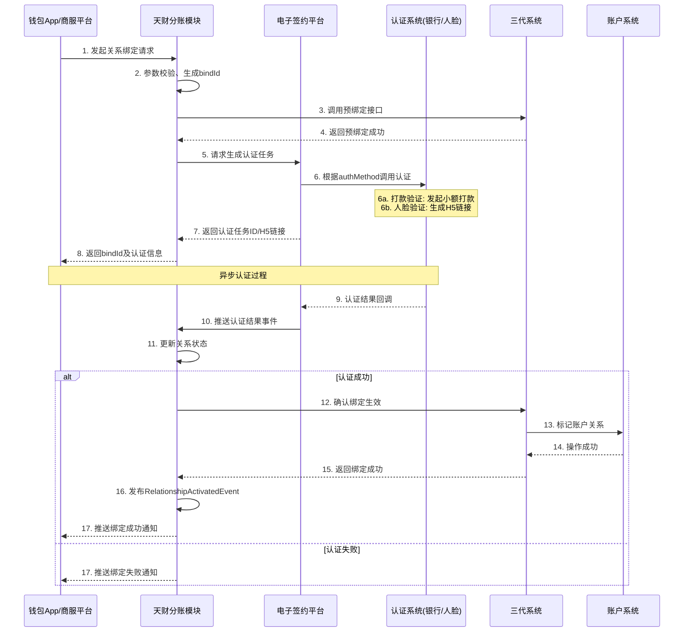
```mermaid
sequenceDiagram
    participant App as 钱包App/商服平台
    participant TC as 天财分账模块
    participant ES as 电子签约平台
    participant AS as 认证系统(银行/人脸)
    participant TS as 三代系统
    participant Acct as 账户系统

    App->>TC: 1. 发起关系绑定请求
    TC->>TC: 2. 参数校验、生成bindId
    TC->>TS: 3. 调用预绑定接口
    TS-->>TC: 4. 返回预绑定成功
    TC->>ES: 5. 请求生成认证任务
    ES->>AS: 6. 根据authMethod调用认证
    Note over AS: 6a. 打款验证: 发起小额打款<br/>6b. 人脸验证: 生成H5链接
    ES-->>TC: 7. 返回认证任务ID/H5链接
    TC-->>App: 8. 返回bindId及认证信息
    
    Note over App,AS: 异步认证过程
    AS-->>ES: 9. 认证结果回调
    ES->>TC: 10. 推送认证结果事件
    TC->>TC: 11. 更新关系状态
    alt 认证成功
        TC->>TS: 12. 确认绑定生效
        TS->>Acct: 13. 标记账户关系
        Acct-->>TS: 14. 操作成功
        TS-->>TC: 15. 返回绑定成功
        TC->>TC: 16. 发布RelationshipActivatedEvent
        TC-->>App: 17. 推送绑定成功通知
    else 认证失败
        TC-->>App: 17. 推送绑定失败通知
    end
```

### 5.2 关键工作流：资金归集

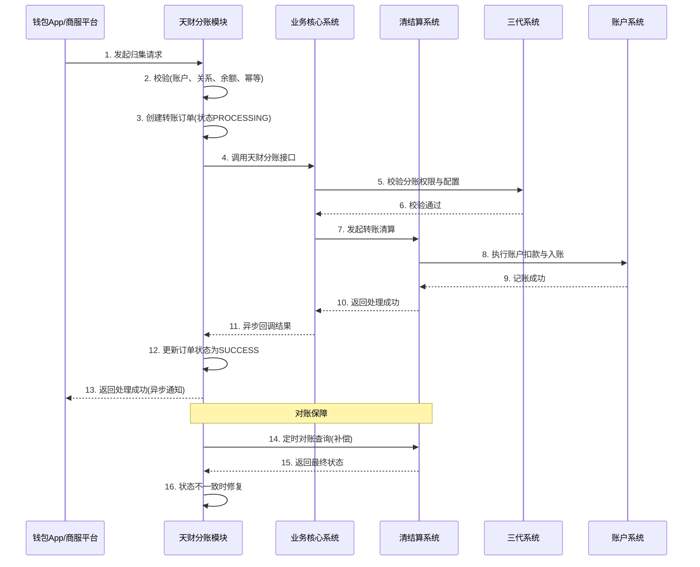
```mermaid
sequenceDiagram
    participant App as 钱包App/商服平台
    participant TC as 天财分账模块
    participant BC as 业务核心系统
    participant CS as 清结算系统
    participant TS as 三代系统
    participant Acct as 账户系统

    App->>TC: 1. 发起归集请求
    TC->>TC: 2. 校验(账户、关系、余额、幂等)
    TC->>TC: 3. 创建转账订单(状态PROCESSING)
    TC->>BC: 4. 调用天财分账接口
    BC->>TS: 5. 校验分账权限与配置
    TS-->>BC: 6. 校验通过
    BC->>CS: 7. 发起转账清算
    CS->>Acct: 8. 执行账户扣款与入账
    Acct-->>CS: 9. 记账成功
    CS-->>BC: 10. 返回处理成功
    BC-->>TC: 11. 异步回调结果
    TC->>TC: 12. 更新订单状态为SUCCESS
    TC-->>App: 13. 返回处理成功(异步通知)
    
    Note over TC,CS: 对账保障
    TC->>CS: 14. 定时对账查询(补偿)
    CS-->>TC: 15. 返回最终状态
    TC->>TC: 16. 状态不一致时修复
```

## 6. 错误处理

### 6.1 预期错误分类

| 错误类别 | HTTP状态码 | 错误码前缀 | 示例场景 | 处理策略 |
|---------|-----------|-----------|----------|----------|
| **客户端错误** | 400 | `CLIENT_` | 参数缺失、格式错误、业务校验失败 | 返回明确错误信息，指导用户修正 |
| **认证授权错误** | 401/403 | `AUTH_` | Token无效、权限不足 | 引导重新登录或申请权限 |
| **资源不存在** | 404 | `NOT_FOUND_` | 账户不存在、关系不存在 | 检查输入资源ID是否正确 |
| **冲突错误** | 409 | `CONFLICT_` | 重复请求、状态冲突 | 幂等处理或提示用户当前状态 |
| **依赖服务错误** | 502 | `DEPENDENCY_` | 三代系统超时、账户系统异常 | 异步重试、降级处理、记录异常单 |
| **服务器内部错误** | 500 | `INTERNAL_` | 数据库异常、未知异常 | 告警、记录详细日志、人工介入 |

### 6.2 重试与补偿机制

#### 6.2.1 异步调用重试
- **可重试错误**：网络超时、依赖服务暂时不可用（5xx错误）。
- **重试策略**：指数退避，最多重试3次，间隔 2s, 10s, 30s。
- **重试标识**：在`tiancai_transfer_order`表中记录重试次数与下次重试时间。

#### 6.2.2 状态不一致补偿
1. **定时对账任务**：每30分钟扫描状态为`PROCESSING`超过1小时的订单，主动查询清结算系统获取最终状态。
2. **事件驱动补偿**：监听`AccountBalanceChangedEvent`但未找到对应转账订单时，触发反向查询。
3. **人工干预接口**：提供管理端手动触发状态同步的接口。

#### 6.2.3 降级方案
- **查询类接口**：依赖服务异常时，返回缓存数据并标记“数据可能延迟”。
- **批量付款**：文件解析和基础校验在本地完成，提交到清结算系统失败时，任务状态置为“部分失败”，允许重新提交失败项。
- **关系绑定**：电子签约平台不可用时，允许线下收集材料，通过管理端后台上传认证结果。

### 6.3 异常监控与告警
- **关键异常**：依赖服务连续失败、状态不一致率超过阈值、大额转账失败。
- **告警渠道**：企业微信、短信、邮件。
- **仪表盘**：展示成功率、平均耗时、异常分布等核心指标。

## 7. 依赖说明

### 7.1 上游模块交互

#### 7.1.1 三代系统
- **交互方式**：RPC/HTTP接口
- **核心依赖**：
  - 商户信息查询与校验
  - 分账关系绑定生效接口
  - 分账手续费率配置获取
  - 分账请求受理接口
- **降级策略**：核心转账流程强依赖，不可降级。查询类功能可缓存。

#### 7.1.2 行业钱包系统 / 账户系统
- **交互方式**：RPC/消息事件
- **核心依赖**：
  - 天财专用账户开户
  - 账户余额查询
  - 账户状态变更通知
  - 账户特殊标记管理
- **降级策略**：开户流程强依赖。余额查询可短暂使用本地缓存。

#### 7.1.3 清结算系统
- **交互方式**：异步消息 + HTTP回调
- **核心依赖**：
  - 转账资金处理
  - 手续费计算与扣除
  - 转账结果回调
  - 对账单生成
- **降级策略**：转账功能强依赖，但可通过异步队列缓冲请求。

#### 7.1.4 电子签约平台
- **交互方式**：HTTP回调 + 事件
- **核心依赖**：
  - 生成认证任务（打款/人脸）
  - 接收认证结果
- **降级策略**：关系绑定功能强依赖，但可走线下人工审核流程。

### 7.2 下游模块服务

#### 7.2.1 钱包App/商服平台前端
- **提供能力**：
  - 完整的账户管理、关系绑定、资金流转操作界面。
  - 实时状态查询与通知。
  - 文件上传与下载。
- **接口特点**：RESTful API，支持分页、过滤，返回用户友好的错误信息。

#### 7.2.2 运营管理后台
- **提供能力**：
  - 业务数据统计看板。
  - 异常订单人工处理界面。
  - 手动触发补偿任务。
- **接口特点**：管理权限校验，批量操作接口。

#### 7.2.3 风控系统
- **提供事件**：`LargeTransferEvent`、`SuspiciousRelationshipEvent`
- **数据支持**：通过接口提供可疑交易查询详情。

### 7.3 数据一致性保障
1. **最终一致性模型**：通过事件驱动和定时对账保证各系统状态最终一致。
2. **本地事务边界**：在本模块数据库内，单个聚合根（如一次转账）的变化保证事务性。
3. **分布式事务**：跨系统的关键操作（如转账扣款+记账）依赖清结算系统保障。

**文档版本**：1.0  
**最后更新**：2023-10-27  
**维护团队**：支付业务中台团队

## 3.6 三代系统


# 三代系统模块设计文档

## 1. 概述

### 1.1 目的
本模块作为支付系统与天财商龙（外部机构）的核心对接枢纽，是“天财分账”业务的**业务逻辑编排中心**和**商户管理权威源**。其主要目的是：
- **商户生命周期管理**：作为收单商户信息的创建、维护和查询的权威系统，为下游系统（如账户系统）提供商户基础数据。
- **分账业务逻辑编排**：接收并处理来自天财商龙的分账业务请求（如关系绑定、分账指令），协调电子签约、账户校验、计费配置等多个下游系统完成复杂业务流程。
- **认证与签约流程驱动**：作为电子签约平台的调用方，驱动并管理“关系绑定”和“开通付款”流程，确保协议签署与身份认证的合规性与完整性。
- **计费配置管理**：为天财分账业务配置手续费规则，并在业务执行时提供计费参数。
- **接口适配与路由**：对外提供统一、稳定的API给天财商龙，对内将业务请求路由至正确的内部处理模块。

### 1.2 范围
- **核心功能**：
    - **商户管理**：商户信息的创建、查询、更新。
    - **分账关系绑定**：处理签约与认证请求，调用电子签约平台，并在成功后通知行业钱包系统建立关系映射。
    - **分账指令处理**：接收天财发起的归集、批量付款、会员结算指令，进行业务校验后转发至业务核心系统执行。
    - **开通付款处理**：为批量付款和会员结算场景下的付款方驱动额外的签约认证流程。
    - **计费配置**：管理分账业务的手续费率、承担方等规则。
- **非功能范围**：
    - 不直接管理资金账户（由账户系统负责）。
    - 不直接处理资金流转与结算（由业务核心和清结算系统负责）。
    - 不直接执行电子签约与认证（由电子签约平台负责）。
    - 不持久化存储账户绑定关系（由行业钱包系统负责）。

## 2. 接口设计

### 2.1 API 端点 (RESTful)

#### 2.1.1 对外接口（供天财商龙调用）
- **POST /api/external/tiancai/v1/merchants** - 商户入驻（创建收单商户）
- **POST /api/external/tiancai/v1/bindings** - 发起分账关系绑定（签约与认证）
- **POST /api/external/tiancai/v1/bindings/{bindingId}/open-payment** - 为指定绑定关系开通付款能力
- **POST /api/external/tiancai/v1/transfers/split** - 发起分账/归集/付款指令

#### 2.1.2 内部接口（供内部系统调用）
- **GET /api/internal/v1/merchants/{merchantNo}** - 查询商户详情（供账户系统等调用）
- **POST /api/internal/v1/fee-configs/query** - 查询计费配置（供业务核心系统调用）
- **POST /api/internal/v1/callbacks/esign** - 电子签约平台回调接口

### 2.2 输入/输出数据结构

#### 2.2.1 发起关系绑定请求 (InitiateBindingRequest)
```json
{
  "requestId": "BIND_REQ_20231027001",
  "institutionNo": "TC001",
  "payerMerchantNo": "M100001", // 付款方商户号（总部或门店）
  "payerAccountNo": "TCWALLET202310270001", // 付款方账户号
  "receiverMerchantNo": "M100002", // 收款方商户号
  "receiverAccountNo": "TCWALLET202310270002", // 收款方账户号
  "receiverType": "CORPORATE | INDIVIDUAL", // 收款方类型：企业/个体户/个人
  "receiverBankCard": { // 收款方银行卡信息（用于打款验证或提现）
    "cardNo": "622848********5678",
    "bankName": "中国农业银行",
    "cardType": "DEBIT",
    "accountName": "某某门店"
  },
  "sceneCode": "CAPITAL_POOLING | MEMBER_SETTLEMENT | BATCH_PAYMENT", // 业务场景：归集/会员结算/批量付款
  "callbackUrl": "https://tiancai.com/callback" // 天财业务回调地址
}
```

#### 2.2.2 分账指令请求 (SubmitSplitTransferRequest)
```json
{
  "requestId": "TRANSFER_REQ_20231027001",
  "institutionNo": "TC001",
  "businessType": "CAPITAL_POOLING", // 业务类型：CAPITAL_POOLING(归集), BATCH_PAYMENT(批量付款), MEMBER_SETTLEMENT(会员结算)
  "totalAmount": "1000.00",
  "currency": "CNY",
  "payer": {
    "merchantNo": "M100001",
    "accountNo": "TCWALLET202310270001"
  },
  "receiverList": [ // 批量付款时有多条
    {
      "receiverMerchantNo": "M100002",
      "receiverAccountNo": "TCWALLET202310270002",
      "amount": "1000.00",
      "remark": "月度货款结算"
    }
  ],
  "feeBearer": "PAYER | RECEIVER", // 手续费承担方
  "postscript": "天财归集20231027" // 附加信息，可能用于打款验证备注
}
```

#### 2.2.3 关系绑定响应 (BindingResponse)
```json
{
  "bindingId": "BIND_202310270001",
  "status": "PROCESSING", // PROCESSING, SUCCESS, FAILED
  "esignUrl": "https://esign.platform.com/h5/contract?token=xxx", // 仅status=PROCESSING时返回，引导用户签约
  "estimatedExpireTime": "2023-10-27T10:30:00Z", // H5页面过期时间
  "failureReason": "" // 失败时返回原因
}
```

### 2.3 发布/消费的事件

#### 2.3.1 发布的事件
- **MerchantCreatedEvent**: 收单商户创建成功时发布。
    - 内容：商户号、商户名称、机构号、商户类型（企业/个体户）、状态。
    - 消费者：账户系统（触发开户）、行业钱包系统。
- **BindingEstablishedEvent**: 分账关系绑定（含开通付款）最终成功时发布。
    - 内容：绑定关系ID、付款方信息、收款方信息、业务场景、生效时间。
    - 消费者：行业钱包系统（持久化绑定关系）、业务核心系统（缓存白名单）。
- **SplitTransferRequestEvent**: 分账指令通过基础校验后发布。
    - 内容：请求流水号、业务类型、付款方、收款方列表、金额。
    - 消费者：业务核心系统（执行资金划转）。

#### 2.3.2 消费的事件
- **AccountCreatedEvent** (来自账户系统)：消费此事件以关联商户与其账户，并更新本地缓存。
- **SettlementCompletedEvent** (来自清结算系统)：消费此事件用于业务对账和状态同步。

## 3. 数据模型

### 3.1 数据库表设计

#### 表: `merchant` (收单商户主表)
| 字段名 | 类型 | 必填 | 默认值 | 说明 |
| :--- | :--- | :--- | :--- | :--- |
| `id` | bigint | Y | AUTO_INCREMENT | 主键 |
| `merchant_no` | varchar(32) | Y | | **商户号**，唯一标识 |
| `institution_no` | varchar(16) | Y | | 天财机构号 |
| `merchant_name` | varchar(128) | Y | | 商户名称 |
| `merchant_type` | varchar(20) | Y | | 类型: `CORPORATE`(企业), `INDIVIDUAL`(个体户) |
| `business_license_no` | varchar(64) | N | | 营业执照号 |
| `legal_person_name` | varchar(64) | N | | 法人姓名 |
| `legal_person_id_no` | varchar(32) | N | | 法人身份证号（加密） |
| `status` | varchar(20) | Y | `ACTIVE` | 状态: `ACTIVE`, `INACTIVE`, `CLOSED` |
| `contact_info` | json | Y | | 联系人、电话、地址等JSON结构 |
| `created_at` | datetime | Y | CURRENT_TIMESTAMP | 创建时间 |
| `updated_at` | datetime | Y | CURRENT_TIMESTAMP ON UPDATE | 更新时间 |
| **索引** | | | | |
| `uk_merchant_no` | UNIQUE(`merchant_no`) | | | 商户号唯一索引 |
| `idx_institution_no` | (`institution_no`) | | | 机构号查询索引 |

#### 表: `binding_application` (关系绑定申请记录表)
| 字段名 | 类型 | 必填 | 默认值 | 说明 |
| :--- | :--- | :--- | :--- | :--- |
| `id` | bigint | Y | AUTO_INCREMENT | 主键 |
| `binding_id` | varchar(32) | Y | | **绑定关系ID**，唯一，用于外部查询 |
| `request_id` | varchar(64) | Y | | 外部请求流水号，幂等键 |
| `institution_no` | varchar(16) | Y | | 天财机构号 |
| `scene_code` | varchar(32) | Y | | 业务场景码 |
| `payer_merchant_no` | varchar(32) | Y | | 付款方商户号 |
| `payer_account_no` | varchar(32) | Y | | 付款方账户号 |
| `receiver_merchant_no` | varchar(32) | Y | | 收款方商户号 |
| `receiver_account_no` | varchar(32) | Y | | 收款方账户号 |
| `receiver_type` | varchar(20) | Y | | 收款方类型 |
| `status` | varchar(20) | Y | `INIT` | 状态: `INIT`, `ESIGNING`, `VERIFYING`, `SUCCESS`, `FAILED` |
| `open_payment_required` | tinyint(1) | Y | 0 | 是否需要开通付款: 0-否, 1-是 |
| `open_payment_status` | varchar(20) | N | | 开通付款状态: `PENDING`, `SUCCESS`, `FAILED` |
| `esign_contract_id` | varchar(64) | N | | 电子签约平台合同ID |
| `auth_method` | varchar(20) | N | | 认证方式: `REMITTANCE`(打款), `FACE`(人脸) |
| `auth_status` | varchar(20) | N | | 认证状态 |
| `callback_url` | varchar(512) | Y | | 天财回调地址 |
| `expire_time` | datetime | Y | | 流程过期时间 |
| `failure_reason` | varchar(512) | N | | 失败原因 |
| `created_at` | datetime | Y | CURRENT_TIMESTAMP | 创建时间 |
| `updated_at` | datetime | Y | CURRENT_TIMESTAMP ON UPDATE | 更新时间 |
| **索引** | | | | |
| `uk_binding_id` | UNIQUE(`binding_id`) | | | 绑定ID唯一索引 |
| `uk_request_id` | UNIQUE(`request_id`) | | | 请求ID幂等索引 |
| `idx_payer_receiver` | (`payer_merchant_no`, `receiver_merchant_no`, `scene_code`) | | | 关系查询索引 |

#### 表: `split_transfer_order` (分账指令订单表)
| 字段名 | 类型 | 必填 | 默认值 | 说明 |
| :--- | :--- | :--- | :--- | :--- |
| `id` | bigint | Y | AUTO_INCREMENT | 主键 |
| `order_no` | varchar(32) | Y | | **系统内部订单号** |
| `request_id` | varchar(64) | Y | | 外部请求流水号，幂等键 |
| `institution_no` | varchar(16) | Y | | 天财机构号 |
| `business_type` | varchar(32) | Y | | 业务类型 |
| `total_amount` | decimal(15,2) | Y | | 总金额 |
| `payer_merchant_no` | varchar(32) | Y | | 付款方商户号 |
| `payer_account_no` | varchar(32) | Y | | 付款方账户号 |
| `fee_bearer` | varchar(20) | Y | | 手续费承担方 |
| `status` | varchar(20) | Y | `PROCESSING` | 状态: `PROCESSING`, `SUCCESS`, `FAILED` |
| `core_order_no` | varchar(32) | N | | 业务核心系统订单号 |
| `failure_reason` | varchar(512) | N | | 失败原因 |
| `created_at` | datetime | Y | CURRENT_TIMESTAMP | 创建时间 |
| `updated_at` | datetime | Y | CURRENT_TIMESTAMP ON UPDATE | 更新时间 |
| **索引** | | | | |
| `uk_order_no` | UNIQUE(`order_no`) | | | 订单号唯一索引 |
| `uk_request_id` | UNIQUE(`request_id`) | | | 请求ID幂等索引 |
| `idx_payer_status` | (`payer_merchant_no`, `status`, `created_at`) | | | 商户订单查询索引 |

#### 表: `fee_config` (计费配置表)
| 字段名 | 类型 | 必填 | 默认值 | 说明 |
| :--- | :--- | :--- | :--- | :--- |
| `id` | bigint | Y | AUTO_INCREMENT | 主键 |
| `institution_no` | varchar(16) | Y | | 天财机构号 |
| `business_type` | varchar(32) | Y | | 业务类型 |
| `payer_role_type` | varchar(20) | N | | 付款方角色类型 (HEADQUARTERS/STORE)，为空表示通用 |
| `fee_rate` | decimal(8,6) | Y | | 手续费率 (如 0.0012 表示 0.12%) |
| `fee_min` | decimal(10,2) | N | | 最低手续费 |
| `fee_max` | decimal(10,2) | N | | 最高手续费 |
| `default_fee_bearer` | varchar(20) | Y | | 默认手续费承担方 |
| `status` | varchar(20) | Y | `ACTIVE` | 状态: `ACTIVE`, `INACTIVE` |
| `effective_time` | datetime | Y | | 生效时间 |
| `expiry_time` | datetime | N | | 失效时间 |
| `created_at` | datetime | Y | CURRENT_TIMESTAMP | 创建时间 |
| **索引** | | | | |
| `idx_institution_business` | (`institution_no`, `business_type`, `status`, `effective_time`) | | | 配置查询索引 |

### 3.2 与其他模块的关系
- **行业钱包系统**：紧密协作的下游。三代系统在关系绑定成功后通知钱包系统持久化关系；钱包系统为三代提供账户信息查询和绑定关系校验。
- **账户系统**：下游依赖。三代系统在创建商户后，会触发或通知账户系统为该商户开立天财专用账户。在处理业务时，会调用账户系统进行账户基础校验。
- **电子签约平台**：服务调用方。三代系统驱动所有签约认证流程，生成协议并调用平台生成H5链接，接收其回调通知认证结果。
- **业务核心系统**：下游指令执行方。三代系统将校验通过的分账指令封装为标准交易请求，发布事件或调用API通知业务核心执行资金划转。
- **清结算系统**：下游计费执行方。三代系统提供计费配置，清结算系统在结算时依据此配置计算手续费。

## 4. 业务逻辑

### 4.1 核心算法
- **绑定关系ID生成**：`BIND_` + `YYYYMMDD` + `6位自增序列`。自增序列每日重置。
- **分账订单号生成**：`TCO` + `YYYYMMDD` + `6位自增序列`。
- **认证方式选择算法**：根据`receiverType`和场景自动选择。
    - `CORPORATE`(企业) -> `REMITTANCE`(打款验证)
    - `INDIVIDUAL`(个体户) -> 根据金额和风险等级，可能为`REMITTANCE`或`FACE`(人脸验证)
    - 会员结算场景下，若收款方为个人，强制使用`FACE`验证。

### 4.2 业务规则
1. **关系绑定规则**：
    - 同一对付款方-收款方在同一业务场景下，只能存在一条生效的绑定关系。
    - “归集”场景：付款方角色必须为`STORE`，收款方角色必须为`HEADQUARTERS`。
    - “批量付款”和“会员结算”场景：绑定成功后，必须额外完成“开通付款”流程，付款方（总部或门店）的绑定关系才生效。
    - 绑定流程（含认证）必须在规定时间（如30分钟）内完成，超时则申请记录失效。

2. **分账指令校验规则**：
    - 付款方和收款方账户必须已通过账户系统校验（状态正常、类型匹配）。
    - 付款方和收款方之间必须存在对应业务场景的、已生效的绑定关系（需调用行业钱包系统校验）。
    - 对于“批量付款”和“会员结算”，必须检查付款方的“开通付款”状态是否为`SUCCESS`。
    - 总金额必须等于所有收款方金额之和。
    - 校验手续费承担方参数，若未提供则使用计费配置中的默认值。

3. **计费配置规则**：
    - 同一机构、同一业务类型下，生效的配置在同一时间点只能有一条。
    - 配置查询优先级：`payer_role_type`匹配 > 通用配置（`payer_role_type`为空）。

### 4.3 验证逻辑
- **商户创建请求验证**：
    - 校验`institutionNo`合法性。
    - 校验商户基础信息的完整性与合规性（如营业执照格式）。
    - 校验同一机构下商户号是否已存在。
- **关系绑定请求验证**：
    - 幂等校验（`requestId`）。
    - 校验付款方和收款方商户是否存在且属于同一机构。
    - 校验业务场景码的合法性。
    - 根据场景码校验付款方和收款方的角色类型是否匹配（需查询账户系统获取账户角色）。
- **分账指令请求验证**：
    - 幂等校验（`requestId`）。
    - 基础参数非空校验。
    - 调用账户系统接口，批量校验所有涉及账户的基本状态。

## 5. 时序图

### 5.1 分账关系绑定（含开通付款）时序图
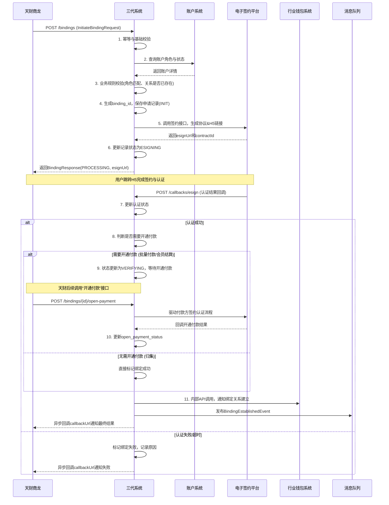
```mermaid
sequenceDiagram
    participant TC as 天财商龙
    participant Gen3 as 三代系统
    participant Account as 账户系统
    participant Esign as 电子签约平台
    participant Wallet as 行业钱包系统
    participant MQ as 消息队列

    TC->>Gen3: POST /bindings (InitiateBindingRequest)
    Gen3->>Gen3: 1. 幂等与基础校验
    Gen3->>Account: 2. 查询账户角色与状态
    Account-->>Gen3: 返回账户详情
    Gen3->>Gen3: 3. 业务规则校验(角色匹配、关系是否已存在)
    Gen3->>Gen3: 4. 生成binding_id，保存申请记录(INIT)
    Gen3->>Esign: 5. 调用签约接口，生成协议&H5链接
    Esign-->>Gen3: 返回esignUrl和contractId
    Gen3->>Gen3: 6. 更新记录状态为ESIGNING
    Gen3-->>TC: 返回BindingResponse(PROCESSING, esignUrl)

    Note over TC, Esign: 用户跳转H5完成签约与认证
    Esign->>Gen3: POST /callbacks/esign (认证结果回调)
    Gen3->>Gen3: 7. 更新认证状态
    alt 认证成功
        Gen3->>Gen3: 8. 判断是否需要开通付款
        alt 需要开通付款 (批量付款/会员结算)
            Gen3->>Gen3: 9. 状态更新为VERIFYING，等待开通付款
            Note over TC, Gen3: 天财后续调用“开通付款”接口
            TC->>Gen3: POST /bindings/{id}/open-payment
            Gen3->>Esign: 驱动付款方签约认证流程
            Esign-->>Gen3: 回调开通付款结果
            Gen3->>Gen3: 10. 更新open_payment_status
        else 无需开通付款 (归集)
            Gen3->>Gen3: 直接标记绑定成功
        end
        Gen3->>Wallet: 11. 内部API调用，通知绑定关系建立
        Gen3->>MQ: 发布BindingEstablishedEvent
        Gen3-->>TC: 异步回调callbackUrl通知最终结果
    else 认证失败/超时
        Gen3->>Gen3: 标记绑定失败，记录原因
        Gen3-->>TC: 异步回调callbackUrl通知失败
    end
```

### 5.2 分账指令处理时序图
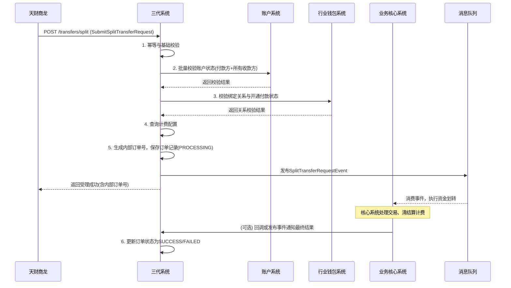
```mermaid
sequenceDiagram
    participant TC as 天财商龙
    participant Gen3 as 三代系统
    participant Account as 账户系统
    participant Wallet as 行业钱包系统
    participant Core as 业务核心系统
    participant MQ as 消息队列

    TC->>Gen3: POST /transfers/split (SubmitSplitTransferRequest)
    Gen3->>Gen3: 1. 幂等与基础校验
    Gen3->>Account: 2. 批量校验账户状态(付款方+所有收款方)
    Account-->>Gen3: 返回校验结果
    Gen3->>Wallet: 3. 校验绑定关系与开通付款状态
    Wallet-->>Gen3: 返回关系校验结果
    Gen3->>Gen3: 4. 查询计费配置
    Gen3->>Gen3: 5. 生成内部订单号，保存订单记录(PROCESSING)
    Gen3->>MQ: 发布SplitTransferRequestEvent
    Gen3-->>TC: 返回受理成功(含内部订单号)

    MQ-->>Core: 消费事件，执行资金划转
    Note over Core, Core: 核心系统处理交易、清结算计费
    Core->>Gen3: (可选) 回调或发布事件通知最终结果
    Gen3->>Gen3: 6. 更新订单状态为SUCCESS/FAILED
```

## 6. 错误处理

| 错误码 | HTTP状态码 | 描述 | 处理策略 |
| :--- | :--- | :--- | :--- |
| `GEN3_4001` | 400 Bad Request | 请求参数无效或缺失 | 天财检查请求体，修正后重试 |
| `GEN3_4002` | 400 Bad Request | 业务场景不支持 | 天财确认场景码是否正确 |
| `GEN3_4003` | 400 Bad Request | 角色类型不匹配业务规则 | 天财确认付款方/收款方身份是否符合场景要求 |
| `GEN3_4091` | 409 Conflict | 重复请求 (requestId已处理) | 天财使用原请求结果，无需重试 |
| `GEN3_4092` | 409 Conflict | 绑定关系已存在 | 天财查询已有绑定关系，勿重复发起 |
| `GEN3_4031` | 403 Forbidden | 账户状态异常或校验失败 | 天财检查对应账户状态，或联系运营处理 |
| `GEN3_4032` | 403 Forbidden | 绑定关系不存在或未生效 | 天财需先完成关系绑定（及开通付款）流程 |
| `GEN3_4241` | 424 Failed Dependency | 依赖服务（账户/钱包）校验不通过 | 返回具体失败原因，天财根据原因处理 |
| `GEN3_5001` | 500 Internal Server Error | 内部服务处理异常 | 服务端记录日志告警，天财可稍后重试 |

**通用策略**：
- **幂等性**：所有写操作通过`requestId`保证，避免重复创建商户、绑定关系或订单。
- **异步流程**：关系绑定和分账指令处理多为异步，通过`callbackUrl`或订单查询接口获取最终结果。
- **超时与补偿**：绑定流程设置超时时间，超时后自动置为失败。有定时任务清理过期数据。
- **优雅降级**：非核心校验依赖（如部分风控规则）失败时，可记录日志并放行，确保主流程可用。

## 7. 依赖说明

### 7.1 上游模块交互
1. **天财商龙（外部机构）**：
    - **交互方式**：同步REST API调用。
    - **职责**：天财是业务需求的发起方，三代系统需提供稳定、清晰、文档完备的API，并做好流量控制与安全认证。

### 7.2 下游模块交互
1. **账户系统**：
    - **交互方式**：同步REST API调用（查询账户详情、校验状态）。
    - **职责**：三代系统依赖账户系统获取账户的角色、状态等核心属性，以进行业务规则校验。商户创建事件是账户开户的触发器。

2. **行业钱包系统**：
    - **交互方式**：同步REST API调用（校验绑定关系、通知绑定成功）。
    - **职责**：钱包系统是绑定关系的实际管理者，三代系统在签约成功后通知其建立关系映射，并在分账前向其验证关系有效性。

3. **电子签约平台**：
    - **交互方式**：同步REST API调用（发起签约） + 异步回调。
    - **职责**：三代系统将签约认证流程委托给该专业平台，并监听其回调以推进业务流程。

4. **业务核心系统**：
    - **交互方式**：异步事件发布 (`SplitTransferRequestEvent`)。
    - **职责**：三代系统完成业务校验和封装后，通过事件驱动业务核心执行实际的资金交易。

5. **消息队列(MQ)**：
    - **交互方式**：发布领域事件 (`MerchantCreatedEvent`, `BindingEstablishedEvent`, `SplitTransferRequestEvent`)。
    - **职责**：实现与下游系统的解耦，确保关键状态变更和业务指令的可靠传递。

### 7.3 关键依赖管理
- **强依赖**：数据库、电子签约平台（流程阻塞点）、账户系统（核心校验）。
- **弱依赖**：行业钱包系统（关系校验失败可转为同步调用其他服务或缓存结果）、消息队列（可降级为同步调用或本地持久化后重试）。
- **降级方案**：
    - 电子签约平台不可用：关系绑定接口直接返回“服务暂不可用”，引导稍后重试。
    - 账户/钱包系统响应慢：设置合理的超时时间，超时后可根据缓存数据做初步判断，或返回“校验超时，请稍后确认结果”。

## 3.7 清结算系统


# 清结算系统模块设计文档

## 1. 概述

### 1.1 目的
清结算系统是支付系统的资金处理核心，负责为“天财分账”等业务场景提供准确、安全、高效的清算、结算、计费及退货资金处理能力。其主要目的是：
- **资金清算**：对交易进行轧差、汇总，计算应收应付净额。
- **资金结算**：根据清算结果，执行实际的资金划拨，包括分账、归集、批量付款等。
- **手续费计费与扣收**：根据业务规则和配置，计算交易产生的手续费，并从指定承担方账户扣收。
- **退货资金处理**：管理退货交易的资金流程，支持从天财收款账户或退货账户（04账户）扣减余额。
- **账户余额管理**：作为资金余额的权威数据源，管理所有天财专用账户（01待结算账户、04退货账户等）的账簿。
- **对账支撑**：为对账单系统提供准确、完整的账户动账明细数据。

### 1.2 范围
- **核心功能**：
    - **清算处理**：接收业务核心系统的交易请求，进行合法性校验、计费计算，生成清算记录。
    - **结算执行**：根据清算结果，执行账户间的资金划转（内部记账），并驱动银行通道完成外部资金调拨。
    - **手续费处理**：支持按交易、按商户、按产品等多种计费模式，并支持指定手续费承担方（付款方/收款方）。
    - **退货处理**：提供退货前置查询和扣减接口，处理退货交易的资金返还。
    - **账户余额管理**：维护天财收款账户、接收方账户、01待结算账户、04退货账户的实时余额。
    - **日终批处理**：执行日切、清算文件生成、手续费汇总、与会计系统对账等。
- **非功能范围**：
    - 不负责具体的业务逻辑校验（如关系绑定是否有效，由行业钱包系统负责）。
    - 不负责账户实体的创建与生命周期管理（由账户系统负责）。
    - 不直接生成用户侧对账单（由对账单系统负责）。
    - 不处理电子签约、身份认证等流程。

## 2. 接口设计

### 2.1 API 端点 (RESTful)

#### 2.1.1 交易处理接口 (供业务核心系统调用)
- **POST /api/v1/settlement/tiancai/split** - 处理天财分账交易（包括归集、会员结算、批量付款）
- **POST /api/v1/settlement/refund/query** - 退货前置查询（查询可退余额）
- **POST /api/v1/settlement/refund/deduct** - 退货前置扣减（扣减账户余额）

#### 2.1.2 账户与余额接口 (供账户系统、内部管理调用)
- **GET /api/v1/settlement/accounts/{accountNo}/balance** - 查询账户实时余额
- **POST /api/v1/settlement/accounts/batch-balance** - 批量查询账户余额
- **GET /api/v1/settlement/accounts/{accountNo}/ledger** - 查询账户动账明细（内部）

#### 2.1.3 运营与管理接口
- **POST /api/v1/settlement/daily/close** - 触发日终清算（手动）
- **GET /api/v1/settlement/daily/summary/{settleDate}** - 查询指定日清算汇总

### 2.2 输入/输出数据结构

#### 2.2.1 天财分账请求 (TiancaiSplitRequest)
```json
{
  "requestId": "SPLIT202310270001", // 请求流水号，全局唯一，用于幂等
  "bizScene": "FUND_POOLING | MEMBER_SETTLEMENT | BATCH_PAYMENT", // 业务场景：归集、会员结算、批量付款
  "payerAccountNo": "TCWALLET202310270001", // 付款方账户号
  "payeeList": [ // 收款方列表（批量付款支持多个）
    {
      "payeeAccountNo": "TCWALLET202310270002",
      "amount": "100.00", // 分账金额
      "remark": "门店归集款"
    }
  ],
  "totalAmount": "100.00", // 总金额（应与payeeList金额总和一致）
  "feePayer": "PAYER | PAYEE", // 手续费承担方：付款方 | 收款方
  "feeRuleId": "FEE_TC_001", // 计费规则ID（由三代系统配置）
  "originalOrderNo": "ORDER202310270001", // 原交易订单号（会员结算等场景关联用）
  "extInfo": {
    "institutionNo": "TC001",
    // ... 其他业务扩展信息
  }
}
```

#### 2.2.2 分账响应 (SettlementResponse)
```json
{
  "code": "SUCCESS",
  "message": "处理成功",
  "data": {
    "settlementNo": "ST20231027000001", // 清结算流水号
    "requestId": "SPLIT202310270001",
    "status": "PROCESSING | SUCCESS | FAILED", // 处理状态
    "payerAccountNo": "TCWALLET202310270001",
    "payerBalance": "900.00", // 付款方操作后余额
    "payeeResults": [
      {
        "payeeAccountNo": "TCWALLET202310270002",
        "amount": "100.00",
        "status": "SUCCESS",
        "payeeBalance": "100.00", // 收款方操作后余额
        "feeAmount": "1.00", // 本笔手续费（如收款方承担）
        "settlementDetailNo": "STD20231027000001" // 明细流水号
      }
    ],
    "totalFee": "1.00", // 总手续费（如付款方承担）
    "processTime": "2023-10-27T10:00:00Z"
  }
}
```

#### 2.2.3 退货前置查询请求 (RefundQueryRequest)
```json
{
  "requestId": "REFUND_QUERY202310270001",
  "merchantNo": "M100001",
  "refundAmount": "50.00",
  "accountType": "RECEIVABLE | REFUND", // 扣款账户类型：收款账户 | 04退货账户
  "originalOrderNo": "ORDER202310270001" // 原消费订单号，用于关联和风控
}
```

#### 2.2.4 退货前置扣减请求 (RefundDeductRequest)
```json
{
  "requestId": "REFUND_DEDUCT202310270001",
  "merchantNo": "M100001",
  "refundAmount": "50.00",
  "accountType": "RECEIVABLE | REFUND",
  "originalOrderNo": "ORDER202310270001",
  "refundOrderNo": "REFUND202310270001" // 本次退货订单号
}
```

### 2.3 发布/消费的事件

#### 2.3.1 发布的事件
- **SettlementInitiatedEvent**: 清算开始，交易被接收并验证通过时发布。
    - 内容：请求ID、业务场景、参与方、金额、时间。
    - 消费者：监控系统（用于实时业务大盘）、风控系统。
- **SettlementCompletedEvent**: 结算完成（资金内部记账完成）时发布。
    - **内容**：清结算流水号、参与账户、变动金额、变动后余额、手续费、业务场景、状态、时间。
    - **消费者**：**账户系统**（用于同步展示余额）、**对账单系统**（核心动账数据源）、**行业钱包系统**（通知业务结果）。
- **DailySettlementClosedEvent**: 日终清算完成时发布。
    - 内容：清算日期、交易汇总、手续费汇总、状态、文件路径。
    - 消费者：会计系统、对账单系统（触发账单生成）、风控系统。

#### 2.3.2 消费的事件
- **AccountStatusChangedEvent** (来自账户系统)：当账户状态变为`FROZEN`或`DISABLED`时，需暂停对该账户的支出类结算操作。
- **FeeRuleUpdatedEvent** (来自三代系统)：计费规则变更时，更新本地缓存。

## 3. 数据模型

### 3.1 数据库表设计

#### 表: `settlement_order` (清结算主订单表)
| 字段名 | 类型 | 必填 | 默认值 | 说明 |
| :--- | :--- | :--- | :--- | :--- |
| `id` | bigint | Y | AUTO_INCREMENT | 主键 |
| `settlement_no` | varchar(32) | Y | | **清结算流水号**，唯一标识，规则: ST+日期+序列 |
| `request_id` | varchar(64) | Y | | 上游请求流水号，用于幂等 |
| `biz_scene` | varchar(32) | Y | | 业务场景: `FUND_POOLING`, `MEMBER_SETTLEMENT`, `BATCH_PAYMENT` |
| `payer_account_no` | varchar(32) | Y | | 付款方账户号 |
| `total_amount` | decimal(15,2) | Y | | 交易总金额 |
| `total_fee` | decimal(15,2) | Y | 0.00 | 总手续费 |
| `fee_payer` | varchar(10) | Y | | 手续费承担方: `PAYER`, `PAYEE` |
| `fee_rule_id` | varchar(32) | Y | | 计费规则ID |
| `status` | varchar(20) | Y | `INIT` | 状态: `INIT`, `PROCESSING`, `SUCCESS`, `FAILED`, `PARTIAL_FAILED` |
| `settle_date` | date | Y | | 清算日期（会计日期） |
| `institution_no` | varchar(16) | Y | | 天财机构号 |
| `ext_info` | json | | NULL | 扩展信息 |
| `created_at` | datetime | Y | CURRENT_TIMESTAMP | 创建时间 |
| `updated_at` | datetime | Y | CURRENT_TIMESTAMP ON UPDATE | 更新时间 |
| **索引** | | | | |
| `uk_settlement_no` | UNIQUE(`settlement_no`) | | | 主流水号索引 |
| `uk_request_id` | UNIQUE(`request_id`) | | | 幂等索引 |
| `idx_payer_account` | (`payer_account_no`, `settle_date`) | | | 付款方查询索引 |
| `idx_settle_date_status` | (`settle_date`, `status`) | | | 日终处理索引 |

#### 表: `settlement_detail` (清结算明细表)
| 字段名 | 类型 | 必填 | 默认值 | 说明 |
| :--- | :--- | :--- | :--- | :--- |
| `id` | bigint | Y | AUTO_INCREMENT | 主键 |
| `detail_no` | varchar(32) | Y | | **明细流水号**，规则: STD+日期+序列 |
| `settlement_no` | varchar(32) | Y | | 关联主流水号 |
| `payee_account_no` | varchar(32) | Y | | 收款方账户号 |
| `amount` | decimal(15,2) | Y | | 分账/付款金额 |
| `fee_amount` | decimal(15,2) | Y | 0.00 | 本笔手续费（若收款方承担） |
| `post_balance` | decimal(15,2) | Y | | **操作后余额**（对于收款方） |
| `status` | varchar(20) | Y | `INIT` | 状态: `INIT`, `SUCCESS`, `FAILED` |
| `fail_reason` | varchar(255) | | NULL | 失败原因 |
| `created_at` | datetime | Y | CURRENT_TIMESTAMP | 创建时间 |
| **索引** | | | | |
| `uk_detail_no` | UNIQUE(`detail_no`) | | | 明细流水号索引 |
| `idx_settlement_no` | (`settlement_no`) | | | 关联主订单索引 |
| `idx_payee_account` | (`payee_account_no`, `created_at`) | | | 收款方动账查询索引 |

#### 表: `account_ledger` (账户分户账簿表) - 核心余额表
| 字段名 | 类型 | 必填 | 默认值 | 说明 |
| :--- | :--- | :--- | :--- | :--- |
| `id` | bigint | Y | AUTO_INCREMENT | 主键 |
| `account_no` | varchar(32) | Y | | **账户号**（与账户系统一致） |
| `account_type` | varchar(20) | Y | | 账簿类型: `RECEIVABLE`, `RECEIVER`, `SETTLEMENT_01`, `REFUND_04` |
| `balance` | decimal(15,2) | Y | 0.00 | **当前余额**，权威数据 |
| `available_balance` | decimal(15,2) | Y | 0.00 | 可用余额（余额-冻结金额） |
| `frozen_amount` | decimal(15,2) | Y | 0.00 | 冻结金额 |
| `currency` | varchar(3) | Y | `CNY` | 币种 |
| `version` | int | Y | 0 | 乐观锁版本号，防并发扣款 |
| `last_txn_time` | datetime | | NULL | 最后交易时间 |
| `created_at` | datetime | Y | CURRENT_TIMESTAMP | 创建时间 |
| `updated_at` | datetime | Y | CURRENT_TIMESTAMP ON UPDATE | 更新时间 |
| **索引** | | | | |
| `uk_account_no_type` | UNIQUE(`account_no`, `account_type`) | | | 账户与类型唯一索引 |
| `idx_account_no` | (`account_no`) | | | 账户查询索引 |

#### 表: `ledger_journal` (账户流水日记账表)
| 字段名 | 类型 | 必填 | 默认值 | 说明 |
| :--- | :--- | :--- | :--- | :--- |
| `id` | bigint | Y | AUTO_INCREMENT | 主键 |
| `journal_no` | varchar(32) | Y | | 流水号，规则: JL+日期+序列 |
| `account_no` | varchar(32) | Y | | 账户号 |
| `account_type` | varchar(20) | Y | | 账簿类型 |
| `related_no` | varchar(32) | Y | | 关联业务单号 (如 settlement_no, detail_no) |
| `biz_scene` | varchar(32) | Y | | 业务场景 |
| `change_amount` | decimal(15,2) | Y | | 变动金额（正为入账，负为出账） |
| `balance_before` | decimal(15,2) | Y | | 变动前余额 |
| `balance_after` | decimal(15,2) | Y | | 变动后余额 |
| `direction` | char(1) | Y | | 方向: `D`-借方(出), `C`-贷方(入) |
| `txn_time` | datetime | Y | CURRENT_TIMESTAMP | 交易时间 |
| `created_at` | datetime | Y | CURRENT_TIMESTAMP | 创建时间 |
| **索引** | | | | |
| `idx_account_txn` | (`account_no`, `txn_time`) | | | 账户交易历史查询主索引 |
| `idx_related_no` | (`related_no`) | | | 按业务单号查询索引 |
| `idx_settle_date` | (`txn_time`) | | | 用于日终切片（需配合时间范围） |

#### 表: `refund_preprocess_record` (退货前置处理记录表)
| 字段名 | 类型 | 必填 | 默认值 | 说明 |
| :--- | :--- | :--- | :--- | :--- |
| `id` | bigint | Y | AUTO_INCREMENT | 主键 |
| `request_id` | varchar(64) | Y | | 请求流水号，幂等 |
| `merchant_no` | varchar(32) | Y | | 商户号 |
| `account_type` | varchar(20) | Y | | 扣款账户类型 |
| `original_order_no` | varchar(32) | Y | | 原订单号 |
| `refund_order_no` | varchar(32) | | NULL | 退货订单号（扣减时填入） |
| `refund_amount` | decimal(15,2) | Y | | 退货金额 |
| `status` | varchar(20) | Y | `QUERIED` | 状态: `QUERIED`, `DEDUCTED`, `EXPIRED` |
| `expire_time` | datetime | Y | | 查询结果过期时间（如5分钟） |
| `created_at` | datetime | Y | CURRENT_TIMESTAMP | 创建时间 |
| **索引** | | | | |
| `uk_request_id` | UNIQUE(`request_id`) | | | 幂等索引 |
| `idx_merchant_original` | (`merchant_no`, `original_order_no`, `status`) | | | 商户原单查询索引 |

### 3.2 与其他模块的关系
- **业务核心系统**：上游调用方。接收其发起的“天财分账”交易请求，进行清算和结算。是清结算系统最主要的交易来源。
- **账户系统**：紧密协作。账户系统管理账户实体信息，清结算系统管理账户的资金余额。清结算系统向账户系统发布`SettlementCompletedEvent`同步余额；消费`AccountStatusChangedEvent`以控制资金操作。
- **行业钱包系统**：协同工作。钱包系统处理业务逻辑（如关系绑定），然后调用业务核心发起交易，最终由清结算系统完成资金处理。清结算系统将完成事件通知钱包系统。
- **三代系统**：配置与规则来源。从三代系统获取计费规则（`fee_rule_id`对应的具体费率）。
- **对账单系统**：核心数据提供方。对账单系统消费`SettlementCompletedEvent`和`DailySettlementClosedEvent`，并可能直接查询`ledger_journal`表，生成用户对账单。
- **银行通道/支付网络**：下游执行方。对于需要实际调拨银行资金的结算（如提现），清结算系统生成指令，通过支付网关等系统发送给银行。

## 4. 业务逻辑

### 4.1 核心算法
- **清结算流水号生成**：`ST`/`STD`/`JL` + `YYYYMMDD` + `6位自增序列`。使用分布式序列服务保证集群唯一。
- **余额更新（扣款/加款）**：
    ```java
    // 伪代码，基于乐观锁
    int rows = update account_ledger 
              set balance = balance + :changeAmount,
                  version = version + 1,
                  last_txn_time = now()
              where account_no = :accountNo 
                and account_type = :accountType
                and version = :oldVersion
                and balance + :changeAmount >= 0; // 对于扣款，校验余额充足
    if (rows == 0) {
        throw new ConcurrentUpdateException("余额更新失败，请重试");
    }
    ```
- **手续费计算**：根据`fee_rule_id`从缓存获取计费规则（如费率0.6%），按`total_amount`计算。若`fee_payer`为`PAYEE`，则总手续费分摊到每个收款方明细中计算。
- **日切处理**：每日固定时间点（如23:30）执行。
    1. 停止接收当日`settle_date`的交易。
    2. 处理所有状态为`PROCESSING`的订单。
    3. 生成清算汇总文件。
    4. 更新系统会计日期。
    5. 发布`DailySettlementClosedEvent`。

### 4.2 业务规则
1. **分账/结算规则**：
    - **金额一致性**：`total_amount`必须等于所有`payeeList.amount`之和。
    - **余额充足性**：付款方账户`available_balance`必须大于等于`total_amount`（若手续费付款方承担，则需大于`total_amount + total_fee`）。
    - **账户状态**：付款方和收款方账户在账户系统的状态必须为`ACTIVE`（通过事件或接口隐式校验）。
    - **收款方账户**：必须是`RECEIVER`类型且已绑定有效默认卡（此校验通常在业务核心或钱包系统完成）。
    - **幂等性**：基于`requestId`保证，重复请求返回原结果。

2. **手续费规则**：
    - 若`fee_payer`为`PAYER`，手续费从`total_amount`之外额外扣除，即付款方实际支出 = `total_amount + total_fee`。
    - 若`fee_payer`为`PAYEE`，手续费从每个收款方的`amount`中扣除，即收款方实际收入 = `amount - fee_amount`。
    - 手续费精确到分，采用“四舍六入五成双”规则，避免资金误差。

3. **退货前置规则**：
    - 查询结果有有效期（如5分钟），过期后需重新查询。
    - 扣减操作必须在查询有效期内进行，且扣减金额不能超过查询金额。
    - 扣减`RECEIVABLE`账户时，需校验其`available_balance`；扣减`REFUND_04`账户时，直接扣减`balance`。
    - 一次扣减成功后，对应查询记录状态变为`DEDUCTED`，防止重复扣减。

4. **日终清算规则**：
    - `settle_date`以交易进入清结算系统的时间为准。
    - 日切时未处理完的订单，继续处理，但`settle_date`仍记为上一日。
    - 生成的文件包括：交易汇总、手续费汇总、账户余额快照。

### 4.3 验证逻辑
- **分账请求验证**：
    1. 校验`requestId`幂等性。
    2. 校验必填字段和金额格式。
    3. 校验`bizScene`与账户`role_type`的匹配性（如归集场景，付款方应为`STORE`角色）。此校验可能需要调用账户系统或依赖上游。
    4. 校验付款方账户余额是否充足（查询`account_ledger`）。
    5. 校验计费规则`fee_rule_id`是否存在且有效。
- **退货前置验证**：
    1. 校验`requestId`幂等性。
    2. 校验`originalOrderNo`对应的原交易是否存在且可退。
    3. 根据`accountType`查询对应账户的可用余额。
    4. 扣减时，校验查询记录是否存在、是否在有效期内、金额是否一致。

## 5. 时序图

### 5.1 天财分账（归集）清算结算时序图
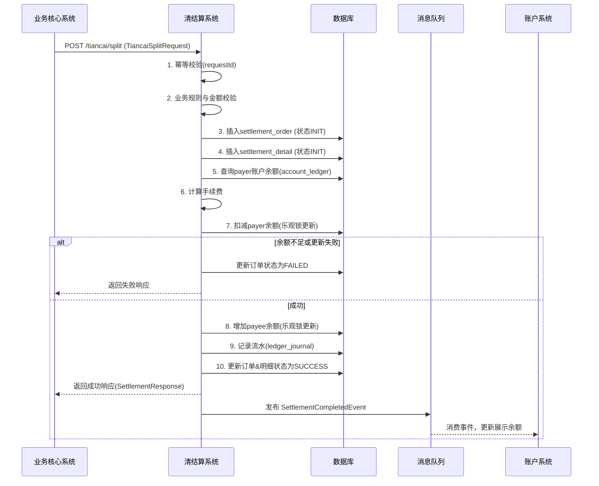
```mermaid
sequenceDiagram
    participant Core as 业务核心系统
    participant Settle as 清结算系统
    participant DB as 数据库
    participant MQ as 消息队列
    participant Account as 账户系统

    Core->>Settle: POST /tiancai/split (TiancaiSplitRequest)
    Settle->>Settle: 1. 幂等校验(requestId)
    Settle->>Settle: 2. 业务规则与金额校验
    Settle->>DB: 3. 插入settlement_order (状态INIT)
    Settle->>DB: 4. 插入settlement_detail (状态INIT)
    
    Settle->>DB: 5. 查询payer账户余额(account_ledger)
    Settle->>Settle: 6. 计算手续费
    Settle->>DB: 7. 扣减payer余额(乐观锁更新)
    alt 余额不足或更新失败
        Settle->>DB: 更新订单状态为FAILED
        Settle-->>Core: 返回失败响应
    else 成功
        Settle->>DB: 8. 增加payee余额(乐观锁更新)
        Settle->>DB: 9. 记录流水(ledger_journal)
        Settle->>DB: 10. 更新订单&明细状态为SUCCESS
        Settle-->>Core: 返回成功响应(SettlementResponse)
        Settle->>MQ: 发布 SettlementCompletedEvent
        MQ-->>Account: 消费事件，更新展示余额
    end
```

### 5.2 退货前置查询与扣减时序图
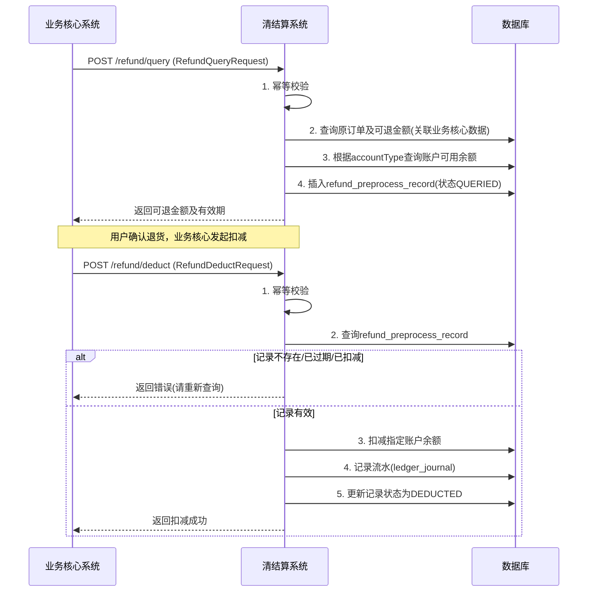
```mermaid
sequenceDiagram
    participant Core as 业务核心系统
    participant Settle as 清结算系统
    participant DB as 数据库

    Core->>Settle: POST /refund/query (RefundQueryRequest)
    Settle->>Settle: 1. 幂等校验
    Settle->>DB: 2. 查询原订单及可退金额(关联业务核心数据)
    Settle->>DB: 3. 根据accountType查询账户可用余额
    Settle->>DB: 4. 插入refund_preprocess_record(状态QUERIED)
    Settle-->>Core: 返回可退金额及有效期

    Note over Core,Settle: 用户确认退货，业务核心发起扣减
    Core->>Settle: POST /refund/deduct (RefundDeductRequest)
    Settle->>Settle: 1. 幂等校验
    Settle->>DB: 2. 查询refund_preprocess_record
    alt 记录不存在/已过期/已扣减
        Settle-->>Core: 返回错误(请重新查询)
    else 记录有效
        Settle->>DB: 3. 扣减指定账户余额
        Settle->>DB: 4. 记录流水(ledger_journal)
        Settle->>DB: 5. 更新记录状态为DEDUCTED
        Settle-->>Core: 返回扣减成功
    end
```

## 6. 错误处理

| 错误码 | HTTP状态码 | 描述 | 处理策略 |
| :--- | :--- | :--- | :--- |
| `SETTLE_4001` | 400 Bad Request | 请求参数无效或缺失 | 客户端检查请求体 |
| `SETTLE_4002` | 400 Bad Request | 金额计算错误（如总额不等） | 客户端重新计算金额 |
| `SETTLE_4003` | 400 Bad Request | 业务场景与账户角色不匹配 | 客户端检查业务逻辑 |
| `SETTLE_4091` | 409 Conflict | 重复请求 (requestId已处理) | 客户端使用原结果 |
| `SETTLE_4092` | 409 Conflict | 并发余额更新冲突 | 客户端稍后重试（需有退避策略） |
| `SETTLE_4031` | 403 Forbidden | 付款方余额不足 | 客户端提示充值或减少金额 |
| `SETTLE_4032` | 403 Forbidden | 账户状态异常（冻结/禁用） | 客户端联系客服 |
| `SETTLE_4041` | 404 Not Found | 计费规则不存在 | 客户端检查fee_rule_id，或由运营人员配置 |
| `SETTLE_5001` | 500 Internal Server Error | 数据库操作失败 | 服务端告警，客户端可有限重试 |
| `SETTLE_5002` | 500 Internal Server Error | 消息队列发布失败 | 服务端记录日志并异步重试，不影响主流程响应 |

**通用策略**：
- **资金操作**：所有余额变动必须保证原子性（数据库事务+乐观锁）和最终一致性。失败时必须有明确状态和补偿机制（如冲正交易）。
- **重试机制**：对于网络超时或5xx错误，客户端应实现带指数退避的有限重试（如最多3次）。对于4xx错误，不应重试，除非修正了请求。
- **监控与告警**：对失败交易、余额不足、并发冲突等高发异常进行监控和告警。
- **对账与核对**：日终通过批量对账，确保`account_ledger`余额与流水`ledger_journal`总和一致，与会计系统一致。

## 7. 依赖说明

### 7.1 上游模块交互
1. **业务核心系统**：
    - **交互方式**：同步REST API调用（`/tiancai/split`, `/refund/query`等）。
    - **职责**：清结算系统最主要的服务对象。业务核心系统封装了完整的支付/分账交易流程，清结算负责其中的资金处理环节。需保证高可用和低延迟。
    - **降级方案**：极端情况下，可提供异步受理模式，先接收请求返回受理中，后台异步处理并通知结果。

2. **账户系统**：
    - **交互方式**：异步事件消费 (`AccountStatusChangedEvent`) 和 同步REST API调用（余额查询，用于非关键路径）。
    - **职责**：清结算系统是账户余额的权威源，但依赖账户系统提供的账户状态信息来控制资金操作。账户状态变更事件必须可靠消费。
    - **降级方案**：若事件暂时丢失，可通过定时任务同步账户状态。在无法获取最新状态时，对于支出交易应更加谨慎，可增加人工审核环节。

### 7.2 下游模块交互
1. **消息队列(MQ)**：
    - **交互方式**：发布领域事件 (`SettlementCompletedEvent`, `DailySettlementClosedEvent`)。
    - **职责**：实现与账户系统、对账单系统等下游的松耦合通信。事件发布必须保证至少一次投递，消费者需幂等处理。

2. **对账单系统**：
    - **交互方式**：异步事件消费 (`SettlementCompletedEvent`, `DailySettlementClosedEvent`) 和 直接数据库查询（只读从库）。
    - **职责**：清结算系统产生的流水是生成对账单的核心依据。事件驱动保证实时性，数据库查询用于补全或批量处理。

### 7.3 关键依赖管理
- **强依赖**：数据库（MySQL）、业务核心系统（流量入口）。
- **弱依赖**：账户系统（状态事件）、MQ（事件发布）。这些系统短时故障不应阻塞核心清算流程，可通过本地缓存账户状态、异步重试发布事件等方式降级。
- **隔离与熔断**：对下游调用（如查询计费规则）需配置熔断器，防止因下游故障导致线程池耗尽。

## 3.8 电子签章系统


# 电子签章系统模块设计文档

## 1. 概述

### 1.1 目的
本模块（电子签章系统）作为支付机构内部独立的电子签约与存证服务平台，为“天财分账”等业务提供安全、合规、可追溯的电子协议签署能力。它封装了协议生成、签署流程管理、身份验证集成、证据链固化等核心功能，确保签约过程符合《电子签名法》要求，并为业务系统提供标准化的签约接入服务。

### 1.2 范围
- **核心功能**：
    1.  **协议模板管理**：支持多业务场景（关系绑定、开通付款等）的协议模板创建、版本管理和动态字段配置。
    2. **签约流程编排**：驱动签署流程，支持单方/多方、顺序/并行签署，集成短信验证、人脸核身等验证手段。
    3. **签约页面封装**：提供可嵌入的H5签约页面，适配移动端与PC端，确保用户体验一致。
    4. **全证据链存证**：对协议原文、签署过程日志、身份验证结果、时间戳等数据进行哈希固化，并同步至权威司法存证平台。
    5. **签约状态与文档管理**：管理协议生命周期状态，提供已签署协议的查询、下载和验真服务。
- **边界**：
    - **服务对象**：主要为内部业务系统（如认证系统），不直接对外部商户或用户暴露。
    - **能力输出**：提供签约链接、签约状态回调、协议文档。
    - **外部依赖**：集成第三方人脸核身服务、短信服务、时间戳服务及司法存证平台。
    - **数据边界**：存储协议模板、签约任务、签署记录及证据链数据，不存储业务系统的核心业务数据。

## 2. 接口设计

### 2.1 API 端点 (RESTful)

#### 2.1.1 创建签约任务
- **端点**: `POST /api/v1/contract/tasks`
- **描述**: 由认证系统调用，根据业务场景和参数创建一个新的电子协议签署任务。
- **请求头**: `X-Client-Id: {调用方系统标识}`， `X-Signature: {请求签名}` (用于接口鉴权)
- **请求体**:
    ```json
    {
      "taskId": "string", // 调用方任务ID，用于关联
      "bizScene": "TIANCAI_RELATION_BINDING" | "TIANCAI_ENABLE_PAYMENT", // 业务场景编码
      "bizId": "string", // 关联的业务ID（如认证系统的authRequestId）
      "title": "string", // 协议标题，如《天财分账授权协议》
      "templateId": "string", // 协议模板ID
      "templateVariables": { // 模板变量填充值
        "payerName": "string",
        "payerAccountNo": "string",
        "payeeName": "string",
        "payeeAccountNo": "string",
        "businessType": "string",
        "effectiveDate": "2023-10-01"
      },
      "signers": [ // 签署方列表
        {
          "signerId": "string", // 签署方在本任务中的唯一标识
          "role": "PAYER" | "PAYEE" | "WITNESS", // 签署方角色
          "name": "string", // 签署方姓名/企业名
          "idNo": "string?", // 身份证号/统一社会信用代码
          "mobile": "string?", // 手机号（用于短信验证）
          "signMethod": "SMS" | "FACE" | "CA", // 签署验证方式
          "notifyUrl": "string?" // 该签署方签署结果回调地址（可选）
        }
      ],
      "signFlowConfig": { // 签署流程配置
        "flowType": "ORDER" | "PARALLEL", // 顺序签/并行签
        "signOrder": ["signerId1", "signerId2"] // ORDER时有效
      },
      "callbackUrl": "string", // 整体任务完成回调地址
      "expireTime": "2023-10-01T23:59:59Z" // 任务过期时间
    }
    ```
- **响应体 (成功)**:
    ```json
    {
      "code": "SUCCESS",
      "data": {
        "contractTaskId": "string", // 本系统生成的签约任务ID
        "status": "INIT",
        "signUrls": { // 各签署方的签约链接（仅当流程就绪时返回）
          "signerId1": "https://esign.example.com/h5/contract?token=xxx"
        },
        "createTime": "2023-10-01T12:00:00Z"
      }
    }
    ```

#### 2.1.2 查询签约任务状态
- **端点**: `GET /api/v1/contract/tasks/{contractTaskId}`
- **描述**: 查询签约任务的详细状态、各签署方进度及协议信息。
- **响应体**:
    ```json
    {
      "contractTaskId": "string",
      "taskId": "string",
      "bizScene": "string",
      "bizId": "string",
      "title": "string",
      "status": "INIT | PROCESSING | PARTIAL_SIGNED | COMPLETED | REJECTED | EXPIRED | CANCELLED",
      "contractId": "string?", // 最终协议文档ID
      "signers": [
        {
          "signerId": "string",
          "role": "string",
          "name": "string",
          "signStatus": "PENDING | SIGNED | REJECTED | EXPIRED",
          "signTime": "string?",
          "signMethod": "string",
          "evidenceSnapshotId": "string?" // 该签署方存证快照ID
        }
      ],
      "evidenceChain": {
        "contractHash": "string?", // 协议最终版哈希值
        "timestamp": "string?", // 可信时间戳
        "blockchainTxHash": "string?" // 区块链存证交易哈希
      },
      "createTime": "string",
      "updateTime": "string",
      "expireTime": "string"
    }
    ```

#### 2.1.3 获取签署链接
- **端点**: `GET /api/v1/contract/tasks/{contractTaskId}/signers/{signerId}/url`
- **描述**: 获取指定签署方的H5签约页面链接。通常由认证系统在引导用户签约时调用。
- **查询参数**: `redirectUrl=string?` (签署完成后跳转地址)
- **响应体**:
    ```json
    {
      "signUrl": "https://esign.example.com/h5/contract?token=xxx&redirect=yyy",
      "expireTime": "2023-10-01T13:00:00Z" // 链接过期时间（短时效）
    }
    ```

#### 2.1.4 下载协议文档
- **端点**: `GET /api/v1/contract/{contractId}/document`
- **描述**: 下载已签署完成的协议PDF文档。
- **查询参数**: `type=ORIGINAL | SIGNED` (原始模板/已签署版)
- **响应头**: `Content-Type: application/pdf`, `Content-Disposition: attachment; filename="xxx.pdf"`

#### 2.1.5 接收签署回调 (供H5页面调用)
- **端点**: `POST /api/h5/callback/sign` (内部H5页面回调)
- **描述**: H5签约页面在用户完成签署操作（提交、拒绝）后回调本接口，更新签署状态。
- **请求体**:
    ```json
    {
      "taskToken": "string", // 页面携带的临时令牌
      "action": "SUBMIT" | "REJECT",
      "signatureData": "string?", // 前端生成的签名数据（如有）
      "verifyCode": "string?" // 短信验证码（如为SMS验证方式）
    }
    ```

### 2.2 发布/消费的事件

#### 2.2.1 消费的事件
- 无主要事件消费。本模块作为基础服务，以同步API调用为主。

#### 2.2.2 发布的事件
- `ContractTaskCreatedEvent`: 签约任务创建成功。可用于内部审计。
- `ContractSignProgressEvent`: 签署方签署状态变更（如已签署）。**主要消费者：认证系统**，通过回调URL通知，驱动其后续流程。
- `ContractTaskCompletedEvent`: 整个签约任务完成（所有签署方签署成功）。**主要消费者：认证系统**，通过回调URL通知。
- `ContractEvidenceStoredEvent`: 协议证据链完成司法存证。用于内部监控和审计。

## 3. 数据模型

### 3.1 数据库表设计

#### 表: `contract_task` (签约任务主表)
| 字段名 | 类型 | 必填 | 描述 |
| :--- | :--- | :--- | :--- |
| `id` | bigint(自增) | Y | 主键 |
| `contract_task_id` | varchar(32) | Y | 对外任务ID，唯一 |
| `task_id` | varchar(32) | Y | 调用方任务ID |
| `client_id` | varchar(32) | Y | 调用方系统标识 |
| `biz_scene` | varchar(64) | Y | 业务场景 |
| `biz_id` | varchar(32) | Y | 关联业务ID |
| `title` | varchar(256) | Y | 协议标题 |
| `template_id` | varchar(32) | Y | 模板ID |
| `template_variables` | json | Y | 模板变量JSON |
| `status` | varchar(32) | Y | 任务状态 |
| `contract_id` | varchar(64) | N | 最终协议文档ID |
| `callback_url` | varchar(512) | Y | 任务完成回调地址 |
| `expire_time` | datetime | Y | 任务过期时间 |
| `completed_time` | datetime | N | 任务完成时间 |
| `created_at` | datetime | Y | 创建时间 |
| `updated_at` | datetime | Y | 更新时间 |
| **索引** | | | |
| `uk_contract_task_id` | UNIQUE(`contract_task_id`) | | |
| `idx_biz_id` | (`biz_scene`, `biz_id`) | | 按业务ID查询 |
| `idx_status_expire` | (`status`, `expire_time`) | | 清理过期任务 |

#### 表: `contract_signer` (签署方表)
| 字段名 | 类型 | 必填 | 描述 |
| :--- | :--- | :--- | :--- |
| `id` | bigint | Y | 主键 |
| `contract_task_id` | varchar(32) | Y | 关联任务ID |
| `signer_id` | varchar(32) | Y | 签署方标识 |
| `role` | varchar(32) | Y | 角色 |
| `name` | varchar(128) | Y | 姓名 |
| `id_no` | varchar(64) | N | 证件号 |
| `mobile` | varchar(20) | N | 手机号 |
| `sign_method` | varchar(16) | Y | 验证方式 |
| `sign_status` | varchar(32) | Y | 签署状态 |
| `sign_time` | datetime | N | 签署时间 |
| `sign_token` | varchar(128) | N | 当前有效签署令牌 |
| `token_expire` | datetime | N | 令牌过期时间 |
| `notify_url` | varchar(512) | N | 独立回调地址 |
| `evidence_snapshot_id` | varchar(64) | N | 存证快照ID |
| `reject_reason` | varchar(256) | N | 拒签原因 |
| `created_at` | datetime | Y | 创建时间 |
| **索引** | `idx_task_signer` (`contract_task_id`, `signer_id`) | | |
| | `idx_token` (`sign_token`) | | 用于H5页面验证 |

#### 表: `contract_template` (协议模板表)
| 字段名 | 类型 | 必填 | 描述 |
| :--- | :--- | :--- | :--- |
| `id` | varchar(32) | Y | 模板ID |
| `name` | varchar(128) | Y | 模板名称 |
| `biz_scene` | varchar(64) | Y | 适用业务场景 |
| `version` | varchar(16) | Y | 版本号 |
| `content` | text | Y | 模板内容(HTML) |
| `variable_definitions` | json | Y | 变量定义[{name, desc, required}] |
| `is_active` | tinyint(1) | Y | 是否启用 |
| `creator` | varchar(64) | Y | 创建人 |
| `created_at` | datetime | Y | 创建时间 |
| **索引** | `idx_scene_version` (`biz_scene`, `version`, `is_active`) | | |

#### 表: `contract_evidence` (证据链表)
| 字段名 | 类型 | 必填 | 描述 |
| :--- | :--- | :--- | :--- |
| `id` | bigint | Y | 主键 |
| `contract_id` | varchar(64) | Y | 协议ID |
| `evidence_type` | varchar(32) | Y | 存证类型(FINAL_CONTRACT, SIGN_ACTION, TIMESTAMP) |
| `data_hash` | varchar(256) | Y | 数据哈希值 |
| `storage_key` | varchar(512) | Y | 原始数据存储路径/密钥 |
| `timestamp` | varchar(128) | N | 可信时间戳 |
| `blockchain_tx_hash` | varchar(256) | N | 区块链交易哈希 |
| `created_at` | datetime | Y | 存证时间 |
| **索引** | `idx_contract_id` (`contract_id`) | | |

### 3.2 与其他模块的关系
- **认证系统**: 主要服务消费者。认证系统调用本模块完成协议签署环节，并接收签署状态回调。
- **文件存储服务**: 依赖服务，用于存储协议模板HTML、生成的协议PDF、过程截图等文件。
- **第三方服务**:
    - **人脸核身服务**: 在签署方选择`FACE`验证方式时，H5页面将跳转至或嵌入该服务进行活体检测。
    - **短信服务**: 用于发送签署验证码。
    - **可信时间戳服务**: 为最终协议哈希值加盖时间戳。
    - **司法存证平台**: 将关键证据哈希同步至区块链或第三方存证平台。

## 4. 业务逻辑

### 4.1 核心算法与流程
1.  **任务创建与初始化**：
    - 校验调用方身份(`client_id`)和签名。
    - 根据`biz_scene`和`template_id`加载协议模板，并用`template_variables`渲染生成协议预览内容。
    - 初始化签署方状态，根据`signFlowConfig`确定签署顺序。
    - 为每个签署方生成短期有效的`sign_token`。
2.  **签署流程驱动**：
    - **顺序签**：仅当上一签署方完成签署后，下一签署方的签约链接才变为有效。
    - **并行签**：所有签署方可同时签署。
    - 签署链接通过短信或业务系统页面分发给各签署方。
3.  **H5签约页面逻辑**：
    - 验证URL中的`token`有效性及是否过期。
    - 展示渲染后的协议内容。
    - 根据`sign_method`触发验证：
        - `SMS`：发送验证码至预留手机号，验证通过后方可签署。
        - `FACE`：引导用户完成人脸核身，获取核身结果。
        - `CA`：引导用户使用USB Key或软证书进行签名（预留）。
    - 用户点击“确认签署”或“拒绝”后，调用回调接口更新状态。
4.  **证据链固化**：
    - **签署行为存证**：记录每次签署动作的时间、IP、设备指纹、验证方式结果。
    - **最终协议存证**：所有签署方完成后，生成最终PDF，计算哈希，并申请可信时间戳。
    - **司法存证**：将协议哈希、时间戳、签署行为日志打包，同步至司法存证平台。
5.  **状态同步与回调**：
    - 任一签署方状态变更，立即异步回调其`notify_url`（如有）。
    - 整个任务完成（成功或失败），回调`callback_url`通知认证系统。

### 4.2 业务规则
- **模板版本控制**：同一`biz_scene`下，有且仅有一个`is_active=true`的模板版本生效。
- **签署方验证规则**：
    - 企业签署方(`role=PAYER/PAYEE`且`id_no`为信用代码)必须使用`SMS`或`FACE`验证。
    - 个人签署方必须使用`FACE`验证。
- **签署不可逆**：一旦签署状态变为`SIGNED`或`REJECTED`，不可更改。
- **链接安全**：签署链接(`sign_token`)有效期通常为30分钟，单次有效，使用后或过期后立即失效。
- **数据留存**：所有协议文档、签署日志、证据链数据至少保存**5年**，以满足监管要求。

### 4.3 验证逻辑
```java
// 伪代码示例：签署请求验证
function validateSignRequest(taskToken, action, verifyCode) {
    // 1. 根据token查找签署方记录
    signer = findSignerByToken(taskToken);
    if (!signer || signer.token_expire < now()) {
        throw new Error('签署链接无效或已过期');
    }
    if (signer.sign_status != 'PENDING') {
        throw new Error('当前状态不允许签署');
    }
    
    // 2. 验证流程顺序（顺序签时）
    if (signFlowType == 'ORDER') {
        prevSigner = getPreviousSigner(signer);
        if (prevSigner && prevSigner.sign_status != 'SIGNED') {
            throw new Error('上一签署方尚未完成签署');
        }
    }
    
    // 3. 验证方式校验
    if (signer.sign_method == 'SMS') {
        if (!verifySmsCode(signer.mobile, verifyCode)) {
            throw new Error('短信验证码错误');
        }
    } else if (signer.sign_method == 'FACE') {
        // H5页面应在跳转人脸核身后，携带核身成功的token回来
        faceToken = getFaceTokenFromSession();
        if (!validateFaceToken(faceToken, signer.name, signer.id_no)) {
            throw new Error('人脸核身验证未通过');
        }
    }
    
    // 4. 更新状态，失效token
    signer.sign_status = (action == 'SUBMIT') ? 'SIGNED' : 'REJECTED';
    signer.sign_token = null;
    save(signer);
}
```

## 5. 时序图

### 5.1 创建签约任务并完成签署时序图

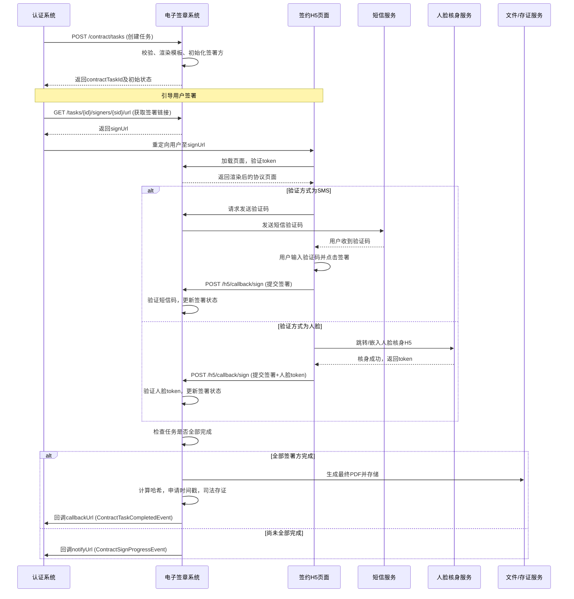
```mermaid
sequenceDiagram
    participant Auth as 认证系统
    participant Esign as 电子签章系统
    participant H5 as 签约H5页面
    participant SMS as 短信服务
    participant Face as 人脸核身服务
    participant Store as 文件/存证服务

    Auth->>Esign: POST /contract/tasks (创建任务)
    Esign->>Esign: 校验、渲染模板、初始化签署方
    Esign-->>Auth: 返回contractTaskId及初始状态

    Note over Auth, H5: 引导用户签署
    Auth->>Esign: GET /tasks/{id}/signers/{sid}/url (获取签署链接)
    Esign-->>Auth: 返回signUrl
    Auth->>H5: 重定向用户至signUrl

    H5->>Esign: 加载页面，验证token
    Esign-->>H5: 返回渲染后的协议页面

    alt 验证方式为SMS
        H5->>Esign: 请求发送验证码
        Esign->>SMS: 发送短信验证码
        SMS-->>H5: 用户收到验证码
        H5->>H5: 用户输入验证码并点击签署
        H5->>Esign: POST /h5/callback/sign (提交签署)
        Esign->>Esign: 验证短信码，更新签署状态
    else 验证方式为人脸
        H5->>Face: 跳转/嵌入人脸核身H5
        Face-->>H5: 核身成功，返回token
        H5->>Esign: POST /h5/callback/sign (提交签署+人脸token)
        Esign->>Esign: 验证人脸token，更新签署状态
    end

    Esign->>Esign: 检查任务是否全部完成
    alt 全部签署方完成
        Esign->>Store: 生成最终PDF并存储
        Esign->>Esign: 计算哈希，申请时间戳，司法存证
        Esign->>Auth: 回调callbackUrl (ContractTaskCompletedEvent)
    else 尚未全部完成
        Esign->>Auth: 回调notifyUrl (ContractSignProgressEvent)
    end
```

## 6. 错误处理

| 错误类型 | 错误码 | 处理策略 |
| :--- | :--- | :--- |
| **客户端认证失败** | `4010` | `client_id`或签名无效，拒绝请求。 |
| **参数校验失败** | `4000` | 请求参数缺失、格式错误或模板变量不匹配，返回具体错误信息。 |
| **业务状态冲突** | `4001` | 如重复创建相同`bizId`的任务、签署链接已使用等，返回明确提示。 |
| **模板不存在或禁用** | `4002` | 检查`template_id`和`biz_scene`，返回可用模板列表。 |
| **签署验证失败** | `4003` | 短信验证码错误、人脸核身失败、CA证书无效等，引导用户重试。 |
| **依赖服务异常** | `5001` | 如短信服务、人脸服务、存证平台不可用，记录日志并告警。对于可重试操作（如存证），加入异步重试队列。 |
| **回调通知失败** | `5002` | 向业务系统回调失败时，采用指数退避策略重试（最多5次），并记录监控告警。 |
| **任务流程超时** | `4080` | 定时任务扫描`expire_time`已过的任务，将状态置为`EXPIRED`，并触发失败回调。 |

## 7. 依赖说明

### 7.1 上游模块交互
- **认证系统**：
    - **调用方式**：同步HTTP调用。认证系统是电子签章系统的主要且直接的上游调用方。
    - **职责**：认证系统负责根据业务场景（关系绑定、开通付款）组装签约所需的业务参数（双方信息、业务类型），并调用本模块发起签约。同时，它需要处理本模块回调的签署进度和结果事件，以驱动其后续的认证流程（如触发打款验证）。
    - **数据流**：认证系统传递`bizId`（即`authRequestId`）用于关联，本模块在任务关键节点通过`callbackUrl`和`notifyUrl`回传状态。
    - **安全**：接口调用需通过`client_id`和基于密钥的请求签名进行双向认证，确保内部通信安全。

## 3.9 行业钱包系统


# 行业钱包系统模块设计文档

## 1. 概述

### 1.1 目的
本模块作为“天财分账”业务的**核心业务逻辑执行与关系管理中心**，是连接三代系统（业务编排）与账户系统（账户实体）、业务核心系统（资金流转）的关键枢纽。其主要目的是：
- **分账关系管理**：作为分账关系绑定（签约与认证）结果的最终持久化存储方，负责维护付款方与收款方之间的授权关系映射，并提供高效的关系校验服务。
- **分账业务处理**：接收并处理来自三代系统的分账指令（归集、批量付款、会员结算），进行业务层面的二次校验（如关系、限额），并转换为标准交易请求转发至业务核心系统执行。
- **账户能力适配与封装**：作为账户系统的上层封装，为天财专用账户提供业务场景化的操作接口（如查询、校验），并管理其专属的业务状态（如“开通付款”状态）。
- **数据同步与一致性保证**：确保账户信息、绑定关系与下游系统（如业务核心）的缓存或白名单保持最终一致，保障分账交易的顺畅执行。

### 1.2 范围
- **核心功能**：
    - **关系绑定管理**：接收三代系统通知，持久化存储生效的分账关系，并管理其生命周期（生效、失效）。
    - **开通付款管理**：针对批量付款和会员结算场景，独立维护付款方的“开通付款”状态，作为关系生效的前置条件。
    - **分账指令处理**：对三代系统转发的分账指令进行业务逻辑校验（关系、限额、场景匹配），并调用业务核心系统执行资金划转。
    - **账户与关系查询**：为三代系统、业务核心系统提供高效的账户详情、绑定关系、开通付款状态查询服务。
    - **数据同步**：监听账户、商户等核心实体的变更事件，更新本地缓存或关联数据，保证视图一致性。
- **非功能范围**：
    - 不直接驱动或管理电子签约与认证流程（由三代系统与电子签约平台负责）。
    - 不负责资金账户的底层创建与管理（由账户系统负责）。
    - 不处理资金的清算、结算与计费（由清结算系统负责）。
    - 不生成最终的用户对账单（由对账单系统负责）。

## 2. 接口设计

### 2.1 API 端点 (RESTful)

#### 2.1.1 关系绑定管理接口（内部）
- **POST /api/internal/v1/bindings** - 建立分账绑定关系（由三代系统回调触发）
- **DELETE /api/internal/v1/bindings/{bindingId}** - 解除分账绑定关系（预留，用于关系失效）
- **GET /api/internal/v1/bindings/validation** - 校验绑定关系与开通付款状态（供三代系统、业务核心调用）
- **GET /api/internal/v1/bindings** - 根据条件查询绑定关系列表（内部管理）

#### 2.1.2 分账指令处理接口（内部）
- **POST /api/internal/v1/transfers/split** - 处理分账/归集/付款指令（由三代系统同步调用或消费事件触发）

#### 2.1.3 查询服务接口（内部）
- **GET /api/internal/v1/accounts/{accountNo}/detail** - 查询账户业务详情（封装账户系统信息，附加业务状态）
- **GET /api/internal/v1/accounts/{accountNo}/open-payment-status** - 查询指定账户的开通付款状态

### 2.2 输入/输出数据结构

#### 2.2.1 建立绑定关系请求 (EstablishBindingRequest)
```json
{
  "requestId": "EST_BIND_20231027001",
  "bindingId": "BIND_202310270001", // 三代系统生成的绑定ID
  "institutionNo": "TC001",
  "sceneCode": "CAPITAL_POOLING", // 业务场景码
  "payer": {
    "merchantNo": "M100001",
    "accountNo": "TCWALLET202310270001",
    "roleType": "HEADQUARTERS"
  },
  "receiver": {
    "merchantNo": "M100002",
    "accountNo": "TCWALLET202310270002",
    "roleType": "STORE"
  },
  "effectiveTime": "2023-10-27T10:30:00Z", // 关系生效时间
  "openPaymentRequired": true, // 是否需要开通付款
  "openPaymentStatus": "PENDING" // 初始开通付款状态: PENDING, SUCCESS, FAILED
}
```

#### 2.2.2 分账指令处理请求 (ProcessSplitTransferRequest)
```json
{
  "requestId": "WALLET_TRANSFER_20231027001",
  "orderNo": "TCO202310270001", // 三代系统订单号
  "institutionNo": "TC001",
  "businessType": "CAPITAL_POOLING",
  "totalAmount": "1000.00",
  "currency": "CNY",
  "payer": {
    "merchantNo": "M100001",
    "accountNo": "TCWALLET202310270001"
  },
  "receiverList": [
    {
      "receiverMerchantNo": "M100002",
      "receiverAccountNo": "TCWALLET202310270002",
      "amount": "1000.00",
      "remark": "月度归集"
    }
  ],
  "feeBearer": "PAYER",
  "postscript": "天财归集20231027"
}
```

#### 2.2.3 绑定关系校验请求 (ValidateBindingRequest)
```json
{
  "payerAccountNo": "TCWALLET202310270001",
  "receiverAccountNo": "TCWALLET202310270002",
  "sceneCode": "CAPITAL_POOLING", // 可选，不传则校验所有场景
  "businessType": "CAPITAL_POOLING" // 业务类型，用于判断是否需要检查开通付款
}
```

#### 2.2.4 绑定关系校验响应 (ValidateBindingResponse)
```json
{
  "isValid": true,
  "bindingId": "BIND_202310270001",
  "failureReasons": [], // 无效时的原因列表
  "openPaymentStatus": "SUCCESS", // 若需要开通付款，则返回其状态
  "openPaymentRequired": true
}
```

### 2.3 发布/消费的事件

#### 2.3.1 发布的事件
- **SplitTransferProcessedEvent**: 分账指令处理完成（成功或失败）时发布。
    - 内容：三代订单号、钱包系统处理流水号、业务类型、处理状态（SUCCESS/FAILED）、失败原因、时间戳。
    - 消费者：三代系统（用于更新订单状态）、监控系统。
- **BindingSyncEvent**: 绑定关系或开通付款状态发生变更时发布。
    - 内容：绑定ID、变更类型（BINDING_CREATED, BINDING_INVALIDATED, OPEN_PAYMENT_UPDATED）、变更后的数据快照。
    - 消费者：业务核心系统（用于更新其交易路由白名单或缓存）。

#### 2.3.2 消费的事件
- **BindingEstablishedEvent** (来自三代系统)：消费此事件以持久化绑定关系，是本模块建立关系的主要入口。
- **AccountStatusChangedEvent** (来自账户系统)：消费此事件，当账户被冻结或注销时，自动将关联的绑定关系置为失效。
- **AccountCreatedEvent** (来自账户系统)：消费此事件以更新本地账户信息缓存。

## 3. 数据模型

### 3.1 数据库表设计

#### 表: `wallet_binding` (钱包绑定关系主表)
| 字段名 | 类型 | 必填 | 默认值 | 说明 |
| :--- | :--- | :--- | :--- | :--- |
| `id` | bigint | Y | AUTO_INCREMENT | 主键 |
| `binding_id` | varchar(32) | Y | | **绑定关系ID**，与三代系统一致，唯一 |
| `institution_no` | varchar(16) | Y | | 天财机构号 |
| `scene_code` | varchar(32) | Y | | 业务场景码 |
| `payer_merchant_no` | varchar(32) | Y | | 付款方商户号 |
| `payer_account_no` | varchar(32) | Y | | 付款方账户号 |
| `payer_role_type` | varchar(20) | Y | | 付款方角色类型 |
| `receiver_merchant_no` | varchar(32) | Y | | 收款方商户号 |
| `receiver_account_no` | varchar(32) | Y | | 收款方账户号 |
| `receiver_role_type` | varchar(20) | Y | | 收款方角色类型 |
| `status` | varchar(20) | Y | `EFFECTIVE` | 状态: `EFFECTIVE`, `INVALID` |
| `open_payment_required` | tinyint(1) | Y | 0 | 是否需要开通付款 |
| `open_payment_status` | varchar(20) | N | | 开通付款状态: `PENDING`, `SUCCESS`, `FAILED` |
| `effective_time` | datetime | Y | | 关系生效时间 |
| `invalid_time` | datetime | N | | 关系失效时间 |
| `invalid_reason` | varchar(255) | N | | 失效原因 |
| `version` | int | Y | 0 | 乐观锁版本号 |
| `created_at` | datetime | Y | CURRENT_TIMESTAMP | 创建时间 |
| `updated_at` | datetime | Y | CURRENT_TIMESTAMP ON UPDATE | 更新时间 |
| **索引** | | | | |
| `uk_binding_id` | UNIQUE(`binding_id`) | | | 绑定ID唯一索引 |
| `idx_payer_receiver_scene` | (`payer_account_no`, `receiver_account_no`, `scene_code`, `status`) | | | **核心查询索引**，用于关系校验 |
| `idx_payer_status` | (`payer_account_no`, `status`) | | | 按付款方查询索引 |
| `idx_receiver_status` | (`receiver_account_no`, `status`) | | | 按收款方查询索引 |

#### 表: `wallet_account_cache` (钱包账户缓存表)
| 字段名 | 类型 | 必填 | 默认值 | 说明 |
| :--- | :--- | :--- | :--- | :--- |
| `id` | bigint | Y | AUTO_INCREMENT | 主键 |
| `account_no` | varchar(32) | Y | | 账户号，唯一 |
| `merchant_no` | varchar(32) | Y | | 商户号 |
| `institution_no` | varchar(16) | Y | | 机构号 |
| `account_type` | varchar(20) | Y | | 账户类型 |
| `role_type` | varchar(20) | Y | | 角色类型 |
| `status` | varchar(20) | Y | | 账户状态 |
| `capabilities` | json | Y | | 账户能力列表 |
| `data_source` | varchar(20) | Y | `ACCOUNT_SYNC` | 数据来源: `ACCOUNT_SYNC`, `MANUAL` |
| `last_sync_time` | datetime | Y | | 最后同步时间 |
| `created_at` | datetime | Y | CURRENT_TIMESTAMP | 创建时间 |
| `updated_at` | datetime | Y | CURRENT_TIMESTAMP ON UPDATE | 更新时间 |
| **索引** | | | | |
| `uk_account_no` | UNIQUE(`account_no`) | | | 账户号唯一索引 |
| `idx_merchant_no` | (`merchant_no`) | | | 商户号查询索引 |

#### 表: `split_transfer_record` (分账处理记录表)
| 字段名 | 类型 | 必填 | 默认值 | 说明 |
| :--- | :--- | :--- | :--- | :--- |
| `id` | bigint | Y | AUTO_INCREMENT | 主键 |
| `wallet_transfer_no` | varchar(32) | Y | | **钱包系统处理流水号**，唯一 |
| `order_no` | varchar(32) | Y | | 三代系统订单号 |
| `request_id` | varchar(64) | Y | | 请求流水号，幂等键 |
| `institution_no` | varchar(16) | Y | | 天财机构号 |
| `business_type` | varchar(32) | Y | | 业务类型 |
| `payer_account_no` | varchar(32) | Y | | 付款方账户号 |
| `total_amount` | decimal(15,2) | Y | | 总金额 |
| `receiver_count` | int | Y | | 收款方数量 |
| `core_request_no` | varchar(32) | N | | 发送给业务核心系统的请求号 |
| `process_status` | varchar(20) | Y | `PROCESSING` | 处理状态: `PROCESSING`, `SUCCESS`, `FAILED` |
| `failure_reason` | varchar(512) | N | | 失败原因 |
| `processed_at` | datetime | N | | 处理完成时间 |
| `created_at` | datetime | Y | CURRENT_TIMESTAMP | 创建时间 |
| `updated_at` | datetime | Y | CURRENT_TIMESTAMP ON UPDATE | 更新时间 |
| **索引** | | | | |
| `uk_wallet_transfer_no` | UNIQUE(`wallet_transfer_no`) | | | 处理流水号唯一索引 |
| `uk_request_id` | UNIQUE(`request_id`) | | | 请求ID幂等索引 |
| `idx_order_no` | (`order_no`) | | | 三代订单号查询索引 |
| `idx_payer_processed` | (`payer_account_no`, `process_status`, `created_at`) | | | 商户交易查询索引 |

### 3.2 与其他模块的关系
- **三代系统**：上游调用方与事件来源。接收其建立绑定关系的通知，为其提供绑定关系校验服务，并处理其转发的分账指令。
- **账户系统**：底层依赖。通过同步调用查询账户详情，并通过消费事件同步账户状态变化。是本模块账户数据的权威来源。
- **业务核心系统**：下游指令执行方。将校验通过的分账指令封装为标准交易请求（如内部转账）调用业务核心系统执行。
- **清结算系统**：间接关联。通过业务核心系统触发的交易，最终由清结算系统完成资金清算、结算与计费。
- **消息队列(MQ)**：关键通信媒介。消费上游领域事件，发布本模块领域事件，实现系统间解耦。

## 4. 业务逻辑

### 4.1 核心算法
- **钱包处理流水号生成**：`WTR` + `YYYYMMDD` + `6位自增序列`。自增序列每日重置。
- **绑定关系缓存策略**：对`wallet_binding`表的核心查询索引 (`idx_payer_receiver_scene`) 对应的数据，在Redis中进行热缓存。缓存键格式：`BINDING:{payerAccountNo}:{receiverAccountNo}:{sceneCode}`，值为`ValidateBindingResponse`的JSON序列化。绑定关系变更时，淘汰或更新缓存。
- **账户信息缓存策略**：`wallet_account_cache`表作为账户系统数据的本地缓存，通过消费`AccountCreatedEvent`和`AccountStatusChangedEvent`以及定时增量同步来更新。对外查询接口优先使用此缓存，未命中或数据过期时回源到账户系统查询并刷新缓存。

### 4.2 业务规则
1. **绑定关系管理规则**：
    - 同一对付款方-收款方在同一业务场景下，只能存在一条`EFFECTIVE`状态的绑定关系。
    - 绑定关系的生效以三代系统通知为准，本模块不主动创建。
    - 当关联的付款方或收款方账户状态变为`FROZEN`或`CLOSED`时，自动将该账户涉及的所有绑定关系置为`INVALID`。
    - “开通付款”状态仅针对需要此流程的场景（批量付款、会员结算）有意义，且仅当状态为`SUCCESS`时，对应的绑定关系在相应业务类型下才被视为有效。

2. **分账指令处理规则**：
    - **前置校验**：必须依次通过以下校验：
        a. 账户基础状态校验（调用本地缓存或账户系统）。
        b. 绑定关系与开通付款状态校验（调用本地缓存或数据库）。
        c. 业务限额校验（基于商户、单笔、日累计等维度，规则可配置）。
        d. 资金可用性校验（对于付款方，需调用清结算或账户系统接口验证账户可用余额是否充足）。
    - **指令转换**：根据`businessType`，将请求转换为业务核心系统识别的交易类型码。
        - `CAPITAL_POOLING` -> 内部转账（行业钱包账户间转账）
        - `BATCH_PAYMENT` -> 批量代付（从钱包账户到外部银行卡）
        - `MEMBER_SETTLEMENT` -> 内部转账（行业钱包账户间转账）
    - **幂等与重试**：基于`requestId`保证同一指令不被重复处理。对于调用业务核心失败的情况，根据错误类型决定是否自动重试（如网络超时）或标记为失败（如余额不足）。

3. **数据同步规则**：
    - 账户缓存数据设置TTL（如5分钟），定时任务定期扫描`last_sync_time`，对过期数据主动查询账户系统更新。
    - 监听账户状态变更事件，实时更新缓存和失效关联绑定关系，并发布`BindingSyncEvent`通知业务核心。

### 4.3 验证逻辑
- **建立绑定关系请求验证**：
    - 幂等校验（`requestId`）。
    - 校验`bindingId`是否已存在，防止重复建立。
    - 校验付款方和收款方账户是否存在于本地缓存或账户系统，且状态为`ACTIVE`。
    - 校验`sceneCode`与双方`roleType`的匹配关系（与三代系统规则保持一致）。
- **分账指令处理请求验证**：
    - 幂等校验（`requestId`）。
    - 校验`businessType`的合法性。
    - 校验`payer`和所有`receiver`账户信息的有效性（通过本地缓存）。
    - 校验总金额与收款方金额列表之和是否一致。
- **绑定关系校验请求验证**：
    - 校验付款方和收款方账户号非空。
    - 若指定`sceneCode`，则校验该场景下的关系；否则，返回所有有效场景的关系列表。

## 5. 时序图

### 5.1 绑定关系建立与同步时序图
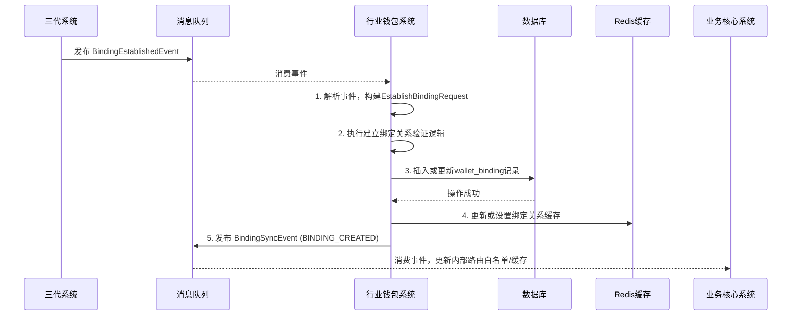
```mermaid
sequenceDiagram
    participant Gen3 as 三代系统
    participant MQ as 消息队列
    participant Wallet as 行业钱包系统
    participant DB as 数据库
    participant Cache as Redis缓存
    participant Core as 业务核心系统

    Gen3->>MQ: 发布 BindingEstablishedEvent
    MQ-->>Wallet: 消费事件
    Wallet->>Wallet: 1. 解析事件，构建EstablishBindingRequest
    Wallet->>Wallet: 2. 执行建立绑定关系验证逻辑
    Wallet->>DB: 3. 插入或更新wallet_binding记录
    DB-->>Wallet: 操作成功
    Wallet->>Cache: 4. 更新或设置绑定关系缓存
    Wallet->>MQ: 5. 发布 BindingSyncEvent (BINDING_CREATED)
    MQ-->>Core: 消费事件，更新内部路由白名单/缓存
```

### 5.2 分账指令处理时序图
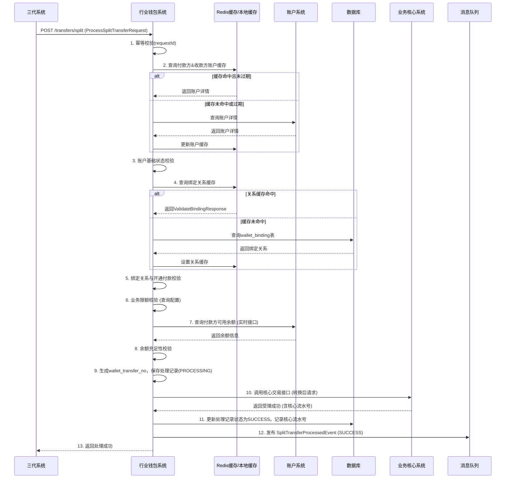
```mermaid
sequenceDiagram
    participant Gen3 as 三代系统
    participant Wallet as 行业钱包系统
    participant Cache as Redis缓存/本地缓存
    participant Account as 账户系统
    participant DB as 数据库
    participant Core as 业务核心系统
    participant MQ as 消息队列

    Gen3->>Wallet: POST /transfers/split (ProcessSplitTransferRequest)
    Wallet->>Wallet: 1. 幂等校验(requestId)
    Wallet->>Cache: 2. 查询付款方&收款方账户缓存
    alt 缓存命中且未过期
        Cache-->>Wallet: 返回账户详情
    else 缓存未命中或过期
        Wallet->>Account: 查询账户详情
        Account-->>Wallet: 返回账户详情
        Wallet->>Cache: 更新账户缓存
    end
    Wallet->>Wallet: 3. 账户基础状态校验
    Wallet->>Cache: 4. 查询绑定关系缓存
    alt 关系缓存命中
        Cache-->>Wallet: 返回ValidateBindingResponse
    else 缓存未命中
        Wallet->>DB: 查询wallet_binding表
        DB-->>Wallet: 返回绑定关系
        Wallet->>Cache: 设置关系缓存
    end
    Wallet->>Wallet: 5. 绑定关系与开通付款校验
    Wallet->>Wallet: 6. 业务限额校验 (查询配置)
    Wallet->>Account: 7. 查询付款方可用余额 (实时接口)
    Account-->>Wallet: 返回余额信息
    Wallet->>Wallet: 8. 余额充足性校验
    Wallet->>Wallet: 9. 生成wallet_transfer_no，保存处理记录(PROCESSING)
    Wallet->>Core: 10. 调用核心交易接口 (转换后请求)
    Core-->>Wallet: 返回受理成功 (含核心流水号)
    Wallet->>DB: 11. 更新处理记录状态为SUCCESS，记录核心流水号
    Wallet->>MQ: 12. 发布 SplitTransferProcessedEvent (SUCCESS)
    Wallet-->>Gen3: 13. 返回处理成功
```

## 6. 错误处理

| 错误码 | HTTP状态码 | 描述 | 处理策略 |
| :--- | :--- | :--- | :--- |
| `WALLET_4001` | 400 Bad Request | 请求参数无效或缺失 | 调用方检查请求体格式和必填字段 |
| `WALLET_4002` | 400 Bad Request | 业务类型不支持 | 调用方确认`businessType`值是否正确 |
| `WALLET_4091` | 409 Conflict | 重复请求 (requestId已处理) | 调用方使用原请求结果，无需重试 |
| `WALLET_4031` | 403 Forbidden | 账户状态异常 | 调用方检查对应账户状态，或等待账户系统恢复 |
| `WALLET_4032` | 403 Forbidden | 绑定关系不存在或无效 | 调用方需先完成关系绑定（及开通付款）流程 |
| `WALLET_4033` | 403 Forbidden | 开通付款未完成或失败 | 调用方需引导付款方完成开通付款流程 |
| `WALLET_4034` | 403 Forbidden | 超出业务限额 | 调用方调整金额或联系运营调整限额 |
| `WALLET_4035` | 403 Forbidden | 付款方余额不足 | 调用方确认付款账户资金情况 |
| `WALLET_4241` | 424 Failed Dependency | 依赖服务（账户/核心）调用失败或返回错误 | 根据依赖服务错误码决定是否可重试，并记录详细日志 |
| `WALLET_5001` | 500 Internal Server Error | 内部处理异常 | 服务端记录日志告警，调用方可有限重试 |

**通用策略**：
- **客户端错误(4xx)**：由调用方（三代系统）修正业务状态或参数后重试。
- **服务端错误(5xx)与依赖错误(424)**：实现带指数退避的自动重试机制（针对网络抖动、短暂超时）。对于业务性错误（如余额不足），不重试，直接失败。
- **幂等性**：所有写操作（建立关系、处理分账）必须支持幂等，通过`requestId`或`bindingId`保证。
- **最终一致性**：绑定关系同步、账户缓存更新通过消费领域事件保证最终一致性。在短暂不一致窗口期，依赖服务调用时的实时校验作为兜底。

## 7. 依赖说明

### 7.1 上游模块交互
1. **三代系统**：
    - **交互方式**：同步REST API调用（分账指令处理） + 异步事件消费 (`BindingEstablishedEvent`)。
    - **职责**：三代系统是业务指令的发起者和绑定关系的权威裁决者。钱包系统执行其下达的指令，并信任其通知的绑定关系结果。

2. **账户系统**：
    - **交互方式**：同步REST API调用（实时余额、账户详情查询） + 异步事件消费 (`AccountCreatedEvent`, `AccountStatusChangedEvent`)。
    - **职责**：账户系统是账户实体和状态的权威源。钱包系统严重依赖其进行业务校验，并通过事件同步维护本地数据视图的一致性。

### 7.2 下游模块交互
1. **业务核心系统**：
    - **交互方式**：同步REST API调用（提交标准交易请求）。
    - **职责**：业务核心是资金流转的执行引擎。钱包系统将校验通过的业务指令转换为核心系统识别的交易格式，由其完成最终的账务处理。

2. **消息队列(MQ)**：
    - **交互方式**：发布领域事件 (`SplitTransferProcessedEvent`, `BindingSyncEvent`)。
    - **职责**：通知其他系统本模块的业务处理结果和状态变更，实现松耦合。

### 7.3 关键依赖管理
- **强依赖**：数据库、账户系统（实时校验）、业务核心系统（指令执行）。
- **弱依赖**：Redis缓存（缓存失效可回源数据库）、三代系统事件（事件延迟可通过定时补偿任务处理）。
- **降级方案**：
    - 账户系统查询超时：对于非实时性要求的查询（如管理后台），可返回缓存数据并标记“数据可能延迟”。对于交易中的实时校验，必须失败快速返回，阻止交易。
    - 业务核心系统不可用：分账指令处理接口直接返回“交易通道繁忙”，并记录日志告警。三代系统需具备重试机制。
    - Redis不可用：所有查询直接回源数据库，性能下降但功能可用。需监控数据库负载。

## 3.10 风控系统


# 风控系统模块设计文档

## 1. 概述

### 1.1 目的
本模块作为支付系统“天财分账”业务的核心风险控制中枢，旨在为资金流转的各个关键环节提供实时、精准、可配置的风险识别与干预能力。其主要目的是：
- **风险识别与评估**：在交易发起、关系绑定、资金划转等关键节点，基于多维度规则和模型，实时识别潜在风险（如欺诈、洗钱、合规违规、操作风险）。
- **风险决策与处置**：根据风险等级，自动执行相应的风险处置策略（如放行、增强验证、延迟处理、拦截、告警），实现风险与体验的平衡。
- **风险监控与洞察**：持续监控业务风险态势，提供风险大盘、实时告警和深度分析报告，支持风险策略的持续优化。
- **合规与审计支持**：确保“天财分账”业务符合反洗钱、反欺诈等监管要求，并提供完整的风险处置证据链，满足审计需求。

### 1.2 范围
- **核心功能**：
    - **实时风险决策引擎**：接收来自业务核心、行业钱包等系统的风险检查请求，执行规则和模型计算，返回风险决策结果。
    - **规则与策略管理**：提供可视化界面，支持风险规则（如金额阈值、频次限制、名单校验）和处置策略（如验证、拦截）的动态配置、发布和版本管理。
    - **风险名单管理**：管理黑名单、灰名单、白名单，支持名单的增删改查、导入导出和有效期管理。
    - **风险监控与告警**：实时监控风险事件、规则命中率、处置效果等指标，对高风险事件和系统异常进行实时告警。
    - **案件调查与处置**：为运营人员提供风险案件调查工作台，支持人工复核、处置（如解冻账户、调整名单）和备注。
    - **数据采集与特征计算**：从各业务系统采集风险相关数据（如交易、账户、行为日志），并计算风险特征（如历史交易总额、近期失败率）。
- **非功能范围**：
    - 不直接执行业务操作（如冻结账户由账户系统执行，拦截交易由业务核心执行）。
    - 不替代上游系统的业务逻辑校验（如余额充足性、关系绑定有效性）。
    - 不存储完整的业务数据（如交易详情、账户余额），仅存储风险决策所需的特征和结果。

## 2. 接口设计

### 2.1 API 端点 (RESTful)

#### 2.1.1 风险决策接口 (供业务系统同步调用)
- **POST /api/v1/risk/decision** - 通用风险决策入口，根据场景执行风险检查。
- **POST /api/v1/risk/decision/batch** - 批量风险决策，用于批量付款等场景的预检。

#### 2.1.2 名单管理接口 (内部/运营)
- **POST /api/v1/risk/lists/items** - 添加名单项（黑/灰/白名单）。
- **DELETE /api/v1/risk/lists/items/{id}** - 移除名单项。
- **GET /api/v1/risk/lists/check** - 检查指定实体（账户、商户、用户）是否在名单中。

#### 2.1.3 运营与管理接口
- **GET /api/v1/risk/monitor/dashboard** - 获取风险监控大盘数据。
- **POST /api/v1/risk/cases/{caseId}/process** - 人工处理风险案件。

### 2.2 输入/输出数据结构

#### 2.2.1 风险决策请求 (RiskDecisionRequest)
```json
{
  "requestId": "RISK_DECISION_202310270001",
  "sceneCode": "TC_SPLIT_PRE_CHECK", // 风险场景码，决定使用哪组规则
  "entityInfo": {
    "payerAccountNo": "TCWALLET202310270001",
    "payerMerchantNo": "M100001",
    "payeeAccountNoList": ["TCWALLET202310270002"],
    "payerUserId": "U10001", // 操作人ID（如门店店长）
    "payerIp": "192.168.1.1",
    "payerDeviceId": "DEVICE_001"
  },
  "transactionInfo": {
    "bizScene": "FUND_POOLING",
    "totalAmount": "10000.00",
    "currency": "CNY",
    "payeeCount": 1
  },
  "timestamp": "2023-10-27T10:00:00Z"
}
```

#### 2.2.2 风险决策响应 (RiskDecisionResponse)
```json
{
  "requestId": "RISK_DECISION_202310270001",
  "decision": "PASS", // 决策结果: PASS, REVIEW, REJECT
  "riskLevel": "LOW", // 风险等级: LOW, MEDIUM, HIGH
  "riskScore": 35, // 风险评分 (0-100)
  "hitRules": [ // 命中的规则列表
    {
      "ruleId": "RULE_TC_AMOUNT_DAILY_LIMIT",
      "ruleName": "天财单日分账总额超限",
      "ruleDesc": "单个付款方账户单日向不同收款方分账总额超过10万元",
      "hitValue": "100000.00"
    }
  ],
  "actions": [ // 建议执行的风险处置动作
    {
      "actionCode": "SEND_ALERT", // 发送告警
      "actionParams": {
        "alertLevel": "WARNING",
        "alertTo": "risk_operator"
      }
    }
  ],
  "suggestions": [ // 给上游系统的建议（非强制）
    {
      "suggestionCode": "ENHANCED_AUTH",
      "suggestionMsg": "建议触发人脸验证进行二次确认"
    }
  ],
  "expireTime": "2023-10-27T10:05:00Z" // 决策结果缓存有效期
}
```

#### 2.2.3 名单检查请求 (ListCheckRequest)
```json
{
  "entityType": "ACCOUNT", // 实体类型: ACCOUNT, MERCHANT, USER, CARD, IP, DEVICE
  "entityId": "TCWALLET202310270001",
  "listTypes": ["BLACK", "GRAY"] // 检查的名单类型
}
```

### 2.3 发布/消费的事件

#### 2.3.1 发布的事件
- **RiskEventDetectedEvent**: 当风险决策结果为`REVIEW`或`REJECT`，或命中高风险规则时发布。
    - 内容：请求ID、场景码、决策结果、风险等级、命中规则、相关实体、时间。
    - 消费者：监控告警系统（触发实时告警）、案件管理系统（创建待处理案件）。
- **RiskListUpdatedEvent**: 当风险名单（黑、灰、白名单）发生增删改时发布。
    - 内容：名单类型、实体类型、实体ID、操作类型（ADD/REMOVE）、操作人、时间。
    - 消费者：规则引擎（更新本地缓存）、业务核心/账户系统（用于实时拦截或限制）。

#### 2.3.2 消费的事件
- **SettlementCompletedEvent** (来自清结算系统)：消费交易完成事件，用于事后风险分析、特征计算（如累计交易额更新）和模型训练。
- **AccountStatusChangedEvent** (来自账户系统)：消费账户状态变更事件，特别是变为`FROZEN`/`DISABLED`时，可能触发关联实体加入灰名单。
- **MerchantCreatedEvent** (来自三代系统)：消费新商户创建事件，用于初始化风险档案和进行准入风险扫描。

## 3. 数据模型

### 3.1 数据库表设计

#### 表: `risk_decision_record` (风险决策记录表)
| 字段名 | 类型 | 必填 | 默认值 | 说明 |
| :--- | :--- | :--- | :--- | :--- |
| `id` | bigint | Y | AUTO_INCREMENT | 主键 |
| `request_id` | varchar(64) | Y | | 请求流水号，唯一 |
| `scene_code` | varchar(32) | Y | | 风险场景码 |
| `decision` | varchar(20) | Y | | 决策结果: `PASS`, `REVIEW`, `REJECT` |
| `risk_level` | varchar(20) | Y | | 风险等级: `LOW`, `MEDIUM`, `HIGH` |
| `risk_score` | int | Y | | 风险评分 (0-100) |
| `hit_rules` | json | | NULL | 命中的规则ID和详情 |
| `actions` | json | | NULL | 执行的处置动作 |
| `entity_info` | json | Y | | 决策涉及的实体信息快照 |
| `transaction_info` | json | | NULL | 交易信息快照 |
| `cost_time` | int | Y | | 决策耗时(毫秒) |
| `created_at` | datetime | Y | CURRENT_TIMESTAMP | 创建时间 |
| **索引** | | | | |
| `uk_request_id` | UNIQUE(`request_id`) | | | 请求流水号索引 |
| `idx_scene_decision_time` | (`scene_code`, `decision`, `created_at`) | | | 场景与决策分析索引 |
| `idx_entity_account` | (`entity_info`->'$.payerAccountNo'`, `created_at`) | | | 付款方账户查询索引 (虚拟列) |

#### 表: `risk_rule` (风险规则表)
| 字段名 | 类型 | 必填 | 默认值 | 说明 |
| :--- | :--- | :--- | :--- | :--- |
| `id` | bigint | Y | AUTO_INCREMENT | 主键 |
| `rule_id` | varchar(64) | Y | | 规则唯一标识 |
| `rule_name` | varchar(128) | Y | | 规则名称 |
| `rule_desc` | varchar(512) | | NULL | 规则描述 |
| `scene_codes` | json | Y | | 适用的风险场景码列表 |
| `condition_expression` | text | Y | | 规则条件表达式 (如 Groovy, AVIATOR) |
| `risk_level` | varchar(20) | Y | | 规则对应的风险等级 |
| `risk_score` | int | Y | | 规则对应的风险分数 |
| `action_codes` | json | Y | | 命中后触发的动作码列表 |
| `priority` | int | Y | 0 | 规则优先级，数字越大优先级越高 |
| `status` | varchar(20) | Y | `ACTIVE` | 状态: `ACTIVE`, `INACTIVE`, `DRAFT` |
| `version` | int | Y | 1 | 规则版本 |
| `created_at` | datetime | Y | CURRENT_TIMESTAMP | 创建时间 |
| `updated_at` | datetime | Y | CURRENT_TIMESTAMP ON UPDATE | 更新时间 |
| **索引** | | | | |
| `uk_rule_id_version` | UNIQUE(`rule_id`, `version`) | | | 规则ID与版本唯一索引 |
| `idx_status_scene` | (`status`, `scene_codes`(255)) | | | 状态与场景查询索引 |

#### 表: `risk_list` (风险名单表)
| 字段名 | 类型 | 必填 | 默认值 | 说明 |
| :--- | :--- | :--- | :--- | :--- |
| `id` | bigint | Y | AUTO_INCREMENT | 主键 |
| `list_type` | varchar(20) | Y | | 名单类型: `BLACK`, `GRAY`, `WHITE` |
| `entity_type` | varchar(20) | Y | | 实体类型: `ACCOUNT`, `MERCHANT`, `USER`, `CARD`, `IP`, `DEVICE` |
| `entity_id` | varchar(64) | Y | | 实体标识 (如账户号、商户号、IP地址) |
| `entity_name` | varchar(128) | | NULL | 实体名称 (便于展示) |
| `reason` | varchar(512) | Y | | 加入名单原因 |
| `source` | varchar(64) | Y | | 来源: `MANUAL`, `RULE_AUTO`, `THIRD_PARTY` |
| `effective_time` | datetime | Y | | 生效时间 |
| `expire_time` | datetime | | NULL | 过期时间 (NULL为永久) |
| `status` | varchar(20) | Y | `VALID` | 状态: `VALID`, `INVALID` |
| `operator` | varchar(64) | Y | | 操作人 |
| `created_at` | datetime | Y | CURRENT_TIMESTAMP | 创建时间 |
| **索引** | | | | |
| `uk_entity_type_id_list` | UNIQUE(`entity_type`, `entity_id`, `list_type`) | | | 实体与名单类型唯一索引 |
| `idx_list_type_status` | (`list_type`, `status`, `expire_time`) | | | 名单查询索引 |

#### 表: `risk_feature` (风险特征表)
| 字段名 | 类型 | 必填 | 默认值 | 说明 |
| :--- | :--- | :--- | :--- | :--- |
| `id` | bigint | Y | AUTO_INCREMENT | 主键 |
| `entity_type` | varchar(20) | Y | | 实体类型 |
| `entity_id` | varchar(64) | Y | | 实体标识 |
| `feature_code` | varchar(64) | Y | | 特征码 (如: DAILY_SPLIT_AMT) |
| `feature_value` | text | Y | | 特征值 (JSON或字符串) |
| `stat_window` | varchar(20) | Y | | 统计窗口: `D1`(近1天), `H1`(近1小时), `ALL`(历史累计) |
| `calculated_at` | datetime | Y | | 计算时间 |
| `expire_at` | datetime | Y | | 特征过期时间 (用于TTL) |
| **索引** | | | | |
| `uk_entity_feature_window` | UNIQUE(`entity_type`, `entity_id`, `feature_code`, `stat_window`) | | | 唯一索引 |
| `idx_entity_id` | (`entity_id`, `calculated_at`) | | | 实体查询索引 |

#### 表: `risk_case` (风险案件表)
| 字段名 | 类型 | 必填 | 默认值 | 说明 |
| :--- | :--- | :--- | :--- | :--- |
| `id` | bigint | Y | AUTO_INCREMENT | 主键 |
| `case_no` | varchar(32) | Y | | 案件编号 |
| `case_type` | varchar(32) | Y | | 案件类型: `FRAUD_SUSPECT`, `AML_ALERT`, `OPERATION_RISK` |
| `priority` | varchar(20) | Y | `MEDIUM` | 优先级: `HIGH`, `MEDIUM`, `LOW` |
| `status` | varchar(20) | Y | `OPEN` | 状态: `OPEN`, `INVESTIGATING`, `CLOSED` |
| `related_request_id` | varchar(64) | | NULL | 关联的风险决策请求ID |
| `related_entities` | json | Y | | 关联的实体信息 |
| `risk_level` | varchar(20) | Y | | 风险等级 |
| `hit_rules` | json | | NULL | 触发案件的规则 |
| `description` | text | | NULL | 案件描述 |
| `assignee` | varchar(64) | | NULL | 当前处理人 |
| `closed_reason` | varchar(512) | | NULL | 关闭原因 |
| `closed_at` | datetime | | NULL | 关闭时间 |
| `created_at` | datetime | Y | CURRENT_TIMESTAMP | 创建时间 |
| `updated_at` | datetime | Y | CURRENT_TIMESTAMP ON UPDATE | 更新时间 |
| **索引** | | | | |
| `uk_case_no` | UNIQUE(`case_no`) | | | 案件号索引 |
| `idx_status_priority` | (`status`, `priority`, `created_at`) | | | 待处理案件查询索引 |

### 3.2 与其他模块的关系
- **业务核心系统**：主要服务对象。在发起“天财分账”交易前，业务核心系统调用风控系统进行实时风险决策。根据决策结果，业务核心决定是否继续执行交易、触发增强验证或直接拒绝。
- **行业钱包系统**：上游调用方。在关系绑定、开通付款等关键业务环节，调用风控系统进行风险检查（如检查绑定双方是否存在风险关联）。
- **账户系统**：数据消费者与影响者。风控系统消费`AccountStatusChangedEvent`以感知账户风险状态变化；同时，风控系统可通过发布风险事件，间接驱动账户系统执行冻结等操作（需通过工作流或人工）。
- **清结算系统**：数据消费者。消费`SettlementCompletedEvent`用于事后风险分析、特征计算和模型训练，形成风险防控闭环。
- **消息队列(MQ)**：核心通信媒介。通过发布和消费领域事件，实现与各业务系统的松耦合风险信息同步。
- **规则管理平台**（可能为独立运营系统）：提供规则配置界面，将配置好的规则同步至风控系统的`risk_rule`表。

## 4. 业务逻辑

### 4.1 核心算法
- **规则引擎执行算法**：
    1. **场景匹配**：根据`sceneCode`加载所有`ACTIVE`状态的规则。
    2. **规则排序**：按`priority`降序排列。
    3. **顺序执行**：依次执行规则条件表达式。
    4. **结果聚合**：
        - 若命中`REJECT`级规则，立即终止，返回`REJECT`决策。
        - 累计所有命中规则的风险分数，根据总分映射风险等级（如0-30 LOW, 31-70 MEDIUM, 71-100 HIGH）。
        - 决策映射：`HIGH`->`REJECT`, `MEDIUM`->`REVIEW`, `LOW`->`PASS`。
    5. **动作合并**：合并所有命中规则建议的动作，去重后生成最终动作列表。
- **风险特征计算**：
    - **实时特征**：在决策时实时查询或计算（如名单检查）。
    - **离线/准实时特征**：通过消费`SettlementCompletedEvent`，使用Flink/Spark Streaming计算滚动窗口内的聚合特征（如近1小时交易次数、近24小时交易总额），写入`risk_feature`表，并设置TTL。
- **风险评分模型**：
    - 初期可采用**规则加权评分卡**模型。
    - 后期可引入机器学习模型（如XGBoost），将特征向量输入模型得到风险概率，再转换为风险分数。

### 4.2 业务规则（示例）
1. **名单规则**：
    - 付款方或收款方账户在**黑名单**中，直接拒绝交易。
    - 付款方在**灰名单**中，决策升级为`REVIEW`，并提示人工审核。
    - 收款方在**白名单**中，可适当降低其他规则的风险分数。
2. **交易行为规则**：
    - **单笔限额**：单笔分账金额超过10万元，风险分数+20。
    - **日累计限额**：单个付款方账户当日累计分账金额超过50万元，风险分数+40，决策可能变为`REVIEW`。
    - **频次限制**：同一付款方账户1分钟内发起超过5笔分账，风险分数+30，触发`REVIEW`。
    - **收款方分散度**：单笔交易向超过20个不同收款方分账，风险分数+50，触发`REVIEW`（防洗钱）。
3. **关联风险规则**：
    - 付款方与收款方账户属于同一法人或存在控股关系（需接入工商信息），风险分数-10（降低内部交易风险）。
    - 付款方IP地址与常用登录地不符，风险分数+15。
4. **场景特定规则**：
    - **归集场景**：检查门店（付款方）与总部（收款方）的签约关系是否在有效期内。
    - **批量付款场景**：检查付款方（总部）是否已完成“开通付款”认证。

### 4.3 验证逻辑
- **决策请求验证**：
    1. 校验必填字段：`requestId`, `sceneCode`, `entityInfo`。
    2. 校验`sceneCode`是否在已配置的范围内。
    3. 校验`requestId`幂等性（防止重复决策消耗资源）。
- **规则执行验证**：
    1. 执行规则条件表达式前，检查语法合法性。
    2. 对于依赖外部数据（如实时特征）的规则，设置查询超时和降级策略（如默认值）。
    3. 单个规则执行失败不应导致整个决策失败，应记录错误并跳过，继续执行其他规则。
- **特征计算验证**：
    1. 确保特征计算的数据来源（如事件）的完整性和时序性。
    2. 对计算出的特征值进行合理性校验（如金额不为负）。

## 5. 时序图

### 5.1 天财分账交易前风险决策时序图
```mermaid
sequenceDiagram
    participant Core as 业务核心系统
    participant Risk as 风控系统
    participant DB as 数据库/缓存
    participant MQ as 消息队列
    participant Wallet as 行业钱包系统

    Core->>Risk: POST /risk/decision (RiskDecisionRequest)
    Risk->>Risk: 1. 请求校验与幂等检查
    Risk->>DB: 2. 加载场景规则(risk_rule)
    
    loop 规则执行
        Risk->>Risk: 3. 执行规则条件
        alt 需要名单检查
            Risk->>DB: 查询风险名单(risk_list)
        end
        alt 需要特征值
            Risk->>DB: 查询风险特征(risk_feature)
        end
        Risk->>Risk: 4. 评估规则是否命中
    end

    Risk->>Risk: 5. 聚合结果，计算风险分与决策
    Risk->>DB: 6. 保存决策记录(risk_decision_record)
    
    alt 决策为 REVIEW 或 REJECT
        Risk->>MQ: 发布 RiskEventDetectedEvent
        MQ-->>Risk: 自身消费，创建风险案件(risk_case)
    end

    Risk-->>Core: 返回 RiskDecisionResponse
    Note over Core: 根据决策结果决定后续流程<br>PASS: 继续交易<br>REVIEW: 挂起并等待人工审核<br>REJECT: 终止交易并提示用户
```

### 5.2 基于交易事件的特征更新时序图
```mermaid
sequenceDiagram
    participant Settle as 清结算系统
    participant MQ as 消息队列
    participant Risk as 风控系统
    participant Stream as 流计算引擎(Flink)
    participant DB as 数据库

    Settle->>MQ: 发布 SettlementCompletedEvent
    MQ-->>Risk: 消费事件
    Risk->>Risk: 1. 解析事件，提取实体(付款方、收款方)和交易信息
    Risk->>Stream: 2. 发送特征计算消息
    Stream->>Stream: 3. 滚动窗口聚合计算(如近1小时交易额)
    Stream->>DB: 4. 更新risk_feature表
    Note over Risk,DB: 特征更新后，后续风险决策将使用新特征值
```

## 6. 错误处理

| 错误码 | HTTP状态码 | 描述 | 处理策略 |
| :--- | :--- | :--- | :--- |
| `RISK_4001` | 400 Bad Request | 请求参数无效或缺失 | 客户端检查请求体，补充必要信息 |
| `RISK_4002` | 400 Bad Request | 不支持的风险场景码 | 客户端检查sceneCode是否正确 |
| `RISK_4091` | 409 Conflict | 重复请求 (requestId已处理) | 客户端查询原决策结果，无需重试 |
| `RISK_5001` | 500 Internal Server Error | 规则引擎执行异常 | 服务端告警，检查规则语法。客户端可降级为放行（根据场景）或阻塞等待修复 |
| `RISK_5002` | 500 Internal Server Error | 特征计算服务异常 | 服务端告警，决策降级为使用默认特征或跳过相关规则 |
| `RISK_5031` | 503 Service Unavailable | 依赖的缓存/数据库超时 | 服务端熔断，返回默认决策（如PASS with HIGH risk），并记录日志 |
| `RISK_5032` | 503 Service Unavailable | 消息队列发布失败 | 服务端记录日志并异步重试，不影响主决策流程响应 |

**通用策略**：
- **降级策略**：核心是保证业务不因风控系统故障而完全中断。当风控系统严重不可用时，可提供“降级开关”，由业务核心系统直接放行交易，同时记录日志供事后追查。
- **超时控制**：风险决策接口必须设置严格超时（如200ms）。超时后，风控系统应返回超时错误，由调用方（业务核心）根据预设策略（如放行或拒绝）处理。
- **监控与自愈**：对规则执行失败、特征计算延迟、接口超时率等关键指标进行监控。自动禁用频繁出错的规则。
- **审计追踪**：所有风险决策、名单操作、案件处理都必须留有完整、不可篡改的日志，满足合规审计要求。

## 7. 依赖说明

### 7.1 上游模块交互
1. **业务核心系统**：
    - **交互方式**：同步REST API调用 (`/risk/decision`)。这是风控系统最主要的流量入口。
    - **职责**：业务核心在关键业务环节（如创建分账订单前）调用风控，并根据返回的决策结果和动作建议执行业务流程。风控系统必须提供高可用、低延迟的决策服务。
    - **降级方案**：
        - **超时降级**：业务核心设置调用超时，超时后按预设策略（如“默认放行但记录告警”）处理。
        - **熔断降级**：业务核心集成熔断器，当风控接口错误率超过阈值，直接降级处理。
        - **开关降级**：运营人员可通过配置中心一键将特定场景的风控检查关闭。

2. **行业钱包系统**：
    - **交互方式**：同步REST API调用。主要用于关系绑定、开通付款等环节的风险检查。
    - **职责**：钱包系统在建立资金关系前，需评估双方风险。风控系统提供针对性的场景规则。
    - **降级方案**：同业务核心系统。

### 7.2 下游模块交互
1. **消息队列(MQ)**：
    - **交互方式**：发布 (`RiskEventDetectedEvent`, `RiskListUpdatedEvent`) 和 消费 (`SettlementCompletedEvent`, `AccountStatusChangedEvent`)。
    - **职责**：实现异步、解耦的通信。事件发布是风控系统影响其他系统（如触发告警）的主要方式。
    - **可靠性**：必须保证关键事件（如名单更新）的可靠投递，采用生产者确认和消费者手动确认机制。

2. **清结算系统 & 账户系统**：
    - **交互方式**：异步事件消费。
    - **职责**：风控系统消费其事件以获取最新的业务数据，用于风险特征计算和模型训练。这是风控系统“感知”业务世界的主要途径。
    - **数据一致性**：接受最终一致性。特征计算基于事件流，允许短暂延迟。

### 7.3 关键依赖管理
- **强依赖**：规则引擎核心库、数据库（MySQL/Redis）、业务核心系统（调用方）。
- **弱依赖**：流计算引擎（Flink）、外部数据源（如工商信息API）。这些依赖故障不应阻塞实时决策流程，可通过使用缓存数据或跳过相关规则降级。
- **缓存策略**：
    - **规则缓存**：所有`ACTIVE`规则在服务启动时加载至本地内存（如Guava Cache），并通过监听数据库变更事件实时更新。
    - **名单缓存**：高频查询的黑/白名单缓存至Redis，设置合理过期时间，并通过`RiskListUpdatedEvent`主动刷新。
    - **特征缓存**：常用风险特征（如当日累计金额）缓存至Redis，加速决策。

## 3.11 退货前置模块


# 退货前置模块设计文档

## 1. 概述

### 1.1 目的
退货前置模块是“天财分账”业务场景中，专门负责处理退货交易资金预校验和预扣减的核心模块。其主要目的是：
- **资金安全与风险控制**：在退货交易实际发生前，预先锁定或验证退货资金来源，确保退货资金充足，避免超退风险。
- **流程解耦与性能优化**：将退货资金校验环节从核心交易流程中剥离，实现异步或并行处理，提升整体交易处理效率和响应速度。
- **多账户源支持**：统一处理从天财收款账户（行业钱包）或04退货账户扣减资金的逻辑，为上游业务方提供简洁、一致的接口。
- **状态管理与防重放**：管理退货查询与扣减的中间状态，防止同一笔退货被重复扣款，保证资金操作的幂等性和最终一致性。

### 1.2 范围
- **核心功能**：
    - **退货资金查询**：接收上游查询请求，根据配置的退货资金源（收款账户或04账户），计算并返回当前可退余额。
    - **退货资金扣减**：在用户确认退货后，执行对指定账户的资金扣减操作，并更新前置处理状态。
    - **状态与有效期管理**：为每次查询结果设置有效期，并跟踪从查询到扣减的全流程状态，确保流程的连贯性和安全性。
    - **资金源路由与适配**：根据业务规则和账户类型，将扣款请求路由至正确的底层账户系统（清结算系统）。
- **非功能范围**：
    - 不处理具体的退货业务逻辑（如退货原因审核、商品状态管理）。
    - 不直接管理账户实体和余额（依赖清结算系统作为权威数据源）。
    - 不生成最终的退货交易凭证和账单（由业务核心和清结算系统完成）。
    - 不处理与银行通道的交互（资金扣减仅为内部记账）。

## 2. 接口设计

### 2.1 API 端点 (RESTful)

#### 2.1.1 核心业务接口
- **POST /api/v1/refund-pre/query** - 退货前置查询（查询可退余额及有效期）
- **POST /api/v1/refund-pre/deduct** - 退货前置扣减（执行资金扣减）

#### 2.1.2 管理与查询接口（内部）
- **GET /api/v1/refund-pre/records/{requestId}** - 根据请求ID查询处理记录
- **GET /api/v1/refund-pre/records** - 根据商户号、原订单号等条件查询记录列表
- **POST /api/v1/refund-pre/records/{recordId}/compensate** - 人工冲正/补偿接口（用于异常处理）

### 2.2 输入/输出数据结构

#### 2.2.1 退货前置查询请求 (RefundPreQueryRequest)
```json
{
  "requestId": "RPQ202310270001", // 请求流水号，全局唯一，用于幂等
  "merchantNo": "M100001", // 发起退货的商户号
  "storeNo": "S10001", // 门店编号（可选，用于门店维度风控）
  "originalOrderNo": "ORDER202310270001", // 原消费订单号
  "originalAmount": "100.00", // 原订单金额
  "refundAmount": "50.00", // 本次请求退货金额
  "accountType": "RECEIVABLE | REFUND", // 扣款账户类型：收款账户 | 04退货账户
  "bizScene": "NORMAL_REFUND | PARTIAL_REFUND", // 业务场景：全额退 | 部分退
  "extInfo": {
    "operator": "user123",
    "reason": "商品质量问题"
    // ... 其他业务扩展信息
  }
}
```

#### 2.2.2 退货前置查询响应 (RefundPreQueryResponse)
```json
{
  "code": "SUCCESS",
  "message": "查询成功",
  "data": {
    "requestId": "RPQ202310270001",
    "merchantNo": "M100001",
    "originalOrderNo": "ORDER202310270001",
    "availableAmount": "80.00", // 当前可退余额
    "requestedAmount": "50.00",
    "isSufficient": true, // 是否充足
    "accountType": "RECEIVABLE",
    "deductToken": "TOKEN_ABC123XYZ", // 扣减凭证，有效期內扣减需携带
    "expireTime": "2023-10-27T10:05:00Z", // 过期时间（默认查询后5分钟）
    "suggestedAction": "PROCEED" // 建议操作: PROCEED(继续), INSUFFICIENT(余额不足), SUSPEND(暂停-风控)
  }
}
```

#### 2.2.3 退货前置扣减请求 (RefundPreDeductRequest)
```json
{
  "requestId": "RPD202310270001", // 扣减请求流水号，全局唯一
  "queryRequestId": "RPQ202310270001", // 对应的查询请求ID
  "deductToken": "TOKEN_ABC123XYZ", // 查询返回的扣减凭证
  "merchantNo": "M100001",
  "refundOrderNo": "REFUND202310270001", // 本次退货订单号（业务系统生成）
  "refundAmount": "50.00", // 扣减金额（需与查询金额一致）
  "accountType": "RECEIVABLE",
  "operator": "user123",
  "extInfo": {
    // ... 扣减相关扩展信息
  }
}
```

#### 2.2.4 退货前置扣减响应 (RefundPreDeductResponse)
```json
{
  "code": "SUCCESS",
  "message": "扣减成功",
  "data": {
    "requestId": "RPD202310270001",
    "queryRequestId": "RPQ202310270001",
    "refundOrderNo": "REFUND202310270001",
    "deductAmount": "50.00",
    "accountNo": "TCWALLET202310270001", // 实际扣减的账户号
    "accountType": "RECEIVABLE",
    "balanceAfter": "30.00", // 扣减后余额
    "deductTime": "2023-10-27T10:02:00Z",
    "settlementDetailNo": "STD20231027000001" // 关联的清结算明细流水号（如有）
  }
}
```

### 2.3 发布/消费的事件

#### 2.3.1 发布的事件
- **RefundPreQuerySucceededEvent**: 退货前置查询成功时发布。
    - **内容**：请求ID、商户号、原订单号、可退金额、账户类型、是否充足、时间。
    - **消费者**：**风控系统**（用于监控大额或频繁退货行为）、**监控系统**（业务大盘展示）。
- **RefundPreDeductInitiatedEvent**: 退货前置扣减请求发起时发布。
    - **内容**：扣减请求ID、查询请求ID、退货订单号、金额、账户类型、时间。
    - **消费者**：**清结算系统**（可作为触发资金扣减的另一种异步方式，本设计采用同步调用）。
- **RefundPreDeductCompletedEvent**: 退货前置扣减完成时发布。
    - **内容**：扣减请求ID、结果（成功/失败）、金额、账户号、扣减后余额、失败原因、时间。
    - **消费者**：**业务核心系统**（通知扣减结果，驱动后续退货流程）、**风控系统**（记录最终结果）。

#### 2.3.2 消费的事件
- **AccountStatusChangedEvent** (来自账户系统)：当相关账户状态变为`FROZEN`或`DISABLED`时，需使该账户相关的未过期查询令牌失效。
- **OriginalOrderPaidEvent** (来自业务核心系统)：消费原订单支付成功事件，用于内部记录和关联（可选，可用于增强风控）。

## 3. 数据模型

### 3.1 数据库表设计

#### 表: `refund_preprocess_record` (退货前置处理记录表)
| 字段名 | 类型 | 必填 | 默认值 | 说明 |
| :--- | :--- | :--- | :--- | :--- |
| `id` | bigint | Y | AUTO_INCREMENT | 主键 |
| `query_request_id` | varchar(64) | Y | | **查询请求流水号**，唯一标识一次查询 |
| `deduct_request_id` | varchar(64) | | NULL | 扣减请求流水号（扣减时填入） |
| `merchant_no` | varchar(32) | Y | | 商户号 |
| `store_no` | varchar(32) | | NULL | 门店编号 |
| `original_order_no` | varchar(32) | Y | | 原消费订单号 |
| `original_amount` | decimal(15,2) | Y | | 原订单金额 |
| `account_type` | varchar(20) | Y | | 扣款账户类型: `RECEIVABLE`, `REFUND` |
| `requested_amount` | decimal(15,2) | Y | | 请求退货金额 |
| `available_amount` | decimal(15,2) | Y | | 查询时账户可用余额 |
| `is_sufficient` | tinyint(1) | Y | 0 | 是否充足: 0-否, 1-是 |
| `deduct_token` | varchar(64) | Y | | 扣减凭证（JWT或随机字符串） |
| `token_expire_time` | datetime | Y | | 凭证过期时间 |
| `refund_order_no` | varchar(32) | | NULL | 退货订单号（扣减时填入） |
| `deduct_amount` | decimal(15,2) | | NULL | 实际扣减金额 |
| `status` | varchar(20) | Y | `QUERIED` | 状态: `QUERIED`, `TOKEN_USED`, `DEDUCT_SUCCESS`, `DEDUCT_FAILED`, `EXPIRED`, `CANCELLED` |
| `settlement_detail_no` | varchar(32) | | NULL | 清结算明细流水号 |
| `fail_reason` | varchar(255) | | NULL | 失败原因 |
| `ext_info` | json | | NULL | 扩展信息 |
| `created_at` | datetime | Y | CURRENT_TIMESTAMP | 创建时间 |
| `updated_at` | datetime | Y | CURRENT_TIMESTAMP ON UPDATE | 更新时间 |
| **索引** | | | | |
| `uk_query_request_id` | UNIQUE(`query_request_id`) | | | 查询请求ID幂等索引 |
| `uk_deduct_request_id` | UNIQUE(`deduct_request_id`) | | | 扣减请求ID幂等索引 |
| `idx_deduct_token` | (`deduct_token`, `status`) | | | 凭证快速校验索引 |
| `idx_merchant_original` | (`merchant_no`, `original_order_no`, `status`) | | | 商户原单查询索引 |
| `idx_token_expire` | (`token_expire_time`, `status`) | | | 清理过期token任务索引 |

#### 表: `refund_account_config` (退货账户配置表)
| 字段名 | 类型 | 必填 | 默认值 | 说明 |
| :--- | :--- | :--- | :--- | :--- |
| `id` | bigint | Y | AUTO_INCREMENT | 主键 |
| `merchant_no` | varchar(32) | Y | | 商户号 |
| `account_type` | varchar(20) | Y | | 账户类型: `RECEIVABLE`, `REFUND` |
| `priority` | tinyint | Y | 1 | 优先级 (1-最高) |
| `is_enabled` | tinyint(1) | Y | 1 | 是否启用: 0-否, 1-是 |
| `daily_limit` | decimal(15,2) | | NULL | 单日扣款上限 |
| `rule_expression` | json | | NULL | 规则表达式（如：按订单金额比例、按业务场景） |
| `effective_time` | datetime | Y | | 生效时间 |
| `expire_time` | datetime | | NULL | 失效时间 |
| `created_at` | datetime | Y | CURRENT_TIMESTAMP | 创建时间 |
| `updated_at` | datetime | Y | CURRENT_TIMESTAMP ON UPDATE | 更新时间 |
| **索引** | | | | |
| `uk_merchant_type` | UNIQUE(`merchant_no`, `account_type`) | | | 商户与账户类型唯一索引 |
| `idx_merchant_enabled` | (`merchant_no`, `is_enabled`) | | | 查询有效配置索引 |

### 3.2 与其他模块的关系
- **业务核心系统**：上游调用方。在用户发起退货时，业务核心先调用本模块进行资金预校验和预扣减，确保资金安全后再推进后续退货流程。
- **清结算系统**：核心依赖方。本模块通过调用清结算系统的`/refund/query`和`/refund/deduct`接口，获取账户实时可用余额并执行资金扣减操作。清结算系统是资金数据的权威源。
- **账户系统**：信息依赖方。通过消费其`AccountStatusChangedEvent`，确保不会对状态异常的账户进行操作。同时，在需要时查询账户基础信息。
- **风控系统**：协同与被监控方。向风控系统发布查询和扣减事件，供其进行实时风险分析。同时，可能接收风控系统的建议（如`suggestedAction`）。
- **配置中心/三代系统**：规则来源。获取商户级别的退货账户配置规则（如默认扣款账户类型、优先级、限额等）。

## 4. 业务逻辑

### 4.1 核心算法
- **扣减令牌生成算法**：采用JWT (JSON Web Token) 或高强度随机字符串。
    - JWT方案：Payload包含`queryRequestId`, `merchantNo`, `amount`, `accountType`, `exp`（过期时间）。签名密钥由模块管理。
    - 随机字符串方案：生成32位随机字符串，与`query_request_id`关联存储于数据库。校验时直接查库比对。
    - **推荐JWT方案**：无需查库即可校验有效性，性能更高，但需管理密钥和考虑令牌撤销。
- **可退余额计算**：
    1. 根据`merchantNo`和`accountType`，调用清结算系统接口查询指定账户的`available_balance`。
    2. 若`accountType`为`RECEIVABLE`，还需考虑该账户下可能存在的在途交易或冻结金额（清结算接口应已体现）。
    3. 结合商户配置的`daily_limit`（日限额），计算最终`availableAmount` = min(账户可用余额, 日剩余限额)。
- **过期令牌清理**：定时任务（每分钟）扫描`refund_preprocess_record`表，将`status='QUERIED'`且`token_expire_time < NOW()`的记录状态更新为`EXPIRED`。

### 4.2 业务规则
1. **查询流程规则**：
    - **幂等性**：基于`query_request_id`保证，重复查询返回原结果。
    - **账户路由**：若请求未指定`accountType`，则根据`refund_account_config`表为商户配置的默认账户类型和优先级决定。
    - **风控介入**：查询结果中的`suggestedAction`可来自内置风控规则（如单笔退货金额超过阈值、频率过高）或外部风控系统的实时决策。
    - **有效期**：默认5分钟，可在配置中按商户调整。

2. **扣减流程规则**：
    - **凭证校验**：必须提供有效的、未过期的`deduct_token`，且其关联的查询记录状态为`QUERIED`。
    - **金额一致性**：`refundAmount`必须等于对应查询记录的`requested_amount`。
    - **状态防重**：扣减成功后，记录状态变为`DEDUCT_SUCCESS`，令牌失效，防止重复扣减。
    - **同步调用**：扣减操作同步调用清结算系统，等待其返回明确结果（成功/失败）后再响应上游。
    - **失败处理**：扣减失败（如余额不足、账户冻结）后，记录状态变为`DEDUCT_FAILED`，并记录原因。上游需根据失败原因决定后续流程（如更换账户重试或终止退货）。

3. **账户配置规则**：
    - 一个商户可配置多个退货资金源（如优先从04账户退，不足时从收款账户退）。
    - 支持基于业务场景（`bizScene`）的差异化配置。
    - 日限额支持动态重置（每日零点）。

### 4.3 验证逻辑
- **查询请求验证**：
    1. 校验`requestId`幂等性。
    2. 校验必填字段：`merchantNo`, `originalOrderNo`, `refundAmount`。
    3. 校验`refundAmount` ≤ `originalAmount`。
    4. 校验`originalOrderNo`对应的原交易是否存在且状态可退（可调用业务核心接口或依赖其事前校验）。
    5. 根据`accountType`或配置，校验目标账户是否存在且状态正常（可调用账户系统接口）。
- **扣减请求验证**：
    1. 校验`requestId`和`deduct_request_id`幂等性。
    2. 校验必填字段：`queryRequestId`, `deductToken`, `refundAmount`, `refundOrderNo`。
    3. 使用`deductToken`查找对应的有效查询记录（状态=`QUERIED`，未过期）。
    4. 校验`refundAmount`与查询记录的`requested_amount`一致。
    5. 校验当前时间未超过查询记录的`token_expire_time`。
    6. 二次校验账户状态（防止查询后账户被冻结）。

## 5. 时序图

### 5.1 退货前置查询与扣减完整时序图
```mermaid
sequenceDiagram
    participant Client as 客户端/商户
    participant Core as 业务核心系统
    participant RefundPre as 退货前置模块
    participant Settle as 清结算系统
    participant DB as 数据库
    participant MQ as 消息队列

    Client->>Core: 提交退货申请
    Core->>RefundPre: POST /refund-pre/query (RefundPreQueryRequest)
    RefundPre->>DB: 1. 幂等校验(query_request_id)
    RefundPre->>RefundPre: 2. 请求参数与业务校验
    RefundPre->>Settle: 3. POST /settlement/refund/query (查询可用余额)
    Settle-->>RefundPre: 返回可用余额
    RefundPre->>RefundPre: 4. 计算可退金额，应用风控规则
    RefundPre->>DB: 5. 插入refund_preprocess_record(状态QUERIED)
    RefundPre->>MQ: 发布 RefundPreQuerySucceededEvent
    RefundPre-->>Core: 返回RefundPreQueryResponse(含deductToken)
    Core-->>Client: 展示可退金额，用户确认

    Client->>Core: 确认退货
    Core->>RefundPre: POST /refund-pre/deduct (RefundPreDeductRequest)
    RefundPre->>DB: 1. 幂等校验(deduct_request_id)
    RefundPre->>DB: 2. 校验deductToken及关联记录
    alt 令牌无效或过期
        RefundPre-->>Core: 返回错误，请重新查询
    else 校验通过
        RefundPre->>MQ: 发布 RefundPreDeductInitiatedEvent
        RefundPre->>Settle: 3. POST /settlement/refund/deduct (执行扣减)
        Settle-->>RefundPre: 返回扣减结果
        alt 扣减失败
            RefundPre->>DB: 更新记录状态为DEDUCT_FAILED
            RefundPre-->>Core: 返回扣减失败及原因
        else 扣减成功
            RefundPre->>DB: 更新记录状态为DEDUCT_SUCCESS
            RefundPre->>MQ: 发布 RefundPreDeductCompletedEvent
            RefundPre-->>Core: 返回扣减成功
        end
    end
    Core-->>Client: 通知退货处理结果
```

### 5.2 多账户源路由时序图（未指定accountType时）
```mermaid
sequenceDiagram
    participant RefundPre as 退货前置模块
    participant Config as 配置中心/DB
    participant Settle as 清结算系统

    RefundPre->>Config: 查询商户M的refund_account_config
    Config-->>RefundPre: 返回配置列表[ {type:REFUND, priority:1}, {type:RECEIVABLE, priority:2} ]
    loop 按优先级尝试
        RefundPre->>Settle: 查询账户类型=REFUND的可用余额
        Settle-->>RefundPre: 返回余额80元
        RefundPre->>RefundPre: 判断余额(80) ≥ 请求金额(50)?
        alt 余额充足
            RefundPre->>RefundPre: 选定此账户，终止循环
        else 余额不足
            RefundPre->>RefundPre: 尝试下一优先级账户
        end
    end
```

## 6. 错误处理

| 错误码 | HTTP状态码 | 描述 | 处理策略 |
| :--- | :--- | :--- | :--- |
| `REFUND_PRE_4001` | 400 Bad Request | 请求参数无效或缺失 | 客户端检查请求体格式和必填字段 |
| `REFUND_PRE_4002` | 400 Bad Request | 退货金额超过原订单金额 | 客户端调整退货金额 |
| `REFUND_PRE_4003` | 400 Bad Request | 原订单不存在或状态不可退 | 客户端检查订单状态 |
| `REFUND_PRE_4091` | 409 Conflict | 重复查询请求 (queryRequestId已处理) | 客户端使用原查询结果 |
| `REFUND_PRE_4092` | 409 Conflict | 重复扣减请求 (deductRequestId已处理) | 客户端使用原扣减结果 |
| `REFUND_PRE_4031` | 403 Forbidden | 扣减令牌无效或已过期 | 客户端需重新发起查询流程 |
| `REFUND_PRE_4032` | 403 Forbidden | 扣减令牌与金额不匹配 | 客户端检查金额是否与查询时一致 |
| `REFUND_PRE_4033` | 403 Forbidden | 账户余额不足 | 客户端提示商户充值或使用其他账户 |
| `REFUND_PRE_4034` | 403 Forbidden | 账户状态异常（冻结/禁用） | 客户端联系客服解决账户问题 |
| `REFUND_PRE_4041` | 404 Not Found | 未找到有效的退货账户配置 | 联系运营人员为商户配置账户 |
| `REFUND_PRE_4291` | 429 Too Many Requests | 单位时间内查询/扣减频率超限 | 客户端降低请求频率，或稍后重试 |
| `REFUND_PRE_5001` | 500 Internal Server Error | 清结算系统调用失败 | 服务端告警，客户端可有限重试（需注意幂等） |
| `REFUND_PRE_5002` | 500 Internal Server Error | 数据库操作失败 | 服务端记录详细日志，告警，客户端可有限重试 |

**通用策略**：
- **资金操作最终一致性**：扣减操作必须与清结算系统保持一致。采用同步调用，失败则明确返回原因。极端情况下（如超时未知），需有对账补偿机制，根据`refund_preprocess_record`和清结算流水进行核对与冲正。
- **重试机制**：对于网络超时或5xx错误，客户端应实现带指数退避的有限重试（最多3次）。对于令牌过期、余额不足等4xx错误，不应自动重试，需引导用户重新操作。
- **监控与告警**：对高失败率的错误（如余额不足、令牌过期）、清结算系统调用超时、过期令牌清理异常等进行监控和告警。
- **对账与核对**：日终与清结算系统对账，确保本模块记录的扣减状态与清结算流水一致。

## 7. 依赖说明

### 7.1 上游模块交互
1. **业务核心系统**：
    - **交互方式**：同步REST API调用（`/refund-pre/query`, `/refund-pre/deduct`）。
    - **职责**：业务核心是退货流程的驱动者，负责组装退货请求、调用本模块进行资金保障、并根据结果推进后续物流、凭证生成等环节。本模块是其资金安全关卡。
    - **降级方案**：极端情况下，若本模块完全不可用，业务核心可配置降级开关，绕过前置校验直接尝试调用清结算扣减（需承担超退风险），或引导用户稍后重试。

### 7.2 下游模块交互
1. **清结算系统**：
    - **交互方式**：同步REST API调用（`/settlement/refund/query`, `/settlement/refund/deduct`）。这是本模块最核心的依赖。
    - **职责**：清结算系统是资金余额和操作的权威源。本模块所有关于“钱”的操作都必须通过它完成。
    - **降级方案**：无有效降级方案。清结算系统不可用将导致整个退货前置功能失效。必须保证清结算系统的高可用性，并通过熔断、快速失败、友好提示等方式减少对用户体验的影响。

2. **账户系统**：
    - **交互方式**：异步事件消费 (`AccountStatusChangedEvent`) 和 可选的同步REST API调用（用于增强校验）。
    - **职责**：通过事件感知账户状态变化，及时使相关令牌失效，防止对异常账户操作。
    - **降级方案**：事件短暂丢失可通过扣减时调用清结算接口的校验来弥补（清结算也应拒绝异常账户的操作）。API调用失败可降级为仅依赖清结算的校验。

### 7.3 关键依赖管理
- **强依赖**：**清结算系统**（资金操作）、**数据库**（状态持久化）。
- **弱依赖**：账户系统（状态事件）、配置中心（规则获取）、风控系统（建议反馈）。这些依赖的故障不应阻塞核心查询-扣减流程，可降级为使用默认配置或跳过增强校验。
- **隔离与熔断**：对清结算系统的调用必须配置熔断器（如Hystrix或Resilience4j），设置合理的超时时间，防止因清结算延迟导致本模块线程池耗尽。熔断开启时，快速失败返回“服务暂时不可用”。
- **缓存策略**：对商户的`refund_account_config`配置进行本地缓存，减少对配置中心的频繁查询。

## 3.12 对账单系统


# 对账单系统模块设计文档

## 1. 概述

### 1.1 目的
本模块作为支付系统“天财分账”业务的**资金变动与业务对账中心**，旨在为天财机构、收单商户（总部/门店）及相关运营人员提供准确、完整、及时的资金动账明细与业务对账服务。其主要目的是：
- **动账明细生成与查询**：聚合来自清结算系统、账户系统等上游的资金变动数据，生成面向商户的账户动账明细，支持按账户、时间、业务类型等多维度查询与导出。
- **业务对账单生成**：根据天财分账的业务场景（归集、批量付款、会员结算），生成机构层级的业务汇总对账单，清晰展示资金流向、手续费、交易笔数等关键指标。
- **数据核对与一致性保障**：通过定期对账任务，核对本模块数据与上游权威数据源（清结算流水、账户余额）的一致性，及时发现并告警数据差异，保障财务数据的准确性。
- **运营分析与决策支持**：为运营、财务及风控部门提供标准化的数据报表，支持业务监控、数据分析与决策制定。

### 1.2 范围
- **核心功能**：
    - **动账明细管理**：接收并处理资金变动事件，生成、存储和查询天财专用账户（收款账户、接收方账户）的每一笔资金变动记录。
    - **业务对账单管理**：按日/月/自定义周期，为天财机构或商户生成涵盖多种业务场景（归集、批量付款、会员结算）的汇总对账单。
    - **对账文件生成**：生成符合行业标准或内部要求的对账文件（如CSV、Excel），支持自动推送或手动下载。
    - **数据核对与稽核**：执行定时对账任务，比对动账明细总和与账户余额、比对本模块流水与清结算流水，确保数据一致性。
    - **运营报表**：提供交易量、手续费收入、资金流转效率等关键指标的统计报表。
- **非功能范围**：
    - 不负责资金的清算、结算与计费（由清结算系统负责）。
    - 不负责账户实体的创建与管理（由账户系统负责）。
    - 不处理具体的业务逻辑校验与执行（由业务核心、行业钱包系统负责）。
    - 不直接驱动或管理电子签约与认证流程。

## 2. 接口设计

### 2.1 API 端点 (RESTful)

#### 2.1.1 动账明细查询接口 (供商户/内部系统调用)
- **GET /api/v1/statements/transactions** - 查询账户动账明细列表
- **GET /api/v1/statements/transactions/{transactionId}** - 查询单笔动账明细详情
- **POST /api/v1/statements/transactions/export** - 导出动账明细（异步任务）

#### 2.1.2 业务对账单接口 (供天财机构/运营调用)
- **GET /api/v1/statements/business** - 查询业务对账单列表（按机构、周期）
- **GET /api/v1/statements/business/{statementNo}/summary** - 查询对账单汇总信息
- **GET /api/v1/statements/business/{statementNo}/details** - 查询对账单明细条目
- **POST /api/v1/statements/business/generate** - 手动触发对账单生成（补生成）

#### 2.1.3 对账文件接口
- **GET /api/v1/statements/files** - 查询可用的对账文件列表
- **GET /api/v1/statements/files/{fileId}/download** - 下载对账文件

#### 2.1.4 数据核对与报表接口 (内部/运营)
- **GET /api/internal/v1/statements/reconciliation/report** - 获取对账差异报告
- **GET /api/internal/v1/statements/dashboard/summary** - 获取运营仪表板汇总数据

### 2.2 输入/输出数据结构

#### 2.2.1 动账明细查询请求 (TransactionQueryRequest)
```json
{
  "accountNo": "TCWALLET202310270001",
  "startTime": "2023-10-27T00:00:00Z",
  "endTime": "2023-10-27T23:59:59Z",
  "transactionType": "ALL | INCOME | EXPENDITURE", // 交易类型：全部、收入、支出
  "businessType": "CAPITAL_POOLING, MEMBER_SETTLEMENT, BATCH_PAYMENT", // 业务类型，多选
  "minAmount": "0.00",
  "maxAmount": "10000.00",
  "pageNum": 1,
  "pageSize": 20
}
```

#### 2.2.2 动账明细响应 (TransactionDetail)
```json
{
  "transactionId": "TRX20231027000001",
  "accountNo": "TCWALLET202310270001",
  "relatedAccountNo": "TCWALLET202310270002",
  "transactionTime": "2023-10-27T10:00:05Z",
  "accountingDate": "2023-10-27",
  "transactionType": "INCOME", // INCOME, EXPENDITURE
  "businessType": "CAPITAL_POOLING",
  "bizScene": "FUND_POOLING",
  "amount": "1000.00",
  "balanceBefore": "5000.00",
  "balanceAfter": "6000.00",
  "currency": "CNY",
  "feeAmount": "1.00",
  "feeBearer": "PAYER",
  "relatedOrderNo": "ST20231027000001",
  "relatedDetailNo": "STD20231027000001",
  "remark": "门店归集款",
  "status": "SUCCESS",
  "createdAt": "2023-10-27T10:00:06Z"
}
```

#### 2.2.3 业务对账单汇总响应 (BusinessStatementSummary)
```json
{
  "statementNo": "BST20231027001",
  "institutionNo": "TC001",
  "statementType": "DAILY", // DAILY, MONTHLY, CUSTOM
  "periodStart": "2023-10-27",
  "periodEnd": "2023-10-27",
  "generatedTime": "2023-10-28T03:00:00Z",
  "summary": {
    "totalTransactionCount": 150,
    "totalTransactionAmount": "500000.00",
    "totalFeeIncome": "500.00",
    "breakdownByScene": [
      {
        "scene": "FUND_POOLING",
        "count": 100,
        "amount": "300000.00",
        "fee": "300.00"
      },
      {
        "scene": "MEMBER_SETTLEMENT",
        "count": 30,
        "amount": "100000.00",
        "fee": "100.00"
      },
      {
        "scene": "BATCH_PAYMENT",
        "count": 20,
        "amount": "100000.00",
        "fee": "100.00"
      }
    ]
  },
  "fileUrl": "https://bucket.oss.com/statements/TC001_20231027.csv",
  "status": "GENERATED" // GENERATING, GENERATED, FAILED
}
```

### 2.3 发布/消费的事件

#### 2.3.1 消费的事件
- **SettlementCompletedEvent** (来自清结算系统)：**核心数据源**。消费此事件以获取每一笔成功的资金分账、结算、计费的详细信息，用于生成动账明细。
- **DailySettlementClosedEvent** (来自清结算系统)：消费此事件作为日终对账单生成的触发信号。表示当日清算已完成，可以开始生成日终对账文件。
- **AccountCreatedEvent** (来自账户系统)：消费此事件以初始化新账户在对账单系统的档案，便于后续关联查询。
- **AccountStatusChangedEvent** (来自账户系统)：消费此事件以更新账户状态，可能影响对账单的展示（如冻结账户的明细查询）。

#### 2.3.2 发布的事件
- **StatementGeneratedEvent**：当日/月对账单生成完成时发布。
    - 内容：对账单编号、机构号、周期、文件路径、生成状态。
    - 消费者：消息推送系统（通知运营或商户）、文件存储系统（触发备份）。
- **ReconciliationAlertEvent**：数据核对发现重大差异时发布。
    - 内容：对账任务ID、差异类型（余额不符、流水缺失）、差异金额、涉及账户/时间范围。
    - 消费者：监控告警系统、工单系统（自动创建排查工单）。

## 3. 数据模型

### 3.1 数据库表设计

#### 表: `account_transaction` (账户动账明细表)
| 字段名 | 类型 | 必填 | 默认值 | 说明 |
| :--- | :--- | :--- | :--- | :--- |
| `id` | bigint | Y | AUTO_INCREMENT | 主键 |
| `transaction_id` | varchar(32) | Y | | **动账流水号**，唯一，规则: TRX+日期+序列 |
| `account_no` | varchar(32) | Y | | **账户号** |
| `related_account_no` | varchar(32) | N | | 对方账户号 |
| `transaction_time` | datetime(6) | Y | | **交易时间**（业务发生时间，高精度） |
| `accounting_date` | date | Y | | **会计日期**（清算日期） |
| `transaction_type` | varchar(10) | Y | | 交易类型: `INCOME`(收入), `EXPENDITURE`(支出) |
| `business_type` | varchar(32) | Y | | 业务类型: `CAPITAL_POOLING`, `MEMBER_SETTLEMENT`, `BATCH_PAYMENT` |
| `biz_scene` | varchar(32) | Y | | 业务场景码: `FUND_POOLING`, `MEMBER_SETTLEMENT`, `BATCH_PAYMENT` |
| `amount` | decimal(15,2) | Y | | 交易金额（正数） |
| `balance_before` | decimal(15,2) | Y | | 交易前余额 |
| `balance_after` | decimal(15,2) | Y | | 交易后余额 |
| `currency` | varchar(3) | Y | `CNY` | 币种 |
| `fee_amount` | decimal(15,2) | Y | 0.00 | 手续费金额 |
| `fee_bearer` | varchar(10) | N | | 手续费承担方: `PAYER`, `PAYEE` |
| `related_order_no` | varchar(32) | Y | | 关联业务单号 (如 settlement_no) |
| `related_detail_no` | varchar(32) | N | | 关联明细单号 (如 detail_no) |
| `remark` | varchar(512) | N | | 交易备注 |
| `status` | varchar(20) | Y | `SUCCESS` | 状态: `SUCCESS`, `FAILED` (预留) |
| `institution_no` | varchar(16) | Y | | 天财机构号（冗余，便于查询） |
| `created_at` | datetime | Y | CURRENT_TIMESTAMP | 创建时间 |
| **索引** | | | | |
| `uk_transaction_id` | UNIQUE(`transaction_id`) | | | 流水号唯一索引 |
| `idx_account_time` | (`account_no`, `transaction_time`) | | | **核心查询索引**，商户查账 |
| `idx_accounting_date` | (`accounting_date`, `account_no`) | | | 按会计日期查询索引 |
| `idx_related_order` | (`related_order_no`) | | | 按业务单号查询索引 |
| `idx_institution_date` | (`institution_no`, `accounting_date`) | | | 机构日维度统计索引 |

#### 表: `business_statement` (业务对账单主表)
| 字段名 | 类型 | 必填 | 默认值 | 说明 |
| :--- | :--- | :--- | :--- | :--- |
| `id` | bigint | Y | AUTO_INCREMENT | 主键 |
| `statement_no` | varchar(32) | Y | | **对账单编号**，唯一，规则: BST+日期+序列 |
| `institution_no` | varchar(16) | Y | | 天财机构号 |
| `statement_type` | varchar(20) | Y | | 类型: `DAILY`, `MONTHLY`, `CUSTOM` |
| `period_start` | date | Y | | 周期开始日期 |
| `period_end` | date | Y | | 周期结束日期 |
| `generated_time` | datetime | Y | | 生成时间 |
| `summary_data` | json | Y | | 汇总数据快照 (JSON结构，包含交易笔数、金额、手续费分场景统计) |
| `file_storage_path` | varchar(512) | N | | 对账文件存储路径 (OSS/S3路径) |
| `file_format` | varchar(10) | N | | 文件格式: `CSV`, `EXCEL`, `PDF` |
| `status` | varchar(20) | Y | `GENERATING` | 状态: `GENERATING`, `GENERATED`, `FAILED` |
| `failure_reason` | varchar(512) | N | | 生成失败原因 |
| `operator` | varchar(64) | N | `SYSTEM` | 操作人 (SYSTEM表示自动生成) |
| `created_at` | datetime | Y | CURRENT_TIMESTAMP | 创建时间 |
| `updated_at` | datetime | Y | CURRENT_TIMESTAMP ON UPDATE | 更新时间 |
| **索引** | | | | |
| `uk_statement_no` | UNIQUE(`statement_no`) | | | 对账单号唯一索引 |
| `idx_institution_period` | (`institution_no`, `statement_type`, `period_start`, `period_end`) | | | 机构周期查询索引 |

#### 表: `reconciliation_task` (数据核对任务表)
| 字段名 | 类型 | 必填 | 默认值 | 说明 |
| :--- | :--- | :--- | :--- | :--- |
| `id` | bigint | Y | AUTO_INCREMENT | 主键 |
| `task_id` | varchar(32) | Y | | 任务ID |
| `task_type` | varchar(32) | Y | | 任务类型: `BALANCE_CHECK`, `TRANSACTION_MATCH` |
| `target_date` | date | Y | | 目标核对日期 |
| `institution_no` | varchar(16) | N | | 机构号 (为空表示全机构) |
| `status` | varchar(20) | Y | `PENDING` | 状态: `PENDING`, `RUNNING`, `SUCCESS`, `FAILED`, `HAS_DISCREPANCY` |
| `discrepancy_count` | int | Y | 0 | 差异数量 |
| `discrepancy_summary` | json | N | | 差异摘要 (JSON结构) |
| `start_time` | datetime | N | | 开始执行时间 |
| `end_time` | datetime | N | | 结束时间 |
| `created_at` | datetime | Y | CURRENT_TIMESTAMP | 创建时间 |
| **索引** | | | | |
| `idx_task_type_date` | (`task_type`, `target_date`, `status`) | | | 任务执行查询索引 |

#### 表: `reconciliation_discrepancy` (数据核对差异明细表)
| 字段名 | 类型 | 必填 | 默认值 | 说明 |
| :--- | :--- | :--- | :--- | :--- |
| `id` | bigint | Y | AUTO_INCREMENT | 主键 |
| `task_id` | varchar(32) | Y | | 关联任务ID |
| `discrepancy_type` | varchar(32) | Y | | 差异类型: `BALANCE_MISMATCH`, `MISSING_TRANSACTION`, `AMOUNT_MISMATCH` |
| `account_no` | varchar(32) | N | | 涉及账户 |
| `reference_no` | varchar(32) | N | | 参考单号 (如 settlement_no) |
| `expected_value` | decimal(15,2) | N | | 期望值 (如账户余额) |
| `actual_value` | decimal(15,2) | N | | 实际值 |
| `difference` | decimal(15,2) | Y | | 差异值 |
| `data_source` | varchar(32) | Y | | 数据来源: `SETTLEMENT`, `ACCOUNT`, `STATEMENT` |
| `status` | varchar(20) | Y | `PENDING` | 处理状态: `PENDING`, `CONFIRMED`, `IGNORED`, `RESOLVED` |
| `resolution_notes` | varchar(512) | N | | 处理备注 |
| `created_at` | datetime | Y | CURRENT_TIMESTAMP | 创建时间 |
| **索引** | | | | |
| `idx_task_id` | (`task_id`, `discrepancy_type`) | | | 任务差异查询索引 |
| `idx_account_status` | (`account_no`, `status`) | | | 账户差异处理索引 |

### 3.2 与其他模块的关系
- **清结算系统**：**核心上游数据源**。消费其发布的`SettlementCompletedEvent`和`DailySettlementClosedEvent`，获取资金变动的权威记录和日终触发信号。是本模块`account_transaction`表数据的主要来源。
- **账户系统**：**账户信息与余额参考源**。消费`AccountCreatedEvent`和`AccountStatusChangedEvent`维护账户档案。在数据核对时，调用其接口或消费事件获取账户余额，与动账明细汇总进行比对。
- **行业钱包系统**：**业务关系与场景信息补充源**。可通过查询其接口或消费事件，获取更丰富的业务关系信息（如绑定关系、门店-总部映射），用于丰富对账单的展示维度。
- **三代系统**：**商户与机构信息源**。可通过其接口查询商户的详细信息（名称、类型），用于对账单的展示。
- **文件存储服务 (如OSS/S3)**：**下游依赖**。生成的对账单文件需要上传至对象存储服务，并提供下载链接。
- **消息推送系统**：**下游通知渠道**。当对账单生成完成或发现重大核对差异时，通过消息系统通知相关运营人员或商户。

## 4. 业务逻辑

### 4.1 核心算法
- **动账流水号生成**：`TRX` + `YYYYMMDD` + `6位自增序列`。使用分布式序列服务保证集群唯一。
- **对账单编号生成**：`BST` + `YYYYMMDD` + `3位自增序列`。
- **余额方向计算**：根据`SettlementCompletedEvent`中的账户角色（付款方/收款方）和金额，自动计算`transaction_type`（收入/支出）以及`balance_before`/`balance_after`。
    - 对于收款方：`transaction_type` = `INCOME`, `balance_after` = `balance_before` + `amount` - `fee_amount`(若收款方承担)。
    - 对于付款方：`transaction_type` = `EXPENDITURE`, `balance_after` = `balance_before` - `amount` - `fee_amount`(若付款方承担)。
- **对账单汇总统计**：使用SQL聚合查询或Elasticsearch等分析引擎，按`accounting_date`和`institution_no`分组，统计各`biz_scene`下的交易笔数、总金额、总手续费。
- **数据核对（余额核对）**：
    1. 查询`account_transaction`表中指定`accounting_date`和`account_no`的所有流水，计算期末余额（`sum(income) - sum(expenditure)`）。
    2. 调用**账户系统**接口或查询其事件快照，获取该账户在`accounting_date`日终的权威余额。
    3. 比较两者，若差异超过阈值（如0.01元），则记录差异。

### 4.2 业务规则
1. **动账明细记录规则**：
    - 每笔成功的资金结算（`SettlementCompletedEvent`）必须生成两条动账记录：一条对应付款方（支出），一条对应收款方（收入）。
    - 动账记录的`accounting_date`必须与清结算事件中的`settle_date`一致，作为对账基准日期。
    - 对于`PARTIAL_FAILED`的分账订单，只记录成功部分的动账明细，并在备注中注明“部分成功”。
    - 退货前置扣减、手续费扣收等资金变动也需生成对应的动账记录。

2. **对账单生成规则**：
    - **日结对账单**：每日凌晨（消费`DailySettlementClosedEvent`后）自动为每个天财机构(`institution_no`)生成前一自然日的业务对账单。
    - **月结对账单**：每月初第1个工作日，自动生成上一自然月的对账单，数据聚合自日结数据。
    - **生成触发**：支持手动补生成指定日期的对账单。
    - **文件格式**：默认生成CSV格式文件，包含明细和汇总sheet。文件命名规则：`{机构号}_{对账日期}_{序列号}.csv`。

3. **数据核对规则**：
    - **余额核对**：每日凌晨在对账单生成后，自动触发余额核对任务，核对上一日所有天财账户的动账汇总余额与账户系统余额的一致性。
    - **流水核对**：每周/每月执行一次，将本模块的`account_transaction`与清结算系统的`ledger_journal`进行全量比对，确保无遗漏或重复。
    - **差异处理**：发现差异后自动记录并发布告警。差异处理流程支持人工确认、忽略或标记为已解决。

4. **数据保留与归档**：
    - 动账明细在线查询保留最近2年数据，更早数据归档至冷存储（如HDFS），但支持按需恢复查询。
    - 对账单文件永久保留在对象存储中。

### 4.3 验证逻辑
- **事件消费幂等性**：基于`SettlementCompletedEvent`中的清结算流水号(`settlement_no`和`detail_no`)实现消费幂等。防止网络重试等原因导致重复生成动账记录。
- **数据完整性校验**：在处理`SettlementCompletedEvent`时，校验必要字段是否存在（如账户号、金额、日期），若缺失则记录错误日志并告警，但不应阻塞事件消费（采用死信队列处理）。
- **对账单生成前置校验**：手动触发对账单生成时，校验指定日期范围是否已存在同类型的对账单，避免重复生成。校验日期是否在当前日期之前（不能生成未来日期的对账单）。

## 5. 时序图

### 5.1 动账明细生成时序图（消费清结算事件）
```mermaid
sequenceDiagram
    participant MQ as 消息队列
    participant Stmt as 对账单系统
    participant DB as 数据库
    participant Cache as 缓存(Redis)

    MQ-->>Stmt: 消费 SettlementCompletedEvent
    Stmt->>Stmt: 1. 解析事件，提取付款方、收款方、金额、手续费等信息
    Stmt->>Cache: 2. 幂等校验 (SET NX key=event:detail:{detail_no})
    alt 已处理过
        Stmt->>Stmt: 记录日志，跳过处理
    else 未处理过
        Stmt->>DB: 3. 查询账户当前余额 (作为balance_before)
        DB-->>Stmt: 返回余额
        Stmt->>Stmt: 4. 计算交易类型及balance_after
        Stmt->>DB: 5. 插入付款方动账记录 (事务1)
        Stmt->>DB: 6. 插入收款方动账记录 (事务2)
        Stmt->>Cache: 7. 设置幂等键，过期时间24h
        Stmt->>Stmt: 8. 记录处理成功日志
    end
```

### 5.2 日结对账单生成时序图
```mermaid
sequenceDiagram
    participant MQ as 消息队列
    participant Stmt as 对账单系统
    participant DB as 数据库
    participant OSS as 对象存储服务
    participant Push as 消息推送系统

    MQ-->>Stmt: 消费 DailySettlementClosedEvent (settle_date=D-1)
    Stmt->>Stmt: 1. 解析事件，获取清算日期
    Stmt->>DB: 2. 创建business_statement记录 (状态GENERATING)
    Stmt->>DB: 3. 聚合查询: 按institution_no, biz_scene统计D-1日交易
    DB-->>Stmt: 返回聚合结果
    Stmt->>Stmt: 4. 生成汇总数据summary_data
    Stmt->>Stmt: 5. 生成对账文件内容 (CSV格式)
    Stmt->>OSS: 6. 上传对账文件
    OSS-->>Stmt: 返回文件URL
    Stmt->>DB: 7. 更新对账单记录 (状态GENERATED, 文件路径)
    Stmt->>MQ: 8. 发布 StatementGeneratedEvent
    MQ-->>Push: 消费事件，推送通知给运营/机构
```

### 5.3 余额核对任务时序图
```mermaid
sequenceDiagram
    participant Scheduler as 定时调度器
    participant Stmt as 对账单系统
    participant DB as 数据库
    participant Account as 账户系统
    participant MQ as 消息队列

    Scheduler->>Stmt: 触发每日余额核对任务 (target_date=D-1)
    Stmt->>DB: 1. 创建reconciliation_task记录 (BALANCE_CHECK)
    Stmt->>DB: 2. 查询D-1日所有发生交易的天财账户列表
    DB-->>Stmt: 返回账户列表
    loop 每个账户
        Stmt->>DB: 3. 计算该账户D-1日动账汇总期末余额
        DB-->>Stmt: 返回计算余额
        Stmt->>Account: 4. 查询该账户在D-1日终的权威余额
        Account-->>Stmt: 返回账户余额
        Stmt->>Stmt: 5. 比较两个余额
        alt 差异超过阈值
            Stmt->>DB: 6. 记录差异到reconciliation_discrepancy表
            Stmt->>DB: 7. 更新任务差异计数
        end
    end
    Stmt->>DB: 8. 更新任务状态 (SUCCESS或HAS_DISCREPANCY)
    alt 存在重大差异
        Stmt->>MQ: 9. 发布 ReconciliationAlertEvent
    end
```

## 6. 错误处理

| 错误码 | HTTP状态码 | 描述 | 处理策略 |
| :--- | :--- | :--- | :--- |
| `STMT_4001` | 400 Bad Request | 查询参数无效（如日期格式错误） | 客户端检查并修正请求参数 |
| `STMT_4002` | 400 Bad Request | 对账周期不合法（如开始日期晚于结束日期） | 客户端调整查询周期 |
| `STMT_4041` | 404 Not Found | 指定的对账单不存在 | 客户端检查对账单编号或查询条件 |
| `STMT_4091` | 409 Conflict | 重复生成对账单（同机构同周期已存在） | 客户端查询已有对账单，或等待异步生成完成 |
| `STMT_4241` | 424 Failed Dependency | 依赖服务（如清结算、账户系统）不可用或返回错误 | 根据错误类型决定：文件生成可延迟重试；查询接口可返回降级数据或错误 |
| `STMT_5001` | 500 Internal Server Error | 内部处理异常（如数据库操作失败） | 服务端记录详细日志并告警，客户端可有限重试 |
| `STMT_5002` | 500 Internal Server Error | 文件生成或上传失败 | 服务端重试生成任务，并告警通知运维 |

**通用策略**：
- **事件消费**：采用消息队列的ACK机制，正常处理成功后确认。对于处理失败的事件（如数据异常），进入死信队列，由监控告警并人工介入处理。
- **异步任务**：对账单生成、数据核对等异步任务，记录详细任务状态和日志。支持任务重试和手动触发。任务失败时告警。
- **降级方案**：
    - 当清结算事件积压时，动账明细的`balance_before`可能不准确（因为并发）。此时可降级为不实时查询余额，而是通过上一条流水的`balance_after`推算（需保证事件顺序消费）。
    - 当账户系统不可用时，余额核对任务可跳过或标记为“依赖服务异常”，待恢复后重试。
- **监控与告警**：
    - 监控事件消费延迟、对账单生成成功率、数据核对差异率。
    - 对动账明细数量与清结算流水数量的偏差进行监控。
    - 对长期未解决的核对差异进行升级告警。

## 7. 依赖说明

### 7.1 上游模块交互
1. **清结算系统**：
    - **交互方式**：**异步事件消费** (`SettlementCompletedEvent`, `DailySettlementClosedEvent`)。
    - **职责**：清结算系统是动账明细数据的**唯一权威来源**。对账单系统必须可靠地消费其事件，任何事件丢失都会导致对账数据不完整。
    - **数据一致性保障**：通过`settlement_no`和`detail_no`实现幂等消费，确保不重不漏。定期执行流水核对任务，确保本模块数据与清结算源头数据一致。

2. **账户系统**：
    - **交互方式**：**异步事件消费** (`AccountCreatedEvent`, `AccountStatusChangedEvent`) + **同步REST API调用**（余额查询，用于核对）。
    - **职责**：账户系统提供账户基础信息和权威余额。事件用于维护账户档案；同步接口用于数据核对时的余额比对。
    - **降级方案**：余额核对任务中，若账户系统查询失败，可记录异常并跳过该账户的核对，待下次任务重试。不影响动账明细的生成与查询主功能。

3. **行业钱包系统/三代系统**：
    - **交互方式**：**同步REST API调用**（按需查询，用于丰富展示信息）。
    - **职责**：在生成对账单或响应查询时，可能需要获取商户名称、关系映射等补充信息。此为非核心依赖，可缓存结果。
    - **降级方案**：查询失败时，对账单或明细中相关字段可显示为“未知”或留空，不影响核心财务数据的展示。

### 7.2 关键依赖管理
- **强依赖**：**清结算系统的事件流**、**数据库**。这些是核心功能运行的基础，需保证高可用。
- **弱依赖**：账户系统（核对环节）、文件存储服务（文件生成环节）。这些依赖故障时，核心的动账明细生成与查询功能仍可运行，但部分功能（核对、文件下载）会受影响。
- **最终一致性保障**：
    - 与清结算系统：通过事件驱动+定期核对保证最终一致。核对发现差异时，以清结算系统为权威进行修复（如补录流水）。
    - 与账户系统：余额数据以账户系统为权威。动账明细中的余额为当时快照，可能因后续调整（如差错处理）与当前账户余额不一致，这是可接受的业务场景。

### 7.3 数据流与职责边界
- **数据流入**：对账单系统不主动产生资金变动数据，只消费和处理上游系统产生的领域事件。
- **数据流出**：对外提供查询、导出、对账文件下载服务。数据以只读方式提供给商户和运营。
- **职责边界**：对账单系统是数据的“记录者”和“呈现者”，而非“裁决者”。不修改任何资金数据，所有数据问题需反馈至源头系统（清结算、账户）进行修复。

---
# 4 接口设计
# 4. 接口设计

## 4.1 对外接口
指系统向外部商户、合作伙伴或前端应用（如钱包App、商服平台）提供的服务接口。

### 4.1.1 商户与账户管理
| 接口路径 | 方法 | 所属模块 | 功能说明 | 请求/响应格式 |
| :--- | :--- | :--- | :--- | :--- |
| `/api/external/tiancai/v1/merchants` | POST | 三代系统 | 商户入驻，为天财商龙创建收单商户。 | 请求：商户基础信息<br>响应：商户号(`merchantNo`)等 |
| `/api/v1/tiancai/accounts` | POST | 天财分账模块 | 为商户或用户创建天财专用账户。 | 请求：开户主体信息<br>响应：账户号(`accountNo`)等 |
| `/api/v1/tiancai/accounts/{accountNo}` | GET | 天财分账模块 | 查询指定天财账户的详情。 | 响应：账户状态、余额、绑定信息等 |
| `/api/v1/accounts/{accountNo}` | GET | 账户系统 | 查询账户详情（内部数据结构）。 | 响应：账户核心信息、状态、能力等 |
| `/api/v1/accounts/{accountNo}/validation` | GET | 账户系统 | 校验指定账户的有效性（如状态是否正常）。 | 响应：是否有效、无效原因等 |

### 4.1.2 关系绑定与认证
| 接口路径 | 方法 | 所属模块 | 功能说明 | 请求/响应格式 |
| :--- | :--- | :--- | :--- | :--- |
| `/api/external/tiancai/v1/bindings` | POST | 三代系统 | 发起分账关系绑定申请，触发签约与认证流程。 | 请求：付款方、收款方信息<br>响应：绑定申请ID(`bindingId`) |
| `/api/v1/tiancai/relationships/bind` | POST | 天财分账模块 | 发起关系绑定流程（面向前端）。 | 请求：绑定关系信息<br>响应：绑定请求号(`bindRequestNo`) |
| `/api/v1/tiancai/relationships` | GET | 天财分账模块 | 查询当前用户的关系绑定列表。 | 响应：关系列表，包含状态、对方信息等 |
| `/api/v1/tiancai/relationship/query/{bindRequestNo}` | GET | 业务核心系统 | 查询关系绑定请求的详细状态。 | 响应：流程状态、认证结果、失败原因等 |
| `/api/v1/auth/requests` | POST | 认证系统 | 发起一个新的关系绑定或开通付款认证流程（内部编排用）。 | 请求：认证场景、参与方信息<br>响应：认证请求ID(`authRequestId`) |
| `/api/v1/auth/requests/{authRequestId}` | GET | 认证系统 | 查询指定认证请求的详细状态和结果。 | 响应：认证状态、签署链接、验证结果等 |
| `/api/v1/contract/tasks` | POST | 电子签章系统 | 创建电子协议签约任务。 | 请求：协议模板、签署方信息<br>响应：签约任务ID(`contractTaskId`) |
| `/api/v1/contract/tasks/{contractTaskId}/signers/{signerId}/url` | GET | 电子签章系统 | 获取指定签署方的H5签署链接。 | 响应：签署页URL |

### 4.1.3 资金流转
| 接口路径 | 方法 | 所属模块 | 功能说明 | 请求/响应格式 |
| :--- | :--- | :--- | :--- | :--- |
| `/api/external/tiancai/v1/transfers/split` | POST | 三代系统 | 发起分账/归集/付款指令，是业务入口。 | 请求：业务类型、金额、参与方<br>响应：分账订单号(`orderNo`) |
| `/api/v1/tiancai/fund/transfer` | POST | 业务核心系统 | 处理天财分账资金转账请求（归集、批量付款、会员结算）。 | 请求：转账业务参数<br>响应：受理成功，返回业务流水号 |
| `/api/v1/settlement/tiancai/split` | POST | 清结算系统 | 处理天财分账交易，执行资金清算与结算。 | 请求：清结算订单信息<br>响应：受理成功，返回结算订单号 |

### 4.1.4 能力开通与状态管理
| 接口路径 | 方法 | 所属模块 | 功能说明 | 请求/响应格式 |
| :--- | :--- | :--- | :--- | :--- |
| `/api/external/tiancai/v1/bindings/{bindingId}/open-payment` | POST | 三代系统 | 为已认证的绑定关系开通付款能力。 | 请求：绑定关系ID<br>响应：开通结果 |
| `/api/v1/tiancai/payment/enable` | POST | 业务核心系统 | 为付款方开通付款能力（内部流程触发）。 | 请求：付款方账户、关系ID<br>响应：开通结果 |
| `/api/v1/accounts/{accountNo}/status` | PATCH | 账户系统 | 更新账户状态（如冻结、解冻、注销）。 | 请求：目标状态<br>响应：更新结果 |

### 4.1.5 查询与对账服务
| 接口路径 | 方法 | 所属模块 | 功能说明 | 请求/响应格式 |
| :--- | :--- | :--- | :--- | :--- |
| `/api/v1/settlement/accounts/{accountNo}/balance` | GET | 清结算系统 | 查询账户实时余额。 | 响应：可用余额、冻结余额等 |
| `/api/v1/statements/transactions` | GET | 对账单系统 | 查询账户动账明细列表。 | 请求：账户、时间范围、分页<br>响应：动账流水列表 |
| `/api/v1/statements/business` | GET | 对账单系统 | 查询业务对账单列表（按机构、周期）。 | 请求：商户、对账周期<br>响应：对账单概要列表 |
| `/api/v1/statements/transactions/export` | POST | 对账单系统 | 异步导出动账明细文件。 | 请求：导出条件<br>响应：导出任务ID |

### 4.1.6 退货处理
| 接口路径 | 方法 | 所属模块 | 功能说明 | 请求/响应格式 |
| :--- | :--- | :--- | :--- | :--- |
| `/api/v1/refund-pre/query` | POST | 退货前置模块 | 退货前置查询，校验可退余额及有效期。 | 请求：原交易信息<br>响应：可退金额、有效期 |
| `/api/v1/refund-pre/deduct` | POST | 退货前置模块 | 退货前置扣减，执行资金预扣减。 | 请求：扣减请求信息<br>响应：扣减结果、预扣记录ID |

### 4.1.7 风险控制
| 接口路径 | 方法 | 所属模块 | 功能说明 | 请求/响应格式 |
| :--- | :--- | :--- | :--- | :--- |
| `/api/v1/risk/decision` | POST | 风控系统 | 通用风险决策入口，供业务在关键节点同步调用。 | 请求：业务场景、实体信息、交易数据<br>响应：风险等级、处置建议、是否通过 |

### 4.1.8 回调接口
| 接口路径 | 方法 | 所属模块 | 功能说明 | 请求/响应格式 |
| :--- | :--- | :--- | :--- | :--- |
| `/api/v1/tiancai/relationships/{bindId}/auth-callback` | POST | 天财分账模块 | 接收认证系统的最终结果回调，更新前端状态。 | 请求：绑定ID、认证结果 |
| `/api/v1/tiancai/relationship/bind/callback` | POST | 业务核心系统 | 接收电子签约或认证系统的异步回调，驱动业务流程。 | 请求：回调类型、请求号、结果状态 |
| `/api/h5/callback/sign` | POST | 电子签章系统 | 接收H5签署页面的签署完成回调。 | 请求：签约任务ID、签署方ID、签署结果 |
| `/api/callback/esign` | POST | 认证系统 | 接收电子签约平台推送的协议签署状态变更通知。 | 请求：协议ID、签署状态、时间戳 |
| `/api/callback/verification` | POST | 认证系统 | 接收打款验证金额核验结果。 | 请求：认证请求ID、核验金额、结果 |

## 4.2 模块间接口
指系统内部各微服务或模块之间相互调用的接口，通常通过内部API或消息队列(MQ)进行通信。

### 4.2.1 账户与资金服务
| 接口路径 | 方法 | 调用方 -> 提供方 | 功能说明 |
| :--- | :--- | :--- | :--- |
| `POST /api/v1/accounts/tiancai` | POST | 三代系统/天财分账模块 -> 账户系统 | 请求创建天财专用账户。 |
| `POST /api/v1/accounts/bindings/validation` | POST | 业务核心系统/风控系统 -> 账户系统 | 批量校验账户绑定关系的有效性。 |
| `GET /api/internal/v1/accounts/{accountNo}/detail` | GET | 行业钱包系统 -> 账户系统 | 查询账户的业务详情（含扩展信息）。 |
| `GET /api/internal/v1/accounts/{accountNo}/open-payment-status` | GET | 行业钱包系统 -> 账户系统 | 查询指定账户的开通付款状态。 |
| `POST /api/v1/settlement/accounts/batch-balance` | POST | 对账单系统/业务核心系统 -> 清结算系统 | 批量查询多个账户的实时余额。 |
| `POST /api/v1/settlement/refund/query` | POST | 退货前置模块 -> 清结算系统 | 查询指定交易的可退余额（退货前置查询）。 |
| `POST /api/v1/settlement/refund/deduct` | POST | 退货前置模块 -> 清结算系统 | 执行退货资金的预扣减（退货前置扣减）。 |

### 4.2.2 业务逻辑编排与执行
| 接口路径 | 方法 | 调用方 -> 提供方 | 功能说明 |
| :--- | :--- | :--- | :--- |
| `POST /api/internal/v1/bindings` | POST | 三代系统 -> 行业钱包系统 | 建立分账绑定关系（签约完成后回调触发）。 |
| `GET /api/internal/v1/bindings/validation` | GET | 清结算系统/业务核心系统 -> 行业钱包系统 | 在资金流转前校验绑定关系及付款能力。 |
| `POST /api/internal/v1/transfers/split` | POST | 三代系统 -> 行业钱包系统 | 处理分账/归集/付款指令，执行业务逻辑。 |
| `GET /api/internal/v1/merchants/{merchantNo}` | GET | 账户系统/计费中台 -> 三代系统 | 查询商户详情，作为商户信息的权威源。 |

### 4.2.3 计费与对账
| 接口路径 | 方法 | 调用方 -> 提供方 | 功能说明 |
| :--- | :--- | :--- | :--- |
| `POST /api/v1/fee/calculate` | POST | 清结算系统 -> 计费中台 | 在清算前计算单笔交易的手续费及分摊详情。 |
| `POST /api/v1/fee/settle` | POST | 清结算系统 -> 计费中台 | 触发实际的手续费扣收和记账操作（幂等）。 |
| `GET /api/v1/fee/settlement/daily` | GET | 对账单系统 -> 计费中台 | 获取指定日期的计费汇总与明细文件，用于对账。 |
| `GET /api/v1/fee/transactions/{transactionId}` | GET | 运营平台 -> 计费中台 | 查询指定交易的手续费计算和结算详情。 |

### 4.2.4 风险与监控
| 接口路径 | 方法 | 调用方 -> 提供方 | 功能说明 |
| :--- | :--- | :--- | :--- |
| `POST /api/v1/risk/decision/batch` | POST | 清结算系统（批量付款） -> 风控系统 | 对批量交易进行风险决策。 |
| `GET /api/v1/risk/lists/check` | GET | 认证系统/账户系统 -> 风控系统 | 检查商户、用户等实体是否命中风险名单。 |
| `GET /api/v1/risk/monitor/dashboard` | GET | 运营平台 -> 风控系统 | 获取风险监控大盘数据。 |

### 4.2.5 异步消息与事件
*说明：以下交互主要通过消息队列(MQ)实现，进行解耦的异步通知。*
| 消息主题/事件 | 发布方 -> 订阅方 | 功能说明 |
| :--- | :--- | :--- |
| **账户变动事件** | 账户系统 -> 对账单系统、行业钱包系统(`wallet_account_cache`) | 当账户余额、状态发生变更时，通知相关系统更新缓存或生成动账记录。 |
| **交易清算完成事件** | 清结算系统 -> 业务核心系统、对账单系统、计费中台 | 通知下游系统交易资金处理已完成，可更新业务状态、生成对账明细。 |
| **关系绑定状态变更事件** | 认证系统 -> 三代系统、业务核心系统、行业钱包系统 | 通知各系统绑定关系的认证结果，驱动后续流程（如开通付款）。 |
| **风险事件告警** | 风控系统 -> 运营平台、业务核心系统 | 当触发高风险规则时，发送告警消息，可能触发业务拦截。 |
---
# 5 数据库设计
# 5. 数据库设计

## 5.1 ER图

```mermaid
erDiagram
    /* 商户与账户核心 */
    merchant ||--o{ tiancai_account : "拥有"
    merchant ||--o{ binding_application : "发起"
    tiancai_account ||--o{ account_binding_card : "绑定"
    tiancai_account ||--o{ account_status_log : "记录状态变更"
    tiancai_account ||--o{ wallet_account_cache : "同步缓存"

    /* 关系绑定与认证 */
    binding_application ||--|| auth_request : "触发"
    auth_request ||--o{ auth_operation_log : "记录操作"
    auth_request ||--|| contract_task : "对应"
    contract_task ||--o{ contract_signer : "包含签署方"
    contract_task ||--o{ contract_evidence : "存证"
    wallet_binding ||--|| tiancai_relationship : "业务关系"
    tiancai_relationship ||--o{ tiancai_business_flow : "产生业务流水"

    /* 资金流转与清结算 */
    split_transfer_order ||--|| settlement_order : "生成"
    settlement_order ||--o{ settlement_detail : "包含明细"
    tiancai_batch_payment_detail }o--|| batch_payment_item : "对应"
    batch_payment_job ||--o{ batch_payment_item : "包含"
    settlement_order ||--o{ t_fee_transaction : "关联计费"
    t_fee_transaction ||--|| t_fee_rate_config : "使用费率"

    /* 账户账簿与流水 */
    tiancai_account ||--o{ account_ledger : "对应分户账"
    account_ledger ||--o{ ledger_journal : "记录流水"
    account_ledger ||--o{ account_transaction : "生成动账明细"

    /* 风控与退货 */
    risk_decision_record }|--|| risk_rule : "命中"
    risk_decision_record }|--|| risk_list : "检查名单"
    risk_decision_record }|--|| risk_feature : "使用特征"
    refund_preprocess_record ||--|| refund_account_config : "依据配置"

    /* 对账 */
    business_statement ||--o{ reconciliation_task : "触发核对"
    reconciliation_task ||--o{ reconciliation_discrepancy : "发现差异"

    /* 实体定义 */
    merchant {
        string merchant_no PK "商户号"
        string merchant_name "商户名称"
        string status "状态"
        datetime create_time "创建时间"
    }

    tiancai_account {
        string account_no PK "账户号"
        string merchant_no FK "所属商户号"
        string account_type "账户类型"
        string status "状态"
        datetime open_time "开户时间"
    }

    wallet_binding {
        string binding_id PK "绑定关系ID"
        string payer_account_no FK "付款方账户号"
        string payee_account_no FK "收款方账户号"
        string auth_status "认证状态"
        string payment_status "付款开通状态"
    }

    settlement_order {
        string order_no PK "清结算订单号"
        string biz_order_no "业务订单号"
        string order_type "订单类型"
        decimal total_amount "总金额"
        string status "状态"
    }

    account_ledger {
        bigint id PK
        string account_no FK "账户号"
        decimal balance "余额"
        decimal frozen_balance "冻结余额"
        datetime last_updated "最后更新时间"
    }
```

## 5.2 表结构

### 5.2.1 账户与商户模块

| 表名 | 所属模块 | 主要字段说明 | 与其他表的关系 |
| :--- | :--- | :--- | :--- |
| **merchant** | 三代系统 | `merchant_no`(PK), `merchant_name`, `status`, `create_time`。存储收单商户基础信息。 | 1:N `tiancai_account`, 1:N `binding_application` |
| **tiancai_account** | 账户系统 / 天财分账模块 | `account_no`(PK), `merchant_no`(FK), `account_type`, `status`, `open_time`。天财专用账户核心信息。 | N:1 `merchant`, 1:N `account_binding_card`, 1:N `account_status_log`, 1:1 `account_ledger` |
| **account_binding_card** | 账户系统 | `id`(PK), `account_no`(FK), `card_no`, `bank_name`, `bind_status`。账户绑定的银行卡信息。 | N:1 `tiancai_account` |
| **account_status_log** | 账户系统 | `id`(PK), `account_no`(FK), `old_status`, `new_status`, `operator`, `change_time`。账户状态变更历史。 | N:1 `tiancai_account` |
| **wallet_account_cache** | 行业钱包系统 | `id`(PK), `account_no`(FK), `merchant_no`, `account_info`(JSON), `sync_time`。从账户系统同步的账户信息缓存。 | N:1 `tiancai_account` |

### 5.2.2 关系绑定与认证模块

| 表名 | 所属模块 | 主要字段说明 | 与其他表的关系 |
| :--- | :--- | :--- | :--- |
| **binding_application** | 三代系统 | `binding_id`(PK), `merchant_no`(FK), `payer_info`, `payee_info`, `apply_status`。分账关系绑定申请记录。 | N:1 `merchant`, 1:1 `auth_request` |
| **auth_request** | 认证系统 | `auth_request_id`(PK), `binding_id`(FK), `auth_type`, `auth_status`, `result`, `finish_time`。认证请求核心信息与结果。 | 1:1 `binding_application`, 1:N `auth_operation_log`, 1:1 `contract_task` |
| **auth_operation_log** | 认证系统 | `id`(PK), `auth_request_id`(FK), `operation`, `operator`, `operate_time`。认证流程关键操作日志。 | N:1 `auth_request` |
| **wallet_binding** | 行业钱包系统 | `binding_id`(PK), `payer_account_no`(FK), `payee_account_no`(FK), `auth_status`, `payment_status`。分账授权关系的权威存储。 | 关联 `tiancai_account` (付款方与收款方) |
| **tiancai_relationship** | 业务核心系统 / 天财分账模块 | `relationship_id`(PK), `payer_account_no`, `payee_account_no`, `binding_id`, `status`。天财分账业务视角的关系绑定记录。 | 1:1 `wallet_binding`, 1:N `tiancai_business_flow` |
| **tiancai_business_flow** | 业务核心系统 | `flow_no`(PK), `relationship_id`(FK), `biz_type`, `request_data`, `status`, `create_time`。天财分账业务流水，记录所有请求。 | N:1 `tiancai_relationship` |

### 5.2.3 电子签约模块

| 表名 | 所属模块 | 主要字段说明 | 与其他表的关系 |
| :--- | :--- | :--- | :--- |
| **contract_task** | 电子签章系统 | `contract_task_id`(PK), `auth_request_id`(FK), `template_id`, `contract_status`, `signed_file_url`。签约任务主表。 | 1:1 `auth_request`, 1:N `contract_signer`, 1:N `contract_evidence` |
| **contract_signer** | 电子签章系统 | `id`(PK), `contract_task_id`(FK), `signer_id`, `signer_role`, `sign_status`。签约任务中的签署方信息。 | N:1 `contract_task` |
| **contract_template** | 电子签章系统 | `template_id`(PK), `template_name`, `template_file_hash`, `status`。协议模板库。 | 1:N `contract_task` |
| **contract_evidence** | 电子签章系统 | `id`(PK), `contract_task_id`(FK), `evidence_type`, `evidence_data`, `timestamp`。签约过程存证链。 | N:1 `contract_task` |

### 5.2.4 资金流转与清结算模块

| 表名 | 所属模块 | 主要字段说明 | 与其他表的关系 |
| :--- | :--- | :--- | :--- |
| **split_transfer_order** | 三代系统 | `order_no`(PK), `biz_type`, `payer_account_no`, `total_amount`, `status`。分账/归集/付款指令订单。 | 1:1 `settlement_order` |
| **settlement_order** | 清结算系统 | `order_no`(PK), `biz_order_no`(FK), `order_type`, `total_amount`, `status`, `settle_time`。清结算主订单。 | 1:1 `split_transfer_order`, 1:N `settlement_detail`, 1:1 `t_fee_transaction` |
| **settlement_detail** | 清结算系统 | `id`(PK), `order_no`(FK), `payee_account_no`, `amount`, `settle_status`。清结算分账明细。 | N:1 `settlement_order` |
| **tiancai_batch_payment_detail** | 业务核心系统 | `id`(PK), `batch_no`, `payee_account_no`, `amount`, `status`。天财批量付款业务明细。 | 1:1 `batch_payment_item` |
| **batch_payment_job** | 天财分账模块 | `job_id`(PK), `total_count`, `success_count`, `job_status`。批量付款任务。 | 1:N `batch_payment_item` |
| **batch_payment_item** | 天财分账模块 | `item_id`(PK), `job_id`(FK), `payee_account_no`, `amount`, `item_status`。批量付款任务明细。 | N:1 `batch_payment_job` |
| **split_transfer_record** | 行业钱包系统 | `record_id`(PK), `order_no`, `process_status`, `result_code`, `process_time`。分账指令处理记录。 | 关联 `settlement_order` |

### 5.2.5 计费模块

| 表名 | 所属模块 | 主要字段说明 | 与其他表的关系 |
| :--- | :--- | :--- | :--- |
| **t_fee_transaction** | 计费中台 | `transaction_id`(PK), `order_no`(FK), `fee_amount`, `payer_account_no`, `calc_status`, `settle_status`。计费交易记录。 | 1:1 `settlement_order`, N:1 `t_fee_rate_config` |
| **t_fee_rate_config** | 计费中台 | `config_id`(PK), `merchant_no`, `product_code`, `fee_rate`, `effective_time`。从三代系统同步的费率规则缓存。 | 1:N `t_fee_transaction` |
| **t_fee_daily_summary** | 计费中台 | `id`(PK), `summary_date`, `merchant_no`, `total_fee`, `transaction_count`。计费日汇总表。 | - |
| **fee_config** | 三代系统 | `config_id`(PK), `merchant_no`, `scene`, `rule`(JSON), `status`。分账业务手续费规则配置（权威源）。 | - |

### 5.2.6 账户账簿与流水模块

| 表名 | 所属模块 | 主要字段说明 | 与其他表的关系 |
| :--- | :--- | :--- | :--- |
| **account_ledger** | 清结算系统 | `id`(PK), `account_no`(FK), `balance`, `frozen_balance`, `last_updated`。账户分户账簿，余额权威数据源。 | 1:1 `tiancai_account`, 1:N `ledger_journal`, 1:N `account_transaction` |
| **ledger_journal** | 清结算系统 | `journal_id`(PK), `account_no`(FK), `order_no`, `change_amount`, `balance_after`, `journal_time`。账户资金变动流水日记账。 | N:1 `account_ledger` |
| **account_transaction** | 对账单系统 | `transaction_id`(PK), `account_no`(FK), `order_no`, `amount`, `balance_after`, `trade_time`, `summary`。面向查询的账户动账明细。 | N:1 `account_ledger` |

### 5.2.7 风控模块

| 表名 | 所属模块 | 主要字段说明 | 与其他表的关系 |
| :--- | :--- | :--- | :--- |
| **risk_decision_record** | 风控系统 | `record_id`(PK), `request_id`, `entity_type`, `entity_id`, `risk_level`, `action`, `hit_rule_ids`。风险决策记录。 | N:N `risk_rule`, N:N `risk_list`, N:N `risk_feature` |
| **risk_rule** | 风控系统 | `rule_id`(PK), `rule_name`, `condition`(JSON), `risk_level`, `action`, `status`。可配置的风险规则。 | N:N `risk_decision_record` |
| **risk_list** | 风控系统 | `list_id`(PK), `entity_type`, `entity_value`, `list_type`, `expire_time`。风险名单（黑/灰/白名单）。 | N:N `risk_decision_record` |
| **risk_feature** | 风控系统 | `feature_id`(PK), `entity_type`, `entity_id`, `feature_name`, `feature_value`, `calc_time`。风险特征快照。 | N:N `risk_decision_record` |
| **risk_case** | 风控系统 | `case_id`(PK), `related_record_ids`, `case_status`, `assignee`, `close_time`。人工处理的风险案件。 | - |

### 5.2.8 退货前置模块

| 表名 | 所属模块 | 主要字段说明 | 与其他表的关系 |
| :--- | :--- | :--- | :--- |
| **refund_preprocess_record** | 退货前置模块 / 清结算系统 | `record_id`(PK), `original_order_no`, `request_amount`, `deducted_amount`, `status`, `account_config_id`。退货前置处理全流程记录。 | N:1 `refund_account_config` |
| **refund_account_config** | 退货前置模块 | `config_id`(PK), `merchant_no`, `deduct_account_no`, `priority`, `status`。定义商户退货扣款账户规则。 | 1:N `refund_preprocess_record` |

### 5.2.9 对账模块

| 表名 | 所属模块 | 主要字段说明 | 与其他表的关系 |
| :--- | :--- | :--- | :--- |
| **business_statement** | 对账单系统 | `statement_no`(PK), `merchant_no`, `statement_date`, `total_income`, `total_payout`, `status`。业务对账单主表。 | 1:N `reconciliation_task` |
| **reconciliation_task** | 对账单系统 | `task_id`(PK), `statement_no`(FK), `task_type`, `data_source_a`, `data_source_b`, `task_status`。数据核对任务。 | N:1 `business_statement`, 1:N `reconciliation_discrepancy` |
| **reconciliation_discrepancy** | 对账单系统 | `id`(PK), `task_id`(FK), `diff_type`, `diff_amount`, `data_a_snapshot`, `data_b_snapshot`。核对发现的差异明细。 | N:1 `reconciliation_task` |