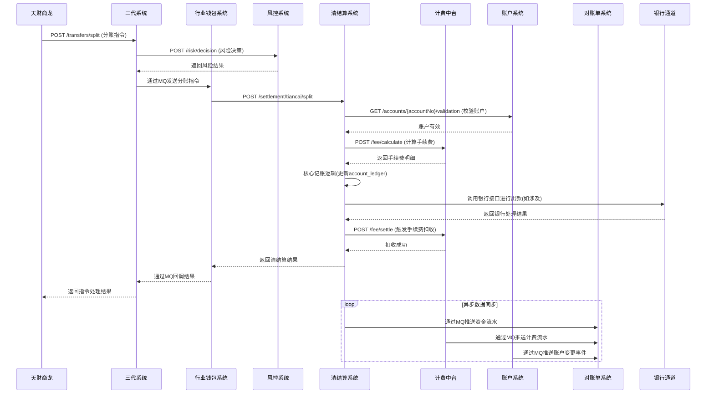

# 天财分账支付系统设计文档

## 2.1 系统结构

本系统采用分层、解耦的微服务架构，以业务域为核心进行模块划分，确保高内聚、低耦合。整体架构遵循“前-中-后台”模式，前台对接商户与用户，中台负责核心业务编排与处理，后台提供基础支付与资金处理能力。

```mermaid
graph TB
    subgraph “外部系统/前台”
        TCSL[天财商龙]
        WalletApp[钱包App]
        MerchantPortal[商户平台]
    end

    subgraph “业务中台层”
        Gen3[三代系统<br/>业务编排与商户管理]
        BizCore[业务核心系统<br/>天财分账模块]
        WalletBiz[行业钱包系统<br/>关系与指令执行]
    end

    subgraph “核心服务层”
        Account[账户系统]
        Auth[认证系统]
        Settlement[清结算系统]
        Fee[计费中台]
        Risk[风控系统]
        RefundPre[退货前置模块]
        ESign[电子签章系统]
    end

    subgraph “数据与支撑层”
        Statement[对账单系统]
        MQ[(消息队列)]
        Config[配置中心]
        DB[(核心数据库)]
    end

    TCSL --> Gen3
    WalletApp --> BizCore
    MerchantPortal --> BizCore

    Gen3 --> WalletBiz
    Gen3 --> BizCore
    BizCore --> WalletBiz

    WalletBiz --> Account
    WalletBiz --> Auth
    WalletBiz --> Settlement
    WalletBiz --> Risk

    Settlement --> Account
    Settlement --> Fee
    Settlement --> RefundPre
    Fee --> Account
    Auth --> ESign
    RefundPre --> Risk

    Account --> Statement
    Settlement --> Statement
    Fee --> Statement

    Gen3 -.-> MQ
    WalletBiz -.-> MQ
    Risk -.-> MQ
```

**架构说明**:
1.  **外部接入层**: 天财商龙、钱包App、商户平台作为业务入口，通过定义良好的API与中台层交互。
2.  **业务中台层**: 是业务逻辑的编排中心。
    *   **三代系统**：作为与天财商龙对接的总入口，是商户和业务规则的权威源，负责接收指令并向下游编排。
    *   **业务核心系统**：为钱包App等提供天财分账服务，是面向C端/B端用户的核心业务模块。
    *   **行业钱包系统**：作为核心业务逻辑的执行引擎，负责绑定关系管理和分账指令的最终执行。
3.  **核心服务层**: 提供领域内通用的专业能力，被中台层调用。
    *   **账户系统**：资金账户的创建、管理和服务。
    *   **认证系统**：资金流转方的身份认证与协议签署。
    *   **清结算系统**：资金清算、结算、记账的核心处理器。
    *   **计费中台**：统一的手续费计算与分摊引擎。
    *   **风控系统**：实时风险识别与决策。
    *   **退货前置模块**：退货资金的预校验与预扣减。
    *   **电子签章系统**：提供合规的电子协议签署服务。
4.  **数据与支撑层**: 提供跨系统的数据服务与基础设施。
    *   **对账单系统**：提供统一的资金动账明细与业务对账服务。
    *   **消息队列**：实现模块间异步解耦、事件驱动。
    *   **配置中心、数据库**：提供基础配置与数据存储能力。

## 2.2 功能结构

系统功能围绕“天财分账”业务的生命周期进行组织，涵盖商户入驻、账户管理、关系绑定、资金流转、风控计费、对账运营等全流程。

```mermaid
graph TD
    A[天财分账支付系统] --> B1[商户与账户管理]
    A --> B2[分账关系管理]
    A --> B3[资金流转处理]
    A --> B4[风控与合规]
    A --> B5[计费与对账]
    A --> B6[运营支撑]

    B1 --> C11[商户入驻与信息管理]
    B1 --> C12[专用账户开户与管理]
    B1 --> C13[账户状态与能力控制]

    B2 --> C21[关系绑定申请]
    B2 --> C22[身份认证与协议签署]
    B2 --> C23[付款能力开通]
    B2 --> C24[绑定关系查询与校验]

    B3 --> C31[资金归集]
    B3 --> C32[批量付款]
    B3 --> C33[会员结算]
    B3 --> C34[退货资金处理]

    B4 --> C41[实时交易风险决策]
    B4 --> C42[名单库管理]
    B4 --> C43[风险监控与案件管理]

    B5 --> C51[手续费计算与分摊]
    B5 --> C52[手续费扣收与记账]
    B5 --> C53[资金动账明细查询]
    B5 --> C54[业务对账单生成]

    B6 --> C61[电子签约服务]
    B6 --> C62[全链路操作日志]
    B6 --> C63[系统配置管理]
```



## 2.3 网络拓扑图

系统部署在私有云或金融云环境内，采用分区隔离策略，确保业务安全与合规。

```mermaid
graph TB
    subgraph “互联网区 (DMZ)”
        ELB[外部负载均衡]
        APIGW[API网关]
        WAF[Web应用防火墙]
    end

    subgraph “核心业务区”
        subgraph “业务应用集群”
            Gen3_App[三代系统]
            BizCore_App[业务核心]
            WalletBiz_App[行业钱包]
        end
        subgraph “核心服务集群”
            Account_App[账户系统]
            Settle_App[清结算]
            Auth_App[认证系统]
            Fee_App[计费中台]
        end
        App_LB[内部负载均衡]
    end

    subgraph “数据区”
        subgraph “数据库集群”
            DB_Master[(主库)]
            DB_ReadOnly[(只读副本)]
        end
        subgraph “缓存与消息集群”
            Redis[(Redis缓存)]
            MQ_Broker[(消息队列)]
        end
        subgraph “文件存储”
            FS[文件存储服务]
        end
    end

    subgraph “外部服务区”
        Ext_ESign[电子签约平台]
        Ext_Bank[银行通道/支付网络]
        Ext_SMS[短信服务]
    end

    Internet --> WAF --> ELB --> APIGW
    APIGW --> App_LB
    App_LB --> Gen3_App
    App_LB --> BizCore_App
    App_LB --> WalletBiz_App

    Gen3_App --> Account_App
    BizCore_App --> Settle_App
    WalletBiz_App --> Auth_App

    Account_App --> DB_Master
    Settle_App --> DB_Master
    Auth_App --> Redis

    Gen3_App -.-> MQ_Broker
    MQ_Broker -.-> Risk_App

    App_LB --> Ext_ESign
    Settle_App --> Ext_Bank
    Auth_App --> Ext_SMS
```

**拓扑说明**:
1.  **互联网区**: 通过WAF和API网关提供统一、安全的对外入口，进行流量调度、认证和限流。
2.  **核心业务区**: 部署所有业务应用和核心服务，通过内部负载均衡实现高可用和水平扩展。
3.  **数据区**: 数据库主从分离，引入缓存提升性能，消息队列实现异步解耦，文件存储用于对账单等文件。
4.  **外部服务区**: 与电子签约、银行通道、短信等第三方服务通过专线或VPN安全互联。
5.  各区域之间通过防火墙策略进行严格访问控制，仅开放必要的端口和协议。

## 2.4 数据流转

以核心业务场景“分账资金转账”为例，描述数据在关键模块间的流转过程。



**关键数据流说明**:
1.  **业务指令流**: 从天财商龙发起，经三代系统编排，通过行业钱包系统传递至清结算系统执行。
2.  **风险控制流**: 在关键业务节点（如发起转账）同步调用风控系统进行实时决策。
3.  **资金处理流**: 清结算系统作为核心，协调账户校验、手续费计算、核心记账和银行出款。
4.  **计费流**: 手续费计算与扣收分离，由计费中台提供专业化服务。
5.  **数据沉淀流**: 所有资金、计费、账户变动事件异步推送至对账单系统，形成统一的数据视图。

## 2.5 系统模块交互关系

以下模块交互图详细描述了各系统间的主要调用与依赖关系。

```mermaid
graph LR
    subgraph “外部依赖”
        Ext_ESign[电子签约平台]
        Ext_Bank[银行通道]
    end

    subgraph “核心业务模块”
        Gen3[三代系统]
        BizCore[业务核心系统]
        WalletBiz[行业钱包系统]
    end

    subgraph “支撑服务模块”
        Account[账户系统]
        Auth[认证系统]
        Settle[清结算系统]
        Fee[计费中台]
        Risk[风控系统]
        RefundPre[退货前置]
        ESign[电子签章系统]
        Statement[对账单系统]
    end

    Gen3 -- “1. 商户/指令入口” --> WalletBiz
    Gen3 -- “2. 业务编排” --> BizCore
    BizCore -- “3. 执行指令/查关系” --> WalletBiz

    WalletBiz -- “4. 账户操作” --> Account
    WalletBiz -- “5. 发起认证” --> Auth
    WalletBiz -- “6. 执行分账” --> Settle
    WalletBiz -- “7. 风险检查” --> Risk

    Settle -- “8. 账户校验/记账” --> Account
    Settle -- “9. 手续费计算” --> Fee
    Settle -- “10. 退货查询/扣减” --> RefundPre
    Settle -- “11. 调用银行” --> Ext_Bank

    Auth -- “12. 创建签约任务” --> ESign
    ESign -- “13. 回调状态” --> Auth
    ESign -- “14. 调用外部平台” --> Ext_ESign

    RefundPre -- “15. 风险检查” --> Risk
    RefundPre -- “16. 资金扣减” --> Settle

    Account -- “17. 推送流水” --> Statement
    Settle -- “18. 推送流水” --> Statement
    Fee -- “19. 推送计费数据” --> Statement

    Risk -- “20. 监听业务消息” --> MQ[(MQ)]
    Gen3 -- “21. 发布指令事件” --> MQ
```

**交互关系详解**:

| 交互编号 | 调用方 -> 被调用方 | 交互内容与协议 | 关键接口/事件 |
| :--- | :--- | :--- | :--- |
| 1, 2, 3 | 三代系统 <-> 业务核心/行业钱包 | **业务编排**。三代作为总入口，将请求路由至具体业务模块。 | HTTP API / 异步消息 |
| 4 | 行业钱包 -> 账户系统 | **账户服务**。查询、创建、管理分账专用账户。 | `GET /api/v1/accounts/{accountNo}` |
| 5 | 行业钱包 -> 认证系统 | **关系认证**。发起付款方与收款方的绑定认证流程。 | `POST /api/v1/auth/requests` |
| 6 | 行业钱包 -> 清结算系统 | **资金执行**。触发分账、归集、付款等资金流转操作。 | `POST /api/v1/settlement/tiancai/split` |
| 7 | 行业钱包 -> 风控系统 | **交易风控**。对分账指令进行实时风险决策。 | `POST /api/v1/risk/decision` |
| 8 | 清结算 -> 账户系统 | **账户校验与记账**。校验账户状态，并作为权威记账源。 | `GET /api/v1/accounts/{accountNo}/validation` |
| 9 | 清结算 <-> 计费中台 | **手续费处理**。先计算，交易成功后再触发实际扣收。 | `POST /api/v1/fee/calculate`, `POST /api/v1/fee/settle` |
| 10 | 清结算 -> 退货前置 | **退货预处理**。在正式退货前查询可退余额并预扣减。 | `POST /api/v1/settlement/refund/query` |
| 12, 13 | 认证系统 <-> 电子签章系统 | **电子签约**。认证系统发起签约，签章系统回调结果。 | `POST /api/v1/contract/tasks`, `POST /api/callback/esign` |
| 15 | 退货前置 -> 风控系统 | **退货风控**。对退货操作进行风险检查。 | `POST /api/v1/risk/decision` |
| 17, 18, 19| 账户/清结算/计费 -> 对账单系统 | **数据汇总**。各系统将资金、流水、计费数据推送至对账中心。 | 异步消息事件 |
| 20, 21 | 各模块 <-> 消息队列 | **异步解耦**。用于指令分发、事件通知、数据同步。 | 业务领域事件 |

**依赖总结**:
*   **三代系统**是业务的**起点和编排中心**，依赖多个下游模块执行业务。
*   **行业钱包系统**是**核心执行枢纽**，连接了业务入口与底层支付能力。
*   **清结算系统**是**资金处理核心**，依赖账户、计费、风控完成一笔完整交易。
*   **账户系统**和**风控系统**是**基础能力提供方**，被几乎所有业务模块所依赖。
*   **对账单系统**是**数据汇聚点**，依赖多个系统提供数据源。
*   **消息队列**是关键的**技术粘合剂**，实现了系统间的异步通信和解耦。