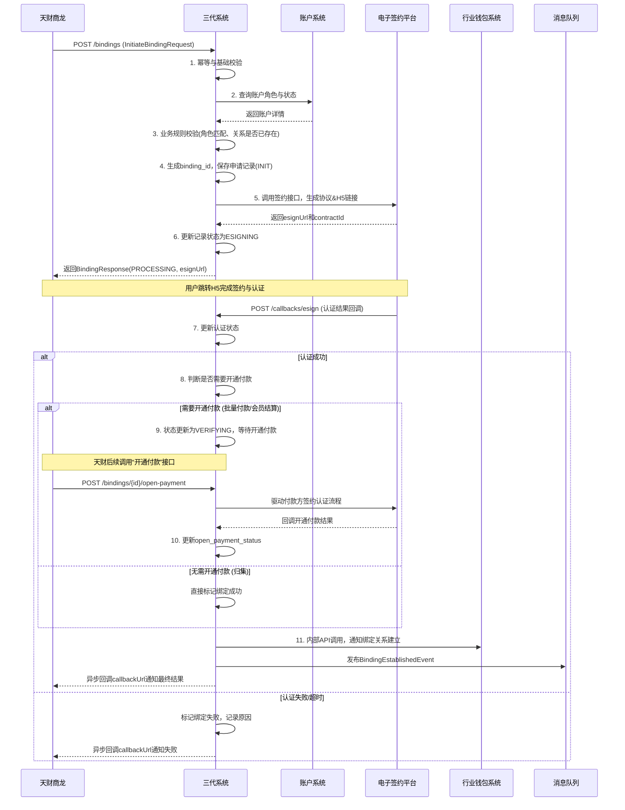
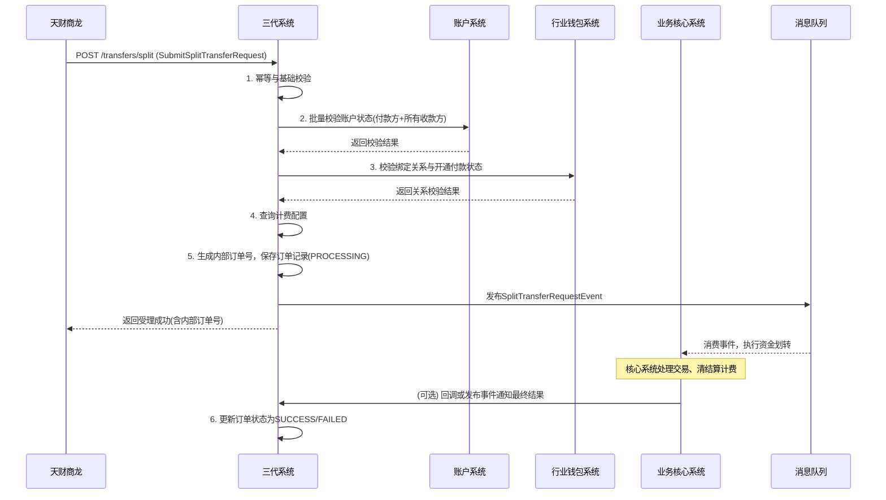

# 模块设计: 三代系统

生成时间: 2026-01-19 17:54:29

---

# 三代系统模块设计文档

## 1. 概述

### 1.1 目的
本模块作为支付系统与天财商龙（外部机构）的核心对接枢纽，是“天财分账”业务的**业务逻辑编排中心**和**商户管理权威源**。其主要目的是：
- **商户生命周期管理**：作为收单商户信息的创建、维护和查询的权威系统，为下游系统（如账户系统）提供商户基础数据。
- **分账业务逻辑编排**：接收并处理来自天财商龙的分账业务请求（如关系绑定、分账指令），协调电子签约、账户校验、计费配置等多个下游系统完成复杂业务流程。
- **认证与签约流程驱动**：作为电子签约平台的调用方，驱动并管理“关系绑定”和“开通付款”流程，确保协议签署与身份认证的合规性与完整性。
- **计费配置管理**：为天财分账业务配置手续费规则，并在业务执行时提供计费参数。
- **接口适配与路由**：对外提供统一、稳定的API给天财商龙，对内将业务请求路由至正确的内部处理模块。

### 1.2 范围
- **核心功能**：
    - **商户管理**：商户信息的创建、查询、更新。
    - **分账关系绑定**：处理签约与认证请求，调用电子签约平台，并在成功后通知行业钱包系统建立关系映射。
    - **分账指令处理**：接收天财发起的归集、批量付款、会员结算指令，进行业务校验后转发至业务核心系统执行。
    - **开通付款处理**：为批量付款和会员结算场景下的付款方驱动额外的签约认证流程。
    - **计费配置**：管理分账业务的手续费率、承担方等规则。
- **非功能范围**：
    - 不直接管理资金账户（由账户系统负责）。
    - 不直接处理资金流转与结算（由业务核心和清结算系统负责）。
    - 不直接执行电子签约与认证（由电子签约平台负责）。
    - 不持久化存储账户绑定关系（由行业钱包系统负责）。

## 2. 接口设计

### 2.1 API 端点 (RESTful)

#### 2.1.1 对外接口（供天财商龙调用）
- **POST /api/external/tiancai/v1/merchants** - 商户入驻（创建收单商户）
- **POST /api/external/tiancai/v1/bindings** - 发起分账关系绑定（签约与认证）
- **POST /api/external/tiancai/v1/bindings/{bindingId}/open-payment** - 为指定绑定关系开通付款能力
- **POST /api/external/tiancai/v1/transfers/split** - 发起分账/归集/付款指令

#### 2.1.2 内部接口（供内部系统调用）
- **GET /api/internal/v1/merchants/{merchantNo}** - 查询商户详情（供账户系统等调用）
- **POST /api/internal/v1/fee-configs/query** - 查询计费配置（供业务核心系统调用）
- **POST /api/internal/v1/callbacks/esign** - 电子签约平台回调接口

### 2.2 输入/输出数据结构

#### 2.2.1 发起关系绑定请求 (InitiateBindingRequest)
```json
{
  "requestId": "BIND_REQ_20231027001",
  "institutionNo": "TC001",
  "payerMerchantNo": "M100001", // 付款方商户号（总部或门店）
  "payerAccountNo": "TCWALLET202310270001", // 付款方账户号
  "receiverMerchantNo": "M100002", // 收款方商户号
  "receiverAccountNo": "TCWALLET202310270002", // 收款方账户号
  "receiverType": "CORPORATE | INDIVIDUAL", // 收款方类型：企业/个体户/个人
  "receiverBankCard": { // 收款方银行卡信息（用于打款验证或提现）
    "cardNo": "622848********5678",
    "bankName": "中国农业银行",
    "cardType": "DEBIT",
    "accountName": "某某门店"
  },
  "sceneCode": "CAPITAL_POOLING | MEMBER_SETTLEMENT | BATCH_PAYMENT", // 业务场景：归集/会员结算/批量付款
  "callbackUrl": "https://tiancai.com/callback" // 天财业务回调地址
}
```

#### 2.2.2 分账指令请求 (SubmitSplitTransferRequest)
```json
{
  "requestId": "TRANSFER_REQ_20231027001",
  "institutionNo": "TC001",
  "businessType": "CAPITAL_POOLING", // 业务类型：CAPITAL_POOLING(归集), BATCH_PAYMENT(批量付款), MEMBER_SETTLEMENT(会员结算)
  "totalAmount": "1000.00",
  "currency": "CNY",
  "payer": {
    "merchantNo": "M100001",
    "accountNo": "TCWALLET202310270001"
  },
  "receiverList": [ // 批量付款时有多条
    {
      "receiverMerchantNo": "M100002",
      "receiverAccountNo": "TCWALLET202310270002",
      "amount": "1000.00",
      "remark": "月度货款结算"
    }
  ],
  "feeBearer": "PAYER | RECEIVER", // 手续费承担方
  "postscript": "天财归集20231027" // 附加信息，可能用于打款验证备注
}
```

#### 2.2.3 关系绑定响应 (BindingResponse)
```json
{
  "bindingId": "BIND_202310270001",
  "status": "PROCESSING", // PROCESSING, SUCCESS, FAILED
  "esignUrl": "https://esign.platform.com/h5/contract?token=xxx", // 仅status=PROCESSING时返回，引导用户签约
  "estimatedExpireTime": "2023-10-27T10:30:00Z", // H5页面过期时间
  "failureReason": "" // 失败时返回原因
}
```

### 2.3 发布/消费的事件

#### 2.3.1 发布的事件
- **MerchantCreatedEvent**: 收单商户创建成功时发布。
    - 内容：商户号、商户名称、机构号、商户类型（企业/个体户）、状态。
    - 消费者：账户系统（触发开户）、行业钱包系统。
- **BindingEstablishedEvent**: 分账关系绑定（含开通付款）最终成功时发布。
    - 内容：绑定关系ID、付款方信息、收款方信息、业务场景、生效时间。
    - 消费者：行业钱包系统（持久化绑定关系）、业务核心系统（缓存白名单）。
- **SplitTransferRequestEvent**: 分账指令通过基础校验后发布。
    - 内容：请求流水号、业务类型、付款方、收款方列表、金额。
    - 消费者：业务核心系统（执行资金划转）。

#### 2.3.2 消费的事件
- **AccountCreatedEvent** (来自账户系统)：消费此事件以关联商户与其账户，并更新本地缓存。
- **SettlementCompletedEvent** (来自清结算系统)：消费此事件用于业务对账和状态同步。

## 3. 数据模型

### 3.1 数据库表设计

#### 表: `merchant` (收单商户主表)
| 字段名 | 类型 | 必填 | 默认值 | 说明 |
| :--- | :--- | :--- | :--- | :--- |
| `id` | bigint | Y | AUTO_INCREMENT | 主键 |
| `merchant_no` | varchar(32) | Y | | **商户号**，唯一标识 |
| `institution_no` | varchar(16) | Y | | 天财机构号 |
| `merchant_name` | varchar(128) | Y | | 商户名称 |
| `merchant_type` | varchar(20) | Y | | 类型: `CORPORATE`(企业), `INDIVIDUAL`(个体户) |
| `business_license_no` | varchar(64) | N | | 营业执照号 |
| `legal_person_name` | varchar(64) | N | | 法人姓名 |
| `legal_person_id_no` | varchar(32) | N | | 法人身份证号（加密） |
| `status` | varchar(20) | Y | `ACTIVE` | 状态: `ACTIVE`, `INACTIVE`, `CLOSED` |
| `contact_info` | json | Y | | 联系人、电话、地址等JSON结构 |
| `created_at` | datetime | Y | CURRENT_TIMESTAMP | 创建时间 |
| `updated_at` | datetime | Y | CURRENT_TIMESTAMP ON UPDATE | 更新时间 |
| **索引** | | | | |
| `uk_merchant_no` | UNIQUE(`merchant_no`) | | | 商户号唯一索引 |
| `idx_institution_no` | (`institution_no`) | | | 机构号查询索引 |

#### 表: `binding_application` (关系绑定申请记录表)
| 字段名 | 类型 | 必填 | 默认值 | 说明 |
| :--- | :--- | :--- | :--- | :--- |
| `id` | bigint | Y | AUTO_INCREMENT | 主键 |
| `binding_id` | varchar(32) | Y | | **绑定关系ID**，唯一，用于外部查询 |
| `request_id` | varchar(64) | Y | | 外部请求流水号，幂等键 |
| `institution_no` | varchar(16) | Y | | 天财机构号 |
| `scene_code` | varchar(32) | Y | | 业务场景码 |
| `payer_merchant_no` | varchar(32) | Y | | 付款方商户号 |
| `payer_account_no` | varchar(32) | Y | | 付款方账户号 |
| `receiver_merchant_no` | varchar(32) | Y | | 收款方商户号 |
| `receiver_account_no` | varchar(32) | Y | | 收款方账户号 |
| `receiver_type` | varchar(20) | Y | | 收款方类型 |
| `status` | varchar(20) | Y | `INIT` | 状态: `INIT`, `ESIGNING`, `VERIFYING`, `SUCCESS`, `FAILED` |
| `open_payment_required` | tinyint(1) | Y | 0 | 是否需要开通付款: 0-否, 1-是 |
| `open_payment_status` | varchar(20) | N | | 开通付款状态: `PENDING`, `SUCCESS`, `FAILED` |
| `esign_contract_id` | varchar(64) | N | | 电子签约平台合同ID |
| `auth_method` | varchar(20) | N | | 认证方式: `REMITTANCE`(打款), `FACE`(人脸) |
| `auth_status` | varchar(20) | N | | 认证状态 |
| `callback_url` | varchar(512) | Y | | 天财回调地址 |
| `expire_time` | datetime | Y | | 流程过期时间 |
| `failure_reason` | varchar(512) | N | | 失败原因 |
| `created_at` | datetime | Y | CURRENT_TIMESTAMP | 创建时间 |
| `updated_at` | datetime | Y | CURRENT_TIMESTAMP ON UPDATE | 更新时间 |
| **索引** | | | | |
| `uk_binding_id` | UNIQUE(`binding_id`) | | | 绑定ID唯一索引 |
| `uk_request_id` | UNIQUE(`request_id`) | | | 请求ID幂等索引 |
| `idx_payer_receiver` | (`payer_merchant_no`, `receiver_merchant_no`, `scene_code`) | | | 关系查询索引 |

#### 表: `split_transfer_order` (分账指令订单表)
| 字段名 | 类型 | 必填 | 默认值 | 说明 |
| :--- | :--- | :--- | :--- | :--- |
| `id` | bigint | Y | AUTO_INCREMENT | 主键 |
| `order_no` | varchar(32) | Y | | **系统内部订单号** |
| `request_id` | varchar(64) | Y | | 外部请求流水号，幂等键 |
| `institution_no` | varchar(16) | Y | | 天财机构号 |
| `business_type` | varchar(32) | Y | | 业务类型 |
| `total_amount` | decimal(15,2) | Y | | 总金额 |
| `payer_merchant_no` | varchar(32) | Y | | 付款方商户号 |
| `payer_account_no` | varchar(32) | Y | | 付款方账户号 |
| `fee_bearer` | varchar(20) | Y | | 手续费承担方 |
| `status` | varchar(20) | Y | `PROCESSING` | 状态: `PROCESSING`, `SUCCESS`, `FAILED` |
| `core_order_no` | varchar(32) | N | | 业务核心系统订单号 |
| `failure_reason` | varchar(512) | N | | 失败原因 |
| `created_at` | datetime | Y | CURRENT_TIMESTAMP | 创建时间 |
| `updated_at` | datetime | Y | CURRENT_TIMESTAMP ON UPDATE | 更新时间 |
| **索引** | | | | |
| `uk_order_no` | UNIQUE(`order_no`) | | | 订单号唯一索引 |
| `uk_request_id` | UNIQUE(`request_id`) | | | 请求ID幂等索引 |
| `idx_payer_status` | (`payer_merchant_no`, `status`, `created_at`) | | | 商户订单查询索引 |

#### 表: `fee_config` (计费配置表)
| 字段名 | 类型 | 必填 | 默认值 | 说明 |
| :--- | :--- | :--- | :--- | :--- |
| `id` | bigint | Y | AUTO_INCREMENT | 主键 |
| `institution_no` | varchar(16) | Y | | 天财机构号 |
| `business_type` | varchar(32) | Y | | 业务类型 |
| `payer_role_type` | varchar(20) | N | | 付款方角色类型 (HEADQUARTERS/STORE)，为空表示通用 |
| `fee_rate` | decimal(8,6) | Y | | 手续费率 (如 0.0012 表示 0.12%) |
| `fee_min` | decimal(10,2) | N | | 最低手续费 |
| `fee_max` | decimal(10,2) | N | | 最高手续费 |
| `default_fee_bearer` | varchar(20) | Y | | 默认手续费承担方 |
| `status` | varchar(20) | Y | `ACTIVE` | 状态: `ACTIVE`, `INACTIVE` |
| `effective_time` | datetime | Y | | 生效时间 |
| `expiry_time` | datetime | N | | 失效时间 |
| `created_at` | datetime | Y | CURRENT_TIMESTAMP | 创建时间 |
| **索引** | | | | |
| `idx_institution_business` | (`institution_no`, `business_type`, `status`, `effective_time`) | | | 配置查询索引 |

### 3.2 与其他模块的关系
- **行业钱包系统**：紧密协作的下游。三代系统在关系绑定成功后通知钱包系统持久化关系；钱包系统为三代提供账户信息查询和绑定关系校验。
- **账户系统**：下游依赖。三代系统在创建商户后，会触发或通知账户系统为该商户开立天财专用账户。在处理业务时，会调用账户系统进行账户基础校验。
- **电子签约平台**：服务调用方。三代系统驱动所有签约认证流程，生成协议并调用平台生成H5链接，接收其回调通知认证结果。
- **业务核心系统**：下游指令执行方。三代系统将校验通过的分账指令封装为标准交易请求，发布事件或调用API通知业务核心执行资金划转。
- **清结算系统**：下游计费执行方。三代系统提供计费配置，清结算系统在结算时依据此配置计算手续费。

## 4. 业务逻辑

### 4.1 核心算法
- **绑定关系ID生成**：`BIND_` + `YYYYMMDD` + `6位自增序列`。自增序列每日重置。
- **分账订单号生成**：`TCO` + `YYYYMMDD` + `6位自增序列`。
- **认证方式选择算法**：根据`receiverType`和场景自动选择。
    - `CORPORATE`(企业) -> `REMITTANCE`(打款验证)
    - `INDIVIDUAL`(个体户) -> 根据金额和风险等级，可能为`REMITTANCE`或`FACE`(人脸验证)
    - 会员结算场景下，若收款方为个人，强制使用`FACE`验证。

### 4.2 业务规则
1. **关系绑定规则**：
    - 同一对付款方-收款方在同一业务场景下，只能存在一条生效的绑定关系。
    - “归集”场景：付款方角色必须为`STORE`，收款方角色必须为`HEADQUARTERS`。
    - “批量付款”和“会员结算”场景：绑定成功后，必须额外完成“开通付款”流程，付款方（总部或门店）的绑定关系才生效。
    - 绑定流程（含认证）必须在规定时间（如30分钟）内完成，超时则申请记录失效。

2. **分账指令校验规则**：
    - 付款方和收款方账户必须已通过账户系统校验（状态正常、类型匹配）。
    - 付款方和收款方之间必须存在对应业务场景的、已生效的绑定关系（需调用行业钱包系统校验）。
    - 对于“批量付款”和“会员结算”，必须检查付款方的“开通付款”状态是否为`SUCCESS`。
    - 总金额必须等于所有收款方金额之和。
    - 校验手续费承担方参数，若未提供则使用计费配置中的默认值。

3. **计费配置规则**：
    - 同一机构、同一业务类型下，生效的配置在同一时间点只能有一条。
    - 配置查询优先级：`payer_role_type`匹配 > 通用配置（`payer_role_type`为空）。

### 4.3 验证逻辑
- **商户创建请求验证**：
    - 校验`institutionNo`合法性。
    - 校验商户基础信息的完整性与合规性（如营业执照格式）。
    - 校验同一机构下商户号是否已存在。
- **关系绑定请求验证**：
    - 幂等校验（`requestId`）。
    - 校验付款方和收款方商户是否存在且属于同一机构。
    - 校验业务场景码的合法性。
    - 根据场景码校验付款方和收款方的角色类型是否匹配（需查询账户系统获取账户角色）。
- **分账指令请求验证**：
    - 幂等校验（`requestId`）。
    - 基础参数非空校验。
    - 调用账户系统接口，批量校验所有涉及账户的基本状态。

## 5. 时序图

### 5.1 分账关系绑定（含开通付款）时序图


### 5.2 分账指令处理时序图


## 6. 错误处理

| 错误码 | HTTP状态码 | 描述 | 处理策略 |
| :--- | :--- | :--- | :--- |
| `GEN3_4001` | 400 Bad Request | 请求参数无效或缺失 | 天财检查请求体，修正后重试 |
| `GEN3_4002` | 400 Bad Request | 业务场景不支持 | 天财确认场景码是否正确 |
| `GEN3_4003` | 400 Bad Request | 角色类型不匹配业务规则 | 天财确认付款方/收款方身份是否符合场景要求 |
| `GEN3_4091` | 409 Conflict | 重复请求 (requestId已处理) | 天财使用原请求结果，无需重试 |
| `GEN3_4092` | 409 Conflict | 绑定关系已存在 | 天财查询已有绑定关系，勿重复发起 |
| `GEN3_4031` | 403 Forbidden | 账户状态异常或校验失败 | 天财检查对应账户状态，或联系运营处理 |
| `GEN3_4032` | 403 Forbidden | 绑定关系不存在或未生效 | 天财需先完成关系绑定（及开通付款）流程 |
| `GEN3_4241` | 424 Failed Dependency | 依赖服务（账户/钱包）校验不通过 | 返回具体失败原因，天财根据原因处理 |
| `GEN3_5001` | 500 Internal Server Error | 内部服务处理异常 | 服务端记录日志告警，天财可稍后重试 |

**通用策略**：
- **幂等性**：所有写操作通过`requestId`保证，避免重复创建商户、绑定关系或订单。
- **异步流程**：关系绑定和分账指令处理多为异步，通过`callbackUrl`或订单查询接口获取最终结果。
- **超时与补偿**：绑定流程设置超时时间，超时后自动置为失败。有定时任务清理过期数据。
- **优雅降级**：非核心校验依赖（如部分风控规则）失败时，可记录日志并放行，确保主流程可用。

## 7. 依赖说明

### 7.1 上游模块交互
1. **天财商龙（外部机构）**：
    - **交互方式**：同步REST API调用。
    - **职责**：天财是业务需求的发起方，三代系统需提供稳定、清晰、文档完备的API，并做好流量控制与安全认证。

### 7.2 下游模块交互
1. **账户系统**：
    - **交互方式**：同步REST API调用（查询账户详情、校验状态）。
    - **职责**：三代系统依赖账户系统获取账户的角色、状态等核心属性，以进行业务规则校验。商户创建事件是账户开户的触发器。

2. **行业钱包系统**：
    - **交互方式**：同步REST API调用（校验绑定关系、通知绑定成功）。
    - **职责**：钱包系统是绑定关系的实际管理者，三代系统在签约成功后通知其建立关系映射，并在分账前向其验证关系有效性。

3. **电子签约平台**：
    - **交互方式**：同步REST API调用（发起签约） + 异步回调。
    - **职责**：三代系统将签约认证流程委托给该专业平台，并监听其回调以推进业务流程。

4. **业务核心系统**：
    - **交互方式**：异步事件发布 (`SplitTransferRequestEvent`)。
    - **职责**：三代系统完成业务校验和封装后，通过事件驱动业务核心执行实际的资金交易。

5. **消息队列(MQ)**：
    - **交互方式**：发布领域事件 (`MerchantCreatedEvent`, `BindingEstablishedEvent`, `SplitTransferRequestEvent`)。
    - **职责**：实现与下游系统的解耦，确保关键状态变更和业务指令的可靠传递。

### 7.3 关键依赖管理
- **强依赖**：数据库、电子签约平台（流程阻塞点）、账户系统（核心校验）。
- **弱依赖**：行业钱包系统（关系校验失败可转为同步调用其他服务或缓存结果）、消息队列（可降级为同步调用或本地持久化后重试）。
- **降级方案**：
    - 电子签约平台不可用：关系绑定接口直接返回“服务暂不可用”，引导稍后重试。
    - 账户/钱包系统响应慢：设置合理的超时时间，超时后可根据缓存数据做初步判断，或返回“校验超时，请稍后确认结果”。