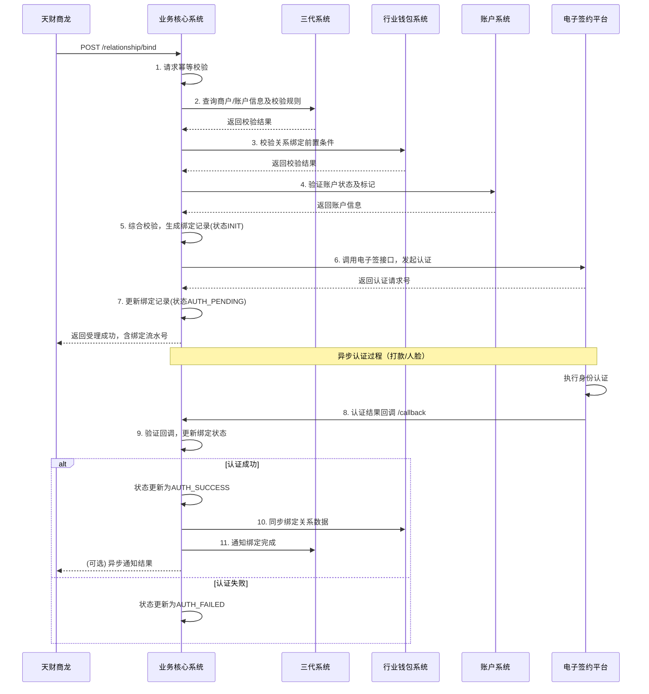
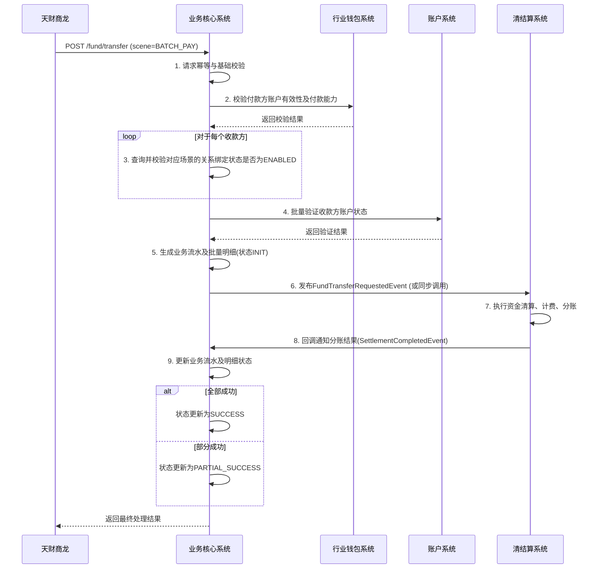

# 模块设计: 业务核心系统

生成时间: 2026-01-19 17:52:58

---

# 业务核心系统 - 天财分账模块设计文档

## 1. 概述

### 1.1 目的
本模块作为支付系统“业务核心系统”中专门处理“天财分账”业务的子模块，旨在为天财商龙提供一套完整、可靠、高效的专用资金处理解决方案。核心职责是作为业务处理的中枢，协调各下游系统（三代系统、行业钱包系统、账户系统、清结算系统等），完成从关系绑定、资金流转到退货处理的全流程业务逻辑编排与执行。

### 1.2 范围
- **业务范围**：
    - **关系绑定（签约与认证）**：处理总部与门店之间、付款方与接收方之间的授权关系建立流程。
    - **资金流转**：处理“归集”（门店->总部）、“批量付款”（总部->多接收方）、“会员结算”（总部->门店）三种核心场景的资金分账请求。
    - **退货前置**：处理涉及天财收款账户或04退货账户的退货交易查询与扣减。
- **系统范围**：
    - 接收并验证来自天财商龙（通过特定机构号）的业务请求。
    - 执行业务规则校验、流程编排、状态管理。
    - 与下游系统（三代、钱包、账户、清结算）进行同步/异步交互，驱动业务完成。
    - 记录业务流水，提供对账和问题排查依据。

## 2. 接口设计

### 2.1 API 端点 (RESTful)

#### 2.1.1 关系绑定接口
- `POST /api/v1/tiancai/relationship/bind`
    - **描述**：发起关系绑定（签约与认证）流程。
    - **输入**：`RelationshipBindRequest`
    - **输出**：`RelationshipBindResponse`

- `POST /api/v1/tiancai/relationship/bind/callback`
    - **描述**：接收电子签约平台或认证系统的异步回调，更新绑定状态。
    - **输入**：`RelationshipCallbackRequest`
    - **输出**：标准成功/失败响应。

- `GET /api/v1/tiancai/relationship/query/{bindRequestNo}`
    - **描述**：查询关系绑定请求的状态和详情。
    - **输出**：`RelationshipQueryResponse`

#### 2.1.2 资金分账接口
- `POST /api/v1/tiancai/fund/transfer`
    - **描述**：处理天财分账资金转账请求（涵盖归集、批量付款、会员结算）。
    - **输入**：`FundTransferRequest`
    - **输出**：`FundTransferResponse`

#### 2.1.3 开通付款接口
- `POST /api/v1/tiancai/payment/enable`
    - **描述**：在批量付款或会员结算前，为付款方（总部/门店）开通付款能力。
    - **输入**：`PaymentEnableRequest`
    - **输出**：`PaymentEnableResponse`

#### 2.1.4 退货前置接口
- `POST /api/v1/tiancai/refund/preprocess`
    - **描述**：处理退货交易，查询并扣减天财收款账户或04退货账户余额。
    - **输入**：`RefundPreprocessRequest`
    - **输出**：`RefundPreprocessResponse`

### 2.2 输入/输出数据结构 (示例)

```json
// RelationshipBindRequest
{
  "requestNo": "BIND202404180001", // 请求流水号，唯一
  "institutionNo": "TC001", // 天财机构号
  "scene": "COLLECTION", // 场景：COLLECTION(归集), BATCH_PAY(批量付款), MEMBER_SETTLE(会员结算)
  "payerInfo": {
    "accountNo": "TC_ACCT_001",
    "roleType": "HEADQUARTERS", // 角色类型：HEADQUARTERS, STORE
    "name": "天财总部有限公司"
  },
  "payeeInfo": {
    "accountNo": "TC_ACCT_002",
    "roleType": "STORE",
    "name": "北京分店",
    "certType": "CORPORATE", // 认证类型：CORPORATE(对公-打款), INDIVIDUAL(个人/个体户-人脸)
    "bankCardNo": "622848******1234" // 当certType=CORPORATE时必传
  },
  "operator": "system_user_01"
}

// FundTransferRequest
{
  "requestNo": "TRANS202404180001",
  "institutionNo": "TC001",
  "scene": "BATCH_PAY",
  "batchNo": "BATCH001", // 批次号，用于批量付款
  "totalAmount": 50000,
  "totalFee": 100,
  "feeBearer": "PAYER", // 手续费承担方：PAYER, PAYEE
  "payerAccountNo": "TC_ACCT_001",
  "items": [
    {
      "itemNo": "1",
      "payeeAccountNo": "TC_ACCT_003",
      "amount": 20000,
      "memo": "供应商货款"
    },
    {
      "itemNo": "2",
      "payeeAccountNo": "TC_ACCT_004",
      "amount": 30000,
      "memo": "股东分红"
    }
  ]
}

// RefundPreprocessRequest
{
  "requestNo": "REFUND_PRE202404180001",
  "institutionNo": "TC001",
  "originalOrderNo": "PAY202404170001", // 原支付订单号
  "refundAmount": 1000,
  "refundAccountType": "TIANCAI_ACCOUNT", // 扣款账户类型：TIANCAI_ACCOUNT, REFUND_ACCOUNT_04
  "targetAccountNo": "TC_ACCT_001" // 目标天财账户或04账户
}
```

### 2.3 发布/消费的事件

#### 2.3.1 消费的事件
- `RelationshipBindInitiatedEvent`：由三代系统发布，通知业务核心启动关系绑定流程。
- `AccountCreatedEvent`：由账户系统发布，通知天财专用账户已成功创建。
- `SettlementCompletedEvent`：由清结算系统发布，通知资金结算/分账完成。

#### 2.3.2 发布的事件
- `FundTransferRequestedEvent`：当接收到分账请求并验证通过后发布，触发清结算系统进行资金处理。
- `RelationshipBindCompletedEvent`：当关系绑定（含认证）流程完成时发布，通知相关系统更新状态。
- `RefundPreprocessCompletedEvent`：当退货前置处理完成时发布，通知交易系统进行后续退货操作。

## 3. 数据模型

### 3.1 数据库表设计

```sql
-- 天财分账业务流水表 (tiancai_business_flow)
CREATE TABLE tiancai_business_flow (
    id BIGINT PRIMARY KEY AUTO_INCREMENT,
    request_no VARCHAR(64) NOT NULL UNIQUE COMMENT '业务请求流水号',
    institution_no VARCHAR(32) NOT NULL COMMENT '天财机构号',
    business_type VARCHAR(32) NOT NULL COMMENT '业务类型: RELATIONSHIP_BIND, FUND_TRANSFER, PAYMENT_ENABLE, REFUND_PREPROCESS',
    scene VARCHAR(32) COMMENT '业务场景: COLLECTION, BATCH_PAY, MEMBER_SETTLE',
    payer_account_no VARCHAR(64) COMMENT '付款方账户号',
    payee_account_no VARCHAR(64) COMMENT '收款方账户号（单笔）/批量时为NULL',
    amount DECIMAL(18,2) COMMENT '金额',
    fee DECIMAL(18,2) COMMENT '手续费',
    fee_bearer VARCHAR(16) COMMENT '手续费承担方',
    status VARCHAR(32) NOT NULL COMMENT '状态: INIT, PROCESSING, SUCCESS, FAILED, PARTIAL_SUCCESS',
    error_code VARCHAR(32) COMMENT '错误码',
    error_msg VARCHAR(512) COMMENT '错误信息',
    request_data JSON NOT NULL COMMENT '原始请求数据',
    response_data JSON COMMENT '响应数据',
    completed_time DATETIME COMMENT '完成时间',
    created_time DATETIME NOT NULL DEFAULT CURRENT_TIMESTAMP,
    updated_time DATETIME NOT NULL DEFAULT CURRENT_TIMESTAMP ON UPDATE CURRENT_TIMESTAMP,
    INDEX idx_request_no (request_no),
    INDEX idx_institution_no_status (institution_no, status),
    INDEX idx_created_time (created_time)
) COMMENT '天财分账业务流水表';

-- 天财关系绑定记录表 (tiancai_relationship)
CREATE TABLE tiancai_relationship (
    id BIGINT PRIMARY KEY AUTO_INCREMENT,
    relationship_no VARCHAR(64) NOT NULL UNIQUE COMMENT '关系唯一编号',
    institution_no VARCHAR(32) NOT NULL COMMENT '天财机构号',
    scene VARCHAR(32) NOT NULL COMMENT '适用场景: COLLECTION, BATCH_PAY, MEMBER_SETTLE',
    payer_account_no VARCHAR(64) NOT NULL COMMENT '付款方账户号',
    payee_account_no VARCHAR(64) NOT NULL COMMENT '收款方账户号',
    payer_role_type VARCHAR(32) NOT NULL COMMENT '付款方角色: HEADQUARTERS, STORE',
    payee_role_type VARCHAR(32) NOT NULL COMMENT '收款方角色: HEADQUARTERS, STORE',
    bind_status VARCHAR(32) NOT NULL COMMENT '绑定状态: INIT, AUTH_PENDING, AUTH_SUCCESS, AUTH_FAILED, ENABLE_PENDING, ENABLED',
    auth_type VARCHAR(32) COMMENT '认证类型: REMITTANCE(打款), FACE(人脸)',
    auth_channel VARCHAR(32) COMMENT '认证渠道: ELECTRONIC_SIGN(电子签)',
    auth_request_no VARCHAR(64) COMMENT '认证平台请求号',
    enable_status VARCHAR(32) COMMENT '付款开通状态: NOT_REQUIRED, PENDING, ENABLED',
    extra_info JSON COMMENT '扩展信息（如认证结果、协议ID等）',
    expired_time DATETIME COMMENT '关系过期时间',
    created_time DATETIME NOT NULL DEFAULT CURRENT_TIMESTAMP,
    updated_time DATETIME NOT NULL DEFAULT CURRENT_TIMESTAMP ON UPDATE CURRENT_TIMESTAMP,
    UNIQUE KEY uk_payer_payee_scene (payer_account_no, payee_account_no, scene),
    INDEX idx_bind_status (bind_status),
    INDEX idx_enable_status (enable_status)
) COMMENT '天财关系绑定记录表';

-- 天财批量付款明细表 (tiancai_batch_payment_detail)
CREATE TABLE tiancai_batch_payment_detail (
    id BIGINT PRIMARY KEY AUTO_INCREMENT,
    batch_no VARCHAR(64) NOT NULL COMMENT '批次号',
    item_no VARCHAR(32) NOT NULL COMMENT '批次内序号',
    request_no VARCHAR(64) NOT NULL COMMENT '关联的业务流水号',
    payee_account_no VARCHAR(64) NOT NULL COMMENT '收款方账户号',
    amount DECIMAL(18,2) NOT NULL COMMENT '分账金额',
    status VARCHAR(32) NOT NULL COMMENT '状态: INIT, SUCCESS, FAILED',
    settle_order_no VARCHAR(64) COMMENT '清结算订单号',
    error_msg VARCHAR(512) COMMENT '错误信息',
    created_time DATETIME NOT NULL DEFAULT CURRENT_TIMESTAMP,
    updated_time DATETIME NOT NULL DEFAULT CURRENT_TIMESTAMP ON UPDATE CURRENT_TIMESTAMP,
    INDEX idx_batch_no (batch_no),
    INDEX idx_request_no (request_no),
    UNIQUE KEY uk_batch_item (batch_no, item_no)
) COMMENT '天财批量付款明细表';
```

### 3.2 与其他模块的关系
- **三代系统**：提供商户信息、账户基础信息查询，以及关系绑定的初始化和部分校验规则。
- **行业钱包系统**：处理天财专用账户的业务逻辑，如关系绑定校验、分账请求转发、数据同步。
- **账户系统**：实际创建和管理天财收款/接收方账户实体，提供账户余额查询、扣款/加款操作。
- **清结算系统**：执行资金的分账、清算、结算、计费等核心金融操作。
- **电子签约平台**：提供关系绑定过程中的协议签署、身份认证（打款/人脸）服务。
- **对账单系统**：消费本模块发布的业务完成事件，生成对应的动账明细。

## 4. 业务逻辑

### 4.1 核心算法
1. **幂等性控制**：所有接口通过`request_no`实现幂等，避免重复处理。
2. **分布式事务补偿**：对于涉及多系统的长流程（如关系绑定），采用Saga模式，通过状态机和补偿事务保证最终一致性。
3. **批量处理优化**：对于批量付款，采用分片异步处理，提高吞吐量，并支持部分成功。

### 4.2 业务规则
1. **机构号校验**：所有请求必须携带有效的天财机构号(`institutionNo`)，且接口调用方需有对应权限。
2. **角色与场景匹配**：
    - `归集(COLLECTION)`：付款方角色必须为`STORE`，收款方角色必须为`HEADQUARTERS`。
    - `批量付款(BATCH_PAY)`：付款方角色必须为`HEADQUARTERS`，收款方角色无限制。
    - `会员结算(MEMBER_SETTLE)`：付款方角色必须为`HEADQUARTERS`，收款方角色必须为`STORE`。
3. **关系绑定前置要求**：
    - 执行任何资金流转前，付款方与收款方之间必须存在对应场景的、状态为`ENABLED`的关系绑定记录。
    - 对于`批量付款`和`会员结算`场景，关系绑定成功后，付款方还需额外完成`开通付款`流程。
4. **账户有效性**：所有涉及的账户必须是有效的天财专用账户（通过账户系统标记识别），且状态正常。
5. **手续费承担**：根据`feeBearer`参数，计算并记录手续费，在清结算环节处理扣收。

### 4.3 验证逻辑
1. **请求基础验证**：非空、格式、长度校验。
2. **业务状态验证**：
    - 检查是否已存在相同`request_no`的业务流水，避免重复。
    - 根据业务类型和场景，查询并验证相关关系绑定状态、账户状态、付款开通状态。
3. **金额验证**：
    - 分账金额必须大于0。
    - 批量付款的`totalAmount`必须等于所有`items`的`amount`之和。
    - 退货金额不能超过原订单金额及目标账户可用余额。
4. **下游系统交互验证**：调用三代、钱包、账户等系统接口，验证商户信息、账户信息、业务规则的合法性。

## 5. 时序图

### 5.1 关系绑定（签约与认证）时序图



### 5.2 资金分账（以批量付款为例）时序图



## 6. 错误处理

### 6.1 预期错误分类
- **A类（客户端错误，4xx）**：
    - `INVALID_REQUEST`: 请求参数缺失、格式错误。
    - `DUPLICATE_REQUEST_NO`: 重复的请求流水号。
    - `INVALID_INSTITUTION`: 无效的天财机构号或无权限。
    - `BUSINESS_RULE_VIOLATION`: 违反业务规则（如角色场景不匹配）。
- **B类（服务端/依赖错误，5xx）**：
    - `DOWNSTREAM_SERVICE_UNAVAILABLE`: 下游系统（三代、钱包、账户等）服务不可用。
    - `DOWNSTREAM_SERVICE_ERROR`: 下游系统返回业务错误。
    - `DATABASE_ERROR`: 数据库操作失败。
    - `INTERNAL_PROCESSING_ERROR`: 内部处理逻辑异常。

### 6.2 处理策略
1. **重试策略**：
    - 对于网络超时或下游系统临时不可用（5xx错误），采用指数退避策略进行有限次重试（如3次）。
    - 对于明确的业务失败（4xx错误），不重试，直接返回错误给调用方。
2. **状态同步与补偿**：
    - 对于异步长流程（如关系绑定），通过定期轮询或回调确保状态最终一致。设置超时机制，对长时间未响应的流程进行主动查询或补偿处理。
    - 使用`tiancai_business_flow`表记录详细错误信息和状态，支持人工或自动对账与冲正。
3. **降级与熔断**：
    - 对非核心的查询功能（如关系查询）设置降级策略，在依赖系统不稳定时返回缓存数据或简化结果。
    - 对下游系统调用配置熔断器（如Hystrix/Sentinel），防止级联故障。
4. **监控与告警**：
    - 监控各接口的错误率、响应时间。
    - 对关键业务失败（如大额分账失败、认证大面积失败）设置实时告警。

## 7. 依赖说明

### 7.1 上游模块交互
- **天财商龙（客户端）**：
    - 通过HTTPS调用本模块提供的REST API。
    - 需遵循接口规范，提供有效的机构号、请求流水号及业务参数。
    - 需处理同步响应及可能的异步结果通知。

### 7.2 下游模块交互
- **三代系统**：
    - **同步调用**：通过RPC/HTTP查询商户详情、账户基础信息、获取业务校验规则。
    - **事件监听**：消费本模块发布的`RelationshipBindCompletedEvent`，更新其内部关系映射。
    - **依赖强度**：强依赖。开户、关键校验依赖于此系统。
- **行业钱包系统**：
    - **同步调用**：校验天财账户的业务状态、关系绑定前置条件、转发分账请求。
    - **数据同步**：接收本模块的关系绑定完成数据，保持状态同步。
    - **依赖强度**：强依赖。所有天财账户相关业务逻辑均通过此系统。
- **账户系统**：
    - **同步调用**：验证账户是否存在、是否为天财专用账户标记、状态是否正常、查询余额（退货前置）。
    - **依赖强度**：强依赖。所有资金操作的基础。
- **清结算系统**：
    - **事件驱动/同步调用**：接收`FundTransferRequestedEvent`或同步接口调用，执行资金划转、计费。
    - **回调通知**：通过事件或回调接口通知本模块资金处理结果。
    - **依赖强度**：强依赖。资金流转的核心执行者。
- **电子签约平台**：
    - **同步调用**：发起协议签署和身份认证请求。
    - **异步回调**：接收认证结果回调。
    - **依赖强度**：强依赖（仅针对关系绑定流程）。
- **对账单系统**：
    - **事件消费**：消费本模块发布的业务完成事件，生成动账明细。
    - **依赖强度**：弱依赖。不影响主流程，只影响对账功能。

### 7.3 数据一致性保障
- 与下游系统的数据同步，主要通过“状态机+事件驱动”实现最终一致性。
- 关键操作（如更新业务流水状态）在本地数据库事务中完成，并与发布事件放在同一事务中（如使用事务性发件箱模式），确保不丢失。
- 定期对账任务会比对本模块流水与下游系统（清结算、账户）的数据，发现不一致时触发告警并生成修复工单。