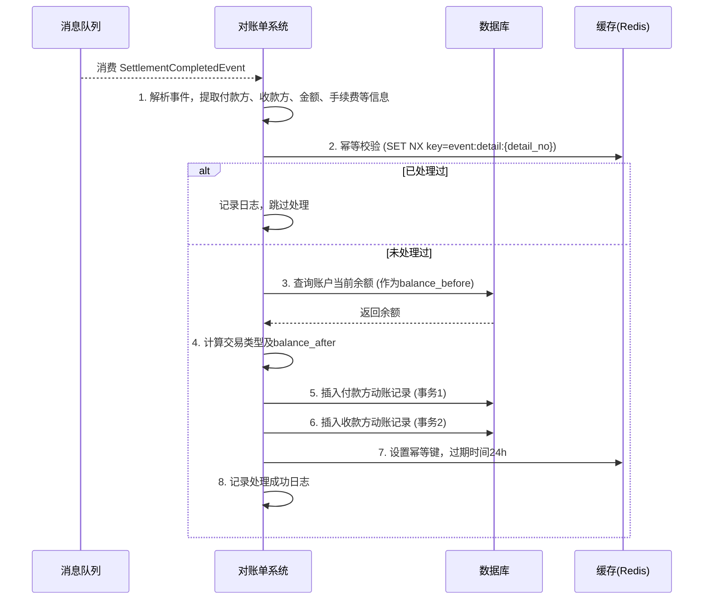
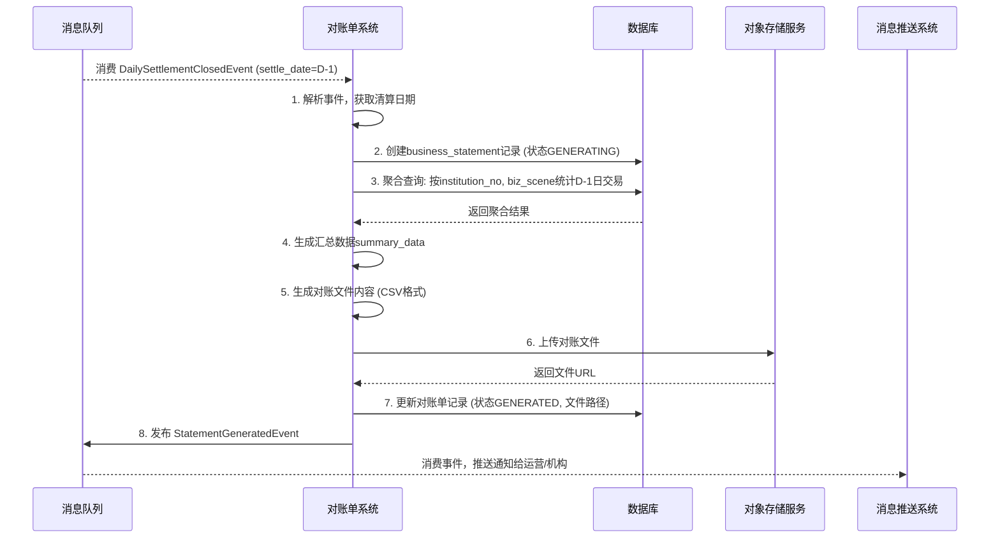
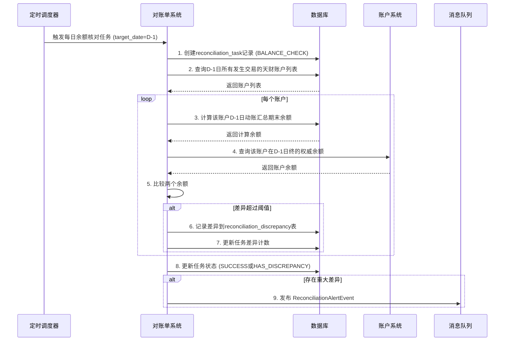

# 模块设计: 对账单系统

生成时间: 2026-01-19 17:57:11

---

# 模块设计: 对账单系统

生成时间: 2026-01-19 18:30:00

---

# 对账单系统模块设计文档

## 1. 概述

### 1.1 目的
本模块作为支付系统“天财分账”业务的**资金变动与业务对账中心**，旨在为天财机构、收单商户（总部/门店）及相关运营人员提供准确、完整、及时的资金动账明细与业务对账服务。其主要目的是：
- **动账明细生成与查询**：聚合来自清结算系统、账户系统等上游的资金变动数据，生成面向商户的账户动账明细，支持按账户、时间、业务类型等多维度查询与导出。
- **业务对账单生成**：根据天财分账的业务场景（归集、批量付款、会员结算），生成机构层级的业务汇总对账单，清晰展示资金流向、手续费、交易笔数等关键指标。
- **数据核对与一致性保障**：通过定期对账任务，核对本模块数据与上游权威数据源（清结算流水、账户余额）的一致性，及时发现并告警数据差异，保障财务数据的准确性。
- **运营分析与决策支持**：为运营、财务及风控部门提供标准化的数据报表，支持业务监控、数据分析与决策制定。

### 1.2 范围
- **核心功能**：
    - **动账明细管理**：接收并处理资金变动事件，生成、存储和查询天财专用账户（收款账户、接收方账户）的每一笔资金变动记录。
    - **业务对账单管理**：按日/月/自定义周期，为天财机构或商户生成涵盖多种业务场景（归集、批量付款、会员结算）的汇总对账单。
    - **对账文件生成**：生成符合行业标准或内部要求的对账文件（如CSV、Excel），支持自动推送或手动下载。
    - **数据核对与稽核**：执行定时对账任务，比对动账明细总和与账户余额、比对本模块流水与清结算流水，确保数据一致性。
    - **运营报表**：提供交易量、手续费收入、资金流转效率等关键指标的统计报表。
- **非功能范围**：
    - 不负责资金的清算、结算与计费（由清结算系统负责）。
    - 不负责账户实体的创建与管理（由账户系统负责）。
    - 不处理具体的业务逻辑校验与执行（由业务核心、行业钱包系统负责）。
    - 不直接驱动或管理电子签约与认证流程。

## 2. 接口设计

### 2.1 API 端点 (RESTful)

#### 2.1.1 动账明细查询接口 (供商户/内部系统调用)
- **GET /api/v1/statements/transactions** - 查询账户动账明细列表
- **GET /api/v1/statements/transactions/{transactionId}** - 查询单笔动账明细详情
- **POST /api/v1/statements/transactions/export** - 导出动账明细（异步任务）

#### 2.1.2 业务对账单接口 (供天财机构/运营调用)
- **GET /api/v1/statements/business** - 查询业务对账单列表（按机构、周期）
- **GET /api/v1/statements/business/{statementNo}/summary** - 查询对账单汇总信息
- **GET /api/v1/statements/business/{statementNo}/details** - 查询对账单明细条目
- **POST /api/v1/statements/business/generate** - 手动触发对账单生成（补生成）

#### 2.1.3 对账文件接口
- **GET /api/v1/statements/files** - 查询可用的对账文件列表
- **GET /api/v1/statements/files/{fileId}/download** - 下载对账文件

#### 2.1.4 数据核对与报表接口 (内部/运营)
- **GET /api/internal/v1/statements/reconciliation/report** - 获取对账差异报告
- **GET /api/internal/v1/statements/dashboard/summary** - 获取运营仪表板汇总数据

### 2.2 输入/输出数据结构

#### 2.2.1 动账明细查询请求 (TransactionQueryRequest)
```json
{
  "accountNo": "TCWALLET202310270001",
  "startTime": "2023-10-27T00:00:00Z",
  "endTime": "2023-10-27T23:59:59Z",
  "transactionType": "ALL | INCOME | EXPENDITURE", // 交易类型：全部、收入、支出
  "businessType": "CAPITAL_POOLING, MEMBER_SETTLEMENT, BATCH_PAYMENT", // 业务类型，多选
  "minAmount": "0.00",
  "maxAmount": "10000.00",
  "pageNum": 1,
  "pageSize": 20
}
```

#### 2.2.2 动账明细响应 (TransactionDetail)
```json
{
  "transactionId": "TRX20231027000001",
  "accountNo": "TCWALLET202310270001",
  "relatedAccountNo": "TCWALLET202310270002",
  "transactionTime": "2023-10-27T10:00:05Z",
  "accountingDate": "2023-10-27",
  "transactionType": "INCOME", // INCOME, EXPENDITURE
  "businessType": "CAPITAL_POOLING",
  "bizScene": "FUND_POOLING",
  "amount": "1000.00",
  "balanceBefore": "5000.00",
  "balanceAfter": "6000.00",
  "currency": "CNY",
  "feeAmount": "1.00",
  "feeBearer": "PAYER",
  "relatedOrderNo": "ST20231027000001",
  "relatedDetailNo": "STD20231027000001",
  "remark": "门店归集款",
  "status": "SUCCESS",
  "createdAt": "2023-10-27T10:00:06Z"
}
```

#### 2.2.3 业务对账单汇总响应 (BusinessStatementSummary)
```json
{
  "statementNo": "BST20231027001",
  "institutionNo": "TC001",
  "statementType": "DAILY", // DAILY, MONTHLY, CUSTOM
  "periodStart": "2023-10-27",
  "periodEnd": "2023-10-27",
  "generatedTime": "2023-10-28T03:00:00Z",
  "summary": {
    "totalTransactionCount": 150,
    "totalTransactionAmount": "500000.00",
    "totalFeeIncome": "500.00",
    "breakdownByScene": [
      {
        "scene": "FUND_POOLING",
        "count": 100,
        "amount": "300000.00",
        "fee": "300.00"
      },
      {
        "scene": "MEMBER_SETTLEMENT",
        "count": 30,
        "amount": "100000.00",
        "fee": "100.00"
      },
      {
        "scene": "BATCH_PAYMENT",
        "count": 20,
        "amount": "100000.00",
        "fee": "100.00"
      }
    ]
  },
  "fileUrl": "https://bucket.oss.com/statements/TC001_20231027.csv",
  "status": "GENERATED" // GENERATING, GENERATED, FAILED
}
```

### 2.3 发布/消费的事件

#### 2.3.1 消费的事件
- **SettlementCompletedEvent** (来自清结算系统)：**核心数据源**。消费此事件以获取每一笔成功的资金分账、结算、计费的详细信息，用于生成动账明细。
- **DailySettlementClosedEvent** (来自清结算系统)：消费此事件作为日终对账单生成的触发信号。表示当日清算已完成，可以开始生成日终对账文件。
- **AccountCreatedEvent** (来自账户系统)：消费此事件以初始化新账户在对账单系统的档案，便于后续关联查询。
- **AccountStatusChangedEvent** (来自账户系统)：消费此事件以更新账户状态，可能影响对账单的展示（如冻结账户的明细查询）。

#### 2.3.2 发布的事件
- **StatementGeneratedEvent**：当日/月对账单生成完成时发布。
    - 内容：对账单编号、机构号、周期、文件路径、生成状态。
    - 消费者：消息推送系统（通知运营或商户）、文件存储系统（触发备份）。
- **ReconciliationAlertEvent**：数据核对发现重大差异时发布。
    - 内容：对账任务ID、差异类型（余额不符、流水缺失）、差异金额、涉及账户/时间范围。
    - 消费者：监控告警系统、工单系统（自动创建排查工单）。

## 3. 数据模型

### 3.1 数据库表设计

#### 表: `account_transaction` (账户动账明细表)
| 字段名 | 类型 | 必填 | 默认值 | 说明 |
| :--- | :--- | :--- | :--- | :--- |
| `id` | bigint | Y | AUTO_INCREMENT | 主键 |
| `transaction_id` | varchar(32) | Y | | **动账流水号**，唯一，规则: TRX+日期+序列 |
| `account_no` | varchar(32) | Y | | **账户号** |
| `related_account_no` | varchar(32) | N | | 对方账户号 |
| `transaction_time` | datetime(6) | Y | | **交易时间**（业务发生时间，高精度） |
| `accounting_date` | date | Y | | **会计日期**（清算日期） |
| `transaction_type` | varchar(10) | Y | | 交易类型: `INCOME`(收入), `EXPENDITURE`(支出) |
| `business_type` | varchar(32) | Y | | 业务类型: `CAPITAL_POOLING`, `MEMBER_SETTLEMENT`, `BATCH_PAYMENT` |
| `biz_scene` | varchar(32) | Y | | 业务场景码: `FUND_POOLING`, `MEMBER_SETTLEMENT`, `BATCH_PAYMENT` |
| `amount` | decimal(15,2) | Y | | 交易金额（正数） |
| `balance_before` | decimal(15,2) | Y | | 交易前余额 |
| `balance_after` | decimal(15,2) | Y | | 交易后余额 |
| `currency` | varchar(3) | Y | `CNY` | 币种 |
| `fee_amount` | decimal(15,2) | Y | 0.00 | 手续费金额 |
| `fee_bearer` | varchar(10) | N | | 手续费承担方: `PAYER`, `PAYEE` |
| `related_order_no` | varchar(32) | Y | | 关联业务单号 (如 settlement_no) |
| `related_detail_no` | varchar(32) | N | | 关联明细单号 (如 detail_no) |
| `remark` | varchar(512) | N | | 交易备注 |
| `status` | varchar(20) | Y | `SUCCESS` | 状态: `SUCCESS`, `FAILED` (预留) |
| `institution_no` | varchar(16) | Y | | 天财机构号（冗余，便于查询） |
| `created_at` | datetime | Y | CURRENT_TIMESTAMP | 创建时间 |
| **索引** | | | | |
| `uk_transaction_id` | UNIQUE(`transaction_id`) | | | 流水号唯一索引 |
| `idx_account_time` | (`account_no`, `transaction_time`) | | | **核心查询索引**，商户查账 |
| `idx_accounting_date` | (`accounting_date`, `account_no`) | | | 按会计日期查询索引 |
| `idx_related_order` | (`related_order_no`) | | | 按业务单号查询索引 |
| `idx_institution_date` | (`institution_no`, `accounting_date`) | | | 机构日维度统计索引 |

#### 表: `business_statement` (业务对账单主表)
| 字段名 | 类型 | 必填 | 默认值 | 说明 |
| :--- | :--- | :--- | :--- | :--- |
| `id` | bigint | Y | AUTO_INCREMENT | 主键 |
| `statement_no` | varchar(32) | Y | | **对账单编号**，唯一，规则: BST+日期+序列 |
| `institution_no` | varchar(16) | Y | | 天财机构号 |
| `statement_type` | varchar(20) | Y | | 类型: `DAILY`, `MONTHLY`, `CUSTOM` |
| `period_start` | date | Y | | 周期开始日期 |
| `period_end` | date | Y | | 周期结束日期 |
| `generated_time` | datetime | Y | | 生成时间 |
| `summary_data` | json | Y | | 汇总数据快照 (JSON结构，包含交易笔数、金额、手续费分场景统计) |
| `file_storage_path` | varchar(512) | N | | 对账文件存储路径 (OSS/S3路径) |
| `file_format` | varchar(10) | N | | 文件格式: `CSV`, `EXCEL`, `PDF` |
| `status` | varchar(20) | Y | `GENERATING` | 状态: `GENERATING`, `GENERATED`, `FAILED` |
| `failure_reason` | varchar(512) | N | | 生成失败原因 |
| `operator` | varchar(64) | N | `SYSTEM` | 操作人 (SYSTEM表示自动生成) |
| `created_at` | datetime | Y | CURRENT_TIMESTAMP | 创建时间 |
| `updated_at` | datetime | Y | CURRENT_TIMESTAMP ON UPDATE | 更新时间 |
| **索引** | | | | |
| `uk_statement_no` | UNIQUE(`statement_no`) | | | 对账单号唯一索引 |
| `idx_institution_period` | (`institution_no`, `statement_type`, `period_start`, `period_end`) | | | 机构周期查询索引 |

#### 表: `reconciliation_task` (数据核对任务表)
| 字段名 | 类型 | 必填 | 默认值 | 说明 |
| :--- | :--- | :--- | :--- | :--- |
| `id` | bigint | Y | AUTO_INCREMENT | 主键 |
| `task_id` | varchar(32) | Y | | 任务ID |
| `task_type` | varchar(32) | Y | | 任务类型: `BALANCE_CHECK`, `TRANSACTION_MATCH` |
| `target_date` | date | Y | | 目标核对日期 |
| `institution_no` | varchar(16) | N | | 机构号 (为空表示全机构) |
| `status` | varchar(20) | Y | `PENDING` | 状态: `PENDING`, `RUNNING`, `SUCCESS`, `FAILED`, `HAS_DISCREPANCY` |
| `discrepancy_count` | int | Y | 0 | 差异数量 |
| `discrepancy_summary` | json | N | | 差异摘要 (JSON结构) |
| `start_time` | datetime | N | | 开始执行时间 |
| `end_time` | datetime | N | | 结束时间 |
| `created_at` | datetime | Y | CURRENT_TIMESTAMP | 创建时间 |
| **索引** | | | | |
| `idx_task_type_date` | (`task_type`, `target_date`, `status`) | | | 任务执行查询索引 |

#### 表: `reconciliation_discrepancy` (数据核对差异明细表)
| 字段名 | 类型 | 必填 | 默认值 | 说明 |
| :--- | :--- | :--- | :--- | :--- |
| `id` | bigint | Y | AUTO_INCREMENT | 主键 |
| `task_id` | varchar(32) | Y | | 关联任务ID |
| `discrepancy_type` | varchar(32) | Y | | 差异类型: `BALANCE_MISMATCH`, `MISSING_TRANSACTION`, `AMOUNT_MISMATCH` |
| `account_no` | varchar(32) | N | | 涉及账户 |
| `reference_no` | varchar(32) | N | | 参考单号 (如 settlement_no) |
| `expected_value` | decimal(15,2) | N | | 期望值 (如账户余额) |
| `actual_value` | decimal(15,2) | N | | 实际值 |
| `difference` | decimal(15,2) | Y | | 差异值 |
| `data_source` | varchar(32) | Y | | 数据来源: `SETTLEMENT`, `ACCOUNT`, `STATEMENT` |
| `status` | varchar(20) | Y | `PENDING` | 处理状态: `PENDING`, `CONFIRMED`, `IGNORED`, `RESOLVED` |
| `resolution_notes` | varchar(512) | N | | 处理备注 |
| `created_at` | datetime | Y | CURRENT_TIMESTAMP | 创建时间 |
| **索引** | | | | |
| `idx_task_id` | (`task_id`, `discrepancy_type`) | | | 任务差异查询索引 |
| `idx_account_status` | (`account_no`, `status`) | | | 账户差异处理索引 |

### 3.2 与其他模块的关系
- **清结算系统**：**核心上游数据源**。消费其发布的`SettlementCompletedEvent`和`DailySettlementClosedEvent`，获取资金变动的权威记录和日终触发信号。是本模块`account_transaction`表数据的主要来源。
- **账户系统**：**账户信息与余额参考源**。消费`AccountCreatedEvent`和`AccountStatusChangedEvent`维护账户档案。在数据核对时，调用其接口或消费事件获取账户余额，与动账明细汇总进行比对。
- **行业钱包系统**：**业务关系与场景信息补充源**。可通过查询其接口或消费事件，获取更丰富的业务关系信息（如绑定关系、门店-总部映射），用于丰富对账单的展示维度。
- **三代系统**：**商户与机构信息源**。可通过其接口查询商户的详细信息（名称、类型），用于对账单的展示。
- **文件存储服务 (如OSS/S3)**：**下游依赖**。生成的对账单文件需要上传至对象存储服务，并提供下载链接。
- **消息推送系统**：**下游通知渠道**。当对账单生成完成或发现重大核对差异时，通过消息系统通知相关运营人员或商户。

## 4. 业务逻辑

### 4.1 核心算法
- **动账流水号生成**：`TRX` + `YYYYMMDD` + `6位自增序列`。使用分布式序列服务保证集群唯一。
- **对账单编号生成**：`BST` + `YYYYMMDD` + `3位自增序列`。
- **余额方向计算**：根据`SettlementCompletedEvent`中的账户角色（付款方/收款方）和金额，自动计算`transaction_type`（收入/支出）以及`balance_before`/`balance_after`。
    - 对于收款方：`transaction_type` = `INCOME`, `balance_after` = `balance_before` + `amount` - `fee_amount`(若收款方承担)。
    - 对于付款方：`transaction_type` = `EXPENDITURE`, `balance_after` = `balance_before` - `amount` - `fee_amount`(若付款方承担)。
- **对账单汇总统计**：使用SQL聚合查询或Elasticsearch等分析引擎，按`accounting_date`和`institution_no`分组，统计各`biz_scene`下的交易笔数、总金额、总手续费。
- **数据核对（余额核对）**：
    1. 查询`account_transaction`表中指定`accounting_date`和`account_no`的所有流水，计算期末余额（`sum(income) - sum(expenditure)`）。
    2. 调用**账户系统**接口或查询其事件快照，获取该账户在`accounting_date`日终的权威余额。
    3. 比较两者，若差异超过阈值（如0.01元），则记录差异。

### 4.2 业务规则
1. **动账明细记录规则**：
    - 每笔成功的资金结算（`SettlementCompletedEvent`）必须生成两条动账记录：一条对应付款方（支出），一条对应收款方（收入）。
    - 动账记录的`accounting_date`必须与清结算事件中的`settle_date`一致，作为对账基准日期。
    - 对于`PARTIAL_FAILED`的分账订单，只记录成功部分的动账明细，并在备注中注明“部分成功”。
    - 退货前置扣减、手续费扣收等资金变动也需生成对应的动账记录。

2. **对账单生成规则**：
    - **日结对账单**：每日凌晨（消费`DailySettlementClosedEvent`后）自动为每个天财机构(`institution_no`)生成前一自然日的业务对账单。
    - **月结对账单**：每月初第1个工作日，自动生成上一自然月的对账单，数据聚合自日结数据。
    - **生成触发**：支持手动补生成指定日期的对账单。
    - **文件格式**：默认生成CSV格式文件，包含明细和汇总sheet。文件命名规则：`{机构号}_{对账日期}_{序列号}.csv`。

3. **数据核对规则**：
    - **余额核对**：每日凌晨在对账单生成后，自动触发余额核对任务，核对上一日所有天财账户的动账汇总余额与账户系统余额的一致性。
    - **流水核对**：每周/每月执行一次，将本模块的`account_transaction`与清结算系统的`ledger_journal`进行全量比对，确保无遗漏或重复。
    - **差异处理**：发现差异后自动记录并发布告警。差异处理流程支持人工确认、忽略或标记为已解决。

4. **数据保留与归档**：
    - 动账明细在线查询保留最近2年数据，更早数据归档至冷存储（如HDFS），但支持按需恢复查询。
    - 对账单文件永久保留在对象存储中。

### 4.3 验证逻辑
- **事件消费幂等性**：基于`SettlementCompletedEvent`中的清结算流水号(`settlement_no`和`detail_no`)实现消费幂等。防止网络重试等原因导致重复生成动账记录。
- **数据完整性校验**：在处理`SettlementCompletedEvent`时，校验必要字段是否存在（如账户号、金额、日期），若缺失则记录错误日志并告警，但不应阻塞事件消费（采用死信队列处理）。
- **对账单生成前置校验**：手动触发对账单生成时，校验指定日期范围是否已存在同类型的对账单，避免重复生成。校验日期是否在当前日期之前（不能生成未来日期的对账单）。

## 5. 时序图

### 5.1 动账明细生成时序图（消费清结算事件）


### 5.2 日结对账单生成时序图


### 5.3 余额核对任务时序图


## 6. 错误处理

| 错误码 | HTTP状态码 | 描述 | 处理策略 |
| :--- | :--- | :--- | :--- |
| `STMT_4001` | 400 Bad Request | 查询参数无效（如日期格式错误） | 客户端检查并修正请求参数 |
| `STMT_4002` | 400 Bad Request | 对账周期不合法（如开始日期晚于结束日期） | 客户端调整查询周期 |
| `STMT_4041` | 404 Not Found | 指定的对账单不存在 | 客户端检查对账单编号或查询条件 |
| `STMT_4091` | 409 Conflict | 重复生成对账单（同机构同周期已存在） | 客户端查询已有对账单，或等待异步生成完成 |
| `STMT_4241` | 424 Failed Dependency | 依赖服务（如清结算、账户系统）不可用或返回错误 | 根据错误类型决定：文件生成可延迟重试；查询接口可返回降级数据或错误 |
| `STMT_5001` | 500 Internal Server Error | 内部处理异常（如数据库操作失败） | 服务端记录详细日志并告警，客户端可有限重试 |
| `STMT_5002` | 500 Internal Server Error | 文件生成或上传失败 | 服务端重试生成任务，并告警通知运维 |

**通用策略**：
- **事件消费**：采用消息队列的ACK机制，正常处理成功后确认。对于处理失败的事件（如数据异常），进入死信队列，由监控告警并人工介入处理。
- **异步任务**：对账单生成、数据核对等异步任务，记录详细任务状态和日志。支持任务重试和手动触发。任务失败时告警。
- **降级方案**：
    - 当清结算事件积压时，动账明细的`balance_before`可能不准确（因为并发）。此时可降级为不实时查询余额，而是通过上一条流水的`balance_after`推算（需保证事件顺序消费）。
    - 当账户系统不可用时，余额核对任务可跳过或标记为“依赖服务异常”，待恢复后重试。
- **监控与告警**：
    - 监控事件消费延迟、对账单生成成功率、数据核对差异率。
    - 对动账明细数量与清结算流水数量的偏差进行监控。
    - 对长期未解决的核对差异进行升级告警。

## 7. 依赖说明

### 7.1 上游模块交互
1. **清结算系统**：
    - **交互方式**：**异步事件消费** (`SettlementCompletedEvent`, `DailySettlementClosedEvent`)。
    - **职责**：清结算系统是动账明细数据的**唯一权威来源**。对账单系统必须可靠地消费其事件，任何事件丢失都会导致对账数据不完整。
    - **数据一致性保障**：通过`settlement_no`和`detail_no`实现幂等消费，确保不重不漏。定期执行流水核对任务，确保本模块数据与清结算源头数据一致。

2. **账户系统**：
    - **交互方式**：**异步事件消费** (`AccountCreatedEvent`, `AccountStatusChangedEvent`) + **同步REST API调用**（余额查询，用于核对）。
    - **职责**：账户系统提供账户基础信息和权威余额。事件用于维护账户档案；同步接口用于数据核对时的余额比对。
    - **降级方案**：余额核对任务中，若账户系统查询失败，可记录异常并跳过该账户的核对，待下次任务重试。不影响动账明细的生成与查询主功能。

3. **行业钱包系统/三代系统**：
    - **交互方式**：**同步REST API调用**（按需查询，用于丰富展示信息）。
    - **职责**：在生成对账单或响应查询时，可能需要获取商户名称、关系映射等补充信息。此为非核心依赖，可缓存结果。
    - **降级方案**：查询失败时，对账单或明细中相关字段可显示为“未知”或留空，不影响核心财务数据的展示。

### 7.2 关键依赖管理
- **强依赖**：**清结算系统的事件流**、**数据库**。这些是核心功能运行的基础，需保证高可用。
- **弱依赖**：账户系统（核对环节）、文件存储服务（文件生成环节）。这些依赖故障时，核心的动账明细生成与查询功能仍可运行，但部分功能（核对、文件下载）会受影响。
- **最终一致性保障**：
    - 与清结算系统：通过事件驱动+定期核对保证最终一致。核对发现差异时，以清结算系统为权威进行修复（如补录流水）。
    - 与账户系统：余额数据以账户系统为权威。动账明细中的余额为当时快照，可能因后续调整（如差错处理）与当前账户余额不一致，这是可接受的业务场景。

### 7.3 数据流与职责边界
- **数据流入**：对账单系统不主动产生资金变动数据，只消费和处理上游系统产生的领域事件。
- **数据流出**：对外提供查询、导出、对账文件下载服务。数据以只读方式提供给商户和运营。
- **职责边界**：对账单系统是数据的“记录者”和“呈现者”，而非“裁决者”。不修改任何资金数据，所有数据问题需反馈至源头系统（清结算、账户）进行修复。