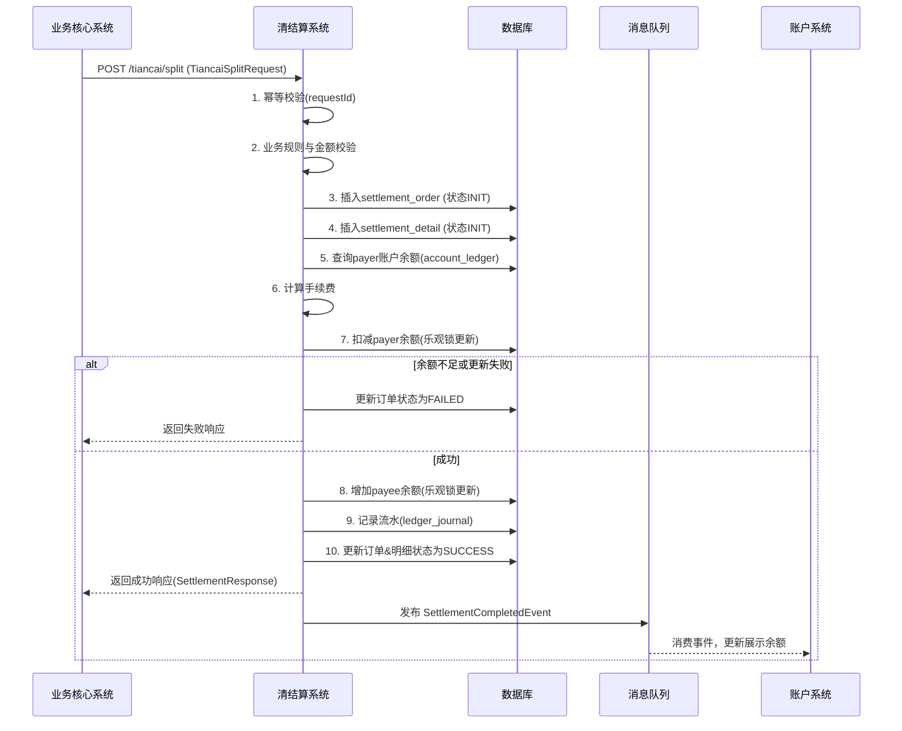
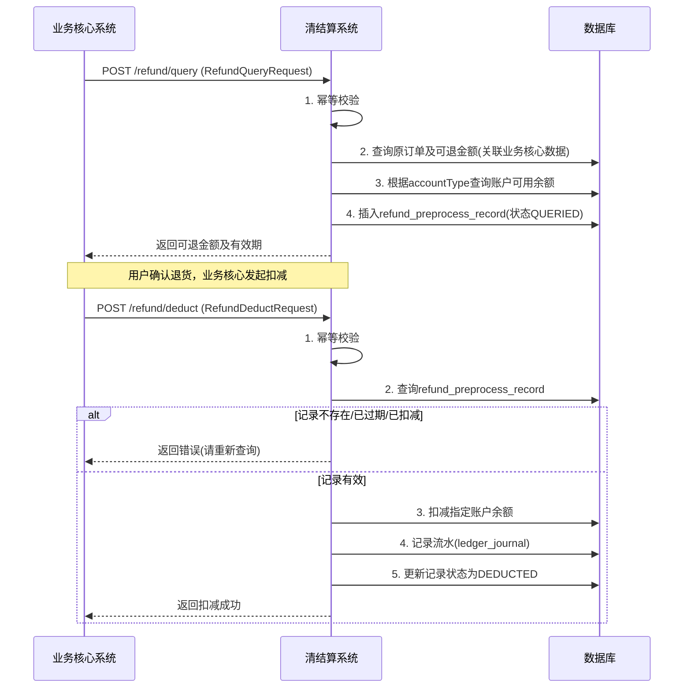

# 模块设计: 清结算系统

生成时间: 2026-01-19 17:54:32

---

# 清结算系统模块设计文档

## 1. 概述

### 1.1 目的
清结算系统是支付系统的资金处理核心，负责为“天财分账”等业务场景提供准确、安全、高效的清算、结算、计费及退货资金处理能力。其主要目的是：
- **资金清算**：对交易进行轧差、汇总，计算应收应付净额。
- **资金结算**：根据清算结果，执行实际的资金划拨，包括分账、归集、批量付款等。
- **手续费计费与扣收**：根据业务规则和配置，计算交易产生的手续费，并从指定承担方账户扣收。
- **退货资金处理**：管理退货交易的资金流程，支持从天财收款账户或退货账户（04账户）扣减余额。
- **账户余额管理**：作为资金余额的权威数据源，管理所有天财专用账户（01待结算账户、04退货账户等）的账簿。
- **对账支撑**：为对账单系统提供准确、完整的账户动账明细数据。

### 1.2 范围
- **核心功能**：
    - **清算处理**：接收业务核心系统的交易请求，进行合法性校验、计费计算，生成清算记录。
    - **结算执行**：根据清算结果，执行账户间的资金划转（内部记账），并驱动银行通道完成外部资金调拨。
    - **手续费处理**：支持按交易、按商户、按产品等多种计费模式，并支持指定手续费承担方（付款方/收款方）。
    - **退货处理**：提供退货前置查询和扣减接口，处理退货交易的资金返还。
    - **账户余额管理**：维护天财收款账户、接收方账户、01待结算账户、04退货账户的实时余额。
    - **日终批处理**：执行日切、清算文件生成、手续费汇总、与会计系统对账等。
- **非功能范围**：
    - 不负责具体的业务逻辑校验（如关系绑定是否有效，由行业钱包系统负责）。
    - 不负责账户实体的创建与生命周期管理（由账户系统负责）。
    - 不直接生成用户侧对账单（由对账单系统负责）。
    - 不处理电子签约、身份认证等流程。

## 2. 接口设计

### 2.1 API 端点 (RESTful)

#### 2.1.1 交易处理接口 (供业务核心系统调用)
- **POST /api/v1/settlement/tiancai/split** - 处理天财分账交易（包括归集、会员结算、批量付款）
- **POST /api/v1/settlement/refund/query** - 退货前置查询（查询可退余额）
- **POST /api/v1/settlement/refund/deduct** - 退货前置扣减（扣减账户余额）

#### 2.1.2 账户与余额接口 (供账户系统、内部管理调用)
- **GET /api/v1/settlement/accounts/{accountNo}/balance** - 查询账户实时余额
- **POST /api/v1/settlement/accounts/batch-balance** - 批量查询账户余额
- **GET /api/v1/settlement/accounts/{accountNo}/ledger** - 查询账户动账明细（内部）

#### 2.1.3 运营与管理接口
- **POST /api/v1/settlement/daily/close** - 触发日终清算（手动）
- **GET /api/v1/settlement/daily/summary/{settleDate}** - 查询指定日清算汇总

### 2.2 输入/输出数据结构

#### 2.2.1 天财分账请求 (TiancaiSplitRequest)
```json
{
  "requestId": "SPLIT202310270001", // 请求流水号，全局唯一，用于幂等
  "bizScene": "FUND_POOLING | MEMBER_SETTLEMENT | BATCH_PAYMENT", // 业务场景：归集、会员结算、批量付款
  "payerAccountNo": "TCWALLET202310270001", // 付款方账户号
  "payeeList": [ // 收款方列表（批量付款支持多个）
    {
      "payeeAccountNo": "TCWALLET202310270002",
      "amount": "100.00", // 分账金额
      "remark": "门店归集款"
    }
  ],
  "totalAmount": "100.00", // 总金额（应与payeeList金额总和一致）
  "feePayer": "PAYER | PAYEE", // 手续费承担方：付款方 | 收款方
  "feeRuleId": "FEE_TC_001", // 计费规则ID（由三代系统配置）
  "originalOrderNo": "ORDER202310270001", // 原交易订单号（会员结算等场景关联用）
  "extInfo": {
    "institutionNo": "TC001",
    // ... 其他业务扩展信息
  }
}
```

#### 2.2.2 分账响应 (SettlementResponse)
```json
{
  "code": "SUCCESS",
  "message": "处理成功",
  "data": {
    "settlementNo": "ST20231027000001", // 清结算流水号
    "requestId": "SPLIT202310270001",
    "status": "PROCESSING | SUCCESS | FAILED", // 处理状态
    "payerAccountNo": "TCWALLET202310270001",
    "payerBalance": "900.00", // 付款方操作后余额
    "payeeResults": [
      {
        "payeeAccountNo": "TCWALLET202310270002",
        "amount": "100.00",
        "status": "SUCCESS",
        "payeeBalance": "100.00", // 收款方操作后余额
        "feeAmount": "1.00", // 本笔手续费（如收款方承担）
        "settlementDetailNo": "STD20231027000001" // 明细流水号
      }
    ],
    "totalFee": "1.00", // 总手续费（如付款方承担）
    "processTime": "2023-10-27T10:00:00Z"
  }
}
```

#### 2.2.3 退货前置查询请求 (RefundQueryRequest)
```json
{
  "requestId": "REFUND_QUERY202310270001",
  "merchantNo": "M100001",
  "refundAmount": "50.00",
  "accountType": "RECEIVABLE | REFUND", // 扣款账户类型：收款账户 | 04退货账户
  "originalOrderNo": "ORDER202310270001" // 原消费订单号，用于关联和风控
}
```

#### 2.2.4 退货前置扣减请求 (RefundDeductRequest)
```json
{
  "requestId": "REFUND_DEDUCT202310270001",
  "merchantNo": "M100001",
  "refundAmount": "50.00",
  "accountType": "RECEIVABLE | REFUND",
  "originalOrderNo": "ORDER202310270001",
  "refundOrderNo": "REFUND202310270001" // 本次退货订单号
}
```

### 2.3 发布/消费的事件

#### 2.3.1 发布的事件
- **SettlementInitiatedEvent**: 清算开始，交易被接收并验证通过时发布。
    - 内容：请求ID、业务场景、参与方、金额、时间。
    - 消费者：监控系统（用于实时业务大盘）、风控系统。
- **SettlementCompletedEvent**: 结算完成（资金内部记账完成）时发布。
    - **内容**：清结算流水号、参与账户、变动金额、变动后余额、手续费、业务场景、状态、时间。
    - **消费者**：**账户系统**（用于同步展示余额）、**对账单系统**（核心动账数据源）、**行业钱包系统**（通知业务结果）。
- **DailySettlementClosedEvent**: 日终清算完成时发布。
    - 内容：清算日期、交易汇总、手续费汇总、状态、文件路径。
    - 消费者：会计系统、对账单系统（触发账单生成）、风控系统。

#### 2.3.2 消费的事件
- **AccountStatusChangedEvent** (来自账户系统)：当账户状态变为`FROZEN`或`DISABLED`时，需暂停对该账户的支出类结算操作。
- **FeeRuleUpdatedEvent** (来自三代系统)：计费规则变更时，更新本地缓存。

## 3. 数据模型

### 3.1 数据库表设计

#### 表: `settlement_order` (清结算主订单表)
| 字段名 | 类型 | 必填 | 默认值 | 说明 |
| :--- | :--- | :--- | :--- | :--- |
| `id` | bigint | Y | AUTO_INCREMENT | 主键 |
| `settlement_no` | varchar(32) | Y | | **清结算流水号**，唯一标识，规则: ST+日期+序列 |
| `request_id` | varchar(64) | Y | | 上游请求流水号，用于幂等 |
| `biz_scene` | varchar(32) | Y | | 业务场景: `FUND_POOLING`, `MEMBER_SETTLEMENT`, `BATCH_PAYMENT` |
| `payer_account_no` | varchar(32) | Y | | 付款方账户号 |
| `total_amount` | decimal(15,2) | Y | | 交易总金额 |
| `total_fee` | decimal(15,2) | Y | 0.00 | 总手续费 |
| `fee_payer` | varchar(10) | Y | | 手续费承担方: `PAYER`, `PAYEE` |
| `fee_rule_id` | varchar(32) | Y | | 计费规则ID |
| `status` | varchar(20) | Y | `INIT` | 状态: `INIT`, `PROCESSING`, `SUCCESS`, `FAILED`, `PARTIAL_FAILED` |
| `settle_date` | date | Y | | 清算日期（会计日期） |
| `institution_no` | varchar(16) | Y | | 天财机构号 |
| `ext_info` | json | | NULL | 扩展信息 |
| `created_at` | datetime | Y | CURRENT_TIMESTAMP | 创建时间 |
| `updated_at` | datetime | Y | CURRENT_TIMESTAMP ON UPDATE | 更新时间 |
| **索引** | | | | |
| `uk_settlement_no` | UNIQUE(`settlement_no`) | | | 主流水号索引 |
| `uk_request_id` | UNIQUE(`request_id`) | | | 幂等索引 |
| `idx_payer_account` | (`payer_account_no`, `settle_date`) | | | 付款方查询索引 |
| `idx_settle_date_status` | (`settle_date`, `status`) | | | 日终处理索引 |

#### 表: `settlement_detail` (清结算明细表)
| 字段名 | 类型 | 必填 | 默认值 | 说明 |
| :--- | :--- | :--- | :--- | :--- |
| `id` | bigint | Y | AUTO_INCREMENT | 主键 |
| `detail_no` | varchar(32) | Y | | **明细流水号**，规则: STD+日期+序列 |
| `settlement_no` | varchar(32) | Y | | 关联主流水号 |
| `payee_account_no` | varchar(32) | Y | | 收款方账户号 |
| `amount` | decimal(15,2) | Y | | 分账/付款金额 |
| `fee_amount` | decimal(15,2) | Y | 0.00 | 本笔手续费（若收款方承担） |
| `post_balance` | decimal(15,2) | Y | | **操作后余额**（对于收款方） |
| `status` | varchar(20) | Y | `INIT` | 状态: `INIT`, `SUCCESS`, `FAILED` |
| `fail_reason` | varchar(255) | | NULL | 失败原因 |
| `created_at` | datetime | Y | CURRENT_TIMESTAMP | 创建时间 |
| **索引** | | | | |
| `uk_detail_no` | UNIQUE(`detail_no`) | | | 明细流水号索引 |
| `idx_settlement_no` | (`settlement_no`) | | | 关联主订单索引 |
| `idx_payee_account` | (`payee_account_no`, `created_at`) | | | 收款方动账查询索引 |

#### 表: `account_ledger` (账户分户账簿表) - 核心余额表
| 字段名 | 类型 | 必填 | 默认值 | 说明 |
| :--- | :--- | :--- | :--- | :--- |
| `id` | bigint | Y | AUTO_INCREMENT | 主键 |
| `account_no` | varchar(32) | Y | | **账户号**（与账户系统一致） |
| `account_type` | varchar(20) | Y | | 账簿类型: `RECEIVABLE`, `RECEIVER`, `SETTLEMENT_01`, `REFUND_04` |
| `balance` | decimal(15,2) | Y | 0.00 | **当前余额**，权威数据 |
| `available_balance` | decimal(15,2) | Y | 0.00 | 可用余额（余额-冻结金额） |
| `frozen_amount` | decimal(15,2) | Y | 0.00 | 冻结金额 |
| `currency` | varchar(3) | Y | `CNY` | 币种 |
| `version` | int | Y | 0 | 乐观锁版本号，防并发扣款 |
| `last_txn_time` | datetime | | NULL | 最后交易时间 |
| `created_at` | datetime | Y | CURRENT_TIMESTAMP | 创建时间 |
| `updated_at` | datetime | Y | CURRENT_TIMESTAMP ON UPDATE | 更新时间 |
| **索引** | | | | |
| `uk_account_no_type` | UNIQUE(`account_no`, `account_type`) | | | 账户与类型唯一索引 |
| `idx_account_no` | (`account_no`) | | | 账户查询索引 |

#### 表: `ledger_journal` (账户流水日记账表)
| 字段名 | 类型 | 必填 | 默认值 | 说明 |
| :--- | :--- | :--- | :--- | :--- |
| `id` | bigint | Y | AUTO_INCREMENT | 主键 |
| `journal_no` | varchar(32) | Y | | 流水号，规则: JL+日期+序列 |
| `account_no` | varchar(32) | Y | | 账户号 |
| `account_type` | varchar(20) | Y | | 账簿类型 |
| `related_no` | varchar(32) | Y | | 关联业务单号 (如 settlement_no, detail_no) |
| `biz_scene` | varchar(32) | Y | | 业务场景 |
| `change_amount` | decimal(15,2) | Y | | 变动金额（正为入账，负为出账） |
| `balance_before` | decimal(15,2) | Y | | 变动前余额 |
| `balance_after` | decimal(15,2) | Y | | 变动后余额 |
| `direction` | char(1) | Y | | 方向: `D`-借方(出), `C`-贷方(入) |
| `txn_time` | datetime | Y | CURRENT_TIMESTAMP | 交易时间 |
| `created_at` | datetime | Y | CURRENT_TIMESTAMP | 创建时间 |
| **索引** | | | | |
| `idx_account_txn` | (`account_no`, `txn_time`) | | | 账户交易历史查询主索引 |
| `idx_related_no` | (`related_no`) | | | 按业务单号查询索引 |
| `idx_settle_date` | (`txn_time`) | | | 用于日终切片（需配合时间范围） |

#### 表: `refund_preprocess_record` (退货前置处理记录表)
| 字段名 | 类型 | 必填 | 默认值 | 说明 |
| :--- | :--- | :--- | :--- | :--- |
| `id` | bigint | Y | AUTO_INCREMENT | 主键 |
| `request_id` | varchar(64) | Y | | 请求流水号，幂等 |
| `merchant_no` | varchar(32) | Y | | 商户号 |
| `account_type` | varchar(20) | Y | | 扣款账户类型 |
| `original_order_no` | varchar(32) | Y | | 原订单号 |
| `refund_order_no` | varchar(32) | | NULL | 退货订单号（扣减时填入） |
| `refund_amount` | decimal(15,2) | Y | | 退货金额 |
| `status` | varchar(20) | Y | `QUERIED` | 状态: `QUERIED`, `DEDUCTED`, `EXPIRED` |
| `expire_time` | datetime | Y | | 查询结果过期时间（如5分钟） |
| `created_at` | datetime | Y | CURRENT_TIMESTAMP | 创建时间 |
| **索引** | | | | |
| `uk_request_id` | UNIQUE(`request_id`) | | | 幂等索引 |
| `idx_merchant_original` | (`merchant_no`, `original_order_no`, `status`) | | | 商户原单查询索引 |

### 3.2 与其他模块的关系
- **业务核心系统**：上游调用方。接收其发起的“天财分账”交易请求，进行清算和结算。是清结算系统最主要的交易来源。
- **账户系统**：紧密协作。账户系统管理账户实体信息，清结算系统管理账户的资金余额。清结算系统向账户系统发布`SettlementCompletedEvent`同步余额；消费`AccountStatusChangedEvent`以控制资金操作。
- **行业钱包系统**：协同工作。钱包系统处理业务逻辑（如关系绑定），然后调用业务核心发起交易，最终由清结算系统完成资金处理。清结算系统将完成事件通知钱包系统。
- **三代系统**：配置与规则来源。从三代系统获取计费规则（`fee_rule_id`对应的具体费率）。
- **对账单系统**：核心数据提供方。对账单系统消费`SettlementCompletedEvent`和`DailySettlementClosedEvent`，并可能直接查询`ledger_journal`表，生成用户对账单。
- **银行通道/支付网络**：下游执行方。对于需要实际调拨银行资金的结算（如提现），清结算系统生成指令，通过支付网关等系统发送给银行。

## 4. 业务逻辑

### 4.1 核心算法
- **清结算流水号生成**：`ST`/`STD`/`JL` + `YYYYMMDD` + `6位自增序列`。使用分布式序列服务保证集群唯一。
- **余额更新（扣款/加款）**：
    ```java
    // 伪代码，基于乐观锁
    int rows = update account_ledger 
              set balance = balance + :changeAmount,
                  version = version + 1,
                  last_txn_time = now()
              where account_no = :accountNo 
                and account_type = :accountType
                and version = :oldVersion
                and balance + :changeAmount >= 0; // 对于扣款，校验余额充足
    if (rows == 0) {
        throw new ConcurrentUpdateException("余额更新失败，请重试");
    }
    ```
- **手续费计算**：根据`fee_rule_id`从缓存获取计费规则（如费率0.6%），按`total_amount`计算。若`fee_payer`为`PAYEE`，则总手续费分摊到每个收款方明细中计算。
- **日切处理**：每日固定时间点（如23:30）执行。
    1. 停止接收当日`settle_date`的交易。
    2. 处理所有状态为`PROCESSING`的订单。
    3. 生成清算汇总文件。
    4. 更新系统会计日期。
    5. 发布`DailySettlementClosedEvent`。

### 4.2 业务规则
1. **分账/结算规则**：
    - **金额一致性**：`total_amount`必须等于所有`payeeList.amount`之和。
    - **余额充足性**：付款方账户`available_balance`必须大于等于`total_amount`（若手续费付款方承担，则需大于`total_amount + total_fee`）。
    - **账户状态**：付款方和收款方账户在账户系统的状态必须为`ACTIVE`（通过事件或接口隐式校验）。
    - **收款方账户**：必须是`RECEIVER`类型且已绑定有效默认卡（此校验通常在业务核心或钱包系统完成）。
    - **幂等性**：基于`requestId`保证，重复请求返回原结果。

2. **手续费规则**：
    - 若`fee_payer`为`PAYER`，手续费从`total_amount`之外额外扣除，即付款方实际支出 = `total_amount + total_fee`。
    - 若`fee_payer`为`PAYEE`，手续费从每个收款方的`amount`中扣除，即收款方实际收入 = `amount - fee_amount`。
    - 手续费精确到分，采用“四舍六入五成双”规则，避免资金误差。

3. **退货前置规则**：
    - 查询结果有有效期（如5分钟），过期后需重新查询。
    - 扣减操作必须在查询有效期内进行，且扣减金额不能超过查询金额。
    - 扣减`RECEIVABLE`账户时，需校验其`available_balance`；扣减`REFUND_04`账户时，直接扣减`balance`。
    - 一次扣减成功后，对应查询记录状态变为`DEDUCTED`，防止重复扣减。

4. **日终清算规则**：
    - `settle_date`以交易进入清结算系统的时间为准。
    - 日切时未处理完的订单，继续处理，但`settle_date`仍记为上一日。
    - 生成的文件包括：交易汇总、手续费汇总、账户余额快照。

### 4.3 验证逻辑
- **分账请求验证**：
    1. 校验`requestId`幂等性。
    2. 校验必填字段和金额格式。
    3. 校验`bizScene`与账户`role_type`的匹配性（如归集场景，付款方应为`STORE`角色）。此校验可能需要调用账户系统或依赖上游。
    4. 校验付款方账户余额是否充足（查询`account_ledger`）。
    5. 校验计费规则`fee_rule_id`是否存在且有效。
- **退货前置验证**：
    1. 校验`requestId`幂等性。
    2. 校验`originalOrderNo`对应的原交易是否存在且可退。
    3. 根据`accountType`查询对应账户的可用余额。
    4. 扣减时，校验查询记录是否存在、是否在有效期内、金额是否一致。

## 5. 时序图

### 5.1 天财分账（归集）清算结算时序图


### 5.2 退货前置查询与扣减时序图


## 6. 错误处理

| 错误码 | HTTP状态码 | 描述 | 处理策略 |
| :--- | :--- | :--- | :--- |
| `SETTLE_4001` | 400 Bad Request | 请求参数无效或缺失 | 客户端检查请求体 |
| `SETTLE_4002` | 400 Bad Request | 金额计算错误（如总额不等） | 客户端重新计算金额 |
| `SETTLE_4003` | 400 Bad Request | 业务场景与账户角色不匹配 | 客户端检查业务逻辑 |
| `SETTLE_4091` | 409 Conflict | 重复请求 (requestId已处理) | 客户端使用原结果 |
| `SETTLE_4092` | 409 Conflict | 并发余额更新冲突 | 客户端稍后重试（需有退避策略） |
| `SETTLE_4031` | 403 Forbidden | 付款方余额不足 | 客户端提示充值或减少金额 |
| `SETTLE_4032` | 403 Forbidden | 账户状态异常（冻结/禁用） | 客户端联系客服 |
| `SETTLE_4041` | 404 Not Found | 计费规则不存在 | 客户端检查fee_rule_id，或由运营人员配置 |
| `SETTLE_5001` | 500 Internal Server Error | 数据库操作失败 | 服务端告警，客户端可有限重试 |
| `SETTLE_5002` | 500 Internal Server Error | 消息队列发布失败 | 服务端记录日志并异步重试，不影响主流程响应 |

**通用策略**：
- **资金操作**：所有余额变动必须保证原子性（数据库事务+乐观锁）和最终一致性。失败时必须有明确状态和补偿机制（如冲正交易）。
- **重试机制**：对于网络超时或5xx错误，客户端应实现带指数退避的有限重试（如最多3次）。对于4xx错误，不应重试，除非修正了请求。
- **监控与告警**：对失败交易、余额不足、并发冲突等高发异常进行监控和告警。
- **对账与核对**：日终通过批量对账，确保`account_ledger`余额与流水`ledger_journal`总和一致，与会计系统一致。

## 7. 依赖说明

### 7.1 上游模块交互
1. **业务核心系统**：
    - **交互方式**：同步REST API调用（`/tiancai/split`, `/refund/query`等）。
    - **职责**：清结算系统最主要的服务对象。业务核心系统封装了完整的支付/分账交易流程，清结算负责其中的资金处理环节。需保证高可用和低延迟。
    - **降级方案**：极端情况下，可提供异步受理模式，先接收请求返回受理中，后台异步处理并通知结果。

2. **账户系统**：
    - **交互方式**：异步事件消费 (`AccountStatusChangedEvent`) 和 同步REST API调用（余额查询，用于非关键路径）。
    - **职责**：清结算系统是账户余额的权威源，但依赖账户系统提供的账户状态信息来控制资金操作。账户状态变更事件必须可靠消费。
    - **降级方案**：若事件暂时丢失，可通过定时任务同步账户状态。在无法获取最新状态时，对于支出交易应更加谨慎，可增加人工审核环节。

### 7.2 下游模块交互
1. **消息队列(MQ)**：
    - **交互方式**：发布领域事件 (`SettlementCompletedEvent`, `DailySettlementClosedEvent`)。
    - **职责**：实现与账户系统、对账单系统等下游的松耦合通信。事件发布必须保证至少一次投递，消费者需幂等处理。

2. **对账单系统**：
    - **交互方式**：异步事件消费 (`SettlementCompletedEvent`, `DailySettlementClosedEvent`) 和 直接数据库查询（只读从库）。
    - **职责**：清结算系统产生的流水是生成对账单的核心依据。事件驱动保证实时性，数据库查询用于补全或批量处理。

### 7.3 关键依赖管理
- **强依赖**：数据库（MySQL）、业务核心系统（流量入口）。
- **弱依赖**：账户系统（状态事件）、MQ（事件发布）。这些系统短时故障不应阻塞核心清算流程，可通过本地缓存账户状态、异步重试发布事件等方式降级。
- **隔离与熔断**：对下游调用（如查询计费规则）需配置熔断器，防止因下游故障导致线程池耗尽。