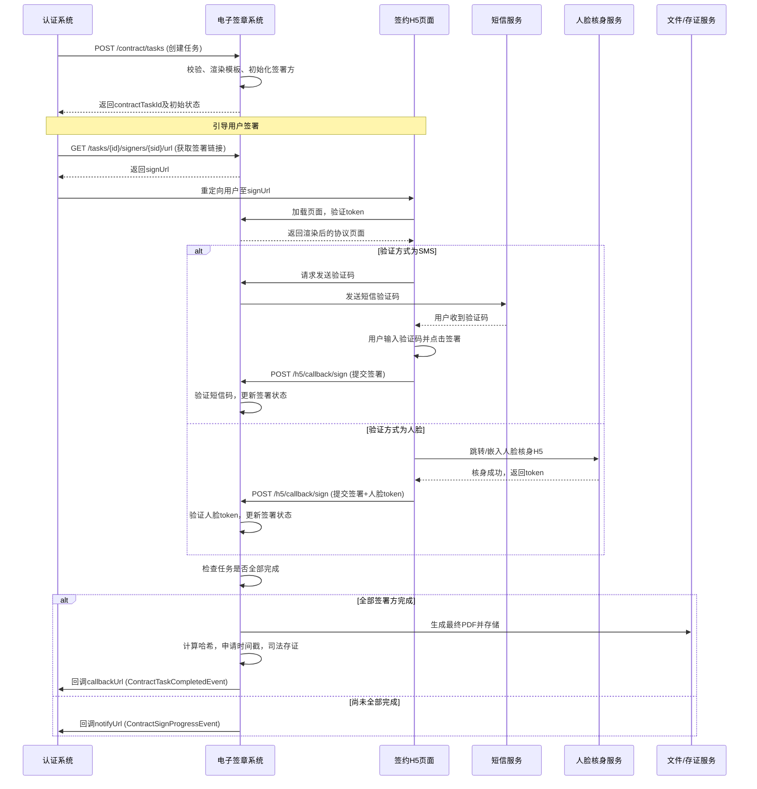

# 模块设计: 电子签章系统

生成时间: 2026-01-19 17:54:26

---

# 电子签章系统模块设计文档

## 1. 概述

### 1.1 目的
本模块（电子签章系统）作为支付机构内部独立的电子签约与存证服务平台，为“天财分账”等业务提供安全、合规、可追溯的电子协议签署能力。它封装了协议生成、签署流程管理、身份验证集成、证据链固化等核心功能，确保签约过程符合《电子签名法》要求，并为业务系统提供标准化的签约接入服务。

### 1.2 范围
- **核心功能**：
    1.  **协议模板管理**：支持多业务场景（关系绑定、开通付款等）的协议模板创建、版本管理和动态字段配置。
    2. **签约流程编排**：驱动签署流程，支持单方/多方、顺序/并行签署，集成短信验证、人脸核身等验证手段。
    3. **签约页面封装**：提供可嵌入的H5签约页面，适配移动端与PC端，确保用户体验一致。
    4. **全证据链存证**：对协议原文、签署过程日志、身份验证结果、时间戳等数据进行哈希固化，并同步至权威司法存证平台。
    5. **签约状态与文档管理**：管理协议生命周期状态，提供已签署协议的查询、下载和验真服务。
- **边界**：
    - **服务对象**：主要为内部业务系统（如认证系统），不直接对外部商户或用户暴露。
    - **能力输出**：提供签约链接、签约状态回调、协议文档。
    - **外部依赖**：集成第三方人脸核身服务、短信服务、时间戳服务及司法存证平台。
    - **数据边界**：存储协议模板、签约任务、签署记录及证据链数据，不存储业务系统的核心业务数据。

## 2. 接口设计

### 2.1 API 端点 (RESTful)

#### 2.1.1 创建签约任务
- **端点**: `POST /api/v1/contract/tasks`
- **描述**: 由认证系统调用，根据业务场景和参数创建一个新的电子协议签署任务。
- **请求头**: `X-Client-Id: {调用方系统标识}`， `X-Signature: {请求签名}` (用于接口鉴权)
- **请求体**:
    ```json
    {
      "taskId": "string", // 调用方任务ID，用于关联
      "bizScene": "TIANCAI_RELATION_BINDING" | "TIANCAI_ENABLE_PAYMENT", // 业务场景编码
      "bizId": "string", // 关联的业务ID（如认证系统的authRequestId）
      "title": "string", // 协议标题，如《天财分账授权协议》
      "templateId": "string", // 协议模板ID
      "templateVariables": { // 模板变量填充值
        "payerName": "string",
        "payerAccountNo": "string",
        "payeeName": "string",
        "payeeAccountNo": "string",
        "businessType": "string",
        "effectiveDate": "2023-10-01"
      },
      "signers": [ // 签署方列表
        {
          "signerId": "string", // 签署方在本任务中的唯一标识
          "role": "PAYER" | "PAYEE" | "WITNESS", // 签署方角色
          "name": "string", // 签署方姓名/企业名
          "idNo": "string?", // 身份证号/统一社会信用代码
          "mobile": "string?", // 手机号（用于短信验证）
          "signMethod": "SMS" | "FACE" | "CA", // 签署验证方式
          "notifyUrl": "string?" // 该签署方签署结果回调地址（可选）
        }
      ],
      "signFlowConfig": { // 签署流程配置
        "flowType": "ORDER" | "PARALLEL", // 顺序签/并行签
        "signOrder": ["signerId1", "signerId2"] // ORDER时有效
      },
      "callbackUrl": "string", // 整体任务完成回调地址
      "expireTime": "2023-10-01T23:59:59Z" // 任务过期时间
    }
    ```
- **响应体 (成功)**:
    ```json
    {
      "code": "SUCCESS",
      "data": {
        "contractTaskId": "string", // 本系统生成的签约任务ID
        "status": "INIT",
        "signUrls": { // 各签署方的签约链接（仅当流程就绪时返回）
          "signerId1": "https://esign.example.com/h5/contract?token=xxx"
        },
        "createTime": "2023-10-01T12:00:00Z"
      }
    }
    ```

#### 2.1.2 查询签约任务状态
- **端点**: `GET /api/v1/contract/tasks/{contractTaskId}`
- **描述**: 查询签约任务的详细状态、各签署方进度及协议信息。
- **响应体**:
    ```json
    {
      "contractTaskId": "string",
      "taskId": "string",
      "bizScene": "string",
      "bizId": "string",
      "title": "string",
      "status": "INIT | PROCESSING | PARTIAL_SIGNED | COMPLETED | REJECTED | EXPIRED | CANCELLED",
      "contractId": "string?", // 最终协议文档ID
      "signers": [
        {
          "signerId": "string",
          "role": "string",
          "name": "string",
          "signStatus": "PENDING | SIGNED | REJECTED | EXPIRED",
          "signTime": "string?",
          "signMethod": "string",
          "evidenceSnapshotId": "string?" // 该签署方存证快照ID
        }
      ],
      "evidenceChain": {
        "contractHash": "string?", // 协议最终版哈希值
        "timestamp": "string?", // 可信时间戳
        "blockchainTxHash": "string?" // 区块链存证交易哈希
      },
      "createTime": "string",
      "updateTime": "string",
      "expireTime": "string"
    }
    ```

#### 2.1.3 获取签署链接
- **端点**: `GET /api/v1/contract/tasks/{contractTaskId}/signers/{signerId}/url`
- **描述**: 获取指定签署方的H5签约页面链接。通常由认证系统在引导用户签约时调用。
- **查询参数**: `redirectUrl=string?` (签署完成后跳转地址)
- **响应体**:
    ```json
    {
      "signUrl": "https://esign.example.com/h5/contract?token=xxx&redirect=yyy",
      "expireTime": "2023-10-01T13:00:00Z" // 链接过期时间（短时效）
    }
    ```

#### 2.1.4 下载协议文档
- **端点**: `GET /api/v1/contract/{contractId}/document`
- **描述**: 下载已签署完成的协议PDF文档。
- **查询参数**: `type=ORIGINAL | SIGNED` (原始模板/已签署版)
- **响应头**: `Content-Type: application/pdf`, `Content-Disposition: attachment; filename="xxx.pdf"`

#### 2.1.5 接收签署回调 (供H5页面调用)
- **端点**: `POST /api/h5/callback/sign` (内部H5页面回调)
- **描述**: H5签约页面在用户完成签署操作（提交、拒绝）后回调本接口，更新签署状态。
- **请求体**:
    ```json
    {
      "taskToken": "string", // 页面携带的临时令牌
      "action": "SUBMIT" | "REJECT",
      "signatureData": "string?", // 前端生成的签名数据（如有）
      "verifyCode": "string?" // 短信验证码（如为SMS验证方式）
    }
    ```

### 2.2 发布/消费的事件

#### 2.2.1 消费的事件
- 无主要事件消费。本模块作为基础服务，以同步API调用为主。

#### 2.2.2 发布的事件
- `ContractTaskCreatedEvent`: 签约任务创建成功。可用于内部审计。
- `ContractSignProgressEvent`: 签署方签署状态变更（如已签署）。**主要消费者：认证系统**，通过回调URL通知，驱动其后续流程。
- `ContractTaskCompletedEvent`: 整个签约任务完成（所有签署方签署成功）。**主要消费者：认证系统**，通过回调URL通知。
- `ContractEvidenceStoredEvent`: 协议证据链完成司法存证。用于内部监控和审计。

## 3. 数据模型

### 3.1 数据库表设计

#### 表: `contract_task` (签约任务主表)
| 字段名 | 类型 | 必填 | 描述 |
| :--- | :--- | :--- | :--- |
| `id` | bigint(自增) | Y | 主键 |
| `contract_task_id` | varchar(32) | Y | 对外任务ID，唯一 |
| `task_id` | varchar(32) | Y | 调用方任务ID |
| `client_id` | varchar(32) | Y | 调用方系统标识 |
| `biz_scene` | varchar(64) | Y | 业务场景 |
| `biz_id` | varchar(32) | Y | 关联业务ID |
| `title` | varchar(256) | Y | 协议标题 |
| `template_id` | varchar(32) | Y | 模板ID |
| `template_variables` | json | Y | 模板变量JSON |
| `status` | varchar(32) | Y | 任务状态 |
| `contract_id` | varchar(64) | N | 最终协议文档ID |
| `callback_url` | varchar(512) | Y | 任务完成回调地址 |
| `expire_time` | datetime | Y | 任务过期时间 |
| `completed_time` | datetime | N | 任务完成时间 |
| `created_at` | datetime | Y | 创建时间 |
| `updated_at` | datetime | Y | 更新时间 |
| **索引** | | | |
| `uk_contract_task_id` | UNIQUE(`contract_task_id`) | | |
| `idx_biz_id` | (`biz_scene`, `biz_id`) | | 按业务ID查询 |
| `idx_status_expire` | (`status`, `expire_time`) | | 清理过期任务 |

#### 表: `contract_signer` (签署方表)
| 字段名 | 类型 | 必填 | 描述 |
| :--- | :--- | :--- | :--- |
| `id` | bigint | Y | 主键 |
| `contract_task_id` | varchar(32) | Y | 关联任务ID |
| `signer_id` | varchar(32) | Y | 签署方标识 |
| `role` | varchar(32) | Y | 角色 |
| `name` | varchar(128) | Y | 姓名 |
| `id_no` | varchar(64) | N | 证件号 |
| `mobile` | varchar(20) | N | 手机号 |
| `sign_method` | varchar(16) | Y | 验证方式 |
| `sign_status` | varchar(32) | Y | 签署状态 |
| `sign_time` | datetime | N | 签署时间 |
| `sign_token` | varchar(128) | N | 当前有效签署令牌 |
| `token_expire` | datetime | N | 令牌过期时间 |
| `notify_url` | varchar(512) | N | 独立回调地址 |
| `evidence_snapshot_id` | varchar(64) | N | 存证快照ID |
| `reject_reason` | varchar(256) | N | 拒签原因 |
| `created_at` | datetime | Y | 创建时间 |
| **索引** | `idx_task_signer` (`contract_task_id`, `signer_id`) | | |
| | `idx_token` (`sign_token`) | | 用于H5页面验证 |

#### 表: `contract_template` (协议模板表)
| 字段名 | 类型 | 必填 | 描述 |
| :--- | :--- | :--- | :--- |
| `id` | varchar(32) | Y | 模板ID |
| `name` | varchar(128) | Y | 模板名称 |
| `biz_scene` | varchar(64) | Y | 适用业务场景 |
| `version` | varchar(16) | Y | 版本号 |
| `content` | text | Y | 模板内容(HTML) |
| `variable_definitions` | json | Y | 变量定义[{name, desc, required}] |
| `is_active` | tinyint(1) | Y | 是否启用 |
| `creator` | varchar(64) | Y | 创建人 |
| `created_at` | datetime | Y | 创建时间 |
| **索引** | `idx_scene_version` (`biz_scene`, `version`, `is_active`) | | |

#### 表: `contract_evidence` (证据链表)
| 字段名 | 类型 | 必填 | 描述 |
| :--- | :--- | :--- | :--- |
| `id` | bigint | Y | 主键 |
| `contract_id` | varchar(64) | Y | 协议ID |
| `evidence_type` | varchar(32) | Y | 存证类型(FINAL_CONTRACT, SIGN_ACTION, TIMESTAMP) |
| `data_hash` | varchar(256) | Y | 数据哈希值 |
| `storage_key` | varchar(512) | Y | 原始数据存储路径/密钥 |
| `timestamp` | varchar(128) | N | 可信时间戳 |
| `blockchain_tx_hash` | varchar(256) | N | 区块链交易哈希 |
| `created_at` | datetime | Y | 存证时间 |
| **索引** | `idx_contract_id` (`contract_id`) | | |

### 3.2 与其他模块的关系
- **认证系统**: 主要服务消费者。认证系统调用本模块完成协议签署环节，并接收签署状态回调。
- **文件存储服务**: 依赖服务，用于存储协议模板HTML、生成的协议PDF、过程截图等文件。
- **第三方服务**:
    - **人脸核身服务**: 在签署方选择`FACE`验证方式时，H5页面将跳转至或嵌入该服务进行活体检测。
    - **短信服务**: 用于发送签署验证码。
    - **可信时间戳服务**: 为最终协议哈希值加盖时间戳。
    - **司法存证平台**: 将关键证据哈希同步至区块链或第三方存证平台。

## 4. 业务逻辑

### 4.1 核心算法与流程
1.  **任务创建与初始化**：
    - 校验调用方身份(`client_id`)和签名。
    - 根据`biz_scene`和`template_id`加载协议模板，并用`template_variables`渲染生成协议预览内容。
    - 初始化签署方状态，根据`signFlowConfig`确定签署顺序。
    - 为每个签署方生成短期有效的`sign_token`。
2.  **签署流程驱动**：
    - **顺序签**：仅当上一签署方完成签署后，下一签署方的签约链接才变为有效。
    - **并行签**：所有签署方可同时签署。
    - 签署链接通过短信或业务系统页面分发给各签署方。
3.  **H5签约页面逻辑**：
    - 验证URL中的`token`有效性及是否过期。
    - 展示渲染后的协议内容。
    - 根据`sign_method`触发验证：
        - `SMS`：发送验证码至预留手机号，验证通过后方可签署。
        - `FACE`：引导用户完成人脸核身，获取核身结果。
        - `CA`：引导用户使用USB Key或软证书进行签名（预留）。
    - 用户点击“确认签署”或“拒绝”后，调用回调接口更新状态。
4.  **证据链固化**：
    - **签署行为存证**：记录每次签署动作的时间、IP、设备指纹、验证方式结果。
    - **最终协议存证**：所有签署方完成后，生成最终PDF，计算哈希，并申请可信时间戳。
    - **司法存证**：将协议哈希、时间戳、签署行为日志打包，同步至司法存证平台。
5.  **状态同步与回调**：
    - 任一签署方状态变更，立即异步回调其`notify_url`（如有）。
    - 整个任务完成（成功或失败），回调`callback_url`通知认证系统。

### 4.2 业务规则
- **模板版本控制**：同一`biz_scene`下，有且仅有一个`is_active=true`的模板版本生效。
- **签署方验证规则**：
    - 企业签署方(`role=PAYER/PAYEE`且`id_no`为信用代码)必须使用`SMS`或`FACE`验证。
    - 个人签署方必须使用`FACE`验证。
- **签署不可逆**：一旦签署状态变为`SIGNED`或`REJECTED`，不可更改。
- **链接安全**：签署链接(`sign_token`)有效期通常为30分钟，单次有效，使用后或过期后立即失效。
- **数据留存**：所有协议文档、签署日志、证据链数据至少保存**5年**，以满足监管要求。

### 4.3 验证逻辑
```java
// 伪代码示例：签署请求验证
function validateSignRequest(taskToken, action, verifyCode) {
    // 1. 根据token查找签署方记录
    signer = findSignerByToken(taskToken);
    if (!signer || signer.token_expire < now()) {
        throw new Error('签署链接无效或已过期');
    }
    if (signer.sign_status != 'PENDING') {
        throw new Error('当前状态不允许签署');
    }
    
    // 2. 验证流程顺序（顺序签时）
    if (signFlowType == 'ORDER') {
        prevSigner = getPreviousSigner(signer);
        if (prevSigner && prevSigner.sign_status != 'SIGNED') {
            throw new Error('上一签署方尚未完成签署');
        }
    }
    
    // 3. 验证方式校验
    if (signer.sign_method == 'SMS') {
        if (!verifySmsCode(signer.mobile, verifyCode)) {
            throw new Error('短信验证码错误');
        }
    } else if (signer.sign_method == 'FACE') {
        // H5页面应在跳转人脸核身后，携带核身成功的token回来
        faceToken = getFaceTokenFromSession();
        if (!validateFaceToken(faceToken, signer.name, signer.id_no)) {
            throw new Error('人脸核身验证未通过');
        }
    }
    
    // 4. 更新状态，失效token
    signer.sign_status = (action == 'SUBMIT') ? 'SIGNED' : 'REJECTED';
    signer.sign_token = null;
    save(signer);
}
```

## 5. 时序图

### 5.1 创建签约任务并完成签署时序图



## 6. 错误处理

| 错误类型 | 错误码 | 处理策略 |
| :--- | :--- | :--- |
| **客户端认证失败** | `4010` | `client_id`或签名无效，拒绝请求。 |
| **参数校验失败** | `4000` | 请求参数缺失、格式错误或模板变量不匹配，返回具体错误信息。 |
| **业务状态冲突** | `4001` | 如重复创建相同`bizId`的任务、签署链接已使用等，返回明确提示。 |
| **模板不存在或禁用** | `4002` | 检查`template_id`和`biz_scene`，返回可用模板列表。 |
| **签署验证失败** | `4003` | 短信验证码错误、人脸核身失败、CA证书无效等，引导用户重试。 |
| **依赖服务异常** | `5001` | 如短信服务、人脸服务、存证平台不可用，记录日志并告警。对于可重试操作（如存证），加入异步重试队列。 |
| **回调通知失败** | `5002` | 向业务系统回调失败时，采用指数退避策略重试（最多5次），并记录监控告警。 |
| **任务流程超时** | `4080` | 定时任务扫描`expire_time`已过的任务，将状态置为`EXPIRED`，并触发失败回调。 |

## 7. 依赖说明

### 7.1 上游模块交互
- **认证系统**：
    - **调用方式**：同步HTTP调用。认证系统是电子签章系统的主要且直接的上游调用方。
    - **职责**：认证系统负责根据业务场景（关系绑定、开通付款）组装签约所需的业务参数（双方信息、业务类型），并调用本模块发起签约。同时，它需要处理本模块回调的签署进度和结果事件，以驱动其后续的认证流程（如触发打款验证）。
    - **数据流**：认证系统传递`bizId`（即`authRequestId`）用于关联，本模块在任务关键节点通过`callbackUrl`和`notifyUrl`回传状态。
    - **安全**：接口调用需通过`client_id`和基于密钥的请求签名进行双向认证，确保内部通信安全。