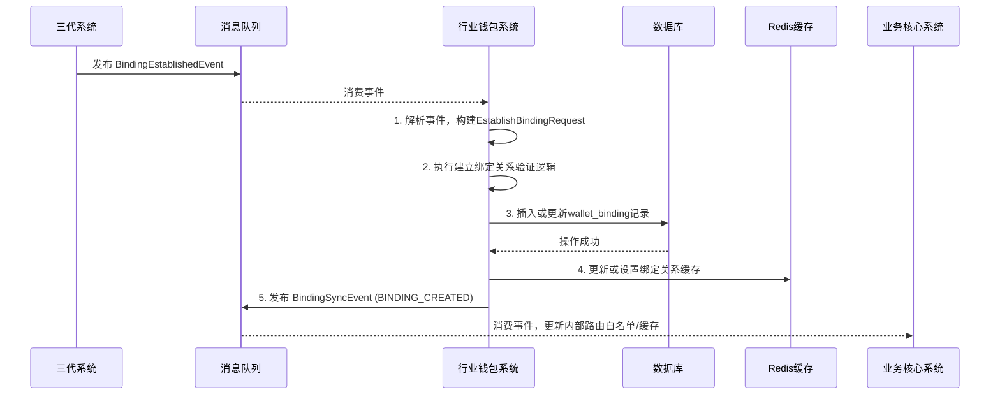
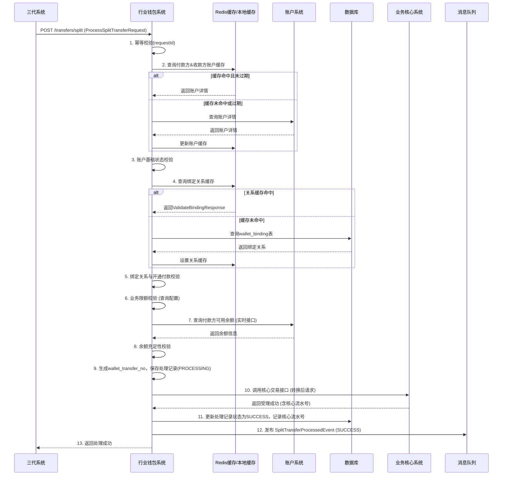

# 模块设计: 行业钱包系统

生成时间: 2026-01-19 17:55:27

---

# 模块设计: 行业钱包系统

生成时间: 2026-01-19 18:00:00

---

# 行业钱包系统模块设计文档

## 1. 概述

### 1.1 目的
本模块作为“天财分账”业务的**核心业务逻辑执行与关系管理中心**，是连接三代系统（业务编排）与账户系统（账户实体）、业务核心系统（资金流转）的关键枢纽。其主要目的是：
- **分账关系管理**：作为分账关系绑定（签约与认证）结果的最终持久化存储方，负责维护付款方与收款方之间的授权关系映射，并提供高效的关系校验服务。
- **分账业务处理**：接收并处理来自三代系统的分账指令（归集、批量付款、会员结算），进行业务层面的二次校验（如关系、限额），并转换为标准交易请求转发至业务核心系统执行。
- **账户能力适配与封装**：作为账户系统的上层封装，为天财专用账户提供业务场景化的操作接口（如查询、校验），并管理其专属的业务状态（如“开通付款”状态）。
- **数据同步与一致性保证**：确保账户信息、绑定关系与下游系统（如业务核心）的缓存或白名单保持最终一致，保障分账交易的顺畅执行。

### 1.2 范围
- **核心功能**：
    - **关系绑定管理**：接收三代系统通知，持久化存储生效的分账关系，并管理其生命周期（生效、失效）。
    - **开通付款管理**：针对批量付款和会员结算场景，独立维护付款方的“开通付款”状态，作为关系生效的前置条件。
    - **分账指令处理**：对三代系统转发的分账指令进行业务逻辑校验（关系、限额、场景匹配），并调用业务核心系统执行资金划转。
    - **账户与关系查询**：为三代系统、业务核心系统提供高效的账户详情、绑定关系、开通付款状态查询服务。
    - **数据同步**：监听账户、商户等核心实体的变更事件，更新本地缓存或关联数据，保证视图一致性。
- **非功能范围**：
    - 不直接驱动或管理电子签约与认证流程（由三代系统与电子签约平台负责）。
    - 不负责资金账户的底层创建与管理（由账户系统负责）。
    - 不处理资金的清算、结算与计费（由清结算系统负责）。
    - 不生成最终的用户对账单（由对账单系统负责）。

## 2. 接口设计

### 2.1 API 端点 (RESTful)

#### 2.1.1 关系绑定管理接口（内部）
- **POST /api/internal/v1/bindings** - 建立分账绑定关系（由三代系统回调触发）
- **DELETE /api/internal/v1/bindings/{bindingId}** - 解除分账绑定关系（预留，用于关系失效）
- **GET /api/internal/v1/bindings/validation** - 校验绑定关系与开通付款状态（供三代系统、业务核心调用）
- **GET /api/internal/v1/bindings** - 根据条件查询绑定关系列表（内部管理）

#### 2.1.2 分账指令处理接口（内部）
- **POST /api/internal/v1/transfers/split** - 处理分账/归集/付款指令（由三代系统同步调用或消费事件触发）

#### 2.1.3 查询服务接口（内部）
- **GET /api/internal/v1/accounts/{accountNo}/detail** - 查询账户业务详情（封装账户系统信息，附加业务状态）
- **GET /api/internal/v1/accounts/{accountNo}/open-payment-status** - 查询指定账户的开通付款状态

### 2.2 输入/输出数据结构

#### 2.2.1 建立绑定关系请求 (EstablishBindingRequest)
```json
{
  "requestId": "EST_BIND_20231027001",
  "bindingId": "BIND_202310270001", // 三代系统生成的绑定ID
  "institutionNo": "TC001",
  "sceneCode": "CAPITAL_POOLING", // 业务场景码
  "payer": {
    "merchantNo": "M100001",
    "accountNo": "TCWALLET202310270001",
    "roleType": "HEADQUARTERS"
  },
  "receiver": {
    "merchantNo": "M100002",
    "accountNo": "TCWALLET202310270002",
    "roleType": "STORE"
  },
  "effectiveTime": "2023-10-27T10:30:00Z", // 关系生效时间
  "openPaymentRequired": true, // 是否需要开通付款
  "openPaymentStatus": "PENDING" // 初始开通付款状态: PENDING, SUCCESS, FAILED
}
```

#### 2.2.2 分账指令处理请求 (ProcessSplitTransferRequest)
```json
{
  "requestId": "WALLET_TRANSFER_20231027001",
  "orderNo": "TCO202310270001", // 三代系统订单号
  "institutionNo": "TC001",
  "businessType": "CAPITAL_POOLING",
  "totalAmount": "1000.00",
  "currency": "CNY",
  "payer": {
    "merchantNo": "M100001",
    "accountNo": "TCWALLET202310270001"
  },
  "receiverList": [
    {
      "receiverMerchantNo": "M100002",
      "receiverAccountNo": "TCWALLET202310270002",
      "amount": "1000.00",
      "remark": "月度归集"
    }
  ],
  "feeBearer": "PAYER",
  "postscript": "天财归集20231027"
}
```

#### 2.2.3 绑定关系校验请求 (ValidateBindingRequest)
```json
{
  "payerAccountNo": "TCWALLET202310270001",
  "receiverAccountNo": "TCWALLET202310270002",
  "sceneCode": "CAPITAL_POOLING", // 可选，不传则校验所有场景
  "businessType": "CAPITAL_POOLING" // 业务类型，用于判断是否需要检查开通付款
}
```

#### 2.2.4 绑定关系校验响应 (ValidateBindingResponse)
```json
{
  "isValid": true,
  "bindingId": "BIND_202310270001",
  "failureReasons": [], // 无效时的原因列表
  "openPaymentStatus": "SUCCESS", // 若需要开通付款，则返回其状态
  "openPaymentRequired": true
}
```

### 2.3 发布/消费的事件

#### 2.3.1 发布的事件
- **SplitTransferProcessedEvent**: 分账指令处理完成（成功或失败）时发布。
    - 内容：三代订单号、钱包系统处理流水号、业务类型、处理状态（SUCCESS/FAILED）、失败原因、时间戳。
    - 消费者：三代系统（用于更新订单状态）、监控系统。
- **BindingSyncEvent**: 绑定关系或开通付款状态发生变更时发布。
    - 内容：绑定ID、变更类型（BINDING_CREATED, BINDING_INVALIDATED, OPEN_PAYMENT_UPDATED）、变更后的数据快照。
    - 消费者：业务核心系统（用于更新其交易路由白名单或缓存）。

#### 2.3.2 消费的事件
- **BindingEstablishedEvent** (来自三代系统)：消费此事件以持久化绑定关系，是本模块建立关系的主要入口。
- **AccountStatusChangedEvent** (来自账户系统)：消费此事件，当账户被冻结或注销时，自动将关联的绑定关系置为失效。
- **AccountCreatedEvent** (来自账户系统)：消费此事件以更新本地账户信息缓存。

## 3. 数据模型

### 3.1 数据库表设计

#### 表: `wallet_binding` (钱包绑定关系主表)
| 字段名 | 类型 | 必填 | 默认值 | 说明 |
| :--- | :--- | :--- | :--- | :--- |
| `id` | bigint | Y | AUTO_INCREMENT | 主键 |
| `binding_id` | varchar(32) | Y | | **绑定关系ID**，与三代系统一致，唯一 |
| `institution_no` | varchar(16) | Y | | 天财机构号 |
| `scene_code` | varchar(32) | Y | | 业务场景码 |
| `payer_merchant_no` | varchar(32) | Y | | 付款方商户号 |
| `payer_account_no` | varchar(32) | Y | | 付款方账户号 |
| `payer_role_type` | varchar(20) | Y | | 付款方角色类型 |
| `receiver_merchant_no` | varchar(32) | Y | | 收款方商户号 |
| `receiver_account_no` | varchar(32) | Y | | 收款方账户号 |
| `receiver_role_type` | varchar(20) | Y | | 收款方角色类型 |
| `status` | varchar(20) | Y | `EFFECTIVE` | 状态: `EFFECTIVE`, `INVALID` |
| `open_payment_required` | tinyint(1) | Y | 0 | 是否需要开通付款 |
| `open_payment_status` | varchar(20) | N | | 开通付款状态: `PENDING`, `SUCCESS`, `FAILED` |
| `effective_time` | datetime | Y | | 关系生效时间 |
| `invalid_time` | datetime | N | | 关系失效时间 |
| `invalid_reason` | varchar(255) | N | | 失效原因 |
| `version` | int | Y | 0 | 乐观锁版本号 |
| `created_at` | datetime | Y | CURRENT_TIMESTAMP | 创建时间 |
| `updated_at` | datetime | Y | CURRENT_TIMESTAMP ON UPDATE | 更新时间 |
| **索引** | | | | |
| `uk_binding_id` | UNIQUE(`binding_id`) | | | 绑定ID唯一索引 |
| `idx_payer_receiver_scene` | (`payer_account_no`, `receiver_account_no`, `scene_code`, `status`) | | | **核心查询索引**，用于关系校验 |
| `idx_payer_status` | (`payer_account_no`, `status`) | | | 按付款方查询索引 |
| `idx_receiver_status` | (`receiver_account_no`, `status`) | | | 按收款方查询索引 |

#### 表: `wallet_account_cache` (钱包账户缓存表)
| 字段名 | 类型 | 必填 | 默认值 | 说明 |
| :--- | :--- | :--- | :--- | :--- |
| `id` | bigint | Y | AUTO_INCREMENT | 主键 |
| `account_no` | varchar(32) | Y | | 账户号，唯一 |
| `merchant_no` | varchar(32) | Y | | 商户号 |
| `institution_no` | varchar(16) | Y | | 机构号 |
| `account_type` | varchar(20) | Y | | 账户类型 |
| `role_type` | varchar(20) | Y | | 角色类型 |
| `status` | varchar(20) | Y | | 账户状态 |
| `capabilities` | json | Y | | 账户能力列表 |
| `data_source` | varchar(20) | Y | `ACCOUNT_SYNC` | 数据来源: `ACCOUNT_SYNC`, `MANUAL` |
| `last_sync_time` | datetime | Y | | 最后同步时间 |
| `created_at` | datetime | Y | CURRENT_TIMESTAMP | 创建时间 |
| `updated_at` | datetime | Y | CURRENT_TIMESTAMP ON UPDATE | 更新时间 |
| **索引** | | | | |
| `uk_account_no` | UNIQUE(`account_no`) | | | 账户号唯一索引 |
| `idx_merchant_no` | (`merchant_no`) | | | 商户号查询索引 |

#### 表: `split_transfer_record` (分账处理记录表)
| 字段名 | 类型 | 必填 | 默认值 | 说明 |
| :--- | :--- | :--- | :--- | :--- |
| `id` | bigint | Y | AUTO_INCREMENT | 主键 |
| `wallet_transfer_no` | varchar(32) | Y | | **钱包系统处理流水号**，唯一 |
| `order_no` | varchar(32) | Y | | 三代系统订单号 |
| `request_id` | varchar(64) | Y | | 请求流水号，幂等键 |
| `institution_no` | varchar(16) | Y | | 天财机构号 |
| `business_type` | varchar(32) | Y | | 业务类型 |
| `payer_account_no` | varchar(32) | Y | | 付款方账户号 |
| `total_amount` | decimal(15,2) | Y | | 总金额 |
| `receiver_count` | int | Y | | 收款方数量 |
| `core_request_no` | varchar(32) | N | | 发送给业务核心系统的请求号 |
| `process_status` | varchar(20) | Y | `PROCESSING` | 处理状态: `PROCESSING`, `SUCCESS`, `FAILED` |
| `failure_reason` | varchar(512) | N | | 失败原因 |
| `processed_at` | datetime | N | | 处理完成时间 |
| `created_at` | datetime | Y | CURRENT_TIMESTAMP | 创建时间 |
| `updated_at` | datetime | Y | CURRENT_TIMESTAMP ON UPDATE | 更新时间 |
| **索引** | | | | |
| `uk_wallet_transfer_no` | UNIQUE(`wallet_transfer_no`) | | | 处理流水号唯一索引 |
| `uk_request_id` | UNIQUE(`request_id`) | | | 请求ID幂等索引 |
| `idx_order_no` | (`order_no`) | | | 三代订单号查询索引 |
| `idx_payer_processed` | (`payer_account_no`, `process_status`, `created_at`) | | | 商户交易查询索引 |

### 3.2 与其他模块的关系
- **三代系统**：上游调用方与事件来源。接收其建立绑定关系的通知，为其提供绑定关系校验服务，并处理其转发的分账指令。
- **账户系统**：底层依赖。通过同步调用查询账户详情，并通过消费事件同步账户状态变化。是本模块账户数据的权威来源。
- **业务核心系统**：下游指令执行方。将校验通过的分账指令封装为标准交易请求（如内部转账）调用业务核心系统执行。
- **清结算系统**：间接关联。通过业务核心系统触发的交易，最终由清结算系统完成资金清算、结算与计费。
- **消息队列(MQ)**：关键通信媒介。消费上游领域事件，发布本模块领域事件，实现系统间解耦。

## 4. 业务逻辑

### 4.1 核心算法
- **钱包处理流水号生成**：`WTR` + `YYYYMMDD` + `6位自增序列`。自增序列每日重置。
- **绑定关系缓存策略**：对`wallet_binding`表的核心查询索引 (`idx_payer_receiver_scene`) 对应的数据，在Redis中进行热缓存。缓存键格式：`BINDING:{payerAccountNo}:{receiverAccountNo}:{sceneCode}`，值为`ValidateBindingResponse`的JSON序列化。绑定关系变更时，淘汰或更新缓存。
- **账户信息缓存策略**：`wallet_account_cache`表作为账户系统数据的本地缓存，通过消费`AccountCreatedEvent`和`AccountStatusChangedEvent`以及定时增量同步来更新。对外查询接口优先使用此缓存，未命中或数据过期时回源到账户系统查询并刷新缓存。

### 4.2 业务规则
1. **绑定关系管理规则**：
    - 同一对付款方-收款方在同一业务场景下，只能存在一条`EFFECTIVE`状态的绑定关系。
    - 绑定关系的生效以三代系统通知为准，本模块不主动创建。
    - 当关联的付款方或收款方账户状态变为`FROZEN`或`CLOSED`时，自动将该账户涉及的所有绑定关系置为`INVALID`。
    - “开通付款”状态仅针对需要此流程的场景（批量付款、会员结算）有意义，且仅当状态为`SUCCESS`时，对应的绑定关系在相应业务类型下才被视为有效。

2. **分账指令处理规则**：
    - **前置校验**：必须依次通过以下校验：
        a. 账户基础状态校验（调用本地缓存或账户系统）。
        b. 绑定关系与开通付款状态校验（调用本地缓存或数据库）。
        c. 业务限额校验（基于商户、单笔、日累计等维度，规则可配置）。
        d. 资金可用性校验（对于付款方，需调用清结算或账户系统接口验证账户可用余额是否充足）。
    - **指令转换**：根据`businessType`，将请求转换为业务核心系统识别的交易类型码。
        - `CAPITAL_POOLING` -> 内部转账（行业钱包账户间转账）
        - `BATCH_PAYMENT` -> 批量代付（从钱包账户到外部银行卡）
        - `MEMBER_SETTLEMENT` -> 内部转账（行业钱包账户间转账）
    - **幂等与重试**：基于`requestId`保证同一指令不被重复处理。对于调用业务核心失败的情况，根据错误类型决定是否自动重试（如网络超时）或标记为失败（如余额不足）。

3. **数据同步规则**：
    - 账户缓存数据设置TTL（如5分钟），定时任务定期扫描`last_sync_time`，对过期数据主动查询账户系统更新。
    - 监听账户状态变更事件，实时更新缓存和失效关联绑定关系，并发布`BindingSyncEvent`通知业务核心。

### 4.3 验证逻辑
- **建立绑定关系请求验证**：
    - 幂等校验（`requestId`）。
    - 校验`bindingId`是否已存在，防止重复建立。
    - 校验付款方和收款方账户是否存在于本地缓存或账户系统，且状态为`ACTIVE`。
    - 校验`sceneCode`与双方`roleType`的匹配关系（与三代系统规则保持一致）。
- **分账指令处理请求验证**：
    - 幂等校验（`requestId`）。
    - 校验`businessType`的合法性。
    - 校验`payer`和所有`receiver`账户信息的有效性（通过本地缓存）。
    - 校验总金额与收款方金额列表之和是否一致。
- **绑定关系校验请求验证**：
    - 校验付款方和收款方账户号非空。
    - 若指定`sceneCode`，则校验该场景下的关系；否则，返回所有有效场景的关系列表。

## 5. 时序图

### 5.1 绑定关系建立与同步时序图


### 5.2 分账指令处理时序图


## 6. 错误处理

| 错误码 | HTTP状态码 | 描述 | 处理策略 |
| :--- | :--- | :--- | :--- |
| `WALLET_4001` | 400 Bad Request | 请求参数无效或缺失 | 调用方检查请求体格式和必填字段 |
| `WALLET_4002` | 400 Bad Request | 业务类型不支持 | 调用方确认`businessType`值是否正确 |
| `WALLET_4091` | 409 Conflict | 重复请求 (requestId已处理) | 调用方使用原请求结果，无需重试 |
| `WALLET_4031` | 403 Forbidden | 账户状态异常 | 调用方检查对应账户状态，或等待账户系统恢复 |
| `WALLET_4032` | 403 Forbidden | 绑定关系不存在或无效 | 调用方需先完成关系绑定（及开通付款）流程 |
| `WALLET_4033` | 403 Forbidden | 开通付款未完成或失败 | 调用方需引导付款方完成开通付款流程 |
| `WALLET_4034` | 403 Forbidden | 超出业务限额 | 调用方调整金额或联系运营调整限额 |
| `WALLET_4035` | 403 Forbidden | 付款方余额不足 | 调用方确认付款账户资金情况 |
| `WALLET_4241` | 424 Failed Dependency | 依赖服务（账户/核心）调用失败或返回错误 | 根据依赖服务错误码决定是否可重试，并记录详细日志 |
| `WALLET_5001` | 500 Internal Server Error | 内部处理异常 | 服务端记录日志告警，调用方可有限重试 |

**通用策略**：
- **客户端错误(4xx)**：由调用方（三代系统）修正业务状态或参数后重试。
- **服务端错误(5xx)与依赖错误(424)**：实现带指数退避的自动重试机制（针对网络抖动、短暂超时）。对于业务性错误（如余额不足），不重试，直接失败。
- **幂等性**：所有写操作（建立关系、处理分账）必须支持幂等，通过`requestId`或`bindingId`保证。
- **最终一致性**：绑定关系同步、账户缓存更新通过消费领域事件保证最终一致性。在短暂不一致窗口期，依赖服务调用时的实时校验作为兜底。

## 7. 依赖说明

### 7.1 上游模块交互
1. **三代系统**：
    - **交互方式**：同步REST API调用（分账指令处理） + 异步事件消费 (`BindingEstablishedEvent`)。
    - **职责**：三代系统是业务指令的发起者和绑定关系的权威裁决者。钱包系统执行其下达的指令，并信任其通知的绑定关系结果。

2. **账户系统**：
    - **交互方式**：同步REST API调用（实时余额、账户详情查询） + 异步事件消费 (`AccountCreatedEvent`, `AccountStatusChangedEvent`)。
    - **职责**：账户系统是账户实体和状态的权威源。钱包系统严重依赖其进行业务校验，并通过事件同步维护本地数据视图的一致性。

### 7.2 下游模块交互
1. **业务核心系统**：
    - **交互方式**：同步REST API调用（提交标准交易请求）。
    - **职责**：业务核心是资金流转的执行引擎。钱包系统将校验通过的业务指令转换为核心系统识别的交易格式，由其完成最终的账务处理。

2. **消息队列(MQ)**：
    - **交互方式**：发布领域事件 (`SplitTransferProcessedEvent`, `BindingSyncEvent`)。
    - **职责**：通知其他系统本模块的业务处理结果和状态变更，实现松耦合。

### 7.3 关键依赖管理
- **强依赖**：数据库、账户系统（实时校验）、业务核心系统（指令执行）。
- **弱依赖**：Redis缓存（缓存失效可回源数据库）、三代系统事件（事件延迟可通过定时补偿任务处理）。
- **降级方案**：
    - 账户系统查询超时：对于非实时性要求的查询（如管理后台），可返回缓存数据并标记“数据可能延迟”。对于交易中的实时校验，必须失败快速返回，阻止交易。
    - 业务核心系统不可用：分账指令处理接口直接返回“交易通道繁忙”，并记录日志告警。三代系统需具备重试机制。
    - Redis不可用：所有查询直接回源数据库，性能下降但功能可用。需监控数据库负载。