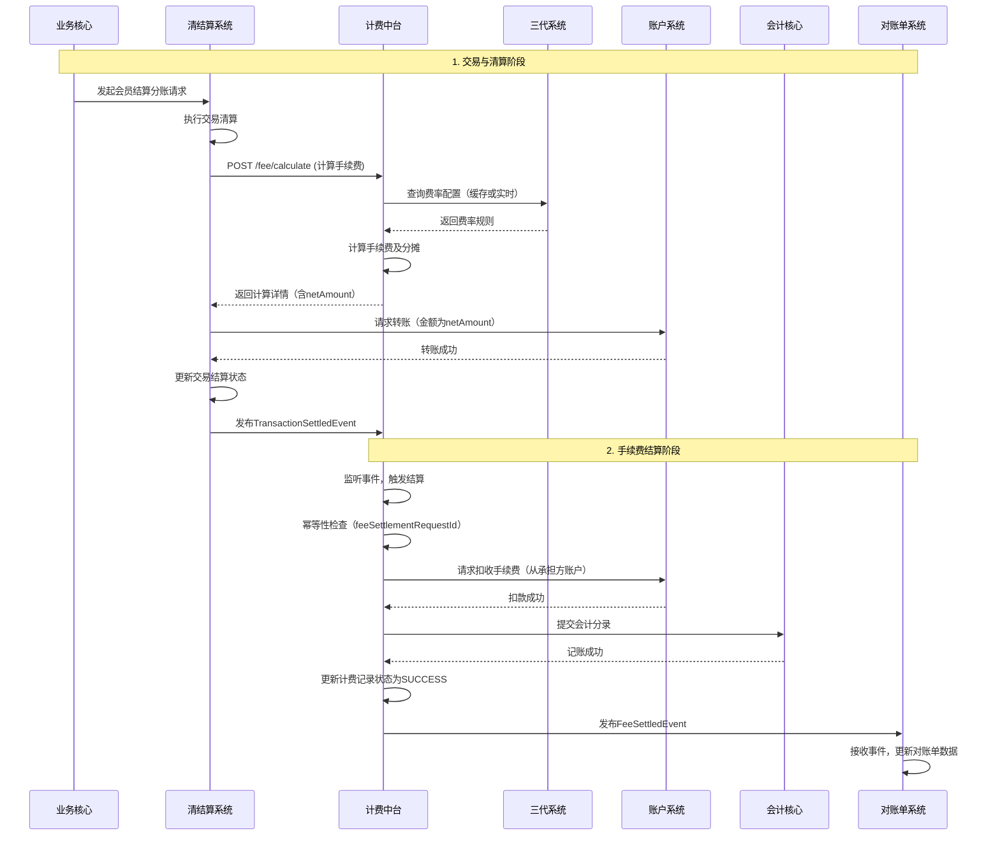

# 模块设计: 计费中台

生成时间: 2026-01-19 17:53:06

---

# 计费中台模块设计文档

## 1. 概述

### 1.1 目的
计费中台模块是天财分账业务的核心计费与费用处理引擎，负责统一处理所有资金流转场景（归集、批量付款、会员结算）中产生的手续费计算、分摊、扣收、记账及对账。它作为清结算系统的一部分，确保费用处理的准确性、透明性和可追溯性，为业务运营和财务核算提供支持。

### 1.2 范围
- **核心功能**：
    - **费用计算**：根据交易金额、分账比例、费率配置，计算分账交易产生的手续费。
    - **费用分摊**：根据“手续费承担方”配置，将手续费在付款方与收款方之间进行分摊。
    - **费用扣收**：执行实际的手续费扣款，从指定的天财专用账户中划扣费用。
    - **费用记账**：生成并记录所有与费用相关的会计分录，确保账务平衡。
    - **计费对账**：生成计费明细，并与上游交易、下游账户流水进行核对。
- **业务场景覆盖**：天财分账下的所有资金流转场景（归集、批量付款、会员结算）。
- **不包含**：
    - 基础交易清算（由清结算主流程处理）。
    - 账户余额的底层扣减（由账户系统处理）。
    - 费率规则的配置与管理（由三代系统提供）。

## 2. 接口设计

### 2.1 API端点 (RESTful)

#### 2.1.1 内部服务接口（供业务核心/清结算调用）

**POST /api/v1/fee/calculate**
- **描述**：在分账交易处理前或处理中，计算单笔分账交易应产生的手续费及分摊详情。
- **请求头**：`X-Request-ID`, `Content-Type: application/json`
- **请求体**：
```json
{
  "transactionId": "TXN202404280001", // 分账交易流水号
  "scene": "MERCHANT_SETTLEMENT", // 场景：FUND_COLLECTION(归集), BATCH_PAYMENT(批量付款), MERCHANT_SETTLEMENT(会员结算)
  "payerAccountNo": "TC_PAY_1001", // 付款方天财账户号
  "payerRole": "HEADQUARTERS", // 付款方角色：HEADQUARTERS, STORE
  "receiverAccountNo": "TC_RCV_2001", // 收款方天财账户号
  "receiverRole": "STORE", // 收款方角色
  "transferAmount": 10000, // 分账金额（单位：分）
  "feeBearer": "PAYER", // 手续费承担方：PAYER, RECEIVER
  "splitRatio": 0.7, // 收款方分账比例（如70%）
  "originalOrderInfo": { // 原始订单信息（会员结算场景可能用到）
    "orderNo": "ORD123456",
    "orderAmount": 15000
  }
}
```
- **响应体（成功）**：
```json
{
  "code": "SUCCESS",
  "data": {
    "transactionId": "TXN202404280001",
    "totalFee": 30, // 总手续费（单位：分）
    "feeDetails": [
      {
        "feeType": "TRANSFER_FEE",
        "calculatedAmount": 30,
        "rate": "0.003", // 费率
        "payerShare": 30, // 付款方承担部分
        "receiverShare": 0, // 收款方承担部分
        "accountingEntryTemplate": "FEE_COLLECT_FROM_PAYER" // 会计科目模板编码
      }
    ],
    "netAmount": 9970 // 收款方实际入账净额（分账金额 - receiverShare）
  }
}
```

**POST /api/v1/fee/settle**
- **描述**：在分账交易资金结算完成后，触发实际的手续费扣收和记账操作。此接口应具备幂等性。
- **请求体**：
```json
{
  "transactionId": "TXN202404280001",
  "feeSettlementRequestId": "FSR202404280001", // 本次费用结算请求ID，用于幂等
  "calculatedFeeData": { ... } // 可直接包含calculate接口返回的data，或引用其ID
}
```
- **响应体（成功）**：
```json
{
  "code": "SUCCESS",
  "data": {
    "feeSettlementId": "FSTL202404280001",
    "status": "SUCCESS",
    "accountingEntries": [
      {
        "entryId": "AE001",
        "accountNo": "TC_PAY_1001",
        "accountType": "TIANCAI_PAYABLE",
        "amount": -30,
        "currency": "CNY",
        "subject": "手续费支出",
        "oppositeAccountNo": "FEE_INCOME_ACCOUNT"
      },
      {
        "entryId": "AE002",
        "accountNo": "FEE_INCOME_ACCOUNT",
        "accountType": "INTERNAL",
        "amount": 30,
        "currency": "CNY",
        "subject": "手续费收入",
        "oppositeAccountNo": "TC_PAY_1001"
      }
    ]
  }
}
```

#### 2.1.2 查询与对账接口

**GET /api/v1/fee/transactions/{transactionId}**
- **描述**：查询指定分账交易的手续费计算和结算详情。

**GET /api/v1/fee/settlement/daily**
- **描述**：生成指定日期的计费汇总与明细文件，供对账单系统拉取。
- **查询参数**：`settlementDate=2024-04-28`, `institutionId=TC001` (天财机构号)

### 2.2 发布/消费的事件

#### 2.2.1 消费的事件
- **TransactionSettledEvent**：由清结算系统发布，通知一笔分账交易资金已结算完成。本模块监听此事件，触发 `fee/settle` 流程。
    - 事件内容：`transactionId`, `settlementTime`, `status`。

#### 2.2.2 发布的事件
- **FeeCalculatedEvent**：手续费计算完成后发布，供风控或审计系统订阅。
    - 事件内容：`transactionId`, `totalFee`, `feeBearer`, `calculatedAt`。
- **FeeSettledEvent**：手续费扣收并记账完成后发布，通知对账单系统等下游。
    - 事件内容：`feeSettlementId`, `transactionId`, `status`, `settledAt`, `accountingEntries`。
- **FeeSettlementFailedEvent**：手续费结算失败时发布，告警系统订阅。
    - 事件内容：`transactionId`, `errorCode`, `errorMessage`, `retryCount`。

## 3. 数据模型

### 3.1 核心数据库表设计

```sql
-- 计费记录表：记录每笔分账交易的手续费计算与结算状态
CREATE TABLE t_fee_transaction (
    id BIGINT PRIMARY KEY AUTO_INCREMENT,
    fee_settlement_id VARCHAR(64) UNIQUE COMMENT '费用结算ID，幂等键',
    transaction_id VARCHAR(64) NOT NULL COMMENT '关联的分账交易流水号',
    scene VARCHAR(32) NOT NULL COMMENT '业务场景',
    payer_account_no VARCHAR(64) NOT NULL COMMENT '付款方账户',
    receiver_account_no VARCHAR(64) NOT NULL COMMENT '收款方账户',
    transfer_amount BIGINT NOT NULL COMMENT '分账金额(分)',
    total_fee BIGINT NOT NULL COMMENT '总手续费(分)',
    fee_bearer VARCHAR(16) NOT NULL COMMENT '手续费承担方',
    net_amount BIGINT NOT NULL COMMENT '收款方净入账金额(分)',
    fee_calc_detail JSON NOT NULL COMMENT '手续费计算明细快照(JSON)',
    calc_status VARCHAR(16) DEFAULT 'CALCULATED' COMMENT '计算状态: CALCULATED, FAILED',
    settlement_status VARCHAR(16) DEFAULT 'PENDING' COMMENT '结算状态: PENDING, SUCCESS, FAILED',
    accounting_entries JSON COMMENT '会计分录快照',
    institution_id VARCHAR(32) NOT NULL COMMENT '天财机构号',
    calc_completed_at DATETIME COMMENT '计算完成时间',
    settled_at DATETIME COMMENT '结算完成时间',
    retry_count INT DEFAULT 0,
    last_error_msg TEXT,
    created_at DATETIME DEFAULT CURRENT_TIMESTAMP,
    updated_at DATETIME DEFAULT CURRENT_TIMESTAMP ON UPDATE CURRENT_TIMESTAMP,
    INDEX idx_transaction_id (transaction_id),
    INDEX idx_settlement_status (settlement_status, created_at),
    INDEX idx_institution_date (institution_id, settled_at)
) COMMENT '计费交易记录表';

-- 费率配置缓存表（从三代系统同步，非权威源）
CREATE TABLE t_fee_rate_config (
    id BIGINT PRIMARY KEY AUTO_INCREMENT,
    institution_id VARCHAR(32) NOT NULL,
    scene VARCHAR(32) NOT NULL COMMENT '适用场景',
    payer_role VARCHAR(32) COMMENT '付款方角色，空表示通用',
    receiver_role VARCHAR(32) COMMENT '收款方角色，空表示通用',
    fee_type VARCHAR(32) NOT NULL COMMENT '费用类型',
    calculation_mode VARCHAR(16) NOT NULL COMMENT '计算方式: PERCENTAGE, FIXED, TIERED',
    rate_value VARCHAR(64) COMMENT '费率值，如0.003，或阶梯JSON',
    min_fee BIGINT COMMENT '最低收费(分)',
    max_fee BIGINT COMMENT '最高收费(分)',
    effective_date DATE NOT NULL,
    expiry_date DATE,
    version INT DEFAULT 1,
    synced_at DATETIME NOT NULL COMMENT '从三代系统同步的时间',
    UNIQUE KEY uk_config (institution_id, scene, payer_role, receiver_role, fee_type, effective_date, version)
) COMMENT '费率配置缓存表';

-- 计费日汇总表（用于对账与报表）
CREATE TABLE t_fee_daily_summary (
    id BIGINT PRIMARY KEY AUTO_INCREMENT,
    settlement_date DATE NOT NULL COMMENT '结算日期',
    institution_id VARCHAR(32) NOT NULL,
    scene VARCHAR(32) NOT NULL,
    total_transaction_count INT NOT NULL COMMENT '交易笔数',
    total_transfer_amount BIGINT NOT NULL COMMENT '总分账金额',
    total_fee_amount BIGINT NOT NULL COMMENT '总手续费',
    fee_bearer_breakdown JSON NOT NULL COMMENT '按承担方统计，如{"PAYER": 5000, "RECEIVER": 2000}',
    summary_status VARCHAR(16) DEFAULT 'GENERATED' COMMENT '状态: GENERATED, RECONCILED',
    recon_result JSON COMMENT '对账结果',
    created_at DATETIME DEFAULT CURRENT_TIMESTAMP,
    updated_at DATETIME DEFAULT CURRENT_TIMESTAMP ON UPDATE CURRENT_TIMESTAMP,
    UNIQUE KEY uk_date_institution_scene (settlement_date, institution_id, scene)
) COMMENT '计费日汇总表';
```

### 3.2 与其他模块的关系
- **清结算系统**：主调用方。在分账交易清算后，调用本模块进行计费。依赖清结算提供的交易基础信息。
- **三代系统**：费率配置的权威源。本模块定期同步或实时查询费率规则。
- **账户系统**：执行实际的手续费扣款操作。本模块生成扣款指令，通过内部接口或事件驱动账户系统扣减对应天财专用账户余额。
- **对账单系统**：消费本模块发布的 `FeeSettledEvent` 并拉取计费明细，生成包含手续费详情的对账单。
- **会计核心**：接收本模块生成的标准化会计分录，进行总账登记。

## 4. 业务逻辑

### 4.1 核心算法

**手续费计算算法**：
```
输入：transferAmount, scene, payerRole, receiverRole, feeBearer, splitRatio, institutionId
输出：totalFee, feeDetails, netAmount

步骤：
1. 根据 institutionId, scene, payerRole, receiverRole 从缓存或三代系统获取生效的费率配置列表。
2. 对每条费率配置：
   a. 确定计费基数 (BaseAmount):
      - 通常为 transferAmount。
      - 若为会员结算且配置指定按原始订单金额计费，则使用 originalOrderInfo.orderAmount。
   b. 根据 calculation_mode 计算原始费用：
      - PERCENTAGE: rawFee = BaseAmount * rate_value
      - FIXED: rawFee = rate_value
      - TIERED: 根据阶梯规则计算。
   c. 应用上下限：fee = max(min_fee, min(max_fee, rawFee))
3. 汇总所有 feeType 的 fee，得到 totalFee。
4. 费用分摊：
   - 若 feeBearer == 'PAYER': payerShare = totalFee, receiverShare = 0
   - 若 feeBearer == 'RECEIVER': payerShare = 0, receiverShare = totalFee
   - (未来扩展：支持比例分摊)
5. 计算净额：netAmount = transferAmount - receiverShare
6. 组装 feeDetails 和结果。
```

### 4.2 业务规则
1. **费率优先级规则**：角色特定配置 > 场景通用配置。即优先匹配 payerRole 和 receiverRole 都匹配的配置，其次匹配仅场景匹配的通用配置。
2. **幂等性规则**：`fee/settle` 接口必须幂等。使用 `feeSettlementRequestId` 作为幂等键，避免重复扣费。
3. **账户校验规则**：在执行扣费前，需确认付款方（或承担方）账户状态正常、余额充足，且账户类型为天财专用账户（具有特定标记）。
4. **时效性规则**：手续费计算应在交易清算时完成；手续费扣收应在交易结算后尽快完成，最晚不超过T+1日。
5. **差错处理规则**：若手续费扣收失败，进入重试队列。超过最大重试次数后，标记为失败并发出告警，需人工介入。

### 4.3 验证逻辑
- **输入验证**：
    - `transferAmount` 必须为正整数。
    - `payerAccountNo` 和 `receiverAccountNo` 必须符合天财专用账户号格式（如以`TC_`开头）。
    - `feeBearer` 必须在枚举值内。
    - `splitRatio` 必须在 (0, 1] 区间内。
- **业务验证**：
    - 根据 `institutionId` 校验调用方是否有权操作该账户。
    - 验证费率配置存在且有效。
    - 在结算时，验证关联的 `transactionId` 对应的分账交易已成功结算。

## 5. 时序图

### 5.1 手续费计算与结算时序图（会员结算场景）



## 6. 错误处理

| 错误场景 | 错误码 | 处理策略 | 重试机制 |
| :--- | :--- | :--- | :--- |
| 费率配置不存在 | `FEE_CONFIG_NOT_FOUND` | 计算失败，交易挂起。通知运营人员配置费率。 | 不重试，人工干预。 |
| 账户余额不足 | `ACCOUNT_BALANCE_INSUFFICIENT` | 结算失败，记录错误。 | 进入延迟重试队列，每隔10分钟重试，最多5次。 |
| 账户状态异常 | `ACCOUNT_STATUS_ABNORMAL` | 结算失败，记录错误。 | 不自动重试，发出告警。 |
| 网络超时/下游服务不可用 | `DOWNSTREAM_SERVICE_UNAVAILABLE` | 记录错误，标记为处理中。 | 指数退避重试，最多10次。 |
| 幂等键冲突 | `IDEMPOTENT_KEY_CONFLICT` | 视为成功，返回已有的结算结果。 | 不重试。 |
| 数据不一致（如交易未结算） | `DATA_INCONSISTENCY` | 结算失败，记录错误。 | 不重试，发出告警并人工核对。 |

**通用策略**：
- 所有可重试错误进入持久化重试队列（如RabbitMQ DLQ或数据库任务表）。
- 设置监控告警，对持续失败或达到重试上限的任务进行通知。
- 提供人工干预界面，支持手动触发重试或冲正。

## 7. 依赖说明

### 7.1 上游模块依赖
1. **清结算系统**：
    - **交互方式**：同步RPC调用（计算接口） + 异步事件监听（结算触发）。
    - **依赖数据**：分账交易的完整上下文（金额、双方账户、场景、承担方等）。
    - **SLA要求**：计费计算接口P99延迟 < 100ms，以保证不影响主交易流程。

2. **三代系统**：
    - **交互方式**：定期同步（缓存）或实时RPC查询。
    - **依赖数据**：权威的、最新的费率配置规则。
    - **降级方案**：若实时查询失败，使用本地缓存的最新配置；若缓存为空，则拒绝计算并报错。

### 7.2 下游模块协作
1. **账户系统**：
    - **交互方式**：同步RPC调用。
    - **职责**：根据计费中台的指令，执行精准的手续费扣款。
    - **要求**：提供强一致的扣款API，并返回明确结果。

2. **会计核心**：
    - **交互方式**：同步RPC调用或异步消息。
    - **职责**：接收标准化的会计分录，确保财务账务准确。
    - **要求**：接口幂等，支持批量处理。

3. **对账单系统**：
    - **交互方式**：异步事件订阅 + 主动文件拉取接口。
    - **职责**：获取每笔手续费明细，生成用户可读的对账单。
    - **要求**：事件消费需保证至少一次交付，具备对账纠错能力。

### 7.3 关键依赖管理
- **熔断与降级**：对三代系统、账户系统的调用配置熔断器（如Hystrix或Resilience4j），防止级联故障。
- **数据一致性**：通过本地事务（更新计费状态）+ 可靠事件（FeeSettledEvent）保证最终一致性。关键操作需记录操作日志。
- **监控**：依赖调用成功率、延迟、计费差错率等指标需纳入统一监控。