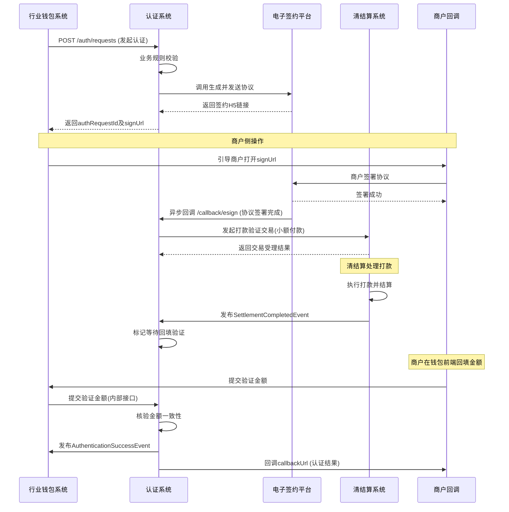

# 模块设计: 认证系统

生成时间: 2026-01-19 17:53:01

---

# 认证系统模块设计文档

## 1. 概述

### 1.1 目的
本模块（认证系统）是天财分账业务中“关系绑定”流程的核心执行者，负责对资金转出方与接收方之间的授权关系进行身份认证与协议签署。它通过集成电子签约平台，提供打款验证、人脸验证等多种认证方式，确保分账业务中资金流转的合法性与安全性，并为后续的分账、批量付款、会员结算等操作提供前置条件。

### 1.2 范围
- **核心功能**：
    1.  **签约与认证流程驱动**：为“关系绑定”和“开通付款”两个核心业务环节提供统一的认证流程编排。
    2.  **多模式身份验证**：支持针对企业/个体户的“打款验证”和针对个人的“人脸验证”。
    3.  **电子协议管理**：与电子签约平台集成，完成协议生成、签署、存储与查询。
    4.  **认证状态与结果管理**：维护所有认证请求的状态、过程数据及最终结果。
    5.  **业务规则校验**：在校验账户状态、角色类型、业务场景合规性后，触发认证流程。
- **边界**：
    - **发起**：接收来自“行业钱包系统”的认证请求。
    - **执行**：调用“电子签约平台”执行具体认证，调用“清结算系统”执行打款。
    - **存储**：独立管理认证流程数据。
    - **通知**：认证完成后，异步通知“行业钱包系统”和“三代系统”更新绑定关系状态。

## 2. 接口设计

### 2.1 API 端点 (RESTful)

#### 2.1.1 发起认证
- **端点**: `POST /api/v1/auth/requests`
- **描述**: 由行业钱包系统调用，发起一个新的关系绑定或开通付款认证流程。
- **请求头**: `X-Tiancai-Org-Id: {天财机构号}` (用于权限与数据隔离)
- **请求体**:
    ```json
    {
      "requestId": "string", // 认证请求唯一ID，由调用方生成
      "authScene": "RELATION_BINDING" | "ENABLE_PAYMENT", // 认证场景：关系绑定、开通付款
      "businessType": "SETTLE_TO_HQ" | "BATCH_PAY" | "MEMBER_SETTLE", // 业务类型：归集、批量付款、会员结算
      "payerAccountNo": "string", // 付款方天财专用账户号
      "payerRole": "HQ" | "STORE", // 付款方角色：总部、门店
      "payeeAccountNo": "string", // 收款方天财专用账户号（关系绑定必填）
      "payeeRole": "HQ" | "STORE", // 收款方角色
      "payeeType": "CORP" | "INDIVIDUAL" | "PERSONAL", // 收款方类型：企业、个体工商户、个人
      "payeeBankCardNo": "string? // 收款方银行卡号（打款验证时必填）
      "payeeIdNo": "string?", // 收款方身份证号（人脸验证时必填）
      "payeeName": "string", // 收款方姓名/企业名
      "authMethod": "REMITTANCE" | "FACE", // 认证方式：打款、人脸
      "callbackUrl": "string" // 认证结果回调地址
    }
    ```
- **响应体 (成功)**:
    ```json
    {
      "code": "SUCCESS",
      "data": {
        "authRequestId": "string", // 本系统生成的认证记录ID
        "status": "PROCESSING",
        "nextStep": "SIGN_CONTRACT" | "WAIT_VERIFY", // 下一步：签署协议或等待验证
        "signUrl": "string?", // 电子签约H5页面URL（如需签署）
        "expireTime": "2023-10-01T12:00:00Z" // 签约/验证链接过期时间
      }
    }
    ```

#### 2.1.2 查询认证结果
- **端点**: `GET /api/v1/auth/requests/{authRequestId}`
- **描述**: 查询指定认证请求的详细状态和结果。
- **响应体**:
    ```json
    {
      "authRequestId": "string",
      "requestId": "string",
      "authScene": "string",
      "businessType": "string",
      "status": "INIT | PROCESSING | SIGNED | VERIFYING | SUCCESS | FAILED | EXPIRED",
      "authMethod": "string",
      "failureReason": "string?",
      "contractId": "string?", // 电子协议ID
      "contractSignedTime": "string?",
      "verificationAmount": "number?", // 打款金额（分）
      "verificationCompletedTime": "string?",
      "createTime": "string",
      "updateTime": "string"
    }
    ```

#### 2.1.3 接收电子签约回调
- **端点**: `POST /api/callback/esign` (电子签约平台回调)
- **描述**: 接收电子签约平台推送的协议签署状态变更通知。
- **请求体**:
    ```json
    {
      "contractId": "string",
      "status": "SIGNED" | "REJECTED" | "EXPIRED",
      "signedTime": "string?",
      "signers": [{"role": "payer"|"payee", "status": "string"}],
      "evidenceSnapshot": "string?" // 存证快照URL
    }
    ```

#### 2.1.4 接收打款验证结果
- **端点**: `POST /api/callback/verification` (由内部清结算系统或对账后触发)
- **描述**: 接收打款验证金额核验结果。
- **请求体**:
    ```json
    {
      "authRequestId": "string",
      "verificationResult": "SUCCESS" | "FAILED",
      "verifiedAmount": "number",
      "verifiedTime": "string",
      "transactionNo": "string?" // 关联的打款交易流水号
    }
    ```

### 2.2 发布/消费的事件

#### 2.2.1 消费的事件
- `AccountOpenedEvent` (来自账户系统): 监听天财专用账户开户成功事件，用于预加载账户基础信息。
- `SettlementCompletedEvent` (来自清结算系统): 监听打款验证的小额打款交易结算完成事件，触发后续验证逻辑。

#### 2.2.2 发布的事件
- `AuthenticationInitiatedEvent`: 认证流程已成功发起，通知相关系统记录日志。
- `AuthenticationSuccessEvent`: 认证成功。**主要消费者：行业钱包系统、三代系统**，用于更新关系绑定状态为“已认证”。
- `AuthenticationFailedEvent`: 认证失败。通知相关系统更新状态为“认证失败”。
- `ContractSignedEvent`: 协议签署完成。触发下一步（如打款验证）。

## 3. 数据模型

### 3.1 数据库表设计

#### 表: `auth_request` (认证主表)
| 字段名 | 类型 | 必填 | 描述 |
| :--- | :--- | :--- | :--- |
| `id` | bigint(自增) | Y | 主键，系统内部认证记录ID |
| `auth_request_id` | varchar(32) | Y | 对外业务ID，唯一 |
| `request_id` | varchar(32) | Y | 调用方传入的请求ID，用于关联 |
| `tiancai_org_id` | varchar(16) | Y | 天财机构号 |
| `auth_scene` | varchar(32) | Y | 认证场景 |
| `business_type` | varchar(32) | Y | 业务类型 |
| `payer_account_no` | varchar(32) | Y | 付款方账户 |
| `payer_role` | varchar(16) | Y | 付款方角色 |
| `payee_account_no` | varchar(32) | Y | 收款方账户 |
| `payee_role` | varchar(16) | Y | 收款方角色 |
| `payee_type` | varchar(16) | Y | 收款方类型 |
| `payee_bank_card_no` | varchar(32) | N | 收款方银行卡号 |
| `payee_id_no` | varchar(32) | N | 收款方身份证号 |
| `payee_name` | varchar(128) | Y | 收款方名称 |
| `auth_method` | varchar(16) | Y | 认证方式 |
| `status` | varchar(32) | Y | 认证状态 |
| `failure_reason` | varchar(512) | N | 失败原因 |
| `contract_id` | varchar(64) | N | 电子协议ID |
| `contract_status` | varchar(32) | N | 协议状态 |
| `verification_amount` | decimal(10,2) | N | 打款验证金额 |
| `verification_result` | varchar(32) | N | 验证结果 |
| `callback_url` | varchar(512) | Y | 结果回调地址 |
| `expire_time` | datetime | Y | 流程过期时间 |
| `created_at` | datetime | Y | 创建时间 |
| `updated_at` | datetime | Y | 更新时间 |
| **索引** | | | |
| `uk_auth_request_id` | UNIQUE(`auth_request_id`) | | 业务ID唯一 |
| `idx_request_id` | (`request_id`) | | 查询调用方请求 |
| `idx_payer_account` | (`payer_account_no`) | | 按付款方查询 |
| `idx_status_expire` | (`status`, `expire_time`) | | 处理超时任务 |

#### 表: `auth_operation_log` (操作日志表)
| 字段名 | 类型 | 必填 | 描述 |
| :--- | :--- | :--- | :--- |
| `id` | bigint | Y | 主键 |
| `auth_request_id` | varchar(32) | Y | 关联认证ID |
| `operation` | varchar(64) | Y | 操作类型 |
| `detail` | text | N | 操作详情/请求参数 |
| `operator` | varchar(64) | N | 操作者（系统/用户） |
| `created_at` | datetime | Y | 创建时间 |
| **索引** | `idx_auth_req_id` (`auth_request_id`) | | |

### 3.2 与其他模块的关系
- **行业钱包系统**: 上游调用方，发起认证请求；下游事件消费者，接收认证结果。
- **三代系统**: 下游事件消费者，接收认证结果以更新其内部的分账关系状态。
- **电子签约平台**: 外部服务依赖，用于协议签署。
- **清结算系统**: 服务依赖，用于执行打款验证的小额付款；事件生产者，通知打款结果。
- **账户系统**: 事件消费者（监听开户事件），用于缓存账户信息。

## 4. 业务逻辑

### 4.1 核心算法与流程
1.  **请求接收与校验**：
    - 校验天财机构号有效性。
    - 校验付款方和收款方账户是否存在、是否均为天财专用账户、状态是否正常。
    - 根据 `businessType` 和 `payerRole`/`payeeRole` 校验业务场景合规性（如：归集场景下，付款方必须是门店，收款方必须是总部）。
    - 校验 `authMethod` 与 `payeeType` 的匹配性（企业/个体户可打款或人脸，个人仅人脸）。
2.  **流程编排**：
    - **打款验证流程**：生成协议 -> 签署协议 -> 发起打款 -> 等待并核验回填金额 -> 认证完成。
    - **人脸验证流程**：生成协议 -> 签署协议 -> 跳转人脸核身H5 -> 获取核身结果 -> 认证完成。
    - **“开通付款”场景特例**：可能仅需付款方单方签署协议，无需对收款方进行二次验证。
3.  **协议生成**：根据认证场景、业务类型、双方信息，调用电子签约平台模板，生成带有动态字段的电子协议。
4.  **打款执行**：调用清结算系统接口，向 `payeeBankCardNo` 发起一笔固定（如0.01-0.99元随机）的付款交易，并记录 `verificationAmount`。
5.  **结果核验**：
    - **打款**：比对回填金额与 `verificationAmount` 是否一致。
    - **人脸**：依赖电子签约平台返回的公安比对结果。

### 4.2 业务规则
- **唯一性规则**：同一对付款方-收款方，在同一 `authScene` 和 `businessType` 下，只允许存在一条成功的认证记录。
- **角色校验规则**：
    - `RELATION_BINDING`：付款方和收款方角色不能相同（总部不能绑定总部）。
    - `ENABLE_PAYMENT`：仅在 `BATCH_PAY` 和 `MEMBER_SETTLE` 场景下，由付款方发起。
- **账户状态规则**：账户必须为“正常”状态，且未注销。
- **超时规则**：整个认证流程（从发起到完成）需在 **24小时** 内完成，否则状态置为 `EXPIRED`。

### 4.3 验证逻辑
```java
// 伪代码示例：业务场景校验
function validateBusinessScene(authScene, businessType, payerRole, payeeRole) {
    if (authScene == 'RELATION_BINDING') {
        if (payerRole == payeeRole) {
            throw new Error('付款方与收款方角色不能相同');
        }
        if (businessType == 'SETTLE_TO_HQ' && !(payerRole == 'STORE' && payeeRole == 'HQ')) {
            throw new Error('归集场景下，付款方须为门店，收款方须为总部');
        }
        // ... 其他业务类型校验
    } else if (authScene == 'ENABLE_PAYMENT') {
        if (!['BATCH_PAY', 'MEMBER_SETTLE'].includes(businessType)) {
            throw new Error('开通付款仅适用于批量付款和会员结算场景');
        }
        // 开通付款通常是付款方单方流程，payeeRole可能为空或忽略
    }
}
```

## 5. 时序图

### 5.1 关系绑定 - 打款验证时序图



## 6. 错误处理

| 错误类型 | 错误码 | 处理策略 |
| :--- | :--- | :--- |
| **参数校验失败** | `4000` | 请求参数非法，返回具体字段错误信息，拒绝流程发起。 |
| **业务规则冲突** | `4001` | 如角色不符、场景不支持、重复绑定等，返回明确业务提示。 |
| **账户状态异常** | `4002` | 账户不存在、非天财账户、已注销等，返回对应提示。 |
| **依赖服务异常** | `5001` | 如电子签约平台不可用，记录日志，流程状态置为“失败”，支持异步重试。 |
| **认证流程超时** | `4080` | 定时任务扫描 `status=PROCESSING` 且 `expire_time < now()` 的记录，自动置为 `EXPIRED`，并发布失败事件。 |
| **打款验证失败** | `4003` | 金额不一致、超时未回填等，更新状态为 `FAILED`，记录原因。 |
| **回调通知失败** | `5002` | 向 `callbackUrl` 回调失败时，采用指数退避策略重试，并记录告警。 |

## 7. 依赖说明

### 7.1 上游模块交互
- **行业钱包系统**：
    - **调用方式**：同步HTTP调用（发起认证、查询结果）。
    - **职责**：认证系统是钱包系统在关系绑定流程中的专属服务，钱包系统负责组装业务参数并触发认证。
    - **数据流**：认证完成后，认证系统通过事件异步通知钱包系统更新其内部的“关系绑定”状态。

### 7.2 下游模块/服务交互
1.  **电子签约平台 (外部)**：
    - **交互协议**：HTTPS API + 异步回调。
    - **关键接口**：创建合同、添加签署方、获取签署链接、查询状态。
    - **数据同步**：合同ID、签署状态、存证链信息需回传并保存在 `auth_request` 表中。

2.  **清结算系统**：
    - **交互协议**：内部RPC调用 + 事件监听。
    - **职责**：为“打款验证”执行一笔真实的小额付款交易。
    - **关键点**：需在交易附言中嵌入 `authRequestId`，以便后续对账和结果关联。

3.  **三代系统**：
    - **交互协议**：事件监听 (`AuthenticationSuccessEvent`)。
    - **职责**：接收最终认证成功事件，在其核心系统中将对应的分账关系状态更新为“已认证”，使其可用于分账交易。

4.  **账户系统**：
    - **交互协议**：事件监听 (`AccountOpenedEvent`)。
    - **职责**：预缓存新开天财专用账户的基本信息（账户号、角色、类型），用于后续认证请求的快速校验，减少实时查询压力。